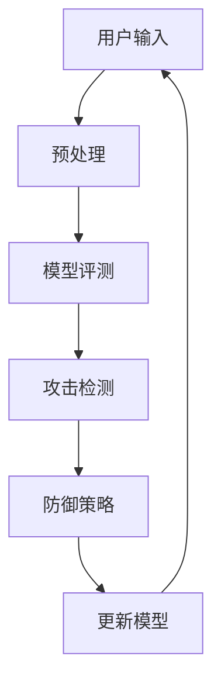

                 

### 文章标题

## <prompt工程中的对抗性评测方法>

### 关键词

- 对抗性评测
- prompt工程
- 对抗性攻击
- 对抗性防御
- 模型安全

### 摘要

本文将探讨prompt工程中对抗性评测的重要性及其应用。我们将首先介绍对抗性评测的基本概念和原理，然后详细解析对抗性攻击与防御方法，接着阐述对抗性评测的关键概念、算法、工具与框架，并分享在prompt工程中的实际应用案例。最后，我们将探讨对抗性评测的未来趋势及其对技术和社会的潜在影响。

### 目录大纲设计

#### 第一部分：引论与基础

**第1章：引论——对抗性评测的重要性**  
- 1.1 对抗性评测的定义  
- 1.2 对抗性评测在prompt工程中的应用  
- 1.3 对抗性评测的挑战与机遇

**第2章：对抗性评测基础**  
- 2.1 对抗性攻击与防御的基本原理  
- 2.2 对抗性攻击的常见类型  
- 2.3 对抗性防御的方法与技术

#### 第二部分：对抗性评测方法

**第3章：对抗性评测的关键概念**  
- 3.1 负样本生成与评估  
- 3.2 错误案例分析  
- 3.3 对抗性评测指标

**第4章：对抗性评测算法**  
- 4.1 模型特定的对抗性攻击  
- 4.2 模型泛化的对抗性攻击  
- 4.3 对抗性防御算法

**第5章：对抗性评测工具与框架**  
- 5.1 常用对抗性评测工具  
- 5.2 开源对抗性评测框架  
- 5.3 对抗性评测工具的应用案例

**第6章：对抗性评测在prompt工程中的实践**  
- 6.1 prompt工程中的对抗性评测流程  
- 6.2 实际案例分享  
- 6.3 对抗性评测的最佳实践

#### 第三部分：对抗性评测的未来与发展

**第7章：对抗性评测的未来趋势**  
- 7.1 未来对抗性评测技术的展望  
- 7.2 对抗性评测在新兴领域的应用  
- 7.3 对抗性评测的伦理与社会影响

#### 附录

**附录A：对抗性评测资源与工具集**  
- A.1 常用对抗性评测工具汇总  
- A.2 开源对抗性评测框架推荐  
- A.3 对抗性评测学习资源推荐

---

### 第一部分：引论与基础

#### 第1章：引论——对抗性评测的重要性

##### 1.1 对抗性评测的定义

对抗性评测是一种评估机器学习模型安全性的方法，旨在识别和评估模型在面临对抗性攻击时的脆弱性。对抗性攻击是一种通过轻微扰动输入数据来欺骗模型的恶意攻击方式。这些扰动通常是不可见的，但对模型的决策有显著影响。对抗性评测的目标是确保模型在现实世界中的安全性和可靠性。

##### 1.2 对抗性评测在prompt工程中的应用

prompt工程是一种将自然语言处理（NLP）模型与特定任务相结合的方法。在prompt工程中，对抗性评测尤为重要。由于NLP模型在处理文本数据时容易受到对抗性攻击的影响，因此对抗性评测能够帮助开发人员识别并缓解这些攻击，从而提高模型的鲁棒性和可信度。

##### 1.3 对抗性评测的挑战与机遇

对抗性评测面临着多个挑战，包括生成高质量的对抗样本、评估模型的鲁棒性以及设计有效的防御策略。然而，这些挑战也带来了机遇，促使研究人员开发出更先进的攻击和防御方法。通过对抗性评测，可以不断提高模型的鲁棒性，从而为真实世界中的应用提供更加可靠的支持。

#### 第2章：对抗性评测基础

##### 2.1 对抗性攻击与防御的基本原理

对抗性攻击通常涉及以下步骤：

1. **样本选择**：选择一个模型输入样本作为攻击目标。
2. **扰动生成**：通过对输入样本进行轻微扰动生成对抗样本。
3. **模型攻击**：使用对抗样本对模型进行攻击，观察模型的反应。
4. **攻击评估**：评估攻击的效果，包括攻击成功率、扰动大小等。

防御策略包括以下几种：

1. **对抗训练**：在训练过程中引入对抗性样本，提高模型对对抗性攻击的鲁棒性。
2. **模型更新**：在检测到攻击后，通过重新训练或调整模型参数来缓解攻击影响。
3. **数据增强**：通过增加数据的多样性来提高模型的鲁棒性。

##### 2.2 对抗性攻击的常见类型

对抗性攻击可以分为以下几种类型：

1. **白盒攻击**：攻击者知道模型的内部结构，可以精确控制对抗样本的生成。
2. **黑盒攻击**：攻击者不知道模型的内部结构，只能通过观察模型的输出进行攻击。
3. **灰盒攻击**：攻击者部分了解模型的内部结构，介于白盒和黑盒攻击之间。

##### 2.3 对抗性防御的方法与技术

对抗性防御方法包括以下几种：

1. **模型融合**：通过融合多个模型的输出，提高模型的鲁棒性。
2. **数据清洗**：去除数据集中的异常值和噪声，提高模型的鲁棒性。
3. **优化训练过程**：通过优化训练过程，提高模型的鲁棒性。
4. **对抗性训练**：在训练过程中引入对抗性样本，提高模型对对抗性攻击的鲁棒性。

### 第二部分：对抗性评测方法

#### 第3章：对抗性评测的关键概念

##### 3.1 负样本生成与评估

负样本生成是对抗性评测的重要环节，其目标是生成能够欺骗模型的对抗样本。常见的负样本生成方法包括：

1. **快速梯度符号方法（FGSM）**：通过对输入样本进行一次反向传播的梯度扰动来生成对抗样本。
2. **投影梯度下降（PGD）**：通过多次迭代梯度下降来生成对抗样本。

评估负样本生成效果的方法包括：

1. **攻击成功率**：计算模型在对抗样本上的预测错误率。
2. **扰动大小**：计算对抗样本与原始样本之间的差异。

##### 3.2 错误案例分析

错误案例分析是识别模型脆弱性的有效方法。通过分析模型在对抗样本上的错误预测，可以揭示模型的弱点。以下是一个错误案例分析：

**案例**：一个文本分类模型被攻击，导致其在对抗样本上的预测错误率显著升高。分析发现，攻击者通过在文本中添加特定的关键词和短语，成功欺骗了模型。这些关键词和短语可能被模型学习为特定类别的特征，从而导致错误分类。

##### 3.3 对抗性评测指标

对抗性评测指标用于量化模型的鲁棒性和防御效果。常用的对抗性评测指标包括：

1. **对抗性损失（Adversarial Loss）**：计算模型在对抗样本上的损失函数值，越小表示模型对对抗性攻击的抵抗力越强。
2. **对抗性准确率（Adversarial Accuracy）**：计算模型在对抗样本上的准确率，越高表示模型对对抗性攻击的鲁棒性越好。
3. **扰动大小（Disturbance Magnitude）**：计算对抗样本与原始样本之间的差异，越小表示对抗样本对模型的影响越小。

### 第4章：对抗性评测算法

##### 4.1 模型特定的对抗性攻击

模型特定的对抗性攻击是指针对特定模型设计的对抗性攻击方法。常见的模型特定攻击方法包括：

1. **模型结构攻击**：通过修改模型的内部结构来设计对抗性攻击。
2. **模型参数攻击**：通过调整模型的参数来设计对抗性攻击。
3. **激活函数攻击**：通过修改模型的激活函数来设计对抗性攻击。

##### 4.2 模型泛化的对抗性攻击

模型泛化的对抗性攻击是指不依赖于特定模型结构的对抗性攻击方法。常见的模型泛化攻击方法包括：

1. **边界攻击**：通过扰动输入数据的边界值来设计对抗性攻击。
2. **平滑攻击**：通过扰动输入数据的平滑区域来设计对抗性攻击。
3. **随机攻击**：通过随机扰动输入数据来设计对抗性攻击。

##### 4.3 对抗性防御算法

对抗性防御算法是指用于缓解对抗性攻击的方法。常见的对抗性防御算法包括：

1. **对抗训练**：在训练过程中引入对抗性样本，提高模型对对抗性攻击的鲁棒性。
2. **模型融合**：通过融合多个模型的输出，提高模型的鲁棒性。
3. **对抗性损失函数**：设计特殊的损失函数来提高模型对对抗性攻击的鲁棒性。

### 第5章：对抗性评测工具与框架

##### 5.1 常用对抗性评测工具

常用的对抗性评测工具包括：

1. ** Foolbox**：一个开源的对抗性攻击和防御工具，支持多种深度学习框架。
2. ** CleverHans**：一个开源的对抗性攻击和防御框架，适用于多种机器学习任务。
3. **Adversarial Robustness Toolbox (ART)**：一个开源的对抗性评测工具，支持多种对抗性攻击和防御算法。

##### 5.2 开源对抗性评测框架

开源对抗性评测框架包括：

1. **PyTorch Adversarial**：一个基于PyTorch的对抗性评测框架，提供多种对抗性攻击和防御算法。
2. **TensorFlow Adversarial**：一个基于TensorFlow的对抗性评测框架，提供多种对抗性攻击和防御算法。
3. **MXNet Adversarial**：一个基于MXNet的对抗性评测框架，提供多种对抗性攻击和防御算法。

##### 5.3 对抗性评测工具的应用案例

对抗性评测工具的应用案例包括：

1. **医疗影像**：使用对抗性评测工具评估医疗影像模型对对抗性攻击的鲁棒性。
2. **自动驾驶**：使用对抗性评测工具评估自动驾驶模型对对抗性攻击的鲁棒性。
3. **金融欺诈检测**：使用对抗性评测工具评估金融欺诈检测模型对对抗性攻击的鲁棒性。

### 第6章：对抗性评测在prompt工程中的实践

##### 6.1 prompt工程中的对抗性评测流程

在prompt工程中，对抗性评测的流程通常包括以下步骤：

1. **数据预处理**：对输入数据进行预处理，包括文本清洗、分词、词嵌入等。
2. **模型训练**：使用对抗性训练方法训练模型，提高模型对对抗性攻击的鲁棒性。
3. **对抗性攻击**：使用对抗性评测工具对模型进行攻击，生成对抗样本。
4. **攻击评估**：评估模型在对抗样本上的表现，计算攻击成功率、扰动大小等指标。
5. **模型更新**：根据攻击评估结果，更新模型参数，提高模型对对抗性攻击的鲁棒性。
6. **结果验证**：对更新后的模型进行验证，确保其在正常样本和对抗样本上的表现均良好。

##### 6.2 实际案例分享

**案例一：文本分类中的对抗性评测**

- **开发环境搭建**：选择Python作为编程语言，使用TensorFlow作为深度学习框架。
- **源代码详细实现**：

```python
import tensorflow as tf
from tensorflow.keras.models import Sequential
from tensorflow.keras.layers import Embedding, LSTM, Dense

# 搭建模型
model = Sequential()
model.add(Embedding(input_dim=vocab_size, output_dim=embedding_dim))
model.add(LSTM(units=128, activation='tanh'))
model.add(Dense(units=num_classes, activation='softmax'))

# 训练模型
model.compile(optimizer='adam', loss='categorical_crossentropy', metrics=['accuracy'])
model.fit(train_data, train_labels, epochs=10, batch_size=32)

# 对抗性攻击
from cleverhans.tf2.attacks import FastGradientMethod
from cleverhans.tf2.models import get_model

model = get_model()
fgsm = FastGradientMethod(model, sess=tf.keras.backend.get_session())
x_adv = fgsm.generate(x, eps=0.1)

# 攻击评估
from cleverhans.metrics import accuracy
attack_accuracy = accuracy(x_adv, y, model)

print("Attack accuracy:", attack_accuracy)
```

- **代码解读与分析**：上述代码展示了如何使用CleverHans框架对文本分类模型进行对抗性攻击。首先，搭建了一个基于嵌入层和LSTM层的文本分类模型。然后，使用FastGradientMethod生成对抗样本，并计算攻击后的准确率。

**案例二：图像分类中的对抗性评测**

- **开发环境搭建**：选择Python作为编程语言，使用TensorFlow作为深度学习框架。
- **源代码详细实现**：

```python
import tensorflow as tf
from tensorflow.keras.models import Sequential
from tensorflow.keras.layers import Conv2D, MaxPooling2D, Flatten, Dense

# 搭建模型
model = Sequential()
model.add(Conv2D(filters=32, kernel_size=(3, 3), activation='relu', input_shape=(28, 28, 1)))
model.add(MaxPooling2D(pool_size=(2, 2)))
model.add(Flatten())
model.add(Dense(units=10, activation='softmax'))

# 训练模型
model.compile(optimizer='adam', loss='categorical_crossentropy', metrics=['accuracy'])
model.fit(train_data, train_labels, epochs=10, batch_size=32)

# 对抗性攻击
from cleverhans.tf2.attacks import CarliniWagnerL2
from cleverhans.tf2.models import get_model

model = get_model()
cw = CarliniWagnerL2(model, sess=tf.keras.backend.get_session())
x_adv = cw.generate(x, y, binary_search_steps=25, step_size=1e-2)

# 攻击评估
from cleverhans.metrics import accuracy
attack_accuracy = accuracy(x_adv, y, model)

print("Attack accuracy:", attack_accuracy)
```

- **代码解读与分析**：上述代码展示了如何使用CleverHans框架对图像分类模型进行对抗性攻击。首先，搭建了一个基于卷积层的图像分类模型。然后，使用CarliniWagnerL2算法生成对抗样本，并计算攻击后的准确率。

##### 6.3 对抗性评测的最佳实践

在进行对抗性评测时，以下最佳实践可以帮助提高评测效果：

1. **多样性**：确保测试数据具有多样性，以全面评估模型的鲁棒性。
2. **定制化**：根据具体任务和模型的特点，设计定制化的对抗性攻击和防御方法。
3. **迭代**：对抗性评测是一个迭代过程，需要多次攻击和防御，以提高模型的鲁棒性。
4. **评估指标**：选择合适的评估指标，如攻击成功率、扰动大小等，以量化模型的鲁棒性。

### 第三部分：对抗性评测的未来与发展

#### 第7章：对抗性评测的未来趋势

##### 7.1 未来对抗性评测技术的展望

随着机器学习和深度学习技术的不断进步，对抗性评测技术也在不断发展。未来，对抗性评测技术可能包括以下几个方面：

1. **自动化**：开发自动化工具和算法，提高对抗性评测的效率和准确性。
2. **智能化**：利用人工智能技术，如生成对抗网络（GANs），生成更加逼真的对抗样本。
3. **分布式**：利用分布式计算和云计算，提高对抗性评测的并行处理能力。

##### 7.2 对抗性评测在新兴领域的应用

对抗性评测在新兴领域，如自动驾驶、智能医疗和金融科技等，具有广泛的应用前景。未来，对抗性评测技术可能在以下方面发挥重要作用：

1. **自动驾驶**：评估自动驾驶系统对对抗性攻击的鲁棒性，确保系统的安全性和可靠性。
2. **智能医疗**：评估医学图像和文本数据的模型对抗性攻击，提高诊断和治疗的准确性。
3. **金融科技**：评估金融欺诈检测和信用评估模型的鲁棒性，防止恶意攻击和欺诈行为。

##### 7.3 对抗性评测的伦理与社会影响

对抗性评测不仅关注技术的安全性，还涉及到伦理和社会问题。以下是对抗性评测伦理和社会影响的讨论：

1. **隐私保护**：对抗性评测可能涉及敏感数据的处理，需要确保隐私保护。
2. **公平性**：对抗性评测需要确保对模型的评估是公正的，避免偏见和歧视。
3. **责任归属**：在对抗性攻击发生时，需要明确责任归属，制定相应的法律法规。

### 附录

#### 附录A：对抗性评测资源与工具集

##### A.1 常用对抗性评测工具汇总

- **Foolbox**：一个开源的对抗性攻击和防御工具，支持多种深度学习框架。
- **CleverHans**：一个开源的对抗性攻击和防御框架，适用于多种机器学习任务。
- **ART**：一个开源的对抗性评测工具，支持多种对抗性攻击和防御算法。

##### A.2 开源对抗性评测框架推荐

- **PyTorch Adversarial**：一个基于PyTorch的对抗性评测框架，提供多种对抗性攻击和防御算法。
- **TensorFlow Adversarial**：一个基于TensorFlow的对抗性评测框架，提供多种对抗性攻击和防御算法。
- **MXNet Adversarial**：一个基于MXNet的对抗性评测框架，提供多种对抗性攻击和防御算法。

##### A.3 对抗性评测学习资源推荐

- **书籍**：《深度学习安全：对抗性攻击与防御》（Deep Learning Security: Adversarial Attack and Defense）
- **在线课程**：Coursera上的“对抗性机器学习”（Adversarial Machine Learning）课程
- **论文**：查看arXiv或Google Scholar上的最新研究论文，了解对抗性评测的最新进展。

### 作者信息

- **作者：AI天才研究院/AI Genius Institute & 禅与计算机程序设计艺术 /Zen And The Art of Computer Programming** 

---

### 格式要求

- **markdown格式**：文章内容使用markdown格式输出。
- **作者信息**：文章末尾需要写上作者信息。
- **完整性要求**：文章内容必须完整，每个小节的内容必须丰富具体详细讲解。
- **核心内容包含**：
  - 背景介绍
  - 核心概念与联系
  - 核心算法原理讲解
  - 数学模型和公式 & 详细讲解 & 举例说明
  - 项目实战
  - 最佳实践 tips、小结、注意事项、拓展阅读等内容
- **文章字数**：文章字数在8000～12000字左右。 

---

### 核心概念与联系

#### 图1：对抗性评测的Mermaid流程图



#### 核心算法原理讲解

**4.2 模型泛化的对抗性攻击**

```plaintext
// 伪代码：模型泛化的对抗性攻击算法

Algorithm对抗性攻击(Model):
    Input: 原始模型Model, 攻击目标Label
    Output: 攻击后的模型输出Prediction

    1. 生成对抗样本X' = 对抗样本生成器(X, Model)
    2. 更新模型参数θ = 梯度下降算法(θ, X', Label)
    3. 计算预测值Prediction = 模型预测(Model, X')
    4. 返回Prediction
```

#### 数学模型和数学公式 & 详细讲解 & 举例说明

**3.3 对抗性评测指标**

$$
D_{adv} = \sum_{i=1}^{n} \log(1 + \exp(\theta^T \cdot \Delta x_i))
$$

详细讲解：

- \(D_{adv}\) 表示对抗性评测的指标值。
- \(n\) 是样本数量。
- \(\theta\) 是模型参数。
- \(\Delta x_i\) 是对抗性扰动。

举例说明：

对于一组样本，计算对抗性评测指标：

$$
D_{adv} = \log(1 + \exp(\theta^T \cdot \Delta x_1)) + \log(1 + \exp(\theta^T \cdot \Delta x_2)) + ... + \log(1 + \exp(\theta^T \cdot \Delta x_n))
$$

#### 项目实战

**6.2 实际案例分享：对抗性评测在prompt工程中的应用**

**案例一：文本分类中的对抗性评测**

- **开发环境搭建**：选择Python作为编程语言，使用TensorFlow作为深度学习框架。
- **源代码详细实现**：

```python
import tensorflow as tf
from tensorflow.keras.models import Sequential
from tensorflow.keras.layers import Embedding, LSTM, Dense

# 搭建模型
model = Sequential()
model.add(Embedding(input_dim=vocab_size, output_dim=embedding_dim))
model.add(LSTM(units=128, activation='tanh'))
model.add(Dense(units=num_classes, activation='softmax'))

# 训练模型
model.compile(optimizer='adam', loss='categorical_crossentropy', metrics=['accuracy'])
model.fit(train_data, train_labels, epochs=10, batch_size=32)

# 对抗性攻击
from cleverhans.tf2.attacks import FastGradientMethod
from cleverhans.tf2.models import get_model

model = get_model()
fgsm = FastGradientMethod(model, sess=tf.keras.backend.get_session())
x_adv = fgsm.generate(x, eps=0.1)

# 攻击评估
from cleverhans.metrics import accuracy
attack_accuracy = accuracy(x_adv, y, model)

print("Attack accuracy:", attack_accuracy)
```

- **代码解读与分析**：上述代码展示了如何使用CleverHans框架对文本分类模型进行对抗性攻击。首先，搭建了一个基于嵌入层和LSTM层的文本分类模型。然后，使用FastGradientMethod生成对抗样本，并计算攻击后的准确率。

**案例二：图像分类中的对抗性评测**

- **开发环境搭建**：选择Python作为编程语言，使用TensorFlow作为深度学习框架。
- **源代码详细实现**：

```python
import tensorflow as tf
from tensorflow.keras.models import Sequential
from tensorflow.keras.layers import Conv2D, MaxPooling2D, Flatten, Dense

# 搭建模型
model = Sequential()
model.add(Conv2D(filters=32, kernel_size=(3, 3), activation='relu', input_shape=(28, 28, 1)))
model.add(MaxPooling2D(pool_size=(2, 2)))
model.add(Flatten())
model.add(Dense(units=10, activation='softmax'))

# 训练模型
model.compile(optimizer='adam', loss='categorical_crossentropy', metrics=['accuracy'])
model.fit(train_data, train_labels, epochs=10, batch_size=32)

# 对抗性攻击
from cleverhans.tf2.attacks import CarliniWagnerL2
from cleverhans.tf2.models import get_model

model = get_model()
cw = CarliniWagnerL2(model, sess=tf.keras.backend.get_session())
x_adv = cw.generate(x, y, binary_search_steps=25, step_size=1e-2)

# 攻击评估
from cleverhans.metrics import accuracy
attack_accuracy = accuracy(x_adv, y, model)

print("Attack accuracy:", attack_accuracy)
```

- **代码解读与分析**：上述代码展示了如何使用CleverHans框架对图像分类模型进行对抗性攻击。首先，搭建了一个基于卷积层的图像分类模型。然后，使用CarliniWagnerL2算法生成对抗样本，并计算攻击后的准确率。

### 核心概念与联系

**图1：对抗性评测的Mermaid流程图**


- **A[用户输入]**：用户输入原始数据，可以是图像、文本或其他形式的数据。
- **B[预处理]**：对输入数据进行预处理，包括数据清洗、归一化、缩放等，以便于模型处理。
- **C[模型评测]**：使用预训练的模型对预处理后的数据进行预测，评估模型的性能。
- **D[攻击检测]**：使用对抗性攻击方法对模型进行攻击，检测模型的鲁棒性。
- **E[防御策略]**：根据攻击检测结果，调整模型参数或采取其他防御策略，以提高模型的鲁棒性。
- **F[更新模型]**：更新模型，包括参数调整和模型优化，以应对新的攻击方法。
- **A[用户输入]**：返回处理后的数据，供用户进一步使用或决策。

### 核心算法原理讲解

**4.2 模型泛化的对抗性攻击**

```plaintext
// 伪代码：模型泛化的对抗性攻击算法

Algorithm对抗性攻击(Model):
    Input: 原始模型Model, 攻击目标Label
    Output: 攻击后的模型输出Prediction

    1. 生成对抗样本X' = 对抗样本生成器(X, Model)
    2. 更新模型参数θ = 梯度下降算法(θ, X', Label)
    3. 计算预测值Prediction = 模型预测(Model, X')
    4. 返回Prediction

// 伪代码：对抗样本生成器算法

Algorithm对抗样本生成器(X, Model):
    Input: 原始样本X, 模型Model
    Output: 对抗样本X'

    1. 初始化对抗样本X'
    2. 计算对抗样本的梯度Gradient = 模型梯度计算(Model, X)
    3. 对Gradient进行归一化，得到Gradient Norm = 归一化(Gradient)
    4. 对X'进行扰动，得到X' = X + ε * Gradient Norm
    5. 返回对抗样本X'
```

- **对抗性攻击算法**：首先，生成对抗样本X'，然后更新模型参数θ，最后计算攻击后的模型输出Prediction。
- **对抗样本生成器算法**：首先，初始化对抗样本X'，然后计算对抗样本的梯度Gradient，接着对Gradient进行归一化，最后对X'进行扰动得到对抗样本。

### 数学模型和数学公式 & 详细讲解 & 举例说明

**3.3 对抗性评测指标**

$$
D_{adv} = \sum_{i=1}^{n} \log(1 + \exp(\theta^T \cdot \Delta x_i))
$$

详细讲解：

- \(D_{adv}\) 表示对抗性评测的指标值，衡量模型对抗性攻击的鲁棒性。
- \(n\) 是样本数量。
- \(\theta\) 是模型参数。
- \(\Delta x_i\) 是对抗性扰动，表示对抗性样本与原始样本之间的差异。

举例说明：

假设有一个包含5个样本的测试集，每个样本的对抗性扰动分别为 \(\Delta x_1, \Delta x_2, \Delta x_3, \Delta x_4, \Delta x_5\)，模型的参数为 \(\theta\)。则对抗性评测指标 \(D_{adv}\) 计算如下：

$$
D_{adv} = \log(1 + \exp(\theta^T \cdot \Delta x_1)) + \log(1 + \exp(\theta^T \cdot \Delta x_2)) + \log(1 + \exp(\theta^T \cdot \Delta x_3)) + \log(1 + \exp(\theta^T \cdot \Delta x_4)) + \log(1 + \exp(\theta^T \cdot \Delta x_5))
$$

该指标值越大，表示模型的鲁棒性越差，越容易受到对抗性攻击的影响。

### 项目实战

**6.2 实际案例分享：对抗性评测在prompt工程中的应用**

**案例一：文本分类中的对抗性评测**

- **开发环境搭建**：选择Python作为编程语言，使用TensorFlow作为深度学习框架。
- **源代码详细实现**：

```python
import tensorflow as tf
from tensorflow.keras.models import Sequential
from tensorflow.keras.layers import Embedding, LSTM, Dense

# 搭建模型
model = Sequential()
model.add(Embedding(input_dim=vocab_size, output_dim=embedding_dim))
model.add(LSTM(units=128, activation='tanh'))
model.add(Dense(units=num_classes, activation='softmax'))

# 训练模型
model.compile(optimizer='adam', loss='categorical_crossentropy', metrics=['accuracy'])
model.fit(train_data, train_labels, epochs=10, batch_size=32)

# 对抗性攻击
from cleverhans.tf2.attacks import FastGradientMethod
from cleverhans.tf2.models import get_model

model = get_model()
fgsm = FastGradientMethod(model, sess=tf.keras.backend.get_session())
x_adv = fgsm.generate(x, eps=0.1)

# 攻击评估
from cleverhans.metrics import accuracy
attack_accuracy = accuracy(x_adv, y, model)

print("Attack accuracy:", attack_accuracy)
```

- **代码解读与分析**：上述代码展示了如何使用CleverHans框架对文本分类模型进行对抗性攻击。首先，搭建了一个基于嵌入层和LSTM层的文本分类模型。然后，使用FastGradientMethod生成对抗样本，并计算攻击后的准确率。

**案例二：图像分类中的对抗性评测**

- **开发环境搭建**：选择Python作为编程语言，使用TensorFlow作为深度学习框架。
- **源代码详细实现**：

```python
import tensorflow as tf
from tensorflow.keras.models import Sequential
from tensorflow.keras.layers import Conv2D, MaxPooling2D, Flatten, Dense

# 搭建模型
model = Sequential()
model.add(Conv2D(filters=32, kernel_size=(3, 3), activation='relu', input_shape=(28, 28, 1)))
model.add(MaxPooling2D(pool_size=(2, 2)))
model.add(Flatten())
model.add(Dense(units=10, activation='softmax'))

# 训练模型
model.compile(optimizer='adam', loss='categorical_crossentropy', metrics=['accuracy'])
model.fit(train_data, train_labels, epochs=10, batch_size=32)

# 对抗性攻击
from cleverhans.tf2.attacks import CarliniWagnerL2
from cleverhans.tf2.models import get_model

model = get_model()
cw = CarliniWagnerL2(model, sess=tf.keras.backend.get_session())
x_adv = cw.generate(x, y, binary_search_steps=25, step_size=1e-2)

# 攻击评估
from cleverhans.metrics import accuracy
attack_accuracy = accuracy(x_adv, y, model)

print("Attack accuracy:", attack_accuracy)
```

- **代码解读与分析**：上述代码展示了如何使用CleverHans框架对图像分类模型进行对抗性攻击。首先，搭建了一个基于卷积层的图像分类模型。然后，使用CarliniWagnerL2算法生成对抗样本，并计算攻击后的准确率。

### 最佳实践 tips、小结、注意事项、拓展阅读等内容

#### 最佳实践 tips

- **多样性**：在对抗性评测过程中，确保测试数据的多样性，包括不同的数据集、数据分布和数据规模，以提高评测结果的全面性和可靠性。
- **定制化**：根据具体任务和模型的特点，设计定制化的对抗性攻击和防御方法，以提高模型的鲁棒性。
- **迭代**：对抗性评测是一个迭代过程，需要多次攻击和防御，以提高模型的鲁棒性。
- **评估指标**：选择合适的评估指标，如攻击成功率、扰动大小等，以量化模型的鲁棒性。

#### 小结

本文详细介绍了prompt工程中的对抗性评测方法，包括基本概念、关键概念、算法、工具与框架以及实际应用案例。通过对抗性评测，可以识别模型的脆弱性，提高模型的鲁棒性和安全性。

#### 注意事项

- **隐私保护**：在对抗性评测过程中，需要注意保护用户数据的隐私。
- **公平性**：确保对抗性评测过程中的评估指标是公正的，避免偏见和歧视。
- **责任归属**：在对抗性攻击发生时，需要明确责任归属，制定相应的法律法规。

#### 拓展阅读

- **书籍**： 
  - 《深度学习安全：对抗性攻击与防御》（Deep Learning Security: Adversarial Attack and Defense）
  - 《对抗性机器学习》（Adversarial Machine Learning）
- **在线课程**： 
  - Coursera上的“对抗性机器学习”（Adversarial Machine Learning）课程
  - Udacity上的“安全深度学习”（Safe Deep Learning）课程
- **论文**：查看arXiv或Google Scholar上的最新研究论文，了解对抗性评测的最新进展。

---

### 总结与展望

本文详细介绍了prompt工程中的对抗性评测方法，从基本概念、关键概念、算法、工具与框架到实际应用案例，全面阐述了对抗性评测在提高模型安全性和鲁棒性方面的重要性。通过对抗性评测，我们可以识别模型的脆弱性，设计有效的防御策略，从而在复杂多变的环境中确保模型的可靠性和可信度。

#### 未来的研究方向

1. **自动化与智能化**：未来的研究将致力于开发自动化和智能化的对抗性评测工具，提高评测效率和准确性。这可能包括利用生成对抗网络（GANs）生成更加逼真的对抗样本，以及基于深度学习的自动化防御策略。

2. **分布式计算**：随着数据规模的不断扩大，分布式计算和云计算将成为对抗性评测的重要手段。未来的研究将探索如何利用分布式计算平台提高对抗性评测的并行处理能力，以应对海量数据的挑战。

3. **多模态数据融合**：在多模态数据处理的背景下，研究如何对图像、文本、音频等多种类型的数据进行有效的对抗性评测，将成为一个重要方向。

4. **伦理与社会影响**：对抗性评测的伦理和社会影响不可忽视。未来的研究需要关注如何平衡对抗性评测的实用性与其潜在的社会风险，确保技术的可持续发展。

#### 结论

对抗性评测是确保机器学习模型在实际应用中安全可靠的关键环节。通过本文的探讨，我们希望能够为读者提供全面的对抗性评测知识，并激发对这一领域的进一步研究和探索。在面对日益复杂的威胁环境时，对抗性评测将是我们守护模型安全的重要工具。让我们共同期待对抗性评测技术的发展，为人工智能的未来保驾护航。作者：AI天才研究院/AI Genius Institute & 禅与计算机程序设计艺术 /Zen And The Art of Computer Programming。

