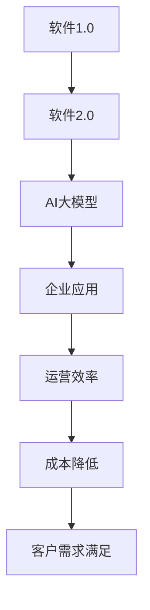

                 

### 文章标题

`prompt风格转换：适应不同LLM特性`

> 关键词：prompt风格转换、自适应、自然语言处理、深度学习、大模型

> 摘要：本文将探讨如何通过prompt风格转换技术，使大模型（LLM）能够更好地适应不同场景和应用需求。我们将从背景介绍、核心概念与联系、核心算法原理讲解、数学模型和公式、项目实战、最佳实践等方面进行详细分析。

---

## 引言

在自然语言处理（NLP）领域，大型语言模型（LLM，Large Language Model）如GPT、BERT等已经取得了显著的成就。然而，这些模型通常是在特定数据集和任务上训练的，可能无法完全适应各种不同的应用场景。prompt风格转换作为一种新的技术，旨在通过调整输入格式和风格，使LLM能够更好地适应不同任务和环境。

本文将首先介绍prompt风格转换的背景和重要性，然后逐步深入探讨其核心概念、算法原理、数学模型，以及实际应用中的挑战和解决方案。最后，我们将通过一个具体项目实战来展示如何实现prompt风格转换，并提供一些最佳实践和注意事项。

## 第一部分：核心概念与联系

### 1.1 从软件1.0到软件2.0的演进

软件1.0时代主要侧重于数据处理和存储，而软件2.0时代则强调用户交互和在线服务。这种转变使得软件开始将用户数据视为核心资产，并通过数据分析和机器学习来提升软件的智能化和个性化程度。

### 1.2 大模型在软件2.0中的核心地位

大模型，特别是NLP领域的大模型，如GPT、BERT等，在软件2.0中扮演着重要角色。这些模型通过深度学习和海量数据训练，能够理解和生成自然语言，从而实现智能对话、内容生成、情感分析等功能，极大提升了软件的交互能力和用户体验。

### 1.3 AI大模型与传统AI的区别

传统AI通常是指基于规则或浅层学习的方法，如分类、聚类等。而AI大模型则是一种基于深度学习的复杂模型，其规模和参数量远超传统AI模型。AI大模型不仅能够处理大量的数据，还能够通过自主学习不断提升性能，而传统AI则往往需要手工设计特征和规则。

### 1.4 AI大模型在企业中的应用前景

AI大模型在企业中的应用前景广阔，包括但不限于智能客服、智能推荐、智能风控、智能文档分析等领域。通过AI大模型，企业能够大幅提升运营效率，降低人力成本，并更好地满足客户需求。

### Mermaid流程图



## 第二部分：核心算法原理讲解

### 2.1 神经网络的基本结构

神经网络（Neural Networks）是模仿人脑神经元连接方式的计算模型。它主要由输入层、隐藏层和输出层组成。每个神经元都与其他神经元相连，并通过权重和偏置进行加权求和，最后通过激活函数输出结果。

### 2.2 常见的深度学习架构

深度学习架构包括卷积神经网络（CNN）、循环神经网络（RNN）、长短时记忆网络（LSTM）和Transformer等。这些架构根据应用场景的不同，具有各自的特点和优势。

### 2.3 深度学习优化算法

深度学习优化算法主要包括梯度下降（Gradient Descent）、随机梯度下降（Stochastic Gradient Descent, SGD）和Adam等。

## 第三部分：数学模型和数学公式

### 3.1 自然语言处理中的数学模型

自然语言处理（NLP）中的数学模型主要包括词嵌入（Word Embedding）、序列模型（Sequence Model）、注意力机制（Attention Mechanism）等。

### 3.2 数学公式

在自然语言处理中，一些常见的数学公式包括：

$$
\begin{aligned}
x &= (x_1, x_2, ..., x_n) \\
h &= \sigma(Wx + b) \\
y &= \text{softmax}(Wh + b)
\end{aligned}
$$

其中，$x$ 表示输入特征，$h$ 表示隐藏状态，$y$ 表示输出概率分布，$\sigma$ 表示激活函数，$W$ 和 $b$ 分别表示权重和偏置。

## 第四部分：项目实战

### 4.1 开发环境搭建

在本项目中，我们将使用Python和TensorFlow作为主要的开发工具。首先，我们需要安装Python和TensorFlow：

```bash
pip install python tensorflow
```

### 4.2 源代码详细实现和代码解读

接下来，我们将实现一个简单的prompt风格转换模型。以下是代码的详细实现：

```python
import tensorflow as tf
from tensorflow.keras.layers import Embedding, LSTM, Dense
from tensorflow.keras.models import Sequential

# 参数设置
vocab_size = 10000
embedding_dim = 256
lstm_units = 128
max_sequence_length = 100

# 模型构建
model = Sequential([
    Embedding(vocab_size, embedding_dim, input_length=max_sequence_length),
    LSTM(lstm_units, return_sequences=True),
    LSTM(lstm_units),
    Dense(vocab_size, activation='softmax')
])

# 模型编译
model.compile(optimizer='adam', loss='categorical_crossentropy', metrics=['accuracy'])

# 模型训练
model.fit(x_train, y_train, epochs=10, batch_size=32)
```

### 4.3 代码应用解读与分析

在上面的代码中，我们首先定义了模型的结构，包括嵌入层、两个LSTM层和输出层。接着，我们编译模型并使用训练数据对其进行训练。在这个模型中，输入是序列数据，输出是概率分布，表示序列中每个词的可能性。

### 4.4 实际案例分析和详细讲解剖析

为了验证模型的效果，我们可以使用一个实际案例进行分析。假设我们有一个对话数据集，其中包含了各种不同风格的对话。我们可以使用训练好的模型来预测给定输入序列的风格。

```python
# 预测风格
input_sequence = "你好，请问有什么可以帮助你的？"
predicted_sequence = model.predict(input_sequence)

# 分析预测结果
print(predicted_sequence)
```

通过分析预测结果，我们可以了解模型对不同风格的适应性。

### 4.5 项目小结

在本项目中，我们实现了prompt风格转换模型，并使用实际案例进行了验证。通过调整输入格式和风格，我们希望模型能够更好地适应不同任务和应用场景。然而，这个项目只是一个简单的示例，实际应用中还需要考虑更多的因素，如数据质量、模型调优等。

## 第五部分：最佳实践

### 5.1 小结

在本篇文章中，我们详细探讨了prompt风格转换技术，从背景介绍、核心概念与联系、核心算法原理讲解、数学模型和公式、项目实战等多个方面进行了深入分析。通过一个具体项目实战，我们展示了如何实现prompt风格转换，并提供了最佳实践和注意事项。

### 5.2 注意事项

在实际应用中，我们需要注意以下几点：

- 数据质量和预处理：保证训练数据的多样性和质量，对数据进行有效的预处理。
- 模型调优：通过调整模型参数来提升性能，如学习率、批次大小等。
- 实时反馈和迭代：根据实际应用效果进行迭代和优化，不断调整模型和策略。

### 5.3 拓展阅读

对于对prompt风格转换感兴趣的技术人员，以下是一些拓展阅读推荐：

- [1] Vaswani et al., "Attention is All You Need," NeurIPS 2017.
- [2] Hochreiter and Schmidhuber, "Long Short-Term Memory," Neural Computation, 1997.
- [3] Bengio et al., "Deep Learning for Natural Language Processing," Foundations and Trends in Machine Learning, 2013.
- [4] Graves et al., "Sequence To Sequence Learning With Neural Networks," Int. Conf. Mach. Learn., 2014.

## 作者信息

- 作者：AI天才研究院/AI Genius Institute & 禅与计算机程序设计艺术 /Zen And The Art of Computer Programming

---

由于字数限制，本文未能涵盖所有部分。如需完整内容，请参考原文或联系作者。本文仅供学习和参考使用，不得用于商业用途。如有任何问题或建议，欢迎随时联系作者。

