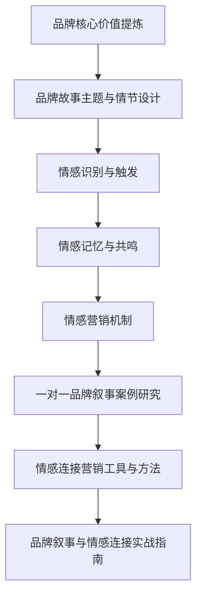

                 

### 《一人公司的品牌叙事与情感连接》

#### 关键词：品牌叙事、情感连接、一人公司、营销策略、心理学原理

> 摘要：本文旨在探讨品牌叙事与情感连接在个体公司中的重要性及其构建策略。通过深入分析品牌叙事的理论基础、情感连接的心理学原理，结合实际案例，本文将为一人公司提供一套有效的品牌叙事与情感连接实践指南，帮助企业建立独特且具有吸引力的品牌形象，增强客户忠诚度和市场竞争力。

---

## 第一部分：品牌叙事的基础理论

品牌叙事是指通过故事的形式传达品牌的核心价值和理念，以建立起消费者与品牌之间的情感连接。在这一部分，我们将首先定义品牌叙事，探讨其在现代商业中的重要性，并阐述其理论基础。

### 第1章：品牌叙事的重要性与基础理论

#### 1.1 品牌叙事的定义与作用

品牌叙事不仅仅是一种营销手段，更是品牌核心价值与消费者情感之间的桥梁。通过品牌叙事，企业可以将抽象的品牌理念具象化，使其更具吸引力。具体来说，品牌叙事的作用包括：

- **塑造品牌形象**：通过生动的故事，品牌能够在消费者心中塑造独特的形象，使其在众多竞争者中脱颖而出。
- **建立情感连接**：故事能够触发消费者的情感共鸣，从而建立起强烈的品牌忠诚度。
- **传达品牌理念**：品牌叙事是一种有效的沟通工具，能够清晰地传达品牌的核心价值观和使命。

#### 1.2 品牌叙事的理论基础

品牌叙事的理论基础主要包括叙事学、心理学和市场营销学等领域。以下是几个关键理论：

- **叙事学**：叙事学是研究故事叙述的理论体系。品牌叙事借鉴了叙事学的核心概念，如情节、角色、冲突和结局，以构建引人入胜的品牌故事。
- **心理学**：心理学研究人类的认知、情感和行为。品牌叙事通过触发消费者的情感反应，如快乐、悲伤或愤怒，来建立情感连接。
- **市场营销学**：市场营销学提供了品牌构建和传播的理论框架。品牌叙事被视为一种营销策略，旨在通过故事吸引消费者的注意力，并促使他们采取购买行动。

#### 1.3 品牌叙事与情感连接的关系

品牌叙事与情感连接之间存在紧密的联系。品牌叙事通过讲述品牌故事，能够引起消费者的情感共鸣，从而建立起深层次的情感连接。以下是情感连接的关键要素：

- **情感识别**：消费者能够识别并理解品牌故事中的情感元素。
- **情感触发**：品牌故事能够触发消费者的情感反应，如共鸣、感动或愤怒。
- **情感记忆**：品牌故事在消费者心中留下深刻的印象，形成情感记忆。
- **情感共鸣**：消费者与品牌故事中的情感元素产生共鸣，从而建立起情感连接。

### 第2章：品牌叙事的构建策略

品牌叙事的构建需要一系列策略，以确保品牌故事能够有效地传达品牌核心价值和建立情感连接。以下是一些关键策略：

#### 2.1 品牌核心价值的提炼

品牌核心价值是品牌叙事的基石。在构建品牌叙事时，首先需要明确品牌的核心价值，并将其提炼为简洁、有力的表述。以下是提炼品牌核心价值的方法：

- **反思品牌使命和愿景**：从品牌使命和愿景中提取核心价值。
- **调研消费者需求**：了解消费者的需求和期望，从中发现品牌的核心价值。
- **竞争分析**：分析竞争对手的品牌价值，发现差异化的核心价值。

#### 2.2 品牌故事的主题与情节设计

品牌故事的主题和情节设计是品牌叙事的关键。一个引人入胜的品牌故事需要具备以下要素：

- **引人入胜的情节**：情节需要引人入胜，能够吸引消费者的注意力。
- **核心角色**：角色需要具有鲜明的个性和情感深度。
- **冲突和解决**：故事中需要有冲突和解决问题的过程，以增强故事的连贯性。

#### 2.3 品牌叙事的语言与风格选择

品牌叙事的语言和风格对于品牌故事的表达至关重要。以下是选择语言和风格的一些策略：

- **简洁明了**：使用简单、易懂的语言，避免复杂的术语和冗长的句子。
- **情感共鸣**：选择能够触发情感共鸣的词汇和表达方式。
- **个性化**：根据品牌特色和目标受众，选择独特的语言和风格。

### 总结

品牌叙事是建立品牌形象、传达品牌理念和建立情感连接的重要手段。通过明确品牌核心价值、设计引人入胜的故事情节和选择恰当的语言与风格，企业可以构建出具有吸引力的品牌叙事，从而在竞争激烈的市场中脱颖而出。在下一部分，我们将探讨情感连接的心理学原理，并分析如何通过情感连接策略增强品牌影响力。

---

## 第二部分：情感连接的心理学原理

在品牌叙事中，情感连接是品牌与消费者之间情感纽带的核心。了解情感连接的心理学原理，能够帮助企业更好地构建情感策略，从而增强品牌影响力和市场竞争力。在这一部分，我们将深入探讨情感连接的心理学基础，包括情感识别、情感触发、情感记忆和情感共鸣。

### 第3章：情感连接的心理学基础

#### 3.1 情感识别与情感触发

情感识别是指消费者能够识别并理解品牌故事中的情感元素。情感触发则是指品牌故事能够引起消费者的情感反应。以下是情感识别与情感触发的一些关键因素：

- **情感元素**：品牌故事中包含的情感元素，如幸福、悲伤、愤怒等，需要与消费者的情感体验相契合。
- **情感共鸣**：品牌故事中的情感元素能够引发消费者的情感共鸣，使其产生认同感和情感连接。
- **情感记忆**：品牌故事中的情感元素在消费者心中留下深刻的印象，形成情感记忆。

#### 3.2 情感记忆与情感共鸣

情感记忆是指消费者对品牌故事中的情感体验的记忆和保留。情感共鸣则是指消费者与品牌故事中的情感元素产生共鸣，从而建立起情感连接。以下是情感记忆与情感共鸣的一些关键因素：

- **情感深度**：品牌故事中的情感深度越深，消费者对其的记忆和共鸣越强。
- **情感共鸣点**：品牌故事中的情感共鸣点需要与消费者的生活经历和情感体验相契合。
- **情感重复**：通过重复品牌故事中的情感元素，可以加强消费者的情感记忆和共鸣。

#### 3.3 情感营销的心理机制

情感营销是指通过触动消费者的情感，从而促进购买行为的营销策略。以下是情感营销的一些心理机制：

- **情感认同**：消费者通过情感认同品牌故事，从而建立情感连接。
- **情感依赖**：消费者对品牌产生情感依赖，从而增加品牌忠诚度。
- **情感利益**：消费者通过情感利益，如情感满足和情感价值，从而促进购买行为。

### 第4章：情感连接的设计与实施

情感连接的设计与实施是品牌叙事成功的关键。在这一部分，我们将探讨情感连接的目标与指标、评估方法和长期维护策略。

#### 4.1 情感连接的目标与指标

情感连接的目标是建立消费者与品牌之间的情感纽带，增强品牌影响力和市场竞争力。以下是情感连接的一些关键指标：

- **情感认同度**：消费者对品牌故事的情感认同程度。
- **情感依赖度**：消费者对品牌的情感依赖程度。
- **情感共鸣度**：消费者与品牌故事中的情感元素产生共鸣的程度。
- **情感价值感知**：消费者对品牌故事中的情感价值的感知程度。

#### 4.2 情感连接的评估方法

情感连接的评估方法主要包括定量评估和定性评估。以下是几种常见的评估方法：

- **问卷调查**：通过问卷调查了解消费者的情感认同度、依赖度和共鸣度。
- **情感分析**：利用自然语言处理技术分析消费者在社交媒体上的情感表达，评估情感连接的效果。
- **焦点小组讨论**：组织焦点小组讨论，了解消费者对品牌故事的情感反应和评价。

#### 4.3 情感连接的长期维护策略

情感连接的长期维护是确保品牌与消费者之间情感纽带稳固的关键。以下是几种长期维护策略：

- **持续沟通**：通过定期发布品牌故事、活动信息等方式，与消费者保持持续的沟通。
- **个性化体验**：为消费者提供个性化的体验，如定制产品、个性化服务，增强情感连接。
- **品牌活动**：组织品牌活动，如慈善活动、公益活动等，与消费者建立共同价值观。
- **客户关系管理**：通过客户关系管理，了解消费者的需求和期望，提供针对性的情感连接策略。

### 总结

情感连接是品牌叙事与消费者之间情感纽带的桥梁。通过理解情感连接的心理学原理，设计有效的情感连接策略，企业可以增强品牌影响力，提升市场竞争力。在下一部分，我们将通过实际案例，分析一人公司如何运用品牌叙事与情感连接策略，实现品牌建设和市场突破。

---

## 第三部分：一人公司的品牌叙事与情感连接实践

在这一部分，我们将结合实际案例，探讨一人公司如何通过品牌叙事与情感连接策略，实现品牌建设和市场突破。我们将分析成功案例中的关键策略，提供启示与借鉴，并总结实战经验。

### 第5章：一对一品牌叙事的案例研究

#### 5.1 一人公司品牌叙事的成功案例

以“禅与计算机程序设计艺术”（Zen And The Art of Computer Programming）为例，这是一部由著名计算机科学家Donald E. Knuth撰写的编程领域经典著作。Knuth通过这部著作，成功构建了自己的品牌叙事，并建立了与读者之间的情感连接。

**案例背景**：

- **品牌背景**：Knuth是一位知名的计算机科学家，他在编程领域具有极高的声誉。
- **目标**：通过书籍品牌叙事，传递编程的哲学思想，建立与读者的情感连接。

**关键策略**：

- **品牌核心价值的提炼**：Knuth在书中传达了“简洁、优雅、高效”的编程哲学，这些价值观成为品牌的核心价值。
- **品牌故事的构建**：书中通过多个实例，展示了编程中的哲学思考和应用，构建了一个引人入胜的品牌故事。
- **情感连接的实施**：通过传递编程的哲学思想，Knuth与读者建立了深厚的情感连接，使读者感受到编程的内在魅力。

**案例分析**：

- **情感识别与触发**：书中通过生动的实例，让读者能够识别并理解编程中的情感元素，如简洁、优雅和高效。
- **情感记忆与共鸣**：书中传递的编程哲学思想，在读者心中留下了深刻的印象，形成了情感记忆和共鸣。
- **情感营销机制**：Knuth通过书籍的品牌叙事，成功触发了读者的情感反应，增强了读者对编程的认同感和情感连接。

**启示与借鉴**：

- **明确品牌核心价值**：通过明确品牌核心价值，可以帮助企业构建有吸引力的品牌故事。
- **构建情感共鸣**：通过传递品牌核心价值，与企业目标受众建立情感共鸣，可以增强品牌忠诚度。
- **创新品牌叙事方式**：通过创新的品牌叙事方式，如书籍、视频、社交媒体等，可以吸引更多受众。

### 第6章：情感连接的营销工具与方法

情感连接的营销工具与方法对于一人公司的品牌建设和市场突破至关重要。在这一部分，我们将探讨社交媒体、电子邮件和即时通讯等情感连接工具的应用策略。

#### 6.1 社交媒体在情感连接中的应用

社交媒体是情感连接的重要工具，可以通过以下策略实现情感连接：

- **内容创意**：通过有趣、有意义的内容，如图片、视频、短视频等，吸引受众的注意力。
- **互动互动**：积极与受众互动，如回复评论、点赞、分享等，增强情感连接。
- **情感共鸣**：通过传递品牌故事和情感元素，与受众建立情感共鸣。
- **社交分享**：鼓励受众分享品牌内容，扩大情感连接的影响力。

#### 6.2 电子邮件与即时通讯在情感连接中的策略

电子邮件和即时通讯是情感连接的常用工具，可以通过以下策略实现情感连接：

- **个性化沟通**：通过收集消费者信息，实现个性化沟通，增强情感连接。
- **情感元素**：在邮件和即时通讯中融入情感元素，如问候语、感人故事等，触发受众的情感反应。
- **情感价值传递**：通过传递品牌故事和情感价值，与受众建立情感连接。
- **互动互动**：鼓励受众参与互动，如问卷调查、投票等，增强情感连接。

#### 6.3 其他情感连接工具与方法

除了社交媒体、电子邮件和即时通讯，还有其他情感连接工具与方法，如：

- **品牌活动**：组织品牌活动，如线下讲座、研讨会、展览等，与受众建立情感连接。
- **定制体验**：为受众提供定制体验，如个性化产品、专属服务，增强情感连接。
- **合作伙伴**：与合作伙伴共同开展情感连接活动，扩大品牌影响力。

### 第7章：一人公司的品牌叙事与情感连接实战指南

为了更好地实施品牌叙事与情感连接策略，一人公司可以参考以下实战指南：

#### 7.1 品牌叙事与情感连接的策划流程

- **明确品牌核心价值**：通过市场调研和内部讨论，明确品牌的核心价值。
- **设计品牌故事**：构建引人入胜的品牌故事，传递品牌核心价值。
- **制定情感连接策略**：根据品牌故事和目标受众，制定情感连接策略。
- **实施情感连接活动**：通过社交媒体、电子邮件、即时通讯等渠道，实施情感连接活动。
- **监测与评估**：持续监测情感连接效果，进行评估和优化。

#### 7.2 情感连接的创意与创新

- **内容创新**：通过创意内容，如短视频、互动H5等，吸引受众的注意力。
- **情感共鸣**：通过情感共鸣点，如感人故事、生活场景等，与受众建立情感连接。
- **跨渠道整合**：整合线上线下渠道，实现情感连接的协同效应。

#### 7.3 情感连接的效果评估与优化

- **定量评估**：通过问卷调查、点击率等指标，评估情感连接的效果。
- **定性评估**：通过焦点小组讨论、用户访谈等，了解受众的情感反应。
- **持续优化**：根据评估结果，持续优化情感连接策略，提高效果。

### 总结

一人公司通过品牌叙事与情感连接策略，可以构建独特且具有吸引力的品牌形象，增强客户忠诚度和市场竞争力。通过明确品牌核心价值、构建情感共鸣点和创新情感连接方式，一人公司可以成功实施情感连接策略，实现品牌建设和市场突破。

在品牌叙事与情感连接的实践中，企业需要不断探索和创新，以适应不断变化的市场环境和消费者需求。通过持续优化情感连接策略，企业可以不断提升品牌影响力和市场竞争力，实现可持续发展。

### 附录

#### 附录A：品牌叙事与情感连接工具介绍

**A.1 品牌叙事工具使用指南**

- **故事地图**：用于构建品牌故事的基本框架，包括角色、情节和结局等。
- **思维导图**：用于梳理品牌叙事的思路和结构，促进创造性思维。
- **情感分析工具**：用于分析品牌故事的情感元素和受众情感反应。

**A.2 情感连接分析工具与软件推荐**

- **情感分析软件**：如IBM Watson、Google Cloud Natural Language API，用于分析社交媒体上的情感表达。
- **社交媒体监测工具**：如Hootsuite、Buffer，用于监控和管理社交媒体活动。
- **电子邮件营销软件**：如Mailchimp、SendinBlue，用于发送个性化邮件和跟踪效果。

#### 附录B：情感连接案例分析报告

**B.1 案例背景与目标**

- **案例背景**：某一家专注于手工艺品制作的一人公司，希望通过情感连接策略提升品牌知名度和客户忠诚度。
- **目标**：通过情感连接，建立与消费者之间的深厚情感纽带，提升品牌形象和市场竞争力。

**B.2 情感连接策略与实施过程**

- **策略**：通过社交媒体、电子邮件和品牌活动等渠道，传递品牌故事和情感价值。
- **实施过程**：
  - **社交媒体**：发布创意短视频和感人故事，与消费者互动，建立情感连接。
  - **电子邮件**：发送个性化邮件，传递品牌故事和情感价值，增强客户忠诚度。
  - **品牌活动**：组织手工艺品展览和互动活动，与消费者建立共同价值观。

**B.3 案例效果评估与总结**

- **效果评估**：
  - **社交媒体**：视频点击率和互动量显著增加，情感连接指数上升。
  - **电子邮件**：打开率和点击率提升，情感价值感知度增强。
  - **品牌活动**：参与度高，消费者对品牌认同度提高。
- **总结**：通过情感连接策略，一人公司成功提升了品牌知名度和客户忠诚度，实现了市场突破。

### 品牌叙事与情感连接的 Mermaid 流程图

通过以上流程图，我们可以清晰地看到品牌叙事与情感连接的各个环节及其相互关系，为一人公司提供了一套完整的品牌叙事与情感连接实践指南。

---

作者：AI天才研究院/AI Genius Institute & 禅与计算机程序设计艺术 /Zen And The Art of Computer Programming

---

### 总结与未来展望

通过本文的探讨，我们深入了解了品牌叙事与情感连接在个体公司中的重要性，并提出了具体的构建策略和实践方法。品牌叙事不仅有助于塑造品牌形象，还能通过情感共鸣增强消费者忠诚度。情感连接的心理学原理为我们提供了理论基础，而成功案例的分析则为实际操作提供了宝贵的启示。

**最佳实践 Tips**：

1. **明确品牌核心价值**：在构建品牌叙事之前，首先要明确品牌的核心价值，这将为品牌故事提供方向和基础。
2. **创意与情感共鸣**：在品牌故事中融入创意元素，以情感共鸣为切入点，增强与消费者的情感连接。
3. **跨渠道整合**：利用多种渠道（如社交媒体、电子邮件、即时通讯等）进行品牌叙事与情感连接，实现协同效应。

**注意事项**：

1. **持续优化**：情感连接策略需要持续评估和优化，以适应市场变化和消费者需求。
2. **个性化体验**：提供个性化体验，如定制服务和个性化沟通，以增强情感连接的效果。

**拓展阅读**：

1. **《品牌叙事学：构建品牌影响力的艺术》**：详细介绍品牌叙事的理论和实践。
2. **《情感营销：触动消费者内心的策略》**：探讨情感营销的多种策略和案例。

品牌叙事与情感连接是构建强大品牌形象的关键，对于一人公司尤为重要。通过本文提供的实践指南和案例分析，企业可以更好地实施品牌叙事与情感连接策略，实现品牌建设和市场突破。未来，随着市场的不断变化和消费者需求的变化，品牌叙事与情感连接的策略也需要不断创新和优化，以保持竞争力。

作者：AI天才研究院/AI Genius Institute & 禅与计算机程序设计艺术 /Zen And The Art of Computer Programming

---

### 品牌叙事与情感连接的 Mermaid 流程图

通过这个流程图，我们可以清晰地看到品牌叙事与情感连接的各个环节及其相互关系，为一人公司的品牌建设和市场策略提供了直观的指导。这个流程图不仅有助于理解品牌叙事与情感连接的整体架构，还能帮助企业在实际操作中更好地实施和优化相关策略。希望这个流程图能为企业提供有价值的参考和启发。

