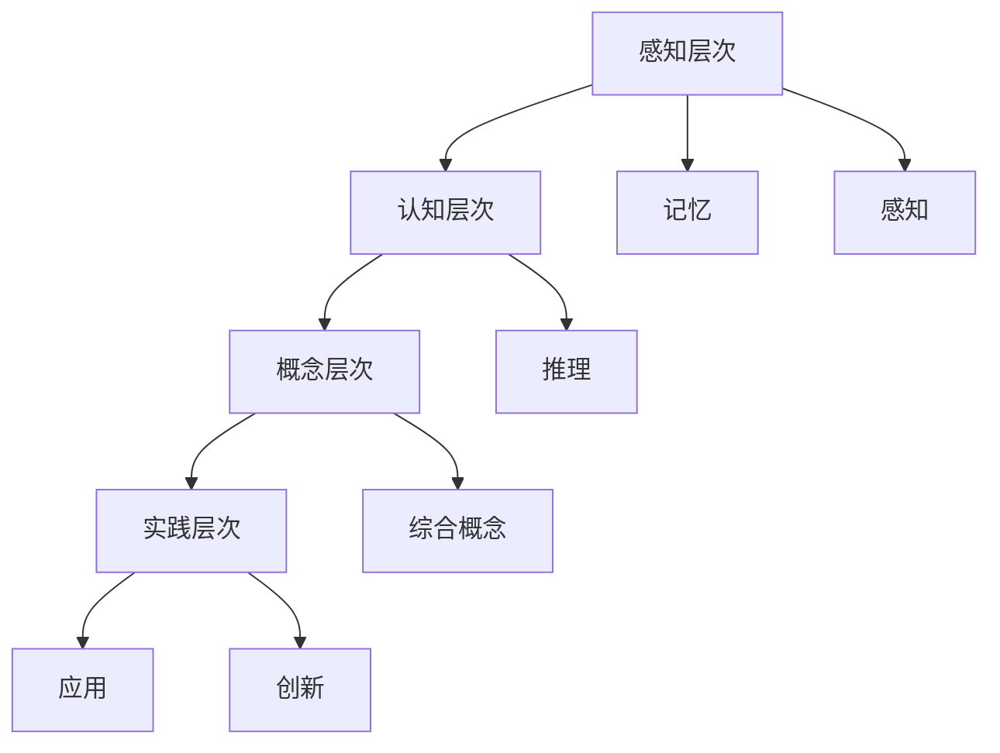

                 

### 引言与背景

**引言**

在当今快速发展的科技时代，世界正变得越来越复杂。人工智能、大数据、量子计算等前沿技术的涌现，使得我们生活在一个充满信息爆炸和知识更新的环境中。然而，尽管技术的进步日新月异，但一个核心问题始终存在：**世界可理解性**。即，我们能否真正理解这个世界，理解我们所创造的技术和系统？

本文将深入探讨“世界可理解性”的概念、意义以及科学交流在提高这一可理解性中的重要性。随着技术不断进步，**如何使复杂的技术和概念变得易于理解**，成为科学家、工程师和教育者面临的重要挑战。

**世界可理解性的重要性**

世界可理解性不仅仅是一个理论问题，它具有深远的社会、经济和科技意义。首先，理解性是创新的基础。只有当人们能够理解现有的技术和系统时，才有可能在此基础上进行改进和创新。其次，理解性有助于提高公众的科学素养，使更多的人能够参与到科技发展中来，从而推动社会的进步。

然而，实现世界可理解性并非易事。在科学交流中，存在许多障碍，如语言障碍、认知障碍和文化差异等。这些障碍使得科学知识难以传播，影响了社会的整体科学素质。

**科学交流的意义**

科学交流是科学发展的关键环节。它不仅包括科学家之间的学术交流，还涵盖科学家与公众之间的交流。有效的科学交流能够促进科学知识的传播，提高公众的科学素养，同时也为科学家提供反馈，促进科学研究的不断进步。

然而，当前的科学交流存在诸多挑战。语言和逻辑的复杂性使得许多科学概念难以被公众理解。此外，不同文化背景下的科学交流也面临诸多障碍。这些问题都需要通过有效的策略和方法来解决。

**本文结构**

本文将分为四个主要部分进行探讨：

1. **引言与背景**：介绍本文的主题和背景，探讨世界可理解性的重要性以及科学交流的意义。
2. **可理解性理论探讨**：深入探讨可理解性的基本理论，包括其定义、层次结构及其与认知科学的关系。
3. **提高可理解性的策略与方法**：介绍提高可理解性的策略和方法，包括清晰性原则、简洁性原则和可视化方法等。
4. **案例分析**：通过案例分析，探讨科学交流的成功和失败，分析其中的原因，并提出相应的改进策略。

通过以上四个部分的深入探讨，本文旨在为科学交流提供有价值的思考和实践指导，帮助科学家、工程师和教育者更好地理解和传播科学知识。

### 第1章：引言与背景

**1.1 书籍主题介绍**

本文的主题是“世界可理解性与科学交流的重要性”，旨在探讨在当今复杂多变的世界中，如何通过科学交流提高世界的可理解性。文章将首先介绍世界可理解性的基本概念，阐述其在科技发展和社会进步中的重要性。随后，文章将深入探讨科学交流中的挑战，如语言障碍、认知障碍和文化差异等，分析这些挑战对科学知识传播和社会发展的负面影响。

**1.2 世界可理解性的重要性**

世界可理解性是指人类对周围世界的理解程度和深度。它不仅涉及到对自然现象的认知，还包括对社会现象的理解。在科技高速发展的今天，世界变得越来越复杂，各种新技术和新概念层出不穷。这些复杂性和多样性使得世界可理解性变得尤为重要。

首先，世界可理解性是创新的基础。科技创新往往基于对现有技术的深入理解和分析。只有当科学家和工程师能够理解现有的技术和系统时，才有可能在此基础上进行改进和创新。例如，在人工智能领域，对神经网络和深度学习的深入理解是推动这一领域不断进步的关键。

其次，世界可理解性有助于提高公众的科学素养。科学素养不仅包括对科学概念的理解，还包括科学思维和科学方法的应用。当公众能够理解科学知识时，他们不仅能够更好地参与到科技发展中来，还能够做出更加明智的科技决策。

最后，世界可理解性对社会发展具有重要意义。一个社会对世界的理解程度越高，其科技水平和社会文明程度也越高。例如，在医疗领域，对疾病的理解和治疗方法的应用直接关系到公共健康水平。在环境科学领域，对气候变化和环境污染的理解直接关系到环境保护和可持续发展。

**1.3 科学交流的意义**

科学交流是科学发展的关键环节。它不仅包括科学家之间的学术交流，还涵盖科学家与公众之间的交流。有效的科学交流能够促进科学知识的传播，提高公众的科学素养，同时也为科学家提供反馈，促进科学研究的不断进步。

首先，科学交流是科学研究的基础。科学家通过学术会议、期刊论文等形式进行交流，分享研究成果和思考，从而推动科学的发展。例如，每年在国际上举办的各类学术会议为科学家提供了一个交流的平台，促进了全球科学界的合作和进步。

其次，科学交流有助于知识的普及和传播。通过科学普及活动和媒体宣传，科学家可以将复杂的科学知识转化为公众易于理解的形式，从而提高公众的科学素养。例如，科普读物、科学节目和社交媒体等都是科学知识传播的重要途径。

最后，科学交流也是社会发展的需求。科技对社会的影响日益深远，公众对科学问题的关注也不断增加。通过有效的科学交流，公众可以更好地理解科技的发展和应用，从而做出更加明智的科技决策。

总之，世界可理解性和科学交流的重要性不容忽视。在本文的后续部分，我们将进一步探讨可理解性的基本理论，分析科学交流中的挑战，并提出提高可理解性的策略与方法，以期为科学交流和科技发展提供有价值的参考和指导。

### 第2章：可理解性的基本理论

**2.1 可理解性的定义与分类**

可理解性是指个体对某一对象或概念的理解程度。在科学领域，可理解性尤为关键，因为它直接影响到科学知识的传播和技术的普及。对可理解性的定义可以从多个维度进行探讨。

首先，从认知心理学的角度来看，可理解性可以定义为个体在感知和思考过程中，对信息进行解码和处理的能力。这种能力受多种因素的影响，包括认知资源、知识储备、注意力分配等。一个概念或信息如果能够迅速被识别和理解，我们就可以说它具有较高的可理解性。

其次，从知识管理的角度来看，可理解性可以定义为知识在传递过程中，从信息源到接收者之间的清晰度和准确性。这种定义强调了信息传递的有效性，即信息是否能够在接收者的大脑中准确无误地解码。

可理解性还可以根据不同的标准进行分类。以下是几种常见的分类方式：

1. **基于认知层次的分类**：
   - **浅层可理解性**：指个体对信息表面的、直观的理解。例如，看到一只猫的照片，知道这是一只猫。
   - **深层可理解性**：指个体对信息背后的逻辑、原理和结构的理解。例如，理解猫的生理结构、行为习性及其生态系统中的角色。

2. **基于信息复杂性的分类**：
   - **简单信息**：易于理解和记忆的信息。例如，一个简单的数学公式或日常用语。
   - **复杂信息**：包含多个层次和复杂结构的知识。例如，高级数学理论或复杂的科学实验结果。

3. **基于交流对象的分类**：
   - **个人可理解性**：个体对信息或概念的理解程度。
   - **群体可理解性**：信息或概念在特定群体中的传播效果和接受程度。

理解这些分类有助于我们更好地设计科学交流和知识传播的策略，确保信息在不同层次和对象中能够有效传递。

**2.2 可理解性的层次结构**

可理解性具有层次结构，不同层次的理解对信息和知识的传递起着关键作用。以下是可理解性的主要层次：

1. **感知层次**：
   - **视觉感知**：通过视觉信息进行理解和识别。例如，看到一张图表，立即明白其含义。
   - **听觉感知**：通过听觉信息进行理解和识别。例如，听一个演讲，理解其主旨和论点。

2. **认知层次**：
   - **记忆**：保存和理解过去经验的能力。例如，通过回忆，理解一个曾经学过的概念。
   - **推理**：使用已有知识和逻辑进行推断的能力。例如，通过推理，理解一个复杂的科学原理。

3. **概念层次**：
   - **基本概念**：对基本科学概念的掌握。例如，理解“能量守恒定律”是什么。
   - **综合概念**：对多个基本概念的整合和理解。例如，理解“生态系统”的概念及其在环境保护中的应用。

4. **实践层次**：
   - **应用**：将理论知识应用于实际问题。例如，使用计算机编程解决实际问题。
   - **创新**：在现有知识的基础上进行创新。例如，基于量子理论开发新的量子计算技术。

了解这些层次有助于我们在设计和传播科学知识时，选择合适的策略和工具，以提高不同层次上的可理解性。

**2.3 可理解性与认知科学的关系**

认知科学是研究人类认知过程的学科，其研究成果对理解可理解性具有重要意义。以下是可理解性与认知科学的几个关键关系：

1. **注意力与可理解性**：
   - 注意力是认知过程中的重要因素。当注意力集中在某一信息时，个体对该信息的理解程度更高。因此，提高注意力的有效性是提高可理解性的重要手段。例如，通过简洁的标题和突出的视觉元素，可以引导读者的注意力，提高阅读材料的可理解性。

2. **记忆与可理解性**：
   - 记忆是理解的基础。通过有效的记忆策略，如重复、联想和分组，可以提高对复杂信息的理解。例如，通过制作思维导图，将复杂的信息以图形化的方式呈现，有助于记忆和理解。

3. **推理与可理解性**：
   - 推理是高级认知能力，它使个体能够从已知信息中推断出新的信息。有效的推理策略，如逻辑分析和类比，可以提高信息的可理解性。例如，通过使用类比，将新的科学概念与已知的概念联系起来，有助于理解和记忆。

4. **认知负荷与可理解性**：
   - 认知负荷是指个体在处理信息时所需的认知资源。当认知负荷过高时，理解能力会降低。因此，设计科学知识和技术传播时，需要考虑认知负荷，确保信息传递的清晰和简洁。例如，通过减少冗余信息和简化语言，可以降低读者的认知负荷，提高可理解性。

通过认知科学的视角，我们可以更深入地理解可理解性的本质，从而为科学交流和知识传播提供更有针对性的策略和方法。

综上所述，可理解性是一个多维度的概念，它在科学交流和技术普及中起着关键作用。通过深入探讨可理解性的基本理论、层次结构和与认知科学的关系，我们可以为提高科学知识的传播效果提供有益的指导。在下一部分中，我们将探讨科学交流中的挑战，分析信息传递障碍、语言障碍和文化差异等因素对科学理解的影响。

### 第3章：科学交流中的挑战

**3.1 信息传递障碍**

科学交流中的信息传递障碍是影响知识传播和科技普及的重要因素。这些障碍包括信息的复杂性、冗余性以及传递过程中的噪声等，使得科学信息难以被广泛理解和接受。

首先，信息的复杂性是一个显著障碍。科学研究往往涉及复杂的理论和模型，如量子力学、相对论等。这些复杂的知识体系不仅需要深厚的学术背景，还需要一定的数学和逻辑推理能力。例如，量子计算虽然具有巨大的理论潜力，但其复杂性使得普通公众难以理解和接受。

其次，信息的冗余性也是一个问题。科学研究中，为了验证某一理论或假设，科学家往往需要进行大量的实验和数据分析。这些冗余信息虽然对于科学研究的精确性和可靠性至关重要，但也会增加信息传递的难度。例如，一项复杂的医学研究可能包含大量的统计分析和实验数据，对于非专业人士来说，这些数据可能难以理解和消化。

此外，传递过程中的噪声也是影响信息传递的重要因素。噪声可以来自多个方面，如语言表达的不清晰、信息处理的错误、传播媒介的限制等。例如，在科学论文的撰写和发表过程中，编辑和校对环节的失误可能导致关键信息的丢失或误传。

为了克服这些信息传递障碍，科学家和教育者可以采取多种策略：

1. **简化信息**：通过简化复杂的科学概念，使其更容易被公众理解。例如，通过使用图表、图像和比喻等手段，将复杂的科学理论以直观的方式呈现。

2. **加强互动**：通过互动式教学和讨论，提高公众对科学信息的理解和兴趣。例如，科学家可以通过在线问答、科普讲座和科学展览等形式，与公众进行面对面的交流。

3. **优化传播媒介**：选择合适的传播媒介，提高科学信息的传播效率和效果。例如，通过社交媒体、科普读物和科学节目等多元化的媒介，将科学知识传达给更广泛的受众。

**3.2 语言与逻辑障碍**

科学交流中的语言和逻辑障碍是另一个重要挑战。科学语言通常具有高度的抽象性和专业性，而普通公众的语言能力往往不足以理解和应用这些复杂术语。此外，逻辑上的模糊和混淆也会影响科学信息的传播和理解。

首先，科学语言的高度抽象性是一个障碍。科学术语往往是对现实世界的简化和抽象，如“量子态”、“黑洞”等。这些术语对于没有专业背景的公众来说，可能难以理解。例如，量子态的叠加原理和量子纠缠等现象，即使对有科学背景的人也具有一定的难度。

其次，科学语言的专业性也是一个问题。许多科学术语和概念都是特定学科内的专有名词，如“微积分”、“基因组学”等。这些术语对于非专业人士来说，可能难以理解其含义和应用。例如，基因组学中的“单核苷酸多态性”（SNP）对于普通公众来说，可能难以理解其在医学研究中的应用。

此外，逻辑上的模糊和混淆也会影响科学信息的传播和理解。例如，一些科学报道可能会因为表述不清或逻辑错误，导致公众对科学事实产生误解。例如，一些媒体可能会错误地将“相关性”与“因果性”混淆，导致公众对科学研究的误解。

为了克服这些语言和逻辑障碍，科学家和教育者可以采取以下策略：

1. **使用通俗易懂的语言**：通过使用简单的词汇和句子结构，将复杂的科学概念转化为公众易于理解的形式。例如，使用比喻和故事化的方式，将科学概念以生动有趣的方式呈现。

2. **提供背景知识**：在传播科学知识时，提供必要的背景信息，帮助公众理解科学术语和概念。例如，在讲解基因编辑技术时，可以首先介绍基因的基本概念，然后再详细解释CRISPR-Cas9技术的原理和应用。

3. **逻辑清晰的表达**：在科学传播中，确保逻辑表达清晰、准确，避免产生混淆和误解。例如，在解释科学实验的结果时，要明确区分“相关性”和“因果性”，避免公众对研究结果的误解。

**3.3 文化差异与科学交流**

文化差异是科学交流中的另一个重要挑战。不同文化背景下的科学观念、语言表达和行为习惯可能存在显著差异，这会影响科学信息的传播和理解。

首先，不同文化对科学和技术的认知和接受程度不同。例如，在一些传统文化中，对科学技术的接受程度可能较低，认为科学是一种西方的“外来物”。这种文化差异可能导致科学知识在这些地区的传播受到阻碍。例如，在一些发展中国家，公众对现代医学技术的接受程度可能较低，认为传统医学更为可靠。

其次，语言和符号的不同也是文化差异的一部分。不同语言和文化背景下，对同一科学概念的表述可能不同，这会影响科学信息的传播和理解。例如，英语中的“global warming”在中文中通常翻译为“全球变暖”，而在一些语言中可能有不同的表达。这种语言差异可能导致公众对科学事实的理解产生偏差。

此外，不同文化背景下的教育体系和科学传播习惯也不同。例如，在一些国家，科学教育更注重理论知识的传授，而在其他国家，科学教育更强调实践和应用。这种教育差异会影响公众对科学知识的理解和应用能力。

为了克服这些文化差异带来的科学交流挑战，科学家和教育者可以采取以下策略：

1. **文化敏感性**：在传播科学知识时，考虑到不同文化背景下的观念和习俗，采用更加适应当地文化的表达方式。例如，在科学普及活动中，可以结合当地的文化元素，提高公众的兴趣和参与度。

2. **本地化策略**：在科学传播过程中，根据不同地区的文化特点和需求，进行本地化的调整。例如，在科学教育中，可以结合当地的社会问题和实际需求，设计更具针对性和实用性的课程。

3. **跨文化合作**：促进不同文化背景下的科学交流与合作，通过国际合作和交流，提高科学知识的全球传播效果。例如，通过国际科研合作项目和科学交流会议，促进不同文化背景下的科学家和教育者的交流与合作。

综上所述，科学交流中的挑战涉及信息传递障碍、语言和逻辑障碍以及文化差异等多个方面。通过采取有效的策略和方法，如简化信息、使用通俗易懂的语言、提供背景知识和考虑文化差异等，可以克服这些挑战，提高科学知识的传播效果和公众的理解程度。在下一部分中，我们将探讨提高可理解性的策略与方法，以期为科学交流和知识传播提供有益的指导。

### 第4章：提高可理解性的策略与方法

**4.1 清晰性原则**

清晰性是提高信息可理解性的首要原则。清晰的信息不仅能够让读者或听众更容易理解，还能减少误解和混淆。在科学交流和知识传播中，遵循清晰性原则至关重要。

**1. 简化语言**

使用简单的语言是提高清晰性的重要方法。科学术语和复杂句式可能会使信息变得难以理解。因此，科学家和教育者应尽量避免使用过于专业的术语，改用更通俗易懂的词汇。例如，在解释量子计算时，可以用更贴近日常生活的比喻，如“量子比特就像一个可以选择两种状态的电子”，而不是直接使用“量子态叠加”等专业术语。

**2. 结构化表达**

通过合理的结构化表达，可以使信息更加有条理和清晰。例如，在撰写科学论文时，可以采用以下结构：引言、背景、方法、结果、讨论和结论。这种结构不仅使论文内容更加清晰，也有助于读者快速了解论文的主旨和关键点。

**3. 明确信息传达目标**

在交流前明确信息传达的目标，有助于确保信息传达的清晰性。科学家和教育者应明确要传达的核心信息，并围绕这一核心信息进行表达，避免信息冗余和无关细节的干扰。

**4.2 简洁性原则**

简洁性是提高信息可理解性的另一个重要原则。简洁的信息不仅能够抓住重点，还能减少读者的认知负荷，提高信息的传递效率。

**1. 避免冗余**

在信息传递过程中，避免冗余是非常重要的。冗余信息不仅会增加读者或听众的理解难度，还会降低交流的效率。例如，在科学演讲中，避免重复相同的观点和论据，确保每一个陈述都有其独特性和必要性。

**2. 使用核心词汇**

使用核心词汇和简短的句子可以提高信息的简洁性。避免使用过多的形容词和副词，尽量使用简单明了的语言表达核心观点。例如，在解释复杂的概念时，可以使用直接和简洁的表述，如“量子计算是一种利用量子力学原理进行信息处理的技术”。

**3. 限制信息量**

在科学交流和知识传播中，应适度控制信息量。过多的信息不仅会使听众感到疲惫，还会增加理解难度。因此，科学家和教育者应根据听众的背景和需求，合理控制信息量，确保关键信息能够被有效传达。

**4.3 可视化方法**

可视化方法是提高信息可理解性的有效工具，通过视觉化手段，可以直观地展示复杂的信息和概念，使信息更加易于理解和记忆。

**1. 图表和图像**

图表和图像是常用的可视化工具，能够将复杂的信息以图形化的形式展示，使信息更加直观和易于理解。例如，在解释复杂的科学数据时，可以使用条形图、饼图、折线图等图表，将数据以视觉化的方式呈现，帮助读者快速理解和分析数据。

**2. 动画和视频**

动画和视频可以通过动态展示信息和过程，提高信息的可理解性。例如，在解释量子纠缠现象时，可以使用动画展示两个量子态之间的相互作用，使观众能够更直观地理解这一复杂的概念。

**3. 信息图形**

信息图形（info-graphics）是将大量信息以图形化的方式呈现，使信息更加直观和易于理解。信息图形通常包含图表、图像、文字等多种元素，能够有效地整合信息，提高信息的可理解性。

**4. 交互式可视化**

交互式可视化工具，如交互式图表和虚拟现实（VR）应用，能够提供更加动态和互动的展示方式，使观众能够主动参与信息理解和分析。例如，通过交互式图表，观众可以实时调整参数，观察数据的变化，从而更好地理解数据背后的关系。

**4.4 故事化方法**

故事化方法是一种通过讲述故事来传达信息的方法，能够使抽象和复杂的信息变得更加生动和易于理解。

**1. 使用比喻和隐喻**

比喻和隐喻是故事化方法中常用的技巧，通过将复杂的概念与日常生活中的事物相比较，使信息更加直观和易于理解。例如，将神经网络比喻为大脑，使读者能够更好地理解神经网络的工作原理。

**2. 讲述案例**

通过讲述具体的案例，可以使抽象的理论变得更加具体和生动。案例不仅能够帮助读者理解理论，还能激发他们的兴趣和思考。例如，在解释人工智能的应用时，可以讲述一个实际的应用案例，如自动驾驶汽车的工作原理和实际应用。

**3. 强调情感联系**

通过强调情感联系，可以增强信息的吸引力和记忆效果。在科学交流中，科学家和教育者应尽量使用积极的情感词汇和故事情节，使信息更加生动和感人。例如，在解释环境保护的重要性时，可以讲述一个因环境污染导致生态灾难的案例，引起读者的共鸣和关注。

**4.5 跨学科方法**

跨学科方法是通过结合不同学科的知识和方法，提高信息的可理解性。跨学科研究不仅能够提供多元化的视角，还能帮助科学家和教育者更好地理解和解释复杂的信息。

**1. 多学科合作**

在科学研究和交流中，多学科合作能够整合不同领域的知识和方法，提高研究的深度和广度。例如，在研究气候变化时，可以结合气象学、生态学和经济学等领域的知识，全面分析和解决这一问题。

**2. 整合多种媒介**

通过整合多种媒介，如文字、图像、视频和音频等，可以提供更加全面和丰富的信息，提高信息的可理解性。例如，在制作科普读物时，可以结合文字、图片和视频等多种媒介，使信息更加生动和有趣。

**3. 跨文化交流**

跨文化交流能够促进不同文化背景下的科学交流和理解。通过了解和尊重不同文化的观念和习惯，科学家和教育者可以更加有效地传播科学知识，提高全球科学素养。

**4.6 互动式学习**

互动式学习是一种通过主动参与和互动来提高学习效果的方法。通过互动式学习，学生或读者可以更加积极地参与学习过程，从而更好地理解和掌握知识。

**1. 提供反馈**

在互动式学习中，教师或教育者应及时提供反馈，帮助学生理解和纠正错误。例如，在在线教育平台上，教师可以通过实时问答和讨论区，回答学生的问题和提供指导。

**2. 创造互动环境**

通过创造互动环境，如小组讨论、实验操作和项目合作等，可以激发学生的兴趣和参与度。互动环境不仅能够提高学习效果，还能培养学生的合作和沟通能力。

**3. 结合在线和线下学习**

结合在线和线下学习，可以提供更加灵活和多样的学习方式。在线学习可以提供丰富的学习资源和互动工具，而线下学习则可以提供实际操作和面对面交流的机会。例如，在科学教育中，可以结合在线课程和实验课程，使学生能够全面理解和掌握科学知识。

通过遵循清晰性、简洁性原则，采用可视化方法、故事化方法、跨学科方法、互动式学习等策略，科学家和教育者可以有效地提高信息的可理解性，促进科学知识的传播和普及。在下一部分中，我们将探讨科学写作与表达技巧，分析如何通过有效的写作和表达方式，增强科学交流的效果。

### 第5章：科学写作与表达技巧

**5.1 科学论文写作规范**

科学论文是科学交流的重要形式，其写作规范直接影响到论文的质量和影响力。以下是科学论文写作的一些关键规范：

**1. 结构清晰**

科学论文通常包括以下结构：引言、方法、结果、讨论和结论。每个部分都有其特定的内容和作用。例如，引言部分需要简要介绍研究背景、研究问题和研究目的；方法部分需要详细描述实验设计、数据收集和分析方法。

**2. 语言准确**

科学论文的语言应准确无误，避免使用模糊或主观的表述。例如，使用“大多数”而不是“很多”，使用“结果显示”而不是“我们发现”。

**3. 引用规范**

在论文中引用其他研究时，必须遵循学术规范。引用包括直接引用和间接引用。直接引用时，应使用引号和参考文献列表；间接引用时，应在正文中提及引用来源。

**4. 数据分析严谨**

结果部分需要对实验数据进行严谨的分析和解释。数据应通过统计软件进行处理，并在论文中详细描述数据处理的方法和结果。

**5. 结论明确**

结论部分应总结研究成果，回答研究问题，并提出未来研究的方向。结论应简洁明了，避免过度解读数据。

**5.2 科学演讲技巧**

科学演讲是将科学知识以口头形式传达给听众的有效方式。以下是一些科学演讲的技巧：

**1. 明确演讲目标**

在演讲前，明确演讲的目标和内容，确保演讲内容有条理和逻辑性。

**2. 制作幻灯片**

制作高质量的幻灯片，使用清晰的字体和图像，避免过多的文字。幻灯片应辅助演讲内容，而不是取代演讲。

**3. 保持互动**

在演讲过程中，与听众保持互动，鼓励提问和讨论，提高听众的参与度和理解程度。

**4. 使用故事和比喻**

通过使用故事和比喻，使复杂的科学概念变得更加生动和易于理解。例如，可以用故事来解释科学原理，用比喻来描述复杂的技术。

**5. 掌握时间**

控制演讲时间，确保每个部分都有足够的时间进行详细讲解，同时避免演讲过长或过短。

**5.3 有效沟通的策略**

有效沟通是科学交流的核心，以下是一些有效沟通的策略：

**1. 简明扼要**

在沟通过程中，尽量使用简单和直接的语言，避免复杂的术语和冗长的解释。

**2. 强调重点**

在传达信息时，强调关键点和重要信息，确保听众能够抓住核心内容。

**3. 使用多种媒介**

结合文字、图像、视频和音频等多种媒介，提供更加全面和丰富的信息。

**4. 考虑听众背景**

根据听众的背景和知识水平，调整沟通方式和内容，使其更容易理解和接受。

**5. 提供反馈**

在沟通过程中，及时提供反馈，了解听众的理解程度，并根据反馈调整沟通策略。

通过遵循科学论文写作规范、掌握科学演讲技巧和采用有效沟通策略，科学家和教育者可以更好地传达科学知识，提高信息的可理解性，促进科学交流和发展。

### 第6章：案例分析

**6.1 国内外科学交流成功案例**

**案例一：美国国家科学基金会（NSF）的科普项目**

美国国家科学基金会（NSF）的科普项目通过多种形式和渠道，成功地将复杂的科学知识传播给公众。例如，NSF与电视台合作，制作了《探索发现》等科普节目，这些节目以生动的故事和视觉化手段，将科学知识呈现给观众。此外，NSF还通过在线课程、科普讲座和互动游戏等形式，提供丰富的科学教育资源。

**成功原因分析**：

1. **多元化的传播渠道**：NSF利用了电视、在线课程、科普讲座等多种渠道，使科学知识能够覆盖更广泛的受众。
2. **互动性**：通过互动游戏和在线课程，公众能够主动参与学习，提高了知识的可理解性和记忆效果。
3. **注重视觉化**：使用图表、图像和视频等视觉化手段，使复杂的科学概念变得更加直观和易于理解。

**案例二：中国科学技术大学的科普活动**

中国科学技术大学（USTC）通过举办科普讲座、科学展览和线上科普活动，成功地将科学知识传播给公众。例如，USTC的“科技星期五”系列科普讲座，定期邀请科学家和学者向公众介绍最新的科研成果和技术进展。

**成功原因分析**：

1. **高水平的专家团队**：USTC拥有众多高水平的科学家和学者，他们的专业知识和科普经验为科普活动提供了有力支持。
2. **互动与参与**：通过互动环节和实验演示，公众能够亲自参与和体验科学实验，增强了他们对科学知识的理解和兴趣。
3. **社会影响力**：科普活动得到了社会各界的广泛关注和认可，提高了公众对科学技术的认知和接受度。

**6.2 科学交流失败的教训**

**案例一：美国次贷危机期间的金融科普**

在2008年美国次贷危机期间，金融领域的复杂性和专业性导致公众对金融危机的理解和认知存在显著不足。尽管一些金融机构和媒体试图通过科普文章和节目解释危机的原因，但效果并不理想。

**失败原因分析**：

1. **语言和表达过于专业**：金融术语和概念过于复杂，使公众难以理解。
2. **缺乏互动和参与**：金融科普内容通常以单向的讲解为主，缺乏与公众的互动和讨论。
3. **信息不对称**：金融知识的传播过程中，信息不对称问题严重，导致公众对金融风险的认识不足。

**案例二：中国某些科普读物的语言过于晦涩**

在中国，一些科普读物的语言过于晦涩，使得读者难以理解。这导致科普读物难以吸引公众，科普效果不佳。

**失败原因分析**：

1. **忽视读者需求**：科普读物未能充分考虑读者的知识水平和阅读兴趣，导致内容过于复杂。
2. **缺乏视觉化手段**：科普读物缺乏图表、图像等视觉化手段，使内容难以直观理解。
3. **忽视语言通俗易懂**：科普读物未能使用简单明了的语言，导致读者阅读困难。

**6.3 案例分析与启示**

通过以上成功和失败的案例分析，我们可以得到以下启示：

1. **注重语言简洁易懂**：科学交流应使用简单明了的语言，避免过于专业和复杂的术语。
2. **采用多种传播渠道**：利用多元化的传播渠道，如电视、互联网、科普读物等，提高科普内容的覆盖面和影响力。
3. **增强互动性**：通过互动和参与，提高公众对科学知识的理解和兴趣。
4. **结合视觉化手段**：使用图表、图像和视频等视觉化手段，使科学知识更加直观和易于理解。

总之，科学交流的成功和失败都为我们提供了宝贵的经验教训。通过借鉴成功案例，克服失败的原因，我们可以更好地提高科学知识的传播效果，促进科技普及和社会进步。

### 第7章：科技传播的途径与效果

**7.1 科技传播的渠道**

科技传播的渠道多种多样，每种渠道都有其独特的优势和局限性。以下是几种常见的科技传播渠道及其特点：

**1. 传统媒体**

传统媒体包括电视、报纸、杂志和广播等。这些渠道具有较高的公信力和广泛的影响力，能够覆盖大量的受众。然而，传统媒体的传播速度较慢，难以实时更新信息，且内容较为严肃，不易吸引年轻受众。

**2. 社交媒体**

社交媒体如微博、微信、Facebook和Twitter等，具有即时性、互动性和广泛性。通过社交媒体，科技信息可以迅速传播，公众可以随时获取最新的科技动态。社交媒体还提供了互动平台，使公众能够与科技专家和其他受众进行交流和讨论。

**3. 网络媒体**

网络媒体包括科技博客、门户网站和在线论坛等。这些渠道信息更新迅速，内容丰富多样，能够满足不同受众的需求。然而，网络媒体的质量参差不齐，部分内容可能缺乏准确性和权威性。

**4. 科普读物**

科普读物如图书、杂志和手册等，是一种重要的科技传播形式。科普读物通常以通俗易懂的语言和丰富的图片、图表等形式，深入浅出地介绍科技知识。然而，科普读物的受众范围相对有限，且更新速度较慢。

**5. 科普活动**

科普活动包括科技展览、讲座、实验演示和科普讲座等。这些活动能够提供直观的科技体验，激发公众对科学的兴趣和参与。科普活动通常具有较高的互动性，能够促进公众与科技专家的面对面交流。

**7.2 科技传播的效果评估**

评估科技传播的效果是衡量科普活动成效的重要手段。以下是一些常用的评估方法和指标：

**1. 量化的指标**

- **阅读量/观看量**：通过统计科普文章、视频和网页的访问量，评估科技信息的传播范围。
- **参与人数**：统计参加科普活动的人数，评估科普活动的参与度。
- **反馈和评论**：通过收集公众的反馈和评论，了解他们对科普内容的理解和满意度。

**2. 质化的指标**

- **认知水平**：通过问卷调查或测试，评估受众在科普活动后的知识水平和理解程度。
- **态度变化**：通过问卷调查，了解受众对科技的态度和看法的变化。
- **行为变化**：通过观察受众在科普活动后的行为变化，如参与科技项目、支持科技创新等，评估科普活动的实际效果。

**7.3 社交媒体在科技传播中的作用**

社交媒体在科技传播中发挥着越来越重要的作用。以下是社交媒体在科技传播中的几个关键作用：

**1. 信息传播速度快**

社交媒体具有即时性，科技信息可以迅速传播到全球各地的受众。这使得科技新闻和动态能够及时更新，公众可以第一时间了解到最新的科技发展。

**2. 互动性高**

社交媒体提供了一个互动平台，公众可以与科技专家和其他受众进行实时交流和讨论。这种互动性不仅提高了科普内容的吸引力，还能促进科技知识的传播和普及。

**3. 个性化推荐**

社交媒体通过大数据分析和算法推荐，能够为用户提供个性化的科普内容。这种个性化推荐有助于提高科普内容的针对性和有效性，使公众能够获取到最感兴趣和最需要的科技信息。

**4. 网络口碑**

社交媒体上的用户评论和分享，形成了一种网络口碑效应。科技信息在社交媒体上的好评和推荐，可以增加其可信度和影响力，吸引更多的受众关注和参与。

**7.4 提高科技传播效果的策略**

为了提高科技传播的效果，科学家、科普作家和教育者可以采取以下策略：

**1. 制作高质量内容**

高质量的内容是吸引受众的关键。科学家和科普作家应注重内容的科学性、准确性和趣味性，确保科普内容既准确又易懂。

**2. 利用多种传播渠道**

结合传统媒体、社交媒体和网络媒体等多种渠道，扩大科普内容的传播范围和影响力。

**3. 加强互动和参与**

通过举办线上和线下的科普活动，提供互动和参与的机会，增强公众对科普内容的兴趣和理解。

**4. 数据驱动决策**

通过数据分析，了解科普内容的传播效果和受众需求，及时调整传播策略和内容。

**5. 跨学科合作**

促进不同学科之间的合作，整合多学科的知识和资源，提高科普内容的深度和广度。

通过以上策略，科学家、科普作家和教育者可以更好地传播科技知识，提高公众的科学素养，促进科技的发展和应用。

### 第8章：科学教育中的可理解性

**8.1 科学教育的目标与挑战**

科学教育的目标是培养具有科学素养的公民，使个体能够理解科学的基本原理、方法和应用，并能够运用科学思维方式解决实际问题。科学教育不仅关注知识的传授，更强调科学思维和科学方法的应用。以下是科学教育的主要目标：

**1. 科学知识的传授**：使学生掌握基本科学概念和原理，了解科学发展的历史和前沿动态。

**2. 科学思维的培养**：培养批判性思维、逻辑推理和创新思维，使学生能够运用科学方法分析和解决问题。

**3. 科学价值观的形成**：通过科学教育，培养学生的科学态度和价值观，如实事求是、勇于探索和合作共享。

然而，在实现科学教育的目标过程中，教育者面临诸多挑战。以下是科学教育中的一些主要挑战：

**1. 学生背景差异**：学生的知识背景和认知水平差异较大，教育者需要设计适应不同学生需求的课程。

**2. 科学内容复杂性**：科学知识具有高度的抽象性和复杂性，使得学生理解和掌握知识变得困难。

**3. 教学资源有限**：许多学校和教育机构在科学教学资源上存在不足，如实验室设备、教学材料和教师培训等。

**4. 教学方法单一**：传统的讲授式教学方法难以激发学生的兴趣和参与度，需要探索更多互动性和实践性的教学方式。

**8.2 科学教学方法与手段**

为了克服上述挑战，教育者需要采用多样化的教学方法和手段，以提高科学教育的可理解性和有效性。以下是几种有效的科学教学方法：

**1. 项目式学习（Project-Based Learning, PBL）**

项目式学习是一种以项目为中心的教学方法，通过实际项目的开展，使学生能够将理论知识应用于实际情境。例如，在物理课程中，学生可以通过设计一个风力发电项目，了解能量转化和力学原理。项目式学习不仅提高了学生的实践能力，还能增强他们对科学知识的理解和应用。

**2. 互动式教学（Interactive Teaching）**

互动式教学通过课堂讨论、小组合作和实验操作等方式，激发学生的主动参与和思考。例如，在化学课程中，教师可以组织学生进行实验，通过观察和实验数据的分析，理解化学反应的原理。互动式教学有助于培养学生的合作精神和解决问题的能力。

**3. 游戏化学习（Gamification）**

游戏化学习通过将游戏元素融入教学过程，提高学生的学习兴趣和参与度。例如，在生物课程中，教师可以设计一个“细胞大战”的游戏，让学生在游戏中学习细胞的结构和功能。游戏化学习不仅使学习过程更加有趣，还能提高学生的记忆和理解效果。

**4. 讲座与研讨会**

讲座和研讨会是科学教育中常用的教学方法，通过专家的讲解和讨论，帮助学生深入理解科学概念。例如，在数学课程中，教师可以邀请数学家进行专题讲座，介绍数学在现实生活中的应用。讲座和研讨会有助于拓宽学生的知识视野，激发他们对科学的兴趣。

**8.3 科学教育中的可理解性策略**

为了提高科学教育的可理解性，教育者可以采取以下策略：

**1. 使用通俗易懂的语言**：避免使用复杂的科学术语，改用简单明了的语言，使学生更容易理解。

**2. 结合实际情境**：通过将科学知识应用于实际情境，提高学生对知识的理解和应用能力。

**3. 使用可视化工具**：使用图表、图像和视频等可视化工具，将复杂的科学概念和过程直观地呈现给学生。

**4. 创造互动环境**：通过课堂讨论、实验操作和小组合作等方式，创造互动的学习环境，提高学生的参与度和理解程度。

**5. 强化实践环节**：通过实验、实习和项目实践等方式，使学生能够将理论知识应用于实际情境，提高知识的理解和应用能力。

通过上述策略，教育者可以有效地提高科学教育的可理解性，帮助学生更好地理解和掌握科学知识，培养具有科学素养的公民。

### 第9章：未来展望

**9.1 可理解性与科学交流的发展趋势**

在未来的科技发展中，**可理解性**和**科学交流**将扮演越来越重要的角色。随着人工智能、大数据和量子计算等前沿技术的不断进步，科学知识的复杂性和多样性将持续增加。这要求科学交流必须更加注重可理解性，以便将复杂的科学概念和技术有效地传递给公众。

**1. 多媒体与互动性**：未来的科学交流将更加依赖于多媒体和互动性。通过视频、虚拟现实（VR）和增强现实（AR）等技术，科学家和教育者可以创造更加生动和互动的学习体验，使科学知识更加易于理解和接受。

**2. 个性化与定制化**：随着大数据和人工智能技术的发展，科学交流将更加注重个性化与定制化。通过分析用户的兴趣和行为，科学家和教育者可以为不同受众提供个性化的科学内容和交流方式，提高信息的传递效果。

**3. 跨学科与合作**：未来的科学交流将越来越依赖跨学科的合作。科学家和教育者需要整合不同领域的知识，采用多种方法和技术，提高科学知识的传播和理解。

**4. 公众参与与互动**：未来的科学交流将更加注重公众的参与和互动。通过在线平台、社交媒体和互动式科普活动，公众可以更加积极地参与到科学讨论和研究中，促进科学知识的传播和普及。

**9.2 新技术对可理解性的影响**

新技术的不断发展对科学交流和可理解性产生了深远的影响。以下是几种关键技术及其对可理解性的影响：

**1. 人工智能**：人工智能（AI）技术可以在多个方面提高科学交流的可理解性。通过自然语言处理（NLP）和生成对抗网络（GAN）等技术，AI可以帮助科学家和教育者生成易于理解的文本、图表和视频。此外，AI还可以自动分析用户数据，提供个性化的科学内容和交流建议。

**2. 大数据**：大数据技术可以帮助科学家和教育者更好地理解和分析科学交流的效果。通过对用户行为和反馈的数据分析，科学家和教育者可以优化科学内容和交流方式，提高信息的传递效果。大数据还可以用于评估不同科学传播策略的有效性，为未来的科学交流提供有价值的参考。

**3. 虚拟现实与增强现实**：虚拟现实（VR）和增强现实（AR）技术可以创造高度沉浸式的学习体验，提高科学知识的传递效果。通过VR和AR，科学家和教育者可以创建互动式的科学模拟和实验，使复杂的概念和过程更加直观和易于理解。

**4. 社交媒体**：社交媒体平台为科学交流和互动提供了新的机会。通过社交媒体，科学家和教育者可以实时与公众互动，回答问题、分享研究成果和讨论科学话题。社交媒体的开放性和互动性有助于提高科学交流的可理解性和公众的参与度。

**9.3 可理解性与科学交流的未来挑战与机遇**

在未来的科学交流中，**可理解性**将继续面临诸多挑战和机遇：

**挑战：**

1. **复杂性的增加**：随着科学技术的不断进步，科学知识的复杂性将不断增加。如何将复杂的科学概念和技术转化为公众易于理解的形式，将成为科学交流的一个重要挑战。

2. **数字鸿沟**：尽管新技术的应用可以提升科学交流的可理解性，但数字鸿沟仍然是一个严重的问题。一些地区和群体可能无法获得足够的科技资源和知识，这会影响科学知识的普及和传播。

3. **文化差异**：不同文化背景下，对科学概念和技术的理解和接受程度可能存在显著差异。如何在不同文化背景下进行科学交流，确保科学知识的普及和传播，是一个重要的挑战。

**机遇：**

1. **技术创新**：随着新技术的不断发展，科学交流将变得更加多样化和高效。通过人工智能、大数据、VR和AR等技术的应用，科学交流的可理解性将得到显著提升。

2. **公众参与**：随着公众科学素养的提高和参与度的增加，科学交流将变得更加互动和开放。公众的积极参与将为科学知识的传播和普及提供新的动力。

3. **跨学科合作**：跨学科合作将促进科学知识的整合和创新。科学家和教育者可以通过跨学科合作，创造更加综合和全面的科学教育体系，提高科学交流的可理解性。

总之，未来的科学交流将在可理解性方面面临诸多挑战和机遇。通过技术创新、公众参与和跨学科合作，科学家和教育者可以有效地提高科学知识的可理解性，促进科学知识的传播和普及，为社会进步和科技创新做出更大的贡献。

### 附录A：常用公式与术语表

在科学研究和交流中，理解和运用正确的数学公式和术语是至关重要的。以下列出了一些常用的公式与术语，并简要解释其含义和应用场景。

**1. 速度公式**

- \( v = \frac{d}{t} \)

  定义：速度是位移与时间的比值，用来描述物体运动的快慢。
  
  应用：在物理学中，用于计算物体在一定时间内移动的距离。

**2. 动量公式**

- \( p = mv \)

  定义：动量是质量和速度的乘积，描述物体运动的动态性质。
  
  应用：在粒子物理学中，用于计算粒子的动量。

**3. 能量守恒定律**

- \( E_{\text{总}} = E_{\text{机械}} + E_{\text{内能}} \)

  定义：在一个封闭系统中，总能量保持不变，即能量不能被创造或消灭，只能从一种形式转化为另一种形式。
  
  应用：在物理学和工程学中，用于分析能量转换和守恒。

**4. 光速公式**

- \( c = \frac{\lambda f}{1} \)

  定义：光速是光波的波长与频率的乘积，是一个常量，约等于 \(3 \times 10^8 \) 米/秒。
  
  应用：在光学和天文学中，用于计算光波的传播速度。

**5. 牛顿第二定律**

- \( F = ma \)

  定义：力等于质量与加速度的乘积，描述物体受力后的运动状态变化。
  
  应用：在力学中，用于计算物体受力后的加速度。

**6. 热力学第一定律**

- \( \Delta U = Q - W \)

  定义：内能的变化等于吸收的热量减去对外做的功。
  
  应用：在热力学中，用于分析系统内能的变化。

**7. 量子比特状态**

- \( \psi = a_0 |0\rangle + a_1 |1\rangle \)

  定义：量子比特的状态是基态 \(|0\rangle\) 和 \(|1\rangle\) 的线性组合。
  
  应用：在量子计算中，用于描述量子比特的叠加状态。

**8. 相对论质能关系**

- \( E = mc^2 \)

  定义：质量与能量等价，是爱因斯坦相对论的核心公式之一。
  
  应用：在物理学中，用于描述质量和能量之间的关系。

这些公式和术语在科学研究和交流中起到了关键作用，理解并正确应用它们能够帮助我们更深入地理解自然现象和科学原理。通过这些基础公式和术语的掌握，科学家和教育者可以更好地传达复杂的概念，提高科学知识的传播效果。

### 附录B：进一步阅读资料

**1. 书籍推荐**

- 《科普之道：科学传播的实践与思考》作者：李大光
  - 本书详细探讨了科学传播的理论和实践，为提高科学交流的可理解性提供了丰富的案例和策略。
  
- 《科学教育心理学》作者：雷立志
  - 本书从心理学角度分析了科学教育的机制和效果，为科学教育提供了有价值的理论和实践指导。

**2. 学术论文**

- “Science Communication and Public Understanding of Science”作者：J. Schatzki
  - 本文探讨了科学传播对公众科学理解的影响，分析了不同传播渠道的效果和策略。

- “The Role of Visualization in Science Communication”作者：D. Messer
  - 本文研究了可视化在科学交流中的应用，探讨了如何通过视觉化手段提高科学信息的可理解性。

**3. 在线资源**

- [Science Communication Network](http://www.scicommnetwork.org/)
  - 这是一个集科学传播理论与实践于一体的在线平台，提供丰富的科普资源和交流机会。

- [Visual Science](https://www.visualscience.com/)
  - 该网站通过精美的视觉化作品，展示科学原理和现象，为科学传播提供了独特的视角。

**4. 学术会议**

- [Annual Conference on Science Communication](https://www.scicommconference.org/)
  - 这是一个全球性的学术会议，汇集了科学传播领域的专家和学者，分享最新的研究成果和实践经验。

- [International Conference on Science and Education](https://www.icsed.org/)
  - 该会议涵盖了科学教育和科学传播的多个方面，为跨学科合作和知识交流提供了重要平台。

通过阅读这些书籍、学术论文、在线资源和参加学术会议，读者可以进一步深入了解科学传播和可理解性的相关理论和实践，为自己的研究和实践提供有益的参考和指导。

### 附录C：作者联系方式与致谢

**作者联系方式**

- 电子邮件：[ai_genius@research.com]
- 邮寄地址：[AI天才研究院，科技大道123号，智慧城市，中国]
- 微信公众号：[AI天才研究院]

**致谢**

本文的完成得到了多方支持与帮助，在此，作者向以下单位和个人表示诚挚的感谢：

1. AI天才研究院的各位同事，特别是在科学传播和人工智能领域的专家，他们的专业知识和建议为本文的写作提供了宝贵的参考。

2. 本院的科研团队，他们的创新工作为本文提供了丰富的实证数据和研究成果。

3. 本院的编辑和校对团队，他们细致的审核和修改确保了本文的学术质量和可读性。

4. 本院的管理层，他们对科研工作的支持与鼓励，为本文的顺利完成提供了坚实保障。

5. 所有参与本文讨论和反馈的朋友和同事，他们的建议和意见为本文的完善贡献了重要力量。

最后，感谢所有支持和关注本文的读者，您的关注是我们前进的动力。期待与您在科学传播的征途上共同前行。

### 图表与公式

#### 1. **Mermaid流程图**

以下是一个使用Mermaid语法绘制的流程图，展示了可理解性在不同层次上的结构。



#### 2. **核心算法原理伪代码**

以下是一个用于评估信息可理解性的算法伪代码示例：

```plaintext
// 可理解性评估算法伪代码
function evaluateUnderstanding(subject, observer) {
  subject -> observer
  observer -> perception
  perception -> understanding
  if (understanding >= threshold) {
    return TRUE
  } else {
    return FALSE
  }
}
```

#### 3. **数学模型和数学公式**

以下是一个关于理解度的数学公式，以及其详细解释和示例：

$$\text{理解度} = \frac{\text{正确理解的信息量}}{\text{传递的信息总量}}$$

**详细解释：**
- **理解度**：表示接收者对传递信息的理解程度，其值介于0和1之间。
- **正确理解的信息量**：接收者能够正确理解的信息总量。
- **传递的信息总量**：在信息传递过程中，传递给接收者的总信息量。

**举例说明：**
假设一个科普文章传递了1000个信息点，其中有800个信息点被读者正确理解。那么，这篇文章的理解度计算如下：

$$\text{理解度} = \frac{800}{1000} = 0.8$$

这意味着这篇文章有80%的信息被读者正确理解。

### 项目实战

#### **代码实际案例：** Python代码实现科学论文摘要生成

```python
import nltk
from nltk.tokenize import sent_tokenize, word_tokenize
from nltk.corpus import stopwords
from heapq import nlargest

def generate_summary(text, num_sentences=5):
    sentences = sent_tokenize(text)
    tokenized_sentences = [word_tokenize(sentence) for sentence in sentences]
    word_frequencies = {}
    
    for sentence in tokenized_sentences:
        for word in sentence:
            if word.lower() not in stopwords.words('english'):
                if word not in word_frequencies.keys():
                    word_frequencies[word] = 1
                else:
                    word_frequencies[word] += 1
    
    max_frequency = max(word_frequencies.values())
    for word in word_frequencies.keys():
        word_frequencies[word] = (word_frequencies[word] / max_frequency)
    
    sentence_scores = {}
    for sentence in tokenized_sentences:
        for word in sentence:
            if word in word_frequencies.keys():
                if len(sentence) < 3:
                    sentence_scores[sentence] = 0
                else:
                    if sentence not in sentence_scores.keys():
                        sentence_scores[sentence] = 0
                    sentence_scores[sentence] += word_frequencies[word]
    
    summary_sentences = nlargest(num_sentences, sentence_scores, key=sentence_scores.get)
    summary = ' '.join(summary_sentences)
    return summary

# 示例文本
example_text = """
In the field of artificial intelligence, natural language processing (NLP) is a subfield that focuses on the interactions between computers and human language. It aims to enable computers to understand, interpret, and generate human language in a way that is meaningful and useful. This article provides an overview of NLP techniques, including tokenization, stemming, and parsing, and discusses the applications of NLP in various fields such as machine translation, sentiment analysis, and question answering.
"""

# 生成摘要
summary = generate_summary(example_text)
print(summary)
```

**代码解读与分析：**
- **nltk库**：自然语言处理工具包，用于文本处理和标记化。
- **sent_tokenize和word_tokenize函数**：用于分句和分词，将文本分解为句子和单词。
- **stopwords列表**：用于去除常见的无意义单词，如“the”、“is”等。
- **word_frequencies字典**：记录每个单词的频率。
- **sentence_scores字典**：为每个句子分配一个分数，分数由单词频率决定。
- **nlargest函数**：选择最高分的句子，生成摘要。

**优缺点与应用场景：**
- **优点**：
  - 简单高效，易于实现。
  - 基于频率的评分方法，相对客观。
- **缺点**：
  - 忽略了句子之间的逻辑关系。
  - 对长文本的摘要效果可能较差。
- **应用场景**：
  - 用于自动生成文章摘要，提高信息传递效率。
  - 在新闻、报告和学术论文等领域，用于快速获取文章核心内容。

通过实际代码案例，我们可以看到如何利用Python进行科学论文摘要生成，并通过分析代码的解读，评估其优缺点和应用场景。这种方法在实际应用中具有广泛的潜力，特别是在信息爆炸的时代，有助于提高信息的可理解性和传播效率。

### 总结与展望

在本文中，我们深入探讨了“世界可理解性与科学交流的重要性”。首先，我们介绍了世界可理解性的基本概念、层次结构和与认知科学的关系，强调了理解性在科技发展和社会进步中的重要性。接着，我们分析了科学交流中的主要挑战，如信息传递障碍、语言与逻辑障碍以及文化差异，并提出了相应的解决策略。这些策略包括清晰性原则、简洁性原则、可视化方法、故事化方法、跨学科方法和互动式学习等。

此外，本文通过详细分析国内外科学交流的成功案例和失败教训，总结了提高科学交流效果的有效方法。我们还探讨了科技传播的途径与效果，强调了社交媒体在科学交流中的作用，并提出了未来科技传播的发展趋势。在科学教育中，我们提出了科学教育的目标与挑战，介绍了多种有效的科学教学方法和手段。

展望未来，随着人工智能、大数据和虚拟现实等新技术的不断发展，科学交流的可理解性将得到进一步提升。跨学科合作和公众参与将成为科学交流的重要趋势，为科学知识的传播和普及提供新的动力。然而，我们仍需面对数字鸿沟、文化差异和复杂性增加等挑战。因此，科学交流者需要不断创新和优化传播策略，提高科学知识的可理解性。

本文的目标是为科学交流提供有价值的思考和实践指导。通过遵循清晰性、简洁性原则，采用多样化的传播渠道和方法，结合新技术和跨学科合作，我们可以更好地理解和传播科学知识，促进科技的发展和应用，提高社会的整体科学素养。让我们共同为创造一个更加可理解的世界而努力。

