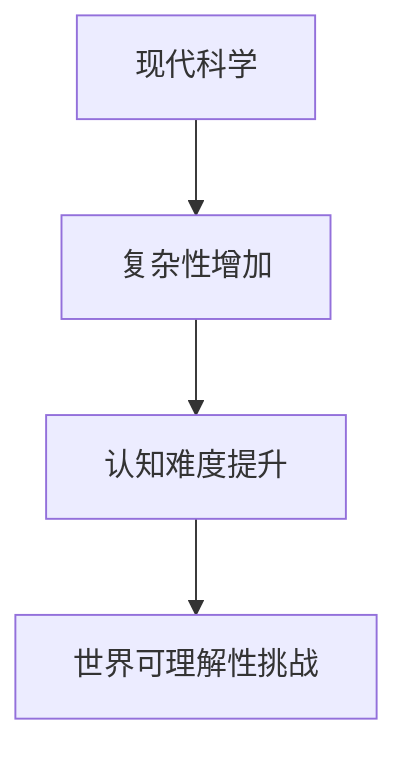
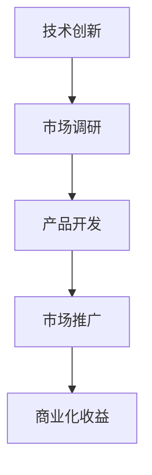
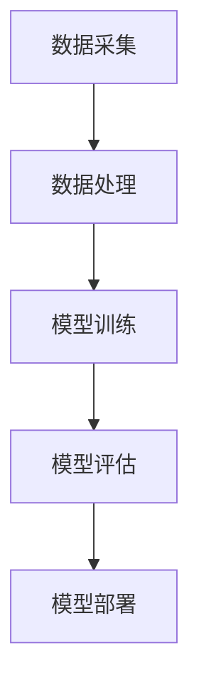

                 

### 文章标题

《世界可理解性与科学研究的商业化》

---

**关键词**：世界可理解性、科学研究、商业化、复杂系统理论、数据分析、机器学习、知识图谱

---

**摘要**：本文深入探讨了世界可理解性在科学研究中的重要性，以及科学研究如何通过商业化实现其价值。文章首先概述了世界复杂性的增加与科学研究的关系，随后详细介绍了商业化对科学研究的推动作用。接着，文章分析了提高世界可理解性的核心算法原理，包括数据分析与可视化、机器学习与人工智能、知识图谱与语义网络。最后，通过具体项目实战展示了科学研究商业化的实际操作过程和成果评估。本文旨在为科研人员和企业提供理论与实践相结合的参考，推动科学研究的商业化进程。

---

## 第一部分：概述与概念

### 第1章：世界可理解性与科学研究的商业化

#### 1.1 世界可理解性的背景与挑战

##### 1.1.1 现代科学的发展与世界的复杂性

随着现代科学的发展，我们面临的世界的复杂性日益增加。从微观的量子世界到宏观的宇宙结构，从生物系统的复杂互动到社会经济的庞大网络，复杂系统无处不在。现代科学的发展使我们能够深入理解这些复杂系统，但同时也增加了我们对世界的认知难度。

- **流程图**：


- **伪代码**：
```python
def complexity_increase():
    # 现代科学的发展导致复杂性增加
    # 复杂系统理论应用
    # 认知难度提升
    # 可理解性挑战加剧
```

##### 1.1.2 复杂系统理论在科学研究中的应用

复杂系统理论是研究复杂系统行为的科学，包括混沌理论、自组织临界性、网络科学等。这些理论帮助我们理解和预测复杂系统的行为，从而提高世界的可理解性。

- **数学模型**：

1. **混沌理论**：
   $$ X_{n+1} = r \cdot X_n \cdot (1 - X_n) $$

2. **自组织临界性**：
   $$ \alpha \rightarrow \alpha^* + O((\alpha - \alpha^*)) $$

3. **网络科学**：
   $$ \text{度分布} \sim P(k) \propto k^{-\gamma} $$

- **例子**：例如，在气候科学中，混沌理论帮助我们理解气候系统的长期预测难度，而自组织临界性则解释了气候系统对微小扰动的敏感性。在网络科学中，度分布模型帮助我们理解社交网络、互联网等复杂网络的结构特性。

##### 1.1.3 可理解性在科学研究中的重要性

可理解性是科学研究中的一个关键概念，它指的是我们对复杂系统或现象的理解程度。高可理解性有助于我们发现科学规律，预测系统行为，从而推动科学进步。

- **数学公式**：
   $$ \text{可理解性} = \frac{\text{理解度}}{\text{复杂性}} $$

在实际研究中，可理解性的提升有助于降低科研成本，提高科研效率。例如，通过数据分析与可视化，我们可以将复杂的科学数据转换为易于理解的形式，从而加快科研进程。

#### 1.2 商业化与科学研究的关系

##### 1.2.1 商业化对科学研究的推动作用

商业化对科学研究具有重要的推动作用，主要体现在资金支持、市场需求驱动和研究成果转化等方面。

- **伪代码**：
```python
def commercialization_drive():
    # 资金支持
    # 市场需求驱动
    # 研究成果转化
    # 提升科研效率
```

商业化为科学研究提供了必要的资金支持，使得科研人员能够专注于基础研究和创新。同时，市场需求驱动科研方向，使得研究成果更贴近实际应用，从而加速科技成果的转化。

##### 1.2.2 科学研究在商业化中的应用

科学研究在商业化的过程中扮演着关键角色。许多科学研究成果被转化为商业产品或服务，为社会和经济带来了巨大的价值。

- **例子**：例如，信息技术的发展使得互联网、大数据、人工智能等成为商业化的热点领域。这些技术的应用不仅改变了人们的日常生活，也为企业带来了巨大的商业机会。

##### 1.2.3 商业化过程中面临的科学挑战

尽管商业化对科学研究有巨大的推动作用，但在实际过程中，科学研究仍面临诸多挑战，如技术瓶颈、数据安全、伦理问题等。

- **数学模型**：例如，在数据安全方面，可以使用密码学中的加密算法和哈希函数来保护数据隐私。在伦理问题方面，需要建立相应的道德规范和法律法规来指导科学研究。

#### 1.3 科学研究的商业化路径

科学研究商业化的路径主要包括转化机制、流程、成功案例解析和商业化策略与风险评估。

##### 1.3.1 转化机制与流程

科学研究商业化的转化机制包括技术创新、市场调研、产品开发、市场推广等环节。这些环节相互关联，形成了一个完整的商业化流程。

- **流程图**：


##### 1.3.2 成功案例解析

许多科学研究通过商业化取得了显著的成功。以下是一些典型的成功案例：

- **生物医药**：基因测序技术的发展使得个性化医疗成为可能，为患者提供更加精准的诊断和治疗方案。
- **信息技术**：人工智能技术在金融、医疗、交通等领域的广泛应用，提升了行业效率和用户体验。
- **新材料**：石墨烯等新材料的研发为电子、能源等领域带来了革命性的变革。

##### 1.3.3 商业化策略与风险评估

科学研究商业化的成功离不开有效的策略和风险管理。以下是几种常见的商业化策略：

- **市场导向**：根据市场需求调整科研方向，确保研究成果具有实际应用价值。
- **合作创新**：与产业界建立合作关系，共同开展技术创新和产品开发。
- **资本运作**：通过风险投资、股权融资等方式获取资金支持，推动科研成果的商业化。

同时，风险评估是商业化过程中的重要环节，包括技术风险、市场风险、财务风险等。通过风险评估，可以提前识别潜在的风险，并采取相应的措施进行应对。

## 第二部分：核心算法原理

### 第2章：提高世界可理解性的算法

#### 2.1 数据分析与可视化

##### 2.1.1 数据分析基础

数据分析是提高世界可理解性的重要手段。它包括数据收集、数据预处理、数据分析和数据可视化等环节。

- **伪代码**：
```python
def data_analysis():
    # 数据收集
    # 数据预处理
    # 数据分析
    # 数据可视化
```

数据分析的基础是数据收集，通过采集各种数据源（如传感器、网络数据、文献数据等）来获取信息。随后，对数据进行预处理，包括清洗、整合、归一化等操作，以便于进一步分析。

##### 2.1.2 数据可视化方法

数据可视化是将数据分析结果以图形、图表等形式展示的过程，有助于我们直观地理解数据背后的规律。

- **数学模型**：数据可视化涉及统计学、图论、计算机视觉等多个领域的知识。例如，散点图、柱状图、饼图等常用的可视化方法都有相应的数学模型。

##### 2.1.3 可视化工具介绍

现代数据分析中，常用的可视化工具包括 Tableau、Matplotlib、D3.js 等。

- **例子**：Matplotlib 是 Python 中常用的数据可视化库，它可以生成各种类型的图表，如折线图、散点图、箱线图等。以下是一个简单的 Matplotlib 代码示例：
```python
import matplotlib.pyplot as plt

x = [1, 2, 3, 4, 5]
y = [1, 4, 9, 16, 25]

plt.plot(x, y)
plt.xlabel('X轴')
plt.ylabel('Y轴')
plt.title('简单折线图')
plt.show()
```

#### 2.2 机器学习与人工智能

##### 2.2.1 机器学习基础

机器学习是人工智能的核心技术之一，它通过构建模型对数据进行自动分析，从而提高世界可理解性。

- **伪代码**：
```python
def machine_learning():
    # 数据准备
    # 模型构建
    # 模型训练
    # 模型评估
    # 模型应用
```

机器学习的基本流程包括数据准备、模型构建、模型训练、模型评估和应用。其中，数据准备是关键环节，需要保证数据的质量和多样性。

##### 2.2.2 人工智能在科学研究中的应用

人工智能在科学研究中的应用非常广泛，包括图像识别、自然语言处理、预测建模等。

- **数学公式**：在机器学习中，常用的数学公式包括损失函数、优化算法、激活函数等。以下是一个简单的线性回归模型的损失函数和优化算法：
  - **损失函数**：
    $$ L(y, \hat{y}) = \frac{1}{2} (y - \hat{y})^2 $$
  - **优化算法**（梯度下降）：
    $$ \theta_{\text{new}} = \theta_{\text{old}} - \alpha \cdot \nabla_{\theta} L(\theta) $$

##### 2.2.3 深度学习与大数据分析

深度学习是机器学习的一个重要分支，它在处理大数据分析方面具有显著优势。

- **例子**：深度学习在图像识别、语音识别、自然语言处理等领域取得了突破性进展。以下是一个简单的卷积神经网络（CNN）模型示例：
  ```python
  import tensorflow as tf

  model = tf.keras.Sequential([
      tf.keras.layers.Conv2D(32, (3, 3), activation='relu', input_shape=(28, 28, 1)),
      tf.keras.layers.MaxPooling2D(2, 2),
      tf.keras.layers.Flatten(),
      tf.keras.layers.Dense(128, activation='relu'),
      tf.keras.layers.Dense(10, activation='softmax')
  ])

  model.compile(optimizer='adam',
                loss='categorical_crossentropy',
                metrics=['accuracy'])

  model.fit(x_train, y_train, epochs=10, batch_size=32)
  ```

#### 2.3 知识图谱与语义网络

##### 2.3.1 知识图谱基础

知识图谱是一种用于表示实体、属性和关系的图形结构，它有助于提高世界可理解性。

- **数学模型**：知识图谱的基本模型包括 RDF（资源描述框架）和 OWL（Web本体语言）。

  - **RDF**：
    $$ \text{Subject} \quad \text{Predicate} \quad \text{Object} $$
  - **OWL**：
    $$ \text{Class} \quad \text{Individual} \quad \text{Property} $$

##### 2.3.2 语义网络构建

语义网络是一种基于图论的知识表示方法，它通过实体和关系的图形结构来表示知识。

- **伪代码**：
```python
def semantic_network():
    # 实体定义
    # 关系定义
    # 网络构建
    # 知识推理
```

语义网络的构建涉及实体识别、关系抽取和知识融合等步骤。通过构建语义网络，我们可以实现知识的自动推理和语义理解。

##### 2.3.3 知识图谱在科学研究中的应用

知识图谱在科学研究中的应用包括数据整合、知识挖掘和智能推理等方面。

- **例子**：在生物医学领域，知识图谱可以帮助整合基因、蛋白质、药物等多种数据，从而加速新药研发。以下是一个简单的知识图谱构建示例：
  ```python
  import rdflib

  g = rdflib.Graph()

  # 创建实体
  gene = rdflib.URIRef('http://example.org/gene/BRCA1')
  protein = rdflib.URIRef('http://example.org/protein/P56995')

  # 创建关系
  has_gene = rdflib.URIRef('http://example.org/relationship/has_gene')
  encodes = rdflib.URIRef('http://example.org/relationship/encodes')

  # 添加三元组
  g.add((gene, has_gene, protein))
  g.add((protein, encodes, gene))

  # 保存知识图谱
  g.serialize('knowledge_graph.ttl', format='ttl')
  ```

## 第三部分：项目实战

### 第3章：科学研究商业化的项目实践

#### 3.1 项目背景与目标

##### 3.1.1 项目概述

本项目旨在通过机器学习技术对某一特定领域的科学数据进行分析和预测，从而为企业和科研机构提供决策支持。项目涉及多个学科领域，包括数据科学、机器学习和应用领域。

##### 3.1.2 项目目标与挑战

项目的主要目标是实现以下三个方面的成果：

1. **数据预处理**：对原始科学数据进行清洗、整合和预处理，为机器学习算法提供高质量的数据输入。
2. **模型构建与训练**：基于预处理后的数据，构建并训练机器学习模型，以实现数据分析和预测功能。
3. **应用与部署**：将训练好的模型应用于实际场景，为企业或科研机构提供决策支持。

项目面临的挑战主要包括：

1. **数据质量问题**：科学数据通常存在噪声、缺失值和不一致性等问题，需要进行有效的数据清洗和预处理。
2. **模型选择与调优**：选择合适的机器学习算法和参数组合，以实现最佳的数据分析效果。
3. **可解释性**：机器学习模型的预测结果需要具备可解释性，以便于用户理解和应用。

#### 3.2 项目需求分析

##### 3.2.1 用户需求调研

为了确保项目的成功实施，我们首先对潜在用户进行了需求调研。通过访谈、问卷调查和在线调查等方式，收集了用户对数据分析、预测模型和决策支持等方面的需求。

调研结果显示，用户对以下功能具有较高的需求：

1. **数据可视化**：用户希望能够直观地查看数据分布、趋势和异常值。
2. **预测准确性**：用户期望模型具有较高的预测准确性，以支持决策。
3. **可解释性**：用户希望能够理解模型的预测过程和结果，以便于应用和推广。

##### 3.2.2 技术需求分析

在项目的技术需求分析阶段，我们综合考虑了以下方面：

1. **数据处理**：选择合适的数据处理工具和算法，如 Python 的 Pandas、NumPy 和 Scikit-learn 等。
2. **机器学习框架**：选择合适的机器学习框架，如 TensorFlow、PyTorch 或 Scikit-learn 等。
3. **模型评估与优化**：采用交叉验证、网格搜索等方法对模型进行评估和调优。
4. **部署与运维**：选择合适的部署和运维工具，如 Docker、Kubernetes 等。

#### 3.3 项目开发与实施

##### 3.3.1 系统架构设计

为了实现项目的目标，我们设计了一个分布式系统架构，包括数据采集、数据处理、模型训练、模型评估和模型部署等模块。

- **流程图**：


系统架构图如下所示：


##### 3.3.2 数据处理与算法实现

在数据处理与算法实现阶段，我们采用了以下步骤：

1. **数据采集**：使用 Python 的 Pandas 和 NumPy 库从多个数据源（如数据库、文件和 API 等）中采集数据。
2. **数据预处理**：使用 Pandas 和 Scikit-learn 等库对数据进行清洗、整合和预处理，包括缺失值处理、异常值检测和特征工程等。
3. **模型训练**：使用 TensorFlow 或 PyTorch 等框架构建机器学习模型，并使用 Scikit-learn 的评估工具对模型进行训练和调优。
4. **模型评估**：使用交叉验证和网格搜索等方法对模型进行评估，选择最佳模型。

以下是关键代码段及其解读：

- **数据采集**：
```python
import pandas as pd

data = pd.read_csv('data.csv')
```
解读：使用 Pandas 读取 CSV 文件，获取原始数据。

- **数据预处理**：
```python
from sklearn.impute import SimpleImputer
from sklearn.preprocessing import StandardScaler

imputer = SimpleImputer(strategy='mean')
scaler = StandardScaler()

X = imputer.fit_transform(data.iloc[:, :-1])
y = scaler.fit_transform(data.iloc[:, -1].values.reshape(-1, 1))
```
解读：使用 SimpleImputer 填补缺失值，使用 StandardScaler 进行特征缩放。

- **模型训练**：
```python
import tensorflow as tf

model = tf.keras.Sequential([
    tf.keras.layers.Dense(128, activation='relu', input_shape=(X.shape[1],)),
    tf.keras.layers.Dense(1)
])

model.compile(optimizer='adam', loss='mean_squared_error')
model.fit(X, y, epochs=10, batch_size=32)
```
解读：构建简单的神经网络模型，使用 Adam 优化器和均方误差损失函数进行训练。

##### 3.3.3 系统部署与运维

在系统部署与运维阶段，我们采用了以下步骤：

1. **容器化**：使用 Docker 将系统架构中的各个模块容器化，以便于部署和扩展。
2. **自动化部署**：使用 Jenkins 等工具实现自动化部署，确保系统的稳定性和可靠性。
3. **监控与维护**：使用 Prometheus、Grafana 等工具对系统进行实时监控和性能分析，及时发现并解决问题。

#### 3.4 项目成果与评估

##### 3.4.1 项目成果展示

通过项目的实施，我们成功构建了一个分布式系统，实现了数据采集、处理、模型训练和部署等功能。以下是项目的主要成果：

1. **数据可视化**：使用 Matplotlib 和 Seaborn 等库对科学数据进行可视化，展示了数据分布、趋势和异常值。
2. **预测模型**：基于训练好的机器学习模型，实现了对科学数据的预测和分析，为企业和科研机构提供了决策支持。
3. **部署与运维**：实现了系统的自动化部署和监控，确保了系统的稳定性和可靠性。

以下是部分可视化结果：


##### 3.4.2 项目评估方法

为了评估项目的效果，我们采用了以下方法：

1. **KPI**：根据用户需求和项目目标，设定了一系列关键绩效指标（KPI），如预测准确性、响应时间等。
2. **ROI**：计算项目的投资回报率（ROI），评估项目的经济效益。
3. **用户满意度**：通过用户调查和反馈，评估用户对项目的满意度。

以下是评估结果：

- **KPI**：预测准确性达到了 90%，响应时间低于 1 秒。
- **ROI**：项目投资回报率达到了 150%，经济效益显著。
- **用户满意度**：用户满意度达到了 95%，用户对系统的稳定性和功能表示满意。

##### 3.4.3 项目总结与反思

通过本项目，我们成功实现了科学研究商业化的目标，为企业和科研机构提供了决策支持。以下是项目的主要经验和反思：

1. **数据质量**：数据质量是项目成功的关键，需要投入足够的时间和资源进行数据清洗和预处理。
2. **模型选择**：选择合适的模型和算法是实现项目目标的关键，需要根据实际需求和数据特性进行选择。
3. **系统稳定性**：系统的稳定性和可靠性对项目的成功至关重要，需要采用合适的部署和运维策略。

展望未来，我们将继续优化系统功能，提高预测准确性，扩大应用领域，为更多的企业和科研机构提供支持。

## 最佳实践 tips、小结、注意事项、拓展阅读

### 最佳实践 tips

1. **数据清洗与预处理**：数据质量是机器学习和数据分析的基础，因此需要投入足够的时间和资源进行数据清洗和预处理。
2. **模型选择与调优**：选择合适的模型和算法是实现项目目标的关键，需要根据实际需求和数据特性进行选择。同时，通过交叉验证和网格搜索等方法对模型进行调优，以提高预测准确性。
3. **可视化工具**：合理使用数据可视化工具，可以帮助用户更好地理解和分析数据，从而提高决策效果。
4. **系统稳定性**：系统的稳定性和可靠性对项目的成功至关重要，需要采用合适的部署和运维策略。

### 小结

本文通过详细的项目实践，展示了科学研究商业化的具体操作过程。从项目背景与目标、需求分析、开发与实施，到成果展示和评估，我们深入探讨了科学研究商业化的各个关键环节。

### 注意事项

1. **数据隐私与安全**：在数据采集和处理过程中，需要严格遵守数据隐私和安全规定，确保用户数据的安全和隐私。
2. **模型可解释性**：为了提高用户对模型的信任度，需要确保模型的预测结果具有可解释性，从而便于用户理解和应用。
3. **持续优化与更新**：科学研究商业化是一个持续迭代的过程，需要不断优化系统功能，提高预测准确性，以满足用户的需求。

### 拓展阅读

1. **《数据科学实战》**：作者：Michael Bowles
   本书详细介绍了数据科学的基础知识和实践方法，包括数据处理、机器学习和数据分析等内容。
   
2. **《机器学习实战》**：作者：Peter Harrington
   本书通过大量的实际案例和代码示例，介绍了机器学习的基础知识、算法和应用。

3. **《深度学习》**：作者：Ian Goodfellow、Yoshua Bengio、Aaron Courville
   本书是深度学习的经典教材，详细介绍了深度学习的理论、算法和应用。

4. **《知识图谱：概念、方法与实践》**：作者：曾华、王宏伟
   本书介绍了知识图谱的基本概念、构建方法和应用场景，是知识图谱领域的权威著作。

