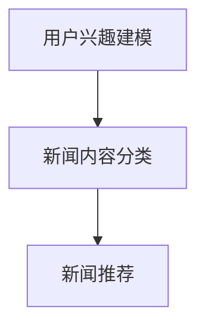

                 

根据您的要求，我将逐步构建《个性化新闻聚合：利用提示词过滤信息茧房》的技术博客文章。以下是文章的构思和初步大纲，接下来我们将一步一步详细展开每个部分。

---

# 文章标题：个性化新闻聚合：利用提示词过滤信息茧房

> 关键词：个性化新闻聚合、信息茧房、提示词过滤、算法原理、项目实战

> 摘要：本文将探讨个性化新闻聚合的概念、原理和应用，重点介绍如何利用提示词技术来有效过滤信息茧房，提高用户的阅读体验和信息的多样性。

---

## 第一步：背景介绍

在这个信息爆炸的时代，人们每天接收到的信息量前所未有。然而，信息的泛滥也带来了一个问题——信息茧房。信息茧房是指人们在接收信息时，由于各种原因而只接触到与自己观点相似的信息，导致信息接受范围的局限，进而影响个人的认知和思维方式。

个性化新闻聚合作为解决信息茧房的一种技术手段，旨在根据用户的兴趣和需求，提供定制化的新闻内容。本文将介绍个性化新闻聚合的核心概念、算法原理以及如何通过提示词过滤技术来优化新闻聚合效果。

---

## 第二步：核心概念与联系

### 2.1 个性化新闻聚合的概念

个性化新闻聚合是一种通过分析用户行为、兴趣和历史数据，为用户推荐符合其兴趣的新闻内容的技术。它能够帮助用户在海量信息中快速找到感兴趣的内容，提高信息获取的效率和效果。

### 2.2 信息茧房的定义

信息茧房是指在信息传播过程中，由于技术、经济、社会等原因，个体所接触的信息趋于同质化，形成封闭的信息环境。这种现象可能导致个体的思维和认知受到局限，难以接触到多元化的信息。

### 2.3 个性化新闻聚合与信息茧房的联系

个性化新闻聚合在一定程度上可以缓解信息茧房问题。通过精确地分析用户兴趣，推荐多样化的新闻内容，可以帮助用户突破信息茧房的限制，接触到更广泛的信息。

## 第三步：核心算法原理讲解

### 3.1 提示词选择策略

提示词（Keywords）是新闻聚合系统识别用户兴趣的重要工具。选择合适的提示词对于个性化新闻聚合的效果至关重要。

- **提示词来源**：可以通过用户历史行为、搜索记录、评论等途径获取。
- **提示词筛选**：对获取的提示词进行筛选，去除重复和不相关词汇，确保提示词的准确性和代表性。

### 3.2 基于提示词的新闻聚合算法

#### 3.2.1 算法概述

基于提示词的新闻聚合算法主要分为三个步骤：

1. **用户兴趣建模**：根据用户行为和历史数据，建立用户兴趣模型。
2. **新闻内容分类**：对新闻内容进行分类，标记其主题和关键词。
3. **新闻推荐**：根据用户兴趣模型和新闻内容分类，为用户推荐相关的新闻。

#### 3.2.2 伪代码描述

```plaintext
function NewsAggregation(UserBehavior, NewsContent):
    # 步骤1：用户兴趣建模
    UserInterestModel = BuildUserInterestModel(UserBehavior)
    
    # 步骤2：新闻内容分类
    CategorizedNews = CategorizeNews(NewsContent, UserInterestModel)
    
    # 步骤3：新闻推荐
    RecommendedNews = RecommendNews(CategorizedNews, UserInterestModel)
    return RecommendedNews
```

#### 3.2.3 算法流程图（Mermaid格式）



### 3.3 数学模型和数学公式讲解

#### 3.3.1 相关性度量

为了衡量用户兴趣和新闻内容的相关性，可以使用余弦相似度公式：

$$
\cos(\theta) = \frac{\sum_{i=1}^{n} u_i \cdot v_i}{\sqrt{\sum_{i=1}^{n} u_i^2} \cdot \sqrt{\sum_{i=1}^{n} v_i^2}}
$$

其中，$u$ 和 $v$ 分别代表用户兴趣向量和新

