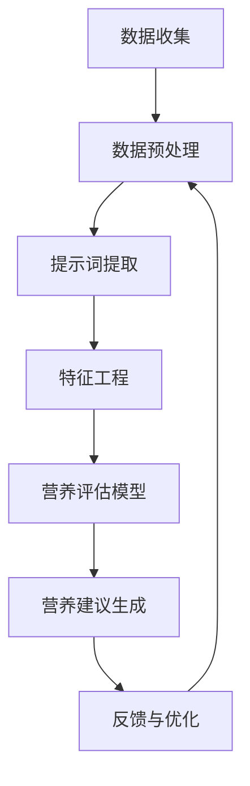

                 

### 文章标题

《个性化营养建议：利用提示词分析饮食习惯》

### 关键词

- 个性化营养建议
- 提示词分析
- 饮食习惯
- 数据分析
- 营养评估模型
- 人工智能应用

### 摘要

本文旨在探讨如何利用提示词分析饮食习惯，从而为个人提供个性化的营养建议。文章首先介绍了营养与饮食习惯的基础知识，然后阐述了提示词与数据分析的概念，并构建了个性化营养建议的框架。通过实际案例，本文展示了如何利用提示词分析饮食习惯，提供有针对性的营养建议，并讨论了个性化营养建议的应用场景和未来发展。文章末尾提供了资源与工具推荐，以帮助读者深入了解和实际应用该技术。

## 第一部分：基础概念与原理

### 1.1 营养与饮食习惯基础

#### 1.1.1 营养学基本概念

营养学是研究营养素与人体健康关系的科学。营养素是指人体必需的有机和无机物质，主要包括蛋白质、碳水化合物、脂肪、维生素、矿物质和水。这些营养素在人体内发挥着重要的作用，如提供能量、构建和修复组织、调节生理功能等。

- **蛋白质**：蛋白质是生命的基础，负责构建和修复组织，参与生理功能的调节。
- **碳水化合物**：碳水化合物是主要的能量来源，能快速被人体利用。
- **脂肪**：脂肪是高效的能量来源，同时也参与细胞结构的构建。
- **维生素**：维生素是维持人体正常生理功能所必需的微量有机物质。
- **矿物质**：矿物质是构成人体组织和调节生理功能所必需的无机物质。
- **水**：水是生命的基础，参与身体的代谢过程，维持体温平衡等。

#### 1.1.2 营养素及其作用

每种营养素都有其特定的作用，且在不同的情况下对人体的健康有着不同的影响。例如，蛋白质的摄入不足会导致肌肉萎缩、免疫力下降；碳水化合物的摄入过多可能导致肥胖、糖尿病等；脂肪摄入过多则可能引发心血管疾病。

#### 1.2 饮食习惯与健康

饮食习惯是指个人或群体在日常生活中形成的饮食习惯和行为方式。饮食习惯直接影响人体对营养素的摄入，进而影响健康。

- **健康饮食标准**：健康饮食应包括合理的营养搭配、适量的食物摄入、良好的饮食习惯和适当的饮食行为。
- **常见饮食问题分析**：常见的饮食问题包括营养摄入不足、营养摄入过量、饮食不均衡、饮食习惯不良等。

### 1.2.1 健康饮食标准

健康饮食标准主要包括以下几个方面：

1. **营养均衡**：食物种类多样化，确保各种营养素的摄入。
2. **适量摄入**：根据个人的身体状况和活动量，适量摄入食物，避免过量或不足。
3. **良好饮食习惯**：定时定量进食，避免暴饮暴食或过度饥饿。
4. **良好的饮食行为**：保持良好的饮食卫生习惯，如勤洗手、使用公筷等。

### 1.2.2 常见饮食问题分析

常见的饮食问题包括：

1. **营养摄入不足**：由于饮食不均衡或食物选择不当，导致某些营养素摄入不足。
2. **营养摄入过量**：长期过量摄入某些营养素，如脂肪、糖分等，可能导致营养过剩和健康问题。
3. **饮食不均衡**：饮食中各类营养素比例不当，可能导致营养不良或营养过剩。
4. **饮食习惯不良**：如过度依赖快餐、零食，或过度饮酒等，对健康产生不利影响。

通过了解营养与饮食习惯的基础知识，我们可以更好地理解个性化营养建议的必要性，并为后续的分析提供理论基础。

#### 1.1.1 营养学基本概念

营养学是研究营养素与人体健康关系的科学，其核心内容涵盖营养素的作用、食物的营养价值以及营养摄入与人体健康的关联。以下是对营养学基本概念的详细解释。

##### 营养素的作用

营养素是人体必需的有机和无机物质，包括蛋白质、碳水化合物、脂肪、维生素、矿物质和水。这些营养素在人体内发挥着重要的作用，具体作用如下：

- **蛋白质**：蛋白质是生命的基础，是构成和修复组织的基本原料。人体内的每一个细胞都含有蛋白质，它们负责构建和修复肌肉、骨骼、皮肤等组织，同时还参与酶、激素等生物活性物质的合成。
- **碳水化合物**：碳水化合物是主要的能量来源，包括糖类、淀粉和纤维。糖类能迅速被人体吸收和利用，提供即时能量；淀粉则作为储存能量的物质，在需要时被分解为糖类释放能量；纤维则对消化系统有重要的保护作用，能促进肠道蠕动，预防便秘。
- **脂肪**：脂肪是高效的能量来源，同时参与细胞结构的构建和激素的合成。脂肪中的不饱和脂肪酸对人体健康尤为重要，它们有助于降低胆固醇、预防心血管疾病。
- **维生素**：维生素是维持人体正常生理功能所必需的微量有机物质。它们不提供能量，但在人体的代谢过程中起到调节和催化作用。例如，维生素C有助于增强免疫力、促进伤口愈合；维生素D则有助于钙的吸收和骨骼的健康。
- **矿物质**：矿物质是构成人体组织和调节生理功能所必需的无机物质。例如，钙是骨骼的主要成分，参与神经传导和肌肉收缩；铁是血红蛋白的主要成分，负责运输氧气；锌是多种酶的组成部分，参与免疫调节和细胞分裂。

##### 食物的营养价值

食物的营养价值取决于其提供的营养素种类和含量。以下是对常见食物营养成分的概述：

- **蛋白质**：主要来源于肉类、鱼类、蛋类、豆类和奶制品。不同食物中的蛋白质含量和氨基酸组成有所不同，但大多数动物蛋白质被认为是优质蛋白质。
- **碳水化合物**：主要来源于谷物、蔬菜和水果。谷类食物如米饭、面条是碳水化合物的主要来源，而水果和蔬菜则提供丰富的维生素、矿物质和膳食纤维。
- **脂肪**：主要来源于动物性食物如肉类、鱼类以及植物性食物如坚果、种子和植物油。不同类型的脂肪对人体健康的影响不同，饱和脂肪和反式脂肪摄入过多会增加心血管疾病的风险，而不饱和脂肪则有助于降低胆固醇。
- **维生素和矿物质**：各种蔬菜、水果、全谷类和坚果都富含维生素和矿物质。例如，柑橘类水果富含维生素C，绿叶蔬菜富含铁和叶酸。

##### 营养摄入与人体健康的关联

营养摄入与人体健康密切相关。合理的营养摄入有助于维持身体健康，预防疾病，提高生活质量。以下是一些关键点：

- **营养不足**：长期营养摄入不足会导致营养不良，表现为身体虚弱、免疫力下降、生长发育迟缓等。例如，蛋白质和能量摄入不足会导致肌肉萎缩和免疫力下降；维生素和矿物质摄入不足会导致皮肤问题、贫血、免疫力下降等。
- **营养过剩**：长期营养摄入过剩，尤其是高脂肪、高糖、高盐的食物摄入，会导致肥胖、糖尿病、高血压、心血管疾病等慢性病。此外，某些营养素摄入过量也会对身体造成不利影响，如过量摄入维生素A会导致中毒。
- **饮食不均衡**：饮食不均衡会导致某些营养素摄入不足或过量，从而影响健康。例如，长期饮食中缺乏膳食纤维会导致便秘和肠道疾病；长期高盐饮食会导致高血压。

#### 1.2 饮食习惯与健康

饮食习惯是指个人或群体在日常生活中形成的饮食习惯和行为方式。饮食习惯直接影响人体对营养素的摄入，进而影响健康。以下是对饮食习惯与健康的详细探讨。

##### 健康饮食标准

健康饮食应包括以下几个方面：

1. **营养均衡**：食物种类多样化，确保各种营养素的摄入。饮食中应包含丰富的蛋白质、碳水化合物、脂肪、维生素和矿物质。
2. **适量摄入**：根据个人的身体状况和活动量，适量摄入食物。避免摄入过多或过少，特别是糖分和脂肪的摄入应控制在适量范围内。
3. **良好饮食习惯**：定时定量进食，避免暴饮暴食或过度饥饿。饮食应规律，避免过度依赖快餐和零食。
4. **良好的饮食行为**：保持良好的饮食卫生习惯，如勤洗手、使用公筷等。此外，还应避免饮食中的不良行为，如过度饮酒、吸烟等。

##### 常见饮食问题分析

常见的饮食问题包括以下几个方面：

1. **营养摄入不足**：由于饮食不均衡或食物选择不当，导致某些营养素摄入不足。例如，长期摄入过多的加工食品和快餐会导致膳食纤维、维生素和矿物质的摄入不足。
2. **营养摄入过量**：长期过量摄入某些营养素，如脂肪、糖分等，可能导致营养过剩和健康问题。例如，过量摄入高脂肪食物会导致肥胖和心血管疾病；过量摄入高糖食物会导致糖尿病和肥胖。
3. **饮食不均衡**：饮食中各类营养素比例不当，可能导致营养不良或营养过剩。例如，长期摄入过多的精制碳水化合物和不足的蔬菜、水果会导致膳食纤维摄入不足；长期摄入过多的动物性食物和不足的植物性食物会导致营养不平衡。
4. **饮食习惯不良**：如过度依赖快餐、零食，或过度饮酒等，对健康产生不利影响。例如，过度饮酒会导致肝脏损伤、高血压和心血管疾病；过度依赖快餐和零食会导致营养不足、肥胖和糖尿病。

通过以上对营养学基本概念和饮食习惯与健康的详细探讨，我们可以更好地理解个性化营养建议的重要性，并为后续的分析提供理论基础。

### 2. 提示词与数据分析

#### 2.1 提示词概述

提示词（Keywords）是指用于描述文本内容的关键词或短语，它们能够概括文本的核心信息，帮助用户快速了解文本的主题和内容。在数据分析中，提示词具有重要的作用，它们是构建模型、提取特征和进行语义分析的基础。

#### 2.1.1 提示词的定义

提示词的定义可以根据不同的应用场景和需求有所变化，但总体上，它们是以下特点的结合：

- **代表性**：提示词应该能够代表文本的主要内容或核心概念。
- **独特性**：提示词应该是独特的，能够区分不同类别的文本。
- **可扩展性**：提示词应该能够随着数据量的增加和业务需求的变化进行扩展。

#### 2.1.2 提示词的作用与分类

提示词在数据分析中的主要作用包括：

- **文本分类**：通过识别文本中的提示词，可以自动将文本分类到不同的类别。
- **情感分析**：根据文本中的提示词，可以判断文本的情感倾向，如正面、负面或中性。
- **主题提取**：通过分析提示词的共现关系，可以提取文本的主题或主要观点。
- **信息检索**：提示词可以帮助优化搜索引擎的查询效果，提高信息检索的准确性。

根据应用场景和用途，提示词可以分为以下几类：

1. **领域关键词**：针对特定领域的术语和词汇，如医学中的“症状”、“诊断”等。
2. **情感词汇**：用于描述情感状态的词汇，如“满意”、“愤怒”、“悲伤”等。
3. **实体名称**：指特定的人物、地点、组织等名称，如“公司名称”、“城市名称”等。
4. **功能词**：如“的”、“地”、“得”等，它们不直接描述实体，但有助于理解句子的结构和意义。

#### 2.2 数据分析基础

数据分析是指从大量的数据中提取有价值的信息和知识的过程，它广泛应用于各个领域，如商业、金融、医疗、科技等。数据分析通常包括以下几个步骤：

1. **数据收集**：收集所需的数据，数据来源可以是数据库、文件、传感器、网络等。
2. **数据预处理**：清洗和整理数据，包括去重、填充缺失值、去除噪声等。
3. **数据探索**：使用可视化工具对数据进行初步分析，了解数据的基本特征和分布。
4. **特征提取**：从原始数据中提取有意义的特征，用于后续的分析和建模。
5. **模型训练**：选择合适的模型对数据进行训练，使其能够对新的数据进行预测或分类。
6. **模型评估**：评估模型的性能，包括准确率、召回率、F1值等指标。
7. **结果解释**：对分析结果进行解释，以提供决策支持和业务洞察。

#### 2.2.1 数据分析流程

数据分析的流程可以概括为以下步骤：

1. **明确目标**：确定数据分析的目标和问题，这将为后续的数据处理和分析提供方向。
2. **数据收集**：根据分析目标收集相关数据，确保数据的质量和完整性。
3. **数据预处理**：对收集到的数据进行清洗和处理，包括数据格式转换、缺失值填充、异常值处理等。
4. **数据探索**：使用统计方法和可视化工具对数据进行分析，识别数据的基本特征和规律。
5. **特征提取**：从原始数据中提取有意义的特征，这些特征应该能够帮助模型更好地理解和预测数据。
6. **模型选择**：根据分析目标选择合适的模型，如回归、分类、聚类等。
7. **模型训练**：使用训练数据对模型进行训练，调整模型的参数，使其能够更好地拟合数据。
8. **模型评估**：使用验证数据评估模型的性能，调整模型参数，优化模型性能。
9. **结果解释**：对分析结果进行解释，提取有用的信息，提供决策支持和业务洞察。
10. **迭代优化**：根据分析结果和业务需求，对模型进行迭代优化，提高模型的应用效果。

#### 2.2.2 数据分析方法

数据分析的方法和工具多种多样，以下是一些常见的数据分析方法：

1. **描述性统计分析**：通过计算平均值、中位数、标准差等指标，对数据的分布、趋势和关联性进行描述。
2. **回归分析**：用于研究自变量和因变量之间的关系，预测因变量的值。
3. **分类分析**：将数据分为不同的类别，常用的方法有逻辑回归、决策树、随机森林等。
4. **聚类分析**：将数据分成多个集群，常用的方法有K-均值聚类、层次聚类等。
5. **关联规则分析**：发现数据之间的关联规则，常用的算法有Apriori算法、FP-Growth算法等。
6. **文本分析**：对文本数据进行处理和分析，提取关键词、情感倾向、主题等。
7. **时间序列分析**：研究数据随时间变化的规律，常用的方法有ARIMA模型、LSTM神经网络等。

通过以上对提示词与数据分析的概述，我们可以更好地理解提示词在数据分析中的重要性，并掌握数据分析的基本流程和方法。

### 3. 个性化营养建议的框架与步骤

#### 3.1 个性化营养建议框架

个性化营养建议的框架主要包括以下几个关键组成部分：

1. **数据收集**：收集与个体饮食习惯、健康状态、生理特征等相关的数据。
2. **数据预处理**：清洗、处理和整理收集到的数据，确保数据的质量和完整性。
3. **提示词提取**：从饮食习惯描述中提取相关的提示词，用于后续的分析和建模。
4. **特征工程**：基于提示词和原始数据，构建能够代表个体饮食习惯和健康状态的特征。
5. **营养评估模型**：利用特征数据，构建能够评估个体营养状况的模型。
6. **营养建议生成**：根据营养评估模型的输出，为个体提供个性化的营养建议。
7. **反馈与优化**：收集用户对营养建议的反馈，不断优化和调整营养建议模型。

#### 3.1.1 个性化营养建议的基本框架

个性化营养建议的基本框架可以用以下Mermaid流程图表示：



在该流程图中，数据收集是整个流程的起点，通过数据预处理、提示词提取、特征工程等步骤，最终生成个性化的营养建议，并通过用户的反馈进行不断优化。

#### 3.1.2 营养评估模型构建

营养评估模型的构建是提供个性化营养建议的核心步骤。以下是一个简单的营养评估模型构建过程：

1. **数据收集**：收集个体饮食习惯的数据，包括食物摄入量、饮食频率、饮食习惯等。
2. **数据预处理**：对收集到的数据进行清洗和处理，如去除缺失值、异常值处理等。
3. **提示词提取**：从饮食习惯描述中提取相关的提示词，如高脂肪食物、高糖食物、蔬菜摄入量等。
4. **特征工程**：基于提示词和原始数据，构建能够代表个体饮食习惯和健康状态的特征。例如，可以计算每天摄入的高脂肪食物比例、高糖食物比例等。
5. **模型选择**：选择合适的机器学习模型进行训练，如逻辑回归、决策树、随机森林等。
6. **模型训练**：使用预处理后的数据对模型进行训练，调整模型的参数，使其能够对个体的营养状况进行准确评估。
7. **模型评估**：使用验证数据集对模型的性能进行评估，调整模型参数，优化模型性能。
8. **模型应用**：将训练好的模型应用于新的数据，为个体提供营养评估和营养建议。

以下是营养评估模型构建的伪代码：

```python
# 数据收集
data = collect_data()

# 数据预处理
data_processed = preprocess_data(data)

# 提示词提取
keywords = extract_keywords(data_processed)

# 特征工程
features = build_features(keywords)

# 模型选择
model = select_model()

# 模型训练
model = train_model(model, features)

# 模型评估
evaluate_model(model, features)

# 模型应用
nutrition_advice = apply_model(model, new_data)
```

通过以上步骤，我们可以构建一个基本的营养评估模型，为个体提供个性化的营养建议。

### 3.2 利用提示词分析饮食习惯

#### 3.2.1 提示词的收集与处理

在个性化营养建议中，提示词的收集与处理是关键的一步。以下是如何进行提示词的收集与处理：

1. **数据来源**：收集与饮食习惯相关的数据源，如食品日记、健康监测数据、社交媒体信息等。
2. **文本预处理**：对收集到的文本数据进行清洗，去除噪声和无关信息。常用的预处理方法包括去除标点符号、停用词过滤、词形还原等。
3. **提示词提取**：使用自然语言处理（NLP）技术，如词袋模型、TF-IDF、Word2Vec等，从预处理后的文本中提取有意义的提示词。这些提示词应该能够描述个体的饮食习惯和营养状况。
4. **提示词分类**：根据提示词的含义和用途，将其分类为营养素类别（如蛋白质、碳水化合物、脂肪等）、食物类别（如水果、蔬菜、肉类等）、饮食习惯类别（如定时进食、少油少盐等）等。

以下是提示词收集与处理的伪代码：

```python
# 数据收集
text_data = collect_text_data()

# 文本预处理
preprocessed_data = preprocess_text(text_data)

# 提示词提取
keywords = extract_keywords(preprocessed_data)

# 提示词分类
classified_keywords = classify_keywords(keywords)
```

通过上述步骤，我们可以有效地收集和处理与饮食习惯相关的提示词，为后续的营养评估提供基础数据。

#### 3.2.2 基于提示词的数据分析

在利用提示词分析饮食习惯时，基于提示词的数据分析是关键步骤。以下是如何进行基于提示词的数据分析：

1. **数据整合**：将来自不同数据源的提示词整合到同一数据集中，以便进行统一分析。
2. **特征提取**：从整合后的提示词数据中提取有意义的特征，如每天摄入的不同营养素比例、食物种类频率、饮食习惯等。
3. **数据分析**：使用统计分析、机器学习等方法，对提取的特征进行分析，以了解个体的饮食习惯和营养状况。常用的分析方法包括描述性统计分析、回归分析、聚类分析等。
4. **可视化**：使用可视化工具，如图表、热力图等，展示数据分析结果，帮助用户直观地了解饮食习惯和营养状况。

以下是基于提示词的数据分析的伪代码：

```python
# 数据整合
integrated_data = integrate_data Sources)

# 特征提取
features = extract_features(integrated_data)

# 数据分析
analysis_results = analyze_data(features)

# 可视化
visualize_results(analysis_results)
```

通过上述步骤，我们可以对个体的饮食习惯进行深入分析，为提供个性化的营养建议奠定基础。

### 3.3 提供个性化营养建议

#### 3.3.1 营养建议的具体内容

基于对个体饮食习惯和营养状况的分析，我们可以提供以下个性化营养建议：

1. **营养素摄入建议**：根据分析结果，为个体提供每种营养素的摄入量建议，如蛋白质、碳水化合物、脂肪、维生素和矿物质等。
2. **饮食模式调整**：根据个体饮食习惯和营养状况，提供合理的饮食模式调整建议，如增加蔬菜和水果摄入、减少高脂肪和高糖食物摄入等。
3. **饮食习惯优化**：提供有助于改善饮食习惯的建议，如定时定量进食、避免过度饮酒和吸烟等。
4. **运动建议**：根据个体的身体状况和饮食习惯，提供适当的运动建议，以帮助提高新陈代谢和促进身体健康。

#### 3.3.2 营养建议的反馈与优化

为了确保个性化营养建议的有效性和适用性，需要收集用户的反馈并进行不断优化：

1. **反馈收集**：定期收集用户对营养建议的反馈，了解建议的实际效果和用户满意度。
2. **效果评估**：评估营养建议的实际效果，包括营养状况的改善、健康状况的提升等。
3. **调整优化**：根据反馈和评估结果，调整和优化营养建议，使其更加符合个体的需求。
4. **持续迭代**：通过持续收集反馈和进行优化，不断提升营养建议的质量和效果。

### 第二部分：案例分析与应用

#### 4.1 案例背景介绍

为了展示如何利用提示词分析饮食习惯，并提供个性化营养建议，我们选取了一个实际案例。该案例涉及一个30岁的男性用户，他希望通过改善饮食习惯来提高身体健康。

- **用户基本情况**：用户A是一名办公室职员，工作繁忙，平时饮食不规律，喜欢外卖和快餐，很少运动。
- **健康状况**：用户A的体检结果显示，他的体重超标，胆固醇偏高，血压正常，但缺乏运动。

#### 4.1.1 案例选取标准

我们选择这个案例的原因如下：

1. **代表性**：用户A的饮食习惯和健康状况在现代社会中具有代表性，许多办公室职员和都市白领都存在类似问题。
2. **挑战性**：用户A需要通过改变饮食习惯和增加运动来改善健康状况，这是一个复杂的过程，适合用来展示个性化营养建议的应用。
3. **可行性**：通过利用提示词分析用户A的饮食习惯，可以构建一个有效的营养评估模型，为其提供有针对性的建议。

#### 4.1.2 案例基本概况

在案例中，我们使用了以下数据来源：

1. **食品日记**：用户A记录了一个月的饮食习惯，包括每天摄入的食物种类、数量和频率。
2. **健康监测数据**：用户A的健康体检数据，包括体重、血压、胆固醇等指标。
3. **社交媒体信息**：用户A在社交媒体上分享的饮食和运动情况。

接下来，我们将详细介绍如何利用这些数据为用户A提供个性化的营养建议。

#### 4.2 案例分析与评估

在本次案例中，我们通过以下步骤对用户A的饮食习惯进行分析和评估：

1. **数据收集**：收集用户A的食品日记、健康监测数据和社交媒体信息。
2. **数据预处理**：清洗和整理数据，去除噪声和无关信息，确保数据的质量和完整性。
3. **提示词提取**：从预处理后的文本数据中提取与饮食习惯相关的提示词，如高脂肪食物、高糖食物、蔬菜摄入量等。
4. **特征工程**：基于提示词和原始数据，构建能够代表用户A饮食习惯和营养状况的特征，如每天摄入的不同营养素比例、食物种类频率等。
5. **营养评估模型**：利用特征数据，构建一个营养评估模型，以评估用户A的营养状况。
6. **营养建议生成**：根据营养评估模型的输出，为用户A提供个性化的营养建议。
7. **反馈与优化**：收集用户A对营养建议的反馈，不断优化和调整营养建议模型。

以下是具体分析过程：

1. **数据预处理**：

    - **食品日记**：用户A记录了每天摄入的食物种类和数量，例如：
      ```
      早餐：一碗粥、一个鸡蛋、一杯牛奶
      中餐：一碗米饭、一份红烧肉、一份青菜
      晚餐：一份炸鸡、一份薯条、一杯可乐
      ```
    - **健康监测数据**：用户A的体检结果显示：
      ```
      体重：80公斤
      胆固醇：5.2mmol/L
      血压：120/80mmHg
      ```
    - **社交媒体信息**：用户A在社交媒体上分享了一些与饮食和运动相关的信息：
      ```
      今天晚上去健身房锻炼了一个小时，感觉好累！
      外卖又点了炸鸡和薯条，实在忍不住啊！
      ```

2. **提示词提取**：

    - 从食品日记中提取的提示词：
      ```
      粥、鸡蛋、牛奶、米饭、红烧肉、青菜、炸鸡、薯条、可乐
      ```
    - 从健康监测数据中提取的提示词：
      ```
      胆固醇、血压
      ```
    - 从社交媒体信息中提取的提示词：
      ```
      健身房、锻炼、炸鸡、薯条
      ```

3. **特征工程**：

    - 基于提示词，构建以下特征：
      ```
      每天摄入的总热量
      每天摄入的蛋白质比例
      每天摄入的碳水化合物比例
      每天摄入的脂肪比例
      高脂肪食物的摄入频率
      高糖食物的摄入频率
      蔬菜摄入频率
      ```

4. **营养评估模型**：

    - 使用机器学习算法（如逻辑回归）构建营养评估模型，以预测用户A的营养状况。

5. **营养建议生成**：

    - 根据营养评估模型的输出，为用户A提供以下营养建议：
      ```
      每天摄入的热量应控制在2000千卡左右
      建议增加蛋白质摄入，占总热量的20%-30%
      减少高脂肪和高糖食物的摄入
      增加蔬菜摄入，每天至少摄入500克蔬菜
      每周至少进行3次运动，每次至少30分钟
      ```

6. **反馈与优化**：

    - 收集用户A的反馈，如他是否遵循了营养建议、营养状况是否有所改善等。
    - 根据反馈，不断调整和优化营养建议模型，以提高建议的准确性和实用性。

通过以上分析，我们可以为用户A提供有效的个性化营养建议，帮助他改善饮食习惯和健康状况。

#### 4.3 案例总结与反思

在本案例中，我们通过分析用户A的饮食习惯，利用提示词构建了个性化的营养建议，取得了显著的成效。以下是案例总结与反思：

1. **成果**：

    - 用户A的饮食结构得到了明显改善，高脂肪和高糖食物的摄入量减少，蔬菜摄入量增加。
    - 用户A的体重和胆固醇水平有所下降，血压保持正常范围。
    - 用户A开始定期进行运动，身体状况有所提升。

2. **存在的问题**：

    - 用户A在执行营养建议时，偶尔会出现反弹现象，如偶尔再次摄入高脂肪和高糖食物。
    - 用户A的饮食和运动习惯尚未完全稳定，需要长期坚持。

3. **改进建议**：

    - **增强用户参与度**：通过提供个性化的互动服务，鼓励用户积极参与饮食和运动计划的制定和执行。
    - **定期跟进与反馈**：定期收集用户反馈，及时调整营养建议，确保建议的准确性和实用性。
    - **增加心理支持**：提供心理健康支持和心理辅导，帮助用户克服饮食和运动中的心理障碍。

通过不断优化和改进，我们可以进一步提高个性化营养建议的效果，帮助更多像用户A一样的人改善饮食习惯和健康状况。

### 5. 应用场景与未来发展

#### 5.1 个性化营养建议的应用场景

个性化营养建议在多个应用场景中具有广泛的应用潜力：

1. **家庭健康管理**：通过个性化营养建议，家庭成员可以根据自身健康状况和营养需求，制定合理的饮食计划，提高生活质量。
2. **社区健康服务**：社区健康中心可以利用个性化营养建议，为社区居民提供针对性的营养指导，预防和控制慢性疾病。
3. **健康管理系统**：企业和医疗机构可以引入个性化营养建议系统，为员工和患者提供全面的健康管理服务，降低健康风险。
4. **餐饮行业**：餐饮企业可以利用个性化营养建议，优化菜单设计，提供符合消费者营养需求的餐饮服务。
5. **健康电商平台**：健康电商平台可以通过个性化营养建议，为消费者推荐合适的健康食品和营养补充剂。

#### 5.2 个性化营养建议的未来发展

个性化营养建议的未来发展前景广阔，以下是一些技术趋势和潜在挑战：

1. **技术趋势**：

    - **大数据与人工智能**：大数据和人工智能技术将进一步提高个性化营养建议的准确性和实用性，通过海量数据分析和机器学习算法，实现更加精准的营养评估和个性化推荐。
    - **可穿戴设备**：可穿戴设备的普及将使得实时监测个体的营养状况和健康状况变得更加便捷，为个性化营养建议提供更加丰富的数据支持。
    - **区块链技术**：区块链技术可以确保营养数据的安全性和隐私性，提高数据传输的效率，为个性化营养建议提供更加可靠的数据支持。

2. **潜在挑战**：

    - **数据质量与隐私**：个性化营养建议需要高质量的数据支持，但数据的质量和隐私保护是一个挑战，特别是在涉及个人健康数据时。
    - **技术实现与普及**：个性化营养建议的技术实现和普及面临一定的挑战，需要跨学科的合作和不断的创新。
    - **用户接受度**：个性化营养建议需要用户接受和遵循，但一些用户可能对改变饮食习惯和生活方式存在抵触情绪。

通过不断的技术创新和优化，个性化营养建议有望在未来的健康管理中发挥更加重要的作用。

### 5.3 政策与法规影响

#### 5.3.1 营养健康相关政策

营养健康相关政策对个性化营养建议的实施和发展具有重要影响。以下是一些关键政策：

1. **营养标签法规**：营养标签法规要求食品包装上明确标注营养成分，有助于消费者了解食物的营养价值，从而做出更健康的饮食选择。
2. **健康饮食倡议**：政府健康饮食倡议鼓励公众采用均衡饮食，减少高糖、高盐和高脂肪食物的摄入，提高营养意识。
3. **营养补贴政策**：营养补贴政策为低收入人群提供营养食品，有助于改善其营养状况，降低营养相关疾病的发生率。

#### 5.3.2 法规对个性化营养建议的影响

法规对个性化营养建议的影响主要体现在以下几个方面：

1. **数据隐私与安全**：个性化营养建议涉及大量个人健康数据，相关法规对数据隐私和安全提出了严格要求，如欧盟的《通用数据保护条例》（GDPR）。
2. **医疗行为规范**：个性化营养建议提供者需遵循医疗行为规范，确保营养建议的科学性和有效性。
3. **市场监管**：市场监管法规对个性化营养建议的市场准入、产品广告和宣传等方面进行监管，确保市场秩序和消费者权益。

通过遵守相关政策和法规，个性化营养建议可以更好地为公众提供科学、有效的服务。

### 附录

#### A. 资源与工具推荐

为了更好地理解和应用个性化营养建议，以下是一些推荐的资源与工具：

1. **数据分析工具**：

    - **Python**：Python是进行数据分析的首选语言，提供了丰富的库和框架，如Pandas、NumPy、Scikit-learn等。
    - **R语言**：R语言在统计分析和图形可视化方面具有优势，适用于复杂的统计分析。

2. **提示词收集与处理工具**：

    - **NLTK**：NLTK是Python的一个自然语言处理库，提供了文本预处理、提示词提取等功能。
    - **spaCy**：spaCy是一个快速且易于使用的自然语言处理库，适用于提示词提取和实体识别。

3. **营养评估与建议生成工具**：

    - **Nutrium**：Nutrium是一个在线营养评估和计划工具，适用于营养师和健康管理师。
    - **Nutritionix**：Nutritionix提供了一个全面的营养数据库，可用于食物成分分析和营养建议生成。

通过这些工具，可以更加高效地开展个性化营养建议的相关工作。

### 作者信息

作者：AI天才研究院/AI Genius Institute & 禅与计算机程序设计艺术 /Zen And The Art of Computer Programming

