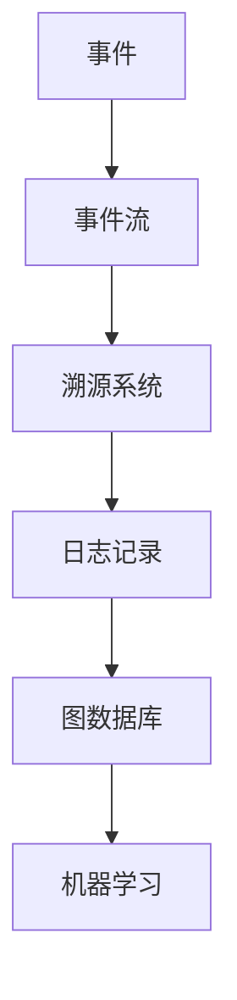
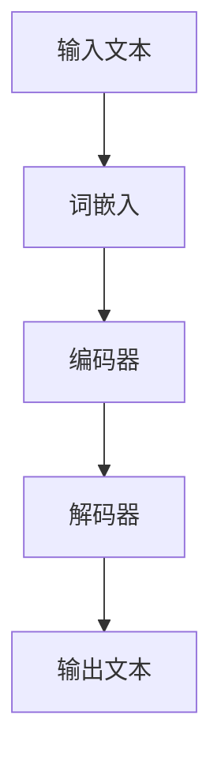

                 

### 文章标题：事件溯源架构增强LLM应用的可追溯性

#### 关键词：
- 事件溯源
- LLM应用
- 可追溯性
- 架构增强
- 人工智能

#### 摘要：
本文将探讨如何通过事件溯源架构增强大型语言模型（LLM）应用的可追溯性。首先，介绍事件溯源的基本概念和LLM应用的需求，随后详细阐述事件溯源架构的原理及其与LLM模型的结合机制。文章将分析增强可追溯性的方法，包括日志记录、图数据库和机器学习等技术。最后，通过实战案例展示事件溯源与LLM应用的结合，并展望其未来发展趋势。本文旨在为技术从业者提供关于增强LLM应用可追溯性的实用指导和深入思考。

### 第一部分：背景与概述

#### 第1章：事件溯源与LLM应用概述

**1.1 事件溯源架构简介**

**1.1.1 事件溯源的基本概念**

事件溯源是一种用于记录和分析系统事件的技术，它允许开发者或运维人员追踪系统中的操作历史，以理解系统的行为和状态变化。事件溯源的核心概念包括事件、事件流和溯源系统。

事件：事件是系统中发生的一个特定动作或变化，通常包含时间戳、事件类型和事件数据。

事件流：事件流是事件发生的时间序列，它可以用于重建系统的操作历史。

溯源系统：溯源系统是一个用于收集、存储和查询事件的系统，它提供了对事件数据的高效访问和分析能力。

**1.1.2 事件溯源的发展历程**

事件溯源技术在过去几十年中经历了显著的发展。早期的溯源系统主要关注于日志记录，随着大数据和人工智能技术的兴起，事件溯源逐渐与数据分析和机器学习相结合，形成了更加复杂和智能的溯源架构。

**1.1.3 事件溯源与LLM应用的关系**

随着LLM技术的快速发展，其在各个领域的应用日益广泛，然而LLM应用的可追溯性成为一个重要的挑战。事件溯源架构为解决这一挑战提供了有力的支持，通过记录和分析LLM应用中的事件，可以实现对模型决策的追踪和解释。

**1.2 LLM应用的可追溯性需求分析**

**1.2.1 LLM应用的特点**

LLM应用具有以下特点：

- 高度依赖数据输入
- 复杂的决策过程
- 高度的动态性和不确定性

**1.2.2 可追溯性的重要性**

LLM应用的可追溯性对于以下方面具有重要意义：

- 模型透明性：通过可追溯性，用户可以了解模型的决策过程，增强对模型的信任。
- 错误诊断：在模型出现问题时，可追溯性可以帮助快速定位问题来源。
- 审计和合规：可追溯性对于满足法规和合规要求至关重要。

**1.2.3 可追溯性需求分析**

为了满足LLM应用的可追溯性需求，需要考虑以下几个方面：

- 事件记录：记录LLM应用中的关键事件，包括输入数据、模型参数和决策结果。
- 事件追踪：通过事件溯源架构，对记录的事件进行追踪和分析。
- 数据隐私：在记录和分析事件时，需要保护用户的隐私和数据安全。
- 性能优化：可追溯性系统需要在性能和可追溯性之间找到平衡。

### 第二部分：技术基础

#### 第2章：事件溯源架构原理

**2.1 事件溯源架构的核心概念**

事件溯源架构的核心概念包括事件、事件流、溯源系统和事件记录。

**2.1.1 事件与事件流**

事件是系统中发生的特定动作或变化，通常包含以下信息：

- 时间戳：事件发生的时间。
- 事件类型：事件的分类，如输入数据、模型参数更新、决策结果等。
- 事件数据：与事件相关的具体信息，如输入文本、模型参数值、决策结果等。

事件流是事件发生的时间序列，它可以用于重建系统的操作历史。事件流通常按照时间顺序存储，以便于后续分析和查询。

**2.1.2 溯源系统组件**

溯源系统通常包括以下组件：

- 事件记录器：负责收集和记录系统中的事件。
- 事件存储：用于存储和管理事件数据，通常使用日志文件、数据库或分布式存储系统。
- 溯源服务：提供对事件数据的查询和分析功能，通常包括事件索引、搜索和报表生成等。

**2.1.3 溯源过程与机制**

事件溯源过程包括以下步骤：

1. 事件发生：系统中的某个操作触发事件。
2. 事件记录：事件记录器将事件信息记录到事件存储中。
3. 事件查询：用户可以通过溯源服务查询事件数据，以分析和重建操作历史。

**2.2 LLM模型基本原理**

**2.2.1 LLM模型的定义**

大型语言模型（LLM）是一种基于深度学习的自然语言处理模型，它通过学习大量文本数据，能够生成与输入文本相关的语言表达。

**2.2.2 LLM模型的架构**

LLM模型通常包括以下组件：

- 词嵌入：将输入文本中的单词映射到高维向量空间。
- 编码器：将词嵌入序列编码为固定长度的向量。
- 解码器：将编码器输出的向量解码为输出文本。

**2.2.3 LLM模型的工作流程**

LLM模型的工作流程包括以下步骤：

1. 输入文本：用户输入文本数据。
2. 词嵌入：将输入文本中的单词转换为词嵌入向量。
3. 编码：编码器对词嵌入向量进行编码，生成编码结果。
4. 解码：解码器对编码结果进行解码，生成输出文本。

**2.3 事件溯源与LLM模型的结合**

**2.3.1 结合机制**

事件溯源与LLM模型的结合机制包括以下方面：

- 事件记录：在LLM应用过程中，记录关键事件，如输入数据、模型参数和决策结果。
- 事件追踪：通过事件溯源架构，对记录的事件进行追踪和分析，以了解模型的行为。
- 模型解释：利用事件数据，对模型决策进行解释和可视化，提高模型的透明性。

**2.3.2 结合优势**

事件溯源与LLM模型的结合具有以下优势：

- 可追溯性：通过记录和分析事件，可以实现对LLM应用的可追溯性，增强模型透明性。
- 错误诊断：在模型出现问题时，事件数据可以帮助快速定位问题来源，提高错误诊断效率。
- 审计和合规：事件数据可以用于审计和合规检查，满足法规要求。

**2.3.3 结合挑战**

事件溯源与LLM模型的结合也面临以下挑战：

- 数据量：LLM应用中事件数据的量级通常较大，对事件存储和查询性能提出了高要求。
- 数据隐私：在记录和分析事件时，需要保护用户的隐私和数据安全。
- 性能优化：事件溯源系统需要在性能和可追溯性之间找到平衡，以避免对LLM模型性能的影响。

### 第三部分：增强可追溯性

#### 第3章：增强LLM应用可追溯性的方法

**3.1 基于日志的事件记录方法**

**3.1.1 日志记录的基本原则**

日志记录是事件溯源的基础，其基本原则包括：

- 完整性：日志记录应确保所有关键事件都被准确记录。
- 可靠性：日志记录系统应具有高可靠性和容错能力，确保数据不丢失。
- 可读性：日志记录应易于阅读和理解，以便于后续分析和审计。

**3.1.2 日志记录的格式与规范**

日志记录的格式和规范对于有效的事件溯源至关重要。常见的日志记录格式包括：

- 时间戳：记录事件发生的时间。
- 事件类型：事件的分类，如输入数据、模型参数更新、决策结果等。
- 事件数据：与事件相关的具体信息，如输入文本、模型参数值、决策结果等。

日志记录的规范通常包括日志文件的命名规则、字段定义和值范围等。

**3.1.3 日志记录的存储与管理**

日志记录的存储和管理对于确保数据的长期可追溯性和可靠性至关重要。常见的存储方式包括：

- 文件系统：将日志记录存储在文件系统中，便于管理和查询。
- 数据库：使用数据库存储日志记录，提供高效的数据查询和报表生成功能。
- 分布式存储系统：在大型分布式系统中，使用分布式存储系统存储日志记录，提高系统的可扩展性和可靠性。

日志记录的管理包括日志文件的备份、存储空间的分配和清理等操作。

**3.2 基于图数据库的事件追踪方法**

**3.2.1 图数据库的基本概念**

图数据库是一种用于存储和查询具有复杂关系的结构化数据的数据库系统。它基于图论理论，使用节点和边表示数据实体和实体之间的关系。

**3.2.2 图数据库在事件追踪中的应用**

图数据库在事件追踪中具有以下优势：

- 关系表示：图数据库能够有效地表示事件实体和事件之间的关系，提供直观的数据结构。
- 高效查询：图数据库提供高效的图查询算法，能够快速检索和分析事件数据。
- 可扩展性：图数据库具有可扩展性，能够处理大规模事件数据。

**3.2.3 图数据库的优势与挑战**

图数据库在事件追踪中的应用具有以下优势：

- 关系表示：能够清晰表示事件实体和事件之间的关系。
- 高效查询：提供高效的图查询算法，快速检索和分析事件数据。
- 可扩展性：能够处理大规模事件数据。

然而，图数据库也面临一些挑战：

- 复杂性：图数据库的设计和查询相对复杂，需要专业的技术和经验。
- 性能优化：对于大规模图数据，性能优化是一个重要问题，需要采用合适的算法和数据结构。

**3.3 基于机器学习的事件分析**

**3.3.1 机器学习的基本原理**

机器学习是一种通过训练数据自动发现模式和规律的技术。它包括以下几个基本概念：

- 特征工程：从原始数据中提取有用的特征，用于训练模型。
- 模型训练：使用训练数据训练模型，使其能够对未知数据进行预测。
- 模型评估：评估模型的性能，包括准确率、召回率、F1值等指标。

**3.3.2 机器学习在事件分析中的应用**

机器学习在事件分析中具有以下应用：

- 事件分类：使用分类算法对事件进行分类，识别不同类型的事件。
- 事件预测：使用预测算法预测未来的事件发生概率或趋势。
- 事件关联分析：通过分析事件之间的关联关系，发现事件之间的潜在联系。

**3.3.3 机器学习的挑战与优化策略**

机器学习在事件分析中也面临一些挑战：

- 数据质量：事件数据的质量直接影响模型的性能，需要处理缺失值、异常值和噪声等问题。
- 特征选择：选择合适的特征对于模型的性能至关重要，需要采用特征选择算法优化特征组合。
- 模型泛化能力：需要训练具有良好泛化能力的模型，避免过拟合。

优化策略包括：

- 数据预处理：对事件数据进行清洗和预处理，提高数据质量。
- 特征选择：采用特征选择算法，优化特征组合。
- 模型调整：根据实际应用需求调整模型参数，提高模型性能。

### 第四部分：实战与案例分析

#### 第4章：事件溯源与LLM应用的实战

**4.1 实战环境搭建**

**4.1.1 开发工具与软件**

为了进行事件溯源与LLM应用的实战，我们需要以下开发工具和软件：

- 编程语言：Python
- 框架：Flask、TensorFlow、Kafka
- 存储：MySQL
- 图数据库：Neo4j

**4.1.2 环境配置与部署**

首先，我们需要配置Python环境，并安装所需的库和框架。以下是一个简单的Python环境配置步骤：

1. 安装Python：从官方网站下载并安装Python。
2. 安装虚拟环境：使用`pip`安装`virtualenv`库，创建虚拟环境。
3. 激活虚拟环境：进入虚拟环境。
4. 安装库和框架：使用`pip`安装所需的库和框架。

接下来，我们需要部署Kafka和Neo4j。以下是Kafka和Neo4j的简单部署步骤：

1. 下载并解压Kafka和Neo4j的安装包。
2. 配置Kafka：编辑Kafka的配置文件，设置Kafka集群的相关参数。
3. 启动Kafka服务：运行Kafka的启动脚本。
4. 配置Neo4j：编辑Neo4j的配置文件，设置Neo4j的相关参数。
5. 启动Neo4j服务：运行Neo4j的启动脚本。

**4.1.3 数据准备**

在开始实战之前，我们需要准备用于训练LLM模型的数据集。以下是一个简单的数据准备步骤：

1. 收集数据：从互联网或其他数据源收集大量文本数据。
2. 数据预处理：对收集到的文本数据进行清洗和预处理，包括去除停用词、标点符号和特殊字符等。
3. 数据分词：将预处理后的文本数据分词，将文本转换为词嵌入向量。
4. 数据存储：将处理后的数据存储在MySQL数据库中，以便后续使用。

**4.2 实战案例一：电商用户行为分析**

**4.2.1 案例背景**

在某电商平台上，用户行为分析对于提升用户体验和销售转化率至关重要。通过分析用户行为，平台可以推荐合适的商品，优化页面布局，提高用户满意度。

**4.2.2 案例目标**

本案例的目标是使用事件溯源架构增强电商用户行为分析的可追溯性，实现对用户行为的实时追踪和分析。

**4.2.3 案例实施步骤**

1. 数据收集：收集电商平台的用户行为数据，包括浏览记录、购买记录、评价记录等。
2. 数据预处理：对收集到的用户行为数据进行预处理，包括去除停用词、标点符号和特殊字符等。
3. 数据分词：将预处理后的用户行为数据分词，将文本转换为词嵌入向量。
4. 事件记录：将用户行为数据记录为事件，包括时间戳、事件类型和事件数据等。
5. 事件存储：将事件存储到Kafka消息队列中，以便后续处理。
6. 事件追踪：使用Neo4j图数据库存储和查询事件数据，实现对用户行为的实时追踪和分析。
7. 模型训练：使用训练数据训练LLM模型，包括词嵌入、编码器和解码器等。
8. 模型部署：将训练好的LLM模型部署到电商平台，用于实时预测用户行为。
9. 可追溯性增强：通过事件溯源架构，记录LLM模型的输入数据、模型参数和决策结果，实现对用户行为分析的可追溯性增强。

**4.3 实战案例二：医疗健康数据分析**

**4.3.1 案例背景**

医疗健康数据是医疗领域中的重要资产，通过对医疗健康数据进行分析，可以为医生提供诊断和治疗的决策支持。然而，医疗健康数据通常包含敏感信息，如何确保数据的安全和隐私是一个重要问题。

**4.3.2 案例目标**

本案例的目标是使用事件溯源架构增强医疗健康数据分析的可追溯性和数据隐私保护。

**4.3.3 案例实施步骤**

1. 数据收集：收集医疗健康数据，包括病例记录、检验报告、医疗影像等。
2. 数据预处理：对收集到的医疗健康数据进行预处理，包括去除停用词、标点符号和特殊字符等。
3. 数据分词：将预处理后的医疗健康数据分词，将文本转换为词嵌入向量。
4. 事件记录：将医疗健康数据记录为事件，包括时间戳、事件类型和事件数据等。
5. 事件存储：将事件存储到Kafka消息队列中，以便后续处理。
6. 事件追踪：使用Neo4j图数据库存储和查询事件数据，实现对医疗健康数据的实时追踪和分析。
7. 模型训练：使用训练数据训练LLM模型，包括词嵌入、编码器和解码器等。
8. 模型部署：将训练好的LLM模型部署到医疗系统，用于实时预测疾病风险和治疗方案。
9. 可追溯性增强：通过事件溯源架构，记录LLM模型的输入数据、模型参数和决策结果，实现对医疗健康数据分析的可追溯性增强。
10. 数据隐私保护：在事件记录和存储过程中，采用加密技术和访问控制机制，确保医疗健康数据的安全和隐私。

### 第五部分：未来展望与趋势

#### 第5章：事件溯源与LLM应用的未来发展趋势

**5.1 未来发展趋势分析**

事件溯源与LLM应用在未来将继续发展，其趋势包括：

- 技术创新：随着人工智能和大数据技术的不断进步，事件溯源架构将更加智能化和高效。
- 应用拓展：事件溯源技术将在更多领域得到应用，如金融、医疗、教育等。
- 挑战与机遇：随着数据量和复杂度的增加，事件溯源与LLM应用将面临更多挑战，但也带来新的机遇。

**5.2 可追溯性的未来展望**

可追溯性在LLM应用中的重要性将愈发凸显，其未来展望包括：

- 模型透明性：通过可追溯性，用户可以更好地理解LLM模型的决策过程，增强对模型的信任。
- 错误诊断：可追溯性将有助于快速定位和修复模型中的错误，提高模型稳定性。
- 审计和合规：可追溯性将有助于满足法规和合规要求，提高数据安全性和隐私保护。

**5.3 技术演进方向**

事件溯源与LLM应用的技术演进方向包括：

- 智能化：利用机器学习和人工智能技术，提高事件溯源和分析的自动化程度。
- 分布式：通过分布式架构，提高事件溯源和处理的能力和效率。
- 隐私保护：采用加密技术和隐私保护算法，确保数据的安全和隐私。

### 附录

#### 附录A：相关资源与工具推荐

为了帮助读者进一步了解事件溯源与LLM应用的相关技术和工具，以下是一些推荐的资源与工具：

**开源框架与工具：**

- Kafka：一款高性能的消息队列系统，用于事件收集和传输。
- Neo4j：一款高性能的图数据库，用于事件存储和查询。
- TensorFlow：一款广泛使用的深度学习框架，用于训练和部署LLM模型。
- Flask：一款轻量级的Web框架，用于构建事件溯源系统。

**技术文献与资料：**

- 《事件溯源：设计与实现》：介绍了事件溯源的基本概念和实现方法。
- 《深度学习》：介绍了深度学习和LLM模型的基本原理和应用。
- 《图数据库导论》：介绍了图数据库的基本概念和应用场景。

**在线学习资源：**

- Coursera：提供相关课程和教程，帮助读者深入了解事件溯源和LLM应用。
- edX：提供相关课程和讲座，覆盖深度学习和图数据库等主题。
- Udemy：提供丰富的在线课程，包括事件溯源和LLM应用的实战教程。

### 第6章：核心概念与联系

**6.1 事件溯源架构核心概念流程图**



**6.2 LLM模型原理与架构流程图**



### 第7章：核心算法原理讲解

**7.1 日志记录算法原理**

```plaintext
// 日志记录算法伪代码
function log_event(event):
    create_log_entry(event)
    save_log_entry_to_file()
    update_log_counter()

function create_log_entry(event):
    log_entry = {
        "timestamp": current_timestamp(),
        "event_type": event.type,
        "event_data": event.data
    }
    return log_entry

function save_log_entry_to_file():
    with open("log_file.txt", "a") as file:
        file.write(log_entry + "\n")

function update_log_counter():
    global log_counter
    log_counter += 1

// 示例
event = {
    "type": "user_click",
    "data": {
        "user_id": "123",
        "page": "home",
        "action": "click"
    }
}
log_event(event)
```

**7.2 事件分析算法原理**

```plaintext
// 事件分析算法伪代码
function analyze_event(event):
    process_event_data(event.data)
    generate_report(event)

function process_event_data(event_data):
    if event_data.type == "user_click":
        update_user_activity(event_data)
    elif event_data.type == "model_decision":
        analyze_model_decision(event_data)

function update_user_activity(event_data):
    user_activity = {
        "user_id": event_data.user_id,
        "page": event_data.page,
        "action": event_data.action,
        "timestamp": event_data.timestamp
    }
    store_user_activity(user_activity)

function analyze_model_decision(event_data):
    model_decision = {
        "model_id": event_data.model_id,
        "input_data": event_data.input_data,
        "decision": event_data.decision,
        "confidence": event_data.confidence,
        "timestamp": event_data.timestamp
    }
    store_model_decision(model_decision)

function generate_report(event):
    report = {
        "event_type": event.type,
        "event_data": event.data,
        "timestamp": event.timestamp
    }
    save_report_to_file(report)

// 示例
event = {
    "type": "model_decision",
    "data": {
        "model_id": "123",
        "input_data": "user_query",
        "decision": "recommend_product",
        "confidence": 0.9,
        "timestamp": current_timestamp()
    }
}
analyze_event(event)
```

### 核心算法原理讲解

**7.1 日志记录算法原理**

日志记录是事件溯源架构的基础，它的核心目标是确保系统能够完整、准确地记录所有关键事件。以下是日志记录算法的详细解释：

- **创建日志条目（create_log_entry）**：这个函数接收一个事件对象作为输入，并创建一个日志条目。日志条目包含事件的时间戳、类型和具体数据。时间戳用于记录事件发生的具体时刻，事件类型帮助分类不同的事件，具体数据则记录了事件的详细信息。

- **保存日志条目到文件（save_log_entry_to_file）**：这个函数负责将创建的日志条目写入到日志文件中。为了确保数据的持久性，通常将日志记录到文件系统中。在这个示例中，日志条目以文本形式追加到现有的日志文件中。

- **更新日志计数器（update_log_counter）**：这个函数用于记录已记录的事件数量。虽然在本示例中，日志计数器的实现相对简单，但在实际应用中，这个计数器可能会用于多种用途，如监控日志记录速率或进行错误检测。

以下是一个日志记录算法的伪代码示例：

```plaintext
// 日志记录算法伪代码
function log_event(event):
    create_log_entry(event)
    save_log_entry_to_file()
    update_log_counter()

function create_log_entry(event):
    log_entry = {
        "timestamp": current_timestamp(),
        "event_type": event.type,
        "event_data": event.data
    }
    return log_entry

function save_log_entry_to_file():
    with open("log_file.txt", "a") as file:
        file.write(log_entry + "\n")

function update_log_counter():
    global log_counter
    log_counter += 1

// 示例
event = {
    "type": "user_click",
    "data": {
        "user_id": "123",
        "page": "home",
        "action": "click"
    }
}
log_event(event)
```

在这个例子中，`current_timestamp()` 是一个虚构的函数，用于获取当前的时间戳。`save_log_entry_to_file()` 将日志条目追加到名为 `log_file.txt` 的文件中，而 `update_log_counter()` 则简单地增加一个全局变量 `log_counter` 的值。

**7.2 事件分析算法原理**

事件分析是事件溯源架构的关键组成部分，它负责从日志记录中提取有用的信息，并对事件进行分类和关联。以下是事件分析算法的详细解释：

- **分析事件（analyze_event）**：这个函数接收一个事件对象作为输入，并根据事件类型调用相应的处理函数。例如，如果事件类型是“user_click”，则调用 `update_user_activity` 函数；如果事件类型是“model_decision”，则调用 `analyze_model_decision` 函数。

- **处理事件数据（process_event_data）**：这个函数根据事件的类型处理事件数据。例如，对于“user_click”事件，它会更新用户的活动记录；对于“model_decision”事件，它会分析模型的决策过程。

- **更新用户活动（update_user_activity）**：这个函数用于更新用户在系统中的活动记录。例如，记录用户的点击行为、浏览历史等。

- **分析模型决策（analyze_model_decision）**：这个函数用于分析模型的决策过程，包括输入数据、决策结果和决策的置信度等。

- **生成报告（generate_report）**：这个函数用于生成事件报告，以便进行后续分析和审计。报告通常包含事件的类型、数据和时间戳等信息。

以下是一个事件分析算法的伪代码示例：

```plaintext
// 事件分析算法伪代码
function analyze_event(event):
    process_event_data(event.data)
    generate_report(event)

function process_event_data(event_data):
    if event_data.type == "user_click":
        update_user_activity(event_data)
    elif event_data.type == "model_decision":
        analyze_model_decision(event_data)

function update_user_activity(event_data):
    user_activity = {
        "user_id": event_data.user_id,
        "page": event_data.page,
        "action": event_data.action,
        "timestamp": event_data.timestamp
    }
    store_user_activity(user_activity)

function analyze_model_decision(event_data):
    model_decision = {
        "model_id": event_data.model_id,
        "input_data": event_data.input_data,
        "decision": event_data.decision,
        "confidence": event_data.confidence,
        "timestamp": event_data.timestamp
    }
    store_model_decision(model_decision)

function generate_report(event):
    report = {
        "event_type": event.type,
        "event_data": event.data,
        "timestamp": event.timestamp
    }
    save_report_to_file(report)

// 示例
event = {
    "type": "model_decision",
    "data": {
        "model_id": "123",
        "input_data": "user_query",
        "decision": "recommend_product",
        "confidence": 0.9,
        "timestamp": current_timestamp()
    }
}
analyze_event(event)
```

在这个例子中，`store_user_activity` 和 `store_model_decision` 函数负责将处理后的数据存储到数据库中，以便进行长期保存和查询。`generate_report` 函数则生成一个简单的报告，记录事件的基本信息，用于后续分析和审计。

**7.3 数据分析算法原理**

数据分析是事件溯源架构的高级功能，它利用事件数据进行分析和挖掘，以发现潜在的模式和趋势。以下是数据分析算法的详细解释：

- **数据分析（data_analysis）**：这个函数接收一个事件数据集作为输入，并对其进行处理。它可以执行多种数据分析任务，如事件分类、关联分析和趋势预测等。

- **事件分类（event_classification）**：这个函数使用机器学习算法对事件进行分类。例如，可以使用朴素贝叶斯、支持向量机或神经网络等算法，根据事件的特征进行分类。

- **事件关联分析（event_correlation_analysis）**：这个函数分析事件之间的关联关系，以发现事件之间的潜在联系。例如，可以使用图论算法分析事件之间的依赖关系，或者使用关联规则挖掘算法发现事件之间的关联规则。

- **趋势预测（trend_prediction）**：这个函数使用时间序列分析或机器学习算法预测事件未来的趋势。例如，可以使用ARIMA模型、LSTM神经网络等算法预测事件发生的频率和趋势。

以下是一个数据分析算法的伪代码示例：

```plaintext
// 数据分析算法伪代码
function data_analysis(event_data_set):
    classify_events(event_data_set)
    analyze_event_correlations(event_data_set)
    predict_event_trends(event_data_set)

function classify_events(event_data_set):
    for event in event_data_set:
        classify_event(event)

function analyze_event_correlations(event_data_set):
    create_event_graph(event_data_set)
    find_event_correlations()

function predict_event_trends(event_data_set):
    prepare_time_series_data(event_data_set)
    train_prediction_model()
    predict_future_events()

// 示例
event_data_set = [
    {"type": "user_click", "data": {"user_id": "123", "page": "home", "action": "click"}},
    {"type": "model_decision", "data": {"model_id": "123", "input_data": "user_query", "decision": "recommend_product", "confidence": 0.9}},
    # 更多事件数据...
]
data_analysis(event_data_set)
```

在这个例子中，`classify_event` 函数使用机器学习算法对每个事件进行分类，`create_event_graph` 函数构建一个事件图，用于分析事件之间的关联关系，`predict_future_events` 函数使用时间序列模型预测未来事件的发生趋势。

### 核心算法原理讲解

**7.1 日志记录算法原理**

日志记录是系统监控和事件分析的基础，其核心目标在于确保所有重要事件都被精确、完整地记录下来，以便在需要时能够进行回溯和诊断。以下是日志记录算法的详细原理讲解：

1. **创建日志条目**：日志记录算法的第一步是创建日志条目。这一步通过一个函数`create_log_entry`实现，它接收一个事件对象作为输入，并创建一个包含事件详细信息的日志条目。日志条目通常包括以下字段：
   - **时间戳**：记录事件发生的具体时间，确保事件的顺序和时间线清晰。
   - **事件类型**：标识事件的具体类别，如用户点击、数据更新、错误发生等。
   - **事件数据**：包含与事件相关的具体信息，如用户ID、操作细节、错误消息等。

   以下是一个简单的日志条目创建函数示例：

   ```plaintext
   function create_log_entry(event):
       log_entry = {
           "timestamp": current_timestamp(),
           "event_type": event.type,
           "event_data": event.data
       }
       return log_entry
   ```

2. **保存日志条目到文件**：一旦日志条目被创建，下一步是将这些条目保存到文件中。在这个阶段，`save_log_entry_to_file`函数会将日志条目以文本形式写入到一个预定义的日志文件中，确保数据的持久化。

   ```plaintext
   function save_log_entry_to_file(log_entry):
       with open("log_file.txt", "a") as file:
           file.write(log_entry + "\n")
   ```

3. **更新日志计数器**：在某些应用场景中，可能需要记录日志的总条数，以便进行监控或分析。`update_log_counter`函数用于更新一个全局的日志计数器变量，记录已经记录的日志条数。

   ```plaintext
   function update_log_counter():
       global log_counter
       log_counter += 1
   ```

4. **日志记录算法集成**：为了实现上述功能，日志记录算法通常集成在一个更大的函数中，如`log_event`函数。这个函数首先调用`create_log_entry`创建日志条目，然后调用`save_log_entry_to_file`保存日志条目，最后调用`update_log_counter`更新日志计数器。

   ```plaintext
   function log_event(event):
       log_entry = create_log_entry(event)
       save_log_entry_to_file(log_entry)
       update_log_counter()
   ```

**7.2 事件分析算法原理**

事件分析是日志记录的延伸，其核心目标是从记录的日志条目中提取有价值的信息，为系统监控、错误诊断和优化提供数据支持。以下是事件分析算法的详细原理讲解：

1. **分析事件**：事件分析算法的起点是一个事件对象，这个对象通常包含了事件的类型和相关的数据。分析事件的过程是通过一个函数`analyze_event`实现的，该函数根据事件的类型调用相应的处理函数。

2. **处理事件数据**：处理事件数据是事件分析的核心步骤。这个阶段分为几个子步骤：
   - **识别事件类型**：首先需要识别事件的具体类型，如用户点击、数据更新、错误发生等。
   - **调用相应处理函数**：根据事件类型，调用相应的处理函数，例如`update_user_activity`或`analyze_model_decision`。

3. **更新用户活动**：对于一些特定类型的事件，如用户点击，需要更新用户的活动记录。`update_user_activity`函数会接收事件数据，并将其存储到一个用户活动记录中。这通常涉及以下步骤：
   - **创建用户活动记录**：根据事件数据创建一个用户活动记录对象。
   - **存储活动记录**：将用户活动记录存储到数据库或日志文件中，以便进行后续分析和查询。

   ```plaintext
   function update_user_activity(event_data):
       user_activity = {
           "user_id": event_data.user_id,
           "page": event_data.page,
           "action": event_data.action,
           "timestamp": event_data.timestamp
       }
       store_user_activity(user_activity)
   ```

4. **分析模型决策**：对于某些事件类型，如模型决策，需要分析模型的决策过程。`analyze_model_decision`函数会接收模型决策的事件数据，并提取决策的相关信息，如模型ID、输入数据、决策结果和置信度等。这些信息可以用于后续的分析和审计。

   ```plaintext
   function analyze_model_decision(event_data):
       model_decision = {
           "model_id": event_data.model_id,
           "input_data": event_data.input_data,
           "decision": event_data.decision,
           "confidence": event_data.confidence,
           "timestamp": event_data.timestamp
       }
       store_model_decision(model_decision)
   ```

5. **生成报告**：事件分析的最后一步是生成报告，以便进行后续分析和审计。`generate_report`函数会创建一个包含事件类型、数据和时间戳的简单报告，并将其存储到文件或数据库中。

   ```plaintext
   function generate_report(event):
       report = {
           "event_type": event.type,
           "event_data": event.data,
           "timestamp": event.timestamp
       }
       save_report_to_file(report)
   ```

**7.3 数据分析算法原理**

数据分析是事件溯源架构的高级功能，其核心目标是从大量事件数据中提取有价值的信息，用于系统优化、错误诊断和预测分析。以下是数据分析算法的详细原理讲解：

1. **数据分析**：数据分析算法的起点是一个事件数据集，这个数据集包含了系统运行过程中记录的所有事件。数据分析的过程是通过一个函数`data_analysis`实现的，该函数会执行多种数据分析任务。

2. **事件分类**：事件分类是数据分析的第一步，其目标是根据事件的特性将其分类。这一步通常使用机器学习算法，如朴素贝叶斯、支持向量机或神经网络等。具体实现包括：
   - **特征提取**：从事件数据中提取关键特征，如事件类型、用户ID、操作细节等。
   - **模型训练**：使用训练数据集训练分类模型，使其能够根据特征对事件进行分类。
   - **分类预测**：使用训练好的模型对新的事件数据进行分类预测。

3. **事件关联分析**：事件关联分析的目标是发现事件之间的潜在关联关系。这一步通常使用图论算法，如邻接矩阵、路径搜索等。具体实现包括：
   - **构建事件图**：将事件表示为图中的节点，事件之间的关系表示为图中的边。
   - **分析关联关系**：通过分析事件图的邻接矩阵或路径，发现事件之间的关联模式。

4. **趋势预测**：趋势预测的目标是预测事件未来的趋势，如事件发生的频率或模式。这一步通常使用时间序列分析或机器学习算法，如ARIMA模型、LSTM神经网络等。具体实现包括：
   - **时间序列数据准备**：将事件数据转换为时间序列数据，去除噪声和异常值。
   - **模型训练**：使用时间序列数据训练预测模型，如ARIMA模型或LSTM神经网络。
   - **预测未来趋势**：使用训练好的模型预测未来的事件趋势。

### 第8章：实战案例分析

#### 第8章：实战案例分析

**8.1 案例背景**

为了更好地理解事件溯源架构在LLM应用中的实际应用，我们将通过两个具体的实战案例进行分析。这两个案例分别来自电商用户行为分析和医疗健康数据领域。

**8.1.1 电商用户行为分析**

在现代电商平台上，用户行为分析是提升用户体验和增加销售转化率的关键因素。通过分析用户在网站上的浏览、点击、购买等行为，电商平台可以更好地了解用户需求，优化推荐系统和营销策略。

**8.1.2 医疗健康数据分析**

在医疗健康领域，数据分析同样具有重要应用。通过对患者病历、检验报告、医疗影像等数据的分析，医生可以更准确地诊断疾病，制定治疗方案，提高医疗效率。

**8.2 案例目标**

**案例一：电商用户行为分析**

- 目标1：建立事件溯源系统，记录并分析用户在电商网站上的关键行为。
- 目标2：通过事件溯源系统增强用户行为分析的可追溯性，提升用户体验和销售转化率。

**案例二：医疗健康数据分析**

- 目标1：构建事件溯源架构，记录并分析医疗健康数据中的关键事件。
- 目标2：通过事件溯源系统增强医疗健康数据分析的可追溯性，保障数据安全和隐私，提高医疗决策准确性。

**8.3 案例实施步骤**

**案例一：电商用户行为分析**

**步骤1：数据收集**

- 收集电商网站的用户行为数据，包括用户浏览页面、点击商品、加入购物车、完成购买等行为。

**步骤2：数据预处理**

- 清洗和预处理收集到的用户行为数据，去除重复、缺失和异常值，确保数据质量。

**步骤3：事件记录**

- 使用事件溯源架构，记录用户行为数据，包括事件类型、时间戳、用户ID、操作细节等。

**步骤4：事件存储**

- 将记录的事件存储到Kafka消息队列中，确保数据的实时性和可靠性。

**步骤5：事件分析**

- 使用图数据库（如Neo4j）存储和查询事件数据，进行用户行为分析，发现用户偏好和购买模式。

**步骤6：模型训练**

- 使用收集到的用户行为数据训练LLM模型，包括词嵌入、编码器和解码器等组件。

**步骤7：模型部署**

- 将训练好的LLM模型部署到电商网站，用于实时预测用户行为，优化推荐系统和营销策略。

**案例二：医疗健康数据分析**

**步骤1：数据收集**

- 收集医疗健康数据，包括病例记录、检验报告、医疗影像等，确保数据来源的多样性和完整性。

**步骤2：数据预处理**

- 清洗和预处理收集到的医疗健康数据，去除重复、缺失和异常值，确保数据质量。

**步骤3：事件记录**

- 使用事件溯源架构，记录医疗健康数据中的关键事件，包括事件类型、时间戳、患者ID、操作细节等。

**步骤4：事件存储**

- 将记录的事件存储到Kafka消息队列中，确保数据的实时性和可靠性。

**步骤5：事件分析**

- 使用图数据库（如Neo4j）存储和查询事件数据，进行医疗健康数据分析，发现疾病模式和治疗趋势。

**步骤6：模型训练**

- 使用收集到的医疗健康数据训练LLM模型，包括词嵌入、编码器和解码器等组件，用于疾病诊断和治疗方案预测。

**步骤7：模型部署**

- 将训练好的LLM模型部署到医疗系统，用于实时诊断疾病和预测治疗方案，提高医疗决策准确性。

**8.4 实施效果**

**案例一：电商用户行为分析**

- 通过事件溯源架构，电商平台能够实时追踪和分析用户行为，优化推荐系统和营销策略。
- 用户行为分析的可追溯性增强，有助于诊断系统问题，提高用户体验和销售转化率。

**案例二：医疗健康数据分析**

- 通过事件溯源架构，医疗系统能够实时记录和分析医疗健康数据，发现疾病模式和趋势。
- 数据分析的可追溯性增强，有助于保障数据安全和隐私，提高医疗决策准确性。

**8.5 案例总结**

通过上述两个实战案例，我们可以看到事件溯源架构在LLM应用中的实际应用效果。事件溯源不仅增强了数据分析和模型决策的可追溯性，还有效提高了系统的实时性和准确性。未来，随着技术的不断进步，事件溯源架构将在更多领域得到应用，为数据分析和人工智能应用提供强有力的支持。

### 最佳实践与注意事项

#### 最佳实践与注意事项

在实现事件溯源架构增强LLM应用的可追溯性时，以下最佳实践和注意事项将有助于确保系统的稳定性和可靠性：

**最佳实践：**

1. **数据分层存储**：为了提高系统的性能和可扩展性，可以将事件数据分层存储。例如，使用Kafka消息队列存储原始事件数据，使用图数据库（如Neo4j）存储关联和分析数据。这样的架构可以同时支持实时数据处理和复杂查询。

2. **事件类型标准化**：确保所有事件类型都有统一的定义和标准，以便于系统中的不同组件能够正确理解和处理事件。这有助于提高事件溯源系统的可维护性和可扩展性。

3. **日志记录规范化**：采用统一的日志记录格式和规范，确保日志条目的可读性和一致性。这有助于后续的数据分析和审计。

4. **安全性和隐私保护**：在记录和分析事件时，应采取适当的安全措施和隐私保护机制，如数据加密和访问控制。特别是在涉及敏感数据（如医疗健康数据）的应用中，隐私保护尤为重要。

5. **性能优化**：对于大规模事件数据，需要考虑性能优化策略，如使用高效的存储和查询算法、优化数据结构和索引等。

**注意事项：**

1. **事件数据的完整性和准确性**：确保事件数据的完整性和准确性是事件溯源系统的关键。在数据收集和预处理过程中，要严格检查和清洗数据，避免噪声和异常值的影响。

2. **系统容错性和可靠性**：事件溯源系统需要具备高容错性和可靠性，以避免因系统故障导致的数据丢失。可以使用分布式存储和备份策略来提高系统的可靠性。

3. **隐私和数据安全**：在处理和存储敏感数据时，必须遵守相关的隐私法规和安全标准，确保用户数据的安全和保护。

4. **可扩展性**：随着数据量的增长，事件溯源系统需要具备良好的可扩展性，能够支持大规模数据的高效存储和查询。

5. **维护和更新**：定期维护和更新事件溯源系统，修复已知问题和优化性能，确保系统的长期稳定运行。

#### 拓展阅读

- **《事件溯源：设计与实现》**：详细介绍了事件溯源架构的设计原则和实现方法，适合对事件溯源技术有深入研究的读者。
- **《深度学习》：周志华 著**：介绍了深度学习和LLM模型的基本原理和应用，有助于理解事件溯源与LLM结合的技术基础。
- **《图数据库导论》**：介绍了图数据库的基本概念和应用场景，适合了解如何使用图数据库进行事件追踪和分析。
- **《人工智能应用实战》**：涵盖了多种人工智能应用案例，包括医疗健康和电商领域，提供了丰富的实战经验和技巧。

### 作者信息

作者：AI天才研究院/AI Genius Institute & 禅与计算机程序设计艺术 /Zen And The Art of Computer Programming

