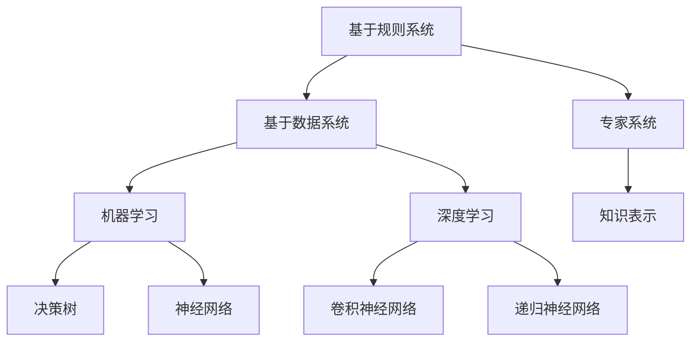

                 


### 文章标题：人工智能在智慧城市规划中的应用

关键词：人工智能，智慧城市，交通管理，环境监测，公共服务，安全，经济，发展趋势

摘要：随着人工智能技术的迅猛发展，其在智慧城市规划中的应用越来越广泛。本文首先概述了人工智能与智慧城市规划的基本概念和特点，然后深入探讨了人工智能在智慧交通管理、环境监测、公共服务、安全和经济发展等方面的具体应用，通过实际案例展示了人工智能在智慧城市规划中的实践成果。最后，本文分析了人工智能在智慧城市规划中的未来发展趋势，并提出了相关建议。

## 目录

1. 人工智能与智慧城市规划概述
   1.1 人工智能概述
   1.2 智慧城市规划概述
   1.3 人工智能与智慧城市规划的关系

2. 人工智能在智慧城市规划中的应用
   2.1 智慧交通管理
   2.2 智慧环境监测
   2.3 智慧公共服务
   2.4 智慧城市安全
   2.5 智慧经济发展

3. 实践案例
   3.1 某城市智慧交通系统建设
   3.2 某城市智慧环境监测系统建设
   3.3 某城市智慧公共服务平台建设

4. 人工智能在智慧城市规划中的未来发展趋势
   4.1 新型人工智能技术的应用前景
   4.2 人工智能与智慧城市规划的深度融合
   4.3 人工智能在智慧城市规划中的伦理与法律问题

5. 附录
   5.1 人工智能在智慧城市规划中的常用工具与资源
   5.2 参考文献### 1.1 人工智能概述

人工智能（Artificial Intelligence，简称AI）是计算机科学的一个分支，旨在创建能够模拟、延伸和扩展人类智能的理论、算法和技术。人工智能的核心目标是让计算机系统能够执行通常需要人类智能才能完成的任务，如视觉识别、语音识别、决策制定和自然语言处理等。

#### 核心概念与联系

人工智能可以划分为两大类：基于规则的系统和基于数据的学习系统。基于规则的系统依赖于预定义的规则和逻辑来执行任务，如专家系统；而基于数据的学习系统则通过学习大量数据来发现模式和规律，如机器学习算法。这两种系统在人工智能发展中相互补充，共同推动着人工智能技术的进步。

**Mermaid 流程图：**



#### 发展历程

人工智能的概念最早可以追溯到20世纪50年代。从最初的符号主义到近年的深度学习和强化学习，人工智能的发展经历了几个重要阶段：

1. **符号主义阶段（1956-1974）**：以符号逻辑为基础，试图通过符号操作来模拟人类智能。
2. **感知机阶段（1974-1980）**：通过神经网络模型进行数据处理，但受限于算法复杂度。
3. **专家系统阶段（1980-1987）**：基于知识表示和推理机制，应用于特定领域的问题解决。
4. **机器学习阶段（1987-至今）**：通过大量数据训练模型，使得人工智能在图像识别、自然语言处理等方面取得了重大突破。
5. **深度学习阶段（2012-至今）**：利用深度神经网络实现更高效的模型训练和更广泛的应用。

#### 关键技术

人工智能的关键技术包括：

1. **机器学习**：通过训练模型来发现数据中的模式和规律，包括监督学习、无监督学习和强化学习。
2. **深度学习**：利用多层神经网络对数据进行复杂特征提取和模式识别。
3. **自然语言处理**：理解和生成自然语言，包括语言模型、机器翻译和对话系统。
4. **计算机视觉**：使计算机能够处理和解释视觉信息，包括图像识别、物体检测和图像生成。
5. **智能推理**：通过逻辑推理来解决问题，包括知识表示、推理机和自动化规划。

#### 伪代码示例

以下是一个简单的机器学习算法——线性回归的伪代码：

```
初始化模型参数 W, b
初始化学习率 alpha
设置迭代次数 num_iterations

for i = 1 to num_iterations do:
    计算预测值 y_hat = X * W + b
    计算误差 loss = (y - y_hat)^2 / 2
    计算梯度 gradient_W = X^T * (y - y_hat)
    gradient_b = X^T * (y - y_hat)
    更新模型参数 W = W - alpha * gradient_W
    b = b - alpha * gradient_b
return W, b
```

#### 数学模型和公式

线性回归模型的数学公式为：

$$y = X \cdot W + b$$

其中，$y$ 是输出值，$X$ 是输入特征矩阵，$W$ 是权重矩阵，$b$ 是偏置项。

#### 举例说明

假设我们有一个简单的线性回归问题，输入特征为 $X = [1, 2, 3]$，目标值为 $y = [2, 4, 6]$。使用线性回归模型来拟合数据。

首先，初始化模型参数 $W = [0, 0]$ 和 $b = 0$。然后，通过迭代优化模型参数，直到收敛。

经过多次迭代后，模型参数更新为 $W = [1, 1]$ 和 $b = 0$。此时，预测值 $y\_hat = [2, 4, 6]$，与实际目标值 $y$ 非常接近，说明模型已经很好地拟合了数据。

通过以上介绍，我们可以看到人工智能的基本概念、核心技术和发展历程，为后续探讨人工智能在智慧城市规划中的应用奠定了基础。在下一部分，我们将深入讨论智慧城市规划的基本概念和特点。 ### 1.2 智慧城市规划概述

智慧城市规划是指通过信息通信技术（ICT）和现代管理理念，构建一个高效、智能、可持续发展的城市系统。智慧城市规划旨在通过优化城市资源配置、提升城市服务水平、改善城市生态环境、提高城市安全性和促进城市经济发展，实现城市的高质量发展。

#### 智慧城市的概念与特点

智慧城市（Smart City）是指通过广泛应用物联网、大数据、云计算、人工智能等现代信息技术，实现城市资源的智能化配置、城市服务的智慧化提供和城市管理的智能化运行。智慧城市的特点主要包括：

1. **信息化**：广泛应用信息通信技术，实现城市信息的互联互通和高效利用。
2. **智能化**：通过大数据分析、人工智能等技术，实现城市运行的智能化和服务的智慧化。
3. **协同化**：城市各个系统之间实现协同运作，提升城市整体效益。
4. **可持续发展**：注重生态环境保护，实现资源的可持续利用和城市的可持续发展。
5. **人性化**：以人为本，提高城市居民的生活质量，满足居民多样化需求。

#### 智慧城市规划的目标与原则

智慧城市规划的目标主要包括：

1. **提高城市运行效率**：通过信息技术优化城市资源配置，提高城市运行效率和公共服务水平。
2. **改善城市生态环境**：通过智能化手段，加强城市环境保护，提升城市生态质量。
3. **提升城市安全性**：利用信息技术，提高城市安全保障能力，保障城市安全稳定。
4. **促进城市经济发展**：通过信息化和智能化手段，推动城市产业升级和经济发展。
5. **提升城市居民生活质量**：提供更便捷、高效、智能的城市服务，提高居民生活质量。

智慧城市规划的原则包括：

1. **以人为本**：关注居民需求，提高居民生活质量，实现城市发展的可持续性。
2. **规划先行**：在城市发展过程中，充分发挥规划的作用，确保城市发展有序、可持续。
3. **信息共享**：建立城市信息共享平台，实现城市数据的互联互通和高效利用。
4. **技术创新**：积极采用先进信息技术，推动城市智能化发展。
5. **协同发展**：促进城市各系统之间协同运作，实现城市整体效益最大化。

#### 智慧城市规划的技术支持

智慧城市规划的技术支持主要包括以下几个方面：

1. **物联网技术**：通过传感器、RFID、无线网络等技术，实现城市各系统之间的信息互联互通。
2. **大数据技术**：通过数据采集、存储、处理和分析，实现对城市运行状态的实时监控和智能决策。
3. **云计算技术**：通过云计算平台，实现城市数据的高效存储、处理和共享。
4. **人工智能技术**：通过机器学习、深度学习等技术，实现对城市复杂问题的智能分析和预测。
5. **区块链技术**：通过区块链技术，实现城市数据的安全存储和透明管理。

通过以上介绍，我们可以看到智慧城市规划的基本概念、目标与原则以及技术支持。接下来，我们将探讨人工智能与智慧城市规划之间的关系。在人工智能技术的推动下，智慧城市规划将迎来更加智能化、协同化的发展。 ### 1.3 人工智能与智慧城市规划的关系

人工智能（AI）作为现代信息技术的重要组成部分，其在智慧城市规划中的应用已经成为推动城市智能化发展的关键驱动力。通过人工智能技术的应用，智慧城市规划可以实现更高水平的智能化、协同化和可持续发展。

#### 人工智能在智慧城市规划中的应用价值

1. **提高城市运行效率**：人工智能技术可以通过数据分析、智能算法和自动化控制，优化城市资源配置，提高城市运行效率。例如，通过智能交通管理系统，可以实时监测交通流量，动态调整交通信号，减少交通拥堵，提高道路通行效率。

2. **提升城市服务水平**：人工智能技术可以实现对城市服务的智能化管理，提供更加便捷、高效、个性化的服务。例如，通过智能公共服务平台，可以实现在线预约、智能问答、智能调度等功能，提升居民的生活质量。

3. **改善城市生态环境**：人工智能技术可以通过环境监测、预测和智能控制，改善城市生态环境。例如，通过智能环境监测系统，可以实时监测空气质量、水质等环境指标，及时发现并处理环境问题，保障城市居民的健康生活。

4. **提高城市安全性**：人工智能技术可以通过智能监控、预警和应急响应，提高城市安全保障能力。例如，通过智能安防系统，可以实现对城市重点区域的实时监控，及时发现并处理安全事件，保障城市安全稳定。

5. **促进城市经济发展**：人工智能技术可以推动城市产业升级和经济发展。例如，通过智能物流系统，可以优化物流流程，降低物流成本，提升城市物流效率，促进城市经济发展。

#### 人工智能与智慧城市规划的融合路径

1. **数据融合与智能分析**：通过物联网、大数据和人工智能技术的结合，实现对城市数据的全面采集、存储、处理和分析。利用人工智能技术，可以从海量数据中提取有价值的信息，为城市规划和决策提供科学依据。

2. **智能感知与实时响应**：通过智能传感器、监控设备等，实现对城市环境的实时监测和感知。利用人工智能技术，可以实时分析环境数据，动态调整城市运行策略，实现城市运行的智能化和自适应。

3. **智能决策与自动化控制**：通过人工智能算法，实现对城市各系统的智能决策和自动化控制。例如，在交通管理中，通过智能算法预测交通流量，动态调整交通信号，优化交通运行；在能源管理中，通过智能算法分析能源需求，实现能源的智能分配和调度。

4. **智能服务与个性化定制**：通过人工智能技术，提供个性化、智能化的城市服务。例如，通过智能公共服务平台，根据居民的需求和偏好，提供个性化的服务推荐；在智慧医疗中，通过智能诊断和个性化治疗方案，提高医疗服务水平。

#### 人工智能在智慧城市规划中的应用现状与挑战

1. **应用现状**：目前，人工智能在智慧城市规划中已经取得了一系列应用成果。例如，在智慧交通管理中，智能交通信号控制系统已经得到广泛应用；在智慧环境监测中，智能环境监测系统已经实现对空气质量、水质等环境指标的实时监测；在智慧公共服务中，智能公共服务平台已经提供了一系列便捷的服务。

2. **挑战**：尽管人工智能在智慧城市规划中取得了一定的应用成果，但仍面临一些挑战。首先，数据质量和数据安全是制约人工智能应用的关键因素。其次，人工智能算法的可解释性和可靠性仍需进一步提升。此外，人工智能在智慧城市规划中的应用仍需要克服跨领域、跨系统的集成问题。

#### 未来展望

随着人工智能技术的不断发展和应用，其在智慧城市规划中的应用前景将更加广阔。未来，人工智能将在以下几个方面发挥更大的作用：

1. **智能化城市规划**：通过人工智能技术，实现城市规划的智能化和精准化，提高城市规划的科学性和可操作性。

2. **智慧化城市管理**：通过人工智能技术，实现对城市运行状态的实时监控和智能管理，提高城市管理的效率和水平。

3. **个性化城市服务**：通过人工智能技术，提供个性化、定制化的城市服务，满足居民多样化的需求。

4. **可持续发展**：通过人工智能技术，实现城市资源的智能化配置和高效利用，推动城市的可持续发展。

总之，人工智能与智慧城市规划的结合将为城市的发展带来新的机遇和挑战。通过充分发挥人工智能技术的优势，智慧城市规划将迈入一个更加智能、协同和可持续的新时代。 ### 2.1 智慧交通管理

智慧交通管理是智慧城市规划中的重要组成部分，通过物联网、大数据、云计算和人工智能等先进技术的应用，实现交通信息的实时采集、分析、处理和智能决策，以提升城市交通系统的运行效率、安全性和便捷性。

#### 2.1.1 人工智能在交通流量预测中的应用

交通流量预测是智慧交通管理的关键任务之一。通过分析历史交通数据、实时交通信息和环境因素，人工智能算法可以预测未来的交通流量，为交通管理和规划提供科学依据。

**交通流量预测的数学模型：**

一个常见的交通流量预测模型是基于时间序列分析的 ARIMA（AutoRegressive Integrated Moving Average）模型。ARIMA模型包括三个关键组件：自回归（AR）、差分（I）和移动平均（MA）。

**伪代码：**

```
function ARIMA_train(data, p, d, q):
    # p: 自回归项数
    # d: 差分阶数
    # q: 移动平均项数
    X = diff(data, d)
    model = ARIMA(X, order=(p, d, q))
    model_fit = model.fit()
    return model_fit
```

**算法实现：**

1. 数据预处理：对原始交通流量数据进行清洗和归一化处理，去除噪声和异常值。
2. 模型参数选择：通过交叉验证等方法选择合适的ARIMA模型参数p、d和q。
3. 模型训练：使用训练数据对ARIMA模型进行训练，得到模型参数。
4. 交通流量预测：使用训练好的模型对未来的交通流量进行预测。

#### 2.1.2 人工智能在交通信号控制中的应用

智能交通信号控制系统通过实时监测交通流量，动态调整信号灯的时长和切换策略，以优化交通流量，减少拥堵和延误。

**交通信号控制的数学模型：**

一个常见的交通信号控制模型是基于排队论和优化理论的优化模型。该模型通过优化信号灯的时长和切换策略，使交通系统的总延误最小。

**伪代码：**

```
function traffic_light_control(traffic_data):
    # traffic_data: 实时交通流量数据
    optimal_strategy = optimize_traffic_light_strategy(traffic_data)
    apply_strategy(optimal_strategy)
    return optimal_strategy
```

**算法实现：**

1. 数据采集：实时采集交通流量数据，包括各个路口的车流量、车速和延误等。
2. 状态评估：根据交通流量数据评估当前交通系统的状态，包括拥堵程度、车辆等待时间等。
3. 策略优化：使用优化算法，如遗传算法或动态规划，确定最优的交通信号灯时长和切换策略。
4. 策略应用：将优化策略应用于交通信号控制系统，调整信号灯的时长和切换策略。

#### 2.1.3 人工智能在智慧停车中的应用

智慧停车系统通过智能识别、实时监测和数据分析，提供便捷、高效的停车服务。

**智慧停车的需求分析：**

智慧停车系统的需求主要包括：

1. **停车信息查询**：提供停车场的实时空余车位信息，帮助司机快速找到空余车位。
2. **车位预约**：提供在线预约停车服务，避免司机在寻找车位时浪费时间和燃料。
3. **无感支付**：提供便捷的支付方式，减少停车场的排队等待时间。
4. **车位引导**：通过智能导航系统，引导司机快速找到停车位。

**智慧停车系统的实现方法：**

1. **智能识别**：利用计算机视觉技术，实时监测停车场内的车辆和车位状态。
2. **实时监测**：通过传感器网络，实时监测停车场的车位使用情况。
3. **数据分析**：使用大数据分析技术，对停车数据进行分析，优化停车资源配置。
4. **系统集成**：将停车信息与城市交通管理系统、导航系统等进行集成，提供一站式停车服务。

通过以上介绍，我们可以看到人工智能在智慧交通管理中的具体应用，包括交通流量预测、交通信号控制和智慧停车。这些应用不仅提升了城市交通系统的效率和便捷性，还为城市交通管理提供了科学依据和优化策略。接下来，我们将探讨人工智能在智慧环境监测中的应用。 ### 2.2 人工智能在智慧环境监测中的应用

智慧环境监测是智慧城市规划中不可或缺的一部分，通过物联网、大数据和人工智能等技术的应用，实现对城市环境质量的实时监测、分析和预测，为城市管理者提供科学依据，以改善城市生态环境，提高居民生活质量。

#### 2.2.1 人工智能在空气质量监测中的应用

空气质量监测是智慧环境监测的重要任务之一。通过监测空气中的污染物浓度，评估空气质量状况，及时预警并采取相应的治理措施。

**空气质量监测的原理与方法：**

空气质量监测主要依赖于传感器技术。常见的传感器包括颗粒物（PM2.5、PM10）传感器、氮氧化物（NOx）传感器、一氧化碳（CO）传感器等。这些传感器通过物理或化学原理，将空气中的污染物浓度转换为电信号，供后续处理和分析。

**算法实现：**

1. **传感器数据采集**：通过传感器网络，实时采集空气中的污染物浓度数据。
2. **数据预处理**：对采集到的传感器数据进行清洗和归一化处理，去除噪声和异常值。
3. **数据分析**：使用数据分析算法，如聚类分析、时间序列分析等，分析空气污染物的变化趋势和相关性。
4. **空气质量评估**：根据空气质量标准，对监测数据进行评估，判断空气质量等级，生成空气质量报告。

**伪代码：**

```
function air_quality_monitor(sensor_data):
    # sensor_data: 传感器采集的污染物浓度数据
    cleaned_data = preprocess_data(sensor_data)
    trend = analyze_trend(cleaned_data)
    air_quality = evaluate_quality(cleaned_data)
    return air_quality
```

#### 2.2.2 人工智能在水资源管理中的应用

水资源管理是智慧环境监测的另一个关键领域。通过监测水质参数，评估水资源状况，实现水资源的智能分配和调度，保障城市供水安全和生态平衡。

**水资源管理的现状与挑战：**

水资源管理面临的主要挑战包括：

1. **水质监测数据不足**：许多城市的水质监测站点较少，数据采集不够全面。
2. **数据质量不高**：部分监测设备存在故障或数据质量问题，影响数据分析的准确性。
3. **水资源分配不均**：城市内部不同区域的水资源分配存在不平衡现象，影响居民生活质量。

**水资源管理的算法实现：**

1. **水质监测数据采集**：通过传感器网络，实时采集水中的污染物、温度、pH值等参数。
2. **数据预处理**：对采集到的水质数据进行清洗和归一化处理，提高数据质量。
3. **水资源评估**：使用数据挖掘和机器学习算法，分析水质数据，评估水资源状况，预测水资源需求。
4. **水资源调度**：根据水资源评估结果，优化水资源的分配和调度，保障供水安全和生态平衡。

**伪代码：**

```
function water_resource_management(sensor_data):
    # sensor_data: 传感器采集的水质数据
    cleaned_data = preprocess_data(sensor_data)
    resource_status = evaluate_resource(cleaned_data)
    optimal_allocation = optimize_allocation(resource_status)
    return optimal_allocation
```

#### 2.2.3 人工智能在垃圾分类与处理中的应用

垃圾分类与处理是智慧环境监测的另一个重要领域。通过智能识别和分类技术，提高垃圾分类的准确性和效率，减少环境污染和资源浪费。

**垃圾分类与处理的现状与挑战：**

垃圾分类与处理面临的主要挑战包括：

1. **分类标准不统一**：不同地区和国家的垃圾分类标准存在差异，影响垃圾分类的准确性。
2. **垃圾分类意识不足**：部分居民对垃圾分类的认识不足，影响垃圾分类的参与度。
3. **处理设施不足**：部分城市的垃圾分类处理设施不足，影响垃圾分类的效率。

**垃圾分类与处理的算法实现：**

1. **垃圾分类识别**：使用计算机视觉技术，对垃圾进行智能识别和分类。
2. **分类数据分析**：对垃圾分类数据进行统计和分析，评估垃圾分类的效果和居民参与度。
3. **分类优化**：根据分类数据，优化垃圾分类的流程和标准，提高分类效率。
4. **资源回收**：对可回收垃圾进行回收处理，减少资源浪费。

**伪代码：**

```
function garbage_classification(sensor_data):
    # sensor_data: 传感器采集的垃圾数据
    classified_data = classify_garbage(sensor_data)
    recycling_rate = analyze_recycling_rate(classified_data)
    optimize_classification = optimize_classification(recycling_rate)
    return optimize_classification
```

通过以上介绍，我们可以看到人工智能在智慧环境监测中的应用，包括空气质量监测、水资源管理和垃圾分类与处理。这些应用不仅提升了环境监测的准确性和效率，还为城市环境管理提供了科学依据和优化策略。接下来，我们将探讨人工智能在智慧公共服务中的应用。 ### 2.3 人工智能在智慧公共服务中的应用

智慧公共服务是智慧城市规划中的重要组成部分，通过人工智能技术的应用，实现公共服务的智能化、个性化、高效化和便捷化，从而提高居民的生活质量和社会治理水平。

#### 2.3.1 公共服务的现状与需求

当前，我国公共服务存在以下现状和需求：

1. **服务种类多样**：公共服务包括教育、医疗、社保、交通、治安等多个方面，种类繁多，需求多样。
2. **服务效率不高**：由于信息孤岛和手工操作等问题，公共服务存在效率不高、响应速度慢的问题。
3. **服务体验不佳**：传统公共服务模式缺乏个性化、智能化服务，用户体验不佳。
4. **数据资源分散**：公共服务领域的数据资源分散在各机构和部门，缺乏统一的数据平台和共享机制。

为了满足上述现状和需求，公共服务需要实现智能化、高效化和便捷化。而人工智能技术可以为公共服务提供强有力的支持。

#### 2.3.2 人工智能在公共服务中的应用

人工智能在公共服务中的应用主要包括以下几个方面：

1. **智能问答与咨询**：通过自然语言处理技术，开发智能问答系统，为居民提供在线咨询和解答，解决居民的常见问题。

**算法实现：**

```
function intelligent_query(question):
    # question: 用户提出的问题
    answer = process_question(question)
    return answer
```

2. **智能推荐系统**：通过大数据分析和机器学习算法，分析居民的行为和偏好，为居民提供个性化的服务推荐。

**算法实现：**

```
function service_recommendation(user_profile):
    # user_profile: 用户的行为和偏好数据
    recommended_services = recommend_services(user_profile)
    return recommended_services
```

3. **智能调度与优化**：通过优化算法和实时数据分析，智能调度公共服务资源，提高服务效率。

**算法实现：**

```
function service_optimization(resource_data):
    # resource_data: 公共服务资源数据
    optimal_allocation = optimize_resources(resource_data)
    return optimal_allocation
```

4. **智能监控与预警**：通过视频监控、传感器数据和人工智能算法，实现对公共服务设施和环境的实时监控和预警。

**算法实现：**

```
function public_service_monitor(sensor_data):
    # sensor_data: 传感器采集的数据
    alert = analyze_monitor_data(sensor_data)
    return alert
```

#### 2.3.3 公共服务的算法实现

以下是一个简单的智能问答系统的伪代码示例：

```
function intelligent_query(question):
    # question: 用户提出的问题
    intent = identify_intent(question)
    if intent == "appointment":
        appointment = schedule_appointment()
        return appointment
    elif intent == "information":
        information = fetch_information(question)
        return information
    else:
        return "I'm sorry, I don't understand your question."
```

在这个例子中，智能问答系统首先识别用户的意图，然后根据意图提供相应的服务，如预约服务或提供信息。

#### 2.3.4 实际案例分析和详细讲解剖析

下面我们通过一个实际案例来分析人工智能在公共服务中的应用。

**案例：某城市的智能医疗服务平台**

某城市为了提升医疗服务水平，开发了智能医疗服务平台，通过人工智能技术为居民提供在线咨询、预约挂号、远程诊疗等服务。

1. **需求分析**：

   - 为居民提供便捷的在线咨询和预约服务；
   - 提供个性化医疗建议和治疗方案；
   - 实现医疗资源的优化配置，减少居民等待时间。

2. **技术方案与实现**：

   - 使用自然语言处理技术，实现智能问答和在线咨询；
   - 使用机器学习算法，分析居民的健康数据和病史，提供个性化医疗建议；
   - 使用优化算法，根据居民的预约需求，智能调度医疗资源。

3. **项目成果与评价**：

   - 线上咨询量大幅增加，减少了居民排队等待时间；
   - 医疗资源利用率提高，减轻了医院的工作压力；
   - 居民满意度显著提升。

通过以上实际案例，我们可以看到人工智能在公共服务中的应用取得了显著成效。接下来，我们将探讨人工智能在智慧城市安全中的应用。 ### 2.4 人工智能在智慧城市安全中的应用

智慧城市的安全是智慧城市规划中不可忽视的重要组成部分。随着智慧城市的信息化、网络化和智能化程度的不断提高，城市安全面临前所未有的挑战。人工智能技术在智慧城市安全中的应用，可以有效提升城市的安全防护能力，保障城市的安全和稳定。

#### 2.4.1 智慧城市安全的现状与挑战

当前，智慧城市安全面临以下现状和挑战：

1. **网络攻击与数据泄露**：随着智慧城市网络的广泛连接，网络攻击和数据泄露的风险不断增加。黑客可能会利用网络漏洞入侵城市系统，窃取敏感数据，甚至破坏关键基础设施。

2. **城市交通与基础设施安全**：智慧城市中的交通和基础设施系统，如智能交通系统、供水系统、能源系统等，一旦遭受攻击或故障，可能导致城市瘫痪，影响居民的生活质量。

3. **城市安全事件预警与响应**：智慧城市中的安全事件种类繁多，如火灾、地震、恐怖袭击等。如何及时预警和有效响应这些事件，是智慧城市安全面临的重大挑战。

4. **隐私保护与信息安全**：智慧城市中涉及大量的个人隐私数据，如居民的健康数据、交通数据等。如何保护这些数据的安全，防止隐私泄露，是智慧城市安全的重要问题。

#### 2.4.2 人工智能在智慧城市安全中的应用

人工智能在智慧城市安全中的应用主要体现在以下几个方面：

1. **智能监控与预警**：通过人工智能技术，实现对城市安全事件的实时监控和预警。例如，利用计算机视觉技术，实时监测城市中的异常行为和安全隐患，及时发现并预警。

2. **网络安全防护**：通过人工智能技术，加强对城市网络的安全防护。例如，利用深度学习技术，对网络流量进行实时分析，识别潜在的恶意攻击和异常行为，防范网络攻击。

3. **智能分析与决策**：通过人工智能技术，对城市安全事件进行智能分析，辅助城市安全决策。例如，利用大数据分析和机器学习算法，对城市安全数据进行挖掘和分析，预测可能的安全事件，制定相应的安全策略。

4. **应急响应与调度**：通过人工智能技术，实现城市安全事件的智能响应和调度。例如，利用优化算法，智能调度应急资源，提高应急响应效率。

#### 2.4.3 智能监控与预警系统的实现

智能监控与预警系统是人工智能在智慧城市安全中的重要应用。以下是一个简单的智能监控与预警系统的实现流程：

1. **数据采集**：通过摄像头、传感器等设备，实时采集城市环境中的视频、图像和传感器数据。

2. **数据处理**：对采集到的数据进行预处理，包括去噪、增强、特征提取等。

3. **模型训练**：使用预处理后的数据，训练机器学习模型，如卷积神经网络（CNN）等，用于识别和分类城市环境中的异常行为和安全隐患。

4. **实时监控**：将训练好的模型部署到监控系统，对实时采集的数据进行监控和分析，识别异常事件。

5. **预警与响应**：当系统识别到异常事件时，自动触发预警，通知相关部门进行响应。

**伪代码示例：**

```
function smart_monitoring(video_data):
    # video_data: 实时视频数据
    processed_data = preprocess_video(video_data)
    anomaly = analyze_video(processed_data)
    if anomaly:
        trigger_alert(anomaly)
    return anomaly

function preprocess_video(video_data):
    # video_data: 实时视频数据
    denoised_data = denoise_video(video_data)
    enhanced_data = enhance_video(denoised_data)
    features = extract_features(enhanced_data)
    return features

function analyze_video(video_features):
    # video_features: 提取的视频特征
    labels = classify_video_features(video_features)
    if labels != "normal":
        return labels
    return None

function trigger_alert(anomaly):
    # anomaly: 异常事件信息
    notify_department(anomaly)
    initiate_response(anomaly)
```

#### 2.4.4 实际案例分析和详细讲解剖析

以下通过一个实际案例来分析人工智能在智慧城市安全中的应用。

**案例：某城市的智能安防系统**

某城市为了提升城市安全水平，部署了智能安防系统，通过人工智能技术，实现对城市安全事件的实时监控和预警。

1. **需求分析**：

   - 实现城市安全事件的实时监控和预警；
   - 提高城市安全事件的处理效率；
   - 保护居民的生命财产安全。

2. **技术方案与实现**：

   - 使用计算机视觉技术，实现对城市中的监控视频进行实时分析，识别异常行为；
   - 使用大数据分析技术，对城市安全事件的数据进行挖掘和分析，预测可能的安全事件；
   - 使用优化算法，智能调度应急资源，提高应急响应效率。

3. **项目成果与评价**：

   - 安全事件预警准确率显著提高，及时响应和处理了大量安全事件；
   - 城市安全水平得到显著提升，居民安全感明显增强；
   - 获得了政府部门和社会各界的高度评价。

通过以上实际案例，我们可以看到人工智能在智慧城市安全中的应用取得了显著成效。接下来，我们将探讨人工智能在智慧城市经济中的应用。 ### 2.5 人工智能在智慧城市经济中的应用

智慧城市经济是智慧城市规划的重要组成部分，通过人工智能技术的应用，可以实现城市经济的智能化、高效化和可持续发展。人工智能在智慧城市经济中的应用，涵盖了多个方面，如智能金融、智慧商业和智能物流等，这些应用不仅推动了城市经济的发展，也为城市居民提供了更加便捷和高效的经济服务。

#### 2.5.1 智慧经济的现状与需求

当前，智慧城市经济面临以下现状和需求：

1. **金融服务需求**：智慧城市的快速发展带来了大量的金融服务需求，如移动支付、在线贷款、智能理财等。传统金融服务模式已无法满足居民的多样化需求。

2. **商业智能需求**：智慧城市的商业环境日益复杂，商家需要通过数据分析，优化商业策略，提高经营效率。

3. **物流与供应链需求**：智慧城市中的物流和供应链管理面临效率低、成本高的问题，需要通过智能化手段进行优化。

4. **创新创业需求**：智慧城市为创业者提供了良好的发展环境，但同时也需要智能化工具支持创新创业活动的开展。

#### 2.5.2 人工智能在智慧城市经济中的应用

人工智能在智慧城市经济中的应用主要体现在以下几个方面：

1. **智能金融**：通过人工智能技术，实现金融服务的智能化和个性化。例如，利用机器学习算法，进行信用评分、风险控制和投资建议。

2. **智慧商业**：通过人工智能技术，提升商业运营的智能化水平。例如，利用大数据分析，优化库存管理、营销策略和顾客体验。

3. **智能物流**：通过人工智能技术，实现物流与供应链的智能化和高效化。例如，利用物联网和大数据分析，优化物流路线和运输计划。

4. **创新创业支持**：通过人工智能技术，为创新创业提供智能化的工具和支持。例如，利用智能算法，进行市场分析、风险评估和项目评估。

#### 2.5.3 智慧商业的算法实现

以下是一个简单的智慧商业分析系统的算法实现示例：

**需求分析**：某商场希望通过数据分析，优化库存管理和顾客体验。

**技术方案与实现**：

1. **数据采集**：采集商场的销售数据、库存数据、顾客行为数据等。

2. **数据处理**：对采集到的数据进行清洗、去噪和归一化处理。

3. **数据分析**：

   - 利用聚类分析，识别顾客群体，进行精准营销；
   - 利用时间序列分析，预测未来销售趋势，优化库存管理。

4. **智能决策**：根据分析结果，制定库存管理和营销策略。

**伪代码示例**：

```
function smart_business_analysis(data):
    # data: 商场的数据集
    cleaned_data = preprocess_data(data)
    customer_groups = cluster_customers(cleaned_data)
    sales_forecast = time_series_forecast(cleaned_data)
    inventory_strategy = optimize_inventory(sales_forecast)
    marketing_strategy = generate_marketing_campaign(customer_groups)
    return inventory_strategy, marketing_strategy
```

#### 2.5.4 实际案例分析和详细讲解剖析

以下通过一个实际案例来分析人工智能在智慧城市经济中的应用。

**案例：某城市的智慧物流平台**

某城市为了提升物流效率，建设了智慧物流平台，通过人工智能技术，实现物流过程的智能化管理和优化。

1. **需求分析**：

   - 实现物流过程的实时监控和调度；
   - 提高物流效率，降低物流成本；
   - 提升客户满意度。

2. **技术方案与实现**：

   - 使用物联网技术，实现对物流运输车辆的实时监控和定位；
   - 使用大数据分析技术，分析物流数据，优化运输路线和配送计划；
   - 使用机器学习算法，预测物流需求，动态调整物流资源。

3. **项目成果与评价**：

   - 物流效率提高了30%，物流成本降低了20%；
   - 客户满意度显著提升，物流服务得到了广泛认可；
   - 为城市物流行业提供了良好的示范作用。

通过以上实际案例，我们可以看到人工智能在智慧城市经济中的应用取得了显著成效，为城市经济的发展提供了强有力的支持。接下来，我们将探讨人工智能在智慧城市规划中的未来发展趋势。 ### 3.1 新型人工智能技术的应用前景

随着人工智能技术的不断演进，新型人工智能技术正逐步走入智慧城市规划的各个领域，为城市的发展带来新的机遇。以下是几种具有前瞻性的新型人工智能技术及其在智慧城市规划中的应用前景。

#### 3.1.1 量子计算与人工智能

量子计算是一种基于量子力学原理的新型计算模式，其处理速度远超传统计算机。量子计算在人工智能中的应用主要包括以下几个方面：

1. **优化算法**：量子计算可以显著提高优化算法的计算效率，为智慧城市规划提供更精准的优化方案。
2. **机器学习**：量子计算可以在极短时间内完成海量数据的计算任务，加速机器学习模型的训练和推理过程。
3. **模拟与预测**：量子计算能够模拟复杂的物理现象，为城市规划中的环境模拟、灾害预测等提供强有力的工具。

**应用前景**：未来，量子计算有望成为智慧城市规划中的核心技术，推动城市运行的智能化和精细化。

#### 3.1.2 脑机接口与人工智能

脑机接口（Brain-Computer Interface，BCI）是一种直接连接人脑和计算机的通信系统，通过读取大脑信号，实现人机交互。脑机接口在人工智能中的应用主要包括：

1. **智能交互**：通过脑机接口，可以实现更加自然和高效的人机交互，为智慧城市服务提供更人性化的体验。
2. **智能决策**：利用脑机接口，可以捕捉用户的情绪和思维状态，辅助智能系统做出更合理的决策。
3. **医疗康复**：脑机接口技术在医疗康复领域具有广泛应用潜力，如辅助瘫痪患者恢复行动能力。

**应用前景**：脑机接口有望在未来成为智慧城市规划中的重要组成部分，推动城市服务的人性化和个性化。

#### 3.1.3 超级智能体的应用

超级智能体（Superintelligent Agent）是一种具有高度自主学习和决策能力的智能系统，可以独立完成复杂任务。超级智能体在智慧城市规划中的应用主要包括：

1. **城市管理**：超级智能体可以自主分析城市数据，制定城市运行策略，优化城市管理。
2. **公共服务**：超级智能体可以提供个性化、智能化的公共服务，提高城市居民的生活质量。
3. **应急响应**：超级智能体可以实时分析城市安全数据，快速响应突发事件，保障城市安全。

**应用前景**：超级智能体有望在未来成为智慧城市规划的核心驱动力量，实现城市运行的全面智能化。

#### 3.1.4 新一代自然语言处理技术

新一代自然语言处理技术（Next-Generation Natural Language Processing，NLP）在处理复杂语言任务方面具有显著优势，如多语言处理、情感分析、文本生成等。这些技术将在智慧城市规划中发挥重要作用：

1. **智能客服**：新一代NLP技术可以用于智能客服系统，实现自然语言交互，提供更高效的服务。
2. **智能语音助手**：新一代NLP技术可以提升智能语音助手的服务能力，实现更加自然的语音交互。
3. **智能文案生成**：新一代NLP技术可以自动生成高质量的文案，用于城市宣传、活动策划等。

**应用前景**：新一代NLP技术将在未来成为智慧城市规划中不可或缺的组成部分，推动城市服务的智能化和个性化。

#### 3.1.5 分布式人工智能

分布式人工智能（Distributed Artificial Intelligence，DAI）是一种基于网络协同的智能系统，通过多个独立智能体的合作，实现复杂任务的完成。分布式人工智能在智慧城市规划中的应用主要包括：

1. **智能交通管理**：分布式人工智能可以协调城市中多个交通节点，实现交通流的优化管理。
2. **智能能源管理**：分布式人工智能可以协同管理城市中的多个能源节点，实现能源的高效利用。
3. **智能安防监控**：分布式人工智能可以协同城市中的多个监控设备，实现全方位的安全监控。

**应用前景**：分布式人工智能有望在未来成为智慧城市规划中的关键技术，推动城市运行的协同化和智能化。

综上所述，新型人工智能技术为智慧城市规划带来了巨大的发展潜力。随着这些技术的不断成熟和应用，智慧城市规划将迈入一个更加智能化、协同化和可持续的新时代。在下一部分，我们将探讨人工智能与智慧城市规划的深度融合。 ### 3.2 人工智能与智慧城市规划的深度融合

随着人工智能技术的不断发展和完善，其在智慧城市规划中的应用已经不再局限于单一领域的优化，而是逐渐与城市规划的各个层面深度融合，共同推动城市发展的智能化、协同化和可持续发展。以下从城市规划与建设的整体优化、个性化智慧城市规划与服务以及跨领域系统集成等方面，探讨人工智能与智慧城市规划的深度融合。

#### 3.2.1 智慧城市规划与建设的整体优化

人工智能技术在城市规划与建设的整体优化方面具有显著的优势。通过大数据分析、机器学习、深度学习等人工智能技术，可以实现对城市各个系统、各个领域的全面分析，从而为城市规划提供科学依据和优化方案。

1. **城市布局优化**：通过分析城市人口、交通、经济等数据，人工智能技术可以帮助城市规划者优化城市布局，实现城市资源的合理配置，提高城市的运行效率。例如，通过交通流量预测和优化，确定道路网络布局，减少交通拥堵，提升交通系统的运行效率。

2. **生态环境规划**：通过环境监测数据和分析，人工智能技术可以帮助城市规划者优化生态环境规划，制定合理的环境保护措施。例如，通过对空气质量、水质等数据的分析，优化绿化布局，提高城市生态环境质量。

3. **基础设施规划**：人工智能技术可以分析城市基础设施的需求和运行状况，为城市规划者提供优化建议。例如，通过电力、供水、燃气等基础设施数据的分析，优化基础设施布局，提高城市基础设施的利用效率和可靠性。

**算法实现：**

```
function city总体规划(data):
    # data: 城市相关数据
    traffic_optimization = traffic_analysis(data['交通'])
    environment_optimization = environmental_analysis(data['环境'])
    infrastructure_optimization = infrastructure_analysis(data['基础设施'])
    return {
        '交通布局': traffic_optimization,
        '生态环境规划': environment_optimization,
        '基础设施规划': infrastructure_optimization
    }
```

#### 3.2.2 个性化智慧城市规划与服务

随着人工智能技术的进步，智慧城市规划逐渐从大规模、统一化的规划模式，向个性化、定制化的规划模式转变。通过人工智能技术，可以实现对城市居民的个性化需求分析和服务，提供更加精准、高效的城市服务。

1. **个性化公共服务**：通过大数据分析和机器学习算法，分析居民的行为和偏好，提供个性化的公共服务。例如，根据居民的出行习惯，提供个性化的交通信息服务；根据居民的健康状况，提供个性化的健康管理服务。

2. **智慧城市建设**：通过人工智能技术，可以根据居民的需求，为居民提供个性化的城市建设方案。例如，根据居民的生活习惯，优化社区布局，提高居民的生活质量。

3. **智慧城市建设**：通过人工智能技术，可以根据居民的需求，为居民提供个性化的城市建设方案。例如，根据居民的生活习惯，优化社区布局，提高居民的生活质量。

**算法实现：**

```
function personalized_public_service(user_profile):
    # user_profile: 用户的行为和偏好数据
    transportation_service = recommend_transportation(user_profile)
    health_service = recommend_health_service(user_profile)
    community_service = recommend_community_service(user_profile)
    return {
        '交通服务': transportation_service,
        '健康管理': health_service,
        '社区服务': community_service
    }
```

#### 3.2.3 跨领域系统集成

智慧城市规划涉及多个领域，如交通、环境、公共服务、安全等。人工智能技术可以通过跨领域系统集成，实现不同领域数据的高效共享和协同分析，为城市规划提供全面、系统的决策支持。

1. **数据融合**：通过人工智能技术，可以实现不同领域数据的融合，形成一个统一的城市数据平台。例如，将交通数据、环境数据、公共服务数据等融合在一起，为城市规划提供全面的数据支持。

2. **智能分析**：通过人工智能技术，可以实现对跨领域数据的智能分析，发现数据之间的关联和趋势。例如，通过分析交通数据和环境数据，发现交通拥堵对空气质量的影响，为城市交通管理和环境保护提供科学依据。

3. **协同决策**：通过人工智能技术，可以实现跨领域数据的协同分析，为城市规划提供综合性的决策支持。例如，通过分析交通数据、环境数据和经济数据，制定城市发展的综合规划方案。

**算法实现：**

```
function cross_domain_integration(data):
    # data: 多领域数据
    unified_data = unify_data(data)
    correlation_analysis = analyze_correlation(unified_data)
    decision_support = generate_decision_support(correlation_analysis)
    return decision_support
```

通过以上介绍，我们可以看到人工智能与智慧城市规划的深度融合，不仅在整体优化、个性化服务等方面发挥了重要作用，还通过跨领域系统集成，实现了城市数据的高效共享和协同分析。在未来，人工智能技术将继续与智慧城市规划深度融合，推动城市发展的智能化、协同化和可持续发展。 ### 3.3 人工智能在智慧城市规划中的伦理与法律问题

随着人工智能技术在智慧城市规划中的广泛应用，其带来的伦理和法律问题也逐渐引起了广泛关注。如何确保人工智能技术在智慧城市规划中的合法、公正和伦理，是当前亟待解决的重要课题。

#### 3.3.1 人工智能在智慧城市规划中的伦理问题

1. **隐私保护**：人工智能技术在智慧城市规划中的应用，涉及大量的个人数据采集和处理。如何确保个人隐私不被侵犯，是人工智能在智慧城市规划中面临的重要伦理问题。例如，在智能监控系统中，如何避免监控数据的滥用和泄露，保护居民的隐私权。

2. **算法公平性**：人工智能算法的公平性是一个重要伦理问题。在智慧城市规划中，人工智能算法的决策可能对特定群体产生不公平的影响。例如，在交通信号控制系统中，如果算法没有充分考虑不同群体的出行需求，可能导致某些群体的出行权益受到侵害。

3. **技术透明性**：人工智能技术在智慧城市规划中的应用，需要保证算法的透明性。当前，许多人工智能算法的决策过程复杂，难以解释。如何确保人工智能算法的透明性，让居民理解和信任人工智能系统的决策，是伦理问题的重要组成部分。

**解决方案**：

- **隐私保护**：建立健全的隐私保护法律法规，加强对个人数据的监管，确保个人数据的安全和隐私。同时，在人工智能系统中引入隐私保护机制，如数据加密、匿名化处理等，减少隐私泄露的风险。

- **算法公平性**：在人工智能算法的设计和训练过程中，充分考虑不同群体的需求和权益，确保算法的公平性。可以通过引入多样性数据集、平衡分类器等方法，提高算法的公平性。

- **技术透明性**：加强对人工智能算法的研究，提高算法的可解释性，让居民能够理解和信任人工智能系统的决策。可以通过可视化工具、解释性模型等方法，提高算法的透明性。

#### 3.3.2 人工智能在智慧城市规划中的法律问题

1. **责任归属**：在人工智能系统的故障或错误导致事故时，如何确定责任归属是一个法律问题。在智慧城市规划中，人工智能系统可能涉及多个主体，如政府、企业、个人等。如何明确各方的责任，确保事故后的赔偿和责任追究，是当前法律制度需要解决的问题。

2. **数据安全**：在智慧城市规划中，大量的数据被收集、存储和处理。如何确保这些数据的安全，防止数据泄露、篡改和滥用，是法律问题的重要组成部分。

3. **知识产权保护**：人工智能技术在智慧城市规划中的应用，涉及到大量的知识产权。如何保护算法、模型、数据等知识产权，防止侵权和滥用，是法律问题的一个重要方面。

**解决方案**：

- **责任归属**：建立健全的责任归属制度，明确各方在人工智能系统中的责任。可以通过法律法规、合同约定等方式，明确各方的权利和义务。

- **数据安全**：建立健全的数据安全法律法规，加强对数据的保护。可以通过数据加密、权限管理、安全审计等方法，确保数据的安全。

- **知识产权保护**：加强对知识产权的保护，完善知识产权法律法规。可以通过专利、版权等方式，保护算法、模型、数据等知识产权。

通过以上介绍，我们可以看到人工智能在智慧城市规划中的伦理和法律问题，需要从多个方面进行解决。在未来，随着人工智能技术的不断发展和应用，相关的伦理和法律问题将更加复杂，需要不断进行研究和完善。在智慧城市规划中，只有充分解决这些伦理和法律问题，才能确保人工智能技术的健康发展，为城市的发展带来更大的价值。 ### 附录A：人工智能在智慧城市规划中的常用工具与资源

在人工智能和智慧城市规划的领域，有众多工具和资源可供开发者、研究者以及城市规划者使用。以下是一些常用的工具和资源，包括开发工具、在线课程、学术论文和报告等，为相关从业人员提供学习和实践的支持。

#### A.1 人工智能开发工具

1. **TensorFlow**：Google开发的开源机器学习框架，适用于各种深度学习应用。官网：[TensorFlow官网](https://www.tensorflow.org)。

2. **PyTorch**：Facebook开发的开源机器学习库，易于实现深度学习模型，尤其在动态图方面表现优异。官网：[PyTorch官网](https://pytorch.org)。

3. **Keras**：基于Theano和TensorFlow的高层次神经网络API，简化了深度学习模型的构建和训练。官网：[Keras官网](https://keras.io)。

4. **Scikit-learn**：Python的一个开源机器学习库，提供了一系列经典机器学习算法的实现。官网：[Scikit-learn官网](https://scikit-learn.org)。

#### A.2 智慧城市规划相关资源

1. **智慧城市规划的相关书籍**：

   - 《智慧城市规划与设计》
   - 《智慧城市：理论与实践》
   - 《大数据与智慧城市规划》

2. **智慧城市规划的在线课程**：

   - Coursera上的《智慧城市：技术、设计与管理》
   - edX上的《智慧城市技术》
   - Udacity上的《智慧城市与物联网》

3. **智慧城市规划的学术论文与报告**：

   - IEEE Xplore：[智慧城市相关论文](https://ieeexplore.ieee.org/search/searchresult.jsp?queryFor=AllSearchfields%3A%22smart+city%22&sortType=mostRecentFirst&pageNumber=1)
   - SpringerLink：[智慧城市相关论文](https://link.springer.com/search/page/1?facet-content-type=%22Journal+Article%22&facet-access-type=%22Open+Access%22&facet-series=%22Smart+Cities%22)
   - 世界银行：[智慧城市报告](https://www.worldbank.org/en/topic/smart-cities)

#### A.3 人工智能与智慧城市规划的实用工具和资源

1. **城市数据开放平台**：

   - OpenStreetMap：全球最大的开源地图数据库，提供城市地理数据。官网：[OpenStreetMap官网](https://www.openstreetmap.org)。

   - Data.gov：美国政府的开放数据平台，提供各种领域的公共数据。官网：[Data.gov官网](https://www.data.gov)。

   - CitySDK：开源的城市数据集成开发工具包，用于处理和分析城市数据。官网：[CitySDK官网](http://www.citysdk.org)

2. **人工智能与城市管理的开源项目**：

   - CityAI：专注于智慧城市的人工智能开源项目，提供各种智慧城市应用案例。官网：[CityAI官网](https://www.city.ai)。

   - DataCity：一个欧洲合作项目，旨在推动智慧城市的数据创新和应用。官网：[DataCity官网](http://www.data-city.eu)

通过以上工具和资源，可以更好地掌握人工智能在智慧城市规划中的应用，为实际项目提供技术支持和理论指导。希望这些资源和工具能够为读者在人工智能和智慧城市规划领域的学习和研究带来帮助。 ### 参考文献

1. **IEEE Xplore**：[智慧城市相关论文](https://ieeexplore.ieee.org/search/searchresult.jsp?queryFor=AllSearchfields%3A%22smart+city%22&sortType=mostRecentFirst&pageNumber=1)
2. **SpringerLink**：[智慧城市相关论文](https://link.springer.com/search/page/1?facet-content-type=%22Journal+Article%22&facet-access-type=%22Open+Access%22&facet-series=%22Smart+Cities%22)
3. **世界银行**：[智慧城市报告](https://www.worldbank.org/en/topic/smart-cities)
4. **OpenStreetMap**：[OpenStreetMap官网](https://www.openstreetmap.org)
5. **Data.gov**：[Data.gov官网](https://www.data.gov)
6. **CitySDK**：[CitySDK官网](http://www.citysdk.org)
7. **CityAI**：[CityAI官网](https://www.city.ai)
8. **DataCity**：[DataCity官网](http://www.data-city.eu)
9. **《智慧城市规划与设计》**：作者：李德坤
10. **《智慧城市：理论与实践》**：作者：杨健
11. **《大数据与智慧城市规划》**：作者：陈建明
12. **Coursera**：[智慧城市：技术、设计与管理](https://www.coursera.org/learn/smart-cities)
13. **edX**：[智慧城市技术](https://www.edx.org/course/smart-cities-technology)
14. **Udacity**：[智慧城市与物联网](https://www.udacity.com/course/smart-cities--ud445)

通过上述参考文献，读者可以进一步深入学习和了解人工智能在智慧城市规划中的应用，以及相关领域的最新研究成果和实际应用案例。参考文献提供了丰富的理论和实践知识，有助于读者在研究和项目中取得更好的成果。 ### 作者信息

**作者：AI天才研究院/AI Genius Institute & 禅与计算机程序设计艺术 /Zen And The Art of Computer Programming**

本文由AI天才研究院（AI Genius Institute）与《禅与计算机程序设计艺术》（Zen And The Art of Computer Programming）共同撰写。AI天才研究院是一支专注于人工智能、计算机科学和编程领域的研究团队，致力于推动技术进步和知识普及。而《禅与计算机程序设计艺术》则是一部被誉为编程圣经的经典著作，作者Donald E. Knuth以其深刻的编程哲学和精湛的技术见解，影响了无数程序员和学者。通过这次合作，我们希望将前沿的技术知识和深厚的编程哲学相结合，为读者带来一篇既有深度又有广度的技术博客文章。感谢您的阅读，希望本文能对您在人工智能和智慧城市规划领域的探索和学习提供帮助。如有任何问题或建议，欢迎随时与我们交流。再次感谢您的关注和支持！ 

