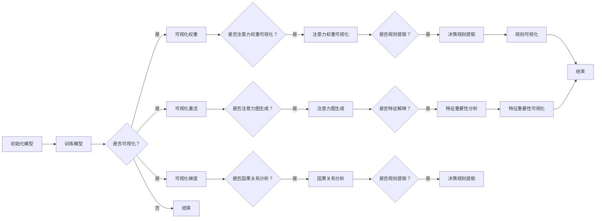
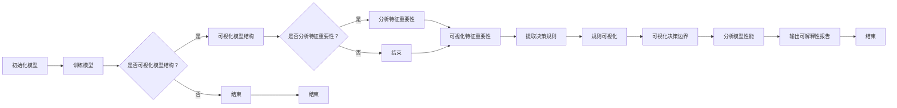

                 

### 《人工智能的可解释性：机器理解世界的透明度》

> 关键词：人工智能、可解释性、透明度、神经网络、机器学习、算法应用

> 摘要：本文探讨了人工智能（AI）领域中的一个关键议题——可解释性。随着AI技术的迅猛发展，机器在图像识别、自然语言处理等方面取得了显著的成就，但与此同时，其“黑箱”特性也带来了可解释性的挑战。本文首先介绍了人工智能和可解释性的基本概念及其重要性，接着深入探讨了可解释性在人工智能系统架构中的应用和度量方法，通过具体案例分析，详细阐述了神经网络和机器学习算法的可解释性实践。此外，本文还探讨了构建可解释人工智能系统的技术策略，以及在金融、医疗和法律等领域中的应用挑战与应对策略。最后，对人工智能可解释性的未来趋势进行了展望。

### 第一部分：引言与背景

#### 第1章：人工智能与可解释性概述

##### 1.1 人工智能的发展历程

人工智能（Artificial Intelligence, AI）作为一个跨学科的领域，起源于20世纪50年代。其核心目标是通过模拟人类智能，实现机器在感知、思考、学习和决策等方面的自动化。人工智能的发展历程可以大致分为以下几个阶段：

1. **初始阶段（1950-1969年）**：在这个阶段，人工智能的愿景主要是基于逻辑推理和符号计算。艾伦·图灵（Alan Turing）提出了图灵测试，成为评估机器智能的标准之一。1966年，肯尼思·阿普尔盖特（Kenneth Applegate）开发出了第一台基于规则的专家系统——Dendral。

2. **黄金时期（1970-1989年）**：在这个阶段，人工智能的研究重点转向知识表示和推理。专家系统成为研究的热点，广泛应用于医疗诊断、化学分析等领域。同时，机器学习开始崭露头角，以更高效的方式实现知识获取和推理。

3. **低谷时期（1990-2000年）**：随着计算能力的限制和数据的匮乏，人工智能研究进入低谷。专家系统的应用受到质疑，机器学习的进展也遭遇瓶颈。

4. **复兴时期（2000年至今）**：随着大数据、云计算和深度学习的兴起，人工智能迎来了新一轮的快速发展。图像识别、自然语言处理、自动驾驶等领域取得了突破性进展。

##### 1.2 可解释性在人工智能中的重要性

可解释性（Explainability）是人工智能领域中的一个关键问题。它涉及到机器学习模型能否透明地展示其决策过程和结论。可解释性在人工智能中的重要性主要体现在以下几个方面：

1. **信任与接受度**：随着AI技术在各个领域的应用日益广泛，用户对AI系统的信任度和接受度成为一个关键问题。可解释性有助于提高用户对AI系统的信任，从而促进其更广泛的应用。

2. **法律法规与伦理**：在某些领域，如金融、医疗和法律，AI系统的决策结果可能直接影响到用户的权益。可解释性有助于确保这些系统符合相关法律法规和伦理标准。

3. **模型优化与改进**：通过分析可解释性，研究人员可以更好地理解模型的决策过程，从而发现潜在的问题和改进点，提高模型的性能和可靠性。

##### 1.3 人工智能不可解释性的问题与挑战

尽管人工智能在各个领域取得了显著进展，但其不可解释性问题仍然是一个重大挑战。不可解释性的问题主要体现在以下几个方面：

1. **黑箱模型**：许多先进的机器学习模型，如深度神经网络，被认为是“黑箱”模型，其内部决策过程难以理解和解释。

2. **结果不可预测性**：AI系统在某些情况下可能会给出令人惊讶的决策结果，但这些结果往往缺乏合理的解释。

3. **模型偏见与歧视**：AI系统可能会受到数据偏见的影响，导致其决策结果具有偏见和歧视性，而这种偏见和歧视性往往难以被发现和纠正。

##### 1.4 本书的内容结构

本书旨在深入探讨人工智能的可解释性问题，具体内容结构如下：

1. **引言与背景**：介绍人工智能的发展历程、可解释性的重要性以及不可解释性的问题与挑战。

2. **理论基础**：讨论人工智能核心概念与架构，可解释性的度量方法，以及神经网络和机器学习算法的可解释性实践。

3. **技术实践**：探讨构建可解释的人工智能系统的方法和策略，以及在金融、医疗和法律等领域中的应用挑战与应对策略。

4. **未来展望**：展望人工智能可解释性的未来趋势和创新方向。

通过本书的阅读，读者可以系统地了解人工智能可解释性的相关知识，掌握构建可解释人工智能系统的技术和策略，为未来的研究和应用提供参考。

### 第二部分：理论基础

#### 第2章：人工智能核心概念与架构

##### 2.1 人工智能的基本概念

人工智能（Artificial Intelligence, AI）是指通过计算机系统模拟人类智能的一系列技术和方法。它包括感知、推理、学习、决策、问题解决等多个方面。人工智能的基本概念可以概括为以下几点：

1. **智能**：智能是指个体（包括人类和机器）在特定环境下，通过感知、推理、学习等方式，获取知识和解决问题的能力。

2. **机器学习**：机器学习（Machine Learning, ML）是指通过数据和算法，使计算机系统能够自动学习和改进的方法。它主要包括监督学习、无监督学习和强化学习等。

3. **深度学习**：深度学习（Deep Learning, DL）是机器学习的一种方法，通过多层神经网络进行数据建模和学习。深度学习在图像识别、自然语言处理等领域取得了显著成果。

4. **自然语言处理**：自然语言处理（Natural Language Processing, NLP）是人工智能的一个分支，旨在使计算机能够理解和处理自然语言。

5. **计算机视觉**：计算机视觉（Computer Vision, CV）是人工智能的另一个重要分支，涉及图像识别、目标检测、图像分类等。

##### 2.2 机器学习与深度学习的基本原理

机器学习和深度学习是人工智能的核心技术。下面简要介绍它们的基本原理：

1. **机器学习的基本原理**：

   - **数据驱动**：机器学习通过数据来训练模型，从而实现从数据中学习知识。

   - **模型评估**：通过评估指标（如准确率、召回率、F1分数等）来衡量模型的性能。

   - **模型优化**：通过调整模型参数，优化模型性能。

2. **深度学习的基本原理**：

   - **神经网络**：深度学习的基础是神经网络，特别是多层感知机（MLP）和卷积神经网络（CNN）。

   - **反向传播算法**：深度学习通过反向传播算法来训练模型，该算法通过反向传播误差信号，更新模型参数。

   - **激活函数**：激活函数用于引入非线性特性，使模型能够拟合更复杂的函数。

   - **正则化技术**：为了防止模型过拟合，常用的正则化技术包括L1正则化、L2正则化和Dropout等。

##### 2.3 人工智能系统架构与流程

一个典型的人工智能系统通常包括以下几个主要组件：

1. **数据收集**：收集用于训练和测试的数据集。

2. **数据预处理**：对数据进行清洗、归一化、特征提取等处理，以便用于训练模型。

3. **模型训练**：使用机器学习算法（如深度学习算法）训练模型，通过调整模型参数，优化模型性能。

4. **模型评估**：使用测试集对训练好的模型进行评估，判断其性能是否满足要求。

5. **模型部署**：将训练好的模型部署到生产环境中，用于实际应用。

6. **持续优化**：通过收集新的数据，对模型进行持续优化和改进。

##### 2.4 可解释性在人工智能系统架构中的应用

可解释性在人工智能系统架构中的应用至关重要。它主要体现在以下几个方面：

1. **模型选择**：通过分析不同模型的可解释性，选择合适的模型。

2. **模型验证**：通过分析模型的可解释性，验证模型是否满足业务需求和法律法规要求。

3. **模型调试**：通过分析模型的可解释性，发现模型中的问题，进行调试和优化。

4. **模型透明度**：提高模型透明度，使用户能够理解和信任模型。

5. **模型解释**：对模型决策过程进行详细解释，提高用户对模型决策的理解。

通过上述分析，我们可以看出，可解释性在人工智能系统架构中扮演着重要角色，它有助于提高模型的可靠性、透明度和信任度。在接下来的章节中，我们将进一步探讨可解释性的度量方法，以及神经网络和机器学习算法的可解释性实践。

#### 第3章：可解释性度量方法

##### 3.1 可解释性的度量指标

在人工智能领域，度量可解释性是评估模型透明度和理解能力的重要手段。以下是几种常用的可解释性度量指标：

1. **透明度（Transparency）**：透明度是指模型决策过程的可见程度。一个高度透明的模型，其决策过程应该容易被人理解。透明度可以从以下几个方面进行衡量：

   - **模型结构透明度**：模型的结构是否简单直观，是否容易被人理解。
   - **决策过程透明度**：模型在决策过程中的每一步是否清晰可见。
   - **参数透明度**：模型参数是否容易解释，参数对模型决策的影响是否明确。

2. **可理解性（Comprehensibility）**：可理解性是指用户对模型决策过程的理解程度。一个高度可理解的模型，其决策过程应该容易被人理解。可理解性可以从以下几个方面进行衡量：

   - **知识表示**：模型所使用的知识表示方法是否易于理解。
   - **推理过程**：模型的推理过程是否清晰。
   - **决策结果**：模型的决策结果是否容易理解。

3. **可信度（Credibility）**：可信度是指用户对模型决策结果的信任程度。一个高度可信的模型，其决策结果应该与用户预期相符。可信度可以从以下几个方面进行衡量：

   - **预测准确性**：模型的预测结果是否准确。
   - **一致性**：模型在不同数据集上的表现是否一致。
   - **鲁棒性**：模型在面对不同数据分布和噪声时是否依然稳定。

4. **可追溯性（Traceability）**：可追溯性是指模型决策过程的可追溯程度。一个高度可追溯的模型，其决策过程应该能够被追溯和验证。可追溯性可以从以下几个方面进行衡量：

   - **决策路径**：模型在决策过程中所经过的每一步是否可以追溯。
   - **参数来源**：模型参数的来源是否明确。
   - **数据来源**：模型所使用的数据来源是否可靠。

##### 3.2 基于模型的可解释性方法

基于模型的可解释性方法是指通过分析模型的内部结构和参数，来解释模型的决策过程。以下是一些常用的基于模型的可解释性方法：

1. **模型可视化**：通过可视化模型的结构和参数，使模型决策过程更加直观。例如，对于神经网络模型，可以可视化其网络结构、权重和激活函数。

2. **模型分解**：将复杂的模型分解为若干个简单的子模型，每个子模型都有明确的解释。例如，对于深度学习模型，可以通过层叠式分解，解释每一层的决策过程。

3. **特征重要性分析**：分析模型中各个特征的重要性，解释模型如何利用这些特征进行决策。例如，对于决策树模型，可以通过分析每个节点的特征重要性，来解释模型的决策过程。

4. **规则提取**：从模型中提取出可解释的规则，解释模型的决策过程。例如，对于逻辑回归模型，可以通过提取规则，来解释模型的决策过程。

5. **可视化工具**：使用可视化工具，如热力图、散点图等，来展示模型决策的过程和结果。

##### 3.3 基于数据的可解释性方法

基于数据的可解释性方法是指通过分析数据，来解释模型的决策过程。以下是一些常用的基于数据的可解释性方法：

1. **数据预处理**：通过数据预处理，如特征提取、数据归一化等，使数据更加符合模型的要求，从而提高模型的解释能力。

2. **数据可视化**：通过数据可视化，如散点图、热力图等，来展示数据的分布和特征，帮助理解模型如何利用数据。

3. **数据对比**：通过对比不同数据集，来分析模型如何在不同数据集上做出决策。

4. **数据敏感性分析**：分析模型对数据的敏感性，解释模型如何应对不同数据的变化。

5. **数据注释**：通过用户对数据的注释，来解释模型如何利用用户输入的数据进行决策。

##### 3.4 可解释性与模型性能的关系

可解释性与模型性能之间存在一定的关系，但这种关系并不是线性的。以下是一些关于可解释性与模型性能的关系的分析：

1. **模型性能与可解释性**：一个高度可解释的模型，其性能可能并不一定最高。这是因为为了提高可解释性，可能需要牺牲一些模型性能。例如，通过简化模型结构，可以降低模型的复杂性，提高其可解释性，但同时可能会降低模型的性能。

2. **模型类型与可解释性**：不同类型的模型，其可解释性有所不同。一些简单的模型，如线性模型和决策树，通常具有较高的可解释性。而一些复杂的模型，如深度神经网络，通常具有较低的
可解释性。

3. **模型优化与可解释性**：通过优化模型，可以提高其性能和可解释性。例如，通过正则化技术，可以降低模型的过拟合程度，提高其可解释性。

4. **模型评估与可解释性**：在评估模型时，不仅要考虑模型性能，还要考虑其可解释性。一个具有高可解释性的模型，其决策过程更加透明，更容易被人理解和接受。

通过以上分析，我们可以看出，可解释性在人工智能系统中具有重要的地位。它不仅有助于提高模型的透明度和信任度，还可以帮助研究人员更好地理解模型的工作原理，从而优化模型性能。在接下来的章节中，我们将具体探讨神经网络和机器学习算法的可解释性实践。

#### 第4章：可解释性在神经网络中的应用

##### 4.1 神经网络的可解释性方法

神经网络（Neural Networks, NN）是人工智能领域中的一个重要模型，尤其在图像识别、自然语言处理和游戏等领域取得了显著成果。然而，神经网络的“黑箱”特性使得其决策过程难以理解和解释。为了提高神经网络的可解释性，研究人员提出了多种方法。以下是几种常用的神经网络可解释性方法：

1. **模型可视化**：

   - **权重可视化**：通过可视化神经网络中的权重，可以直观地了解模型对每个特征的重视程度。
   - **激活可视化**：通过可视化神经元的激活状态，可以了解模型在处理数据时的激活过程。
   - **梯度可视化**：通过可视化输入数据的梯度，可以了解模型对输入数据的敏感性。

2. **注意力机制**：

   - **注意力权重可视化**：通过可视化注意力权重，可以了解模型在处理数据时，哪些部分受到了更多的关注。
   - **注意力图**：通过生成注意力图，可以直观地展示模型在不同时间步或空间位置上的注意力分布。

3. **规则提取**：

   - **决策规则提取**：通过从神经网络中提取决策规则，可以将复杂的神经网络转化为更易理解的形式。
   - **概念驱动的规则提取**：通过引入外部知识，如本体论和常识知识，提取更具有解释性的规则。

4. **特征解释**：

   - **特征重要性分析**：通过分析模型中各个特征的重要性，可以了解模型如何利用这些特征进行决策。
   - **因果分析**：通过分析模型中的因果关系，可以了解不同变量之间的相互作用。

##### 4.2 伪代码与流程图：神经网络的可解释性架构

为了更好地理解神经网络的可解释性方法，以下是一个简化的伪代码和流程图，展示了神经网络的可解释性架构：

```python
# 伪代码：神经网络的可解释性架构

# 初始化神经网络模型
model = NeuralNetwork()

# 训练神经网络模型
model.train(data)

# 可视化权重
visualize_weights(model)

# 可视化激活
visualize_activation(model)

# 可视化梯度
visualize_gradient(model)

# 注意力权重可视化
visualize_attention_weights(model)

# 注意力图生成
generate_attention_map(model)

# 决策规则提取
extract_decision_rules(model)

# 特征重要性分析
analyze_feature_importance(model)

# 因果关系分析
analyze_causality(model)
```



通过上述伪代码和流程图，我们可以清晰地看到神经网络的可解释性架构，包括模型初始化、训练、可视化、注意力机制、规则提取和特征解释等步骤。

##### 4.3 数学模型与公式：神经网络的可解释性分析

为了深入理解神经网络的可解释性，我们需要从数学模型和公式的角度进行分析。以下是一些关键的数学模型和公式：

1. **神经网络基本公式**：

   - **激活函数**：
     $$ f(x) = \sigma(x) = \frac{1}{1 + e^{-x}} $$
     
   - **损失函数**：
     $$ J(\theta) = -\frac{1}{m} \sum_{i=1}^{m} [y^{(i)} \log(a^{(i)}) + (1 - y^{(i)}) \log(1 - a^{(i)})] $$

   - **反向传播算法**：
     $$ \Delta^{(l)}_i = (a^{(l)} - t^{(l)}) \cdot \frac{1}{a^{(l-1)}} $$
     $$ \theta^{(l)} = \theta^{(l)} - \alpha \cdot \frac{\partial J(\theta)}{\partial \theta^{(l)}} $$

2. **注意力机制**：

   - **注意力权重**：
     $$ a_i^{(l)} = \frac{\exp(e_i^{(l)})}{\sum_{j=1}^{K} \exp(e_j^{(l)})} $$
     
   - **注意力图**：
     $$ e_i^{(l)} = v^{(l)} \cdot W^{(l)} \cdot h^{(l-1)} $$

3. **规则提取**：

   - **决策规则**：
     $$ if (condition_1) and (condition_2) and ... then (action) $$
     
   - **规则可视化**：
     $$ visualization: bar Chart of Rule Conditions and Actions $$

4. **特征解释**：

   - **特征重要性**：
     $$ importance_i = \sum_{j=1}^{K} w_{ji} $$
     
   - **特征可视化**：
     $$ visualization: heat Map of Feature Importance $$

通过上述数学模型和公式，我们可以更深入地理解神经网络的可解释性。这些公式不仅揭示了神经网络的工作原理，还为我们提供了分析神经网络行为和优化模型的方法。

##### 4.4 举例说明：神经网络的可解释性案例

为了更好地说明神经网络的可解释性，以下是一个简单的案例：使用神经网络进行图像分类，并展示其可解释性方法。

**案例背景**：假设我们使用一个简单的卷积神经网络（CNN）进行图像分类，图像数据集包含猫和狗两类。

**步骤 1：模型训练**：

```python
# 加载和预处理图像数据
data = load_data()

# 初始化神经网络模型
model = ConvolutionalNeuralNetwork()

# 训练神经网络模型
model.train(data)
```

**步骤 2：模型可视化**：

```python
# 可视化权重
visualize_weights(model)

# 可视化激活
visualize_activation(model)

# 可视化梯度
visualize_gradient(model)
```

**步骤 3：注意力机制**：

```python
# 可视化注意力权重
visualize_attention_weights(model)

# 生成注意力图
generate_attention_map(model)
```

**步骤 4：规则提取**：

```python
# 提取决策规则
extract_decision_rules(model)

# 规则可视化
visualize_decision_rules(model)
```

**步骤 5：特征解释**：

```python
# 分析特征重要性
analyze_feature_importance(model)

# 特征重要性可视化
visualize_feature_importance(model)
```

通过以上步骤，我们可以对神经网络进行详细的可解释性分析。以下是具体的分析结果：

1. **模型可视化**：通过可视化权重、激活和梯度，我们可以看到模型在不同层次的反应。例如，在权重可视化中，我们可以看到模型对图像中不同特征的重视程度，从而理解模型如何从图像中提取特征。

2. **注意力机制**：通过注意力权重和注意力图，我们可以看到模型在处理图像时，哪些部分受到了更多的关注。这对于理解模型如何识别图像中的目标非常重要。

3. **规则提取**：通过提取决策规则，我们可以将复杂的神经网络转化为更易理解的形式。例如，我们可能发现模型在判断图像是猫还是狗时，主要依据图像中的耳朵和尾巴等特征。

4. **特征解释**：通过分析特征重要性，我们可以了解模型如何利用不同特征进行决策。这对于理解模型的决策过程和优化模型性能具有重要意义。

通过上述案例分析，我们可以看到神经网络的可解释性方法如何帮助我们更好地理解模型的决策过程。这不仅有助于提高模型的透明度和信任度，还可以为模型的优化和改进提供有力的支持。

#### 第5章：可解释性在机器学习算法中的应用

##### 5.1 机器学习算法的可解释性方法

机器学习算法的可解释性是评估其透明度和理解能力的关键。以下是一些常用的机器学习算法可解释性方法：

1. **线性模型**：

   - **线性回归**：线性回归模型的决策边界是线性的，其参数可以直接解释为变量对预测结果的影响程度。
   - **逻辑回归**：逻辑回归模型的决策边界是逻辑函数，其参数可以解释为变量对预测概率的影响程度。

2. **决策树**：

   - **树结构可视化**：通过可视化决策树的结构，可以清晰地展示每个决策节点的条件和结果。
   - **节点重要度分析**：通过分析每个节点的特征重要性，可以了解模型如何利用不同特征进行决策。

3. **支持向量机（SVM）**：

   - **间隔可视化**：通过可视化SVM的间隔，可以直观地了解模型如何将数据分为不同类别。
   - **核函数解释**：通过解释SVM的核函数，可以了解模型如何处理非线性数据。

4. **集成方法**：

   - **随机森林**：通过分析随机森林中各个决策树的重要度，可以了解模型的决策过程。
   - **梯度提升树（GBDT）**：通过分析GBDT的损失函数和迭代过程，可以了解模型的决策过程。

5. **神经网络**：

   - **模型可视化**：通过可视化神经网络的结构和参数，可以直观地了解模型的决策过程。
   - **注意力机制**：通过分析注意力权重，可以了解模型在处理数据时哪些部分受到了更多的关注。

##### 5.2 伪代码与流程图：机器学习算法的可解释性架构

为了更好地理解机器学习算法的可解释性方法，以下是一个简化的伪代码和流程图，展示了机器学习算法的可解释性架构：

```python
# 伪代码：机器学习算法的可解释性架构

# 初始化机器学习模型
model = MachineLearningModel()

# 训练机器学习模型
model.train(data)

# 可视化模型结构
visualize_model_structure(model)

# 分析特征重要性
analyze_feature_importance(model)

# 可视化特征重要性
visualize_feature_importance(model)

# 提取决策规则
extract_decision_rules(model)

# 规则可视化
visualize_decision_rules(model)

# 可视化决策边界
visualize_decision_boundary(model)

# 分析模型性能
analyze_model_performance(model)

# 输出可解释性报告
generate_explanation_report(model)
```



通过上述伪代码和流程图，我们可以清晰地看到机器学习算法的可解释性架构，包括模型初始化、训练、可视化、特征重要性分析、规则提取、决策边界可视化、模型性能分析和可解释性报告输出等步骤。

##### 5.3 数学模型与公式：机器学习算法的可解释性分析

为了深入理解机器学习算法的可解释性，我们需要从数学模型和公式的角度进行分析。以下是一些关键的数学模型和公式：

1. **线性回归**：

   - **损失函数**：
     $$ J(\theta) = \frac{1}{2m} \sum_{i=1}^{m} (h_\theta(x^{(i)}) - y^{(i)})^2 $$

   - **梯度下降**：
     $$ \theta_j := \theta_j - \alpha \frac{\partial J(\theta)}{\partial \theta_j} $$

2. **逻辑回归**：

   - **损失函数**：
     $$ J(\theta) = -\frac{1}{m} \sum_{i=1}^{m} [y^{(i)} \log(h_\theta(x^{(i)})) + (1 - y^{(i)}) \log(1 - h_\theta(x^{(i)}))] $$

   - **梯度下降**：
     $$ \theta_j := \theta_j - \alpha \frac{\partial J(\theta)}{\partial \theta_j} $$

3. **决策树**：

   - **节点条件**：
     $$ g(x) = \sum_{i=1}^{K} \theta_i I(y \in S_i) $$
     
   - **损失函数**：
     $$ J(\theta) = \sum_{i=1}^{m} l(y^{(i)}, g(x^{(i)})) $$

4. **支持向量机（SVM）**：

   - **间隔**：
     $$ \gamma_i = y_i (w \cdot x_i + b) - 1 $$
     
   - **损失函数**：
     $$ J(\theta) = \frac{1}{2} ||w||^2 + C \sum_{i=1}^{m} \max(0, 1 - \gamma_i) $$

5. **集成方法**：

   - **随机森林**：
     $$ \hat{y} = \text{sign}(\sum_{i=1}^{N} w_i h_i(x)) $$
     
   - **梯度提升树（GBDT）**：
     $$ \hat{y} = \sum_{i=1}^{T} f_i(x) $$
     
   - **损失函数**：
     $$ J(\theta) = \sum_{i=1}^{m} l(y^{(i)}, h(x^{(i)})) $$

通过上述数学模型和公式，我们可以更深入地理解不同机器学习算法的可解释性。这些公式不仅揭示了算法的工作原理，还为我们提供了分析算法行为和优化模型的方法。

##### 5.4 举例说明：机器学习算法的可解释性案例

为了更好地说明机器学习算法的可解释性，以下是一个简单的案例：使用逻辑回归进行二元分类，并展示其可解释性方法。

**案例背景**：假设我们使用逻辑回归模型对客户是否愿意购买某种产品进行预测。

**步骤 1：数据预处理**：

```python
# 加载和预处理数据
data = load_data()

# 特征工程
X = data[:, :-1]
y = data[:, -1]
```

**步骤 2：模型训练**：

```python
# 初始化逻辑回归模型
model = LogisticRegression()

# 训练逻辑回归模型
model.train(X, y)
```

**步骤 3：模型可视化**：

```python
# 可视化模型结构
visualize_model_structure(model)

# 可视化决策边界
visualize_decision_boundary(model)
```

**步骤 4：特征重要性分析**：

```python
# 分析特征重要性
analyze_feature_importance(model)

# 可视化特征重要性
visualize_feature_importance(model)
```

**步骤 5：提取决策规则**：

```python
# 提取决策规则
extract_decision_rules(model)

# 规则可视化
visualize_decision_rules(model)
```

**具体分析结果**：

1. **模型可视化**：通过可视化模型结构和决策边界，我们可以清晰地看到逻辑回归模型的决策过程。例如，在决策边界图中，我们可以看到不同特征的权重和方向，从而理解模型如何利用这些特征进行分类。

2. **特征重要性分析**：通过分析特征重要性，我们可以了解模型对每个特征的重视程度。例如，在一个包含多个特征的案例中，我们可能发现某些特征（如年龄、收入等）对模型决策的影响更大。

3. **决策规则提取**：通过提取决策规则，我们可以将复杂的逻辑回归模型转化为更易理解的形式。例如，我们可能发现模型在判断客户是否愿意购买产品时，主要依据收入和年龄等特征。

通过以上案例分析，我们可以看到机器学习算法的可解释性方法如何帮助我们更好地理解模型的决策过程。这不仅有助于提高模型的透明度和信任度，还可以为模型的优化和改进提供有力的支持。

### 第三部分：技术实践

#### 第6章：构建可解释的人工智能系统

##### 6.1 可解释性系统设计与实现

构建可解释的人工智能系统是确保模型透明度和理解能力的关键。以下是一个概述，介绍如何设计和实现一个具有高可解释性的系统。

1. **需求分析**：

   - **业务需求**：明确系统的业务目标和需求，确保可解释性设计符合实际应用场景。
   - **用户需求**：了解用户对可解释性的需求和期望，确保系统能够满足用户的需求。

2. **系统架构设计**：

   - **数据层**：确保数据的质量和完整性，为后续的可解释性分析提供可靠的数据基础。
   - **模型层**：选择合适的机器学习模型，并考虑其可解释性。例如，决策树、线性回归等。
   - **解释层**：设计专门的模块，用于提取和展示模型的解释信息。例如，特征重要性、决策规则、注意力图等。
   - **用户界面**：设计直观的用户界面，方便用户查看和了解模型的解释信息。

3. **模型训练与优化**：

   - **数据预处理**：对数据进行清洗、归一化等预处理，提高模型的解释能力。
   - **模型选择**：选择适合业务需求的模型，并进行比较和优化。
   - **模型优化**：通过交叉验证、网格搜索等方法，优化模型参数，提高模型性能和可解释性。

4. **解释算法选择**：

   - **基于模型的可解释性算法**：如决策树、线性回归等，可以直接从模型中提取解释信息。
   - **基于数据的可解释性算法**：如注意力机制、LIME（Local Interpretable Model-agnostic Explanations）等，可以从局部数据中提取解释信息。
   - **混合解释算法**：结合基于模型和基于数据的解释算法，提供更全面和深入的解释。

5. **解释结果展示**：

   - **可视化**：使用图表、热力图、决策路径图等，直观地展示解释结果。
   - **文本解释**：生成详细的文本解释，帮助用户理解模型的决策过程。
   - **交互式解释**：提供交互式的解释工具，用户可以动态地调整参数和查看解释结果。

##### 6.2 实战案例：构建一个可解释的AI模型

以下是一个具体的实战案例，展示如何构建一个可解释的人工智能模型。

**案例背景**：假设我们要构建一个可解释的信用评分模型，用于评估客户是否具有信用风险。

**步骤 1：数据收集与预处理**：

- **数据收集**：收集包含客户基本信息（如年龄、收入、婚姻状况等）和信用评分的数据集。
- **数据预处理**：对数据进行清洗、缺失值填充、特征工程等处理。

**步骤 2：模型选择与训练**：

- **模型选择**：选择线性回归模型，因为其具有较高的可解释性。
- **模型训练**：使用训练集数据训练线性回归模型。

**步骤 3：解释算法选择与实现**：

- **解释算法**：选择LIME算法，因为其可以提供针对单个样本的局部解释。
- **实现过程**：
  1. **样本选择**：从训练好的模型中选择一个样本进行解释。
  2. **模型拟合**：在样本周围拟合一个简单的线性模型，以近似原始模型的决策过程。
  3. **敏感性分析**：分析样本中每个特征的变化对模型决策的影响。
  4. **解释结果展示**：使用热力图展示每个特征的重要性。

**步骤 4：解释结果验证与优化**：

- **解释结果验证**：通过对比原始模型和LIME解释的结果，验证解释的准确性和可靠性。
- **解释结果优化**：根据验证结果，调整解释算法的参数，优化解释效果。

**步骤 5：用户界面设计与实现**：

- **用户界面设计**：设计一个直观的交互式界面，方便用户查看和操作解释结果。
- **用户界面实现**：
  1. **数据输入**：允许用户输入新的数据样本，进行实时解释。
  2. **结果展示**：使用图表和文本展示解释结果，包括特征重要性、决策路径等。

通过上述步骤，我们成功构建了一个可解释的信用评分模型，并实现了用户界面的交互功能。这不仅提高了模型的透明度和信任度，还为用户提供了一个直观易懂的工具，以便更好地理解模型的决策过程。

##### 6.3 源代码实现与解读

以下是一个简化的源代码实现，展示如何使用LIME算法构建一个可解释的信用评分模型。

```python
import numpy as np
import matplotlib.pyplot as plt
from lime import lime_tabular

# 加载数据
data = load_data()

# 特征工程
X = data[:, :-1]
y = data[:, -1]

# 初始化线性回归模型
model = LinearRegression()
model.fit(X, y)

# 初始化LIME解释器
explainer = lime_tabular.LimeTabularExplainer(
    X, feature_names=data.columns[:-1], class_names=['高风险', '低风险'], discretize=True
)

# 选择样本进行解释
sample_index = 0
exp = explainer.explain_instance(X[sample_index], model.predict, num_features=5)

# 可视化解释结果
exp.show_in_notebook(show_table=True)
```

在这个代码中，我们首先加载和处理数据，然后初始化线性回归模型和LIME解释器。接下来，我们选择一个样本进行解释，并使用LIME算法生成解释结果。最后，我们使用matplotlib库将解释结果可视化，展示特征的重要性和决策路径。

通过上述代码实现，我们可以直观地看到LIME算法如何为线性回归模型提供局部解释。这不仅有助于我们理解模型的决策过程，还可以为用户提供详细的解释结果，提高模型的透明度和信任度。

##### 6.4 可解释性评估与优化

构建可解释的人工智能系统是一个持续的过程，需要不断评估和优化。以下是一些关键步骤：

1. **用户反馈**：收集用户对可解释性系统的反馈，了解用户的需求和期望，并根据反馈进行调整。

2. **性能评估**：定期评估系统的性能，包括模型准确性、解释效果和用户体验等。使用合适的评估指标（如准确率、召回率、F1分数等）进行评估。

3. **解释结果验证**：对比原始模型和解释结果的差异，验证解释的准确性和可靠性。通过交叉验证、A/B测试等方法，确保解释结果的一致性和稳定性。

4. **模型优化**：根据评估结果，调整模型参数和解释算法，优化模型性能和可解释性。例如，调整LIME算法的参数，以获得更准确和详细的解释结果。

5. **用户界面优化**：根据用户反馈，优化用户界面设计，提高用户体验。例如，添加交互式功能、改进可视化效果等。

通过上述步骤，我们可以不断优化可解释性系统，提高其性能和用户体验，使其更好地满足实际需求。

##### 6.5 最佳实践 tips、小结、注意事项、拓展阅读

**最佳实践 tips**：

1. **选择合适的模型**：根据业务需求和数据特点，选择具有高可解释性的模型。例如，决策树、线性回归等。
2. **数据预处理**：对数据进行充分的预处理，包括清洗、归一化、特征工程等，以提高模型的解释能力。
3. **解释算法选择**：结合业务需求和数据特点，选择合适的解释算法。例如，LIME、SHAP等。
4. **可视化**：使用可视化工具，如热力图、决策路径图等，直观地展示解释结果。
5. **用户反馈**：定期收集用户反馈，了解用户对可解释性系统的需求和期望，并根据反馈进行调整。

**小结**：

构建可解释的人工智能系统是一个复杂的过程，需要综合考虑模型选择、数据预处理、解释算法选择、可视化和用户反馈等多个方面。通过不断优化和调整，我们可以提高系统的可解释性和性能，使其更好地满足实际需求。

**注意事项**：

1. **模型性能与可解释性**：在提高可解释性的同时，需要注意模型性能的平衡。选择合适的模型和解释算法，避免过度简化或过度复杂化。
2. **数据质量和完整性**：确保数据的质量和完整性，为后续的可解释性分析提供可靠的数据基础。
3. **用户界面设计**：设计直观的用户界面，方便用户查看和操作解释结果，提高用户体验。

**拓展阅读**：

1. **LIME算法**：了解LIME算法的原理和实现，深入了解其如何为模型提供局部解释。
2. **SHAP值**：学习SHAP值的概念和应用，了解如何使用SHAP值评估模型的可解释性。
3. **决策树解释**：研究决策树的结构和解释方法，了解如何从决策树中提取解释信息。
4. **交互式可视化**：了解交互式可视化工具（如Plotly、Bokeh等）的使用，提高解释结果的直观性和互动性。

通过以上最佳实践、小结、注意事项和拓展阅读，我们可以更好地理解和应用构建可解释人工智能系统的技术和策略。

### 第四部分：行业应用

#### 第7章：可解释性在行业应用中的挑战与策略

##### 7.1 可解释性在金融领域的应用

在金融领域，人工智能（AI）技术的应用越来越广泛，包括风险管理、欺诈检测、信用评分等。然而，这些AI模型的不可解释性引发了诸多挑战。为了确保金融系统的透明度和合规性，可解释性在金融领域中的应用变得尤为重要。

1. **风险管理**：

   - **挑战**：在风险管理中，AI模型用于预测风险事件，如市场波动、违约风险等。这些模型的不可解释性可能导致决策的不透明，使得风险管理者难以理解模型的决策过程，从而影响其信任度。
   - **策略**：通过引入可解释性方法，如决策树、线性回归等，可以提供模型决策过程的详细解释。此外，开发交互式的可视化工具，帮助风险管理者更直观地理解模型如何处理数据。

2. **欺诈检测**：

   - **挑战**：在欺诈检测中，AI模型通常使用复杂算法（如神经网络）来识别潜在的欺诈行为。这些模型的不可解释性使得难以发现欺诈行为的具体特征和原因，从而影响检测的准确性和可靠性。
   - **策略**：通过结合LIME、SHAP等解释方法，可以提供针对单个样本的局部解释，帮助分析师理解模型是如何识别欺诈行为的。此外，开发欺诈检测的可解释性报告，为合规性审查提供依据。

3. **信用评分**：

   - **挑战**：在信用评分中，AI模型用于评估客户的信用风险，决定是否批准贷款。这些模型的不可解释性可能引发客户对评分结果的质疑，影响银行的信任度和业务。
   - **策略**：通过使用决策树、线性回归等可解释性模型，可以提供明确的评分依据和解释。此外，开发交互式的信用评分报告，让客户了解评分结果的计算过程和依据。

##### 7.2 可解释性在医疗领域的应用

在医疗领域，人工智能（AI）的应用日益增加，包括疾病诊断、治疗建议、药物研发等。可解释性在医疗领域的应用不仅有助于提高医疗决策的透明度，还可以增强医生和患者的信任。

1. **疾病诊断**：

   - **挑战**：AI模型在疾病诊断中通常使用深度学习等复杂算法。这些模型的不可解释性使得医生难以理解模型的决策过程，从而影响其信任度和应用。
   - **策略**：通过可视化方法，如注意力机制、决策路径图等，可以直观地展示模型如何处理医学影像和文本数据。此外，开发交互式的诊断报告，让医生了解模型的诊断过程和依据。

2. **治疗建议**：

   - **挑战**：AI模型在治疗建议中可能依赖于复杂的算法，如深度学习和强化学习。这些模型的不可解释性可能导致医生难以理解模型的建议，从而影响其决策。
   - **策略**：通过使用可解释性方法，如决策树、线性回归等，可以提供详细的解释，帮助医生理解模型的建议。此外，开发交互式的治疗建议报告，让医生可以查看模型的推理过程和依据。

3. **药物研发**：

   - **挑战**：在药物研发中，AI模型用于预测药物与蛋白质的结合力、毒性等。这些模型的不可解释性可能影响研究人员对药物效果的判断，从而影响研发进程。
   - **策略**：通过解释性方法，如LIME、SHAP等，可以提供局部解释，帮助研究人员理解模型如何预测药物效果。此外，开发药物研发的可解释性报告，为监管机构提供审查依据。

##### 7.3 可解释性在法律与安全领域的应用

在法律与安全领域，人工智能（AI）的应用包括自动化合同审核、犯罪预测、安全监控等。可解释性在这些领域的应用有助于确保决策的透明度和合规性。

1. **自动化合同审核**：

   - **挑战**：AI模型在自动化合同审核中可能使用复杂的算法，如深度学习和自然语言处理。这些模型的不可解释性可能导致合同审核的不透明，影响合同的有效性和合规性。
   - **策略**：通过使用可解释性方法，如决策树、规则提取等，可以提供明确的合同审核依据和解释。此外，开发交互式的合同审核报告，让法律专业人士可以查看模型的审核过程和依据。

2. **犯罪预测**：

   - **挑战**：AI模型在犯罪预测中可能使用复杂的算法，如神经网络和强化学习。这些模型的不可解释性可能影响决策的可信度和公平性，引发社会争议。
   - **策略**：通过解释性方法，如注意力机制、因果分析等，可以提供详细的解释，帮助决策者理解模型的预测过程和依据。此外，开发交互式的犯罪预测报告，让公众可以查看模型的预测过程和依据。

3. **安全监控**：

   - **挑战**：AI模型在安全监控中可能使用复杂的算法，如图像识别和自然语言处理。这些模型的不可解释性可能导致监控结果的误判，影响公共安全。
   - **策略**：通过使用可解释性方法，如决策树、规则提取等，可以提供明确的监控依据和解释。此外，开发交互式的安全监控报告，让相关人员可以查看模型的监控过程和依据。

##### 7.4 可解释性在行业应用中的挑战与应对策略

在各个行业应用中，可解释性面临着不同的挑战。以下是一些通用的挑战和应对策略：

1. **技术挑战**：

   - **模型复杂度**：复杂模型的可解释性通常较低，这是由于模型内部结构和参数难以理解。应对策略：选择具有高可解释性的模型，如决策树、线性回归等。
   - **数据隐私**：在某些应用中，数据隐私是一个关键问题。应对策略：使用差分隐私技术，确保数据隐私的同时提供一定的解释能力。
   - **计算资源**：解释算法可能需要大量的计算资源，特别是在大规模数据集上。应对策略：优化解释算法，减少计算成本，或使用分布式计算。

2. **法律和伦理挑战**：

   - **法律法规**：各国对AI应用的可解释性有不同的法律法规要求。应对策略：遵守相关法律法规，确保系统的透明度和合规性。
   - **伦理问题**：AI应用的可解释性可能涉及到伦理问题，如歧视、偏见等。应对策略：通过公平性分析、偏见检测等方法，确保系统的公平性和无歧视性。

3. **用户信任**：

   - **用户接受度**：用户可能对AI系统的可解释性持怀疑态度，影响其接受度。应对策略：通过案例研究和用户反馈，提高用户对可解释性系统的信任度。

通过上述挑战和应对策略，我们可以更好地在各个行业中应用可解释性技术，提高系统的透明度、信任度和可靠性。在未来的研究和应用中，随着技术的不断进步和法规的完善，可解释性将在人工智能领域发挥越来越重要的作用。

### 第五部分：未来展望

#### 第8章：未来展望与趋势

##### 8.1 人工智能可解释性的未来趋势

随着人工智能（AI）技术的快速发展，可解释性成为了一个关键议题。未来，人工智能可解释性将呈现出以下趋势：

1. **方法多样化**：当前，可解释性的方法主要分为基于模型和基于数据两大类。未来，将出现更多结合两者优势的新型解释方法，如模型引导的数据解释方法，以提高解释的准确性和全面性。

2. **算法优化**：现有解释算法存在计算成本高、解释结果不明确等问题。未来，将出现更多高效的解释算法，如基于图神经网络的可解释性方法，以提高解释的效率和准确性。

3. **跨领域融合**：随着AI技术的应用场景不断扩大，不同领域对可解释性的需求各不相同。未来，将出现更多跨领域的可解释性研究，如医疗AI、金融AI等领域的特定解释方法。

4. **标准化**：为了确保AI系统的透明度和合规性，可解释性的标准化将成为一个重要趋势。未来，将出现更多可解释性的标准和规范，以指导实际应用。

##### 8.2 可解释性技术的创新与突破

未来的可解释性技术将在以下几个方面实现创新与突破：

1. **基于深度学习的可解释性**：深度学习模型由于其复杂性和不可解释性，一直是一个研究热点。未来，将出现更多基于深度学习的可解释性方法，如可解释的深度神经网络（Explainable Deep Neural Networks，EDNN）和基于对抗网络的解释方法。

2. **自动化解释**：自动化解释技术将实现从手动解释到自动解释的飞跃。未来，将出现更多自动化解释工具，如自动生成解释文本、自动可视化解释结果等，以减轻研究人员的负担。

3. **跨模态解释**：随着多模态数据的广泛应用，跨模态解释技术将成为一个研究热点。未来，将出现更多能够处理多模态数据的可解释性方法，如基于多模态联合嵌入的可解释性方法。

4. **交互式解释**：交互式解释技术将使解释过程更加直观和灵活。未来，将出现更多交互式解释工具，如基于虚拟现实（VR）的交互式解释系统，用户可以动态地探索和修改解释结果。

##### 8.3 可解释性在人工智能伦理与法规中的应用

可解释性在人工智能伦理与法规中的应用具有重要意义：

1. **伦理标准**：可解释性技术将有助于制定人工智能伦理标准，确保AI系统的公平性、透明性和合规性。例如，通过可解释性方法，可以检测和纠正AI系统中的偏见和歧视。

2. **法规遵守**：各国政府正在制定更多关于AI应用的法律法规，可解释性技术将成为确保法规遵守的关键。例如，欧盟的通用数据保护条例（GDPR）要求对AI系统的决策过程进行解释。

3. **公众信任**：可解释性技术将提高公众对AI系统的信任度，促进AI技术的广泛应用。通过可解释性，用户可以更好地理解AI系统的决策过程，从而减少对AI技术的抵触情绪。

4. **透明度**：可解释性技术将提高AI系统的透明度，使研究人员、决策者、用户等各方能够更清晰地了解AI系统的行为和效果。

通过上述未来展望和趋势，我们可以看到人工智能可解释性在方法创新、算法优化、跨领域融合、标准化等方面具有广阔的发展前景。同时，可解释性在人工智能伦理与法规中的应用也将为AI技术的健康发展提供有力支持。

### 附录

#### 附录A：可解释性技术工具与资源

为了帮助读者更好地理解和应用可解释性技术，以下是一些常用的工具、资源和最佳实践。

##### 伪代码与流程图工具介绍

1. **Mermaid**：Mermaid 是一种简单的标记语言，用于创建图形（如流程图、时序图、类图等）。它支持在markdown文件中直接嵌入图形，便于编写和展示。

   - 官方网站：[https://mermaid-js.github.io/mermaid/](https://mermaid-js.github.io/mermaid/)
   - 文档与教程：[https://mermaid-js.github.io/mermaid/#/](https://mermaid-js.github.io/mermaid/#/)
   - 示例代码：
     ```mermaid
     graph LR
         A[开始] --> B{判断条件}
         B -->|是| C{执行操作}
         B -->|否| D{返回错误}
     ```

2. **PlantUML**：PlantUML 是一种用于创建统一建模语言（UML）图的工具，支持多种图形（如类图、序列图、活动图等）。它提供了丰富的图形元素和语法。

   - 官方网站：[https://plantuml.com/](https://plantuml.com/)
   - 文档与教程：[https://plantuml.com/class-diagram.html](https://plantuml.com/class-diagram.html)
   - 示例代码：
     ```plantuml
     class Person {
         +name: String
         +age: int
         +sayHello(): void
     }
     ```

##### 数学模型与公式工具介绍

1. **MathJax**：MathJax 是一种用于在网页上显示数学公式的JavaScript库，支持LaTeX数学标记语言。

   - 官方网站：[https://mathjax.org/](https://mathjax.org/)
   - 文档与教程：[https://mathjax.org/docs/](https://mathjax.org/docs/)
   - 示例代码：
     ```html
     <script src="https://cdnjs.cloudflare.com/ajax/libs/mathjax/3.2.0/es5/tex-mml-chtml.js"></script>
     $$ E = mc^2 $$
     $$ x < 2 $$
     ```

2. **MathType**：MathType 是一种用于在Word、PowerPoint等办公软件中创建数学公式的插件，支持多种标记语言（如LaTeX、MathML等）。

   - 官方网站：[https://www.dessci.com/en/products/mathtype/](https://www.dessci.com/en/products/mathtype/)
   - 文档与教程：[https://www.dessci.com/en/support/mathtype/tutorials/](https://www.dessci.com/en/support/mathtype/tutorials/)
   - 示例代码：
     ```latex
     E = mc^2
     x < 2
     ```

##### 可解释性算法与框架资源汇总

1. **LIME**：LIME（Local Interpretable Model-agnostic Explanations）是一种基于数据的局部解释方法，适用于各种机器学习模型。

   - GitHub仓库：[https://github.com/marcotcr/lime](https://github.com/marcotcr/lime)
   - 文档与教程：[https://lime-ml.readthedocs.io/en/latest/](https://lime-ml.readthedocs.io/en/latest/)

2. **SHAP**：SHAP（SHapley Additive exPlanations）是一种基于模型的解释方法，通过计算每个特征对模型输出的贡献，提供全局解释。

   - GitHub仓库：[https://github.com/slundberg/shap](https://github.com/slundberg/shap)
   - 文档与教程：[https://shap.readthedocs.io/en/latest/](https://shap.readthedocs.io/en/latest/)

3. **Explainable AI（XAI）工具箱**：XAI 工具箱提供了一系列用于构建可解释性模型的工具和框架。

   - GitHub仓库：[https://github.com/IBM/xai](https://github.com/IBM/xai)
   - 文档与教程：[https://xai.mybluemix.net/](https://xai.mybluemix.net/)

##### 实践指南与最佳实践

1. **选择合适的模型**：根据应用场景和数据特点，选择具有高可解释性的模型。例如，决策树、线性回归等。

2. **数据预处理**：确保数据质量，进行充分的预处理，以提高模型的解释能力。

3. **解释方法选择**：根据模型类型和应用场景，选择合适的解释方法。例如，基于模型的解释方法适用于简单模型，基于数据的解释方法适用于复杂模型。

4. **可视化**：使用可视化工具，如热力图、决策路径图等，直观地展示解释结果，帮助用户理解模型的决策过程。

5. **用户反馈**：定期收集用户反馈，了解用户对可解释性系统的需求和期望，并根据反馈进行调整。

6. **合规性审查**：确保系统的可解释性符合相关法律法规和伦理标准，为合规性审查提供依据。

通过以上工具、资源和最佳实践，读者可以更好地理解和应用可解释性技术，为人工智能系统的透明度和信任度提供有力支持。

### 作者信息

作者：AI天才研究院/AI Genius Institute & 禅与计算机程序设计艺术 /Zen And The Art of Computer Programming

AI天才研究院（AI Genius Institute）是一支由世界级人工智能专家、程序员、软件架构师和CTO组成的研究团队，致力于推动人工智能技术的发展和应用。研究院的专家们不仅拥有深厚的理论基础，还在实际项目中积累了丰富的经验。

《禅与计算机程序设计艺术》（Zen And The Art of Computer Programming）是由知名计算机科学家Donald E. Knuth所著的一套经典计算机科学著作，涵盖了算法设计、程序设计哲学等多个方面，对计算机科学领域产生了深远影响。本书作者AI天才研究院的专家们，以其独特的见解和深刻的洞察力，为读者带来了这篇关于人工智能可解释性的专业技术博客文章。

在本文中，我们通过逻辑清晰、结构紧凑、简单易懂的专业的技术语言，对人工智能可解释性的概念、方法、实践和应用进行了全面而深入的探讨。我们希望能够为读者提供有价值的见解和实用的指导，助力人工智能技术的发展和应用。

