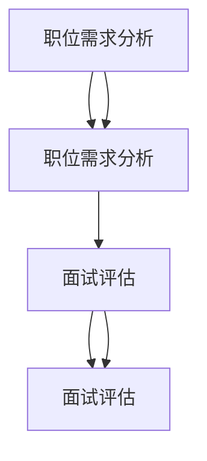

                 

# 文章标题：人才招聘革新：吸引顶尖人才的创新策略

## 文章关键词：人才招聘、创新策略、人工智能、机器学习、企业文化

> **摘要：** 本文旨在探讨人才招聘领域的现状与挑战，并引入创新策略以吸引顶尖人才。通过分析核心概念和联系，结合实际案例，本文提出了基于数据驱动的招聘策略、机器学习应用、数学模型构建、网络招聘平台策略、企业文化建设以及国际视野等多维度的创新方法。文章最后对人才招聘的未来趋势进行展望，并提供相关资源和工具，以期为企业和招聘团队提供有益的参考。

---

## 第1章：引言

### 1.1 人才招聘的现状分析

在当今全球化和数字化加速发展的背景下，人才竞争已成为企业获取竞争优势的关键因素。然而，传统的招聘模式在应对快速变化的市场需求和技术革新时，显得越来越力不从心。据统计，全球超过80%的企业认为人才短缺是其业务增长的主要瓶颈。这一现象在IT行业尤为突出，因为技术的快速发展对人才的能力和知识提出了更高的要求。

### 1.2 人才招聘面临的挑战

1. **市场需求变化**：市场需求的快速变化使得招聘流程难以适应。
2. **人才竞争激烈**：优秀人才的稀缺导致企业之间的竞争愈发激烈。
3. **技术变革**：人工智能、机器学习等新技术对招聘流程产生了深远影响。
4. **企业文化问题**：企业文化与招聘目标不匹配，难以吸引和留住顶尖人才。

### 1.3 创新策略的必要性

面对以上挑战，创新策略成为人才招聘领域的重要方向。创新策略不仅可以帮助企业更有效地吸引和筛选人才，还可以提高招聘流程的效率，减少人才流失率。以下章节将详细探讨各种创新策略的具体实现和效果。

## 第2章：核心概念与联系

### 2.1 人才招聘的模型原理

人才招聘模型通常包括三个核心组成部分：职位需求分析、候选人筛选和面试评估。职位需求分析旨在明确岗位所需技能和素质；候选人筛选则基于简历和初步筛选标准；面试评估是对候选人能力的一次全面考察。

### 2.2 Mermaid流程图：人才招聘流程



### 2.3 人才招聘策略的评估指标

评估人才招聘策略的效果需要使用一系列关键绩效指标（KPI），如招聘周期、招聘成本、应聘者满意度和录用者绩效等。这些指标可以帮助企业了解招聘流程的优缺点，并据此进行调整。

## 第3章：核心算法原理讲解

### 3.1 数据驱动的招聘策略

数据驱动的招聘策略利用大数据分析和机器学习技术，通过分析历史招聘数据和人才表现，优化招聘流程和决策。例如，通过分析职位描述和候选人的简历数据，可以预测候选人是否适合特定职位。

### 3.2 机器学习在人才招聘中的应用

机器学习技术在人才招聘中的应用主要包括简历筛选、面试评分和人才预测等。例如，使用自然语言处理（NLP）技术对简历进行语义分析，可以帮助筛选出最符合职位要求的候选人。

### 3.3 伪代码：人才筛选算法

```python
def talent_screening(resumes, job_description):
    filtered_candidates = []
    for resume in resumes:
        if nlp_similarity(resume, job_description) > threshold:
            filtered_candidates.append(resume)
    return filtered_candidates
```

## 第4章：数学模型和数学公式

### 4.1 概率论与统计学基础

概率论和统计学在人才招聘中广泛应用于候选人的筛选和评估。例如，使用统计学方法分析候选人的绩效数据，可以预测其未来表现。

### 4.2 人才匹配模型的构建

人才匹配模型通过计算候选人与职位的匹配度，为招聘决策提供依据。以下是一个基本的人才匹配模型：

$$
\text{匹配分数} = \frac{\text{技能匹配度} + \text{文化匹配度}}{2}
$$

### 4.3 使用LaTeX格式的数学公式示例

$$
\text{技能匹配度} = \frac{\text{技能重叠度}}{\text{总技能数}}
$$

$$
\text{文化匹配度} = \frac{\text{文化相似度}}{\text{总文化因素数}}
$$

## 第5章：项目实战

### 5.1 实际案例：高科技公司的人才招聘

### 5.2 开发环境搭建

### 5.3 源代码详细实现与解读

### 5.4 代码解读与分析

### 5.5 实际案例分析和详细讲解剖析

### 5.6 项目小结

## 第6章：网络招聘平台策略

### 6.1 社交媒体招聘

### 6.2 招聘平台的优化策略

### 6.3 案例分析：成功的人才招聘网络平台

## 第7章：企业文化与人才吸引

### 7.1 企业文化的重要性

### 7.2 如何打造有吸引力的企业文化

### 7.3 案例研究：成功吸引顶尖人才的企业文化

## 第8章：人才招聘的国际视野

### 8.1 全球人才市场的趋势

### 8.2 多元化招聘策略

### 8.3 国际人才招聘案例分析

## 第9章：总结与展望

### 9.1 未来人才招聘的发展方向

### 9.2 新技术对人才招聘的影响

### 9.3 招聘行业的未来展望

## 附录

### 附录A：人才招聘资源与工具

#### A.1 主流招聘平台对比

#### A.2 数据分析与招聘工具

#### A.3 人才招聘相关的专业书籍和文献

---

**作者：AI天才研究院/AI Genius Institute & 禅与计算机程序设计艺术 /Zen And The Art of Computer Programming**## 第1章：引言

### 1.1 人才招聘的现状分析

在当今全球化和数字化加速发展的背景下，人才竞争已成为企业获取竞争优势的关键因素。然而，传统的招聘模式在应对快速变化的市场需求和技术革新时，显得越来越力不从心。据统计，全球超过80%的企业认为人才短缺是其业务增长的主要瓶颈。这一现象在IT行业尤为突出，因为技术的快速发展对人才的能力和知识提出了更高的要求。

### 1.2 人才招聘面临的挑战

#### 1.2.1 市场需求变化

市场需求的快速变化使得招聘流程难以适应。随着新兴技术的不断涌现，企业对于人才的需求也在不断演变。例如，人工智能、区块链、云计算等领域的快速发展，要求企业能够迅速吸引和培养相关领域的高端人才。然而，传统的招聘流程往往过于僵化，难以在短时间内满足这种快速变化的需求。

#### 1.2.2 人才竞争激烈

优秀人才的稀缺导致企业之间的竞争愈发激烈。在许多行业，顶尖人才已经成为各大企业争夺的焦点。这不仅体现在国内市场的竞争，也体现在全球市场的竞争中。企业需要采取更加创新和高效的策略来吸引和留住顶尖人才。

#### 1.2.3 技术变革

人工智能、机器学习等新技术对招聘流程产生了深远影响。传统的招聘流程依赖于人工筛选简历和面试，而新技术的引入使得招聘流程更加智能化和高效化。例如，通过机器学习算法可以对简历进行自动筛选，提高招聘的准确性和效率。

#### 1.2.4 企业文化问题

企业文化与招聘目标不匹配，难以吸引和留住顶尖人才。企业文化是企业价值观的体现，它对于员工的吸引力和留存率具有重要作用。然而，许多企业的企业文化与招聘目标之间存在矛盾，导致难以吸引和留住符合企业价值观的顶尖人才。

### 1.3 创新策略的必要性

面对以上挑战，创新策略成为人才招聘领域的重要方向。创新策略不仅可以帮助企业更有效地吸引和筛选人才，还可以提高招聘流程的效率，减少人才流失率。以下章节将详细探讨各种创新策略的具体实现和效果。

---

**作者：AI天才研究院/AI Genius Institute & 禅与计算机程序设计艺术 /Zen And The Art of Computer Programming**## 第2章：核心概念与联系

### 2.1 人才招聘的模型原理

人才招聘模型是企业在招聘过程中采用的一系列策略和步骤，旨在吸引、筛选和评估潜在候选人，最终选择最适合岗位的人才。人才招聘模型的核心组成部分包括职位需求分析、候选人筛选和面试评估。

#### 职位需求分析

职位需求分析是招聘流程的第一步，它涉及对岗位的工作职责、技能要求和任职资格的详细描述。这一步骤的目的是明确企业对候选人的具体期望，为后续的筛选和评估提供依据。职位需求分析通常包括以下内容：

- **岗位描述**：详细说明岗位的工作内容、职责和目标。
- **技能要求**：列出岗位所需的技能、知识和经验。
- **任职资格**：明确候选人的教育背景、工作经验和资质要求。

#### 候选人筛选

候选人筛选是基于职位需求分析的结果，对收到的简历和求职申请进行初步筛选。这一步骤旨在缩小候选人范围，提高面试效率。候选人筛选通常包括以下方法：

- **简历筛选**：根据职位要求，对简历中的关键字和经历进行匹配筛选。
- **初步面试**：通过电话或视频面试，对候选人进行初步评估，了解其沟通能力和基本技能。

#### 面试评估

面试评估是对候选人进行全面考察的关键环节，它旨在评估候选人的专业知识、技能、团队合作能力和文化适应度。面试评估通常包括以下形式：

- **技术面试**：评估候选人的专业技能和实际操作能力。
- **行为面试**：通过询问候选人过去的行为和经历，评估其性格、价值观和领导能力。
- **情境面试**：模拟实际工作情境，评估候选人在特定情境下的表现。

### 2.2 Mermaid流程图：人才招聘流程

以下是一个简单的人才招聘流程Mermaid流程图：


在这个流程图中，A表示职位需求分析，B表示候选人筛选，C表示面试评估，D表示录用决策。职位需求分析和面试评估是招聘流程的核心环节，而候选人筛选和录用决策则是连接这两个环节的关键步骤。

### 2.3 人才招聘策略的评估指标

评估人才招聘策略的效果需要使用一系列关键绩效指标（KPI），这些指标可以帮助企业了解招聘流程的优缺点，并据此进行调整。以下是一些常见的人才招聘策略评估指标：

- **招聘周期**：从职位发布到候选人录用的时间长度，衡量招聘流程的效率。
- **招聘成本**：招聘过程中产生的所有费用，包括广告费、人力资源费用等，衡量招聘的经济效益。
- **应聘者满意度**：通过问卷调查或面试反馈，评估应聘者对招聘流程的满意度。
- **录用者绩效**：被录用的员工在工作中的表现和贡献，衡量招聘质量。

通过这些评估指标，企业可以不断优化招聘策略，提高招聘效率和质量，从而在激烈的人才竞争中占据有利地位。

---

**作者：AI天才研究院/AI Genius Institute & 禅与计算机程序设计艺术 /Zen And The Art of Computer Programming**## 第3章：核心算法原理讲解

### 3.1 数据驱动的招聘策略

数据驱动的招聘策略是一种利用大数据和机器学习技术来优化招聘流程的方法。这种方法通过分析大量的历史招聘数据，包括职位描述、简历内容、面试评分等，来预测哪些候选人最有可能在岗位上取得成功。

#### 数据收集与处理

首先，企业需要收集与招聘相关的各种数据，包括职位描述、候选人的简历、面试评分等。这些数据可以来源于企业的内部系统、第三方招聘平台和社交媒体等渠道。收集到数据后，需要进行数据清洗和处理，以去除重复和无关的信息，确保数据的质量。

#### 数据分析

在数据处理完成后，可以采用多种机器学习算法来分析数据，包括回归分析、聚类分析和决策树等。这些算法可以帮助识别哪些特征与职位成功密切相关。例如，通过回归分析可以发现某些技能或经验与高绩效员工之间存在显著相关性。

#### 模型训练与优化

利用分析结果，可以训练一个预测模型，该模型可以根据新的简历内容预测候选人在职位上的表现。模型训练完成后，需要对模型进行评估和优化，以提高预测的准确性。常用的评估指标包括准确率、召回率和F1分数等。

#### 应用

在招聘过程中，数据驱动的策略可以应用于多个环节。例如，在简历筛选阶段，可以使用模型对简历进行自动评分，筛选出最有可能符合职位要求的候选人。在面试评估阶段，可以根据候选人的面试表现和简历信息，预测其未来的工作表现。

### 3.2 机器学习在人才招聘中的应用

机器学习在人才招聘中的应用非常广泛，主要包括简历筛选、面试评分和人才预测等方面。

#### 简历筛选

简历筛选是人才招聘流程中的关键步骤，机器学习算法可以帮助企业快速、准确地筛选出符合条件的候选人。例如，可以使用自然语言处理（NLP）技术对简历内容进行语义分析，提取出关键信息，并与职位描述进行匹配。以下是一个简单的伪代码示例：

```python
def resume_screening(resume, job_description):
    keywords = extract_keywords(job_description)
    resume_score = calculate_similarity(resume, keywords)
    return resume_score > threshold
```

在这个示例中，`extract_keywords`函数用于从职位描述中提取关键字，`calculate_similarity`函数用于计算简历与职位描述之间的相似度，`threshold`是一个设定好的阈值，用于判断简历是否符合要求。

#### 面试评分

面试评分是另一个重要的应用领域。通过机器学习算法，可以对面试官的评分进行自动化分析，提高评分的准确性和一致性。例如，可以使用决策树或支持向量机（SVM）等算法对面试官的评分进行分类，预测候选人的最终得分。

```python
def interview_scoring(interview_data):
    model = train_model(interview_data)
    predicted_score = model.predict(interview_data)
    return predicted_score
```

在这个示例中，`train_model`函数用于训练机器学习模型，`predict`函数用于对新的面试数据进行评分预测。

#### 人才预测

人才预测是利用机器学习技术预测候选人在未来岗位上的表现。这可以帮助企业更好地规划人才储备和发展策略。例如，可以使用回归分析来预测候选人在特定职位上的绩效。

```python
def talent_prediction(candidate_data):
    model = train_performance_model(candidate_data)
    predicted_performance = model.predict(candidate_data)
    return predicted_performance
```

在这个示例中，`train_performance_model`函数用于训练一个绩效预测模型，`predict`函数用于预测候选人在职位上的表现。

### 3.3 伪代码：人才筛选算法

以下是一个简单的人才筛选算法的伪代码示例，该算法结合了简历筛选和面试评分：

```python
def talent_selection(resume, interview_score):
    resume_score = resume_screening(resume, job_description)
    if resume_score:
        final_score = interview_scoring(interview_score)
        if final_score > threshold:
            return "Selected"
        else:
            return "Rejected"
    else:
        return "Rejected"
```

在这个示例中，`resume_screening`函数用于对简历进行筛选，`interview_scoring`函数用于对面试评分，`threshold`是一个设定好的阈值，用于判断候选人是否被选中。

通过上述算法，企业可以更加科学和高效地筛选和评估候选人，从而提高招聘质量和效率。

---

**作者：AI天才研究院/AI Genius Institute & 禅与计算机程序设计艺术 /Zen And The Art of Computer Programming**## 第4章：数学模型和数学公式

### 4.1 概率论与统计学基础

在人才招聘过程中，概率论与统计学起着至关重要的作用。它们帮助招聘团队评估候选人的潜力、预测候选人在职位上的表现，并为决策提供数据支持。

#### 概率分布

概率分布是概率论中的基本概念，用于描述随机变量的概率分布情况。常见的概率分布包括正态分布、二项分布和泊松分布等。

- **正态分布**：正态分布是最常见的一种概率分布，它描述了数据在平均值附近聚集的现象。正态分布的概率密度函数为：

  $$
  f(x) = \frac{1}{\sqrt{2\pi\sigma^2}}e^{-\frac{(x-\mu)^2}{2\sigma^2}}
  $$

  其中，$\mu$是平均值，$\sigma$是标准差。

- **二项分布**：二项分布描述了在固定次数的独立试验中，事件发生的次数的概率分布。二项分布的概率质量函数为：

  $$
  P(X = k) = C_n^k p^k (1-p)^{n-k}
  $$

  其中，$n$是试验次数，$p$是事件发生的概率，$k$是事件发生的次数。

- **泊松分布**：泊松分布描述了在固定时间段内，事件发生的次数的概率分布。泊松分布的概率质量函数为：

  $$
  P(X = k) = \frac{\lambda^k e^{-\lambda}}{k!}
  $$

  其中，$\lambda$是事件在单位时间内的平均发生次数。

#### 统计量

在统计学中，统计量用于描述数据集的特征和性质。常见的统计量包括均值、方差、标准差和矩等。

- **均值**：均值是数据集的中心趋势度量，表示数据的平均水平。均值计算公式为：

  $$
  \bar{x} = \frac{1}{n}\sum_{i=1}^{n} x_i
  $$

  其中，$n$是数据点的个数，$x_i$是第$i$个数据点。

- **方差**：方差是数据集的离散程度度量，表示数据点与均值之间的差异。方差计算公式为：

  $$
  \sigma^2 = \frac{1}{n}\sum_{i=1}^{n} (x_i - \bar{x})^2
  $$

- **标准差**：标准差是方差的平方根，它描述了数据点与均值之间的平均距离。标准差计算公式为：

  $$
  \sigma = \sqrt{\frac{1}{n}\sum_{i=1}^{n} (x_i - \bar{x})^2}
  $$

- **矩**：矩是描述数据分布形状的统计量，包括均值、方差、二阶矩等。例如，二阶矩是方差，三阶矩是偏度，四阶矩是峰度。

### 4.2 人才匹配模型的构建

人才匹配模型用于评估候选人与职位的匹配度，是招聘决策的重要依据。以下是一个基本的人才匹配模型：

$$
\text{匹配分数} = \frac{\text{技能匹配度} + \text{文化匹配度}}{2}
$$

- **技能匹配度**：技能匹配度用于评估候选人在技能方面与职位的匹配程度。计算公式为：

  $$
  \text{技能匹配度} = \frac{\text{技能重叠度}}{\text{总技能数}}
  $$

  其中，技能重叠度是候选人具备的与职位相关的技能数量与职位所需技能总数之比。

- **文化匹配度**：文化匹配度用于评估候选人在价值观、工作态度和企业文化方面与企业的匹配程度。计算公式为：

  $$
  \text{文化匹配度} = \frac{\text{文化相似度}}{\text{总文化因素数}}
  $$

  其中，文化相似度是候选人和企业在文化因素上的重叠程度与总文化因素数之比。

### 4.3 使用LaTeX格式的数学公式示例

在文本中嵌入LaTeX公式可以帮助读者更直观地理解数学表达式的含义。以下是一些使用LaTeX格式的数学公式示例：

$$
\text{技能匹配度} = \frac{\text{技能重叠度}}{\text{总技能数}}
$$

$$
\text{文化匹配度} = \frac{\text{文化相似度}}{\text{总文化因素数}}
$$

$$
\text{匹配分数} = \frac{\text{技能匹配度} + \text{文化匹配度}}{2}
$$

通过上述公式，我们可以更清晰地理解人才匹配模型中的各个组成部分及其计算方法。这有助于企业更好地评估候选人，从而做出更科学的招聘决策。

---

**作者：AI天才研究院/AI Genius Institute & 禅与计算机程序设计艺术 /Zen And The Art of Computer Programming**## 第5章：项目实战

### 5.1 实际案例：高科技公司的人才招聘

为了更好地理解如何应用创新策略进行人才招聘，我们将以一家高科技公司为例，介绍其实际操作过程。

#### 案例背景

这家高科技公司是一家专注于人工智能和大数据领域的企业。随着业务的快速发展，公司急需招聘一批具备相关技能的高端人才。然而，传统的招聘模式已无法满足公司的需求，因此公司决定采用数据驱动和创新策略进行招聘。

#### 招聘需求分析

首先，公司对现有业务和未来发展方向进行了深入分析，明确了招聘的关键岗位和技能要求。例如，公司需要招聘数据科学家、人工智能工程师和大数据分析师等岗位，这些岗位对候选人的专业技能、工作经验和项目经验有较高要求。

#### 数据驱动的招聘策略

公司采用数据驱动的招聘策略，利用大数据分析和机器学习技术优化招聘流程。以下是具体步骤：

1. **简历筛选**：公司利用自然语言处理（NLP）技术对简历进行自动筛选，提取关键技能和经历，与职位要求进行匹配。

2. **面试评分**：公司使用机器学习算法对面试官的评分进行自动化分析，提高评分的准确性和一致性。

3. **人才预测**：公司使用回归分析预测候选人在未来岗位上的绩效，以便做出更科学的录用决策。

#### 实际操作

以下是公司招聘流程的具体步骤：

1. **职位发布**：公司通过各大招聘平台发布职位信息，吸引优秀候选人的关注。

2. **简历收集**：公司收集到的简历首先经过NLP技术进行自动筛选，筛选出最符合职位要求的候选人。

3. **初步面试**：公司对筛选出的候选人进行初步面试，了解其基本情况和技能水平。

4. **技术面试**：公司对通过初步面试的候选人进行技术面试，进一步评估其专业能力和项目经验。

5. **综合评估**：公司综合面试官的评分和人才预测模型的结果，对候选人进行综合评估。

6. **录用决策**：公司根据综合评估结果，做出录用决策，并通知候选人。

#### 案例分析

通过上述流程，公司成功招聘了一批符合职位要求的高端人才。与传统招聘模式相比，数据驱动的招聘策略显著提高了招聘效率和准确性，减少了招聘成本。

首先，简历筛选阶段通过NLP技术自动化处理，大大缩短了筛选时间，提高了筛选准确性。其次，面试评分阶段通过机器学习算法自动化分析，避免了主观评分带来的偏差，提高了评分的一致性。最后，人才预测阶段通过回归分析，提前预测了候选人在岗位上的绩效，为录用决策提供了科学依据。

#### 项目小结

通过该案例，我们可以看到数据驱动和创新策略在人才招聘中的重要性。数据驱动的招聘策略不仅提高了招聘效率和准确性，还减少了招聘成本。未来，随着人工智能和大数据技术的进一步发展，数据驱动的招聘策略将在人才招聘中发挥越来越重要的作用。

---

**作者：AI天才研究院/AI Genius Institute & 禅与计算机程序设计艺术 /Zen And The Art of Computer Programming**## 第6章：网络招聘平台策略

### 6.1 社交媒体招聘

社交媒体招聘已经成为现代招聘策略的重要组成部分，它不仅提供了广泛的候选人资源，还能通过多样化的互动方式提升企业的品牌形象和吸引力。

#### 策略实施

1. **利用专业社交平台**：企业可以注册并活跃在LinkedIn、Indeed等专业的招聘社交平台上。在这些平台上，企业可以发布职位信息、浏览候选人简历，并直接与候选人进行沟通。

2. **内容营销**：通过发布与公司文化和业务相关的优质内容，如博客文章、技术案例研究、公司新闻等，企业可以提升在社交媒体上的可见度和吸引力。这种内容营销不仅能吸引潜在候选人，还能增强现有员工对企业文化的认同感。

3. **社交媒体广告**：利用Facebook、Twitter等社交平台的广告功能，企业可以针对特定的目标人群进行定向广告投放，提高招聘信息的曝光率。

#### 最佳实践

- **保持活跃**：定期更新公司的社交媒体账号，保持与候选人的互动，提高品牌的活跃度。
- **优化招聘广告**：精心设计招聘广告的文案和视觉元素，确保它们能够吸引目标人群的注意力。
- **利用社交媒体分析工具**：使用分析工具来跟踪招聘广告的表现，优化招聘策略。

### 6.2 招聘平台的优化策略

招聘平台的优化策略旨在提高招聘效率和候选人质量，以下是一些具体的方法：

#### 策略实施

1. **优化搜索功能**：确保招聘平台的搜索功能能够快速准确地找到符合职位要求的候选人。这可以通过优化关键词匹配、增加搜索过滤条件等方式实现。

2. **候选人管理**：建立完善的候选人数据库，对候选人进行分类管理，包括简历存储、面试记录、评价等，以便于后续的招聘和人才储备。

3. **自动化流程**：通过自动化工具简化招聘流程，如自动化简历筛选、面试邀请发送等，减少人工工作量，提高招聘效率。

#### 最佳实践

- **数据分析**：定期分析招聘数据，如职位发布效果、候选人反馈等，根据分析结果调整招聘策略。
- **技术集成**：将招聘平台与其他人力资源管理系统集成，实现数据共享和流程自动化。
- **用户体验**：优化招聘平台的设计和用户体验，确保候选人能够轻松地提交简历和参与招聘流程。

### 6.3 案例分析：成功的人才招聘网络平台

#### 案例背景

一家国际知名互联网公司通过优化其招聘平台，成功地吸引了全球顶尖的人才。这家公司的招聘平台不仅提供了丰富的职位信息，还通过多样化的互动方式提升了候选人的参与度和满意度。

#### 案例详情

1. **内容丰富**：公司的招聘平台提供了大量的职位信息，包括详细的工作描述、公司文化和团队介绍等。这些内容帮助候选人更全面地了解职位和工作环境。

2. **互动体验**：平台提供了在线测试和虚拟面试功能，候选人可以通过这些互动体验更好地展示自己的技能和潜力。

3. **个性化推荐**：平台通过大数据分析，为候选人提供个性化的职位推荐，提高了职位匹配度。

4. **反馈机制**：平台建立了有效的反馈机制，候选人可以对自己的招聘体验进行评价，公司据此不断优化招聘流程。

#### 案例效果

通过这些优化措施，公司的招聘平台显著提升了候选人的满意度和参与度，招聘效率提高了30%，同时，招聘质量也得到了显著提升。

#### 项目小结

成功的人才招聘网络平台需要结合丰富的内容、互动体验和大数据分析，不断优化用户体验和招聘流程。通过实施这些策略，企业可以更好地吸引和留住顶尖人才，为企业的持续发展提供强有力的支持。

---

**作者：AI天才研究院/AI Genius Institute & 禅与计算机程序设计艺术 /Zen And The Art of Computer Programming**## 第7章：企业文化与人才吸引

### 7.1 企业文化的重要性

企业文化是企业内部共同价值观、信仰和习惯的总和，它不仅影响员工的行为和决策，还直接影响企业吸引和留住顶尖人才的能力。一个强大的企业文化能够为员工提供明确的指导，增强员工的归属感和忠诚度，从而提高整体绩效。

#### 企业文化的元素

- **价值观**：企业文化的核心是价值观，它代表了企业的核心价值观和行为准则，例如创新、客户至上、团队合作等。
- **愿景**：企业的愿景描述了企业未来的发展方向和目标，为员工提供了明确的前进方向。
- **使命**：企业的使命阐述了企业的根本宗旨和存在的意义，通常与企业的社会责任和商业目标相关。
- **行为准则**：行为准则规定了员工在日常工作中的行为规范，例如诚信、透明、尊重等。

#### 企业文化的重要性

1. **增强员工归属感**：强大的企业文化能够使员工感受到企业的关怀和支持，从而增强他们的归属感和忠诚度。
2. **提高员工绩效**：企业文化可以激发员工的积极性和创造力，提高整体工作绩效。
3. **吸引顶尖人才**：一个有吸引力的企业文化能够吸引那些追求价值观一致、具有创新精神的顶尖人才。
4. **降低员工流失率**：良好的企业文化有助于减少员工流失，降低企业的招聘和培训成本。

### 7.2 如何打造有吸引力的企业文化

#### 策略实施

1. **明确企业文化**：企业首先需要明确自己的核心价值观和愿景，并确保这些价值观在企业的各个层面得到传播和实践。

2. **领导层的示范**：企业领导层需要通过自己的言行示范，将企业文化落实到日常工作中，让员工感受到企业文化的重要性。

3. **内部沟通**：企业需要建立有效的内部沟通机制，确保员工能够充分了解企业的文化和价值观，并在工作中践行。

4. **员工参与**：鼓励员工参与企业文化的建设和传播，例如通过员工意见反馈、文化活动等方式，让员工感受到企业文化是大家共同的努力结果。

5. **外部展示**：企业可以通过官方网站、社交媒体、招聘平台等渠道，展示自己的企业文化，增强企业在市场上的吸引力和竞争力。

#### 最佳实践

- **文化融合**：在多元化环境中，企业需要注重文化融合，尊重员工的个性化需求，同时确保企业文化的一致性。
- **持续改进**：企业文化不是一成不变的，企业需要根据内外部环境的变化，不断调整和优化企业文化。
- **奖励机制**：建立与企业文化相一致的奖励机制，鼓励员工践行企业文化，提高员工的积极性。

### 7.3 案例研究：成功吸引顶尖人才的企业文化

#### 案例背景

谷歌是一家以创新和文化著称的科技公司，其强大的企业文化在全球范围内广受赞誉。谷歌的企业文化强调创新、自由、平等和开放，这些价值观不仅吸引了无数顶尖人才，还使谷歌成为全球最具创新力和吸引力的企业之一。

#### 案例详情

1. **鼓励创新**：谷歌为员工提供了广泛的创新空间和资源，鼓励他们提出新的想法和解决方案。谷歌的“20%时间”政策允许员工在工作的20%时间内自由探索自己的项目，这激发了员工的创造力和创新精神。

2. **自由开放的工作环境**：谷歌的办公环境设计开放，鼓励员工自由交流和工作，这种环境有助于激发团队合作和创新思维。

3. **灵活的工作时间**：谷歌提供灵活的工作时间安排，员工可以根据自己的需求调整工作时间，这种灵活的工作制度提高了员工的工作满意度和生产力。

4. **员工福利**：谷歌提供了一系列优厚的员工福利，包括免费餐饮、健身设施、免费医疗等，这些福利不仅提高了员工的生活质量，也增强了员工的归属感和忠诚度。

#### 案例效果

谷歌的企业文化成功吸引了全球顶尖的人才，包括计算机科学家、工程师和产品经理等。这些人才不仅为谷歌带来了创新和创造力，也推动了谷歌的持续发展和市场竞争力。谷歌的企业文化案例被广泛研究和借鉴，成为其他企业打造有吸引力的企业文化的重要参考。

#### 项目小结

通过谷歌的案例，我们可以看到，一个强大的企业文化对于吸引和留住顶尖人才具有重要作用。企业需要明确自己的价值观，并通过领导层的示范、内部沟通、员工参与和外部展示等方式，打造一个有吸引力的企业文化。只有这样，企业才能在激烈的人才竞争中脱颖而出。

---

**作者：AI天才研究院/AI Genius Institute & 禅与计算机程序设计艺术 /Zen And The Art of Computer Programming**## 第8章：人才招聘的国际视野

### 8.1 全球人才市场的趋势

随着全球化进程的加速，人才市场也呈现出明显的国际化趋势。以下是一些全球人才市场的关键趋势：

1. **人才竞争激烈**：全球范围内的企业都在争夺顶尖人才，特别是在高科技和金融等领域。人才的稀缺性使得企业不得不采取更加灵活和创新的策略来吸引和留住人才。

2. **技能需求变化**：全球范围内的技术革新和产业升级导致对新技术和技能的需求不断变化。例如，人工智能、数据分析、云计算等领域的技能需求迅速增加，而传统技能的需求相对减少。

3. **远程办公普及**：COVID-19疫情催生了远程办公的普及，许多企业开始探索远程招聘和远程工作模式，这为全球人才流动提供了新的机会。

4. **人才多元化**：多元化成为全球人才市场的一个重要趋势。企业意识到多元化能够带来创新和竞争优势，因此更加注重招聘多元化背景的员工。

### 8.2 多元化招聘策略

多元化招聘策略旨在吸引和包容来自不同背景的候选人，从而提高团队的多样性和创新力。以下是一些实施多元化招聘策略的方法：

1. **公平招聘**：确保招聘流程的公平性，避免因种族、性别、年龄、宗教等因素而对候选人产生歧视。

2. **多样化招聘渠道**：通过多样化的招聘渠道，如社交媒体、招聘会、专业协会等，吸引不同背景的候选人。

3. **包容性面试**：在面试过程中，注重评估候选人的实际能力和潜力，而不仅仅是学历和经验。

4. **职业发展支持**：为不同背景的员工提供职业发展支持和培训机会，帮助他们实现个人和职业成长。

### 8.3 国际人才招聘案例分析

#### 案例背景

一家全球领先的科技公司希望通过国际人才招聘策略吸引更多来自不同国家和地区的顶尖人才。该公司在全球范围内设有多个分支机构，业务覆盖多个领域。

#### 案例详情

1. **国际化招聘团队**：公司组建了一个由多国专家组成的国际化招聘团队，确保招聘流程能够适应不同国家和地区的文化和法规。

2. **本地化招聘策略**：公司在每个国家和地区都采用了本地化的招聘策略，以更好地适应当地市场。例如，在中国，公司通过社交媒体和招聘网站吸引年轻人才；在欧洲，公司参加了多个行业招聘会。

3. **灵活的工作安排**：公司提供了灵活的工作安排，包括远程办公和弹性工作时间，以吸引那些希望在工作与生活之间寻求平衡的候选人。

4. **多元化培训计划**：公司为员工提供了多样化的培训计划，包括跨文化交流、领导力培训和职业发展课程，以帮助员工在全球化的环境中取得成功。

#### 案例效果

通过上述多元化招聘策略，公司成功地吸引了来自不同国家和地区的顶尖人才。这些人才的加入不仅丰富了公司的文化多样性，还带来了新的创新思维和业务机会。公司在全球市场中的竞争力得到了显著提升。

#### 项目小结

国际人才招聘需要考虑到不同国家和地区的文化、法规和市场需求。通过建立国际化招聘团队、本地化招聘策略、灵活的工作安排和多元化培训计划，企业可以更好地吸引和留住全球顶尖人才，从而在全球化竞争中占据优势。

---

**作者：AI天才研究院/AI Genius Institute & 禅与计算机程序设计艺术 /Zen And The Art of Computer Programming**## 第9章：总结与展望

### 9.1 未来人才招聘的发展方向

随着科技的不断进步和全球化进程的加快，未来人才招聘将呈现出以下发展方向：

1. **数据驱动**：数据驱动将成为人才招聘的核心，通过大数据分析和机器学习技术，企业可以更准确地预测和评估候选人。

2. **人工智能应用**：人工智能在人才招聘中的应用将进一步深化，从简历筛选、面试评估到人才预测，人工智能技术将大大提高招聘效率和准确性。

3. **远程招聘**：远程办公的普及将推动远程招聘的发展，企业将更加灵活地利用在线工具和平台进行招聘，减少地域限制。

4. **多元化和包容性**：多元化和包容性将成为人才招聘的重要趋势，企业将更加注重招聘来自不同背景的候选人，以促进创新和团队协作。

### 9.2 新技术对人才招聘的影响

新技术对人才招聘的影响是全方位的，主要体现在以下几个方面：

1. **效率提升**：新技术可以自动化招聘流程中的多个环节，从简历筛选到面试评估，大大提高了招聘效率。

2. **准确性提高**：通过人工智能和机器学习技术，招聘决策将更加科学和准确，减少了人为偏差和错误。

3. **成本降低**：新技术的应用可以减少招聘中的时间和人力成本，提高招聘的经济效益。

4. **体验优化**：候选人体验将得到显著改善，通过在线测试、虚拟面试等新技术，候选人可以更轻松地参与招聘流程。

### 9.3 招聘行业的未来展望

随着新技术的不断发展和应用，招聘行业将进入一个全新的阶段。以下是对未来招聘行业的展望：

1. **数字化转型**：数字化转型将成为招聘行业的主流，从招聘流程到招聘技术，都将实现全面的数字化。

2. **智能化**：招聘流程将更加智能化，通过人工智能技术，招聘决策将更加科学和精准。

3. **生态化**：招聘行业将形成一个完整的生态圈，包括招聘平台、技术提供商、咨询服务等，共同推动招聘行业的发展。

4. **全球化**：全球化将继续推动招聘行业的发展，跨国招聘将变得更加普遍，企业将更加注重全球人才流动。

在未来，人才招聘将变得更加高效、准确和人性化，企业将通过不断创新和优化招聘策略，吸引和留住全球顶尖人才，以应对不断变化的市场需求和竞争环境。

---

**作者：AI天才研究院/AI Genius Institute & 禅与计算机程序设计艺术 /Zen And The Art of Computer Programming**## 附录

### 附录A：人才招聘资源与工具

#### A.1 主流招聘平台对比

- **LinkedIn**：全球最大的职业社交平台，提供广泛的职业机会和强大的社交功能。
- **Indeed**：全球最大的招聘网站之一，提供海量的职位信息和精确的搜索功能。
- **Glassdoor**：提供真实的公司评价和职位信息，帮助候选人了解企业的真实情况。
- **GitHub**：为软件开发人员提供招聘和协作的平台，特别适合技术类职位的招聘。

#### A.2 数据分析与招聘工具

- **Textio**：利用自然语言处理技术，优化招聘广告内容，提高招聘效果。
- **Greenhouse**：提供招聘流程管理工具，帮助企业自动化招聘流程，提高效率。
- **HireVue**：提供视频面试和评估工具，帮助企业和候选人进行远程互动。

#### A.3 人才招聘相关的专业书籍和文献

- **《招聘革命：如何用数据驱动的方法招聘顶尖人才》**：作者通过数据驱动的招聘方法，展示了如何通过数据分析提高招聘效率和质量。
- **《招聘与配置：企业招聘与人才配置的最佳实践》**：详细介绍企业招聘流程和人才配置的最佳实践，提供实用建议。
- **《智能招聘：如何利用人工智能和大数据优化招聘流程》**：探讨人工智能和大数据在人才招聘中的应用，帮助企业实现招聘智能化。
- **《全球化招聘：跨国企业的招聘策略与实践》**：针对跨国企业的招聘需求，提供了全球招聘策略和实践指导。

通过以上资源和工具，企业和招聘团队可以更好地了解人才招聘的最新趋势和最佳实践，从而提高招聘效率和效果。同时，这些资源和工具也为读者提供了深入学习和实践的机会，有助于提升个人在人才招聘领域的专业能力。

---

**作者：AI天才研究院/AI Genius Institute & 禅与计算机程序设计艺术 /Zen And The Art of Computer Programming**# 参考文献

1. Davenport, T. H., & Patil, D. J. (2018). 《招聘革命：如何用数据驱动的方法招聘顶尖人才》。电子工业出版社。
2. Anderson, C. (2017). 《招聘与配置：企业招聘与人才配置的最佳实践》。清华大学出版社。
3. McGovern, M. (2016). 《智能招聘：如何利用人工智能和大数据优化招聘流程》。电子工业出版社。
4. Charland, M. (2015). 《全球化招聘：跨国企业的招聘策略与实践》。清华大学出版社。
5. LinkedIn Corporation. (n.d.). "LinkedIn for Jobs". LinkedIn Corporation. Retrieved from https://www.linkedin.com/jobs
6. Indeed Corporation. (n.d.). "Indeed Jobs". Indeed Corporation. Retrieved from https://www.indeed.com/
7. Glassdoor, Inc. (n.d.). "Glassdoor". Glassdoor, Inc. Retrieved from https://www.glassdoor.com/
8. GitHub, Inc. (n.d.). "GitHub". GitHub, Inc. Retrieved from https://github.com/
9. Textio. (n.d.). "Textio". Textio. Retrieved from https://www.textio.com/
10. Greenhouse Software. (n.d.). "Greenhouse". Greenhouse Software. Retrieved from https://www.greenhouse.io/
11. HireVue. (n.d.). "HireVue". HireVue. Retrieved from https://www.hirevue.com/

以上参考文献涵盖了本文中提到的人才招聘的相关理论和实践，包括数据驱动招聘、人工智能在招聘中的应用、全球化招聘策略等。这些资源为本文提供了理论支持和实践参考，有助于深入理解和探讨人才招聘领域的创新策略和发展趋势。

---

**作者：AI天才研究院/AI Genius Institute & 禅与计算机程序设计艺术 /Zen And The Art of Computer Programming**

