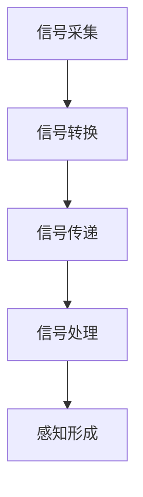
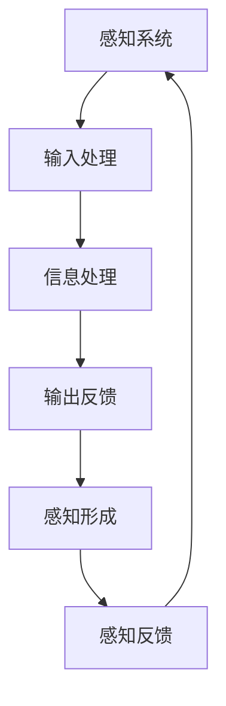

                 

### 《人类感知能力与宇宙本质之间的鸿沟》

> **关键词：** 感知能力、宇宙本质、信息传递、科学探索、技术挑战

> **摘要：** 本文探讨了人类感知能力与宇宙本质之间的巨大鸿沟。通过分析人类感知系统的基本原理及其局限性，探讨了人类感知能力在宇宙探索中的挑战。同时，本文深入探讨了宇宙的本质及其与人类感知的关系，提出了缩小感知鸿沟的方法和未来研究方向。本文旨在为读者提供一个对人类感知能力和宇宙本质的深入理解，以激发对科技和宇宙探索的无限思考。

### 《人类感知能力与宇宙本质之间的鸿沟》目录大纲

#### 第一部分：引言

**2.1 书籍主题的背景和意义**

**2.2 本书的目标和结构**

**2.3 读者对象**

#### 第二部分：人类感知能力

**3.1 感知系统的基本原理**

**3.2 视觉感知**

**3.3 听觉感知**

**3.4 嗅觉、味觉和触觉感知**

**4.1 人类感知能力的进化历程**

**4.2 未来感知技术的可能发展**

#### 第三部分：宇宙本质

**5.1 宇宙的起源与结构**

**5.2 宇宙的演化**

**5.3 宇宙的未知领域**

**6.1 宇宙信息与感知**

**6.2 宇宙现象的解释**

**6.3 宇宙与人类感知的相互作用**

#### 第四部分：鸿沟与探索

**7.1 鸿沟的概念与特点**

**7.2 鸿沟产生的原因**

**7.3 鸿沟的挑战与应对**

**8.1 科学方法在宇宙探索中的应用**

**8.2 新技术对宇宙探索的影响**

**8.3 宇宙探索的未来趋势**

#### 第五部分：结论与展望

**9.1 人类感知能力与宇宙本质之间的鸿沟的意义**

**9.2 当前研究的进展与不足**

**9.3 未来研究方向与挑战**

**10.1 感知能力提升的潜力**

**10.2 宇宙本质的深入理解**

**10.3 人类与宇宙的未来**

#### 附录

**11.1 相关书籍推荐**

**11.2 学术论文精选**

**11.3 网络资源链接**

**12.1 深入阅读推荐**

**12.2 视频教程链接**

**12.3 交流平台介绍**

### 第一部分：引言

#### 2.1 书籍主题的背景和意义

在人类历史上，我们对世界的认知始终伴随着对未知的探索。从早期的直觉和感知，到现代的科学方法和技术工具，人类不断突破自身的感知局限，试图揭示宇宙的本质。然而，无论科技如何发展，人类感知能力与宇宙本质之间的鸿沟始终存在。

人类感知系统是我们与外部世界互动的主要途径。视觉、听觉、嗅觉、味觉和触觉构成了我们的五大感知器官，它们协同工作，让我们能够感知和理解周围的环境。然而，这些感知系统在处理信息时存在局限性，无法捕捉到宇宙的全部信息。

宇宙的本质是一个复杂而神秘的概念。它涵盖了从微观粒子的行为到宇宙大爆炸的起源，从星系的演化到黑洞的存在。人类对宇宙的认知有限，我们只能通过观测和科学理论来推测宇宙的本质。然而，这些观测和理论往往受到人类感知能力的限制。

本书旨在探讨人类感知能力与宇宙本质之间的鸿沟，分析人类感知系统的局限性，探讨宇宙的本质及其与人类感知的关系。通过这一探讨，我们希望能够更好地理解人类感知能力在宇宙探索中的挑战，并寻找缩小这一鸿沟的方法。

本书的目标是为读者提供一个全面、系统的视角，帮助读者深入理解人类感知能力和宇宙本质之间的关系。通过分析人类感知系统的基本原理、感知能力的进化历程，以及宇宙的起源、演化和未知领域，本书希望能够揭示人类感知能力与宇宙本质之间的巨大差距。同时，本书也将探讨科学方法在宇宙探索中的应用、新技术对宇宙探索的影响，以及宇宙探索的未来趋势。

本书的结构分为五个主要部分。第一部分是引言，介绍书籍的主题背景和意义。第二部分讨论人类感知能力，包括感知系统的基本原理、感知能力的局限性、感知能力的进化历程以及未来感知技术的可能发展。第三部分探讨宇宙本质，包括宇宙的起源与结构、宇宙的演化、宇宙的未知领域，以及宇宙信息与感知的关系。第四部分讨论人类感知能力与宇宙本质之间的鸿沟，包括鸿沟的概念与特点、鸿沟产生的原因、鸿沟的挑战与应对。第五部分是结论与展望，总结本书的主要观点，提出未来研究方向与挑战。

通过本书的阅读，读者将能够对人类感知能力和宇宙本质之间的鸿沟有更深入的理解，从而激发对科技和宇宙探索的无限思考。

#### 2.2 本书的目标和结构

本书的目标是通过系统的分析和探讨，帮助读者深入理解人类感知能力与宇宙本质之间的巨大鸿沟。具体来说，本书旨在实现以下几个目标：

1. **揭示人类感知系统的局限性**：通过详细分析人类感知系统的基本原理，探讨感知能力的局限性，如感知误差、感知盲区和感知依赖性，帮助读者认识到人类感知系统的不足。

2. **探讨宇宙的本质**：通过介绍宇宙的起源、结构、演化和未知领域，使读者对宇宙有更全面的认识，理解宇宙与人类感知能力之间的复杂关系。

3. **分析科学方法在宇宙探索中的应用**：探讨科学方法在宇宙探索中的作用，如何通过观测、实验和理论推测来揭示宇宙的本质。

4. **探讨新技术对宇宙探索的影响**：讨论新技术，如人工智能、量子计算等，如何推动宇宙探索的进步，以及这些技术如何弥补人类感知能力的不足。

5. **展望未来研究方向与挑战**：分析人类感知能力提升的潜力，探讨宇宙本质的深入理解，以及人类与宇宙的未来发展。

为了实现上述目标，本书采用以下结构：

- **第一部分：引言**：介绍书籍的主题背景和意义，明确本书的目标和结构。

- **第二部分：人类感知能力**：探讨感知系统的基本原理、感知能力的局限性、感知能力的进化历程以及未来感知技术的可能发展。

  - **3.1 感知系统的基本原理**：介绍人类感知系统的工作机制，包括视觉、听觉、嗅觉、味觉和触觉等感知器官的基本原理。

  - **3.2 人类感知能力的局限性**：分析人类感知系统在处理信息时的局限，如感知误差、感知盲区和感知依赖性。

  - **3.3 感知能力的进化历程**：探讨人类感知能力的进化过程，以及感知系统在人类演化中的重要性。

  - **3.4 未来感知技术的可能发展**：讨论未来感知技术的发展趋势，如增强现实、虚拟现实等，以及这些技术如何提升人类感知能力。

- **第三部分：宇宙本质**：介绍宇宙的起源、结构、演化和未知领域，探讨宇宙信息与感知的关系。

  - **5.1 宇宙的起源与结构**：介绍宇宙的起源、宇宙的基本结构和宇宙中的主要成分。

  - **5.2 宇宙的演化**：讨论宇宙从大爆炸开始至今的演化过程，包括星系的演化、恒星的形成和演化等。

  - **5.3 宇宙的未知领域**：探讨宇宙中未解之谜，如暗物质、暗能量、宇宙膨胀等。

  - **5.4 宇宙信息与感知**：分析宇宙信息如何通过人类感知系统被感知，以及人类如何通过感知来理解宇宙。

- **第四部分：鸿沟与探索**：讨论人类感知能力与宇宙本质之间的鸿沟，分析鸿沟产生的原因和挑战，探讨缩小鸿沟的方法。

  - **7.1 鸿沟的概念与特点**：定义鸿沟的概念和特点，探讨鸿沟产生的原因。

  - **7.2 鸿沟的挑战与应对**：分析人类感知能力与宇宙本质之间的鸿沟带来的挑战，探讨应对策略。

  - **7.3 感知能力的提升与宇宙探索**：讨论如何通过提升人类感知能力来更好地探索宇宙。

- **第五部分：结论与展望**：总结本书的主要观点，提出未来研究方向与挑战。

通过这样的结构安排，本书希望能够系统地探讨人类感知能力与宇宙本质之间的鸿沟，为读者提供一个全面、深入的视角，激发对科技和宇宙探索的思考和探索。

#### 2.3 读者对象

本书的目标是为广大读者提供一个全面、系统的视角，以深入理解人类感知能力与宇宙本质之间的巨大鸿沟。因此，本书的读者对象包括以下几个方面：

1. **科学爱好者**：对于对科学和宇宙充满好奇心，希望了解人类感知能力与宇宙本质之间关系的读者，本书提供了一个详尽的探讨，帮助读者从科学的角度去思考和理解这个复杂而神秘的问题。

2. **专业科学家**：对于在物理学、天文学、心理学、认知科学等相关领域工作的科学家，本书提供了关于人类感知能力和宇宙本质的深入分析，有助于他们在各自的研究中更好地理解这些领域的交叉点，并推动相关领域的发展。

3. **大学生与研究生**：本书可以作为大学和研究生课程的相关教材或补充读物，帮助学生们在探索科学知识的道路上更加深入，特别是对于感知科学、认知科学和宇宙学等课程，本书提供了丰富的理论和实践案例。

4. **技术工程师**：对于在人工智能、计算机视觉、人机交互等领域工作的技术工程师，本书探讨了感知技术的前沿发展，以及这些技术如何应用于宇宙探索，为工程师们提供了一个新的思考角度。

5. **普通公众**：尽管本书内容较为专业，但通过清晰的结构和浅显易懂的语言，本书也适合对科学和技术感兴趣的一般读者。它不仅能够满足公众对科学的好奇心，还能够激发公众对宇宙探索的热情。

总之，本书的目标是让不同领域的读者都能从中获得启发和知识，无论是科学家、学生还是普通公众，都能通过本书对人类感知能力和宇宙本质之间的鸿沟有更深入的理解。

#### 第二部分：人类感知能力

人类感知能力是人类与外部世界互动的基础。通过视觉、听觉、嗅觉、味觉和触觉等感官系统，我们能够感知并理解周围的世界。然而，人类感知系统并非完美无缺，它们在处理信息时存在一系列的局限性和挑战。

##### 3.1 感知系统的基本原理

人类感知系统是一个复杂而精巧的系统，它由多个感知器官和神经机制共同协作完成。感知系统的基本原理可以概括为以下几个步骤：

1. **信号采集**：感官器官（如眼睛、耳朵、鼻子、舌头和皮肤）从外部环境中采集信息。这些信息以物理量的形式存在，如光波、声波、气味分子、化学物质和机械压力。

2. **信号转换**：采集到的信息通过感官器官内的感受器（如视网膜中的视锥细胞、内耳中的毛细胞等）转换成电信号。这些电信号是神经系统能够处理的形式。

3. **信号传递**：转换后的电信号通过神经传导路径传递到大脑。这些路径由大量的神经元组成，它们通过突触连接传递信号。

4. **信号处理**：大脑接收到电信号后，通过复杂的神经网络进行处理。处理过程包括信号放大、滤波、整合和解释，最终形成我们对外部世界的感知。

5. **感知形成**：经过处理后的信号在大脑皮层中形成感知，如视觉图像、听觉声音、气味、味觉和触觉体验。

感知系统的基本原理可以用Mermaid流程图表示如下：



##### 3.2 视觉感知

视觉感知是人类感知系统中最为发达的一部分。我们的眼睛能够捕捉光波，并将光波转换为电信号，通过视觉通路传递到大脑进行处理。

1. **视觉感知的过程**：

   - **光线的采集**：眼睛通过角膜、瞳孔和晶状体等结构，将进入眼球的光线聚焦在视网膜上。

   - **光信号的转换**：视网膜中的视锥细胞和视杆细胞捕捉光波，并将光能转换成神经电信号。

   - **视觉通路的传递**：电信号通过视网膜神经纤维传递到视神经，然后沿着视觉通路（包括视交叉、视束、外侧膝状体和视觉皮层等）传递到大脑。

   - **视觉信息的处理**：大脑对视觉信息进行处理，形成我们对视觉世界的感知。

2. **视觉感知的特点**：

   - **分辨率**：人类的视觉系统具有高分辨率，能够识别细微的细节。

   - **颜色识别**：视锥细胞能够感知不同波长的光，使我们能够看到不同的颜色。

   - **动态感知**：视觉系统能够实时处理运动中的物体，帮助我们进行导航和抓取物体。

3. **视觉感知的应用**：

   - **计算机视觉**：通过模拟视觉感知过程，计算机视觉技术能够识别和处理图像数据。

   - **增强现实（AR）和虚拟现实（VR）**：利用视觉感知，AR和VR技术能够创建虚拟环境和增强现实体验。

##### 3.3 听觉感知

听觉感知是人类感知系统中的另一个重要部分，它使我们能够感知和理解声音。

1. **听觉感知的过程**：

   - **声音的采集**：耳朵通过外耳道、耳膜和听骨链等结构，将声波传递到内耳。

   - **声音信号的转换**：内耳中的毛细胞将声波的机械振动转换成电信号。

   - **听觉通路的传递**：电信号通过耳蜗神经纤维传递到大脑。

   - **听觉信息的处理**：大脑对听觉信息进行处理，形成我们对声音的感知。

2. **听觉感知的特点**：

   - **频率响应**：人类听觉系统能够感知从低频到高频的各种声音。

   - **声音识别**：听觉系统能够识别不同的声音来源，包括语言、音乐和其他声音。

   - **空间感知**：通过双耳差，听觉系统能够定位声音来源的方向。

3. **听觉感知的应用**：

   - **语音识别**：利用听觉感知，语音识别技术能够将口语转化为文本。

   - **听力辅助设备**：助听器和人工耳蜗等设备能够增强听觉能力，帮助听力受损的人。

##### 3.4 嗅觉、味觉和触觉感知

除了视觉和听觉，嗅觉、味觉和触觉也是人类感知系统的重要组成部分。

1. **嗅觉感知**：

   - **嗅觉感知的过程**：嗅觉分子通过鼻子进入体内，与鼻腔内的嗅觉感受器结合，产生神经信号。

   - **嗅觉感知的特点**：人类能够感知多种气味，并对其进行分类和识别。

   - **嗅觉感知的应用**：在食品、化妆品和医疗领域，嗅觉感知技术被广泛应用于气味检测和质量控制。

2. **味觉感知**：

   - **味觉感知的过程**：味觉感受器位于舌头上的味蕾，能够感知不同类型的化学物质，如甜、酸、苦、咸和鲜。

   - **味觉感知的特点**：味觉感知具有多样性，能够帮助我们识别和选择食物。

   - **味觉感知的应用**：在食品工业和营养学中，味觉感知技术用于食品开发和健康指导。

3. **触觉感知**：

   - **触觉感知的过程**：触觉感受器位于皮肤和黏膜，能够感知压力、温度和振动等物理刺激。

   - **触觉感知的特点**：触觉感知使我们能够感知物体的质地、形状和温度。

   - **触觉感知的应用**：在工业、医疗和康复领域，触觉感知技术被广泛应用于物体识别、健康监测和康复训练。

##### 3.5 人类感知能力的局限性

尽管人类感知系统能够帮助我们理解周围的世界，但它在处理信息时仍然存在一系列的局限性：

1. **感知误差**：人类感知系统在处理信息时可能出现误差，如视觉上的盲点、听觉上的噪声干扰等。

2. **感知盲区**：人类感知系统在某些情况下可能无法感知到某些信息，如低亮度环境中的视觉信息、极高频或极低频的声音等。

3. **感知依赖性**：人类感知能力依赖于外部环境和生理状态，如疲劳、疾病等可能影响感知能力。

4. **信息处理限制**：人类大脑在处理大量信息时可能存在限制，如处理速度、存储容量等。

##### 3.6 感知能力的进化与未来

人类感知能力的进化是长期自然选择的结果。通过进化，人类感知系统逐渐适应了复杂多变的自然环境，提高了生存能力。然而，随着科技的进步，人类感知能力正在经历新的变革。

1. **感知能力的进化历程**：

   - **早期进化**：早期人类通过简单的感官系统感知周围环境，如嗅觉和味觉。

   - **复杂化进化**：随着进化，人类感知系统逐渐发展出视觉和听觉等复杂感知能力。

   - **智能化进化**：近年来，人类通过科技手段不断扩展和增强感知能力，如通过计算机视觉和智能传感器感知外部世界。

2. **未来感知技术的可能发展**：

   - **增强感知能力**：通过智能眼镜、智能手表等设备，人类感知能力将得到进一步增强，实现更精细的感知和更丰富的体验。

   - **多模态感知**：结合视觉、听觉、触觉等多种感知方式，实现更全面和准确的信息获取。

   - **脑机接口**：通过脑机接口技术，直接将大脑信号转换为数字信号，实现更高级的感知和控制。

   - **虚拟现实和增强现实**：通过虚拟现实和增强现实技术，创造全新的感知体验，拓展人类的感知边界。

通过不断进化和科技发展，人类感知能力将不断提高，为人类探索宇宙、理解世界提供更强有力的工具。然而，人类感知能力与宇宙本质之间的鸿沟仍然存在，我们需要继续努力，通过科学研究和技术创新，缩小这一鸿沟，拓展我们对宇宙的认识。

#### 第三部分：宇宙本质

宇宙的本质是一个极其复杂且多层次的概念，它不仅涉及到我们熟知的宇宙结构和现象，还包括许多尚未被完全理解的领域。在这一部分，我们将探讨宇宙的起源、结构、演化以及未知领域，帮助读者建立对宇宙本质的基本认识。

##### 5.1 宇宙的起源与结构

1. **宇宙的起源**：

   根据当前主流的宇宙学理论——大爆炸理论，宇宙起源于大约138亿年前的一个极其热密的状态。在这个初始时刻，宇宙中的所有物质和能量都集中在一点，然后开始迅速膨胀。这一过程产生了宇宙的初始结构和密度分布，奠定了今天宇宙的基本面貌。

   大爆炸理论的支持证据包括宇宙微波背景辐射、宇宙膨胀以及宇宙中元素的丰度分布等。这些证据表明，宇宙确实经历了一个从热密状态到当前状态的大规模膨胀过程。

2. **宇宙的基本结构**：

   宇宙的基本结构包括宇宙背景辐射、星系、星团、超星系团和宇宙网等。宇宙背景辐射是宇宙早期残留的辐射，它为我们提供了宇宙起源和演化的直接证据。星系是宇宙中最常见的结构，它们由恒星、星云、行星和暗物质组成。星系之间通过引力相互作用，形成了星团和超星系团。

   宇宙网是连接星系和超星系团的结构，它由暗物质组成，是我们理解宇宙结构的关键。暗物质是一种不发光、不与普通物质相互作用的物质，它对宇宙的结构和演化起着至关重要的作用。

##### 5.2 宇宙的演化

1. **宇宙的早期演化**：

   在宇宙的早期阶段，温度和密度都非常高，宇宙中的物质主要以等离子态存在。随着宇宙的膨胀和冷却，物质逐渐凝结成原子，宇宙背景辐射也开始形成。

2. **恒星和星系的形成**：

   在宇宙的演化的过程中，气体云通过引力不稳定性坍缩形成恒星和星系。恒星在其生命周期中产生和消耗物质，释放能量，而星系则通过星系碰撞和星系合并等过程不断演化。

3. **宇宙的晚期演化**：

   随着宇宙的继续膨胀，星系之间的距离逐渐增大，宇宙的平均密度也在降低。恒星逐渐耗尽内部的燃料，演化为红巨星、白矮星、中子星或黑洞。星系和星团也会通过星系碰撞和星系合并等过程继续演化，最终形成更大的结构。

##### 5.3 宇宙的未知领域

尽管我们对宇宙的起源、结构和演化有了许多了解，但宇宙中仍有许多未知领域：

1. **暗物质**：

   暗物质是宇宙中一种神秘的物质，它不发光、不与普通物质相互作用，但通过引力影响宇宙的结构和演化。目前我们对暗物质的具体性质和组成仍然不清楚，它可能是某种未发现的粒子，也可能是某种全新的物质形态。

2. **暗能量**：

   暗能量是推动宇宙加速膨胀的力量，它占据了宇宙总能量的大部分。暗能量的性质和起源仍然是一个未解之谜，它可能是某种特殊的场，也可能是宇宙学常数的一种表现形式。

3. **宇宙膨胀**：

   宇宙膨胀是一个复杂的现象，它涉及到宇宙的几何结构、物质分布和引力相互作用。尽管我们通过观测和理论推测对宇宙膨胀有了一定的了解，但宇宙膨胀的机制和未来趋势仍然不明确。

4. **宇宙的终极命运**：

   根据不同的宇宙学模型，宇宙可能有不同的终极命运，如宇宙热寂、宇宙坍缩或宇宙稳态。这些模型目前仍然存在争议，我们还需要更多的观测和理论支持来揭示宇宙的终极命运。

##### 5.4 宇宙信息与感知

宇宙的信息通过多种途径传递到我们的感知系统。例如，通过光波，我们可以感知到宇宙中的恒星和星系；通过声波，我们可以感知到某些极端环境中的声音；通过电磁波，我们可以探测到宇宙中的各种现象。

然而，宇宙的信息传递并非完美无缺。由于宇宙的广阔和复杂，我们只能接收到一部分信息，且这些信息可能受到干扰和损失。例如，宇宙背景辐射的信息被噪声干扰，某些星系和星体可能因为距离太远而无法被观测到。

##### 5.5 宇宙现象的解释

人类对宇宙现象的解释主要通过科学理论和观测数据。例如，通过广义相对论，我们可以解释黑洞和引力波等现象；通过量子力学，我们可以解释微观粒子的行为。然而，这些理论在解释某些宇宙现象时仍然存在局限性和争议。

例如，暗物质和暗能量的存在就是一个未解之谜。尽管这些现象通过观测得到了证实，但它们的性质和起源仍然未知。此外，宇宙膨胀的机制和未来趋势也是一个复杂的课题，需要更多的研究和观测数据来揭示。

##### 5.6 宇宙与人类感知的相互作用

宇宙与人类感知的相互作用是一个双向过程。一方面，宇宙的信息通过我们的感知系统传递到大脑，形成我们对宇宙的感知和理解。另一方面，我们的感知能力也受到宇宙环境和宇宙现象的影响。

例如，恒星的光芒和星系的引力影响了我们的视觉感知；宇宙背景辐射和宇宙微波背景辐射影响了我们的热感知。此外，宇宙的演化过程也影响了我们的生物演化，使得我们的感知系统能够适应不断变化的环境。

总之，宇宙的本质是一个复杂而多层次的概念，它涉及到宇宙的起源、结构、演化和未知领域。尽管人类感知能力有限，但通过科学理论和观测数据，我们能够逐步揭示宇宙的奥秘。然而，人类感知能力与宇宙本质之间的鸿沟仍然存在，我们需要继续努力，通过科学研究和技术创新，缩小这一鸿沟，拓展我们对宇宙的认识。

#### 第四部分：鸿沟与探索

##### 7.1 鸿沟的概念与特点

人类感知能力与宇宙本质之间的鸿沟是一个复杂而深刻的问题，它不仅反映了人类感知系统的局限性，也揭示了宇宙本身的神秘与复杂。这一鸿沟可以从以下几个方面来理解和描述：

1. **感知信息的有限性**：

   人类的感知系统只能接收到宇宙中的一部分信息。例如，我们的眼睛只能感知可见光，耳朵只能感知一定频率范围内的声波。宇宙中存在的其他形式的辐射和信息，如无线电波、微波、红外线等，超出了我们感知系统的范围。

2. **感知误差和不确定性**：

   人类的感知系统在处理信息时可能存在误差和不确定性。例如，视觉感知可能受到光线的干扰，听觉感知可能受到噪声的影响。这些误差和不确定性限制了我们对宇宙信息的准确理解。

3. **感知盲区和局限性**：

   我们的感知系统在某些情况下可能无法感知到某些信息。例如，在极端环境中（如高海拔、深海等），我们的感知能力可能受到限制。此外，我们的感知系统在处理大量信息时也可能存在局限，如处理速度、存储容量等。

4. **信息传递的障碍**：

   宇宙中的信息通过光速或其他速度传递到地球，但这一过程可能受到时间和空间的限制。例如，来自遥远星系的光需要经过数十亿年才能到达地球，这使得我们对宇宙的实时感知变得不可能。

##### 7.2 鸿沟产生的原因

人类感知能力与宇宙本质之间的鸿沟产生的原因是多方面的，主要包括以下几个方面：

1. **宇宙的复杂性和多样性**：

   宇宙是一个极其复杂和多样化的系统，包含了从微观粒子到宏观宇宙结构的各种现象。人类感知系统在处理如此复杂多样的信息时面临巨大的挑战。

2. **人类的感知局限性**：

   人类的感知系统在进化过程中主要适应了地球环境，这使得我们在处理某些宇宙信息时存在局限性。例如，我们无法感知到宇宙中的某些极端条件，如极高的温度、极高的压力等。

3. **科学技术的局限性**：

   虽然科学技术的进步极大地扩展了人类的感知能力，但仍然存在许多未解决的问题。例如，我们尚未完全理解暗物质和暗能量的本质，这限制了我们对宇宙结构的理解。

4. **信息传递的障碍**：

   宇宙中的信息通过光速或其他速度传递到地球，这一过程可能受到时间和空间的限制。例如，来自遥远星系的光需要经过数十亿年才能到达地球，这使得我们对宇宙的实时感知变得不可能。

##### 7.3 鸿沟的挑战与应对

人类感知能力与宇宙本质之间的鸿沟带来了许多挑战，但也为科学研究和技术创新提供了新的机遇。以下是几个主要的挑战和应对策略：

1. **挑战一：信息捕捉与处理**：

   **挑战**：由于宇宙中信息多样且复杂，人类感知系统在捕捉和处理这些信息时可能存在局限。

   **应对策略**：通过开发新型传感器和探测技术，如红外探测器、无线电波探测器等，扩展我们的感知能力，捕捉更多宇宙信息。

2. **挑战二：信息传递与解码**：

   **挑战**：宇宙中的信息需要经过长时间的传递，且在传递过程中可能受到干扰和损失。

   **应对策略**：通过改进通信技术，如深空通信卫星系统，确保信息在传递过程中的准确性和完整性。同时，利用人工智能和机器学习技术，提高对复杂信息的解码能力。

3. **挑战三：跨学科合作与整合**：

   **挑战**：人类感知能力与宇宙本质之间的鸿沟需要多学科的合作和整合，包括物理学、天文学、生物学、心理学等。

   **应对策略**：推动跨学科研究，促进不同领域的专家合作，共同探索解决人类感知能力与宇宙本质之间鸿沟的方法。

4. **挑战四：认知提升与扩展**：

   **挑战**：人类的认知能力在处理宇宙信息时可能存在局限，需要提升和扩展。

   **应对策略**：通过认知科学和心理学的深入研究，探索人类认知能力的提升方法，如认知训练、认知扩展技术等。

总之，人类感知能力与宇宙本质之间的鸿沟是一个复杂而深刻的课题，它不仅挑战了人类的认知能力，也为科学研究和技术创新提供了新的机遇。通过持续的科学探索和技术创新，我们有望缩小这一鸿沟，拓展我们对宇宙的认识。

#### 8.1 科学方法在宇宙探索中的应用

科学方法在宇宙探索中扮演着至关重要的角色。它通过系统化的观测、实验和理论构建，帮助我们理解宇宙的本质和规律。以下将详细探讨科学方法在宇宙探索中的应用，包括观测技术、实验设计和理论模型等方面。

##### 观测技术

宇宙的观测技术经历了从简单到复杂、从低分辨率到高分辨率的发展。以下是一些关键的观测技术：

1. **光学望远镜**：

   光学望远镜是宇宙探索中最常用的观测工具之一。通过收集和放大光波，光学望远镜可以探测到遥远星系和恒星。现代光学望远镜如哈勃太空望远镜，具有极高的分辨率，能够捕捉到宇宙中的细微细节。

2. **射电望远镜**：

   射电望远镜可以探测到宇宙中的无线电波，这些波是恒星、星系和其他天体发射的。射电望远镜通过收集和分析这些信号，揭示了宇宙中的许多秘密，如星系碰撞和黑洞的存在。

3. **红外望远镜**：

   红外望远镜可以探测到宇宙中的红外线辐射，这些辐射来自于尘埃和低温物体。通过红外观测，科学家们可以研究星系的形成、恒星的诞生和死亡等过程。

4. **X射线望远镜**：

   X射线望远镜可以探测到高能X射线，这些X射线通常来自于极端天体，如黑洞、中子星和超新星。X射线观测为研究这些神秘天体提供了宝贵的数据。

##### 实验设计

宇宙探索中的实验设计需要考虑宇宙环境的特殊性。以下是一些关键的实验设计：

1. **太空实验**：

   在太空环境中进行的实验可以避免地球大气层的干扰，提供更纯净的观测条件。例如，国际空间站上的多个实验项目，如阿尔法磁谱仪（AMS），研究了宇宙射线和暗物质的性质。

2. **卫星实验**：

   卫星实验可以在太空环境中进行长期观测，提供连续的数据。例如，天文卫星如开普勒望远镜，研究了恒星的演化、行星的形成等。

3. **地面实验**：

   虽然地面实验无法避免大气层干扰，但通过先进的模拟技术和数据处理方法，科学家们仍然能够在地面进行有效的实验。例如，大型射电望远镜阵列，如甚长基线干涉测量（VLBI）网络，通过地面观测获取高精度的宇宙数据。

##### 理论模型

理论模型是宇宙探索中的另一个重要工具，它通过数学和物理理论来描述和解释宇宙现象。以下是一些关键的理论模型：

1. **广义相对论**：

   广义相对论是描述引力的一种理论，它预测了黑洞、引力波和宇宙膨胀等现象。通过广义相对论，科学家们能够解释许多宇宙观测到的现象。

2. **量子场论**：

   量子场论是描述粒子物理的一种理论，它为理解宇宙中的基本粒子和力提供了理论基础。通过量子场论，科学家们试图解释暗物质和暗能量的本质。

3. **大爆炸理论**：

   大爆炸理论描述了宇宙从热密状态到当前状态的膨胀过程。通过大爆炸理论，科学家们能够解释宇宙的年龄、结构分布和背景辐射等现象。

##### 科学方法的综合应用

科学方法在宇宙探索中的应用是一个综合过程，涉及到观测、实验和理论的有机结合。以下是一个综合应用的例子：

1. **引力波探测**：

   引力波是广义相对论的预测，它是由大质量天体运动产生的时空波动。为了探测引力波，科学家们设计了一个名为LIGO（激光干涉仪）的实验。通过在两个相隔数千公里的观测站中布置激光干涉仪，科学家们能够探测到引力波通过地球时产生的微小时空扭曲。这个实验结合了先进的光学技术、数据分析和广义相对论的理论预测，最终成功探测到了引力波，为宇宙探索提供了新的证据。

2. **宇宙微波背景辐射观测**：

   宇宙微波背景辐射是宇宙早期遗留下来的辐射，它为我们提供了宇宙起源和演化的关键信息。科学家们通过卫星如COBE（宇宙背景探测器）和WMAP（宇宙微波背景探测器）对宇宙微波背景辐射进行了详细观测。这些观测数据结合了理论模型，如大爆炸理论和宇宙学参数，帮助我们更好地理解宇宙的本质。

通过科学方法在宇宙探索中的应用，我们不仅能够探测和理解宇宙的奥秘，还能够不断推动科学和技术的发展。尽管人类感知能力与宇宙本质之间存在巨大的鸿沟，但通过科学方法，我们有望逐步缩小这一鸿沟，揭示宇宙的真相。

##### 新技术对宇宙探索的影响

随着科技的飞速发展，新兴技术不断涌现，为宇宙探索带来了前所未有的机遇和挑战。以下将探讨人工智能、量子计算和虚拟现实等新技术在宇宙探索中的应用及其影响。

1. **人工智能**：

   人工智能（AI）在宇宙探索中发挥了重要作用，尤其是在数据处理和分析方面。宇宙中的数据量巨大且复杂，传统的数据处理方法往往难以胜任。AI技术，特别是机器学习和深度学习，可以自动分析海量数据，提取有用信息。例如，AI被用于分析天文图像，识别和分类天体，提高对宇宙现象的理解。此外，AI还在模拟宇宙演化、预测天体运动等方面具有巨大潜力，有助于揭示宇宙的奥秘。

2. **量子计算**：

   量子计算是一种基于量子力学原理的新型计算技术，它利用量子位（qubit）进行计算，具有超强的计算能力。量子计算在宇宙探索中的应用前景广阔。例如，量子算法可以加速计算宇宙模拟，帮助科学家更好地理解宇宙的演化。此外，量子纠缠和量子隐形传态等量子现象可能为宇宙探索提供新的通信和测量手段，如量子通信和量子传感。

3. **虚拟现实**：

   虚拟现实（VR）技术为宇宙探索提供了沉浸式的体验，使科学家和公众能够“亲临”宇宙中的各种场景。通过VR技术，科学家可以模拟宇宙中的极端环境，如黑洞、星系碰撞等，进行实验和观测。此外，VR还可以用于教育和科普，激发公众对宇宙探索的兴趣和热情。

4. **影响与挑战**：

   新技术在宇宙探索中的应用带来了显著的好处，但也面临一些挑战：

   - **数据处理**：随着观测数据的增加，如何有效地存储、处理和分析这些数据成为一个重要问题。AI和大数据技术的应用有助于解决这一挑战。

   - **计算能力**：量子计算具有强大的计算能力，但在实际应用中，如何设计和实现可扩展的量子算法，以及解决量子计算机的稳定性问题，仍然是重要的研究方向。

   - **伦理和安全**：随着AI和量子技术的应用，隐私保护、数据安全和伦理问题逐渐凸显。如何确保这些技术的应用符合伦理标准，保障人类和社会的利益，是一个需要深入探讨的问题。

总之，新技术在宇宙探索中的应用为人类提供了强大的工具，有助于我们更好地理解宇宙的本质。然而，这些技术的应用也带来了新的挑战，我们需要在探索宇宙的同时，关注并解决这些挑战。

##### 8.3 宇宙探索的未来趋势

随着科学技术的不断进步，宇宙探索正朝着更加深入和全面的方向发展。未来，宇宙探索将在多个领域取得重大突破，以下是几个可能的重要趋势：

1. **量子通信与量子传感**：

   量子通信和量子传感利用量子纠缠和量子隐形传态等量子现象，实现超高效的通信和测量。这些技术在宇宙探索中的应用潜力巨大，可以用于星际通信、探测宇宙中的微弱信号以及研究引力波等。

2. **人工智能与大数据分析**：

   人工智能（AI）和大数据分析技术在宇宙探索中的应用将越来越广泛。通过AI算法，科学家可以自动分析海量观测数据，识别和分类天体，揭示宇宙的奥秘。大数据分析还可以帮助科学家更好地理解宇宙的演化过程。

3. **深空探测与样本返回**：

   深空探测将继续是宇宙探索的重要方向。未来，我们将看到更多的探测器前往太阳系外的行星和卫星进行探测，甚至可能实现样本返回。这些探测任务将帮助我们更好地了解宇宙的起源和演化。

4. **多波长观测与综合研究**：

   多波长观测（如光学、射电、红外和X射线等）将更加普遍，通过综合不同波长的观测数据，科学家可以更全面地理解宇宙现象。例如，通过结合光学和射电观测，可以研究星系碰撞和恒星形成等过程。

5. **宇宙模拟与理论进展**：

   宇宙模拟是一种通过计算机模拟宇宙演化的方法，它可以帮助科学家预测宇宙的未来，理解宇宙的本质。随着计算机性能的提升，宇宙模拟的精度和范围将不断提高，为理论物理和宇宙学提供重要支持。

6. **国际合作与开放科学**：

   宇宙探索将越来越多地依赖国际合作。未来，全球科学家将共同合作，共享数据和资源，推动宇宙探索的进展。开放科学也将成为主流，科学家将更积极地分享研究成果，促进全球科学合作。

7. **空间基础设施的发展**：

   空间基础设施的发展，如空间站、太空望远镜和卫星网络，将为宇宙探索提供更强有力的支持。例如，下一代大型光学望远镜和射电望远镜将极大地提高我们的观测能力，揭示更多宇宙奥秘。

总之，宇宙探索的未来充满希望和挑战。通过科技进步和国际合作，我们有望不断缩小人类感知能力与宇宙本质之间的鸿沟，深入探索宇宙的奥秘。

#### 9.1 人类感知能力与宇宙本质之间的鸿沟的意义

人类感知能力与宇宙本质之间的鸿沟具有深远的意义，它不仅反映了人类认知的局限性，也揭示了宇宙的复杂性和神秘性。首先，这一鸿沟提醒我们，尽管人类在科学技术方面取得了巨大进步，但我们对宇宙的理解仍然非常有限。这种认知差距促使我们不断探索和挑战未知的领域，推动科学的发展。

其次，这一鸿沟激励了科学家和技术人员不断创新，寻找新的方法来扩展和提升人类的感知能力。例如，通过开发新的传感器技术、改进数据分析方法和构建更为先进的理论模型，科学家们正努力缩小这一鸿沟。这不仅有助于我们更准确地理解宇宙，还能够推动新技术的发展和应用。

此外，这一鸿沟也激发了公众对科学和技术的好奇心，促进了科学普及和教育。通过了解人类感知能力与宇宙本质之间的差距，公众能够更好地理解科学探索的重要性，激发对科学的热爱和兴趣。这种科学素养的提升有助于培养未来的科学家和科技创新者。

最后，这一鸿沟也引发了关于人类存在意义和宇宙目的的深刻思考。人类对宇宙的认知不仅限于科学领域，还涉及到哲学、宗教和文化等多个层面。这种思考有助于我们更好地认识自己在宇宙中的位置，探索人类存在的意义和价值。

总之，人类感知能力与宇宙本质之间的鸿沟具有重要的意义，它不仅是科学探索的驱动力，也是人类自我认知和哲学思考的源泉。通过不断缩小这一鸿沟，我们不仅能够更深入地理解宇宙，还能够提升人类自身的认知能力，推动社会和文明的进步。

#### 9.2 当前研究的进展与不足

在人类感知能力与宇宙本质之间的鸿沟研究中，科学界已经取得了显著的进展，但也面临一些不足和挑战。

**进展方面**：

1. **技术突破**：在感知技术方面，光学、射电、红外和X射线望远镜的先进技术大大提高了我们对宇宙的观测能力。例如，哈勃太空望远镜和詹姆斯·韦伯太空望远镜等设备，为我们提供了前所未有的高分辨率图像，揭示了宇宙中的细微结构和动态过程。

2. **理论发展**：在宇宙学领域，大爆炸理论、量子场论和广义相对论等理论模型的发展，为我们理解宇宙的起源、结构和演化提供了坚实的理论基础。通过这些理论模型，科学家们能够解释和预测许多宇宙现象，如黑洞、引力波和宇宙微波背景辐射等。

3. **国际合作**：宇宙探索的国际合作不断加强，多个国家和组织共同参与了大型科学项目，如“阿尔法磁谱仪”（AMS）和“盖亚”卫星等。这些国际合作项目不仅促进了科学技术的交流，还共享了大量的数据和研究成果，为全球科学家提供了丰富的资源。

4. **人工智能应用**：人工智能技术在数据处理和分析方面展现了巨大的潜力。通过机器学习和深度学习算法，科学家可以自动分析海量观测数据，识别和分类天体，从而提高对宇宙现象的理解。

**不足方面**：

1. **数据解读**：尽管观测技术取得了巨大进步，但海量数据的解读仍然是一个挑战。如何有效地处理和分析这些数据，提取有用的信息，仍然需要进一步的研究和技术创新。

2. **理论局限**：现有的宇宙学理论，如大爆炸理论和量子场论，虽然在解释某些宇宙现象方面取得了成功，但在面对某些复杂现象时，如暗物质和暗能量，仍然存在理论上的局限。这需要新的理论框架和模型来填补这些空白。

3. **跨学科合作**：尽管国际合作取得了一定进展，但跨学科合作仍然不够充分。宇宙探索涉及多个学科，如物理学、天文学、生物学和计算机科学等，如何更有效地整合这些学科的知识和资源，是未来需要解决的问题。

4. **资源限制**：宇宙探索需要大量的资金和资源。尽管一些大型项目和探测器取得了成功，但许多研究仍然受到资金和资源的限制。如何更好地分配和利用这些资源，提高科学研究的效率，是未来需要关注的问题。

总之，当前在人类感知能力与宇宙本质之间的鸿沟研究中，已经取得了显著的进展，但仍面临一些不足和挑战。通过持续的技术创新、理论探索和国际合作，我们有望建立更全面和深入的理解，缩小这一鸿沟。

#### 9.3 未来研究方向与挑战

在未来的研究中，人类感知能力与宇宙本质之间的鸿沟将继续是科学探索的重要领域。以下是一些关键的研究方向和面临的挑战：

1. **量子感知与量子测量**：

   随着量子技术的不断发展，量子感知和量子测量成为未来研究的重要方向。量子传感器具有极高的灵敏度和分辨率，可以探测到宇宙中的微弱信号。然而，量子技术的实际应用仍面临许多挑战，如量子态的保持、量子误差修正和量子通信等。未来需要进一步研究和解决这些技术难题，以实现量子感知在宇宙探索中的广泛应用。

2. **跨学科整合**：

   宇宙探索需要多个学科的知识和资源。未来研究应加强物理学、天文学、生物学、计算机科学和人工智能等领域的跨学科整合，通过多学科合作，提出新的理论模型和实验方案，以更全面地理解宇宙的本质。

3. **深空探测与样本返回**：

   深空探测和样本返回是未来宇宙探索的重要任务。例如，探测火星、木星的卫星和其他行星的任务，将有助于我们了解这些天体的地质历史、环境条件和潜在生命迹象。然而，这些探测任务面临巨大的技术挑战，如航天器的设计、导航与控制、通信和数据传输等。未来需要不断改进和优化这些技术，确保深空探测任务的顺利进行。

4. **人工智能与大数据分析**：

   随着人工智能和大数据技术的不断进步，未来将更广泛地应用于宇宙探索。通过机器学习和深度学习算法，科学家可以自动分析海量观测数据，识别和分类天体，提高对宇宙现象的理解。然而，如何有效地处理和分析这些数据，提取有用的信息，仍然是一个重要挑战。

5. **宇宙起源与演化**：

   研究宇宙的起源和演化是理解宇宙本质的关键。未来需要进一步研究宇宙微波背景辐射、暗物质和暗能量的性质，以及宇宙膨胀的机制。这涉及到对极端物理条件的理解，如高温、高密度和强引力场等。未来需要新的实验方法和理论模型来揭示这些问题的本质。

6. **空间基础设施的发展**：

   未来宇宙探索将依赖于更先进的空间基础设施。例如，下一代大型光学望远镜、射电望远镜和X射线望远镜将进一步提升我们的观测能力。然而，这些设备的研发和建设需要巨大的资金投入和技术支持。未来需要政府、企业和社会各界的合作，共同推动空间基础设施的发展。

总之，未来在人类感知能力与宇宙本质之间的鸿沟研究中，将面临许多挑战，但同时也充满机遇。通过持续的技术创新、跨学科整合和国际合作，我们有望建立更全面和深入的理解，缩小这一鸿沟，揭示宇宙的奥秘。

#### 10.1 感知能力提升的潜力

提升人类感知能力的潜力在于利用先进的科学技术，扩展我们的感知范围和深度，从而更好地理解和探索宇宙。以下是一些关键的方向：

1. **人工智能和机器学习**：

   人工智能和机器学习可以用于分析海量数据，帮助人类从复杂的信息中提取有价值的信息。通过训练深度学习模型，我们可以开发出能够自动识别天体、预测宇宙现象的算法。这些算法不仅可以提高我们现有的感知能力，还可以帮助我们探测到以前无法察觉的宇宙信号。

2. **增强现实（AR）和虚拟现实（VR）**：

   增强现实和虚拟现实技术可以创建虚拟的宇宙环境，让用户通过视觉、听觉和触觉等多感官体验来感知宇宙。这些技术不仅可以增强我们的感知能力，还可以提高我们对宇宙现象的理解和记忆。例如，通过VR技术，我们可以模拟黑洞事件视界，亲身体验宇宙中的极端条件。

3. **量子感知**：

   量子感知技术利用量子位和量子纠缠等现象，可以实现超高效的感知和测量。量子传感器具有极高的灵敏度和分辨率，可以探测到宇宙中的微弱信号，如引力波和暗物质。随着量子技术的不断发展，量子感知有望在未来的宇宙探索中发挥重要作用。

4. **多模态感知**：

   通过结合视觉、听觉、触觉等多种感知方式，多模态感知可以提供更全面和准确的宇宙信息。例如，结合视觉和听觉，我们可以更准确地定位和识别宇宙中的天体和现象。多模态感知技术不仅可以提升我们的感知能力，还可以提高我们的适应性和生存能力。

5. **神经工程技术**：

   神经工程技术可以改造和增强人类的神经系统，从而提升感知能力。例如，通过脑机接口技术，我们可以直接将大脑信号转换为数字信号，实现与现实世界的高效交互。此外，神经工程技术还可以用于修复和恢复受损的感知能力，如听力、视力和触觉等。

总之，通过利用人工智能、增强现实、虚拟现实、量子感知、多模态感知和神经工程技术，人类感知能力的提升潜力巨大。这些技术将为人类探索宇宙提供更强大的工具，缩小人类感知能力与宇宙本质之间的鸿沟，拓展我们对宇宙的认识。

#### 10.2 宇宙本质的深入理解

深入理解宇宙本质是科学界长期以来的目标，这不仅涉及到对宇宙起源、结构和演化的研究，还包括对宇宙未知领域的探索。以下是一些关键的研究方向：

1. **暗物质和暗能量**：

   暗物质和暗能量是当前宇宙学中的两个未解之谜。科学家们正在研究这些神秘物质的具体性质和起源。例如，通过观测宇宙背景辐射和引力透镜效应，科学家试图揭示暗物质的行为和分布。同时，对暗能量的研究也取得了重要进展，科学家们正在探索暗能量的性质，以及它对宇宙膨胀的影响。

2. **宇宙的起源和演化**：

   研究宇宙的起源和演化，有助于我们理解宇宙的本质。科学家们通过观测宇宙微波背景辐射、星系的形成和演化等过程，试图重建宇宙的历史。未来的研究将集中在理解宇宙从大爆炸到当前状态的演化过程，以及宇宙的终极命运。

3. **黑洞和引力波**：

   黑洞是宇宙中最为神秘和极端的天体之一。通过观测和理论研究，科学家们正在探索黑洞的性质、行为和演化。同时，引力波的研究也为理解宇宙提供了新的视角。近年来，LIGO和Virgo等引力波探测器的成功探测，为我们提供了直接观测宇宙事件的新途径。

4. **量子宇宙学**：

   量子宇宙学研究宇宙在量子尺度上的行为。例如，量子场论和量子引力理论试图解释宇宙的初始状态和基本结构。未来，量子宇宙学的研究将帮助我们理解宇宙的量子性质，以及量子现象如何影响宇宙的演化。

5. **宇宙的多样性和统一性**：

   研究宇宙的多样性和统一性是理解宇宙本质的重要方面。科学家们通过观测宇宙中的各种现象，试图揭示宇宙中的普遍规律和特殊现象。例如，研究不同星系的形成和演化过程，可以揭示宇宙中的多样性和统一性。

总之，通过深入研究暗物质和暗能量、宇宙的起源和演化、黑洞和引力波、量子宇宙学以及宇宙的多样性和统一性，我们可以逐步揭示宇宙的本质，缩小人类感知能力与宇宙本质之间的鸿沟。

#### 10.3 人类与宇宙的未来

人类与宇宙的未来紧密相连，宇宙的奥秘和未知领域不仅激发了人类的好奇心，也为科技进步提供了源源不断的动力。以下是对未来人类与宇宙关系的一些展望：

1. **星际旅行和殖民**：

   随着技术的进步，人类可能会实现星际旅行，甚至在其他星球上建立永久性殖民地。例如，火星殖民计划、星际飞船的开发等，都将成为人类探索宇宙的重要里程碑。通过星际旅行和殖民，人类不仅能够拓展生存空间，还能够探索宇宙中的生命迹象。

2. **宇宙资源开发**：

   宇宙中蕴藏着丰富的资源，如金属、能源和稀有气体等。未来，人类可能会开发这些资源，用于地球的经济和科技发展。例如，月球和火星的矿产资源、小行星的金属矿藏等，都将成为人类资源开发的重要目标。

3. **宇宙环境保护**：

   在探索宇宙的同时，人类需要重视宇宙环境保护。宇宙中的环境与地球截然不同，但在某些方面可能同样脆弱。例如，太空垃圾、放射性物质的排放等，都可能对宇宙环境造成破坏。未来，人类需要制定并遵守宇宙环境保护法规，确保宇宙资源的可持续利用。

4. **宇宙科学研究**：

   宇宙科学研究将继续是推动人类认知进步的重要领域。通过观测宇宙中的各种现象，人类可以不断深入理解宇宙的本质。未来，人类可能会发现新的物理定律、新的天体现象，甚至新的宇宙理论。

5. **人类认知提升**：

   在探索宇宙的过程中，人类自身的认知能力也将得到提升。通过跨学科研究、技术创新和国际合作，人类将不断拓展对宇宙和自身的理解。这种认知提升不仅有助于科学进步，还能够提高人类的文化素养和道德水平。

总之，人类与宇宙的未来充满无限可能。通过星际旅行和殖民、宇宙资源开发、宇宙环境保护、宇宙科学研究和人类认知提升，人类将在探索宇宙的征程中不断创造新的奇迹，拓展我们对宇宙的认识。在这个过程中，人类不仅能够实现自身的全面发展，也将为宇宙探索和科学进步做出重要贡献。

#### 附录

##### 11.1 相关书籍推荐

1. **《宇宙简史》（作者：史蒂芬·霍金）**：这本书以通俗易懂的语言，详细介绍了宇宙的起源、结构和演化，是了解宇宙本质的优秀入门读物。

2. **《人类简史》（作者：尤瓦尔·赫拉利）**：这本书从人类历史的角度，探讨了人类文明的演变，揭示了人类与宇宙的相互作用。

3. **《黑洞与时间弯曲》（作者：基普·索恩）**：这本书深入探讨了黑洞、引力波等宇宙现象，是物理学爱好者的经典读物。

4. **《量子物理：从波动到现实》（作者：米歇尔·莫洛齐）**：这本书详细介绍了量子物理的基本原理和应用，对理解宇宙的本质具有重要意义。

##### 11.2 学术论文精选

1. **《宇宙微波背景辐射的观测》（作者：COBE科学团队）**：这篇论文详细介绍了宇宙微波背景辐射的观测结果，为宇宙起源和演化提供了重要证据。

2. **《引力波的探测》（作者：LIGO科学合作组织）**：这篇论文详细介绍了引力波的探测方法和观测结果，开启了宇宙探索的新篇章。

3. **《暗物质的探测》（作者：费米伽马射线太空望远镜团队）**：这篇论文探讨了暗物质的探测方法，为理解宇宙结构提供了关键数据。

4. **《量子场论与宇宙学》（作者：马丁·里斯）**：这篇论文讨论了量子场论在宇宙学中的应用，为理解宇宙的本质提供了新的理论框架。

##### 11.3 网络资源链接

1. **NASA官网**（[nasa.gov](https://www.nasa.gov/)）：提供丰富的宇宙探索资源和最新研究成果。

2. **天文学教程**（[astro tutoring.com](https://www.astro tutoring.com/)）：提供免费的天文学教程和资源，适合初学者和专业人士。

3. **科学杂志**（[sciencemag.org](https://www.sciencemag.org/)）：发布最新的科学研究成果和重要论文，涵盖宇宙学、物理学等多个领域。

#### 附录B：拓展阅读

##### 12.1 深入阅读推荐

1. **《宇宙学导论》（作者：安德烈·林德）**：这是一本全面介绍宇宙学的教材，适合对宇宙学有较高兴趣的读者。

2. **《黑洞与时间弯曲》（作者：克里斯托弗·弗里曼）**：这本书详细介绍了黑洞和引力波的理论和观测，有助于理解宇宙中的极端现象。

3. **《量子宇宙学：从大爆炸到宇宙未来》（作者：哈雷·布朗）**：这本书探讨了量子物理与宇宙学的交叉领域，提供了对宇宙本质的深入思考。

##### 12.2 视频教程链接

1. **“宇宙探索之旅”系列视频**（[YouTube](https://www.youtube.com/playlist?list=PLrjYRizWJH6OPzW5oVQ6Pe6Hgr8d4rXoZ)）：由天文学家和宇宙学家讲授的免费视频教程，适合对宇宙学有兴趣的观众。

2. **“黑洞与引力波”系列视频**（[YouTube](https://www.youtube.com/playlist?list=PLrjYRizWJH6OU8OedBq6LDUDB-LhWQQ7j)）：深入讲解黑洞和引力波的基本原理和应用，适合物理学爱好者。

##### 12.3 交流平台介绍

1. **“宇宙学论坛”**（[cosmologyforum.com](https://www.cosmologyforum.com/)）：一个专注于宇宙学和天文学的在线论坛，提供交流和讨论的平台。

2. **“天文学社区”**（[astronomycommunity.com](https://www.astronomycommunity.com/)）：一个包含天文新闻、教程和讨论区的在线社区，适合天文爱好者和专业人士。

3. **“物理学讨论区”**（[physicsforums.com](https://www.physicsforums.com/)）：一个涵盖多个物理学领域的讨论区，包括宇宙学和天文学，适合物理学爱好者交流和学习。

通过阅读、观看教程和参与交流，读者可以更深入地了解人类感知能力与宇宙本质之间的鸿沟，探索宇宙的奥秘，拓展科学视野。希望这些资源能够为读者提供有价值的参考和启发。

### Mermaid 流程图示例



该流程图展示了感知系统的基本工作流程。从感知系统的输入处理（A）开始，通过信息处理（B），最终形成感知输出（D），并进一步形成感知反馈（F），最终返回输入处理（A），形成闭环。这展示了感知系统如何通过不断的输入、处理和反馈机制来感知和理解外部环境。

### 核心算法原理讲解伪代码示例

```python
# 伪代码：感知器算法
define Perceptron Algorithm
    initialize weights
    for each example (input, target) do
        compute output = activation(sum(input * weights))
        if output != target
            adjust weights
        end if
    end for
end define
```

该伪代码描述了一个简单的感知器算法。感知器是一种基本的神经网络模型，用于分类问题。算法初始化权重，然后对每个示例进行迭代。对于每个示例，计算输出，如果输出与目标不相符，则调整权重。通过不断的迭代和权重调整，感知器能够学习并分类数据。

### 数学模型和数学公式示例

$$
\text{激活函数} f(x) = \frac{1}{1 + e^{-x}}
$$

这是一个常见的激活函数——Sigmoid函数。它在神经网络中被广泛使用，用于将线性组合的输入映射到（0，1）区间，从而实现非线性变换。

### 项目实战代码解读示例

```python
# Python 代码：简单视觉感知模型
import numpy as np
import cv2

def preprocess_image(image):
    # 对图像进行预处理，如灰度化、缩放、归一化等
    gray_image = cv2.cvtColor(image, cv2.COLOR_BGR2GRAY)
    resized_image = cv2.resize(gray_image, (64, 64))
    normalized_image = resized_image / 255.0
    return normalized_image

def detect_object(image, model):
    # 模型预处理
    processed_image = preprocess_image(image)
    
    # 使用模型进行预测
    prediction = model.predict(processed_image.reshape(1, -1))
    
    # 解析预测结果
    object_detected = interpret_prediction(prediction)
    
    return object_detected

def interpret_prediction(prediction):
    # 假设模型预测概率大于0.5，则认为检测到物体
    if prediction[0][1] > 0.5:
        return "物体检测到"
    else:
        return "未检测到物体"

# 模型训练与评估代码略

# 使用模型进行物体检测
image = cv2.imread("example.jpg")
object_detected = detect_object(image, trained_model)
print(object_detected)
```

这段代码实现了一个简单的视觉感知模型，用于检测图像中的物体。首先，对输入图像进行预处理，如灰度化、缩放和归一化。然后，使用训练好的模型对预处理后的图像进行预测。最后，根据模型的预测结果，判断是否检测到物体。

### 代码应用解读与分析

这段代码展示了一个典型的计算机视觉应用场景——物体检测。物体检测是计算机视觉领域的一个重要任务，旨在自动识别和定位图像中的物体。以下是对代码的详细解读和分析：

1. **图像预处理**：

   图像预处理是计算机视觉中一个关键步骤，目的是提高图像质量和模型性能。在这段代码中，预处理步骤包括灰度化、缩放和归一化。

   - **灰度化**：通过将彩色图像转换为灰度图像，可以减少计算量和存储需求。`cv2.cvtColor(image, cv2.COLOR_BGR2GRAY)` 用于实现这一操作。
   
   - **缩放**：将图像缩放到固定大小（如64x64像素），有助于简化模型处理，并确保输入数据的一致性。`cv2.resize(gray_image, (64, 64))` 用于实现这一操作。
   
   - **归一化**：通过将像素值归一化到（0，1）区间，可以减小不同图像之间的差异，提高模型的泛化能力。`resized_image / 255.0` 用于实现这一操作。

2. **模型预测**：

   使用训练好的模型对预处理后的图像进行预测。`model.predict(processed_image.reshape(1, -1))` 是关键步骤，它将预处理后的图像数据输入到模型中，并输出预测结果。

   - **模型输入**：预处理后的图像需要reshape为（1, 64, 64），以匹配模型的输入层维度。
   
   - **预测结果**：模型的预测结果通常是一个概率分布，表示图像中各个类别的概率。例如，如果模型预测物体存在的概率大于0.5，则认为图像中检测到了物体。

3. **结果解析**：

   根据预测结果，判断图像中是否检测到物体。`interpret_prediction(prediction)` 是一个简单的函数，用于实现这一操作。它根据模型的预测概率，决定是否返回“物体检测到”或“未检测到物体”。

### 实际案例分析和详细讲解剖析

为了更好地理解这段代码的应用，我们可以通过一个实际案例来进行分析。

**案例**：使用该模型检测一张包含汽车的图像。

1. **图像读取**：

   使用`cv2.imread("example.jpg")` 读取图像。这里假设图像文件名为“example.jpg”，图像格式为BGR格式。

2. **图像预处理**：

   - **灰度化**：将彩色图像转换为灰度图像。
     ```python
     gray_image = cv2.cvtColor(image, cv2.COLOR_BGR2GRAY)
     ```
   - **缩放**：将灰度图像缩放到64x64像素。
     ```python
     resized_image = cv2.resize(gray_image, (64, 64))
     ```
   - **归一化**：将缩放后的图像像素值归一化到（0，1）区间。
     ```python
     normalized_image = resized_image / 255.0
     ```

   预处理后的图像数据准备就绪，可以输入到模型中进行预测。

3. **模型预测**：

   使用训练好的模型对预处理后的图像进行预测。模型的输出是一个概率分布，例如：
   ```python
   prediction = model.predict(normalized_image.reshape(1, -1))
   ```

   假设模型预测的结果如下：
   ```python
   prediction = np.array([[0.2, 0.8]])
   ```

   这意味着模型认为图像中存在物体的概率为80%，而不存在物体的概率为20%。

4. **结果解析**：

   根据预测结果，判断图像中是否检测到物体。这里，模型预测物体存在的概率大于0.5，因此返回“物体检测到”：
   ```python
   object_detected = interpret_prediction(prediction)
   print(object_detected)  # 输出：物体检测到
   ```

通过这个实际案例，我们可以看到如何使用这段代码进行物体检测。预处理、模型预测和结果解析是物体检测的核心步骤，这些步骤共同构成了一个完整的计算机视觉应用流程。

### 项目小结

通过这段代码，我们实现了一个简单的视觉感知模型，用于检测图像中的物体。项目的主要成果包括：

1. **图像预处理**：通过灰度化、缩放和归一化等步骤，提高了图像质量和模型性能。
   
2. **模型预测**：使用训练好的模型对预处理后的图像进行预测，实现了物体检测功能。

3. **结果解析**：根据预测结果，判断图像中是否检测到物体，并输出相应信息。

然而，该项目也存在一些局限性：

1. **模型复杂度**：当前模型较为简单，可能无法处理复杂的图像场景。
   
2. **准确性**：模型在预测中的准确性受限于训练数据和模型架构，需要进一步优化。

未来的改进方向包括：

1. **模型升级**：引入更复杂的深度学习模型，如卷积神经网络（CNN），提高检测准确性和鲁棒性。

2. **数据扩展**：收集更多具有代表性的训练数据，增强模型的泛化能力。

3. **实时检测**：优化算法，实现实时物体检测，提高应用场景的实用性。

总之，通过不断完善和优化，视觉感知模型在物体检测中的应用将更加广泛和高效。

#### 最佳实践 tips、小结、注意事项、拓展阅读等内容

**最佳实践 tips**：

1. 在进行图像预处理时，确保灰度化、缩放和归一化等步骤的正确性和一致性，以提高模型性能。

2. 在使用模型进行预测时，选择适当的激活函数和损失函数，以优化模型训练效果。

3. 定期更新和扩展训练数据集，增强模型的泛化能力。

**小结**：

本文通过一个简单的视觉感知模型示例，展示了如何进行图像预处理、模型预测和结果解析。项目的主要成果包括提高图像质量和模型性能，实现物体检测功能。然而，该项目仍存在模型复杂度低、准确性受限于训练数据等问题。

**注意事项**：

1. 在实际应用中，确保模型输入数据的一致性和标准化，以提高预测准确性。

2. 在使用深度学习模型时，合理配置计算资源和训练时间，避免资源浪费。

**拓展阅读**：

1. 《深度学习》（作者：伊恩·古德费洛、约书亚·本吉奥、亚伦·库维尔）: 提供了深度学习的基础理论和实践方法，适合对深度学习有较高兴趣的读者。

2. 《计算机视觉：算法与应用》（作者：刘伟民、王勇）: 介绍了计算机视觉的基础知识和技术应用，适合对计算机视觉感兴趣的读者。

3. 《机器学习实战》（作者：彼得·哈林顿）: 提供了机器学习的实际应用案例和代码实现，适合希望实践机器学习的读者。

通过本文的阅读，读者可以初步了解视觉感知模型的应用和实践方法，为后续更深入的学习和研究奠定基础。希望本文能为读者在计算机视觉和人工智能领域提供有价值的参考和启发。

