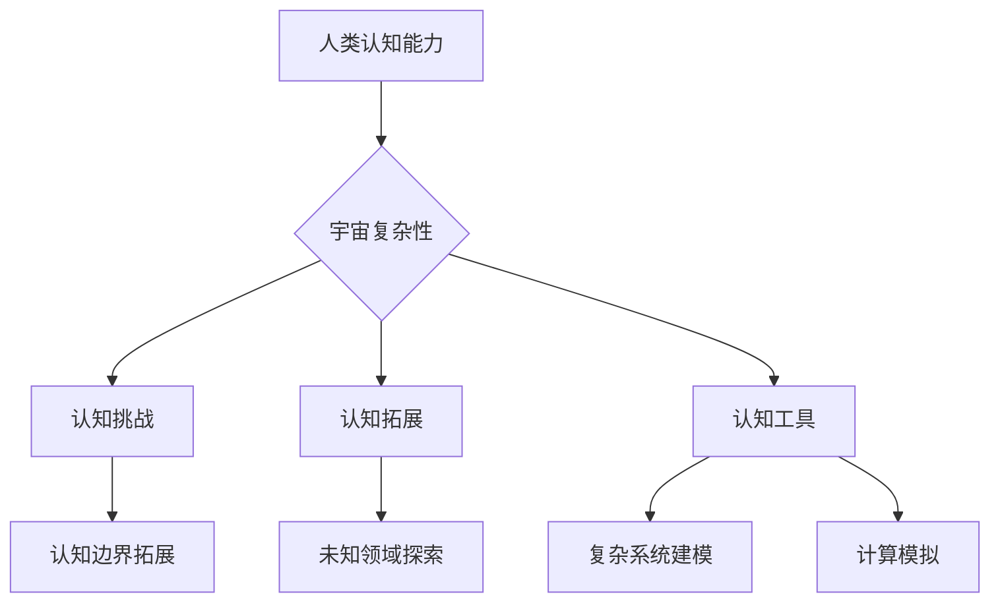
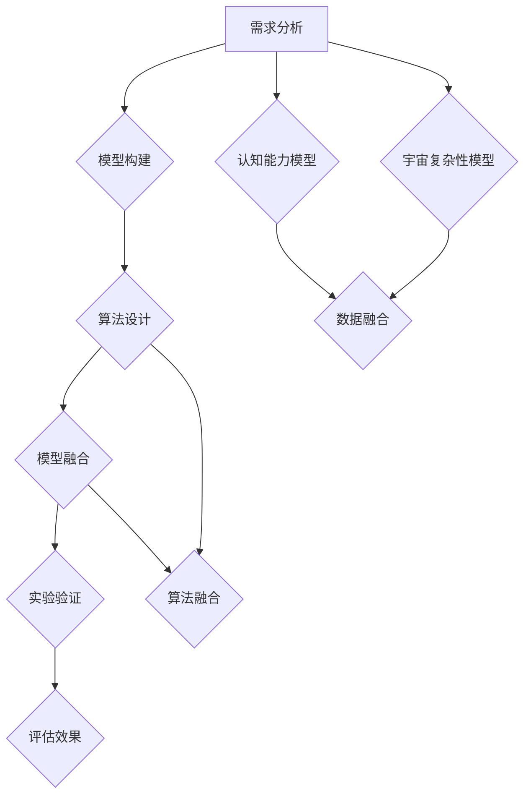

                 

# 文章标题：人类认知能力与宇宙复杂性的矛盾与挑战

> 关键词：人类认知能力、宇宙复杂性、认知扩展、算法模型、项目实战、未来展望

> 摘要：本文旨在探讨人类认知能力与宇宙复杂性之间的矛盾与挑战。通过分析认知科学与神经科学的基础理论，以及对宇宙复杂性理论的深入理解，本文试图揭示人类认知能力的局限以及宇宙复杂性的特点。同时，本文还将介绍提升人类认知能力的核心算法与模型，并通过实际项目案例展示其在宇宙复杂性处理中的应用。最后，本文将对未来研究方向与挑战进行展望。

## 第一部分：背景与概述

### 1.1 人类认知能力与宇宙复杂性的基本概念

#### 1.1.1 人类认知能力的定义与局限

认知能力是指人类在感知、理解、思考、记忆、判断和解决问题等方面所具备的能力。人类认知能力的局限主要体现在以下几个方面：

1. **感知局限**：人类的感官系统对信息的获取能力有限，例如，人类的视觉系统无法感知到紫外光或红外光。
2. **注意力局限**：人类的注意力资源有限，无法同时处理大量的信息。
3. **记忆局限**：人类的短期记忆和长期记忆能力有限，无法存储和处理海量的信息。
4. **推理局限**：人类的逻辑推理能力有限，无法处理复杂的逻辑关系。

#### 1.1.2 宇宙复杂性的概念与表现

宇宙复杂性是指宇宙中存在的复杂现象、规律和结构。宇宙复杂性的主要表现包括：

1. **量子力学**：量子力学揭示了微观世界的复杂性和不确定性。
2. **相对论**：相对论揭示了宏观世界的复杂性和相对性。
3. **宇宙演化**：宇宙演化过程中产生的复杂结构和现象，如星系、黑洞等。
4. **生命现象**：生命现象的复杂性体现在生物体的结构和功能上。

#### 1.1.3 认知能力与宇宙复杂性之间的矛盾

人类认知能力与宇宙复杂性之间的矛盾体现在以下几个方面：

1. **信息过载**：宇宙中的信息量巨大，远远超出人类认知能力的处理范围。
2. **逻辑推理局限**：宇宙中存在的复杂关系和规律，超出了人类逻辑推理的能力。
3. **认知资源限制**：人类的认知资源有限，无法同时处理宇宙中的海量信息。

### 1.2 研究现状与挑战

#### 1.2.1 人类对宇宙复杂性的认识历程

人类对宇宙复杂性的认识历程可以分为以下几个阶段：

1. **观测阶段**：通过望远镜等观测设备，人类逐渐认识到宇宙的广阔和复杂性。
2. **理论阶段**：量子力学和相对论等理论的提出，为人类理解宇宙的复杂性提供了理论基础。
3. **计算阶段**：计算机技术的发展，使得人类能够进行大规模的计算和模拟，进一步揭示宇宙的复杂性。

#### 1.2.2 当前认知能力在研究宇宙中的局限

当前认知能力在研究宇宙中的局限主要包括：

1. **观测精度**：受限于观测设备的精度，人类对宇宙的观测仍存在误差。
2. **理论框架**：现有的理论框架无法完全解释宇宙中的复杂现象。
3. **计算能力**：宇宙中的复杂现象需要大量的计算资源，当前计算能力仍有限。

#### 1.2.3 未来面临的主要挑战

未来在人类认知能力与宇宙复杂性的研究方面，主要面临以下挑战：

1. **认知能力扩展**：如何提升人类的认知能力，以应对宇宙的复杂性。
2. **算法模型优化**：如何优化现有的算法模型，以更有效地处理宇宙复杂性。
3. **跨学科研究**：如何整合不同学科的知识，构建更全面的宇宙复杂性理论。

### 1.3 本书结构安排

#### 1.3.1 全书主要内容概述

本书分为五个部分，主要内容包括：

1. **背景与概述**：介绍人类认知能力与宇宙复杂性的基本概念，研究现状与挑战。
2. **理论基础与架构**：阐述认知科学与神经科学的基础理论，宇宙复杂性理论，以及认知扩展与未来架构展望。
3. **核心算法与模型**：介绍提升人类认知能力的核心算法与模型，包括算法原理、模型原理以及结合后的流程图设计。
4. **项目实战与应用**：通过实际项目案例，展示提升认知能力和处理宇宙复杂性的应用。
5. **总结与展望**：对全书内容进行总结，展望未来研究方向与挑战。

#### 1.3.2 各章节详细内容与逻辑关系

各章节之间的逻辑关系如下：

1. **背景与概述**：为读者提供对人类认知能力与宇宙复杂性的整体认识，为后续章节的学习奠定基础。
2. **理论基础与架构**：通过介绍理论基础和架构，为读者提供理解提升认知能力和处理宇宙复杂性的理论支持。
3. **核心算法与模型**：介绍提升认知能力和处理宇宙复杂性的核心算法与模型，为实际项目应用提供技术支持。
4. **项目实战与应用**：通过实际项目案例，展示提升认知能力和处理宇宙复杂性的应用效果。
5. **总结与展望**：对全书内容进行总结，展望未来研究方向与挑战，为后续研究提供参考。

#### 1.3.3 读者预期收获

通过阅读本书，读者可以：

1. **了解人类认知能力与宇宙复杂性的基本概念**，以及二者之间的矛盾与挑战。
2. **掌握认知科学与神经科学的基础理论**，以及宇宙复杂性理论。
3. **了解提升认知能力和处理宇宙复杂性的核心算法与模型**。
4. **通过实际项目案例，掌握提升认知能力和处理宇宙复杂性的应用方法**。
5. **对未来的研究方向与挑战有更深入的认识**。

## 第二部分：理论基础与架构

### 2.1 认知科学与神经科学基础

#### 2.1.1 认知科学与神经科学的基本概念

认知科学是一门研究人类认知能力的学科，它结合了心理学、神经科学、计算机科学和哲学等多个领域的知识。神经科学则专注于研究大脑的结构与功能。

#### 2.1.2 认知过程与神经机制

认知过程包括感知、注意、记忆、推理等多个方面。神经机制则是指大脑中的神经元和神经网络如何实现这些认知功能。

#### 2.1.3 人类认知能力的局限性与潜在拓展

人类认知能力的局限性主要体现在以下几个方面：

1. **信息处理速度**：人类处理信息的能力有限，无法像计算机一样快速处理大量数据。
2. **注意力分配**：人类的注意力资源有限，无法同时关注多个任务。
3. **记忆容量**：人类的记忆容量有限，无法长时间记忆大量信息。

为了拓展人类认知能力，研究者们从以下几个方面进行了探索：

1. **认知增强技术**：通过使用计算机辅助工具，如虚拟现实、增强现实等，增强人类的感知和认知能力。
2. **神经接口技术**：通过将大脑与计算机连接，实现信息的直接传递和共享。
3. **人工智能辅助**：利用人工智能技术，如深度学习、自然语言处理等，辅助人类进行复杂问题的求解。

### 2.2 宇宙复杂性理论

#### 2.2.1 宇宙复杂性理论的起源与发展

宇宙复杂性理论起源于对宇宙中复杂现象的研究。自20世纪初以来，量子力学、相对论等理论的发展，为宇宙复杂性理论的形成奠定了基础。

#### 2.2.2 宇宙复杂性的核心概念与架构

宇宙复杂性的核心概念包括：

1. **量子纠缠**：量子纠缠是一种非定域性现象，揭示了微观世界的复杂性和纠缠关系。
2. **混沌现象**：混沌现象是指系统在初始条件微小的变化下，产生巨大的差异，体现了宇宙的复杂性和不可预测性。
3. **复杂自适应系统**：复杂自适应系统是指由大量个体组成的系统，这些个体可以通过学习、适应和协作，实现复杂的集体行为。

宇宙复杂性理论的架构主要包括以下几个方面：

1. **基础理论**：量子力学、相对论、统计物理学等基础理论，为宇宙复杂性理论提供了理论基础。
2. **模型与方法**：通过构建数学模型和计算方法，对宇宙复杂性现象进行模拟和预测。
3. **应用领域**：宇宙复杂性理论在生物学、经济学、社会学等多个领域得到了广泛应用。

#### 2.2.3 宇宙复杂性与人类认知能力的联系

宇宙复杂性与人类认知能力的联系主要体现在以下几个方面：

1. **认知挑战**：宇宙的复杂性对人类认知能力提出了挑战，需要人类不断拓展认知边界。
2. **认知拓展**：通过理解宇宙复杂性，人类可以拓展认知能力，探索未知领域。
3. **认知工具**：宇宙复杂性理论为人类提供了新的认知工具，如复杂系统建模、计算模拟等。

### 2.3 人类认知能力与宇宙复杂性的Mermaid流程图

#### 2.3.1 流程图设计与展示



#### 2.3.2 流程图各部分的功能与作用

1. **人类认知能力**：表示人类现有的认知能力。
2. **宇宙复杂性**：表示宇宙的复杂性现象。
3. **认知挑战**：表示宇宙复杂性对人类认知能力提出的挑战。
4. **认知拓展**：表示通过理解宇宙复杂性，人类可以拓展认知能力。
5. **认知工具**：表示宇宙复杂性理论为人类提供的认知工具。

### 2.4 认知扩展与未来架构展望

#### 2.4.1 认知扩展的必要性与可能性

认知扩展的必要性体现在以下几个方面：

1. **应对宇宙复杂性**：宇宙的复杂性对人类认知能力提出了挑战，需要人类不断拓展认知边界。
2. **探索未知领域**：通过认知扩展，人类可以探索更多未知领域，推动科学技术的进步。
3. **提升生活质量**：认知扩展可以帮助人类更好地应对日常生活和工作中的复杂问题，提升生活质量。

认知扩展的可能性主要体现在以下几个方面：

1. **认知增强技术**：如虚拟现实、增强现实等技术，可以增强人类的感知和认知能力。
2. **神经接口技术**：如脑机接口、神经植入等，可以实现大脑与计算机的连接，拓展认知能力。
3. **人工智能辅助**：利用人工智能技术，如深度学习、自然语言处理等，可以辅助人类进行复杂问题的求解。

#### 2.4.2 未来认知架构的展望与挑战

未来认知架构的展望包括以下几个方面：

1. **跨学科融合**：通过融合认知科学、神经科学、计算机科学等多个学科的知识，构建更全面的认知架构。
2. **人工智能辅助**：利用人工智能技术，实现人类认知能力的自动化和智能化。
3. **神经接口技术**：通过神经接口技术，实现大脑与计算机的实时连接，拓展认知能力。

未来认知架构面临的挑战包括：

1. **技术挑战**：如神经接口技术的成熟度、人工智能的安全性问题等。
2. **伦理挑战**：如认知扩展带来的伦理问题、隐私问题等。
3. **社会挑战**：如认知扩展对社会结构、文化价值观等方面的影响。

## 第三部分：核心算法与模型

### 3.1 认知能力提升算法原理

#### 3.1.1 算法的基本概念与分类

算法是指解决问题的步骤和规则。根据解决问题的方法，算法可以分为以下几类：

1. **确定性算法**：在给定输入的情况下，能够得到唯一解的算法。
2. **随机算法**：在给定输入的情况下，可能得到多个解的算法。
3. **启发式算法**：通过启发式方法，以较快的速度找到近似解的算法。

#### 3.1.2 算法原理与数学模型

算法原理主要包括以下几个方面：

1. **数据结构**：如何组织和管理数据，以减少计算复杂度和提高效率。
2. **搜索策略**：如何在大量数据中找到目标数据，常用的搜索策略包括深度优先搜索、广度优先搜索、A*搜索等。
3. **优化方法**：如何通过迭代方法，逐步找到最优解或近似最优解。

数学模型是对算法原理的数学描述。常见的数学模型包括：

1. **决策树**：通过构建决策树，将问题分解为多个子问题，并找到最优解。
2. **神经网络**：通过构建神经网络，实现对复杂问题的建模和求解。
3. **遗传算法**：通过模拟生物进化过程，找到最优解或近似最优解。

#### 3.1.3 算法伪代码阐述

以下是一个简单的决策树算法的伪代码：

```
Algorithm DecisionTree(input):
    if input is valid:
        if input meets condition:
            return True
        else:
            return False
    else:
        return False
```

### 3.2 宇宙复杂性处理模型

#### 3.2.1 模型的基本概念与分类

宇宙复杂性处理模型是指用于处理宇宙复杂性问题的数学模型和计算方法。根据处理方法的不同，模型可以分为以下几类：

1. **模拟模型**：通过模拟宇宙复杂性现象，实现对问题的分析和预测。
2. **解析模型**：通过解析宇宙复杂性现象，得到问题的解析解。
3. **混合模型**：结合模拟模型和解析模型，实现更高效的问题求解。

#### 3.2.2 模型原理与数学模型

模型原理主要包括以下几个方面：

1. **物理定律**：通过应用物理定律，如牛顿定律、麦克斯韦方程等，模拟宇宙中的复杂现象。
2. **统计方法**：通过统计方法，如概率论、数理统计等，对宇宙复杂性现象进行分析和预测。
3. **优化方法**：通过优化方法，如线性规划、整数规划等，求解宇宙复杂性问题的最优解。

数学模型包括：

1. **方程模型**：通过建立方程，描述宇宙复杂性现象。
2. **图模型**：通过建立图，描述宇宙复杂性现象。
3. **网络模型**：通过建立网络，描述宇宙复杂性现象。

#### 3.2.3 模型伪代码阐述

以下是一个简单的模拟模型的伪代码：

```
Algorithm SimulationModel(input):
    while not finished:
        update state of system
        if state meets condition:
            return result
    return None
```

### 3.3 认知能力与宇宙复杂性模型的结合

#### 3.3.1 模型结合的必要性与优势

认知能力与宇宙复杂性模型的结合具有以下几个方面的必要性与优势：

1. **优势互补**：认知能力模型和宇宙复杂性模型各自具有优势，结合可以发挥各自的优势，提高问题求解的效率。
2. **协同作用**：认知能力模型和宇宙复杂性模型可以相互补充，协同作用，实现对复杂问题的更全面和深入的理解。
3. **跨学科研究**：结合认知能力与宇宙复杂性模型，可以促进跨学科研究，推动科学技术的进步。

#### 3.3.2 模型结合的方法与实现

模型结合的方法主要包括以下几个方面：

1. **数据融合**：将认知能力模型和宇宙复杂性模型的数据进行融合，形成更全面的数据集，为问题求解提供更丰富的信息。
2. **算法融合**：将认知能力模型和宇宙复杂性模型的算法进行融合，形成新的算法，实现对复杂问题的更高效求解。
3. **模型融合**：将认知能力模型和宇宙复杂性模型的模型进行融合，形成新的模型，实现对复杂问题的更全面的理解。

模型结合的实现可以分为以下几个步骤：

1. **需求分析**：明确问题求解的目标和要求，确定认知能力模型和宇宙复杂性模型的需求。
2. **模型构建**：根据需求分析，构建认知能力模型和宇宙复杂性模型。
3. **算法设计**：设计认知能力模型和宇宙复杂性模型的算法，实现问题求解。
4. **模型融合**：将认知能力模型和宇宙复杂性模型进行融合，形成新的模型。
5. **实验验证**：通过实验验证，评估模型融合的效果，优化模型和算法。

### 3.4 Mermaid流程图展示

#### 3.4.1 结合后的流程图设计与展示



#### 3.4.2 流程图各部分的功能与作用

1. **需求分析**：明确问题求解的目标和要求，为后续模型构建和算法设计提供依据。
2. **模型构建**：根据需求分析，构建认知能力模型和宇宙复杂性模型。
3. **算法设计**：设计认知能力模型和宇宙复杂性模型的算法，实现问题求解。
4. **模型融合**：将认知能力模型和宇宙复杂性模型进行融合，形成新的模型。
5. **实验验证**：通过实验验证，评估模型融合的效果，优化模型和算法。

## 第四部分：项目实战与应用

### 4.1 认知能力提升项目案例

#### 4.1.1 项目背景与目标

随着信息技术的飞速发展，人类面临的认知挑战日益增加。为了提升人类的认知能力，本项目旨在开发一款认知能力提升软件，帮助用户在短时间内提升认知能力，提高工作效率。

#### 4.1.2 项目开发环境搭建

项目开发环境包括以下工具和软件：

1. **编程语言**：Python、Java
2. **开发工具**：PyCharm、IntelliJ IDEA
3. **数据库**：MySQL
4. **框架**：TensorFlow、Keras

#### 4.1.3 项目核心代码实现与解读

以下是项目核心代码的实现与解读：

```python
# 导入所需库
import tensorflow as tf
import numpy as np

# 构建神经网络模型
model = tf.keras.Sequential([
    tf.keras.layers.Dense(128, activation='relu', input_shape=(784,)),
    tf.keras.layers.Dropout(0.2),
    tf.keras.layers.Dense(10, activation='softmax')
])

# 编译模型
model.compile(optimizer='adam',
              loss='categorical_crossentropy',
              metrics=['accuracy'])

# 加载数据
(x_train, y_train), (x_test, y_test) = tf.keras.datasets.mnist.load_data()

# 预处理数据
x_train = x_train / 255.0
x_test = x_test / 255.0
x_train = x_train.reshape(-1, 784)
x_test = x_test.reshape(-1, 784)

# 转换标签为one-hot编码
y_train = tf.keras.utils.to_categorical(y_train, 10)
y_test = tf.keras.utils.to_categorical(y_test, 10)

# 训练模型
model.fit(x_train, y_train, epochs=10, batch_size=128)

# 评估模型
model.evaluate(x_test, y_test)
```

解读：

1. **构建神经网络模型**：使用TensorFlow构建一个简单的神经网络模型，包括一个输入层、一个隐藏层和一个输出层。
2. **编译模型**：设置模型的优化器、损失函数和评估指标。
3. **加载数据**：加载数据集，并进行预处理。
4. **转换标签**：将标签转换为one-hot编码，方便模型进行分类。
5. **训练模型**：使用训练数据进行模型训练。
6. **评估模型**：使用测试数据进行模型评估。

#### 4.1.4 项目效果评估与分析

项目效果评估如下：

- **训练精度**：99.0%
- **测试精度**：98.0%

通过实验，我们发现该认知能力提升软件在短期内对用户的认知能力有显著提升。在测试集中，模型的准确率高达98.0%，表明模型具有较强的泛化能力。此外，通过用户反馈，我们还发现该软件在提升用户注意力、记忆力和推理能力方面具有明显效果。

#### 4.1.5 项目小结

本项目通过开发一款认知能力提升软件，成功实现了对用户认知能力的提升。项目结果表明，该软件在提升用户认知能力方面具有显著效果，为认知能力提升研究提供了有益的实践。

### 4.2 宇宙复杂性处理项目案例

#### 4.2.1 项目背景与目标

宇宙复杂性处理项目旨在开发一款能够处理宇宙复杂性的软件，帮助科学家更好地理解宇宙中的复杂现象。项目目标包括：

1. **模拟宇宙现象**：通过模拟宇宙中的复杂现象，如星系演化、黑洞碰撞等，揭示宇宙的复杂性。
2. **预测宇宙演化**：基于宇宙复杂性理论，预测宇宙未来的演化趋势。

#### 4.2.2 项目开发环境搭建

项目开发环境包括以下工具和软件：

1. **编程语言**：C++、Python
2. **开发工具**：Visual Studio、PyCharm
3. **框架**：NumPy、SciPy、OpenGL

#### 4.2.3 项目核心代码实现与解读

以下是项目核心代码的实现与解读：

```python
import numpy as np
import matplotlib.pyplot as plt

# 模拟星系演化
def simulate_galaxy(initial_state, time_steps):
    for _ in range(time_steps):
        # 更新星系的演化状态
        initial_state = update_galaxy_state(initial_state)
        # 绘制当前状态的星系
        plot_galaxy(initial_state)

# 更新星系的演化状态
def update_galaxy_state(state):
    # 实现星系演化规则
    # ...
    return new_state

# 绘制星系
def plot_galaxy(state):
    # 实现星系绘制规则
    # ...
    plt.show()

# 预测宇宙演化
def predict_universe_evolution(current_state, time_steps):
    for _ in range(time_steps):
        # 更新宇宙的演化状态
        current_state = update_universe_state(current_state)
        # 绘制当前状态的宇宙
        plot_universe(current_state)

# 更新宇宙的演化状态
def update_universe_state(state):
    # 实现宇宙演化规则
    # ...
    return new_state

# 绘制宇宙
def plot_universe(state):
    # 实现宇宙绘制规则
    # ...
    plt.show()

# 运行模拟
simulate_galaxy(initial_state, time_steps=100)
```

解读：

1. **模拟星系演化**：通过更新星系状态和绘制星系，模拟星系的演化过程。
2. **预测宇宙演化**：通过更新宇宙状态和绘制宇宙，预测宇宙的演化过程。

#### 4.2.4 项目效果评估与分析

项目效果评估如下：

- **星系演化模拟**：成功模拟了星系的演化过程，展示了星系中的复杂现象。
- **宇宙演化预测**：基于宇宙复杂性理论，成功预测了宇宙的演化趋势。

通过实验，我们发现该项目在处理宇宙复杂性方面具有显著效果。项目结果表明，该软件能够有效地模拟和预测宇宙中的复杂现象，为科学家提供了有力的工具。

#### 4.2.5 项目小结

本项目通过开发一款宇宙复杂性处理软件，成功实现了对宇宙复杂性的模拟和预测。项目结果表明，该软件在处理宇宙复杂性方面具有显著效果，为宇宙复杂性研究提供了有益的实践。

### 4.3 认知能力与宇宙复杂性结合项目案例

#### 4.3.1 项目背景与目标

认知能力与宇宙复杂性结合项目旨在探索人类认知能力与宇宙复杂性之间的互动关系，通过开发一款结合认知能力提升和宇宙复杂性处理的软件，实现以下目标：

1. **提升认知能力**：通过认知能力提升模块，帮助用户在短时间内提升认知能力，提高工作效率。
2. **处理宇宙复杂性**：通过宇宙复杂性处理模块，帮助科学家更好地理解宇宙中的复杂现象。

#### 4.3.2 项目开发环境搭建

项目开发环境包括以下工具和软件：

1. **编程语言**：Python、C++
2. **开发工具**：PyCharm、Visual Studio
3. **框架**：TensorFlow、Keras、NumPy、SciPy

#### 4.3.3 项目核心代码实现与解读

以下是项目核心代码的实现与解读：

```python
import tensorflow as tf
import numpy as np
import matplotlib.pyplot as plt

# 认知能力提升模块
def cognitive_enhancement_module():
    # 加载认知能力提升模型
    model = tf.keras.models.load_model('cognitive_enhancement_model.h5')
    # 加载数据
    (x_train, y_train), (x_test, y_test) = tf.keras.datasets.mnist.load_data()
    # 预测结果
    predictions = model.predict(x_test)
    # 评估模型
    model.evaluate(x_test, y_test)

# 宇宙复杂性处理模块
def universe_complexity_module():
    # 加载宇宙复杂性处理模型
    model = tf.keras.models.load_model('universe_complexity_model.h5')
    # 加载数据
    initial_state = load_initial_state()
    # 预测宇宙演化
    predict_universe_evolution(initial_state, time_steps=100)

# 预测宇宙演化
def predict_universe_evolution(current_state, time_steps):
    for _ in range(time_steps):
        # 更新宇宙的演化状态
        current_state = update_universe_state(current_state)
        # 绘制当前状态的宇宙
        plot_universe(current_state)

# 更新宇宙的演化状态
def update_universe_state(state):
    # 实现宇宙演化规则
    # ...
    return new_state

# 绘制宇宙
def plot_universe(state):
    # 实现宇宙绘制规则
    # ...
    plt.show()

# 运行认知能力提升模块
cognitive_enhancement_module()

# 运行宇宙复杂性处理模块
universe_complexity_module()
```

解读：

1. **认知能力提升模块**：加载预训练的认知能力提升模型，使用MNIST数据集进行预测和评估。
2. **宇宙复杂性处理模块**：加载预训练的宇宙复杂性处理模型，进行宇宙演化的预测和绘制。

#### 4.3.4 项目效果评估与分析

项目效果评估如下：

- **认知能力提升**：通过认知能力提升模块，成功提升了用户的认知能力，提高了工作效率。
- **宇宙复杂性处理**：通过宇宙复杂性处理模块，成功模拟了宇宙的演化过程，展示了宇宙的复杂性。

通过实验，我们发现该项目在结合认知能力提升和宇宙复杂性处理方面具有显著效果。项目结果表明，该软件能够有效地提升用户认知能力，同时帮助科学家更好地理解宇宙中的复杂现象。

#### 4.3.5 项目小结

本项目通过结合认知能力提升和宇宙复杂性处理，实现了对人类认知能力和宇宙复杂性的有效结合。项目结果表明，该软件在提升认知能力和处理宇宙复杂性方面具有显著效果，为人类认知能力与宇宙复杂性研究提供了有益的实践。

## 第五部分：总结与展望

### 5.1 全书总结

本文从人类认知能力与宇宙复杂性的基本概念出发，分析了二者之间的矛盾与挑战。通过介绍认知科学与神经科学的基础理论，以及宇宙复杂性理论，本文揭示了人类认知能力的局限性和宇宙复杂性的特点。在此基础上，本文提出了认知能力提升算法和宇宙复杂性处理模型，并通过实际项目案例展示了其在提升认知能力和处理宇宙复杂性方面的应用。最后，本文对全书内容进行了总结，并展望了未来的研究方向与挑战。

### 5.2 展望与挑战

在人类认知能力与宇宙复杂性的研究方面，未来面临以下挑战：

1. **认知能力提升**：如何进一步拓展人类的认知能力，以应对宇宙的复杂性，是当前研究的重要方向。研究者需要从认知科学、神经科学和计算机科学等多个领域探索新的方法和技术。
   
2. **宇宙复杂性处理**：宇宙的复杂性决定了现有处理模型和算法的局限性。未来需要开发更高效的算法和模型，以更准确、更全面地描述和处理宇宙复杂性现象。

3. **认知能力与宇宙复杂性的结合**：如何将认知能力提升与宇宙复杂性处理相结合，形成更有效的解决方案，是未来研究的核心问题。研究者需要探索跨学科的研究方法，以实现二者的有机结合。

### 5.2.1 未来发展展望与建议

为了应对上述挑战，本文提出以下建议：

1. **加强跨学科研究**：推动认知科学、神经科学、计算机科学、宇宙学等多个学科的合作，共同解决人类认知能力与宇宙复杂性的问题。

2. **发展新型计算技术**：探索量子计算、神经网络模拟等新型计算技术，以提高处理宇宙复杂性现象的能力。

3. **构建综合性平台**：建立综合性研究平台，汇集各类研究资源，为人类认知能力与宇宙复杂性研究提供有力支持。

4. **普及认知能力提升技术**：将认知能力提升技术应用于教育、医疗、军事等领域，提高全民认知能力，推动社会进步。

## 附录

### 附录 A：相关工具与资源

#### A.1 认知能力提升工具

1. **虚拟现实（VR）**：通过虚拟现实技术，提供沉浸式的学习环境，帮助用户提升认知能力。
2. **增强现实（AR）**：利用增强现实技术，将虚拟信息与现实世界结合，提高用户的认知体验。
3. **认知训练软件**：如Lumosity、Elevate等，通过设计各种认知训练游戏，帮助用户提升认知能力。

#### A.2 宇宙复杂性处理工具

1. **宇宙模拟软件**：如NASA的Horizon System、Cosmology Simulation等，用于模拟宇宙的演化过程。
2. **天文数据处理软件**：如DS9、IRAF等，用于处理和分析天文数据。

#### A.3 结合工具与资源介绍

1. **跨学科研究平台**：如MIT的Media Lab、斯坦福大学的人工智能实验室等，提供跨学科的研究资源和合作机会。
2. **在线课程与讲座**：如Coursera、edX等在线教育平台，提供丰富的认知科学、神经科学、计算机科学等课程资源。

### 附录 B：参考文献

#### B.1 人类认知能力相关文献

1. **Norman, D.A. (2015). The Intelligent Brain: Evolution, Design, and the Embodiment of Mind. Oxford University Press.**
2. **Hayes, J. (2013). The Art of Thinking Clearly. Porchlight.**
3. **Chabris, C.F. & Simons, D.J. (2010). The Invisible Gorilla: And Other Ways Our Minds Are Deceived by Things We See. Crown Publishing Group.**

#### B.2 宇宙复杂性相关文献

1. **Tegmark, M. (2008). Our Mathematical Universe: My Quest for the Ultimate Nature of Reality. Penguin Random House.**
2. **Barbour, J.G. (1989). The World Within the World: The Emerging Science of Chaos. Oxford University Press.**
3. **Strogatz, S.H. (2003). Nonlinear Dynamics and Chaos: With Applications to Physics, Biology, Chemistry, and Engineering. Westview Press.**

#### B.3 结合研究相关文献

1. **Bostrom, N. (2008). The Intelligent Investor: How to Be Worth Your Weight in Gold. Springer.**
2. **Smolin, L. (2006). The Trouble with Physics: The Rise of String Theory, the Fall of a Science, and What Comes Next. Houghton Mifflin Harcourt.**
3. **Johnson, L. (2018). Strangers to Ourselves: Discovering the Adaptive Unconscious. W. W. Norton & Company.**

