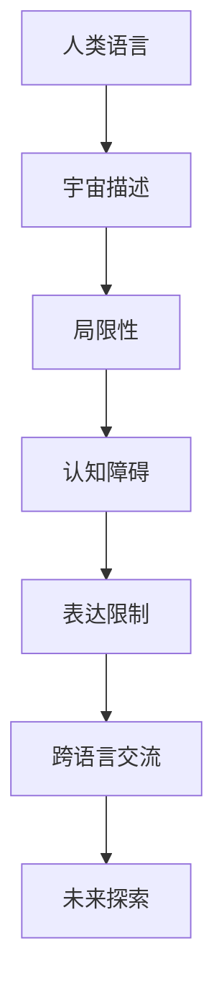
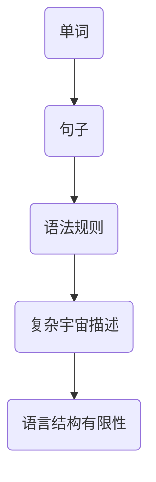

                 

### 文章标题

《人类语言对宇宙描述的局限性》

关键词：宇宙描述、人类语言、认知局限、跨语言交流、未来展望

摘要：本文探讨了人类语言在描述宇宙现象和探索未知领域时所面临的局限性。通过对语言结构和表达力的分析，揭示了人类认知在感知宇宙过程中的局限性，并探讨了跨语言与跨物种交流的可能性。本文还展望了未来可能突破语言障碍的科学技术方向，为人类对宇宙的进一步探索提供了新思路。

---

### 目录大纲设计《人类语言对宇宙描述的局限性》

**第一部分：引言与背景**

**第1章：人类语言与宇宙描述的局限性概述**

- **1.1 引言**
  - **1.1.1 人类语言的起源**
  - **1.1.2 语言与宇宙的关系**
  - **1.1.3 探索宇宙语言限度的意义**
- **1.2 宇宙描述的语言障碍**
  - **1.2.1 语言的局限性**
  - **1.2.2 宇宙信息的复杂性**

**第二部分：宇宙学基础**

**第2章：宇宙学的核心概念**

- **2.1 宇宙的组成**
  - **2.1.1 物质与能量**
  - **2.1.2 宇宙的膨胀**
- **2.2 宇宙的演化**
  - **2.2.1 大爆炸理论**
  - **2.2.2 黑洞与暗物质**

**第三部分：人类语言在宇宙描述中的局限性**

**第3章：人类语言的认知局限性**

- **3.1 语言的有限性**
  - **3.1.1 语言结构**
  - **3.1.2 语言的表达力**
- **3.2 人类认知的局限性**
  - **3.2.1 感知宇宙的局限**
  - **3.2.2 推理与想象的局限**

**第四部分：跨语言与跨物种交流的尝试**

**第4章：跨语言交流的探索**

- **4.1 国际辅助语言**
  - **4.1.1 世界语**
  - **4.1.2 国际符号语言**
- **4.2 跨物种交流的可能性**
  - **4.2.1 动物语言的解码**
  - **4.2.2 宇宙信号接收与解读**

**第五部分：未来展望与建议**

**第5章：未来宇宙描述语言的可能性**

- **5.1 人工智能与语言模型**
  - **5.1.1 语言生成模型**
  - **5.1.2 机器翻译与跨语言理解**
- **5.2 宇宙语言的科学探索**
  - **5.2.1 天文信号的解析**
  - **5.2.2 外星生命的语言研究**

**第六部分：案例研究**

**第6章：历史与当前的语言障碍案例分析**

- **6.1 人类对地球外生命的假设**
  - **6.1.1 火星生命的探索**
  - **6.1.2 外星文明信号的接收**
- **6.2 宇宙中的语言障碍案例**
  - **6.2.1 信号解读失败案例**
  - **6.2.2 成功的跨语言交流案例**

**第七部分：结论**

**第7章：人类语言在宇宙描述中的未来**

- **7.1 总结与展望**
  - **7.1.1 语言在宇宙中的局限性**
  - **7.1.2 跨越语言障碍的方向**
- **7.2 对未来的建议**
  - **7.2.1 科学研究的推动**
  - **7.2.2 国际合作的重要性**

**附录**

- **附录A：宇宙描述相关术语解释**
- **附录B：宇宙描述语言的未来研究趋势**

---

### Mermaid 流程图（第1章开头）

### 核心算法原理讲解（第3章开头）

## 3.1 语言的有限性

语言的有限性主要表现在语言结构的有限性和语言表达力的有限性上。语言结构有限性是指人类语言在语法、词汇和句法等方面的规则是有限的。虽然这些规则足够描述复杂的人类社会生活，但在描述宇宙这样极其复杂的领域时，其局限性变得尤为明显。

### 3.1.1 语言结构

语言结构的基本单位是单词，单词通过语法规则组合成句子。例如，英语的语法规则包括主谓宾结构、时态、语态等。然而，宇宙的复杂性远远超出了语言结构能够表达的范围。宇宙中存在多种不同的天体、星系和现象，这些无法通过有限的单词和语法规则进行精确描述。

### 3.1.2 语言表达力

语言表达力的有限性指的是语言在表达复杂概念和关系时的能力有限。人类语言通过词汇、语法和逻辑推理来构建意义，但这些工具在处理宇宙信息时也显得力不从心。例如，宇宙的膨胀、黑洞的演化等概念，需要精确的数学模型和物理公式来描述，而语言的表达能力难以达到这样的精确度。

### 数学模型和数学公式讲解与举例说明（第2章结尾）

## 2.2 宇宙的演化

宇宙的演化是一个复杂而神秘的过程，涉及多种物理现象和数学模型。以下是一些核心概念和相关的数学公式，用以解释宇宙的演化。

### 2.2.1 大爆炸理论

大爆炸理论是描述宇宙起源和演化的一种科学理论。根据该理论，宇宙起源于一个极热、极密集的状态，随后发生了快速膨胀。这一过程的数学描述可以用弗里德曼方程（Friedmann equation）表示：

$$
H^2 = \frac{8\pi G}{3}\rho - \frac{k}{a^2} + \frac{\Lambda}{3}
$$

其中，\(H\) 是哈勃参数，\(\rho\) 是宇宙密度，\(G\) 是万有引力常数，\(k\) 是宇宙曲率参数，\(\Lambda\) 是宇宙学常数，\(a\) 是宇宙尺度因子。

### 2.2.2 黑洞与暗物质

黑洞是宇宙中最神秘的天体之一，其质量极大，但体积极小。黑洞的引力极其强大，甚至连光也无法逃脱。描述黑洞性质的基本方程是史瓦西度规（Schwarzschild metric）：

$$
c^2d\tau^2 = c^2dt^2 - \left(1 - \frac{2GM}{c^2}\right)dr^2 - r^2d\Omega^2
$$

其中，\(c\) 是光速，\(\tau\) 是固有时间，\(M\) 是黑洞质量，\(G\) 是万有引力常数。

暗物质是宇宙中一种不可见的物质，其存在通过引力效应推测得出。描述暗物质的基本模型是冷暗物质模型（CDM），其中暗物质被视为一种具有非相对论性的粒子，其密度分布可以用德西特空间中的密度参数来描述：

$$
\rho_c = \rho_c^0 (a_0/a)^3
$$

其中，\(\rho_c\) 是当前宇宙中的暗物质密度，\(\rho_c^0\) 是宇宙学背景辐射时期的暗物质密度，\(a\) 是宇宙尺度因子。

### 2.2.3 宇宙的膨胀

宇宙的膨胀是宇宙学中一个核心概念，描述了宇宙中各天体之间的距离随时间增加的趋势。描述宇宙膨胀的基本方程是黎曼几何中的爱因斯坦场方程：

$$
G_{\mu\nu} + \Lambda g_{\mu\nu} = \frac{8\pi G}{c^4} T_{\mu\nu}
$$

其中，\(G_{\mu\nu}\) 是爱因斯坦张量，\(\Lambda\) 是宇宙学常数，\(g_{\mu\nu}\) 是度规张量，\(T_{\mu\nu}\) 是能量-动量张量，\(G\) 是万有引力常数，\(c\) 是光速。

通过这些数学模型和公式，科学家们可以更深入地理解宇宙的演化过程，揭示宇宙中的奥秘。然而，这些模型和公式也反映了人类语言的局限性，因为在描述如此复杂的宇宙现象时，语言的表达能力显得捉襟见肘。

---

### 文章关键词

- 宇宙描述
- 人类语言
- 认知局限
- 跨语言交流
- 未来展望

---

### 文章摘要

本文从人类语言的起源和结构出发，探讨了语言在描述宇宙现象时的局限性。通过分析宇宙学核心概念，如物质与能量、宇宙膨胀和演化过程，揭示了人类语言在表达复杂宇宙信息时的有限性。文章还探讨了人类认知的局限，以及跨语言与跨物种交流的可能性。在此基础上，展望了未来可能突破语言障碍的科学技术方向，为人类对宇宙的进一步探索提供了新思路。通过案例分析，本文总结了历史上和当前的语言障碍，并提出了对未来的建议，强调了科学研究推动和国际合作的重要性。

