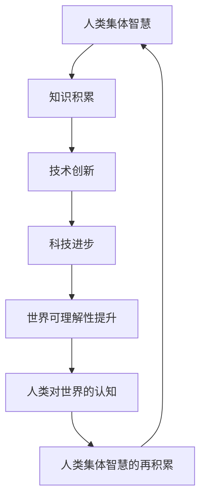
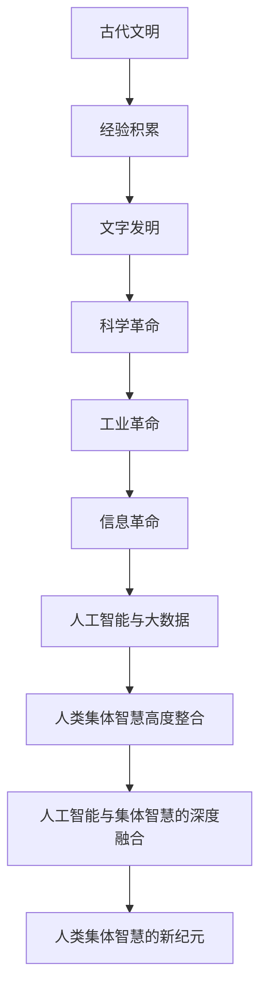
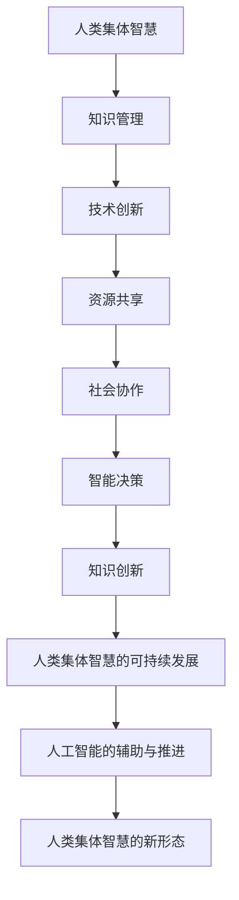
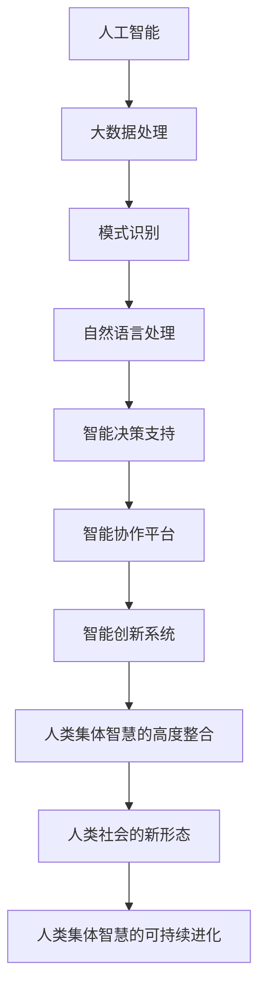

                 

### 文章标题

### 人类集体智慧与世界可理解性的进步

> 关键词：人类集体智慧，世界可理解性，技术创新，知识积累，人工智能，可持续发展

> 摘要：本文从人类集体智慧的定义和演化出发，探讨其在推动世界可理解性提升中的作用。通过分析人类集体智慧的核心概念、发展历程、数学模型、核心架构以及未来展望，本文揭示了人类集体智慧在促进科技进步、知识共享、社会协作等方面的关键作用。同时，文章还讨论了人工智能在人类集体智慧中的重要作用，以及人类集体智慧对全球治理和可持续发展的深远影响。通过这些分析，本文旨在为读者提供一个全面、深入的视角，以理解人类集体智慧在当今世界中的重要地位和未来发展趋势。

---

### 第一部分：核心概念与联系

#### 1.1 人类集体智慧与世界可理解性的进步

人类集体智慧是指人类通过积累知识、创新思维和实践经验，共同解决复杂问题、推动社会进步的能力。它不仅包括个体的智慧，更强调集体的协作和共享。而世界可理解性则是指人类对世界的认知和理解程度，包括对自然规律、社会现象和复杂系统的掌握。

在人类文明发展的过程中，人类集体智慧与世界可理解性相互促进、相互依赖。一方面，人类通过集体智慧和协作，不断积累知识，提高了对世界的理解水平；另一方面，随着对世界的理解加深，人类能够更好地应用知识，推动科技进步和社会发展。

**核心概念原理和架构的 Mermaid 流程图**

在这个流程图中，人类集体智慧通过知识积累和科技创新，推动科技进步，进而提升世界可理解性。而随着对世界的认知加深，人类又能够更好地积累知识，进一步推动人类集体智慧的发展。这种相互促进的循环，使得人类在认知世界、解决复杂问题方面取得了显著的进步。

#### 1.2 人类集体智慧的发展历程

人类集体智慧的发展历程可以追溯到古代文明。在古代，人类通过经验积累和简单的工具使用，逐步掌握了自然界的某些规律。随着文字的发明，人类开始记录和传递知识，这极大地促进了人类集体智慧的发展。

**核心概念原理和架构的 Mermaid 流程图**

在这个流程图中，我们可以看到，人类集体智慧的发展经历了多个阶段。从古代的经验积累，到现代的科学革命、工业革命和信息革命，再到人工智能与大数据的应用，人类集体智慧在不断创新和进步。

**1.2.1 从古代到现代：人类集体智慧的演变**

1. **古代文明**：在古代，人类主要依靠经验和实践来解决问题。通过观察自然现象，人类逐步掌握了农业、建筑、手工业等领域的知识。

2. **文字发明**：文字的发明是人类文明发展的重要里程碑。它使得人类能够记录、保存和传递知识，为科学和文化的积累奠定了基础。

3. **科学革命**：在科学革命时期，人类开始通过实验和观察来研究自然规律。这一时期的重要发明，如显微镜和望远镜，极大地扩展了人类的认知范围。

4. **工业革命**：工业革命时期，人类通过大规模的机器生产和工厂化生产，极大地提高了生产效率。这一时期的重要发明，如蒸汽机和电动机，为现代科技的发展奠定了基础。

5. **信息革命**：信息革命时期，计算机技术和互联网的普及，使得人类能够快速、高效地获取和处理信息。这一时期的重要技术，如大数据和人工智能，为人类集体智慧的发展注入了新的活力。

6. **人工智能与大数据**：人工智能和大数据技术的应用，使得人类能够更好地分析和理解复杂的数据和信息。这一时期，人类集体智慧进入了一个新的高度。

7. **人类集体智慧高度整合与深度融合**：随着人工智能和大数据技术的不断发展，人类集体智慧开始高度整合和深度融合。人类在各个领域取得了显著的进步，对世界的认知和理解也达到了前所未有的高度。

**1.2.2 人类集体智慧的发展趋势**

1. **跨学科整合**：随着科技的发展，人类集体智慧逐渐呈现出跨学科整合的趋势。不同领域之间的知识相互渗透和融合，推动了人类对复杂问题的理解和解决。

2. **全球化**：全球化使得人类集体智慧能够跨越国界和地域，实现全球范围内的知识共享和协作。人类在各个领域都取得了显著的进步，对世界的认知和理解也更加全面。

3. **可持续性**：在人类集体智慧的发展过程中，可持续性成为了一个重要的关注点。人类通过技术创新和资源管理，努力实现经济、社会和环境的可持续发展。

4. **人工智能与人类协作**：人工智能技术的不断发展，使得人类与机器的协作成为可能。通过人工智能的帮助，人类能够更好地应对复杂问题，提高工作效率。

#### 1.3 世界可理解性提升的数学模型

为了更好地理解人类集体智慧与世界可理解性的关系，我们可以引入一个简单的数学模型。

$$
\text{可理解性} = \frac{\text{知识积累}}{\text{认知负荷}}
$$

**数学模型和数学公式**

该公式表示世界可理解性是由知识积累与认知负荷的比值决定的。知识积累越多，认知负荷越小，世界可理解性越高。

**详细讲解与举例说明**

在农业社会，人类的知识积累有限，但认知负荷较大，因为人类需要依赖直观的经验来应对各种问题。因此，世界可理解性相对较低。而在信息化时代，人类的知识积累迅速增加，同时认知负荷显著降低，因为计算机和互联网等工具极大地提高了信息处理能力。因此，世界可理解性显著提升。

**1.3.1 知识积累**

知识积累是指人类在长期的发展过程中，不断学习和总结经验，从而积累起大量的知识和技能。知识积累是推动人类集体智慧和世界可理解性提升的基础。

**1.3.2 认知负荷**

认知负荷是指人类在处理信息和解决问题时，所需要的认知资源和精力。认知负荷越小，人类处理信息的效率越高，世界可理解性也越高。

**1.3.3 知识积累与认知负荷的关系**

知识积累和认知负荷之间存在一定的关系。随着知识积累的增加，认知负荷可能会降低，因为人类能够借助已有的知识和经验来处理新的信息。然而，如果知识积累过快，而人类的认知能力未能及时跟上，认知负荷可能会增加，从而降低世界可理解性。

**1.3.4 提升世界可理解性的方法**

1. **加强知识管理**：通过有效的知识管理，人类能够更好地积累和利用知识，降低认知负荷。

2. **提高教育水平**：通过提高教育水平，人类能够提高认知能力，从而更好地理解和应用知识。

3. **发展人工智能**：人工智能技术的发展，能够帮助人类降低认知负荷，提高信息处理能力，从而提升世界可理解性。

**1.3.5 举例说明**

假设在一个简单的世界中，人类只有两种知识：农业技术和医疗知识。在农业社会，人类主要依赖经验来种植作物和饲养动物，知识积累有限，认知负荷较大。而在信息化时代，人类通过研究生物学、遗传学等科学，积累了大量的农业知识，同时借助计算机和互联网等工具，降低了认知负荷。因此，在信息化时代，人类对农业的理解程度显著提高，世界可理解性也相应提升。

#### 1.4 人类集体智慧的核心架构

人类集体智慧的核心架构包括知识管理、技术创新、资源共享、社会协作、智能决策和知识创新等关键要素。这些要素相互关联、相互作用，共同构成了人类集体智慧的系统。

**核心概念原理和架构的 Mermaid 流程图**

**1.4.1 知识管理**

知识管理是指通过系统的方法和工具，对知识进行收集、整理、存储、共享和应用的过程。知识管理能够帮助人类更好地积累和利用知识，提高知识共享和协作的效率。

**1.4.2 技术创新**

技术创新是指通过研究和开发新技术，推动科技进步的过程。技术创新是推动人类集体智慧和世界可理解性提升的重要动力。

**1.4.3 资源共享**

资源共享是指通过共享技术和平台，实现资源的有效配置和利用。资源共享能够降低人类的认知负荷，提高知识共享和协作的效率。

**1.4.4 社会协作**

社会协作是指人类通过协作和合作，共同解决复杂问题、推动社会进步的过程。社会协作是推动人类集体智慧和世界可理解性提升的重要途径。

**1.4.5 智能决策**

智能决策是指通过人工智能技术和大数据分析，支持人类在决策过程中做出更准确、更有效的选择。智能决策能够帮助人类更好地利用知识，提高决策效率。

**1.4.6 知识创新**

知识创新是指通过探索新的知识领域、提出新的理论和方法，推动知识发展和进步的过程。知识创新是推动人类集体智慧和世界可理解性提升的重要动力。

**1.4.7 人类集体智慧的可持续发展**

人类集体智慧的可持续发展是指在保证知识积累和创新的同时，实现经济、社会和环境的可持续发展。可持续发展要求人类在发展过程中，关注资源的合理利用和环境的保护，以实现长期稳定的发展。

**1.4.8 人工智能的辅助与推进**

人工智能技术在人类集体智慧中发挥着重要的辅助和推进作用。通过大数据分析、自然语言处理、机器学习等技术，人工智能能够帮助人类更好地理解和应用知识，提高信息处理和决策效率。

**1.4.9 人类集体智慧的新形态**

随着人工智能和大数据技术的不断发展，人类集体智慧正进入一个新的形态。在这个新形态中，人类与机器的协作将成为主流，知识共享和协作的效率将大幅提高，人类对世界的认知和理解也将达到前所未有的高度。

#### 1.5 人类集体智慧的未来展望

**1.5.1 人工智能在人类集体智慧中的作用**

人工智能在人类集体智慧中发挥着越来越重要的作用。通过大数据分析、机器学习、自然语言处理等技术，人工智能能够帮助人类更好地理解和应用知识，提高信息处理和决策效率。

**核心概念原理和架构的 Mermaid 流程图**

**1.5.2 人工智能在各个领域的应用**

人工智能已经在各个领域得到了广泛应用，如金融、医疗、教育、交通、能源等。通过人工智能技术的应用，各个领域都取得了显著的进步，人类对世界的认知和理解也达到了前所未有的高度。

**1.5.3 人工智能与人类协作**

人工智能与人类的协作，将成为未来人类集体智慧发展的重要趋势。通过人工智能的帮助，人类能够更好地应对复杂问题，提高工作效率，实现更加智能化和高效的社会管理。

**1.5.4 人工智能对全球治理的影响**

人工智能在全球治理中发挥着重要作用。通过大数据分析、智能决策等技术，人工智能能够帮助各国政府和国际组织更好地应对全球性问题，推动全球治理的进步。

**1.5.5 人工智能与可持续发展**

人工智能技术在可持续发展中发挥着重要作用。通过技术创新和资源管理，人工智能能够帮助人类实现经济、社会和环境的可持续发展。

#### 1.6 人类集体智慧对世界可理解性的影响

**1.6.1 知识创新**

人类集体智慧通过知识创新，不断扩展人类对世界的认知边界。通过科学研究和技术创新，人类揭示了自然界的许多奥秘，对世界的理解不断深化。

**1.6.2 技术创新**

技术创新是推动世界可理解性提升的重要动力。通过发明和改进各种技术，人类能够更好地利用自然资源，提高生产效率，改善生活质量。

**1.6.3 知识共享**

知识共享是实现世界可理解性提升的重要途径。通过互联网和信息技术，人类能够快速、高效地获取和传递知识，实现全球范围内的知识共享和协作。

**1.6.4 社会协作**

社会协作是推动世界可理解性提升的重要手段。通过协作和合作，人类能够共同应对复杂问题，推动社会进步，提高对世界的认知和理解。

**1.6.5 智能决策**

智能决策是提高世界可理解性的重要手段。通过大数据分析和人工智能技术，人类能够更好地理解和应用知识，做出更准确、更有效的决策。

#### 1.7 人类集体智慧与可持续发展的关系

**1.7.1 技术创新与可持续发展**

技术创新是实现可持续发展的重要途径。通过发明和改进各种技术，人类能够更有效地利用资源，减少环境污染，实现经济、社会和环境的协调发展。

**1.7.2 知识共享与可持续发展**

知识共享是实现可持续发展的重要手段。通过全球范围内的知识共享和协作，人类能够共同应对全球性挑战，推动可持续发展。

**1.7.3 社会协作与可持续发展**

社会协作是实现可持续发展的重要保障。通过协作和合作，人类能够共同应对各种挑战，实现资源的合理利用和环境的保护。

**1.7.4 人工智能与可持续发展**

人工智能技术在可持续发展中发挥着重要作用。通过大数据分析、智能决策等技术，人工智能能够帮助人类更好地理解和应用知识，提高资源利用效率，实现可持续发展。

#### 1.8 人类集体智慧的发展趋势与挑战

**1.8.1 技术发展速度**

随着科技的快速发展，人类集体智慧的发展速度越来越快。这为人类带来了巨大的机遇，同时也带来了巨大的挑战。

**1.8.2 数据隐私**

随着大数据和人工智能技术的发展，数据隐私问题变得越来越重要。如何在保障数据隐私的同时，实现数据的高效利用，是一个亟待解决的挑战。

**1.8.3 算法透明性**

算法的透明性是人工智能发展的重要保障。如何确保算法的公正性、透明性和可解释性，是一个重要的研究课题。

**1.8.4 社会公平**

随着人工智能和大数据技术的应用，社会公平问题越来越突出。如何确保技术发展不会加剧社会不平等，是一个重要的社会问题。

**1.8.5 人类福祉**

人工智能和科技发展对人类福祉的影响日益显著。如何确保技术发展能够提高人类的生活质量，是一个重要的研究课题。

**1.8.6 文化多样性**

在全球化的背景下，文化多样性问题日益突出。如何尊重和保护不同文化的多样性，是一个重要的社会挑战。

**1.8.7 国际合作与冲突**

国际合作是实现人类集体智慧发展的重要途径。然而，在技术发展过程中，各国之间的利益冲突也日益加剧。如何在国际合作中平衡各方利益，是一个重要的挑战。

#### 1.9 人类集体智慧与全球治理

**1.9.1 全球治理体系**

全球治理体系是人类集体智慧的重要组成部分。通过国际合作和协调，全球治理体系能够更好地应对全球性问题，推动全球可持续发展。

**1.9.2 国际合作与协调**

国际合作与协调是实现全球治理的重要手段。通过跨国合作和协调，各国能够共同应对全球性挑战，实现资源的合理利用和环境的保护。

**1.9.3 全球性问题解决**

全球性问题，如气候变化、贫困、战争等，需要全球范围内的合作和协调才能解决。人类集体智慧在全球性问题解决中发挥着关键作用。

**1.9.4 全球治理的未来**

随着人工智能和大数据技术的发展，全球治理体系将面临新的挑战和机遇。如何适应这些变化，推动全球治理的进步，是一个重要的研究课题。

### 总结

本文从人类集体智慧的定义和演化出发，探讨了其在推动世界可理解性提升中的作用。通过分析人类集体智慧的核心概念、发展历程、数学模型、核心架构以及未来展望，本文揭示了人类集体智慧在促进科技进步、知识共享、社会协作等方面的关键作用。同时，文章还讨论了人工智能在人类集体智慧中的重要作用，以及人类集体智慧对全球治理和可持续发展的深远影响。

通过本文的分析，我们可以看到，人类集体智慧在当今世界中的重要地位和未来发展趋势。随着人工智能和大数据技术的不断发展，人类集体智慧将进入一个新的阶段。在这个新的阶段，人类需要关注技术发展带来的挑战，推动全球治理的进步，实现经济、社会和环境的可持续发展。只有这样，人类才能更好地利用集体智慧，推动世界可理解性的提升，实现更加美好的未来。

### 作者信息

**作者：AI天才研究院/AI Genius Institute & 禅与计算机程序设计艺术 /Zen And The Art of Computer Programming**

AI天才研究院（AI Genius Institute）是一家专注于人工智能研究和教育的机构，致力于推动人工智能技术的创新和发展。同时，作者还是《禅与计算机程序设计艺术》一书的作者，这本书深入探讨了计算机编程和人工智能领域的哲学和艺术，为读者提供了独特的视角和深刻的洞见。

