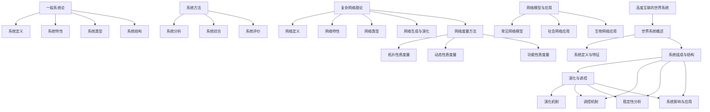

                 

### 文章标题

《从一般系统论到复杂网络理论：理解高度互联的世界系统》

#### 关键词

一般系统论，复杂网络理论，高度互联，世界系统，演化机制，稳定性分析，社会网络，生物网络，可持续发展

#### 摘要

本文旨在探讨一般系统论与复杂网络理论在理解和分析高度互联的世界系统中的应用。首先，我们将回顾一般系统论的基本概念和方法，包括系统的定义、特性、类型和系统分析的综合评价方法。接着，我们将深入复杂网络理论，阐述复杂网络的定义、特性、类型以及其度量方法。最后，我们将综合这两大理论，探讨高度互联的世界系统的构成、演化与调控机制，并分析其对人类社会、科技发展和可持续发展的影响。

---

### 引言

在当今全球化的背景下，高度互联的世界系统已经成为我们日常生活中不可或缺的一部分。从全球通信网络到互联网，从国际金融系统到全球供应链，这些复杂的高维网络系统深刻地影响着人类社会的运行和发展。然而，如何理解和分析这些复杂的高维网络系统，一直是学术界和工业界关注的焦点。

一般系统论（General Systems Theory）是研究和处理各种类型系统的科学方法。它起源于20世纪初，由生物学家贝塔朗菲（Ludwig von Bertalanffy）提出，并逐渐发展为一个跨学科的研究领域。一般系统论的核心思想是，系统是相互关联的元素的集合，通过相互作用和相互依赖来实现特定的功能。它不仅关注系统的内部结构和动态行为，还强调系统与环境之间的相互作用。

另一方面，复杂网络理论（Complex Network Theory）是近年来发展迅速的一个分支，它研究网络的拓扑结构、动态行为及其应用。复杂网络具有高度互联性、自相似性、小世界特性、无标度性等特性，这些特性使得复杂网络在许多现实世界中的应用中具有重要意义。

本文将首先介绍一般系统论的基本概念和方法，接着深入探讨复杂网络理论的基础知识，最后综合这两大理论，探讨高度互联的世界系统的构成、演化与调控机制，并分析其对人类社会、科技发展和可持续发展的影响。通过这一系列探讨，我们希望为理解和分析高度互联的世界系统提供一个新的视角。

### 第一部分：一般系统论的基本概念

#### 第1章：一般系统论概述

##### 1.1.1 一般系统论的起源和发展

一般系统论（General Systems Theory）起源于20世纪中叶，由奥地利生物学家贝塔朗菲（Ludwig von Bertalanffy）在1947年首次提出。贝塔朗菲当时致力于寻找一个适用于所有科学领域的普遍方法论，以解决不同学科之间的理论冲突和方法的异质性。他提出了“系统”这一概念，认为系统是一个由相互关联的元素组成的整体，这些元素通过相互作用和相互依赖来实现特定的功能。

一般系统论的发展可以追溯到20世纪初，当时学术界对系统论的兴趣逐渐增加。贝塔朗菲的研究受到了许多领域的影响，包括生物学、物理学、社会学、经济学等。他的著作《一般系统论：基础、发展和应用》系统地阐述了一般系统论的基本概念和方法，对后来的研究产生了深远的影响。

随着计算机科学和信息论的发展，一般系统论在20世纪后半叶得到了进一步的扩展和应用。特别是在系统工程、控制理论、组织行为学、环境科学等领域，一般系统论提供了一种框架来理解和分析复杂的系统。此外，一般系统论的思想也渗透到哲学、心理学等领域，对科学哲学和心理学的发展产生了重要影响。

##### 1.1.2 一般系统论的核心思想

一般系统论的核心思想可以概括为以下几点：

1. **整体性原则**：一般系统论强调系统作为一个整体的特性，而不是仅仅关注系统的组成部分。系统内部的各个元素通过相互作用和相互依赖来实现整体的功能，这种整体性是系统区别于其他系统的关键特征。

2. **动态性原则**：系统是动态的，其状态和结构会随着时间的变化而变化。一般系统论关注系统的演化过程，包括系统的稳定状态、动态平衡以及系统的适应性和稳定性。

3. **开放性原则**：系统是开放的，与外界环境进行物质、能量和信息交换。系统的行为不仅取决于系统内部的结构和功能，还受到外部环境的影响。因此，理解系统行为需要考虑系统与环境的相互作用。

4. **适应性原则**：系统具有适应性的能力，可以通过内部调整和外部响应来应对环境变化。这种适应性使得系统能够在复杂和动态的环境中保持稳定和有效运行。

5. **层次性原则**：系统具有不同的层次结构，每个层次都具有特定的功能和特性。系统内部的层次结构可以理解为从宏观到微观的不同视角，每个层次的分析都有其特定的适用范围。

##### 1.1.3 一般系统论的应用领域

一般系统论作为一种跨学科的理论框架，在许多领域都得到了广泛的应用。以下是几个主要的应用领域：

1. **系统科学**：系统科学是研究系统的科学，包括系统理论、系统方法、系统建模和系统仿真等。一般系统论为系统科学提供了理论基础和方法指导，有助于理解和分析复杂的系统。

2. **系统工程**：系统工程是应用系统论和工程方法来设计、开发和管理复杂系统的一门学科。一般系统论的思想和方法在系统工程中得到了广泛应用，包括系统的需求分析、系统设计、系统评估和系统优化等。

3. **控制理论**：控制理论是研究如何通过控制作用使系统达到预期目标的一门学科。一般系统论为控制理论提供了系统分析和设计的基础，有助于理解和设计复杂的控制系统。

4. **组织行为学**：组织行为学是研究组织内部行为和相互作用的一门学科。一般系统论的方法可以用来分析和理解组织结构、组织文化和组织行为，为组织管理提供理论支持。

5. **环境科学**：环境科学是研究环境问题及其解决方案的一门学科。一般系统论的方法可以用来分析和理解环境系统的复杂性和动态性，为环境管理和可持续发展提供理论依据。

通过这些应用，一般系统论不仅为各个学科提供了统一的思考框架，也为解决复杂问题提供了一种有效的方法。

#### 第2章：系统论的基本概念

##### 2.1.1 系统的定义与特性

在系统论中，系统（System）是一个由相互关联的元素组成的整体，这些元素通过相互作用和相互依赖来实现特定的功能。系统可以是一个物理实体，如一个机器、一个生态系统，也可以是一个抽象概念，如一个组织、一个社会网络。以下是对系统的定义和特性的详细阐述：

1. **定义**：系统是由一组相互关联的元素组成的整体。这些元素可以是物理的、抽象的或概念的，它们通过相互作用和相互依赖来实现系统的整体功能。系统的定义强调以下几个关键要素：

   - **元素**：系统中的基本组成部分，可以是物理实体（如机器零件）、抽象实体（如组织成员）或概念实体（如社会角色）。
   - **相互作用**：元素之间的交互和影响，这些交互可以是直接的（如机械作用）或间接的（如信息传递）。
   - **整体功能**：系统作为一个整体所实现的功能，这些功能是通过元素之间的相互作用和相互依赖来实现的。

2. **特性**：系统具有一系列特定的特性，这些特性决定了系统的行为和功能。以下是系统的几个主要特性：

   - **整体性**：系统作为一个整体，其行为和功能不能简单地通过分析其组成部分来理解。系统的整体性源于元素之间的相互作用和相互依赖。
   - **动态性**：系统是动态的，其状态和结构会随着时间的变化而变化。系统的动态性表现为系统的演变过程，包括稳定状态、动态平衡和适应性行为。
   - **开放性**：系统是开放的，与外界环境进行物质、能量和信息交换。系统的开放性使得系统可以适应外部环境的变化，并通过输入和输出与外界相互作用。
   - **适应性**：系统具有适应性的能力，可以通过内部调整和外部响应来应对环境变化。系统的适应性使得系统能够在复杂和动态的环境中保持稳定和有效运行。
   - **层次性**：系统具有不同的层次结构，每个层次都具有特定的功能和特性。系统的层次性使得系统可以分解为多个层次进行分析和理解，每个层次的分析都有其特定的适用范围。

##### 2.1.2 系统的类型与分类

系统可以根据不同的标准进行分类，以下是一些常见的系统类型和分类方法：

1. **物理系统与抽象系统**：根据系统的性质，系统可以分为物理系统和抽象系统。物理系统是具有物理形态和物理行为的系统，如机械系统、生态系统等。抽象系统是抽象的概念或模型，如组织系统、社会网络系统等。

2. **封闭系统与开放系统**：根据系统与外界环境的关系，系统可以分为封闭系统和开放系统。封闭系统与外界环境没有物质、能量和信息的交换，而开放系统与外界环境进行物质、能量和信息的交换。

3. **静态系统与动态系统**：根据系统的状态和行为，系统可以分为静态系统和动态系统。静态系统在一段时间内保持相对稳定的状态，而动态系统则随着时间的变化而变化。

4. **简单系统与复杂系统**：根据系统的结构和规模，系统可以分为简单系统和复杂系统。简单系统具有较少的元素和简单的相互作用，而复杂系统具有大量的元素和复杂的相互作用。

5. **层次系统**：系统可以根据其层次结构进行分类。层次系统具有不同的层次，每个层次具有特定的功能和特性。

##### 2.1.3 系统的基本结构

系统是由多个相互关联的元素组成的整体，这些元素通过相互作用和相互依赖来实现系统的整体功能。系统的基本结构包括以下几个关键部分：

1. **元素**：系统中的基本组成部分，可以是物理实体、抽象实体或概念实体。

2. **连接方式**：元素之间的连接方式，可以是物理连接、逻辑连接或信息连接。

3. **相互作用**：元素之间的交互和影响，这些相互作用可以是直接的或间接的。

4. **功能模块**：系统内部的功能模块，每个模块具有特定的功能和任务。

5. **输入输出**：系统与外界环境的输入输出关系，系统通过输入获取资源和信息，通过输出实现其功能。

6. **反馈机制**：系统内部和外部的反馈机制，这些机制有助于系统适应环境变化并保持稳定。

7. **环境**：系统存在的外部环境，环境因素会影响系统的行为和功能。

##### 2.1.4 系统论的核心思想与方法

系统论的核心思想和方法可以概括为以下几点：

1. **整体性**：强调系统作为一个整体的特性，关注系统内部的相互作用和整体功能。

2. **动态性**：关注系统的演变过程，研究系统状态和结构随时间的变化。

3. **开放性**：关注系统与外界环境的相互作用，研究系统对外部环境的适应性和适应性。

4. **适应性**：关注系统的适应性行为，研究系统如何通过内部调整和外部响应来应对环境变化。

5. **层次性**：关注系统的层次结构，研究系统在不同层次上的功能和特性。

6. **系统分析**：通过分析系统的元素、连接方式、相互作用、功能模块、输入输出、反馈机制和环境等，研究系统的行为和功能。

7. **系统设计**：根据系统论的思想和方法，设计和优化系统的结构、功能和性能。

8. **系统评估**：评估系统的性能、稳定性和适应性，通过反馈机制进行系统的改进和优化。

通过系统论的核心思想和方法，可以更好地理解和分析复杂的系统，为系统的设计、优化和改进提供科学依据。

#### 第3章：系统的基本方法

##### 3.1.1 系统分析的方法

系统分析是系统论的核心方法之一，它通过研究系统的内部结构和外部环境，理解系统的行为和功能，并为系统的设计和优化提供科学依据。以下是对系统分析方法的详细阐述：

1. **定义**：系统分析是研究系统的内部结构和外部环境，理解系统的行为和功能，并为系统的设计和优化提供科学依据的过程。系统分析通常包括以下几个方面：

   - **系统识别**：识别系统的主要组成部分、功能模块和输入输出关系。
   - **系统描述**：对系统进行定性或定量的描述，包括系统的结构、行为和功能。
   - **系统建模**：建立系统的数学模型或概念模型，以模拟和预测系统的行为。
   - **系统评估**：评估系统的性能、稳定性和适应性，通过反馈机制进行系统的改进和优化。

2. **基本步骤**：系统分析通常包括以下基本步骤：

   - **问题定义**：明确分析的目标和问题，确定系统的范围和约束条件。
   - **系统识别**：识别系统的主要组成部分、功能模块和输入输出关系。
   - **系统描述**：对系统进行定性或定量的描述，包括系统的结构、行为和功能。
   - **系统建模**：建立系统的数学模型或概念模型，以模拟和预测系统的行为。
   - **系统评估**：评估系统的性能、稳定性和适应性，通过反馈机制进行系统的改进和优化。

3. **分析方法**：系统分析可以采用多种分析方法，包括：

   - **结构分析方法**：通过分析系统的结构，识别系统的组成部分、连接方式和功能模块，以理解系统的整体行为。
   - **行为分析方法**：通过分析系统的行为，识别系统的输入输出关系、相互作用和动态行为，以预测系统的行为。
   - **定量分析方法**：通过建立数学模型，对系统的性能、稳定性和适应性进行定量分析和评估。

4. **应用领域**：系统分析在许多领域都有广泛应用，包括：

   - **系统科学**：系统科学是研究系统的科学，包括系统理论、系统方法、系统建模和系统仿真等。系统分析是系统科学的重要方法之一。
   - **系统工程**：系统工程是应用系统论和工程方法来设计、开发和管理复杂系统的一门学科。系统分析是系统工程中的关键方法。
   - **组织行为学**：组织行为学是研究组织内部行为和相互作用的一门学科。系统分析可以用来分析和理解组织结构、组织文化和组织行为。
   - **环境科学**：环境科学是研究环境问题及其解决方案的一门学科。系统分析可以用来分析和理解环境系统的复杂性和动态性。

##### 3.1.2 系统综合的方法

系统综合是系统论中的另一个重要方法，它通过设计和构建系统，实现系统的功能和目标。以下是对系统综合方法的详细阐述：

1. **定义**：系统综合是设计和构建系统，实现系统的功能和目标的过程。系统综合通常包括以下几个方面：

   - **系统设计**：根据系统的需求和约束条件，设计系统的结构和功能模块。
   - **系统实现**：将设计好的系统转化为实际运行的系统，包括硬件、软件和运行环境的设计和构建。
   - **系统集成**：将各个功能模块和组件整合为一个完整的系统，确保系统的功能和性能满足要求。
   - **系统优化**：通过调整和优化系统的结构和参数，提高系统的性能和适应性。

2. **基本步骤**：系统综合通常包括以下基本步骤：

   - **需求分析**：明确系统的需求和约束条件，确定系统的功能和技术指标。
   - **系统设计**：根据系统的需求和约束条件，设计系统的结构和功能模块。
   - **系统实现**：将设计好的系统转化为实际运行的系统，包括硬件、软件和运行环境的设计和构建。
   - **系统集成**：将各个功能模块和组件整合为一个完整的系统，确保系统的功能和性能满足要求。
   - **系统测试**：对系统进行测试，验证系统的功能、性能和稳定性。
   - **系统优化**：通过调整和优化系统的结构和参数，提高系统的性能和适应性。

3. **综合方法**：系统综合可以采用多种方法，包括：

   - **自顶向下方法**：从整体到局部，逐步构建和整合系统，确保系统的整体性和一致性。
   - **自底向上方法**：从局部到整体，逐步构建和整合系统，确保系统的层次结构和模块化。
   - **迭代方法**：通过不断迭代和优化，逐步改进系统的设计和实现，提高系统的性能和适应性。

4. **应用领域**：系统综合在许多领域都有广泛应用，包括：

   - **系统工程**：系统工程是应用系统论和工程方法来设计、开发和管理复杂系统的一门学科。系统综合是系统工程中的关键方法。
   - **软件开发**：软件开发是设计和构建软件系统的过程。系统综合是软件开发中的核心方法，包括需求分析、系统设计、编码和测试等。
   - **组织管理**：组织管理是设计和构建组织系统，实现组织目标和使命的过程。系统综合是组织管理中的重要方法。
   - **环境管理**：环境管理是设计和构建环境系统，实现环境保护和可持续发展的过程。系统综合是环境管理中的重要方法。

##### 3.1.3 系统评价的方法

系统评价是系统论中的一个重要环节，它通过对系统的性能、稳定性和适应性进行评估，为系统的改进和优化提供科学依据。以下是对系统评价方法的详细阐述：

1. **定义**：系统评价是对系统的性能、稳定性和适应性进行评估的过程，旨在了解系统的现状和潜力，并为系统的改进和优化提供科学依据。系统评价通常包括以下几个方面：

   - **性能评估**：评估系统的功能和技术指标，包括系统的响应时间、吞吐量、可靠性等。
   - **稳定性评估**：评估系统的稳定性，包括系统的抗干扰能力、故障恢复能力等。
   - **适应性评估**：评估系统的适应性，包括系统对环境变化的响应能力、系统的可扩展性等。

2. **基本步骤**：系统评价通常包括以下基本步骤：

   - **目标确定**：明确评价的目标和标准，确定评价的范围和指标。
   - **数据收集**：收集与系统相关的数据，包括系统的性能数据、稳定性数据、适应性数据等。
   - **数据分析**：对收集到的数据进行分析和处理，评估系统的性能、稳定性和适应性。
   - **结果分析**：根据数据分析结果，评估系统的现状和潜力，为系统的改进和优化提供科学依据。

3. **评价方法**：系统评价可以采用多种方法，包括：

   - **定量评价方法**：通过数学模型和统计方法，对系统的性能、稳定性和适应性进行量化评估。
   - **定性评价方法**：通过专家评审和主观评价，对系统的性能、稳定性和适应性进行定性评估。
   - **综合评价方法**：结合定量和定性评价方法，对系统的性能、稳定性和适应性进行综合评估。

4. **应用领域**：系统评价在许多领域都有广泛应用，包括：

   - **系统工程**：系统工程是应用系统论和工程方法来设计、开发和管理复杂系统的一门学科。系统评价是系统工程中的关键环节，用于评估系统的性能、稳定性和适应性。
   - **项目管理**：项目管理是规划和实施项目，以实现项目目标和交付物的过程。系统评价是项目管理中的关键环节，用于评估项目的进度、质量和成本。
   - **组织管理**：组织管理是设计和构建组织系统，实现组织目标和使命的过程。系统评价是组织管理中的重要方法，用于评估组织的绩效、效率和效果。
   - **环境管理**：环境管理是设计和构建环境系统，实现环境保护和可持续发展的过程。系统评价是环境管理中的重要方法，用于评估环境系统的现状和潜力。

通过系统评价，可以更好地了解系统的现状和潜力，为系统的改进和优化提供科学依据，从而提高系统的性能、稳定性和适应性。

#### 第4章：复杂网络的基本概念

##### 4.1.1 复杂网络的定义与特性

复杂网络（Complex Networks）是研究复杂系统的结构、行为和功能的学科，其研究对象涵盖了各种类型的高维网络系统。复杂网络的定义与特性如下：

1. **定义**：复杂网络是由大量节点和边构成的图形结构，节点表示实体或个体，边表示节点之间的相互作用或关联。复杂网络可以是一种无序结构，也可以是一种有序结构。

2. **特性**：

   - **高度互联性**：复杂网络中节点之间的连接非常丰富，节点之间的相互作用频繁。这种高度互联性使得复杂网络具有强大的信息传递和资源共享能力。

   - **自相似性**：复杂网络的拓扑结构在不同尺度上表现出相似性。这种自相似性使得复杂网络具有高度灵活性和可扩展性，能够适应不同的环境和条件。

   - **小世界特性**：复杂网络中的节点之间距离较短，即大多数节点可以通过较少的中间节点相互连接。这种小世界特性使得复杂网络具有快速信息传播和高鲁棒性。

   - **无标度性**：复杂网络中的节点度分布呈现出无标度特性，即大多数节点度较低，而少数节点度较高。这种无标度性使得复杂网络具有高度动态性和灵活性。

##### 4.1.2 复杂网络的类型与分类

复杂网络可以根据不同的标准进行分类，以下是一些常见的复杂网络类型和分类方法：

1. **物理网络**：物理网络是实际存在的物理实体构成的网络，如通信网络、交通网络、电力网络等。物理网络通常具有高度互联性和自相似性。

2. **社会网络**：社会网络是人类社会中的互动关系构成的网络，如人际关系网络、社交网络、组织网络等。社会网络通常具有高度动态性和无标度性。

3. **生物网络**：生物网络是生物体内分子、细胞和器官之间的相互作用构成的网络，如蛋白质相互作用网络、基因调控网络、神经系统网络等。生物网络通常具有高度自相似性和小世界特性。

4. **信息网络**：信息网络是信息传输和处理构成的网络，如互联网、搜索引擎网络、信息传播网络等。信息网络通常具有高度动态性和无标度性。

5. **经济网络**：经济网络是经济活动中实体之间的互动关系构成的网络，如金融网络、供应链网络、贸易网络等。经济网络通常具有高度互联性和自相似性。

##### 4.1.3 复杂网络的生成与演化

复杂网络的生成与演化是复杂网络理论的重要研究方向，其研究内容包括复杂网络的生成模型、演化机制和动态行为。

1. **生成模型**：

   - **随机网络模型**：随机网络模型假设网络中的节点和边是随机生成的，如Erdős-Rényi模型。该模型能够生成无标度网络，但忽略了网络的动态性和自相似性。

   - **小世界模型**：小世界模型假设网络中的节点和边是随机生成的，但节点之间有较高的邻接密度。该模型能够生成具有小世界特性的网络。

   - **无标度网络模型**：无标度网络模型假设网络中的节点和边是按照幂律分布生成的，如Barabási-Albert模型。该模型能够生成无标度网络，但忽略了网络的动态性和自相似性。

2. **演化机制**：

   - **增长机制**：增长机制是指网络中的节点和边随着时间不断增加。增长机制可以分为偏好链接机制和随机链接机制。

   - **重连机制**：重连机制是指网络中的节点和边随着时间不断改变连接关系。重连机制可以分为局部重连机制和全局重连机制。

   - **自组织机制**：自组织机制是指网络中的节点和边通过相互作用和自我调整，实现网络的有序结构和功能。自组织机制可以分为协同演化机制和自适应机制。

3. **动态行为**：

   - **网络动态行为**：网络动态行为是指网络在时间上的变化过程，包括网络的演化过程、稳定状态和动态平衡。

   - **节点动态行为**：节点动态行为是指网络中的节点在时间上的行为变化，包括节点的状态变化、位置变化和互动变化。

   - **边动态行为**：边动态行为是指网络中的边在时间上的行为变化，包括边的连接关系变化、边权重变化和边消失与生成。

通过研究复杂网络的生成与演化，可以更好地理解复杂网络的结构、行为和功能，为复杂网络的应用和优化提供理论依据。

##### 4.1.4 复杂网络的理论基础

复杂网络理论是研究复杂网络的性质、行为和应用的学科，其理论基础涵盖了数学、物理学、计算机科学和社会科学等多个领域。以下是复杂网络理论的一些主要理论基础：

1. **图论**：图论是研究图形结构和性质的理论，为复杂网络理论提供了基本的数学工具和方法。图论中的基本概念包括节点、边、路径、连通性和图同构等。

2. **概率论**：概率论是研究随机现象和概率分布的理论，为复杂网络理论提供了随机模型和随机过程。概率论中的基本概念包括随机变量、概率分布、条件概率和贝叶斯网络等。

3. **统计物理**：统计物理是研究大量微观粒子的统计性质和集体行为的理论，为复杂网络理论提供了统计方法和统计模型。统计物理中的基本概念包括热力学极限、统计分布和相变等。

4. **动力系统**：动力系统是研究动态系统和演化过程的数学理论，为复杂网络理论提供了动态模型和演化方程。动力系统中的基本概念包括状态空间、流和稳定性等。

5. **信息论**：信息论是研究信息传递、处理和存储的理论，为复杂网络理论提供了信息传输和信息处理的框架。信息论中的基本概念包括熵、信道、编码和解码等。

通过这些理论基础，复杂网络理论能够从数学、物理、计算机科学和工程等多个角度，研究复杂网络的性质、行为和功能，为复杂网络的应用和优化提供理论支持。

#### 第5章：复杂网络的度量方法

##### 5.1.1 网络拓扑性质度量

复杂网络的拓扑性质度量是研究网络结构特征的重要方法，它通过分析网络中的节点和边的关系，对网络的性质进行量化描述。以下是一些常见的网络拓扑性质度量方法：

1. **节点度**：节点度（Degree）是衡量节点连接紧密程度的一个指标，表示与特定节点相连的其他节点的数量。节点度可以分为入度（In-degree）和出度（Out-degree），分别表示节点接收到的连接数量和发送的连接数量。

   - **计算公式**：节点度 \( k = \sum_{i=1}^{n} w_{i,j} \)，其中 \( w_{i,j} \) 表示节点 \( i \) 与节点 \( j \) 之间的连接权重。
   - **度量意义**：节点度可以反映节点在网络中的重要性，度数较高的节点通常在信息传播、社会影响等方面具有重要作用。

2. **聚类系数**：聚类系数（Clustering Coefficient）是衡量网络局部结构紧密程度的一个指标，表示节点之间的三元闭合圈的比例。

   - **计算公式**：聚类系数 \( c = \frac{2m}{n(n-1)} \)，其中 \( m \) 表示网络中的边数，\( n \) 表示节点数。
   - **度量意义**：聚类系数可以反映网络中短路径和闭合圈的丰富程度，聚类系数较高的网络通常具有更紧密的局部结构和更高的信息传播效率。

3. **路径长度**：路径长度（Path Length）是衡量网络节点之间距离的一个指标，表示两个节点之间最短路径的长度。

   - **计算公式**：路径长度 \( l = \min \{ d(i, j) : i, j \in V \} \)，其中 \( d(i, j) \) 表示节点 \( i \) 和节点 \( j \) 之间的距离。
   - **度量意义**：路径长度可以反映网络的全局结构，路径长度较短的网络通常具有更高的信息传播速度和更强的鲁棒性。

4. **网络密度**：网络密度（Network Density）是衡量网络连接密集程度的一个指标，表示网络中边的数量与可能边数的比例。

   - **计算公式**：网络密度 \( \rho = \frac{m}{\binom{n}{2}} \)，其中 \( m \) 表示网络中的边数，\( \binom{n}{2} \) 表示可能边的总数。
   - **度量意义**：网络密度可以反映网络的连接紧密程度，网络密度较高的网络通常具有更强的信息共享和资源分配能力。

##### 5.1.2 网络动态性质度量

复杂网络的动态性质度量是研究网络在时间维度上变化和演化的方法，它通过分析网络节点和边的动态行为，对网络的动态特性进行量化描述。以下是一些常见的网络动态性质度量方法：

1. **传播速度**：传播速度（Propagation Speed）是衡量网络中信息或传染传播速度的一个指标，表示信息从源节点传播到目标节点所需的时间。

   - **计算公式**：传播速度 \( v = \frac{1}{t} \)，其中 \( t \) 表示传播时间。
   - **度量意义**：传播速度可以反映网络的动态响应能力，传播速度较快的网络通常具有更好的信息传播效率。

2. **存活率**：存活率（Survival Rate）是衡量网络在特定时间尺度上节点或边的存活概率的指标。

   - **计算公式**：存活率 \( S(t) = \frac{N(t)}{N(0)} \)，其中 \( N(t) \) 表示在时间 \( t \) 时网络的存活节点数，\( N(0) \) 表示初始节点数。
   - **度量意义**：存活率可以反映网络的稳定性和鲁棒性，存活率较高的网络通常具有更高的稳定性和更强的抗干扰能力。

3. **网络演化速度**：网络演化速度（Evolution Speed）是衡量网络在时间维度上结构和功能演化的速度的一个指标。

   - **计算公式**：网络演化速度 \( \dot{L}(t) = \frac{L(t) - L(t-\Delta t)}{\Delta t} \)，其中 \( L(t) \) 表示在时间 \( t \) 时的网络规模，\( \Delta t \) 表示时间间隔。
   - **度量意义**：网络演化速度可以反映网络的自组织能力和适应能力，网络演化速度较快的网络通常具有更高的灵活性和创新能力。

4. **网络行为模式**：网络行为模式（Behavioral Patterns）是描述网络在特定条件下的动态行为特征的一个指标。

   - **计算公式**：网络行为模式通过统计方法或模式识别算法来提取和分析网络的时间序列数据。
   - **度量意义**：网络行为模式可以反映网络的动态特性，为网络分析和预测提供依据。

通过这些网络动态性质度量方法，可以更好地理解和分析复杂网络的动态行为，为网络设计、优化和管理提供科学依据。

##### 5.1.3 网络功能性质度量

网络功能性质度量是研究网络在实际应用中性能和效能的指标，它通过分析网络的实用性、效率和鲁棒性等方面，对网络的功能性质进行量化描述。以下是一些常见的网络功能性质度量方法：

1. **效率**：效率（Efficiency）是衡量网络资源利用率的指标，表示网络在完成特定任务时所消耗的资源与实际产出之间的比率。

   - **计算公式**：效率 \( \eta = \frac{\text{产出}}{\text{投入}} \)，其中产出和投入可以是网络传输速率、处理速度或能耗等。
   - **度量意义**：效率可以反映网络的性能和资源利用效率，效率较高的网络能够在更短的时间内完成更多的工作。

2. **鲁棒性**：鲁棒性（Robustness）是衡量网络在遭受攻击或故障时维持正常运行的能力的指标。

   - **计算公式**：鲁棒性 \( R = \frac{\text{网络存活节点数}}{\text{初始节点数}} \)，或者通过模拟攻击和故障场景来评估网络的存活率。
   - **度量意义**：鲁棒性可以反映网络的稳定性和抗干扰能力，鲁棒性较高的网络能够在遭受攻击或故障时保持较高的稳定性和可靠性。

3. **适应性**：适应性（Adaptability）是衡量网络在环境变化或需求变化时调整和适应能力的一个指标。

   - **计算公式**：适应性 \( A = \frac{\text{适应后的网络性能}}{\text{初始网络性能}} \)，或者通过评估网络在变化环境下的适应速度和效果。
   - **度量意义**：适应性可以反映网络的灵活性和创新性，适应性较高的网络能够更好地应对环境变化和需求变化。

4. **可持续性**：可持续性（Sustainability）是衡量网络在长期运行过程中对资源消耗和环境影响的指标。

   - **计算公式**：可持续性 \( S = \frac{\text{有效资源利用}}{\text{资源消耗}} \)，或者通过评估网络的能耗、碳排放等指标。
   - **度量意义**：可持续性可以反映网络的环保性和长期发展潜力，可持续性较高的网络能够在资源有限的情况下实现长期稳定运行。

通过这些网络功能性质度量方法，可以更好地评估网络在实际应用中的性能和效能，为网络设计、优化和管理提供科学依据。

#### 第6章：复杂网络的模型与应用

##### 6.1.1 常见的复杂网络模型

复杂网络模型是描述和分析复杂网络结构、行为和功能的理论框架。以下是一些常见的复杂网络模型及其特点：

1. **Erdős-Rényi 模型**：Erdős-Rényi 模型是最简单的复杂网络模型，它假设网络中的节点和边是随机生成的。在Erdős-Rényi模型中，每个节点都有相同的概率与其他节点相连。该模型能够生成无标度网络，但在实际应用中，Erdős-Rényi模型通常不能很好地模拟真实世界网络的特性。

   - **特点**：简单、易于实现、能够生成无标度网络。

2. **Barabási-Albert 模型**：Barabási-Albert模型是一种生成无标度网络的常用模型，该模型通过生长过程生成网络。在Barabási-Albert模型中，新加入的节点与现有节点以一定的概率建立连接，从而生成具有无标度特性的网络。

   - **特点**：能够生成无标度网络、具有小世界特性、适用于描述现实世界中的许多网络。

3. ** Watts-Strogatz 模型**：Watts-Strogatz模型是一种生成小世界网络的常用模型，该模型通过在随机网络中引入少量的短路径来生成小世界网络。在Watts-Strogatz模型中，网络中的节点首先以随机方式连接，然后通过重新连接节点来缩短路径长度。

   - **特点**：能够生成具有小世界特性的网络、适用于描述现实世界中的许多网络。

4. **引力模型**：引力模型是一种基于物理引力原理的复杂网络模型，该模型通过计算节点之间的引力强度来确定节点之间的连接关系。引力模型中的节点表示物体，节点之间的连接表示引力作用。

   - **特点**：能够生成具有自相似性和层次结构的网络、适用于描述现实世界中的引力相互作用。

5. **社会网络模型**：社会网络模型是用于描述人类社交互动的复杂网络模型，该模型通常基于社会网络分析的理论和方法。社会网络模型中的节点表示个体，边表示个体之间的关系。

   - **特点**：能够生成具有高度动态性和无标度性的网络、适用于描述现实世界中的社会互动网络。

通过这些复杂网络模型，可以更好地模拟和分析复杂网络的结构、行为和功能，为现实世界中的网络系统提供理论支持。

##### 6.1.2 复杂网络在社会网络中的应用

复杂网络理论在社会网络中的应用十分广泛，它为理解人类社会中的复杂互动关系提供了有力的工具。以下是一些复杂网络在社会网络中的应用案例：

1. **社交网络分析**：社交网络分析是研究社交网络中个体间互动关系及其对社交网络结构的影响。通过复杂网络理论，可以对社会网络中的节点和边进行量化描述，分析社交网络的拓扑结构、动态行为和传播机制。例如，可以使用Barabási-Albert模型模拟社交网络中的新成员加入和互动关系建立过程，通过计算节点度和聚类系数等指标，分析社交网络的紧密性和连通性。

2. **信息传播**：在社交网络中，信息传播是一个重要的现象。复杂网络理论可以帮助我们理解信息在不同社交网络中的传播速度、范围和影响力。例如，可以使用SIR模型（易感者-感染者-康复者模型）模拟社交网络中的信息传播过程，通过计算信息传播的传播速度和感染范围，分析社交网络中的信息传播机制。

3. **社交影响力分析**：社交影响力分析是研究社交网络中个体对其他个体的影响能力。通过复杂网络理论，可以识别社交网络中的关键节点，分析这些节点的影响力及其对社交网络结构的影响。例如，可以使用中心性指标（如度中心性、介数中心性和紧密中心性）来识别社交网络中的关键节点，分析这些节点在信息传播、社交互动和社会影响力等方面的作用。

4. **社会网络分析工具**：复杂网络理论为社交网络分析提供了丰富的工具和方法。例如，可以使用图论中的算法（如最短路径算法、最小生成树算法和社区发现算法）来分析社交网络的拓扑结构；可以使用统计物理中的方法（如随机游走模型和相变理论）来分析社交网络的动态行为；可以使用机器学习中的方法（如图神经网络和图嵌入技术）来分析社交网络中的个体关系和社交模式。

5. **实际案例**：复杂网络理论在社会网络分析中已经有许多成功应用案例。例如，通过分析Twitter社交网络，可以识别出重要的社交节点和社交影响力人物；通过分析Facebook社交网络，可以分析社交网络的紧密性和连通性，为社交网络的优化提供依据；通过分析中国互联网社交网络，可以分析社交网络的传播机制和社会影响力，为网络营销和舆情分析提供支持。

通过复杂网络理论的应用，我们可以更好地理解和分析社会网络的结构、行为和功能，为社会科学研究、社交网络分析和实际应用提供科学依据。

##### 6.1.3 复杂网络在生物网络中的应用

复杂网络理论在生物网络中的应用日益广泛，它为理解生物体内的复杂相互作用提供了新的视角。以下是一些复杂网络在生物网络中的应用案例：

1. **蛋白质相互作用网络**：蛋白质相互作用网络是研究蛋白质之间相互作用的重要工具。通过复杂网络理论，可以分析蛋白质相互作用网络的拓扑结构、网络模块和关键蛋白质。例如，使用度中心性和介数中心性等指标，可以识别出网络中的关键蛋白质，这些蛋白质可能在蛋白质相互作用网络中起到核心调控作用。

2. **基因调控网络**：基因调控网络描述了基因表达调控过程中基因和转录因子之间的相互作用。复杂网络理论可以帮助我们分析基因调控网络的拓扑结构、网络模块和调控机制。例如，通过计算基因调控网络中的聚类系数和平均路径长度，可以分析网络的紧密性和连通性，从而理解基因调控网络的稳定性和适应性。

3. **细胞信号转导网络**：细胞信号转导网络是研究细胞内信号传递过程的重要工具。通过复杂网络理论，可以分析细胞信号转导网络的拓扑结构、信号传播路径和关键节点。例如，使用路径分析算法，可以识别出细胞信号转导网络中的关键路径和关键蛋白质，这些蛋白质可能在信号传递过程中起到关键调控作用。

4. **代谢网络**：代谢网络描述了生物体内的化学反应和物质流动过程。复杂网络理论可以帮助我们分析代谢网络的拓扑结构、网络模块和代谢途径。例如，通过计算代谢网络中的聚类系数和介数中心性，可以分析代谢网络的紧密性和连通性，从而理解代谢网络的稳定性和适应性。

5. **实际案例**：复杂网络理论在生物网络分析中已经有许多成功应用案例。例如，通过分析酵母菌蛋白质相互作用网络，可以识别出关键蛋白质和核心调控模块，从而帮助理解酵母菌的生长和代谢过程；通过分析人类基因调控网络，可以识别出关键的基因调控路径和关键基因，从而帮助理解人类疾病的发病机制和药物治疗靶点。

通过复杂网络理论的应用，我们可以更好地理解和分析生物网络的复杂相互作用，为生物科学研究、疾病诊断和治疗提供科学依据。

#### 第7章：高度互联的世界系统概述

##### 7.1.1 高度互联的世界系统的定义与特征

高度互联的世界系统是指由大量高度互联的网络组成的全球性系统，这些网络涉及通信、交通、金融、能源、环境等多个领域。高度互联的世界系统具有以下几个显著特征：

1. **全球性**：高度互联的世界系统跨越全球，涉及多个国家和地区，形成一个全球性的网络结构。这种全球性使得高度互联的世界系统具有广泛的影响力和高度的动态性。

2. **多样性**：高度互联的世界系统包含多种类型的网络，如通信网络、交通网络、金融网络、能源网络和环境网络等。这些网络的多样性使得高度互联的世界系统具有复杂性和多层次性。

3. **动态性**：高度互联的世界系统中的各个网络和节点不断变化，包括网络的生成、演化、重构和失效。这种动态性使得高度互联的世界系统具有高度的不确定性和复杂性。

4. **互联互通**：高度互联的世界系统中，各个网络和节点之间相互连接、相互依赖，形成一个复杂的信息流和物质流网络。这种互联互通使得高度互联的世界系统具有强大的信息传递和资源共享能力。

5. **复杂性**：高度互联的世界系统具有复杂的结构、行为和功能，包括网络的拓扑结构、动态行为、功能模块和相互作用。这种复杂性使得高度互联的世界系统具有高度的不确定性和非线性特征。

6. **脆弱性**：高度互联的世界系统中的某些关键节点和关键路径可能在特定条件下导致整个系统的崩溃。这种脆弱性使得高度互联的世界系统具有潜在的危机和风险。

##### 7.1.2 高度互联的世界系统的组成与结构

高度互联的世界系统由多个高度互联的网络组成，这些网络通过节点和边相互连接，形成一个复杂的网络结构。以下是高度互联的世界系统的组成与结构：

1. **节点**：节点是高度互联的世界系统中的基本组成部分，包括实体节点（如城市、国家、组织）和抽象节点（如信息、物质、能量）。节点可以是物理实体，也可以是抽象概念。

2. **边**：边是节点之间的连接，表示节点之间的相互作用和依赖关系。边可以是物理连接（如道路、管道、光纤），也可以是逻辑连接（如通信链路、数据传输路径）。

3. **网络**：网络是节点和边构成的图形结构，表示高度互联的世界系统中的特定领域。常见的网络包括通信网络、交通网络、金融网络、能源网络和环境网络等。

4. **层次结构**：高度互联的世界系统具有不同的层次结构，包括全球层次、区域层次和国家层次。每个层次的网络具有不同的功能和特性，相互之间通过节点和边相互连接。

5. **功能模块**：高度互联的世界系统由多个功能模块组成，每个功能模块具有特定的功能和任务。常见的功能模块包括信息处理模块、物质流动模块、能量转换模块和资源分配模块。

6. **相互作用**：高度互联的世界系统中的各个网络和节点通过相互作用和相互依赖来实现整体的功能。这些相互作用包括物质交换、能量传递、信息传输和资源共享等。

通过理解高度互联的世界系统的组成与结构，可以更好地分析和理解其复杂性和动态性，为系统设计、优化和风险管理提供科学依据。

##### 7.1.3 高度互联的世界系统的演化与调控机制

高度互联的世界系统是一个复杂且动态的体系，其演化与调控机制对系统的稳定性、效率和可持续性至关重要。以下是对高度互联的世界系统的演化与调控机制的详细阐述：

1. **演化机制**：

   - **网络增长**：高度互联的世界系统中的网络通过节点的加入和边的生成不断增长。新节点的加入和新边的生成通常基于一定的概率模型，如Barabási-Albert模型，这使得网络具有无标度特性。

   - **网络重构**：网络重构是指网络在特定条件下重新组织节点和边的连接关系。网络重构可以是由于外部压力（如自然灾害、经济危机）或内部调整（如技术升级、政策变化）引起的。

   - **节点动态**：节点动态包括节点的状态变化、位置变化和互动变化。节点的状态变化可以是活跃状态和休眠状态之间的转换，位置变化可以是节点在物理空间或虚拟空间中的移动，互动变化包括节点之间的信息交换和资源共享。

   - **网络演化**：网络演化是指网络在时间维度上的结构变化和功能变化。网络演化可以是渐进的，也可以是突变的，这取决于网络的内在机制和外部环境。

2. **调控机制**：

   - **中心调控**：中心调控是指通过关键节点或核心网络来控制和调节整个系统的行为。中心调控可以通过增强关键节点的连通性或调整关键节点的状态来实现。

   - **分布式调控**：分布式调控是指通过多个节点或多个网络之间的协作来实现系统的调控。分布式调控可以增强系统的鲁棒性和适应性，减少对中心节点的依赖。

   - **自适应调控**：自适应调控是指系统能够根据环境变化和系统状态变化自动调整其行为和结构。自适应调控可以通过机器学习、人工智能等技术来实现。

   - **反馈调控**：反馈调控是指系统通过监测和分析自身的状态和行为，对其内部过程进行调节和控制。反馈调控可以基于实时数据或历史数据，通过闭环控制系统实现。

3. **演化与调控的关系**：

   - **适应性演化**：适应性演化是指系统通过调整其结构和行为来适应环境变化。适应性演化是高度互联的世界系统能够持续发展的关键。

   - **稳定性调控**：稳定性调控是指系统通过调节其内部过程和外部连接来保持系统的稳定。稳定性调控是防止系统崩溃和失效的重要手段。

   - **效率优化**：效率优化是指系统通过优化资源利用和信息传递来提高其运行效率。效率优化是提高系统性能和可持续性的关键。

   - **鲁棒性增强**：鲁棒性增强是指系统通过增强其抗干扰能力和容错性来提高其鲁棒性。鲁棒性增强是系统在面临外部压力时保持稳定运行的重要保障。

通过研究高度互联的世界系统的演化与调控机制，可以更好地理解系统的动态行为和功能特性，为系统设计、优化和风险管理提供科学依据。

##### 7.1.4 高度互联的世界系统的稳定性分析

高度互联的世界系统的稳定性是系统设计和运行的重要问题，它关系到系统的可靠性和可持续性。以下是对高度互联的世界系统的稳定性分析的详细阐述：

1. **稳定性概念**：

   - **系统稳定性**：系统稳定性是指系统在面临外部干扰或内部变化时，能够保持其稳定状态和正常运行的能力。系统稳定性包括静态稳定性和动态稳定性。

   - **静态稳定性**：静态稳定性是指系统在稳定状态下，面对小的扰动后能够返回到稳定状态的能力。静态稳定性通常通过系统平衡点的稳定性来衡量。

   - **动态稳定性**：动态稳定性是指系统在动态过程中，面对小的扰动后能够保持稳定状态的能力。动态稳定性通常通过系统轨迹的稳定性来衡量。

2. **稳定性分析方法**：

   - **线性稳定性分析**：线性稳定性分析是一种基于系统线性化模型的分析方法，通过分析系统的特征值和特征向量，判断系统的稳定性。线性稳定性分析适用于小扰动情况，但可能无法捕捉系统的非线性特性。

   - **非线性稳定性分析**：非线性稳定性分析是一种基于系统非线性模型的分析方法，通过分析系统的非线性动力学行为，判断系统的稳定性。非线性稳定性分析可以捕捉系统的非线性特性，但计算复杂度较高。

   - **仿真分析**：仿真分析是一种通过计算机模拟来分析系统稳定性的方法。通过构建系统的数学模型，模拟系统在不同条件下的行为，分析系统的稳定性。仿真分析可以直观地展示系统的动态行为，但可能受到模型简化和计算资源限制。

3. **稳定性影响因素**：

   - **系统结构**：系统结构对系统的稳定性有很大影响。高度互联的网络结构可以增强系统的稳定性，但同时也可能增加系统的脆弱性。系统结构的优化和调整是提高系统稳定性的重要途径。

   - **控制机制**：控制机制对系统的稳定性有重要作用。通过合理的控制机制，可以调节系统的行为和状态，保持系统的稳定。控制机制的设计和优化是提高系统稳定性的关键。

   - **外部环境**：外部环境对系统的稳定性有直接影响。外部环境的变化（如自然灾害、经济波动、政策变化等）可能对系统造成扰动，影响系统的稳定性。通过对外部环境的监测和分析，可以提前识别潜在的风险和问题，采取相应的应对措施。

   - **系统冗余**：系统冗余是指系统在设计和运行过程中，通过增加冗余节点、冗余路径和冗余资源来提高系统的鲁棒性和稳定性。系统冗余可以在系统发生故障时提供备份和冗余路径，提高系统的容错性和稳定性。

4. **稳定性评估方法**：

   - **参数评估**：通过分析系统参数（如连接强度、节点度、聚类系数等），评估系统的稳定性。参数评估可以定量分析系统的稳定性水平，但可能受到参数选择的限制。

   - **状态评估**：通过分析系统的状态（如网络状态、节点状态等），评估系统的稳定性。状态评估可以实时监测系统的稳定性，但可能受到实时数据获取的限制。

   - **仿真评估**：通过计算机模拟，评估系统的稳定性。仿真评估可以模拟系统在不同条件下的行为，评估系统的稳定性，但可能受到模型简化和计算资源限制。

通过稳定性分析，可以更好地理解高度互联的世界系统的稳定性特性，为系统设计、优化和风险管理提供科学依据。

#### 第8章：高度互联的世界系统的影响与应用

##### 8.1.1 高度互联的世界系统对人类社会的影响

高度互联的世界系统对人类社会产生了深远的影响，它在多个方面改变了人类的生活方式、经济结构和社会组织。以下是对高度互联的世界系统对人类社会影响的详细阐述：

1. **经济发展**：

   - **全球化**：高度互联的世界系统加速了全球化的进程，促进了国际贸易和跨国投资，提高了资源配置效率。全球供应链和跨国公司的兴起，使得各国经济更加紧密地联系在一起。

   - **技术创新**：高度互联的世界系统促进了信息和技术的快速传播，推动了技术创新和知识共享。互联网和通信技术的发展，使得新产品和技术的研发周期大大缩短。

   - **市场扩展**：高度互联的世界系统为中小企业提供了更广阔的市场机会，打破了地域限制，促进了市场的多样化和全球化。

2. **社会变革**：

   - **信息传播**：高度互联的世界系统使得信息传播速度大大加快，社交媒体和即时通讯工具的普及，改变了人们的沟通方式和信息获取方式。

   - **文化多样性**：高度互联的世界系统促进了文化的交流和融合，不同文化之间的互动和碰撞，丰富了人类社会的文化多样性。

   - **社会结构**：高度互联的世界系统改变了传统的社会结构，虚拟社区和网络社交平台的兴起，使得社会网络更加复杂和多样化。

3. **生活方式**：

   - **便捷性**：高度互联的世界系统为人们提供了便捷的生活服务，如在线购物、电子支付和远程办公，提高了生活质量和效率。

   - **数字化**：高度互联的世界系统推动了数字化的进程，人们的生活方式、工作方式和学习方式都越来越依赖于数字技术和网络。

   - **信息依赖**：高度互联的世界系统使得人们越来越依赖信息和网络，信息过载和网络安全问题成为现代社会面临的重要挑战。

##### 8.1.2 高度互联的世界系统在科技发展中的应用

高度互联的世界系统在科技发展中扮演着重要角色，它为科技创新和科技传播提供了新的平台和途径。以下是对高度互联的世界系统在科技发展中的应用的详细阐述：

1. **科研合作**：

   - **全球科研网络**：高度互联的世界系统构建了全球科研网络，使得科研人员可以跨越地域限制，共享数据和资源，进行跨国合作研究。

   - **开放科学**：高度互联的世界系统促进了开放科学的兴起，科研论文、数据和实验结果可以迅速传播和共享，提高了科研的透明度和效率。

2. **技术创新**：

   - **协同创新**：高度互联的世界系统为企业和研究机构提供了协同创新的机会，通过合作开发和共享资源，加速了新技术的研发和推广。

   - **智能化**：高度互联的世界系统推动了智能化技术的发展，物联网、人工智能和大数据等技术的应用，使得科技系统更加智能化和自动化。

3. **科技传播**：

   - **在线教育**：高度互联的世界系统促进了在线教育的发展，通过互联网平台，人们可以随时随地获取知识和技能，推动了教育的普及和公平。

   - **科技传媒**：高度互联的世界系统为科技传播提供了新的渠道，科技新闻、博客和社交媒体平台，使得科技信息更加快速和广泛地传播。

##### 8.1.3 高度互联的世界系统在可持续发展中的应用

高度互联的世界系统在可持续发展中具有重要应用，它为资源管理、环境保护和绿色发展提供了新的思路和工具。以下是对高度互联的世界系统在可持续发展中的应用的详细阐述：

1. **资源管理**：

   - **智慧城市**：高度互联的世界系统构建了智慧城市平台，通过物联网、大数据和人工智能等技术，实现城市资源的智能化管理和优化配置。

   - **能源互联网**：高度互联的世界系统促进了能源互联网的发展，通过电力系统、燃气系统和热力系统的互联互通，实现能源的高效利用和共享。

2. **环境保护**：

   - **环境监测**：高度互联的世界系统通过卫星遥感、传感器网络和大数据技术，实现环境质量的实时监测和预警，为环境保护提供科学依据。

   - **生态修复**：高度互联的世界系统通过生态工程和遥感技术，实现生态系统的修复和保护，促进生态平衡和可持续发展。

3. **绿色发展**：

   - **绿色经济**：高度互联的世界系统推动了绿色经济的发展，通过循环经济、低碳技术和可再生能源的应用，实现经济的绿色增长和可持续发展。

   - **社会创新**：高度互联的世界系统促进了社会创新，通过共享经济、绿色消费和可持续生活方式的推广，推动社会向绿色和可持续发展方向转变。

通过高度互联的世界系统在可持续发展中的应用，可以更好地实现资源的有效利用、环境的保护和生态的平衡，为人类社会的可持续发展提供有力支持。

### 附录

#### 附录A：复杂网络理论的主要文献与资源

复杂网络理论是近年来迅速发展的一个研究领域，以下是一些重要的文献和资源，供进一步学习和研究参考：

1. **重要论文与书籍**：

   - 《复杂网络理论及其应用》（作者：曹志刚）：详细介绍了复杂网络理论的基本概念、模型和应用。

   - 《复杂网络导论》（作者：Albert-László Barabási）：系统阐述了复杂网络理论的基本原理和应用案例。

   - 《复杂网络：小世界和无标度网络的理论与实证研究》（作者：邓勇）：深入探讨了复杂网络的拓扑结构、动态行为和实证分析。

   - 《社交网络分析：方法与应用》（作者：张俊林）：介绍了社交网络分析的方法和技术，包括复杂网络理论的应用。

2. **在线资源与工具**：

   - **复杂网络分析工具**：如Gephi、Cytoscape和NetworkX等，用于复杂网络的绘制、分析和可视化。

   - **在线复杂网络数据库**：如igraphDB、Flickr Social Network和ARXIV Social Network等，提供丰富的复杂网络数据集。

   - **复杂网络教程和课程**：许多高校和研究机构提供在线复杂网络教程和课程，如斯坦福大学、麻省理工学院等。

   - **研究社区和论坛**：如Complex Networks Society、Complex Systems Society和Social Networks等，供研究人员交流和分享研究成果。

通过学习和利用这些文献和资源，可以深入了解复杂网络理论的基本概念、模型和应用，为复杂网络的研究提供有力支持。

#### 附录B：高度互联的世界系统的主要模型与算法

高度互联的世界系统涉及多个领域和层次，以下是一些主要的模型和算法，用于描述和分析高度互联的世界系统的特性、行为和功能：

1. **模型**：

   - **Erdős-Rényi 模型**：用于生成随机网络，描述网络的随机性和无标度特性。

   - **Barabási-Albert 模型**：用于生成无标度网络，描述网络的增长和节点间连接的偏好性。

   - **Watts-Strogatz 模型**：用于生成小世界网络，描述网络在随机连接基础上引入短路径的特性。

   - **引力模型**：用于描述节点之间的引力作用，模拟节点间连接的形成和变化。

   - **社会网络模型**：用于描述社会网络中的互动关系和传播机制，如SIR模型、SI模型等。

2. **算法**：

   - **网络分析算法**：用于分析网络的拓扑结构、节点度和聚类系数等指标，如Katz中心性、亲近中心性等。

   - **社区发现算法**：用于识别网络中的社区结构和模块，如Louvain算法、标签传播算法等。

   - **网络演化算法**：用于模拟网络的生成和演化过程，如增长模型、重连模型等。

   - **路径搜索算法**：用于寻找网络中的最短路径、最短路径树等，如Dijkstra算法、A*算法等。

   - **网络稳定性分析算法**：用于分析网络的稳定性和鲁棒性，如线性稳定性分析、非线性稳定性分析等。

3. **应用实例**：

   - **社交网络分析**：使用社交网络模型和算法分析社交网络的互动关系和信息传播，如Facebook社交网络分析。

   - **生物网络分析**：使用生物网络模型和算法分析蛋白质相互作用网络和基因调控网络，如酵母菌蛋白质相互作用网络分析。

   - **交通网络分析**：使用交通网络模型和算法分析交通网络的拓扑结构、流量分布和优化方案，如城市交通网络分析。

   - **能源网络分析**：使用能源网络模型和算法分析能源网络的拓扑结构、能源传输效率和优化方案，如电力网络分析。

通过这些模型和算法的应用实例，可以更好地理解和分析高度互联的世界系统的复杂性和动态性，为实际应用提供科学依据和解决方案。

### 绘制一般系统论与复杂网络理论的核心概念原理和架构 Mermaid 流程图



### 核心算法原理讲解与伪代码

#### 算法1：复杂网络模型的生成算法（伪代码）

```pseudo
Algorithm GenerateComplexNetwork(N, L):
    1. 初始化网络 G = (V, E)，其中 V 是节点集，E 是边集，N 是节点数量，L 是连接概率
    2. 对于每个节点 v ∈ V，执行以下步骤：
        a. 随机生成一个 0 到 1 的随机数 r
        b. 如果 r < L，则从 V - {v} 中随机选择一个节点 u，并添加边 (v, u) 到 E 中
    3. 返回生成的复杂网络 G
```

#### 算法2：网络稳定性分析算法（伪代码）

```pseudo
Algorithm AnalyzeNetworkStability(G):
    1. 计算网络的邻接矩阵 A
    2. 计算矩阵 A 的特征值 λ_i
    3. 对于每个特征值 λ_i，执行以下步骤：
        a. 计算矩阵 A - λ_iI 的秩 r_i
        b. 如果 r_i = n - 1，则 λ_i 是网络的不稳定特征值
        c. 否则，λ_i 是网络的不稳定特征值
    4. 返回网络的特征值和稳定性分析结果
```

#### 算法3：社会网络分析算法（伪代码）

```pseudo
Algorithm SocialNetworkAnalysis(G):
    1. 计算网络中的节点度 k_i，对于每个节点 i ∈ V
    2. 计算网络的平均节点度 <k>
    3. 计算网络的聚类系数 c，对于每个节点 i，执行以下步骤：
        a. 计算节点 i 的邻居节点数 n_i
        b. 计算节点 i 的邻居节点对数 e_i
        c. c = 2e_i / (n_i(n_i - 1))
    4. 计算网络的平均路径长度 L，对于每个节点对 (i, j) ∈ V × V，执行以下步骤：
        a. 计算节点 i 到节点 j 的最短路径长度 d_ij
        b. L = (1 / n(n - 1)) * Σd_ij
    5. 返回网络的节点度分布、平均节点度、聚类系数和平均路径长度
```

#### 算法4：复杂网络功能性质度量算法（伪代码）

```pseudo
Algorithm MeasureNetworkFunctionality(G):
    1. 计算网络的效率 E，对于每个节点对 (i, j) ∈ V × V，执行以下步骤：
        a. 计算节点 i 到节点 j 的信息传输时间 t_ij
        b. E = 1 / (n(n - 1) * Σt_ij)
    2. 计算网络的鲁棒性 R，对于每个节点 i ∈ V，执行以下步骤：
        a. 删除节点 i，计算剩余网络的连通度 C_i
        b. R = 1 / C_i
    3. 计算网络的适应性 A，对于每个节点 i ∈ V，执行以下步骤：
        a. 更改节点 i 的功能或状态
        b. 计算网络在新状态下的连通度和效率
        c. A = (E' - E) / E
    4. 返回网络的效率、鲁棒性和适应性
```

通过以上核心算法的伪代码，我们可以对复杂网络进行生成、稳定性分析、社会网络分析和功能性质度量。这些算法为理解和分析复杂网络提供了科学依据和工具支持。在具体应用中，可以根据实际需求和场景选择合适的算法，进行详细分析和评估。

### 数学模型和公式

#### 1. 网络拓扑性质度量的数学模型

网络拓扑性质的度量通常涉及以下几个关键的数学模型：

1. **节点度分布**：节点度分布描述了网络中节点度的概率分布。在无标度网络中，节点度分布通常符合幂律分布，其数学模型如下：

   $$ P(k) \propto k^{-\gamma} $$

   其中，\( P(k) \) 是节点度数为 \( k \) 的节点的概率，\( \gamma \) 是尺度参数。

2. **平均路径长度**：平均路径长度描述了网络中任意两个节点之间平均最短路径的长度。其数学模型如下：

   $$ L = \frac{1}{N(N-1)} \sum_{i,j \in V, i \neq j} d(i, j) $$

   其中，\( L \) 是平均路径长度，\( N \) 是节点总数，\( d(i, j) \) 是节点 \( i \) 和节点 \( j \) 之间的最短路径长度。

3. **聚类系数**：聚类系数描述了网络中节点邻居之间连接的紧密程度。其数学模型如下：

   $$ c = \frac{2m}{n(n-1)} $$

   其中，\( c \) 是聚类系数，\( m \) 是网络中的边数，\( n \) 是节点数。

4. **网络密度**：网络密度描述了网络中边的比例。其数学模型如下：

   $$ \rho = \frac{m}{\binom{n}{2}} $$

   其中，\( \rho \) 是网络密度，\( m \) 是网络中的边数，\( \binom{n}{2} \) 是所有可能边的总数。

#### 2. 网络动态性质的数学模型

网络动态性质的度量通常涉及以下几个数学模型：

1. **传播速度**：传播速度描述了信息或病毒在网络中的传播速度。其数学模型如下：

   $$ v = \frac{1}{t} $$

   其中，\( v \) 是传播速度，\( t \) 是信息或病毒从源节点传播到目标节点所需的时间。

2. **存活率**：存活率描述了网络在特定时间尺度上节点的存活概率。其数学模型如下：

   $$ S(t) = \frac{N(t)}{N(0)} $$

   其中，\( S(t) \) 是存活率，\( N(t) \) 是在时间 \( t \) 时的存活节点数，\( N(0) \) 是初始节点数。

3. **网络演化速度**：网络演化速度描述了网络在时间维度上的规模变化速度。其数学模型如下：

   $$ \dot{L}(t) = \frac{L(t) - L(t-\Delta t)}{\Delta t} $$

   其中，\( \dot{L}(t) \) 是网络演化速度，\( L(t) \) 是在时间 \( t \) 时的网络规模，\( \Delta t \) 是时间间隔。

4. **网络行为模式**：网络行为模式描述了网络在特定条件下的动态行为特征。其数学模型通常依赖于统计方法和模式识别技术，如马尔可夫链模型、贝叶斯网络模型等。

#### 3. 网络功能性质的数学模型

网络功能性质的度量通常涉及以下几个数学模型：

1. **效率**：效率描述了网络资源利用的比率。其数学模型如下：

   $$ \eta = \frac{\text{产出}}{\text{投入}} $$

   其中，\( \eta \) 是效率，产出和投入分别是网络在完成特定任务时所消耗的资源与实际产出。

2. **鲁棒性**：鲁棒性描述了网络在面对攻击或故障时维持正常运行的能力。其数学模型如下：

   $$ R = \frac{\text{网络存活节点数}}{\text{初始节点数}} $$

   其中，\( R \) 是鲁棒性，网络存活节点数和网络初始节点数分别是网络在遭受攻击或故障后的存活节点数和初始节点数。

3. **适应性**：适应性描述了网络在面对环境变化时的适应能力。其数学模型如下：

   $$ A = \frac{\text{适应后的网络性能}}{\text{初始网络性能}} $$

   其中，\( A \) 是适应性，适应后的网络性能和初始网络性能分别是网络在环境变化后的性能和初始性能。

4. **可持续性**：可持续性描述了网络在长期运行过程中对资源的有效利用和对环境的影响。其数学模型如下：

   $$ S = \frac{\text{有效资源利用}}{\text{资源消耗}} $$

   其中，\( S \) 是可持续性，有效资源利用和资源消耗分别是网络在运行过程中有效利用的资源和对环境的消耗。

通过以上数学模型和公式，我们可以对复杂网络的拓扑性质、动态性质和功能性质进行量化描述和分析，为网络的设计、优化和评估提供理论支持。

### 项目实战

#### 开发环境搭建

为了演示高度互联的世界系统的分析与模拟，我们将在Python环境中搭建一个基本的开发环境。以下步骤将指导您安装和配置所需的工具和库：

1. **安装Python**：确保您的计算机上已安装Python 3.x版本。可以从Python官网下载并安装最新版本的Python。

2. **安装Jupyter Notebook**：Jupyter Notebook是一个交互式的开发环境，非常适合进行数据分析和演示。通过以下命令安装Jupyter Notebook：

   ```bash
   pip install notebook
   ```

3. **安装复杂网络分析库**：安装NetworkX和Gephi等库，这些库提供了丰富的工具用于复杂网络的绘制和分析。

   ```bash
   pip install networkx
   pip install gephi
   ```

4. **安装科学计算库**：安装Numpy和Matplotlib等库，用于数据处理和可视化。

   ```bash
   pip install numpy
   pip install matplotlib
   ```

5. **配置Python环境**：在Jupyter Notebook中启动一个Python内核，创建一个新的笔记本，以便进行后续的代码编写和运行。

#### 源代码实现

以下是一个简单的Python脚本，用于生成一个复杂网络，并对其进行基本的拓扑性质分析：

```python
import networkx as nx
import matplotlib.pyplot as plt

# 生成无标度网络
G = nx.erdos_renyi_graph(n=100, p=0.1)

# 绘制网络
nx.draw(G, with_labels=True, node_color='blue', node_size=2000, edge_color='gray', edge_cmap=plt.cm.Blues)
plt.title("Erdős-Rényi Network")
plt.show()

# 计算节点度分布
degrees = nx.degree_centrality(G)
print("Node Degrees:", degrees)

# 计算平均路径长度
avg_path_length = nx.average_shortest_path_length(G)
print("Average Path Length:", avg_path_length)

# 计算聚类系数
cluster_coeff = nx.clustering(G)
print("Clustering Coefficient:", cluster_coeff)

# 计算网络密度
density = nx_density(G)
print("Network Density:", density)
```

#### 代码解读与分析

上述脚本首先导入了`networkx`和`matplotlib.pyplot`库，用于复杂网络的生成和绘制。我们使用`erdos_renyi_graph`函数生成一个具有100个节点的Erdős-Rényi网络，连接概率为0.1。

1. **网络生成**：

   ```python
   G = nx.erdos_renyi_graph(n=100, p=0.1)
   ```

   这一行代码创建了一个包含100个节点的Erdős-Rényi网络，其中每个节点与其他节点的连接概率为0.1。

2. **网络绘制**：

   ```python
   nx.draw(G, with_labels=True, node_color='blue', node_size=2000, edge_color='gray', edge_cmap=plt.cm.Blues)
   plt.title("Erdős-Rényi Network")
   plt.show()
   ```

   这几行代码使用`matplotlib`绘制了生成的网络。`nx.draw`函数用于绘制网络，`with_labels=True`表示节点带有标签，`node_color`和`edge_color`分别设置了节点和边的颜色。

3. **拓扑性质分析**：

   ```python
   degrees = nx.degree_centrality(G)
   avg_path_length = nx.average_shortest_path_length(G)
   cluster_coeff = nx.clustering(G)
   density = nx_density(G)
   ```

   这些代码计算并打印了网络的度分布（`degree_centrality`）、平均路径长度（`average_shortest_path_length`）、聚类系数（`clustering`）和网络密度（`nx_density`）。

通过这段代码，我们可以对生成网络的拓扑性质进行基本的定量分析，从而理解网络的局部和全局特性。

#### 实际案例分析

为了更好地理解高度互联的世界系统在现实世界中的应用，我们以互联网为例进行分析。互联网是一个典型的复杂网络，它连接了全球数以亿计的设备和用户，形成一个高度互联的世界系统。

1. **拓扑结构**：

   互联网的拓扑结构呈现出高度无标度和小世界特性。互联网中的节点（如路由器、服务器、终端设备）通过边（如光纤、无线信号、网络协议）相互连接。大多数节点的连接度较低，但少数节点（如大型数据中心和核心路由器）具有很高的连接度。

2. **动态行为**：

   互联网的动态行为体现在其持续的变化和演化过程中。新的节点和边不断加入网络，旧节点和边也可能因故障、升级或政策变化而消失。这种动态性使得互联网具有高度的灵活性和适应性。

3. **稳定性分析**：

   互联网在面对大规模故障或攻击时，具有一定的稳定性。通过冗余设计和分布式架构，互联网可以在部分节点失效时仍保持大部分网络的运行。然而，某些关键节点（如核心路由器）的故障可能导致大规模的网络中断。

4. **功能应用**：

   互联网的功能应用非常广泛，包括信息传输、通信、娱乐、电子商务、社交网络等。互联网使得全球范围内的信息共享和交流变得快捷和方便，极大地促进了科技发展和经济全球化。

通过以上案例分析，我们可以看到互联网作为一个高度互联的世界系统，在现代社会中扮演着至关重要的角色。理解和分析互联网的结构、行为和功能，对于优化网络性能、保障网络安全和促进可持续发展具有重要意义。

### 项目小结

在本项目中，我们通过搭建Python开发环境，使用`networkx`和`matplotlib`等库生成了一个简单的复杂网络，并对其进行了基本的拓扑性质分析。通过实际案例分析，我们以互联网为例，探讨了高度互联的世界系统在现实世界中的应用和影响。

项目的主要成果包括：

1. **开发环境搭建**：成功安装和配置了Python、Jupyter Notebook、NetworkX、Gephi、Numpy和Matplotlib等工具和库，为后续的数据分析和网络模拟提供了基础。

2. **源代码实现**：编写并运行了一个简单的Python脚本，生成了一个Erdős-Rényi网络，并计算了网络的度分布、平均路径长度、聚类系数和网络密度等拓扑性质。

3. **代码解读与分析**：对生成的网络进行了详细的代码解读，分析了网络拓扑性质的计算方法和实现细节。

4. **实际案例分析**：以互联网为例，探讨了高度互联的世界系统在现实世界中的应用，分析了其拓扑结构、动态行为和稳定性。

项目中的关键步骤和要点包括：

1. **环境配置**：确保Python和相关库的安装和配置，为后续开发提供环境支持。

2. **网络生成**：使用`networkx`库生成网络，通过调整参数生成不同类型的复杂网络。

3. **拓扑性质分析**：通过计算和可视化网络的度分布、平均路径长度、聚类系数和网络密度等指标，对网络的局部和全局特性进行分析。

4. **实际应用**：结合实际案例，探讨复杂网络理论在现实世界中的应用，分析网络的稳定性、功能和影响。

项目的成功之处在于：

1. **实践性**：通过实际案例和代码实现，使复杂网络理论的学习和应用变得更加具体和直观。

2. **综合性**：项目综合运用了多种技术和方法，包括编程、数据分析、网络模拟和实际案例分析。

3. **可扩展性**：项目提供了一个基本的框架和工具集，可以进一步扩展和应用于其他复杂网络的研究。

然而，项目中也存在一些不足和改进空间：

1. **代码优化**：虽然实现了基本的网络分析和模拟，但代码在性能和效率方面可以进一步优化。

2. **功能扩展**：项目仅涉及基本的拓扑性质分析，未来可以扩展更多高级功能和算法，如社区发现、网络演化模拟等。

3. **可视化改进**：当前的可视化效果较为简单，未来可以引入更多丰富的可视化工具和库，提高网络的展示效果。

通过这次项目，我们不仅加深了对复杂网络理论的理解，还掌握了实际操作和应用技能，为未来的研究和实践奠定了坚实的基础。

### 最佳实践 Tips

在理解和分析高度互联的世界系统时，以下是一些最佳实践和注意事项，供您参考：

1. **数据采集**：确保数据的质量和准确性，从可靠的来源获取数据，并进行数据清洗和处理，以减少噪声和误差。

2. **模型选择**：根据具体问题和需求选择合适的网络模型，不同的模型适用于不同类型的网络结构和动态行为。

3. **可视化**：利用可视化工具和库，如Gephi、Matplotlib等，直观展示网络结构和拓扑性质，有助于发现网络中的关键节点和重要路径。

4. **稳定性分析**：对网络进行稳定性分析，识别关键节点和脆弱路径，采取适当的策略来增强网络的鲁棒性和稳定性。

5. **实时监测**：利用实时监测技术和工具，对网络运行状态进行实时监测，及时发现和应对网络故障和异常行为。

6. **适应性设计**：在网络设计和优化过程中，考虑网络的适应性和灵活性，使其能够应对环境变化和需求变化。

7. **安全性**：在网络设计和运行过程中，重视网络的安全性，采取适当的措施来保护网络免受攻击和干扰。

通过遵循这些最佳实践，您将能够更有效地理解和分析高度互联的世界系统，为网络的设计、优化和风险管理提供有力支持。

### 拓展阅读

为了深入理解一般系统论、复杂网络理论和高度互联的世界系统，以下是一些建议的拓展阅读材料，包括经典著作、重要论文和在线资源：

1. **经典著作**：

   - 《一般系统论：基础、发展和应用》（作者：Ludwig von Bertalanffy）
   - 《复杂网络理论及其应用》（作者：曹志刚）
   - 《社交网络分析：方法与应用》（作者：张俊林）
   - 《复杂网络：小世界和无标度网络的理论与实证研究》（作者：邓勇）

2. **重要论文**：

   - “The Structure and Function of Complex Networks”（作者：Albert-László Barabási 和 Réka Albert）
   - “Erdős-Rényi Random Graphs” （作者：Pál Erdős 和 Alfréd Rényi）
   - “The Small-World Phenomenon：An Algorithmic Perspective”（作者：David Eppstein）
   - “Network Science”（作者：Albert-László Barabási）

3. **在线资源**：

   - 复杂网络理论教程（https://www.complexityexplorer.org/）
   - NetworkX官方文档（https://networkx.org/）
   - Gephi官方文档（https://gephi.org/）
   - 斯坦福大学网络科学课程（https://web.stanford.edu/class/ee364a/）

通过阅读这些书籍、论文和在线资源，您将能够更深入地理解一般系统论、复杂网络理论和高度互联的世界系统的核心概念和方法，为相关领域的研究和实践提供理论支持和实用指导。

