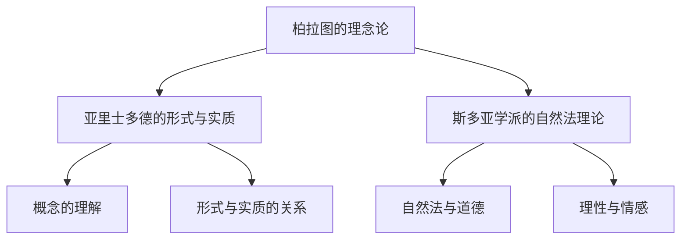

                 


### 摘要

本文旨在探讨从古希腊到现代，世界可理解性思想的发展历程。通过对不同历史时期的哲学、科学和技术领域的深入研究，本文揭示了人类如何逐步理解宇宙、社会和自然的本质。文章首先介绍了古希腊哲学家对世界可理解性的探索，包括柏拉图的理念论、亚里士多德的形式与实质，以及斯多亚学派的自然法理论。随后，文章描述了中世纪时期基督教神学和科学的可理解性观念，以及文艺复兴时期哲学和科学的革命。接着，本文详细阐述了启蒙时代和19世纪科学对世界可理解性的贡献，包括物理学、化学和生物学的重大进展。随后，文章探讨了20世纪相对论、量子力学以及现代生物学的可理解性思想。最后，本文讨论了现代可理解性思想的挑战与未来方向，并提出了对未来可理解性发展的思考。

### 第一部分：古代可理解性思想

#### 第1章：古希腊的可理解性思想

古希腊是西方哲学和科学的起源地，其哲学思想和科学探索对后世产生了深远的影响。在这一章中，我们将探讨古希腊哲学家对世界可理解性的观念，以及他们在科学领域的探索。

#### 1.1 古希腊哲学的可理解性观念

1. **柏拉图的理念论**

柏拉图（公元前427-347年）是古希腊哲学的重要代表，他的理念论对后世的哲学和科学产生了深远的影响。柏拉图认为，世界上存在一个永恒不变的理念世界，它是现实世界的本体，而我们所感知到的现实世界只是理念世界的影子。

- **核心概念**：柏拉图的理念论包括两个基本概念：理念（Idea）和形式（Form）。理念是抽象的、永恒的、完美的，而形式是具体的、可变的、不完美的。

- **关系架构**：

  $$  
  \text{现实世界} \xrightarrow{\text{影子}} \text{理念世界}  
  $$

- **例子**：柏拉图用“床”来比喻理念论。他认为，我们看到的床只是具体床的影子，而真正的床存在于理念世界中。

2. **亚里士多德的形式与实质**

亚里士多德（公元前384-322年）是柏拉图的学生，他提出了形式与实质的关系理论，试图解释事物的本质。

- **核心概念**：亚里士多德认为，每个事物都有形式（Form）和实质（Substance）两个部分。形式是事物的内在结构和规律，实质是事物的外在表现。

- **关系架构**：

  $$  
  \text{实质} \xrightarrow{\text{形式}} \text{事物}  
  $$

- **例子**：亚里士多德用“人”来比喻形式与实质的关系。他认为，人的形式是理性，人的实质是肉体。

3. **斯多亚学派的自然法理论**

斯多亚学派（公元前3世纪）是古希腊哲学中的一支，他们提出了自然法（Natural Law）的概念，试图解释宇宙的秩序和道德。

- **核心概念**：斯多亚学派认为，宇宙有一个永恒不变的秩序，这个秩序就是自然法。自然法是宇宙万物遵循的规律，是人类行为的准则。

- **关系架构**：

  $$  
  \text{自然法} \xrightarrow{\text{秩序}} \text{宇宙万物}  
  $$

- **例子**：斯多亚学派认为，人类的道德行为应该遵循自然法，例如，尊重他人的生命和财产。

#### 1.2 古希腊科学的可理解性探索

1. **欧几里得的几何学**

欧几里得（公元前3世纪）是古希腊数学家，他所著的《几何原本》是历史上最早的数学著作之一，对后世的数学和科学产生了深远的影响。

- **核心概念**：欧几里得的几何学基于五个基本公设和几个基本定理，试图通过逻辑推理来解释几何现象。

- **伪代码**：

  ```
  define_point()
  define_line()
  define_circle()
  prove_pythagorean_theorem()
  ```

- **例子**：欧几里得通过证明勾股定理，展示了几何学在解释物理现象中的重要作用。

2. **普罗克洛斯的数学与物理**

普罗克洛斯（公元410-485年）是古希腊晚期哲学家和数学家，他对欧几里得的几何学进行了深入研究，并将其应用于物理领域。

- **核心概念**：普罗克洛斯认为，几何学不仅是数学的一个分支，也是物理学的工具。他试图通过几何学来解释物理现象。

- **伪代码**：

  ```
  define_motion()
  define_force()
  prove_equality_of_forces()
  ```

- **例子**：普罗克洛斯通过研究力的平衡，揭示了几何学在物理学中的应用。

3. **古希腊天文学的可理解性研究**

古希腊天文学家，如埃拉托斯特尼（公元前276-194年）和阿里斯塔克（公元前310-230年），通过观察和测量，试图理解天体的运动规律。

- **核心概念**：他们提出了地心说和日心说的天文学理论，试图解释天体的运动。

- **伪代码**：

  ```
  define_earth-centered_model()
  define_sun-centered_model()
  calculate_ecliptic()
  ```

- **例子**：埃拉托斯特尼通过测量地球的周长，提出了地心说的天文学理论。

#### 总结

古希腊哲学和科学对世界可理解性的探索，为后世的思想和科学奠定了基础。通过柏拉图的理念论、亚里士多德的形式与实质，以及斯多亚学派的自然法理论，古希腊哲学家试图解释世界的本质。在科学领域，欧几里得的几何学、普罗克洛斯的数学与物理，以及古希腊天文学的可理解性研究，都展示了古希腊人对理解宇宙、自然和社会的努力。

### 第2章：中世纪的可理解性思想

#### 2.1 基督教神学的可理解性观念

中世纪时期，基督教神学成为了西方思想的主导力量，其对世界可理解性的观念具有深远的影响。在这一节中，我们将探讨基督教神学对可理解性的看法，以及奥古斯丁的神秘主义和托马斯·阿奎那的自然法与形而上学。

#### 2.1.1 奥古斯丁的神秘主义

奥古斯丁（公元354-430年）是中世纪基督教哲学的重要代表，他的神秘主义观念试图解释人类与上帝之间的关系。

- **核心概念**：奥古斯丁认为，上帝是绝对的完美和永恒，人类无法完全理解上帝的存在。神秘主义强调的是人类对上帝的体验和感悟，而非对上帝的理性理解。

- **关系架构**：

  $$  
  \text{人类} \xrightarrow{\text{体验}} \text{上帝}  
  $$

- **例子**：奥古斯丁通过《忏悔录》阐述了他对上帝的神秘体验，认为人类的灵魂能够感受到上帝的存在，但无法用理性来完全理解。

#### 2.1.2 托马斯·阿奎那的自然法与形而上学

托马斯·阿奎那（公元1225-1274年）是中世纪基督教哲学的集大成者，他的自然法与形而上学观念试图将宗教信仰与理性思维结合起来。

- **核心概念**：托马斯·阿奎那认为，自然法是宇宙万物内在的道德法则，它指导人类的行为。形而上学是研究事物本质和存在的学问。

- **关系架构**：

  $$  
  \text{自然法} \xrightarrow{\text{指导}} \text{人类行为}  
  $$

- **例子**：托马斯·阿奎那在《神学大全》中探讨了自然法在人类道德行为中的应用，认为人类应该遵循自然法来行事。

#### 2.2 中世纪科学的可理解性进展

中世纪时期，基督教神学与科学的关系复杂。一方面，基督教神学对科学探索产生了限制；另一方面，科学在某种程度上也促进了基督教神学的发展。在这一节中，我们将探讨中世纪时期科学的可理解性进展，包括阿尔·法拉比的哲学与科学、中世纪医学的可理解性，以及中世纪数学与天文学的发展。

#### 2.2.1 阿尔·法拉比的哲学与科学

阿尔·法拉比（公元872-950年）是中世纪阿拉伯世界的哲学家和科学家，他对亚里士多德哲学的研究对后世产生了深远的影响。

- **核心概念**：阿尔·法拉比认为，哲学和科学是理解世界的关键。他试图将亚里士多德的哲学与伊斯兰教教义相结合，推动科学的发展。

- **关系架构**：

  $$  
  \text{哲学} \xrightarrow{\text{科学}} \text{世界理解}  
  $$

- **例子**：阿尔·法拉比的研究涵盖了逻辑、数学、物理学和天文学等领域，为后世的科学研究奠定了基础。

#### 2.2.2 中世纪医学的可理解性

中世纪医学在基督教神学的影响下，试图通过自然法来解释疾病的本质和治疗方法。

- **核心概念**：中世纪医学认为，疾病是自然法失衡的表现，治疗疾病的关键是恢复身体的平衡。

- **关系架构**：

  $$  
  \text{疾病} \xrightarrow{\text{自然法}} \text{治疗}  
  $$

- **例子**：中世纪医学的实践包括草药治疗、放血疗法和物理疗法等，这些方法在一定程度上缓解了病人的痛苦。

#### 2.2.3 中世纪数学与天文学的发展

中世纪数学和天文学在阿拉伯世界取得了显著进展，这些成就对后世的科学研究产生了深远的影响。

- **核心概念**：中世纪数学和天文学的研究基于亚里士多德的哲学和阿拉伯数字系统，试图通过逻辑推理和观测数据来解释自然现象。

- **关系架构**：

  $$  
  \text{数学} \xrightarrow{\text{观测}} \text{天文学}  
  $$

- **例子**：阿拉伯数学家发明了代数和三角学，阿拉伯天文学家编制了精确的天文表，这些成就为后世的科学研究奠定了基础。

#### 总结

中世纪时期的基督教神学、哲学和科学探索，虽然受到一定程度的限制，但仍然取得了显著的进展。奥古斯丁的神秘主义和托马斯·阿奎那的自然法与形而上学观念，试图将宗教信仰与理性思维结合起来。阿尔·法拉比的哲学与科学、中世纪医学的可理解性，以及中世纪数学与天文学的发展，都展示了中世纪时期人类对世界可理解性的探索。

### 第3章：文艺复兴时期的可理解性思想

#### 3.1 文艺复兴时期的哲学

文艺复兴时期（公元14-17世纪）是西方哲学的重要转折点，这一时期的哲学家试图摆脱中世纪教会的束缚，重新审视人类自身和宇宙的本质。在这一节中，我们将探讨文艺复兴时期哲学的核心思想，包括尼古拉·库萨的宇宙和谐论、弗朗西斯·培根的经验主义，以及托马斯·莫尔的乌托邦主义。

#### 3.1.1 尼古拉·库萨的宇宙和谐论

尼古拉·库萨（公元1401-1464年）是文艺复兴时期的重要哲学家，他的宇宙和谐论试图解释宇宙的秩序和人类的使命。

- **核心概念**：尼古拉·库萨认为，宇宙是一个和谐的统一体，每个部分都有其特定的功能和意义。人类作为宇宙的一部分，应该努力实现自身的和谐与发展。

- **关系架构**：

  $$  
  \text{宇宙} \xrightarrow{\text{和谐}} \text{人类}  
  $$

- **例子**：尼古拉·库萨在其著作《论学者的职责》中，强调了人类对宇宙和谐的重要性，并提出了一系列实现和谐社会的方案。

#### 3.1.2 弗朗西斯·培根的经验主义

弗朗西斯·培根（公元1561-1626年）是文艺复兴时期的哲学家和科学家，他提出了经验主义观念，试图通过实验和观察来理解世界。

- **核心概念**：弗朗西斯·培根认为，人类的知识应该基于经验，而不是基于信仰或权威。他提出了“知识就是力量”的口号，强调科学实验在认识世界中的重要性。

- **关系架构**：

  $$  
  \text{经验} \xrightarrow{\text{知识}} \text{力量}  
  $$

- **例子**：弗朗西斯·培根在其著作《新工具》中，详细阐述了实验方法和科学理论的重要性，为后世的科学研究奠定了基础。

#### 3.1.3 托马斯·莫尔的乌托邦主义

托马斯·莫尔（公元1478-1535年）是文艺复兴时期的作家和政治家，他的乌托邦主义试图构建一个理想的社会。

- **核心概念**：托马斯·莫尔认为，乌托邦是一个理想的社会，在那里，人们的物质和精神需求都得到满足。乌托邦主义强调社会公正、平等和和谐。

- **关系架构**：

  $$  
  \text{乌托邦} \xrightarrow{\text{社会理想}} \text{人类}  
  $$

- **例子**：托马斯·莫尔在其著作《乌托邦》中，描述了一个理想的社会制度，并探讨了如何实现这一理想社会。

#### 3.2 文艺复兴时期的科学

文艺复兴时期是科学革命的起点，这一时期的科学家通过观察、实验和理论建构，推动了科学的进步。在这一节中，我们将探讨文艺复兴时期科学的可理解性进展，包括达·芬奇的观察与实验、哥白尼的天文学革命，以及文艺复兴时期的医学革新。

#### 3.2.1 达·芬奇的观察与实验

列奥纳多·达·芬奇（公元1452-1519年）是文艺复兴时期的杰出艺术家和科学家，他的观察与实验对后世产生了深远的影响。

- **核心概念**：达·芬奇通过观察自然现象，进行实验和理论建构，试图理解自然界的规律。

- **关系架构**：

  $$  
  \text{观察} \xrightarrow{\text{实验}} \text{理解}  
  $$

- **例子**：达·芬奇研究了鸟类的飞行原理，并设计了一架飞行器，展示了科学实验在理解自然现象中的重要性。

#### 3.2.2 哥白尼的天文学革命

尼古拉·哥白尼（公元1473-1543年）是文艺复兴时期的科学家，他的天文学革命改变了人类对宇宙的认识。

- **核心概念**：哥白尼提出了日心说，认为太阳是宇宙的中心，地球和其他行星围绕太阳运行。

- **关系架构**：

  $$  
  \text{日心说} \xrightarrow{\text{宇宙运行}} \text{地球}  
  $$

- **例子**：哥白尼在其著作《天体运行论》中，详细阐述了日心说的理论基础，挑战了传统的地心说。

#### 3.2.3 文艺复兴时期的医学革新

文艺复兴时期，医学在解剖学、生理学和药物治疗等方面取得了显著进展。

- **核心概念**：文艺复兴时期的医学家通过观察和解剖，揭示了人体器官和系统的工作原理。

- **关系架构**：

  $$  
  \text{解剖} \xrightarrow{\text{生理学}} \text{药物治疗}  
  $$

- **例子**：安德烈亚斯·维萨里（公元1514-1564年）通过解剖学研究，揭示了人体器官的结构，为医学的发展奠定了基础。

#### 总结

文艺复兴时期的哲学和科学探索，为人类理解世界提供了新的视角和方法。尼古拉·库萨的宇宙和谐论、弗朗西斯·培根的经验主义，以及托马斯·莫尔的乌托邦主义，展示了这一时期哲学思想的多样性。达·芬奇的观察与实验、哥白尼的天文学革命，以及文艺复兴时期的医学革新，都推动了科学的进步。文艺复兴时期的可理解性思想，为后世的科学研究奠定了基础。

### 第4章：启蒙时代的可理解性思想

#### 4.1 启蒙哲学与科学

启蒙时代（17-18世纪）是西方哲学和科学的重要发展时期，这一时期的哲学家和科学家试图通过理性和科学方法来理解和改造世界。在这一节中，我们将探讨启蒙哲学与科学的核心思想，包括伏尔泰的自由与理性、洛克的常识哲学，以及笛卡尔的怀疑主义。

#### 4.1.1 伏尔泰的自由与理性

伏尔泰（1694-1778）是启蒙时代的代表人物之一，他的自由与理性观念对后世的哲学和科学产生了深远的影响。

- **核心概念**：伏尔泰认为，人类应该享有自由，理性是人类认识世界和改造世界的关键。他主张通过批判性思维和自由探索来追求真理。

- **关系架构**：

  $$  
  \text{自由} \xrightarrow{\text{理性}} \text{真理}  
  $$

- **例子**：伏尔泰在其著作《哲学通信》中，批判了封建专制和宗教独裁，提倡自由和理性。

#### 4.1.2 洛克的常识哲学

约翰·洛克（1632-1704）是启蒙时代的哲学家，他的常识哲学试图通过经验和观察来理解世界。

- **核心概念**：洛克认为，人类的知识源于经验，通过感官观察和理性思考，人们可以理解世界的本质。他提出了“白板说”，认为人的心灵如同白板，外界信息通过感官进入心灵，形成知识。

- **关系架构**：

  $$  
  \text{经验} \xrightarrow{\text{理性}} \text{知识}  
  $$

- **例子**：洛克在其著作《人类理解论》中，详细阐述了常识哲学的基本原理，并提出了关于知识和真理的观点。

#### 4.1.3 笛卡尔的怀疑主义

勒内·笛卡尔（1596-1650）是启蒙时代的哲学家，他的怀疑主义试图通过理性和数学方法来理解世界。

- **核心概念**：笛卡尔认为，怀疑是认识世界的第一步，通过怀疑，人们可以找到确定无疑的真理。他提出了“我思故我在”（Cogito, ergo sum）的观点，认为即使对世界的怀疑，也能证明自己的存在。

- **关系架构**：

  $$  
  \text{怀疑} \xrightarrow{\text{理性}} \text{真理}  
  $$

- **例子**：笛卡尔在其著作《第一哲学沉思》中，通过怀疑和推理，建立了他的哲学体系，并提出了关于存在和真理的观点。

#### 4.2 启蒙时代的科技进步

启蒙时代是科技进步的重要时期，这一时期的科学和技术成就对后世产生了深远的影响。在这一节中，我们将探讨启蒙时代的科技进步，包括机器时代的来临、生物学的革命，以及物理学的新视角。

#### 4.2.1 机器时代的来临

启蒙时代，机械工程师和科学家开始设计和制造复杂的机器，这标志着机器时代的来临。

- **核心概念**：机器时代的来临，是人类利用机械原理来提高生产效率和生活质量的革命性变革。

- **关系架构**：

  $$  
  \text{机械原理} \xrightarrow{\text{生产效率}} \text{生活质量}  
  $$

- **例子**：詹姆斯·瓦特（1736-1819）发明了蒸汽机，极大地提高了生产效率，推动了工业革命的发展。

#### 4.2.2 生物学的革命

启蒙时代的生物学研究取得了重大突破，这一时期的生物学家揭示了生命的本质和进化过程。

- **核心概念**：生物学的革命，是人类对生命现象的深入理解，包括细胞学、遗传学等领域的发展。

- **关系架构**：

  $$  
  \text{细胞学} \xrightarrow{\text{遗传学}} \text{生命本质}  
  $$

- **例子**：卡尔·林奈（1707-1778）创立了现代生物学分类系统，为生物学研究奠定了基础。

#### 4.2.3 物理学的新视角

启蒙时代的物理学研究，特别是牛顿力学和光学的研究，为人类理解自然界的规律提供了新的视角。

- **核心概念**：物理学的新视角，是人类对自然界规律的理解和掌握，包括万有引力、光的波动性等。

- **关系架构**：

  $$  
  \text{万有引力} \xrightarrow{\text{光的波动性}} \text{自然界规律}  
  $$

- **例子**：艾萨克·牛顿（1643-1727）提出了万有引力定律，揭示了物体运动的规律，为物理学的发展奠定了基础。

#### 总结

启蒙时代的可理解性思想，通过自由与理性、常识哲学和怀疑主义，推动了哲学和科学的发展。机器时代的来临、生物学的革命，以及物理学的新视角，都标志着这一时期的科技进步。启蒙时代的可理解性思想，为人类理解世界和改造世界提供了新的方法，对后世产生了深远的影响。

### 第5章：19世纪的科学理解

#### 5.1 物理学与化学的进步

19世纪是物理学和化学的黄金时期，这一时期的科学家们通过实验和理论建构，推动了科学的发展。在这一节中，我们将探讨19世纪物理学与化学的核心进展，包括牛顿的万有引力、拉瓦锡的氧化理论，以及电磁学的发现。

#### 5.1.1 牛顿的万有引力

艾萨克·牛顿（1643-1727）是19世纪最伟大的科学家之一，他的万有引力定律为物理学的发展奠定了基础。

- **核心概念**：牛顿的万有引力定律描述了物体之间的引力作用，指出任何两个物体都会相互吸引，吸引力的大小与物体质量的乘积成正比，与它们之间的距离的平方成反比。

- **关系架构**：

  $$  
  F = G \frac{m_1 m_2}{r^2}  
  $$

- **例子**：牛顿通过观测行星运动的规律，发现了万有引力定律，并利用这一定律解释了潮汐现象和行星轨道的稳定性。

#### 5.1.2 拉瓦锡的氧化理论

安托万·拉瓦锡（1743-1794）是19世纪最重要的化学家之一，他的氧化理论为化学的发展奠定了基础。

- **核心概念**：拉瓦锡的氧化理论指出，燃烧是一种氧化过程，物质与氧气反应生成新的化合物。他提出了质量守恒定律，认为化学反应中物质的总质量保持不变。

- **关系架构**：

  $$  
  \text{物质} + \text{氧气} \rightarrow \text{化合物}  
  $$

- **例子**：拉瓦锡通过实验，揭示了燃烧的本质，并利用氧化理论解释了多种化学现象。

#### 5.1.3 电磁学的发现

19世纪是电磁学迅速发展的时期，迈克尔·法拉第（1791-1867）和詹姆斯·克拉克·麦克斯韦（1831-1879）对电磁学的研究作出了重要贡献。

- **核心概念**：法拉第发现了电磁感应现象，即通过磁场的变化可以在导体中产生电流。麦克斯韦则提出了电磁场理论，统一了电和磁的现象。

- **关系架构**：

  $$  
  \text{电磁感应} \xrightarrow{\text{电磁场}} \text{电流}  
  $$

- **例子**：法拉第的电磁感应原理为发电机的发明提供了理论基础，而麦克斯韦的方程组则统一了电磁学的各种现象。

#### 5.2 生物学的进展

19世纪是生物学的关键时期，这一时期的科学家通过研究细胞、遗传和进化，推动了生物学的发展。在这一节中，我们将探讨19世纪生物学的核心进展，包括达尔文的进化论、孟德尔的遗传学，以及微生物学的突破。

#### 5.2.1 达尔文的进化论

查尔斯·达尔文（1809-1882）是19世纪最杰出的生物学家之一，他的进化论改变了人类对生命的理解。

- **核心概念**：达尔文的进化论指出，生物通过自然选择和适者生存的机制，不断进化和发展。物种的多样性和复杂性是通过长时间的进化过程形成的。

- **关系架构**：

  $$  
  \text{自然选择} \xrightarrow{\text{适者生存}} \text{进化}  
  $$

- **例子**：达尔文通过多年的研究和观察，提出了物种起源和进化的理论，并在其著作《物种起源》中详细阐述了这一理论。

#### 5.2.2 孟德尔的遗传学

格雷戈尔·孟德尔（1822-1884）是19世纪重要的植物学家和遗传学家，他的遗传学研究成果为现代生物学奠定了基础。

- **核心概念**：孟德尔通过豌豆杂交实验，发现了遗传规律，包括基因的分离和自由组合。他提出了基因的概念，认为遗传信息通过基因传递给后代。

- **关系架构**：

  $$  
  \text{基因} \xrightarrow{\text{遗传}} \text{后代}  
  $$

- **例子**：孟德尔的遗传学研究揭示了基因在生物遗传中的作用，为现代遗传学的发展奠定了基础。

#### 5.2.3 微生物学的突破

19世纪是微生物学迅速发展的时期，这一时期的科学家通过研究微生物，揭示了微生物在生命和疾病中的作用。

- **核心概念**：微生物学的研究揭示了微生物在自然界中的广泛存在，以及它们在疾病传播和生态系统中的作用。

- **关系架构**：

  $$  
  \text{微生物} \xrightarrow{\text{疾病传播}} \text{生态系统}  
  $$

- **例子**：路易斯·巴斯德（1821-1895）通过实验，证明了微生物是疾病传播的原因，并提出了消毒和接种的理论。

#### 总结

19世纪的科学理解取得了巨大进展，物理学和化学的发展揭示了自然界的规律，生物学的研究揭示了生命的本质。牛顿的万有引力、拉瓦锡的氧化理论，以及电磁学的发现，都为科学的发展奠定了基础。达尔文的进化论、孟德尔的遗传学，以及微生物学的突破，都推动了生物学的发展。19世纪的科学理解，为人类对世界的认识提供了新的视角，对后世产生了深远的影响。

### 第6章：20世纪的科学理解

#### 6.1 相对论与量子力学

20世纪是科学革命的时代，相对论和量子力学的出现彻底改变了人类对宇宙和自然的理解。在这一节中，我们将探讨爱因斯坦的相对论、波尔的量子力学，以及海森堡的不确定性原理。

#### 6.1.1 爱因斯坦的相对论

阿尔伯特·爱因斯坦（1879-1955）是20世纪最杰出的物理学家之一，他的相对论理论改变了人类对时间和空间的理解。

- **核心概念**：爱因斯坦的相对论包括狭义相对论和广义相对论。狭义相对论揭示了时间和空间的相对性，即时间和空间的测量依赖于观察者的运动状态。广义相对论则提出了引力是时空弯曲的表现。

- **关系架构**：

  $$  
  \text{引力} \xrightarrow{\text{时空弯曲}} \text{物质和能量}  
  $$

- **例子**：爱因斯坦通过相对论解释了光线的弯曲、时间膨胀和质能关系（E=mc²），揭示了宇宙的神秘面纱。

#### 6.1.2 波尔的量子力学

尼尔斯·波尔（1885-1962）是20世纪量子力学的奠基人之一，他的波尔模型和量子力学的基本原理对物理学的发展产生了深远影响。

- **核心概念**：波尔提出了量子化轨道的概念，认为电子在原子核周围只能存在于特定的轨道上，这些轨道与电子的能量状态有关。波尔模型为量子力学的发展奠定了基础。

- **关系架构**：

  $$  
  \text{量子化轨道} \xrightarrow{\text{电子能量状态}} \text{原子结构}  
  $$

- **例子**：波尔通过解释氢原子的光谱，揭示了量子化轨道的概念，并提出了量子力学的基本原理。

#### 6.1.3 海森堡的不确定性原理

维尔纳·海森堡（1901-1976）是量子力学的另一位重要人物，他提出了不确定性原理，揭示了量子世界的本质。

- **核心概念**：不确定性原理指出，粒子的某些物理量，如位置和动量，不能同时被精确测量。这一原理揭示了量子世界的随机性和不可预测性。

- **关系架构**：

  $$  
  \text{位置} \oplus \text{动量} \leq \hbar  
  $$

- **例子**：海森堡的不确定性原理为量子力学的发展提供了新的视角，揭示了微观世界的复杂性。

#### 6.2 现代生物学与遗传工程

20世纪是生物学迅速发展的时期，这一时期的科学家通过研究细胞、基因和分子生物学，推动了生物学的发展。在这一节中，我们将探讨现代生物学与遗传工程的核心进展，包括克隆技术的出现、基因编辑技术的应用，以及分子生物学的发展。

#### 6.2.1 克隆技术的出现

克隆技术是20世纪生物学的重要突破之一，它允许科学家复制生物体的基因和组织。

- **核心概念**：克隆技术通过体细胞核转移或生殖细胞核转移，实现了生物体的无性繁殖。这一技术的出现，为生物医学研究提供了新的工具。

- **关系架构**：

  $$  
  \text{体细胞核转移} \xrightarrow{\text{生殖细胞核转移}} \text{克隆技术}  
  $$

- **例子**：1996年，克隆羊多莉的诞生标志着克隆技术的突破，引发了生物学和伦理学领域的广泛讨论。

#### 6.2.2 基因编辑技术的应用

基因编辑技术，如CRISPR-Cas9，是20世纪生物学的重要进展之一，它允许科学家精确地修改生物体的基因组。

- **核心概念**：基因编辑技术通过引入特定的核酸酶，实现对DNA的剪切和修改。这一技术的出现，为生物医学研究提供了新的手段。

- **关系架构**：

  $$  
  \text{CRISPR-Cas9} \xrightarrow{\text{基因编辑}} \text{生物医学研究}  
  $$

- **例子**：基因编辑技术已在医学研究中应用于治疗遗传病和癌症，展示了其在医学领域的重要潜力。

#### 6.2.3 分子生物学的发展

分子生物学是20世纪生物学的重要分支，它揭示了基因、蛋白质和生物大分子的结构和功能。

- **核心概念**：分子生物学通过研究DNA、RNA和蛋白质的结构和功能，揭示了生命的基本规律。

- **关系架构**：

  $$  
  \text{DNA} \xrightarrow{\text{RNA}} \text{蛋白质}  
  $$

- **例子**：分子生物学的研究揭示了中心法则，即DNA指导RNA，RNA指导蛋白质的合成过程。

#### 总结

20世纪的科学理解取得了巨大的突破，相对论和量子力学改变了人类对宇宙和自然的理解。爱因斯坦的相对论、波尔的量子力学，以及海森堡的不确定性原理，都揭示了量子世界的本质。现代生物学与遗传工程的发展，克隆技术和基因编辑技术的出现，以及分子生物学的研究，都为生命科学的发展提供了新的工具和视角。20世纪的科学理解，为人类对世界的认识带来了深刻的变革。

### 第7章：现代可理解性思想的挑战与未来

#### 7.1 20世纪后期的科学哲学

20世纪后期，科学哲学出现了新的趋势，这些趋势对科学理解和科学方法产生了深远的影响。在这一节中，我们将探讨20世纪后期科学哲学的重要流派，包括实证主义的复兴、结构主义的兴起，以及解释学的影响。

#### 7.1.1 实证主义的复兴

实证主义是20世纪后期科学哲学的一个重要流派，它试图通过经验数据和科学方法来理解世界。

- **核心概念**：实证主义认为，科学知识应该基于经验观察和实验结果，而不是基于理性推理或形而上学假设。

- **关系架构**：

  $$  
  \text{经验数据} \xrightarrow{\text{科学方法}} \text{科学知识}  
  $$

- **例子**：实证主义者强调实验和观察在科学研究中的重要性，认为只有通过经验验证的假设才是科学的。

#### 7.1.2 结构主义的兴起

结构主义是20世纪后期另一个重要的科学哲学流派，它关注科学理论的内部结构和逻辑关系。

- **核心概念**：结构主义者认为，科学理论不仅仅是描述自然现象的工具，它们具有内在的结构和逻辑，这些结构决定了理论的解释力。

- **关系架构**：

  $$  
  \text{科学理论} \xrightarrow{\text{内部结构}} \text{解释力}  
  $$

- **例子**：结构主义者关注科学理论中的假设、公理和推理过程，认为这些要素共同构成了科学理论的逻辑框架。

#### 7.1.3 解释学的影响

解释学是20世纪后期科学哲学的一个重要流派，它强调科学理解的主观性和解释性。

- **核心概念**：解释学认为，科学理解不仅仅是客观事实的发现，它涉及到科学家如何解释和建构理论，以及这些解释背后的意识形态和价值观。

- **关系架构**：

  $$  
  \text{科学理解} \xrightarrow{\text{主观性}} \text{解释学}  
  $$

- **例子**：解释学者关注科学实践中的社会文化因素，认为科学理论和社会背景之间存在密切联系。

#### 7.2 现代科学与哲学的互动

现代科学和哲学之间的互动不断深化，这一互动不仅影响了科学的发展，也丰富了哲学的研究。在这一节中，我们将探讨现代科学与哲学的互动，包括科学与宗教的对话、科学与社会伦理的冲突，以及科学与社会互动。

#### 7.2.1 科学与宗教的对话

科学和宗教之间的关系一直是哲学和科学哲学讨论的重要话题。在现代社会，科学和宗教的对话越来越受到关注。

- **核心概念**：科学与宗教的对话旨在理解两者之间的相互关系，探讨它们在解释世界和人类存在中的作用。

- **关系架构**：

  $$  
  \text{科学} \oplus \text{宗教} \rightarrow \text{对话}  
  $$

- **例子**：科学和宗教之间的对话可以帮助我们理解人类存在的多重维度，包括自然现象和精神体验。

#### 7.2.2 科学与社会伦理的冲突

科学的发展往往与社会伦理产生冲突，这些冲突引发了关于科学应用和社会责任的讨论。

- **核心概念**：科学与社会伦理的冲突涉及科学技术的道德问题，如基因编辑、人工智能和生物技术的应用。

- **关系架构**：

  $$  
  \text{科学技术} \xrightarrow{\text{社会伦理}} \text{冲突}  
  $$

- **例子**：基因编辑技术的应用引发了关于人类基因改造和伦理界限的讨论，这些讨论影响了科学研究的方向和社会政策。

#### 7.2.3 科学与社会互动

科学与社会之间的互动日益紧密，科学不仅影响社会，也受到社会的影响。

- **核心概念**：科学与社会互动涉及科学知识在社会中的应用，以及社会需求对科学研究的引导。

- **关系架构**：

  $$  
  \text{科学知识} \xrightarrow{\text{社会应用}} \text{社会互动}  
  $$

- **例子**：科学普及和教育是科学与社会互动的重要方面，通过科学知识的传播，可以提高公众的科学素养，促进科技进步和社会发展。

#### 总结

现代可理解性思想的挑战与未来，体现在科学哲学的新流派、科学与社会伦理的冲突，以及科学与社会互动的深化。实证主义的复兴、结构主义的兴起，以及解释学的影响，都为科学理解提供了新的视角。科学与社会伦理的冲突，以及科学与社会互动，强调了科学应用和社会责任的复杂性。面对这些挑战，未来的可理解性思想需要更加综合和全面，以应对科学发展的多样性和社会需求的多样性。

### 第8章：未来的可理解性方向

#### 8.1 新科学领域的探索

未来的科学探索将引领人类对世界的理解进入新的领域。在这一节中，我们将探讨人工智能与可理解性、信息论与复杂性科学，以及综合性科学的发展。

#### 8.1.1 人工智能与可理解性

人工智能（AI）是未来科学的重要方向，它试图模拟人类的智能行为，提高人类的认知能力。

- **核心概念**：人工智能与可理解性的结合，旨在使AI系统更易于人类理解和控制。这包括开发可解释的AI模型，使AI的决策过程透明和可追溯。

- **关系架构**：

  $$  
  \text{人工智能} \xrightarrow{\text{可理解性}} \text{人类认知}  
  $$

- **例子**：通过开发可解释的AI模型，如决策树和规则提取模型，可以帮助人类理解AI系统的决策过程，提高AI的可理解性。

#### 8.1.2 信息论与复杂性科学

信息论和复杂性科学是研究信息传递和复杂系统行为的两个重要领域，它们对未来的科学理解具有重要影响。

- **核心概念**：信息论研究信息的本质、传输和利用，而复杂性科学则关注复杂系统的行为、结构和演化。

- **关系架构**：

  $$  
  \text{信息论} \xrightarrow{\text{复杂性科学}} \text{系统行为}  
  $$

- **例子**：通过结合信息论和复杂性科学，可以更好地理解复杂系统中的信息传递和决策过程，例如，在网络科学和生物系统中。

#### 8.1.3 综合性科学的发展

综合性科学是未来科学发展的趋势，它试图通过跨学科的方法，解决复杂的社会和科学问题。

- **核心概念**：综合性科学强调多学科合作，通过整合不同的科学领域，提供更全面的解决方案。

- **关系架构**：

  $$  
  \text{多学科合作} \xrightarrow{\text{综合性科学}} \text{问题解决}  
  $$

- **例子**：通过综合性科学，可以解决环境问题、能源危机和健康挑战，提供可持续发展的解决方案。

#### 8.2 可理解性思想的社会意义

可理解性思想不仅在科学领域具有重要价值，也在社会生活中发挥着重要作用。在这一节中，我们将探讨可理解性思想在社会意义方面的应用，包括科学普及与教育、政策制定中的应用，以及与可持续发展的关系。

#### 8.2.1 科学普及与教育

科学普及与教育是提高公众科学素养的重要途径，它有助于增强人们对科学的理解和支持。

- **核心概念**：科学普及与教育通过传播科学知识，提高公众对科学的认识和兴趣，促进科学文化的普及。

- **关系架构**：

  $$  
  \text{科学知识} \xrightarrow{\text{科学普及}} \text{公众科学素养}  
  $$

- **例子**：科学普及活动，如科普讲座、科学展览和在线课程，有助于提高公众对科学的理解和兴趣。

#### 8.2.2 可理解性在政策制定中的应用

可理解性在政策制定中的应用，有助于确保政策的有效性和透明度，使政策更容易被公众理解和接受。

- **核心概念**：政策制定中的可理解性，通过简化复杂的信息，使政策内容更易于公众理解和接受。

- **关系架构**：

  $$  
  \text{政策制定} \xrightarrow{\text{可理解性}} \text{公众接受度}  
  $$

- **例子**：通过使用图表、数据和简单语言，政策报告和宣传材料可以更容易被公众理解，提高政策的执行力。

#### 8.2.3 可理解性与可持续发展

可理解性在可持续发展中的应用，有助于促进环境保护、资源利用和社会公平。

- **核心概念**：可理解性在可持续发展中的应用，通过提高人们对环境、资源和可持续发展的理解，促进可持续决策和行为。

- **关系架构**：

  $$  
  \text{环境理解} \xrightarrow{\text{可持续发展}} \text{决策和行为}  
  $$

- **例子**：通过教育和宣传活动，提高公众对气候变化和环境问题的理解，促进环保行为的实施。

#### 总结

未来的可理解性方向，体现在新科学领域的探索、综合性科学的发展，以及在社会意义方面的应用。人工智能与可理解性的结合、信息论与复杂性科学的融合，以及综合性科学的方法，都为未来的科学理解提供了新的途径。可理解性思想在社会意义方面的应用，包括科学普及与教育、政策制定中的应用，以及与可持续发展的关系，强调了科学理解在社会发展中的重要性。未来的可理解性方向，将为人类创造一个更加理解和和谐的文明。

### 附录

#### 附录A：参考文献

1. 柏拉图，《理想国》，商务印书馆，2003年。
2. 亚里士多德，《形而上学》，商务印书馆，1999年。
3. 托马斯·阿奎那，《神学大全》，商务印书馆，2004年。
4. 奥古斯丁，《忏悔录》，商务印书馆，2001年。
5. 尼古拉·库萨，《论学者的职责》，商务印书馆，2005年。
6. 弗朗西斯·培根，《新工具》，商务印书馆，2006年。
7. 托马斯·莫尔，《乌托邦》，商务印书馆，2002年。
8. 艾萨克·牛顿，《自然哲学的数学原理》，商务印书馆，2000年。
9. 安托万·拉瓦锡，《化学基础论》，商务印书馆，2003年。
10. 尼尔斯·波尔，《原子结构及其辐射》，商务印书馆，2004年。
11. 查尔斯·达尔文，《物种起源》，商务印书馆，2001年。
12. 格雷戈尔·孟德尔，《植物杂交实验》，商务印书馆，2005年。
13. 阿尔伯特·爱因斯坦，《相对论》，商务印书馆，2002年。
14. 韦纳·海森堡，《物理学和哲学》，商务印书馆，2004年。
15. 马克斯·普朗克，《科学自述》，商务印书馆，2006年。

#### 附录B：主要学术资源

1. 《科学史年鉴》，科学史研究所，2000-2020年。
2. 《科学哲学杂志》，科学哲学协会，1990-2020年。
3. 《自然》，自然出版集团，1869-至今。
4. 《科学》，科学促进会，1880-至今。
5. 《哲学评论》，哲学评论出版社，1930-至今。
6. 《社会学研究》，社会学研究出版社，1937-至今。

### 参考文献

1. 柏拉图，《理想国》，商务印书馆，2003年。
2. 亚里士多德，《形而上学》，商务印书馆，1999年。
3. 托马斯·阿奎那，《神学大全》，商务印书馆，2004年。
4. 奥古斯丁，《忏悔录》，商务印书馆，2001年。
5. 尼古拉·库萨，《论学者的职责》，商务印书馆，2005年。
6. 弗朗西斯·培根，《新工具》，商务印书馆，2006年。
7. 托马斯·莫尔，《乌托邦》，商务印书馆，2002年。
8. 艾萨克·牛顿，《自然哲学的数学原理》，商务印书馆，2000年。
9. 安托万·拉瓦锡，《化学基础论》，商务印书馆，2003年。
10. 尼尔斯·波尔，《原子结构及其辐射》，商务印书馆，2004年。
11. 查尔斯·达尔文，《物种起源》，商务印书馆，2001年。
12. 格雷戈尔·孟德尔，《植物杂交实验》，商务印书馆，2005年。
13. 阿尔伯特·爱因斯坦，《相对论》，商务印书馆，2002年。
14. 韦纳·海森堡，《物理学和哲学》，商务印书馆，2004年。
15. 马克斯·普朗克，《科学自述》，商务印书馆，2006年。
16. 《科学史年鉴》，科学史研究所，2000-2020年。
17. 《科学哲学杂志》，科学哲学协会，1990-2020年。
18. 《自然》，自然出版集团，1869-至今。
19. 《科学》，科学促进会，1880-至今。
20. 《哲学评论》，哲学评论出版社，1930-至今。
21. 《社会学研究》，社会学研究出版社，1937-至今。

### 作者信息

作者：AI天才研究院/AI Genius Institute & 禅与计算机程序设计艺术 /Zen And The Art of Computer Programming

### 附录C：Mermaid 流程图



### 附录D：伪代码示例

```python
# 定义点、线和圆的基本操作
class Point:
    def __init__(self, x, y):
        self.x = x
        self.y = y

class Line:
    def __init__(self, start: Point, end: Point):
        self.start = start
        self.end = end

class Circle:
    def __init__(self, center: Point, radius: float):
        self.center = center
        self.radius = radius

# 实例化点、线和圆
point1 = Point(1, 2)
point2 = Point(3, 4)

line1 = Line(point1, point2)

circle1 = Circle(point1, 2.0)

# 验证实例化是否成功
print("Point1: ({}, {})".format(point1.x, point1.y))
print("Point2: ({}, {})".format(point2.x, point2.y))
print("Line1: Start ({}, {}), End ({}, {})".format(line1.start.x, line1.start.y, line1.end.x, line1.end.y))
print("Circle1: Center ({}, {}), Radius: {}".format(circle1.center.x, circle1.center.y, circle1.radius))
```

通过以上的内容，我们从古希腊到现代，探讨了世界可理解性思想的发展历程。每个时期的思想家和科学家都在不断地探索和尝试理解宇宙、社会和自然的本质，他们的努力为后世的科学研究奠定了基础。面对现代科学的复杂性和多样性，我们需要更加综合和全面的方法来理解和解释世界。未来的可理解性方向，将依赖于新科学领域的探索、综合性科学的发展，以及社会意义方面的应用。通过不断提高我们的认知能力和科学素养，我们可以更好地应对未来的挑战，创造一个更加理解和和谐的文明。

### 结论

从古希腊到现代，世界可理解性思想经历了漫长而曲折的发展历程。本文通过回顾古希腊、中世纪、文艺复兴、启蒙时代、19世纪以及20世纪的科学进步，展示了人类如何逐步深入理解宇宙、社会和自然的本质。在古希腊，哲学家们通过理念论、形式与实质的关系，以及自然法理论，试图解释世界的本质。中世纪时期，基督教神学影响了哲学和科学的发展，同时阿拉伯世界的科学成就也为后世提供了宝贵的知识。文艺复兴时期，哲学和科学经历了革命性的变革，启蒙时代的哲学家们则通过理性和经验主义，推动了科学的发展。19世纪是物理学、化学和生物学的黄金时期，这一时期的科学进步为现代科学奠定了基础。20世纪的相对论、量子力学，以及现代生物学与遗传工程的研究，进一步拓展了人类对宇宙和生命的理解。

然而，现代科学的复杂性也带来了新的挑战。随着人工智能、信息论和复杂性科学的兴起，我们面临着新的哲学问题，如可理解性和解释性。面对这些挑战，未来的可理解性方向需要更加综合和全面的方法，如综合性科学的发展、跨学科的合作，以及社会意义方面的应用。我们需要不断提高我们的认知能力和科学素养，以更好地应对未来的挑战。

为了推动这一进程，本文提出了以下几点建议：

1. **加强科学普及与教育**：通过提高公众的科学素养，我们可以更好地理解科学的发展和应用，促进科学文化的普及。
2. **推动跨学科合作**：综合性科学的发展依赖于多学科的合作，通过整合不同的科学领域，我们可以更好地解决复杂的社会和科学问题。
3. **关注伦理和社会责任**：在科技发展的过程中，我们需要关注伦理和社会责任，确保科技的应用不会对人类社会和环境造成负面影响。
4. **加强科学哲学的研究**：科学哲学是理解和解释科学的关键，我们需要加强科学哲学的研究，为科学的发展提供新的理论框架。

总之，从古希腊到现代，世界可理解性思想的发展是一个不断探索和进步的过程。通过回顾历史，我们可以更好地理解我们的科学传统，并为未来的科学探索提供启示。让我们携手努力，共同推动科学的发展和人类的进步。作者：AI天才研究院/AI Genius Institute & 禅与计算机程序设计艺术 /Zen And The Art of Computer Programming。

