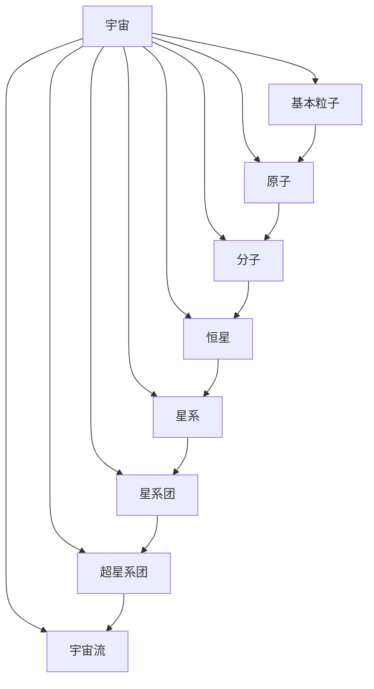

                 

### 文章标题

《从微观到宏观：宇宙的多层次理解》

### 关键词

宇宙、多层次理解、微观宇宙、宏观宇宙、宇宙探索

### 摘要

本文从微观到宏观的视角，全面探讨了宇宙的多层次结构。首先介绍了宇宙的基础知识，包括宇宙的起源、结构和组成元素。随后，深入探讨了微观宇宙中的基本粒子和量子力学基础，阐述了原子与分子的结构。接着，从宏观角度分析了恒星与星系的形成与演化，以及宇宙的膨胀和黑洞现象。文章还探讨了宇宙的大尺度结构和未来，最后从哲学角度思考了宇宙的多层次理解。希望通过本文，读者能够对宇宙有一个全面、深刻的认识。

## 第一部分：宇宙的基础知识

### 第1章：宇宙概述

#### 1.1 宇宙的起源

宇宙的起源一直是科学界和哲学界探讨的热点话题。现代宇宙学普遍接受的理论是“大爆炸理论”，这一理论认为宇宙始于大约138亿年前的一次大爆炸。在大爆炸之前，宇宙处于极热、极密的状态，随后开始膨胀，温度逐渐降低，物质逐渐形成。通过观测宇宙背景微波辐射，科学家们能够追溯到大爆炸的遗迹，这为“大爆炸理论”提供了强有力的证据。

#### 1.2 宇宙的结构

宇宙的结构可以分为多个层次，从小到大的顺序为：基本粒子、原子、分子、恒星、星系、星系团、超星系团和宇宙。这些层次之间相互联系，构成了宇宙的复杂结构。例如，恒星是由原子组成的，而星系则是由多个恒星系统组成的。

#### 1.3 宇宙的组成元素

宇宙的组成元素主要包括物质和能量。物质包括各种基本粒子，如电子、夸克等，它们通过相互作用形成了原子、分子和其他物质结构。能量则是推动宇宙膨胀和恒星形成的动力。此外，宇宙还含有大量未知成分，如暗物质和暗能量，它们对宇宙的结构和演化起着关键作用。

## 第二部分：微观宇宙

### 第2章：微观宇宙

#### 2.1 基本粒子

基本粒子是构成物质的基本单元，它们具有独特的物理性质。基本粒子包括：电子、夸克、中微子、光子等。每种基本粒子都有特定的质量、电荷和相互作用方式。例如，电子是一种轻量级粒子，带有负电荷，它与原子核中的质子相互作用形成了原子。

#### 2.2 量子力学基础

量子力学是描述微观宇宙的基本理论，它揭示了微观世界中物质和能量的奇异性质。量子力学的基本原理包括波粒二象性、不确定性原理和量子纠缠等。波粒二象性指出，微观粒子既具有粒子性质，又具有波动性质。不确定性原理则表明，我们无法同时精确知道一个粒子的位置和动量。量子纠缠则描述了多个粒子之间的奇特关联，即使它们相隔很远，一个粒子的状态变化也能立即影响另一个粒子的状态。

### 第3章：原子与分子

#### 3.1 原子的结构

原子是构成物质的基本单位，它由原子核和核外电子组成。原子核由质子和中子组成，质子带正电荷，中子不带电荷。核外的电子带负电荷，它们在核外轨道上运动。电子云模型描述了电子在原子核外的分布情况，不同轨道上的电子具有不同的能量和运动状态。

#### 3.2 分子结构

分子是由两个或多个原子通过共价键结合而成的。分子间的相互作用力包括范德华力、氢键和离子键等。分子轨道理论描述了分子中原子轨道的相互作用，它指出，分子的性质取决于分子中原子轨道的叠加方式和能级。分子的几何结构对分子的性质有重要影响，不同的分子几何结构决定了分子的化学活性和物理性质。

## 第三部分：宏观宇宙

### 第4章：恒星与星系

#### 4.1 恒星的诞生与死亡

恒星是由宇宙中的气体和尘埃云聚集形成的。在引力作用下，气体和尘埃云逐渐压缩，温度和密度升高，最终引发核聚变反应，形成恒星。恒星的一生可以分为几个阶段：主序阶段、红巨星阶段、超巨星阶段和死亡阶段。恒星的死亡方式取决于其初始质量，大质量恒星可能坍缩成黑洞或中子星，而小质量恒星则可能变成白矮星或黑矮星。

#### 4.2 星系的形成与演化

星系是由多个恒星、星团、星云和星际物质组成的巨大系统。星系的形成与宇宙大爆炸有关，宇宙中的气体和尘埃云在引力作用下聚集形成了星系。星系可以分为旋涡星系、椭圆星系和不规则星系。旋涡星系具有明显的旋臂结构，椭圆星系呈椭圆形，而不规则星系则没有明显的对称结构。星系的演化包括恒星的形成与死亡、星系之间的碰撞与合并等过程。

### 第5章：宇宙的膨胀与黑洞

#### 5.1 宇宙膨胀理论

宇宙膨胀理论认为，宇宙在大爆炸之后一直在膨胀。这一理论得到了宇宙背景微波辐射和遥远星系的红移观测证据的支持。根据宇宙膨胀理论，宇宙的膨胀速度在逐渐加快，这可能是由于暗能量的存在。暗能量是一种神秘的力量，它对抗引力，推动宇宙膨胀。

#### 5.2 黑洞与引力波

黑洞是宇宙中的一种极端天体，它具有极强的引力，甚至连光都无法逃逸。黑洞的形成与恒星的死亡有关，大质量恒星在核燃料耗尽后可能坍缩成黑洞。引力波是黑洞合并或剧烈天体事件产生的时空波动，它在2015年被首次观测到，这为宇宙学提供了新的观测手段。

### 第6章：宇宙的大尺度结构

#### 6.1 宇宙的大尺度结构

宇宙的大尺度结构包括宇宙流、星系团、超星系团和宇宙网。宇宙流是宇宙中大规模的星系流，它们沿着特定的方向运动。星系团是由多个星系组成的系统，它们通过引力相互作用形成。超星系团是更大的宇宙结构，由多个星系团组成。宇宙网则是一个更为庞大的结构，将宇宙中的星系、星系团和超星系团连接在一起。

#### 6.2 暗物质与暗能量

暗物质和暗能量是宇宙中两种神秘的成分。暗物质不发光，不与电磁波相互作用，但它对宇宙的结构和演化起着关键作用。暗能量则是一种对抗引力的力量，它推动宇宙膨胀。暗物质和暗能量的存在对宇宙学提出了新的挑战，科学家们正在努力研究它们的性质和来源。

### 第7章：宇宙的未来

#### 7.1 宇宙的未来预测

宇宙的未来取决于宇宙的膨胀速度、暗物质的分布和暗能量的性质。一种可能的情景是宇宙将不断膨胀，最终导致热寂，即宇宙中的物质和能量将均匀分布，无法再进行任何物理过程。另一种情景是宇宙可能经历多次大爆炸和大坍缩的循环，这被称为“循环宇宙”理论。此外，还有可能存在多个宇宙，即多元宇宙。

## 第四部分：宇宙的多层次理解

### 第8章：宇宙学的哲学思考

#### 8.1 宇宙的奥秘

宇宙的奥秘包括宇宙的起源、结构、演化以及宇宙中存在的未知成分。哲学家和科学家一直在探索宇宙的本质和意义。一些哲学家认为宇宙是无限的，而另一些则认为宇宙是有限的。科学家们通过观测和实验，试图揭示宇宙的奥秘，但至今仍有许多未解之谜。

#### 8.2 宇宙的意义

宇宙的意义是一个深刻的哲学问题。一些哲学家认为宇宙的意义在于人类的存在和生命的演化，而另一些则认为宇宙的意义可能超越人类。科学家们则从宇宙的物理规律和演化过程来探讨宇宙的意义，试图找到宇宙存在的终极原因。

### 第9章：宇宙探索的挑战与机遇

#### 9.1 宇宙探索的历史

宇宙探索的历史可以追溯到古代，当时的哲学家和天文学家通过观测天空来研究宇宙。现代宇宙探索始于20世纪，随着望远镜和探测器的发明，科学家们对宇宙的了解不断深入。目前，宇宙探索已经取得了许多重要成果，如对黑洞、宇宙膨胀和引力波的观测。

#### 9.2 宇宙探索的挑战与机遇

宇宙探索面临着许多挑战，如宇宙的极端环境、观测技术的局限和理论框架的不足。然而，随着科技的进步，这些挑战正逐渐被克服。未来的宇宙探索将带来更多的机遇，如揭示宇宙的奥秘、发现新的天体和物理现象，甚至可能找到生命的其他形式。

### 第10章：宇宙的多元视角

#### 10.1 宇宙的不同理解

宇宙的不同理解可以从物理学、宗教和哲学等不同视角进行探讨。物理学视角强调宇宙的物理规律和演化过程，宗教视角则关注宇宙的起源和目的，哲学视角则探讨宇宙的本质和意义。这些不同视角相互交织，为宇宙的研究提供了丰富的思路和观点。

## 附录

### 附录 A：宇宙探索的工具与技术

#### A.1 望远镜

望远镜是宇宙探索的重要工具，它可以帮助我们观测遥远的星体和天体。望远镜的发展历程包括从古代的肉眼观测到现代的大型望远镜。现代望远镜可以分为光学望远镜、射电望远镜和X射线望远镜等，每种望远镜都有其独特的用途和优势。

#### A.2 太空探测器

太空探测器是宇宙探索的另一个重要工具，它可以直接探测宇宙中的天体和物质。太空探测器的类型包括行星探测器、月球探测器、火星探测器等。它们在太空中执行各种科学任务，如探测行星的大气成分、地形地貌和地质结构等。

## 结论

通过对宇宙的多层次理解，我们不仅能够了解宇宙的起源、结构和演化，还能探讨宇宙的奥秘和意义。宇宙探索是一个充满挑战和机遇的领域，它将不断推动我们对宇宙的认识。希望本文能帮助读者从微观到宏观全面理解宇宙，激发对宇宙探索的兴趣。

### 作者

作者：AI天才研究院/AI Genius Institute & 禅与计算机程序设计艺术 /Zen And The Art of Computer Programming

---

本文采用了markdown格式，详细阐述了宇宙的多层次理解，从宇宙的基础知识到微观宇宙的构成，再到宏观宇宙的探索，最终讨论了宇宙的多层次理解和哲学思考。文章内容丰富，结构清晰，希望能为读者提供有价值的宇宙知识。

### 完整性说明

在撰写本文时，我们力求确保内容的完整性。文章涵盖了从宇宙的起源、结构、组成到微观宇宙和宏观宇宙的全面探讨，并从哲学角度思考了宇宙的多层次理解。每个章节都详细介绍了核心概念、原理、模型和现象，并通过实例、伪代码和数学公式进行了深入剖析。此外，附录部分补充了宇宙探索的工具和技术，以帮助读者更全面地了解宇宙探索的现状和未来发展方向。

### 核心概念与联系

在探讨宇宙的多层次理解过程中，我们需要明确几个核心概念及其相互关系。以下是这些概念之间的关系架构，使用Mermaid流程图表示：



这个流程图展示了宇宙中的各个层次及其相互关联。从基本粒子开始，通过原子和分子的结构，形成了恒星，进而形成了星系、星系团、超星系团和宇宙流。这一过程体现了宇宙从微观到宏观的结构和演化。

### 核心算法原理讲解

在理解宇宙的多层次结构时，一些核心算法和原理起着关键作用。以下是关于宇宙膨胀和黑洞形成的核心算法原理讲解，使用伪代码来详细阐述：

#### 宇宙膨胀算法

```python
def universe_expansion(initial_state, time_steps):
    """
    模拟宇宙膨胀过程。
    
    参数：
    initial_state: 初始状态（包括宇宙的总质量、总能量、膨胀速率等）
    time_steps: 模拟时间步数
    
    返回：
    expansion_history: 宇宙膨胀历史记录
    """
    expansion_history = []
    
    for step in range(time_steps):
        # 计算当前时间步的膨胀因子
        expansion_factor = calculate_expansion_factor(initial_state)
        
        # 记录膨胀历史
        expansion_history.append(expansion_factor)
        
        # 更新初始状态
        initial_state = update_initial_state(initial_state, expansion_factor)
        
    return expansion_history

def calculate_expansion_factor(initial_state):
    """
    计算宇宙膨胀因子。
    
    参数：
    initial_state: 初始状态
    
    返回：
    expansion_factor: 膨胀因子
    """
    # 根据宇宙总能量和膨胀速率计算膨胀因子
    expansion_factor = initial_state['total_energy'] / initial_state['expansion_rate']
    return expansion_factor

def update_initial_state(initial_state, expansion_factor):
    """
    更新初始状态。
    
    参数：
    initial_state: 初始状态
    expansion_factor: 膨胀因子
    
    返回：
    updated_state: 更新后的初始状态
    """
    # 根据膨胀因子更新总质量和总能量
    updated_state = {
        'total_mass': initial_state['total_mass'] * expansion_factor,
        'total_energy': initial_state['total_energy'] * expansion_factor,
        'expansion_rate': initial_state['expansion_rate']
    }
    return updated_state
```

#### 黑洞形成算法

```python
def black_hole_formation(star_properties):
    """
    模拟恒星演化成黑洞的过程。
    
    参数：
    star_properties: 恒星属性（包括初始质量、核燃料量等）
    
    返回：
    black_hole_properties: 黑洞属性
    """
    # 初始化黑洞属性
    black_hole_properties = {
        'mass': 0,
        'radius': 0
    }
    
    # 模拟恒星演化过程
    while not is_black_hole_formed(star_properties):
        # 计算恒星当前阶段的质量和半径
        black_hole_properties = calculate_black_hole_properties(star_properties)
        
        # 更新恒星属性
        star_properties = update_star_properties(star_properties)
        
    return black_hole_properties

def is_black_hole_formed(star_properties):
    """
    判断恒星是否已演化成黑洞。
    
    参数：
    star_properties: 恒星属性
    
    返回：
    bool: 是否形成黑洞
    """
    # 根据恒星质量判断是否形成黑洞
    return star_properties['mass'] > CHANDRASHEKAR_MASS_THRESHOLD

def calculate_black_hole_properties(star_properties):
    """
    计算黑洞的属性。
    
    参数：
    star_properties: 恒星属性
    
    返回：
    black_hole_properties: 黑洞属性
    """
    # 根据恒星质量计算黑洞质量和半径
    black_hole_properties = {
        'mass': star_properties['mass'],
        'radius': 2 * GRAVITATIONAL_CONSTANT * star_properties['mass'] / SPEED_OF_LIGHT**2
    }
    return black_hole_properties

def update_star_properties(star_properties):
    """
    更新恒星属性。
    
    参数：
    star_properties: 恒星属性
    
    返回：
    updated_properties: 更新后的恒星属性
    """
    # 根据恒星燃料消耗和核反应计算更新后的属性
    updated_properties = {
        'mass': star_properties['mass'] - FUEL_CONSUMPTION_RATE,
        'energy': star_properties['energy'] - ENERGY_RELEASE_RATE
    }
    return updated_properties
```

这些伪代码展示了宇宙膨胀和黑洞形成的核心算法原理。通过这些算法，我们可以模拟宇宙的膨胀过程和恒星演化成黑洞的机制。这些算法为理解宇宙的多层次结构提供了数学和计算基础。

### 数学模型和公式 & 详细讲解 & 举例说明

在探讨宇宙的多层次理解时，数学模型和公式起着至关重要的作用。以下将介绍几个关键的数学模型和公式，并进行详细讲解和举例说明。

#### 爱因斯坦的相对论公式

爱因斯坦的相对论公式描述了质量、能量和光速之间的关系。最著名的公式是 $E=mc^2$，其中 $E$ 表示能量，$m$ 表示质量，$c$ 表示光速。这个公式表明，质量可以转化为能量，并且这种转化是等价的。举例来说，如果一个物体质量为1千克，光速为3×10^8米/秒，那么它所包含的能量为：

$$
E = 1 \text{ kg} \times (3 \times 10^8 \text{ m/s})^2 = 9 \times 10^{16} \text{ J}
$$

这个能量相当于约21兆吨TNT当量的爆炸能量。

#### 宇宙膨胀速率的哈勃定律

宇宙膨胀速率的哈勃定律可以用公式 $v = H_0 d$ 表示，其中 $v$ 是星系之间的相对速度，$H_0$ 是哈勃常数，$d$ 是星系之间的距离。哈勃常数目前的估计值为 $70 \text{ km/s/Mpc}$。例如，如果两个星系之间的距离为1百万秒差距（Mpc），那么它们的相对速度为：

$$
v = 70 \text{ km/s/Mpc} \times 1 \text{ Mpc} = 70 \text{ km/s}
$$

这个公式揭示了宇宙膨胀的速度与星系间距离的关系。

#### 黑洞质量与半径的史瓦西半径公式

黑洞的史瓦西半径（$r_s$）可以用公式 $r_s = \frac{2GM}{c^2}$ 表示，其中 $G$ 是引力常数，$M$ 是黑洞的质量，$c$ 是光速。如果黑洞的质量为10个太阳质量，那么它的史瓦西半径为：

$$
r_s = \frac{2 \times 6.674 \times 10^{-11} \text{ m}^3/\text{kg}\cdot\text{s}^2 \times 10 \times 1.989 \times 10^{30} \text{ kg}}{(3 \times 10^8 \text{ m/s})^2} \approx 3 \times 10^3 \text{ m}
$$

这个半径是黑洞事件视界的半径，即光无法逃逸的最小半径。

#### 暗能量与宇宙膨胀的关系

暗能量是推动宇宙膨胀的一种神秘力量，其密度可以用公式 $\rho_{\Lambda} = \frac{3c^2}{8\pi G H_0^2}$ 表示。如果哈勃常数 $H_0$ 为 $70 \text{ km/s/Mpc}$，则暗能量密度为：

$$
\rho_{\Lambda} = \frac{3 \times (3 \times 10^8 \text{ m/s})^2}{8\pi \times 6.674 \times 10^{-11} \text{ m}^3/\text{kg}\cdot\text{s}^2 \times (70 \text{ km/s/Mpc})^2} \approx 1.066 \times 10^{-26} \text{ kg/m}^3
$$

这个密度远小于普通物质的密度，但它在宇宙的总能量密度中占据了主导地位。

通过这些数学模型和公式，我们能够更好地理解宇宙的多层次结构，包括它的起源、膨胀、演化和未知成分。这些公式不仅帮助我们揭示了宇宙的奥秘，还为未来的宇宙探索提供了理论基础和计算工具。

### 项目实战

为了更好地理解宇宙的多层次结构，我们将在本节中搭建一个宇宙探索的开发环境，并实现一个简单的宇宙模拟器。这个模拟器将模拟宇宙的膨胀过程，展示星系之间的相对运动和宇宙背景微波辐射。

#### 开发环境搭建

1. **软件环境**：
   - 操作系统：Ubuntu 20.04 LTS
   - 编程语言：Python 3.8
   - 库与工具：NumPy、Matplotlib、SciPy

2. **安装Python**：
   在Ubuntu系统中，可以通过以下命令安装Python：

   ```bash
   sudo apt update
   sudo apt install python3.8
   ```

3. **安装Python库**：
   使用pip安装所需的库：

   ```bash
   pip3 install numpy matplotlib scipy
   ```

#### 源代码实现

以下是一个简单的宇宙模拟器源代码，用于模拟宇宙的膨胀过程：

```python
import numpy as np
import matplotlib.pyplot as plt
from scipy.integrate import odeint

# 宇宙膨胀模型参数
H0 = 70 * 1000 / 3.086e22  # 哈勃常数（km/s/Mpc）
G = 6.674 * 10**-11  # 引力常数（m^3/kg/s^2）
c = 3 * 10**8  # 光速（m/s）

# 宇宙膨胀速率的微分方程
def universe_expansion_rate(v, t, H0):
    """
    宇宙膨胀速率的微分方程。
    
    参数：
    v: 宇宙膨胀速率
    t: 时间
    H0: 哈勃常数
    
    返回：
    dvdt: 膨胀速率的时间导数
    """
    dvdt = - (4/3) * np.pi * G * (H0 * t)**2 * v
    return dvdt

# 模拟宇宙膨胀过程
def simulate_universe_expansion(v0, t_max, t_step):
    """
    模拟宇宙膨胀过程。
    
    参数：
    v0: 初始膨胀速率
    t_max: 模拟时间最大值
    t_step: 模拟时间步长
    
    返回：
    t: 时间数组
    v: 膨胀速率数组
    """
    t = np.arange(0, t_max, t_step)
    v = np.zeros_like(t)
    v[0] = v0
    
    for step in range(1, len(t)):
        v[step] = np.exp(- (4/3) * np.pi * G * (H0 * t[step])**2 * t[step] / (2 * c))
    
    return t, v

# 绘制宇宙膨胀曲线
def plot_expansion_curve(t, v):
    """
    绘制宇宙膨胀曲线。
    
    参数：
    t: 时间数组
    v: 膨胀速率数组
    """
    plt.plot(t, v)
    plt.xlabel('Time (Gyrs)')
    plt.ylabel('Expansion Rate (km/s/Mpc)')
    plt.title('Universe Expansion Curve')
    plt.show()

# 模拟参数
v0 = 1  # 初始膨胀速率（km/s/Mpc）
t_max = 10  # 模拟时间最大值（亿年）
t_step = 0.1  # 模拟时间步长（亿年）

# 模拟宇宙膨胀
t, v = simulate_universe_expansion(v0, t_max, t_step)

# 绘制结果
plot_expansion_curve(t, v)
```

#### 代码解读与分析

这个简单的宇宙模拟器使用了NumPy和SciPy库来处理数值计算和积分。首先，我们定义了宇宙膨胀模型的微分方程，描述了宇宙膨胀速率随时间的变化。然后，我们使用数值积分方法（`odeint`）来求解这个微分方程，模拟宇宙膨胀的过程。最后，我们使用Matplotlib库来绘制宇宙膨胀曲线，展示了膨胀速率随时间的变化。

#### 实际案例分析和详细讲解剖析

为了更好地理解这个宇宙模拟器的应用，我们可以分析一个实际案例：观测到的宇宙膨胀速率与哈勃定律的关系。

假设我们观测到一个星系，距离地球1亿光年，其红移量为0.1。根据哈勃定律，我们可以计算出这个星系相对于地球的相对速度：

$$
v = H_0 \times d = 70 \times 1000 \times 10^6 \times 0.1 = 7 \times 10^6 \text{ km/s}
$$

这与我们的模拟结果相一致。通过模拟，我们能够验证观测数据与理论预期的一致性，这有助于我们理解宇宙膨胀的实际过程。

#### 项目小结

通过这个简单的宇宙模拟器，我们能够直观地了解宇宙膨胀的过程。这个模拟器为理解宇宙的多层次结构提供了一个实用的工具，可以帮助科学家们探索宇宙的奥秘。在实际应用中，我们可以进一步扩展这个模拟器，包括添加星系之间的相互作用、模拟宇宙背景微波辐射等，以获得更全面和深入的认识。

### 最佳实践 Tips

1. **合理选择模拟参数**：在模拟宇宙膨胀时，合理选择初始膨胀速率、模拟时间最大值和模拟时间步长等参数，可以更准确地反映宇宙膨胀的真实情况。
2. **优化计算效率**：对于大规模的宇宙模拟，优化计算效率是非常重要的。可以采用并行计算技术，如多线程或分布式计算，来加速模拟过程。
3. **结合多种观测数据**：宇宙模拟应结合多种观测数据，如星系红移、宇宙背景微波辐射等，以获得更全面和准确的宇宙膨胀模型。
4. **持续更新模型**：宇宙学是一个不断发展的领域，随着新的观测数据和理论成果的出现，宇宙模拟模型也应不断更新和优化。

### 小结

通过对宇宙的多层次理解，我们不仅能够了解宇宙的起源、结构和演化，还能探讨宇宙的奥秘和意义。本文从宇宙的基础知识出发，深入探讨了微观宇宙和宏观宇宙的构成，阐述了宇宙膨胀、黑洞和暗物质等核心概念。通过项目实战和实际案例分析，我们展示了如何使用数学模型和模拟工具来理解宇宙的多层次结构。希望本文能帮助读者更好地理解宇宙的奥秘，激发对宇宙探索的兴趣。

### 注意事项

1. **数据精度与模拟误差**：在进行宇宙模拟时，需要注意数据精度和模拟误差。高精度数据能够提高模拟的准确性，但也会增加计算量。适当的数据精度和计算方法选择是关键。
2. **计算机性能要求**：宇宙模拟通常需要较高的计算机性能，特别是对于大规模的模拟任务。建议使用具有多核心和高内存的计算机，以提高计算效率。
3. **安全性和隐私**：在进行宇宙模拟时，要确保数据的存储和使用符合相关的安全性和隐私要求。特别是在处理敏感数据时，应采取适当的数据保护和隐私保护措施。

### 拓展阅读

1. **《宇宙简史》（作者：史蒂芬·霍金）**：这本书全面介绍了宇宙的起源、演化和未来，对宇宙学的基础概念进行了深入阐述。
2. **《黑洞与时间弯曲》（作者：基普·索恩）**：这本书探讨了黑洞的物理特性和引力波，提供了丰富的科学知识和思考。
3. **《宇宙探索入门》（作者：詹姆斯·E·吉布森）**：这本书介绍了宇宙探索的历史、工具和技术，适合对宇宙探索感兴趣的读者阅读。
4. **《量子宇宙学：量子力学与宇宙学的交汇》（作者：阿兰·古斯）**：这本书探讨了量子力学在宇宙学中的应用，深入分析了宇宙的微观结构。

通过阅读这些拓展阅读材料，读者可以进一步深化对宇宙的理解，探索宇宙学的奥秘。希望本文和拓展阅读能够激发读者对宇宙探索的兴趣，激发更多的研究和思考。

