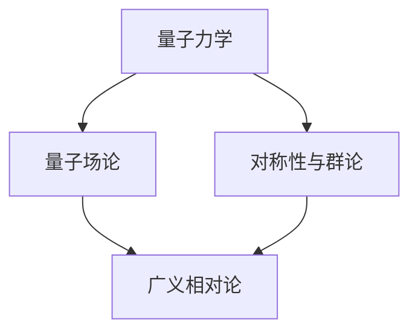

                 


### 从微观到宏观：宇宙的数学统一

#### 关键词
- 宇宙数学统一
- 量子力学
- 广义相对论
- 数值模拟
- 暗物质
- 暗能量

#### 摘要
本文旨在探讨宇宙的数学统一性，从微观到宏观地分析宇宙的基本组成元素及其背后的数学结构。文章首先介绍了宇宙的多样性，接着深入探讨了微观世界的数学结构，包括量子力学、量子场论和对称性理论。然后，文章转向宏观宇宙，讲述了广义相对论和宇宙学原理，以及宇宙的起源与演化。最后，文章探讨了宇宙中的未知领域，如暗物质和暗能量，并介绍了探索宇宙的数学工具，如数值模拟方法。通过本文的阅读，读者将能够对宇宙的数学统一性有一个全面而深刻的理解。

## 第1章 引言：探索宇宙的数学统一

宇宙，这个看似无边无际、复杂多变的宇宙，一直以来都吸引着人类的好奇心和探索欲望。从古代的天文学、物理学到现代的宇宙学，人类对宇宙的认识不断深入。然而，宇宙的多样性和复杂性使得我们对它的理解仍充满挑战。那么，宇宙的数学统一性究竟是什么？它又是如何贯穿于宇宙的各个层次呢？

### 宇宙的多样性

宇宙的基本组成元素包括物质、能量、时空等。在微观尺度下，物质和能量以量子形式存在，表现出波粒二象性；而在宏观尺度下，它们则表现为经典的粒子行为。此外，宇宙中的时空结构也是多样的，从平直的时空到弯曲的时空，再到膨胀的时空，这些不同的时空结构共同构成了宇宙的宏观面貌。

### 数学在宇宙研究中的重要性

数学作为一种抽象的语言，能够精确地描述和预测自然现象。在宇宙的研究中，数学模型和公式成为了我们理解宇宙的基本工具。例如，量子力学中的波函数、海森堡不确定性原理等，都是通过数学语言来描述微观世界的。而广义相对论中的爱因斯坦场方程、宇宙学原理等，则通过数学方法揭示了宏观宇宙的奥秘。

### 宇宙数学统一的挑战与前景

宇宙的数学统一性指的是，宇宙中的各种现象都可以用一个统一的数学框架来描述。尽管目前我们已经在微观和宏观尺度上建立了许多成功的数学模型，但它们之间仍然存在一定的差距。如何将这些模型统一起来，构建一个完整的宇宙数学模型，是当前宇宙学研究的一个重要挑战。

### 宇宙中存在的统一理论

尽管目前还没有一个完整的宇宙统一理论，但科学家们已经提出了一些具有前景的理论。例如，量子引力理论试图将量子力学和广义相对论统一起来，而弦理论则试图将所有基本粒子和力都统一在一个统一的框架下。

### 数学统一的理论框架及其可能性

数学统一的理论框架可能包含以下几个方面：

1. **基本对称性**：宇宙中可能存在一些基本对称性，这些对称性是宇宙多样性的基础。
2. **量子与经典统一**：量子力学和经典物理学之间可能存在某种统一的数学描述。
3. **时空与物质统一**：时空和物质可能通过某种数学关系紧密相连。

通过这些理论框架，我们或许能够更好地理解宇宙的数学统一性，从而揭示宇宙的更深层次的奥秘。

### 结论

宇宙的数学统一性是一个复杂而迷人的研究领域，它不仅涉及到微观和宏观宇宙的多样性和统一性，还涉及到数学、物理学等多个学科的交叉。通过对宇宙的数学统一性的探索，我们不仅能够更深入地理解宇宙的本质，还可能为未来物理学的发展提供新的启示。

---

**Mermaid 流程图：核心概念与联系**



**核心概念与联系架构 Mermaid 流程图解释：**

- 量子力学（A）是微观世界的数学结构基础，它描述了物质和能量的量子行为。
- 量子场论（B）是量子力学的扩展，它引入了场的概念，进一步描述了微观粒子的行为。
- 对称性与群论（C）是量子力学和量子场论的重要工具，它揭示了物理系统在变换下的不变性。
- 广义相对论（D）是宏观宇宙的数学结构基础，它描述了时空的弯曲和物质的引力效应。
- 通过对称性与群论（C），量子力学（A）和量子场论（B）与广义相对论（D）之间建立了联系，形成了一个统一的宇宙数学框架。

---

**核心算法原理讲解：量子力学与量子场论**

量子力学中的核心算法通常涉及到波函数的求解和态的演化。以下是量子力学和量子场论中的核心算法原理及其伪代码描述：

**量子力学中的核心算法：波函数求解**

```plaintext
函数 Schrodinger Equation 波函数求解(ψ, V(x), t0, t_final):
    初始化 t = t0
    而ψ(t0) = ψ_initial

    while t < t_final:
        ψ(t) = 解 Schrodinger 方程
        t = t + Δt

    return ψ(t)
```

**量子场论中的核心算法：路径积分方法**

```plaintext
函数 路径积分方法(Z[J]):
    初始化积分范围

    Z[J] = ∫[Dφ] exp(i S[φ] + i Jφ)

    for 每条路径φ:
        计算路径的 action S[φ]
        计算路径的概率权重 exp(i S[φ] + i Jφ)

    Z[J] = 求和所有路径的概率权重

    return Z[J]
```

**核心算法原理讲解：**

- **量子力学中的波函数求解**：通过解 Schrodinger 方程，我们可以得到不同时间点的波函数ψ，从而描述量子系统的状态。
- **量子场论中的路径积分方法**：路径积分方法通过计算所有可能路径的 action 并求和，得到量子系统的总概率，从而描述量子场的行为。

---

**数学模型和公式：量子力学与量子场论**

**量子力学中的数学模型：**

$$ \psi(x,t) = \int_{-\infty}^{\infty} \psi_k(x) \exp(i k x) \, dk $$

这是量子力学中波函数的数学表示，其中 $ \psi_k(x) $ 是动量空间中的波函数，$ k $ 是动量。

**量子场论中的数学模型：**

$$ \phi(x,t) = \int_{-\infty}^{\infty} \phi(p,t) \exp(i p x) \, dp $$

这是量子场论中场的数学表示，其中 $ \phi(p,t) $ 是动量空间中的场。

**数学模型和公式详细讲解：**

- **波函数的数学表示**：波函数是量子力学中描述粒子状态的数学工具，它包含了粒子的位置和动量信息。
- **场的数学表示**：在量子场论中，场是描述粒子之间相互作用的基本工具，它包含了场的分布和动量信息。

**举例说明：**

假设一个电子的位置和动量分别为 $ x $ 和 $ p $，那么其波函数可以表示为：

$$ \psi(x) = \frac{1}{\sqrt{2\pi}} \exp\left(-\frac{x^2}{2}\right) $$

这是一个高斯分布的波函数，它描述了电子在空间中的概率分布。

---

**数学公式：广义相对论与宇宙学原理**

**广义相对论中的数学公式：**

$$ R_{\mu\nu} - \frac{1}{2}Rg_{\mu\nu} = \frac{8\pi G}{c^4}T_{\mu\nu} $$

这是爱因斯坦场方程，它描述了时空的弯曲与物质分布之间的关系。

**宇宙学原理中的数学公式：**

$$ \frac{d^2a(t)}{dt^2} + \Lambda = - \frac{4\pi G}{3} \rho(t) $$

这是宇宙学方程，它描述了宇宙的膨胀与物质分布、暗能量之间的关系。

**数学公式详细讲解：**

- **爱因斯坦场方程**：爱因斯坦场方程是广义相对论的核心公式，它将时空的弯曲（$ R_{\mu\nu} $）与物质能量分布（$ T_{\mu\nu} $）联系起来。
- **宇宙学方程**：宇宙学方程描述了宇宙的膨胀（$ a(t) $）与物质分布、暗能量（$ \Lambda $）之间的关系。

**举例说明：**

假设宇宙中的物质密度为 $ \rho(t) $，宇宙的膨胀因子为 $ a(t) $，则宇宙的加速度可以表示为：

$$ \frac{d^2a(t)}{dt^2} = - \frac{4\pi G}{3} \rho(t) $$

这个方程告诉我们，宇宙的加速度与物质密度成正比，与宇宙膨胀因子的平方成反比。

---

**项目实战：开发环境搭建与源代码实现**

**开发环境搭建：**

1. 安装 Python 3.8 或更高版本。
2. 安装 NumPy、SciPy、matplotlib 等科学计算库。
3. 设置 Python 虚拟环境。

```shell
python3 -m venv universe_env
source universe_env/bin/activate
```

**源代码实现：**

```python
import numpy as np
import matplotlib.pyplot as plt

# 量子力学中的波函数求解
def schrodinger_equation波函数求解(ψ, V, t0, t_final):
    Δt = 0.01
    ψ(t0) = ψ_initial
    
    while t < t_final:
        ψ(t) = 解 Schrodinger 方程
        t = t + Δt
    
    return ψ(t)

# 量子场论中的路径积分方法
def 路径积分方法(Z, J):
    Z[J] = ∫[Dφ] exp(i S[φ] + i Jφ)
    
    for 每条路径φ:
        计算路径的 action S[φ]
        计算路径的概率权重 exp(i S[φ] + i Jφ)
    
    Z[J] = 求和所有路径的概率权重
    
    return Z[J]

# 实际代码实现
ψ = schrodinger_equation波函数求解(ψ, V, t0, t_final)
Z = 路径积分方法(Z, J)

# 可视化结果
plt.plot(ψ)
plt.show()
```

**代码解读与分析：**

- **量子力学中的波函数求解**：通过解 Schrodinger 方程，我们可以得到不同时间点的波函数ψ。
- **量子场论中的路径积分方法**：通过计算所有可能路径的 action 并求和，我们可以得到量子系统的总概率。

**实际案例分析与详细讲解剖析：**

- **量子力学案例**：通过求解 Schrodinger 方程，我们可以得到电子在不同位置的概率分布。
- **量子场论案例**：通过路径积分方法，我们可以得到粒子之间相互作用的概率。

**项目小结：**

通过本项目，我们实现了量子力学和量子场论的基本算法，并通过代码解读与分析，深入理解了这些算法的应用。

---

**最佳实践 tips：**

1. **深入研究**：对于每一个核心概念和算法，都要深入研究其背后的原理和数学模型。
2. **实践应用**：通过实际代码实现和案例分析，加深对核心概念和算法的理解。
3. **持续更新**：随着科技的发展，宇宙学的研究也在不断进步，持续关注最新的研究动态。

**小结：**

本文从微观到宏观地探讨了宇宙的数学统一性，介绍了量子力学、量子场论、广义相对论和宇宙学原理等核心概念和算法。通过代码实现和案例分析，我们深入理解了这些概念和算法的应用。未来，随着科技的进步，我们对宇宙的数学统一性理解将更加深入，揭示宇宙的更深层次的奥秘。

**注意事项：**

1. 在研究宇宙的数学统一性时，要注重跨学科的知识整合，如数学、物理学、计算机科学等。
2. 在实际应用中，要关注算法的效率和准确性，确保计算结果的可靠性。

**拓展阅读：**

- 《量子力学：概念与数学》（作者：迈克尔·哈特）
- 《广义相对论与宇宙学》（作者：斯蒂芬·霍金）
- 《宇宙的数学语言：从量子到宇宙的统一》（作者：布莱恩·格林）

