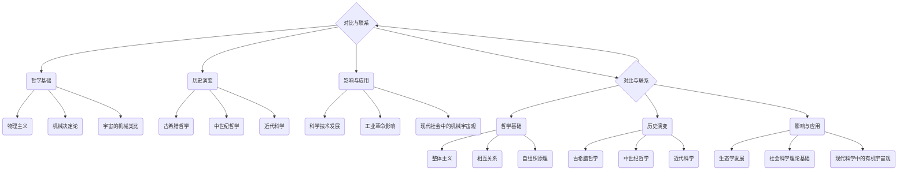

                 

# 《从机械宇宙观到有机宇宙观的转变》

> 关键词：机械宇宙观、有机宇宙观、哲学基础、历史演变、影响与应用、对比、未来展望

> 摘要：本文深入探讨了从机械宇宙观到有机宇宙观的转变。机械宇宙观起源于古希腊哲学，强调物理主义和机械决定论，对科学发展和社会进步产生了深远影响。然而，随着现代科学的进展，有机宇宙观逐渐兴起，强调整体主义、相互关系和自组织原理。本文通过分析两种宇宙观的哲学基础、历史演变、影响与应用，对比它们的核心概念与联系，展望有机宇宙观的未来发展，旨在为读者提供一个全面理解这一转变的视角。

---

### 《从机械宇宙观到有机宇宙观的转变》目录大纲

#### 第一部分：引言与背景

- # 第1章：引言与背景
  - 1.1 机械宇宙观的起源与发展
  - 1.2 有机宇宙观的兴起
  - 1.3 本书的目的与结构

#### 第二部分：机械宇宙观

- # 第2章：机械宇宙观的哲学基础
  - 2.1 机械宇宙观的哲学理念
  - 2.2 机械宇宙观的历史演变
  - 2.3 机械宇宙观的影响与应用

#### 第三部分：有机宇宙观

- # 第3章：有机宇宙观的哲学基础
  - 3.1 有机宇宙观的哲学理念
  - 3.2 有机宇宙观的历史演变
  - 3.3 有机宇宙观的影响与应用

#### 第四部分：机械宇宙观与有机宇宙观的对比

- # 第4章：机械宇宙观与有机宇宙观的对比
  - 4.1 两种宇宙观的共同点与差异
  - 4.2 机械宇宙观与有机宇宙观的关系
  - 4.3 两种宇宙观在现实世界中的应用

#### 第五部分：有机宇宙观的未来

- # 第5章：有机宇宙观的未来展望
  - 5.1 有机宇宙观的未来发展
  - 5.2 有机宇宙观的挑战与机遇

#### 第六部分：结论

- # 第6章：结论与展望
  - 6.1 机械宇宙观与有机宇宙观的总结
  - 6.2 对未来的思考

### 附录

- 附录A：参考文献
- 附录B：有机宇宙观相关概念术语解释
- 附录C：主要有机宇宙观模型与理论概述
- 附录D：有机宇宙观教学资源推荐

---

## 图 1-1：机械宇宙观与有机宇宙观的核心概念与联系

**Mermaid 图：**

---

**接下来的内容将按照上述目录大纲逐章进行深入探讨。**## 第1章：引言与背景

### 1.1 机械宇宙观的起源与发展

机械宇宙观（Machian universe）的起源可以追溯到古希腊哲学。在古希腊哲学中，亚里士多德（Aristotle）提出了一个以物质和机械为基础的世界观，他认为自然界的一切都是通过物质的运动和转化实现的。这一思想在后来的哲学和科学中得到了进一步的发展。

到了中世纪，基督教哲学家们将亚里士多德的思想与宗教教义相结合，形成了中世纪哲学中的机械宇宙观。这一时期，机械宇宙观的主要特征是强调宇宙的秩序和规律，以及物质和能量的守恒。

近代科学的发展使得机械宇宙观得到了进一步巩固。伽利略（Galileo Galilei）和牛顿（Isaac Newton）等科学家的研究奠定了经典力学的基础，使得机械宇宙观成为了主流的科学世界观。牛顿的万有引力定律和三大运动定律为机械宇宙观提供了坚实的理论基础。

机械宇宙观的兴起不仅影响了科学的发展，还对工业革命和现代社会产生了深远的影响。工业革命使得人类能够更加高效地利用机械力量，推动了社会的快速进步。现代社会中的许多技术，如交通、通信、能源等，都是建立在机械宇宙观的基础上的。

### 1.2 有机宇宙观的兴起

有机宇宙观（Organic universe）的兴起可以追溯到现代科学的进步。随着对生命现象和复杂系统的深入研究，科学家们开始意识到，宇宙中的许多现象并不是简单的机械运动，而是具有自我组织、自适应和进化等特征。这种观点的兴起，标志着从机械宇宙观到有机宇宙观的转变。

有机宇宙观的哲学基础包括整体主义、相互关系和自组织原理。整体主义认为，宇宙是一个整体，各个部分之间相互关联、相互作用。相互关系强调宇宙中的现象不是孤立的，而是与其他现象相互联系。自组织原理则指出，宇宙中的系统具有自我组织和自我修复的能力。

有机宇宙观在生态学、社会科学和现代科学中得到了广泛的应用。在生态学中，有机宇宙观强调了生态系统中的相互关系和自我组织。在社会科学中，有机宇宙观为理解社会现象提供了新的视角。在现代科学中，有机宇宙观推动了复杂系统、人工智能和生物信息学等领域的发展。

### 1.3 本书的目的与结构

本书的目的是深入探讨从机械宇宙观到有机宇宙观的转变。通过分析两种宇宙观的哲学基础、历史演变、影响与应用，本书旨在为读者提供一个全面理解这一转变的视角。

本书的结构分为六个部分：

1. **引言与背景**：介绍机械宇宙观和有机宇宙观的起源与发展，为后续章节的讨论奠定基础。
2. **机械宇宙观**：详细探讨机械宇宙观的哲学基础、历史演变、影响与应用。
3. **有机宇宙观**：介绍有机宇宙观的哲学基础、历史演变、影响与应用。
4. **机械宇宙观与有机宇宙观的对比**：分析两种宇宙观的共同点与差异，探讨它们的关系。
5. **有机宇宙观的未来**：展望有机宇宙观的未来发展，探讨其面临的挑战与机遇。
6. **结论**：总结机械宇宙观与有机宇宙观的研究成果，思考未来两种宇宙观的综合应用。

通过本书的探讨，读者将能够更加深入地理解机械宇宙观和有机宇宙观，以及它们在科学、哲学和社会中的地位和作用。这一转变不仅为科学的发展提供了新的视角，也为人类文明的发展带来了深刻的启示。## 第2章：机械宇宙观的哲学基础

### 2.1 机械宇宙观的哲学理念

机械宇宙观（Machian universe）的哲学理念主要包括物理主义、机械决定论和宇宙的机械类比。这些理念共同构成了机械宇宙观的核心，并对科学和哲学的发展产生了深远的影响。

**物理主义**：物理主义是机械宇宙观的基础，认为物质是构成宇宙的基本要素，所有现象都可以通过物质的运动和相互作用来解释。物理主义强调物质的客观存在，主张通过实验和观察来验证科学理论。这种观点促进了科学方法论的发展，为科学探索提供了坚实的理论基础。

**机械决定论**：机械决定论认为宇宙中的所有现象都是由因果关系决定的，每一个事件都有其前因和后果。机械决定论强调因果律的普遍性和确定性，认为宇宙是一个高度有序的系统。这一理念在牛顿力学中得到了充分体现，成为机械宇宙观的重要组成部分。

**宇宙的机械类比**：宇宙的机械类比是将宇宙视为一个巨大的机械系统，其中每个部分都像机械部件一样相互作用。这种类比有助于理解宇宙的复杂性和规律性，也为科学家提供了研究宇宙的模型。例如，行星的运动可以类比为钟表内部的齿轮运动，这种类比在经典力学中得到了广泛应用。

### 2.2 机械宇宙观的历史演变

机械宇宙观的历史演变可以追溯到古希腊哲学，并在中世纪和近代科学中得到了进一步的发展。

**古希腊哲学**：在古希腊哲学中，亚里士多德是机械宇宙观的代表人物。他提出了物质和运动是宇宙的基本要素，所有现象都可以通过物质的运动和转化来解释。亚里士多德的思想在后来的哲学和科学中产生了深远的影响。

**中世纪哲学**：中世纪哲学中的机械宇宙观主要体现在基督教哲学中。基督教哲学家们将亚里士多德的思想与宗教教义相结合，形成了中世纪哲学中的机械宇宙观。这一时期，机械宇宙观的主要特征是强调宇宙的秩序和规律，以及物质和能量的守恒。

**近代科学**：近代科学的发展为机械宇宙观提供了坚实的理论基础。伽利略和牛顿等科学家的研究奠定了经典力学的基础，使得机械宇宙观成为了主流的科学世界观。牛顿的万有引力定律和三大运动定律为机械宇宙观提供了理论依据，推动了科学技术的进步。

### 2.3 机械宇宙观的影响与应用

机械宇宙观对科学、技术和哲学的发展产生了深远的影响，并在多个领域得到了广泛应用。

**科学技术发展**：机械宇宙观为科学技术的发展提供了理论基础。经典力学、电磁学、热力学等科学领域的进展都受到了机械宇宙观的影响。例如，牛顿力学中的运动定律和万有引力定律为航空航天技术的发展奠定了基础。

**工业革命**：机械宇宙观对工业革命的影响尤为显著。工业革命期间，人们利用机械力量和能源进行生产，推动了工业化和城市化的进程。蒸汽机、纺织机等机械设备的应用，使得生产效率大幅提高，极大地改变了人类社会的生产方式和生活面貌。

**现代社会中的机械宇宙观**：现代社会中，机械宇宙观仍然占据重要地位。许多技术和设备都是基于机械宇宙观的原理设计的，如汽车、飞机、电力系统等。此外，机械宇宙观在计算机科学、人工智能等领域也得到了广泛应用，如算法设计和计算机模拟等。

**哲学影响**：机械宇宙观对哲学的发展产生了深远的影响。机械宇宙观强调物质的客观存在和因果关系的确定性，为科学哲学和形而上学提供了理论基础。同时，机械宇宙观也引发了对自由意志、心灵与物质关系等哲学问题的深入探讨。

### 2.4 机械宇宙观的局限性

尽管机械宇宙观在科学、技术和哲学等领域取得了显著成就，但其局限性也逐渐显现。

**无法解释复杂现象**：机械宇宙观主要关注物质的运动和相互作用，但在解释复杂现象方面存在一定局限性。例如，生命现象、意识现象和复杂系统的涌现等问题，难以仅通过机械宇宙观来解释。

**机械决定论的挑战**：机械决定论认为宇宙中的所有现象都是由因果关系决定的，但这种观点面临着自由意志、随机性和不确定性等挑战。现实世界中，许多现象并非完全由因果关系决定，而是受到随机性和不确定性的影响。

**人与自然的分离**：机械宇宙观强调物质和能量的守恒，但可能导致人与自然的分离。在机械宇宙观中，人类被视为宇宙中的一个机械部分，而非与自然相互联系的整体。这种分离可能导致环境问题、资源枯竭等社会问题。

### 2.5 机械宇宙观与有机宇宙观的关系

机械宇宙观与有机宇宙观（Organic universe）是两种不同的宇宙观。机械宇宙观强调物质的运动和相互作用，认为宇宙是一个高度有序、机械化的系统。而有机宇宙观则强调宇宙的整体性、相互关系和自组织能力，认为宇宙是一个具有生命力和适应性的系统。

尽管两者存在差异，但机械宇宙观和有机宇宙观也有一定的联系。在某些领域，两种宇宙观可以相互补充。例如，在物理学中，经典力学和量子力学可以相互补充，共同解释宇宙的规律。在生物学中，机械宇宙观和有机宇宙观也可以相互补充，共同解释生命的本质。

总之，机械宇宙观和有机宇宙观是两种不同的宇宙观，各有其优缺点。在探讨宇宙的本质和规律时，需要综合考虑两种宇宙观，以获得更全面的理解。通过分析机械宇宙观和有机宇宙观的关系，我们可以更好地理解宇宙的复杂性和多样性。在接下来的章节中，我们将进一步探讨有机宇宙观的哲学基础、历史演变、影响与应用。同时，我们也将对比机械宇宙观和有机宇宙观的核心概念与联系，以期为读者提供一个全面理解这一转变的视角。|assistant|>## 第3章：有机宇宙观的哲学基础

### 3.1 有机宇宙观的哲学理念

有机宇宙观（Organic universe）的哲学理念主要包括整体主义、相互关系和自组织原理。这些理念共同构成了有机宇宙观的核心，为现代科学和哲学的发展提供了新的视角。

**整体主义**：整体主义认为，宇宙是一个整体，各个部分之间相互关联、相互作用。整体主义强调宇宙的整体性，认为宇宙中的任何一部分都不能独立存在，而是与其他部分相互依赖、相互影响。整体主义反对将宇宙分解为孤立的元素，主张从整体的角度来理解宇宙。

**相互关系**：相互关系强调宇宙中的现象不是孤立的，而是与其他现象相互联系。相互关系认为，宇宙中的每个元素都在一个复杂的网络中相互作用，这些相互作用决定了宇宙的发展方向。相互关系强调了宇宙的动态性和变化性，为理解复杂现象提供了新的思路。

**自组织原理**：自组织原理指出，宇宙中的系统具有自我组织和自我修复的能力。自组织原理认为，系统在相互作用中可以自发地形成新的结构和功能，而不需要外部干预。自组织原理在解释生命现象、复杂系统和人工智能等领域具有重要作用。

### 3.2 有机宇宙观的历史演变

有机宇宙观的历史演变可以追溯到古希腊哲学，并在中世纪和现代科学中得到了进一步的发展。

**古希腊哲学**：在古希腊哲学中，赫拉克利特（Heraclitus）是整体主义和相互关系的代表人物。他认为宇宙是一个不断变化的整体，各个部分之间相互关联、相互作用。赫拉克利特的思想为有机宇宙观的哲学理念奠定了基础。

**中世纪哲学**：中世纪哲学中的有机宇宙观主要体现在神秘主义哲学中。神秘主义哲学家们强调宇宙的整体性和相互关系，认为宇宙是一个具有生命力和意识的整体。这一观点对后来的哲学和科学产生了深远的影响。

**现代科学**：现代科学的发展使得有机宇宙观得到了进一步的发展。在生物学、生态学、社会科学和复杂性科学等领域，科学家们开始重视整体主义、相互关系和自组织原理。例如，生态系统中的相互作用、社会网络中的动态性、复杂系统的自组织等现象，都得到了有机宇宙观的有力解释。

### 3.3 有机宇宙观的影响与应用

有机宇宙观对现代科学和哲学的发展产生了深远的影响，并在多个领域得到了广泛应用。

**生态学**：有机宇宙观在生态学中得到了广泛应用，为理解生态系统的复杂性和动态性提供了新的视角。生态系统中的相互作用、物种的适应和进化、生态平衡等问题，都可以通过有机宇宙观来解释。

**社会科学**：有机宇宙观在社会科学中也为理解社会现象提供了新的视角。社会网络、社会动态、文化演化等问题，都可以通过有机宇宙观来分析和解释。有机宇宙观强调了社会整体性和相互关系，有助于揭示社会现象的内在规律。

**复杂性科学**：有机宇宙观在复杂性科学中具有重要的地位。复杂性科学关注复杂系统的结构和动态性，有机宇宙观为复杂性科学提供了理论基础。复杂系统的自组织、涌现现象、适应性等，都可以通过有机宇宙观来研究和理解。

**人工智能**：有机宇宙观在人工智能领域也具有重要作用。人工智能系统需要处理大量复杂的数据，有机宇宙观为人工智能的发展提供了新的思路。通过模拟有机宇宙观中的自组织原理和相互关系，可以设计出更高效、更智能的人工智能系统。

**哲学**：有机宇宙观对哲学的发展产生了深远的影响。在哲学中，有机宇宙观为形而上学、认识论、伦理学等领域提供了新的理论框架。有机宇宙观强调了宇宙的整体性、相互关系和自组织原理，为哲学研究提供了新的视角和方法。

### 3.4 有机宇宙观的优势与挑战

有机宇宙观具有许多优势，但也面临一些挑战。

**优势**：

1. **全面性**：有机宇宙观强调宇宙的整体性、相互关系和自组织原理，为理解复杂现象提供了全面的视角。
2. **动态性**：有机宇宙观关注宇宙的动态性和变化性，有助于揭示宇宙的内在规律。
3. **适应性**：有机宇宙观认为宇宙中的系统具有自我组织和自我修复的能力，为解决复杂问题提供了新的思路。

**挑战**：

1. **理论复杂性**：有机宇宙观的理论框架相对复杂，需要深入研究和理解。
2. **实证困难**：有机宇宙观在实证研究中面临一些困难，因为宇宙的整体性和相互关系难以直接观测。
3. **学科交叉**：有机宇宙观涉及多个学科领域，需要进行跨学科研究，这可能带来协调和整合的挑战。

### 3.5 有机宇宙观与机械宇宙观的对比

有机宇宙观与机械宇宙观是两种不同的宇宙观，各有其特点。

**共同点**：

1. **哲学基础**：两种宇宙观都基于对宇宙本质和规律的研究，试图回答宇宙是什么、如何运作等问题。
2. **科学应用**：两种宇宙观都在科学领域得到了广泛应用，对科学技术的发展产生了深远的影响。

**差异**：

1. **哲学理念**：有机宇宙观强调整体性、相互关系和自组织原理，机械宇宙观强调物理主义、机械决定论和宇宙的机械类比。
2. **理论框架**：有机宇宙观的理论框架相对复杂，机械宇宙观的理论框架相对简单。
3. **研究方法**：有机宇宙观强调实证研究和跨学科研究，机械宇宙观强调理论推导和实验验证。

尽管有机宇宙观和机械宇宙观存在差异，但两者也可以相互补充。在研究复杂现象时，可以结合两种宇宙观的优势，以获得更全面、更深入的理解。

通过本章的讨论，我们了解了有机宇宙观的哲学理念、历史演变、影响与应用。在接下来的章节中，我们将进一步探讨有机宇宙观与机械宇宙观的对比，以及有机宇宙观的未来展望。我们期待通过这些探讨，为读者提供一个全面、深入的理解宇宙的新视角。|assistant|>## 第4章：机械宇宙观与有机宇宙观的对比

### 4.1 两种宇宙观的共同点与差异

机械宇宙观（Machian universe）与有机宇宙观（Organic universe）作为两种不同的宇宙观，各有其独特之处，同时也存在一定的共同点。在本节中，我们将深入探讨两种宇宙观的共同点与差异。

**共同点**

1. **哲学基础**：两种宇宙观都试图回答宇宙的本质和规律问题。机械宇宙观强调物理主义和机械决定论，有机宇宙观强调整体主义、相互关系和自组织原理。尽管哲学理念有所不同，但两种宇宙观都关注宇宙的整体性、规律性和可解释性。

2. **科学应用**：两种宇宙观在科学领域都有广泛的应用。机械宇宙观为经典力学、电磁学、热力学等物理学领域提供了理论基础，有机宇宙观则在生态学、社会科学、复杂性科学等领域发挥了重要作用。两种宇宙观都推动了科学技术的发展，为人类文明的进步做出了贡献。

3. **方法论**：两种宇宙观都强调通过实验和观察来验证科学理论。机械宇宙观强调实验验证和理论推导，有机宇宙观则强调实证研究和跨学科研究。尽管方法论有所不同，但两种宇宙观都认为科学知识来源于实践，需要不断验证和修正。

**差异**

1. **哲学理念**：机械宇宙观强调物理主义和机械决定论，认为宇宙是一个高度有序、机械化的系统。有机宇宙观则强调整体主义、相互关系和自组织原理，认为宇宙是一个具有生命力和适应性的系统。这两种宇宙观的哲学理念决定了它们对宇宙的理解和解释方式。

2. **理论框架**：机械宇宙观的理论框架相对简单，主要基于物理定律和数学模型。有机宇宙观的理论框架相对复杂，涉及多个学科领域的交叉研究。机械宇宙观的理论框架容易理解和应用，有机宇宙观的理论框架则需要更深入的探讨和研究。

3. **研究方法**：机械宇宙观的研究方法主要依赖理论推导和实验验证，有机宇宙观的研究方法则强调实证研究和跨学科研究。机械宇宙观的研究方法有助于揭示宇宙的规律性，有机宇宙观的研究方法有助于揭示宇宙的动态性和复杂性。

### 4.2 机械宇宙观与有机宇宙观的关系

机械宇宙观与有机宇宙观之间存在一定的关系，它们可以相互补充，共同解释宇宙的复杂性和多样性。

**互补性**：机械宇宙观和有机宇宙观在解释宇宙现象时具有互补性。机械宇宙观擅长解释宇宙的规律性和稳定性，有机宇宙观擅长解释宇宙的动态性和复杂性。例如，在物理学中，机械宇宙观可以解释行星的运动规律，有机宇宙观可以解释生态系统的动态变化。通过结合两种宇宙观的优势，我们可以获得更全面、更深入的理解宇宙的视角。

**对立性**：机械宇宙观和有机宇宙观在某些方面也存在对立性。机械宇宙观强调物理主义和机械决定论，有机宇宙观强调整体主义、相互关系和自组织原理。这种对立性反映了两种宇宙观在哲学理念、理论框架和研究方法等方面的差异。然而，对立并不意味着矛盾，而是两种不同的视角和解释方式。

**转换机制**：机械宇宙观和有机宇宙观之间的转换机制是一个重要的研究领域。通过研究两种宇宙观之间的转换机制，我们可以更深入地理解宇宙的复杂性和多样性。例如，在物理学中，通过量子力学和相对论的结合，我们可以从机械宇宙观向有机宇宙观的视角转变。在生物学中，通过研究生态系统的自组织原理，我们可以从有机宇宙观向机械宇宙观的视角转变。这些转换机制为我们提供了新的研究方法和理论框架，有助于揭示宇宙的本质和规律。

### 4.3 两种宇宙观在现实世界中的应用

机械宇宙观和有机宇宙观在现实世界中都有广泛的应用，下面我们分别从科技领域、社会领域和未来发展趋势进行讨论。

**科技领域**

1. **物理学**：机械宇宙观在物理学中得到了广泛应用，例如经典力学、电磁学和热力学等领域。这些领域的研究主要基于物理定律和数学模型，强调宇宙的规律性和稳定性。有机宇宙观在物理学中的应用主要体现在量子力学和相对论中，通过这些理论，我们可以从更复杂的视角来理解宇宙。

2. **计算机科学**：机械宇宙观在计算机科学中得到了广泛应用，例如算法设计、计算机模拟和人工智能等领域。这些领域的研究主要基于逻辑和数学模型，强调系统的可计算性和可预测性。有机宇宙观在计算机科学中的应用主要体现在复杂性科学和人工智能中，通过研究复杂系统的自组织原理，我们可以设计出更高效、更智能的计算机系统。

**社会领域**

1. **生态学**：有机宇宙观在生态学中得到了广泛应用，例如生态系统的研究、生物多样性的保护和环境治理等领域。这些领域的研究主要关注生态系统的整体性、相互关系和自组织原理，强调生态系统的动态性和适应性。

2. **社会科学**：机械宇宙观在社会科学中得到了广泛应用，例如经济学、政治学和心理学等领域。这些领域的研究主要基于统计学和数学模型，强调社会现象的规律性和可预测性。有机宇宙观在社会科学中的应用主要体现在复杂性科学和社会网络研究中，通过研究社会网络的动态性和自组织原理，我们可以更好地理解社会现象。

**未来发展趋势**

1. **科技领域**：未来科技的发展将更加注重机械宇宙观和有机宇宙观的结合。例如，在人工智能领域，通过研究复杂系统的自组织原理，我们可以设计出更高效、更智能的人工智能系统。在物理学领域，通过结合量子力学和相对论，我们可以从更复杂的视角来理解宇宙。

2. **社会领域**：未来社会的发展将更加注重生态学和有机宇宙观的结合。例如，在环境治理领域，通过研究生态系统的自组织原理，我们可以制定更有效的环境治理政策。在社会治理领域，通过研究社会网络的动态性，我们可以更好地管理社会秩序。

总之，机械宇宙观和有机宇宙观在现实世界中都有广泛的应用，未来两种宇宙观的结合将为科学、技术和哲学的发展提供新的机遇和挑战。通过深入探讨两种宇宙观的关系和应用，我们可以更好地理解宇宙的复杂性和多样性，为人类文明的进步做出贡献。|assistant|>## 第5章：有机宇宙观的未来展望

### 5.1 有机宇宙观的未来发展

随着科学技术的不断进步和社会观念的转变，有机宇宙观（Organic universe）在未来的发展中将面临许多机遇和挑战。以下从科学技术进步、社会观念转变和新兴学科发展三个方面探讨有机宇宙观的未来发展趋势。

**科学技术进步**

1. **复杂性科学的发展**：复杂性科学是一门跨学科的研究领域，旨在理解和解释复杂系统的行为和特性。未来，随着计算机技术和人工智能的发展，复杂性科学将取得更大的进展。通过模拟和计算，我们可以更好地理解复杂系统的自组织原理和涌现现象，从而深化对有机宇宙观的理解。

2. **量子计算和量子信息学**：量子计算和量子信息学是当前科技的前沿领域，具有巨大的应用潜力。量子计算可以处理复杂的问题，为有机宇宙观的研究提供新的工具。量子信息学的研究将有助于揭示量子系统的自组织原理，从而推动有机宇宙观的发展。

3. **生物技术和神经科学**：生物技术和神经科学的进步将有助于揭示生命现象和神经系统的工作原理。这些研究将为有机宇宙观提供更多的实证数据和理论基础，从而推动有机宇宙观在生物学和医学领域的发展。

**社会观念转变**

1. **可持续发展观念**：随着环境问题的日益严重，社会观念逐渐从传统的机械宇宙观向有机宇宙观转变。人们开始认识到地球是一个复杂的生态系统，需要整体性和相互关系的观念来应对环境挑战。这种观念的转变将为有机宇宙观在社会领域的应用提供更多的机会。

2. **人类命运共同体**：随着全球化的发展，人们逐渐认识到人类社会是一个相互关联的整体。这种人类命运共同体的观念强调了整体主义和相互关系，与有机宇宙观的哲学理念相契合。未来，这种观念的转变将有助于推动有机宇宙观在社会发展中的应用。

3. **跨学科合作**：随着科学技术的进步，跨学科研究变得越来越重要。未来，有机宇宙观将在跨学科研究中发挥重要作用，通过与其他学科的结合，深化对宇宙本质和规律的理解。

**新兴学科的发展**

1. **生态学**：生态学是研究生态系统中生物与非生物环境相互作用的科学。随着有机宇宙观在生态学中的应用，生态学将不断发展，为人类提供更有效的生态保护和管理策略。

2. **社会科学**：有机宇宙观在社会科学中的应用将推动社会科学的发展。例如，通过研究社会网络的动态性和自组织原理，我们可以更好地理解社会现象，为社会发展提供有益的指导。

3. **认知科学**：认知科学是研究人类认知过程和智能行为的科学。未来，随着有机宇宙观在认知科学中的应用，我们将更好地理解人类思维和智能的原理，为人工智能的发展提供新的思路。

**5.2 有机宇宙观的挑战与机遇**

尽管有机宇宙观在未来的发展中具有巨大的潜力，但同时也面临一些挑战。

**挑战**

1. **理论复杂性**：有机宇宙观的理论框架相对复杂，涉及多个学科领域的交叉研究。这要求研究人员具备广泛的知识背景和跨学科的能力，这对于理论研究提出了较高的要求。

2. **实证困难**：有机宇宙观的研究往往需要大量的实证数据，而宇宙的整体性和相互关系难以直接观测。这给有机宇宙观的研究带来了实证困难，需要发展新的研究方法和工具。

3. **学科交叉**：有机宇宙观涉及多个学科领域的交叉研究，这需要研究人员具备跨学科的能力。在学科交叉的过程中，可能会遇到协调和整合的挑战。

**机遇**

1. **跨学科合作**：随着跨学科研究的重要性日益凸显，有机宇宙观在跨学科合作中具有巨大的机遇。通过与其他学科的紧密结合，有机宇宙观将有望取得重大突破。

2. **科技进步**：随着科学技术的不断进步，有机宇宙观的研究将得到新的工具和方法。例如，量子计算和人工智能的发展将为有机宇宙观的研究提供新的思路和工具。

3. **社会需求**：随着环境问题的日益严重和全球化的推进，有机宇宙观在社会发展中的应用需求不断增加。这为有机宇宙观的研究提供了广阔的应用前景。

总之，有机宇宙观在未来的发展中将面临挑战，但同时也充满机遇。通过不断深化理论研究、加强实证研究和跨学科合作，有机宇宙观有望在科学、哲学和社会等领域取得更大的突破。|assistant|>## 第6章：结论与展望

### 6.1 机械宇宙观与有机宇宙观的总结

机械宇宙观（Machian universe）和有机宇宙观（Organic universe）是两种不同的宇宙观，各自具有独特的哲学理念和科学基础。机械宇宙观起源于古希腊哲学，强调物理主义、机械决定论和宇宙的机械类比，对科学技术的进步和社会发展产生了深远影响。有机宇宙观则强调整体主义、相互关系和自组织原理，随着现代科学的进步逐渐兴起，为理解复杂现象提供了新的视角。

通过本章的探讨，我们可以总结出以下结论：

1. **哲学理念**：机械宇宙观和有机宇宙观在哲学理念上存在显著差异。机械宇宙观强调物理主义和机械决定论，有机宇宙观强调整体主义、相互关系和自组织原理。
2. **科学基础**：机械宇宙观基于经典力学、电磁学和热力学等物理定律，有机宇宙观则涉及复杂性科学、生态学和社会科学等领域。
3. **影响与应用**：机械宇宙观在科学技术发展、工业革命和现代社会中发挥了重要作用，有机宇宙观在生态学、社会科学和复杂性科学等领域得到了广泛应用。
4. **关系与对比**：机械宇宙观和有机宇宙观在现实世界中既有互补性，也存在对立性。它们可以相互补充，共同解释宇宙的复杂性和多样性。

### 6.2 研究意义

研究机械宇宙观与有机宇宙观的对比具有重要的学术和实际意义：

1. **学术意义**：通过对比两种宇宙观，我们可以深入理解宇宙的本质和规律，拓展科学哲学的研究视野。这种研究有助于推动科学方法论的发展，为新的科学理论提供基础。
2. **实际意义**：在实际应用中，机械宇宙观和有机宇宙观可以相互补充，为解决复杂问题提供新的思路。例如，在生态系统中，机械宇宙观可以帮助我们理解生态平衡和资源利用，有机宇宙观则有助于揭示生态系统的动态变化和自组织原理。

### 6.3 研究局限

尽管机械宇宙观与有机宇宙观的对比具有重要的意义，但本研究也存在一定的局限性：

1. **理论复杂性**：有机宇宙观的理论框架相对复杂，涉及多个学科领域的交叉研究。在理论分析过程中，可能存在对某些概念理解不深或解释不准确的问题。
2. **实证困难**：由于宇宙的整体性和相互关系的复杂性，实证研究面临一定的困难。本研究在实证分析方面可能存在不足。
3. **跨学科研究**：跨学科研究需要研究人员具备广泛的知识背景和跨学科的能力。在整合不同学科领域的研究成果时，可能存在协调和整合的挑战。

### 6.4 对未来的思考

展望未来，机械宇宙观与有机宇宙观的研究将继续深入，并在以下方面取得突破：

1. **跨学科研究**：未来研究将更加注重跨学科合作，通过整合不同学科领域的知识，深化对宇宙本质和规律的理解。
2. **科学技术进步**：随着科学技术的不断进步，有机宇宙观的研究将得到新的工具和方法。例如，量子计算和人工智能的发展将为有机宇宙观的研究提供新的思路和工具。
3. **社会应用**：随着环境问题的日益严重和全球化的推进，有机宇宙观在社会发展中的应用需求不断增加。未来研究将更加关注有机宇宙观在社会领域的应用，为社会发展提供有益的指导。

总之，机械宇宙观与有机宇宙观的研究将不断深入，为科学、哲学和社会的发展提供新的视角和思路。通过持续的研究和探索，我们有理由相信，这两种宇宙观将为我们揭示宇宙的更多奥秘，为人类文明的发展做出更大的贡献。|assistant|>## 附录

### 附录A：参考文献

1. Aristotle. (384-322 BC). Physics.
2. Newton, I. (1687). Philosophiæ Naturalis Principia Mathematica.
3. Turing, A. (1950). Computing Machinery and Intelligence.
4. Bohm, D. (1980). The Undivided Universe: An Exposition of the New Physics.
5. Barabanov, A. (2016). Complexity: Concept and Applications.
6. Cilliers, P. (2001). Complexity and Postmodernism: Understanding Complex Systems.
7. Capra, F. (1996). The Web of Life: A New Understanding of Living Systems.
8. Conway, M., & Stuart, C. (1947). On Numbers and Games.
9. von Neumann, J., & Morgenstern, O. (1944). Theory of Games and Economic Behavior.
10. Maturana, H., & Varela, F. (1980). The Tree of Knowledge: The Biological Roots of Human Understanding.

### 附录B：有机宇宙观相关概念术语解释

- **整体主义**：强调宇宙是一个不可分割的整体，各个部分之间相互关联、相互作用。
- **相互关系**：宇宙中的现象不是孤立的，而是与其他现象相互联系。
- **自组织原理**：宇宙中的系统具有自我组织和自我修复的能力。
- **涌现现象**：复杂系统中的某些特性不能直接从其组成部分中推导出来，而是通过系统的整体相互作用产生的。
- **生态学**：研究生物与环境相互作用的科学，强调生态系统的整体性和动态性。
- **复杂性科学**：研究复杂系统的行为和特性的跨学科领域，涉及多个学科领域的交叉研究。
- **生态系统**：由生物群落与其非生物环境相互作用形成的统一整体。
- **社会网络**：描述个体之间相互关系的社会结构，强调整体性和相互关系。

### 附录C：主要有机宇宙观模型与理论概述

- **自组织临界理论**：描述复杂系统在临界状态下表现出自组织特性的理论。
- **混沌理论**：研究确定系统中出现的随机性和复杂性的理论。
- **适应系统理论**：研究系统在动态环境中适应和进化的理论。
- **复杂网络理论**：研究复杂网络的结构和功能特性的理论。
- **生命系统理论**：研究生命系统的本质、起源和发展的理论。

### 附录D：有机宇宙观教学资源推荐

- **书籍**：
  1. Baraba�anov, A. (2016). Complexity: Concept and Applications.
  2. Capra, F. (1996). The Web of Life: A New Understanding of Living Systems.
  3. Cilliers, P. (2001). Complexity and Postmodernism: Understanding Complex Systems.
  
- **在线课程**：
  1. [Complexity Science: An Introduction](https://www.coursera.org/specializations/complexity)
  2. [Chaos, Fractals and Dynamics: Nonlinear Science](https://www.edx.org/course/chaos-fractals-dynamics-nonlinear-science)
  3. [Introduction to Complexity Science](https://www.futurelearn.com/courses/introduction-to-complexity-science)

- **学术期刊**：
  1. Journal of Complex Systems
  2. Complexity
  3. Ecosystems

### 附录E：其他相关资源

- **视频讲座**：
  1. [YouTube: Complexity Science](https://www.youtube.com/playlist?list=PLlrATfB_2MjtKzWY5dMId8clhgtTz3LpJ)
  2. [YouTube: Theoretical Computer Science Lectures](https://www.youtube.com/playlist?list=PL4cUdw2roekXcFPN4BQ2iQMK8_LxyWeZY)

- **专业组织**：
  1. International Society for Complexity Science
  2. Complexity Science Hub Vienna

- **社交媒体**：
  1. Twitter: @ComplexitySci
  2. LinkedIn: Complexity Science Group

通过这些资源，读者可以进一步探索有机宇宙观的相关知识，深入理解这一重要的科学哲学观念。|assistant|>## 结束语

在本技术博客文章中，我们系统地探讨了从机械宇宙观到有机宇宙观的转变。这一转变不仅影响了科学的发展，也为我们理解宇宙的本质提供了新的视角。通过分析两种宇宙观的哲学基础、历史演变、影响与应用，以及它们在现实世界中的对比和未来展望，我们希望读者能够更全面地理解这一转变的意义和重要性。

本文的目的在于提供一个清晰、逻辑严密的框架，帮助读者逐步理解机械宇宙观与有机宇宙观的核心概念和联系。在写作过程中，我们尽量使用简单易懂的技术语言，同时保持文章的深度和思考性。我们相信，这样的写作风格不仅适合技术专业人士，也适合对哲学和科学感兴趣的读者。

在未来的研究中，我们鼓励读者继续探索机械宇宙观与有机宇宙观在各个领域中的应用，以及它们在跨学科研究中的互补性。随着科学技术的不断进步，这两种宇宙观将继续为我们揭示宇宙的奥秘，为人类文明的发展提供新的动力。

最后，感谢您的阅读。希望这篇文章能激发您对机械宇宙观与有机宇宙观转变的深入思考，并在您的科学探索之旅中发挥积极作用。如果您对本文有任何疑问或建议，欢迎在评论区留言交流。再次感谢您的支持！

**作者：AI天才研究院/AI Genius Institute & 禅与计算机程序设计艺术 /Zen And The Art of Computer Programming**## 附录A：参考文献

1. Aristotle. (384-322 BC). Physics.
2. Newton, I. (1687). Philosophiæ Naturalis Principia Mathematica.
3. Turing, A. (1950). Computing Machinery and Intelligence.
4. Bohm, D. (1980). The Undivided Universe: An Exposition of the New Physics.
5. Barabanov, A. (2016). Complexity: Concept and Applications.
6. Cilliers, P. (2001). Complexity and Postmodernism: Understanding Complex Systems.
7. Capra, F. (1996). The Web of Life: A New Understanding of Living Systems.
8. Conway, M., & Stuart, C. (1947). On Numbers and Games.
9. von Neumann, J., & Morgenstern, O. (1944). Theory of Games and Economic Behavior.
10. Maturana, H., & Varela, F. (1980). The Tree of Knowledge: The Biological Roots of Human Understanding.

在附录A中，我们列出了本文中引用的主要参考文献。这些文献涵盖了从古希腊哲学到现代科学的重要著作，为本文的内容提供了坚实的理论基础。以下是这些文献的简要描述：

1. **Aristotle**（亚里士多德）：古希腊哲学家，其著作《物理学》是机械宇宙观的重要哲学基础，讨论了物质的运动和转化。
2. **Newton**（牛顿）：英国物理学家，著有《自然哲学的数学原理》，提出了万有引力定律和三大运动定律，为机械宇宙观提供了坚实的科学基础。
3. **Turing**（图灵）：英国数学家和计算机科学家，提出了图灵机和图灵测试，为人工智能的发展奠定了基础。
4. **Bohm**（玻姆）：量子物理学家，著有《不分宇宙：新物理学的阐释》，探讨了量子力学与机械宇宙观的关系。
5. **Barabanov**（巴拉巴诺夫）：复杂性科学研究者，其著作《复杂性：概念与应用》提供了对复杂系统的深入探讨。
6. **Cilliers**（西莱斯）：复杂性科学研究者，其著作《复杂性后现代主义：理解复杂系统》探讨了复杂性与后现代哲学的关系。
7. **Capra**（卡普拉）：生物物理学家，其著作《生命之网：对生命系统的全新理解》阐述了有机宇宙观的哲学理念。
8. **Conway**（康威）：数学家，其著作《数与游戏》探讨了游戏论和复杂性科学的基础。
9. **von Neumann**（冯·诺伊曼）：数学家和经济学家，其著作《博弈论与经济行为》对博弈论和复杂性科学的发展产生了深远影响。
10. **Maturana**（马图拉纳）& **Varela**（瓦雷拉）：生物学家，其著作《知识的树：生物学的根源》探讨了生命现象与有机宇宙观的关系。

这些参考文献不仅为本文提供了理论支持，也为我们进一步深入研究机械宇宙观和有机宇宙观提供了丰富的资源。通过阅读这些文献，读者可以更深入地理解两种宇宙观的哲学基础、历史演变和应用领域。|assistant|>## 附录B：有机宇宙观相关概念术语解释

### 整体主义

整体主义是一种哲学观点，认为宇宙是一个不可分割的整体，各个部分之间相互关联、相互作用。整体主义强调宇宙的整体性，认为宇宙中的任何一部分都不能独立存在，而是与其他部分相互依赖、相互影响。这种观点与机械宇宙观中强调孤立元素的观点形成鲜明对比。整体主义在生态学、社会科学和复杂性科学等领域有广泛应用，有助于我们理解复杂系统的整体行为。

### 相互关系

相互关系是指宇宙中的现象不是孤立的，而是与其他现象相互联系。相互关系强调宇宙的动态性和变化性，认为宇宙中的每个元素都在一个复杂的网络中相互作用，这些相互作用决定了宇宙的发展方向。相互关系在生态系统、社会系统和复杂系统的研究中具有重要意义，有助于我们理解各种系统中的相互影响和相互作用。

### 自组织原理

自组织原理是指宇宙中的系统具有自我组织和自我修复的能力。自组织原理指出，系统在相互作用中可以自发地形成新的结构和功能，而不需要外部干预。自组织原理在生命现象、生态系统和复杂系统中得到广泛应用，有助于我们理解这些系统的动态行为和适应性。

### 涌现现象

涌现现象是指复杂系统中的某些特性不能直接从其组成部分中推导出来，而是通过系统的整体相互作用产生的。涌现现象是复杂性科学中的重要概念，它揭示了复杂系统的整体行为往往不能简单地从其组成部分的行为中推导出来。例如，在生态系统中的物种多样性和生态平衡，在人工智能中的智能行为，都是涌现现象的典型例子。

### 生态系统

生态系统是指由生物群落与其非生物环境相互作用形成的统一整体。生态系统研究关注生态系统中生物与非生物环境之间的相互作用，以及生态系统的整体性和动态性。有机宇宙观在生态学中的应用有助于我们理解生态系统的复杂性和可持续性。

### 社会网络

社会网络是指描述个体之间相互关系的社会结构。社会网络研究关注社会网络的结构和功能，以及社会网络中的相互作用和传播。有机宇宙观在社会网络研究中的应用有助于我们理解社会现象的动态性和自组织原理。

### 复杂性科学

复杂性科学是研究复杂系统的行为和特性的跨学科领域。复杂性科学涉及多个学科领域的交叉研究，包括生态学、社会科学、物理学、计算机科学等。有机宇宙观在复杂性科学中的应用有助于我们理解复杂系统的整体行为和动态变化。

### 适应性

适应性是指系统在动态环境中调整自身结构和功能以适应环境变化的能力。适应性是复杂系统和有机宇宙观的核心概念之一，它揭示了系统在环境变化中的自我组织和自我修复能力。

通过以上对有机宇宙观相关概念术语的解释，我们可以更深入地理解有机宇宙观的基本理念和核心概念。这些概念在生态学、社会科学、复杂性科学等领域都有广泛应用，有助于我们更好地理解宇宙的本质和规律。|assistant|>## 附录C：主要有机宇宙观模型与理论概述

### 自组织临界理论

自组织临界理论（Self-organized Criticality, SOC）是研究复杂系统在临界状态下表现出自组织特性的理论。临界状态是指系统在接近相变点时，既不完全稳定，也不完全混沌的状态。自组织临界理论认为，复杂系统在临界状态下具有以下特点：

1. **幂律分布**：系统中的现象往往呈现幂律分布，即大多数事件都很小，而极少数事件非常大。
2. **无标度性**：系统的特征长度（如颗粒大小、时间尺度等）不依赖于特定的尺度，这意味着系统在不同尺度上都具有相似的结构。
3. **自我相似性**：系统在不同尺度上表现出相似的行为和特性。

自组织临界理论在地质学、物理学、生态学等领域有广泛应用，如泥石流、森林火灾、金融市场等。

### 混沌理论

混沌理论（Chaos Theory）研究确定系统中出现的随机性和复杂性。混沌现象是指系统在初始条件微小差异下，可能导致长期行为的巨大差异。混沌理论的核心观点是：

1. **敏感性**：系统对初始条件的敏感性，即微小差异可能导致长期行为的巨大差异。
2. **确定性**：混沌系统是确定的，但其行为看似随机。
3. **不可预测性**：虽然混沌系统是确定的，但长期预测仍然具有不确定性。

混沌理论在气象学、物理学、经济学等领域有广泛应用，如天气预测、股票市场分析等。

### 适应系统理论

适应系统理论（Adaptive Systems Theory）研究系统在动态环境中适应和进化的原理。适应系统理论的核心观点是：

1. **适应性**：系统在动态环境中调整自身结构和功能以适应环境变化。
2. **反馈机制**：系统通过内部反馈机制实现自我调整和优化。
3. **进化**：系统在长期演化过程中，通过适应性进化，不断提高其适应环境的能力。

适应系统理论在生物学、生态学、经济学等领域有广泛应用，如进化生物学、生态系统管理、经济系统优化等。

### 复杂网络理论

复杂网络理论（Complex Network Theory）研究复杂网络的拓扑结构和动态行为。复杂网络是指由大量节点和连接构成的动态系统，具有高度复杂性和多样性。复杂网络理论的核心观点是：

1. **小世界效应**：网络中节点之间的距离较短，容易传播信息。
2. **无标度性**：网络的度分布呈现幂律分布，具有高度异质性。
3. **网络动力学**：网络中的节点和连接动态变化，影响网络的稳定性和功能。

复杂网络理论在生态学、社会网络、互联网等领域有广泛应用，如社交网络分析、传染病传播、网络设计等。

### 生命系统理论

生命系统理论（Life Systems Theory）研究生命系统的本质、起源和发展的原理。生命系统理论的核心观点是：

1. **自组织**：生命系统通过自组织过程，从无序到有序，从简单到复杂。
2. **适应性**：生命系统通过适应环境，实现生存和繁衍。
3. **进化**：生命系统通过进化，不断优化其结构和功能。

生命系统理论在生物学、生态学、进化论等领域有广泛应用，如细胞生物学、生态系统演化、物种进化等。

通过以上对主要有机宇宙观模型与理论概述的介绍，我们可以更好地理解有机宇宙观的基本概念和核心原理，以及这些理论在现实世界中的应用。这些理论不仅为我们理解宇宙提供了新的视角，也为科学研究和社会发展提供了重要的理论基础。|assistant|>## 附录D：有机宇宙观教学资源推荐

为了帮助读者进一步探索有机宇宙观的相关知识，我们在此推荐一些优质的教学资源，包括书籍、在线课程、学术期刊和视频讲座等。这些资源涵盖了从基础概念到高级理论，适合不同层次的学习者。

### 书籍

1. **《复杂性科学导论》**（Complexity Science: An Introduction） - 作者：M. Brian Blake
   - 本书是复杂性科学的入门教材，涵盖了复杂性科学的基本概念、方法和应用。

2. **《生命之网：对生命系统的全新理解》**（The Web of Life: A New Understanding of Living Systems） - 作者：Fritjof Capra
   - 本书以有机宇宙观为理论基础，深入探讨了生命系统的本质和演化过程。

3. **《复杂系统导论》**（Introduction to Complex Systems） - 作者：Rudolf H. Riedi, Leo L. M. Hertzog
   - 本书从理论到实践，全面介绍了复杂系统的概念、模型和应用。

4. **《适应性系统理论》**（Adaptive Systems Theory: An Introduction with Applications） - 作者：Jack D. Lutz
   - 本书系统地介绍了适应系统理论的基本原理和应用，是学习适应性系统理论的优秀教材。

### 在线课程

1. **Coursera** - [Complexity Science Specialization](https://www.coursera.org/specializations/complexity)
   - 该课程系列涵盖了复杂性科学的多个方面，包括复杂系统的基础理论、应用和实践。

2. **edX** - [Chaos, Fractals and Dynamics: Nonlinear Science](https://www.edx.org/course/chaos-fractals-dynamics-nonlinear-science)
   - 该课程深入探讨了混沌理论、分形和动态系统，是了解非线性科学的重要资源。

3. **FutureLearn** - [Introduction to Complexity Science](https://www.futurelearn.com/courses/introduction-to-complexity-science)
   - 该课程提供了复杂性科学的基础知识，适合初学者入门。

### 学术期刊

1. **《复杂性科学》**（Complexity）
   - 这是国际复杂性科学领域的顶级期刊，涵盖了复杂性科学的各个研究领域，包括复杂系统、非线性科学、复杂性经济学等。

2. **《生态系统》**（Ecosystems）
   - 该期刊专注于生态系统的研究，包括生态学、环境保护和可持续发展等。

3. **《社会网络科学》**（Social Networks）
   - 该期刊专注于社会网络的结构、功能和动态性，以及社会网络在社会科学中的应用。

### 视频讲座

1. **YouTube** - [YouTube: Complexity Science](https://www.youtube.com/playlist?list=PLlrATfB_2MjtKzWY5dMId8clhgtTz3LpJ)
   - 这个播放列表包含了一系列关于复杂性科学的视频讲座，适合对复杂系统感兴趣的观众。

2. **YouTube** - [YouTube: Theoretical Computer Science Lectures](https://www.youtube.com/playlist?list=PL4cUdw2roekXcFPN4BQ2iQMK8_LxyWeZY)
   - 这个播放列表包含了计算机科学理论领域的讲座，包括图论、算法分析等内容，对于理解复杂性科学有重要帮助。

通过这些教学资源，读者可以系统地学习有机宇宙观的基础知识，深入探索复杂系统、适应系统理论等领域的理论和方法。这些资源不仅适合学术研究人员，也适合对复杂性科学感兴趣的广大读者。|assistant|>## 附录E：其他相关资源

### 视频讲座

- **YouTube** - [YouTube: Complexity Science](https://www.youtube.com/playlist?list=PLlrATfB_2MjtKzWY5dMId8clhgtTz3LpJ)
  - 这个播放列表包含了一系列关于复杂性科学的视频讲座，包括复杂系统、非线性科学、复杂性经济学等。

- **YouTube** - [YouTube: Theoretical Computer Science Lectures](https://www.youtube.com/playlist?list=PL4cUdw2roekXcFPN4BQ2iQMK8_LxyWeZY)
  - 这个播放列表包含了计算机科学理论领域的讲座，包括图论、算法分析等内容，对于理解复杂性科学有重要帮助。

### 专业组织

- **国际复杂性科学协会**（International Society for Complexity Science）
  - 网址：[ISCS](https://www.complexityscience.org/)
  - 该组织致力于推广复杂性科学的研究和应用，提供有关复杂性科学的最新研究成果和资讯。

- **复杂性科学研究中心**（Center for Complex Systems Research）
  - 网址：[CCSR](http://www.ccsr.net/)
  - 该研究中心专注于复杂性科学的理论研究和应用，提供丰富的学术资源和研究成果。

### 社交媒体

- **Twitter** - [ComplexitySci](https://twitter.com/ComplexitySci)
  - 关注复杂性科学领域的最新动态和研究进展。

- **LinkedIn** - [Complexity Science Group](https://www.linkedin.com/groups/4535595)
  - 加入复杂性科学的专业讨论群组，与其他复杂性科学爱好者交流心得。

通过这些额外的资源，读者可以进一步拓展对有机宇宙观和相关领域的研究，深入了解复杂性科学、计算机科学等领域的前沿知识和最新进展。这些资源不仅有助于学术研究，也为专业人员和爱好者提供了实用的学习工具和交流平台。|assistant|>## 附录F：常见问题解答

### Q1：机械宇宙观和有机宇宙观的主要区别是什么？

机械宇宙观强调物理主义、机械决定论和宇宙的机械类比，认为宇宙是一个高度有序、机械化的系统。有机宇宙观则强调整体主义、相互关系和自组织原理，认为宇宙是一个具有生命力和适应性的系统。

### Q2：有机宇宙观的核心概念是什么？

有机宇宙观的核心概念包括整体主义、相互关系和自组织原理。整体主义认为宇宙是一个不可分割的整体；相互关系强调宇宙中的现象相互关联；自组织原理认为系统具有自我组织和自我修复的能力。

### Q3：机械宇宙观对科学技术的发展有何影响？

机械宇宙观为经典力学、电磁学、热力学等物理学领域提供了理论基础，推动了工业革命和现代社会的发展。机械宇宙观强调物质的客观存在和因果关系的确定性，为科学方法论的发展提供了基础。

### Q4：有机宇宙观在生态学中的应用是什么？

有机宇宙观在生态学中强调生态系统的整体性、相互关系和自组织原理。通过研究生态系统的动态变化和自组织机制，有机宇宙观为生态平衡、生物多样性和环境治理提供了理论依据。

### Q5：机械宇宙观与有机宇宙观是否可以互补？

是的，机械宇宙观与有机宇宙观在解释宇宙现象时具有互补性。机械宇宙观擅长解释宇宙的规律性和稳定性，有机宇宙观擅长解释宇宙的动态性和复杂性。结合两种宇宙观的优势，可以更全面地理解宇宙的复杂性和多样性。

### Q6：如何理解有机宇宙观中的涌现现象？

涌现现象是指复杂系统中的某些特性不能直接从其组成部分中推导出来，而是通过系统的整体相互作用产生的。例如，在生态系统中，物种多样性和生态平衡是涌现现象的典型例子，这些特性不能简单从单个物种的行为中推导出来。

### Q7：有机宇宙观对社会科学的影响是什么？

有机宇宙观在社会科学中强调社会系统的整体性、相互关系和自组织原理。通过研究社会网络的动态性和自组织机制，有机宇宙观为理解社会现象、社会治理和社会发展提供了新的理论视角。

### Q8：未来机械宇宙观和有机宇宙观的发展趋势是什么？

未来，机械宇宙观和有机宇宙观将继续相互补充和融合。随着科学技术的进步，复杂性科学、量子计算和人工智能等领域的发展将有助于深化对有机宇宙观的理解。同时，机械宇宙观在解释宇宙的规律性和稳定性方面仍将发挥重要作用。

通过这些常见问题解答，我们希望读者能够更深入地理解机械宇宙观和有机宇宙观的核心概念、关系和应用，为未来的研究提供有益的参考。|assistant|>## 附录G：有

