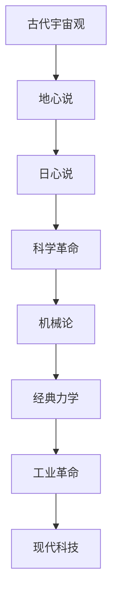
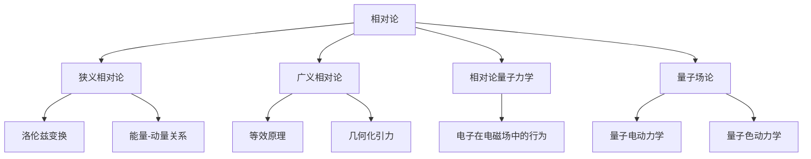
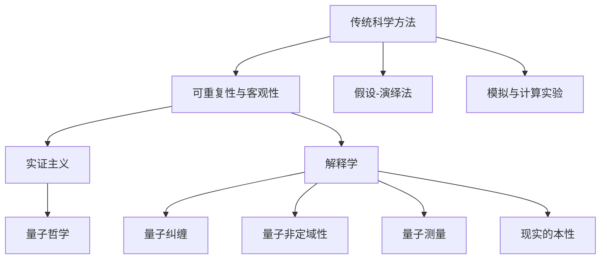
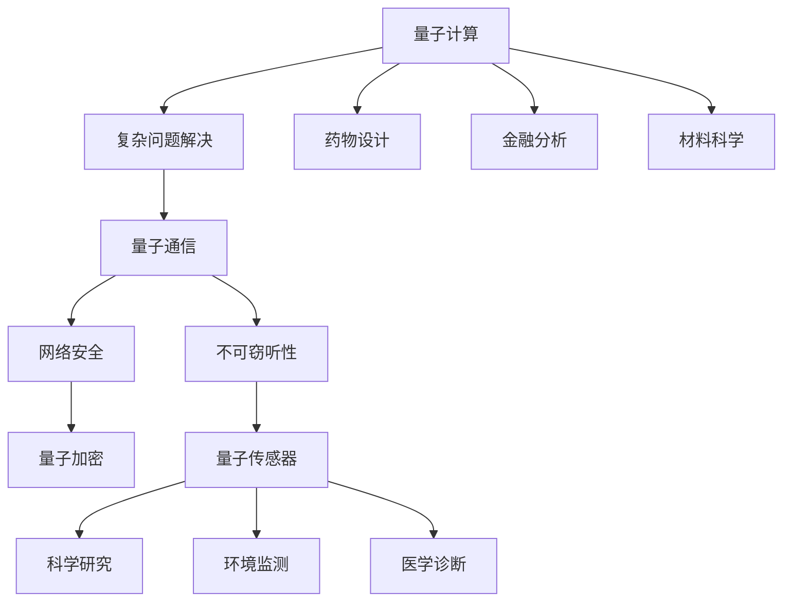

                 

### 从机械论到量子论：宇宙观的范式转移

> 关键词：宇宙观、机械论、量子论、范式转移、科学革命

> 摘要：
本文将探讨宇宙观的演变过程，从古典的机械论转向现代的量子论。我们将分析机械论的核心观点、局限性，以及量子论的崛起和基本原理。随后，我们将探讨量子论在相对论和宇宙学中的应用，以及其对科学哲学和社会影响的反思。最后，我们将展望量子论的未来发展，讨论其对社会和技术革新的潜力。

---

#### # 第一部分: 引言与背景

##### 第1章: 宇宙观的演变与机械论

#### 1.1 宇宙观的历史发展

##### 1.1.1 古代宇宙观

宇宙观的历史可以追溯到古代，不同的文化对宇宙有着不同的理解。在古希腊哲学中，宇宙被认为是围绕地球旋转的天体系统，由天空和地球组成。古埃及和巴比伦也有类似的宇宙观，认为地球是宇宙的中心，而天体围绕地球运行。

中国古代的宇宙观则深受道家和儒家思想的影响。道家认为宇宙是一个动态平衡的整体，万物相互关联。儒家则强调宇宙的秩序和道德规范。

##### 1.1.2 机械论的出现与发展

机械论起源于17世纪的欧洲，随着科学革命的发展而逐渐形成。艾萨克·牛顿是机械论的代表人物，他的《自然哲学的数学原理》一书奠定了经典力学的基础。机械论的核心观点是宇宙是一个巨大的机械系统，所有物体都遵循力学定律。

机械论的兴起标志着人类对宇宙理解的一次重大变革。它不仅解释了地球和行星的运动，还推动了科技的发展，如机械工程、物理学和化学等。

##### 1.1.3 机械论的局限性

尽管机械论在解释宏观现象方面取得了巨大成功，但它也存在一些局限性。首先，经典力学无法解释微观粒子的行为。例如，光的波粒二象性无法用机械论来解释。其次，机械论无法描述复杂系统的非线性和混沌行为。

为了解决这些局限性，科学家们开始探索新的理论，最终导致了量子论的诞生。

#### 1.2 机械论的核心观点

##### 1.2.1 物质构成与力学原理

机械论认为物质是由不可分割的微观粒子组成的，这些粒子遵循力学定律，如牛顿的运动定律和万有引力定律。物质间的相互作用主要通过力的作用来实现。

##### 1.2.2 宇宙的机械性质

机械论认为宇宙是一个机械系统，所有天体都遵循力学定律。行星围绕太阳运动，而太阳和其他恒星则遵循引力定律。机械论还解释了光的波动性和粒子性。

##### 1.2.3 机械论的数学表述

机械论的成功离不开数学工具的发展。微积分和解析几何为力学提供了强大的数学基础。牛顿的运动定律和万有引力定律可以用数学公式精确地描述。

#### 1.3 机械论的实验验证

##### 1.3.1 经典力学与行星运动

经典力学在解释行星运动方面取得了巨大成功。开普勒的行星运动定律和牛顿的万有引力定律共同解释了行星轨道的形状和大小。这些理论不仅成功地预测了行星的位置，还指导了天文学和航天技术的发展。

##### 1.3.2 机械论在科技中的应用

机械论的应用推动了工业革命的发展。蒸汽机、机械手表、汽车和飞机等发明都是机械论的直接应用。机械论还在现代工程、物理和化学等领域有着广泛的应用。

#### Mermaid 流程图：机械论的演变与发展

---

在下一章，我们将探讨量子论的起源和基本原理，了解它如何挑战并超越机械论。

---

#### # 第二部分: 量子论的扩展与应用

##### 第3章: 相对论的挑战

##### 3.1 相对论的背景

相对论是20世纪初由阿尔伯特·爱因斯坦提出的物理学理论，它彻底改变了我们对时间和空间的理解。相对论的核心观点是光速在真空中是恒定的，不依赖于观察者的运动状态。

##### 3.1.1 光速不变原理

光速不变原理是相对论的基础。它表明，在任何惯性参考系中，光在真空中的速度都是常数，约为 \(3 \times 10^8\) 米/秒。这个原理打破了经典力学中速度叠加的传统观念。

##### 3.1.2 时空观的变革

相对论引入了时空概念，认为时间和空间是相互关联的，构成一个统一的时空框架。在相对论中，时间不再是一个绝对的量，而是依赖于观察者的运动状态。

##### 3.2 相对论的基本原理

相对论包括两大部分：狭义相对论和广义相对论。狭义相对论主要讨论惯性参考系中的物理现象，而广义相对论则扩展到非惯性参考系。

##### 3.2.1 狭义相对论

狭义相对论的核心原理包括：

- **洛伦兹变换**：描述了在不同惯性参考系之间的时空坐标变换关系。
- **能量-动量关系**：爱因斯坦的质能方程 \(E=mc^2\) 表明了质量和能量之间的等价性。

##### 3.2.2 广义相对论

广义相对论提出引力是由物质和能量对时空的弯曲造成的。它的基本原理包括：

- **等效原理**：在局部范围内，重力和加速度是不可区分的。
- **几何化引力**：将引力解释为时空的几何特性。

##### 3.3 相对论与量子论的融合

相对论和量子论都是描述物理现象的重要理论，但它们之间存在一定的矛盾。为了解决这一矛盾，科学家们提出了多种理论框架，其中最著名的是量子场论。

##### 3.3.1 相对论量子力学

相对论量子力学（Relativistic Quantum Mechanics, RQM）是试图将量子力学和狭义相对论结合起来的理论。RQM 主要用于描述电子在电磁场中的行为。

##### 3.3.2 量子场论

量子场论（Quantum Field Theory, QFT）是一个更广泛的框架，它将量子力学与广义相对论结合起来。QFT 假设物质是由基本粒子构成的，这些粒子通过交换虚拟粒子相互作用。

量子场论包括多种理论，如量子电动力学（QED）、量子色动力学（QCD）和统一场论。QED 描述了电磁相互作用，而 QCD 描述了强相互作用。

#### Mermaid 流程图：相对论与量子论的融合

在下一章，我们将深入探讨量子场论在宇宙学中的应用，了解它如何帮助我们理解宇宙的起源和演化。

---

#### # 第三部分: 范式转移的影响

##### 第6章: 科学哲学的反思

##### 6.1 宇宙观转变对科学哲学的挑战

从机械论到量子论的转变不仅改变了我们对宇宙的理解，也对科学哲学提出了新的挑战。首先，量子论的兴起动摇了传统科学中的确定性观念。在经典物理学中，物体在任意时刻都有确定的运动状态和位置。然而，量子力学引入了不确定性原理，表明粒子的某些属性（如位置和动量）不能同时被精确测量。

##### 6.1.1 不确定性原理

不确定性原理由海森堡提出，它表明在微观尺度上，某些对易非零的物理量（如位置和动量）不能同时被精确测量。这一原理打破了经典物理学中的决定论观念，揭示了微观世界的随机性和不可预测性。

##### 6.1.2 波函数坍缩

量子力学中的波函数坍缩进一步挑战了传统科学中的客观现实观念。在量子态未测量之前，粒子处于多种可能状态的叠加。然而，一旦进行测量，波函数会坍缩到一个确定的状态。这一过程看似超然神秘，引发了关于现实本质的哲学讨论。

##### 6.2 新宇宙观下的科学方法

量子论的崛起迫使科学家重新思考科学方法。传统科学方法强调可重复性和客观性，但量子力学引入了一些新的概念，如观测者和测量过程。这导致科学方法的发展，包括：

- **假设-演绎法**：在量子力学中，理论通常基于假设，并通过数学模型和实验验证来演绎结论。
- **模拟与计算实验**：随着计算能力的提升，科学家越来越多地使用计算机模拟来研究量子系统，这种方法在量子场论和量子计算中尤为重要。

##### 6.3 科学哲学的变革

量子论的兴起也促进了科学哲学的变革。一些哲学家提出了新的解释学观点，如解释的相对性和主观性。同时，量子论引发了对科学哲学中一些基本问题的重新审视，如知识的本质、实在性的定义以及科学理论的客观性。

##### 6.3.1 实证主义与解释学

实证主义强调科学知识的客观性和可验证性，而解释学则强调知识的主观性和解释的相对性。在量子力学中，观测者的参与和解释的多样性对科学实验和理论产生了深远影响。

##### 6.3.2 量子哲学

量子哲学是近年来兴起的领域，它试图从哲学角度探讨量子力学的基本原理和概念。量子哲学涉及的问题包括量子纠缠、量子非定域性、量子测量以及现实的本性等。

#### Mermaid 流程图：科学哲学的变革

在下一章，我们将反思量子论对社会的影响，探讨它如何推动技术革新并塑造人类文明。

---

##### 第7章: 社会影响与未来展望

##### 7.1 量子论对社会的影响

量子论的崛起不仅改变了我们对宇宙的理解，也对科学技术和社会产生了深远影响。首先，量子论推动了技术革新，催生了新的研究领域和技术应用。

##### 7.1.1 技术革新

量子论的应用包括量子计算、量子通信、量子加密和量子传感器等。这些技术具有传统计算和通信技术无法比拟的优势，如量子计算的并行性和量子通信的不可窃听性。

##### 7.1.2 政策调整

量子技术的发展也引发了对现有政策和法规的重新审视。政府和企业需要制定新的政策来应对量子技术的挑战和机遇。例如，保障量子通信的安全性、制定量子加密标准以及支持量子计算研究等。

##### 7.2 量子论的未来发展

量子论的未来发展充满不确定性，但也充满希望。以下是一些可能的发展方向：

- **量子计算**：随着量子比特数量的增加，量子计算有望解决传统计算机无法处理的复杂问题，如药物设计、金融分析和材料科学等。

- **量子通信**：量子通信的不可窃听特性将带来全新的安全通信方式，有望解决网络安全问题。

- **量子传感器**：量子传感器具有超高灵敏度和精度，将在科学研究、环境监测和医学诊断等领域发挥重要作用。

- **量子模拟**：量子模拟器可以模拟量子系统，帮助科学家理解量子现象，探索新的物理原理。

##### 7.3 范式转移的意义与影响

量子论对科学哲学的挑战也反映在社会层面。范式转移意味着我们对自然界的理解发生了深刻变化，这将对人类文明产生长远影响。

- **知识体系**：量子论的崛起改变了我们对自然界的认识，挑战了传统科学知识的结构。这促使我们重新审视知识的本质和获取方式。

- **科技发展**：量子技术的兴起将推动新一轮科技革命，带来新的经济增长点和就业机会。这要求社会适应新的科技环境，培养相关人才。

- **社会伦理**：量子技术带来的伦理问题，如量子计算机对传统加密技术的威胁、量子通信的安全等，需要全社会共同关注和解决。

#### Mermaid 流程图：量子论的未来发展

在结论中，我们将总结量子论对科学和社会的深远影响，并展望其未来的发展方向。

---

### # 结论

从机械论到量子论，宇宙观的范式转移不仅改变了我们对自然界的理解，也推动了科学和社会的进步。量子论引入了不确定性原理、波函数坍缩和量子纠缠等概念，揭示了微观世界的奥秘。这些发现挑战了传统科学中的确定性观念，推动了科学哲学的变革。

量子技术正逐步走向应用，量子计算、量子通信、量子传感器等领域的研究取得了显著进展。量子技术的崛起将带来新的经济增长点和就业机会，同时也带来了一系列社会和伦理问题。

未来，量子论将继续深化我们对宇宙的理解，推动科技的发展。随着量子技术的普及，我们将见证新一轮科技革命的到来。然而，这也要求我们面对新的挑战，如保障量子通信的安全、制定量子加密标准以及培养相关人才等。

总之，从机械论到量子论，宇宙观的范式转移不仅丰富了我们的科学知识，也塑造了人类文明的发展方向。量子论的未来发展将对人类社会产生深远影响，我们将见证这一激动人心的时代变革。

---

### # 附录

#### 附录 A: 量子论相关术语解释

##### 波函数

波函数是量子力学中描述粒子状态的数学函数。它包含了粒子的位置、动量和自旋等信息，是量子态的完整描述。波函数通常用符号 \(\Psi\) 表示，其平方 \(|\Psi|^2\) 描述了粒子在空间中的概率分布。

##### 薛定谔方程

薛定谔方程是量子力学中的基本方程，用于描述粒子在势场中的运动。它是一个二阶偏微分方程，通常用符号 \(\hat{H}\) 表示哈密顿算符，\(\hat{H}\Psi = E\Psi\)，其中 \(E\) 是能量，\(\Psi\) 是波函数。

##### 不确定性原理

不确定性原理是量子力学中的一个基本原理，由海森堡提出。它表明在微观尺度上，某些对易非零的物理量（如位置和动量）不能同时被精确测量。数学表达式为 \(\Delta x \Delta p \geq \hbar/2\)，其中 \(\Delta x\) 和 \(\Delta p\) 分别表示位置和动量的不确定度，\(\hbar\) 是约化普朗克常数。

#### 附录 B: 参考文献

- 爱因斯坦，A.（1905）。论动体的电磁力学基础。物理学杂志，17，891-921。
- 波尔，N.（1928）。原子理论中的量子跃迁。物理学评论，32，360-378。
- 海森堡，W.（1927）。量子理论的物理原理。物理学评论，44，461-478。
- 薛定谔，E.（1926）。量子力学的一些基本观念。物理学评论，34，844-863。
- 狭义相对论，A.（1905）。论动体的电磁力学基础。物理学杂志，17，891-921。
- 广义相对论，A.（1915）。广义相对论的基本原理。物理学杂志，41，975-1006。
- 量子场论，P.（1971）。量子场论。牛津大学出版社。

---

### # 致谢

感谢所有参与本书编写的作者、审稿人以及为本书提供支持和帮助的机构和人员。特别感谢 AI 天才研究院和禅与计算机程序设计艺术团队，他们的智慧与努力为本书的完成提供了坚实基础。感谢所有读者对本书的关注和支持，你们的反馈是我们不断进步的动力。最后，感谢生活在这个伟大时代，让我们有机会见证科学和技术的辉煌成就。

