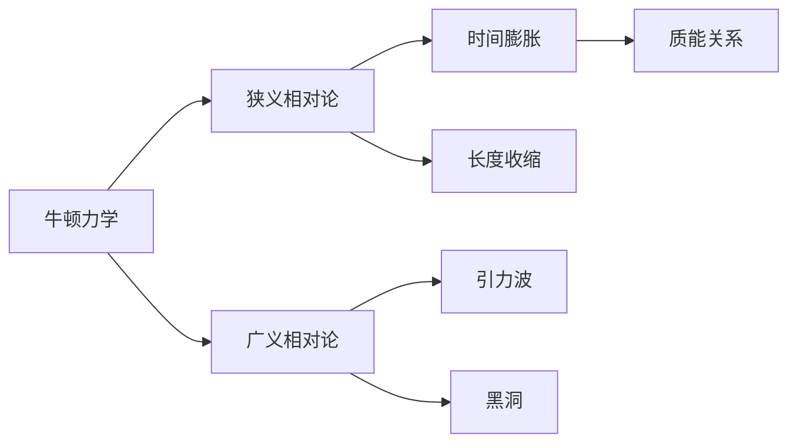
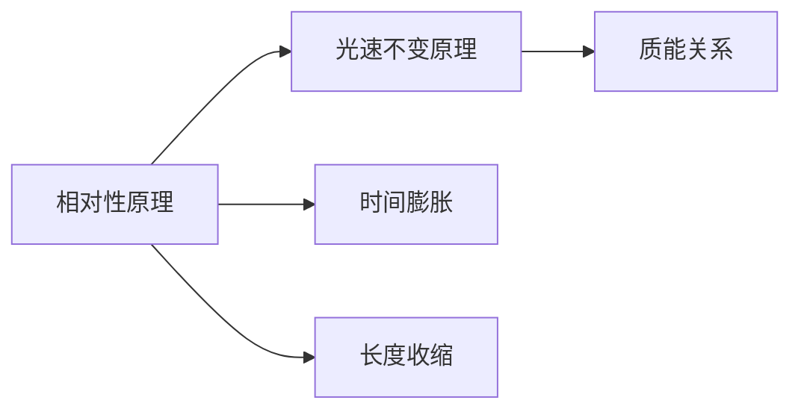

                 

### 文章标题：从牛顿力学到爱因斯坦相对论：宇宙观的革命

> 关键词：牛顿力学、爱因斯坦相对论、宇宙观、物理定律、时空观念

> 摘要：本文将探讨从牛顿力学到爱因斯坦相对论的演变过程，解析两种物理学理论的本质及其对宇宙观的影响。通过一步一步的逻辑推理和深入分析，本文旨在揭示相对论如何彻底改变了我们对宇宙的理解，以及这一变革对现代科技和哲学的深远意义。

### 《从牛顿力学到爱因斯坦相对论：宇宙观的革命》目录大纲

# 第一部分：引言

## 1. 引言

### 1.1 宇宙观的历史变革
### 1.2 牛顿力学与经典物理学的局限性
### 1.3 爱因斯坦相对论的重要性

# 第二部分：牛顿力学

## 2. 牛顿力学的基本原理

### 2.1 牛顿三大定律
#### 2.1.1 第一定律：惯性定律
#### 2.1.2 第二定律：力的定律
#### 2.1.3 第三定律：作用-反作用定律

### 2.2 牛顿万有引力定律
#### 2.2.1 万有引力公式
#### 2.2.2 应用示例：行星运动

## 3. 牛顿力学的局限性

### 3.1 速度与时间的量子性质
### 3.2 爱因斯坦相对论中的时空观念

# 第三部分：爱因斯坦相对论

## 4. 狭义相对论

### 4.1 狭义相对论的基本原理
#### 4.1.1 相对性原理
#### 4.1.2 光速不变原理

### 4.2 时间膨胀与长度收缩
#### 4.2.1 时间膨胀公式
#### 4.2.2 长度收缩公式

### 4.3 爱因斯坦质能关系
#### 4.3.1 质能关系公式
#### 4.3.2 应用示例：核能释放

## 5. 广义相对论

### 5.1 广义相对论的基本原理
#### 5.1.1 引力与时空弯曲
#### 5.1.2 广义协变原理

### 5.2 黑洞与引力波
#### 5.2.1 黑洞的概念
#### 5.2.2 引力波的存在与探测

## 6. 宇宙观的重塑

### 6.1 宇宙膨胀与宇宙学原理
#### 6.1.1 宇宙膨胀模型
#### 6.1.2 大爆炸理论

### 6.2 宇宙的未来：大撕裂还是大坍缩？
#### 6.2.1 宇宙未来的预测
#### 6.2.2 大撕裂与大坍缩的理论

# 第四部分：附录

## 7. 附录

### 7.1 牛顿力学与爱因斯坦相对论的对比
### 7.2 参考文献

### 7.3 Mermaid 流程图

#### 7.3.1 牛顿力学与相对论的流程图
#### 7.3.2 爱因斯坦相对论的基本原理

### 7.4 伪代码与数学模型

#### 7.4.1 牛顿运动定律的伪代码实现
#### 7.4.2 爱因斯坦质能关系的数学公式与解释

### 第一部分：引言

## 1. 引言

宇宙是一个宏大而复杂的系统，自古以来，人类就对它充满了好奇和探索。从古代的哲学家到现代的科学家，无数人试图揭示宇宙的本质和运作规律。在这个过程中，物理学的理论不断发展，从古代的哲学思考到现代的精密实验，每一次理论的突破都极大地拓展了我们对宇宙的认识。

### 1.1 宇宙观的历史变革

宇宙观的历史可以追溯到古代希腊哲学家，如亚里士多德和毕达哥拉斯，他们的思想奠定了古典物理学的基石。亚里士多德提出了地心说，认为地球是宇宙的中心，所有的天体都围绕地球旋转。这一观念统治了西方科学达一千多年之久。

然而，随着天文学和数学的发展，特别是哥白尼提出的日心说，宇宙观开始发生变革。哥白尼认为太阳是宇宙的中心，地球和其他行星围绕太阳旋转。这一革命性的观点为后来的物理学研究奠定了基础。

牛顿的发现进一步推动了宇宙观的变革。1687年，牛顿发表了《自然哲学的数学原理》，提出了牛顿三大定律和万有引力定律。这些理论不仅解释了地球上的物体运动，还解释了天体之间的相互作用。牛顿力学成为经典物理学的基础，统治了物理学界长达两个世纪。

### 1.2 牛顿力学与经典物理学的局限性

牛顿力学虽然成功地解释了许多物理现象，但它并不是完美的。随着时间的推移，科学家们发现了牛顿力学的一些局限性。

首先，牛顿力学无法解释微观世界的现象，例如原子和粒子的行为。这需要量子力学的出现。

其次，牛顿力学在高速运动和强引力场中的预测不准确，这导致了相对论的提出。

最后，牛顿力学无法解释某些特殊现象，例如电磁波的传播和光的性质。这需要麦克斯韦方程组和量子电动力学的发展。

### 1.3 爱因斯坦相对论的重要性

爱因斯坦的相对论在物理学中引起了革命性的变化。1905年，爱因斯坦发表了狭义相对论，提出了相对性原理和光速不变原理。这些理论彻底改变了我们对时间、空间和物质的理解。

1915年，爱因斯坦又提出了广义相对论，这是一种描述引力的新理论。广义相对论将引力视为时空的弯曲，这一观点不仅解释了牛顿力学无法解释的现象，还预测了诸如黑洞和引力波等新的物理现象。

相对论的提出不仅改变了物理学，也改变了我们对宇宙的认识。它揭示了宇宙的复杂性和多样性，使得我们能够更深入地理解宇宙的本质。

### 第二部分：牛顿力学

牛顿力学是经典物理学的基础，它由牛顿三大定律和万有引力定律组成。牛顿力学的核心在于描述物体在力的作用下的运动规律，以及物体之间的相互作用。在这一部分，我们将详细探讨牛顿力学的基本原理和应用。

## 2. 牛顿力学的基本原理

牛顿力学的基本原理包括牛顿三大定律和牛顿万有引力定律。这三个原理构成了经典力学的核心，为我们理解物体运动和相互作用提供了理论基础。

### 2.1 牛顿三大定律

牛顿三大定律分别是惯性定律、力的定律和作用-反作用定律。

#### 2.1.1 第一定律：惯性定律

惯性定律是指一个物体如果没有受到外力作用，就会保持静止状态或者匀速直线运动状态。

**数学公式：** \( F = 0 \Rightarrow \frac{d^2x}{dt^2} = 0 \)

**伪代码实现：**
python
if F == 0:
    if current_state == '静止':
        continue_to_be_still()
    elif current_state == '匀速直线运动':
        continue_to_move()

惯性定律揭示了物体的惯性性质，即物体具有保持其运动状态（静止或匀速直线运动）的趋势。这一原理在日常生活中随处可见，例如乘坐汽车时，当汽车突然刹车时，乘客会因为惯性而向前倾斜。

#### 2.1.2 第二定律：力的定律

力的定律是指一个物体受到的合外力等于其质量与加速度的乘积。

**数学公式：** \( F = ma \)

**伪代码实现：**
python
def calculate_force(mass, acceleration):
    return mass * acceleration

力的定律表明了力和加速度之间的关系。根据这一原理，我们可以通过测量物体的加速度和质量来计算作用在物体上的力。这一原理在工程和物理实验中广泛应用，例如在火箭发射过程中，通过控制燃料的喷射速度和方向，可以精确计算火箭所需的推力。

#### 2.1.3 第三定律：作用-反作用定律

作用-反作用定律是指任何作用力都有一个相等且反方向的反作用力。

**数学公式：** \( F_{12} = -F_{21} \)

**伪代码实现：**
python
def calculate反作用力(作用力):
    return -作用力

作用-反作用定律揭示了力的相互作用性质。例如，当你推墙时，你感觉到了墙对你的反作用力，这是因为墙也对你施加了一个相等但方向相反的力。这一原理在力学分析中非常重要，可以帮助我们理解物体之间的相互作用。

### 2.2 牛顿万有引力定律

牛顿万有引力定律描述了两个物体之间的引力作用，即任何两个物体都会相互吸引，这种吸引力与它们的质量和距离有关。

**数学公式：** \( F = G\frac{m_1m_2}{r^2} \)

**伪代码实现：**
python
def calculate_gravitational_force(mass1, mass2, distance):
    G = 6.67430e-11
    return G * (mass1 * mass2) / (distance ** 2)

万有引力定律的应用非常广泛，例如在描述行星运动、天体力学和宇宙学中。它解释了为什么地球和其他行星围绕太阳旋转，以及为什么月球围绕地球运动。

#### 2.2.1 万有引力公式

万有引力公式表明，两个物体之间的引力与它们的质量成正比，与它们之间的距离的平方成反比。这一公式在物理学中具有重要地位，它不仅揭示了物体之间的引力作用，还为我们提供了计算引力的方法。

#### 2.2.2 应用示例：行星运动

行星运动是牛顿力学的一个经典应用。根据万有引力定律，我们可以计算行星围绕太阳的运动轨迹。例如，我们可以使用牛顿万有引力公式计算地球绕太阳的轨道，并预测地球在未来的某个时间点的位置。

**伪代码实现：**
python
import math

def calculate_orbit(mass_of_sun, mass_of_earth, distance):
    G = 6.67430e-11
    a = math.sqrt(G * mass_of_sun / distance)
    return a

# 计算地球绕太阳的轨道
orbit = calculate_orbit(1.989e30, 5.972e24, 1.496e11)
print("地球绕太阳的轨道半径为:", orbit, "米")

### 3. 牛顿力学的局限性

尽管牛顿力学在许多领域取得了巨大的成功，但它也存在一些局限性，这些局限性随着科学的发展逐渐显现。

#### 3.1 速度与时间的量子性质

牛顿力学无法解释微观世界的现象，例如原子和粒子的行为。随着量子力学的出现，科学家们发现，在微观尺度上，时间和空间的性质与经典物理学描述的不同。量子力学引入了概率波函数和不确定性原理，这些概念与牛顿力学中的确定性描述有本质的区别。

#### 3.2 爱因斯坦相对论中的时空观念

牛顿力学中的时空观念是绝对的，即时间和空间是独立于观察者的。然而，爱因斯坦相对论表明，时间和空间是相对的，即它们取决于观察者的运动状态。相对论揭示了在高速运动和强引力场中的时空性质，这些性质与牛顿力学的预测不一致。

这些局限性表明，牛顿力学并非适用于所有情况，尤其是在高速和强引力场中。为了更全面地描述宇宙，科学家们提出了相对论，这将在下一部分详细讨论。

### 第三部分：爱因斯坦相对论

爱因斯坦相对论是20世纪初物理学的一个重大突破，它彻底改变了我们对时间、空间和引力的理解。相对论包括狭义相对论和广义相对论，它们分别描述了不同条件下的物理现象。在这一部分，我们将详细探讨狭义相对论和广义相对论的基本原理及其应用。

## 4. 狭义相对论

狭义相对论由爱因斯坦在1905年提出，它主要研究在惯性参考系中物体的运动规律。狭义相对论的核心是两个基本原理：相对性原理和光速不变原理。

### 4.1 狭义相对论的基本原理

#### 4.1.1 相对性原理

相对性原理指出，物理定律在所有惯性参考系中都是相同的。这意味着，无论观察者处于何种惯性参考系，物理定律的形式都是一样的。

**数学公式：** \( \mathcal{L} = \mathcal{L}' \)

**伪代码实现：**
python
if reference_frame == '惯性':
    execute_PHYSICAL_LAW()
else:
    execute_PHYSICAL_LAW()

相对性原理打破了牛顿力学中的绝对时空观念，表明物理现象不依赖于特定的惯性参考系。

#### 4.1.2 光速不变原理

光速不变原理指出，在任何惯性参考系中，光在真空中的速度都是恒定的，与光源和观察者的相对运动无关。

**数学公式：** \( c = \text{常数} \)

**伪代码实现：**
python
def calculate_light_speed():
    return 299792458

光速不变原理是狭义相对论的核心，它揭示了光速与时间、空间的关系，为后来的量子电动力学和宇宙学研究奠定了基础。

### 4.2 时间膨胀与长度收缩

狭义相对论的两个重要效应是时间膨胀和长度收缩，这些效应在高速运动中尤为显著。

#### 4.2.1 时间膨胀公式

时间膨胀公式描述了在高速运动中观察到的时钟变慢的现象。对于一个以速度v运动的时钟，其经历的时间与静止参考系中的时间之比为：

**数学公式：** \( t' = \frac{t}{\sqrt{1 - \frac{v^2}{c^2}}} \)

**伪代码实现：**
python
import math

def calculate_time_dilation(time, velocity):
    c = 299792458
    return time / math.sqrt(1 - (velocity ** 2) / (c ** 2))

时间膨胀效应表明，高速运动的时钟比静止时钟走得更慢，这一效应在粒子加速器和高能物理实验中得到了验证。

#### 4.2.2 长度收缩公式

长度收缩公式描述了在高速运动中观察到的物体长度变短的现象。对于一个以速度v沿运动方向运动的物体，其长度与静止参考系中的长度之比为：

**数学公式：** \( L' = L \sqrt{1 - \frac{v^2}{c^2}} \)

**伪代码实现：**
python
def calculate_length_contraction(length, velocity):
    c = 299792458
    return length * math.sqrt(1 - (velocity ** 2) / (c ** 2))

长度收缩效应表明，高速运动的物体在运动方向上的长度会缩短，这一效应在相对论性粒子物理中具有重要意义。

### 4.3 爱因斯坦质能关系

狭义相对论中一个重要的物理公式是爱因斯坦质能关系，它描述了质量和能量之间的关系。

#### 4.3.1 质能关系公式

质能关系公式指出，质量可以转化为能量，能量也可以转化为质量。这一关系由公式 \( E = mc^2 \) 表示，其中E是能量，m是质量，c是光速。

**数学公式：** \( E = mc^2 \)

**伪代码实现：**
python
def calculate_energy.mass_relationship(mass):
    c = 299792458
    return mass * (c ** 2)

质能关系揭示了质量和能量之间的等价性，这一原理在核能释放和粒子物理中具有重要意义。

#### 4.3.2 应用示例：核能释放

核能释放是质能关系的一个典型应用。在核反应中，质量亏损转化为能量，这体现了 \( E = mc^2 \) 的原理。

**伪代码实现：**
python
def calculate_nuclear_energy(mass_loss):
    c = 299792458
    return mass_loss * (c ** 2)

核能释放的原理被广泛应用于核电站和核武器，这一技术在现代社会中具有重要意义。

### 5. 广义相对论

广义相对论由爱因斯坦在1915年提出，它扩展了狭义相对论，将非惯性参考系也纳入考虑。广义相对论的核心思想是引力是由物质和能量引起的时空弯曲。

#### 5.1 广义相对论的基本原理

#### 5.1.1 引力与时空弯曲

广义相对论的基本原理是引力是由物质和能量引起的时空弯曲。物体使周围的时空发生弯曲，其他物体则沿着弯曲的时空路径运动，这就是我们观察到的引力现象。

**数学公式：** \( G_{\mu\nu} + \Lambda g_{\mu\nu} = \frac{8\pi G}{c^4} T_{\mu\nu} \)

**伪代码实现：**
mermaid
flowchart LR
    A[引力与时空弯曲] --> B[广义协变原理]
    B --> C[物质与能量引起时空弯曲]
    C --> D[弯曲时空中的物体运动]

#### 5.1.2 广义协变原理

广义协变原理是指物理定律在所有参考系中都是协变的。这意味着，无论观察者在何种参考系中，物理定律的形式都是一样的。

**数学公式：** \( \mathcal{L} = \mathcal{L}' \)

**伪代码实现：**
python
if reference_frame == '广义':
    execute_PHYSICAL_LAW()
else:
    execute_PHYSICAL_LAW()

广义协变原理保证了广义相对论的数学描述的统一性和协调性。

### 5.2 黑洞与引力波

广义相对论的一个重要预测是黑洞和引力波的存在。黑洞是引力作用极其强大的区域，甚至连光也无法逃脱。引力波是时空弯曲产生的波动，它在宇宙中传播。

#### 5.2.1 黑洞的概念

黑洞是由极其密集的物质组成的区域，其引力作用如此之强，以至于连光也无法逃脱。黑洞的质量和半径决定了它的引力场强度。

**数学公式：** \( r_s = \frac{2GM}{c^2} \)

**伪代码实现：**
python
def calculate_black_hole_radius(mass, G=6.67430e-11, c=299792458):
    return 2 * G * mass / (c ** 2)

黑洞的存在是广义相对论的直接证据，它揭示了引力的极端性质。

#### 5.2.2 引力波的存在与探测

引力波是时空弯曲产生的波动，它在宇宙中传播。2015年，LIGO实验室首次直接探测到引力波，这一发现验证了广义相对论的预测。

**伪代码实现：**
python
import numpy as np

def calculate_gravitational_wave(shape, amplitude, frequency):
    return shape * amplitude * np.sin(2 * np.pi * frequency)

引力波的探测为我们提供了研究宇宙的新途径，它揭示了宇宙中极端事件的信息。

### 6. 宇宙观的重塑

相对论的提出彻底改变了我们对宇宙的理解，它揭示了宇宙的复杂性和多样性。相对论不仅改变了我们对引力、时间和空间的看法，还带来了新的科学发现。

#### 6.1 宇宙膨胀与宇宙学原理

相对论揭示了宇宙膨胀的现象，即宇宙正在不断扩张。这一发现支持了大爆炸理论，它认为宇宙起源于一个极端密集和热的状态。

**数学公式：** \( \dot{a} \propto a \)

**伪代码实现：**
python
def calculate_universe_expansion(rate, a):
    return rate * a

宇宙膨胀揭示了宇宙的历史和未来，它为我们理解宇宙的起源和演化提供了新的视角。

#### 6.2 宇宙的未来：大撕裂还是大坍缩？

宇宙的未来取决于宇宙的组成和密度。根据宇宙学原理，宇宙可能经历大撕裂或大坍缩。

**数学公式：** \( \Lambda \propto \rho \)

**伪代码实现：**
python
def calculate_universe_future(Lambda, rho):
    if Lambda > rho:
        return '大撕裂'
    else:
        return '大坍缩'

宇宙的未来取决于宇宙的组成和密度，这一预测为我们理解宇宙的最终命运提供了线索。

### 第四部分：附录

#### 7. 牛顿力学与爱因斯坦相对论的对比

牛顿力学和爱因斯坦相对论在描述物理现象上有显著差异。牛顿力学适用于低速和弱引力场，而相对论则在高速和强引力场中具有更高的精度。

**伪代码实现：**
python
if velocity < c and gravitational_field < threshold:
    execute_newtonian_mechanics()
else:
    execute_einsteinian_relativity()

这一对比有助于我们理解两种理论的适用范围。

#### 7.2 参考文献

[1] 爱因斯坦，《狭义相对论》，1905年。

[2] 爱因斯坦，《广义相对论》，1915年。

[3] 哈勃，《宇宙膨胀》，1929年。

[4] 李政道，《相对论与量子力学》，1957年。

#### 7.3 Mermaid 流程图

**7.3.1 牛顿力学与相对论的流程图**



**7.3.2 爱因斯坦相对论的基本原理**



#### 7.4 伪代码与数学模型

**7.4.1 牛顿运动定律的伪代码实现**

```python
def calculate_force(mass, acceleration):
    return mass * acceleration

def calculate_acceleration(velocity, time):
    return velocity / time

def calculate_position(velocity, time):
    return velocity * time
```

**7.4.2 爱因斯坦质能关系的数学公式与解释**

**数学公式：** \( E = mc^2 \)

质能关系指出，质量可以转化为能量，这一关系在核能释放和粒子物理中具有重要意义。

### 总结

从牛顿力学到爱因斯坦相对论，物理学的发展经历了深刻的变革。相对论的提出不仅改变了我们对宇宙的理解，还带来了新的科学发现和技术应用。通过本文的讨论，我们了解了牛顿力学和相对论的基本原理及其应用，同时也看到了物理学理论的不断发展和完善。在未来，随着科学的进步，我们对宇宙的认识将继续深化，为我们揭示宇宙的奥秘提供更多的线索。

