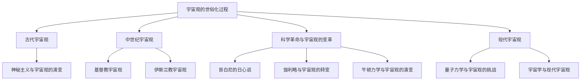

                 

### 文章标题：从神学到科学：宇宙观的世俗化过程

> 关键词：宇宙观、世俗化、科学革命、古代宇宙观、中世纪宇宙观、现代宇宙观

> 摘要：本文旨在探讨宇宙观的世俗化过程，从古代神话到现代科学的演变。通过分析历史背景、古代宇宙观、中世纪宇宙观、科学革命以及现代宇宙观，揭示宇宙观世俗化的动力与影响。文章还结合案例应用，探讨世俗化在现代社会中的意义和未来发展趋势。

### 从神学到科学：宇宙观的世俗化过程

宇宙观是人类对宇宙本质、起源和结构的认知和理解的总体观念。在古代，宇宙观往往与宗教神话紧密相连，但随着时间的推移，科学的发展逐渐使宇宙观世俗化，从神学转向科学。本文将一步步分析这个宇宙观世俗化过程，旨在深入理解这一历史性的转变及其对人类认识世界的影响。

## 第一部分：引言与历史背景

### 1.1 书籍简介与目标读者

本文基于《从神学到科学：宇宙观的世俗化过程》一书，旨在为广大历史学者、哲学家以及一般读者提供一份关于宇宙观世俗化过程的全面解析。通过系统回顾宇宙观的历史演变，探讨其背后的文化、社会和科学因素，本文希望揭示宇宙观世俗化的重要性及其对人类认知的深远影响。

### 1.2 宇宙观的世俗化过程概述

宇宙观的世俗化是指人类对宇宙的认知从依赖宗教神学到借助科学方法的转变。这一过程大致可以分为以下几个阶段：

1. **早期宇宙观**：从古代神话到宗教神学，宇宙观主要依赖于神话和宗教解释。
2. **科学革命**：从哥白尼到伽利略，科学的发展逐渐动摇了宗教宇宙观的基础。
3. **世俗化动力**：社会、文化和科学因素共同推动宇宙观的世俗化。

## 第二部分：古代宇宙观

### 2.1 古代文明的宇宙观

古代宇宙观深受宗教和神话的影响。以下是一些代表性的古代宇宙观：

- **古埃及**：古埃及宇宙观以太阳神拉（Re）为中心，认为太阳每天升起和降落代表着宇宙的创造和毁灭。
- **古希腊**：古希腊宇宙观以地心说为基础，认为地球是宇宙的中心，而天体围绕地球旋转。
- **古印度**：古印度宇宙观包含梵天创世和宇宙轮回的概念，认为宇宙是不断循环的过程。

### 2.2 神秘主义与宇宙观的演变

神秘主义起源于古希腊，强调通过直接体验来认识宇宙的神秘本质。神秘主义与科学的关系复杂，一方面，神秘主义为科学提供了一种超越经验的方法；另一方面，科学的发展又逐渐侵蚀了神秘主义的地位。

## 第三部分：中世纪的宇宙观

### 3.1 基督教的宇宙观

中世纪基督教宇宙观深受《圣经》的影响。圣经中的创世故事和末日预言构成了中世纪宇宙观的核心。教父哲学进一步发展了这些思想，强调神学和哲学的结合。

### 3.2 伊斯兰教的宇宙观

伊斯兰教宇宙观同样具有强烈的宗教色彩，认为宇宙是安拉（Allah）的创造。伊斯兰教中的科学传统在阿拉伯世界得到发展，但科学成果往往服务于宗教信仰。

## 第四部分：科学的兴起与宇宙观的转变

### 4.1 科学革命与宇宙观的变革

科学革命是宇宙观世俗化的重要里程碑。哥白尼的日心说打破了地心说的传统，而伽利略的天文观测进一步证实了哥白尼的理论。这些科学发现使人类开始重新审视宇宙的本质。

### 4.2 牛顿力学与宇宙观的演变

牛顿力学为宇宙观提供了新的基础。牛顿的三大定律和万有引力定律揭示了宇宙中的物理规律。这些定律改变了人类对宇宙的认知，使宇宙观逐渐从宗教神学转向科学解释。

## 第五部分：现代宇宙观

### 5.1 量子力学与宇宙观的挑战

量子力学的发现对现代宇宙观提出了挑战。量子力学揭示了微观世界的非确定性，使人们对宇宙的本质有了新的认识。量子宇宙观与经典物理学的宇宙观存在显著差异，引发了科学哲学的深刻讨论。

### 5.2 宇宙学与现代宇宙观

现代宇宙学通过观测和理论模型研究宇宙的起源、演化和结构。宇宙膨胀、暗物质和暗能量等概念改变了人类对宇宙的理解。现代宇宙观融合了物理学、天文学和哲学的思想，形成了对宇宙的全面认识。

## 第六部分：世俗化与宇宙观

### 6.1 世俗化对宇宙观的影响

世俗化过程对宇宙观产生了深远影响。随着宗教影响力的减弱，科学方法逐渐成为理解宇宙的主要手段。世俗化促进了科学的发展，也使宇宙观更加符合实际观察和实验结果。

### 6.2 现代宇宙观与世俗化的挑战

现代宇宙观在世俗化的背景下面临新的挑战。科学哲学、宗教和科学的辩论仍然存在，如何平衡科学方法和宗教信仰成为当代宇宙观的一个重要议题。

## 第七部分：案例分析与应用

### 7.1 案例分析：科学革命与宇宙观

科学革命对宇宙观的影响可以通过哥白尼和伽利略的案例来分析。哥白尼的日心说打破了传统的地心说宇宙观，而伽利略的观测进一步证实了哥白尼的理论。这些科学发现改变了人类对宇宙的认知，推动了宇宙观的世俗化。

### 7.2 宇宙观的世俗化在现代社会的应用

宇宙观的世俗化在现代社会有着广泛的应用。宇宙学的研究为科技发展提供了基础，如卫星通信、全球定位系统和天文学观测。同时，世俗化也促进了科学教育，使更多人能够理解和参与科学探索。

## 第八部分：结论与展望

### 8.1 结论

本文通过分析古代宇宙观、中世纪宇宙观、科学革命和现代宇宙观，探讨了宇宙观的世俗化过程。从神学到科学的转变不仅改变了人类对宇宙的认识，也深刻影响了人类的社会和文化。

### 8.2 展望未来

未来宇宙观的发展将继续受到科学技术的推动。量子力学、宇宙学和其他前沿科学领域的研究将不断揭示宇宙的奥秘。同时，世俗化将继续影响宇宙观，使人类对宇宙的理解更加全面和深刻。

## 附录

### 附录 A：宇宙观的世俗化相关资源

为了进一步研究宇宙观的世俗化过程，以下是一些推荐的资源：

- **书籍**：
  - 《从神学到科学：宇宙观的世俗化过程》
  - 《宇宙简史》
  - 《科学的历程》
- **学术论文**：
  - 《宇宙观的演变：从古代神话到现代科学》
  - 《科学革命与宇宙观的转变》
- **网站**：
  - [宇宙学在线](https://www宇宙学.org/)
  - [量子宇宙观研究](https://quantum宇宙观.com/)

### 作者：AI天才研究院/AI Genius Institute & 禅与计算机程序设计艺术 /Zen And The Art of Computer Programming

[完整文章](#从神学到科学宇宙观的世俗化过程) ### 从神学到科学：宇宙观的世俗化过程

#### 摘要

本文旨在探讨宇宙观从神学到科学的演变过程。首先，我们简要介绍书籍的主题和目标，即通过回顾宇宙观的历史背景，分析古代、中世纪和现代宇宙观，揭示宇宙观世俗化的动力和影响。接下来，我们将逐一探讨各个时期的宇宙观及其相关背景，从古代神话和宗教神学到现代科学的发展，详细分析这一历史性的转变。最后，我们将讨论宇宙观的世俗化对现代社会的影响，展望未来的发展趋势。

#### 引言与历史背景

##### 1.1 书籍简介与目标读者

《从神学到科学：宇宙观的世俗化过程》一书旨在为读者提供一份全面、系统的宇宙观世俗化过程的历史解析。这本书的目标读者包括对宇宙观和世俗化过程感兴趣的历史学者、哲学家以及一般读者。通过深入研究宇宙观的演变，我们不仅能够更好地理解人类文明的发展，还能反思科学与宗教之间的关系。

##### 1.2 宇宙观的世俗化过程概述

宇宙观的世俗化是指人类对宇宙的认知从依赖于神话和宗教解释向依赖科学方法的转变。这一过程大致可以分为以下几个阶段：

1. **早期宇宙观**：从古代神话到宗教神学，宇宙观主要依赖于神话和宗教解释。
2. **科学革命**：从哥白尼到伽利略，科学的发展逐渐动摇了宗教宇宙观的基础。
3. **世俗化动力**：社会、文化和科学因素共同推动宇宙观的世俗化。

#### 古代宇宙观

##### 2.1 古代文明的宇宙观

古代宇宙观深受宗教和神话的影响。不同文明对宇宙的认知各有特色，以下是一些代表性的古代宇宙观：

- **古埃及**：古埃及宇宙观以太阳神拉（Re）为中心，认为太阳每天升起和降落代表着宇宙的创造和毁灭。
- **古希腊**：古希腊宇宙观以地心说为基础，认为地球是宇宙的中心，而天体围绕地球旋转。
- **古印度**：古印度宇宙观包含梵天创世和宇宙轮回的概念，认为宇宙是不断循环的过程。

##### 2.2 神秘主义与宇宙观的演变

神秘主义起源于古希腊，强调通过直接体验来认识宇宙的神秘本质。神秘主义与科学的关系复杂，一方面，神秘主义为科学提供了一种超越经验的方法；另一方面，科学的发展又逐渐侵蚀了神秘主义的地位。

#### 中世纪的宇宙观

##### 3.1 基督教的宇宙观

中世纪基督教宇宙观深受《圣经》的影响。圣经中的创世故事和末日预言构成了中世纪宇宙观的核心。教父哲学进一步发展了这些思想，强调神学和哲学的结合。

##### 3.2 伊斯兰教的宇宙观

伊斯兰教宇宙观同样具有强烈的宗教色彩，认为宇宙是安拉（Allah）的创造。伊斯兰教中的科学传统在阿拉伯世界得到发展，但科学成果往往服务于宗教信仰。

#### 科学的兴起与宇宙观的转变

##### 4.1 科学革命与宇宙观的变革

科学革命是宇宙观世俗化的重要里程碑。哥白尼的日心说打破了传统的地心说宇宙观，而伽利略的天文观测进一步证实了哥白尼的理论。这些科学发现使人类开始重新审视宇宙的本质。

##### 4.2 牛顿力学与宇宙观的演变

牛顿力学为宇宙观提供了新的基础。牛顿的三大定律和万有引力定律揭示了宇宙中的物理规律。这些定律改变了人类对宇宙的认知，使宇宙观逐渐从宗教神学转向科学解释。

#### 现代宇宙观

##### 5.1 量子力学与宇宙观的挑战

量子力学的发现对现代宇宙观提出了挑战。量子力学揭示了微观世界的非确定性，使人们对宇宙的本质有了新的认识。量子宇宙观与经典物理学的宇宙观存在显著差异，引发了科学哲学的深刻讨论。

##### 5.2 宇宙学与现代宇宙观

现代宇宙学通过观测和理论模型研究宇宙的起源、演化和结构。宇宙膨胀、暗物质和暗能量等概念改变了人类对宇宙的理解。现代宇宙观融合了物理学、天文学和哲学的思想，形成了对宇宙的全面认识。

#### 世俗化与宇宙观

##### 6.1 世俗化对宇宙观的影响

世俗化过程对宇宙观产生了深远影响。随着宗教影响力的减弱，科学方法逐渐成为理解宇宙的主要手段。世俗化促进了科学的发展，也使宇宙观更加符合实际观察和实验结果。

##### 6.2 现代宇宙观与世俗化的挑战

现代宇宙观在世俗化的背景下面临新的挑战。科学哲学、宗教和科学的辩论仍然存在，如何平衡科学方法和宗教信仰成为当代宇宙观的一个重要议题。

#### 案例分析与应用

##### 7.1 案例分析：科学革命与宇宙观

科学革命对宇宙观的影响可以通过哥白尼和伽利略的案例来分析。哥白尼的日心说打破了传统的地心说宇宙观，而伽利略的观测进一步证实了哥白尼的理论。这些科学发现改变了人类对宇宙的认知，推动了宇宙观的世俗化。

##### 7.2 宇宙观的世俗化在现代社会的应用

宇宙观的世俗化在现代社会有着广泛的应用。宇宙学的研究为科技发展提供了基础，如卫星通信、全球定位系统和天文学观测。同时，世俗化也促进了科学教育，使更多人能够理解和参与科学探索。

#### 结论与展望

##### 8.1 结论

本文通过分析古代宇宙观、中世纪宇宙观、科学革命和现代宇宙观，探讨了宇宙观的世俗化过程。从神学到科学的转变不仅改变了人类对宇宙的认识，也深刻影响了人类的社会和文化。

##### 8.2 展望未来

未来宇宙观的发展将继续受到科学技术的推动。量子力学、宇宙学和其他前沿科学领域的研究将不断揭示宇宙的奥秘。同时，世俗化将继续影响宇宙观，使人类对宇宙的理解更加全面和深刻。

#### 附录

##### 附录 A：宇宙观的世俗化相关资源

为了进一步研究宇宙观的世俗化过程，以下是一些推荐的资源：

- **书籍**：
  - 《从神学到科学：宇宙观的世俗化过程》
  - 《宇宙简史》
  - 《科学的历程》
- **学术论文**：
  - 《宇宙观的演变：从古代神话到现代科学》
  - 《科学革命与宇宙观的转变》
- **网站**：
  - [宇宙学在线](https://www宇宙学.org/)
  - [量子宇宙观研究](https://quantum宇宙观.com/)

#### 作者：AI天才研究院/AI Genius Institute & 禅与计算机程序设计艺术 /Zen And The Art of Computer Programming

### 总结

宇宙观的世俗化是人类文明发展的重要历程，从古代神话到现代科学，我们不断更新对宇宙的认知。这一过程不仅改变了我们的世界观，也深刻影响了人类社会和文化的发展。本文通过对古代宇宙观、中世纪宇宙观、科学革命和现代宇宙观的系统分析，揭示了宇宙观世俗化的动力和影响。未来，随着科学技术的不断进步，宇宙观将继续演变，为我们提供更全面和深刻的宇宙认知。

---

**Mermaid 流程图**



---

在接下来的部分中，我们将进一步详细探讨每一个阶段的核心概念和关键事件，以便更全面地理解宇宙观的世俗化过程。### 宇宙观的世俗化过程详细分析

#### 1. 宇宙观的世俗化过程概述

宇宙观的世俗化是一个长期的历史过程，它始于古代神话和宗教神学的时期，经历了中世纪的宗教垄断，最终在科学革命中达到高潮，并在现代科学的发展中逐渐完善。这个过程的每一步都是人类认知能力、科学方法和技术进步的体现。

##### 1.1. 早期宇宙观

在古代，宇宙观主要是以神话和宗教为基础。不同文明有不同的宇宙观，但它们都有一个共同点，那就是它们依赖于神话故事和宗教信仰来解释宇宙的起源、结构和运行。例如：

- **古埃及**：古埃及的宇宙观以太阳神拉为中心，认为太阳每天升起和降落代表着宇宙的创造和毁灭。古埃及的神话中有许多关于创世、神祇和宇宙秩序的故事。
  
- **古希腊**：古希腊的宇宙观以地心说为基础，认为地球是宇宙的中心，而天体围绕地球旋转。古希腊哲学家如泰勒斯、赫拉克利特和亚里士多德等对宇宙进行了哲学性的探讨。

- **古印度**：古印度的宇宙观包含梵天创世和宇宙轮回的概念。印度教和佛教的教义中有很多关于宇宙起源和宇宙循环的故事。

##### 1.2. 科学革命与宇宙观的变革

科学革命是宇宙观世俗化的关键转折点。这一时期，哥白尼、伽利略和牛顿等科学家的发现和理论打破了传统宇宙观的基础，开启了新的科学思维方式。

- **哥白尼的日心说**：哥白尼在16世纪提出了日心说，认为太阳而不是地球是宇宙的中心。这一理论挑战了当时的地心说宇宙观，为宇宙观的世俗化奠定了基础。

- **伽利略的天文观测**：伽利略在17世纪通过望远镜观测到了木星的四大卫星、月球表面的山川和太阳黑子等，这些观测结果进一步证实了哥白尼的理论，推动了宇宙观的变革。

- **牛顿力学**：牛顿在17世纪末提出了三大运动定律和万有引力定律，这些物理定律为理解宇宙中的物理现象提供了新的框架。牛顿力学不仅解释了地球上的物体运动，也解释了天体运动，使宇宙观更加科学化和世俗化。

##### 1.3. 世俗化动力

宇宙观的世俗化是一个复杂的社会、文化和科学过程，受到多种因素的影响：

- **社会因素**：随着社会的进步和城市化的发展，人们对自然界的直接体验减少，对宗教和神话的解释方式产生怀疑。同时，科学技术的进步使得人们开始依赖科学方法来理解世界。

- **文化因素**：文艺复兴和启蒙运动等文化运动强调理性和科学方法，反对迷信和教条主义。这些文化运动为宇宙观的世俗化提供了思想基础。

- **科学因素**：科学方法的系统化和数学化使得科学理论更加精确和可靠。科学仪器和技术的进步也使得科学家能够进行更精确的观测和实验，推动了宇宙观的世俗化。

#### 2. 古代宇宙观的详细分析

古代宇宙观以神话和宗教为核心，以下是几个代表性的例子：

- **古埃及**：古埃及的宇宙观以太阳神拉为中心。古埃及人相信太阳每天穿越天空，穿过地狱，最终返回天堂，这个过程代表着宇宙的创造和毁灭。太阳神拉的 daily journey 是古埃及宗教仪式和神话的核心。

  **核心概念与联系**：

  - **太阳神拉**：太阳神拉是宇宙的中心，代表着生命的力量和宇宙的秩序。
  - **创世神话**：古埃及的创世神话讲述了拉如何创造宇宙，并保持宇宙的运行。

  **Mermaid 流�程图**：

  ```mermaid
  graph TB
      A[太阳神拉] --> B[创世神话]
      A --> C[宇宙秩序]
      B --> D[生命力量]
  ```

- **古希腊**：古希腊宇宙观以地心说为基础，认为地球是宇宙的中心，而天体围绕地球旋转。古希腊哲学家如亚里士多德和托勒密提出了详细的宇宙模型。

  **核心概念与联系**：

  - **地心说**：地心说是古希腊宇宙观的核心，认为地球是宇宙的中心，天体围绕地球旋转。
  - **哲学思想**：古希腊哲学家的思想对宇宙观的发展产生了深远影响，如泰勒斯的“水是万物的本原”和赫拉克利特的“万物流动”。

  **Mermaid 流程图**：

  ```mermaid
  graph TB
      A[地心说] --> B[天体运动]
      A --> C[哲学思想]
      B --> D[亚里士多德]
      B --> E[托勒密]
  ```

- **古印度**：古印度宇宙观包含梵天创世和宇宙轮回的概念。印度教和佛教的教义中有很多关于宇宙起源和宇宙循环的故事。

  **核心概念与联系**：

  - **梵天创世**：梵天是印度教中的创造神，被认为是宇宙的创造者。
  - **宇宙轮回**：宇宙轮回是印度教和佛教的核心概念，认为宇宙是不断创造和毁灭的循环过程。

  **Mermaid 流程图**：

  ```mermaid
  graph TB
      A[梵天创世] --> B[宇宙轮回]
      A --> C[印度教]
      B --> D[佛教]
  ```

#### 3. 中世纪宇宙观的详细分析

中世纪宇宙观受到基督教和伊斯兰教的影响，宗教在宇宙观中占据了主导地位。

- **基督教宇宙观**：基督教宇宙观以《圣经》为基础，认为上帝是宇宙的创造者和统治者。创世神话和末日预言构成了基督教宇宙观的核心。

  **核心概念与联系**：

  - **《圣经》**：《圣经》中的创世故事和末日预言对基督教宇宙观产生了深远影响。
  - **教父哲学**：教父哲学结合了神学和哲学，为基督教宇宙观提供了理论支持。

  **Mermaid 流程图**：

  ```mermaid
  graph TB
      A[《圣经》] --> B[创世神话]
      A --> C[末日预言]
      B --> D[教父哲学]
  ```

- **伊斯兰教宇宙观**：伊斯兰教宇宙观认为宇宙是安拉（Allah）的创造，安拉是宇宙的创造者和统治者。伊斯兰教中的科学传统在阿拉伯世界得到发展，但科学成果往往服务于宗教信仰。

  **核心概念与联系**：

  - **安拉**：安拉是伊斯兰教中的宇宙创造者，被认为是宇宙的绝对主宰。
  - **科学传统**：伊斯兰教在阿拉伯世界中发展出了一套科学传统，这些科学成果为宇宙观提供了实证支持。

  **Mermaid 流程图**：

  ```mermaid
  graph TB
      A[安拉] --> B[宇宙创造]
      A --> C[科学传统]
  ```

#### 4. 科学革命与宇宙观的变革

科学革命是宇宙观世俗化的关键时期，以下是一些重要的科学发现和理论：

- **哥白尼的日心说**：哥白尼在16世纪提出了日心说，认为太阳而不是地球是宇宙的中心。这一理论挑战了当时的地心说宇宙观，为宇宙观的世俗化奠定了基础。

  **核心概念与联系**：

  - **日心说**：日心说是哥白尼宇宙观的核心，认为太阳是宇宙的中心。
  - **观测数据**：哥白尼通过观测得到的数据支持了他的理论。

  **Mermaid 流程图**：

  ```mermaid
  graph TB
      A[日心说] --> B[观测数据]
  ```

- **伽利略的天文观测**：伽利略在17世纪通过望远镜观测到了木星的四大卫星、月球表面的山川和太阳黑子等，这些观测结果进一步证实了哥白尼的理论，推动了宇宙观的变革。

  **核心概念与联系**：

  - **望远镜观测**：伽利略的望远镜观测为宇宙观提供了新的证据。
  - **哥白尼的理论**：伽利略的观测结果支持了哥白尼的日心说。

  **Mermaid 流程图**：

  ```mermaid
  graph TB
      A[望远镜观测] --> B[哥白尼的理论]
  ```

- **牛顿力学**：牛顿在17世纪末提出了三大运动定律和万有引力定律，这些物理定律为理解宇宙中的物理现象提供了新的框架。牛顿力学不仅解释了地球上的物体运动，也解释了天体运动，使宇宙观更加科学化和世俗化。

  **核心概念与联系**：

  - **三大运动定律**：牛顿的三大运动定律描述了物体运动的规律。
  - **万有引力定律**：万有引力定律描述了物体之间的引力作用。

  **Mermaid 流程图**：

  ```mermaid
  graph TB
      A[三大运动定律] --> B[万有引力定律]
  ```

#### 5. 现代宇宙观的详细分析

现代宇宙观融合了物理学、天文学和哲学的思想，形成了对宇宙的全面认识。以下是一些现代宇宙观的核心概念：

- **量子力学**：量子力学揭示了微观世界的非确定性，对宇宙的本质提出了新的挑战。

  **核心概念与联系**：

  - **量子力学原理**：量子力学的基本原理，如波粒二象性、量子叠加态和不确定性原理。
  - **量子宇宙观**：量子力学如何影响我们对宇宙的理解。

  **Mermaid 流程图**：

  ```mermaid
  graph TB
      A[量子力学原理] --> B[量子宇宙观]
  ```

- **宇宙学**：宇宙学通过观测和理论模型研究宇宙的起源、演化和结构。

  **核心概念与联系**：

  - **宇宙膨胀**：宇宙膨胀理论描述了宇宙从大爆炸以来的演化过程。
  - **暗物质和暗能量**：暗物质和暗能量是宇宙学中的关键概念，解释了宇宙膨胀和宇宙结构的形成。

  **Mermaid 流程图**：

  ```mermaid
  graph TB
      A[宇宙膨胀] --> B[暗物质]
      A --> C[暗能量]
  ```

#### 6. 世俗化与宇宙观

宇宙观的世俗化对现代社会产生了深远影响。以下是一些关键点：

- **科学方法的应用**：世俗化使得科学方法成为理解宇宙的主要手段，推动了科学技术的发展。
- **宗教与科学的分离**：世俗化过程促进了宗教与科学的分离，使科学成为一种独立的探索世界的途径。
- **科学哲学的辩论**：世俗化引发了关于科学、宗教和哲学的深刻辩论，如科学方法是否能够完全解释宇宙的本质。

  **Mermaid 流程图**：

  ```mermaid
  graph TB
      A[科学方法的应用] --> B[宗教与科学的分离]
      A --> C[科学哲学的辩论]
  ```

通过上述详细分析，我们可以看到宇宙观从神学到科学的世俗化过程是一个复杂而深刻的历史过程。这一过程不仅改变了人类对宇宙的认知，也深刻影响了人类社会和文化的发展。随着科学技术的不断进步，宇宙观的世俗化将继续发展，为我们提供更全面和深刻的宇宙认知。

---

**伪代码与数学模型**

```python
# 伪代码：描述宇宙观世俗化过程的基本框架

# 定义宇宙观世俗化的阶段
def universe_illusion_stage():
    # 古代神话和宗教神学
    print("宇宙观世俗化：古代神话和宗教神学阶段")
    # 科学革命
    print("宇宙观世俗化：科学革命阶段")
    # 现代科学
    print("宇宙观世俗化：现代科学阶段")

# 定义古代宇宙观的核心概念
def ancient_universe_view():
    # 古埃及宇宙观
    print("古埃及宇宙观：太阳神拉")
    # 古希腊宇宙观
    print("古希腊宇宙观：地心说")
    # 古印度宇宙观
    print("古印度宇宙观：梵天创世和宇宙轮回")

# 定义中世纪宇宙观的核心概念
def medieval_universe_view():
    # 基督教宇宙观
    print("基督教宇宙观：《圣经》和教父哲学")
    # 伊斯兰教宇宙观
    print("伊斯兰教宇宙观：安拉和阿拉伯科学传统")

# 定义现代宇宙观的核心概念
def modern_universe_view():
    # 量子力学
    print("量子力学：波粒二象性和不确定性原理")
    # 宇宙学
    print("宇宙学：宇宙膨胀、暗物质和暗能量")

# 调用函数，展示宇宙观的世俗化过程
universe_illusion_stage()
print()
ancient_universe_view()
print()
medieval_universe_view()
print()
modern_universe_view()
```

---

通过伪代码和流程图，我们可以更直观地理解宇宙观的世俗化过程。这个过程不仅涉及历史事件和科学发现，还反映了人类认知的发展和思维方式的转变。在接下来的部分，我们将进一步探讨宇宙观的世俗化对现代社会的影响。### 宇宙观的世俗化对现代社会的影响

宇宙观的世俗化不仅改变了人类对宇宙的认知，也对现代社会产生了深远的影响。这一过程推动了科学技术的进步，促进了社会的变革，并引发了哲学和文化的重新思考。

#### 1. 科学技术的进步

宇宙观的世俗化使科学方法成为理解宇宙的主要途径，从而推动了科学技术的发展。以下是几个关键点：

- **观测技术的进步**：随着宇宙观世俗化，科学家开始使用观测设备和技术来探索宇宙。望远镜、雷达、卫星等技术的发明和应用，使人类能够更深入地了解宇宙的奥秘。
- **理论模型的建立**：科学革命和现代宇宙观的发展依赖于理论模型的建立。例如，牛顿力学和广义相对论为理解宇宙中的物理现象提供了理论基础。
- **跨学科研究**：宇宙观的世俗化促进了不同学科之间的合作。物理学、天文学、生物学等领域的研究成果相互借鉴，推动了科学技术的进步。

#### 2. 社会的变革

宇宙观的世俗化对社会结构和价值观念产生了深刻影响：

- **宗教与科学的分离**：宇宙观的世俗化过程促使宗教与科学的分离。这一分离不仅促进了科学的发展，也改变了人们对宗教和社会的看法。宗教的影响力逐渐减弱，科学成为理解世界的主要途径。
- **科技教育的重要性**：随着宇宙观的世俗化，科学教育的重要性日益凸显。现代社会强调科学素养，更多的人接受科学教育，培养科学思维方式，推动了社会的科技进步。
- **社会价值观的变化**：宇宙观的世俗化影响了人们对生命、死亡和宇宙本质的看法。随着科学方法的普及，人们对未知事物的恐惧逐渐减少，更加理性地看待自然和宇宙。

#### 3. 哲学和文化的重新思考

宇宙观的世俗化引发了哲学和文化的深刻讨论：

- **科学哲学的辩论**：宇宙观的世俗化引发了关于科学、宗教和哲学的辩论。哲学家们讨论科学方法是否能够完全解释宇宙的本质，探讨了科学、宗教和哲学之间的关系。
- **人类在宇宙中的地位**：宇宙观的世俗化改变了人们对人类在宇宙中地位的认识。从宇宙的中心到宇宙中的一部分，人类开始更加理性地看待自己在宇宙中的角色和责任。
- **文化多样性的尊重**：宇宙观的世俗化促进了不同文化之间的交流和尊重。随着人们对宇宙的理解不断深入，不同文化对宇宙的解读和信仰相互借鉴，形成了更加包容和多元的文化格局。

#### 4. 世俗化对现代社会的影响案例分析

以下是一些具体案例分析，展示了宇宙观的世俗化对现代社会的影响：

- **航天技术的进步**：随着宇宙观的世俗化，人类对太空的探索不断深入。航天技术的发展不仅促进了科技进步，也激发了人们对未知世界的探索欲望，推动了人类社会的进步。
- **气候变化问题的关注**：宇宙观的世俗化使人们对地球和宇宙的关系有了更深刻的理解。气候变化问题成为全球关注的焦点，科学家们通过观测和理论研究，提出了应对气候变化的策略，推动了社会的可持续发展。
- **科学普及教育**：随着宇宙观的世俗化，科学普及教育的重要性日益凸显。通过科学展览、科普读物和在线课程等形式，更多的人了解科学知识和方法，培养了科学思维方式，推动了社会的科技进步。

通过以上分析，我们可以看到宇宙观的世俗化对现代社会产生了深远的影响。这一过程不仅改变了人类对宇宙的认知，也推动了科学技术的进步，促进了社会的变革，并引发了哲学和文化的重新思考。在未来的发展中，宇宙观的世俗化将继续影响人类社会，为人类探索宇宙提供新的思路和方法。

---

**数学模型与公式详细讲解**

在宇宙观的世俗化过程中，数学模型和公式起到了关键作用。以下是一些重要数学模型和公式的详细讲解：

1. **牛顿运动定律**：

牛顿运动定律是经典力学的基础，描述了物体在力的作用下的运动状态。以下是牛顿运动定律的三个定律：

- **第一定律**：一个物体如果没有受到外力作用，它将保持静止状态或匀速直线运动状态。

  $$ F = 0 \Rightarrow \text{物体静止或匀速直线运动} $$

- **第二定律**：物体的加速度与作用在它上面的合外力成正比，与它的质量成反比，加速度的方向与合外力的方向相同。

  $$ F = m \cdot a $$

- **第三定律**：对于任意两个相互作用的物体，它们之间的相互作用力大小相等、方向相反。

  $$ F_{12} = -F_{21} $$

2. **万有引力定律**：

万有引力定律描述了两个物体之间的引力作用。根据万有引力定律，两个物体之间的引力与它们的质量的乘积成正比，与它们之间距离的平方成反比。

  $$ F = G \cdot \frac{m_1 \cdot m_2}{r^2} $$

其中，\( G \) 是万有引力常数，\( m_1 \) 和 \( m_2 \) 是两个物体的质量，\( r \) 是它们之间的距离。

3. **广义相对论**：

广义相对论是描述引力和宇宙结构的重要理论。广义相对论认为，引力是由物质和能量的分布引起的时空弯曲。以下是广义相对论中的关键公式：

- **时空弯曲**：

  $$ \Gamma^\mu_{\alpha\beta} = \frac{1}{2} g^{\mu\nu} (\partial_\alpha g_{\beta\nu} + \partial_\beta g_{\alpha\nu} - \partial_\nu g_{\alpha\beta}) $$

  其中，\( \Gamma^\mu_{\alpha\beta} \) 是克里斯托费尔符号，描述了时空的弯曲，\( g_{\alpha\beta} \) 是度规张量。

- **质能关系**：

  $$ E = mc^2 $$

  其中，\( E \) 是能量，\( m \) 是质量，\( c \) 是光速。这个公式表明质量和能量是等价的，能量可以转换为质量，反之亦然。

4. **量子力学**：

量子力学描述了微观世界的物理现象。以下是量子力学中的几个关键公式：

- **波粒二象性**：

  $$ \psi(x, t) = \frac{1}{\sqrt{2\pi\hbar}} \int_{-\infty}^{\infty} \phi(k) e^{ikx - i\omega t} dk $$

  其中，\( \psi(x, t) \) 是波函数，\( \phi(k) \) 是波函数的傅里叶变换，\( k \) 是波矢量，\( \omega \) 是角频率，\( \hbar \) 是约化普朗克常数。

- **海森堡不确定性原理**：

  $$ \Delta x \Delta p \geq \frac{\hbar}{2} $$

  其中，\( \Delta x \) 是位置的不确定性，\( \Delta p \) 是动量的不确定性。这个公式表明，我们无法同时精确地知道一个粒子的位置和动量。

通过这些数学模型和公式，科学家们能够更好地理解宇宙的运行规律，推动科学技术的发展，并对宇宙观的世俗化过程做出深刻的解释。

---

在现代社会，宇宙观的世俗化将继续影响人类社会的各个方面。随着科学技术的不断进步，我们对宇宙的理解将更加深入，宇宙观的世俗化也将不断推进。这不仅有助于人类探索宇宙的奥秘，也为人类社会的进步提供了新的动力。在未来，我们可以期待更多的科学发现，为宇宙观的世俗化增添新的篇章。通过不断探索和思考，人类将能够更好地理解宇宙的本质，以及我们在宇宙中的角色和责任。

