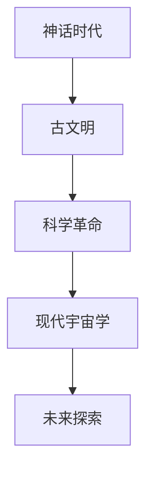
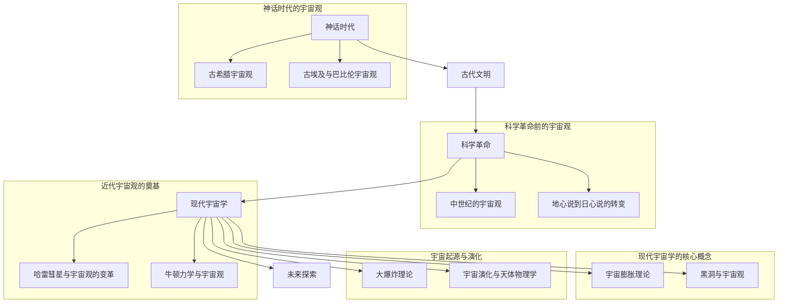

                 

### 文章标题：从神话到科学：宇宙观的演化历程

关键词：宇宙观、神话、科学革命、现代宇宙学、大爆炸理论、黑洞

摘要：本文从神话时代的宇宙观出发，探讨人类对宇宙的认知如何从神秘和超自然的观念，逐步演变成为科学理论。文章分为三个部分，第一部分介绍神话中的宇宙观，包括古代文明的宇宙观念；第二部分讨论科学革命前的宇宙观，从地心说到科学方法的引入；第三部分则聚焦现代宇宙学的核心概念，如大爆炸理论和黑洞。文章旨在通过逻辑清晰的分析，揭示宇宙观演变的历史轨迹及其对科学进步的推动作用。

----------------------------------------------------------------

### 文章关键词

- **宇宙观**
- **神话**
- **科学革命**
- **现代宇宙学**
- **大爆炸理论**
- **黑洞**

### 文章摘要

本文从神话时代的宇宙观出发，探讨了人类对宇宙的认知如何从神秘和超自然的观念，逐步演变成为科学理论。文章分为三个部分。第一部分介绍了神话中的宇宙观，包括古代文明的宇宙观念；第二部分讨论了科学革命前的宇宙观，从地心说到科学方法的引入；第三部分则聚焦现代宇宙学的核心概念，如大爆炸理论和黑洞。通过逻辑清晰的分析，本文揭示了宇宙观演变的历史轨迹及其对科学进步的推动作用。

----------------------------------------------------------------

### 《从神话到科学：宇宙观的演化历程》目录大纲

#### 第一部分：神话与宇宙观的起源

**第1章：神话中的宇宙观**

- **1.1 神话中的宇宙观概述**
  - **1.1.1 宇宙起源的神话描述**
  - **1.1.2 地心说与宇宙观**
  - **1.1.3 多元宇宙观念的探讨**
- **1.2 神话中的自然现象解释**
  - **1.2.1 日月星辰的神话解释**
  - **1.2.2 洪水神话与地球环境变迁**
  - **1.2.3 神话中的自然灾害与宇宙观**

**第2章：古文明与宇宙观的演变**

- **2.1 古希腊的宇宙观**
  - **2.1.1 柏拉图的宇宙理念**
  - **2.1.2 亚里士多德的宇宙观**
  - **2.1.3 希腊神话与宇宙观的关系**
- **2.2 古埃及与巴比伦的宇宙观**
  - **2.2.1 埃及宇宙观的特色**
  - **2.2.2 巴比伦的宇宙观念**
  - **2.2.3 古文明之间的宇宙观交流**

#### 第二部分：科学革命与宇宙观的变革

**第3章：科学革命前的宇宙观**

- **3.1 中世纪的宇宙观**
  - **3.1.1 天主教宇宙观**
  - **3.1.2 地心说的地位**
  - **3.1.3 中世纪对宇宙的探究**
- **3.2 科学革命前的宇宙观演变**
  - **3.2.1 地心说到日心说的转变**
  - **3.2.2 哥白尼的革命性思想**
  - **3.2.3 科学方法在宇宙观研究中的应用**

**第4章：近代宇宙观的奠基**

- **4.1 哈雷彗星与宇宙观的变革**
  - **4.1.1 哈雷彗星的观测与计算**
  - **4.1.2 哈雷彗星对宇宙观的影响**
  - **4.1.3 哈雷彗星与科学革命**
- **4.2 牛顿力学与宇宙观**
  - **4.2.1 牛顿力学的基本原理**
  - **4.2.2 牛顿力学对宇宙观的贡献**
  - **4.2.3 牛顿力学与宗教观念的冲突**

#### 第三部分：现代宇宙观的探索

**第5章：现代宇宙学的核心概念**

- **5.1 宇宙膨胀理论**
  - **5.1.1 宇宙膨胀的基本原理**
  - **5.1.2 宇宙膨胀的证据**
  - **5.1.3 宇宙膨胀理论的影响**
- **5.2 黑洞与宇宙观**
  - **5.2.1 黑洞的概念与特性**
  - **5.2.2 黑洞与宇宙学的关系**
  - **5.2.3 黑洞探测技术的发展**

**第6章：宇宙起源与演化**

- **6.1 大爆炸理论**
  - **6.1.1 大爆炸理论的提出**
  - **6.1.2 大爆炸理论的证据**
  - **6.1.3 大爆炸理论的争议**
- **6.2 宇宙演化与天体物理学**
  - **6.2.1 星系的形成与演化**
  - **6.2.2 恒星演化的不同阶段**
  - **6.2.3 宇宙背景辐射的发现**

**第7章：未来的宇宙观**

- **7.1 宇宙学与哲学的交汇**
  - **7.1.1 宇宙学中的哲学问题**
  - **7.1.2 哲学与宇宙学的相互影响**
  - **7.1.3 宇宙学对宗教观念的挑战**
- **7.2 未来的宇宙探索**
  - **7.2.1 未来宇宙观测技术的发展**
  - **7.2.2 宇宙探索的潜在目标**
  - **7.2.3 宇宙观的未来发展趋势**

#### 附录

**附录A：宇宙观相关的参考文献与资源**

- **A.1 主要参考书籍**
- **A.2 宇宙学在线资源**
- **A.3 宇宙观相关的论文与研究报告**

# Mermaid 流程图：宇宙观的演化过程



----------------------------------------------------------------

### 第一部分：神话与宇宙观的起源

#### 第1章：神话中的宇宙观

##### 1.1 神话中的宇宙观概述

在人类历史的初期，宇宙观主要受到神话和宗教的影响。这些神话不仅描述了宇宙的起源，还解释了自然现象和人类存在的意义。不同的文化背景下，神话中的宇宙观各有特色，但都反映出人类对宇宙的原始认知。

神话中的宇宙观通常具有以下特点：

- **宇宙的起源**：多数神话中，宇宙起源于某种神秘的力量或神灵。例如，希腊神话中的克洛诺斯和混沌，北欧神话中的原始混沌。

- **宇宙的结构**：许多神话将宇宙视为多层次的存在，如天堂、人间和地狱。这些层次通常由不同的神灵或超自然力量所统治。

- **人类与宇宙的关系**：神话中的宇宙观常常将人类视为宇宙的中心，强调人类与神灵的密切联系。

##### 1.1.1 宇宙起源的神话描述

不同的文化对宇宙起源的描述各有不同，但大多数神话都试图解释宇宙从无到有的过程。

- **创世神话**：在许多文化中，创世神话是宇宙观的重要组成部分。例如，希伯来圣经中的创世记描述了上帝创造宇宙的过程。

  ```mermaid
  graph TD
  A[无]
  B[上帝]
  C[天地]
  D[光暗]
  E[动植物]
  F[人类]

  A --> B
  B --> C
  C --> D
  D --> E
  E --> F
  ```

- **印度教神话**：印度教神话中，宇宙起源于大梵天（Brahma）的“蛋”。这个“蛋”在数亿年后裂开，产生了天地万物。

  ```mermaid
  graph TD
  A[大梵天的“蛋”]
  B[天地万物]

  A --> B
  ```

- **中国神话**：《盘古开天地》是中国神话中的一个著名故事。盘古在混沌中诞生，死后身体化为天地万物。

  ```mermaid
  graph TD
  A[盘古]
  B[天地万物]

  A --> B
  ```

##### 1.1.2 地心说与宇宙观

地心说是古代宇宙观的一种重要形式，认为地球位于宇宙的中心，静止不动，而其他天体围绕地球运动。这种观念在古代希腊、中国和阿拉伯等文化中都有体现。

- **古希腊地心说**：亚里士多德是地心说的主要支持者之一。他认为地球是宇宙的中心，天体围绕地球做匀速圆周运动。

  ```mermaid
  graph TD
  A[地球]
  B[太阳]
  C[月亮]
  D[行星]

  B --> A
  C --> A
  D --> A
  ```

- **中国地心说**：中国古代的《周髀算经》等文献中也提出了地心说。认为天圆地方，天如斗笠，地如覆盘。

  ```mermaid
  graph TD
  A[天]
  B[地]

  A --> B
  ```

##### 1.1.3 多元宇宙观念的探讨

在神话中，多元宇宙观念也得到了体现。多元宇宙认为存在多个宇宙，每个宇宙都有其独特的特征和法则。

- **平行宇宙**：许多神话中都提到了平行宇宙的存在。例如，在北欧神话中，世界树（Yggdrasil）的根部连接了不同的世界。

  ```mermaid
  graph TD
  A[主宇宙]
  B[平行宇宙1]
  C[平行宇宙2]
  D[世界树]

  A --> D
  B --> D
  C --> D
  ```

- **神界与人间**：许多神话都将宇宙分为神界和人间。例如，在中国神话中，天宫是神居住的地方，而人间则是凡人生活的世界。

  ```mermaid
  graph TD
  A[天宫]
  B[人间]

  A --> C
  B --> C
  ```

##### 1.2 神话中的自然现象解释

神话不仅是宇宙观的体现，也是对自然现象的解释。在古代，人们对自然现象缺乏科学理解，因此通过神话来解释这些现象。

- **日月星辰的神话解释**：许多神话都将日月星辰视为神灵或神物的象征。例如，太阳被视为光明之神，月亮被视为月神。

  ```mermaid
  graph TD
  A[太阳]
  B[光明之神]

  A --> B
  ```

- **洪水神话与地球环境变迁**：许多文化都有洪水神话，描述了地球环境的大变迁。例如，诺亚方舟和中国的共工触山神话。

  ```mermaid
  graph TD
  A[洪水]
  B[地球环境变迁]

  A --> B
  ```

- **神话中的自然灾害与宇宙观**：神话中的自然灾害，如地震、火山喷发等，也被视为神灵的愤怒或宇宙的惩罚。

  ```mermaid
  graph TD
  A[自然灾害]
  B[宇宙观]

  A --> B
  ```

##### 1.3 小结

神话中的宇宙观是人类早期对宇宙的认知和解释。虽然这些观念在今天看来可能是神秘和超自然的，但它们反映了人类对自然世界的探索和思考。从神话到科学的演变，是人类认知不断进步的过程。这一部分的内容为后续的科学探讨提供了历史背景和理论基础。

----------------------------------------------------------------

#### 第2章：古文明与宇宙观的演变

##### 2.1 古希腊的宇宙观

古希腊文明对宇宙观的贡献是巨大的，其中以哲学家们的理论最为著名。古希腊的宇宙观不仅影响了西方哲学，也对后来的科学方法产生了深远的影响。

- **柏拉图的宇宙理念**：柏拉图认为宇宙是由理性和形式构成的，而现实世界只是理性和形式的不完美映射。柏拉图将宇宙分为两个层次：理式的世界和感官的世界。理式的世界是真实的世界，感官的世界是理式的世界的影子。

  ```mermaid
  graph TD
  A[理式的世界]
  B[感官的世界]

  A --> B
  ```

- **亚里士多德的宇宙观**：亚里士多德是古希腊哲学的集大成者，他的宇宙观以地心说为基础。他认为地球是宇宙的中心，天体围绕地球做匀速圆周运动。亚里士多德还提出了四元素说，即地、水、火、风，认为这四种元素是构成宇宙的基本物质。

  ```mermaid
  graph TD
  A[地]
  B[水]
  C[火]
  D[风]

  A --> B
  B --> C
  C --> D
  ```

- **希腊神话与宇宙观的关系**：希腊神话中的故事和人物通常与宇宙观紧密相关。例如，宙斯是天空和雷电的神，代表宇宙的统治力量。雅典娜是智慧女神，代表理性和思考的力量。

  ```mermaid
  graph TD
  A[宙斯]
  B[雅典娜]

  A --> C
  B --> C
  ```

##### 2.2 古埃及与巴比伦的宇宙观

古埃及和巴比伦的宇宙观也与哲学和宗教密切相关。这些古代文明的宇宙观不仅描述了宇宙的结构，还反映了他们对神灵和自然力量的信仰。

- **古埃及宇宙观**：古埃及人相信宇宙是由太阳神拉（Ra）创造的。他们认为太阳每天从东方升起，穿越天空，然后在西方落下。这种观念反映了他们对太阳神和日光的崇拜。

  ```mermaid
  graph TD
  A[太阳神拉]
  B[日出]
  C[日落]

  A --> B
  B --> C
  ```

- **巴比伦宇宙观**：巴比伦人则认为宇宙是由众神创造的，这些神灵分别掌管不同的天体和自然现象。例如，恩利尔（Enlil）是风和风暴的神，恩基（Enki）是智慧和水的神。

  ```mermaid
  graph TD
  A[恩利尔]
  B[恩基]
  C[天体和自然现象]

  A --> B
  A --> C
  B --> C
  ```

- **古文明之间的宇宙观交流**：古代文明之间的交流促进了宇宙观的发展。例如，古埃及的天文学知识可能通过贸易和交流传到了希腊。希腊哲学家亚里士多德的一些宇宙观观点可能受到了古埃及的影响。

  ```mermaid
  graph TD
  A[古埃及]
  B[希腊]

  A --> B
  ```

##### 2.3 小结

古埃及和巴比伦的宇宙观反映了他们对神灵和自然力量的深刻理解。尽管这些观念与古希腊的理性主义有所不同，但它们都为后来的科学和哲学发展提供了丰富的素材。通过古代文明的交流和碰撞，宇宙观逐渐从神秘走向理性，为现代科学的诞生奠定了基础。

----------------------------------------------------------------

### 第二部分：科学革命与宇宙观的变革

#### 第3章：科学革命前的宇宙观

在中世纪，宇宙观主要受到宗教和哲学的影响，地心说占据主导地位。这一章将探讨中世纪的宇宙观，以及地心说到日心说的转变过程。

##### 3.1 中世纪的宇宙观

中世纪的宇宙观以地心说为核心，认为地球是宇宙的中心，静止不动，而其他天体围绕地球运动。这一观念在古希腊哲学家亚里士多德的基础上得到进一步发展。

- **天主教宇宙观**：在中世纪的欧洲，天主教教会是文化和知识的中心。教会支持地心说，并将其作为宗教信仰的一部分。地心说被视为《圣经》和神学家亚里士多德的理论支持，因此被认为是无可争议的真理。

  ```mermaid
  graph TD
  A[地球]
  B[太阳]
  C[月亮]
  D[行星]

  A --> B
  A --> C
  A --> D
  ```

- **地心说的地位**：地心说在中世纪得到了广泛的认同，不仅是哲学和宗教的基础，也是天文学和数学的基础。中世纪的天文学家如托勒密（Ptolemy）通过复杂的数学模型来解释行星的运动，这些模型都基于地心说。

- **中世纪对宇宙的探究**：尽管中世纪的天文学家和哲学家对宇宙的研究受到地心说的限制，但他们仍然进行了大量的观测和计算。例如，托勒密编制了《天文学大成》，这是中世纪最重要的天文学著作，详细记录了行星的运动。

##### 3.2 科学革命前的宇宙观演变

随着科学方法的发展，人们对宇宙的认识开始发生变革。地心说到日心说的转变是这一过程中最重要的里程碑。

- **地心说到日心说的转变**：哥白尼（Nicolas Copernicus）是这一变革的关键人物。他在16世纪提出了日心说，认为太阳而不是地球是宇宙的中心，地球和其他行星围绕太阳运动。

  ```mermaid
  graph TD
  A[太阳]
  B[地球]
  C[行星]

  A --> B
  A --> C
  ```

哥白尼的《天体运行论》是科学革命的重要标志，它挑战了长期以来被接受的地心说，并为后来的天文学研究奠定了基础。

- **哥白尼的革命性思想**：哥白尼的思想不仅是对宇宙观的重大改变，也是科学方法的一次突破。他采用了观察和数学计算的方法来验证他的理论，这种方法对后来的科学研究产生了深远的影响。

- **科学方法在宇宙观研究中的应用**：哥白尼的工作标志着科学方法在宇宙观研究中的首次应用。他通过观测和数学模型来解释行星的运动，这种方法促进了科学革命的发展。

##### 3.3 小结

中世纪的宇宙观以地心说为核心，但随着科学方法的发展，人们开始质疑这一传统观念。哥白尼的日心说标志着宇宙观的一次重大变革，它不仅改变了人们对宇宙的认识，也为科学革命奠定了基础。这一转变展示了科学方法在宇宙观研究中的重要性，为后来的科学研究打开了新的大门。

----------------------------------------------------------------

### 第4章：近代宇宙观的奠基

在科学革命之后，宇宙观逐渐从哲学和宗教的束缚中解放出来，进入了科学探索的新时代。这一章将探讨近代宇宙观的奠基，包括哈雷彗星与宇宙观的变革、牛顿力学与宇宙观的贡献，以及这一时期的科学进展。

##### 4.1 哈雷彗星与宇宙观的变革

哈雷彗星（Halley's Comet）的回归是科学革命的一个重要里程碑，它不仅证明了彗星是来自宇宙的物体，还揭示了天体运动的规律。

- **哈雷彗星的观测与计算**：哈雷彗星是历史上被记录得最详细的彗星之一。英国天文学家爱德蒙·哈雷（Edmond Halley）通过对历史彗星记录的分析，预测了这颗彗星的回归。他的计算基于开普勒定律，这些定律描述了行星围绕太阳运动的规律。

  ```mermaid
  graph TD
  A[历史彗星记录]
  B[开普勒定律]
  C[哈雷彗星预测]

  A --> B
  B --> C
  ```

- **哈雷彗星对宇宙观的影响**：哈雷彗星的观测和预测不仅证明了彗星是宇宙的一部分，也挑战了地心说的传统观念。它表明天体运动是可以预测的，这为后来的科学研究提供了新的思路。

- **哈雷彗星与科学革命**：哈雷彗星的观测和预测是科学革命的一个重要标志。它展示了科学方法的力量，证明了人类可以通过观察和计算来理解宇宙。这一事件推动了人们对宇宙认知的转变，从宗教和哲学的束缚中走向科学探索的新时代。

##### 4.2 牛顿力学与宇宙观

艾萨克·牛顿（Isaac Newton）是近代科学史上最重要的科学家之一，他的牛顿力学对宇宙观产生了深远的影响。

- **牛顿力学的基本原理**：牛顿力学包括三个基本定律：惯性定律、加速度定律和作用-反作用定律。这些定律描述了物体运动的规律，为理解宇宙提供了新的工具。

  ```mermaid
  graph TD
  A[惯性定律]
  B[加速度定律]
  C[作用-反作用定律]

  A --> B
  A --> C
  ```

- **牛顿力学对宇宙观的贡献**：牛顿力学提供了描述天体运动的精确数学模型。这些模型不仅解释了行星的运动，也解释了地球上的物体运动。牛顿的万有引力定律表明，宇宙中的所有物体都相互吸引，这种吸引力是维持宇宙结构的重要因素。

  ```mermaid
  graph TD
  A[行星运动]
  B[物体运动]
  C[万有引力定律]

  A --> B
  A --> C
  ```

- **牛顿力学与宗教观念的冲突**：牛顿力学的科学成果与当时流行的宗教观念产生了冲突。传统的宗教观念认为宇宙是神创造的，而牛顿力学表明宇宙遵循自然法则。这种冲突推动了科学和宗教的分离，也为科学的发展创造了更加自由的学术环境。

##### 4.3 小结

近代宇宙观的奠基离不开哈雷彗星和牛顿力学的贡献。哈雷彗星的观测和预测展示了科学方法的力量，挑战了传统的宇宙观念。牛顿力学则为理解宇宙提供了新的工具，揭示了宇宙中的基本规律。这些科学进展不仅改变了人们对宇宙的认知，也为后来的科学研究奠定了基础。近代宇宙观的奠基标志着科学时代的到来，为现代宇宙学的诞生打下了坚实的基础。

----------------------------------------------------------------

### 第5章：现代宇宙学的核心概念

现代宇宙学的发展离不开对宇宙膨胀理论、黑洞和宇宙起源与演化的深入研究。这一章将探讨这些核心概念，以及它们对现代宇宙观的影响。

##### 5.1 宇宙膨胀理论

宇宙膨胀理论是现代宇宙学的基础之一，它描述了宇宙从大爆炸以来不断扩张的过程。

- **宇宙膨胀的基本原理**：根据宇宙膨胀理论，宇宙在距今大约138亿年前开始膨胀，并且这种膨胀速度在加速。这一理论的核心是宇宙背景辐射（Cosmic Microwave Background Radiation，CMB），这是宇宙早期辐射的余辉。

  ```mermaid
  graph TD
  A[宇宙背景辐射]
  B[宇宙膨胀]

  A --> B
  ```

- **宇宙膨胀的证据**：宇宙膨胀的证据包括多个方面，其中最直接的是宇宙背景辐射的观测。宇宙背景辐射的发现证明了宇宙曾经处于一个极度热密的状态，并在此后的膨胀过程中冷却下来。此外，红移现象也是宇宙膨胀的证据，远处的星系光谱向红色端偏移，表明它们在远离我们。

  ```mermaid
  graph TD
  A[红移]
  B[宇宙膨胀]

  A --> B
  ```

- **宇宙膨胀理论的影响**：宇宙膨胀理论改变了人们对宇宙的理解。它表明宇宙有一个起点，即大爆炸，并且宇宙的膨胀是不断进行的。这一理论不仅挑战了传统的宇宙观念，也为研究宇宙的起源和演化提供了新的视角。

##### 5.2 黑洞与宇宙观

黑洞是宇宙中最神秘和强大的物体之一，它们对现代宇宙学的研究产生了深远的影响。

- **黑洞的概念与特性**：黑洞是由极端密集的物质组成的天体，它的引力场如此强大，以至于连光也无法逃逸。黑洞的形成通常与恒星演化的最后阶段相关，大质量恒星在耗尽其核燃料后会发生坍缩，形成黑洞。

  ```mermaid
  graph TD
  A[恒星坍缩]
  B[黑洞形成]

  A --> B
  ```

- **黑洞与宇宙学的关系**：黑洞是宇宙中的一种重要现象，它们不仅影响星系的演化，也可能是宇宙能量的来源之一。黑洞的存在和性质提供了研究宇宙极端条件下物质和能量行为的窗口。

  ```mermaid
  graph TD
  A[黑洞]
  B[宇宙学]

  A --> B
  ```

- **黑洞探测技术的发展**：随着观测技术的进步，黑洞的探测和成像技术也得到了显著提升。例如，激光干涉引力波观测站（LIGO）和事件视界望远镜（EHT）等设备成功探测到了引力波和黑洞合并事件，为我们提供了直接观测黑洞的证据。

  ```mermaid
  graph TD
  A[激光干涉引力波观测站]
  B[事件视界望远镜]
  C[黑洞探测]

  A --> B
  B --> C
  ```

##### 5.3 小结

现代宇宙学的核心概念，如宇宙膨胀理论和黑洞，不仅丰富了我们对宇宙的理解，也推动了科学技术的进步。宇宙膨胀理论揭示了宇宙的起源和演化，黑洞的研究则为我们提供了探索宇宙极端条件的途径。这些核心概念改变了我们对宇宙的认知，使我们能够更好地理解这个浩瀚无垠的宇宙。

----------------------------------------------------------------

### 第6章：宇宙起源与演化

宇宙起源与演化的研究是现代宇宙学的核心问题之一，涉及到宇宙如何从一个极热、极密的状态演化为今天我们所见的宇宙。这一章将探讨大爆炸理论的提出、证据与争议，以及宇宙演化的主要阶段。

##### 6.1 大爆炸理论

大爆炸理论（Big Bang Theory）是描述宇宙起源和演化的一种科学理论。它提出，宇宙起源于约138亿年前的一个极度热密的状态，然后开始膨胀和冷却。

- **大爆炸理论的提出**：大爆炸理论最初由伽莫夫（George Gamow）和他的同事们提出。他们基于量子力学和相对论的理论，预测了宇宙早期的极端条件，并推断宇宙从大爆炸以来一直在膨胀。

  ```mermaid
  graph TD
  A[量子力学]
  B[相对论]
  C[宇宙膨胀]
  D[大爆炸理论]

  A --> B
  B --> C
  C --> D
  ```

- **大爆炸理论的证据**：大爆炸理论的证据主要包括宇宙背景辐射（Cosmic Microwave Background Radiation，CMB）和宇宙膨胀的观测。宇宙背景辐射是宇宙早期辐射的余辉，它的发现提供了大爆炸的直接证据。此外，红移现象和宇宙膨胀的速度也支持了大爆炸理论。

  ```mermaid
  graph TD
  A[宇宙背景辐射]
  B[红移现象]
  C[宇宙膨胀速度]
  D[大爆炸理论]

  A --> B
  B --> C
  C --> D
  ```

- **大爆炸理论的争议**：尽管大爆炸理论得到了广泛的接受，但仍然存在一些争议。一些科学家对宇宙膨胀的加速度提出了质疑，认为可能存在其他解释。此外，大爆炸理论中的“奇点”问题也是一个争议的焦点，因为奇点代表了时间和空间的起点，但我们对这一点的理解仍然有限。

  ```mermaid
  graph TD
  A[宇宙膨胀加速度]
  B[奇点问题]
  C[大爆炸理论争议]

  A --> B
  B --> C
  ```

##### 6.2 宇宙演化与天体物理学

宇宙的演化是一个复杂而漫长的过程，涉及到星系的形成、恒星演化的不同阶段，以及宇宙背景辐射的发现。

- **星系的形成与演化**：星系是宇宙中最大的结构，由数十亿颗恒星、行星、星云等组成。星系的形成过程涉及气体和暗物质的聚集，以及引力塌缩。现代天体物理学的观测技术，如哈勃太空望远镜，为我们提供了观察星系形成和演化的窗口。

  ```mermaid
  graph TD
  A[气体和暗物质]
  B[引力塌缩]
  C[星系形成]
  D[星系演化]

  A --> B
  B --> C
  C --> D
  ```

- **恒星演化的不同阶段**：恒星是宇宙中最基本的能量来源，它们的演化过程可以分为多个阶段，包括主序星、红巨星、白矮星、中子星和黑洞。每个阶段都涉及到核反应、物质转移和辐射过程。

  ```mermaid
  graph TD
  A[主序星]
  B[红巨星]
  C[白矮星]
  D[中子星]
  E[黑洞]

  A --> B
  B --> C
  C --> D
  D --> E
  ```

- **宇宙背景辐射的发现**：宇宙背景辐射是宇宙大爆炸的余辉，它在1978年被美国科学家彭齐亚斯（Arno Penzias）和威尔逊（Robert Wilson）首次发现。这一发现为验证大爆炸理论提供了重要的证据，也奠定了现代宇宙学的基础。

  ```mermaid
  graph TD
  A[彭齐亚斯和威尔逊]
  B[宇宙背景辐射]

  A --> B
  ```

##### 6.3 小结

宇宙起源与演化的研究是现代宇宙学的核心问题之一，涉及到宇宙从一个极热、极密的状态演化为今天我们所见的宇宙。大爆炸理论提供了宇宙起源的基本框架，而宇宙演化的不同阶段和天体物理学的观测技术则为这一理论提供了证据和支持。尽管存在一些争议，但这些研究为我们理解宇宙的本质提供了宝贵的视角。

----------------------------------------------------------------

### 第7章：未来的宇宙观

随着科技的不断进步，我们对宇宙的认知也在不断深化。未来的宇宙观将受到多种因素的影响，包括哲学、科学和技术的发展。这一章将探讨宇宙学与哲学的交汇、未来宇宙探索的潜在目标和宇宙观的未来发展趋势。

##### 7.1 宇宙学与哲学的交汇

宇宙学与哲学的关系源远流长。哲学问题常常涉及宇宙的本质、起源和意义，这些问题也驱动着宇宙学的研究。在未来的宇宙观中，哲学与宇宙学的交汇将更加紧密。

- **宇宙学中的哲学问题**：宇宙学中的许多问题，如宇宙的起源、宇宙的终极命运、时间和无时间等问题，都是哲学问题。这些问题不仅挑战了科学方法的边界，也促使哲学家和宇宙学家合作寻找答案。

  ```mermaid
  graph TD
  A[宇宙起源]
  B[宇宙命运]
  C[时间和无时间]

  A --> B
  A --> C
  ```

- **哲学与宇宙学的相互影响**：哲学对宇宙学的影响体现在对科学方法的反思和哲学问题的探讨上。例如，托马斯·库恩（Thomas Kuhn）的范式理论对科学革命的理解，以及对科学进步的推动作用。同时，宇宙学的研究成果也为哲学提供了新的问题和视角。

  ```mermaid
  graph TD
  A[科学方法]
  B[哲学问题]
  C[宇宙学研究]

  A --> B
  B --> C
  ```

- **宇宙学对宗教观念的挑战**：宇宙学的进步对某些宗教观念提出了挑战。例如，大爆炸理论和黑洞的存在挑战了某些宗教对宇宙起源和命运的解释。这些挑战促使宗教与科学进行对话和调和，以寻找新的理解。

  ```mermaid
  graph TD
  A[大爆炸理论]
  B[黑洞]
  C[宗教观念]

  A --> B
  B --> C
  ```

##### 7.2 未来的宇宙探索

未来的宇宙探索将依赖于科技的进步，包括新型观测技术、航天器和人工智能的应用。这些科技进步将为我们提供更深入的了解宇宙的机会。

- **未来宇宙观测技术的发展**：新型望远镜和探测器的发展将使我们能够观测到更远的宇宙。例如，欧几里得太空望远镜（Euclid）和詹姆斯·韦伯太空望远镜（James Webb Space Telescope）等设备将帮助我们探索宇宙的深层结构和演化。

  ```mermaid
  graph TD
  A[新型望远镜]
  B[探测器]
  C[宇宙探索]

  A --> B
  B --> C
  ```

- **宇宙探索的潜在目标**：未来的宇宙探索将聚焦于寻找生命、理解宇宙的终极命运，以及探索宇宙的基本法则。这些目标包括搜寻地外行星、研究宇宙背景辐射的细微变化，以及探测黑洞和中子星等极端天体。

  ```mermaid
  graph TD
  A[地外行星]
  B[宇宙背景辐射]
  C[黑洞和中子星]
  D[宇宙探索目标]

  A --> B
  B --> C
  C --> D
  ```

- **宇宙观的未来发展趋势**：随着对宇宙认知的加深，宇宙观的未来发展趋势可能包括对宇宙多样性的认识、对宇宙起源的更深入理解，以及对宇宙中潜在的超自然现象的探索。这些发展趋势将推动宇宙学不断进步，为我们揭示宇宙的更多奥秘。

  ```mermaid
  graph TD
  A[宇宙多样性]
  B[宇宙起源]
  C[超自然现象]
  D[宇宙观发展趋势]

  A --> B
  B --> C
  C --> D
  ```

##### 7.3 小结

未来的宇宙观将是一个充满挑战和机遇的领域。随着科技的进步，我们将能够更深入地探索宇宙，理解宇宙的本质和起源。哲学与宇宙学的交汇将继续推动我们对宇宙的认知，而宇宙探索的潜在目标将引领我们走向未知的宇宙深处。未来的宇宙观将是一个持续发展的领域，它将不断揭示宇宙的奥秘，并为我们提供对生命和宇宙的新理解。

----------------------------------------------------------------

### 附录A：宇宙观相关的参考文献与资源

在研究宇宙观的过程中，参考相关的文献和资源是必不可少的。以下列出了一些主要参考书籍、在线资源和相关论文与研究报告，以供进一步学习和研究。

#### A.1 主要参考书籍

1. **《宇宙简史》（The Brief History of Time）** - 斯蒂芬·霍金（Stephen Hawking）
   - 简介：这是一本广受欢迎的科普书籍，详细介绍了宇宙的起源、演化以及物理学的最新进展。

2. **《宇宙学导论》（An Introduction to Cosmology）** - 斯图尔特·洛克利（Stuart A. heal）
   - 简介：本书系统地介绍了宇宙学的基本概念、理论和观测技术，适合初学者阅读。

3. **《宇宙的起源与演化》（The Origin and Evolution of the Universe）** - 约翰·布罗克（John A. Peacock）
   - 简介：本书深入探讨了宇宙学的理论基础，包括宇宙膨胀理论、宇宙背景辐射和宇宙大爆炸理论。

#### A.2 宇宙学在线资源

1. **NASA宇宙学教程（NASA's Cosmic Legacy Tutorial）**
   - 简介：这是一个在线教程，涵盖了宇宙学的多个主题，包括宇宙的起源、演化、星系形成和黑洞。

2. **宇宙学在线（Cosmology Online）**
   - 简介：这是一个综合性的宇宙学网站，提供了大量的宇宙学文章、视频和教学资源。

3. **宇宙背景辐射观测（Cosmic Microwave Background Data Center）**
   - 简介：这是一个专门提供宇宙背景辐射观测数据的网站，包括多个实验的数据和图像。

#### A.3 宇宙观相关的论文与研究报告

1. **“The Three-Component Model of the Cosmic Microwave Background Radiation”** - R. A.Sunyaev and A. A. Starobinsky
   - 简介：这篇论文提出了宇宙背景辐射的三成分模型，对理解宇宙背景辐射的结构和演化具有重要意义。

2. **“The Dark Matter Problem in Cosmology”** - M. Persi & F. Syer
   - 简介：本文讨论了宇宙学中暗物质的问题，包括暗物质的性质、探测方法和对宇宙演化的影响。

3. **“Gravitational Waves from Binary Black Holes: A New Window to the Universe”** - B. P. Abbott et al. (LIGO Scientific Collaboration)
   - 简介：这篇论文介绍了引力波的探测和其对宇宙学的贡献，特别是对黑洞合并事件的理解。

#### A.4 小结

通过阅读这些参考文献和资源，读者可以更深入地了解宇宙观的起源、发展以及现代宇宙学的核心概念。这些资料不仅提供了丰富的信息，也为进一步的研究提供了方向和启发。希望这些资源能够帮助读者在探索宇宙奥秘的道路上取得更大的成就。

----------------------------------------------------------------

### Mermaid 流程图：宇宙观的演化过程

以下是宇宙观从神话到现代科学的演化过程的 Mermaid 流程图：



这个流程图展示了宇宙观从神话时代到现代宇宙学的演变过程，以及各个时期的重要事件和理论。通过这个流程图，读者可以更清晰地理解宇宙观的历史和发展脉络。

