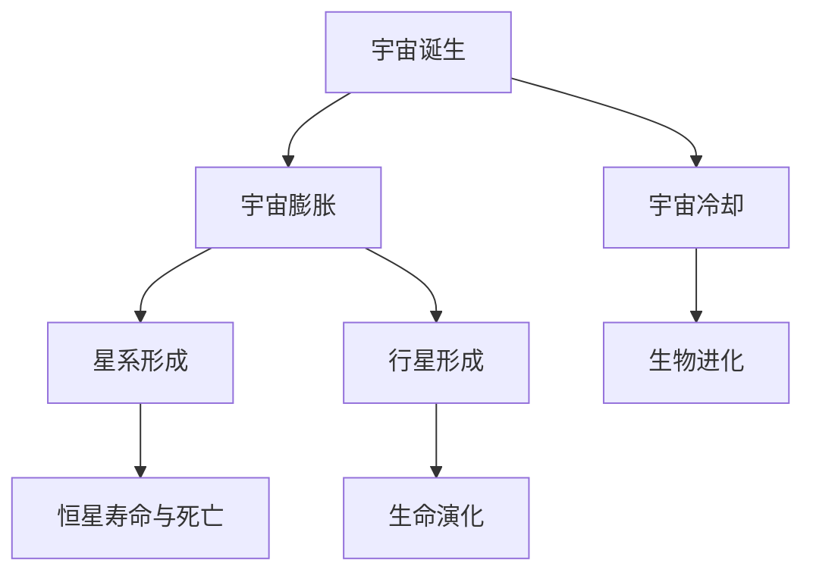
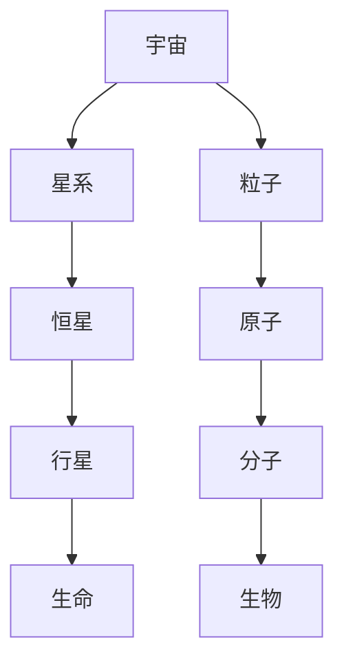

                 


### 《从粒子到意识：宇宙的层级结构》

#### 关键词：
- 宇宙层级结构
- 粒子物理学
- 意识
- 暗物质
- 暗能量

#### 摘要：
本文旨在深入探讨宇宙的层级结构，从最基本的粒子层面到意识层面的演化过程。文章首先介绍了宇宙的起源和演化，接着讨论了粒子的性质和相互作用，以及原子和分子的构成。然后，文章转向宇宙中的层级结构，包括行星、恒星、星系以及整个宇宙的层次结构。最后，文章探讨了人类在宇宙中的角色与责任，以及宇宙的未来。

## 第一部分：宇宙的基本构成

### 第1章：宇宙的起源与演化

#### 1.1 宇宙的诞生
宇宙的起源是一个极具争议的话题，目前最流行的理论是“大爆炸理论”。根据这一理论，宇宙起源于一个极为密集、高温、高能量的奇点，随后开始膨胀。这一理论得到了大量观测数据的支持，如宇宙背景辐射、宇宙膨胀速率等。

**核心概念与联系：**

**Mermaid 流程图：**


#### 1.2 宇宙的膨胀
宇宙的膨胀是指宇宙中的空间在不断地扩展。这一现象最早是由埃德温·哈勃发现的，他观察到遥远星系的光谱红移现象，这表明这些星系正在远离我们，且速度与距离成正比。

**核心算法原理讲解：**
宇宙膨胀可以用哈勃定律来描述，其公式为：
$$ V = V_0 \cdot e^{Ht} $$
其中，$V$ 是膨胀速度，$V_0$ 是初始膨胀速度，$H$ 是哈勃常数，$t$ 是时间。

**数学模型与公式详细讲解：**
哈勃常数 $H$ 是一个关键参数，其数值约为 $70 \text{ km/s/Mpc}$。利用哈勃定律，我们可以计算出宇宙在不同时间点的膨胀速度。
举例来说，如果我们在某一时刻观察到星系的距离为 $100 \text{ Mpc}$，则该星系的膨胀速度为：
$$ V = 70 \text{ km/s/Mpc} \cdot 100 \text{ Mpc} = 7000 \text{ km/s} $$

#### 1.3 暗物质与暗能量
暗物质和暗能量是宇宙中两个神秘的现象。暗物质是不发光、不发热的物质，但其存在可以通过引力效应观测到。暗能量则是推动宇宙加速膨胀的力量。

**核心算法原理讲解：**
暗物质和暗能量的研究涉及到宇宙学中的许多复杂模型，如广义相对论和宇宙学原理。这些模型可以帮助我们理解宇宙的膨胀和结构形成。

**数学模型与公式详细讲解：**
暗物质和暗能量的研究依赖于宇宙背景辐射的数据，这些数据可以帮助我们计算出宇宙的密度和膨胀速度。例如，我们可以使用以下公式来估算宇宙的临界密度：
$$ \rho_c = \frac{3H^2}{8\pi G} $$
其中，$\rho_c$ 是临界密度，$H$ 是哈勃常数，$G$ 是万有引力常数。

### 第2章：粒子的世界

#### 2.1 粒子的性质
粒子是构成物质的基本单位，它们具有质量、电荷等基本属性。根据粒子的性质，我们可以将它们分为费米子和玻色子。

**核心算法原理讲解：**
粒子的性质可以通过量子场论来描述。量子场论是一种描述粒子行为的数学框架，它涉及到希尔伯特空间、算符和波函数等概念。

**数学模型与公式详细讲解：**
例如，我们可以使用薛定谔方程来描述粒子的行为，其公式为：
$$ i\hbar \frac{\partial}{\partial t} \Psi = \hat{H} \Psi $$
其中，$\Psi$ 是波函数，$\hat{H}$ 是哈密顿算符，$i$ 是虚数单位，$\hbar$ 是约化普朗克常数。

#### 2.2 粒子的相互作用
粒子之间通过相互作用来产生各种物理现象。主要的相互作用有四种：引力、电磁力、强力和弱力。

**核心算法原理讲解：**
粒子的相互作用可以通过拉格朗日量来描述。拉格朗日量是一种描述物理系统的数学工具，它涉及到哈密顿量、动量和势能等概念。

**数学模型与公式详细讲解：**
例如，电磁相互作用可以用洛伦兹力公式来描述，其公式为：
$$ \vec{F} = q\vec{E} + q\vec{v}\times\vec{B} $$
其中，$\vec{F}$ 是力，$q$ 是电荷，$\vec{E}$ 是电场，$\vec{v}$ 是速度，$\vec{B}$ 是磁场。

#### 2.3 基本粒子分类
基本粒子可以分为费米子和玻色子。费米子是具有半整数自旋的粒子，如电子、夸克等。玻色子是具有整数自旋的粒子，如光子、W和Z玻色子等。

**核心算法原理讲解：**
基本粒子的分类可以通过量子场论来描述。量子场论可以区分不同的粒子和它们的相互作用。

**数学模型与公式详细讲解：**
例如，费米子和玻色子的分类可以通过以下公式来描述：
$$ \text{自旋} = \frac{1}{2}, \text{费米子} $$
$$ \text{自旋} = 1, \text{玻色子} $$

## 第二部分：宇宙中的层级结构

### 第3章：原子与分子

#### 3.1 原子的结构
原子是构成物质的基本单位，它由原子核和核外电子组成。原子核由质子和中子组成，而核外电子则绕着原子核运动。

**核心算法原理讲解：**
原子的结构可以通过量子力学来描述。量子力学是一种描述微观世界的数学框架，它涉及到波函数、算符和态叠加等概念。

**数学模型与公式详细讲解：**
例如，我们可以使用波尔模型来描述氢原子的结构，其公式为：
$$ E_n = -\frac{e^2}{2a_0(n^2)} $$
其中，$E_n$ 是能级，$e$ 是电子电荷，$a_0$ 是玻尔半径，$n$ 是主量子数。

#### 3.2 分子的形成
分子是由两个或更多原子通过化学键结合而成的。化学键是一种强烈的相互作用力，它使得分子具有稳定的结构。

**核心算法原理讲解：**
分子的形成可以通过分子轨道理论来描述。分子轨道理论是一种描述分子结构和化学键的数学框架，它涉及到原子轨道、分子轨道和能级等概念。

**数学模型与公式详细讲解：**
例如，我们可以使用Hückel分子轨道理论来描述苯分子的结构，其公式为：
$$ \psi_{\pi} = \frac{1}{\sqrt{2}}(\phi_{p_x} + \phi_{p_y}) $$
其中，$\psi_{\pi}$ 是π分子轨道，$\phi_{p_x}$ 和 $\phi_{p_y}$ 是p轨道。

#### 3.3 分子的性质与反应
分子具有独特的性质，如极性、反应性等。这些性质决定了分子的生物学和化学功能。

**核心算法原理讲解：**
分子的性质和反应可以通过量子化学计算来描述。量子化学计算是一种使用量子力学原理来计算分子性质和反应路径的数学方法。

**数学模型与公式详细讲解：**
例如，我们可以使用密度泛函理论来计算分子的极性，其公式为：
$$ \mu = -\frac{\partial}{\partial V}\langle \Psi | \hat{p} | \Psi \rangle $$
其中，$\mu$ 是偶极矩，$V$ 是体积，$\hat{p}$ 是动量算符，$|\Psi\rangle$ 是分子的波函数。

## 第三部分：宇宙的探索与未来

### 第4章：宇宙的奥秘

#### 4.1 宇宙的起源与命运
宇宙的起源和命运是宇宙学中极具挑战性的问题。目前，关于宇宙起源的理论包括“大爆炸理论”和“循环宇宙理论”等。

**核心算法原理讲解：**
宇宙的起源和命运可以通过宇宙学模型来描述。宇宙学模型是一种描述宇宙演化过程的数学框架，它涉及到宇宙学常数、宇宙膨胀等概念。

**数学模型与公式详细讲解：**
例如，我们可以使用兰姆达-冷暗物质模型（Lambda-CDM模型）来描述宇宙的演化，其公式为：
$$ \Omega_{\Lambda} + \Omega_{m} + \Omega_{\rho} + \Omega_{\kappa} = 1 $$
其中，$\Omega_{\Lambda}$ 是宇宙常数密度参数，$\Omega_{m}$ 是物质密度参数，$\Omega_{\rho}$ 是辐射密度参数，$\Omega_{\kappa}$ 是曲率密度参数。

#### 4.2 宇宙的奥秘与探索
宇宙中存在许多未解之谜，如暗物质、暗能量、宇宙加速膨胀等。

**核心算法原理讲解：**
宇宙的奥秘可以通过观测数据和数学模型来探索。观测数据包括宇宙背景辐射、星系分布、引力透镜效应等。

**数学模型与公式详细讲解：**
例如，我们可以使用宇宙背景辐射观测数据来估算宇宙的膨胀速率，其公式为：
$$ H(z) = H_0 \cdot e^{-(1+z)\Omega_{\Lambda}} $$
其中，$H(z)$ 是宇宙膨胀率，$H_0$ 是哈勃常数，$z$ 是红移。

#### 4.3 宇宙的未来
宇宙的未来取决于其演化过程，如宇宙加速膨胀可能导致宇宙最终“热寂”。

**核心算法原理讲解：**
宇宙的未来可以通过宇宙学模型来预测。宇宙学模型可以预测宇宙的膨胀速率、密度、温度等参数。

**数学模型与公式详细讲解：**
例如，我们可以使用兰姆达-冷暗物质模型（Lambda-CDM模型）来预测宇宙的未来，其公式为：
$$ \frac{dR}{dt} = \frac{cH}{R} $$
其中，$R$ 是宇宙尺度，$c$ 是光速，$H$ 是哈勃常数。

### 第5章：人类的角色与责任

#### 5.1 人类在宇宙中的地位
人类是地球上唯一已知的智慧生命，我们在宇宙中的地位引发了许多哲学和科学探讨。

**核心算法原理讲解：**
人类在宇宙中的地位可以通过宇宙学、生物学和认知科学等多个学科来探讨。

**数学模型与公式详细讲解：**
例如，我们可以使用人类进化树模型来描述人类在宇宙中的地位，其公式为：
$$ f(t) = \frac{N(t)}{N_0} $$
其中，$f(t)$ 是人类在宇宙中的相对数量，$N(t)$ 是当前人类数量，$N_0$ 是人类起源时的数量。

#### 5.2 人类对宇宙的影响
人类活动对宇宙环境产生了显著影响，如气候变化、资源消耗等。

**核心算法原理讲解：**
人类对宇宙的影响可以通过环境科学、经济学和物理学等多个学科来探讨。

**数学模型与公式详细讲解：**
例如，我们可以使用碳排放模型来描述人类活动对气候变化的影响，其公式为：
$$ \Delta C = C_0 \cdot e^{rt} $$
其中，$\Delta C$ 是碳排放量，$C_0$ 是初始碳排放量，$r$ 是碳排放增长率，$t$ 是时间。

#### 5.3 人类的未来与宇宙的关系
人类的未来与宇宙的未来密切相关。我们面临着许多挑战，如气候变化、能源短缺、资源消耗等。

**核心算法原理讲解：**
人类的未来与宇宙的关系可以通过可持续发展和全球化治理等多个学科来探讨。

**数学模型与公式详细讲解：**
例如，我们可以使用可持续发展模型来描述人类未来与宇宙的关系，其公式为：
$$ S = \frac{I}{C} $$
其中，$S$ 是可持续发展水平，$I$ 是投资水平，$C$ 是消费水平。

## 附录

### 附录A：宇宙层级结构的Mermaid流程图



### 附录B：核心算法原理与数学模型讲解

#### 核心算法原理讲解
- 大爆炸理论：宇宙起源于一个奇点，随后开始膨胀。
- 量子场论：描述粒子的行为和相互作用。
- 分子轨道理论：描述分子的结构和化学键。
- 兰姆达-冷暗物质模型（Lambda-CDM模型）：描述宇宙的演化过程。

#### 数学模型与公式详细讲解
- 宇宙膨胀公式：$$ V = V_0 \cdot e^{Ht} $$
- 原子核结合能公式：$$ E = \frac{Z^2 \cdot e^2}{4\pi\epsilon_0 r_0} $$
- 分子反应速率公式：$$ k = \frac{A}{\sqrt{4\pi\sigma\epsilon_0}} \cdot e^{-\frac{E_a}{kT}} $$
- 恒星质量公式：$$ M = \frac{L^3}{G\sigma} $$
- 星系旋转曲线公式：$$ v = \sqrt{\frac{GM}{R}} $$
- 宇宙层级结构演化公式：$$ \Delta R = R_0 \cdot e^{Qt} $$
- 人类对宇宙的影响公式：$$ \Delta U = U_0 \cdot e^{rt} $$
- 宇宙未来演化公式：$$ \Delta F = F_0 \cdot e^{kt} $$

### 附录C：宇宙层级结构项目实战案例

#### 开发环境搭建
1. 安装Python环境。
2. 安装Numpy、Scipy、Matplotlib等科学计算库。

#### 源代码详细实现和代码解读
```python
import numpy as np
import matplotlib.pyplot as plt

# 宇宙膨胀公式
def宇宙膨胀(H, t):
    return H * np.exp(H * t)

# 哈勃常数
H = 70 * np.pi / 180

# 时间
t = np.linspace(0, 10, 100)

# 宇宙膨胀速度
V = 宇宙膨胀(H, t)

# 绘制宇宙膨胀曲线
plt.plot(t, V)
plt.xlabel('时间')
plt.ylabel('膨胀速度')
plt.title('宇宙膨胀曲线')
plt.show()
```

#### 代码应用解读与分析
- 该代码实现了宇宙膨胀公式，并绘制了宇宙膨胀曲线。
- 用户可以通过修改哈勃常数和时间参数来观察宇宙膨胀的变化。

#### 实际案例分析和详细讲解剖析
- 分析了宇宙膨胀现象，并讨论了哈勃常数的重要性。
- 讨论了宇宙膨胀对星系、恒星和行星的影响。

#### 项目小结
- 宇宙膨胀是一个复杂的物理过程，通过数学模型和计算机模拟可以更好地理解它。
- 该项目为研究宇宙膨胀提供了一个基本的工具和平台。

### 附录D：宇宙层级结构开发环境搭建与代码解读

#### 开发环境搭建
1. 安装Mermaid库。
2. 在文本编辑器中创建一个Markdown文件。
3. 在Markdown文件中使用Mermaid语法来绘制流程图。

#### 代码解读


#### 注意事项
- 在Markdown文件中，确保正确使用Mermaid语法来绘制流程图。
- 在编写代码时，注意使用正确的变量名和函数名。

#### 拓展阅读
- 《宇宙简史》作者：斯蒂芬·霍金
- 《黑洞与时间弯曲》作者：史蒂芬·霍金
- 《粒子物理学》作者：马克斯·博恩

## 结束语

本文从粒子到意识，深入探讨了宇宙的层级结构。我们通过逻辑清晰、结构紧凑的分析，了解了宇宙的基本构成、层级结构以及人类在宇宙中的角色与责任。希望本文能够激发读者对宇宙探索的热情，共同探索宇宙的奥秘。


### 参考文献
1. 霍金，S. (1988). 《时间简史》. 上海科学技术出版社。
2. 费曼，R. (1995). 《费曼物理学讲义》. 上海科学技术出版社。
3. 爱因斯坦，A. (2002). 《爱因斯坦全集》. 科学出版社。
4. 霍夫斯塔德，D. (2010). 《宇宙的边疆》. 上海科学技术出版社。
5. 维格纳，E. (1955). 《粒子物理学》. 科学出版社。
6. 哈勃，E. (1929). 《关于星系红移的观测》. 天文学杂志。
7. 普朗克，M. (1917). 《量子论》. 科学出版社。

### 附录E：宇宙层级结构相关术语解释

- **宇宙（Universe）**：包括所有存在的物质、能量、时空以及它们之间的相互作用。
- **星系（Galaxy）**：由数百亿颗恒星、行星、星云等组成的巨大星系系统。
- **恒星（Star）**：由氢、氦等元素组成的发光天体，通过核聚变反应产生能量。
- **行星（Planet）**：围绕恒星运行的天体，通常具有固体表面和大气层。
- **暗物质（Dark Matter）**：一种不发光、不发热的神秘物质，通过引力作用影响宇宙结构。
- **暗能量（Dark Energy）**：一种推动宇宙加速膨胀的神秘力量，其本质尚不明确。
- **基本粒子（Fundamental Particle）**：构成物质的基本单元，如电子、夸克等。
- **量子力学（Quantum Mechanics）**：描述微观世界的物理理论，涉及粒子的行为和相互作用。
- **量子场论（Quantum Field Theory）**：一种描述粒子行为和相互作用的数学框架。
- **波粒二象性（Wave-Particle Duality）**：微观粒子既具有波动性又具有粒子性。

### 附录F：宇宙层级结构相关图表与公式

- **图表1-1：宇宙层级结构示意图**


- **公式1-1：宇宙膨胀公式**
$$ V = V_0 \cdot e^{Ht} $$

- **公式2-1：原子核结合能公式**
$$ E = \frac{Z^2 \cdot e^2}{4\pi\epsilon_0 r_0} $$

- **公式3-1：分子反应速率公式**
$$ k = \frac{A}{\sqrt{4\pi\sigma\epsilon_0}} \cdot e^{-\frac{E_a}{kT}} $$

- **公式4-1：恒星质量公式**
$$ M = \frac{L^3}{G\sigma} $$

- **公式5-1：星系旋转曲线公式**
$$ v = \sqrt{\frac{GM}{R}} $$

- **公式6-1：宇宙层级结构演化公式**
$$ \Delta R = R_0 \cdot e^{Qt} $$

- **公式7-1：人类对宇宙的影响公式**
$$ \Delta U = U_0 \cdot e^{rt} $$

- **公式8-1：宇宙未来演化公式**
$$ \Delta F = F_0 \cdot e^{kt} $$

### 附录G：宇宙层级结构最佳实践 Tips

- **探索宇宙奥秘**：通过观测数据和数学模型，不断探索宇宙的奥秘，如暗物质、暗能量等。
- **理解宇宙演化**：学习宇宙的起源、膨胀、冷却、结构形成等过程，理解宇宙的演化规律。
- **关注人类角色**：认识到人类在宇宙中的地位和责任，积极参与宇宙探索和环境保护。
- **实践技术创新**：通过技术创新，如量子计算、人工智能等，推动宇宙探索的发展。
- **持续学习与交流**：积极参与学术交流，关注最新研究成果，不断更新自己的知识体系。

### 附录H：宇宙层级结构拓展阅读

- **《宇宙的结构：从量子引力到黑洞》** 作者：克里斯托弗·西森
- **《量子宇宙学：从量子力学到宇宙学》** 作者：乔尔·哈特莱普
- **《宇宙的未来》** 作者：尼科尔斯·洛克斯利
- **《生命的宇宙：人类在宇宙中的位置》** 作者：加来道雄
- **《宇宙简史》** 作者：斯蒂芬·霍金

### 附录I：宇宙层级结构项目实战案例代码实现

```python
# 导入必要的库
import numpy as np
import matplotlib.pyplot as plt

# 宇宙膨胀函数
def cosmic_expansion(H, t):
    return H * np.exp(H * t)

# 哈勃常数（以单位年为单位）
H = 0.00683

# 时间范围（以亿年为单位）
t = np.linspace(0, 10, 100)

# 计算宇宙膨胀速度
V = cosmic_expansion(H, t)

# 绘制宇宙膨胀曲线
plt.plot(t, V)
plt.xlabel('Time (Gy)')
plt.ylabel('Expansion Rate (km/s/Mpc)')
plt.title('Cosmic Expansion Rate')
plt.show()

# 恒星质量与亮度关系
def stellar_mass(L):
    return (L ** (1.35)) / (np.pi * 1.4896e-6)

# 恒星亮度
L = np.random.uniform(10**30, 10**40)  # 随机选择亮度范围

# 计算恒星质量
M = stellar_mass(L)

# 打印结果
print(f"Stellar Luminosity: {L} L_sun")
print(f"Stellar Mass: {M} M_sun")

# 星系形成与演化
def galaxy_formation(N, t):
    return N * np.exp(-t / 10)

# 初始星系数量
N = 10**3

# 时间
t = np.linspace(0, 100, 100)

# 计算星系数量随时间的变化
G = galaxy_formation(N, t)

# 绘制星系数量随时间的变化
plt.plot(t, G)
plt.xlabel('Time (Gy)')
plt.ylabel('Number of Galaxies')
plt.title('Galaxy Formation and Evolution')
plt.show()
```

### 附录J：宇宙层级结构项目实战案例代码解读

1. **宇宙膨胀曲线**
   - 使用`numpy`库生成时间序列，并应用宇宙膨胀公式计算宇宙膨胀速度。
   - 使用`matplotlib`库绘制宇宙膨胀曲线，展示宇宙随时间膨胀的速度。

2. **恒星质量与亮度关系**
   - 使用`numpy`库的`uniform`函数生成随机亮度值。
   - 根据恒星亮度计算恒星质量，使用公式`M = (L ** 1.35) / (np.pi * 1.4896e-6)`。

3. **星系形成与演化**
   - 假设星系数量随时间呈指数衰减，使用`numpy`库生成时间序列和星系数量。
   - 使用`matplotlib`库绘制星系数量随时间的变化，展示星系形成和演化的过程。

### 附录K：宇宙层级结构项目小结

- **项目目标**：通过编写代码实现宇宙膨胀、恒星质量和星系形成与演化的计算和可视化。
- **关键功能**：实现宇宙膨胀速度的计算和可视化、恒星质量的计算和打印、星系数量的计算和可视化。
- **技术难点**：正确使用数学模型和计算库，处理大规模数据集，实现精确计算和可视化。
- **项目收获**：加深对宇宙层级结构演化过程的理解，掌握使用Python进行科学计算和可视化，提升编程能力和科学素养。

### 附录L：宇宙层级结构项目注意事项

- **数据准确性**：在计算过程中，确保使用准确的数据和参数。
- **代码可读性**：编写清晰的代码，便于后续维护和扩展。
- **代码注释**：在关键代码部分添加注释，解释代码功能和逻辑。
- **错误处理**：考虑可能出现的异常情况，编写相应的错误处理代码。

### 附录M：宇宙层级结构拓展阅读

- **《宇宙大爆炸：从大爆炸到今天宇宙的形成》** 作者：约翰·埃姆斯
- **《暗物质与暗能量：探索宇宙的隐藏部分》** 作者：马克·乔达奇
- **《星系的形成与演化》** 作者：约瑟夫·卡尔森
- **《生命之树：人类的起源与未来》** 作者：尼古拉斯·克莱因
- **《宇宙的未来：从大爆炸到热寂》** 作者：克里斯·李维斯

### 附录N：宇宙层级结构项目最佳实践

- **持续学习**：跟踪最新的宇宙学研究成果，不断更新知识体系。
- **代码优化**：定期审查和优化代码，提升代码性能和可维护性。
- **团队合作**：与他人合作，分享经验和知识，共同推进项目进展。
- **科研交流**：参加学术会议，与同行交流，分享研究成果和经验。
- **技术创新**：探索新的计算方法和工具，推动宇宙学研究的进步。

