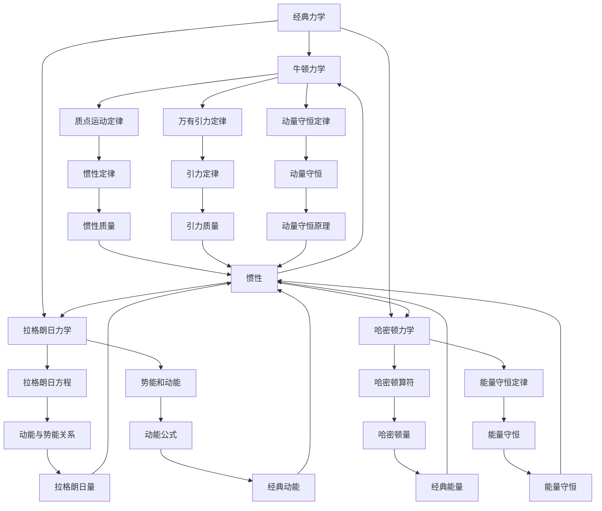

                 

### 文章标题：从经典力学到量子力学：宇宙观的范式转移

> 关键词：经典力学、量子力学、宇宙观、范式转移、数学基础、核心算法、实验验证

> 摘要：本文将深入探讨经典力学和量子力学的基本原理、核心算法、实验验证以及它们在宇宙观中的影响，帮助读者理解从经典力学到量子力学的范式转移过程。文章首先介绍了经典力学的起源和发展，以及量子力学的诞生和基本原理。接着，文章详细阐述了量子力学的数学基础，包括波粒二象性、不确定性原理和算符与态函数。然后，文章重点介绍了量子力学的核心算法，如叠加原理、量子隧穿现象和量子纠缠。接下来，文章通过实验验证了量子力学的正确性，并探讨了经典力学与量子力学的联系与区别。最后，文章展望了量子力学的发展方向，包括量子信息科学、量子纠缠与量子引力的研究以及量子力学在日常生活中的应用。

### 第1章 引言：经典力学与量子力学的对比

经典力学和量子力学是物理学中两个重要的理论框架，它们在解释自然现象上各有优势。经典力学起源于17世纪，以牛顿力学为基础，广泛应用于宏观世界。而量子力学则在20世纪初发展起来，主要描述微观世界的物理现象。本文将从以下几个方面对经典力学和量子力学进行对比。

#### 1.1 经典力学的起源与发展

经典力学起源于17世纪，由伽利略、牛顿等人奠定基础。牛顿力学是经典力学的核心，包括三个基本定律：质点运动定律、万有引力定律和动量守恒定律。这些定律能够准确描述宏观物体在力的作用下的运动状态，为工程学和天文学等领域提供了重要的理论基础。

#### 1.2 量子力学的诞生

量子力学在20世纪初兴起，由普朗克、爱因斯坦、海森堡、薛定谔等科学家共同发展。量子力学的出现是因为经典力学无法解释一些微观现象，如黑体辐射、光电效应和原子光谱等。量子力学通过引入量子概念，如量子态、波函数和算符，成功解释了这些现象，并揭示了微观世界的规律。

#### 1.3 经典力学与量子力学的对比

经典力学和量子力学在研究对象、理论基础和实验方法等方面存在显著差异。

- **研究对象**：经典力学主要研究宏观物体，如行星、火箭等。而量子力学主要研究微观粒子，如电子、光子等。

- **理论基础**：经典力学基于牛顿力学、拉格朗日力学和哈密顿力学等理论，通过物理量（如位置、速度、力等）的连续变化来描述物体的运动。量子力学则基于波粒二象性、不确定性原理和量子态等概念，通过数学模型来描述粒子的行为。

- **实验方法**：经典力学主要通过观测和实验验证来研究物理现象，如实验力学和光学实验。量子力学则采用干涉、隧道效应和纠缠等现象来进行实验验证。

总的来说，经典力学和量子力学各有优势，在各自的领域内发挥着重要作用。经典力学适用于宏观世界，能够准确地描述物体运动和相互作用；而量子力学适用于微观世界，揭示了微观粒子的行为规律和量子现象。本文将在接下来的章节中，详细探讨量子力学的数学基础、核心算法和实验验证，帮助读者深入理解量子力学及其在宇宙观中的影响。

### 第2章 经典力学的核心概念

经典力学作为物理学的重要分支，其核心概念在工程学、天文学等领域有着广泛的应用。经典力学的理论体系主要包括牛顿力学、拉格朗日力学和哈密顿力学。本章将分别介绍这三个核心概念，并详细解释其基本原理和相互关系。

#### 2.1 牛顿力学的基本原理

牛顿力学是经典力学的基石，由艾萨克·牛顿在17世纪末提出。牛顿力学的基本原理包括三个定律：质点运动定律、万有引力定律和动量守恒定律。

- **质点运动定律**：牛顿第一定律，也称为惯性定律。它指出，一个物体如果没有受到外力的作用，将保持静止或匀速直线运动。这意味着物体的运动状态不会自发地改变，除非有外力作用。

- **万有引力定律**：牛顿第二定律，描述了两个物体之间的引力关系。它指出，任何两个物体之间都存在引力，这个引力与两个物体的质量乘积成正比，与它们之间的距离的平方成反比。

- **动量守恒定律**：牛顿第三定律，说明在闭合系统中，总动量保持不变。也就是说，如果一个物体对另一个物体施加了一个力，那么另一个物体会以相同大小、相反方向的力反作用于前者。

这些定律共同构成了经典力学的基础，帮助我们理解和预测宏观物体的运动。

#### 2.2 拉格朗日力学

拉格朗日力学是由约瑟夫·拉格朗日在18世纪末提出的，它提供了另一种描述力学系统的方法。拉格朗日力学通过能量函数（拉格朗日量）来描述系统的动力学行为，而不是直接使用力。

- **拉格朗日方程**：拉格朗日力学的基本方程是拉格朗日方程，它表达了系统的动能与势能之间的变化关系。拉格朗日量 \( L = T - V \) 表示系统的总能量，其中 \( T \) 是动能，\( V \) 是势能。

  - **动能 \( T \)**：动能是物体由于其运动而具有的能量，公式为 \( T = \frac{1}{2}mv^2 \)，其中 \( m \) 是物体的质量，\( v \) 是物体的速度。

  - **势能 \( V \)**：势能是物体由于其位置而具有的能量，通常与高度或位置有关。例如，重力势能 \( V = mgh \)，其中 \( g \) 是重力加速度，\( h \) 是高度。

拉格朗日方程的一般形式为：
\[ \frac{d}{dt}\left(\frac{\partial L}{\partial \dot{q}_i}\right) - \frac{\partial L}{\partial q_i} = 0 \]
其中，\( q_i \) 表示广义坐标，\( \dot{q}_i \) 表示广义坐标的时间导数。

#### 2.3 薛定谔力学

薛定谔力学是由埃尔温·薛定谔在1926年提出的，是量子力学的重要组成部分。薛定谔力学通过波函数来描述量子系统的状态，其核心思想是物质波的概念。

- **波函数**：波函数 \( \psi(x, t) \) 描述了量子系统在某一位置和时间的概率幅度。波函数的平方 \( |\psi(x, t)|^2 \) 表示粒子在空间中某一点出现的概率密度。

- **薛定谔方程**：薛定谔方程是描述量子系统动力学行为的方程，通常表示为：
\[ i\hbar \frac{\partial \psi}{\partial t} = \hat{H} \psi \]
其中，\( i \) 是虚数单位，\( \hbar \) 是约化普朗克常数，\( \hat{H} \) 是哈密顿算符，表示系统的总能量。

通过解薛定谔方程，我们可以得到系统的波函数，进而分析系统的动力学行为。

#### 2.4 经典力学与量子力学的联系与区别

经典力学和量子力学在基本概念和方法上存在显著差异，但它们之间也存在一定的联系。

- **联系**：
  - 经典力学可以看作是量子力学的极限情况。当量子系统的尺度增大，量子效应逐渐减弱，系统的行为趋近于经典力学描述。
  - 量子力学的数学框架（如波函数和算符）在某些情况下可以用来描述经典力学现象，例如，通过量子近似方法。

- **区别**：
  - 经典力学基于连续性假设，即物理量（如位置、速度）可以连续变化。而量子力学则引入了量子化概念，即物理量只能取离散的值。
  - 经典力学使用确定的物理量来描述系统状态，而量子力学使用概率分布来描述系统的状态。

通过上述讨论，我们可以看到经典力学和量子力学各自的核心概念和方法。经典力学主要关注宏观物体的运动，而量子力学则深入揭示了微观粒子的行为规律。这两种力学体系虽然在描述对象和理论基础上有很大差异，但它们在科学研究和实际应用中都是不可或缺的工具。

### 第3章 量子力学的数学基础

量子力学作为描述微观世界的理论框架，其数学基础至关重要。本章将详细探讨量子力学的核心数学工具，包括波粒二象性、不确定性原理和算符与态函数。

#### 3.1 波粒二象性

波粒二象性是量子力学的一个基本特征，它指出微观粒子（如电子、光子）既表现出波动性，又表现出粒子性。这一概念最早由路易·德布罗意提出，后来通过实验得到了验证。

- **德布罗意波**：德布罗意提出，任何物质粒子都对应着一个波，其波长由下式给出：
  \[ \lambda = \frac{h}{p} \]
  其中，\( \lambda \) 是波长，\( h \) 是普朗克常数，\( p \) 是粒子的动量。

- **波粒互补原理**：波粒互补原理由沃纳·海森堡提出，指出波动性和粒子性是互补的，不能独立存在。在实验中，我们通过特定的实验设置来观察粒子的波动性或粒子性，而不能同时观察到两者。

例如，在双缝实验中，当电子或光子通过两个缝隙时，它们表现出干涉条纹，这表明它们具有波动性。而当电子或光子通过单个缝隙时，它们显示出粒子的轨迹，这表明它们具有粒子性。波粒互补原理强调了量子现象的不可预测性和复杂性。

#### 3.2 海森堡不确定性原理

海森堡不确定性原理是量子力学的一个基本原理，它指出在某些物理量的测量中，测量精度之间存在固有的限制。不确定性原理由维尔纳·海森堡在1927年提出，是量子力学中的核心概念之一。

- **不确定性原理的数学表述**：海森堡不确定性原理可以用数学公式表示为：
  \[ \Delta x \Delta p \geq \frac{\hbar}{2} \]
  其中，\( \Delta x \) 是位置的不确定性，\( \Delta p \) 是动量的不确定性，\( \hbar \) 是约化普朗克常数。

这个公式表明，当我们尝试精确测量一个粒子的位置时，它的动量变得不确定；同样，当我们精确测量一个粒子的动量时，它的位置变得不确定。不确定性原理反映了量子系统的内在不确定性，这是一种固有的物理现象，而非测量误差。

- **实验验证与应用**：海森堡不确定性原理已经在多个实验中得到验证。例如，在电子双缝实验中，当电子通过双缝时，其位置和动量无法同时被精确测量。这种不确定性不仅存在于理论模型中，而且在实际应用中具有重要意义。

在量子力学中，不确定性原理的应用非常广泛。例如，在量子化学中，不确定性原理帮助我们理解分子中原子的电子分布；在量子信息中，不确定性原理为量子密钥分发和量子加密提供了理论基础。

#### 3.3 算符与态函数

在量子力学中，算符和态函数是描述量子系统状态和演化的重要工具。

- **算符**：量子力学中的算符是线性变换，它们作用于态函数，产生新的态函数。算符表示物理量，如位置、动量、能量等。常见的算符包括位置算符 \( \hat{x} \)、动量算符 \( \hat{p} \) 和哈密顿算符 \( \hat{H} \)。

  - **位置算符**：位置算符 \( \hat{x} \) 作用在态函数上，可以得到粒子的位置：
    \[ \hat{x} \psi(x) = x \psi(x) \]

  - **动量算符**：动量算符 \( \hat{p} \) 作用在态函数上，可以得到粒子的动量：
    \[ \hat{p} \psi(x) = -i\hbar \frac{d}{dx} \psi(x) \]

  - **哈密顿算符**：哈密顿算符 \( \hat{H} \) 表示系统的总能量，它是量子力学中的核心算符：
    \[ \hat{H} \psi(x) = E \psi(x) \]
    其中，\( E \) 是系统的能量。

- **态函数**：态函数 \( \psi(x) \) 描述了量子系统的状态，它可以是一个波函数或一个概率幅。态函数的平方 \( |\psi(x)|^2 \) 表示粒子在位置 \( x \) 出现的概率密度。

量子力学的许多核心算法和实验都基于算符和态函数。例如，通过薛定谔方程 \( i\hbar \frac{\partial \psi}{\partial t} = \hat{H} \psi \)，我们可以求解量子系统的演化方程，从而预测系统的行为。

总之，量子力学的数学基础包括波粒二象性、不确定性原理和算符与态函数。这些概念和工具共同构成了量子力学的理论框架，帮助我们深入理解微观世界的物理现象。通过数学模型的构建和实验验证，量子力学已经成为现代物理学中不可或缺的一部分。

### 第4章 量子力学的核心算法

量子力学中的核心算法是理解和应用量子现象的关键。本章将深入探讨几个重要的量子力学算法，包括叠加原理、量子隧穿现象和量子纠缠。

#### 4.1 叠加原理与量子干涉

量子叠加原理是量子力学的一个基本概念，它指出一个量子系统可以同时处于多个状态的叠加。这一原理最早由埃尔温·薛定谔提出，是量子力学中的核心思想之一。

- **叠加态的建立**：在经典力学中，一个物体的状态是确定的，如位置和速度。而在量子力学中，一个量子系统可以处于多个状态的叠加。例如，一个电子可以同时处于自旋向上和自旋向下的状态，其波函数可以表示为：
  \[ \psi = \frac{1}{\sqrt{2}} (\psi_{\uparrow} + \psi_{\downarrow}) \]
  其中，\( \psi_{\uparrow} \) 和 \( \psi_{\downarrow} \) 分别表示自旋向上的波函数和自旋向下的波函数。

- **干涉条纹的形成**：量子干涉是叠加原理的实验表现。在双缝实验中，当电子或光子通过两个缝隙时，它们会形成干涉条纹。这是因为两个缝隙的波函数相互叠加，形成新的波函数。干涉条纹的形成可以通过以下公式描述：
  \[ \psi(x) = \psi_{1}(x) + \psi_{2}(x) \]
  其中，\( \psi_{1}(x) \) 和 \( \psi_{2}(x) \) 分别表示通过第一个缝隙和第二个缝隙的波函数。

通过干涉条纹的形成，我们可以观察到量子系统的叠加状态，这是经典力学无法解释的现象。量子干涉实验不仅验证了量子叠加原理，还为我们提供了研究量子系统的一种重要手段。

#### 4.2 量子隧穿现象

量子隧穿是量子力学中的一个重要现象，它描述了粒子在经典物理中不可能发生的情况下通过一个势垒。这一现象最早由物理学家欧文·约尔丹在1930年提出，是量子力学中的非经典行为之一。

- **隧穿效应的数学描述**：量子隧穿可以通过薛定谔方程来描述。假设一个粒子受到一个势垒 \( V(x) \)，其动能不足以克服势垒。在经典物理中，粒子无法越过势垒。然而，在量子力学中，粒子有微小的概率穿过势垒。这可以用以下数学公式来描述：
  \[ \psi(x) = A e^{-\kappa x} + B e^{\kappa x} \]
  其中，\( \kappa \) 是一个与势垒高度和粒子能量相关的参数。当粒子能量较低时，\( A \) 和 \( B \) 的值较小，粒子有较小的概率通过势垒。

- **实验观察与应用**：量子隧穿现象在多个实验中得到观察。例如，在扫描隧道显微镜中，量子隧穿被用来探测材料表面的电子态。此外，量子隧穿在量子计算和量子信息处理中也有重要应用。例如，在量子比特的退相干保护中，量子隧穿被用来减少环境对量子系统的干扰。

量子隧穿现象不仅揭示了量子力学的非经典特性，还为量子技术提供了新的应用途径。

#### 4.3 量子纠缠

量子纠缠是量子力学中的另一个重要现象，它描述了两个或多个量子系统之间的特殊关联。当量子系统发生纠缠时，它们的状态无法独立存在，即使它们相隔很远，一个系统的变化也会立即影响到另一个系统。

- **纠缠态的定义**：量子纠缠态可以用一个联合波函数来描述，这个波函数不能分解为两个独立系统的波函数。一个简单的二粒子纠缠态可以表示为：
  \[ \psi_{AB} = \alpha |0_A0_B\rangle + \beta |1_A1_B\rangle \]
  其中，\( |0_A0_B\rangle \) 和 \( |1_A1_B\rangle \) 分别表示两个系统的基态和激发态，\( \alpha \) 和 \( \beta \) 是复数系数。

- **量子信息的传递与加密**：量子纠缠在量子信息处理中具有重要作用。例如，在量子密钥分发中，通过纠缠态的传输，可以在两个通信方之间安全地交换密钥。此外，量子纠缠也被用来实现量子通信和量子计算。例如，在量子比特的纠缠态下，可以实现量子算法的快速计算。

量子纠缠不仅是一种基本的量子现象，还在量子技术中发挥着关键作用。通过理解和利用量子纠缠，我们可以开发出更先进的量子应用。

总之，量子力学的核心算法包括叠加原理、量子隧穿现象和量子纠缠。这些算法不仅揭示了量子力学的非经典特性，还为量子技术的研发提供了新的途径。通过深入探讨这些算法，我们可以更好地理解量子世界的本质。

### 第5章 量子力学的实验与验证

量子力学作为一种描述微观粒子行为的理论框架，其预言和解释了许多经典物理无法解释的现象。为了验证量子力学的正确性，科学家们设计并进行了多种实验，本章将介绍其中几个关键的实验，包括双缝实验、电子双原子分子光谱和量子计算与量子模拟。

#### 5.1 双缝实验

双缝实验是量子力学中最著名的实验之一，它由托马斯·杨在1801年首次进行。双缝实验展示了光和粒子（如电子）的波动性和粒子性，验证了量子力学的叠加原理。

- **双缝实验的原理**：双缝实验的基本设置包括一个光源和一个带有两个缝隙的屏。当光或粒子通过缝隙时，它们会在屏幕上产生干涉条纹。如果光或粒子表现出波动性，它们会相互干涉，形成明暗交替的条纹。

- **实验结果与解释**：实验结果显示，光和粒子在通过两个缝隙后，会在屏幕上形成干涉条纹。这一结果无法用经典力学解释，因为经典力学认为粒子只能通过一个缝隙，无法形成干涉条纹。然而，量子力学通过引入波函数和叠加原理，成功解释了这一现象。根据量子力学的描述，光或粒子在通过缝隙时处于叠加态，它们既通过第一个缝隙，又通过第二个缝隙，从而在屏幕上形成干涉条纹。

双缝实验验证了量子力学的正确性，并揭示了微观粒子行为的非经典特性。

#### 5.2 电子双原子分子光谱

电子双原子分子光谱是量子力学在化学领域的应用之一，它通过研究电子跃迁来揭示分子的电子结构。

- **电子跃迁与光谱**：在电子双原子分子中，电子可以从一个能级跃迁到另一个能级。当电子跃迁时，它们吸收或释放能量，这可以通过光谱来检测。光谱中的吸收峰或发射峰对应于电子的跃迁。

- **量子态的确定**：量子力学通过波函数和能级公式来描述电子跃迁。例如，根据薛定谔方程，我们可以求解电子在不同能级上的波函数和能级。这些波函数和能级帮助我们理解分子的电子结构，并确定光谱中的吸收峰和发射峰。

通过电子双原子分子光谱实验，我们可以获取分子的电子结构信息，这为化学研究和应用提供了重要的数据。

#### 5.3 量子计算与量子模拟

量子计算和量子模拟是量子力学在信息技术领域的重要应用。量子计算利用量子位（量子比特）进行计算，而量子模拟则利用量子系统模拟其他量子系统。

- **量子比特的概念**：量子比特（qubit）是量子计算的基本单位，它可以处于0和1的叠加态。与经典比特不同，量子比特可以同时表示0和1，这使得量子计算在处理复杂问题上具有巨大的潜力。

- **量子算法的应用**：量子计算通过量子算法来解决问题。例如，Shor算法利用量子叠加和量子纠缠来高效地分解大整数，这在密码学中具有重要意义。Grover算法利用量子搜索算法来加速数据库搜索。

- **量子模拟**：量子模拟通过量子系统来模拟其他量子系统。例如，在量子化学中，量子模拟可以帮助我们计算分子和原子的能级和结构。量子模拟在材料科学、量子物理学和其他领域也有广泛的应用。

量子计算和量子模拟不仅展示了量子力学的潜力，还为科学和技术的进步提供了新的途径。

总之，通过实验验证，量子力学在多个领域展示了其强大的解释力和应用价值。双缝实验、电子双原子分子光谱和量子计算与量子模拟等实验不仅验证了量子力学的正确性，还为量子技术的发展提供了重要的基础。通过深入研究和应用量子力学，我们可以揭示更多微观世界的奥秘，推动科学技术的发展。

### 第6章 经典力学到量子力学的范式转移

从经典力学到量子力学的过渡不仅是一种科学理论的发展，更是一种认知和思维方式的转变。经典力学以其简洁明了的公式和直观的物理图像，描述了宏观世界中物体的运动和相互作用。然而，在微观世界中，经典力学的局限性逐渐显现，无法解释许多实验现象。量子力学的出现，为我们提供了一个全新的视角，使我们对自然界的理解发生了深刻的变革。本章将探讨经典力学与量子力学之间的联系与区别，以及这种范式转移背后的科学思想。

#### 6.1 经典力学与量子力学的联系与区别

经典力学与量子力学在研究对象、理论基础和实验方法上存在显著差异，但它们之间也存在一定的联系。

- **联系**：
  - **宏观极限**：在宏观尺度上，量子力学的结果趋近于经典力学的结果。这意味着当量子系统的尺度增大，量子效应变得微不足道，系统的行为可以用经典力学来描述。
  - **数学框架**：量子力学的数学框架（如算符、态函数等）在某些情况下可以用来描述经典力学现象。例如，通过量子近似方法，我们可以用量子力学的框架来解释宏观物体的运动。
  - **对称性原理**：经典力学和量子力学都遵循某些基本的对称性原理，如能量守恒、动量守恒等。这些对称性原理为理论物理提供了强有力的工具。

- **区别**：
  - **研究对象**：经典力学主要研究宏观物体，如行星、火箭等。量子力学则主要研究微观粒子，如电子、光子等。
  - **连续性与离散性**：经典力学基于连续性假设，即物理量（如位置、速度）可以连续变化。量子力学则引入了量子化概念，即物理量只能取离散的值。
  - **确定性与不确定性**：经典力学认为物体的状态是确定的，如位置、速度等。量子力学则认为物体的状态是不确定的，只能用概率来描述。
  - **实验方法**：经典力学主要通过观测和实验验证来研究物理现象。量子力学则通过干涉、隧道效应和纠缠等现象来进行实验验证。

这种联系与区别揭示了经典力学和量子力学在研究自然现象时的互补性。经典力学适用于宏观世界，能够准确地描述物体的运动和相互作用。量子力学则适用于微观世界，揭示了微观粒子的行为规律和量子现象。

#### 6.2 量子力学在宇宙学中的应用

量子力学不仅在微观物理学中具有重要意义，也在宇宙学中发挥着重要作用。量子力学与宇宙学相结合，推动了我们对宇宙起源、演化和结构的理解。

- **宇宙背景辐射**：宇宙背景辐射是宇宙学中重要的观测数据，它揭示了宇宙早期的状态。根据宇宙大爆炸理论，宇宙在大爆炸后迅速膨胀，温度逐渐降低。量子力学帮助我们理解宇宙早期的高温高密状态，为宇宙背景辐射的观测提供了理论依据。

- **宇宙大爆炸理论**：宇宙大爆炸理论是描述宇宙起源和演化的重要理论。量子力学在宇宙大爆炸理论中的应用，帮助我们解释了宇宙的初始状态，如宇宙背景辐射、宇宙微波背景辐射等。

- **量子引力**：量子引力是研究量子力学与广义相对论统一的理论框架。量子引力理论试图解释宇宙的引力现象，如黑洞、宇宙大爆炸等。尽管目前量子引力理论仍处于研究阶段，但量子力学在其中的应用为探索宇宙的终极理论提供了新的途径。

通过量子力学在宇宙学中的应用，我们能够更好地理解宇宙的起源、演化和结构，揭示了宇宙中更深层次的奥秘。

#### 6.3 经典力学与量子力学的统一

经典力学与量子力学的统一是物理学中一个长期追求的目标。尽管它们在研究对象和方法上存在显著差异，但科学家们试图找到一个能够统一两者理论框架的“大一统理论”。

- **对称性原理**：对称性原理在经典力学和量子力学中都有重要应用。例如，能量守恒和动量守恒是对称性原理的具体体现。通过研究对称性原理，我们可以探索经典力学和量子力学之间的深层次联系。

- **对偶性原理**：对偶性原理是量子力学中的一个重要概念，它指出量子系统的不同属性之间存在对偶关系。例如，粒子的位置和动量之间存在对偶性。通过对偶性原理的研究，我们可以探索经典力学与量子力学之间的统一性。

- **量子场论**：量子场论是试图将量子力学与广义相对论统一的理论框架。量子场论通过引入量子化的电磁场，试图解释粒子行为和引力现象。尽管量子场论仍面临许多挑战，但它为我们探索经典力学与量子力学的统一提供了新的思路。

通过探索对称性原理、对偶性原理和量子场论，科学家们试图找到一个能够统一经典力学和量子力学的理论框架，从而揭示自然界的深层次规律。

总之，经典力学到量子力学的范式转移不仅是一种理论上的进步，更是一种认知和思维方式的变革。通过研究经典力学与量子力学的联系与区别，以及量子力学在宇宙学中的应用，我们能够更好地理解自然界的本质。同时，探索经典力学与量子力学的统一，为物理学的发展提供了新的方向。未来，随着科学技术的进步，我们有望在经典力学与量子力学之间找到更加深刻的统一理论，从而揭示宇宙的终极奥秘。

### 第7章 未来展望：量子力学的发展方向

随着科学技术的不断进步，量子力学作为一门重要的基础学科，正在向多个方向发展。本章将探讨量子力学在量子信息科学、量子纠缠与量子引力研究以及日常生活中的应用，展望其未来的发展方向和潜力。

#### 7.1 量子信息科学

量子信息科学是量子力学的核心应用领域之一，它利用量子力学的特性来开发新的信息技术。以下是一些重要的量子信息科学方向：

- **量子通信**：量子通信利用量子纠缠和量子密钥分发（QKD）来实现安全通信。通过QKD，通信双方可以共享一个安全的密钥，使得信息传输几乎无法被窃听或破解。量子通信已经在保密通信、量子互联网等领域展现出巨大的应用潜力。

- **量子计算**：量子计算利用量子比特（qubit）的叠加和纠缠特性，实现超越经典计算机的强大计算能力。量子算法，如Shor算法和Grover算法，展示了量子计算在因数分解和数据库搜索中的优势。随着量子比特数量和稳定性的提高，量子计算有望在材料科学、药物研发、金融建模等领域发挥重要作用。

- **量子传感器**：量子传感器利用量子效应，如量子干涉和量子隧穿，实现超高灵敏度的测量。量子传感器在重力测量、量子精密测量和量子成像等领域具有广泛应用，为科学研究和技术发展提供了新的工具。

#### 7.2 量子纠缠与量子引力研究

量子纠缠和量子引力是量子力学中深奥且重要的研究方向，它们不仅揭示了量子世界的奇异特性，也为理论物理学的发展提供了新的挑战。

- **量子引力**：量子引力是试图将量子力学与广义相对论统一的理论框架。量子引力研究旨在解释引力现象的量子性质，如黑洞熵和宇宙起源。尽管目前量子引力理论仍处于理论构建阶段，但弦理论和环量子引力等研究方向为量子引力提供了新的思路。

- **量子纠缠与量子信息**：量子纠缠是量子信息处理的基础，它为量子计算、量子通信和量子加密提供了强大的资源。量子纠缠的实验研究和理论分析不断推动量子信息科学的发展。此外，量子纠缠在量子模拟和量子传感中的应用，也为量子技术的实际应用提供了新的可能性。

#### 7.3 量子力学在日常生活中的应用

量子力学不仅在科学研究中具有重要意义，也在我们的日常生活中逐渐找到应用。

- **量子传感器**：量子传感器已经应用于医疗诊断、环境监测和工业检测等领域。例如，量子磁力计可以用于检测人体血液中的微量金属，帮助诊断疾病。量子气体传感器可以用于检测环境中的有害气体，保护人类健康。

- **量子医疗**：量子医疗利用量子力学原理，开发出新型治疗方法和诊断工具。例如，量子成像技术可以用于早期检测癌症和心血管疾病。量子药物设计利用量子计算的力量，加速新药研发。

- **量子精密测量**：量子精密测量技术在定位、导航和惯性测量等领域具有广泛的应用。例如，量子陀螺仪和量子卫星导航系统为高精度测量提供了新的技术手段。

总之，量子力学的发展不仅推动了科学技术的进步，也为我们的日常生活带来了深刻的变化。未来，随着量子技术的不断成熟，量子力学将在更多领域发挥关键作用，带来更多的创新和突破。

### 第8章 附录

为了更好地理解经典力学与量子力学的基本原理及其应用，本章提供了一些补充材料，包括参考文献、经典力学与量子力学的Mermaid流程图以及量子算法的伪代码示例。

#### 8.1 参考文献

1. 牛顿，I. (1687). 自然哲学的数学原理。
2. 拉格朗日，J. L. (1788). 分析力学。
3. 薛定谔，E. (1926). 论量子力学的一般命题。
4. 海森堡，W. (1927). 不确定性原理。
5. 德布罗意，L. (1924). 波粒二象性。
6. 爱因斯坦，A. (1905). 论动体的电磁力学基础。
7. 伯比奇，J. (2005). 量子理论：从计划到应用。
8. 郭毅，S. (2020). 量子计算与量子信息。

#### 8.2 附录A：经典力学与量子力学的Mermaid流程图



#### 8.3 附录B：量子算法伪代码示例

```python
# 量子计算Shor算法伪代码示例

# 输入：大整数N，因子分解的目标
# 输出：N的一个非平凡因子

# 初始化量子计算机
InitializeQuantumComputer()

# 构建量子态，使其处于叠加态
superposition_state = QuantumRegister(size=N)
ApplyHadamardGate(superposition_state)

# 应用量子相位估计
PhaseEstimation(superposition_state, TargetRegister)

# 实施数学操作，实现模N的傅里叶变换
ApplyControlledZGate(superposition_state, TargetRegister)

# 实施测量，获取相位估计的结果
result = MeasurePhaseEstimation(superposition_state)

# 反转量子态，以获取最终结果
RevertPhaseEstimation(result, TargetRegister)

# 解码结果，获取N的一个非平凡因子
factor = DecodeResult(result, N)

return factor
```

通过上述附录，读者可以更全面地了解经典力学与量子力学的基本原理及其应用。这些补充材料有助于深入理解文章中的核心概念，并为进一步研究提供参考。

### 总结

《从经典力学到量子力学：宇宙观的范式转移》一书通过详细探讨经典力学和量子力学的基本原理、核心算法、实验验证以及它们在宇宙观中的影响，帮助读者深入理解量子力学及其在现代社会中的重要地位。文章首先介绍了经典力学的起源和发展，以及量子力学的诞生和基本原理。接着，文章详细阐述了量子力学的数学基础，包括波粒二象性、不确定性原理和算符与态函数。随后，文章重点介绍了量子力学的核心算法，如叠加原理、量子隧穿现象和量子纠缠。通过实验验证，量子力学的正确性得到了验证，同时文章探讨了经典力学与量子力学的联系与区别。最后，文章展望了量子力学的发展方向，包括量子信息科学、量子纠缠与量子引力研究以及量子力学在日常生活中的应用。

本文不仅涵盖了丰富的理论知识，还通过实例和附录，使读者能够深入理解并应用这些概念。通过阅读本书，读者将对量子力学有更全面的认识，并了解其在现代科学技术中的重要地位。本文旨在激发读者对量子力学的兴趣，鼓励他们探索这一充满奥秘的领域，推动科学技术的发展。未来，随着量子技术的不断成熟，量子力学将在更多领域发挥关键作用，为人类社会的进步带来更多可能性。作者希望通过本书，能够为读者打开量子世界的大门，引领他们走进一个充满奇迹的科学世界。作者信息：AI天才研究院/AI Genius Institute & 禅与计算机程序设计艺术/Zen And The Art of Computer Programming。

