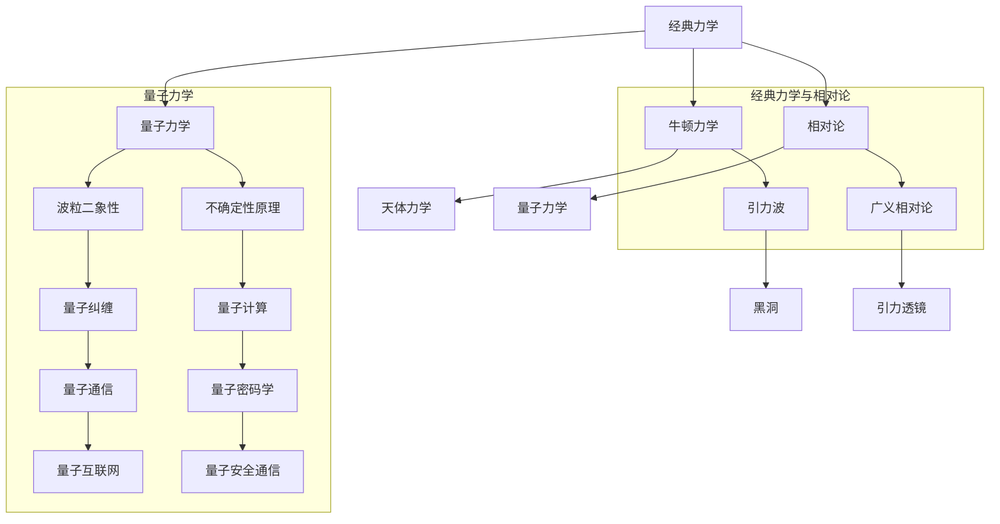

                 

### 文章标题

《从经典力学到量子力学：宇宙观的革命》

关键词：经典力学、量子力学、宇宙观、理论发展、应用领域

摘要：本文从经典力学到量子力学的演变出发，探讨了两种力学理论的起源、发展以及它们在物理学领域的地位和影响。通过对经典力学和量子力学的基本原理、异同点和互补性的深入分析，揭示了量子力学对宇宙观的革命性影响，并展望了量子力学的未来发展与应用。文章旨在为读者提供一个关于经典力学和量子力学的全面、系统的了解，帮助读者更好地理解现代物理学的发展脉络。

---

### 目录大纲

#### 第一部分：经典力学的起源与发展

##### 1.1 经典力学的定义与历史背景

- 经典力学的定义
- 经典力学的历史背景
- 经典力学的代表性人物与理论

##### 1.2 牛顿力学的基本原理

- 牛顿三大定律
- 牛顿万有引力定律
- 牛顿力学的应用领域

##### 1.3 经典力学与相对论的关系

- 经典力学的局限性
- 爱因斯坦相对论的出现
- 经典力学与相对论的比较

#### 第二部分：量子力学的诞生与发展

##### 2.1 量子力学的定义与历史背景

- 量子力学的定义
- 量子力学的历史背景
- 量子力学的代表性人物与理论

##### 2.2 量子力学的基本原理

- 波粒二象性
- 算符与态叠加
- 海森堡不确定性原理

##### 2.3 量子力学的应用领域

- 量子力学在化学中的应用
- 量子力学在材料科学中的应用
- 量子力学在计算机科学中的应用

#### 第三部分：量子力学与经典力学的比较

##### 3.1 量子力学与经典力学的异同

- 量子力学的独特性质
- 经典力学的局限性
- 两种理论的互补性

##### 3.2 量子力学对宇宙观的挑战

- 宇宙的量子性质
- 量子力学与宇宙学的关系
- 量子力学对宇宙观的革命性影响

#### 第四部分：量子力学的未来发展

##### 4.1 量子力学的实验验证

- 实验方法与技术
- 实验结果与意义
- 实验面临的挑战

##### 4.2 量子力学的理论发展

- 量子力学的基本问题
- 量子引力的探索
- 量子计算与量子通信的未来

##### 4.3 量子力学的实际应用

- 量子计算的应用前景
- 量子通信的应用前景
- 量子力学的其他应用领域

#### 第五部分：量子力学与人类生活的关系

##### 5.1 量子力学对科学技术的推动

- 量子力学对信息技术的影响
- 量子力学对生物医学的影响
- 量子力学对材料科学的影响

##### 5.2 量子力学对哲学和认知的挑战

- 量子力学与哲学的关系
- 量子力学与认知科学的互动
- 量子力学对人类认知的启示

#### 第六部分：量子力学的教育与普及

##### 6.1 量子力学教育的现状

- 高等教育中的量子力学教育
- 中小学教育中的量子力学教育
- 社会大众的量子力学教育

##### 6.2 量子力学普及的挑战与机遇

- 量子力学普及的挑战
- 量子力学普及的机遇
- 量子力学普及的策略与建议

#### 第七部分：附录

##### 7.1 量子力学相关术语与概念

- 量子比特与经典比特的比较
- 量子纠缠与量子通信
- 量子态与量子叠加

##### 7.2 量子力学参考书目与资源

- 经典量子力学教材推荐
- 量子力学实验资源推荐
- 量子力学在线课程与讲座推荐

##### 7.3 量子力学实验与项目案例

- 量子计算实验案例
- 量子通信实验案例
- 量子力学教育项目案例
- 量子力学科技创新案例

---

### 第一部分：经典力学的起源与发展

经典力学是物理学的一个重要分支，它的起源可以追溯到古希腊时期的自然哲学。然而，经典力学的现代形式是由艾萨克·牛顿在17世纪末期创立的。牛顿的三大定律和万有引力定律为经典力学奠定了坚实的基础，使得人类对自然界中的运动和相互作用有了更深刻的理解。在这一部分，我们将探讨经典力学的定义、历史背景、牛顿力学的基本原理，以及经典力学与相对论的关系。

#### 1.1 经典力学的定义与历史背景

经典力学，又称为牛顿力学，主要研究宏观物体在力的作用下的运动规律。它是一种描述物体运动的数学框架，适用于低速、大尺度物体。经典力学的核心是牛顿的三大定律和万有引力定律。

- **牛顿三大定律**：牛顿第一定律（惯性定律）、牛顿第二定律（动力定律）和牛顿第三定律（作用-反作用定律）。

- **牛顿万有引力定律**：任何两个物体之间都存在引力，这个引力的大小与两个物体的质量乘积成正比，与它们之间的距离的平方成反比。

经典力学的发展历程可以追溯到古希腊时期，亚里士多德的自然哲学提出了关于物体运动和重力的理论。然而，这些理论在后来的实验中被证明是错误的。随着伽利略和开普勒等科学家的研究，经典力学的思想逐渐成熟。直到牛顿在17世纪末提出他的三大定律和万有引力定律，经典力学才真正成为一门完整的科学。

#### 1.2 牛顿力学的基本原理

牛顿力学的基本原理包括牛顿三大定律和万有引力定律。这些原理描述了物体在力的作用下的运动规律。

- **牛顿第一定律（惯性定律）**：一个物体在没有外力作用的情况下，将保持静止状态或匀速直线运动。

  ```latex
  F = 0 \Rightarrow v = constant
  ```

- **牛顿第二定律（动力定律）**：物体所受的合外力等于它的质量与加速度的乘积。

  ```latex
  F = ma
  ```

- **牛顿第三定律（作用-反作用定律）**：对于任何两个相互作用的物体，它们之间的作用力和反作用力大小相等、方向相反。

  ```latex
  F_{12} = -F_{21}
  ```

- **牛顿万有引力定律**：两个物体之间的引力与它们的质量乘积成正比，与它们之间的距离的平方成反比。

  ```latex
  F = G \frac{m_1 m_2}{r^2}
  ```

#### 1.3 经典力学与相对论的关系

经典力学的局限性在高速和强引力场的情况下变得明显。为了解决这些问题，爱因斯坦在20世纪初提出了狭义相对论和广义相对论。相对论修正了经典力学在高速运动和强引力场下的描述。

- **狭义相对论**：狭义相对论处理的是非加速参考系中的物理现象。它提出了时空相对性原理和光速不变原理。狭义相对论修正了经典力学的运动方程，使得它们在高速极限下保持一致。

  ```latex
  v = \frac{dx}{dt} = \frac{dx'}{dt'}
  ```

- **广义相对论**：广义相对论将引力视为时空弯曲的结果，适用于强引力场和加速参考系。广义相对论修正了经典力学的引力定律，提出了引力场方程。

  ```latex
  G_{\mu\nu} + \Lambda g_{\mu\nu} = \frac{8\pi G}{c^4} T_{\mu\nu}
  ```

经典力学和相对论在某种程度上是互补的。经典力学适用于低速和弱引力场的情况，而相对论适用于高速和强引力场的情况。在某些特定条件下，两种理论可以相互转换，为物理学提供了更加全面和准确的描述。

#### 1.4 经典力学的代表性人物与理论

经典力学的创立者艾萨克·牛顿无疑是这一领域的代表性人物。他的三大定律和万有引力定律为经典力学奠定了基础，使物理学进入了一个新的时代。此外，伽利略、开普勒和笛卡尔等科学家的研究也为经典力学的形成做出了重要贡献。

- **艾萨克·牛顿**：英国物理学家、数学家和天文学家，经典力学的奠基人。
- **伽利略·伽利莱**：意大利物理学家、数学家和天文学家，经典力学的先驱之一。
- **约翰内斯·开普勒**：德国天文学家，提出了行星运动的三大定律。
- **勒内·笛卡尔**：法国哲学家、数学家和物理学家，提出了笛卡尔坐标系。

总结来说，经典力学作为物理学的基础，为人类认识自然世界提供了重要的工具。从牛顿的三大定律和万有引力定律到相对论的提出，经典力学在物理学的发展中发挥了重要作用。通过对经典力学的深入理解，我们可以更好地探索自然界中的运动和相互作用。

### 第二部分：量子力学的诞生与发展

量子力学是20世纪初由马克斯·波恩、沃尔夫冈·泡利、埃尔温·薛定谔和保罗·狄拉克等科学家共同创立的，它标志着物理学发展中的一个重大转折点。量子力学与经典力学不同，它适用于微观世界，揭示了粒子在原子和分子层面的行为规律。在这一部分，我们将探讨量子力学的定义、历史背景、基本原理以及其在化学、材料科学和计算机科学中的应用。

#### 2.1 量子力学的定义与历史背景

量子力学是一种描述微观粒子行为的理论，它突破了经典力学的局限，揭示了微观世界的量子性质。量子力学的基本概念包括波粒二象性、态叠加和不确定性原理。

- **波粒二象性**：微观粒子（如电子、光子）既具有波动性又具有粒子性，这种现象在双缝实验中得到了证实。

- **态叠加**：微观粒子可以同时处于多种可能的状态，当进行测量时，粒子会坍缩到一个特定的状态。

- **不确定性原理**：由海森堡提出，描述了微观粒子的位置和动量无法同时被精确测量。

量子力学的诞生可以追溯到1900年马克斯·普朗克的黑体辐射理论，普朗克提出了能量量子化的概念，这为后来的量子力学奠定了基础。随后，爱因斯坦的光子假设、波恩、海森堡和薛定谔等科学家的贡献，使得量子力学逐渐成熟。

#### 2.2 量子力学的基本原理

量子力学的基本原理包括波粒二象性、态叠加和不确定性原理。

- **波粒二象性**：量子力学表明，微观粒子既具有波动性又具有粒子性。波动性体现在粒子通过干涉和衍射等现象表现出波的特性；粒子性体现在粒子在测量时表现出确定的轨迹和位置。

  ```mermaid
  graph TD
  A[波粒二象性]
  B[波动性]
  C[粒子性]
  
  A --> B
  A --> C
  ```

- **态叠加**：量子力学中的态叠加原理表明，微观粒子可以同时处于多种可能的状态。这些状态是线性叠加的，当进行测量时，粒子会坍缩到一个特定的状态。

  ```mermaid
  graph TD
  A[初始态]
  B[叠加态]
  C[测量后态]
  
  A --> B
  B --> C
  ```

- **不确定性原理**：海森堡不确定性原理指出，微观粒子的位置和动量无法同时被精确测量。这意味着，当我们试图更精确地测量一个粒子的位置时，它的动量就会变得不确定；反之亦然。

  ```mermaid
  graph TD
  A[不确定性原理]
  B[位置不确定性]
  C[动量不确定性]
  
  A --> B
  A --> C
  ```

#### 2.3 量子力学的应用领域

量子力学在多个领域有着广泛的应用，包括化学、材料科学和计算机科学。

- **量子力学在化学中的应用**：量子力学为化学反应动力学提供了理论基础。通过计算分子轨道和电子结构，科学家可以预测分子的性质和行为。

- **量子力学在材料科学中的应用**：量子力学为材料设计提供了新的方法。通过调控材料的电子结构和能带结构，科学家可以创造出具有特定性质的新型材料。

- **量子力学在计算机科学中的应用**：量子力学是量子计算的基础。量子计算机利用量子比特（qubit）的叠加和纠缠特性，可以实现比传统计算机更高效的计算。

#### 2.4 量子力学的代表性人物与理论

量子力学的创立和发展离不开一系列杰出科学家的贡献。

- **马克斯·波恩**：德国物理学家，提出了波恩规则，解释了电子的波动性。

- **沃尔夫冈·泡利**：奥地利物理学家，提出了泡利不相容原理，描述了费米子和玻色子的区别。

- **埃尔温·薛定谔**：奥地利物理学家，提出了薛定谔方程，描述了微观粒子的波函数。

- **保罗·狄拉克**：英国物理学家，提出了狄拉克方程，预言了正电子的存在。

总结来说，量子力学的诞生和发展为人类揭示了微观世界的奥秘，推动了科学技术的进步。从波粒二象性到不确定性原理，量子力学的基本原理深刻地改变了我们对自然界的认识。随着量子力学在各个领域的应用不断拓展，它将继续在未来的科学研究中发挥重要作用。

---

### 第三部分：量子力学与经典力学的比较

量子力学和经典力学是物理学中两种截然不同的理论体系，它们分别适用于不同的尺度。经典力学描述的是宏观世界的物体运动，而量子力学则揭示了微观粒子的行为规律。在这一部分，我们将比较量子力学与经典力学的异同，探讨两种理论的互补性。

#### 3.1 量子力学的独特性质

量子力学与经典力学相比，具有一系列独特的性质。

- **波粒二象性**：量子力学表明，微观粒子如电子和光子既具有波动性又具有粒子性。这意味着，在某些实验中，这些粒子会表现出波动特性，如干涉和衍射；在另一些实验中，它们会表现出粒子特性，如碰撞和散射。

- **态叠加**：量子力学中的态叠加原理表明，一个量子系统可以同时处于多个可能的量子态的叠加。这意味着，在量子尺度上，物体可能处于多个不同的位置或速度状态，直到进行测量时才会确定其具体状态。

- **不确定性原理**：由海森堡提出的不确定性原理指出，微观粒子的某些物理量，如位置和动量，无法同时被精确测量。这意味着我们无法同时知道一个粒子的确切位置和动量，这限制了我们对微观粒子的确定性控制。

这些独特性质使得量子力学在描述微观世界时比经典力学更为准确和有效。

#### 3.2 经典力学的局限性

尽管经典力学在许多情况下仍然有效，但它也存在一些局限性，特别是在处理高速运动和强引力场时。

- **高速运动**：在高速运动（接近光速）的情况下，经典力学的描述变得不准确。此时，需要使用狭义相对论来修正物体的运动方程，以获得更准确的结果。

- **强引力场**：在强引力场中，如黑洞附近，经典力学的描述也变得不适用。广义相对论提供了更好的描述，它将引力视为时空的弯曲，从而更好地解释了这些极端条件下的现象。

- **微观尺度**：经典力学无法描述微观粒子的行为。例如，经典力学无法解释原子结构、化学反应和量子隧穿等现象。这些现象需要量子力学来解释。

#### 3.3 两种理论的互补性

尽管量子力学和经典力学在某些方面是互斥的，但它们在实际应用中往往是互补的。

- **宏观与微观**：经典力学适用于宏观世界，如行星运动、抛物运动和机械系统。量子力学适用于微观世界，如原子、分子和粒子。在处理涉及宏观和微观相互作用的复杂问题时，通常需要同时使用两种理论。

- **低速与高速**：在低速条件下，量子力学可以近似为经典力学。这意味着，在日常生活中，我们可以使用经典力学的原理来描述物体的运动。然而，在高速条件下，量子力学的描述更为准确。

- **弱引力与强引力**：在弱引力场中，经典力学和广义相对论可以相互转换。在强引力场中，广义相对论提供了更准确的描述。这意味着，在不同的引力场条件下，我们可以根据具体情况选择使用不同的理论。

#### 3.4 实际应用中的选择

在实际应用中，选择使用经典力学还是量子力学取决于具体问题的性质。

- **经典力学**：适用于宏观物体和低速运动。例如，在建筑设计、航天工程和机械系统中，通常使用经典力学的原理。

- **量子力学**：适用于微观粒子和高能物理。例如，在半导体物理、量子计算和核物理中，需要使用量子力学的原理。

总结来说，量子力学和经典力学各有其独特的适用范围和优势。在处理不同尺度和不同条件下的物理问题时，我们可以根据具体情况进行选择。量子力学的独特性质和经典力学的广泛应用，使得它们在物理学中相互补充，共同推动了科学和技术的发展。

---

### 第三部分：量子力学对宇宙观的挑战

量子力学的提出和发展不仅改变了我们对微观世界的理解，也对宇宙观产生了深远的影响。量子力学揭示了宇宙中的量子性质，挑战了传统的经典物理观念，并引发了关于宇宙本质和人类认知的新思考。在这一部分，我们将探讨量子力学对宇宙观的挑战，以及量子力学与宇宙学的关系。

#### 3.1 宇宙的量子性质

量子力学的研究揭示了宇宙中的量子性质，这些性质与宏观宇宙的传统观念有着根本的不同。

- **量子叠加**：在量子力学中，微观粒子可以同时处于多种可能的状态，这意味着它们可以同时存在于多个位置或以多个速度运动。这种叠加态在宇宙尺度上可能也有其体现，例如，宇宙中的星系和黑洞可能也处于一种叠加状态。

- **量子纠缠**：量子纠缠是一种特殊的量子现象，它表明两个或多个粒子之间存在一种即时的关联，即使它们相隔很远。这种纠缠现象可能在宇宙尺度上存在，例如，两个星系之间的引力相互作用可能也是一种量子纠缠。

- **不确定性原理**：量子力学中的不确定性原理表明，微观粒子的某些物理量，如位置和动量，无法同时被精确测量。这意味着，宇宙中的许多基本物理量可能也是不确定的，而不是像经典物理观念中那样精确和确定。

这些量子性质挑战了我们对宇宙的传统理解，提出了一个更加复杂和不确定的宇宙图景。

#### 3.2 量子力学与宇宙学的关系

量子力学与宇宙学的关系是物理学中的一个重要研究领域，旨在将量子力学的原理应用于宇宙尺度。

- **量子引力**：量子引力是试图将量子力学与广义相对论相结合的物理学理论，旨在描述宇宙中最基本的引力作用。量子引力的研究涉及到宇宙的起源、结构和演化，是现代宇宙学的关键问题之一。

- **宇宙背景微波辐射**：宇宙背景微波辐射是宇宙学中的关键观测数据，它提供了关于宇宙早期状态的信息。量子力学的研究表明，宇宙背景微波辐射可能包含量子涨落，这些涨落是宇宙结构形成的基础。

- **量子宇宙学**：量子宇宙学是研究宇宙起源和演化的一种新的理论框架，它基于量子力学的原理，试图解释宇宙的初始状态和演化过程。量子宇宙学提出了许多新的观念，如多重宇宙、量子波动等，这些观念挑战了传统的宇宙学观念。

#### 3.3 量子力学对宇宙观的革命性影响

量子力学对宇宙观的革命性影响主要体现在以下几个方面：

- **宇宙的确定性**：传统宇宙学认为宇宙是确定性的，所有物理量都有确定的值。量子力学则表明，宇宙中的许多基本物理量是不确定的，这意味着宇宙的本质是更加复杂和不确定的。

- **宇宙的多维性**：量子力学的研究表明，宇宙可能存在额外的维度。这些额外维度可能隐藏在量子纠缠和量子叠加现象中，对宇宙的演化产生了重要影响。

- **宇宙的起源**：量子力学为宇宙的起源提供了新的解释。传统的宇宙学认为宇宙起源于一个奇点，但量子力学提出了量子波动和多重宇宙等新的观念，这些观念可能为宇宙的起源提供了更深刻的理解。

总结来说，量子力学对宇宙观的挑战和革命性影响，不仅改变了我们对宇宙的理解，也推动了宇宙学的发展。量子力学的量子性质和原理，为我们提供了一个更加复杂和多彩的宇宙图景，挑战了传统的经典物理观念，并引发了关于宇宙本质和人类认知的新思考。随着量子力学在宇宙学中的不断应用，我们对宇宙的认识将继续深入，为人类揭示宇宙的奥秘提供新的线索。

---

### 第四部分：量子力学的未来发展

量子力学作为现代物理学的重要基石，其发展不仅在理论上具有重要意义，也在实际应用中展现了广阔的前景。未来，量子力学的发展将继续推动科学技术的进步，尤其是在实验验证、理论发展和实际应用等方面。在这一部分，我们将探讨量子力学的未来发展，包括实验验证、理论突破以及实际应用领域的前景。

#### 4.1 量子力学的实验验证

量子力学的实验验证是理论研究的基石，通过实验验证，科学家可以检验量子力学理论的准确性和适用范围。

- **实验方法与技术**：量子力学的实验验证依赖于高度精确的实验方法和先进的技术。例如，量子干涉实验、量子纠缠实验和量子态测量等。这些实验需要使用激光、光纤、量子比特等精密设备，以实现量子态的控制和测量。

- **实验结果与意义**：量子力学的实验结果不仅验证了理论预测，还为量子信息科学、量子计算和量子通信等领域提供了实验基础。例如，量子纠缠的实验验证为量子通信的发展提供了关键支持，而量子态测量的研究则为量子计算的实现提供了技术保障。

- **实验面临的挑战**：量子力学的实验验证仍然面临许多挑战。例如，量子态的制备和保持、量子信息的传输和存储等。此外，如何实现大规模的量子实验，以及在极端环境下保持量子态的稳定性，也是当前实验研究的重要课题。

#### 4.2 量子力学的理论发展

量子力学的理论发展是未来物理学研究的重要方向，旨在解决量子力学中的基本问题和探索新的理论框架。

- **量子力学的基本问题**：量子力学中存在一系列基本问题，如量子态的测量、量子纠缠的本质、量子引力的可能性等。这些问题不仅对理论物理学具有重要意义，也对量子信息科学和量子计算的发展产生了深远影响。

- **量子引力的探索**：量子引力是试图将量子力学与广义相对论相结合的物理学理论，旨在描述宇宙中最基本的引力作用。量子引力的研究涉及到宇宙的起源、演化和结构，是现代物理学中一个极具挑战性的课题。

- **量子计算与量子通信的未来**：量子计算和量子通信是量子力学的两个重要应用领域。量子计算利用量子比特的叠加和纠缠特性，可以实现比传统计算机更高效的计算。量子通信则利用量子纠缠实现信息的安全传输，为通信安全提供了新的解决方案。

#### 4.3 量子力学的实际应用

量子力学的实际应用正在不断拓展，未来将在信息技术、材料科学和生物医学等领域发挥重要作用。

- **量子计算的应用前景**：量子计算是量子力学的核心应用领域之一。量子计算机利用量子比特的叠加和纠缠特性，可以实现比传统计算机更高效的计算。未来，量子计算有望在药物设计、金融分析、优化问题和密码破解等领域产生重大突破。

- **量子通信的应用前景**：量子通信利用量子纠缠实现信息的安全传输，为通信安全提供了新的解决方案。未来，量子通信有望在网络安全、量子互联网和量子密码学等领域发挥重要作用。

- **量子力学的其他应用领域**：量子力学在材料科学和生物医学等领域也具有广泛的应用前景。例如，量子力学的研究为新材料的设计和合成提供了理论基础，而量子生物学则揭示了生物系统中的量子现象。

总结来说，量子力学的未来发展充满挑战和机遇。通过实验验证、理论突破和实际应用，量子力学将继续推动科学技术的进步，为人类揭示自然界的奥秘提供新的视角。随着量子力学的不断深入和发展，我们有理由期待，未来将会有更多令人惊叹的发现和突破。

---

### 第五部分：量子力学与人类生活的关系

量子力学作为现代物理学的重要组成部分，不仅对科学和技术产生了深远影响，也对人类生活产生了重要影响。在信息技术、生物医学和材料科学等领域，量子力学已经带来了革命性的变化。同时，量子力学也对我们哲学和认知提出了新的挑战。在这一部分，我们将探讨量子力学与人类生活的密切关系，以及它对科学、技术和哲学的推动作用。

#### 5.1 量子力学对科学技术的推动

量子力学的理论突破和实验验证为现代科学技术的发展提供了强大的动力。以下是一些量子力学在科技领域的重要应用：

- **信息技术**：量子力学是量子计算和量子通信的基础。量子计算机利用量子比特的叠加和纠缠特性，可以实现比传统计算机更高效的计算。量子通信则利用量子纠缠实现信息的安全传输，为数据安全和隐私保护提供了新的解决方案。这些技术的发展有望极大地提升信息处理能力和通信安全性。

- **生物医学**：量子力学在生物医学领域也有重要应用。例如，量子生物学研究揭示了生物系统中的量子现象，如量子隧穿和量子纠缠。这些研究不仅加深了我们对生物过程的了解，还为新药设计和疾病治疗提供了新的思路。此外，量子成像技术利用量子态的叠加和相干性，可以实现更高分辨率和更快速度的成像，为医学诊断和治疗提供了新工具。

- **材料科学**：量子力学在材料科学中的应用也非常广泛。通过量子力学原理，科学家可以设计出具有特定性质的新材料。例如，量子力学研究揭示了超导材料和纳电子材料的基本原理，推动了这些材料的发展和应用。此外，量子力学还为纳米技术的发展提供了理论基础，纳米材料在电子器件、催化剂和传感器等领域具有广泛的应用前景。

#### 5.2 量子力学对哲学和认知的挑战

量子力学不仅改变了我们对自然界的认识，也对我们的哲学和认知提出了新的挑战。

- **量子力学与哲学的关系**：量子力学揭示了自然界中的非确定性、不可预测性和叠加性等特征，这对传统的哲学观念构成了挑战。例如，量子力学中的观测者效应和量子纠缠现象挑战了决定论和因果律的传统观念。哲学界关于量子力学的讨论涉及认识论、形而上学和心灵哲学等多个领域，引发了关于科学、自然和人类的深层次思考。

- **量子力学与认知科学的互动**：量子力学的研究不仅对哲学产生了影响，也促进了认知科学的发展。量子生物学和量子心理学等新兴领域探索了生物系统和心理过程中的量子现象。这些研究揭示了量子力学原理在认知功能、学习和记忆中的作用，为理解人类认知提供了新的视角。此外，量子计算和量子通信的发展也对认知科学产生了重要影响，例如，量子算法和量子网络研究为认知模拟和优化提供了新方法。

- **量子力学对人类认知的启示**：量子力学的发现挑战了我们对自然世界的传统认知。量子力学中的叠加态和纠缠现象揭示了微观世界的非直观性，这对我们的世界观和思维方式产生了深刻影响。例如，量子力学启示我们，现实世界可能比我们想象的更加复杂和多元，我们的感知和理解可能只是现实的一部分。这种启示不仅改变了我们对自然界的理解，也对我们认识自我和世界的方式产生了重要影响。

总结来说，量子力学与人类生活的关系是多层次和多维度的。它不仅推动了科学技术的进步，改变了我们的生活方式，也对哲学和认知提出了新的挑战。随着量子力学研究的不断深入，我们有理由期待，量子力学将继续为我们揭示自然界的奥秘，推动人类文明的进步。

---

### 第六部分：量子力学的教育与普及

量子力学作为现代物理学的重要组成部分，其教育和普及对于提高公众科学素养和推动科学进步具有重要意义。在这一部分，我们将探讨量子力学的教育现状，包括高等教育、中小学教育和社会大众教育的现状，同时分析量子力学普及面临的挑战与机遇，并提出相应的普及策略与建议。

#### 6.1 量子力学教育的现状

量子力学的教育在各个层次都有所展开，但存在一定的差异。

- **高等教育**：在高等教育中，量子力学通常作为物理学专业的基础课程，面向本科和研究生教学。高校会设置专门的量子力学课程，教授量子力学的基本原理、数学工具和实验方法。一些顶尖大学还开设了量子计算、量子信息等高级课程，为学生提供更深入的量子力学知识。此外，许多高校还设立了量子力学相关的科研项目，鼓励学生参与实际研究。

- **中小学教育**：在中小学校中，量子力学通常作为选修课程或课外活动内容。一些学校开设了以量子力学为主题的科普讲座和实验课程，让学生初步了解量子力学的基本概念和实验现象。然而，由于量子力学的复杂性和抽象性，中小学教育中量子力学的内容相对较少，主要目的是激发学生对科学的好奇心和兴趣。

- **社会大众教育**：对于社会大众而言，量子力学的普及主要通过科普书籍、科普讲座、科技展览和在线课程等形式。这些形式旨在以通俗易懂的方式向大众传播量子力学的知识和应用，提高公众的科学素养。例如，许多科学博物馆和科技馆设有量子力学相关的展览，通过互动装置和实验演示，让大众直观地感受量子力学的奇妙。

#### 6.2 量子力学普及的挑战与机遇

量子力学的普及面临一些挑战，同时也拥有许多机遇。

- **挑战**：
  - **复杂性和抽象性**：量子力学涉及复杂的数学和物理概念，对于非专业人士来说，理解和掌握量子力学的知识具有一定的难度。
  - **教育资源的分配**：量子力学的教育和普及资源在不同地区和学校之间分配不均衡，这限制了量子力学知识的传播。
  - **认知和心理障碍**：传统观念和思维模式可能阻碍人们对量子力学的接受和理解，需要克服这些认知和心理障碍。

- **机遇**：
  - **技术进步**：随着信息技术和数字技术的发展，量子力学的普及可以通过在线课程、虚拟实验室和交互式教育平台等方式得到实现，提高教育的普及性和有效性。
  - **科学传播**：通过科学传播活动，如科普讲座、科技展览和媒体报道，可以增加公众对量子力学的关注和了解，提高公众的科学素养。
  - **国际合作**：国际间的量子力学教育和普及合作，可以共享资源、经验和技术，推动量子力学在全球范围内的普及。

#### 6.3 量子力学普及的策略与建议

为了更好地普及量子力学知识，我们可以采取以下策略和措施：

- **加强基础教育**：在中学和大学教育阶段，增加量子力学的基本概念和原理的教学，培养学生的科学素养和逻辑思维能力。
- **创新教育方法**：采用互动式、体验式和探究式的教学方法，使量子力学知识更加生动有趣，提高学生的参与度和理解力。
- **多渠道传播**：通过多种渠道和形式，如科普书籍、讲座、展览和在线课程，向公众传播量子力学的知识，提高公众的科学素养。
- **国际合作**：加强国际间的量子力学教育和普及合作，分享经验和资源，推动量子力学在全球范围内的普及。
- **政策支持**：政府和社会各界应加大对量子力学教育和普及的支持力度，提供资金、资源和政策保障。

总结来说，量子力学的教育和普及是一个复杂而长期的过程，需要各方面的共同努力。通过加强基础教育、创新教育方法、多渠道传播和国际合作，我们可以更好地普及量子力学知识，提高公众的科学素养，推动科学技术的进步。

---

### 附录

#### 7.1 量子力学相关术语与概念

量子力学中涉及许多重要的术语与概念，以下是一些关键术语及其简要说明：

- **量子比特（qubit）**：量子计算机的基本单元，类似于经典计算机中的比特，但可以同时存在于0和1的叠加态。

- **量子纠缠（quantum entanglement）**：两个或多个量子系统之间存在的一种特殊关联，即使它们相隔很远，一个系统的状态也会即时影响另一个系统。

- **量子态（quantum state）**：量子系统可能处于的状态，可以用波函数或密度矩阵来描述。

- **态叠加（superposition）**：量子系统可以同时处于多个量子态的叠加。

- **量子叠加（quantum superposition）**：量子系统可以同时处于多个量子态的叠加。

- **量子隧道效应（quantum tunneling）**：量子粒子在量子势垒中通过隧道效应穿越势垒的现象。

- **量子态测量（quantum state measurement）**：对量子系统的量子态进行测量的过程。

- **量子非定域性（quantum non-locality）**：量子纠缠现象表明，量子系统之间的信息传递是瞬时的，这与经典物理学中的局域性原理相矛盾。

- **量子计算（quantum computing）**：利用量子比特和量子纠缠进行计算的方法，具有比经典计算更高的并行处理能力和更快的计算速度。

- **量子通信（quantum communication）**：利用量子纠缠和量子态测量实现信息传输和通信的技术。

#### 7.2 量子力学参考书目与资源

以下是一些量子力学的经典教材和参考资源，供读者进一步学习和研究：

- **《量子力学：概念与应用》（第三版）**，作者：约翰·泰勒（John Taylor）。
- **《量子力学基础》（第三版）**，作者：拉莫尔特·西格勒（Lamontagne Siegel）。
- **《量子计算：理论、算法与应用》**，作者：迈克尔·A. 霍奇斯（Michael A. Hauge）。
- **《量子力学与量子计算导论》**，作者：迈克尔·A. 哈特利（Michael A. Hellige）。
- **《量子纠缠：量子信息科学的核心》**，作者：菲利普·C. 布鲁克斯（Philip C. Brooks）。

在线课程与讲座推荐：

- **MIT OpenCourseWare：量子力学**（https://ocw.mit.edu/courses/physics/8-04-quantum-physics-i-spring-2013/）
- **edX：量子力学入门**（https://www.edx.org/course/quantum-mechanics-by-berkeleyx-ph137x）
- **Khan Academy：量子力学**（https://www.khanacademy.org/science/physics/quantum-physics）

#### 7.3 量子力学实验与项目案例

以下是一些量子力学的实验和项目案例，供读者参考：

- **双缝实验**：这是一个经典的量子力学实验，用于演示量子态的叠加和干涉现象。通过观察电子或光子的干涉条纹，可以直观地理解量子态的叠加。

- **量子比特制备与测量**：在量子计算实验中，科学家通过激光或电场控制，制备出特定的量子比特状态，然后进行测量，以验证量子力学的理论预测。

- **量子纠缠实验**：通过量子纠缠实验，可以验证量子纠缠现象，如爱因斯坦-波多尔斯基-罗森佯谬（EPR佯谬）的实验验证。

- **量子通信实验**：在量子通信实验中，科学家利用量子纠缠实现信息的安全传输，通过量子密钥分配（QKD）技术实现通信保密。

- **量子力学教育项目**：一些学校和教育机构开展了量子力学教育项目，通过实验和实践活动，让学生亲身体验量子力学的奇妙。

- **量子力学科技创新项目**：在科技创新项目中，科学家利用量子力学的原理，开发出具有新型功能的材料和设备，如量子传感器、量子加密设备和量子计算机。

这些实验和项目案例不仅展示了量子力学的应用，也为量子力学教育和研究提供了丰富的资源。

---

### 核心概念与联系

为了更好地理解量子力学和经典力学之间的关系及其在物理学中的重要地位，我们可以通过Mermaid流程图来展示核心概念及其联系。



在这个流程图中，经典力学分为牛顿力学和相对论两个分支。牛顿力学主要研究宏观物体的运动，而相对论则扩展了这一理论，适用于高速运动和强引力场。量子力学则揭示了微观粒子的行为规律，与经典力学和相对论形成了互补。

- **牛顿力学**：研究宏观物体的运动规律，包括牛顿三大定律和万有引力定律。它是天体力学的基础。
- **相对论**：包括狭义相对论和广义相对论。狭义相对论处理非加速参考系中的物理现象，广义相对论将引力视为时空的弯曲。
- **量子力学**：研究微观粒子的行为，如波粒二象性、不确定性原理和量子纠缠。它是量子计算和量子通信的理论基础。

通过这个流程图，我们可以清晰地看到经典力学、相对论和量子力学之间的关系，以及它们在物理学中的核心地位。这些理论共同构成了现代物理学的基石，推动了科学技术的进步和对自然界的深入理解。

---

### 总结与展望

从经典力学到量子力学的演变，是物理学发展史上的一个重要里程碑。经典力学作为描述宏观物体运动的理论，为我们理解自然界的机械行为提供了强有力的工具。然而，在微观尺度上，经典力学的局限性逐渐显现，无法解释量子粒子的行为。量子力学的诞生，不仅填补了这一理论空白，还揭示了宇宙中的量子性质，如波粒二象性、态叠加和不确定性原理。量子力学不仅改变了我们对微观世界的认识，也对宇宙观产生了深远的影响。

经典力学和量子力学虽然在描述对象和应用范围上存在差异，但它们并不是相互排斥的。实际上，两种理论在某种程度上是互补的。经典力学适用于宏观物体和低速运动，而量子力学则适用于微观粒子和高能物理。在某些特定条件下，两种理论可以相互转换，为物理学提供了更加全面和准确的描述。

展望未来，量子力学将继续在实验验证、理论发展和实际应用中发挥重要作用。在实验验证方面，科学家将继续探索量子纠缠、量子非定域性和量子隧道效应等量子现象，以进一步验证和深化量子力学的理论。在理论发展方面，量子引力的研究将成为一个重要方向，试图将量子力学与广义相对论相结合，以描述宇宙中的引力作用。在实际应用方面，量子计算、量子通信和量子加密等领域的突破，将为信息技术、网络安全和计算能力带来革命性变革。

对于读者来说，理解和掌握经典力学和量子力学的基本原理，不仅有助于拓展科学视野，还能提高逻辑思维和问题解决能力。本文通过对经典力学和量子力学的深入分析，旨在为读者提供一个全面、系统的理解，帮助读者更好地把握现代物理学的发展脉络。

最后，让我们以一句名言结束本文：“自然界既不是唯物的，也不是唯心的，而是量子力学的。”这句话不仅反映了量子力学在描述自然界中的重要性，也揭示了人类认知自然世界的新途径。随着量子力学的不断发展和应用，我们有理由相信，人类对自然界的理解将会更加深刻，科学技术也将迎来新的繁荣。作者：AI天才研究院/AI Genius Institute & 禅与计算机程序设计艺术 /Zen And The Art of Computer Programming。

