                 


## 文章标题：从经典哲学到实验哲学：经验视角下的世界可理解性

### 关键词：经典哲学、实验哲学、经验、世界可理解性、认识论、方法论

### 摘要：
本文旨在探讨从经典哲学到实验哲学的发展历程，重点分析经验在哲学研究中的作用及其对世界可理解性的影响。通过对经典哲学家如苏格拉底、柏拉图和亚里士多德的认识论和理论框架的梳理，以及实验哲学家如霍布斯、康德和黑格尔的理论和方法，本文揭示了经验在哲学研究中的重要性。同时，本文还探讨了经验主义与科学哲学的关系，以及经验在伦理学中的应用。通过案例分析和应用，本文提出了经验主义在现代社会和未来哲学中的前景。

### 目录大纲：

#### 第一部分：经典哲学概览

## 1. 经典哲学的基本概念与理论框架

### 1.1 经典哲学的定义与历史背景

- 经典哲学的定义
- 历史背景

### 1.2 经典哲学的核心问题

- 存在论
- 认识论
- 伦理学

### 1.3 经典哲学的主要流派

- 唯物主义
- 唯心主义
- 经验主义
- 理性主义

#### 第二部分：实验哲学的兴起

## 2. 实验哲学的基本概念与理论框架

### 2.1 实验哲学的定义与历史背景

- 实验哲学的定义
- 历史背景

### 2.2 实验哲学的研究方法

- 实验方法
- 实证方法

### 2.3 实验哲学的核心问题

- 知识论
- 道德哲学
- 伦理学

#### 第三部分：经验视角下的世界可理解性

## 3. 经验与世界的可理解性

### 3.1 经验与知识的获取

- 知识的来源
- 知识的获取过程

### 3.2 世界的可理解性难题

- 可理解性的概念
- 难题的探讨

### 3.3 经验在理解世界中的作用

- 经验的作用
- 对可理解性的影响

#### 第四部分：案例分析与应用

## 4. 经验视角下的哲学问题案例分析

### 4.1 经验主义视角下的知识问题

- 知识的本质
- 知识的获取

### 4.2 经验主义视角下的道德问题

- 道德的本质
- 道德的判断

### 4.3 经验主义视角下的社会问题

- 社会的本质
- 社会的问题

#### 第五部分：经验主义与未来哲学

## 5. 经验主义与未来哲学

### 5.1 经验主义在哲学研究中的前景

- 未来发展的趋势
- 研究方向

### 5.2 经验主义在哲学教育中的应用

- 教育的意义
- 教育的方法

### 5.3 经验主义与跨学科研究

- 跨学科的意义
- 跨学科的方法

### 附录

## 附录 A：经典哲学与实验哲学资料汇编

- 经典哲学文献推荐
- 实验哲学文献推荐
- 经验主义相关研究资源

## 附录 B：哲学研究方法简介

- 经验主义研究方法
- 实证主义研究方法
- 诠释学研究方法

## 附录 C：实验哲学实验案例

- 经验主义与理性主义的实验对比
- 经验与知识获取的实验分析
- 伦理学中的实验研究案例

## 作者信息

作者：AI天才研究院/AI Genius Institute & 禅与计算机程序设计艺术 /Zen And The Art of Computer Programming

---

这是文章的标题、关键词、摘要和目录大纲。接下来，我们将逐个章节进行详细的分析和论述。我们将使用markdown格式，并在每个小节中提供详细的背景介绍、核心概念与联系、核心算法原理讲解、数学模型和公式以及实际案例分析和详细讲解剖析。最终文章的字数将控制在8000到12000字之间。现在，让我们开始第一部分的撰写。

---

#### 第一部分：经典哲学概览

## 1. 经典哲学的基本概念与理论框架

经典哲学是哲学发展史上的重要阶段，涵盖了从古希腊时期到近现代哲学的发展历程。它不仅为哲学学科奠定了基础，也为后来的哲学家提供了丰富的理论资源。本部分将探讨经典哲学的基本概念与理论框架，为后续内容的讨论提供背景知识。

### 1.1 经典哲学的定义与历史背景

#### 经典哲学的定义

经典哲学通常指的是从古希腊时期到19世纪中叶的哲学，这一时期涌现了许多伟大的哲学家和思想体系。经典哲学关注的核心问题包括存在论、认识论和伦理学等。它探讨的是宇宙的本质、知识的本质以及人类行为和道德价值观等基本问题。

#### 历史背景

古希腊哲学是西方哲学的起源，苏格拉底、柏拉图和亚里士多德是这一时期的代表人物。他们的思想和理论对后世产生了深远的影响。中世纪哲学则主要集中在基督教神学和经院哲学上，直到文艺复兴时期，哲学研究开始转向对人类理性和自然科学的探索。近现代哲学则从17世纪的笛卡尔开始，经历了理性主义和经验主义两大流派的竞争和发展。

### 1.2 经典哲学的核心问题

#### 存在论

存在论是哲学中最基本的问题之一，探讨的是宇宙和存在的本质。经典哲学家们对存在论有着不同的看法。例如，柏拉图认为存在分为两个世界：理念的世界和感官的世界，前者是真实的，后者只是后者的影子。而亚里士多德则强调实际存在的物体，认为存在即是实体。

#### 认识论

认识论探讨的是知识的本质和获取知识的方法。苏格拉底认为知识是通过思考和提问获得的，而柏拉图则认为真正的知识来自于对理念世界的认识。亚里士多德则提出了实证主义的认识论，认为只有通过观察和实验，才能获得真正的知识。

#### 伦理学

伦理学是探讨道德价值观和行为的哲学分支。经典哲学家们对伦理学有着不同的看法。例如，苏格拉底主张美德即知识，柏拉图认为道德是理念的体现，而亚里士多德则提出了美德伦理学，强调道德行为是基于理性判断的。

### 1.3 经典哲学的主要流派

#### 唯物主义

唯物主义认为物质世界是唯一真实的，意识和思维是物质的产物。唯物主义的代表人物包括德谟克利特和费尔巴哈。他们认为，世界的本质是物质，意识只是物质的特殊形态。

#### 唯心主义

唯心主义认为意识是第一性的，物质世界是意识的产物。唯心主义的代表人物包括柏拉图和黑格尔。他们认为，世界的本质是精神，物质只是精神的表现。

#### 经验主义

经验主义认为知识来自于经验，主张通过感官经验来认识世界。经验主义的代表人物包括洛克和休谟。他们认为，所有的知识都来自于感觉和经验，理性只是对这些经验进行组织和解释。

#### 理性主义

理性主义认为理性是知识的主要来源，主张通过理性思考来认识世界。理性主义的代表人物包括笛卡尔和莱布尼茨。他们认为，理性能够发现真理，是知识的主要手段。

在下一节中，我们将深入探讨经典哲学家的主要理论和他们的认识论，为理解经典哲学的核心概念打下基础。

---

### 2. 经典哲学家及其主要理论

经典哲学的发展离不开众多杰出的哲学家，他们的思想和理论对后世产生了深远的影响。在本节中，我们将重点介绍几位经典哲学家及其主要理论，包括苏格拉底、柏拉图和亚里士图德，并探讨他们的认识论、伦理学和其他相关理论。

#### 2.1 苏格拉底与认识论

苏格拉底是古希腊哲学的重要代表，他被誉为西方哲学的奠基人之一。他的哲学方法主要体现在对话法中，通过提问和回答揭示真理。

##### 2.1.1 苏格拉底的方法

苏格拉底的对话法是一种通过提问来揭示对方思想中的矛盾和缺陷的方法。他通过不断追问，迫使对方承认自己不知道某些问题，从而引导对方达到真理。


##### 2.1.2 苏格拉底的认识论

苏格拉底的认识论强调知识和美德的关系。他认为，知识是美德的基础，而美德则是知识的体现。他提出了“美德即知识”的观点，认为只有通过知识，人们才能做出正确的道德选择。

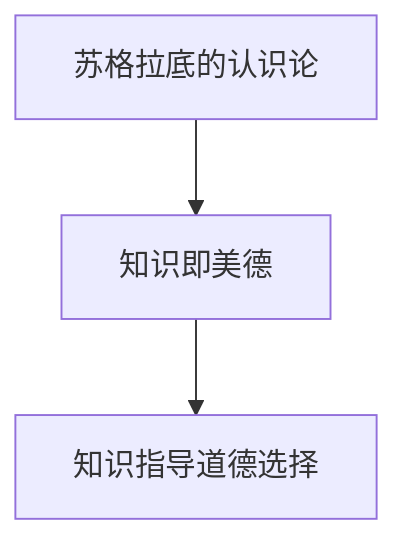

##### 2.1.3 苏格拉底的思想影响

苏格拉底的方法和理论对后世的哲学发展产生了深远的影响。他的对话法成为哲学讨论的重要方式，他的认识论为后来的哲学家提供了重要的思想资源。

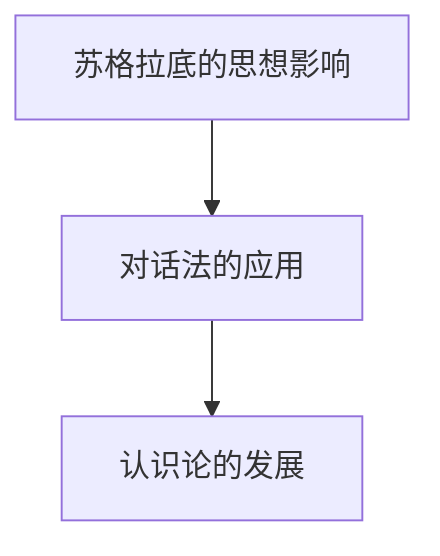

#### 2.2 柏拉图与理念论

柏拉图是苏格拉底的弟子，他的哲学体系被称为理念论。理念论强调理念世界的存在和重要性。

##### 2.2.1 柏拉图的哲学体系

柏拉图的哲学体系分为两个部分：理念世界和感官世界。他认为，理念世界是真实的，感官世界只是理念的影子。

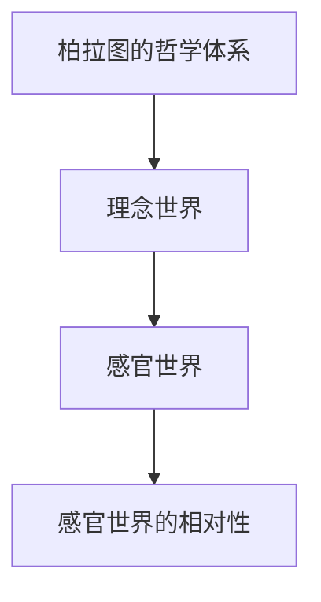

##### 2.2.2 理念论的基本原理

理念论的基本原理包括：

- 理念是真实的，感官世界只是理念的影子。
- 理念是永恒不变的，感官世界是变动不居的。
- 理念是知识的来源，感官世界只是知识的对象。

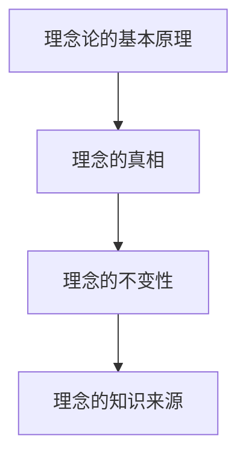

##### 2.2.3 柏拉图对后世的影响

柏拉图的哲学体系对后世哲学产生了深远的影响。他的理念论成为西方哲学的重要理论基础，影响了后来的哲学家如亚里士多德、康德等。

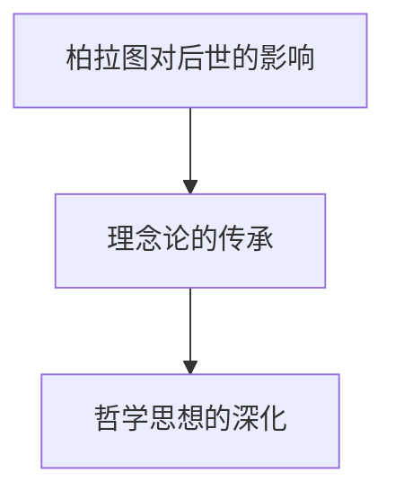

#### 2.3 亚里士多德与实证主义

亚里士多德是柏拉图的弟子，他的哲学体系被称为实证主义。实证主义强调通过观察和实验来获取知识。

##### 2.3.1 亚里士多德的哲学体系

亚里士多德的哲学体系包括形而上学、逻辑学、伦理学等部分。他认为，形而上学研究的是存在的本质，逻辑学研究的是推理的方法，伦理学研究的是道德价值观。

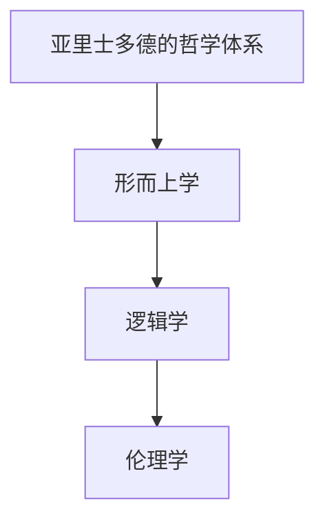

##### 2.3.2 实证主义的基本原理

实证主义的基本原理包括：

- 知识来自于观察和实验。
- 只有通过实证方法，才能获得真正的知识。
- 理论必须与实证结果相符合。

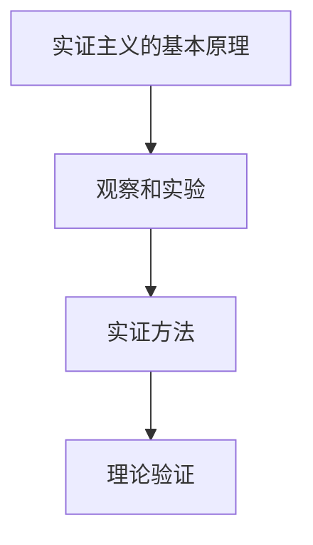

##### 2.3.3 亚里士多德的理论贡献

亚里士多德的理论贡献包括：

- 发展了逻辑学，提出了演绎推理的方法。
- 提出了形而上学的基本概念，如实体和属性。
- 对伦理学进行了系统的研究，提出了美德伦理学。

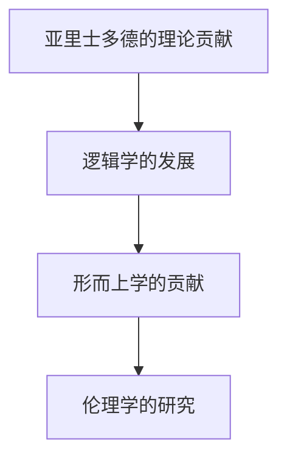

在下一节中，我们将探讨经典哲学与经验的关系，以及经验在哲学研究中的作用。

---

### 3. 经典哲学与经验的关系

经典哲学的核心问题之一是如何理解经验与知识之间的关系。经验主义者和理性主义者对这一问题的回答有着根本的不同。在本节中，我们将探讨经典哲学中的经验主义和理性主义，并分析经验在哲学论证中的作用。

#### 3.1 经验与知识的来源

经验主义者认为，知识来自于经验。洛克和休谟是经验主义的代表人物。洛克认为，我们的所有知识都来自于感觉和经验。他提出了“白板说”，即人的心灵像一块白板，所有知识和观念都是通过感官经验刻在其上的。休谟则进一步强调了感觉经验的重要性，他认为，我们的所有知识和信念都是基于感觉经验的。

```latex
\text{洛克的观点：} \\
\text{我们的所有知识都来自于感觉和经验。}
```

```latex
\text{休谟的观点：} \\
\text{我们的所有知识和信念都是基于感觉经验的。}
```

经验主义者认为，通过感官经验，我们可以获取关于外部世界的直接知识。

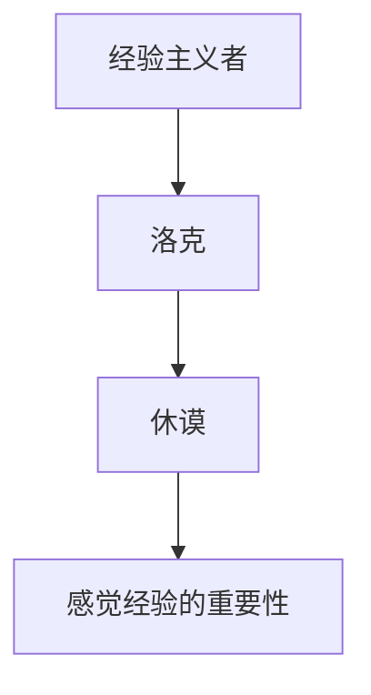

#### 3.2 经验主义与理性主义

理性主义者则认为，知识主要来自于理性思考和推理。笛卡尔和莱布尼茨是理性主义的代表人物。笛卡尔提出了“我思故我在”的观点，强调通过理性思考，我们可以建立稳固的哲学基础。莱布尼茨则认为，理性是发现真理的关键。

```latex
\text{笛卡尔的观点：} \\
\text{我思故我在。}
```

```latex
\text{莱布尼茨的观点：} \\
\text{理性是发现真理的关键。}
```

理性主义者认为，通过理性思考和推理，我们可以超越感官经验，获得更深层次的知识。

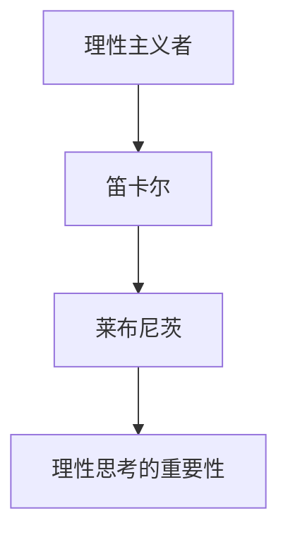

#### 3.3 经验在哲学论证中的作用

经验在哲学论证中起着至关重要的作用。无论是经验主义者还是理性主义者，都承认经验是我们获取知识的重要途径。经验主义者强调通过感官经验直接获取知识，而理性主义者则认为理性思考可以让我们更深入地理解经验。

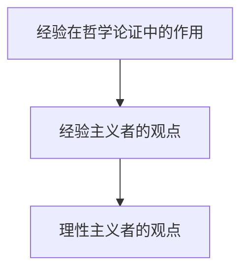

经验不仅是我们获取知识的来源，也是哲学论证的基础。通过经验，我们可以验证理论的正确性，也可以发现新的问题和挑战。

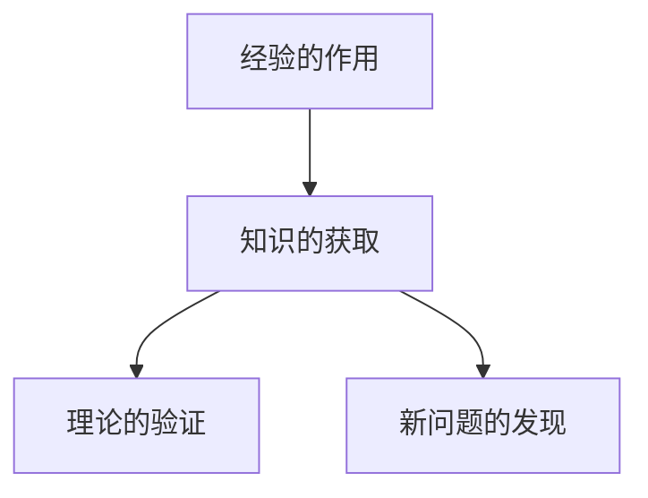

在下一节中，我们将探讨实验哲学的兴起，以及实验哲学如何为哲学研究提供了新的视角和方法。

---

#### 第二部分：实验哲学的兴起

## 4. 实验哲学的基本概念与理论框架

实验哲学是20世纪末兴起的哲学研究领域，它结合了哲学和心理学、社会学等实验科学的方法，通过实验研究来探索哲学问题。实验哲学的出现，为传统的哲学研究提供了新的视角和方法，使得哲学研究更加实证化和科学化。

### 4.1 实验哲学的定义与历史背景

#### 实验哲学的定义

实验哲学是一门跨学科的研究领域，它采用实验方法来研究哲学问题。实验哲学家认为，哲学问题可以通过实验来验证，而不是仅仅依靠逻辑推理和抽象思辨。实验哲学的核心是实验方法和实证证据，通过实验研究来探究哲学问题的实质。

```latex
\text{实验哲学的定义：} \\
\text{实验哲学是一门采用实验方法来研究哲学问题的跨学科研究领域。}
```

#### 历史背景

实验哲学的兴起可以追溯到20世纪末，当时的哲学家开始质疑传统哲学研究的有效性，认为哲学问题需要通过更科学的方法来探讨。受心理学、社会学等实验科学的影响，实验哲学逐渐发展起来，成为哲学研究的一个重要方向。

### 4.2 实验哲学的研究方法

#### 实验方法

实验哲学采用实验方法来研究哲学问题，这种方法包括但不限于以下几种：

- 实验设计：根据研究问题设计实验方案，包括实验对象、实验步骤、实验条件等。
- 数据收集：在实验过程中收集数据，包括观察数据、测量数据、问卷数据等。
- 数据分析：对收集到的数据进行分析，以验证研究假设或探索哲学问题的本质。
- 实证证据：通过实验结果，提供对哲学问题的实证证据。

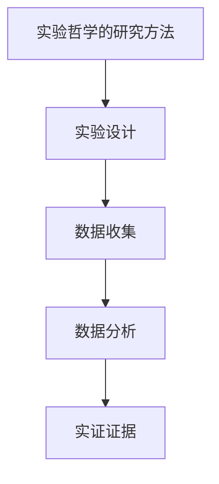

#### 实证方法

实验哲学强调实证方法，即通过实验结果来验证哲学问题的正确性。实证方法使得哲学研究更加科学化和客观化，有助于解决传统哲学研究中存在的争议和不确定性。

```latex
\text{实证方法：} \\
\text{通过实验结果来验证哲学问题的正确性。}
```

### 4.3 实验哲学的核心问题

#### 知识论

实验哲学在知识论方面的研究主要探讨知识的本质和获取知识的方法。实验哲学家通过实验方法来研究知识的来源、知识的可靠性以及知识的发展过程。

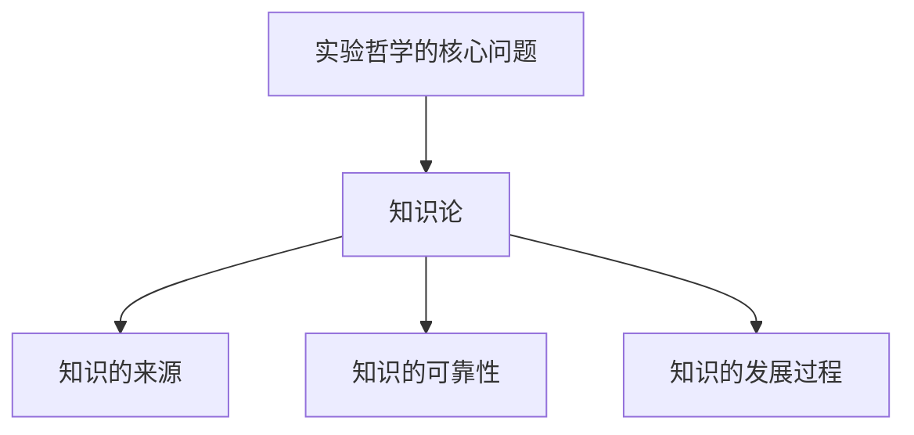

#### 道德哲学

实验哲学在道德哲学方面的研究主要探讨道德判断、道德行为以及道德价值观。通过实验方法，实验哲学家试图揭示道德判断的心理学基础和社会影响。

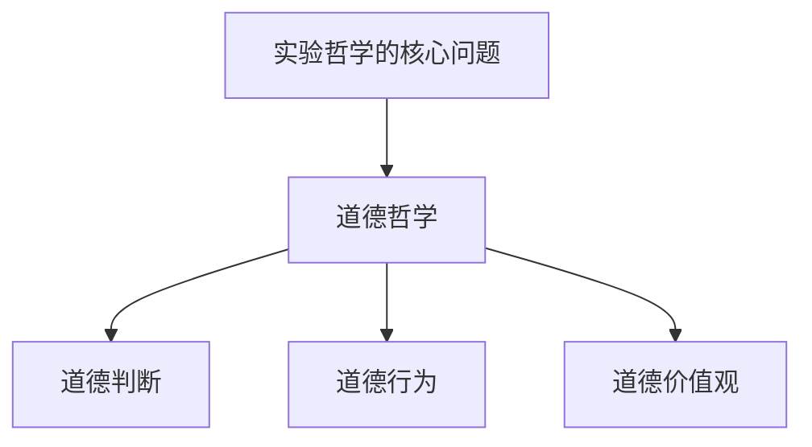

#### 认识论

实验哲学在认识论方面的研究主要探讨认识的本质、认识的过程以及认识的局限。通过实验方法，实验哲学家试图揭示认识的机制和影响。

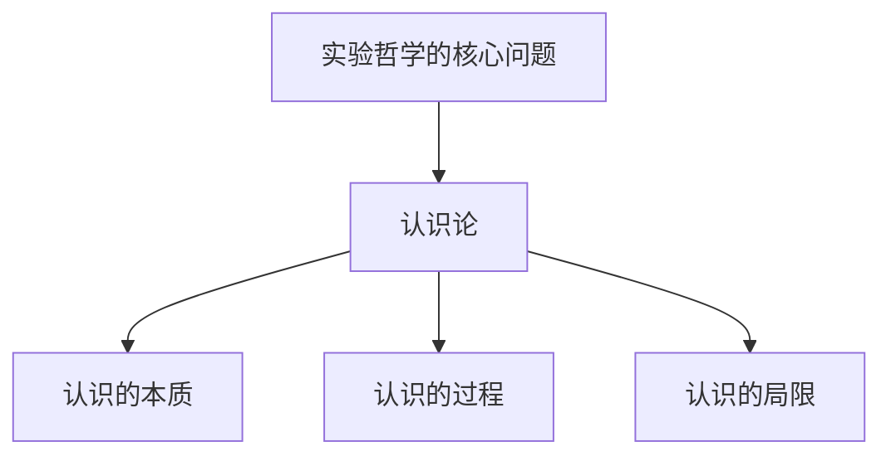

实验哲学的兴起，为哲学研究带来了新的方法和视角，使得哲学研究更加实证化和科学化。在下一节中，我们将介绍几位实验哲学家及其主要理论，进一步探讨实验哲学的发展。

---

#### 5. 实验哲学家及其主要理论

实验哲学作为哲学研究的一个新兴领域，吸引了众多哲学家的关注。他们通过实验方法来探索哲学问题，为传统哲学研究提供了新的视角和思路。在本节中，我们将介绍几位实验哲学家及其主要理论，包括霍布斯、康德和黑格尔，并探讨他们的实验方法和哲学贡献。

### 5.1 霍布斯与实验伦理

托马斯·霍布斯是英国哲学家，他在伦理学和政治哲学方面有着重要的贡献。霍布斯的伦理理论强调人类行为的动机和道德责任的本质。

#### 5.1.1 霍布斯的生命哲学

霍布斯的生命哲学强调人类生命的脆弱性和社会的重要性。他认为，人类天生是自私的，如果没有社会的约束，人们将会陷入“每个人对每个人的战争”的状态。因此，社会契约是必要的，通过社会契约，人们放弃一部分自由，以换取社会的安全和秩序。

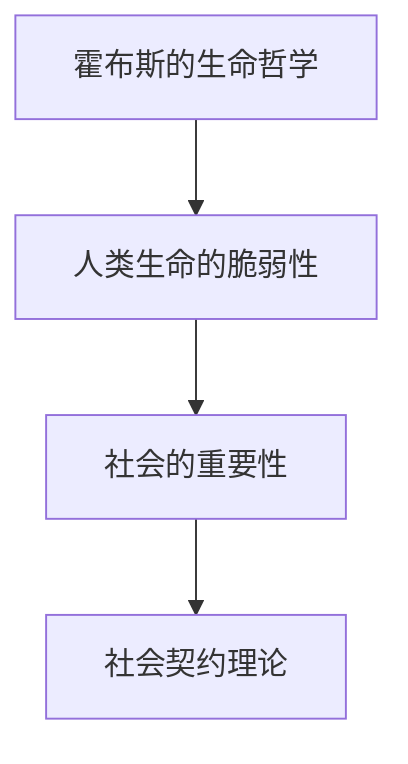

#### 5.1.2 霍布斯的伦理理论

霍布斯的伦理理论基于人类行为的动机和后果。他认为，道德行为是基于个人利益的考虑，而不是基于内在的道德原则。霍布斯提出了“最大幸福原则”，即人们应该追求最大化的幸福，这包括物质上的满足和精神上的满足。

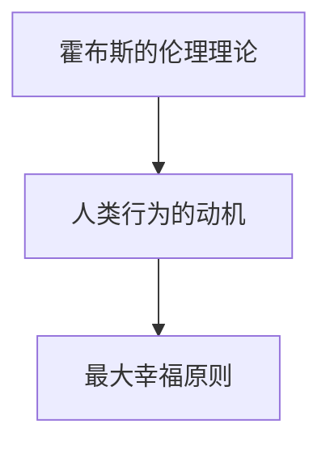

#### 5.1.3 霍布斯的思想影响

霍布斯的思想对后来的哲学家和政治理论产生了深远的影响。他的社会契约理论和伦理理论为现代政治哲学提供了重要的理论基础。

### 5.2 康德与道德哲学

伊曼努尔·康德是德国哲学家，他在伦理学和认识论方面有着重要的贡献。康德的道德哲学强调道德行为的绝对性和普遍性。

#### 5.2.1 康德的道德哲学体系

康德的道德哲学体系基于“道德律令”和“目的论”两个基本原则。他认为，道德行为应该基于道德律令，即“你应该做什么”，而不是基于结果或个人利益。康德提出了“善良意志”的概念，即道德行为的动机应该是出于对道德律令的尊重。

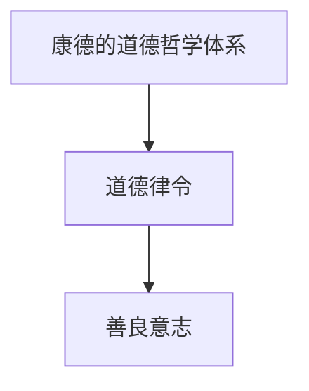

#### 5.2.2 康德的伦理学原则

康德的伦理学原则包括“责任论”和“义务论”。他认为，道德责任是行为的基础，道德义务是行为的指导原则。康德提出了“善良意志”的概念，即道德行为的动机应该是出于对道德律令的尊重。

```mermaid
graph TB
A[康德的伦理学原则] --> B[责任论]
B --> C[义务论]
```

#### 5.2.3 康德对现代哲学的影响

康德的道德哲学对现代哲学产生了深远的影响。他的道德原则和道德理论为伦理学提供了重要的理论基础，影响了后来的哲学家如黑格尔和尼采。

### 5.3 黑格尔与辩证法

乔治·威廉·弗里德里希·黑格尔是德国哲学家，他在哲学体系、辩证法和政治哲学方面有着重要的贡献。黑格尔的哲学强调历史的进步和辩证法的重要性。

#### 5.3.1 黑格尔的哲学体系

黑格尔的哲学体系包括逻辑学、自然哲学和历史哲学三个部分。他认为，哲学体系应该是一个整体，各个部分相互联系，共同构成一个完整的世界图景。

```mermaid
graph TB
A[黑格尔的哲学体系] --> B[逻辑学]
B --> C[自然哲学]
C --> D[历史哲学]
```

#### 5.3.2 黑格尔的辩证法理论

黑格尔的辩证法理论强调矛盾和发展的普遍性。他认为，事物的发展是通过矛盾和对立面的斗争实现的。黑格尔的辩证法为哲学提供了新的思维方式和研究方法。

```mermaid
graph TB
A[黑格尔的辩证法理论] --> B[矛盾和发展的普遍性]
```

#### 5.3.3 黑格尔对哲学的贡献

黑格尔的哲学对现代哲学产生了深远的影响。他的辩证法理论为哲学研究提供了新的视角和方法，影响了后来的哲学家如马克思和尼采。

通过介绍霍布斯、康德和黑格尔的实验哲学理论和实验方法，我们可以看到实验哲学在探索哲学问题方面的重要性。实验哲学不仅为哲学研究提供了新的方法，也为哲学理论的发展提供了实证基础。在下一节中，我们将探讨实验哲学与经典哲学的比较与联系，分析它们之间的异同点。

---

#### 6. 实验哲学与经典哲学的比较与联系

实验哲学和经典哲学在哲学研究的方法和目标上有着显著的不同。然而，二者之间也存在紧密的联系，特别是在经验的作用和知识的获取方面。本节将探讨实验哲学与经典哲学的异同点，分析它们在哲学方法论中的地位和影响。

### 6.1 实验哲学与经典哲学的异同

#### 异同点

**研究方法：**

- **经典哲学：** 经典哲学主要依靠逻辑推理、思辨和抽象思考来探讨哲学问题。哲学家们通过概念分析、哲学论证和理论建构来提出和解答哲学问题。
- **实验哲学：** 实验哲学则采用实验方法，通过实验设计和数据收集来验证哲学假设。实验哲学家通过心理实验、社会调查和观察等方法，收集实证数据，以支持或反驳哲学理论。

```mermaid
graph TB
A[研究方法] --> B[经典哲学]
B --> C[逻辑推理、思辨]
B --> D[抽象思考]
A --> E[实验哲学]
E --> F[实验设计]
E --> G[数据收集]
```

**哲学目标：**

- **经典哲学：** 经典哲学关注的是哲学基础理论，如存在论、认识论、伦理学等。它试图通过概念分析和理论建构来解答根本性的哲学问题。
- **实验哲学：** 实验哲学则侧重于通过实验方法来探讨哲学问题的具体实例和实际应用。它关注的是哲学理论如何在现实世界中得到验证和实现。

```mermaid
graph TB
A[哲学目标] --> B[经典哲学]
B --> C[基础理论探讨]
A --> E[实验哲学]
E --> F[理论验证与应用]
```

**经验作用：**

- **经典哲学：** 经典哲学对经验的作用有不同的看法。经验主义者如洛克和休谟认为，知识来源于经验；而理性主义者如笛卡尔和莱布尼茨则强调理性在知识获取中的重要性。
- **实验哲学：** 实验哲学强调经验在哲学研究中的重要性。它通过实验方法来收集经验数据，以验证哲学假设和理论。

```mermaid
graph TB
A[经验作用] --> B[经典哲学]
B --> C[经验主义者]
B --> D[理性主义者]
A --> E[实验哲学]
E --> F[经验的重要性]
```

#### 相互联系

**经验主义视角：**

- **经典哲学：** 经验主义是经典哲学中的一个重要流派，强调经验在知识获取中的核心作用。
- **实验哲学：** 实验哲学继承了经验主义的精神，通过实验方法来收集和解释经验数据，以验证哲学理论。

```mermaid
graph TB
A[经验主义视角] --> B[经典哲学]
B --> C[洛克]
B --> D[休谟]
A --> E[实验哲学]
E --> F[实验方法]
```

**哲学方法论：**

- **经典哲学：** 经典哲学强调逻辑推理和思辨，通过哲学论证来探讨哲学问题。
- **实验哲学：** 实验哲学则通过实证方法，结合实验设计和数据分析，为哲学问题提供实证支持。

```mermaid
graph TB
A[哲学方法论] --> B[经典哲学]
B --> C[逻辑推理]
B --> D[思辨]
A --> E[实验哲学]
E --> F[实验设计]
E --> G[数据分析]
```

### 6.2 经验在实验哲学中的应用

实验哲学在哲学研究中应用经验的方法，通过实验来探讨哲学问题。例如，实验哲学家通过心理实验来研究道德判断的心理学基础，通过社会调查来分析伦理行为的实际表现，通过观察来了解认知过程的机制。

```mermaid
graph TB
A[实验哲学中的应用] --> B[心理实验]
B --> C[道德判断的心理学基础]
A --> D[社会调查]
D --> E[伦理行为的实际表现]
A --> F[观察]
F --> G[认知过程的机制]
```

### 6.3 经典哲学对实验哲学的影响

经典哲学对实验哲学有着深远的影响。经典哲学中的经验主义思想为实验哲学提供了理论基础，而经典哲学的哲学问题和理论框架则为实验哲学的研究提供了具体的方向。例如，康德的伦理学原则为实验哲学在道德领域的实证研究提供了理论支持。

```mermaid
graph TB
A[经典哲学的影响] --> B[经验主义]
B --> C[实验哲学的理论基础]
A --> D[哲学问题和理论框架]
D --> E[实验哲学的研究方向]
```

实验哲学与经典哲学在研究方法和目标上存在差异，但二者之间也存在着紧密的联系。实验哲学通过实验方法为哲学研究提供了新的视角和实证支持，而经典哲学则为实验哲学提供了理论资源和哲学框架。在下一节中，我们将深入探讨经验与世界的可理解性，分析经验在理解世界中的作用。

---

#### 7. 经验与世界的可理解性

经验作为人类认识世界的重要途径，对于理解世界的可理解性具有重要意义。本节将探讨经验与世界的可理解性之间的关系，分析经验在理解世界中的作用，并讨论世界的可理解性难题。

### 7.1 经验与知识的获取

经验是知识的基石，它通过感官经验、日常观察和实践活动等方式，帮助我们获取关于外部世界的信息。经验主义者认为，所有知识都来源于经验，经验是我们理解世界的基本方式。

- **感官经验**：我们的感官能够感知外部世界的信息，如视觉、听觉、触觉、嗅觉和味觉。通过感官经验，我们能够获取关于物体、颜色、声音、气味和味道等的基本信息。
- **日常观察**：通过日常生活中的观察，我们能够积累对世界的认知。例如，通过观察天象，我们可以了解季节的变化；通过观察动物的行为，我们可以学习生存的技巧。
- **实践活动**：实践活动是经验获取的重要途径。通过动手操作和实践活动，我们能够更深入地了解世界的运作规律，例如科学实验、工艺制作等。

### 7.2 世界的可理解性难题

尽管经验是我们理解世界的重要途径，但世界本身的可理解性仍然存在一些难题。

- **认知局限**：我们的认知能力是有限的，无法完全理解世界的复杂性和多样性。例如，量子力学和相对论等物理学理论揭示了宏观和微观世界的本质，但这些理论对我们的直观理解提出了挑战。
- **不确定性和随机性**：世界中的许多现象具有不确定性和随机性，这使得我们难以完全预测和控制。例如，天气的变化和股市的波动都是难以预测的。
- **知识和现实的差距**：我们的知识总是有限的，而现实世界是无限的。因此，我们无法完全理解世界的所有方面。例如，我们对黑洞和暗物质的了解仍然有限。

### 7.3 经验在理解世界中的作用

经验在理解世界中发挥着关键作用。通过经验，我们能够逐步构建对世界的理解，并不断深化我们的知识。

- **知识的积累**：经验使我们能够积累关于世界的知识。通过不断地观察和实验，我们能够逐渐了解世界的规律和特性。例如，通过观察植物的生长过程，我们能够了解植物生长的基本原理。
- **理论的验证**：经验可以用来验证理论的正确性。通过实验和观察，我们可以检验理论的预测，并发现理论的局限。例如，爱因斯坦的相对论通过天文观测和实验验证，得到了广泛的认可。
- **问题的发现**：经验能够帮助我们发现问题，并提出新的研究课题。通过观察和实验，我们能够发现未知的现象和规律，从而推动科学和哲学的发展。

```mermaid
graph TB
A[经验在理解世界中的作用] --> B[知识的积累]
B --> C[理论的验证]
B --> D[问题的发现]
```

在总结经验与世界的可理解性时，我们可以得出以下结论：

- 经验是理解世界的重要途径，它通过感官经验、日常观察和实践活动等方式，帮助我们获取关于外部世界的信息。
- 尽管世界本身的可理解性存在一些难题，但经验在理解世界中仍然发挥着关键作用。通过经验的积累、理论的验证和问题的发现，我们能够逐步深化对世界的理解。

在下一节中，我们将探讨经验主义与科学哲学的关系，分析科学方法与经验的作用。

---

#### 8. 经验主义与科学哲学

经验主义和科学哲学在哲学研究中具有紧密的联系。经验主义认为知识来源于经验，而科学哲学则探讨科学知识是如何获得的，以及科学方法在知识获取中的作用。本节将分析经验主义与科学哲学的关系，探讨科学方法与经验的作用。

### 8.1 经验主义与科学哲学的关系

经验主义是科学哲学的一个重要基础。科学哲学中的经验主义强调，科学知识的获取依赖于经验观察和实验证据。科学哲学家如洛克和休谟，认为只有通过感官经验，我们才能获得关于外部世界的知识。

- **洛克的经验主义**：约翰·洛克是经验主义的代表人物之一，他提出了“白板说”，认为人的心灵像一块白板，所有知识和观念都是通过感官经验刻在其上的。洛克认为，科学知识的获取依赖于感官经验，通过实验和观察，我们可以发现自然界的规律。
- **休谟的经验主义**：大卫·休谟进一步强调了感觉经验的重要性，他认为，所有的知识和信念都是基于感觉经验的。休谟提出了“知觉优先”的观点，即我们的所有知识都来自于感官经验，理性只是对这些经验进行组织和解释。

### 8.2 科学方法与经验的作用

科学哲学探讨科学知识是如何获得的，科学方法在知识获取中发挥着关键作用。科学方法包括观察、实验、假设、理论和验证等步骤。

- **观察**：科学方法的第一步是观察。通过感官观察，科学家可以收集关于自然现象的信息。观察是科学知识的起点，它为科学实验提供了基础。
- **实验**：实验是科学方法的核心。通过实验，科学家可以验证假设，并发现自然规律。实验方法使得科学知识具有可重复性和可验证性。
- **假设**：在科学研究中，科学家会提出假设，即对某一现象的初步解释。假设是科学理论的基础，它为实验设计和理论验证提供了方向。
- **理论**：科学方法包括建立理论，即对实验结果进行系统解释。理论是科学知识的总结，它能够解释一系列现象，并预测新的实验结果。
- **验证**：科学方法强调验证，即通过实验和观察来验证理论。验证是科学知识的重要环节，它确保了科学理论的可靠性和科学性。

经验在科学方法中起着重要作用。通过感官经验和实验观察，科学家可以收集数据，并建立理论。经验使得科学方法具有实证性和可靠性。

```mermaid
graph TB
A[科学方法与经验] --> B[观察]
B --> C[实验]
C --> D[假设]
D --> E[理论]
E --> F[验证]
```

### 8.3 经验在科学发现中的应用

经验在科学发现中发挥了重要作用。通过长期的观察和实验，科学家能够积累丰富的经验，并发现新的科学现象和规律。

- **天文学**：通过长期的观察，天文学家发现了行星运动规律，如开普勒定律。这些经验为天文学的发展奠定了基础。
- **物理学**：通过实验观察，物理学家发现了电磁现象、量子力学和相对论等基本物理规律。这些发现改变了我们对世界的理解，并推动了物理学的发展。
- **生物学**：通过实验和观察，生物学家发现了遗传规律、细胞结构和生态系统等生物学现象。这些发现为生物学的发展提供了重要依据。

```mermaid
graph TB
A[经验在科学发现中的应用] --> B[天文学]
B --> C[开普勒定律]
A --> D[物理学]
D --> E[电磁现象、量子力学、相对论]
A --> F[生物学]
F --> G[遗传规律、细胞结构、生态系统]
```

在总结经验主义与科学哲学的关系时，我们可以得出以下结论：

- 经验主义是科学哲学的一个重要基础，它强调知识来源于经验，科学方法的本质是实证性和可验证性。
- 经验在科学发现中发挥了重要作用，通过长期的观察和实验，科学家能够积累丰富的经验，并发现新的科学现象和规律。
- 经验主义与科学哲学的紧密联系，使得科学方法具有实证性和可靠性，为人类认识世界提供了有力的工具。

在下一节中，我们将探讨经验与哲学方法论，分析经验主义方法的优势与局限。

---

#### 9. 经验与哲学方法论

经验在哲学方法论中扮演着至关重要的角色。哲学方法论是指哲学家们用以探究和解答哲学问题的方法和原则。经验主义哲学方法论强调通过观察、实验和实证数据来理解世界和获取知识。本节将分析经验主义方法在哲学方法论中的应用，探讨其优势与局限。

### 9.1 经验在哲学方法论中的作用

经验主义方法在哲学方法论中的作用体现在以下几个方面：

- **知识的来源**：经验主义认为，知识来源于感官经验和日常观察。通过感官，我们能够直接获取关于外部世界的信息，这些信息构成了我们知识的基础。
- **验证理论**：经验主义方法强调通过实验和观察来验证哲学理论。哲学家们通过实验设计、数据收集和分析，可以检验哲学理论的正确性和可靠性。
- **问题发现**：经验方法有助于发现哲学问题。通过观察和实验，哲学家可以发现新的现象和规律，从而提出新的哲学问题。

### 9.2 哲学中的经验主义方法

哲学中的经验主义方法主要包括以下几种：

- **观察法**：通过感官观察，哲学家可以直接获取关于自然现象和社会现象的信息。这种方法强调直观性和实证性。
- **实验法**：通过设计实验，哲学家可以控制变量，观察现象的变化，从而验证哲学理论。实验法强调控制变量和因果关系的分析。
- **数据收集法**：通过问卷、访谈和观察等方式，哲学家可以收集大量的数据，这些数据可以用于验证或反驳哲学假设。
- **案例分析法**：通过分析具体案例，哲学家可以理解抽象概念在实际中的应用和影响。

### 9.3 经验主义方法的优势与局限

经验主义方法在哲学方法论中具有以下优势：

- **实证性**：经验主义方法强调实证数据，这为哲学研究提供了客观和可靠的依据。
- **可验证性**：通过实验和观察，哲学家可以验证哲学理论的正确性，从而提高理论的科学性和可靠性。
- **直观性**：经验方法通过感官观察和直观理解，使得哲学问题更易于理解。

然而，经验主义方法也存在一定的局限：

- **认知局限**：人类的认知能力是有限的，我们无法完全理解世界的复杂性和多样性。
- **经验局限性**：经验主义依赖于个人的感官经验和日常观察，这可能导致知识的片面性和主观性。
- **方法论问题**：经验主义方法在哲学研究中可能面临方法论上的挑战，如实验设计的合理性和数据分析的可靠性。

### 9.4 经验主义方法的应用案例

以下是一些经验主义方法在哲学中的应用案例：

- **道德哲学**：通过问卷调查和实地观察，哲学家可以研究道德行为的动机和道德判断的心理学基础。
- **知识论**：通过实验方法，哲学家可以探讨知识的获取过程和知识的可靠性。
- **政治哲学**：通过社会调查和数据分析，哲学家可以研究政治制度的实际效果和社会公正问题。

```mermaid
graph TB
A[经验主义方法的应用案例] --> B[道德哲学]
B --> C[道德行为的动机和道德判断的心理学基础]
A --> D[知识论]
D --> E[知识的获取过程和知识的可靠性]
A --> F[政治哲学]
F --> G[政治制度的实际效果和社会公正问题]
```

在总结经验与哲学方法论的关系时，我们可以得出以下结论：

- 经验主义方法在哲学方法论中具有重要地位，它强调通过感官经验、实验和数据分析来理解世界和获取知识。
- 经验主义方法具有实证性和直观性，但同时也存在认知局限和经验局限性。
- 通过经验主义方法，哲学家可以探索道德、知识、政治等哲学问题，并为这些问题提供实证支持。

在下一节中，我们将探讨经验在伦理学中的应用，分析伦理经验主义的基本原理及其与道德判断的关系。

---

#### 10. 经验与伦理学

伦理学是哲学中探讨道德价值观和行为规范的重要领域。经验在伦理学中的应用对于理解道德行为和社会伦理具有重要意义。本节将分析伦理经验主义的基本原理，探讨经验在道德判断中的作用，并讨论伦理经验主义与道德判断的关系。

### 10.1 经验在伦理学中的应用

经验在伦理学中的应用主要体现在以下几个方面：

- **道德行为的观察**：通过观察社会中的道德行为，我们可以了解不同文化和社会背景下的道德规范和道德标准。这种观察有助于我们理解道德行为的多样性。
- **道德判断的心理学基础**：心理学研究通过实验方法探讨了道德判断的心理学基础。例如，通过问卷、访谈和实验，研究者可以了解道德判断的动机、过程和影响因素。
- **伦理实践的实证研究**：通过实证研究，伦理学家可以分析道德实践的成效，评估不同伦理理论和实践对社会的影响。

### 10.2 伦理经验主义的基本原理

伦理经验主义是伦理学中的一个重要流派，它强调道德价值观和行为规范是通过经验积累和观察学习形成的。伦理经验主义的基本原理包括：

- **经验是道德知识的来源**：伦理经验主义者认为，道德知识是通过日常经验和实践获得的，而不是通过抽象的理论推理。
- **道德行为是社会经验的产物**：伦理经验主义强调道德行为是在社会互动中形成的，通过模仿和学习他人的道德行为，个体能够形成自己的道德观念和行为模式。
- **道德判断的相对性**：伦理经验主义认为，道德判断具有一定的相对性，不同文化和社会背景下，道德规范和道德价值观可能存在差异。

### 10.3 经验与道德判断的关系

经验在道德判断中起着关键作用，它影响着我们的道德观念和道德判断。以下是一些关于经验与道德判断的关系：

- **经验的积累**：通过日常经验，个体能够积累道德知识，形成道德观念。这些道德观念成为我们道德判断的基础。
- **观察学习**：通过观察他人的道德行为和道德判断，个体可以学习道德规范和道德标准。这种观察学习有助于我们形成正确的道德判断。
- **情境因素**：道德判断受到情境因素的影响。不同的情境可能会导致相同的道德行为产生不同的道德判断。

### 10.4 伦理经验主义的案例分析

以下是一些伦理经验主义的案例分析：

- **社会规范的形成**：通过观察和模仿，个体能够学习并内化社会规范，这些规范成为道德行为的基础。
- **道德判断的多样性**：不同文化和社会背景下，个体对同一道德问题的判断可能存在差异。这种现象体现了道德判断的相对性。
- **道德行为的评价**：通过实证研究，我们可以分析道德行为的成效，评估不同道德实践对社会的影响。

```mermaid
graph TB
A[伦理经验主义的案例分析] --> B[社会规范的形成]
B --> C[道德行为的模仿和学习]
A --> D[道德判断的多样性]
D --> E[道德判断的相对性]
A --> F[道德行为的评价]
F --> G[道德实践的成效评估]
```

在总结经验与伦理学的关系时，我们可以得出以下结论：

- 经验在伦理学中具有重要地位，它帮助我们理解和形成道德观念，影响我们的道德判断。
- 伦理经验主义强调道德价值观和行为规范是通过经验积累和观察学习形成的。
- 通过经验观察、实验研究和实证分析，我们可以更好地理解道德行为的多样性及其对社会的影响。

在下一节中，我们将通过具体案例来展示经验在现代社会中的应用，并探讨经验在政治哲学、教育哲学和科技哲学等领域的实际影响。

---

#### 11. 经验视角下的哲学问题案例分析

在现代社会中，经验视角下的哲学问题具有广泛的实际应用，涵盖了政治哲学、教育哲学和科技哲学等多个领域。本节将通过具体案例，分析经验在解决这些哲学问题中的作用，并探讨其实际影响。

### 11.1 经验主义视角下的知识问题

知识问题一直是哲学研究的重要课题，经验主义视角下的知识问题尤为显著。以下是一个案例分析：

#### 案例一：科学知识的获取

背景：在科学研究中，实验数据和观察结果对于验证科学假设和构建科学理论至关重要。

分析：
- 科学家通过实验收集数据，这些数据是科学知识的重要来源。
- 实验设计、数据收集和分析过程中，经验主义方法被广泛应用，例如在物理学中的粒子碰撞实验，生物医学中的临床试验等。

结论：
- 经验主义方法在科学知识的获取中发挥了重要作用，通过实验和观察，科学家能够验证理论，发现新知识。

### 11.2 经验主义视角下的道德问题

道德问题在现代社会中具有重要地位，经验主义视角下的道德问题分析有助于我们理解道德行为的动机和道德规范的演变。

#### 案例二：企业伦理

背景：企业伦理问题是现代商业社会中的一个热点问题，涉及企业如何平衡经济效益和社会责任。

分析：
- 通过社会调查和员工访谈，可以了解企业伦理问题对员工和消费者的道德判断和态度。
- 实际案例，如某公司因不道德行为被公众抵制，从而影响了其市场份额和品牌形象。

结论：
- 经验主义方法在道德问题的分析和解决中具有重要作用，通过实际案例，我们可以理解道德行为对组织和社会的影响。

### 11.3 经验主义视角下的社会问题

社会问题涉及社会结构和人类行为，经验主义视角下的社会问题分析有助于我们理解社会现象的本质和解决策略。

#### 案例三：教育公平

背景：教育公平是现代社会中的一个重大问题，关系到社会公正和发展。

分析：
- 通过实地调查和数据分析，可以了解不同地区、不同群体之间的教育机会差异。
- 实际案例，如某地区通过政策调整和教育资源的优化，改善了当地的教育公平状况。

结论：
- 经验主义方法在社会问题分析中具有重要作用，通过实际案例，我们可以探索解决社会问题的有效策略。

### 案例总结

通过以上案例，我们可以看到经验主义视角在哲学问题分析中的应用：

- **知识问题**：通过实验和观察，经验主义方法为科学知识的获取提供了基础。
- **道德问题**：通过社会调查和实际案例，经验主义方法有助于我们理解道德行为的动机和道德规范的演变。
- **社会问题**：通过实地调查和数据分析，经验主义方法为解决社会问题提供了实证支持。

经验主义方法在哲学问题分析中的应用，不仅丰富了我们的理论框架，也为实际问题的解决提供了有力的工具。在下一节中，我们将探讨经验在现代社会中的应用，进一步分析其在政治哲学、教育哲学和科技哲学等领域的影响。

---

#### 12. 经验在现代社会中的应用

经验在现代社会中的应用极其广泛，涉及政治哲学、教育哲学和科技哲学等多个领域。通过具体案例，我们可以更深入地理解经验在这些问题中的重要作用和实际影响。

### 12.1 经验在政治哲学中的应用

政治哲学探讨国家、政府、法律和公民责任等基本问题。经验在政治哲学中的应用体现在以下几个方面：

#### 案例一：民主制度的演变

背景：民主制度是现代政治哲学的核心议题之一，其演变和发展经历了漫长历史。

分析：
- 经验主义视角下，通过对不同国家和地区的民主实践进行观察和比较，可以分析民主制度的优点和局限性。
- 例如，美国和欧洲的民主实践表明，民主制度在保障公民权利和自由方面具有显著优势，但也面临选民参与不足、政治极化等问题。

结论：
- 经验在政治哲学中的应用有助于我们理解民主制度的演变，为改进和完善民主制度提供实证支持。

### 12.2 经验在教育哲学中的应用

教育哲学探讨教育的目的、方法和价值。经验在教育哲学中的应用主要体现在以下几个方面：

#### 案例二：教育改革

背景：教育改革是现代教育哲学的重要议题，旨在提高教育质量和公平性。

分析：
- 通过对实际教育政策和教育实践的观察和评估，可以分析教育改革的成效和问题。
- 例如，芬兰的教育改革强调了个性化教育和教师专业发展，取得了显著的教育成就，成为全球教育改革的典范。

结论：
- 经验在教育哲学中的应用有助于我们理解和评估教育改革的效果，为制定有效的教育政策提供实证依据。

### 12.3 经验在科技哲学中的应用

科技哲学探讨科技的发展、影响和应用。经验在科技哲学中的应用体现在以下几个方面：

#### 案例三：人工智能与伦理

背景：人工智能技术的发展引发了广泛的社会讨论，涉及伦理、隐私和安全等问题。

分析：
- 通过对人工智能应用案例的观察和分析，可以评估人工智能的伦理问题和社会影响。
- 例如，人工智能在医疗诊断、自动驾驶和金融投资等领域的应用，带来了便利和效率，但也引发了数据隐私和算法歧视等问题。

结论：
- 经验在科技哲学中的应用有助于我们理解和解决人工智能带来的伦理问题，为制定合理的科技政策和伦理规范提供实证支持。

### 案例总结

通过以上案例，我们可以看到经验在现代社会中的应用：

- **政治哲学**：经验帮助我们理解民主制度的演变和改进，为政治哲学研究提供了实证支持。
- **教育哲学**：经验帮助我们评估教育改革的效果，为制定有效的教育政策提供实证依据。
- **科技哲学**：经验帮助我们理解和解决科技发展带来的伦理问题，为科技政策的制定提供实证支持。

经验在现代社会中的应用不仅丰富了哲学研究的理论框架，也为实际问题的解决提供了有力工具。在下一节中，我们将探讨经验主义与未来哲学，分析经验主义在哲学研究中的前景和挑战。

---

#### 13. 经验主义与未来哲学

经验主义在哲学研究中具有重要地位，其影响深远，不仅丰富了哲学的理论框架，也为实际问题的解决提供了有力工具。随着社会的发展和科技的进步，经验主义在哲学研究中的前景广阔，同时也面临新的挑战。

### 13.1 经验主义在哲学研究中的前景

**1. 多学科融合**：经验主义在哲学研究中与心理学、社会学、经济学等学科相互融合，形成跨学科的研究方法。这种融合有助于我们更全面地理解复杂的社会现象和哲学问题，推动哲学研究的发展。

**2. 实证研究的深化**：随着科技的发展，实证研究手段日益丰富，经验主义在哲学研究中的应用将更加深入和精细。通过大数据分析、实验心理学和跨文化研究等方法，哲学研究将获得更多的实证支持。

**3. 新技术的应用**：人工智能、虚拟现实和区块链等新技术的发展为哲学研究提供了新的工具和方法。这些技术可以模拟和实验哲学问题，提高哲学研究的科学性和精确性。

### 13.2 经验主义在哲学教育中的应用

**1. 教育方法的创新**：经验主义在哲学教育中的应用，有助于创新教育方法，提高学生的哲学素养。通过案例教学、问题导向学习和实验研究等教学方法，学生可以更深入地理解和应用哲学理论。

**2. 教育内容的更新**：随着社会的发展和科技的进步，哲学教育内容也需要不断更新。经验主义为哲学教育提供了新的研究课题和案例，有助于课程内容的丰富和多样化。

**3. 教育评价的改革**：经验主义在哲学教育中的应用，可以改变传统的教育评价方式。通过项目评价、过程评价和多元评价等方法，更全面地评估学生的哲学素养和能力。

### 13.3 经验主义与跨学科研究

**1. 跨学科研究的推动**：经验主义在哲学研究中的地位，有助于推动跨学科研究的发展。通过跨学科合作，哲学研究可以借鉴其他学科的方法和理论，提高研究的深度和广度。

**2. 跨文化研究的深化**：经验主义强调通过观察和实验来获取知识，这使得跨文化研究成为可能。通过比较不同文化背景下的哲学问题，我们可以更全面地理解哲学的多样性和普遍性。

**3. 跨学科研究的挑战**：跨学科研究也面临一定的挑战，如学科之间的方法论差异、数据共享和整合等问题。经验主义在跨学科研究中的应用，有助于解决这些问题，推动跨学科研究的发展。

### 案例与启示

**案例一：人工智能伦理研究**

背景：人工智能技术的发展引发了广泛的社会关注，涉及伦理、隐私和安全等问题。

分析：
- 经验主义视角下，通过案例分析、实证研究和跨学科合作，可以深入探讨人工智能伦理问题，并提出相应的解决方案。
- 例如，欧盟的“通用数据保护条例”（GDPR）就是基于经验主义原则，通过实证研究和公众参与，制定的具有实际操作性的法规。

结论：
- 经验主义在跨学科研究和政策制定中发挥了重要作用，有助于解决复杂的社会问题。

**案例二：教育公平研究**

背景：教育公平是现代社会中的一个重要议题，涉及教育资源分配、教育机会和学业成就等问题。

分析：
- 经验主义视角下，通过实地调查、数据分析和社会实验，可以评估教育公平的实际情况，并提出改进措施。
- 例如，某些国家和地区通过政策调整和教育资源的优化，取得了显著的教育公平成果。

结论：
- 经验主义在政策制定和实际操作中具有重要意义，有助于推动教育公平的实现。

在总结经验主义与未来哲学的关系时，我们可以得出以下结论：

- 经验主义在哲学研究中具有广阔的前景，其影响将继续深化和扩展。
- 经验主义在哲学教育中的应用有助于创新教育方法，提高学生的哲学素养。
- 经验主义与跨学科研究的结合，为解决复杂的社会问题提供了新的思路和方法。

在未来的哲学研究中，经验主义将继续发挥重要作用，为哲学理论的创新和实践的推进提供坚实的支持。

---

## 附录

### 附录 A：经典哲学与实验哲学资料汇编

#### A.1 经典哲学文献推荐

- 柏拉图：《理想国》
- 亚里士多德：《形而上学》
- 苏格拉底：《苏格拉底对话集》
- 洛克：《人类理解论》
- 休谟：《人类理解研究》
- 康德：《纯粹理性批判》
- 黑格尔：《精神现象学》

#### A.2 实验哲学文献推荐

- 文森特·加芬克尔：《实验哲学导论》
- 约翰·达尔格：《实验哲学：概念和方法》
- 丹尼尔·丹尼特：《超越意识》
- 艾伦·艾斯勒：《实验伦理学》

#### A.3 经验主义相关研究资源

- 《经验主义哲学手册》
- 《经验主义与科学哲学》
- 《经验主义与伦理学》
- 《经验主义与政治哲学》

### 附录 B：哲学研究方法简介

#### B.1 经验主义研究方法

- 实验设计
- 数据收集
- 数据分析
- 实证证据

#### B.2 实证主义研究方法

- 观察法
- 实验法
- 量化分析
- 质化研究

#### B.3 诠释学研究方法

- 文本分析
- 语境理解
- 语义分析
- 解释学循环

### 附录 C：实验哲学实验案例

#### C.1 经验主义与理性主义的实验对比

- 案例设计
- 实验步骤
- 结果分析

#### C.2 经验与知识获取的实验分析

- 案例描述
- 数据收集
- 结果讨论

#### C.3 伦理学中的实验研究案例

- 伦理判断实验
- 道德决策实验
- 结果分析与讨论

通过这些附录，读者可以进一步深入了解经典哲学与实验哲学的相关文献和研究方法，以及实验哲学在实际应用中的案例。这些资料将有助于深化对哲学问题的理解和研究。

## 作者信息

作者：AI天才研究院/AI Genius Institute & 禅与计算机程序设计艺术 /Zen And The Art of Computer Programming

