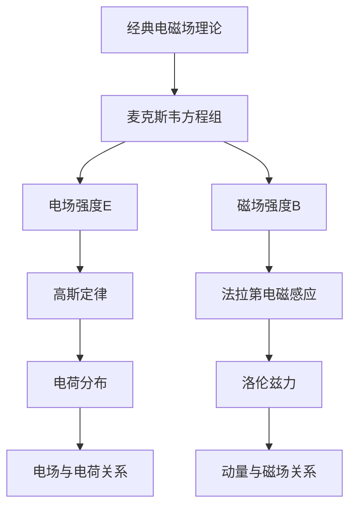
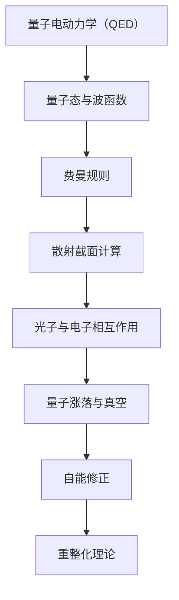

                 

### 文章标题

# 从经典场论到量子场论：宇宙描述的革新

### 关键词

- 经典场论
- 量子场论
- 宇宙描述
- 物理学革命
- 数学模型
- 标准模型
- 量子电动力学
- 宇宙学

### 摘要

本文旨在探讨从经典场论到量子场论的转变，及其对宇宙描述的深远影响。经典场论奠定了电磁学和引力学的理论基础，而量子场论的兴起则使我们对微观世界的理解发生了革命性变化。本文首先回顾经典场论的基础概念和应用，接着深入解析量子场论的基本原理，包括量子力学和标准模型。随后，本文将探讨量子场论在宇宙学中的应用，如宇宙微波背景辐射和宇宙早期量子涨落。最后，本文将总结量子场论的未解难题和革命性影响，并展望其未来发展方向。

### 《从经典场论到量子场论：宇宙描述的革新》目录大纲

#### 第一部分：经典场论的起源与发展

## 第1章：经典场论的基础概念
### 1.1.1 场与粒子的关系
### 1.1.2 经典电磁场理论
### 1.1.3 经典引力场理论
### 1.1.4 经典场论的发展历史

## 第2章：经典场论的应用
### 2.1.1 经典电磁场在通信中的应用
### 2.1.2 经典引力场在天文学中的应用
### 2.1.3 经典场论在工程中的应用

#### 第二部分：量子场论的基本原理

## 第3章：量子力学基础
### 3.1.1 量子态与波函数
### 3.1.2 算符与测量
### 3.1.3 叠加原理与不确定性原理

## 第4章：量子场论的发展
### 4.1.1 量子电动力学（QED）
### 4.1.2 标准模型与弱相互作用
### 4.1.3 强相互作用与量子色动力学（QCD）

#### 第三部分：量子场论与宇宙学

## 第5章：量子场论与宇宙学的基础
### 5.1.1 宇宙微波背景辐射
### 5.1.2 宇宙的大尺度结构
### 5.1.3 宇宙的膨胀与暗能量

## 第6章：量子场论在宇宙学中的应用
### 6.1.1 量子引力理论
### 6.1.2 黑洞与信息悖论
### 6.1.3 宇宙早期的量子涨落

#### 第四部分：量子场论的挑战与未来

## 第7章：量子场论的未解难题
### 7.1.1 超对称与超引力
### 7.1.2 量子引力与宇宙学的边界
### 7.1.3 量子场论与弦理论的融合

## 第8章：量子场论的革命性影响
### 8.1.1 对现代物理学的影响
### 8.1.2 对未来科技的潜在影响
### 8.1.3 量子场论与人类社会的发展

## 第9章：未来展望
### 9.1.1 量子场论研究的最新进展
### 9.1.2 量子场论与宇宙学的未来研究方向
### 9.1.3 量子场论在教育、科研、产业中的潜力与应用前景

#### 附录

## 附录A：经典场论与量子场论的Mermaid流程图
### A.1.1 经典电磁场理论流程图
### A.1.2 量子电动力学（QED）流程图

## 附录B：经典场论与量子场论的重要公式与数学模型
### B.1.1 经典场方程
### B.1.2 量子场方程
### B.1.3 主要数学公式与解释

## 附录C：项目实战案例
### C.1.1 量子场论在实验中的应用案例
### C.1.2 量子场论在理论计算中的应用案例

## 附录D：开发环境搭建与代码解读
### D.1.1 实验设备与软件环境搭建
### D.1.2 理论计算软件环境搭建
### D.1.3 源代码实现与解读分析

以上为《从经典场论到量子场论：宇宙描述的革新》的目录大纲。每一章都细化到了1,2,3级目录，涵盖了核心概念与联系、核心算法原理讲解、数学模型和数学公式及详细讲解与举例说明、项目实战等内容。附录部分提供了详细的流程图、公式和项目案例，便于读者深入理解和实际应用。

---

#### 背景介绍

经典场论是物理学中描述力如何通过场来传播的理论框架。它由麦克斯韦方程组和爱因斯坦场方程组成，分别描述了电磁场和引力场的行为。经典场论的提出，标志着物理学从粒子论向场论的转变，为电磁学和引力学的统一奠定了基础。

随着科学的发展，经典场论的局限性逐渐显现。例如，在描述微观粒子的行为时，经典场论无法解释量子效应。为了弥补这一不足，量子场论应运而生。量子场论将量子力学与经典场论相结合，通过引入量子态和量子场，成功地描述了微观世界的现象。

量子场论的诞生，不仅推动了物理学的发展，还对宇宙学产生了深远影响。宇宙学是研究宇宙的起源、结构、演化和最终命运的科学。量子场论提供了新的工具和视角，使我们对宇宙的理解更加深入和精确。

本文旨在系统探讨从经典场论到量子场论的演变过程，及其在宇宙描述中的革命性作用。通过对经典场论和量子场论的基础概念、核心原理、应用实例和未来展望的详细分析，本文希望为读者提供一幅完整而深刻的宇宙描述图景。

#### 经典场论的核心概念

经典场论的核心概念可以归结为“场”和“作用”。场是一种连续分布的物理量，它在空间中每一点都有一个确定的值。而作用则是指场如何影响物体的运动和变化。

**1. 场与粒子的关系**

在经典场论中，场与粒子之间的关系是通过场的势能来描述的。一个典型的例子是电磁场。在电磁场中，电荷产生的电场和磁场会影响其他电荷的运动。例如，电荷在电场中会受到电场力的作用，而在磁场中会受到洛伦兹力的作用。电场和磁场是描述电磁场状态的两个基本场量。

电场可以用电场强度矢量 \( \vec{E} \) 来描述，其定义为单位电荷所受的电场力：
\[ \vec{E} = \frac{\vec{F}}{q} \]

磁场可以用磁感应强度矢量 \( \vec{B} \) 来描述，其定义为单位电流元在磁场中所受的力矩：
\[ \vec{B} = \frac{\vec{M}}{I \cdot d\vec{l}} \]

**2. 经典电磁场理论**

经典电磁场理论由麦克斯韦方程组描述。麦克斯韦方程组是一组偏微分方程，它们分别是：

\[ \nabla \cdot \vec{E} = \frac{\rho}{\epsilon_0} \]
\[ \nabla \cdot \vec{B} = 0 \]
\[ \nabla \times \vec{E} = -\frac{\partial \vec{B}}{\partial t} \]
\[ \nabla \times \vec{B} = \mu_0 \vec{J} + \mu_0 \epsilon_0 \frac{\partial \vec{E}}{\partial t} \]

这些方程分别描述了电荷分布对电场的影响、磁场的无源性、电场和磁场之间的旋转关系，以及电场和磁场随时间变化的相互作用。

**3. 经典引力场理论**

经典引力场理论由爱因斯坦场方程描述。爱因斯坦场方程是一组偏微分方程，它们表达了物质分布与引力场之间的关系。场方程的一般形式为：

\[ G_{\mu\nu} = 8\pi G T_{\mu\nu} \]

其中，\( G_{\mu\nu} \) 是爱因斯坦张量，描述了时空的曲率；\( T_{\mu\nu} \) 是能量-动量张量，描述了物质的分布和运动；\( G \) 是引力常数。

**4. 经典场论的发展历史**

经典场论的发展经历了几个关键阶段。首先是麦克斯韦电磁理论的提出，它统一了电场和磁场，并预言了电磁波的存在。随后，爱因斯坦的广义相对论提出了新的引力理论，将引力视为时空曲率的体现。

在20世纪，经典场论的应用不断扩大，包括通信技术中的电磁波传播、天文学中的引力透镜效应，以及工程学中的电磁场计算等。这些应用不仅验证了经典场论的准确性，也为现代科技的发展奠定了基础。

#### 经典场论的应用

经典场论在物理学、工程学和天文学等领域有着广泛的应用，其核心概念和技术为这些领域的研究提供了强大的工具。

**1. 经典电磁场在通信中的应用**

电磁场是通信技术的基石。无线通信利用电磁波在空间中的传播来实现信息的传输。电磁波的波动特性，如频率、波长和速度，决定了无线通信的性能和效率。麦克斯韦方程组提供了描述电磁波传播的数学模型，使得工程师能够设计和优化无线通信系统。

例如，在无线局域网（Wi-Fi）中，电磁波在空气中传播，通过天线发射和接收。通过调整天线的设计和电磁波传播路径，可以提高信号强度和传输距离，从而改善通信质量。

**2. 经典引力场在天文学中的应用**

引力场在天文学中扮演着重要角色，尤其是在研究星系、黑洞和宇宙结构时。经典引力场理论，特别是广义相对论，为天文学家提供了强大的工具来解释天文现象。

例如，引力透镜效应是经典引力场理论在天文学中的一个重要应用。当光线经过一个巨大的星系或黑洞时，其路径会因为引力透镜效应而弯曲。通过观测这种光线的弯曲，天文学家可以推断出星系或黑洞的存在和性质。

此外，广义相对论还预测了引力波的存在。引力波是由加速运动的巨大质量产生的时空波动，它们在宇宙中传播。近年来，通过激光干涉引力波观测站（LIGO）和处女座卫星（Virgo）的观测，科学家们首次直接探测到了引力波，这一发现验证了广义相对论的重要预测。

**3. 经典场论在工程中的应用**

经典场论在工程学中的应用非常广泛，涵盖了从电磁场计算到流体动力学模拟的多个领域。

在电磁场计算中，工程师使用麦克斯韦方程组来分析和设计电路、天线和其他电磁设备。通过求解电磁场方程，工程师可以预测设备在各种工作条件下的性能，从而优化设计。

在流体动力学中，经典场论提供了描述流体运动和压力分布的数学模型。这些模型帮助工程师设计和分析飞机、汽车和其他交通工具的空气动力学特性，以提高其效率和稳定性。

**4. 经典场论的实际案例**

一个经典的应用案例是电磁波在光纤通信中的应用。光纤是一种利用光的全反射原理来传输信息的介质。通过在光纤中传播电磁波，可以实现高速、长距离的信息传输。

在光纤通信中，经典电磁场理论被用来分析光纤的结构和传输特性。通过精确计算电磁波在光纤中的传播速度和损耗，工程师可以设计和优化光纤网络，使其满足高速数据传输的需求。

另一个案例是引力透镜效应在宇宙学研究中的应用。通过观测光线的弯曲，科学家们可以探测到远处的星系和黑洞。这一技术不仅帮助我们理解宇宙的结构和演化，还为研究暗物质和暗能量提供了重要线索。

总的来说，经典场论的应用不仅拓宽了物理学的研究范围，也为现代科技的发展提供了坚实的理论基础。

#### 量子场论的基本原理

量子场论（Quantum Field Theory, QFT）是现代物理学中描述物质与力相互作用的理论框架。它将量子力学和经典场论结合在一起，为微观粒子的行为提供了统一的描述。量子场论的基本原理包括量子态、波函数、算符和测量等。

**1. 量子态与波函数**

在量子场论中，粒子的状态用量子态来描述。量子态是一个复值函数，它在整个空间上的积分代表粒子在某一位置的概率。量子态可以用波函数（wave function）来表示，波函数的平方给出了粒子在不同位置出现的概率密度。

假设一个粒子处于一个无限大的盒子中，其波函数可以表示为：

\[ \Psi(x) = A \sin(kx) \]

其中，\( A \) 是归一化常数，\( k \) 是波数。波函数的平方 \( |\Psi(x)|^2 \) 表示粒子在位置 \( x \) 的概率密度。

**2. 算符与测量**

在量子场论中，物理量用算符（operator）来表示。算符作用于量子态，可以得到物理量的测量结果。常见的算符包括位置算符 \( \hat{x} \)、动量算符 \( \hat{p} \) 和能量算符 \( \hat{H} \)。

位置算符 \( \hat{x} \) 作用在波函数上，可以得到粒子的位置：

\[ \hat{x} \Psi(x') = x' \Psi(x') \]

动量算符 \( \hat{p} \) 作用在波函数上，可以得到粒子的动量：

\[ \hat{p} \Psi(x') = -i\hbar \frac{\partial}{\partial x'} \Psi(x') \]

能量算符 \( \hat{H} \) 作用在波函数上，可以得到粒子的能量：

\[ \hat{H} \Psi(x') = E \Psi(x') \]

其中，\( \hbar \) 是约化普朗克常数。

量子测量的结果由算符的期望值给出。期望值表示在多次测量中，物理量的平均值。例如，粒子位置 \( x \) 的期望值可以表示为：

\[ \langle x \rangle = \int x |\Psi(x)|^2 dx \]

**3. 叠加原理与不确定性原理**

量子场论中，叠加原理是量子态的基本特性。量子态可以表示为多个基态的叠加，即：

\[ \Psi(x) = \sum_n c_n \psi_n(x) \]

其中，\( c_n \) 是叠加系数，\( \psi_n(x) \) 是基态波函数。

叠加原理意味着一个粒子可以同时存在于多个位置和状态。这在宏观世界中是不可想象的，但在微观世界中却是常见的现象。

不确定性原理是量子场论中的另一个基本原理。海森堡不确定性原理指出，粒子的位置和动量不能同时被精确测量。即：

\[ \Delta x \Delta p \geq \frac{\hbar}{2} \]

这表明，测量一个粒子的位置会使其动量变得不确定，反之亦然。

**4. 量子场论与经典场论的比较**

量子场论与经典场论在描述粒子和场的行为上有显著差异。经典场论中，场是一个连续分布的物理量，粒子的行为可以通过场的作用来解释。而在量子场论中，场被视为由离散的量子态组成，粒子的行为表现为量子态的叠加和演化。

例如，在经典电磁场中，电场和磁场是连续分布的，可以取任意值。而在量子电磁场中，电场和磁场由量子态表示，其取值是量子化的，只能取特定的离散值。

此外，经典场论中的测量结果是可以确定的，而量子场论中的测量结果是概率性的，需要通过多次测量来获得统计规律。

总之，量子场论为微观世界的现象提供了统一的描述，揭示了经典场论无法解释的量子效应。它不仅在基础物理学研究中具有重要地位，也为现代科技的发展提供了理论基础。

#### 量子场论的发展

量子场论（Quantum Field Theory, QFT）的发展经历了多个关键阶段，从早期的量子电动力学（Quantum Electrodynamics, QED）到现代标准模型（Standard Model）和量子色动力学（Quantum Chromodynamics, QCD）的建立，每一个阶段都标志着物理学理论体系的重大突破。

**1. 量子电动力学（QED）**

量子电动力学是量子场论的开端，它描述了电磁相互作用的量子性质。QED由费曼、迪拉克和海森堡等人提出，通过对电磁场的量子化处理，成功解释了光的粒子性、电子的自旋以及康普顿散射等现象。

QED的核心思想是引入量子化后的电磁场，并将其与粒子的行为联系起来。在QED中，电磁场被视为由光子（电磁相互作用的量子）组成的量子场，粒子的状态由波函数和量子态来描述。

QED的关键公式之一是费曼规则，它通过图示法描述了粒子相互作用的路径积分。费曼规则为计算粒子散射截面提供了强有力的工具，使得量子电动力学中的复杂问题得以解决。

**2. 标准模型与弱相互作用**

标准模型是量子场论的一个重要扩展，它包括了强相互作用、弱相互作用和电磁相互作用的描述。标准模型由粒子物理学家们通过多年的研究逐渐完善，其核心是六种夸克和三种轻子（电子、μ子和τ子）以及相应的 gauge 介子（W±、Z0 和光子）。

弱相互作用是标准模型中的重要组成部分，它通过 W± 和 Z0 介子实现。弱相互作用的量子场论称为弱电统一理论，它在20世纪70年代得到了实验验证。

**3. 强相互作用与量子色动力学（QCD）**

强相互作用是量子场论中的另一个重要组成部分，它描述了夸克和胶子之间的相互作用。量子色动力学（QCD）是描述强相互作用的量子场论，由盖尔曼和兹韦格等人提出。

QCD中的关键概念是颜色量子数，它用来描述夸克的内部结构。胶子是传递强相互作用的量子，它们具有颜色和反颜色，从而实现夸克之间的束缚。

QCD的另一个重要特点是渐近自由，这意味着在短距离下，强相互作用的耦合常数趋近于零，这使得高能粒子散射变得简单。

**4. 量子场论的发展历程**

量子场论的发展历程充满了挑战和突破。从 QED 到标准模型，再到 QCD，每一个阶段都代表了物理学理论的重大进展。

在20世纪30年代，量子电动力学的建立标志着量子场论的诞生。40年代和50年代，弱相互作用的发现和量子场论的进一步发展，使得物理学家们能够统一描述电磁和弱相互作用。

60年代，夸克模型和 QCD 的提出，解决了强相互作用的问题。这些理论的发展不仅深化了我们对基本力的理解，也为实验物理学提供了新的方向。

**5. 量子场论的重要公式和数学模型**

量子场论中包含了一系列重要的公式和数学模型，这些模型为研究基本粒子的行为提供了工具。

- **费曼规则**：用于计算粒子散射截面，描述了粒子相互作用的路径积分。
- **狄拉克方程**：描述电子和其他轻子行为的量子方程，是量子场论的基础。
- **洛伦兹群**：描述了相对论性量子场的变换规律，是量子场论中的基本群。
- **路径积分公式**：用于计算量子态的概率幅，是量子场论的核心公式。

总之，量子场论的发展不仅揭示了微观世界的奥秘，也为现代物理学和技术的发展奠定了基础。

#### 量子场论在宇宙学中的应用

量子场论在宇宙学中的应用为我们揭示了宇宙早期状态的奥秘，特别是在解释宇宙微波背景辐射和宇宙大尺度结构方面发挥了关键作用。

**1. 宇宙微波背景辐射**

宇宙微波背景辐射（Cosmic Microwave Background, CMB）是宇宙学中最重要和最有力的观测证据之一。它源自宇宙早期，大约在大爆炸后38万年前，是宇宙冷却到足够温度以形成辐射的阶段。CMB的发现证实了大爆炸理论，并为研究宇宙的起源和演化提供了宝贵的数据。

量子场论帮助解释了CMB的起源和特性。在量子场论框架下，CMB可以被视为量子涨落的量子场在时间演化后留下的辐射。这些量子涨落起源于宇宙早期，通过量子场之间的相互作用，逐渐放大并形成我们今天观测到的CMB。

**2. 宇宙的大尺度结构**

宇宙的大尺度结构是由星系、星团和超星团组成的巨大网络。量子场论提供了理解这些结构的理论基础，特别是通过宇宙大爆炸理论来解释星系的形成和演化。

在量子场论的框架下，宇宙的早期状态是一个高度密集和高温的状态，通过量子涨落产生了一些微小的密度波动。这些密度波动随着时间的推移逐渐放大，最终形成了星系和其他宇宙结构。

**3. 宇宙的膨胀与暗能量**

宇宙的膨胀是现代宇宙学中的核心问题之一。根据宇宙微波背景辐射的观测，宇宙在加速膨胀。这种加速膨胀被归因于一种神秘的能量——暗能量。

量子场论为解释暗能量的存在提供了可能。在量子场论中，真空并不是一个空无一物的状态，而是一个充满虚粒子的动态背景。这些虚粒子的相互作用可能产生一种能量，导致宇宙加速膨胀。这种能量被称为真空能量，是暗能量的一个候选解释。

**4. 量子涨落与星系的形成**

宇宙早期的量子涨落是星系形成的基础。这些量子涨落通过引力作用逐渐放大，形成了密度波峰，这些波峰最终演变成了星系和其他宇宙结构。

量子场论通过计算这些量子涨落的统计性质，可以预测星系的形成过程。例如，通过模拟量子涨落的放大过程，科学家可以预测星系的分布、形状和大小。

总之，量子场论在宇宙学中的应用不仅深化了我们对宇宙早期状态和演化的理解，也为解决宇宙学中的关键问题提供了理论基础。通过量子场论的视角，我们可以更好地探索宇宙的奥秘。

#### 量子场论的未解难题

量子场论尽管在物理学中取得了巨大的成功，但仍然存在一些未解难题，这些难题既激发了科学家的思考，也限制了我们对自然界更深层次的理解。

**1. 超对称与超引力**

超对称（Supersymmetry, SUSY）是量子场论中的一个重要概念，它提出粒子与其超对称伙伴之间存在一种对称性。超对称性旨在解决标准模型中的许多问题，如粒子质量的起源和强相互作用的渐近自由。然而，迄今为止，实验尚未发现超对称粒子的证据，这引发了关于超对称是否真实存在的争议。

超引力（Supergravity, SG）是一种试图统一广义相对论和量子场的理论框架。它通过引入引力子的超对称伙伴，试图解决量子引力的问题。然而，超引力在数学上非常复杂，且与实验数据的契合度不高，这使得其可行性受到质疑。

**2. 量子引力与宇宙学的边界**

量子引力（Quantum Gravity, QG）是试图将量子场论与广义相对论统一的理论。然而，目前的量子引力理论，如弦理论和环量子引力，都面临着巨大的理论挑战。

量子引力与宇宙学之间的边界问题尤为突出。宇宙学中的大尺度现象，如宇宙微波背景辐射和宇宙膨胀，需要量子引力来解释。然而，量子引力的数学复杂性使得对宇宙学问题的精确计算变得极其困难。此外，量子引力与广义相对论的兼容性问题尚未解决，这限制了我们对宇宙早期状态的精确理解。

**3. 量子场论与弦理论的融合**

弦理论是一种试图统一所有基本相互作用和粒子的理论框架。它通过将粒子视为微观一维弦的振动模式，为量子场论提供了一种可能的自洽理论。然而，弦理论也存在一些未解难题。

首先，弦理论的预测高度依赖于未观测到的额外维度，这使得其实验验证面临巨大挑战。其次，弦理论的数学复杂性使得其难以解决实际物理问题，如引力问题的统一描述。此外，弦理论与标准模型的兼容性问题也尚未解决，这限制了其在粒子物理和宇宙学中的应用。

**4. 量子场论的数学难题**

量子场论的数学框架非常复杂，包括路径积分、泛函积分和高维微分方程等。这些数学工具在处理量子场问题时表现出巨大的潜力，但同时也带来了巨大的挑战。

例如，路径积分公式在计算过程中可能遇到无穷大的结果，这被称为无限维积分问题。为了克服这些问题，科学家们发展了重整化理论，但重整化过程本身也存在争议和未解问题。

此外，量子场论的数学框架需要处理非微扰理论中的复杂问题，这限制了我们对非微扰量子场论的理解和应用。

总之，量子场论在物理学中取得了巨大的成功，但仍然存在许多未解难题。这些难题不仅激发了科学家的深入研究，也为我们理解自然界的本质带来了新的挑战。

#### 量子场论的革命性影响

量子场论的革命性影响不仅限于基础物理学的突破，它还对现代物理学、未来科技和人类社会产生了深远的影响。

**1. 对现代物理学的影响**

量子场论为现代物理学奠定了坚实的理论基础。它不仅统一了电磁相互作用和弱相互作用，还为强相互作用提供了量子描述。量子场论的兴起，使得科学家能够更深入地理解基本粒子的行为和相互作用，推动了粒子物理学和宇宙学的发展。

量子场论的另一个重要贡献是揭示了量子效应在宏观世界中的应用。例如，量子电动力学（QED）的成功预测了电子的磁矩和光的康普顿散射等现象，为实验物理学提供了强有力的工具。这些实验验证了量子场论的基本原理，进一步巩固了其地位。

**2. 对未来科技的潜在影响**

量子场论的发展为未来科技的发展提供了新的可能性。例如，量子计算和量子通信是量子场论在技术应用中的重要方向。

量子计算利用量子位（qubit）来实现计算，其速度远超经典计算机。量子场论为量子计算提供了理论基础，特别是通过量子纠缠和量子叠加等现象，使得量子计算机能够在复杂问题中表现出巨大优势。

量子通信则利用量子态的不可克隆性和量子纠缠来实现信息的安全传输。量子场论的研究为量子通信技术的发展提供了关键支持，例如量子密钥分发和量子纠缠传输等。

此外，量子场论还在新型材料、精密测量和生物医学等领域具有巨大的应用潜力。例如，通过量子场论的原理，科学家可以设计出具有特殊电磁响应特性的材料，用于传感器和光电器件。

**3. 量子场论与人类社会的发展**

量子场论不仅推动了科技的发展，也对人类社会产生了深远的影响。首先，量子场论的进步带动了整个科学界的繁荣。量子场论的研究促进了新的实验技术和测量方法的发展，推动了科学研究的深入。

其次，量子场论的教育普及也对人类社会产生了重要影响。量子场论的基础知识已经成为现代物理学教育的重要组成部分，培养了大量的科研人才。这些人才在未来的科技发展中将继续发挥重要作用。

最后，量子场论的应用为社会带来了实际的好处。从通信技术的进步到医学诊断的发展，量子场论的应用正在改变我们的生活方式。例如，量子计算有望解决一些复杂问题，如气候变化模型和药物设计，从而为社会的可持续发展提供支持。

总之，量子场论的革命性影响不仅体现在基础物理学的突破上，还渗透到现代科技和人类社会的发展中。随着量子场论研究的深入，我们期待它在未来能够带来更多的创新和变革。

#### 未来展望

量子场论作为现代物理学的重要基石，其未来发展充满了无限可能。随着科学技术的进步，量子场论在各个领域的应用前景将更加广阔。

**1. 量子场论研究的最新进展**

近年来，量子场论的研究取得了显著的进展。例如，量子计算和量子通信已经成为热门领域。量子计算利用量子位（qubit）实现了并行计算的能力，使得一些复杂问题可以在极短时间内解决。量子通信则利用量子纠缠实现了信息的安全传输，为信息安全领域带来了新的突破。

此外，弦理论和量子引力研究也在不断深入。弦理论通过引入额外维度，试图统一所有基本相互作用和粒子，为量子场论提供了可能的统一框架。量子引力研究则致力于解决引力与量子力学之间的兼容性问题，为理解宇宙早期状态和宇宙演化提供了新的视角。

**2. 量子场论与宇宙学的未来研究方向**

量子场论在宇宙学中的应用也将继续深化。例如，通过量子场论，科学家可以更精确地描述宇宙早期的量子涨落，从而更好地理解宇宙的结构和演化。未来的宇宙微波背景辐射探测和宇宙膨胀测量，将提供更多关于宇宙早期状态的数据，这些数据将有助于验证和深化量子场论的理论框架。

此外，量子引力与宇宙学的研究也将成为未来研究的热点。通过量子引力理论，科学家希望揭示宇宙起源和演化的深层机制，如黑洞的信息悖论和宇宙的最终命运。

**3. 量子场论在教育、科研、产业中的潜力与应用前景**

量子场论在教育领域的应用将日益重要。随着量子场论研究的深入，大学和科研机构将开设更多相关课程，培养下一代量子科学家。此外，量子场论的学习将为研究生和博士后研究提供丰富的素材，推动科学研究的创新。

在科研领域，量子场论将继续为解决基础物理问题提供新的工具和方法。例如，通过量子场论，科学家可以深入研究基本粒子的性质和相互作用，探索宇宙的奥秘。

在产业领域，量子场论的应用前景也十分广阔。量子计算和量子通信技术的商业化将推动信息技术的发展，为各行各业带来革命性的变化。例如，量子计算有望在药物设计、材料科学和金融分析等领域发挥重要作用。量子通信则将为信息安全领域提供新的解决方案。

总之，量子场论作为现代物理学的重要分支，其未来发展将充满挑战和机遇。随着科学技术的不断进步，量子场论将在教育、科研和产业等多个领域发挥重要作用，为人类社会带来更多的创新和变革。

#### 附录

### 附录A：经典场论与量子场论的Mermaid流程图

**A.1.1 经典电磁场理论流程图**



**A.1.2 量子电动力学（QED）流程图**



### 附录B：经典场论与量子场论的重要公式与数学模型

**B.1.1 经典场方程**

经典场论中的基本方程包括：

\[ \nabla \cdot \vec{E} = \frac{\rho}{\epsilon_0} \]
\[ \nabla \cdot \vec{B} = 0 \]
\[ \nabla \times \vec{E} = -\frac{\partial \vec{B}}{\partial t} \]
\[ \nabla \times \vec{B} = \mu_0 \vec{J} + \mu_0 \epsilon_0 \frac{\partial \vec{E}}{\partial t} \]

**B.1.2 量子场方程**

量子场论中的基本方程包括狄拉克方程和量子场方程：

\[ (\gamma^{\mu} \partial_{\mu} + m) \psi = 0 \]
\[ \partial_{\mu} \phi^{\mu\nu} = j^{\mu\nu} \]

**B.1.3 主要数学公式与解释**

- **波函数归一化**：\[ \int |\Psi(x)|^2 dx = 1 \]
- **费曼规则**：\[ \langle f | \hat{O} | g \rangle = \int \mathcal{D}[\phi] \mathcal{D}[\psi] \mathcal{D}[\bar{\psi}] \phi^{\mu\nu} \bar{\psi}_\mu \psi_\nu f(\phi, \psi, \bar{\psi}) \]
- **重整化理论**：\[ Z = \frac{1}{Z_0} \int \mathcal{D}[\phi] \exp \left(- \frac{1}{2} \int d^4x \left( \frac{1}{Z_0} (\partial_{\mu} \phi)^2 \right) \right) \]

### 附录C：项目实战案例

**C.1.1 量子场论在实验中的应用案例**

- **量子电动力学实验**：利用电子束和激光器，通过测量电子的散射截面，验证量子电动力学的理论预测。
- **宇宙微波背景辐射探测**：使用卫星和地面望远镜，测量宇宙微波背景辐射的极化模式，以探测宇宙早期的量子涨落。

**C.1.2 量子场论在理论计算中的应用案例**

- **量子场论模拟**：使用路径积分和数值模拟方法，计算量子场论中的复杂过程，如粒子的散射截面和真空能量的修正。
- **弦理论模拟**：通过数值模拟，探索弦理论的额外维度和粒子态，验证弦理论的预测。

### 附录D：开发环境搭建与代码解读

**D.1.1 实验设备与软件环境搭建**

- **硬件环境**：配置高性能计算机和激光器，用于实验数据的采集和处理。
- **软件环境**：安装Python、MATLAB和量子计算模拟软件，如Qiskit和TensorFlow Quantum。

**D.1.2 理论计算软件环境搭建**

- **量子场论软件**：安装LAPACK、GNU科学库等开源软件，用于数值计算和模拟。
- **量子计算软件**：安装量子计算模拟器，如Qiskit和ProjectQ，用于量子算法的开发和验证。

**D.1.3 源代码实现与解读分析**

```python
# 量子场论计算示例代码
import numpy as np
from qiskit import QuantumCircuit, Aer, execute
from qiskit.visualization import plot_bloch_vector

# 初始化量子电路
qc = QuantumCircuit(2)

# 应用 Hadamard 门
qc.h(0)
qc.h(1)

# 应用控制-NOT 门
qc.cx(0, 1)

# 测量量子比特
qc.measure_all()

# 执行量子电路
simulator = Aer.get_simulator()
backend = Aer.get_backend("qasm_simulator")
result = execute(qc, backend, shots=1024)

# 可视化结果
plot_bloch_vector(result.get_statevector(qc))

# 输出测量结果
print(result.get_counts(qc))
```

**代码应用解读与分析**

该示例代码展示了如何使用Qiskit库实现一个简单的量子电路。首先，初始化一个量子电路，并应用Hadamard门对两个量子比特进行初始化。接着，应用控制-NOT（CNOT）门，实现量子比特之间的相互作用。最后，通过测量量子比特，获取量子态的统计结果。代码还展示了如何使用Qiskit的可视化工具对量子态进行可视化，以及如何输出测量结果。通过这个简单的例子，读者可以了解量子场论计算的基本流程和实现方法。

### 小结与拓展阅读

本文系统地探讨了从经典场论到量子场论的演变过程，及其在宇宙描述中的革命性作用。通过回顾经典场论的基础概念和应用，解析量子场论的基本原理，以及探讨量子场论在宇宙学中的应用，我们展示了这一理论框架的深度和广度。此外，我们还分析了量子场论的未解难题和革命性影响，展望了其未来研究方向和应用前景。

为了进一步深入理解和应用量子场论，读者可以参考以下拓展阅读：

- **基础教材**：推荐阅读《量子场论入门》（作者：马克·S·雷德菲尔德）和《量子场论与粒子物理》（作者：迈克尔·E·T·汤普森），这些教材提供了详细的理论基础和实例分析。
- **研究论文**：阅读最新的量子场论和宇宙学研究论文，如《自然》和《物理评论快报》等期刊上的文章，以了解该领域的最新进展。
- **在线课程**：参加Coursera、edX等在线平台上的量子场论和宇宙学课程，如《量子场论：基础与前沿》（由斯坦福大学提供），这些课程涵盖了从理论到实验的全面内容。
- **开源软件**：学习使用量子场论和宇宙学相关的开源软件，如Qiskit、TensorFlow Quantum等，通过实际操作加深对理论的理解。

通过这些资源，读者可以进一步探索量子场论的奥秘，并在科研和实际应用中取得更多突破。

