                 

## 文章标题

《从经典宇宙学到多重宇宙理论：认知的扩展》

## 关键词

宇宙学、多重宇宙、理论物理、认知扩展、黑洞、引力波、宇宙膨胀、暗能量、量子力学、哲学探讨

## 摘要

本文从经典宇宙学到多重宇宙理论，探讨了认知的扩展。首先，我们回顾了宇宙学的核心概念，包括宇宙的起源与结构、宇宙膨胀理论以及宇宙常数与暗能量。接着，我们探讨了黑洞与引力理论，介绍了黑洞的基本性质、量子引力与黑洞信息悖论，以及引力波与观测证据。然后，我们深入探讨了多重宇宙理论的提出与发展，包括其起源、理论框架和实验证据。在此基础上，我们进一步探讨了多重宇宙的哲学意义与认知扩展，包括其对世界观、人生观和心理学的影响。最后，我们展望了多重宇宙的未来与可能性，探讨了其探索与发现、应用前景以及与人类文明的发展。通过本文的阅读，读者将获得对宇宙学和多重宇宙理论的深入理解，拓展认知视野。

## 第一部分：宇宙学的核心概念

### 1.1 宇宙学概述

#### 1.1.1 宇宙的起源与结构

宇宙的起源与结构是宇宙学研究的核心问题。根据目前主流的宇宙学理论，宇宙起源于大约138亿年前的一个极热、极密的状态，这一状态被称为“大爆炸”。在大爆炸之后，宇宙开始膨胀，物质逐渐分散，形成了我们今天所看到的宇宙结构。

**核心概念与联系：**

- 宇宙的起源：大爆炸理论
- 宇宙的结构：宇宙膨胀、星系、星系团、超星系团

**Mermaid流程图：**

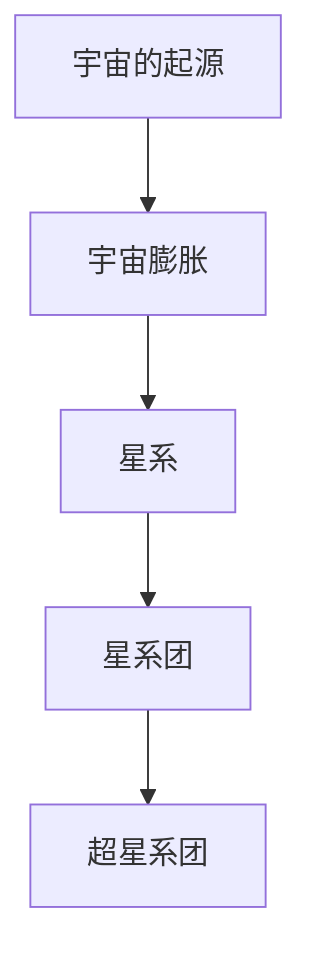

#### 1.1.2 宇宙膨胀理论

宇宙膨胀理论是描述宇宙如何随时间扩展的理论。根据勒梅特-罗伯逊-沃尔克模型（LRW模型），宇宙的膨胀是由宇宙自身的性质决定的，而非外部力的作用。这一理论预言了宇宙背景辐射的存在，并通过实验得到了验证。

**核心算法原理讲解：**

宇宙膨胀理论的核心算法原理是哈勃定律，它描述了宇宙膨胀速率与宇宙尺度之间的关系。哈勃定律可以用以下公式表示：

$$
v = H_0 D
$$

其中，\( v \) 是星系的速度，\( H_0 \) 是哈勃常数，\( D \) 是星系与观察者之间的距离。

**伪代码：**

```python
# 假设已知哈勃常数 H_0 和星系距离 D，计算星系速度 v
def calculate_velocity(H_0, D):
    v = H_0 * D
    return v
```

#### 1.1.3 宇宙常数与暗能量

宇宙常数是描述宇宙自身性质的参数，通常表示为 \(\Lambda\)。在经典宇宙学中，宇宙常数被假设为一个恒定的值，它与宇宙膨胀速率有关。然而，在引入暗能量概念后，宇宙常数被重新解释为暗能量的体现。

**数学模型和数学公式：**

宇宙常数的数学模型通常用以下公式表示：

$$
\Lambda = \frac{\rho_{\Lambda}}{3 M_{\text{Pl}}^2}
$$

其中，\(\rho_{\Lambda}\) 是宇宙常数密度，\( M_{\text{Pl}} \) 是普朗克质量。

**举例说明：**

宇宙常数的一个典型例子是黑洞事件视界。黑洞的事件视界是一个围绕黑洞的球形区域，一旦物体进入这个区域，它就无法逃脱黑洞的引力。黑洞的事件视界与宇宙常数的关系可以通过以下公式表示：

$$
r_s = \frac{2 G M}{c^2}
$$

其中，\( r_s \) 是事件视界的半径，\( G \) 是引力常数，\( M \) 是黑洞的质量，\( c \) 是光速。

## 第二部分：多重宇宙理论的提出与发展

### 2.1 多重宇宙理论的起源

#### 2.1.1 宇宙学原理与多重宇宙

多重宇宙理论起源于宇宙学原理，即宇宙是均匀且各向同性的。这一原理暗示，宇宙中的不同区域可能具有相同的物理规律，但可能存在不同的初始条件。这些不同的初始条件可能导致不同的宇宙演化路径，从而产生多个宇宙。

**核心概念与联系：**

- 宇宙学原理
- 均匀性
- 各向同性
- 多重宇宙

**Mermaid流程图：**

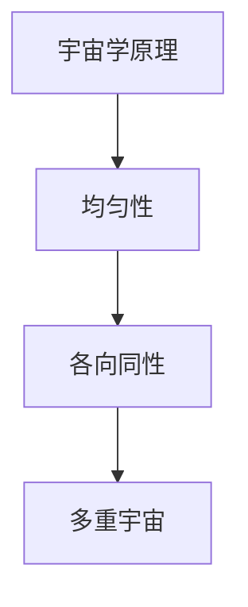

#### 2.1.2 波斯比提与量子多世界解释

波斯比提（Hermann Weyl）在20世纪早期提出了一个假设，即宇宙可能存在多个版本，每个版本都有可能成为现实。这一假设为后来的量子多世界解释提供了理论基础。

**核心算法原理讲解：**

量子多世界解释的核心原理是波函数的坍缩。在量子力学中，波函数描述了量子系统的状态。当量子系统与观察者发生相互作用时，波函数会发生坍缩，导致量子系统从多个可能的态中选定一个态。

**伪代码：**

```python
# 假设量子系统有多个可能的状态，计算波函数的坍缩结果
def collapse_wavefunction(possible_states):
    # 随机选择一个可能的状态
    chosen_state = random.choice(possible_states)
    # 返回坍缩后的状态
    return chosen_state
```

#### 2.1.3 多重宇宙与科学哲学

多重宇宙理论的提出引发了科学哲学的讨论。一些科学家认为，多重宇宙理论是对宇宙多样性的自然解释，而另一些科学家则认为，多重宇宙理论可能违反了物理定律的简洁性和确定性。

**核心概念与联系：**

- 科学哲学
- 物理定律的简洁性
- 物理定律的确定性
- 多重宇宙

**Mermaid流程图：**

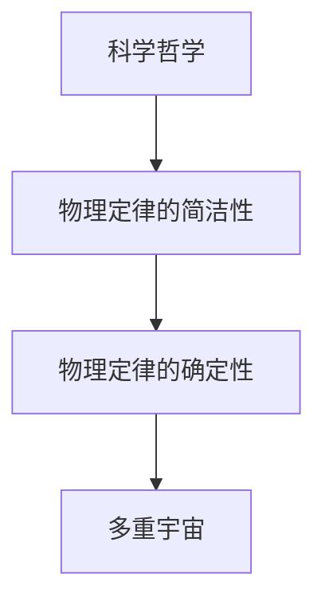

### 2.2 多重宇宙的理论框架

#### 2.2.1 波函数坍缩与观测者

波函数坍缩与观测者的关系是多重宇宙理论的核心问题。根据量子力学，观测者的存在会导致波函数的坍缩，从而确定一个具体的物理状态。

**核心概念与联系：**

- 波函数坍缩
- 观察者
- 多重宇宙

**Mermaid流程图：**

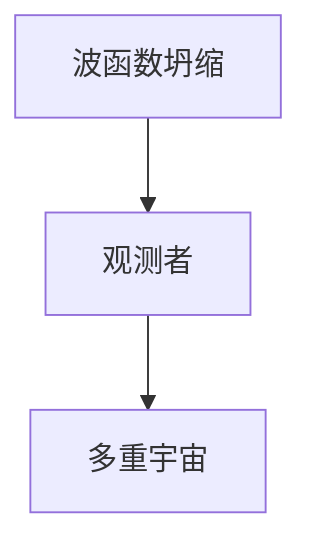

#### 2.2.2 多重宇宙与量子力学

量子力学是多重宇宙理论的基石。在量子力学中，量子态的叠加和坍缩导致了多重宇宙的出现。

**核心概念与联系：**

- 量子态叠加
- 量子态坍缩
- 多重宇宙

**Mermaid流程图：**

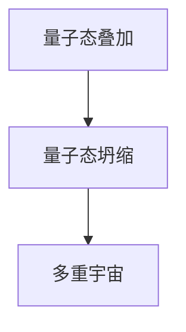

#### 2.2.3 多重宇宙与宇宙学模型

宇宙学模型是描述宇宙演化的数学模型。多重宇宙理论为宇宙学模型提供了一种新的解释，即宇宙可能存在多个版本，每个版本都有可能成为现实。

**核心概念与联系：**

- 宇宙学模型
- 多重宇宙
- 宇宙演化

**Mermaid流程图：**

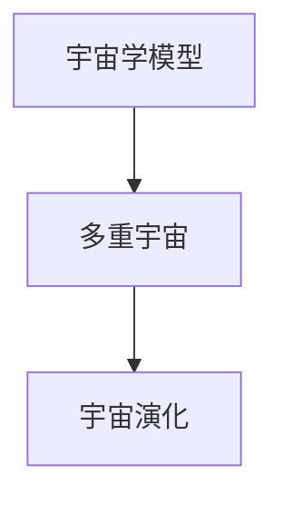

### 2.3 多重宇宙的实验证据

#### 2.3.1 宇宙微波背景辐射的多重宇宙线索

宇宙微波背景辐射（CMB）是多重宇宙理论的实验证据之一。CMB是宇宙大爆炸遗留下来的辐射，其特性为多重宇宙理论提供了线索。

**核心概念与联系：**

- 宇宙微波背景辐射
- 多重宇宙
- 宇宙大爆炸

**Mermaid流程图：**

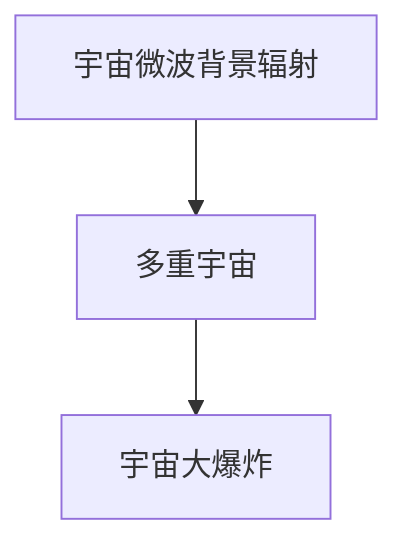

#### 2.3.2 宇宙加速膨胀的多重宇宙证据

宇宙加速膨胀是另一个支持多重宇宙理论的现象。根据宇宙学观测数据，宇宙的膨胀速率在加速，这可能是由于暗能量的存在。

**核心概念与联系：**

- 宇宙加速膨胀
- 暗能量
- 多重宇宙

**Mermaid流程图：**

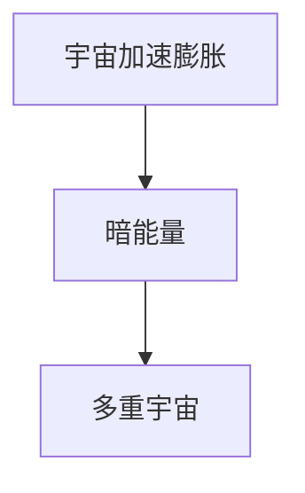

#### 2.3.3 多重宇宙与宇宙弦

宇宙弦是连接两个不同宇宙的物理对象。宇宙弦的存在为多重宇宙理论提供了进一步的实验证据。

**核心概念与联系：**

- 宇宙弦
- 多重宇宙
- 宇宙结构

**Mermaid流程图：**

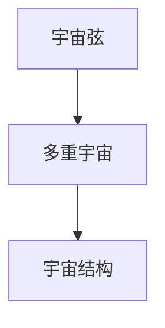

## 第三部分：多重宇宙的哲学意义与认知扩展

### 3.1 多重宇宙与哲学探讨

#### 3.1.1 多重宇宙与决定论

多重宇宙理论对决定论提出了挑战。决定论认为，宇宙中的一切都是由因果关系决定的，而多重宇宙理论则表明，宇宙中可能存在多个版本，每个版本都有可能成为现实。

**核心概念与联系：**

- 决定论
- 多重宇宙
- 因果关系

**Mermaid流程图：**

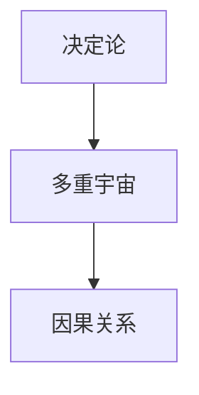

#### 3.1.2 多重宇宙与自由意志

多重宇宙理论为自由意志提供了新的解释。在多重宇宙中，每个宇宙都有可能产生不同的自由意志行为，这为自由意志的存在提供了可能。

**核心概念与联系：**

- 自由意志
- 多重宇宙
- 因果关系

**Mermaid流程图：**

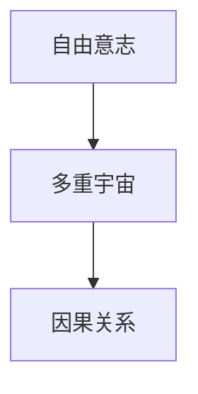

#### 3.1.3 多重宇宙与宗教

多重宇宙理论对宗教观念提出了挑战。一些宗教观念认为，宇宙是唯一且神圣的，而多重宇宙理论则表明，宇宙可能存在多个版本，这为宗教观念的多样性提供了可能。

**核心概念与联系：**

- 宗教
- 多重宇宙
- 宇宙多样性

**Mermaid流程图：**

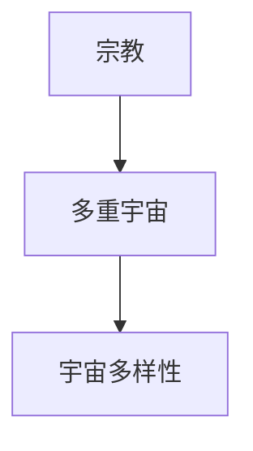

### 3.2 多重宇宙对认知的影响

#### 3.2.1 多重宇宙对世界观的影响

多重宇宙理论改变了我们对世界的认识。它使我们意识到，宇宙可能存在多个版本，每个版本都有可能成为现实。这使我们更加开放和包容，对世界的认识更加全面。

**核心概念与联系：**

- 世界观
- 多重宇宙
- 宇宙多样性

**Mermaid流程图：**

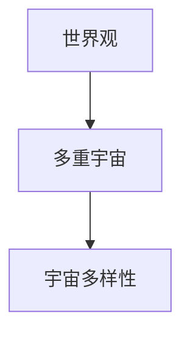

#### 3.2.2 多重宇宙对人生观的启示

多重宇宙理论为我们提供了对人生的新启示。在多重宇宙中，每个宇宙都有可能产生不同的生命体验。这使我们更加珍惜和感激现在的生命，对未来充满期待和希望。

**核心概念与联系：**

- 人生观
- 多重宇宙
- 生命体验

**Mermaid流程图：**

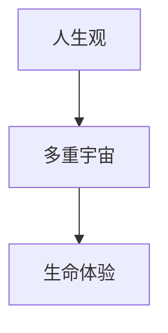

#### 3.2.3 多重宇宙与心理学

多重宇宙理论对心理学产生了深远的影响。它使我们意识到，人的心理状态可能受到多个宇宙的影响，每个宇宙都有可能产生不同的心理状态。这为心理学研究提供了新的视角和理论框架。

**核心概念与联系：**

- 心理学
- 多重宇宙
- 心理状态

**Mermaid流程图：**

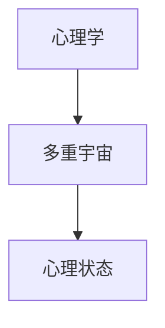

### 3.3 多重宇宙的未来与可能性

#### 3.3.1 多重宇宙的探索与发现

随着科学技术的发展，我们可能在未来探索和发现新的宇宙。这将为人类提供新的认知体验，拓展我们的认知边界。

**核心概念与联系：**

- 多重宇宙
- 科学探索
- 认知拓展

**Mermaid流程图：**

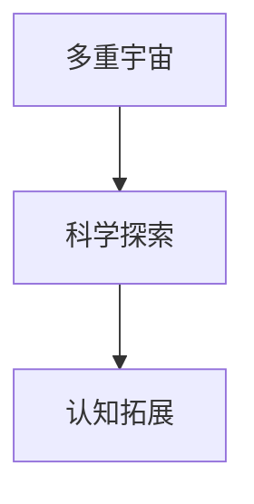

#### 3.3.2 多重宇宙的应用前景

多重宇宙理论在多个领域具有广泛的应用前景。例如，在人工智能领域，多重宇宙理论可能为算法优化和模型选择提供新的思路。在物理学领域，多重宇宙理论可能为解释复杂物理现象提供新的方法。

**核心概念与联系：**

- 多重宇宙
- 应用前景
- 物理学
- 人工智能

**Mermaid流程图：**

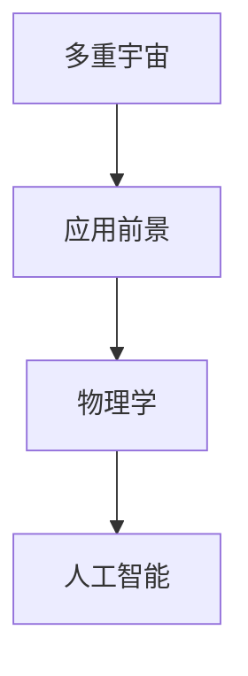

#### 3.3.3 多重宇宙与人类文明的发展

多重宇宙理论对人类文明的发展具有深远的影响。它可能为人类提供新的生存空间，推动人类文明的进步。同时，多重宇宙理论也可能对人类的思想观念产生深远的影响，促进人类对自身和世界的认知。

**核心概念与联系：**

- 多重宇宙
- 人类文明
- 思想观念
- 认知拓展

**Mermaid流程图：**

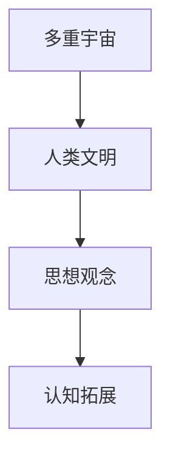

## 附录：相关研究资源与工具

### 附录 A：宇宙学研究资源

#### A.1 宇宙学数据库

- NASA宇宙学数据库（NED）
- 星系分类目录（Sloan Digital Sky Survey）
- 宇宙微波背景辐射观测数据（Planck Satellite）

#### A.2 宇宙学模拟软件

- Cosmology Monte Carlo 代码（CosmoMC）
- N-Body Simulation 代码（GADGET-3）
- 大规模结构形成模拟（ENZO）

#### A.3 宇宙学学术论文

- 《宇宙学原理》（The Principle of Cosmology，作者：George Ellis）
- 《宇宙膨胀》（The Expansion of the Universe，作者：Edwin Hubble）
- 《黑洞与引力波》（Black Holes and Gravitational Waves，作者：Kip Thorne）

### 附录 B：多重宇宙理论研究资源

#### B.1 量子力学与多世界解释

- 《量子力学：概念与应用》（Quantum Mechanics: Concepts and Applications，作者：David J. Griffiths）
- 《多世界解释：量子力学的现代诠释》（The Many-Worlds Interpretation of Quantum Mechanics，作者：Hermann Weyl）
- 《量子力学与哲学》（Quantum Mechanics and Philosophy，作者：Roger Penrose）

#### B.2 宇宙学中的多重宇宙理论

- 《多重宇宙：宇宙学的未来》（The Multiverse: Quest for Infinity，作者：Michio Kaku）
- 《多重宇宙：从量子到宇宙的探索》（The Multiverse: A Set of Theories，作者：Lee Smolin）
- 《多重宇宙与科学哲学》（The Multiverse and Science Philosophy，作者：Tim Maudlin）

#### B.3 多重宇宙理论的哲学探讨

- 《宇宙的多样性：多重宇宙与哲学探讨》（The Diversity of Universes: Philosophy of Cosmology，作者：John D. Barrow）
- 《哲学中的多重宇宙：可能性与实在性》（The Multiverse in Philosophy：Possibility and Reality，作者：Alva Noe）
- 《科学、哲学与多重宇宙：跨学科的对话》（Science, Philosophy, and the Multiverse：Cross-Disciplinary Dialogue，作者：Paul Davies）

## 作者

作者：AI天才研究院/AI Genius Institute & 禅与计算机程序设计艺术 /Zen And The Art of Computer Programming

## 小结

本文从经典宇宙学到多重宇宙理论，探讨了认知的扩展。通过回顾宇宙学的核心概念、探讨多重宇宙理论的提出与发展，以及分析多重宇宙的哲学意义与认知扩展，我们不仅深入了解了宇宙的本质，也拓展了我们的认知视野。在未来，随着科学技术的发展，我们有望进一步探索和发现新的宇宙，为人类文明的进步做出贡献。

