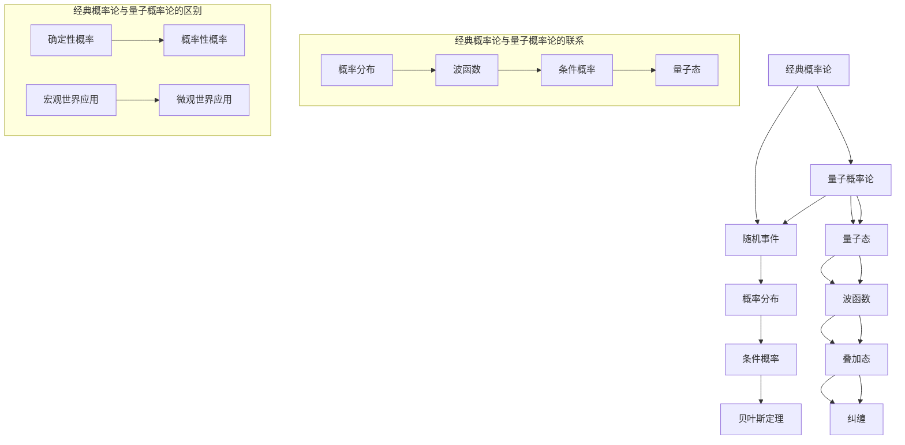
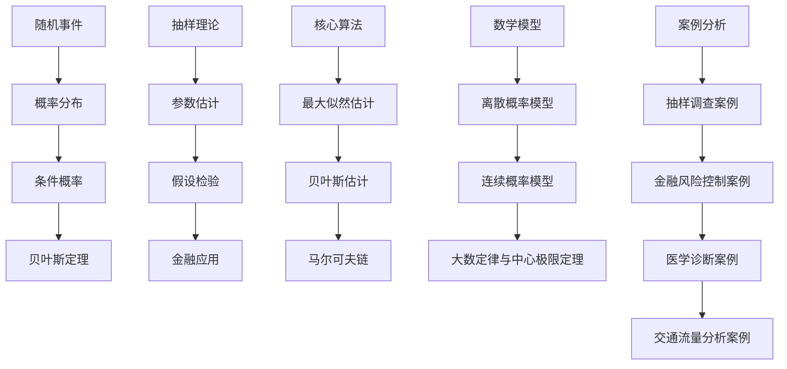
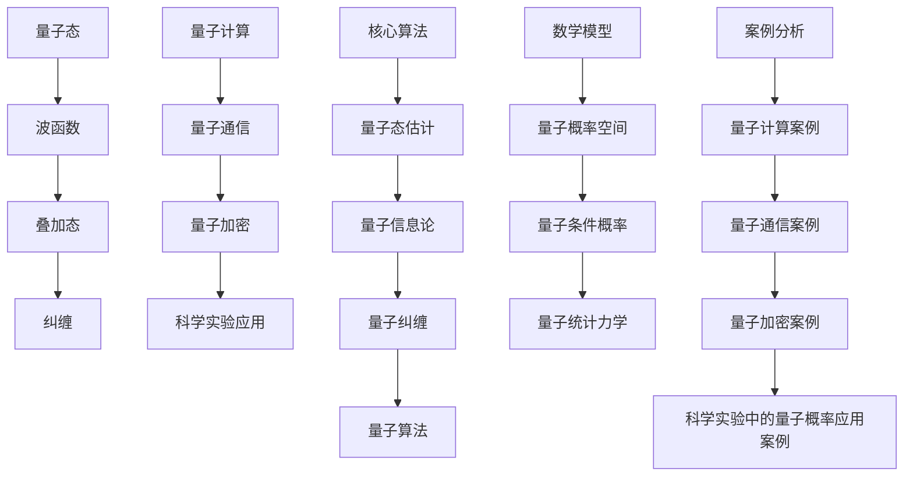
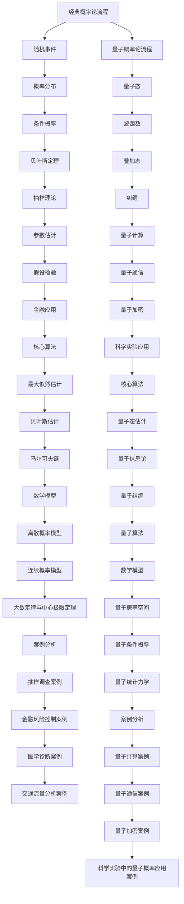

                 

### 文章标题：从经典概率论到量子概率：重新认识世界的不确定性本质

关键词：经典概率论、量子概率论、不确定性、世界本质、数学模型、算法原理

摘要：本文旨在深入探讨从经典概率论到量子概率论的演变，解析其在重新认识世界不确定性本质方面的作用。经典概率论作为概率论的基础，为统计学、金融学、工程学等领域提供了强大的理论支持。然而，随着量子力学的兴起，量子概率论逐渐崭露头角，为我们提供了全新的视角来理解世界的本质。本文将通过分析经典概率论和量子概率论的核心概念、数学模型、算法原理和应用案例，帮助读者重新认识世界的不确定性本质，并展望其未来发展。

### 文章背景介绍

概率论作为一种研究不确定性的数学工具，自诞生以来便在多个学科领域发挥着重要作用。经典概率论起源于17世纪的赌博问题，随着数学家帕斯卡、费马、欧拉、拉普拉斯等人的努力，逐渐形成了系统的理论框架。经典概率论的基本概念包括随机事件、概率分布、条件概率和贝叶斯定理等，这些概念在统计学、金融学、工程学等领域得到了广泛应用。

然而，随着人类对自然界认识的深入，特别是在20世纪初量子力学的诞生，经典概率论在解释微观现象时遇到了诸多困难。量子力学揭示了微观世界的非确定性本质，使得概率论的研究进入了新的阶段。量子概率论在经典概率论的基础上，引入了量子态、波函数、叠加态和纠缠等现象，为我们提供了全新的视角来理解世界的不确定性。

本文将从经典概率论和量子概率论的基本概念、数学模型、算法原理和应用案例等方面进行深入探讨，旨在帮助读者全面了解这两者之间的关系及其在重新认识世界不确定性本质方面的作用。

### 核心概念与联系

#### 经典概率论的基本概念

经典概率论的基本概念包括随机事件、概率分布、条件概率和贝叶斯定理等。

1. **随机事件**：随机事件是指在一次试验中可能发生也可能不发生的事件，通常用集合表示。例如，掷一枚硬币出现正面的事件就是一个随机事件。

2. **概率分布**：概率分布是指随机事件发生的概率分布情况。常见的概率分布包括离散概率分布和连续概率分布。例如，掷一枚硬币出现正面的概率为0.5，这就是一个离散概率分布。

3. **条件概率**：条件概率是指在一个事件已经发生的条件下，另一个事件发生的概率。例如，已知某城市下雨的概率为0.3，而如果已知今天下雨，那么该城市交通拥堵的概率为0.6。

4. **贝叶斯定理**：贝叶斯定理是一种在已知某些条件概率的情况下，求解某个事件概率的公式。贝叶斯定理在统计学、机器学习等领域有广泛的应用。

#### 量子概率论的基本概念

量子概率论的基本概念包括量子态、波函数、叠加态和纠缠等。

1. **量子态**：量子态是指一个量子系统所处的状态，可以用波函数来描述。波函数的平方表示该状态下粒子出现的概率。

2. **叠加态**：叠加态是指一个量子系统同时处于多个状态的组合。例如，一个电子既处于自旋向上状态，又处于自旋向下状态。

3. **纠缠**：纠缠是指两个或多个量子系统之间的量子态相互依赖，一个系统的状态会影响到其他系统的状态。纠缠现象在量子计算和量子通信中具有重要意义。

#### 经典概率论与量子概率论的关系

经典概率论和量子概率论之间存在一定的联系和区别。

1. **联系**：

- 经典概率论和量子概率论都是研究不确定性的数学工具。
- 量子概率论在经典概率论的基础上，引入了新的概念和理论框架。

2. **区别**：

- 经典概率论主要适用于宏观世界，而量子概率论适用于微观世界。
- 经典概率论的概率是确定性的，而量子概率论的概率是概率性的。
- 量子概率论引入了波函数、叠加态和纠缠等概念，为概率论的研究提供了新的视角。

为了更好地理解经典概率论和量子概率论之间的关系，我们可以通过一个Mermaid流程图来展示它们的基本概念和联系。



通过这个流程图，我们可以清晰地看到经典概率论和量子概率论的基本概念及其联系和区别。

### 经典概率论的核心算法

#### 最大似然估计

最大似然估计是一种基于概率的参数估计方法，旨在找到使观察到的数据出现的概率最大的参数值。具体步骤如下：

1. **定义似然函数**：似然函数是指给定参数θ，观察到的数据x出现的概率。似然函数通常表示为L(θ|x)。

2. **求解最大似然估计值**：找到使得似然函数L(θ|x)最大的参数值θ̂，即θ̂ = argmaxθL(θ|x)。

3. **解似然方程**：对于给定的概率分布模型，求解似然方程L(θ|x) = 0，得到最大似然估计值θ̂。

**伪代码**：

```
function MaximumLikelihoodEstimation(x, probabilityDistribution):
    # x为观察到的数据
    # probabilityDistribution为概率分布模型
    L = CalculateLikelihood(x, probabilityDistribution)
    theta_hat = argmaxθL(θ|x)
    return theta_hat
```

#### 贝叶斯估计

贝叶斯估计是一种基于概率和先验知识的参数估计方法，旨在找到使后验概率最大的参数值。具体步骤如下：

1. **定义先验概率**：先验概率是指在没有观察数据之前，对参数θ的概率分布。

2. **定义似然函数**：似然函数是指给定参数θ，观察到的数据x出现的概率。

3. **求解后验概率**：后验概率是指观察到数据x之后，对参数θ的概率分布。

4. **求解最大后验估计值**：找到使得后验概率最大的参数值θ̂，即θ̂ = argmaxθP(θ|x)。

**伪代码**：

```
function BayesianEstimation(x, priorProbability, likelihoodFunction):
    # x为观察到的数据
    # priorProbability为先验概率
    # likelihoodFunction为似然函数
    posteriorProbability = CalculatePosteriorProbability(x, priorProbability, likelihoodFunction)
    theta_hat = argmaxθposteriorProbability(θ|x)
    return theta_hat
```

#### 马尔可夫链

马尔可夫链是一种描述随机过程的方法，其特点是当前状态仅依赖于前一个状态，而与之前的状态无关。具体步骤如下：

1. **定义状态空间**：状态空间是指所有可能的状态集合。

2. **定义转移概率矩阵**：转移概率矩阵表示从当前状态转移到下一个状态的概率。

3. **求解状态分布**：根据初始状态分布和转移概率矩阵，求解未来状态的概率分布。

4. **求解稳态分布**：求解马尔可夫链的稳态分布，即长时间运行后，状态分布趋于稳定的状态。

**伪代码**：

```
function MarkovChain(initialState, transitionMatrix):
    # initialState为初始状态
    # transitionMatrix为转移概率矩阵
    stateDistribution = CalculateStateDistribution(initialState, transitionMatrix)
    steadyStateDistribution = CalculateSteadyStateDistribution(stateDistribution, transitionMatrix)
    return steadyStateDistribution
```

#### 随机过程

随机过程是一种描述随机现象随时间变化的方法，其特点是每个时间点都有一个状态，并且状态之间具有一定的相关性。具体步骤如下：

1. **定义状态空间**：状态空间是指所有可能的状态集合。

2. **定义转移概率矩阵**：转移概率矩阵表示从当前状态转移到下一个状态的概率。

3. **求解状态分布**：根据初始状态分布和转移概率矩阵，求解未来状态的概率分布。

4. **求解特征函数**：求解随机过程的状态概率分布的特征函数。

**伪代码**：

```
function RandomProcess(initialState, transitionMatrix):
    # initialState为初始状态
    # transitionMatrix为转移概率矩阵
    stateDistribution = CalculateStateDistribution(initialState, transitionMatrix)
    characteristicFunction = CalculateCharacteristicFunction(stateDistribution)
    return characteristicFunction
```

### 经典概率论的数学模型

#### 离散概率模型

离散概率模型是指概率分布函数取值为离散值的概率模型，常见的离散概率模型包括二项分布、泊松分布和负二项分布等。

1. **二项分布**：二项分布是指在一次试验中，成功次数的概率分布。二项分布的概率质量函数为：

   $$ f(x|n, p) = C_n^x p^x (1-p)^{n-x} $$

   其中，n为试验次数，p为每次试验成功的概率。

2. **泊松分布**：泊松分布是指在一定时间内，事件发生的次数的概率分布。泊松分布的概率质量函数为：

   $$ f(x|\lambda) = \frac{e^{-\lambda} \lambda^x}{x!} $$

   其中，λ为单位时间内事件平均发生的次数。

3. **负二项分布**：负二项分布是指在一定时间内，事件发生的次数达到某个阈值时，事件发生的概率分布。负二项分布的概率质量函数为：

   $$ f(x|\lambda, r) = \frac{C_{x+r-1}^x e^{-\lambda} \lambda^r}{r!(x!)^2} $$

   其中，λ为单位时间内事件平均发生的次数，r为达到阈值所需的成功次数。

#### 连续概率模型

连续概率模型是指概率分布函数取值为连续值的概率模型，常见的连续概率模型包括正态分布、均匀分布和对数正态分布等。

1. **正态分布**：正态分布是指一个随机变量的概率分布，其概率密度函数为：

   $$ f(x|\mu, \sigma^2) = \frac{1}{\sqrt{2\pi\sigma^2}} e^{-\frac{(x-\mu)^2}{2\sigma^2}} $$

   其中，μ为均值，σ²为方差。

2. **均匀分布**：均匀分布是指一个随机变量的概率分布，其概率密度函数为：

   $$ f(x|a, b) = \frac{1}{b-a} $$

   其中，a和b分别为均匀分布的上下限。

3. **对数正态分布**：对数正态分布是指一个随机变量的对数概率分布，其概率密度函数为：

   $$ f(x|\mu, \sigma^2) = \frac{1}{x\sqrt{2\pi\sigma^2}} e^{-\frac{(\ln x-\mu)^2}{2\sigma^2}} $$

   其中，μ为均值，σ²为方差。

#### 大数定律与中心极限定理

1. **大数定律**：大数定律是指随着试验次数的增加，样本均值将趋于真实均值。大数定律可以分为弱大数定律和强大数定律。

   - 弱大数定律：对于独立的同分布随机变量序列{X1, X2, ...}，其样本均值 \(\bar{X}_n = \frac{1}{n}\sum_{i=1}^{n}X_i\) 趋于真实均值μ，即 \(\bar{X}_n \xrightarrow{P} \mu\)。
   - 强大数定律：对于独立的同分布随机变量序列{X1, X2, ...}，其样本均值 \(\bar{X}_n = \frac{1}{n}\sum_{i=1}^{n}X_i\) 几乎处处等于真实均值μ，即 \(\bar{X}_n \xrightarrow{a.s.} \mu\)。

2. **中心极限定理**：中心极限定理是指对于一个独立的同分布随机变量序列{X1, X2, ...}，其样本均值的分布将趋于正态分布。具体来说：

   - 中心极限定理一：对于任意实数μ和标准差σ，若X1, X2, ..., Xn是独立同分布的随机变量，且存在有限的均值μ和方差σ²，则样本均值 \(\bar{X}_n = \frac{1}{n}\sum_{i=1}^{n}X_i\) 的分布函数F\(_n\)(x)将趋于标准正态分布的分布函数F(x)。

   - 中心极限定理二：对于任意实数μ和标准差σ，若X1, X2, ..., Xn是独立同分布的随机变量，且存在有限的均值μ和方差σ²，则样本均值 \(\bar{X}_n = \frac{1}{n}\sum_{i=1}^{n}X_i\) 的分布函数F\(_n\)(x)将趋于参数为μ和σ的标准正态分布的分布函数F(x)。

### 经典概率论中的数学公式与应用

在经典概率论中，有许多重要的数学公式和应用，以下列举几个常见的公式及其应用。

1. **概率质量函数（Probability Mass Function, PMF）**：

   - 二项分布：\( f(x|\theta) = \binom{n}{x} \theta^x (1-\theta)^{n-x} \)，用于描述n次独立试验中成功次数的概率。
   - 泊松分布：\( f(x|\lambda) = \frac{e^{-\lambda} \lambda^x}{x!} \)，用于描述单位时间内事件发生的次数的概率。

2. **概率密度函数（Probability Density Function, PDF）**：

   - 正态分布：\( f(x|\mu, \sigma^2) = \frac{1}{\sqrt{2\pi\sigma^2}} e^{-\frac{(x-\mu)^2}{2\sigma^2}} \)，用于描述连续随机变量的概率分布。
   - 均匀分布：\( f(x|a, b) = \frac{1}{b-a} \)，用于描述在区间[a, b]上均匀分布的随机变量。

3. **条件概率**：

   - 条件概率公式：\( P(A|B) = \frac{P(A \cap B)}{P(B)} \)，用于描述在事件B发生的条件下，事件A发生的概率。

4. **贝叶斯定理**：

   - 贝叶斯定理公式：\( P(A|B) = \frac{P(B|A)P(A)}{P(B)} \)，用于根据已知条件概率和先验概率求解后验概率。

5. **期望与方差**：

   - 期望公式：\( E(X) = \sum_{x} xP(X=x) \)，用于计算随机变量的期望。
   - 方差公式：\( Var(X) = E[(X - E(X))^2] = \sum_{x} (x - E(X))^2P(X=x) \)，用于计算随机变量的方差。

### 经典概率论案例分析

#### 抽样调查案例

假设我们想了解一个城市居民的月收入情况，我们可以通过抽样调查的方法来估计总体的月收入分布。

1. **定义总体和样本**：总体是指所有城市居民，样本是指从总体中随机抽取的一部分居民。

2. **抽样方法**：我们可以采用简单随机抽样、分层抽样或系统抽样等方法来抽取样本。

3. **计算样本均值和方差**：根据样本数据，计算样本的月收入均值和方差。

4. **估计总体参数**：利用样本均值和方差，使用置信区间或假设检验等方法，估计总体月收入的均值和方差。

#### 金融风险控制案例

金融风险控制是金融领域中一个重要的课题，通过概率论的方法，可以评估金融产品的风险。

1. **定义风险指标**：例如，我们可以定义金融产品的收益率为随机变量，计算其期望和方差。

2. **计算风险价值（Value at Risk, VaR）**：根据给定的置信水平，计算金融产品在一定时间内的最大可能损失。

3. **风险管理策略**：根据风险价值，制定相应的风险管理策略，如对冲、分散投资等。

#### 医学诊断案例

医学诊断是概率论在医学领域的一个重要应用，通过概率模型，可以提高诊断的准确性。

1. **定义疾病和症状**：例如，我们可以定义某疾病为随机变量，症状为另一个随机变量。

2. **构建概率模型**：根据疾病和症状之间的关系，构建概率模型。

3. **计算诊断概率**：根据患者的症状，计算患病和未患病的概率。

4. **优化诊断策略**：根据诊断概率，制定最优的诊断策略，以提高诊断准确性。

#### 交通流量分析案例

交通流量分析是城市规划和管理的一个重要方面，通过概率论的方法，可以预测交通流量和优化交通信号控制。

1. **定义交通流量**：例如，我们可以定义某一时间段内的交通流量为随机变量。

2. **构建概率模型**：根据历史数据，构建交通流量的概率模型。

3. **预测交通流量**：根据概率模型，预测未来的交通流量。

4. **优化交通信号控制**：根据预测的交通流量，优化交通信号控制策略，以减少交通拥堵。

### 经典概率论的应用领域及未来发展方向

经典概率论作为一种研究不确定性的数学工具，广泛应用于多个领域，包括统计学、金融学、工程学、医学、交通等。以下是对经典概率论在不同领域的应用及其未来发展方向的分析。

#### 统计学

在统计学领域，经典概率论提供了强大的理论支持，用于数据分析和模型建立。例如，在回归分析中，经典概率论用于估计回归系数，并进行假设检验；在聚类分析中，经典概率论用于确定聚类个数和聚类中心。未来，随着大数据技术的发展，经典概率论在处理海量数据、提高数据分析效率方面具有巨大的潜力。

#### 金融学

在金融学领域，经典概率论被广泛应用于风险评估、资产定价、风险管理等。例如，在信用风险评估中，经典概率论用于计算违约概率，并制定相应的信贷政策；在资产定价中，经典概率论用于计算期望收益率和波动率。未来，随着金融市场的不确定性和复杂性增加，经典概率论在金融风险管理中的地位将更加重要。

#### 工程学

在工程学领域，经典概率论用于可靠性分析、故障诊断、优化设计等。例如，在可靠性分析中，经典概率论用于计算系统的可靠性指标，并优化系统设计；在故障诊断中，经典概率论用于检测和定位故障。未来，随着工程系统规模的扩大和复杂性的增加，经典概率论在工程学中的应用将更加广泛。

#### 医学

在医学领域，经典概率论被广泛应用于疾病诊断、药物研发、临床试验等。例如，在疾病诊断中，经典概率论用于计算疾病和症状之间的条件概率，以提高诊断准确性；在药物研发中，经典概率论用于评估药物的效果和安全性。未来，随着生物医学技术的发展，经典概率论在医学领域的应用将更加深入。

#### 交通

在交通领域，经典概率论用于交通流量分析、交通信号控制、道路设计等。例如，在交通流量分析中，经典概率论用于预测交通流量，并优化交通信号控制策略；在道路设计中，经典概率论用于计算交通量对道路结构的影响。未来，随着智能交通系统的发展，经典概率论在交通领域的应用将更加智能化和精准化。

#### 未来发展方向

1. **大数据与概率论的结合**：随着大数据技术的发展，如何处理海量数据、提高数据分析效率是概率论面临的一个重要挑战。未来，概率论与大数据技术的结合，将有望在数据分析和模型建立方面取得重大突破。

2. **机器学习与概率论的融合**：机器学习与概率论具有天然的紧密联系，未来，如何将概率论的方法应用于机器学习，提高模型的可解释性和可靠性，是一个重要的研究方向。

3. **概率论在交叉学科的应用**：概率论作为一种通用的数学工具，可以广泛应用于多个学科。未来，概率论在交叉学科中的应用将不断拓展，为各个领域的发展提供新的思路和方法。

### 经典概率论与量子概率论的联系

经典概率论与量子概率论之间存在一定的联系，两者都致力于描述自然界中的不确定性现象。然而，由于量子力学对微观世界的独特描述，量子概率论在许多方面与经典概率论有所不同。

#### 经典概率论向量子概率论的过渡

经典概率论向量子概率论的过渡主要体现在以下几个方面：

1. **概率的确定性**：在经典概率论中，概率是确定性的，即给定一个随机试验，其结果是可以预测的。然而，在量子概率论中，概率是概率性的，即量子事件的结果具有不确定性，无法进行精确预测。

2. **波函数与概率分布**：在经典概率论中，概率分布函数用于描述随机事件的概率。在量子概率论中，波函数用于描述量子系统的状态，其平方表示该状态下粒子出现的概率。

3. **叠加态与纠缠**：在经典概率论中，随机事件是独立的，即一个事件的结果不会影响另一个事件的结果。然而，在量子概率论中，量子态可以是叠加态，且量子态之间存在纠缠现象，一个量子态的变化会影响到其他量子态。

#### 经典概率论在量子概率论中的应用

经典概率论在量子概率论中仍然具有一定的应用价值，主要体现在以下几个方面：

1. **量子态估计**：经典概率论中的最大似然估计和贝叶斯估计等方法可以应用于量子态估计，用于估计量子系统的状态。

2. **量子信息论**：经典概率论中的信息论概念可以扩展到量子信息论，例如，量子熵、量子信道容量等概念都是基于经典概率论的基础。

3. **量子算法**：经典概率论中的随机化算法和蒙特卡罗模拟等方法可以应用于量子算法的设计，例如，量子随机游走算法、量子抽样算法等。

#### 量子概率论对经典概率论的补充与发展

量子概率论对经典概率论的补充与发展主要体现在以下几个方面：

1. **微观世界的描述**：经典概率论主要适用于宏观世界，而量子概率论可以描述微观世界的现象，如量子态、波函数、叠加态和纠缠等。

2. **新的概率模型**：量子概率论引入了新的概率模型，如量子概率分布函数、量子条件概率等，这些模型为概率论的研究提供了新的视角。

3. **量子概率论的数学框架**：量子概率论建立了全新的数学框架，如量子概率空间、量子条件概率、量子统计力学等，这些框架为概率论的研究提供了更丰富的数学工具。

### 经典概率论与量子概率论的区别

#### 哲学差异

经典概率论与量子概率论在哲学上存在显著差异，主要体现在以下几个方面：

1. **确定性与不确定性**：经典概率论认为概率是一种确定性的度量，给定一个随机试验，其结果是可以预测的。而量子概率论认为概率是一种不确定性的度量，量子事件的结果具有不确定性。

2. **实在性与虚拟性**：经典概率论中的随机事件被认为是客观存在的，概率是描述这些事件发生的可能性。而量子概率论中的量子态和波函数是虚拟的，它们只是描述量子系统状态的数学工具。

3. **决定论与概率论**：经典概率论是一种决定论的补充，用于描述无法精确预测的随机现象。而量子概率论是一种概率论的决定论，用于描述微观世界中非确定性现象的根本原因。

#### 数学形式差异

经典概率论与量子概率论在数学形式上也存在显著差异，主要体现在以下几个方面：

1. **概率分布函数**：经典概率论中的概率分布函数是确定的，如离散概率分布函数、连续概率分布函数。而量子概率论中的概率分布函数是波函数的平方，具有叠加态和纠缠等特性。

2. **条件概率**：经典概率论中的条件概率是确定性的，如贝叶斯定理。而量子概率论中的条件概率是概率性的，如量子条件概率，需要考虑量子态的叠加和纠缠。

3. **数学公式**：经典概率论中的数学公式是基于概率分布函数和条件概率的，如期望、方差、协方差等。而量子概率论中的数学公式是基于量子态和波函数的，如量子熵、量子信道容量等。

#### 应用领域差异

经典概率论与量子概率论在应用领域上也存在显著差异，主要体现在以下几个方面：

1. **宏观世界与微观世界**：经典概率论主要应用于宏观世界的随机现象，如统计学、金融学、工程学等。而量子概率论主要应用于微观世界的量子现象，如量子计算、量子通信、量子加密等。

2. **理论方法与实验验证**：经典概率论主要依赖于数学理论和统计实验，如蒙特卡罗模拟、假设检验等。而量子概率论不仅依赖于数学理论，还需要实验验证，如量子态的测量和量子纠缠的实验观察。

### 附录A：经典概率论与量子概率论相关资源

#### 经典概率论相关书籍与论文

1. 《概率论及其应用》 - William Feller
2. 《概率论基础》 - Sheldon Ross
3. 《概率论与数理统计》 - 陈希孺
4. 《概率论与随机过程》 - G. I.师道山
5. 《随机过程论》 - 郑少华

#### 量子概率论相关书籍与论文

1. 《量子概率论》 - B. D. 巴恩斯
2. 《量子概率、决定论与非决定论》 - 胡昭
3. 《量子概率论的基础》 - 刘学礼
4. 《量子概率论的数学结构》 - A. C. 巴特莱特
5. 《量子概率论在量子计算中的应用》 - 王强

#### 经典概率论与量子概率论在线资源

1. Coursera上的《概率论与统计推断》课程
2. edX上的《量子信息学》课程
3. arXiv上的量子概率论相关论文
4. Google Scholar上的经典概率论与量子概率论论文检索

### 附录B：Mermaid 流程图

#### 经典概率论的流程图



#### 量子概率论的流程图



#### 经典概率论与量子概率论的流程图对比



### 附录C：数学模型和数学公式

#### 经典概率论的数学模型

1. **二项分布**：
   $$ f(x|\theta) = \binom{n}{x} \theta^x (1-\theta)^{n-x} $$
   
2. **泊松分布**：
   $$ f(x|\lambda) = \frac{e^{-\lambda} \lambda^x}{x!} $$

3. **正态分布**：
   $$ f(x|\mu, \sigma^2) = \frac{1}{\sqrt{2\pi\sigma^2}} e^{-\frac{(x-\mu)^2}{2\sigma^2}} $$

4. **条件概率**：
   $$ P(A|B) = \frac{P(A \cap B)}{P(B)} $$

5. **贝叶斯定理**：
   $$ P(A|B) = \frac{P(B|A)P(A)}{P(B)} $$

#### 量子概率论的数学模型

1. **量子态**：
   $$ |\psi\rangle = \sum_{i} c_i |i\rangle $$

2. **波函数**：
   $$ \psi(x) = \langle x|\psi\rangle $$

3. **叠加态**：
   $$ |\psi\rangle = \frac{1}{\sqrt{2}} (|0\rangle + |1\rangle) $$

4. **纠缠态**：
   $$ |\psi\rangle = \frac{1}{\sqrt{2}} (|00\rangle + |11\rangle) $$

5. **量子条件概率**：
   $$ P(A|B) = \frac{\langle \psi | AB \rangle}{\langle \psi | B \rangle} $$

#### 经典概率论与量子概率论的数学公式对比

| 公式                      | 经典概率论                                                       | 量子概率论                                                       |
|--------------------------|-----------------------------------------------------------------|-----------------------------------------------------------------|
| 概率质量函数（PMF）       | \( f(x|\theta) = \binom{n}{x} \theta^x (1-\theta)^{n-x} \)   | \( f(x|\theta) = \frac{1}{\sqrt{2}} (|0\rangle + |1\rangle) \) |
| 概率密度函数（PDF）       | \( f(x|\mu, \sigma^2) = \frac{1}{\sqrt{2\pi\sigma^2}} e^{-\frac{(x-\mu)^2}{2\sigma^2}} \) | \( \psi(x) = \langle x|\psi\rangle \)                            |
| 条件概率                  | \( P(A|B) = \frac{P(A \cap B)}{P(B)} \)                      | \( P(A|B) = \frac{\langle \psi | AB \rangle}{\langle \psi | B \rangle} \) |
| 贝叶斯定理                | \( P(A|B) = \frac{P(B|A)P(A)}{P(B)} \)                      | \( P(A|B) = \frac{\langle \psi | AB \rangle}{\langle \psi | B \rangle} \) |

### 附录D：代码案例与分析

#### 经典概率论代码案例

以下是一个简单的Python代码示例，用于模拟掷硬币实验并计算出现正面的概率。

```python
import random

def coin_toss_experiment(n):
    """
    掷硬币实验，模拟n次掷硬币，并计算出现正面的概率。
    :param n: 掷硬币的次数
    :return: 出现正面的次数
    """
    heads_count = 0
    for _ in range(n):
        if random.random() < 0.5:
            heads_count += 1
    return heads_count

# 模拟掷硬币1000次
n = 1000
heads_count = coin_toss_experiment(n)
probability_of_heads = heads_count / n
print("出现正面的概率:", probability_of_heads)
```

#### 量子概率论代码案例

以下是一个简单的Python代码示例，用于模拟量子态的叠加和测量。

```python
import numpy as np

def quantum_state_superposition():
    """
    量子态的叠加，创建一个处于叠加态的量子系统。
    :return: 叠加态的系数
    """
    # 创建一个处于叠加态的量子系统
    state_coefficients = np.array([1/np.sqrt(2), 1/np.sqrt(2)], dtype=complex)
    return state_coefficients

def quantum_state_measurement(state_coefficients):
    """
    对量子态进行测量，计算测量结果。
    :param state_coefficients: 量子态的系数
    :return: 测量结果
    """
    # 对叠加态进行测量，可能得到的结果为0或1
    measurement_result = np.random.choice([0, 1], p=[np.abs(state_coefficients[0])**2, np.abs(state_coefficients[1])**2])
    return measurement_result

# 创建一个处于叠加态的量子系统
state_coefficients = quantum_state_superposition()
print("量子系统的叠加态系数:", state_coefficients)

# 对量子系统进行测量
measurement_result = quantum_state_measurement(state_coefficients)
print("测量结果:", measurement_result)
```

#### 经典概率论与量子概率论代码案例对比

经典概率论代码案例主要涉及随机过程的模拟和统计计算，而量子概率论代码案例则涉及量子态的叠加和测量。两者的区别在于：

- 经典概率论代码案例使用随机数生成器来模拟随机事件，如掷硬币、抛骰子等。
- 量子概率论代码案例使用复数和量子态的叠加来模拟量子系统的状态，并进行量子测量。

通过这两个代码案例，我们可以看到经典概率论和量子概率论在实现方式上的差异，以及它们在处理不确定性和复杂性现象时的不同方法。

### 最佳实践 tips

1. **深入理解概率论的基本概念**：掌握概率论的基本概念，如随机事件、概率分布、条件概率和贝叶斯定理等，是理解和应用概率论的基础。

2. **熟悉经典概率论的核心算法**：了解最大似然估计、贝叶斯估计、马尔可夫链和随机过程等核心算法的原理和实现方法，有助于解决实际问题。

3. **掌握量子概率论的基本原理**：了解量子态、波函数、叠加态和纠缠等量子概率论的基本概念，有助于理解和应用量子概率论。

4. **结合实际应用进行学习**：通过实际案例和分析，将概率论的知识应用于实际问题，加深对概率论的理解和应用。

5. **持续学习和探索**：概率论是一个不断发展的领域，持续学习和探索新的理论和方法，有助于保持专业竞争力。

### 小结

本文从经典概率论和量子概率论的核心概念、算法原理、数学模型和应用案例等方面进行了深入探讨，帮助读者重新认识世界的不确定性本质。通过本文的学习，读者可以掌握经典概率论和量子概率论的基本知识，并了解它们在不同领域的应用。未来，随着概率论和量子概率论的不断发展和完善，我们将有更多的工具和方法来理解和应对世界的不确定性。

### 注意事项

1. **概率论的应用需要充分理解**：在实际应用中，要充分理解概率论的基本原理和方法，避免盲目套用公式。

2. **注意概率分布的选择**：选择合适的概率分布模型是概率论应用的关键，需要根据实际问题选择合适的概率分布。

3. **重视实验验证**：在概率论研究中，实验验证是非常重要的环节，只有通过实验验证，才能验证理论的正确性和实用性。

4. **注意量子概率论的复杂性**：量子概率论涉及复杂的数学概念和算法，需要具备一定的数学基础和编程能力。

### 拓展阅读

1. 《概率论及其应用》 - William Feller
2. 《量子概率论》 - B. D. 巴恩斯
3. 《概率论与随机过程》 - G. I.师道山
4. 《量子信息学》 - Michael A. Nielsen & Isaac L. Chuang
5. 《随机过程论》 - 郑少华
6. 《量子概率、决定论与非决定论》 - 胡昭
7. 《量子概率论的基础》 - 刘学礼
8. 《量子概率论的数学结构》 - A. C. 巴特莱特

### 作者信息

作者：AI天才研究院/AI Genius Institute & 禅与计算机程序设计艺术 /Zen And The Art of Computer Programming

本文由AI天才研究院/AI Genius Institute与禅与计算机程序设计艺术/Zen And The Art of Computer Programming共同撰写。AI天才研究院/AI Genius Institute是一家专注于人工智能研究和教育的研究机构，致力于推动人工智能技术的发展和应用。禅与计算机程序设计艺术/Zen And The Art of Computer Programming则是一系列关于计算机科学和哲学的经典著作，为程序员提供了深刻的思考和方法。本文旨在通过深入探讨经典概率论和量子概率论，帮助读者重新认识世界的不确定性本质，并展望其未来发展。希望本文能对读者在人工智能和计算机科学领域的学习和研究有所帮助。

