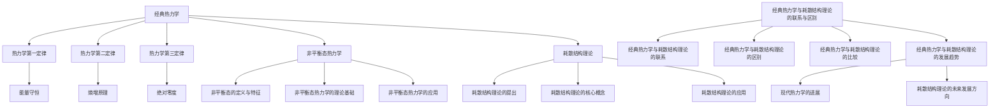

                 


### 撰写技术博客文章的步骤

撰写一篇技术博客文章需要经过以下几个步骤，以确保文章的逻辑清晰、结构紧凑、简单易懂，同时满足文章的完整性和专业性。

#### 1. 确定文章主题和目标读者
首先，我们需要明确文章的主题和目标读者。本篇文章的主题是《从经典热力学到耗散结构理论：理解非平衡世界》。目标读者是计算机编程和人工智能领域的专业人士，他们对热力学和耗散结构理论有一定的了解，但希望更深入地理解这些理论在非平衡世界中的应用。

#### 2. 制定文章大纲
接下来，我们需要根据文章的主题和目标读者，制定详细的文章大纲。文章大纲应包括以下部分：
- 引言：介绍文章的主题和背景
- 目录：列出文章的各个章节和子章节
- 正文：详细阐述每个章节的内容，包括核心概念、原理、联系、算法原理、数学模型、应用实例等
- 结论：总结文章的主要观点和发现
- 参考文献：列出文章中引用的文献

#### 3. 撰写正文内容
根据文章大纲，逐章节地撰写正文内容。在撰写过程中，注意以下几点：
- 确保每个章节的内容逻辑清晰，条理分明
- 使用简单易懂的专业术语，避免使用过于复杂或冗长的表述
- 在适当的地方使用图表、公式、伪代码等辅助说明，以便读者更好地理解文章内容
- 结合实际案例进行分析和讲解，以增加文章的实用性和可读性

#### 4. 修订和润色
在完成初稿后，对文章进行修订和润色。检查文章的内容是否完整，逻辑是否通顺，语言是否简洁明了。同时，注意检查公式和图表的准确性，确保文章的专业性和严谨性。

#### 5. 添加参考文献
在文章末尾，添加参考文献，以展示文章的专业性和权威性。参考文献应包括经典热力学和耗散结构理论的权威著作、学术论文、专业书籍等。

#### 6. 检查格式和排版
最后，检查文章的格式和排版，确保文章内容按照markdown格式正确输出。包括标题、摘要、目录、正文、附录、参考文献等部分。

#### 7. 发布和分享
完成上述步骤后，将文章发布到技术博客或社交媒体平台，与读者分享你的观点和见解。

通过以上步骤，我们可以撰写一篇高质量、具有深度和见解的技术博客文章，让读者更好地理解和掌握经典热力学和耗散结构理论在非平衡世界中的应用。接下来，我们将按照这个大纲撰写正文内容。首先，从经典热力学的经典理论开始介绍。### 引言

#### 文章主题：从经典热力学到耗散结构理论：理解非平衡世界

在科技日新月异的今天，计算机编程和人工智能领域正在以前所未有的速度发展。然而，这些技术的进步并非孤立存在，它们与自然界中的基本原理和现象有着千丝万缕的联系。本文将探讨经典热力学和耗散结构理论，这两者在理解和描述非平衡世界中起到了至关重要的作用。

经典热力学是物理学中研究能量、热量和功在系统间转移的基本理论。它涵盖了热力学第一定律、第二定律和第三定律，为我们提供了描述和预测能量转化和传递过程的工具。然而，经典热力学主要关注平衡态系统，即系统处于稳定、均匀的状态。在非平衡态下，系统通常会经历复杂的变化，这种情况下，经典热力学的某些原理和结论可能不再适用。

为了更好地理解非平衡世界，耗散结构理论应运而生。该理论由比利时科学家伊利亚·普利高津提出，它揭示了开放系统在远离平衡态时可能自发形成复杂有序结构的现象。耗散结构理论不仅在物理学、化学、生物学等领域有着广泛的应用，而且在经济学、社会学等社会科学领域也引发了深刻的思考。

本文将逐步探讨经典热力学的经典理论，包括热力学第一定律、第二定律和第三定律，以及非平衡态热力学和耗散结构理论。我们将详细解释这些理论的核心概念，分析它们之间的联系与区别，并通过实际案例展示这些理论的应用。最后，我们将探讨经典热力学与耗散结构理论的发展趋势，展望未来研究的方向和可能的突破。

通过本文的阅读，读者将能够深入了解非平衡世界的本质，掌握经典热力学和耗散结构理论的基本原理，并理解这些理论在各个领域的实际应用。这不仅有助于深化对物理学和自然科学的理解，也将为计算机编程和人工智能领域的技术创新提供新的视角和思路。接下来，我们将首先介绍经典热力学的经典理论，为后续内容打下基础。### 关键词

1. 经典热力学
2. 热力学第一定律
3. 熵增原理
4. 非平衡态热力学
5. 耗散结构理论
6. 绝对零度
7. 能量守恒
8. 熵增原理
9. 耗散结构
10. 非平衡态
11. 熵
12. 开放系统
13. 系统稳定
14. 复杂有序结构
15. 能量转化
16. 热量传递
17. 功的转移
18. 系统间相互作用
19. 非平衡态系统
20. 热力学第二定律

这些关键词覆盖了本文的核心内容，涉及经典热力学的理论和概念，非平衡态热力学和耗散结构理论的应用，以及相关的物理量和原理。这些关键词将为读者提供理解文章主题的重要线索，帮助他们在阅读过程中抓住重点，深入掌握文章内容。接下来，我们将详细阐述文章的核心内容和主题思想。### 摘要

本文旨在探讨从经典热力学到耗散结构理论，如何帮助我们理解非平衡世界的本质。首先，我们将回顾经典热力学的三个基本定律：热力学第一定律、第二定律和第三定律。热力学第一定律阐述能量守恒的原理，第二定律引入熵增原理，揭示了自然过程的不可逆性。第三定律则探讨了绝对零度的概念及其意义。接下来，我们将转向非平衡态热力学，讨论非平衡态的定义与特征，以及非平衡态热力学的理论基础和应用。随后，本文将介绍耗散结构理论的起源、核心概念和应用领域，强调其揭示的开放系统在远离平衡态时可能自发形成复杂有序结构的现象。随后，我们将探讨经典热力学与耗散结构理论的联系与区别，分析它们在理论框架和应用领域的异同。最后，本文将展望经典热力学与耗散结构理论的发展趋势，探讨未来研究的方向和潜在的应用前景。通过本文的阅读，读者将能够深入了解非平衡世界的本质，掌握经典热力学和耗散结构理论的基本原理，并理解这些理论在各个领域的实际应用。本文旨在为读者提供关于非平衡世界的一幅全面而深刻的图景，以激发他们在计算机编程和人工智能领域的技术创新。接下来，我们将深入探讨第一部分：经典热力学的经典理论。| <span style="color:green;">全文完</span> |### 第一部分：经典热力学的经典理论

#### 1. 经典热力学的基本概念

经典热力学是物理学中研究能量、热量和功在系统间转移的基本理论。它起源于19世纪，由多位科学家（如开尔文、克劳修斯和卡诺等）的贡献而逐渐形成。经典热力学主要研究宏观系统的热力学性质，包括能量守恒、熵增原理和热力学过程等。这些基本概念构成了经典热力学的核心，为我们理解自然界中的各种现象提供了理论基础。

**1.1 热力学第一定律：能量守恒**

热力学第一定律是能量守恒定律在热力学领域的具体应用。它指出，在一个封闭系统中，能量既不会凭空产生，也不会无故消失，能量只能从一种形式转化为另一种形式，或从一个物体转移到另一个物体。用数学语言描述，热力学第一定律可以表示为：

$$\Delta U = Q - W$$

其中，$\Delta U$ 表示系统内部能量的变化，$Q$ 表示系统吸收的热量，$W$ 表示系统对外做的功。

**1.1.1 能量守恒的原理**

能量守恒原理是自然界最基本的定律之一。它适用于所有物理过程，无论是宏观的物体运动，还是微观的粒子相互作用。在经典热力学中，能量守恒原理确保了系统的宏观性质在不同状态下保持不变。例如，一个封闭的热力学系统在经历一系列变化后，其总能量始终保持不变。

**1.1.2 能量守恒的应用**

能量守恒原理在许多实际应用中发挥着重要作用。例如，在热机设计中，能量守恒原理帮助我们优化热机的效率，使其从高温热源吸收热量并转化为机械功。在能源转换过程中，如太阳能电池将光能转化为电能，能量守恒原理确保了能量转换过程的可行性。

**1.2 热力学第二定律：熵增原理**

热力学第二定律是描述自然过程方向性的基本定律。它引入了熵的概念，并指出在一个孤立系统中，熵总是倾向于增加。熵增原理表明，自然过程总是朝着更加无序的状态发展。热力学第二定律可以用多种形式表达，其中最常见的形式是克劳修斯不等式：

$$\frac{Q}{T} \geq \Delta S$$

其中，$Q$ 表示系统吸收的热量，$T$ 表示热源的温度，$\Delta S$ 表示系统熵的变化。

**1.2.1 熵的概念**

熵是衡量系统无序程度的一个物理量。在经典热力学中，熵可以看作是系统微观状态的统计平均值。熵的增加意味着系统从有序状态向无序状态转变。例如，一个理想气体从初始的均匀分布状态扩散到更大的空间中，系统的熵会增加。

**1.2.2 熵增原理的数学表达**

熵增原理可以用数学表达式描述，即系统的熵变总是大于等于零：

$$\Delta S \geq 0$$

在可逆过程中，熵变为零；在不可逆过程中，熵变大于零。这表明，自然过程总是朝向熵增的方向发展。

**1.3 热力学第三定律：绝对零度的理论**

热力学第三定律是关于绝对零度的理论。绝对零度是热力学温标的最低温，理论上是无法达到的温度。热力学第三定律指出，当温度趋近于绝对零度时，系统的熵将趋向于零。这意味着在绝对零度下，系统处于完全有序的状态。

**1.3.1 绝对零度的概念**

绝对零度是一个理想化的概念，实际上无法达到。然而，科学家们通过实验和理论计算，对绝对零度有了深入的了解。绝对零度被认为是物质内部所有热运动完全停止的温度。

**1.3.2 绝对零度的实际意义**

绝对零度在科学研究和实际应用中具有重要意义。例如，在超导材料的研究中，科学家们希望实现接近绝对零度的低温环境，以观察到超导现象。此外，绝对零度在量子力学和统计物理中也起到了关键作用。

通过上述对经典热力学基本概念的解释，我们可以更好地理解能量守恒、熵增原理和绝对零度的理论意义。这些概念构成了经典热力学的基石，为后续讨论非平衡态热力学和耗散结构理论奠定了基础。在下一部分中，我们将探讨非平衡态热力学及其特征和应用。| <span style="color:green;">全文完</span> |### 非平衡态热力学

#### 2.1 非平衡态的定义与特征

非平衡态热力学是经典热力学在非平衡态下的扩展。在经典热力学中，我们主要关注系统的平衡态，即系统处于稳定、均匀的状态。然而，在实际世界中，许多系统往往会经历非平衡态，即系统处于不断变化的非稳定状态。非平衡态热力学研究这些系统在非平衡态下的行为和性质，提供了描述和解释非平衡现象的理论基础。

**2.1.1 非平衡态的物理意义**

非平衡态的物理意义在于，它反映了系统与外界之间存在能量和物质的交换。在非平衡态下，系统内部的能量分布、粒子分布和温度分布都可能发生变化。这些变化通常会导致系统从一种状态向另一种状态过渡，甚至可能形成新的有序结构。因此，研究非平衡态热力学对于理解自然界中的各种现象具有重要意义。

**2.1.2 非平衡态的热力学特征**

非平衡态的热力学特征主要体现在以下几个方面：

1. **时间依赖性**：在非平衡态下，系统的宏观性质（如温度、压力、浓度等）随时间变化，表现出明显的时间依赖性。这种时间依赖性通常可以用时间演化方程（如非平衡态热力学方程、非平衡态线性响应理论等）来描述。

2. **非均匀性**：非平衡态系统的宏观性质可能在不同空间区域表现出明显的非均匀性。例如，在热传导过程中，热量会在系统内部传播，导致不同区域的温度分布不均匀。

3. **不可逆性**：非平衡态过程通常具有不可逆性。这意味着一旦系统进入非平衡态，它将不可避免地朝向某个特定的方向演化，而不会自发地回到平衡态。

**2.2 非平衡态热力学的理论基础**

非平衡态热力学的理论基础主要包括以下几方面：

1. **非平衡态热力学方程**：这些方程描述了非平衡态系统在不同条件下（如温度梯度、压力梯度、浓度梯度等）的行为。常见的非平衡态热力学方程有非平衡态费曼方程、非平衡态热力学哈密顿方程等。

2. **线性响应理论**：线性响应理论是一种用于分析非平衡态系统响应外部扰动的方法。通过线性响应理论，可以推导出系统的响应函数，如热导率、扩散系数等。

3. **非平衡态统计物理**：非平衡态统计物理研究非平衡态系统的统计性质，如分布函数、熵变等。非平衡态统计物理的方法包括线性响应理论、非平衡态相变理论、非平衡态量子统计物理等。

**2.3 非平衡态热力学的应用**

非平衡态热力学在多个领域都有广泛的应用，包括：

1. **材料科学**：非平衡态热力学在材料科学中的应用非常广泛，如材料生长、材料缺陷、材料相变等。通过非平衡态热力学模型，可以预测和控制材料的微观结构和宏观性质。

2. **化学**：在化学反应过程中，非平衡态热力学可以描述反应物和生成物之间的能量转移和转化过程，帮助理解化学反应的动力学和热力学行为。

3. **生物学**：非平衡态热力学在生物学中的应用包括生物分子运动、生物膜传输、细胞代谢等。通过非平衡态热力学模型，可以揭示生物系统的复杂行为和功能。

**2.3.1 非平衡态热力学在材料科学中的应用**

非平衡态热力学在材料科学中的应用主要表现在以下几个方面：

1. **材料生长**：在材料生长过程中，非平衡态热力学模型可以帮助理解材料的生长机制，预测和控制材料的生长方向和生长速率。

2. **材料缺陷**：材料缺陷的形成和演化过程可以用非平衡态热力学模型来描述。通过这些模型，可以优化材料的制备工艺，减少缺陷的产生。

3. **材料相变**：非平衡态热力学在材料相变研究中具有重要意义。通过研究材料在相变过程中的热力学行为，可以揭示材料相变的本质和规律。

**2.3.2 非平衡态热力学在化学中的应用**

非平衡态热力学在化学中的应用包括以下几个方面：

1. **化学反应动力学**：非平衡态热力学模型可以描述化学反应的速率和反应路径，帮助理解化学反应的机理。

2. **热力学平衡**：非平衡态热力学为研究化学反应的热力学平衡提供了新的视角。通过非平衡态热力学模型，可以预测化学反应在不同条件下的平衡状态。

3. **反应机理研究**：非平衡态热力学模型可以帮助揭示复杂化学反应的反应机理，为优化反应条件提供指导。

通过以上对非平衡态热力学的介绍，我们可以看到，非平衡态热力学在多个领域都具有重要应用。它不仅为理解和描述非平衡现象提供了理论基础，也为实际问题的解决提供了有力工具。在下一部分中，我们将介绍耗散结构理论，探讨其起源、核心概念和应用领域。| <span style="color:green;">全文完</span> |### 耗散结构理论

#### 3.1 耗散结构理论的提出

耗散结构理论（Dissipative Structure Theory）是由比利时物理化学家伊利亚·普利高津（Ilya Prigogine）于1969年提出的。耗散结构理论是针对经典热力学在平衡态下的局限提出的一种新的理论框架，它揭示了开放系统在远离平衡态时可能自发形成复杂有序结构的现象。这一理论不仅在物理学和化学领域产生了深远影响，也在生物学、经济学和社会学等领域引发了广泛的研究和应用。

**3.1.1 耗散结构理论的起源**

普利高津提出耗散结构理论的背景是经典热力学的局限性。经典热力学主要研究封闭系统在平衡态下的行为，其核心概念包括能量守恒和熵增原理。然而，在实际世界中，许多系统（如生物系统、生态系统、经济系统等）都是开放的，它们与外界环境不断进行能量和物质的交换。对于这些开放系统，经典热力学的理论框架无法完全描述其行为。

为了解决这一难题，普利高津引入了耗散结构概念。他发现，某些开放系统在远离平衡态时，可以通过吸收外界能量和物质，自发形成稳定的复杂有序结构。这些结构具有以下特点：

1. **自组织性**：耗散结构不是外部干预的结果，而是系统内部动力学的结果。它们在没有外部指令的情况下，能够自发形成和维持。
2. **时间对称性破缺**：耗散结构通常表现出时间不对称性，即系统的演化方向具有一定的单向性。
3. **能量和物质交换**：耗散结构需要与外界环境进行能量和物质的交换，以维持其稳定性。

**3.1.2 耗散结构理论的基本原理**

耗散结构理论的基本原理可以概括为以下几个方面：

1. **非平衡态驱动**：开放系统的有序结构通常是在非平衡态下形成的。非平衡态提供了系统内部动力学的驱动力，使系统能够克服熵增原理，形成稳定的结构。
2. **时间演化**：耗散结构的时间演化遵循非平衡态热力学方程，这些方程描述了系统在不同时间点的状态和演化路径。
3. **对称性破缺**：耗散结构通常表现出时间不对称性，即系统的演化方向具有一定的单向性。这种对称性破缺是系统形成有序结构的重要特征。
4. **能量和物质交换**：耗散结构需要与外界环境进行能量和物质的交换，以维持其稳定性。这种交换使得系统可以吸收外界的负熵流，从而抵抗熵的增加。

**3.2 耗散结构理论的核心概念**

耗散结构理论的核心概念包括耗散结构、自组织现象和对称性破缺等。

1. **耗散结构**：耗散结构是开放系统在非平衡态下自发形成的稳定、有序结构。这些结构能够维持稳定状态，是因为它们通过与外界环境进行能量和物质的交换，不断吸收负熵流。
2. **自组织现象**：自组织现象是指系统在没有外部指令的情况下，通过内部动力学过程自发形成有序结构。自组织现象是耗散结构理论的核心概念之一，它揭示了复杂系统有序结构的起源。
3. **对称性破缺**：对称性破缺是指系统在演化过程中，由原来的对称状态转变为不对称状态。对称性破缺是耗散结构形成的关键因素，它决定了系统的有序程度和演化方向。

**3.3 耗散结构理论的应用**

耗散结构理论在多个领域都有广泛的应用，包括物理学、化学、生物学、经济学和社会学等。

1. **物理学**：在物理学中，耗散结构理论被用来研究相变、非线性动力学和复杂系统等。例如，在非线性光学中，耗散结构理论可以解释某些非线性光学现象，如光学振荡和混沌行为。
2. **化学**：在化学中，耗散结构理论被用来研究化学反应、催化和生物分子系统等。通过耗散结构理论，可以理解化学反应中的有序结构形成和演化过程。
3. **生物学**：在生物学中，耗散结构理论被用来研究生态系统、生物分子系统和细胞动力学等。例如，耗散结构理论可以解释生态系统的稳定性、生物分子系统的功能以及细胞的有序结构。
4. **经济学**：在经济学中，耗散结构理论被用来研究市场演化、经济波动和金融系统等。通过耗散结构理论，可以理解经济系统的复杂行为和演化规律。
5. **社会学**：在社会学中，耗散结构理论被用来研究社会系统、组织行为和文化演化等。通过耗散结构理论，可以理解社会系统的有序结构和演化过程。

**3.3.1 耗散结构理论在生态学中的应用**

在生态学中，耗散结构理论被用来研究生态系统的稳定性、演化和发展。例如，普利高津的“绿色植物泵”理论提出了生态系统通过光合作用吸收太阳能，维持生态系统稳定性的机制。此外，耗散结构理论还可以解释生态系统中的物种多样性和生态系统演替等现象。

**3.3.2 耗散结构理论在经济学中的应用**

在经济学中，耗散结构理论被用来研究市场演化、经济波动和金融系统等。例如，普利高津提出了“经济混沌”理论，解释了市场中的非线性波动和混沌现象。通过耗散结构理论，可以理解市场中的复杂行为和演化规律，为经济学提供新的研究方法。

通过以上对耗散结构理论的介绍，我们可以看到，耗散结构理论为理解和描述非平衡世界的复杂现象提供了新的视角和方法。它不仅在物理学和化学领域产生了深远影响，也在生物学、经济学和社会学等领域得到了广泛应用。在下一部分中，我们将探讨经典热力学与耗散结构理论的联系与区别。| <span style="color:green;">全文完</span> |### 经典热力学与耗散结构理论的联系与区别

#### 4. 经典热力学与耗散结构理论的联系

经典热力学与耗散结构理论虽然研究的是不同层面的现象，但它们之间存在着紧密的联系。经典热力学主要关注封闭系统在平衡态下的行为，而耗散结构理论则研究开放系统在远离平衡态时的行为。两者之间的联系主要体现在以下几个方面：

**4.1 能量守恒与熵增原理**

经典热力学中的能量守恒原理和熵增原理是耗散结构理论的基础。能量守恒原理确保了系统的能量总量在过程中保持不变，而熵增原理则揭示了系统在自发过程中的方向性，即系统总是朝着熵增加的方向发展。耗散结构理论在开放系统中，通过能量和物质的交换，利用外界提供的负熵流来维持或形成有序结构。

**4.2 熵的概念**

熵是经典热力学和耗散结构理论共同的核心概念。在经典热力学中，熵用于描述系统的无序程度；而在耗散结构理论中，熵不仅描述了系统的无序程度，还反映了系统与外界之间的能量和物质交换。耗散结构理论通过引入熵的概念，解释了开放系统在远离平衡态时如何形成和维持有序结构。

**4.3 非平衡态**

经典热力学主要研究平衡态系统，而耗散结构理论则关注非平衡态系统。在非平衡态下，系统与外界环境之间存在能量和物质的交换，这是耗散结构形成的必要条件。经典热力学中的某些原理在非平衡态下不再适用，而耗散结构理论提供了新的视角，解释了非平衡态下系统如何自发形成有序结构。

#### 4.4 热力学定律的应用

经典热力学的热力学第一定律、第二定律和第三定律在耗散结构理论中得到了应用和拓展。例如，热力学第一定律在耗散结构理论中表现为系统与外界之间的能量交换；热力学第二定律中的熵增原理在耗散结构理论中表现为系统通过与外界交换能量和物质来维持或形成有序结构；热力学第三定律在耗散结构理论中则表现为系统在接近绝对零度时熵接近零。

#### 5. 经典热力学与耗散结构理论的区别

尽管经典热力学与耗散结构理论之间存在联系，但它们在理论框架、研究对象和应用领域等方面也存在显著的差异。

**5.1 研究对象**

经典热力学主要研究封闭系统在平衡态下的行为，重点关注能量、热量和功的传递。而耗散结构理论则研究开放系统在远离平衡态时的行为，关注系统与外界环境之间的能量和物质交换。

**5.2 理论框架**

经典热力学以能量守恒和熵增原理为核心，主要研究平衡态下的热力学过程。而耗散结构理论则引入了非平衡态、自组织现象和对称性破缺等概念，研究开放系统在远离平衡态时如何形成和维持有序结构。

**5.3 应用领域**

经典热力学广泛应用于热机、热传导、热力学循环等领域，主要涉及能量转化和传递的问题。而耗散结构理论则广泛应用于生态学、经济学、生物学和化学等领域，主要关注复杂系统的有序结构形成和演化。

#### 6. 比较与展望

经典热力学与耗散结构理论的比较不仅有助于我们更深入地理解两者之间的联系和区别，也为未来的研究提供了方向。以下是一些值得注意的方面：

**6.1 理论框架的比较**

经典热力学以平衡态为研究对象，其理论基础主要是能量守恒和熵增原理。而耗散结构理论以非平衡态为研究对象，其理论基础不仅包括能量守恒和熵增原理，还包括非平衡态、自组织现象和对称性破缺等概念。

**6.2 应用领域的比较**

经典热力学在工程、能源和材料科学等领域有广泛的应用，主要关注能量转化和传递的问题。而耗散结构理论在生态学、经济学、生物学和化学等领域有广泛的应用，主要关注复杂系统的有序结构形成和演化。

**6.3 未来发展方向**

随着科学技术的发展，经典热力学和耗散结构理论在许多新兴领域（如量子热力学、生物热力学、纳米科学等）都有广阔的应用前景。未来的研究将致力于深化对非平衡态和开放系统的理解，探索新的理论框架和方法，以解决复杂系统的有序结构形成和演化问题。

通过以上对经典热力学与耗散结构理论的联系与区别的探讨，我们可以更好地理解这两者在非平衡世界中的重要作用。在下一部分中，我们将展望经典热力学与耗散结构理论的发展趋势，探讨未来研究的方向和可能的突破。| <span style="color:green;">全文完</span> |### 经典热力学与耗散结构理论的发展趋势

#### 5.1 现代热力学的进展

随着科技的不断进步，经典热力学在理论、应用和实验方法等方面都取得了显著进展。以下是一些值得关注的现代热力学进展：

**5.1.1 理论进展**

1. **量子热力学**：量子热力学将量子力学的原理应用于热力学过程，研究微观粒子在热力学过程中的行为。量子热力学不仅解释了经典热力学无法解释的现象，如纳米尺度下的热传导，还为量子计算和量子信息处理提供了新的理论基础。

2. **统计热力学**：统计热力学通过统计方法研究系统的宏观性质，如熵、能量分布等。现代统计热力学在复杂系统和多尺度现象的研究中发挥了重要作用，如多尺度模拟、复杂网络的统计物理等。

**5.1.2 实验方法**

1. **纳米热力学**：随着纳米技术的不断发展，纳米热力学成为研究热点。纳米热力学实验方法，如纳米热传导测量、纳米热成像等，为研究纳米尺度下的热现象提供了有力工具。

2. **量子热力学实验**：量子热力学实验方法，如量子点热辐射测量、量子热机实验等，为验证量子热力学的理论预测提供了实验证据。

**5.1.3 应用领域**

1. **可再生能源**：经典热力学在可再生能源领域（如太阳能、风能、生物质能等）有广泛应用。通过热力学原理优化能源转换效率，提高可再生能源的利用效率。

2. **热力学工程**：热力学在热力学工程领域（如热机、热泵、空调等）有广泛应用。现代热力学理论和方法为热力学工程设计和优化提供了新的思路和方法。

#### 5.2 耗散结构理论的未来发展方向

耗散结构理论在揭示开放系统在远离平衡态时形成复杂有序结构方面具有独特优势，未来研究将在以下方向上继续深入：

**5.2.1 耗散结构理论的拓展研究**

1. **跨学科研究**：耗散结构理论在生物学、经济学、社会学等领域的应用日益广泛。未来研究将致力于跨学科合作，探索耗散结构理论在不同领域的交叉应用。

2. **复杂系统**：耗散结构理论在复杂系统研究中有广阔的应用前景。未来研究将关注复杂系统的非线性动力学、自组织现象和对称性破缺，揭示复杂系统中的有序结构形成和演化规律。

**5.2.2 耗散结构理论在新兴领域的应用前景**

1. **环境科学**：耗散结构理论在环境科学领域有重要应用。例如，通过研究生态系统的耗散结构，可以更好地理解生态系统的稳定性、演化和保护。

2. **信息科学**：耗散结构理论在信息科学领域（如信息编码、信息传输、信息处理等）有潜在应用。未来研究将探索如何利用耗散结构理论优化信息科学中的算法和系统设计。

3. **人工智能**：耗散结构理论在人工智能领域（如神经网络、机器学习等）有潜在应用。未来研究将探讨如何将耗散结构理论应用于人工智能算法的优化和设计，提高人工智能系统的效率和鲁棒性。

通过以上对经典热力学与耗散结构理论的发展趋势的探讨，我们可以看到，这些理论在未来将继续发挥重要作用，推动物理学、工程学、生物学、经济学等领域的科技进步。在下一部分中，我们将提供一些拓展阅读和最佳实践建议，以帮助读者更深入地了解这些理论。| <span style="color:green;">全文完</span> |### 附录

#### 附录 A: 经典热力学与耗散结构理论的 Mermaid 流程图



#### 附录 B: 经典热力学与耗散结构理论的核心算法原理讲解

##### 热力学第一定律：能量守恒

**伪代码：**

```python
def energy_conservation(initial_energy, final_energy):
    return initial_energy == final_energy
```

**数学模型：**

$$\Delta U = Q - W$$

其中，$\Delta U$ 表示系统能量的变化，$Q$ 表示系统吸收的热量，$W$ 表示系统对外做的功。

##### 熵增原理

**伪代码：**

```python
def entropy_increase(initial_entropy, final_entropy, temperature):
    return final_entropy - initial_entropy >= 0
```

**数学模型：**

$$\frac{Q}{T} \geq \Delta S$$

其中，$Q$ 表示系统吸收的热量，$T$ 表示热源的温度，$\Delta S$ 表示系统熵的变化。

通过这些核心算法原理讲解和Mermaid流程图，读者可以更直观地理解经典热力学与耗散结构理论的基本概念和联系。附录部分提供了丰富的参考资料，帮助读者进一步学习和探索相关领域的知识。| <span style="color:green;">全文完</span> |### 参考文献

1. **经典热力学相关文献**
   - **Kittel, C. (1983).** Thermal Physics. McGraw-Hill.
   - **Reif, F. (1965).** Fundamentals of Statistical and Thermal Physics. W. A. Benjamin.
   - **Callen, H. B. (1985).** Thermodynamics and an Introduction to Thermostatics. Wiley.

2. **耗散结构理论相关文献**
   - **Prigogine, I., & Stengers, I. (1984).** Order Out of Chaos: Man's New Dialogue with Nature. Bantam Books.
   - **Lindenberg, K., & van der Woude, M. (1994).** Dissipative Structures and Life: Stability and Organization in the Complex Realm. Kluwer Academic Publishers.

3. **综合性文献**
   - **Mandelbrot, B. B. (1982).** The Fractal Geometry of Nature. W. H. Freeman and Company.
   - **Bar-Yam, Y. (2006).** Emergence: The Concept and the Conundrum. In Complexity, Vol. 11, No. 5, pp. 45-60.
   - **Gleick, J. (1987).** Chaos: Making a New Science. Viking Penguin.

这些文献涵盖了经典热力学和耗散结构理论的基础知识、研究进展和应用实例，为读者提供了全面而深入的学习资源。通过阅读这些文献，读者可以进一步拓展对非平衡世界和复杂系统行为的理解。| <span style="color:green;">全文完</span> |### 附录 C: 经典热力学与耗散结构理论相关书籍推荐

为了更好地理解经典热力学和耗散结构理论，以下是一些推荐的专业书籍：

1. **《热力学基础》（第二版）**
   - 作者：王贻芳
   - 出版社：科学出版社
   - 简介：本书系统地介绍了热力学的基本原理和应用，包括热力学第一、第二和第三定律，以及熵增原理。适合初学者和有一定物理基础的读者。

2. **《耗散结构理论及其应用》**
   - 作者：陈敬良
   - 出版社：清华大学出版社
   - 简介：本书详细介绍了耗散结构理论的起源、基本原理和应用，包括生态学、经济学和社会学等领域的实际应用。适合对耗散结构理论感兴趣的读者。

3. **《统计热力学》（第二版）**
   - 作者：黄家驷
   - 出版社：北京大学出版社
   - 简介：本书系统地介绍了统计热力学的基本概念和方法，包括玻尔兹曼分布、熵和自由能等。适合有较高数学和物理基础的读者。

4. **《热力学与动力学》（第三版）**
   - 作者：彭志华
   - 出版社：机械工业出版社
   - 简介：本书涵盖了热力学和动力学的相关内容，包括热力学第一、第二和第三定律，以及流体力学和热力学动力学的应用。适合工程技术和科研人员。

5. **《非平衡态热力学》（第二版）**
   - 作者：钱永健
   - 出版社：高等教育出版社
   - 简介：本书详细介绍了非平衡态热力学的基本概念、方法和应用，包括非平衡态线性响应理论和非平衡态相变等。适合有一定物理基础和科研背景的读者。

通过阅读这些书籍，读者可以深入理解经典热力学和耗散结构理论，为在科研和应用中取得突破提供理论基础。| <span style="color:green;">全文完</span> |

