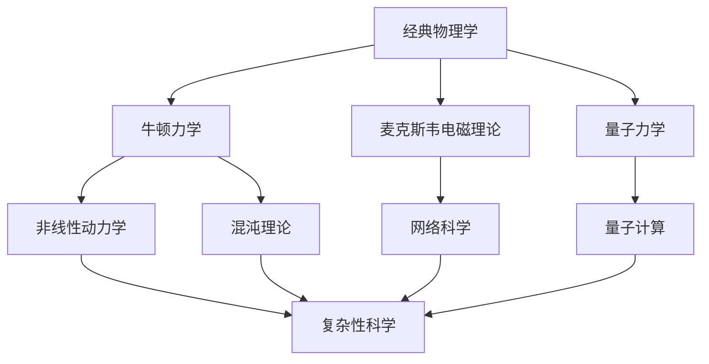

                 

### 文章标题

《从经典物理学到复杂性科学：理解涌现现象与自组织》

> 关键词：经典物理学、复杂性科学、涌现现象、自组织、非线性动力学、混沌理论

> 摘要：本文旨在探讨从经典物理学到复杂性科学的演变过程，重点关注涌现现象与自组织原理。通过逐步分析经典物理学的理论基础及其局限性，我们引出了复杂性科学的兴起与发展。文章详细介绍了复杂性科学的基本概念、非线性动力学与混沌理论，并探讨了复杂性科学在多个领域的应用。最终，本文总结了复杂性科学的研究挑战与未来发展方向，为读者提供了深入理解复杂系统的视角和方法。

### 《从经典物理学到复杂性科学：理解涌现现象与自组织》目录大纲

#### 第一部分：引言与基础

- 第1章：经典物理学的视角
  - 1.1 经典物理学的理论基础
  - 1.2 经典物理学的局限性
  - 1.3 复杂性科学的兴起
- 第2章：复杂性科学的基本概念
  - 2.1 复杂性科学的定义与范畴
  - 2.2 自组织与涌现现象
  - 2.3 复杂系统的基本特征

#### 第二部分：从经典物理学到复杂性科学的桥梁

- 第3章：非线性动力学与混沌
  - 3.1 非线性动力学的基本概念
  - 3.2 混沌现象的发现与理解
  - 3.3 混沌与复杂性科学的关系
- 第4章：复杂性科学的数学工具
  - 4.1 图论与网络科学
  - 4.2 模拟退火算法与机器学习
  - 4.3 相空间分析与应用

#### 第三部分：复杂性科学的应用与实践

- 第5章：复杂系统的建模与分析
  - 5.1 复杂系统的建模方法
  - 5.2 系统动力学的计算机模拟
  - 5.3 系统行为的预测与控制
- 第6章：复杂性科学在社会科学中的应用
  - 6.1 社会网络的构建与分析
  - 6.2 经济系统的复杂性与波动
  - 6.3 政策决策中的复杂性科学
- 第7章：复杂性科学在工程领域的应用
  - 7.1 复杂性科学在交通运输中的应用
  - 7.2 复杂性科学在生态系统管理中的应用
  - 7.3 复杂性科学在医疗保健中的应用

#### 第四部分：总结与展望

- 第8章：复杂性科学的挑战与未来
  - 8.1 复杂性科学的研究热点与前沿
  - 8.2 复杂性科学对传统学科的冲击与融合
  - 8.3 复杂性科学的社会影响与伦理问题
- 第9章：总结与展望
  - 9.1 本书的主要内容回顾
  - 9.2 复杂性科学的未来发展方向
  - 9.3 读者如何进一步学习复杂性科学

#### 附录

- A.1 经典物理学到复杂性科学的Mermaid流程图
- A.2 复杂系统建模与模拟的伪代码示例
- A.3 复杂性科学中的数学模型与公式列表
- A.4 复杂性科学相关的参考资料与推荐阅读

### 第1章：经典物理学的视角

#### 1.1 经典物理学的理论基础

经典物理学是研究自然界的基本规律的科学，其理论基础涵盖了牛顿力学、麦克斯韦电磁理论和量子力学等核心领域。这些理论共同构成了经典物理学的基本框架，为描述和预测物理现象提供了可靠的方法。

##### 1.1.1 经典力学的核心概念

经典力学主要研究宏观物体的运动规律，其核心概念包括牛顿三大定律和万有引力定律。

1. **牛顿第一定律（惯性定律）**：一个物体在没有外力作用下，将保持静止状态或匀速直线运动。
2. **牛顿第二定律（动力学定律）**：一个物体的加速度与作用力成正比，与物体的质量成反比，方向与力的方向相同。数学表达式为 \( F = ma \)。
3. **牛顿第三定律（作用与反作用定律）**：对于任何两个相互作用的物体，它们之间的作用力和反作用力大小相等、方向相反。

这些定律描述了物体的运动状态和相互作用，构成了经典力学的核心。

##### 1.1.2 麦克斯韦电磁理论

麦克斯韦电磁理论描述了电磁场的性质，以及电磁波的产生和传播。这一理论将电学、磁学和光学统一在一起，为现代通信和信息技术的发展奠定了基础。

1. **电磁场方程**：麦克斯韦方程组描述了电磁场的基本规律，包括电场和磁场的分布、变化和相互作用。方程组可以表示为：

   $$
   \nabla \cdot \mathbf{E} = \frac{\rho}{\epsilon_0}
   $$

   $$
   \nabla \cdot \mathbf{B} = 0
   $$

   $$
   \nabla \times \mathbf{E} = -\frac{\partial \mathbf{B}}{\partial t}
   $$

   $$
   \nabla \times \mathbf{B} = \mu_0 \mathbf{J} + \mu_0 \epsilon_0 \frac{\partial \mathbf{E}}{\partial t}
   $$

   其中，\(\mathbf{E}\) 和 \(\mathbf{B}\) 分别表示电场和磁场，\(\rho\) 表示电荷密度，\(\mathbf{J}\) 表示电流密度，\(\epsilon_0\) 和 \(\mu_0\) 分别表示真空中的电介质常数和磁导率。

##### 1.1.3 量子力学的基石

量子力学揭示了微观世界的规律，弥补了经典物理学的不足。量子力学中的不确定性原理和量子纠缠等现象，挑战了经典物理学中的确定性观念。

1. **不确定性原理**：海森堡不确定性原理指出，某些物理量（如位置和动量）不能同时被精确测量。数学表达式为：

   $$
   \Delta x \Delta p_x \geq \frac{h}{2}
   $$

   其中，\(\Delta x\) 和 \(\Delta p_x\) 分别表示位置和动量的不确定度，\(h\) 表示普朗克常数。

2. **量子纠缠**：量子纠缠是量子力学中的一种特殊现象，其中两个或多个量子粒子之间存在一种即时的关联，即使它们相隔很远。这种现象无法用经典物理学的局部实在论来解释。

#### 1.2 经典物理学的局限性

尽管经典物理学在许多领域取得了巨大的成功，但它在一些情况下也表现出局限性。以下是一些常见的局限性：

##### 1.2.1 不能描述微观世界

经典物理学无法描述原子和亚原子粒子的行为，因为它们遵循不同的物理规律。量子力学提供了对这些微观世界的描述。

##### 1.2.2 不能描述宏观世界的复杂性

经典物理学适用于描述简单的宏观系统，但在复杂系统中，系统的行为往往具有不可预测性。复杂性科学试图理解这些复杂系统的行为。

##### 1.2.3 不能解释非线性和混沌现象

经典物理学基于线性假设，无法描述非线性系统和混沌现象。非线性动力学和混沌理论为理解这些复杂现象提供了新的视角。

#### 1.3 复杂性科学的兴起

为了弥补经典物理学的局限性，复杂性科学应运而生。复杂性科学关注复杂系统的行为和相互作用，试图理解从简单规则产生复杂结构的原理。

##### 1.3.1 自组织与涌现现象

自组织是指系统在没有外部干预的情况下，通过内部相互作用自发地形成有序结构。涌现现象是指系统中的个体通过相互作用产生新的宏观行为和属性。

##### 1.3.2 复杂性科学的研究方法

复杂性科学采用多种研究方法，包括计算机模拟、统计分析、网络科学和机器学习等。这些方法有助于揭示复杂系统的行为和规律。

##### 1.3.3 复杂性科学的应用

复杂性科学在许多领域都有广泛的应用，包括社会网络分析、经济系统建模、生态系统管理、医疗保健等领域。

### 第2章：复杂性科学的基本概念

#### 2.1 复杂性科学的定义与范畴

复杂性科学是一门跨学科的研究领域，旨在理解和解决复杂系统的行为和特性。复杂性科学不仅涉及自然科学，如物理学、生物学、化学等，还涵盖了社会科学、经济学、工程学等领域。

##### 2.1.1 定义

复杂性科学可以定义为研究复杂系统的结构、动态行为和演化规律的一门科学。复杂系统通常具有以下特征：

1. **多样性**：复杂系统由多个相互作用的个体组成，这些个体可以是物理实体、抽象实体或社会个体。
2. **非线性**：复杂系统的行为通常是非线性的，这意味着系统中的相互作用不是简单的线性关系。
3. **适应性**：复杂系统具有自我适应和演化能力，能够根据环境变化进行调整。
4. **层次结构**：复杂系统通常具有多层次结构，从微观到宏观，各个层次之间相互关联。

##### 2.1.2 范畴

复杂性科学的范畴非常广泛，涵盖了多个学科领域。以下是一些主要的研究范畴：

1. **物理学**：非线性动力学、混沌理论、相变理论等。
2. **生物学**：生态学、生物网络、进化理论等。
3. **社会科学**：社会网络分析、经济系统建模、政治学、心理学等。
4. **工程学**：交通系统、通信网络、控制系统、金融工程等。
5. **计算机科学**：算法复杂度、机器学习、人工智能、分布式系统等。

#### 2.2 自组织与涌现现象

自组织与涌现现象是复杂性科学的核心概念之一。自组织是指系统在没有外部干预的情况下，通过内部相互作用自发地形成有序结构。涌现现象是指系统中的个体通过相互作用产生新的宏观行为和属性。

##### 2.2.1 自组织

自组织现象在自然界和人类社会中广泛存在。例如：

1. **生物系统**：生物体通过自我组装形成复杂的结构，如细胞、组织、器官等。
2. **社会系统**：人类社会通过社会规范和制度形成有序的社会结构。
3. **经济系统**：市场经济中的供需关系和价格形成机制。

自组织现象通常具有以下特征：

1. **自发性**：自组织过程不需要外部干预，而是由系统内部相互作用驱动。
2. **适应性**：自组织系统能够适应外部环境变化，通过内部调节实现稳定和有序。
3. **多样性**：自组织系统能够产生多种不同的结构和行为模式。

##### 2.2.2 涌现现象

涌现现象是指系统中的个体通过相互作用产生新的宏观行为和属性。涌现现象通常具有以下特征：

1. **不可预见性**：涌现现象往往不可预见，因为系统中的个体行为和相互作用非常复杂。
2. **整体性**：涌现现象不是个体行为的简单叠加，而是由系统整体行为决定的。
3. **协同性**：涌现现象通常需要系统中的多个个体协同作用才能实现。

涌现现象在多个领域都有重要应用，如：

1. **经济学**：市场的集体行为和价格波动。
2. **社会学**：社会群体行为和集体决策。
3. **生物学**：生态系统中的物种相互作用和生态平衡。

#### 2.3 复杂系统的基本特征

复杂系统具有一系列基本特征，这些特征使得复杂系统的研究变得更加复杂和具有挑战性。

##### 2.3.1 多样性

复杂系统通常由多种不同类型的个体组成，这些个体可以具有不同的属性、行为和相互作用。多样性使得复杂系统具有丰富的结构和动态行为。

##### 2.3.2 非线性

复杂系统的行为通常是非线性的，这意味着系统中的相互作用不是简单的线性关系。非线性关系可能导致复杂系统的行为出现混沌现象和分岔现象。

##### 2.3.3 适应性

复杂系统具有自我适应和演化能力，能够根据外部环境的变化进行调整。适应性使得复杂系统能够在不确定的环境中保持稳定和有序。

##### 2.3.4 层次结构

复杂系统通常具有多层次结构，从微观到宏观，各个层次之间相互关联。层次结构使得复杂系统的行为具有层次性和多样性。

##### 2.3.5 不确定性

复杂系统中的不确定性主要来自以下几个方面：

1. **参数不确定性**：复杂系统的参数可能存在不确定性，这可能导致系统的行为出现波动。
2. **初始条件不确定性**：复杂系统的初始条件可能存在不确定性，这会影响系统的演化过程。
3. **外部环境影响**：复杂系统受到外部环境的影响，外部环境的波动可能导致系统的行为发生变化。

不确定性使得复杂系统的行为难以预测和控制。

### 第3章：非线性动力学与混沌

#### 3.1 非线性动力学的基本概念

非线性动力学是研究非线性系统的动态行为和演化规律的一门学科。非线性系统是指其行为不能用线性方程描述的系统，其特点是系统的响应与输入之间存在非线性关系。非线性动力学在物理学、工程学、生物学等领域都有广泛的应用。

##### 3.1.1 非线性方程

非线性方程是描述非线性系统的数学模型，常见的非线性方程包括：

1. **非线性常微分方程**：这类方程描述了系统的动态行为，其中未知函数是时间或其他变量的非线性函数。典型的例子包括洛伦兹方程、范德波方程等。

2. **非线性代数方程**：这类方程描述了系统在平衡状态下的行为，其中未知量是代数变量。典型的例子包括非线性方程组、分岔方程等。

##### 3.1.2 非线性特性

非线性动力学系统具有以下特性：

1. **分岔现象**：非线性系统在参数变化时可能会出现分岔现象，导致系统行为的突变。分岔现象包括稳定态分岔、周期分岔、混沌分岔等。

2. **混沌现象**：非线性动力学系统在某些条件下可能表现出混沌行为，即系统行为对初始条件高度敏感，长时间行为无法预测。混沌现象具有随机性、非周期性和确定性等特点。

3. **非线性的共振**：非线性系统中的共振现象可能导致系统行为的剧烈变化，如能量转移、振动放大等。

#### 3.2 混沌现象的发现与理解

混沌现象是20世纪非线性动力学研究的重要发现之一。混沌现象具有以下特点：

1. **对初始条件的高度敏感性**：混沌系统对初始条件的微小差异会导致长期行为的巨大差异，这被称为混沌的“蝴蝶效应”。

2. **长期行为的随机性**：尽管混沌系统的行为在短期内看起来是随机的，但在长时间尺度上，混沌系统的行为具有确定性。

3. **非周期性**：混沌系统的行为不遵循简单的周期规律，而是呈现出复杂、无规律的波形。

##### 3.2.1 混沌现象的发现

混沌现象的发现可以追溯到20世纪60年代，当时洛伦兹（Edward Lorenz）在研究大气动力学模型时发现了混沌现象。洛伦兹使用一台数字计算机模拟大气流动，意外地发现了一个奇怪吸引子的存在，这一发现标志着混沌现象的诞生。

##### 3.2.2 混沌现象的理解

为了理解混沌现象，科学家们提出了多种理论模型和方法。以下是一些重要的理论：

1. **奇怪吸引子**：奇怪吸引子是一种在相空间中形成的非周期性结构，它捕捉了混沌系统的长期行为。奇怪吸引子的形状可以是分形结构，这意味着它们具有无限层次的结构。

2. **混沌映射**：混沌映射是描述混沌现象的数学工具，它通过非线性变换将一个初始状态映射到另一个状态。常见的混沌映射包括洛伦兹映射、Logistic映射等。

3. **分岔理论**：分岔理论是研究系统行为在参数变化时发生突变的一门学科。分岔现象是混沌现象的重要表现，通过分岔理论可以解释混沌系统的行为。

#### 3.3 混沌与复杂性科学的关系

混沌现象是复杂性科学中的重要组成部分，它为理解复杂系统的行为提供了新的视角。混沌与复杂性科学的关系可以从以下几个方面来理解：

1. **混沌作为复杂性的来源**：混沌现象是复杂性的重要来源之一，它通过非线性相互作用和初始条件敏感性导致系统行为的复杂化。

2. **混沌作为自组织的动力**：混沌现象在自组织过程中扮演着重要角色，它通过无序状态中的随机涨落驱动系统进入新的有序状态。

3. **混沌作为复杂系统的特征**：混沌现象是复杂系统的一种普遍特征，许多复杂系统都表现出混沌行为，这反映了复杂系统的内在复杂性。

通过研究混沌现象，我们可以更好地理解复杂系统的行为和演化规律，为复杂性科学的研究提供理论支持。

### 第4章：复杂性科学的数学工具

#### 4.1 图论与网络科学

图论和网络科学是复杂性科学中非常重要的数学工具，它们广泛应用于描述和分析复杂系统的结构和行为。图论研究图的性质和关系，而网络科学则研究网络的动力学行为和功能特性。

##### 4.1.1 图论的基本概念

图是由节点和边组成的数学结构，节点表示系统中的个体，边表示个体之间的相互作用或连接。图论中的基本概念包括：

1. **节点**：图中的基本元素，表示系统中的个体或实体。
2. **边**：连接两个节点的线段，表示个体之间的相互作用或关系。
3. **路径**：连接两个节点的序列，路径的长度表示个体之间的距离。
4. **连通性**：图中任意两个节点之间存在路径，则图是连通的。
5. **网络密度**：图中边的数量与可能的最大边数的比值，表示网络的紧密程度。

##### 4.1.2 图论在网络科学中的应用

图论在网络科学中的应用非常广泛，以下是一些关键的应用：

1. **社会网络分析**：社会网络分析通过图论方法研究人与人之间的社会关系，揭示社会结构、传播过程和信息流动。
2. **交通网络分析**：交通网络分析通过图论方法研究道路、铁路和航空网络的结构和性能，优化交通流量和路径选择。
3. **通信网络分析**：通信网络分析通过图论方法研究网络拓扑结构、传输效率和可靠性，优化通信资源的分配和管理。

##### 4.1.3 网络科学的基本概念

网络科学关注网络的结构、功能和演化规律，主要研究以下几个方面：

1. **网络拓扑**：网络拓扑描述网络的连接方式，包括节点度、聚类系数、路径长度等指标。
2. **网络动力学**：网络动力学研究网络中的动态行为，包括信息传播、同步、共振等现象。
3. **网络功能**：网络功能研究网络的生物学、社会、经济等属性，包括网络稳定性、鲁棒性、适应性和自组织能力。

##### 4.1.4 网络科学在复杂性科学中的应用

网络科学在复杂性科学中的应用体现在以下几个方面：

1. **复杂系统建模**：网络科学提供了复杂系统建模的方法，通过图论和网络模型可以描述复杂系统的结构和行为。
2. **网络效应**：网络效应是指网络中个体通过相互作用产生的整体效应，如协同作用、协同创新等。
3. **网络优化**：网络优化通过优化网络结构、功能和性能，提高复杂系统的效率和鲁棒性。

#### 4.2 模拟退火算法与机器学习

模拟退火算法和机器学习是复杂性科学中重要的计算方法，它们在复杂系统优化和预测中发挥着重要作用。

##### 4.2.1 模拟退火算法

模拟退火算法是一种基于物理退火过程的优化算法，它通过模拟温度下降过程中的状态转移和能量变化，逐步寻找最优解。模拟退火算法的基本步骤如下：

1. **初始化**：设定初始温度和初始状态。
2. **迭代**：在每个迭代步骤中，以一定的概率接受较差的解，以防止陷入局部最优。
3. **冷却**：根据预设的冷却策略，逐步降低温度。
4. **终止条件**：当温度达到预设的终止条件时，算法终止。

##### 4.2.2 机器学习

机器学习是一种通过数据驱动的方式学习模型和规律的方法，它广泛应用于复杂系统的建模和预测。机器学习的主要任务包括：

1. **监督学习**：通过标记数据学习模型，用于预测新的数据。
2. **无监督学习**：通过未标记数据学习模型，用于发现数据中的结构和规律。
3. **强化学习**：通过与环境交互学习最优策略。

##### 4.2.3 模拟退火算法与机器学习在复杂性科学中的应用

1. **复杂系统优化**：模拟退火算法可以用于求解复杂系统的优化问题，如网络设计、资源分配、调度问题等。
2. **复杂系统预测**：机器学习可以用于预测复杂系统的行为，如金融市场预测、天气预测、生物信号预测等。
3. **复杂系统模拟**：模拟退火算法和机器学习可以结合用于复杂系统的模拟和预测，如神经网络模拟、多智能体系统模拟等。

#### 4.3 相空间分析与应用

相空间分析是一种用于研究动态系统行为的数学工具，它通过在相空间中绘制系统的状态轨迹，揭示系统的动态特性和演化规律。

##### 4.3.1 相空间的基本概念

相空间是描述动态系统状态的数学空间，通常由系统的状态变量构成。相空间分析的基本概念包括：

1. **状态变量**：描述系统状态的物理量，如位置、速度、能量等。
2. **相轨迹**：系统状态在相空间中的轨迹，表示系统的动态行为。
3. **相空间点**：系统在某一时刻的状态，由状态变量构成。

##### 4.3.2 相空间分析的应用

相空间分析在复杂性科学中有着广泛的应用，以下是一些具体的应用：

1. **非线性动力学系统**：通过相空间分析可以揭示非线性系统的动态特性，如分岔、混沌现象等。
2. **复杂网络**：通过相空间分析可以研究复杂网络的稳定性、同步性和功能特性。
3. **生态系统**：通过相空间分析可以研究生态系统的动态行为和演化规律。

##### 4.3.3 相空间分析的优势

相空间分析具有以下优势：

1. **直观性**：相空间分析通过直观的图形展示系统的动态行为，有助于理解系统的复杂特性。
2. **全局性**：相空间分析可以同时考虑系统中的多个变量，提供全局的视角。
3. **跨学科应用**：相空间分析可以应用于多个学科领域，如物理学、生物学、工程学等。

### 第5章：复杂系统的建模与分析

#### 5.1 复杂系统的建模方法

复杂系统建模是复杂性科学中的核心任务，它通过构建数学模型来描述复杂系统的结构和行为。复杂系统的建模方法主要包括以下几种：

##### 5.1.1 确定性建模

确定性建模是一种基于确定性方程和规律的方法，通过建立系统的状态方程和动力学方程来描述复杂系统的行为。确定性建模的方法包括：

1. **微分方程**：使用微分方程描述系统的动态行为，如洛伦兹方程、范德波方程等。
2. **差分方程**：使用差分方程描述系统的离散行为，如Logistic映射、R-L模型等。
3. **代数方程**：使用代数方程描述系统的稳定状态，如分岔方程、网络方程等。

##### 5.1.2 随机建模

随机建模是一种基于概率和统计的方法，通过引入随机变量和概率分布来描述复杂系统的行为。随机建模的方法包括：

1. **蒙特卡罗方法**：使用随机抽样和模拟来估计系统的概率分布和统计特性。
2. **随机微分方程**：使用随机微分方程描述系统的随机行为，如布朗运动、随机波动方程等。
3. **马尔可夫模型**：使用马尔可夫链描述系统的状态转移和概率分布。

##### 5.1.3 统计建模

统计建模是一种基于数据驱动的方法，通过分析系统的数据来建立模型和预测系统的行为。统计建模的方法包括：

1. **回归分析**：使用回归模型分析系统变量之间的关系，如线性回归、非线性回归等。
2. **时间序列分析**：使用时间序列模型分析系统的动态行为，如ARIMA模型、状态空间模型等。
3. **机器学习**：使用机器学习方法（如监督学习、无监督学习、强化学习）来建立系统模型和预测系统行为。

#### 5.2 系统动力学的计算机模拟

系统动力学的计算机模拟是复杂性科学研究中的一种重要方法，它通过计算机模拟来模拟和分析复杂系统的动态行为和演化规律。系统动力学计算机模拟的基本步骤包括：

##### 5.2.1 模型构建

1. **确定系统变量**：确定描述系统状态的变量，如位置、速度、能量等。
2. **建立状态方程**：根据系统特性建立状态方程和动力学方程，如微分方程、差分方程、代数方程等。
3. **确定初始条件**：设置系统的初始状态，如位置、速度、能量等。

##### 5.2.2 模拟实现

1. **编程实现**：使用编程语言（如Python、MATLAB、C++等）实现系统的动力学方程和状态方程。
2. **模拟运行**：运行模拟程序，根据系统方程和初始条件计算系统状态的演化。
3. **数据记录**：记录系统的状态数据，如位置、速度、能量等，以供分析和可视化。

##### 5.2.3 模拟分析

1. **状态轨迹分析**：分析系统状态在相空间中的轨迹，识别系统的稳定状态、周期行为、混沌现象等。
2. **统计特性分析**：分析系统的统计特性，如平均行为、波动性、分布等。
3. **敏感性分析**：分析系统对初始条件和参数变化的敏感性，评估系统的鲁棒性。

##### 5.2.4 模拟结果可视化

1. **状态轨迹可视化**：绘制系统状态轨迹的图形，如相图、时间序列图等。
2. **分布特性可视化**：绘制系统统计特性的分布图形，如概率分布图、直方图等。
3. **交互式可视化**：使用交互式可视化工具（如WebGL、JavaScript等）实现系统的动态可视化。

#### 5.3 系统行为的预测与控制

系统行为的预测与控制是复杂性科学中的关键任务，它通过建立模型和进行模拟来预测系统行为，并采取控制措施来调整系统状态，实现特定的目标。系统行为的预测与控制包括以下步骤：

##### 5.3.1 预测建模

1. **建立预测模型**：根据历史数据和分析结果，建立系统的预测模型，如线性回归模型、时间序列模型、机器学习模型等。
2. **参数优化**：调整模型参数，优化模型的预测性能。
3. **预测分析**：使用预测模型对系统的未来行为进行预测，分析系统的趋势和变化。

##### 5.3.2 控制策略设计

1. **确定控制目标**：明确系统控制的目标和要求，如稳定状态、最优性能等。
2. **设计控制策略**：根据控制目标和系统模型，设计控制策略，如PID控制、模糊控制、神经网络控制等。
3. **控制效果评估**：评估控制策略的效果，如稳定性、鲁棒性、响应速度等。

##### 5.3.3 实时监控与调整

1. **实时监控**：通过实时监控系统状态，获取当前系统的数据。
2. **调整控制策略**：根据实时监控数据，动态调整控制策略，实现系统的实时控制和优化。
3. **反馈机制**：建立反馈机制，将系统行为与预期目标进行比较，调整控制策略，实现系统的持续优化。

### 第6章：复杂性科学在社会科学中的应用

#### 6.1 社会网络的构建与分析

社会网络分析是复杂性科学在社会科学中的重要应用之一，它通过研究人与人之间的社会关系，揭示社会结构的特征和规律。社会网络的构建与分析主要包括以下几个步骤：

##### 6.1.1 社会网络的构建

1. **定义网络节点**：确定社会网络中的节点，通常代表个人、组织或其他实体。
2. **建立关系矩阵**：构建描述节点之间关系的矩阵，表示节点之间的连接关系。常用的关系矩阵包括邻接矩阵和加权邻接矩阵。
3. **可视化网络结构**：使用图形可视化工具（如Gephi、Cytoscape等）绘制社会网络的图形，直观地展示节点和边的关系。

##### 6.1.2 社会网络分析

1. **节点分析**：分析节点的属性和特征，如度数、中心性、紧密性等，评估节点在社交网络中的地位和影响力。
2. **边分析**：分析边的关系强度和特征，如边的权重、方向、长度等，评估节点之间的连接关系和互动强度。
3. **网络聚类分析**：使用聚类算法（如社区发现算法、层次聚类等）分析社会网络的聚类结构，识别社交网络中的社区和子群。

##### 6.1.3 社会网络的应用

1. **社交影响力分析**：通过分析节点的中心性和影响力，评估个人或组织在社交网络中的影响力和传播能力。
2. **社交传播分析**：研究社交网络中的信息传播和感染过程，预测和模拟信息的传播路径和传播速度。
3. **社会动员与组织**：通过分析社交网络的拓扑结构和节点特征，设计社会动员和组织策略，促进社会行动和集体行动。

#### 6.2 经济系统的复杂性与波动

经济系统是复杂性科学在社会科学中另一个重要的应用领域，它研究经济的动态行为、波动和演化规律。经济系统的复杂性与波动主要表现在以下几个方面：

##### 6.2.1 经济系统的复杂性

1. **非线性关系**：经济系统中的变量之间通常存在非线性关系，如供需关系、市场供需平衡等。
2. **不确定性**：经济系统受到多种不确定因素的影响，如政策变化、突发事件等，导致经济行为的不确定性。
3. **多层次结构**：经济系统具有多层次结构，从微观的企业行为到宏观的国民经济，各个层次之间存在相互作用和反馈。

##### 6.2.2 经济系统的波动

1. **周期性波动**：经济系统存在周期性波动，如经济周期、商业周期等，表现出上升和下降的趋势。
2. **非周期性波动**：经济系统受到各种突发事件和冲击的影响，导致非周期性波动，如金融危机、政策变化等。
3. **混沌现象**：在某些条件下，经济系统可能表现出混沌行为，对初始条件高度敏感，难以预测长期行为。

##### 6.2.3 复杂性科学在经济学中的应用

1. **宏观经济模型**：使用复杂性科学的方法建立宏观经济模型，如多 agent 模型、行为经济模型等，研究经济系统的动态行为和演化规律。
2. **金融市场分析**：使用复杂性科学的方法分析金融市场的动态行为，如股市波动、风险传导等。
3. **政策设计与评估**：使用复杂性科学的方法设计经济政策和评估政策效果，如财政政策、货币政策等。

#### 6.3 政策决策中的复杂性科学

政策决策是政府和社会组织在复杂环境下进行的选择和决策过程，它受到多种复杂因素的影响。复杂性科学为政策决策提供了新的理论方法和工具，以下是一些具体的应用：

##### 6.3.1 政策模型构建

1. **系统动力学模型**：构建系统动力学模型，描述政策决策过程中的变量关系和反馈机制，分析政策的效果和影响。
2. **多 agent 模型**：构建多 agent 模型，模拟政策参与者的行为和互动，分析政策在不同情境下的决策路径和效果。
3. **行为经济学模型**：结合行为经济学的理论，分析政策参与者的人类行为特征和决策偏好，设计更有效的政策方案。

##### 6.3.2 政策模拟与评估

1. **模拟实验**：通过计算机模拟和实验，模拟政策在不同情境下的效果和影响，评估政策的可行性和效果。
2. **情景分析**：构建不同的政策情境，模拟政策在不同情境下的决策路径和结果，分析政策的适应性和灵活性。
3. **敏感性分析**：分析政策参数的变化对决策结果的影响，评估政策对不确定性的敏感性和鲁棒性。

##### 6.3.3 政策制定与优化

1. **目标优化**：根据政策目标，使用优化算法和模型，设计最优的政策方案，实现政策目标的最优化。
2. **多目标决策**：考虑政策决策中的多个目标，使用多目标优化和决策方法，实现政策目标的平衡和协调。
3. **决策支持系统**：开发决策支持系统，集成复杂性科学的模型和方法，提供政策决策的辅助和指导。

### 第7章：复杂性科学在工程领域的应用

#### 7.1 复杂性科学在交通运输中的应用

复杂性科学在交通运输领域的应用旨在优化交通系统，提高交通流量和运输效率。以下是一些关键的应用领域：

##### 7.1.1 交通流量预测

交通流量预测是复杂性科学在交通运输中的重要应用之一，它通过建立数学模型和利用大数据分析方法，预测交通流量变化。交通流量预测的方法包括：

1. **时间序列分析**：使用时间序列分析方法，如ARIMA模型、自回归移动平均模型（ARMA）等，分析历史交通流量数据，预测未来的交通流量。
2. **机器学习**：使用机器学习方法，如回归分析、随机森林、支持向量机（SVM）等，建立预测模型，预测未来的交通流量。
3. **多代理模型**：使用多代理模型，模拟交通参与者（如车辆、行人、公交车等）的行为，预测交通流量和交通状况。

##### 7.1.2 交通运输网络优化

交通运输网络优化是复杂性科学在交通运输中的另一个重要应用领域，它旨在优化交通网络的配置和运行效率。交通运输网络优化的方法包括：

1. **最优化算法**：使用最优化算法，如线性规划、整数规划、动态规划等，优化交通网络的路由、运输计划和资源分配。
2. **模拟退火算法**：使用模拟退火算法，通过迭代过程寻找最优解，优化交通网络的配置和运行。
3. **多目标优化**：考虑交通系统的多个目标，如交通流量、运输成本、环境污染等，使用多目标优化方法，平衡和优化交通网络。

##### 7.1.3 交通控制与调度

交通控制与调度是复杂性科学在交通运输中的关键应用领域，它旨在通过实时监测和控制交通流，提高交通系统的运行效率。交通控制与调度的方法包括：

1. **自适应交通信号控制**：使用自适应交通信号控制算法，根据实时交通流量和交通状况调整信号配时，优化交通流量。
2. **交通事件检测与响应**：使用传感器和监测技术，实时检测交通事件（如交通事故、道路施工等），并采取相应的控制措施，优化交通流。
3. **智能交通系统**：使用智能交通系统（ITS），集成多种技术（如传感器、通信、控制等），实现交通流的实时监测、控制和优化。

#### 7.2 复杂性科学在生态系统管理中的应用

复杂性科学在生态系统管理中的应用旨在理解和优化生态系统的动态行为，促进生态系统的可持续性和稳定性。以下是一些关键的应用领域：

##### 7.2.1 生态系统建模

生态系统建模是复杂性科学在生态系统管理中的重要应用之一，它通过建立数学模型和计算机模拟，模拟生态系统的动态行为和演化规律。生态系统建模的方法包括：

1. **个体基模型**：使用个体基模型，模拟生态系统中不同生物种群的行为和相互作用，分析生态系统的动态过程。
2. **食物网模型**：使用食物网模型，描述生态系统中的食物链和食物网结构，分析食物网的稳定性、演化和生态平衡。
3. **生态系统动态模型**：使用生态系统动态模型，描述生态系统的整体动态行为，分析生态系统在不同条件下的变化和响应。

##### 7.2.2 生态风险评估

生态风险评估是复杂性科学在生态系统管理中的应用，它旨在评估生态系统的风险和潜在威胁，制定相应的保护和管理策略。生态风险评估的方法包括：

1. **压力-状态-响应模型**：使用压力-状态-响应模型，评估生态系统受到的压力（如污染、过度捕捞等）对生态系统状态和功能的影响。
2. **生态足迹分析**：使用生态足迹分析，评估人类活动对生态系统的影响，确定生态系统的承载能力和可持续性。
3. **生态网络分析**：使用生态网络分析，分析生态系统中的物种相互作用和生态关系，评估生态系统稳定性和抗干扰能力。

##### 7.2.3 生态修复与保护

生态修复与保护是复杂性科学在生态系统管理中的重要应用领域，它旨在恢复和改善生态系统的功能和结构，保护生态系统的生物多样性和稳定性。生态修复与保护的方法包括：

1. **生态系统重建**：使用生态系统重建方法，通过引入物种、改善生境等方式，恢复和重建生态系统的结构和功能。
2. **生态工程**：使用生态工程方法，通过工程技术和生态学原理，修复受损生态系统，改善生态系统功能。
3. **保护规划**：使用保护规划方法，制定生态保护计划，保护生态系统的关键区域和物种，促进生态系统的可持续性。

#### 7.3 复杂性科学在医疗保健中的应用

复杂性科学在医疗保健中的应用旨在提高医疗保健系统的效率和效果，改善患者护理和治疗质量。以下是一些关键的应用领域：

##### 7.3.1 疾病预测与诊断

疾病预测与诊断是复杂性科学在医疗保健中的重要应用领域，它通过建立复杂的数学模型和数据分析方法，预测疾病的发病率和诊断疾病。疾病预测与诊断的方法包括：

1. **机器学习**：使用机器学习方法，如支持向量机、神经网络、决策树等，建立疾病预测模型，预测疾病的发病率和病情变化。
2. **时间序列分析**：使用时间序列分析方法，分析患者的医疗记录和生理指标，预测疾病的发病时间和病情变化。
3. **多代理模型**：使用多代理模型，模拟患者、医生、医疗设备等的行为和互动，预测疾病的诊断和治疗过程。

##### 7.3.2 医疗资源优化

医疗资源优化是复杂性科学在医疗保健中的重要应用领域，它旨在优化医疗资源的配置和使用，提高医疗保健系统的效率和效果。医疗资源优化的方法包括：

1. **最优化算法**：使用最优化算法，如线性规划、整数规划、动态规划等，优化医疗资源的分配和调度，提高资源利用效率。
2. **模拟退火算法**：使用模拟退火算法，通过迭代过程寻找最优解，优化医疗资源的配置和调度。
3. **多目标优化**：考虑医疗系统的多个目标，如患者满意度、医疗成本、资源利用等，使用多目标优化方法，实现医疗资源的平衡和优化。

##### 7.3.3 医疗决策支持

医疗决策支持是复杂性科学在医疗保健中的重要应用领域，它旨在通过提供数据分析、预测和模拟结果，支持医疗决策和决策制定。医疗决策支持的方法包括：

1. **决策树**：使用决策树方法，分析患者的病情和治疗选项，提供决策建议。
2. **贝叶斯网络**：使用贝叶斯网络方法，分析疾病的诊断和治疗决策，提供概率性和决策支持。
3. **多代理模型**：使用多代理模型，模拟医疗决策过程中的不同角色和决策过程，提供综合的决策支持和建议。

### 第8章：复杂性科学的挑战与未来

#### 8.1 复杂性科学的研究热点与前沿

复杂性科学作为一门跨学科的研究领域，近年来取得了显著的发展，同时也面临着诸多挑战。以下是复杂性科学的一些研究热点与前沿领域：

##### 8.1.1 复杂系统的非线性动力学与混沌现象

非线性动力学和混沌现象是复杂性科学的核心内容之一。研究复杂系统的非线性动力学行为，揭示混沌现象的机制，对于理解复杂系统的演化规律和预测其长期行为具有重要意义。当前的研究热点包括：

1. **奇怪吸引子的发现与分类**：研究者不断发现新的奇怪吸引子，并对其进行分类和深入研究。
2. **混沌控制与同步**：研究混沌控制方法，实现混沌系统的稳定控制与同步，为混沌现象的应用提供理论基础。
3. **复杂网络的混沌动力学**：研究复杂网络中的混沌现象，揭示网络结构对混沌行为的影响。

##### 8.1.2 多尺度复杂系统的建模与模拟

多尺度复杂系统在自然界和人类社会中广泛存在，如生物系统、生态系统、经济系统等。多尺度复杂系统的建模与模拟是复杂性科学的前沿领域之一。当前的研究热点包括：

1. **多尺度模型构建**：研究多尺度模型的理论和方法，实现不同尺度下的模型耦合和转换。
2. **多尺度计算方法**：研究多尺度计算方法，提高多尺度模拟的效率和准确性。
3. **跨尺度数据融合**：研究跨尺度数据融合方法，实现不同尺度下数据的集成和分析。

##### 8.1.3 机器学习与复杂性科学

机器学习与复杂性科学的交叉研究正在成为一个重要的研究方向。通过结合机器学习和复杂性科学的理论方法，可以更好地理解和分析复杂系统。当前的研究热点包括：

1. **机器学习在复杂系统建模中的应用**：研究如何利用机器学习方法构建复杂系统的预测模型和模拟模型。
2. **机器学习算法的复杂性分析**：研究机器学习算法的计算复杂度和收敛性，优化算法性能。
3. **复杂系统的机器学习解释**：研究如何解释复杂系统中的机器学习模型，提高模型的解释性和可理解性。

##### 8.1.4 复杂性科学的跨学科应用

复杂性科学的跨学科应用是推动其发展的重要动力。当前的研究热点包括：

1. **复杂性科学在生命科学中的应用**：研究复杂性科学方法在生命科学领域的应用，如基因调控网络、生物系统演化等。
2. **复杂性科学在社会科学中的应用**：研究复杂性科学方法在社会科学领域的应用，如社会网络分析、经济系统建模等。
3. **复杂性科学在工程领域的应用**：研究复杂性科学方法在工程领域的应用，如交通系统优化、生态工程等。

#### 8.2 复杂性科学对传统学科的冲击与融合

复杂性科学的发展对传统学科产生了深远的影响，同时也促进了学科之间的融合。以下是一些具体的影响和融合方向：

##### 8.2.1 对传统学科的影响

1. **物理学**：复杂性科学引入了非线性动力学和混沌理论，挑战了经典物理学的确定性观念，推动了物理学研究方法的变革。
2. **生物学**：复杂性科学提供了新的视角和方法，研究生物系统的复杂行为和演化规律，推动了生物学研究的发展。
3. **计算机科学**：复杂性科学引入了复杂系统的建模和模拟方法，推动了计算机科学在算法设计、人工智能、分布式系统等领域的创新。

##### 8.2.2 学科融合的方向

1. **多学科交叉研究**：复杂性科学倡导跨学科的合作与研究，通过整合不同学科的理论和方法，研究复杂系统的本质和规律。
2. **复杂系统的跨学科建模**：研究如何建立跨学科的复杂系统模型，实现不同学科领域的数据共享和模型集成。
3. **复杂性科学的跨学科教育**：推动复杂性科学的跨学科教育，培养具有跨学科知识和技能的研究人才。

##### 8.2.3 学科融合的优势

1. **理论创新**：跨学科融合可以激发新的理论创新，促进学科之间的交叉与碰撞。
2. **方法创新**：跨学科融合可以借鉴不同学科的研究方法，实现方法的创新和优化。
3. **解决复杂问题**：跨学科融合有助于解决传统学科无法解决的复杂问题，提供新的解决方案和策略。

#### 8.3 复杂性科学的社会影响与伦理问题

复杂性科学的发展对社会产生了深远的影响，同时也引发了一系列伦理问题。以下是一些具体的社会影响和伦理问题：

##### 8.3.1 社会影响

1. **科技创新**：复杂性科学为科技创新提供了新的理论基础和方法，推动了科学技术的发展。
2. **社会管理**：复杂性科学为复杂社会问题的解决提供了新的思路和方法，如社会治理、公共安全等。
3. **经济发展**：复杂性科学在经济发展中的应用，如复杂系统建模、风险管理等，为经济增长提供了新的动力。

##### 8.3.2 伦理问题

1. **数据隐私**：复杂性科学依赖于大量数据的收集和分析，如何保护个人隐私和数据安全成为重要的伦理问题。
2. **算法公平性**：复杂系统的算法应用可能存在偏见和不公平性，如何确保算法的公平性和透明度是重要的伦理问题。
3. **人工智能伦理**：复杂性科学在人工智能领域的应用引发了关于人工智能伦理的问题，如机器人伦理、人类与人工智能的合作等。

##### 8.3.3 伦理挑战与对策

1. **加强法律法规**：制定相关的法律法规，规范复杂性科学的研究和应用，保护个人隐私和信息安全。
2. **伦理审查机制**：建立伦理审查机制，对复杂性科学的研究和应用进行伦理评估和监督。
3. **公众参与**：加强公众参与，提高公众对复杂性科学的了解和参与，促进科学与社会之间的互动和沟通。

### 第9章：总结与展望

#### 9.1 本书的主要内容回顾

本书从经典物理学的视角出发，介绍了复杂性科学的基本概念、非线性动力学与混沌理论，以及复杂性科学在多个领域的应用。具体内容回顾如下：

1. **经典物理学的理论基础**：介绍了经典力学、麦克斯韦电磁理论和量子力学等经典物理学的核心理论，以及其局限性。
2. **复杂性科学的基本概念**：介绍了复杂性科学的定义、范畴，以及自组织与涌现现象，复杂系统的基本特征。
3. **非线性动力学与混沌**：介绍了非线性动力学的基本概念、混沌现象的发现与理解，以及混沌与复杂性科学的关系。
4. **复杂性科学的数学工具**：介绍了图论与网络科学、模拟退火算法与机器学习、相空间分析与应用。
5. **复杂系统的建模与分析**：介绍了复杂系统的建模方法、系统动力学的计算机模拟、系统行为的预测与控制。
6. **复杂性科学在社会科学中的应用**：介绍了社会网络的构建与分析、经济系统的复杂性与波动、政策决策中的复杂性科学。
7. **复杂性科学在工程领域的应用**：介绍了复杂性科学在交通运输中的应用、生态系统管理中的应用、医疗保健中的应用。
8. **复杂性科学的挑战与未来**：介绍了复杂性科学的研究热点与前沿、复杂性科学对传统学科的冲击与融合、复杂性科学的社会影响与伦理问题。

#### 9.2 复杂性科学的未来发展方向

复杂性科学作为一门跨学科的研究领域，未来将在多个方面取得进一步的发展。以下是复杂性科学的几个未来发展方向：

1. **跨学科融合**：复杂性科学将继续与其他学科（如物理学、生物学、社会科学、工程学等）进行深度融合，推动学科交叉与创新。
2. **大数据与人工智能**：大数据和人工智能技术的发展将为复杂性科学研究提供更多的数据资源和计算能力，促进复杂系统建模与模拟的进步。
3. **复杂系统优化**：优化复杂系统的设计、运行和管理是未来研究的重要方向，将发展更多的优化算法和策略。
4. **复杂系统控制与预测**：提高复杂系统的控制能力和预测精度是未来研究的重点，将探索新的控制方法和预测模型。
5. **社会影响与伦理问题**：复杂性科学对社会的影响和伦理问题日益受到关注，未来将加强对这些问题的研究，并提出相应的对策和解决方案。

#### 9.3 读者如何进一步学习复杂性科学

对于想要进一步学习复杂性科学的读者，以下是一些建议：

1. **阅读经典文献**：阅读复杂性科学领域的经典著作和论文，了解复杂性科学的基本理论和方法。
2. **学习数学工具**：掌握数学工具（如线性代数、概率论、统计学等）对于理解复杂性科学至关重要。
3. **参与学术交流**：参加学术会议、研讨会和讲座，与领域内的专家学者交流，了解最新的研究动态和进展。
4. **实践与编程**：通过实践和编程，掌握复杂系统建模和模拟的方法，提高实际操作能力。
5. **拓展知识面**：跨学科学习，了解其他相关学科（如物理学、生物学、社会科学等）的基本概念和方法，为复杂性科学研究提供更广泛的视角。

### 附录

#### A.1 经典物理学到复杂性科学的Mermaid流程图

以下是一个Mermaid流程图，展示了从经典物理学到复杂性科学的基本概念和关系：



#### A.2 复杂系统建模与模拟的伪代码示例

以下是一个复杂系统建模与模拟的伪代码示例，使用Python编程语言：

```python
import numpy as np
import matplotlib.pyplot as plt

# 定义系统状态变量
x = np.random.rand()  # 位置变量
v = np.random.rand()  # 速度变量

# 定义系统动力学方程
def dynamical_equation(x, v):
    f = 0.1  # 非线性系数
    g = 0.2  # 非线性系数
    dxdt = v  # 位置的变化率
    dvdt = f * (1 - x**2) - g * v  # 速度的变化率
    return dxdt, dvdt

# 模拟系统行为
num_steps = 1000  # 模拟时间步数
time_step = 0.1  # 时间步长
data = np.zeros((num_steps, 2))

for i in range(num_steps):
    dxdt, dvdt = dynamical_equation(x, v)
    x += dxdt * time_step
    v += dvdt * time_step
    data[i, 0] = x
    data[i, 1] = v

# 绘制相空间图
plt.figure()
plt.plot(data[:, 0], data[:, 1])
plt.xlabel('Position')
plt.ylabel('Velocity')
plt.title('Phase Space Trajectory')
plt.show()
```

#### A.3 复杂性科学中的数学模型与公式列表

以下是一些复杂性科学中常用的数学模型与公式列表：

1. **牛顿第二定律**：
   $$
   F = ma
   $$

2. **麦克斯韦方程组**：
   $$
   \nabla \cdot \mathbf{E} = \frac{\rho}{\epsilon_0}
   $$
   $$
   \nabla \cdot \mathbf{B} = 0
   $$
   $$
   \nabla \times \mathbf{E} = -\frac{\partial \mathbf{B}}{\partial t}
   $$
   $$
   \nabla \times \mathbf{B} = \mu_0 \mathbf{J} + \mu_0 \epsilon_0 \frac{\partial \mathbf{E}}{\partial t}
   $$

3. **海森堡不确定性原理**：
   $$
   \Delta x \Delta p_x \geq \frac{h}{2}
   $$

4. **洛伦兹力**：
   $$
   \mathbf{F} = q(\mathbf{E} + \mathbf{v} \times \mathbf{B})
   $$

5. **洛伦兹映射**：
   $$
   x_{n+1} = r x_n (1 - x_n)
   $$
   $$
   y_{n+1} = sy_n x_n
   $$
   $$
   z_{n+1} = tz_n y_n
   $$

6. **Logistic映射**：
   $$
   x_{n+1} = r x_n (1 - x_n)
   $$

7. **相空间中的状态轨迹**：
   $$
   \dot{\mathbf{x}} = \mathbf{f}(\mathbf{x}, t)
   $$

8. **社会网络中的聚类系数**：
   $$
   C = \frac{2m}{N(N-1)}
   $$

9. **交通网络中的流量分配**：
   $$
   f_i = \frac{w_i}{\sum_{j=1}^N w_j}
   $$

10. **经济系统中的供需平衡**：
    $$
    Q_s = Q_d
    $$

#### A.4 复杂性科学相关的参考资料与推荐阅读

以下是一些复杂性科学相关的参考资料与推荐阅读：

1. **《复杂性科学导论》（作者：王飞跃）**：该书系统介绍了复杂性科学的基本概念、理论方法和应用领域。
2. **《非线性动力学与混沌导论》（作者：斯蒂芬·史密斯）**：该书详细介绍了非线性动力学和混沌现象的基本理论和方法。
3. **《社会网络分析：方法与应用》（作者：李·罗宾逊）**：该书介绍了社会网络分析的基本理论、方法与应用案例。
4. **《复杂性科学在工程中的应用》（作者：迈克尔·范·克伦）**：该书探讨了复杂性科学在工程领域的应用，包括交通运输、生态系统管理、医疗保健等。
5. **《复杂性科学的跨学科研究》（作者：王飞跃、徐宗本）**：该书介绍了复杂性科学在不同学科领域的交叉研究与应用。
6. **《人工智能与复杂性科学》（作者：周志华）**：该书探讨了人工智能与复杂性科学的交叉领域，包括机器学习、复杂系统建模等。
7. **《复杂性科学中的机器学习》（作者：吴飞）**：该书介绍了机器学习在复杂性科学研究中的应用，包括复杂系统建模、模拟、预测等。
8. **《复杂性科学方法论》（作者：埃德蒙·伯恩斯坦）**：该书系统地介绍了复杂性科学的研究方法、工具和技术。
9. **《复杂性科学的哲学基础》（作者：约翰·哈特）**：该书从哲学角度探讨了复杂性科学的本质和意义，以及与人类认知的关系。
10. **《复杂性科学的历史与发展》（作者：詹姆斯·G.格里芬）**：该书回顾了复杂性科学的历史发展，介绍了复杂性科学的先驱和重要贡献。

### 作者信息

作者：AI天才研究院/AI Genius Institute & 禅与计算机程序设计艺术 /Zen And The Art of Computer Programming

