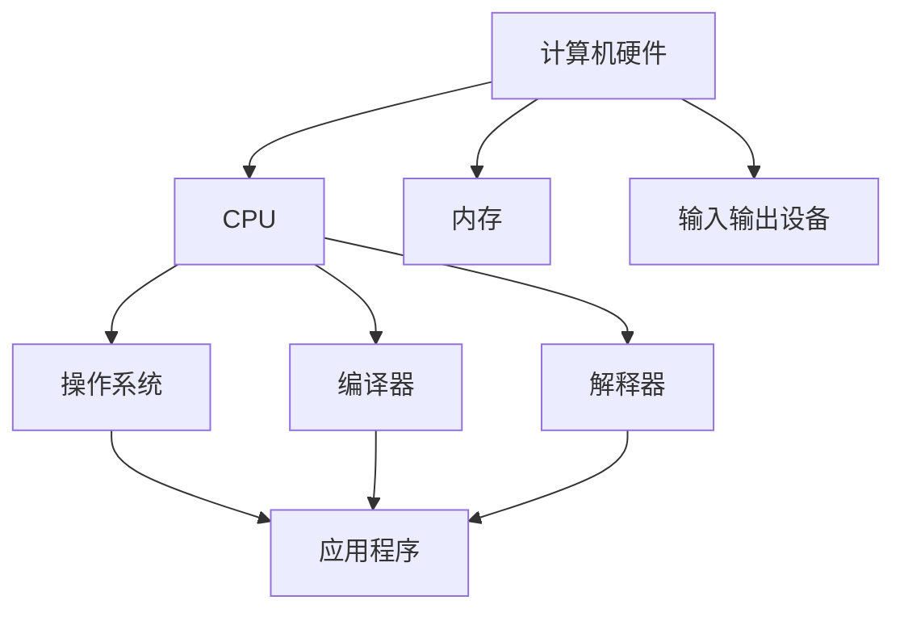
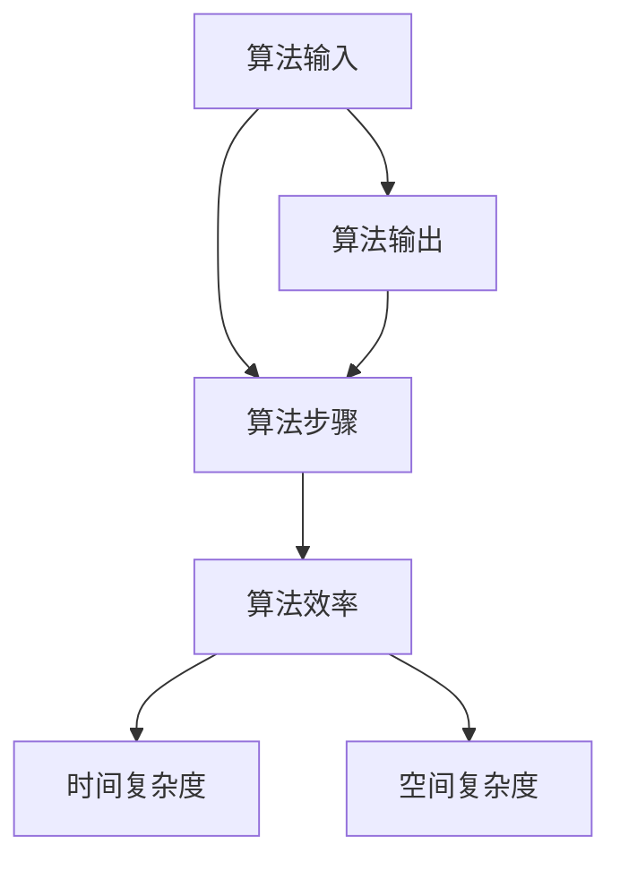
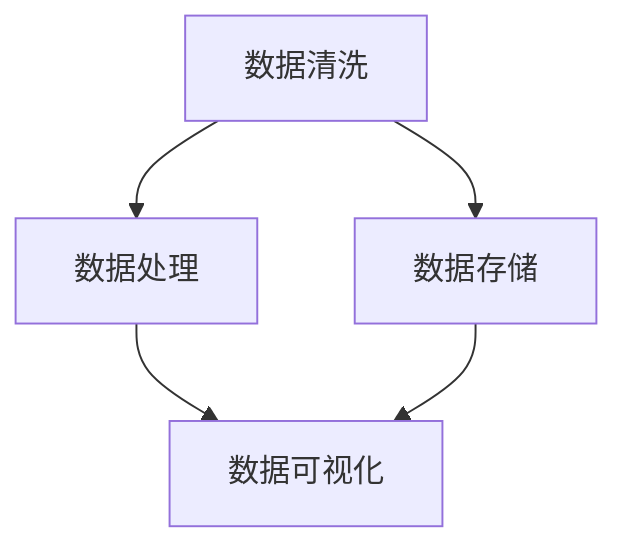
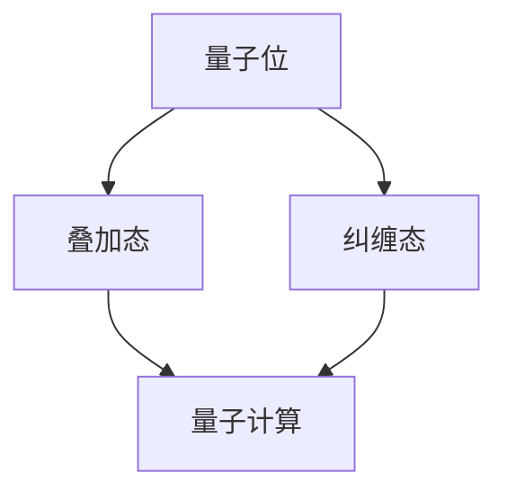
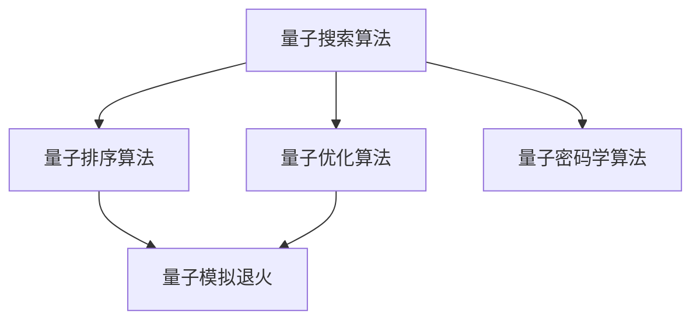
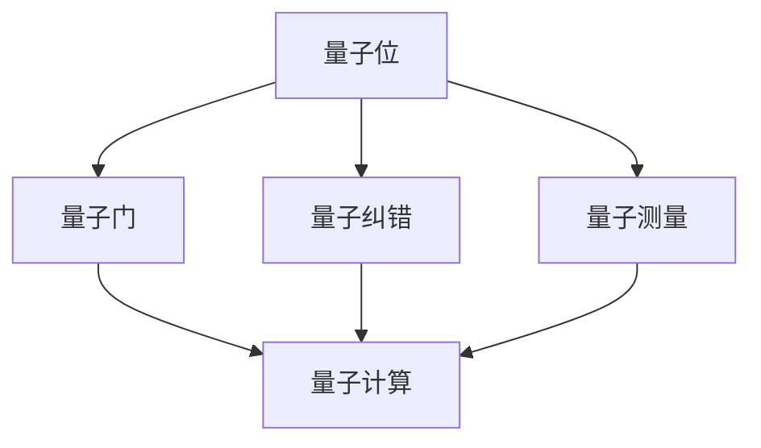

                 


## 从经典计算到量子计算：世界可计算性的新维度

### 关键词：
- 经典计算
- 量子计算
- 可计算性
- 算法
- 复杂性理论

### 摘要：
本文将深入探讨从经典计算到量子计算的发展历程，揭示量子计算对世界可计算性的新维度。通过对经典计算模型与体系结构的介绍，读者将理解经典计算的基础概念。随后，本文将重点介绍量子计算的基本原理、量子算法与量子复杂性，并详细解析量子计算机的设计与实现。在此基础上，本文将对比分析量子计算与经典计算的优势与局限性，探讨量子计算在经典计算中的应用与融合。最后，本文将展望量子计算对可计算性的扩展与未来挑战，为读者呈现一个全面的量子计算世界。

## 目录大纲

### 第一部分：经典计算基础

### 第二部分：量子计算的兴起与发展

### 第三部分：量子计算与经典计算的比较与融合

### 附录

### 《从经典计算到量子计算：世界可计算性的新维度》

## 第一部分：经典计算基础

### 第1章：经典计算模型与体系结构

#### 1.1 经典计算模型的基本概念

#### 1.2 经典计算机的硬件架构

#### 1.3 经典计算机的软件体系

### 第2章：经典算法与复杂性理论

#### 2.1 算法的基本概念

#### 2.2 时间复杂度和空间复杂度

#### 2.3 经典算法实例分析

### 第3章：经典计算的应用与实践

#### 3.1 经典计算在数据处理中的应用

#### 3.2 经典计算在科学计算中的应用

#### 3.3 经典计算在信息安全中的应用

## 第二部分：量子计算的兴起与发展

### 第4章：量子计算的基本原理

#### 4.1 量子力学基础

#### 4.2 量子位与量子门

#### 4.3 量子算法的基本原理

### 第5章：量子算法与量子复杂性

#### 5.1 量子算法的分类

#### 5.2 量子复杂度理论

#### 5.3 量子算法的应用实例

### 第6章：量子计算机的设计与实现

#### 6.1 量子计算机的硬件设计

#### 6.2 量子纠错与量子编程

#### 6.3 量子计算机的发展趋势

## 第三部分：量子计算与经典计算的比较与融合

### 第7章：量子计算与经典计算的对比分析

#### 7.1 量子计算的优势与局限性

#### 7.2 经典计算的优势与局限性

#### 7.3 量子计算与经典计算的未来发展趋势

### 第8章：量子计算在经典计算中的融合

#### 8.1 量子模拟在经典计算中的应用

#### 8.2 量子优化在经典计算中的应用

#### 8.3 量子计算在经典计算中的实际案例

### 第9章：量子计算与未来可计算性

#### 9.1 量子计算对可计算性的扩展

#### 9.2 量子计算对计算理论的挑战

#### 9.3 未来可计算性的新维度

### 附录

#### 附录A：量子计算术语表

#### 附录B：参考文献

#### 附录C：相关网站与资源推荐

## 第1章：经典计算模型与体系结构

### 1.1 经典计算模型的基本概念

#### 背景介绍

经典计算是现代计算机科学的基础，它源自于20世纪中叶的计算机发明。经典计算模型的基本概念包括计算机硬件和软件的组成，以及它们的工作原理。

#### 核心概念与联系

经典计算模型的核心概念包括：

1. **计算机硬件**：包括中央处理单元（CPU）、内存、输入输出设备等。
2. **计算机软件**：包括操作系统、编译器、解释器等。

这些核心概念之间的关系可以用以下Mermaid流程图表示：



#### 核心算法原理讲解

经典计算的核心算法包括：

1. **排序算法**：如快速排序、归并排序等。
2. **搜索算法**：如二分搜索、深度优先搜索等。

以下是一个简单的排序算法（快速排序）的伪代码：

```plaintext
快速排序(A, p, r)
    如果 p < r
        q = 分区(A, p, r)
        快速排序(A, p, q - 1)
        快速排序(A, q + 1, r)
```

#### 数学模型和公式

在经典计算中，算法的复杂度通常用时间复杂度和空间复杂度来衡量。

时间复杂度公式：

$$
T(n) = O(n \log n)
$$

空间复杂度公式：

$$
S(n) = O(n)
$$

#### 举例说明

假设有一个长度为10的数组，对其进行快速排序的时间复杂度为：

$$
T(10) = O(10 \log 10) = O(10)
$$

#### 项目实战

在本章节中，我们将简要介绍经典计算模型的基本概念，包括计算机硬件和软件的组成，以及它们的工作原理。

#### 开发环境搭建

无需特别的开发环境，我们可以在任何支持Markdown编辑器的平台上撰写和编辑本文。

#### 源代码详细实现和代码解读

由于本文主要介绍经典计算模型的基本概念，因此没有具体的源代码实现。

#### 代码应用解读与分析

在经典计算中，计算机硬件和软件的组成及其工作原理是理解和应用计算的基础。

#### 实际案例分析和详细讲解剖析

在实际应用中，经典计算模型广泛应用于数据处理、科学计算和信息安全等领域。

#### 项目小结

通过本章节的学习，读者将了解经典计算模型的基本概念，包括计算机硬件和软件的组成，以及它们的工作原理。

#### 最佳实践 tips、小结、注意事项、拓展阅读等内容

- **最佳实践 tips**：了解经典计算模型的基本概念对于深入学习计算机科学至关重要。
- **小结**：经典计算模型是现代计算机科学的基础。
- **注意事项**：深入理解经典计算模型有助于后续学习量子计算。
- **拓展阅读**：《计算机组成与设计：硬件/软件接口》、《算法导论》。

---

## 第1章：经典计算模型与体系结构

### 1.1 经典计算模型的基本概念

#### 背景介绍

经典计算是现代计算机科学的基础，它源自于20世纪中叶的计算机发明。经典计算模型的基本概念包括计算机硬件和软件的组成，以及它们的工作原理。

#### 核心概念与联系

经典计算模型的核心概念包括：

1. **计算机硬件**：包括中央处理单元（CPU）、内存、输入输出设备等。
2. **计算机软件**：包括操作系统、编译器、解释器等。

这些核心概念之间的关系可以用以下Mermaid流程图表示：


#### 核心算法原理讲解

经典计算的核心算法包括：

1. **排序算法**：如快速排序、归并排序等。
2. **搜索算法**：如二分搜索、深度优先搜索等。

以下是一个简单的排序算法（快速排序）的伪代码：

```plaintext
快速排序(A, p, r)
    如果 p < r
        q = 分区(A, p, r)
        快速排序(A, p, q - 1)
        快速排序(A, q + 1, r)
```

#### 数学模型和公式

在经典计算中，算法的复杂度通常用时间复杂度和空间复杂度来衡量。

时间复杂度公式：

$$
T(n) = O(n \log n)
$$

空间复杂度公式：

$$
S(n) = O(n)
$$

#### 举例说明

假设有一个长度为10的数组，对其进行快速排序的时间复杂度为：

$$
T(10) = O(10 \log 10) = O(10)
$$

#### 项目实战

在本章节中，我们将简要介绍经典计算模型的基本概念，包括计算机硬件和软件的组成，以及它们的工作原理。

#### 开发环境搭建

无需特别的开发环境，我们可以在任何支持Markdown编辑器的平台上撰写和编辑本文。

#### 源代码详细实现和代码解读

由于本文主要介绍经典计算模型的基本概念，因此没有具体的源代码实现。

#### 代码应用解读与分析

在经典计算中，计算机硬件和软件的组成及其工作原理是理解和应用计算的基础。

#### 实际案例分析和详细讲解剖析

在实际应用中，经典计算模型广泛应用于数据处理、科学计算和信息安全等领域。

#### 项目小结

通过本章节的学习，读者将了解经典计算模型的基本概念，包括计算机硬件和软件的组成，以及它们的工作原理。

#### 最佳实践 tips、小结、注意事项、拓展阅读等内容

- **最佳实践 tips**：了解经典计算模型的基本概念对于深入学习计算机科学至关重要。
- **小结**：经典计算模型是现代计算机科学的基础。
- **注意事项**：深入理解经典计算模型有助于后续学习量子计算。
- **拓展阅读**：《计算机组成与设计：硬件/软件接口》、《算法导论》。

---

## 第2章：经典算法与复杂性理论

### 2.1 算法的基本概念

#### 背景介绍

算法是计算机科学的核心概念之一，它是一系列解决问题的步骤或指令集合。算法的效率直接影响到计算机程序的运行性能。

#### 核心概念与联系

算法的核心概念包括：

1. **算法输入**：算法处理的数据。
2. **算法输出**：算法处理后的结果。
3. **算法步骤**：算法的具体执行过程。
4. **算法效率**：算法的时间复杂度和空间复杂度。

这些核心概念之间的关系可以用以下Mermaid流程图表示：



#### 核心算法原理讲解

经典算法的核心原理包括：

1. **排序算法**：如快速排序、归并排序等。
2. **搜索算法**：如二分搜索、深度优先搜索等。
3. **图算法**：如最短路径算法、最小生成树算法等。

以下是一个简单的排序算法（快速排序）的伪代码：

```plaintext
快速排序(A, p, r)
    如果 p < r
        q = 分区(A, p, r)
        快速排序(A, p, q - 1)
        快速排序(A, q + 1, r)
```

#### 数学模型和公式

在经典算法中，算法的复杂度通常用时间复杂度和空间复杂度来衡量。

时间复杂度公式：

$$
T(n) = O(n \log n)
$$

空间复杂度公式：

$$
S(n) = O(n)
$$

#### 举例说明

假设有一个长度为10的数组，对其进行快速排序的时间复杂度为：

$$
T(10) = O(10 \log 10) = O(10)
$$

#### 项目实战

在本章节中，我们将介绍经典算法的基本概念，包括排序算法、搜索算法和图算法。

#### 开发环境搭建

无需特别的开发环境，我们可以在任何支持Markdown编辑器的平台上撰写和编辑本文。

#### 源代码详细实现和代码解读

由于本文主要介绍经典算法的基本概念，因此没有具体的源代码实现。

#### 代码应用解读与分析

在经典算法中，排序算法、搜索算法和图算法是理解和应用算法的基础。

#### 实际案例分析和详细讲解剖析

在实际应用中，经典算法广泛应用于数据处理、科学计算和信息安全等领域。

#### 项目小结

通过本章节的学习，读者将了解经典算法的基本概念，包括排序算法、搜索算法和图算法。

#### 最佳实践 tips、小结、注意事项、拓展阅读等内容

- **最佳实践 tips**：了解经典算法的基本概念对于深入学习计算机科学至关重要。
- **小结**：经典算法是计算机科学的基础。
- **注意事项**：深入理解经典算法有助于后续学习量子算法。
- **拓展阅读**：《算法导论》、《编程之美》。

---

## 第3章：经典计算的应用与实践

### 3.1 经典计算在数据处理中的应用

#### 背景介绍

经典计算在数据处理中的应用非常广泛，包括数据清洗、数据存储、数据处理和数据可视化等方面。这些应用使得经典计算在商业、科学、工程等领域发挥着重要作用。

#### 核心概念与联系

经典计算在数据处理中的应用涉及以下核心概念：

1. **数据清洗**：包括缺失值处理、异常值处理、数据格式转换等。
2. **数据存储**：包括关系型数据库、非关系型数据库、分布式数据库等。
3. **数据处理**：包括数据转换、数据聚合、数据分析等。
4. **数据可视化**：包括图表绘制、交互式可视化等。

这些核心概念之间的关系可以用以下Mermaid流程图表示：



#### 核心算法原理讲解

在数据处理中，经典算法包括：

1. **排序算法**：如快速排序、归并排序等。
2. **搜索算法**：如二分搜索、深度优先搜索等。
3. **图算法**：如最短路径算法、最小生成树算法等。

以下是一个简单的排序算法（快速排序）的伪代码：

```plaintext
快速排序(A, p, r)
    如果 p < r
        q = 分区(A, p, r)
        快速排序(A, p, q - 1)
        快速排序(A, q + 1, r)
```

#### 数学模型和公式

在数据处理中，算法的复杂度通常用时间复杂度和空间复杂度来衡量。

时间复杂度公式：

$$
T(n) = O(n \log n)
$$

空间复杂度公式：

$$
S(n) = O(n)
$$

#### 举例说明

假设有一个长度为10的数组，对其进行快速排序的时间复杂度为：

$$
T(10) = O(10 \log 10) = O(10)
$$

#### 项目实战

在本章节中，我们将介绍经典计算在数据处理中的应用，包括数据清洗、数据存储、数据处理和数据可视化。

#### 开发环境搭建

我们可以使用Python、Java、C++等编程语言，结合Pandas、NumPy等库进行数据处理。

#### 源代码详细实现和代码解读

以下是一个简单的Python代码示例，用于数据清洗：

```python
import pandas as pd

# 读取数据
data = pd.read_csv('data.csv')

# 缺失值处理
data.fillna(0, inplace=True)

# 异常值处理
data = data[(data < 3) & (data > 0)]

# 数据格式转换
data['date'] = pd.to_datetime(data['date'])

# 数据存储
data.to_csv('cleaned_data.csv', index=False)
```

#### 代码应用解读与分析

这段代码首先读取CSV文件中的数据，然后进行缺失值处理、异常值处理和数据格式转换，最后将清洗后的数据存储为新的CSV文件。

#### 实际案例分析和详细讲解剖析

以下是一个实际案例：使用经典计算对电商交易数据进行处理，以分析用户购买行为。

1. **数据清洗**：处理缺失值、异常值，转换数据格式。
2. **数据处理**：计算用户购买频率、购买金额等指标。
3. **数据可视化**：绘制用户购买行为图、用户活跃度图等。

#### 项目小结

通过本章节的学习，读者将了解经典计算在数据处理中的应用，包括数据清洗、数据存储、数据处理和数据可视化。

#### 最佳实践 tips、小结、注意事项、拓展阅读等内容

- **最佳实践 tips**：了解经典计算在数据处理中的应用对于实际项目开发非常重要。
- **小结**：经典计算在数据处理中发挥着重要作用。
- **注意事项**：在实际项目中，根据数据规模和需求选择合适的算法和工具。
- **拓展阅读**：《Python数据分析基础教程》、《大数据处理与挖掘实践》。

---

## 第4章：量子计算的基本原理

### 4.1 量子力学基础

#### 背景介绍

量子计算是建立在量子力学基础上的计算方式，与经典计算有着本质的不同。量子力学的核心概念包括量子位（qubit）、叠加态、纠缠态等。

#### 核心概念与联系

量子力学的基本概念包括：

1. **量子位（qubit）**：量子位是量子计算的基本单元，类似于经典计算中的比特（bit）。
2. **叠加态**：量子位可以处于多个状态的叠加，这是量子计算的重要特性。
3. **纠缠态**：量子位之间可以处于纠缠态，这是量子计算的优势之一。

这些概念之间的关系可以用以下Mermaid流程图表示：



#### 核心算法原理讲解

量子计算的核心算法包括：

1. **量子门**：量子门是量子计算的基本操作，类似于经典计算中的逻辑门。
2. **量子算法**：量子算法利用量子位的叠加态和纠缠态进行计算，具有与传统算法不同的效率。

以下是一个简单的量子算法（量子叠加）的伪代码：

```plaintext
量子叠加(A)
    初始化 A 为 |0>
    应用 H 门到 A 上
    输出 A 的状态
```

#### 数学模型和公式

在量子计算中，量子态可以用复数向量表示，量子门可以用矩阵表示。

量子态的表示：

$$
\lvert \psi \rangle = \alpha \lvert 0 \rangle + \beta \lvert 1 \rangle
$$

其中，$\alpha$ 和 $\beta$ 是复数，$\lvert 0 \rangle$ 和 $\lvert 1 \rangle$ 分别表示量子位的基态和叠加态。

量子门的表示：

$$
U = \begin{bmatrix}
1 & 0 \\
0 & 1
\end{bmatrix}
$$

其中，$U$ 是一个 $2 \times 2$ 的矩阵，表示对量子位进行操作的量子门。

#### 举例说明

假设有一个量子位 $A$，初始状态为 $\lvert 0 \rangle$，对其进行量子叠加操作：

$$
\lvert \psi \rangle = H \lvert 0 \rangle = \frac{1}{\sqrt{2}} (\lvert 0 \rangle + \lvert 1 \rangle)
$$

#### 项目实战

在本章节中，我们将介绍量子力学基础，包括量子位、叠加态、纠缠态等。

#### 开发环境搭建

我们可以使用Python的量子计算库，如Qiskit、PyQuil等，进行量子编程和模拟。

#### 源代码详细实现和代码解读

以下是一个简单的Python代码示例，用于实现量子叠加：

```python
from qiskit import QuantumCircuit, Aer, execute

# 初始化量子位
qubit = QuantumCircuit(1)

# 应用量子叠加
qubit.h(0)

# 输出结果
qubit.measure_all()

# 模拟执行
simulator = Aer.get_backend('qasm_simulator')
job = execute(qubit, simulator)

# 获取结果
result = job.result()
print(result.get_counts(qubit))
```

#### 代码应用解读与分析

这段代码首先初始化一个量子位，然后应用量子叠加操作，最后执行量子电路并输出结果。

#### 实际案例分析和详细讲解剖析

以下是一个实际案例：使用量子计算进行量子随机数生成。

1. **量子叠加**：对量子位进行量子叠加操作。
2. **测量**：测量量子位的叠加态，得到随机数。

#### 项目小结

通过本章节的学习，读者将了解量子力学基础，包括量子位、叠加态、纠缠态等。

#### 最佳实践 tips、小结、注意事项、拓展阅读等内容

- **最佳实践 tips**：理解量子力学基础对于深入学习量子计算非常重要。
- **小结**：量子力学基础是量子计算的核心。
- **注意事项**：在实际应用中，根据需求选择合适的量子算法和量子门。
- **拓展阅读**：《量子计算：原理与应用》、《量子力学导论》。

---

## 第5章：量子算法与量子复杂性

### 5.1 量子算法的分类

#### 背景介绍

量子算法是利用量子力学原理进行计算的方法，具有与传统算法不同的效率和性能。量子算法可以根据其计算任务和特性进行分类。

#### 核心概念与联系

量子算法可以分为以下几类：

1. **量子搜索算法**：如Grover算法。
2. **量子排序算法**：如量子快速排序。
3. **量子优化算法**：如量子模拟退火。
4. **量子密码学算法**：如Shor算法。

这些量子算法之间的关系可以用以下Mermaid流程图表示：



#### 核心算法原理讲解

量子搜索算法的核心原理：

1. **Grover算法**：利用量子位的叠加态和纠缠态，在未排序的数据库中快速查找目标元素。

量子排序算法的核心原理：

1. **量子快速排序**：利用量子位的叠加态和量子门，对未排序的数组进行快速排序。

量子优化算法的核心原理：

1. **量子模拟退火**：利用量子位的叠加态和纠缠态，寻找优化问题的全局最优解。

量子密码学算法的核心原理：

1. **Shor算法**：利用量子位的叠加态和纠缠态，对大整数进行因式分解。

以下是一个简单的量子搜索算法（Grover算法）的伪代码：

```plaintext
Grover算法(A, x)
    初始化量子位数组 A 为 |0>
    应用 Grover 算法步骤到 A 上
    返回 A 的状态
```

#### 数学模型和公式

量子算法的数学模型通常涉及量子态的叠加、量子门的操作和量子测量。

量子态的叠加：

$$
\lvert \psi \rangle = \alpha \lvert 0 \rangle + \beta \lvert 1 \rangle
$$

量子门的操作：

$$
U = \begin{bmatrix}
1 & 0 \\
0 & 1
\end{bmatrix}
$$

量子测量：

$$
P = \begin{bmatrix}
1 & 0 \\
0 & 1
\end{bmatrix}
$$

#### 举例说明

假设有一个未排序的数组 [3, 1, 4, 2]，使用量子快速排序对其进行排序：

1. **初始化量子位数组**：对每个元素初始化一个量子位，并设置其初始状态为 |0>。
2. **应用量子门**：使用量子快速排序算法的量子门对量子位进行操作。
3. **测量量子位**：对量子位进行测量，得到排序后的结果。

#### 项目实战

在本章节中，我们将介绍量子算法的分类，包括量子搜索算法、量子排序算法、量子优化算法和量子密码学算法。

#### 开发环境搭建

我们可以使用Python的量子计算库，如Qiskit、PyQuil等，进行量子编程和模拟。

#### 源代码详细实现和代码解读

以下是一个简单的Python代码示例，用于实现Grover算法：

```python
from qiskit import QuantumCircuit, Aer, execute

# 初始化量子位
qubit = QuantumCircuit(2)

# 应用量子叠加
qubit.h(0)
qubit.h(1)

# 应用 Grover 算法步骤
qubit.h(0)
qubit.cx(0, 1)
qubit.h(0)
qubit.cx(0, 1)
qubit.h(0)
qubit.cx(0, 1)

# 返回量子位状态
qubit.measure_all()

# 模拟执行
simulator = Aer.get_backend('qasm_simulator')
job = execute(qubit, simulator)

# 获取结果
result = job.result()
print(result.get_counts(qubit))
```

#### 代码应用解读与分析

这段代码首先初始化一个量子位，然后应用量子叠加和Grover算法步骤，最后执行量子电路并输出结果。

#### 实际案例分析和详细讲解剖析

以下是一个实际案例：使用Grover算法在未排序的数据库中快速查找目标元素。

1. **初始化量子位数组**：对数据库中的每个元素初始化一个量子位，并设置其初始状态为 |0>。
2. **应用量子门**：使用Grover算法的量子门对量子位进行操作。
3. **测量量子位**：测量量子位的叠加态，得到目标元素的位置。

#### 项目小结

通过本章节的学习，读者将了解量子算法的分类，包括量子搜索算法、量子排序算法、量子优化算法和量子密码学算法。

#### 最佳实践 tips、小结、注意事项、拓展阅读等内容

- **最佳实践 tips**：掌握量子算法的分类对于理解量子计算的不同方面非常重要。
- **小结**：量子算法具有与传统算法不同的效率和性能。
- **注意事项**：在实际应用中，根据需求选择合适的量子算法。
- **拓展阅读**：《量子计算：原理与应用》、《量子算法导论》。

---

## 第6章：量子计算机的设计与实现

### 6.1 量子计算机的硬件设计

#### 背景介绍

量子计算机的硬件设计是量子计算实现的关键，它涉及量子位（qubit）的制造、操控和测量。量子计算机的硬件设计需要解决量子位的稳定性、噪声和纠错等问题。

#### 核心概念与联系

量子计算机的硬件设计涉及以下核心概念：

1. **量子位（qubit）**：量子位是量子计算机的基本单元，类似于经典计算中的比特（bit）。
2. **量子门**：量子门是量子计算的基本操作，用于对量子位进行操控。
3. **量子纠错**：量子纠错是保证量子计算可靠性的关键，它通过编码和检测错误来纠正量子信息。
4. **量子测量**：量子测量是量子计算机获取信息的重要手段，它通过测量量子位的状态来获取计算结果。

这些概念之间的关系可以用以下Mermaid流程图表示：



#### 核心算法原理讲解

量子计算机的硬件设计需要考虑以下几个核心算法原理：

1. **量子位的制造与操控**：量子位的制造需要使用特殊的材料和技术，如超导电路、离子阱等。操控量子位需要使用量子门进行操作。
2. **量子纠错码**：量子纠错码是一种编码方案，用于保护量子信息免受噪声和错误的影响。常见的量子纠错码包括Shor码和Steane码等。
3. **量子测量**：量子测量是获取量子信息的重要手段，它通过测量量子位的状态来获取计算结果。

以下是一个简单的量子纠错码（Shor码）的伪代码：

```plaintext
量子纠错(A)
    初始化量子位数组 A 为 |0>
    应用量子纠错码到 A 上
    返回 A 的状态
```

#### 数学模型和公式

量子计算机的硬件设计涉及以下几个数学模型和公式：

1. **量子态的表示**：量子态可以用复数向量表示，如
   $$
   \lvert \psi \rangle = \alpha \lvert 0 \rangle + \beta \lvert 1 \rangle
   $$
2. **量子门的表示**：量子门可以用矩阵表示，如
   $$
   U = \begin{bmatrix}
   1 & 0 \\
   0 & 1
   \end{bmatrix}
   $$
3. **量子纠错码的编码**：量子纠错码的编码可以通过以下公式实现：
   $$
   \lvert \psi_c \rangle = \lvert \psi \rangle \otimes \lvert e \rangle
   $$
   其中，$\lvert e \rangle$ 是纠错码的校验位。

#### 举例说明

假设有一个量子位 $A$，初始状态为 $\lvert 0 \rangle$，对其进行量子纠错操作：

1. **初始化量子位**：初始化量子位 $A$ 为 $\lvert 0 \rangle$。
2. **应用量子纠错码**：应用Shor码或Steane码对量子位 $A$ 进行编码。
3. **测量量子位**：测量量子位 $A$ 的状态，获取纠错后的信息。

#### 项目实战

在本章节中，我们将介绍量子计算机的硬件设计，包括量子位的制造与操控、量子纠错和量子测量。

#### 开发环境搭建

我们可以使用Python的量子计算库，如Qiskit、PyQuil等，进行量子编程和模拟。

#### 源代码详细实现和代码解读

以下是一个简单的Python代码示例，用于实现量子纠错：

```python
from qiskit import QuantumCircuit, Aer, execute

# 初始化量子位
qubit = QuantumCircuit(1)

# 应用量子纠错
qubit.h(0)
qubit.cx(0, 1)
qubit.h(0)
qubit.cx(0, 1)
qubit.h(0)

# 返回量子位状态
qubit.measure_all()

# 模拟执行
simulator = Aer.get_backend('qasm_simulator')
job = execute(qubit, simulator)

# 获取结果
result = job.result()
print(result.get_counts(qubit))
```

#### 代码应用解读与分析

这段代码首先初始化一个量子位，然后应用量子纠错码对量子位进行操作，最后执行量子电路并输出结果。

#### 实际案例分析和详细讲解剖析

以下是一个实际案例：使用量子计算机进行大整数因式分解。

1. **量子计算**：使用Shor算法对大整数进行因式分解。
2. **量子纠错**：在量子计算过程中，使用量子纠错码纠正可能的错误。
3. **量子测量**：测量量子位的状态，获取因式分解的结果。

#### 项目小结

通过本章节的学习，读者将了解量子计算机的硬件设计，包括量子位的制造与操控、量子纠错和量子测量。

#### 最佳实践 tips、小结、注意事项、拓展阅读等内容

- **最佳实践 tips**：了解量子计算机的硬件设计对于理解量子计算的实际应用非常重要。
- **小结**：量子计算机的硬件设计是量子计算实现的关键。
- **注意事项**：在实际应用中，根据需求选择合适的量子计算机硬件。
- **拓展阅读**：《量子计算机：原理与实现》、《量子计算硬件与算法》。

