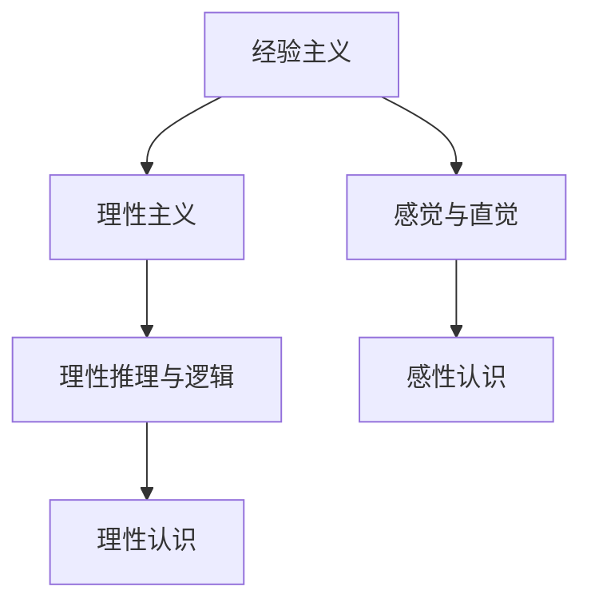
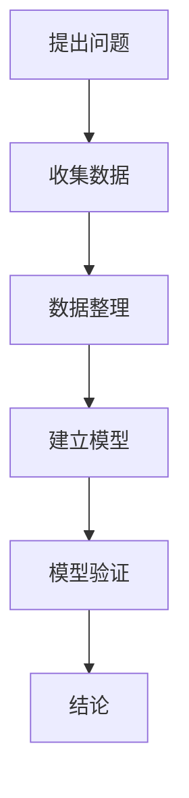

                 

### 文章标题

“从经验主义到理性主义：认识论的演变”

### 关键词

认识论、经验主义、理性主义、知识论、哲学、演变

### 摘要

本文深入探讨了从经验主义到理性主义的认识论演变过程。通过对认识论基础、经验主义认识论、理性主义认识论以及认识论的历史演变和综合应用的详细分析，揭示了认识论在科学、哲学和现代社会中的应用，以及其在人工智能领域的实际应用。文章结构紧凑，逻辑清晰，旨在为读者提供一个全面而深入的认识论概述，帮助理解这一哲学领域的重要议题。

### 第一部分：认识论基础

#### 第1章：认识论概述

##### 1.1 认识论的定义与发展历程

**认识论**（Epistemology）是哲学中的一个重要分支，主要探讨知识的本质、起源、范围和局限性。认识论的发展历程可以追溯到古希腊时期，经过中世纪、近代哲学和现代哲学的演变，逐渐形成了丰富的理论体系。

**1.1.1 认识论的起源**

认识论的起源可以追溯到古希腊哲学，特别是苏格拉底和柏拉图的哲学思想。苏格拉底主张通过提问和对话来寻找真理，柏拉图则提出了理念论，认为真实存在的是抽象的理念，而非具体的物体。亚里士多德则结合了经验论和理性主义，提出了形式-质料说，为认识论奠定了基础。

**1.1.2 经验主义与理性主义**

经验主义（Empiricism）强调知识来自于经验，认为通过感官和实验可以获取知识。理性主义（Rationalism）则主张知识主要依赖于理性推理和直觉，认为某些真理是先天固有的。这两种立场在哲学史上形成了长期的争论。

**1.1.3 现代认识论的发展**

现代认识论在笛卡尔的怀疑论和康德的批判哲学中得到了进一步发展。笛卡尔提出了“我思故我在”的哲学信念，强调理性和自我意识的确定性。康德则通过“先验范畴”和“纯粹理性批判”构建了一个更为系统化的认识论框架。

##### 1.2 经验主义认识论

经验主义认识论的核心观点是，知识来源于经验。经验主义者认为，人的认识过程是通过感官收集信息，然后在大脑中进行处理和解释的过程。

**2.1 经验主义的基本观点**

- **经验与知识**：经验主义者认为，知识是通过感官经验获得的，我们的感知是我们认识世界的基础。
- **感觉与直觉**：经验主义者强调感觉和直觉在知识获取中的重要性，认为这些是我们认知世界的重要途径。
- **经验主义的主要代表人物**：洛克（John Locke）和休谟（David Hume）是经验主义认识论的主要代表人物。洛克提出了经验论的基本原则，强调感知和经验的重要性。休谟则对经验主义进行了深入的分析，提出了著名的“知识怀疑论”。

**2.2 经验主义的哲学挑战**

尽管经验主义在知识论中占有重要地位，但它也面临着一些哲学挑战。

- **经验的局限性**：经验主义者承认，我们的经验是有限的，不能涵盖所有可能的情境。
- **知识的客观性**：经验主义者如何确保知识的客观性和普遍性，是一个长期争论的问题。

##### 2.3 理性主义认识论

理性主义认识论主张，知识主要是通过理性推理和直觉获得的。理性主义者认为，我们的思维具有独立于经验的能力，可以通过逻辑推理和理性思考来获得知识。

**3.1 理性主义的基本观点**

- **理性与知识**：理性主义者认为，理性是我们认识世界的重要工具，通过理性推理，我们可以获得可靠的知识。
- **智慧与推理**：理性主义者强调智慧在知识获取中的作用，认为推理和思考是获取知识的关键。
- **理性主义的主要代表人物**：笛卡尔（René Descartes）和莱布尼茨（Gottfried Wilhelm Leibniz）是理性主义认识论的主要代表人物。笛卡尔提出了“我思故我在”的哲学原则，强调了理性和自我意识的确定性。莱布尼茨则通过“理性主义数学”和“推理方法”为理性主义提供了有力的论证。

**3.2 理性主义的哲学论证**

理性主义通过一系列哲学论证来支持其观点。

- **存在论论证**：理性主义者认为，通过理性推理，我们可以确定某些基本的存在，如数学对象和逻辑原理。
- **知识论论证**：理性主义者认为，通过理性推理，我们可以获得某些确定无疑的知识，如数学和逻辑的基本原理。
- **真理论证**：理性主义者认为，通过理性推理，我们可以确定某些真理，如数学和逻辑的公理和定理。

#### 第2章：经验主义认识论

##### 2.1 经验主义的基本观点

经验主义认识论的核心观点是，知识来自于经验。经验主义者认为，人的认识过程是通过感官收集信息，然后在大脑中进行处理和解释的过程。

**经验与知识**

经验主义者认为，知识是通过感官经验获得的，我们的感知是我们认识世界的基础。经验是知识的源泉，没有经验就没有知识。

- **直接经验**：直接经验是指通过感官直接感知到的事物，如视觉、听觉、触觉等。
- **间接经验**：间接经验是指通过他人的描述或文献资料了解的事物。

**感觉与直觉**

经验主义者强调感觉和直觉在知识获取中的重要性，认为这些是我们认知世界的重要途径。

- **感觉**：感觉是指感官对事物的直接感知，如我们看到颜色、听到声音等。
- **直觉**：直觉是指我们在没有明显逻辑推理的情况下，迅速形成的对事物的判断。

**经验主义的主要代表人物**

洛克（John Locke）和休谟（David Hume）是经验主义认识论的主要代表人物。

- **洛克**：洛克是英国经验主义的奠基人，他提出了“白板说”，认为人的心灵像一张白纸，通过感官经验来填写内容。
- **休谟**：休谟对经验主义进行了深入的探讨，提出了“知识怀疑论”，认为我们无法确定知识的确定性。

##### 2.2 经验主义的哲学挑战

尽管经验主义在知识论中占有重要地位，但它也面临着一些哲学挑战。

**经验的局限性**

经验主义者承认，我们的经验是有限的，不能涵盖所有可能的情境。这意味着，我们的知识是有局限的，不能通过经验来完全理解世界。

- **实证主义的局限**：实证主义者认为，只有可以通过感官经验验证的事实才是真实的。然而，有些事实是无法直接感知的，如量子力学中的某些现象。
- **认知局限**：我们的认知能力有限，无法同时处理所有信息。这意味着，我们的经验是有限的，不能涵盖所有可能的情境。

**知识的客观性**

经验主义者如何确保知识的客观性和普遍性，是一个长期争论的问题。

- **主观性**：经验主义者认为，知识是主观的，因为它是基于个人的感知和经验。然而，这引发了一个问题：如果知识是主观的，那么如何保证不同人的知识是相同的？
- **共识问题**：经验主义者认为，通过共识可以确定知识的客观性。然而，共识本身是基于个体的感知和经验，如何确保共识是客观的？

**2.3 理性主义认识论**

理性主义认识论主张，知识主要是通过理性推理和直觉获得的。理性主义者认为，我们的思维具有独立于经验的能力，可以通过逻辑推理和理性思考来获得知识。

**理性与知识**

理性主义者认为，理性是我们认识世界的重要工具，通过理性推理，我们可以获得可靠的知识。

- **理性推理**：理性推理是指通过逻辑规则和原则，从已知的前提出发，推导出新的结论。
- **理性思考**：理性思考是指我们运用逻辑和理性来分析问题、解决问题和做出决策。

**智慧与推理**

理性主义者强调智慧在知识获取中的作用，认为推理和思考是获取知识的关键。

- **智慧**：智慧是指我们运用理性来理解和解决问题的能力。
- **推理**：推理是指我们通过逻辑关系来推导出结论的能力。

**理性主义的主要代表人物**

笛卡尔（René Descartes）和莱布尼茨（Gottfried Wilhelm Leibniz）是理性主义认识论的主要代表人物。

- **笛卡尔**：笛卡尔是法国哲学家、数学家和科学家，他提出了“我思故我在”的哲学原则，强调了理性和自我意识的确定性。
- **莱布尼茨**：莱布尼茨是德国哲学家、数学家和逻辑学家，他通过“理性主义数学”和“推理方法”为理性主义提供了有力的论证。

**3.2 理性主义的哲学论证**

理性主义通过一系列哲学论证来支持其观点。

- **存在论论证**：理性主义者认为，通过理性推理，我们可以确定某些基本的存在，如数学对象和逻辑原理。
- **知识论论证**：理性主义者认为，通过理性推理，我们可以获得某些确定无疑的知识，如数学和逻辑的基本原理。
- **真理论证**：理性主义者认为，通过理性推理，我们可以确定某些真理，如数学和逻辑的公理和定理。

### 第二部分：认识论的历史演变

#### 第4章：古希腊时期的认识论

古希腊时期的认识论对后来的西方哲学产生了深远的影响。这一时期的重要哲学家包括柏拉图和亚里士多德，他们的思想为认识论的发展奠定了基础。

**4.1 柏拉图的认识论**

柏拉图（公元前427-347年）是西方哲学的奠基者之一，他的认识论思想被称为理念论。柏拉图认为，真实存在的是抽象的理念，而非具体的物体。

- **理念论**：柏拉图的理念论认为，现实世界只是理念世界的影子。理念世界是真实的存在，现实世界是理念世界的映射。
- **对立论**：柏拉图认为，现实世界是由两个对立面构成的，即存在与不存在、善与恶、美与丑等。这些对立面是理念世界的反映。

**4.2 亚里士多德的认知论**

亚里士多德（公元前384-322年）是柏拉图的弟子，他的认知论思想与柏拉图的理念论有所不同。亚里士多德认为，知识是通过经验和理性获得的。

- **经验论**：亚里士多德认为，知识来源于经验。我们的感官通过感知外部世界，然后将这些信息传递给大脑，大脑再对这些信息进行处理和解释。
- **形式-质料说**：亚里士多德认为，物体由形式和质料构成。形式是物体的本质，质料是物体存在的物质基础。知识和理解是通过把握物体的形式而获得的。

#### 第5章：中世纪的认识论

中世纪时期，基督教哲学家对认识论进行了深入的探讨，将古希腊哲学和基督教信仰相结合。这一时期的重要哲学家包括奥古斯丁和托马斯·阿奎那。

**5.1 奥古斯丁的认识论**

奥古斯丁（公元354-430年）是基督教哲学的重要代表人物，他的认识论思想被称为信仰论。

- **信仰论**：奥古斯丁认为，知识是通过信仰获得的。信仰是一种超越理性的认识，是通过与上帝的沟通而获得的。
- **启示论**：奥古斯丁认为，上帝通过启示来传达真理。启示是信仰的基础，是知识的重要来源。

**5.2 阿奎那的认识论**

托马斯·阿奎那（公元1225-1274年）是中世纪后期的重要哲学家，他的认识论思想被称为理性论。

- **理性论**：阿奎那认为，理性是我们认识世界的重要工具。理性通过推理和思考，可以帮助我们理解事物的本质。
- **信仰与理性的关系**：阿奎那认为，信仰和理性并不是对立的，而是相辅相成的。信仰为理性提供了基础，理性为信仰提供了论证。

#### 第6章：近代认识论

近代认识论的发展标志着从宗教哲学向世俗哲学的转变。这一时期的重要哲学家包括笛卡尔和胡塞尔。

**6.1 笛卡尔的怀疑论**

笛卡尔（公元1596-1650年）是近代哲学的奠基者之一，他的怀疑论思想对认识论产生了深远的影响。

- **哲学信仰**：笛卡尔提出了“我思故我在”的哲学原则，强调理性和自我意识的确定性。他认为，即使整个世界是虚假的，我们的思考本身也证明了我们的存在。
- **认知方法论**：笛卡尔主张通过怀疑一切来找到确凿无疑的真理。他认为，只有通过严谨的推理和思考，我们才能获得可靠的知识。

**6.2 胡塞尔的现象学**

胡塞尔（公元1859-1938年）是现代哲学的重要代表人物，他的现象学思想对认识论产生了重要影响。

- **现象学基本概念**：胡塞尔的现象学主张将意识作为研究的对象，认为意识是哲学研究的基础。他提出了“直观”、“本质直观”等概念，试图揭示意识的本质。
- **“生活世界”理论**：胡塞尔认为，意识是“生活世界”的一部分，生活世界是我们感知和理解世界的基础。他试图通过现象学方法，揭示生活世界的本质和结构。

#### 第7章：现代认识论

现代认识论在康德和黑格尔的思想中得到了进一步发展。康德的先验认识论和黑格尔的辩证法为认识论提供了新的视角。

**7.1 康德的先验认识论**

康德（公元1724-1804年）是现代哲学的重要代表人物，他的先验认识论为认识论奠定了基础。

- **先验范畴**：康德认为，我们的认识是通过先验范畴实现的。先验范畴是先于经验而存在的，是理解经验的基本框架。
- **真理观**：康德认为，真理是通过先验范畴与经验相结合而获得的。他认为，真理是客观的、普遍的和必然的。

**7.2 黑格尔的认识论**

黑格尔（公元1770-1831年）是德国哲学家，他的辩证法为认识论提供了新的解释。

- **辩证法**：黑格尔的辩证法认为，真理是通过矛盾的解决而获得的。他认为，真理是不断发展变化的，是通过矛盾和对立面的统一而实现的。
- **理性理念**：黑格尔认为，理性是宇宙的本质，真理是理性的体现。他认为，理性理念是发展的，是通过不断的自我实现和自我完善而实现的。

#### 第8章：当代认识论

当代认识论在女性主义认识论和解构主义认识论中得到了进一步发展。这些理论为认识论带来了新的视角和方法。

**8.1 女性主义认识论**

女性主义认识论是20世纪后期发展起来的哲学思潮，强调女性经验和知识的重要性。

- **核心观点**：女性主义认识论认为，女性的经验和知识被传统哲学所忽视。她们主张，女性的认识方式是独特的，应该被纳入认识论的研究。
- **影响**：女性主义认识论对认识论产生了重要影响，促进了性别平等和多元认识论的发展。

**8.2 解构主义认识论**

解构主义认识论是20世纪后期的重要哲学思潮，强调解构传统认识论的结构和基础。

- **基本理论**：解构主义认为，认识论的基础是语言和符号。他们主张，通过解构语言和符号，可以揭示传统认识论的局限性和虚假性。
- **影响**：解构主义认识论对当代哲学和文化产生了深远的影响，推动了后现代主义的发展。

### 第三部分：认识论的综合与应用

#### 第9章：认识论在科学中的应用

认识论在科学中的应用主要涉及科学知识的本质、科学方法以及科学理论的验证。

**9.1 科学的认识论基础**

科学作为一种知识体系，其认识论基础包括以下几个方面：

- **科学的本质**：科学是一种通过观察、实验和推理来发现和解释自然现象的知识体系。科学知识是基于证据的，通过可重复的实验和观察来验证。
- **科学方法**：科学方法是一种系统化的研究方法，包括观察、假设、实验、理论和验证等步骤。科学方法强调逻辑推理和实证证据的重要性。

**9.2 认识论在科学实践中的应用**

在科学实践中，认识论的应用体现在以下几个方面：

- **实验设计**：科学实验是科学方法的核心。实验设计需要遵循严格的逻辑和统计原则，以确保实验结果的可靠性和有效性。
- **理论验证**：科学理论是通过实验和观察来验证的。科学理论必须能够解释现有的实验结果，并能够预测新的实验结果。理论的验证是科学进步的重要动力。

**9.3 认识论与科学革命**

科学革命是科学认识论发展的重要里程碑。科学革命通常涉及到对旧有理论的挑战和取代，以及对新理论的验证和接受。

- **理论创新**：科学革命往往伴随着理论创新。新的理论提出新的解释和预测，挑战旧有理论的合理性。
- **实验验证**：科学革命中的新理论需要通过实验验证。实验结果支持新理论，从而推动科学进步。

#### 第10章：认识论在哲学中的应用

认识论在哲学中的应用主要体现在哲学问题的探讨和哲学方法的贡献。

**10.1 哲学问题与认识论的关系**

哲学问题与认识论密切相关。哲学问题往往涉及到知识的本质、来源和范围，这些正是认识论研究的内容。

- **知识论问题**：哲学中的知识论问题，如知识的客观性、知识的来源和知识的范围，是认识论研究的核心问题。
- **存在论问题**：哲学中的存在论问题，如存在的本质、存在的证明和存在的合理性，也与认识论密切相关。

**10.2 哲学对认识论方法的贡献**

哲学对认识论方法的贡献体现在以下几个方面：

- **逻辑方法**：哲学强调逻辑推理的重要性，通过逻辑方法来分析问题和解决问题。逻辑方法在认识论研究中具有重要意义，有助于确定知识的可靠性和合理性。
- **辩证法**：辩证法是哲学中的一种重要方法，强调通过矛盾和对立面的统一来理解事物的发展。辩证法在认识论研究中有助于揭示知识的本质和变化。

**10.3 认识论在哲学研究中的应用**

认识论在哲学研究中的应用体现在以下几个方面：

- **哲学论证**：哲学研究往往需要通过哲学论证来支持或反驳某种观点。认识论为哲学论证提供了方法和原则，有助于确定哲学观点的合理性和可靠性。
- **问题解决**：认识论为哲学问题提供了解决方案。通过认识论的分析和方法，哲学家可以探讨和解决哲学问题，推动哲学的发展。

#### 第11章：认识论与社会

认识论不仅涉及知识和哲学问题，还与社会的结构和功能密切相关。在现代社会中，认识论的应用体现在教育改革、科技创新和社会认知等方面。

**11.1 认识论与社会理论**

认识论与社会理论相互作用，影响社会的结构和功能。

- **社会认知论**：社会认知论研究社会中的认知过程和认知结构。通过认识论的方法，可以揭示社会认知的规律和机制。
- **社会构建论**：社会构建论认为，社会现象是通过社会互动和符号系统构建的。认识论为理解社会构建提供了理论基础。

**11.2 认识论在现代社会中的应用**

在现代社会中，认识论的应用体现在以下几个方面：

- **教育改革**：认识论为教育改革提供了理论基础。通过认识论的研究，可以探索新的教育方法和教育模式，提高教育质量。
- **科技创新**：认识论在科技创新中发挥着重要作用。通过认识论的方法，可以探索新的科学问题和科学方法，推动科技的进步。
- **社会认知**：认识论在社会认知中具有重要意义。通过认识论的研究，可以揭示社会认知的规律和机制，促进社会理解和沟通。

**11.3 认识论与社会影响**

认识论对社会产生深远的影响。通过认识论的研究，可以揭示社会中的认知结构和认知过程，促进社会的进步和发展。

- **知识传播**：认识论有助于知识的传播和共享。通过认识论的方法，可以更有效地传播和共享知识，推动社会的知识积累。
- **社会进步**：认识论为社会进步提供了理论支持。通过认识论的研究，可以揭示社会发展的规律和机制，推动社会的进步和发展。

### 附录

#### 附录A：认识论关键术语解释

**经验主义**

经验主义是一种认识论观点，认为知识来源于经验。经验主义者强调感官经验和直觉在知识获取中的重要性。

**理性主义**

理性主义是一种认识论观点，认为知识主要依赖于理性推理和直觉。理性主义者认为，我们的思维具有独立于经验的能力。

**先验认识论**

先验认识论是一种认识论观点，认为某些知识是先于经验的。先验认识论认为，我们的认识是基于先天的范畴和原理。

**现象学**

现象学是一种哲学方法，主张将意识作为研究的对象。现象学试图揭示意识的本质和结构，通过直观的方式来理解事物。

**认识论方法**

认识论方法是一种研究知识的方法，包括逻辑推理、实证研究和哲学思考等。认识论方法旨在揭示知识的本质和范围。

#### 附录B：推荐阅读

**经典认识论著作**

- 洛克：《人类理解论》
- 休谟：《人性论》
- 笛卡尔：《第一哲学沉思》
- 康德：《纯粹理性批判》

**现代认识论研究前沿**

- 胡塞尔：《现象学的基本问题》
- 海德格尔：《存在与时间》
- 波普尔：《开放社会及其敌人》
- 女性主义认识论著作（如：西蒙娜·德·波伏娃《第二性》）

#### 附录C：认识论学术资源

- 在线学术期刊：如《哲学与现象学研究》、《认识论杂志》等。
- 认识论学术会议：如国际现象学会议、欧洲认识论学会年会等。
- 认识论相关网站和博客：如哲学与现象学论坛、认知科学网等。

#### 附录D：Mermaid 流程图

**经验主义与理性主义的演变**



**认识论方法应用示例流程图**



#### 附录E：核心算法原理讲解

**经验主义核心算法伪代码**

```python
# 输入：经验数据
# 输出：知识

def empirical_knowledge(experience_data):
    knowledge = {}
    for data in experience_data:
        # 处理经验数据，提取特征
        feature = extract_features(data)
        # 根据特征更新知识库
        knowledge.update({feature: data})
    return knowledge
```

**理性主义核心算法伪代码**

```python
# 输入：前提条件
# 输出：结论

def rational_knowledge(preconditions):
    conclusion = {}
    for pre_condition in preconditions:
        # 根据前提条件进行逻辑推理
        conclusion.update({pre_condition: derive_conclusion(pre_condition)})
    return conclusion
```

#### 附录F：数学模型与公式

**经验主义数学模型**

$$
知识 = f(经验数据, 感性认识)
$$

**理性主义数学模型**

$$
知识 = f(前提条件, 理性推理)
$$`

#### 附录G：项目实战

**经验主义应用实例**

- **开发环境搭建**：配置Python环境，安装必要的库和依赖。
- **源代码实现**：编写经验主义核心算法的代码，实现数据的处理和特征提取。
- **代码解读**：解释代码的每个部分，包括数据输入、特征提取和知识库更新。
- **代码应用解读**：展示如何使用经验主义算法在实际项目中获取知识，并进行结果分析。

**理性主义应用实例**

- **开发环境搭建**：配置Python环境，安装必要的库和依赖。
- **源代码实现**：编写理性主义核心算法的代码，实现逻辑推理和结论推导。
- **代码解读**：解释代码的每个部分，包括前提条件的输入、逻辑推理和结论生成。
- **代码应用解读**：展示如何使用理性主义算法在实际项目中获取知识，并进行结果分析。

**认识论方法在实际项目中的应用与效果分析**

- **项目目标**：明确项目目标，如知识获取、决策支持等。
- **方法选择**：根据项目目标，选择合适的认识论方法，如经验主义或理性主义。
- **应用效果分析**：评估认识论方法在项目中的效果，包括知识的准确度、决策的合理性等。
- **项目小结**：总结项目经验，提出改进意见和建议，为未来的项目提供参考。

#### 最佳实践 tips

- **经验主义与理性主义结合**：在实际应用中，可以结合经验主义和理性主义的方法，以充分利用两者的优势。
- **逻辑推理与实证验证**：在获取知识时，既要进行逻辑推理，也要进行实证验证，以确保知识的可靠性和有效性。
- **持续学习和反思**：认识论是一个不断发展的领域，要持续学习和反思，以适应新的理论和实践需求。

#### 小结

本文通过对认识论基础、历史演变和应用的综合分析，揭示了从经验主义到理性主义的认识论演变过程。认识论不仅对哲学和科学有重要影响，也在现代社会中发挥着重要作用。通过深入理解和应用认识论，我们可以更好地获取知识、解决问题和推动社会进步。

#### 注意事项

- **认识论的局限性**：认识论有其局限性，不能解决所有问题。在实际应用中，需要结合其他学科和领域的知识。
- **跨学科合作**：认识论是一个跨学科的领域，需要与其他学科如心理学、社会学、认知科学等相结合。
- **持续学习和研究**：认识论是一个不断发展的领域，需要持续学习和研究，以应对新的挑战和需求。

#### 拓展阅读

- **经典认识论著作**：洛克《人类理解论》、休谟《人性论》、笛卡尔《第一哲学沉思》、康德《纯粹理性批判》。
- **现代认识论研究**：胡塞尔《现象学的基本问题》、海德格尔《存在与时间》、波普尔《开放社会及其敌人》。
- **女性主义认识论**：西蒙娜·德·波伏娃《第二性》、埃莱娜·西苏《美杜莎之吻》。
- **解构主义认识论**：德里达《论文字学》、福柯《知识考古学》。

### 作者信息

作者：AI天才研究院/AI Genius Institute & 禅与计算机程序设计艺术 /Zen And The Art of Computer Programming

