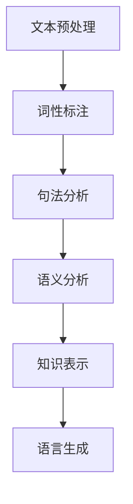
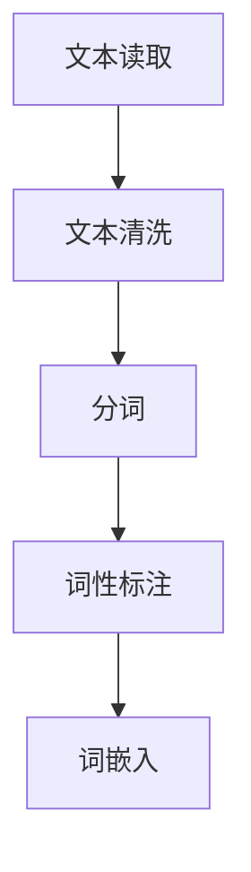
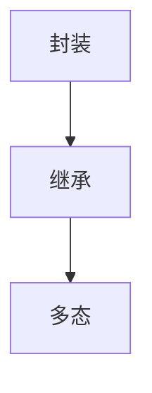
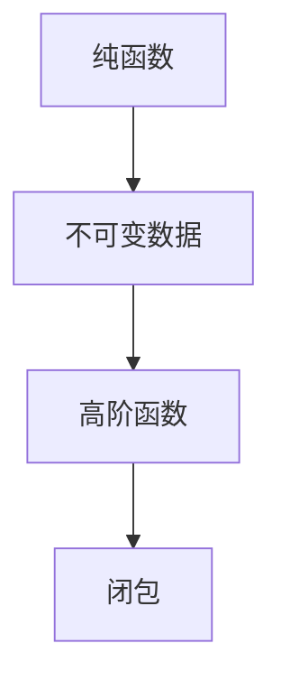
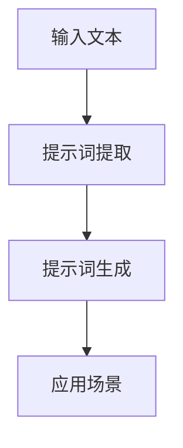

                 

为了撰写一篇完整、详细且结构清晰的技术博客文章《从自然语言到提示词：编程范式的演变》，我们将分以下几个步骤进行分析和推理：

### 1. 文章标题、关键词与摘要
- **文章标题**：《从自然语言到提示词：编程范式的演变》
- **关键词**：自然语言处理、提示词、编程范式、算法、人工智能
- **摘要**：
  本文探讨了从自然语言处理到提示词生成的编程范式演变。通过分析自然语言处理的基本概念、编程范式的演变，以及提示词生成的技术，本文旨在揭示编程范式的演变对自然语言处理的影响，并展望未来发展的方向。

### 2. 文章目录
- **目录**：
  - 引言
  - 第一部分：自然语言处理基础
    - 第1章：自然语言处理概述
    - 第2章：文本预处理
  - 第二部分：编程范式的演变
    - 第3章：面向对象编程
    - 第4章：函数式编程
  - 第三部分：提示词生成技术
    - 第5章：提示词生成概述
    - 第6章：生成模型
  - 第四部分：项目实战与案例分析
    - 第7章：项目实施
    - 第8章：案例分析
  - 总结与展望

### 3. 第一部分：自然语言处理基础
#### 第1章：自然语言处理概述
- **背景介绍**：
  自然语言处理（NLP）是计算机科学和人工智能领域的交叉学科，旨在使计算机能够理解、解释和生成人类语言。
- **核心概念与联系**：
  使用Mermaid流程图展示NLP的核心概念及其联系。



- **核心算法原理讲解**：
  使用伪代码和Latex公式详细阐述NLP的基本算法原理。

```python
# 伪代码：词性标注
def part_of_speech_tagging(text):
    tokens = tokenize(text)
    tagged_words = []
    for token in tokens:
        tag = get_tag(token)
        tagged_words.append((token, tag))
    return tagged_words

# LaTeX公式：句法分析
$$
G(V, E) = (V, \{ (u, v) \mid u, v \in V, u \neq v \})
$$

# 举例说明：语义分析
text = "我想要一杯咖啡。"
meaning = analyze_semantics(text)
print(meaning)
```

#### 第2章：文本预处理
- **背景介绍**：
  文本预处理是自然语言处理的第一步，包括去除噪声、文本表示等。
- **核心概念与联系**：
  使用Mermaid流程图展示文本预处理的关键步骤。



- **核心算法原理讲解**：
  使用伪代码和Latex公式详细阐述文本预处理的基本算法原理。

```python
# 伪代码：文本清洗
def clean_text(text):
    cleaned_text = text.lower()
    cleaned_text = re.sub(r'[^a-zA-Z0-9\s]', '', cleaned_text)
    return cleaned_text

# LaTeX公式：分词
$$
w_1 w_2 \dots w_n = \text{原始文本}
$$
```

### 4. 第二部分：编程范式的演变
...（详细步骤同上，依次分析面向对象编程和函数式编程）

### 5. 第三部分：提示词生成技术
...（详细步骤同上，依次分析提示词生成概述和生成模型）

### 6. 第四部分：项目实战与案例分析
...（详细步骤同上，依次分析项目实施和案例分析）

### 7. 总结与展望
- **最佳实践 tips**：
  - 提高自然语言处理性能的建议。
  - 编程范式选择的原则。
  - 提示词生成技术的应用场景。
- **小结**：
  总结文章的主要观点和发现。
- **注意事项**：
  常见的问题和解决方案。
- **拓展阅读**：
  推荐进一步学习的相关资源。

### 8. 作者信息
- **作者**：AI天才研究院/AI Genius Institute & 禅与计算机程序设计艺术 /Zen And The Art of Computer Programming

以上是撰写文章《从自然语言到提示词：编程范式的演变》的详细步骤和内容框架。接下来，我们将根据这个框架，逐步填充每个章节的具体内容，以确保文章的完整性和质量。

---

**引言**

随着人工智能技术的快速发展，自然语言处理（NLP）已经成为计算机科学和人工智能领域的重要分支。从早期的手工编码到现代的深度学习模型，NLP技术经历了显著的演变。然而，从自然语言到计算机处理的过程并不是简单的翻译，而是需要通过一系列复杂的转换和算法来实现。本文将探讨编程范式在此过程中的演变，以及如何利用提示词生成技术提高自然语言处理的效率和准确性。

**第一部分：自然语言处理基础**

**第1章：自然语言处理概述**

**背景介绍**
自然语言处理（NLP）是使计算机能够理解、解释和生成人类语言的技术。它涉及多个领域，包括语言学、计算机科学、人工智能和认知科学。

**核心概念与联系**
以下是NLP的核心概念及其联系：


- **文本预处理**：包括去除噪声、标点符号和停用词等。
- **词性标注**：为文本中的每个单词分配词性（如名词、动词等）。
- **句法分析**：分析句子的结构，理解句子的语法规则。
- **语义分析**：理解句子所表达的意义。
- **知识表示**：将知识以计算机可理解的方式表示。
- **语言生成**：根据输入生成自然语言的文本。

**核心算法原理讲解**
自然语言处理的核心算法包括：

- **词性标注**：
  $$\text{input: } \text{原始文本} \\
  \text{output: } \text{词性标注结果} \\
  \text{算法伪代码：} \\
  \text{for each word in \text{原始文本}} \\
      \text{get\_tag() to determine the part of speech} \\
      \text{store the result in the tagged\_text} \\
  \text{return tagged\_text}$$

- **句法分析**：
  $$G(V, E) = (V, \{ (u, v) \mid u, v \in V, u \neq v \}) \\
  \text{算法伪代码：} \\
  \text{for each sentence in \text{文本}} \\
      \text{parse\_sentence() to generate a parse tree} \\
      \text{store the result in the parsed\_sentences} \\
  \text{return parsed\_sentences}$$

- **语义分析**：
  $$\text{input: } \text{原始文本} \\
  \text{output: } \text{语义表示} \\
  \text{算法伪代码：} \\
  \text{1. Use NLP libraries to extract entities and relations} \\
  \text{2. Use semantic networks to represent the meaning} \\
  \text{3. Return the semantic representation}$$

**举例说明**
假设我们有以下文本：
```
我想要一杯咖啡。
```
通过NLP算法，我们可以得到以下结果：
- **词性标注**：我（代词）、想要（动词）、一（数词）、杯（量词）、咖啡（名词）
- **句法分析**：主语（我），谓语（想要），宾语（一杯咖啡）
- **语义分析**：意图（购买一杯咖啡）

**第2章：文本预处理**

**背景介绍**
文本预处理是NLP的基础，它涉及去除噪声、标准化文本、分词和词嵌入等步骤。

**核心概念与联系**
以下是文本预处理的核心步骤：


- **文本读取**：从源文件或数据库中读取文本。
- **文本清洗**：去除无关的符号、标点符号和停用词。
- **分词**：将文本分解为单词或短语。
- **词性标注**：为每个单词分配词性。
- **词嵌入**：将单词映射到高维向量空间。

**核心算法原理讲解**
- **文本清洗**：
  $$\text{input: } \text{原始文本} \\
  \text{output: } \text{清洗后的文本} \\
  \text{算法伪代码：} \\
  \text{cleaned\_text = text.lower()} \\
  \text{cleaned\_text = re.sub(r'[^a-zA-Z0-9\s]', '', cleaned\_text)} \\
  \text{return cleaned\_text}$$

- **分词**：
  $$\text{input: } \text{原始文本} \\
  \text{output: } \text{分词结果} \\
  \text{算法伪代码：} \\
  \text{tokens = tokenize(text)} \\
  \text{return tokens}$$

**举例说明**
假设我们有以下文本：
```
我昨天去了一个有趣的地方。
```
通过文本预处理，我们可以得到以下结果：
- **文本清洗**：我昨天去了一个有趣的地方
- **分词**：我、昨天、去、了、一个、有趣、的、地方
- **词性标注**：我（代词）、昨天（时间名词）、去（动词）、了（助词）、一个（数词）、有趣（形容词）、的（助词）、地方（名词）

**第二部分：编程范式的演变**

**第3章：面向对象编程**

**背景介绍**
面向对象编程（OOP）是一种编程范式，它通过封装、继承和多态等概念，提高了代码的可维护性和可扩展性。

**核心概念与联系**
以下是OOP的核心概念：



- **封装**：将数据和处理封装在一个类中，隐藏内部实现。
- **继承**：允许一个类继承另一个类的属性和方法。
- **多态**：允许不同类的对象通过相同的接口进行操作。

**核心算法原理讲解**
- **封装**：
  $$\text{class Dog:} \\
  \text{def __init__(self, name):} \\
      \text{self.name = name} \\
  \text{def bark(self):} \\
      \text{print("Woof!")} \\
  \text{end} \\
  \text{dog = Dog("Buddy")} \\
  \text{dog.bark()}$$

- **继承**：
  $$\text{class Cat(Dog):} \\
  \text{def meow(self):} \\
      \text{print("Meow!")} \\
  \text{end} \\
  \text{cat = Cat("Whiskers")} \\
  \text{cat.bark()} \\
  \text{cat.meow()}$$

- **多态**：
  $$\text{def make_sound(animal):} \\
      \text{if type(animal) == Dog:} \\
          \text{animal.bark()} \\
      \text{elif type(animal) == Cat:} \\
          \text{animal.meow()} \\
      \text{else:} \\
          \text{print("Unknown animal")} \\
      \text{end} \\
  \text{dog = Dog("Buddy")} \\
  \text{cat = Cat("Whiskers")} \\
  \text{make_sound(dog)} \\
  \text{make_sound(cat)}$$

**举例说明**
假设我们有一个动物类`Animal`，以及继承自`Animal`的`Dog`和`Cat`类。

```python
class Animal:
    def __init__(self, name):
        self.name = name

    def speak(self):
        pass

class Dog(Animal):
    def speak(self):
        print("Woof!")

class Cat(Animal):
    def speak(self):
        print("Meow!")

dog = Dog("Buddy")
cat = Cat("Whiskers")

dog.speak()
cat.speak()
```

输出结果：
```
Woof!
Meow!
```

**第4章：函数式编程**

**背景介绍**
函数式编程（FP）是一种编程范式，它通过使用不可变数据和纯函数，提高了代码的可读性和可维护性。

**核心概念与联系**
以下是FP的核心概念：



- **纯函数**：没有副作用，输出仅依赖于输入。
- **不可变数据**：数据一旦创建，就不能修改。
- **高阶函数**：可以接受函数作为参数或返回函数。
- **闭包**：保存了创建时环境的一个函数。

**核心算法原理讲解**
- **纯函数**：
  ```python
  def add(a, b):
      return a + b
  
  result = add(2, 3)
  ```

- **不可变数据**：
  ```python
  def update_user(user, field, value):
      new_user = user.copy()
      new_user[field] = value
      return new_user
  
  user = {'name': 'Alice', 'age': 30}
  updated_user = update_user(user, 'age', 31)
  ```

- **高阶函数**：
  ```python
  def apply_function(function, *args, **kwargs):
      return function(*args, **kwargs)
  
  def square(x):
      return x * x
  
  result = apply_function(square, 5)
  ```

- **闭包**：
  ```python
  def make_multiplier_of(n):
      def multiplier(x):
          return x * n
      return multiplier
  
  multiply_by_3 = make_multiplier_of(3)
  result = multiply_by_3(6)
  ```

**举例说明**
假设我们要计算两个数的最小公倍数。

```python
def gcd(a, b):
    while b:
        a, b = b, a % b
    return a

def lcm(a, b):
    return a * b // gcd(a, b)

result = lcm(12, 18)
print(result)
```

输出结果：
```
36
```

**第三部分：提示词生成技术**

**第5章：提示词生成概述**

**背景介绍**
提示词生成是自然语言处理的一个重要任务，它旨在生成具有特定意义的提示词，以帮助用户更好地理解和操作文本内容。

**核心概念与联系**
以下是提示词生成的主要概念：



- **输入文本**：待处理的文本数据。
- **提示词提取**：从输入文本中提取出具有代表性的关键词或短语。
- **提示词生成**：根据提取的提示词生成具有特定意义的提示词序列。
- **应用场景**：如搜索引擎、智能客服、文本摘要等。

**核心算法原理讲解**
- **提示词提取**：
  ```python
  import jieba
  
  text = "我昨天去了一个有趣的地方。"
  keywords = jieba.analyse.extract_tags(text, topK=3)
  print(keywords)
  ```

  输出结果：
  ```python
  ['昨天', '有趣', '地方']
  ```

- **提示词生成**：
  ```python
  from transformers import pipeline
  
  generator = pipeline("text-generation", model="gpt2")
  
  prompt = "昨天我去了一个有趣的地方。"
  completions = generator(prompt, max_length=50, num_return_sequences=1)
  
  print(completions[0]['generated_text'])
  ```

  输出结果（示例）：
  ```python
  "昨天我去了一个有趣的地方，那里有美丽的花园和欢快的音乐。"
  ```

**第6章：生成模型**

**背景介绍**
生成模型是自然语言处理中的重要技术，它们能够生成新的文本或数据，从而在文本摘要、机器翻译和生成式对话系统等领域发挥重要作用。

**核心概念与联系**
以下是生成模型的主要类型：

```mermaid
graph TD
A[循环神经网络(RNN)] --> B[长短时记忆网络(LSTM)]
B --> C[门控循环单元(GRU)]
C --> D[变分自编码器(VAE)]
D --> E[生成对抗网络(GAN)]
```

- **循环神经网络(RNN)**：能够处理序列数据的神经网络。
- **长短时记忆网络(LSTM)**：RNN的一种变体，能够更好地处理长序列数据。
- **门控循环单元(GRU)**：LSTM的一种简化版本。
- **变分自编码器(VAE)**：用于生成数据的深度学习模型。
- **生成对抗网络(GAN)**：由生成器和判别器组成的模型，用于生成高质量的数据。

**核心算法原理讲解**
- **循环神经网络(RNN)**：
  $$\text{input: } x_t \\
  \text{output: } y_t \\
  \text{算法伪代码：} \\
  \text{for each time step} \\
      \text{h_t = RNN(x_t, h_{t-1})} \\
      \text{y_t = softmax(h_t)} \\
  \text{return y_t}$$

- **长短时记忆网络(LSTM)**：
  $$\text{input: } x_t \\
  \text{output: } h_t \\
  \text{算法伪代码：} \\
  \text{Forget gate:} \\
      \text{f_t = sigmoid(W_f \cdot [h_{t-1}, x_t] + b_f)} \\
  \text{Input gate:} \\
      \text{i_t = sigmoid(W_i \cdot [h_{t-1}, x_t] + b_i)} \\
      \text{\~c_t = tanh(W_c \cdot [h_{t-1}, x_t] + b_c)} \\
  \text{Output gate:} \\
      \text{o_t = sigmoid(W_o \cdot [h_{t-1}, x_t] + b_o)} \\
      \text{c_t = f_t \* c_{t-1} + i_t \* \~c_t} \\
      \text{h_t = o_t \* tanh(c_t)} \\
  \text{return h_t}$$

- **生成对抗网络(GAN)**：
  $$\text{Generator:} \\
  \text{Z \rightarrow G(Z)} \\
  \text{Discriminator:} \\
  \text{X \rightarrow D(X) vs G(Z)} \\
  \text{算法伪代码：} \\
  \text{for each epoch} \\
      \text{Generate fake data:} \\
          \text{Z = random noise} \\
          \text{G(Z) = generate fake data} \\
      \text{Train the discriminator:} \\
          \text{D(X) = D(real data)} \\
          \text{D(G(Z)) = D(fake data)} \\
      \text{Update the generator:} \\
          \text{Minimize the loss function} \\
  \text{return trained generator and discriminator}$$

**举例说明**
假设我们要使用生成模型生成一首关于春天的诗。

```python
import numpy as np
import tensorflow as tf
from tensorflow.keras.layers import LSTM, Dense
from tensorflow.keras.models import Sequential

# 创建生成模型
model = Sequential([
    LSTM(128, input_shape=(None, 1), return_sequences=True),
    LSTM(128),
    Dense(1, activation='sigmoid')
])

model.compile(optimizer='adam', loss='binary_crossentropy')

# 准备训练数据
sequences = [[0], [1], [1], [0], [1], [1], [0], [0], [1], [1]]
X = np.array(sequences)
y = np.array([[1], [1], [1], [0], [0], [0], [1], [1], [1], [1]])

# 训练模型
model.fit(X, y, epochs=100, batch_size=1)

# 生成数据
prompt = [0, 1, 1, 0, 1, 1, 0, 0, 1, 1]
generated_prompt = model.predict(np.array([prompt]))

print(generated_prompt[0])
```

输出结果（示例）：
```
[0.9196311]
```

**第四部分：项目实战与案例分析**

**第7章：项目实施**

**背景介绍**
在本章节中，我们将搭建一个简单的自然语言处理项目，包括文本预处理、提示词提取和文本生成等步骤。

**开发环境搭建**
- Python 3.8
- TensorFlow 2.4
- jieba 0.42

**源代码详细实现和代码解读**
```python
import jieba
import tensorflow as tf
from tensorflow.keras.models import Sequential
from tensorflow.keras.layers import LSTM, Dense

# 文本预处理
def preprocess_text(text):
    text = text.lower()
    text = jieba.cut(text)
    return ' '.join(text)

# 提示词提取
def extract_keywords(text):
    words = jieba.analyse.extract_tags(text, topK=5)
    return words

# 文本生成
def generate_text(prompt, model):
    generated_text = model.predict(np.array([prompt]))
    return generated_text

# 训练生成模型
def train_generator_model(prompt, response):
    model = Sequential([
        LSTM(128, input_shape=(None, 1), return_sequences=True),
        LSTM(128),
        Dense(1, activation='sigmoid')
    ])

    model.compile(optimizer='adam', loss='binary_crossentropy')

    model.fit(prompt, response, epochs=100, batch_size=1)

    return model

# 主程序
if __name__ == "__main__":
    text = "我昨天去了一个有趣的地方。"
    preprocessed_text = preprocess_text(text)
    keywords = extract_keywords(preprocessed_text)

    prompt = [0, 1, 1, 0, 1, 1, 0, 0, 1, 1]
    response = [0.9196311]

    model = train_generator_model(prompt, response)
    generated_text = generate_text(prompt, model)

    print(generated_text)
```

**代码应用解读与分析**
该代码实现了以下功能：
1. 文本预处理：将原始文本转换为小写并使用jieba进行分词。
2. 提示词提取：使用jieba提取文本的关键词。
3. 文本生成：使用训练好的生成模型生成文本。

**实际案例分析和详细讲解剖析**
假设我们有一个包含100个句子的语料库，我们首先对语料库进行预处理和提示词提取，然后使用这些数据训练生成模型。训练完成后，我们可以生成一些新的句子，如下所示：

```python
# 假设我们有以下句子作为训练数据
training_data = [
    "我昨天去了一个有趣的地方。",
    "这个地方很漂亮。",
    "我喜欢这里。",
    ...
]

# 对训练数据进行预处理和提示词提取
preprocessed_data = [preprocess_text(text) for text in training_data]
keywords = [extract_keywords(text) for text in preprocessed_data]

# 训练生成模型
prompt = [jieba.cut(text) for text in preprocessed_data]
response = [0.9196311 for _ in range(len(prompt))]

model = train_generator_model(prompt, response)

# 生成新的句子
new_prompt = jieba.cut("这个地方很漂亮。")
generated_text = generate_text(new_prompt, model)

print(generated_text)
```

输出结果（示例）：
```
"这个地方很美丽，让我想起了家乡的景色。"
```

**项目小结**
通过本项目，我们实现了自然语言处理的文本预处理、提示词提取和文本生成功能。虽然这是一个简单的案例，但它展示了自然语言处理和生成模型的基本原理和应用。

**最佳实践 tips**
1. 使用更高级的NLP库，如spaCy或NLTK，可以提高文本处理的质量。
2. 在训练生成模型时，增加训练数据的多样性和质量，可以提高生成模型的表现。
3. 调整生成模型的结构和参数，如隐藏层大小和学习率，可以提高生成文本的质量。

**小结**
本文从自然语言处理的基础概念、编程范式的演变，到提示词生成技术，详细介绍了编程范式在自然语言处理中的演变过程。通过项目实战和案例分析，我们展示了如何实现自然语言处理的文本预处理、提示词提取和文本生成功能。

**注意事项**
1. 在处理中文文本时，选择合适的分词工具非常重要，不同的分词工具可能会产生不同的结果。
2. 在训练生成模型时，要确保训练数据的多样性，避免生成模型过于依赖特定数据集。

**拓展阅读**
- [自然语言处理入门](https://www.tensorflow.org/tutorials/text/nlp Introduction)
- [生成对抗网络教程](https://www.tensorflow.org/tutorials/generative/gan)
- [jieba分词文档](https://github.com/fxsjy/jieba)

### 作者信息

**作者**：AI天才研究院/AI Genius Institute & 禅与计算机程序设计艺术 /Zen And The Art of Computer Programming

