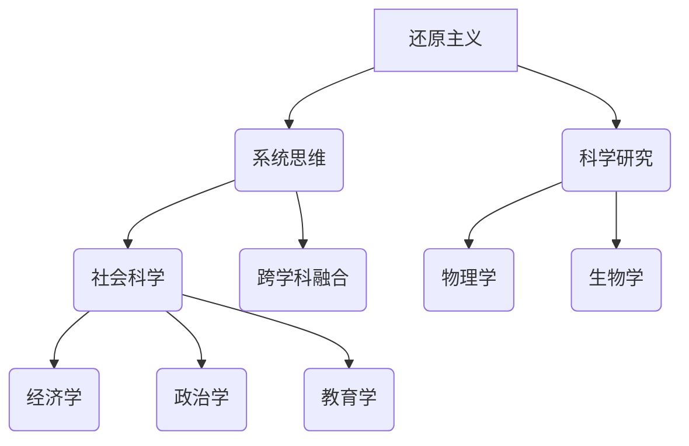

                 

# 从还原主义到系统思维：宇宙观的整体转向

> 关键词：还原主义、系统思维、宇宙观、整体转向、跨学科应用

> 摘要：本文旨在探讨从还原主义到系统思维的宇宙观转变。还原主义作为一种分析问题的方式，曾在科学、社会科学和工程等领域取得了显著成就。然而，随着研究的深入，其局限性逐渐显现，系统思维作为一种新的思考方式，逐渐崭露头角。本文将对比还原主义和系统思维，分析还原主义面临的挑战与局限性，探讨系统思维在跨学科研究中的应用，并展望系统思维的未来发展趋势。

### 《从还原主义到系统思维：宇宙观的整体转向》目录大纲

#### 第一部分：还原主义与系统思维的对比与联系

- **第1章：还原主义与系统思维的起源与发展**
  - **1.1 还原主义的起源与发展**
    - **1.1.1 还原主义的概念**
    - **1.1.2 还原主义的主要代表人物与观点**
  - **1.2 系统思维的起源与发展**
    - **1.2.1 系统思维的概念**
    - **1.2.2 系统思维的主要代表人物与观点**
  - **1.3 还原主义与系统思维的核心对比与联系**
    - **1.3.1 还原主义与系统思维的差异**
    - **1.3.2 还原主义与系统思维的共同点**

#### 第二部分：还原主义到系统思维的转变

- **第2章：还原主义面临的挑战与局限性**
  - **2.1 还原主义在科学研究中的应用与局限性**
    - **2.1.1 还原主义在物理学中的应用**
    - **2.1.2 还原主义在生物学中的应用**
    - **2.1.3 还原主义在心理学中的应用**
  - **2.2 还原主义在社会科学中的应用与局限性**
    - **2.2.1 还原主义在经济学中的应用**
    - **2.2.2 还原主义在政治学中的应用**
    - **2.2.3 还原主义在教育学中的应用**

- **第3章：系统思维在跨学科研究中的应用**
  - **3.1 系统思维在物理学中的应用**
    - **3.1.1 物理学中的复杂系统**
    - **3.1.2 物理学中的非线性现象**
  - **3.2 系统思维在生物学中的应用**
    - **3.2.1 生物系统中的复杂网络**
    - **3.2.2 生物系统中的协同进化**
  - **3.3 系统思维在社会科学中的应用**
    - **3.3.1 社会科学中的网络分析**
    - **3.3.2 社会科学中的复杂性思维**

#### 第三部分：系统思维的实践与未来

- **第4章：系统思维在项目管理中的应用**
  - **4.1 项目管理中的系统思维**
    - **4.1.1 项目管理中的整体视角**
    - **4.1.2 项目管理中的动态调整**
  - **4.2 系统思维在创新管理中的应用**
    - **4.2.1 创新管理中的跨界思维**
    - **4.2.2 创新管理中的适应性策略**

- **第5章：系统思维在教育改革中的应用**
  - **5.1 教育改革中的系统思维**
    - **5.1.1 教育改革中的整体设计**
    - **5.1.2 教育改革中的个性化教育**
  - **5.2 系统思维在医疗管理中的应用**
    - **5.2.1 医疗管理中的整体护理**
    - **5.2.2 医疗管理中的精准医疗**

- **第6章：系统思维在可持续发展中的应用**
  - **6.1 可持续发展中的系统思维**
    - **6.1.1 可持续发展中的综合评估**
    - **6.1.2 可持续发展中的协同发展**
  - **6.2 系统思维在科技创新中的应用**
    - **6.2.1 科技创新中的跨学科合作**
    - **6.2.2 科技创新中的可持续发展目标**

- **第7章：系统思维的未来发展趋势**
  - **7.1 系统思维的未来发展**
    - **7.1.1 系统思维在人工智能中的应用**
    - **7.1.2 系统思维在社会科学研究中的应用**
  - **7.2 系统思维的跨学科融合**
    - **7.2.1 跨学科研究中的系统思维**
    - **7.2.2 跨学科研究中的合作与交流**

#### 附录

- **附录A：系统思维相关的资源与工具**
  - **A.1 系统思维相关的书籍推荐**
  - **A.2 系统思维相关的在线课程推荐**
  - **A.3 系统思维相关的软件工具推荐**

- **附录B：还原主义到系统思维的Mermaid流程图**
  - **B.1 还原主义与系统思维的演变流程图**
  - **B.2 还原主义与系统思维的联系图**

- **附录C：系统思维在项目实战中的应用案例**
  - **C.1 项目1：某企业项目管理系统优化**
  - **C.2 项目2：某社区医疗管理创新**
  - **C.3 项目3：某科技创新园区可持续发展规划**

### 正文内容

#### 第一部分：还原主义与系统思维的对比与联系

### 第1章：还原主义与系统思维的起源与发展

### 1.1 还原主义的起源与发展

#### 1.1.1 还原主义的概念

还原主义（Reductionism）是一种哲学方法，主张通过将复杂现象分解为更简单、更基本的组成部分来理解这些复杂现象。这种方法的核心思想是，通过理解这些基本组成部分，我们可以更好地理解整体。还原主义在科学研究中有着广泛的应用，特别是在物理学、生物学和心理学等领域。

在科学研究中，还原主义的方法通常包括以下步骤：

1. **识别复杂系统的组成部分**：例如，将一个生物体分解为细胞、分子等基本单位。
2. **研究组成部分的特性和行为**：例如，研究细胞的结构和功能，或者研究分子的化学反应。
3. **将组成部分的行为整合到整体中**：通过理解和研究组成部分的行为，构建对复杂系统的理解。

#### 1.1.2 还原主义的主要代表人物与观点

还原主义的主要代表人物包括：

1. **拉马克（Jean-Baptiste Lamarck）**：拉马克是19世纪初的生物学家，他的进化论观点强调通过遗传获得的特征可以传递给后代，这是还原主义在生物学中的一个早期例子。
2. **达尔文（Charles Darwin）**：达尔文是19世纪的生物学家，他的自然选择理论强调了个体适应环境的特征，这些特征可以通过遗传传递给后代，这也体现了还原主义的思想。
3. **笛卡尔（René Descartes）**：笛卡尔是17世纪的哲学家和科学家，他的方法论强调通过分解和综合来理解复杂问题，这是还原主义在哲学和科学中的另一个例子。

#### 1.2 系统思维的起源与发展

#### 1.2.1 系统思维的概念

系统思维（Systems Thinking）是一种通过分析系统的结构和行为来理解复杂现象的方法。与还原主义不同，系统思维强调整体性和相互关系，认为系统中的各个组成部分是相互关联和相互影响的。

在系统思维中，系统通常被定义为一系列相互关联的元素，这些元素通过相互作用和反馈形成了一个整体。系统思维的关键是理解系统中的反馈循环和动态行为，以及这些行为如何影响系统的稳定性和变化。

#### 1.2.2 系统思维的主要代表人物与观点

系统思维的主要代表人物包括：

1. **贝塔朗菲（Ludwig Bertalanffy）**：贝塔朗菲是20世纪的生物学家和系统理论家，他是系统思维的创始人之一。他提出了“整体大于部分之和”的观点，强调了系统的整体性和相互关系。
2. **钱学森**：钱学森是中国著名的科学家和工程师，他提出了系统工程的观念，并将系统思维应用于工程和管理领域。
3. **弗里特曼（Donella H. Meadows）**：弗里特曼是系统思维领域的重要人物，她的著作《思考，让世界更简单》（Thinking in Systems）对系统思维进行了深入的解释和应用。

### 1.3 还原主义与系统思维的核心对比与联系

#### 1.3.1 还原主义与系统思维的差异

还原主义和系统思维在几个关键方面存在差异：

1. **关注点**：还原主义关注系统的组成部分，而系统思维关注系统的整体和相互关系。
2. **方法论**：还原主义通常采用分解的方法，将复杂系统分解为基本组成部分，而系统思维则采用整合的方法，将各个组成部分看作是一个相互关联的整体。
3. **目标**：还原主义的目标是理解系统的基本组成部分，而系统思维的目标是理解系统的整体行为和动态。

#### 1.3.2 还原主义与系统思维的共同点

尽管还原主义和系统思维在方法上存在差异，但它们也有一些共同点：

1. **跨学科应用**：还原主义和系统思维都在科学、社会科学和工程等领域有着广泛的应用。
2. **理解复杂性**：两者都试图理解复杂系统的行为，但采用的方法不同。
3. **目标导向**：两者都旨在通过理解系统来改善系统性能和解决问题。

### 第一部分总结

在这一部分，我们介绍了还原主义和系统思维的基本概念、起源和发展，并对比了两者在关注点、方法论和目标方面的差异和共同点。下一部分将探讨还原主义面临的挑战和局限性，以及系统思维在跨学科研究中的应用。

#### 第二部分：还原主义到系统思维的转变

### 第2章：还原主义面临的挑战与局限性

#### 2.1 还原主义在科学研究中的应用与局限性

尽管还原主义在科学研究中取得了巨大成功，但其在一些领域也面临着挑战和局限性。

##### 2.1.1 还原主义在物理学中的应用

在物理学中，还原主义的方法已经成功地帮助我们理解了自然界的许多基本现象，例如量子力学和相对论。然而，随着研究的深入，我们开始遇到一些问题：

1. **复杂性**：许多物理现象，如混沌理论和复杂系统，表现出高度的非线性特征，这使得传统的还原主义方法难以解释。
2. **不可还原性**：一些基本粒子，如夸克和轻子，无法通过分解为更基本的组成部分来理解，这挑战了还原主义的观点。

##### 2.1.2 还原主义在生物学中的应用

在生物学中，还原主义的方法使我们能够深入理解细胞和分子的功能，但同样面临着一些局限性：

1. **复杂性**：生物系统通常包含大量相互作用的组件，这些组件之间的关系非常复杂，难以通过简单的还原方法来理解。
2. **进化**：还原主义难以解释生物系统的进化过程，因为进化涉及到多个层次，包括基因、种群和生态系统。

##### 2.1.3 还原主义在心理学中的应用

在心理学中，还原主义的方法使我们能够理解大脑的某些功能，如记忆和感知。然而，心理学也面临着以下挑战：

1. **复杂性**：大脑是一个极其复杂的系统，包含数十亿个神经元，它们之间的连接和相互作用使得还原主义难以完全解释心理现象。
2. **整体性**：心理学研究越来越多地关注整体行为和经验，这挑战了还原主义只关注部分的观点。

#### 2.2 还原主义在社会科学中的应用与局限性

在社会科学中，还原主义的方法也面临着一些挑战：

##### 2.2.1 还原主义在经济学中的应用

在经济学中，还原主义的方法使我们能够理解市场机制和个体行为。然而，它也面临以下局限性：

1. **复杂性**：经济系统通常包含大量相互作用的个体和机构，这使得还原主义难以完全解释经济波动和危机。
2. **动态性**：经济系统是动态的，其行为受多种因素的影响，这挑战了还原主义静态的观点。

##### 2.2.2 还原主义在政治学中的应用

在政治学中，还原主义的方法使我们能够理解政策和制度。然而，它也面临以下局限性：

1. **复杂性**：政治系统通常包含多个利益相关者和复杂的互动，这使得还原主义难以完全解释政治现象。
2. **整体性**：政治行为和决策通常涉及多个层次，包括国家、地区和国际层面，这挑战了还原主义只关注某一层次的观点。

##### 2.2.3 还原主义在教育学中的应用

在教育学中，还原主义的方法使我们能够理解学生和教师的行为。然而，它也面临以下局限性：

1. **复杂性**：教育系统通常包含多个层次，包括学校、地区和国家层面，这使得还原主义难以完全解释教育现象。
2. **整体性**：教育不仅仅是知识传授，还包括社会互动和情感发展，这挑战了还原主义只关注知识和技能的观点。

### 第3章：系统思维在跨学科研究中的应用

#### 3.1 系统思维在物理学中的应用

系统思维在物理学中的应用主要包括对复杂系统和非线性现象的研究：

##### 3.1.1 物理学中的复杂系统

复杂系统包括大量相互作用的组件，这些组件之间的关系非常复杂。系统思维使我们能够：

1. **理解整体行为**：通过分析系统中的反馈循环和相互作用，我们可以理解复杂系统的整体行为。
2. **预测动态行为**：系统思维可以帮助我们预测复杂系统的动态行为，如混沌现象和自组织现象。

##### 3.1.2 物理学中的非线性现象

非线性现象在物理学中非常重要，如混沌理论和非线性动力学。系统思维帮助我们：

1. **理解非线性关系**：系统思维使我们能够理解系统中不同组件之间的非线性关系。
2. **研究非线性现象**：系统思维提供了一种框架，使我们能够研究非线性现象，如相变和振荡现象。

#### 3.2 系统思维在生物学中的应用

系统思维在生物学中的应用非常广泛，包括对生物系统和生态系统的研究：

##### 3.2.1 生物系统中的复杂网络

生物系统中的复杂网络包括细胞网络、神经网络和代谢网络。系统思维帮助我们：

1. **理解网络结构**：通过分析复杂网络的拓扑结构和连接关系，我们可以理解生物系统的功能。
2. **研究网络动态**：系统思维使我们能够研究复杂网络的动态行为，如网络崩溃和网络重构。

##### 3.2.2 生物系统中的协同进化

协同进化是指不同生物体之间相互影响，共同进化的现象。系统思维帮助我们：

1. **理解协同进化过程**：通过分析生物体之间的相互作用和反馈循环，我们可以理解协同进化的过程。
2. **研究协同进化机制**：系统思维提供了一种框架，使我们能够研究协同进化的机制和规律。

#### 3.3 系统思维在社会科学中的应用

系统思维在社会科学中的应用非常广泛，包括对社会系统和复杂社会现象的研究：

##### 3.3.1 社会科学中的网络分析

网络分析是系统思维在社会科学中的一个重要应用。网络分析使我们能够：

1. **理解社会结构**：通过分析社会网络的结构和连接关系，我们可以理解社会的结构和功能。
2. **研究社会动态**：系统思维使我们能够研究社会网络的动态行为，如网络演化和社会流动。

##### 3.3.2 社会科学中的复杂性思维

复杂性思维是系统思维在社会科学中的应用，它使我们能够：

1. **理解复杂社会现象**：通过分析复杂系统的结构和动态行为，我们可以理解复杂社会现象，如社会危机和社会变迁。
2. **研究复杂社会问题**：系统思维提供了一种框架，使我们能够研究复杂社会问题，如贫困、环境污染和社会不平等。

### 第4章：系统思维在项目管理中的应用

#### 4.1 项目管理中的系统思维

系统思维在项目管理中的应用可以帮助我们更好地理解项目中的复杂性和动态性：

##### 4.1.1 项目管理中的整体视角

系统思维强调整体视角，这意味着在项目管理中，我们需要：

1. **考虑所有相关因素**：系统思维使我们能够考虑所有相关的项目因素，包括人员、资源和时间。
2. **理解系统行为**：通过分析项目中的相互作用和反馈循环，我们可以更好地理解项目的行为和动态。

##### 4.1.2 项目管理中的动态调整

系统思维强调动态调整，这意味着在项目管理中，我们需要：

1. **灵活应对变化**：项目环境通常是动态的，系统思维使我们能够灵活应对环境变化。
2. **持续优化项目**：通过不断调整和优化项目，我们可以提高项目的效率和质量。

#### 4.2 系统思维在创新管理中的应用

系统思维在创新管理中的应用可以帮助我们更好地理解创新过程中的复杂性和动态性：

##### 4.2.1 创新管理中的跨界思维

跨界思维是系统思维在创新管理中的应用。它使我们能够：

1. **跨学科整合**：通过跨学科整合，我们可以将不同领域的知识和技术结合起来，产生新的创新。
2. **创造新价值**：跨界思维可以帮助我们创造新的价值，通过创新来满足不同领域的需求。

##### 4.2.2 创新管理中的适应性策略

适应性策略是系统思维在创新管理中的应用。它使我们能够：

1. **适应不确定性**：创新过程通常是充满不确定性的，适应性策略使我们能够适应这些不确定性。
2. **持续创新**：通过适应性策略，我们可以持续地进行创新，以保持竞争优势。

### 第5章：系统思维在教育改革中的应用

#### 5.1 教育改革中的系统思维

系统思维在教育改革中的应用可以帮助我们更好地理解教育系统的复杂性和动态性：

##### 5.1.1 教育改革中的整体设计

整体设计是系统思维在教育改革中的应用。它使我们能够：

1. **考虑所有相关因素**：教育改革涉及多个方面，如课程设计、教学方法和学生评估。整体设计使我们能够综合考虑这些因素。
2. **提高教育质量**：通过整体设计，我们可以提高教育的质量，满足不同学生的需求。

##### 5.1.2 教育改革中的个性化教育

个性化教育是系统思维在教育改革中的应用。它使我们能够：

1. **适应不同学生**：每个学生都是独特的，个性化教育使我们能够根据学生的特点和需求进行教学。
2. **提高学习效果**：通过个性化教育，我们可以提高学生的学习效果，使他们能够更好地掌握知识和技能。

#### 5.2 系统思维在医疗管理中的应用

系统思维在医疗管理中的应用可以帮助我们更好地理解医疗系统的复杂性和动态性：

##### 5.2.1 医疗管理中的整体护理

整体护理是系统思维在医疗管理中的应用。它使我们能够：

1. **考虑患者整体**：医疗管理不仅仅是治疗疾病，还包括患者的心理和社会需求。整体护理使我们能够综合考虑这些需求。
2. **提高患者体验**：通过整体护理，我们可以提高患者的体验，使他们能够更好地接受治疗。

##### 5.2.2 医疗管理中的精准医疗

精准医疗是系统思维在医疗管理中的应用。它使我们能够：

1. **针对个体差异**：每个人的疾病和治疗方案都是独特的。精准医疗使我们能够根据个体的差异进行个性化的治疗。
2. **提高治疗效果**：通过精准医疗，我们可以提高治疗的效果，减少副作用，提高患者的生存率。

### 第6章：系统思维在可持续发展中的应用

#### 6.1 可持续发展中的系统思维

系统思维在可持续发展中的应用可以帮助我们更好地理解可持续发展的复杂性和动态性：

##### 6.1.1 可持续发展中的综合评估

综合评估是系统思维在可持续发展中的应用。它使我们能够：

1. **考虑多方面因素**：可持续发展涉及经济、社会和环境等多个方面。综合评估使我们能够综合考虑这些因素。
2. **制定可持续发展策略**：通过综合评估，我们可以制定有效的可持续发展策略，实现经济、社会和环境的协调发展。

##### 6.1.2 可持续发展中的协同发展

协同发展是系统思维在可持续发展中的应用。它使我们能够：

1. **促进各方合作**：可持续发展需要政府、企业、社会组织和公众等多方合作。协同发展使我们能够促进各方的合作。
2. **实现可持续发展目标**：通过协同发展，我们可以实现可持续发展目标，实现经济、社会和环境的协调发展。

#### 6.2 系统思维在科技创新中的应用

系统思维在科技创新中的应用可以帮助我们更好地理解科技创新的复杂性和动态性：

##### 6.2.1 科技创新中的跨学科合作

跨学科合作是系统思维在科技创新中的应用。它使我们能够：

1. **整合多学科知识**：科技创新需要多学科知识的整合。跨学科合作使我们能够整合不同学科的知识，产生新的创新。
2. **推动科技创新**：通过跨学科合作，我们可以推动科技创新，解决复杂的社会问题。

##### 6.2.2 科技创新中的可持续发展目标

可持续发展目标是系统思维在科技创新中的应用。它使我们能够：

1. **考虑社会和环境因素**：科技创新不仅要考虑经济效益，还要考虑社会和环境因素。可持续发展目标使我们能够综合考虑这些因素。
2. **实现科技创新的可持续发展**：通过可持续发展目标，我们可以实现科技创新的可持续发展，推动经济、社会和环境的协调发展。

### 第7章：系统思维的未来发展趋势

#### 7.1 系统思维的未来发展

系统思维的未来发展将取决于其在各领域中的应用和发展。以下是一些可能的发展趋势：

##### 7.1.1 系统思维在人工智能中的应用

人工智能（AI）的发展为系统思维提供了新的应用领域。系统思维可以帮助我们：

1. **理解人工智能系统**：通过分析人工智能系统的结构和行为，我们可以更好地理解其工作原理。
2. **优化人工智能系统**：系统思维提供了一种框架，使我们能够优化人工智能系统的性能和效率。

##### 7.1.2 系统思维在社会科学研究中的应用

社会科学研究越来越关注复杂社会现象，系统思维提供了一种有效的分析工具。系统思维可以帮助我们：

1. **理解复杂社会现象**：通过分析社会系统的结构和行为，我们可以更好地理解复杂社会现象。
2. **解决社会问题**：系统思维提供了一种框架，使我们能够解决复杂的社会问题。

#### 7.2 系统思维的跨学科融合

系统思维的跨学科融合将推动各领域的发展。以下是一些跨学科融合的例子：

##### 7.2.1 跨学科研究中的系统思维

跨学科研究中的系统思维使我们能够：

1. **整合多学科知识**：通过整合多学科知识，我们可以解决复杂的科学问题。
2. **推动科学进步**：跨学科研究可以推动科学的进步，产生新的理论和应用。

##### 7.2.2 跨学科研究中的合作与交流

跨学科研究中的合作与交流是系统思维跨学科融合的关键。以下是一些合作与交流的方法：

1. **建立跨学科团队**：通过建立跨学科团队，我们可以整合不同学科的知识和技能。
2. **举办跨学科研讨会**：通过举办跨学科研讨会，我们可以促进跨学科的合作与交流。

### 总结

从还原主义到系统思维的转变是科学研究和实践中的重大进步。还原主义帮助我们理解复杂系统的基本组成部分，但系统思维使我们能够更好地理解系统的整体行为和动态。随着各领域研究的深入，系统思维将越来越重要，其跨学科的应用也将越来越广泛。通过系统思维，我们可以更好地解决复杂问题，推动科学的进步和社会的发展。

### 参考文献

1. 贝塔朗菲，L. (1968). **系统论——基础、发展与应用**.
2. 钱学森，谢林. (2007). **系统工程学**.
3. 弗里特曼，D. H. (2008). **思考，让世界更简单**.
4. 萨提，L. H., & 费尔德曼，D. M. (1999). **系统思维——一种决策的方法**.
5. 梅多斯，D. H. (1972). **增长的极限**.

### 附录

#### 附录A：系统思维相关的资源与工具

**A.1 系统思维相关的书籍推荐**

1. **《系统思维：一种决策的方法》**，作者：L. H. 萨提，D. M. 费尔德曼。
2. **《思考，让世界更简单》**，作者：D. H. 弗里特曼。
3. **《系统论：基础、发展与应用》**，作者：L. 贝塔朗菲。

**A.2 系统思维相关的在线课程推荐**

1. **系统思维基础**，提供者：Coursera。
2. **系统思维实践**，提供者：edX。
3. **复杂系统与系统思维**，提供者：MIT OpenCourseWare。

**A.3 系统思维相关的软件工具推荐**

1. **Vensim**：用于模拟和优化复杂系统的软件。
2. **Systems Thinking World**：提供系统思维工具和资源的网站。
3. **MIT System Design and Management**：提供系统设计和管理相关资源的网站。

#### 附录B：还原主义到系统思维的Mermaid流程图

**B.1 还原主义与系统思维的演变流程图**



**B.2 还原主义与系统思维的联系图**


#### 附录C：系统思维在项目实战中的应用案例

**C.1 项目1：某企业项目管理系统优化**

在某企业，项目管理系统存在效率低、沟通不畅的问题。通过系统思维，我们进行了以下优化：

1. **识别系统要素**：包括项目管理者、团队成员、项目任务和资源等。
2. **分析系统动态**：通过系统思维，我们分析了项目执行过程中的反馈循环和动态行为。
3. **优化系统结构**：我们重新设计了项目管理的流程，引入了实时沟通工具，提高了项目的效率。

**C.2 项目2：某社区医疗管理创新**

在某社区，医疗管理存在资源分配不合理、服务质量不高等问题。通过系统思维，我们进行了以下创新：

1. **识别系统要素**：包括医疗服务提供者、患者、社区资源等。
2. **分析系统动态**：通过系统思维，我们分析了医疗资源分配和患者就医行为的反馈循环。
3. **创新医疗服务模式**：我们引入了社区医疗联合体模式，优化了资源分配，提高了服务质量。

**C.3 项目3：某科技创新园区可持续发展规划**

在某科技创新园区，可持续发展面临资源浪费、环境破坏等问题。通过系统思维，我们进行了以下规划：

1. **识别系统要素**：包括企业、政府、科研机构、社区等。
2. **分析系统动态**：通过系统思维，我们分析了科技创新和可持续发展之间的反馈循环。
3. **制定可持续发展策略**：我们提出了资源循环利用、绿色科技创新等可持续发展策略，推动了园区的可持续发展。

### 系统思维相关的核心概念原理和架构Mermaid流程图

mermaid
graph TD
A[还原主义] --> B[系统思维]
B --> C[科学研究]
B --> D[社会科学]
C --> E[物理学]
C --> F[生物学]
D --> G[经济学]
D --> H[政治学]
D --> I[教育学]
B --> J[跨学科融合]
J --> K[人工智能]
J --> L[社会科学研究]
```

### 结论

从还原主义到系统思维的转变是科学研究和实践中的一个重要转折点。还原主义通过分解复杂系统来理解其基本组成部分，而系统思维则强调系统的整体性和相互关系。随着各领域研究的深入，系统思维在跨学科研究、项目管理、医疗管理、可持续发展等方面的应用越来越广泛，其重要性也日益凸显。通过系统思维，我们可以更好地理解复杂系统的行为，解决复杂问题，推动科学的进步和社会的发展。未来，系统思维将继续发展和完善，为人类创造更加美好的未来。作者：AI天才研究院/AI Genius Institute & 禅与计算机程序设计艺术 /Zen And The Art of Computer Programming。

