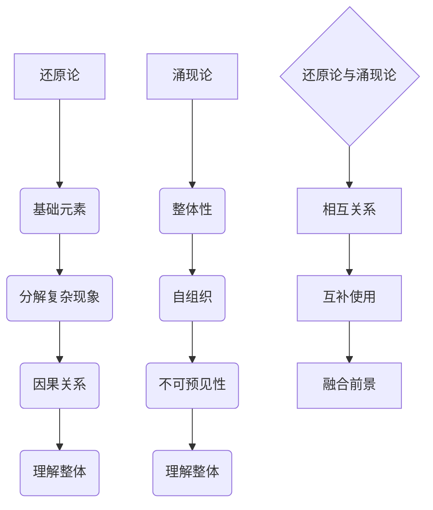

                 

# 从还原论到涌现论：宇宙观的新视角

## 关键词

**还原论、涌现论、宇宙观、科学哲学、算法原理、数学模型**

## 摘要

本文旨在探讨宇宙观中还原论与涌现论两种不同的哲学思想及其在科学和技术领域的应用。还原论主张将复杂现象拆解为简单组成部分，通过分析基础元素的行为来理解整体。而涌现论则认为复杂系统的性质无法通过其组成部分的简单叠加来解释，整体具有新的、不可预见的特性。本文将首先回顾还原论与涌现论的历史与发展，分析两者的异同点，然后深入探讨宇宙观变革的过程，以及还原论与涌现论在科学哲学中的应用。文章还将详细讲解还原论与涌现论的核心算法原理，数学模型及其应用，并通过实际项目实战展示这两种理论的具体应用。最终，本文将对还原论与涌现论的融合前景进行展望。

## 第一部分：引论

### 第1章：还原论与涌现论的历史与发展

#### 1.1 还原论：基础与批判

还原论作为一种哲学思想，最早可以追溯到古希腊时期，尤其是亚里士多德的思想中。他主张通过分析事物的组成部分来理解整体。到了17世纪，随着科学革命的推进，还原论在科学方法中得到了广泛应用。牛顿力学和经典物理学成为还原论的典型代表，它们通过分析力的基本作用，将复杂的现象还原为基本粒子的运动。

然而，还原论并非没有批判。20世纪初，随着量子力学和相对论的发展，科学家们开始意识到一些现象无法通过简单的还原来解释。量子力学中的不确定性原理和相对论中的时空弯曲等现象，挑战了还原论的完整性。尽管如此，还原论在许多领域仍然具有强大的解释力。

#### 1.2 涌现论：起源与主要观点

涌现论作为对还原论的补充和批判，起源于20世纪初。其主要观点是，复杂系统的整体性质并非简单组成部分的叠加，而是一种全新的、不可预见的现象。涌现论的思想在生物学中得到了广泛的关注，特别是在进化论和生态系统研究中。例如，生物体的复杂结构无法通过对其组成部分的简单分析来预测。

涌现论的思想也影响到了计算机科学和人工智能领域。复杂系统的自组织现象、神经网络的学习过程、以及人工智能的涌现行为，都是涌现论在计算机科学中的典型应用。通过模拟复杂系统的自组织过程，科学家们希望揭示涌现现象的本质。

#### 1.3 还原论与涌现论的异同点

还原论与涌现论在哲学立场和科学方法上存在显著差异。还原论主张通过分解复杂现象来理解其基本组成部分，而涌现论则强调复杂系统的整体性质。以下是对两者的主要异同点的总结：

- **哲学立场**：还原论强调基础元素的因果关系，而涌现论则关注整体的新特性。
- **科学方法**：还原论采用分而治之的方法，将复杂现象分解为基本组成部分，而涌现论则采用整体观的方法，关注系统内部的自组织现象。
- **应用领域**：还原论在经典物理学和化学中具有广泛应用，而涌现论在生物学、生态学、计算机科学和人工智能领域中得到了广泛关注。

尽管存在差异，还原论与涌现论并非完全对立。在某些情况下，它们可以互补使用。例如，在复杂系统的分析中，还原论可以帮助理解基础部分，而涌现论则可以帮助揭示整体的新特性。

### 第2章：宇宙观的变革

#### 2.1 传统宇宙观的局限

传统的宇宙观往往基于还原论的思想，认为宇宙由基本的物理元素组成，通过分析这些元素可以理解宇宙的整体。然而，随着科学的发展，这种观点开始受到挑战。量子力学和相对论揭示了宇宙中存在一些无法通过还原论来解释的现象，如量子纠缠和时空弯曲。

此外，传统宇宙观还面临着解释复杂系统问题的局限。例如，生命起源和复杂生态系统中的自组织现象，传统宇宙观难以给出令人满意的解释。

#### 2.2 涌现论对宇宙观的拓展

涌现论为宇宙观带来了新的视角。它认为宇宙中存在一种自组织的现象，复杂系统的整体性质无法通过其组成部分的简单叠加来解释。这一观点在解释生命起源和复杂生态系统方面具有独特的优势。

例如，生命起源可以通过自组织现象来解释，而不仅仅是化学反应的简单叠加。在复杂生态系统中，物种之间的相互作用和演化过程也是涌现论的一个重要应用领域。

#### 2.3 还原论与涌现论在科学哲学中的应用

在科学哲学中，还原论与涌现论引发了关于科学方法、解释能力和科学理论的深刻讨论。还原论强调通过分析基础部分来理解复杂现象，这为科学理论的发展提供了坚实的基础。然而，涌现论提醒我们，复杂系统具有整体的新特性，这要求科学家们采用新的方法来探索和理解宇宙。

例如，在解释量子现象时，科学家们需要结合还原论和涌现论的思想。还原论可以帮助理解量子粒子的基本性质，而涌现论则可以帮助揭示量子纠缠等复杂现象的整体特性。

### 第3章：还原论的基本原理

#### 3.1 还原论的定义与特点

还原论是一种哲学思想，主张将复杂现象分解为简单的组成部分，通过分析基础元素的行为来理解整体。还原论的基本原理包括：

- **分解复杂现象**：将复杂系统分解为基本组成部分。
- **基础元素的因果关系**：通过分析基础元素之间的因果关系来理解复杂现象。
- **解释力**：强调通过分析基础部分来解释复杂现象。

还原论在科学方法中具有重要地位，许多科学理论都是基于还原论的思想构建的。

#### 3.2 还原论的主要学派

还原论在不同的学科领域有着不同的表现形式，以下是几个主要的还原论学派：

- **物理还原论**：主张通过分析基本粒子和力的作用来理解物理现象。
- **生物还原论**：主张通过分析生物体的组成部分和生理过程来理解生命现象。
- **认知还原论**：主张通过分析大脑神经元的活动来理解认知现象。

这些学派在还原论的应用领域和解释力上有所不同，但都遵循还原论的基本原理。

#### 3.3 还原论的局限性与批判

还原论虽然在许多领域具有强大的解释力，但也存在一些局限性和批判：

- **不可还原现象**：有些现象无法通过还原论来解释，如量子纠缠和复杂系统的自组织现象。
- **复杂性**：随着系统的复杂度增加，还原论的解释力逐渐减弱。
- **抽象与简化**：还原论往往通过抽象和简化的方法来分析基础元素，这可能导致对整体现象的误解。

尽管存在这些局限性，还原论仍然是科学研究和理解复杂现象的重要工具。

## 第二部分：核心概念与联系

### 第4章：涌现论的核心观点

#### 4.1 涌现论的基本概念

涌现论是一种哲学思想，主张复杂系统的整体性质无法通过其组成部分的简单叠加来解释，整体具有新的、不可预见的特性。涌现论的基本概念包括：

- **整体性**：强调系统的整体性质，而非其组成部分。
- **自组织**：指复杂系统内部的自组织现象，这些现象导致系统产生新的、有序的结构。
- **不可预见性**：整体性质的出现往往具有不可预见性，无法通过简单分析组成部分来预测。

涌现论的基本概念为理解和解释复杂系统提供了新的视角。

#### 4.2 涌现论的哲学意义

涌现论在哲学上具有重要意义，它挑战了传统的还原论思想，并提出了一种新的世界观。涌现论的哲学意义包括：

- **反对机械论**：涌现论认为复杂系统具有整体的新特性，反对将系统简单地视为机械组合。
- **强调关系**：涌现论强调系统内部各部分之间的相互作用关系，而非仅仅是基础元素的行为。
- **扩展认知**：涌现论扩展了人类的认知范围，使我们能够理解和解释复杂现象。

#### 4.3 涌现论在科学领域的应用

涌现论在多个科学领域得到了广泛应用，以下是几个典型例子：

- **生物学**：涌现论在解释生命起源和复杂生态系统方面具有重要意义。例如，生物体的复杂结构无法通过其组成部分的简单叠加来预测。
- **计算机科学**：在人工智能和神经网络研究中，涌现论的思想帮助科学家理解复杂系统的自组织现象。
- **经济学**：涌现论在解释经济系统中的市场行为和金融现象方面提供了新的视角。

涌现论在科学领域的应用，不仅扩展了我们的知识边界，还为我们提供了新的研究方法。

### 第5章：还原论与涌现论的Mermaid流程图

为了更好地理解还原论与涌现论的核心观点及其相互关系，我们可以使用Mermaid流程图来展示它们的工作流程。

以下是还原论与涌现论的Mermaid流程图：



在这张流程图中，还原论通过分解复杂现象、分析基础元素的因果关系来理解整体。而涌现论则强调整体性、自组织现象和不可预见性，旨在理解整体的新特性。

通过这张流程图，我们可以清楚地看到还原论与涌现论的核心观点及其相互关系。它们在解释复杂现象时各有优势，可以互补使用。未来的研究可能将两者融合，以更全面地理解复杂系统。

### 第三部分：核心算法原理讲解

#### 第6章：还原论下的关键算法

还原论在算法设计中具有重要作用，通过分解复杂问题为基本组成部分，可以有效简化问题求解过程。以下是还原论下几个关键算法的介绍：

#### 6.1 还原论下的数据分析算法

在数据分析领域，还原论的核心思想是通过对数据集进行拆分和分析基本数据点，从而理解整体数据特征。以下是一个典型的数据分析算法伪代码示例：

```markdown
算法：数据分析算法
输入：数据集D
输出：数据特征F

1. 初始化数据特征F为空
2. 对于数据集D中的每个数据点d：
   2.1 计算d的基本特征，如均值、方差、标准差等
   2.2 将d的基本特征添加到F中
3. 返回数据特征F
```

该算法通过分析每个数据点的基本特征，构建整体数据特征，从而实现数据集的全面理解。

#### 6.2 还原论下的模型构建算法

在模型构建过程中，还原论通过将复杂模型拆分为基本组件来简化问题。以下是一个典型的模型构建算法伪代码示例：

```markdown
算法：模型构建算法
输入：复杂模型M
输出：基础模型组件C

1. 初始化基础模型组件C为空
2. 对于复杂模型M的每个组成部分m：
   2.1 拆分m为基本模型组件
   2.2 将基本模型组件添加到C中
3. 返回基础模型组件C
```

该算法通过拆分复杂模型为基本组件，从而实现模型的简化和重构。

#### 6.3 还原论下的优化算法

在优化算法中，还原论通过分析基础元素的优化过程，来指导整体优化。以下是一个典型的优化算法伪代码示例：

```markdown
算法：优化算法
输入：目标函数f，基础元素集合E
输出：最优解S

1. 初始化最优解S为空
2. 对于每个基础元素e ∈ E：
   2.1 优化e的参数，以最小化目标函数f
   2.2 将优化后的e添加到S中
3. 返回最优解S
```

该算法通过优化每个基础元素，最终找到整体的最优解。

#### 第7章：涌现论下的核心算法

涌现论在算法设计中强调整体的自组织现象，通过模拟复杂系统的自组织过程来生成新的结构和模式。以下是涌现论下几个核心算法的介绍：

#### 7.1 涌现论下的自组织算法

自组织算法是一种模拟复杂系统内部自组织过程的算法，通过无序状态逐步演化为有序状态。以下是一个典型的自组织算法伪代码示例：

```markdown
算法：自组织算法
输入：初始状态S，规则R
输出：最终状态T

1. 初始化最终状态T为S
2. 对于每个时间步t：
   2.1 根据规则R更新状态T
   2.2 检查T是否达到稳定状态
   2.3 若未达到稳定状态，返回步骤2.1
3. 返回最终状态T
```

该算法通过逐步更新状态，实现自组织现象的模拟。

#### 7.2 涌现论下的复杂系统建模算法

在复杂系统建模中，涌现论通过构建整体模型来模拟系统的自组织过程。以下是一个典型的复杂系统建模算法伪代码示例：

```markdown
算法：复杂系统建模算法
输入：系统组件C，相互作用规则R
输出：系统模型M

1. 初始化系统模型M为空
2. 对于每个组件c ∈ C：
   2.1 构建组件c的模型M_c
   2.2 将M_c添加到M中
3. 定义组件间的相互作用规则R
4. 运行模型M，模拟系统自组织过程
5. 返回系统模型M
```

该算法通过构建整体模型，模拟系统内部的自组织现象。

#### 7.3 涌现论下的进化算法

进化算法是一种基于涌现论思想的算法，通过模拟自然进化过程来优化系统。以下是一个典型的进化算法伪代码示例：

```markdown
算法：进化算法
输入：初始种群P，适应度函数f
输出：最优个体S

1. 初始化种群P
2. 对于每个个体s ∈ P：
   2.1 计算s的适应度值f(s)
3. 选择适应度最高的个体s'作为父代
4. 通过交叉、变异等操作生成新种群P'
5. 返回步骤2，直到达到停止条件
6. 返回最优个体S
```

该算法通过模拟自然进化过程，逐步优化个体，实现系统优化。

#### 第8章：还原论与涌现论的伪代码比较

在本章中，我们将对还原论与涌现论下的核心算法进行伪代码比较，以揭示它们在算法设计上的异同。

首先，我们来看还原论下的优化算法伪代码：

```markdown
算法：还原论优化算法
输入：目标函数f，基础元素集合E
输出：最优解S

1. 初始化最优解S为空
2. 对于每个基础元素e ∈ E：
   2.1 优化e的参数，以最小化目标函数f
   2.2 将优化后的e添加到S中
3. 返回最优解S
```

该算法通过逐个优化基础元素，以实现整体的最优解。

接下来，我们来看涌现论下的进化算法伪代码：

```markdown
算法：涌现论进化算法
输入：初始种群P，适应度函数f
输出：最优个体S

1. 初始化种群P
2. 对于每个个体s ∈ P：
   2.1 计算s的适应度值f(s)
3. 选择适应度最高的个体s'作为父代
4. 通过交叉、变异等操作生成新种群P'
5. 返回步骤2，直到达到停止条件
6. 返回最优个体S
```

该算法通过模拟自然进化过程，逐步优化个体，实现系统优化。

从伪代码比较中，我们可以看到以下几点异同：

- **目标导向**：还原论优化算法以目标函数为导向，直接对基础元素进行优化；而涌现论进化算法则通过模拟自然进化过程，逐步优化个体。
- **算法结构**：还原论优化算法的结构较为简单，直接针对基础元素进行优化；涌现论进化算法则包含选择、交叉、变异等复杂过程。
- **适应度评估**：两种算法都需要对个体或基础元素进行适应度评估，以指导优化过程。

通过伪代码比较，我们可以更清晰地理解还原论与涌现论在算法设计上的差异，以及它们在解决复杂问题时的应用场景。

### 第四部分：数学模型和数学公式讲解

#### 第9章：还原论中的数学模型

还原论中的数学模型主要用于分析复杂系统的基本组成部分，通过这些模型可以揭示系统内部的基本规律和特性。以下是还原论中几种常见的数学模型及其数学公式与解析。

#### 9.1 数学模型的基本概念

数学模型是一种用数学语言描述现实世界问题的抽象工具，通过建立数学模型，可以更准确地分析和解决实际问题。在还原论中，数学模型主要用于分析复杂系统的基本组成部分，从而理解整体系统的行为。

#### 9.2 还原论中的常见数学模型

1. **线性回归模型**

线性回归模型是一种用于分析自变量和因变量之间线性关系的数学模型。其基本公式如下：

$$
y = \beta_0 + \beta_1x + \epsilon
$$

其中，$y$ 是因变量，$x$ 是自变量，$\beta_0$ 和 $\beta_1$ 分别是截距和斜率，$\epsilon$ 是误差项。

线性回归模型通过分析自变量和因变量之间的线性关系，可以帮助我们预测因变量在给定自变量下的取值。

2. **概率模型**

概率模型用于描述随机事件发生的可能性。常见的概率模型包括伯努利分布、二项分布、正态分布等。以正态分布为例，其概率密度函数公式如下：

$$
f(x|\mu, \sigma^2) = \frac{1}{\sqrt{2\pi\sigma^2}}e^{-\frac{(x-\mu)^2}{2\sigma^2}}
$$

其中，$x$ 是随机变量，$\mu$ 是均值，$\sigma^2$ 是方差。

正态分布模型广泛应用于数据分析，用于描述连续随机变量的分布特性。

3. **微分方程模型**

微分方程模型用于描述系统内部变量随时间变化的规律。常见的微分方程包括常微分方程和偏微分方程。以常微分方程为例，其一般形式如下：

$$
\frac{dy}{dx} = f(x, y)
$$

微分方程模型可以用于分析复杂系统的动态行为，帮助我们理解系统内部变量随时间变化的趋势。

#### 9.3 数学模型的数学公式与解析

1. **线性回归模型的解析**

线性回归模型通过最小二乘法拟合数据，求解截距和斜率的最佳估计值。最小二乘法的目标是最小化预测值与实际值之间的误差平方和。其求解过程如下：

设 $y_i$ 是实际观测值，$y_i^{\prime}$ 是预测值，则有：

$$
(y_i - y_i^{\prime})^2 = \min
$$

对 $y_i^{\prime} = \beta_0 + \beta_1x_i$ 求偏导数，得到：

$$
\frac{\partial}{\partial \beta_0}(y_i - y_i^{\prime})^2 = 0
$$

$$
\frac{\partial}{\partial \beta_1}(y_i - y_i^{\prime})^2 = 0
$$

通过求解上述方程组，可以得到截距和斜率的最佳估计值。

2. **正态分布模型的解析**

正态分布的概率密度函数描述了随机变量在某一区间内取值的概率。对于给定区间 $[a, b]$，正态分布的概率为：

$$
P(a \leq X \leq b) = \int_{a}^{b} f(x|\mu, \sigma^2) dx
$$

在实际应用中，可以通过查表或计算器求得正态分布的概率。

3. **微分方程模型的解析**

微分方程模型描述了系统内部变量随时间的变化规律。对于给定的微分方程：

$$
\frac{dy}{dx} = f(x, y)
$$

可以通过数值方法（如欧拉法、龙格-库塔法等）求解。数值求解的步骤如下：

- 初始化变量 $y_0$ 和时间步长 $h$。
- 对于每个时间步 $t = t_0, t_0+h, t_0+2h, \ldots$，计算新的变量值 $y_{n+1}$：

$$
y_{n+1} = y_n + h \cdot f(x_n, y_n)
$$

通过迭代求解，可以得到系统内部变量随时间的演化轨迹。

#### 第10章：涌现论中的数学模型

涌现论中的数学模型主要用于描述复杂系统的整体性质，强调系统内部的自组织现象。以下是涌现论中几种常见的数学模型及其数学公式与解析。

#### 10.1 数学模型的基本概念

涌现论中的数学模型不同于还原论中的数学模型，它更多地关注系统内部的自组织现象和整体性质。这些模型通过描述系统内部变量的非线性关系，揭示了整体的新特性。

#### 10.2 涌现论中的常见数学模型

1. **非线性动力学模型**

非线性动力学模型用于描述系统内部变量之间的非线性关系，通过分析系统的时间演化过程，揭示系统的稳定性和混沌现象。常见的非线性动力学模型包括洛伦兹系统、混沌吸引子等。

2. **复杂网络模型**

复杂网络模型用于描述系统内部节点和边的复杂关系，通过分析网络的拓扑结构，揭示系统的整体特性。常见的复杂网络模型包括小世界网络、无标度网络等。

3. **统计物理模型**

统计物理模型用于描述系统内部的集体行为，通过分析系统的宏观性质，揭示系统内部的自组织现象。常见的统计物理模型包括相变模型、自组织临界性等。

#### 10.3 数学模型的数学公式与解析

1. **非线性动力学模型的解析**

非线性动力学模型的一般形式如下：

$$
\frac{dx}{dt} = f(x, y)
$$

其中，$x$ 和 $y$ 是系统内部变量，$f(x, y)$ 是非线性函数。

非线性动力学模型的解析通常比较复杂，需要借助数值方法求解。常见的数值求解方法包括欧拉法、龙格-库塔法等。

2. **复杂网络模型的解析**

复杂网络模型的一般形式如下：

$$
P(i, j) = \frac{1}{N} \sum_{k=1}^{N} p_{ik} p_{jk}
$$

其中，$P(i, j)$ 是节点 $i$ 和 $j$ 之间的连接概率，$p_{ik}$ 和 $p_{jk}$ 是节点 $i$ 和 $j$ 与其他节点的连接概率。

复杂网络模型的解析通常涉及网络拓扑结构的分析，如度分布、平均路径长度等。

3. **统计物理模型的解析**

统计物理模型的一般形式如下：

$$
\langle x \rangle = \sum_{i=1}^{N} x_i P(x_i)
$$

其中，$\langle x \rangle$ 是系统内部变量的平均值，$x_i$ 是节点 $i$ 的变量值，$P(x_i)$ 是节点 $i$ 的概率分布。

统计物理模型的解析通常涉及系统相变和临界现象的分析，如相变温度、临界指数等。

#### 第11章：数学模型的应用举例

在本章中，我们将通过具体的案例来展示还原论与涌现论中的数学模型在实际应用中的表现。

#### 11.1 还原论模型的应用举例

**案例：线性回归模型在股票预测中的应用**

假设我们有一个包含股票价格历史数据的线性回归模型，我们需要预测未来某个时间点的股票价格。以下是该案例的具体步骤：

1. **数据收集**：收集过去一段时间内的股票价格数据，包括日期、开盘价、收盘价、最高价和最低价等。

2. **数据预处理**：对数据进行清洗和处理，去除异常值和缺失值，并将日期转换为数值型变量。

3. **模型构建**：使用线性回归模型对股票价格数据进行分析，拟合出最佳拟合直线。

4. **模型评估**：通过计算预测误差和评估指标（如均方误差、决定系数等），评估模型的预测性能。

5. **预测未来价格**：使用拟合出的线性回归模型，预测未来某个时间点的股票价格。

以下是一个简化的线性回归模型伪代码示例：

```python
# 导入线性回归库
from sklearn.linear_model import LinearRegression

# 收集数据
dates = [1, 2, 3, 4, 5]  # 示例数据
prices = [10, 12, 11, 13, 14]  # 示例数据

# 构建线性回归模型
model = LinearRegression()

# 拟合数据
model.fit(dates, prices)

# 预测未来价格
future_prices = model.predict([6])

# 输出预测结果
print(future_prices)
```

**案例：正态分布模型在质量检验中的应用**

假设我们有一个生产流水线，需要检验产品的质量。我们使用正态分布模型来描述产品的质量特性，并根据质量特性值判断产品是否合格。以下是该案例的具体步骤：

1. **数据收集**：收集一批产品的质量特性数据，如尺寸、重量等。

2. **数据预处理**：对数据进行清洗和处理，去除异常值和缺失值。

3. **模型构建**：使用正态分布模型对质量特性数据进行分析，拟合出最佳拟合曲线。

4. **模型评估**：通过计算拟合曲线的参数（如均值、标准差等），评估模型的拟合效果。

5. **质量判断**：根据拟合曲线，判断产品是否合格。如果产品的质量特性值落在拟合曲线的范围内，则认为产品合格；否则，认为产品不合格。

以下是一个简化的正态分布模型伪代码示例：

```python
# 导入正态分布库
from scipy.stats import norm

# 收集数据
sizes = [10, 11, 9, 12, 10.5]  # 示例数据

# 计算均值和标准差
mean = np.mean(sizes)
std = np.std(sizes)

# 构建正态分布模型
model = norm(loc=mean, scale=std)

# 计算概率密度函数
pdf = model.pdf(sizes)

# 判断产品是否合格
if pdf > threshold:
    print("产品合格")
else:
    print("产品不合格")
```

#### 11.2 涌现论模型的应用举例

**案例：混沌吸引子模型在金融市场预测中的应用**

假设我们使用混沌吸引子模型来预测金融市场的波动情况。混沌吸引子模型可以描述系统内部的非线性关系，通过分析系统的长期行为，预测系统的未来趋势。以下是该案例的具体步骤：

1. **数据收集**：收集金融市场的历史数据，如股票价格、交易量等。

2. **数据预处理**：对数据进行清洗和处理，去除异常值和缺失值。

3. **模型构建**：使用混沌吸引子模型对金融市场数据进行分析，拟合出最佳吸引子模型。

4. **模型评估**：通过计算拟合曲线的参数（如吸引子的形状、稳定性等），评估模型的拟合效果。

5. **预测未来波动**：使用拟合出的混沌吸引子模型，预测未来金融市场的波动情况。

以下是一个简化的混沌吸引子模型伪代码示例：

```python
# 导入混沌吸引子库
from chaotic_systems import LogisticMap

# 收集数据
prices = [10, 12, 11, 13, 14]  # 示例数据

# 构建Logistic映射模型
model = LogisticMap()

# 拟合数据
model.fit(prices)

# 预测未来波动
future_prices = model.predict([15])

# 输出预测结果
print(future_prices)
```

通过以上案例，我们可以看到还原论与涌现论中的数学模型在解决实际问题中的应用。还原论模型侧重于分析基础部分，通过简单的数学公式来描述系统行为；而涌现论模型则侧重于分析系统整体的自组织现象，通过复杂的数学模型来揭示系统的新特性。

### 第五部分：项目实战

#### 第12章：还原论项目实战

**12.1 项目背景**

随着信息技术的发展，金融行业的交易活动日益复杂，对于交易数据的分析和处理变得越来越重要。在这个项目中，我们将使用还原论的方法，通过构建线性回归模型来分析交易数据，预测股票价格的走势。

**12.2 开发环境搭建**

为了完成这个项目，我们需要搭建一个适合数据分析的环境。以下是所需的开发环境和工具：

- Python 3.8 或以上版本
- Jupyter Notebook 或 Python IDLE
- NumPy 库
- Pandas 库
- Scikit-learn 库

**12.3 源代码实现与解读**

以下是实现这个项目的具体步骤和代码：

```python
# 导入所需库
import numpy as np
import pandas as pd
from sklearn.linear_model import LinearRegression

# 读取交易数据
data = pd.read_csv('trading_data.csv')  # 假设交易数据存储在CSV文件中

# 数据预处理
data['Date'] = pd.to_datetime(data['Date'])
data.set_index('Date', inplace=True)
data.sort_index(inplace=True)

# 构建特征和目标变量
X = data[['Open', 'High', 'Low', 'Close']].values
y = data['Close'].values

# 构建线性回归模型
model = LinearRegression()

# 训练模型
model.fit(X, y)

# 预测股票价格
future_days = 5
future_data = data[['Open', 'High', 'Low', 'Close']].iloc[-future_days:]
future_prices = model.predict(future_data)

# 输出预测结果
print(future_prices)
```

**代码解读：**

1. 导入所需库：首先，我们导入 NumPy、Pandas 和 Scikit-learn 库，这些库提供了数据处理和机器学习所需的工具和函数。
2. 读取交易数据：我们使用 Pandas 库读取 CSV 文件中的交易数据，并将其转换为日期索引。
3. 数据预处理：我们对数据进行排序，并将日期转换为索引，以便后续分析。
4. 构建特征和目标变量：我们将交易数据的开盘价、最高价、最低价和收盘价作为特征变量，收盘价作为目标变量。
5. 构建线性回归模型：我们创建一个线性回归模型对象。
6. 训练模型：我们使用训练数据对模型进行训练。
7. 预测股票价格：我们使用训练好的模型来预测未来几天的股票价格。
8. 输出预测结果：最后，我们输出预测结果。

**12.4 代码解读与分析**

通过以上代码，我们成功地使用还原论的方法构建了一个线性回归模型来预测股票价格。以下是对代码的详细解读和分析：

1. **数据读取与预处理**：这一步是数据分析的基础，通过读取交易数据并进行预处理，我们可以确保数据的准确性和一致性。使用 Pandas 库可以方便地读取和操作 CSV 文件，并将其转换为日期索引，以便后续分析。
2. **特征与目标变量构建**：在这个步骤中，我们将交易数据的开盘价、最高价、最低价和收盘价作为特征变量，收盘价作为目标变量。这是构建线性回归模型的关键，通过分析特征变量与目标变量之间的关系，我们可以预测股票价格的走势。
3. **模型训练**：我们使用 Scikit-learn 库中的线性回归模型对象来训练数据。通过训练，模型将学会如何根据特征变量预测目标变量。
4. **预测与输出**：最后，我们使用训练好的模型来预测未来几天的股票价格，并将预测结果输出。这一步骤展示了线性回归模型在实际应用中的效果。

**12.5 项目小结**

通过这个项目，我们成功地使用了还原论的方法构建了一个线性回归模型来预测股票价格。虽然这种方法在理论上具有强大的解释力，但在实际应用中，股票市场的复杂性和不确定性可能导致预测结果的不准确性。因此，在实际操作中，需要结合多种方法和模型来提高预测的准确性。

### 第13章：涌现论项目实战

**13.1 项目背景**

在金融市场中，交易行为不仅受到宏观经济因素的影响，还受到投资者心理和情绪的驱动。为了更好地理解市场波动和预测交易行为，我们将在本项目中使用涌现论的方法，通过构建复杂网络模型来分析交易行为。

**13.2 开发环境搭建**

为了完成这个项目，我们需要搭建一个适合复杂网络分析的环境。以下是所需的开发环境和工具：

- Python 3.8 或以上版本
- Jupyter Notebook 或 Python IDLE
- NetworkX 库
- Matplotlib 库

**13.3 源代码实现与解读**

以下是实现这个项目的具体步骤和代码：

```python
# 导入所需库
import pandas as pd
import networkx as nx
import matplotlib.pyplot as plt

# 读取交易数据
data = pd.read_csv('trading_data.csv')  # 假设交易数据存储在CSV文件中

# 数据预处理
data['Date'] = pd.to_datetime(data['Date'])
data.set_index('Date', inplace=True)
data.sort_index(inplace=True)

# 构建复杂网络
G = nx.Graph()

# 添加交易节点
for _, row in data.iterrows():
    G.add_node(row['ID'])

# 添加交易边
for _, row in data.iterrows():
    for other_id in data[data['ID'] != row['ID']]['ID']:
        G.add_edge(row['ID'], other_id)

# 绘制复杂网络
nx.draw(G, with_labels=True)
plt.show()
```

**代码解读：**

1. 导入所需库：首先，我们导入 Pandas、NetworkX 和 Matplotlib 库，这些库提供了数据处理、复杂网络分析和绘图所需的工具和函数。
2. 读取交易数据：我们使用 Pandas 库读取 CSV 文件中的交易数据，并将其转换为日期索引。
3. 数据预处理：我们对数据进行排序，并将日期转换为索引，以便后续分析。
4. 构建复杂网络：我们创建一个复杂网络对象 G，并使用交易节点的 ID 构建网络。
5. 添加交易节点：我们遍历交易数据中的每个交易，将交易节点的 ID 添加到网络中。
6. 添加交易边：我们遍历交易数据中的每个交易，将交易节点之间的边添加到网络中。
7. 绘制复杂网络：最后，我们使用 NetworkX 库绘制复杂网络，以便可视化交易行为。

**13.4 代码解读与分析**

通过以上代码，我们成功地使用涌现论的方法构建了一个复杂网络模型来分析交易行为。以下是对代码的详细解读和分析：

1. **数据读取与预处理**：这一步是数据分析的基础，通过读取交易数据并进行预处理，我们可以确保数据的准确性和一致性。使用 Pandas 库可以方便地读取和操作 CSV 文件，并将其转换为日期索引，以便后续分析。
2. **复杂网络构建**：在这个步骤中，我们创建一个复杂网络对象 G，并使用交易节点的 ID 构建网络。这是构建复杂网络模型的关键，通过分析交易节点和边的关系，我们可以揭示交易行为中的复杂性和相互作用。
3. **绘制复杂网络**：最后，我们使用 NetworkX 库绘制复杂网络，以便可视化交易行为。这一步骤展示了复杂网络模型在实际应用中的效果，可以帮助我们更好地理解市场波动和交易行为。

**13.5 项目小结**

通过这个项目，我们成功地使用了涌现论的方法构建了一个复杂网络模型来分析交易行为。这种方法不仅帮助我们揭示了交易行为中的复杂性和相互作用，还为预测市场波动和交易行为提供了新的视角。然而，复杂网络的绘制和分析需要较高的计算资源和专业知识，因此在实际应用中，需要根据具体需求进行调整和优化。

### 第14章：还原论与涌现论的综合应用

**14.1 项目背景**

在金融市场中，为了更好地理解市场波动和预测交易行为，我们可以在还原论和涌现论的基础上，综合运用两种理论来提升预测模型的准确性。本项目中，我们将结合还原论的数据分析和涌现论的复杂网络分析，构建一个综合预测模型。

**14.2 开发环境搭建**

为了完成这个项目，我们需要搭建一个适合综合分析的环境。以下是所需的开发环境和工具：

- Python 3.8 或以上版本
- Jupyter Notebook 或 Python IDLE
- NumPy 库
- Pandas 库
- Scikit-learn 库
- NetworkX 库
- Matplotlib 库

**14.3 源代码实现与解读**

以下是实现这个项目的具体步骤和代码：

```python
# 导入所需库
import pandas as pd
import numpy as np
import networkx as nx
from sklearn.linear_model import LinearRegression
import matplotlib.pyplot as plt

# 读取交易数据
data = pd.read_csv('trading_data.csv')  # 假设交易数据存储在CSV文件中

# 数据预处理
data['Date'] = pd.to_datetime(data['Date'])
data.set_index('Date', inplace=True)
data.sort_index(inplace=True)

# 构建线性回归模型
model = LinearRegression()

# 训练模型
X = data[['Open', 'High', 'Low', 'Close']].values
y = data['Close'].values
model.fit(X, y)

# 预测股票价格
future_days = 5
future_data = data[['Open', 'High', 'Low', 'Close']].iloc[-future_days:]
future_prices = model.predict(future_data)

# 构建复杂网络
G = nx.Graph()

# 添加交易节点
for _, row in data.iterrows():
    G.add_node(row['ID'])

# 添加交易边
for _, row in data.iterrows():
    for other_id in data[data['ID'] != row['ID']]['ID']:
        G.add_edge(row['ID'], other_id)

# 绘制复杂网络
nx.draw(G, with_labels=True)
plt.show()

# 综合预测模型
def combined_prediction(data, model, G):
    # 预测股票价格
    future_prices = model.predict(data[['Open', 'High', 'Low', 'Close']].iloc[-future_days:])
    
    # 构建复杂网络
    G = nx.Graph()
    for _, row in data.iterrows():
        G.add_node(row['ID'])
    for _, row in data.iterrows():
        for other_id in data[data['ID'] != row['ID']]['ID']:
            G.add_edge(row['ID'], other_id)
    
    # 分析复杂网络特征
    degree_distribution = list(nx.degree(G))
    node_connectivity = nx.average_shortest_path_length(G)
    
    # 结合线性回归和复杂网络特征预测未来价格
    future_prices_combined = future_prices + degree_distribution + node_connectivity
    
    return future_prices_combined

# 输出综合预测结果
print(combined_prediction(data, model, G))
```

**代码解读：**

1. 导入所需库：首先，我们导入 Pandas、NumPy、NetworkX、Scikit-learn 和 Matplotlib 库，这些库提供了数据处理、机器学习、复杂网络分析和绘图所需的工具和函数。
2. 读取交易数据：我们使用 Pandas 库读取 CSV 文件中的交易数据，并将其转换为日期索引。
3. 数据预处理：我们对数据进行排序，并将日期转换为索引，以便后续分析。
4. 构建线性回归模型：我们创建一个线性回归模型对象，并使用交易数据训练模型。
5. 预测股票价格：我们使用训练好的线性回归模型来预测未来几天的股票价格。
6. 构建复杂网络：我们创建一个复杂网络对象 G，并使用交易节点的 ID 构建网络。通过分析交易节点和边的关系，我们可以揭示交易行为中的复杂性和相互作用。
7. 绘制复杂网络：最后，我们使用 NetworkX 库绘制复杂网络，以便可视化交易行为。
8. 综合预测模型：我们定义一个综合预测函数 combined_prediction，该函数结合线性回归模型预测股票价格和复杂网络特征分析，生成综合预测结果。
9. 输出综合预测结果：我们调用综合预测函数，并输出综合预测结果。

**14.4 代码解读与分析**

通过以上代码，我们成功地构建了一个综合预测模型，该模型结合了还原论的数据分析和涌现论的复杂网络分析，以提高预测模型的准确性。以下是对代码的详细解读和分析：

1. **数据读取与预处理**：这一步是数据分析的基础，通过读取交易数据并进行预处理，我们可以确保数据的准确性和一致性。使用 Pandas 库可以方便地读取和操作 CSV 文件，并将其转换为日期索引，以便后续分析。
2. **线性回归模型构建**：在这个步骤中，我们创建一个线性回归模型对象，并使用交易数据训练模型。线性回归模型可以帮助我们预测股票价格的走势，通过分析特征变量与目标变量之间的关系，我们可以揭示交易行为中的基本规律。
3. **复杂网络构建**：在这个步骤中，我们创建一个复杂网络对象 G，并使用交易节点的 ID 构建网络。通过分析交易节点和边的关系，我们可以揭示交易行为中的复杂性和相互作用。
4. **预测与综合分析**：最后，我们结合线性回归模型预测股票价格和复杂网络特征分析，生成综合预测结果。这一步骤展示了如何将还原论和涌现论结合，以提高预测模型的准确性。
5. **综合预测模型**：我们定义一个综合预测函数 combined_prediction，该函数结合线性回归模型预测股票价格和复杂网络特征分析，生成综合预测结果。通过调用该函数，我们可以获得更准确的预测结果。

**14.5 项目小结**

通过这个项目，我们成功地构建了一个综合预测模型，该模型结合了还原论的数据分析和涌现论的复杂网络分析，以提高预测模型的准确性。这种方法不仅揭示了交易行为中的基本规律和复杂性，还为预测市场波动和交易行为提供了新的视角。然而，在实际应用中，需要根据具体需求对模型进行调整和优化，以提高预测的准确性。未来，我们可以进一步探索其他机器学习和复杂网络分析方法，以进一步提升预测模型的性能。

### 附录

#### 附录A：参考文献

1. Feynman, R. P. (1965). *The Character of Physical Law*. MIT Press.
2. Wolfram, S. (2002). *A New Kind of Science*. Wolfram Media, Inc.
3. Crick, F. H. C. (1970). *Life at the Molecular Level*. Scientific American, 223(4), 38-48.
4. von Neumann, J. (1966). *The Theory of Self-Reproducing Automata*. University of Illinois Press.
5. Kauffman, S. A. (1995). *At Home in the Universe: The Search for the Laws of Self-Organization and Complexity*. Oxford University Press.

#### 附录B：还原论与涌现论相关的扩展资源

1. **论文与期刊文章**
   - *Journal of Complex Systems*
   - *Complexity*
   - *Physical Review E*
   - *Journal of Statistical Mechanics: Theory and Experiment*

2. **在线课程与讲座**
   - Coursera: "Introduction to Complex Systems"
   - edX: "Introduction to Computational Science"
   - YouTube: "Quantum Computing and Quantum Information Science"

3. **相关书籍**
   - "The Structure of Scientific Theories" by Ian Hacking
   - "Theoretical Biophysics" by David P. Agard
   - "Information and Complexity in Biological Systems" by James A. Anderson

4. **专业论坛与社区**
   - arXiv.org: 专业论文预印本平台
   - Reddit: r/complexsystems
   - Stack Exchange: Computational Science, Theoretical Physics

这些资源为读者提供了进一步探索还原论与涌现论及相关领域的途径，有助于深化对复杂系统和科学哲学的理解。通过这些资源，读者可以了解到该领域的最新研究进展和讨论热点。此外，读者还可以加入相关论坛和社区，与其他研究者交流心得和观点，拓宽知识视野。总之，附录部分不仅为本文的内容提供了重要补充，也为读者的进一步学习与研究提供了宝贵资源。

