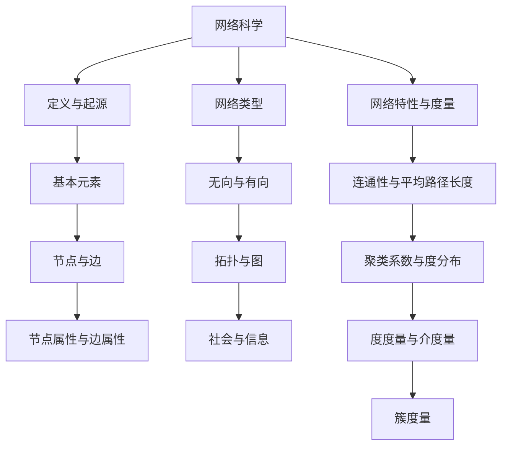
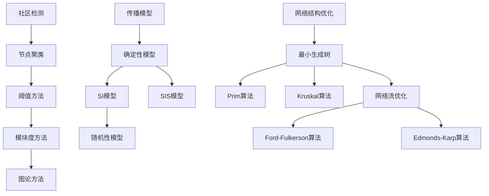

                 

### 文章标题

从还原论到网络科学：理解关系导向的世界

### 关键词

网络科学、还原论、复杂系统、算法原理、数学模型、应用领域

### 摘要

在科学技术迅速发展的今天，对复杂系统的理解已经成为诸多学科领域的前沿问题。本文旨在探讨从传统还原论到现代网络科学的转变，以及这种转变如何改变了我们对世界复杂性的认知。我们将首先介绍网络科学的基本概念和理论框架，接着分析还原论在网络科学出现前的局限，并逐步揭示网络科学的优势和应用。在此基础上，我们将深入探讨网络科学的几个核心算法原理和数学模型，并通过实际案例分析其应用效果。最终，我们将总结网络科学的重要性，并提出一些未来研究和应用的展望。

## 第一部分：基础理论

### 第1章：网络科学的基本概念

#### 1.1 网络科学的定义与起源

网络科学是一门跨学科的研究领域，旨在理解和解决复杂网络系统的结构和动态行为。它起源于20世纪末期，随着互联网、社交网络和复杂系统的兴起，逐渐成为一门独立的科学领域。网络科学的定义可以概括为：研究网络结构、动态行为及其相互作用的学科。

网络科学的起源可以追溯到图论和网络理论的发展。图论是一种用于描述和研究网络结构的数学工具，最早由欧拉在18世纪提出。而网络理论则是在20世纪中叶发展起来的，主要关注网络中的信息传递和优化问题。随着计算机技术的进步，尤其是高性能计算和大数据技术的发展，网络科学开始逐步形成自己的理论体系和研究方法。

#### 1.2 网络的基本元素

网络由节点和边组成。节点表示网络中的个体或实体，如人、组织、网站等。边表示节点之间的连接或互动，如人际关系、社交网络中的好友关系、网站之间的链接等。

节点属性是描述节点特征的信息，如节点的度（连接的边的数量）、介数（在网络中连接其他节点的数量）、属性值等。边属性则描述边的特征，如边的权重（表示连接的强度）、长度（表示连接的距离）等。

#### 1.3 网络的类型

网络可以分为多种类型，常见的有：

1. **无向网络与有向网络**：无向网络中的边没有方向，而有向网络中的边有明确的起点和终点。

2. **拓扑网络与图网络**：拓扑网络是一种基于节点和边的结构，不考虑节点的物理位置，而图网络则是一种考虑节点物理位置的布局。

3. **社会网络与信息网络**：社会网络主要关注人与人之间的关系，而信息网络则关注信息在互联网上的传播和流动。

#### 1.4 网络特性与度量

网络特性是指网络的结构和动态行为，常见的网络特性有：

1. **连通性**：网络中任意两个节点之间存在路径连接。
2. **平均路径长度**：网络中任意两个节点之间的平均最短路径长度。
3. **聚类系数**：节点邻居之间互相连接的概率。
4. **网络度分布**：网络中节点度的分布情况。

这些特性可以通过各种网络度量指标来衡量，如：

- **度度量**：节点的度。
- **介度量**：节点的介数。
- **簇度量**：网络的聚类系数。

#### 1.5 Mermaid流程图：网络科学核心概念联系

使用Mermaid绘制网络科学核心概念的联系图如下：

### 第2章：从还原论到网络科学的理论转变

#### 2.1 还原论的基本原理

还原论是一种科学方法论，主张通过分解复杂系统为更简单的组成部分来理解其行为。还原论的基本原理可以概括为：任何复杂系统都可以通过研究其组成部分的行为来理解其整体行为。

还原论在传统科学中得到了广泛应用，如物理学中的经典力学、化学中的分子结构等。还原论的核心思想是：理解复杂系统的行为可以通过理解其组成部分的行为来实现。这种思想在科学研究中起到了重要的作用，促进了科学的发展。

#### 2.2 网络科学的优势

网络科学的优势主要体现在以下几个方面：

1. **对复杂系统的解释力**：网络科学提供了一种全新的视角来理解复杂系统的结构和动态行为，如社会网络、信息网络、生态系统等。
2. **跨学科应用**：网络科学融合了多个学科的知识，如数学、物理学、计算机科学、社会学等，为解决跨学科问题提供了有效的工具。
3. **理论体系的建立**：网络科学形成了一套完整的理论体系和研究方法，为研究复杂网络系统提供了坚实的理论基础。

#### 2.3 从还原论到网络科学的转变

从还原论到网络科学的转变，是由于传统还原论在面对复杂系统时的局限性所引起的。传统还原论虽然能够解析许多简单系统的行为，但在面对复杂系统时，往往无法解释其整体行为。这是因为复杂系统的行为受到其内部节点和边之间复杂相互作用的影响。

网络科学的兴起，为解决复杂系统的行为提供了新的途径。网络科学通过研究节点和边之间的相互作用，揭示了复杂系统的整体行为规律。这种转变不仅改变了我们对复杂系统的理解方式，也推动了科学研究的进步。

#### 2.4 转变带来的影响

从还原论到网络科学的转变，对科学研究产生了深远的影响：

1. **科学研究方法的变革**：网络科学的兴起，促使科学研究方法从传统的还原论向关系导向的转变，为解决复杂系统问题提供了新的思路。
2. **跨学科研究的融合**：网络科学融合了多个学科的知识，推动了跨学科研究的深入发展，促进了科学知识的整合和创新。
3. **新兴领域的涌现**：网络科学的兴起，催生了许多新兴领域，如网络生物学、网络经济学、网络物理学等，为科学的发展注入了新的活力。

### 第3章：网络科学的核心算法原理

#### 3.1 社区检测算法

社区检测是一种研究网络内部结构的方法，旨在发现网络中的模块化结构，即具有较高内部连接密度和较低外部连接密度的节点集合。社区检测算法分为基于阈值的方法、基于模块度的方法和基于图论的方法。

**算法原理**：

1. **基于阈值的方法**：通过设定一个阈值，将节点的邻接矩阵转换为二值矩阵，然后使用图论中的聚类算法，如k-means算法，来划分社区。
2. **基于模块度的方法**：模块度是衡量网络模块化程度的一个指标，社区检测的目标是最大化网络的模块度。常用的算法有 Girvan-Newman 算法和 Louvain 算法。
3. **基于图论的方法**：利用图论中的最大流最小割定理，将社区检测转化为求解最大流问题。

**算法应用**：

社区检测算法在多个领域有广泛应用，如社会网络分析、生物网络分析、信息网络分析等。通过社区检测，可以揭示网络中的模块化结构，帮助我们更好地理解网络的拓扑特性。

#### 3.2 传播模型

传播模型是一种研究信息、疾病等在网络上传播规律的方法。传播模型可以分为确定性模型和随机性模型。

**算法原理**：

1. **确定性模型**：假设网络中的节点按照一定的规则进行传播，如SI模型（易感染者-感染者模型）、SIS模型（易感染者-感染者-易感染者模型）等。
2. **随机性模型**：考虑网络中的随机性因素，如网络中的节点随机接触，传播概率服从一定的概率分布。

**算法应用**：

传播模型在多个领域有广泛应用，如疾病传播预测、信息传播分析、供应链管理等。通过传播模型，可以预测信息、疾病等在网络上传播的趋势，为决策提供科学依据。

#### 3.3 网络结构优化算法

网络结构优化是一种研究如何提高网络性能的方法。网络结构优化的目标包括降低网络的平均路径长度、提高网络的连通性、减少网络的冗余等。

**算法原理**：

1. **最小生成树算法**：找到网络中的最小生成树，使得网络的连通性得到保证，同时路径长度最短。常用的算法有 Prim 算法和 Kruskal 算法。
2. **网络流优化算法**：通过优化网络中的流量分配，提高网络的传输效率。常用的算法有 Ford-Fulkerson 算法和 Edmonds-Karp 算法。

**算法应用**：

网络结构优化算法在多个领域有广泛应用，如计算机网络、交通网络、供应链网络等。通过网络结构优化，可以显著提高网络的性能和稳定性。

#### 3.4 Mermaid流程图：网络科学核心算法联系

使用Mermaid绘制网络科学核心算法的联系图如下：

### 第4章：数学模型与数学公式

#### 4.1 网络科学的数学基础

网络科学中的数学基础主要包括图论和网络流理论。图论是一种用于描述和研究网络结构的数学工具，包括图的基本概念、图的运算和图的性质等。网络流理论则主要研究网络中的流量分配和传输优化问题。

**网络矩阵**：

网络矩阵是描述网络结构的一种重要工具。网络矩阵是一个二维数组，其中元素表示节点之间的连接关系。常见的网络矩阵有邻接矩阵和权值矩阵。

1. **邻接矩阵**：邻接矩阵表示网络中的节点连接关系，其中元素a_ij表示节点i和节点j之间是否存在边。邻接矩阵是对称的，即a_ij = a_ji。

2. **权值矩阵**：权值矩阵表示网络中的节点连接关系和边的权重。其中元素w_ij表示节点i和节点j之间的边的权重。权值矩阵通常不是对称的，因为边的权重可能依赖于边的方向。

**节点的度分布**：

节点的度分布是指网络中节点度的概率分布。节点的度分布对网络的性质有重要影响。常见的度分布模型有泊松分布、二项分布等。

**网络的连通性**：

网络的连通性是指网络中任意两个节点之间是否存在路径连接。网络的连通性可以用网络的连通度来衡量。连通度越高，网络的连通性越好。

#### 4.2 数学公式与详细讲解

**网络流量的计算公式**：

网络流量的计算公式为：

\[ Q = \sum_{i \neq j} w_{ij} \cdot f_{ij} \]

其中，\( Q \)表示网络的总流量，\( w_{ij} \)表示节点i和节点j之间的边权重，\( f_{ij} \)表示节点i到节点j的流量。

**网络稳定性的公式**：

网络稳定性的公式为：

\[ \sigma = \frac{\sum_{i} \deg(i) \cdot \ln(\deg(i))}{\ln(N)} \]

其中，\( \sigma \)表示网络的稳定性，\( \deg(i) \)表示节点i的度，\( N \)表示网络的节点总数。

**网络效用的公式**：

网络效用的公式为：

\[ U = \frac{1}{2} \cdot \sum_{i \neq j} w_{ij} \cdot f_{ij} \cdot (1 - \frac{d_{ij}}{L}) \]

其中，\( U \)表示网络的效用，\( w_{ij} \)表示节点i和节点j之间的边权重，\( f_{ij} \)表示节点i到节点j的流量，\( d_{ij} \)表示节点i到节点j的距离，\( L \)表示网络的平均路径长度。

#### 4.3 数学公式的举例说明

**社区检测中的 Louvain 指数公式**：

Louvain 指数是一种衡量社区内部紧密程度和社区之间分离程度的指标，其公式为：

\[ \text{Louvain Index} = \frac{\sum_{i \in C} \deg(i) \cdot \ln(\deg(i)) - \sum_{i \in C} \deg(i) \cdot \ln(N)}{\sum_{i \neq j \in C} w_{ij} \cdot \ln(w_{ij})} \]

其中，\( C \)表示社区，\( \deg(i) \)表示节点i的度，\( N \)表示网络的节点总数，\( w_{ij} \)表示节点i和节点j之间的边权重。

**传播模型中的感染率公式**：

感染率公式为：

\[ \text{Infection Rate} = \frac{\sum_{i} \deg(i) \cdot \pi_i}{N} \]

其中，\( \pi_i \)表示节点i的感染概率，\( N \)表示网络的节点总数。

**网络结构优化中的最小生成树公式**：

最小生成树公式为：

\[ T = \min \{ \sum_{i \neq j} w_{ij} : (T \text{ 是 } G \text{ 的生成树}) \} \]

其中，\( T \)表示最小生成树，\( w_{ij} \)表示节点i和节点j之间的边权重。

## 第二部分：网络科学的应用

### 第5章：网络科学在生物学中的应用

#### 5.1 生物学网络分析

生物学网络分析是一种研究生物分子相互作用、代谢途径、信号传递等生物学过程的网络分析方法。生物学网络由节点和边组成，其中节点表示生物分子，边表示生物分子之间的相互作用。

**生物学网络的定义**：

生物学网络是指由生物分子和它们之间的相互作用构成的复杂网络。这些生物分子可以是蛋白质、基因、代谢物等，而相互作用可以是物理结合、信号传递、代谢途径等。

**生物学网络的分析方法**：

1. **网络构建**：通过生物实验数据、高通量测序数据、基因表达数据等，构建生物学网络的拓扑结构。
2. **网络分析**：利用网络分析工具和算法，对生物学网络进行拓扑分析、功能分析、路径分析等，以揭示生物学网络的规律和特性。
3. **网络可视化**：通过网络可视化工具，将生物学网络以图形形式展示，便于研究人员直观地理解和分析生物学网络。

**生物学网络的应用**：

生物学网络分析在多个领域有广泛应用，如疾病研究、药物发现、系统生物学等。通过生物学网络分析，可以揭示生物分子之间的相互作用关系，为疾病诊断、药物设计提供理论依据。

#### 5.2 病原体传播模型

病原体传播模型是一种研究疾病在人群中传播规律的方法。病原体传播模型可以分为确定性模型和随机性模型。

**病原体传播的基本原理**：

病原体传播的基本原理是：病原体通过传染源（如患者、感染者等）传播到易感人群，并在易感人群中传播和扩散。传播过程受到人口结构、接触频率、传染率等因素的影响。

**病原体传播的模型构建**：

1. **SIR模型**：SIR模型是最基本的病原体传播模型，其中S表示易感人群，I表示感染者，R表示康复者。模型的基本方程为：

\[ \frac{dS}{dt} = -\beta \cdot S \cdot I \]

\[ \frac{dI}{dt} = \beta \cdot S \cdot I - \gamma \cdot I \]

\[ \frac{dR}{dt} = \gamma \cdot I \]

2. **SEIR模型**：SEIR模型是SIR模型的扩展，增加了潜伏者E，表示处于潜伏期的感染者。模型的基本方程为：

\[ \frac{dS}{dt} = -\beta \cdot S \cdot E \]

\[ \frac{dE}{dt} = \beta \cdot S \cdot I - \sigma \cdot E \]

\[ \frac{dI}{dt} = \sigma \cdot E - \gamma \cdot I \]

\[ \frac{dR}{dt} = \gamma \cdot I \]

**病原体传播的模拟与分析**：

通过构建病原体传播模型，可以模拟疾病在人群中的传播过程，分析传播趋势和传播速度。常用的模拟方法有差分方程法、蒙特卡罗模拟法等。

**案例**：以新冠病毒（COVID-19）为例，构建SIR模型和SEIR模型，模拟病毒在人群中的传播过程，分析不同防控措施对疫情传播的影响。

#### 5.3 生态系统网络分析

生态系统网络分析是一种研究生态系统内部物种相互作用和能量流动的方法。生态系统网络由节点和边组成，其中节点表示物种，边表示物种之间的相互作用。

**生态系统网络的定义**：

生态系统网络是指由生态系统中的物种和它们之间的相互作用构成的复杂网络。这些物种可以是植物、动物、微生物等，而相互作用可以是捕食、竞争、共生等。

**生态系统网络的构建**：

1. **数据收集**：通过生物调查、监测数据等，收集生态系统中的物种和它们之间的相互作用信息。
2. **网络构建**：利用网络构建算法，将物种和相互作用信息转化为生态系统网络的拓扑结构。
3. **网络分析**：利用网络分析工具和算法，对生态系统网络进行拓扑分析、功能分析、路径分析等，以揭示生态系统网络的规律和特性。

**生态系统网络的稳定性分析**：

生态系统网络的稳定性是指生态系统在面对外界扰动时，能够维持其结构和功能的能力。稳定性分析可以从以下几个方面进行：

1. **网络拓扑稳定性**：分析生态系统网络的拓扑结构，如连通性、聚类系数、度分布等，评估网络的稳定性。
2. **生态位稳定性**：分析物种之间的相互作用关系，如捕食关系、竞争关系等，评估生态系统的稳定性。
3. **能量流动稳定性**：分析生态系统中的能量流动过程，如能量传递效率、能量利用率等，评估生态系统的稳定性。

**案例**：以某个生态系统为例，构建生态系统网络，分析其拓扑特性、稳定性，并探讨人类活动对该生态系统稳定性的影响。

### 第6章：网络科学在社会科学中的应用

#### 6.1 社会网络分析

社会网络分析是一种研究社会关系和社交网络结构的方法。社会网络由节点和边组成，其中节点表示个体，边表示个体之间的社交关系。

**社会网络的定义**：

社会网络是指由个体和它们之间的社交关系构成的复杂网络。这些个体可以是个人、组织、社区等，而社交关系可以是友谊、合作、竞争等。

**社会网络的分析方法**：

1. **网络构建**：通过问卷调查、社会调查等，收集个体和它们之间的社交关系信息，构建社会网络的拓扑结构。
2. **网络分析**：利用网络分析工具和算法，对社会网络进行拓扑分析、社会角色分析、社区检测等，以揭示社会网络的规律和特性。
3. **网络可视化**：通过网络可视化工具，将社会网络以图形形式展示，便于研究人员直观地理解和分析社会网络。

**社会网络的应用**：

社会网络分析在多个领域有广泛应用，如社会学研究、市场营销、人力资源管理、网络安全等。通过社会网络分析，可以揭示社会关系结构、社交网络特性，为决策提供科学依据。

#### 6.2 社会影响力分析

社会影响力分析是一种研究个体在社会网络中影响力大小的方法。社会影响力分析可以从以下几个方面进行：

1. **度分析**：分析个体的度，即个体连接的边的数量，度越高，个体的社会影响力越大。
2. **中心性分析**：分析个体的中心性，即个体在网络中的重要程度，中心性越高，个体的社会影响力越大。
3. **传播能力分析**：分析个体的传播能力，即个体在网络中信息传播的效果，传播能力越强，个体的社会影响力越大。

**社会影响力的计算方法**：

社会影响力的计算方法有多种，常见的有：

1. **度中心性**：个体在网络中的度除以网络的最大度，计算公式为：

\[ \text{度中心性} = \frac{\deg(i)}{N-1} \]

其中，\( \deg(i) \)表示个体的度，\( N \)表示网络的总节点数。

2. **介数中心性**：个体在网络中的介数除以网络的最大介数，计算公式为：

\[ \text{介数中心性} = \frac{c(i)}{N-1} \]

其中，\( c(i) \)表示个体的介数。

3. **接近中心性**：个体在网络中的接近中心性除以网络的最大接近中心性，计算公式为：

\[ \text{接近中心性} = \frac{1/Shortest Path Length(i)}{N-1} \]

其中，\( Shortest Path Length(i) \)表示个体到网络中其他节点的最短路径长度之和。

**社会影响力的应用**：

社会影响力分析在多个领域有广泛应用，如市场营销、人力资源管理、社会网络分析等。通过社会影响力分析，可以识别和评估个体在社会网络中的影响力，为决策提供科学依据。

#### 6.3 选举模型分析

选举模型分析是一种研究选举过程中选民行为和选举结果的方法。选举模型可以分为多种类型，如二分选举模型、多项式选举模型等。

**选举模型的基本原理**：

选举模型的基本原理是：在选举过程中，选民根据自身的偏好选择候选人，候选人根据选民的投票结果获得选举胜利。

**选举模型的构建**：

1. **选民偏好**：构建选民偏好的概率分布，如均匀分布、正态分布等。
2. **投票规则**：确定投票规则，如简单多数规则、相对多数规则等。
3. **选举结果**：根据选民偏好和投票规则，计算选举结果。

**选举模型的模拟与分析**：

通过构建选举模型，可以模拟选举过程中的选民行为和选举结果，分析选举过程的规律和特性。常用的模拟方法有蒙特卡罗模拟、差分方程法等。

**案例**：以某个选举事件为例，构建选举模型，模拟选举过程，分析选民行为和选举结果。

### 第7章：网络科学在信息技术中的应用

#### 7.1 互联网拓扑分析

互联网拓扑分析是一种研究互联网结构的方法。互联网由节点和边组成，其中节点表示网络中的服务器、路由器等设备，边表示设备之间的连接关系。

**互联网拓扑的定义**：

互联网拓扑是指互联网中设备之间的连接关系和网络结构。互联网拓扑可以分为多种类型，如星型拓扑、环型拓扑、网状拓扑等。

**互联网拓扑的分析方法**：

1. **网络构建**：通过网络监控数据、路由表数据等，构建互联网的拓扑结构。
2. **网络分析**：利用网络分析工具和算法，对互联网拓扑进行分析，如连通性分析、负载均衡分析、故障诊断等。
3. **网络可视化**：通过网络可视化工具，将互联网拓扑以图形形式展示，便于研究人员直观地理解和分析互联网拓扑。

**互联网拓扑的应用**：

互联网拓扑分析在多个领域有广泛应用，如网络优化、网络安全、网络性能监测等。通过互联网拓扑分析，可以优化网络结构、提高网络性能、保障网络安全。

#### 7.2 网络性能优化

网络性能优化是一种提高网络传输效率和稳定性的方法。网络性能优化可以从以下几个方面进行：

1. **负载均衡**：通过分配网络负载，提高网络的传输效率，防止网络拥堵。
2. **路由优化**：通过优化路由算法，提高网络传输的可靠性，减少传输延迟。
3. **流量控制**：通过流量控制算法，控制网络流量，防止网络过载。

**网络性能优化的方法**：

1. **静态优化**：通过预先设定的优化策略，优化网络性能，如静态路由算法、静态负载均衡算法等。
2. **动态优化**：通过实时监测网络状态，动态调整网络参数，优化网络性能，如动态路由算法、动态负载均衡算法等。

**网络性能优化的应用**：

网络性能优化在多个领域有广泛应用，如互联网服务提供商、企业网络、物联网等。通过网络性能优化，可以提高网络传输效率、降低网络延迟、提高用户体验。

#### 7.3 分布式计算系统分析

分布式计算系统分析是一种研究分布式计算系统中任务分配、负载均衡、故障恢复等方法的方法。

**分布式计算系统的定义**：

分布式计算系统是指由多个计算节点组成的计算系统，节点之间通过通信网络进行协同工作。分布式计算系统具有高可用性、高扩展性、高可靠性等特点。

**分布式计算系统的分析方法**：

1. **任务分配**：通过任务分配算法，将计算任务分配到不同的计算节点上，提高计算效率。
2. **负载均衡**：通过负载均衡算法，平衡计算节点的负载，防止节点过载。
3. **故障恢复**：通过故障恢复机制，及时发现和处理计算节点的故障，保障系统的稳定性。

**分布式计算系统的应用**：

分布式计算系统在多个领域有广泛应用，如云计算、大数据处理、物联网等。通过分布式计算系统分析，可以提高计算效率、降低成本、提高系统的可靠性和可扩展性。

### 第8章：项目实战

#### 8.1 生物网络分析案例

**案例介绍**：

本案例将利用生物网络分析技术，对某个生物系统进行网络构建和分析。该生物系统包括若干个基因和它们之间的相互作用关系。

**网络构建**：

1. **数据收集**：通过基因表达数据、蛋白质相互作用数据等，收集生物系统的节点和边信息。
2. **网络构建**：利用网络构建工具，将基因和蛋白质相互作用关系转化为生物网络的拓扑结构。

**算法应用**：

1. **社区检测**：使用Girvan-Newman算法和Louvain算法，对生物网络进行社区检测，划分生物网络的模块化结构。
2. **传播模型**：使用SIR模型和SEIR模型，模拟生物网络中基因和蛋白质的传播过程。

**结果分析**：

通过社区检测和传播模型分析，可以揭示生物网络中的模块化结构和传播特性。具体分析结果包括社区结构、传播趋势、传播速度等。

**项目小结**：

通过本案例，我们展示了生物网络分析在生物系统研究中的应用。生物网络分析技术可以帮助我们更好地理解生物系统的结构和动态行为，为生物科学研究和应用提供理论支持。

#### 8.2 社会网络分析案例

**案例介绍**：

本案例将利用社会网络分析技术，对某个社交网络进行分析。该社交网络包括若干个用户和它们之间的社交关系。

**网络构建**：

1. **数据收集**：通过社交网络平台的数据接口，收集用户的社交关系数据。
2. **网络构建**：利用网络构建工具，将用户的社交关系转化为社交网络的拓扑结构。

**算法应用**：

1. **社会影响力分析**：使用度中心性、介数中心性、接近中心性等方法，分析用户在社会网络中的影响力。
2. **社区检测**：使用Girvan-Newman算法和Louvain算法，对社交网络进行社区检测，划分社交网络的模块化结构。

**结果分析**：

通过社会影响力分析和社区检测，可以揭示社交网络中的影响力分布和模块化结构。具体分析结果包括用户影响力排名、社区结构、社交网络特性等。

**项目小结**：

通过本案例，我们展示了社会网络分析在社交网络研究中的应用。社会网络分析技术可以帮助我们更好地理解社交网络的结构和动态行为，为社交网络管理和应用提供理论支持。

#### 8.3 互联网拓扑分析案例

**案例介绍**：

本案例将利用互联网拓扑分析技术，对某个互联网进行拓扑分析。该互联网包括若干个网络设备和它们之间的连接关系。

**网络构建**：

1. **数据收集**：通过网络监控工具，收集互联网的节点和边信息。
2. **网络构建**：利用网络构建工具，将互联网的节点和边信息转化为互联网的拓扑结构。

**算法应用**：

1. **网络性能优化**：使用负载均衡算法和路由优化算法，优化互联网的性能。
2. **故障诊断**：使用网络拓扑分析算法，诊断互联网的故障点和瓶颈。

**结果分析**：

通过网络性能优化和故障诊断，可以优化互联网的传输效率和稳定性。具体分析结果包括负载分布、路由优化效果、故障诊断结果等。

**项目小结**：

通过本案例，我们展示了互联网拓扑分析在互联网研究和应用中的应用。互联网拓扑分析技术可以帮助我们更好地理解互联网的结构和性能，为互联网优化和管理提供理论支持。

### 最佳实践 Tips、小结、注意事项、拓展阅读

**最佳实践 Tips**：

1. **数据收集**：在进行网络科学研究和应用时，首先要确保数据的准确性和完整性。选择合适的数据源，如公开数据集、实验数据等。

2. **算法选择**：根据研究问题和数据特点，选择合适的算法。例如，对于社区检测问题，可以选择Girvan-Newman算法或Louvain算法。

3. **参数调整**：在网络科学研究中，参数调整非常重要。根据实验结果和实际需求，合理调整参数，以提高算法的性能。

4. **可视化**：利用可视化工具，将网络结构以图形形式展示，有助于更好地理解和分析网络特性。

**小结**：

网络科学是一门跨学科的研究领域，通过研究网络结构和动态行为，帮助我们更好地理解复杂系统的行为。从还原论到网络科学的转变，改变了我们对复杂系统的认知方式，为科学研究提供了新的途径。

**注意事项**：

1. **数据隐私**：在进行网络科学研究和应用时，要严格遵守数据隐私法律法规，保护个人隐私。

2. **计算资源**：网络科学研究通常需要大量的计算资源，合理利用云计算和分布式计算技术，可以提高研究效率。

3. **跨学科合作**：网络科学涉及多个学科，跨学科合作有助于推动网络科学的发展。

**拓展阅读**：

1. 《网络科学导论》（张江，蔡志海著）：系统介绍了网络科学的基本概念、理论体系和应用领域。

2. 《复杂网络：结构、动态与功能》（王秀娟，蔡志海著）：详细介绍了复杂网络的结构特性、动态行为和功能分析。

3. 《网络科学中的数学模型》（王晓东，蔡志海著）：介绍了网络科学中常用的数学模型和算法原理。

## 总结

从还原论到网络科学的转变，不仅改变了我们对复杂系统的认知方式，也为科学研究提供了新的途径。网络科学通过对网络结构和动态行为的深入研究，揭示了复杂系统的规律和特性。随着网络科学的发展，其在各个领域的应用越来越广泛，为解决实际问题提供了有效的工具和方法。未来，网络科学将继续发挥重要作用，推动科学技术的进步和社会的发展。通过深入研究网络科学，我们可以更好地理解复杂世界的本质，为应对未来的挑战提供有力支持。

