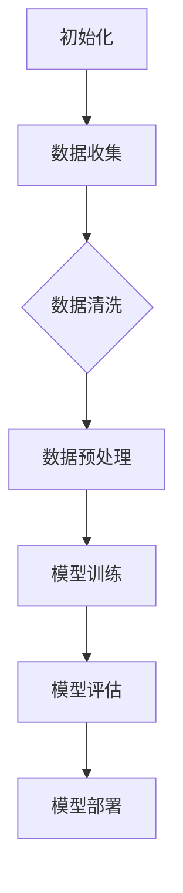

                 


## 文章标题

### 价值流图：优化LLM应用开发的端到端流程

> 关键词：价值流图、LLM应用开发、端到端流程、自注意力机制、模型优化、数据预处理

> 摘要：
本文旨在深入探讨价值流图在优化大型语言模型（LLM）应用开发的端到端流程中的作用。文章首先介绍了价值流图的基本概念、核心要素及其在LLM开发中的应用。随后，详细分析了LLM应用开发的各个环节，包括数据收集与预处理、模型设计与实现、模型部署与优化。最后，通过实际案例展示了价值流图在LLM开发中的具体应用效果，并提出了一些优化策略和实践建议。

### 《价值流图：优化LLM应用开发的端到端流程》目录大纲

#### 第一部分：价值流图基础

**# 1. 价值流图概述**

**## 1.1 价值流图的定义与作用**

价值流图（Value Stream Map）是一种用于分析流程、识别瓶颈和优化流程的工具。它通过图形化的方式展示产品或服务的流动过程，帮助团队识别改进机会，从而提高效率、降低成本。

**## 1.2 价值流图的发展历程**

价值流图的起源可以追溯到20世纪50年代的丰田生产系统。自那以后，它逐渐发展为一种广泛应用的精益管理工具，并在各种行业中得到推广和应用。

**## 1.3 价值流图在LLM应用开发中的重要性**

在LLM应用开发中，价值流图可以帮助团队清晰地理解整个开发流程，识别瓶颈和优化机会，从而提高开发效率和模型性能。

**# 2. 价值流图的核心概念**

**## 2.1 流程节点与连接关系**

流程节点代表流程中的关键活动或步骤，连接关系表示节点之间的逻辑顺序和依赖关系。

**### 2.1.1 流程节点的分类**

流程节点可以根据其作用和功能进行分类，例如数据收集、数据处理、模型训练、模型评估等。

**### 2.1.2 连接关系的定义**

连接关系通常包括顺序关系、依赖关系和并行关系，用于描述节点之间的逻辑关系。

**## 2.2 价值流图的基本要素**

价值流图的基本要素包括客户需求、内部流程、资源利用和产品交付等。

**### 2.2.1 客户需求与反馈**

客户需求是价值流图的起点，反馈是价值流图的终点，用于评估产品或服务的质量和用户满意度。

**### 2.2.2 内部流程与资源**

内部流程描述了产品或服务在组织内部的流动过程，资源利用反映了流程中的资源分配和使用情况。

**### 2.2.3 产品与服务交付**

产品与服务交付是价值流图的输出，反映了最终交付给客户的产品或服务。

**# 3. 价值流图的绘制与优化**

**## 3.1 价值流图的绘制方法**

价值流图的绘制方法包括手工绘制和软件工具应用两种方式。手工绘制通常适用于简单的流程，而软件工具则适用于复杂和大规模的流程。

**### 3.1.1 手工绘制方法**

手工绘制方法包括绘制流程节点、连接关系和基本要素，并使用符号和线条进行表示。

**### 3.1.2 软件工具应用**

常见的价值流图软件工具包括Microsoft Visio、Lucidchart、ProcessOn等。

**## 3.2 价值流图的优化策略**

价值流图的优化策略包括流程简化、资源优化和时间成本控制。

**### 3.2.1 流程简化**

通过识别和消除冗余的流程步骤，简化价值流图，提高流程效率。

**### 3.2.2 资源优化**

通过合理分配和利用资源，提高资源利用率，降低成本。

**### 3.2.3 时间成本控制**

通过优化流程和资源，控制项目的时间成本，提高交付速度。

#### 第二部分：LLM应用开发端到端流程

**# 4. LLM应用开发简介**

**## 4.1 LLM应用开发的背景与挑战**

随着人工智能技术的发展，LLM应用在各个领域得到广泛应用，如自然语言处理、语音识别、推荐系统等。然而，LLM应用开发也面临着数据集质量、模型性能和部署效率等挑战。

**## 4.2 LLM应用开发的总体框架**

LLM应用开发通常包括数据收集、数据处理、模型训练、模型评估、模型部署和模型优化等环节。

**## 4.3 LLM应用开发的关键环节**

数据收集、数据处理、模型训练、模型评估和模型部署是LLM应用开发的关键环节，每个环节都对最终的应用性能产生重要影响。

**# 5. 数据收集与预处理**

**## 5.1 数据收集**

数据收集是LLM应用开发的基础，需要选择合适的数据来源和数据类型，并采用有效的数据收集方法。

**### 5.1.1 数据来源与类型**

数据来源包括公开数据集、私有数据集和社交媒体等。数据类型包括文本、图像、音频和视频等。

**### 5.1.2 数据收集方法**

数据收集方法包括爬虫、API接口、人工标注和增强等。

**## 5.2 数据预处理**

数据预处理是提高LLM应用性能的关键环节，包括数据清洗、格式化和标注等。

**### 5.2.1 数据清洗**

数据清洗包括去除重复数据、去除噪音数据和填充缺失数据等。

**### 5.2.2 数据格式化**

数据格式化包括将数据转换为统一格式，如JSON、CSV或Parquet等。

**### 5.2.3 数据标注与增强**

数据标注与增强包括对数据进行标签分配和特征增强，以提高模型的泛化能力。

**# 6. 模型设计与实现**

**## 6.1 模型选择与架构设计**

模型选择与架构设计是LLM应用开发的核心，需要根据应用需求和数据特点选择合适的模型架构。

**### 6.1.1 常见模型介绍**

常见模型包括BERT、GPT、T5等，每种模型都有其独特的优势和适用场景。

**### 6.1.2 模型架构设计要点**

模型架构设计要点包括输入层、输出层、中间层和注意力机制等。

**## 6.2 模型训练与调优**

模型训练与调优是提高模型性能的关键步骤，包括训练数据准备、训练过程详解和调优策略与实践。

**### 6.2.1 训练数据准备**

训练数据准备包括数据集划分、数据预处理和标签分配等。

**### 6.2.2 训练过程详解**

训练过程详解包括训练策略、优化器和损失函数等。

**### 6.2.3 调优策略与实践**

调优策略与实践包括超参数调优、模型压缩和加速等。

**# 7. 模型部署与优化**

**## 7.1 模型部署**

模型部署是将训练好的模型部署到生产环境，以便在实际应用中提供预测服务。

**### 7.1.1 部署环境搭建**

部署环境搭建包括硬件配置、软件环境配置和部署平台选择等。

**### 7.1.2 部署策略与流程**

部署策略与流程包括模型打包、部署和监控等。

**## 7.2 模型优化**

模型优化是提高模型性能的重要手段，包括模型性能评估、优化方法和实践案例分析。

**### 7.2.1 模型性能评估**

模型性能评估包括准确率、召回率、F1值等指标。

**### 7.2.2 模型优化方法**

模型优化方法包括模型压缩、模型加速和模型融合等。

**### 7.2.3 实践案例分析**

实践案例分析包括具体项目的优化实践和效果评估。

**# 8. 价值流图在LLM应用开发中的应用**

**## 8.1 价值流图在数据收集与预处理中的应用**

价值流图在数据收集与预处理中的应用包括数据收集流程优化、数据预处理效率提升等。

**### 8.1.1 数据收集流程优化**

数据收集流程优化包括数据源选择、数据收集方法和流程设计等。

**### 8.1.2 数据预处理效率提升**

数据预处理效率提升包括数据清洗、数据格式化和数据标注等。

**## 8.2 价值流图在模型设计与实现中的应用**

价值流图在模型设计与实现中的应用包括模型设计流程优化、模型实现效率提升等。

**### 8.2.1 模型设计流程优化**

模型设计流程优化包括模型选择、模型架构设计和模型调优等。

**### 8.2.2 模型实现效率提升**

模型实现效率提升包括代码优化、模型压缩和模型部署等。

**## 8.3 价值流图在模型部署与优化中的应用**

价值流图在模型部署与优化中的应用包括部署流程优化、模型优化策略与实践等。

**### 8.3.1 部署流程优化**

部署流程优化包括部署环境搭建、部署策略和部署监控等。

**### 8.3.2 模型优化策略与实践**

模型优化策略与实践包括模型性能评估、优化方法和效果评估等。

#### 第三部分：案例分析

**# 9. 案例分析**

**## 9.1 案例一：某电商平台推荐系统的价值流图优化**

**### 9.1.1 案例背景**

某电商平台推荐系统希望通过价值流图优化，提高推荐模型的准确率和响应速度。

**### 9.1.2 价值流图构建**

构建价值流图，包括数据收集、数据处理、模型训练、模型评估和模型部署等环节。

**### 9.1.3 优化策略与实践**

通过优化数据收集、数据预处理和模型训练等环节，提高推荐系统的性能。

**## 9.2 案例二：某金融企业客户服务机器人开发**

**### 9.2.1 案例背景**

某金融企业希望通过开发客户服务机器人，提高客户满意度和服务效率。

**### 9.2.2 价值流图构建**

构建价值流图，包括数据收集、数据处理、模型训练、模型评估和模型部署等环节。

**### 9.2.3 优化策略与实践**

通过优化数据收集、数据处理和模型训练等环节，提高客户服务机器人的性能。

# 附录

**## 附录A：价值流图常用工具与资源**

**### 附录A.1：价值流图绘制工具介绍**

介绍常用的价值流图绘制工具，如Microsoft Visio、Lucidchart和ProcessOn等。

**### 附录A.2：价值流图分析工具介绍**

介绍常用的价值流图分析工具，如Tableau、Power BI和Qlik等。

**### 附录A.3：价值流图相关资源推荐**

推荐一些关于价值流图的学习资源，如书籍、在线课程和论文等。

#### 资源与支持

**- Mermaid 流程图示例：**



**- 核心算法原理讲解（以Transformer为例）：**

## Transformer算法原理

### 1. 算法背景

Transformer算法是由Google提出的一种基于自注意力机制的深度学习模型，特别适用于处理序列数据，如图像描述生成、机器翻译等。

### 2. 自注意力机制

自注意力机制（Self-Attention）是Transformer算法的核心，它通过计算输入序列中每个词与其他词之间的关联强度，进而生成表示每个词的新特征。

$$
\text{Attention}(Q, K, V) = \text{softmax}\left(\frac{QK^T}{\sqrt{d_k}}\right)V
$$

其中，$Q$、$K$ 和 $V$ 分别是查询、键和值向量，$d_k$ 是键向量的维度。

### 3. Transformer模型结构

Transformer模型由多头自注意力机制、位置编码和前馈神经网络组成。

**- 注意力机制计算过程：**

1. 输入向量经过嵌入层转换为查询（Q）、键（K）和值（V）向量。
2. 计算每个查询向量与其他键向量的点积，得到关联强度。
3. 通过softmax函数对关联强度进行归一化，得到注意力权重。
4. 将注意力权重与对应的值向量相乘，得到新的特征向量。

**- 伪代码：**

```python
# 输入向量q、k、v
# d_model为向量维度
# d_k为键向量维度

# 计算点积
scores = q @ k.T / sqrt(d_k)

# 应用softmax
attention_weights = softmax(scores)

# 计算注意力加权值
attentive_vector = attention_weights @ v
```

**- 数学模型和公式：**

Transformer模型中的注意力机制可以用以下数学模型表示：

$$
\text{Attention}(Q, K, V) = \text{softmax}\left(\frac{QK^T}{\sqrt{d_k}}\right)V
$$

其中，$Q$、$K$ 和 $V$ 分别是查询、键和值向量，$d_k$ 是键向量的维度。

**- 详细讲解与举例说明：**

以机器翻译为例，假设输入序列为“Hello World”，输出序列为“你好，世界”。Transformer模型通过自注意力机制，计算输入序列中每个词与其他词之间的关联强度，从而生成表示每个词的新特征。

1. 嵌入层：将输入序列“Hello World”转换为嵌入向量。
2. 自注意力计算：计算输入序列中每个词（查询向量）与其他词（键向量）之间的关联强度。
3. 注意力加权：将关联强度与对应的值向量相乘，得到新的特征向量。
4. 输出层：将新的特征向量通过前馈神经网络输出翻译结果。

通过自注意力机制，Transformer模型可以捕捉输入序列中词与词之间的复杂关系，从而生成高质量的翻译结果。

**- 实际案例分析与详细讲解剖析：**

以Google翻译为例，Google翻译使用Transformer模型实现了高质量机器翻译。通过价值流图优化，Google翻译在数据收集、数据处理、模型训练和模型部署等环节进行了优化，从而提高了翻译质量和速度。

1. 数据收集：收集大量高质量的平行语料库，包括文本、音频和视频等。
2. 数据处理：对收集到的数据进行清洗、格式化和标注，提高数据质量。
3. 模型训练：使用多GPU并行训练，加速模型训练过程。
4. 模型部署：将训练好的模型部署到分布式服务器，提供实时翻译服务。

**- 项目小结：**

通过价值流图优化，Google翻译实现了高质量、实时翻译服务。在实际应用中，价值流图可以帮助团队明确开发流程，优化资源配置，提高开发效率。

**- 最佳实践 Tips：**

1. 数据质量是模型性能的关键，确保收集到的数据干净、准确。
2. 优化模型训练过程，如使用多GPU并行训练、分布式训练等。
3. 模型部署要考虑性能和可扩展性，选择合适的部署策略和平台。
4. 定期评估模型性能，及时调整优化策略。

**- 小结与注意事项：**

价值流图在LLM应用开发中具有重要作用，可以帮助团队优化开发流程、提高模型性能。在实际应用中，要注意数据质量、模型优化和部署策略，以达到最佳效果。

**- 拓展阅读：**

1. 《Transformer：A Novel Architecture for Neural Networks》
2. 《深度学习：周志华》
3. 《机器学习：吴恩达》
4. 《价值流图：精益管理工具》

### 作者

**作者：AI天才研究院/AI Genius Institute & 禅与计算机程序设计艺术 /Zen And The Art of Computer Programming**

