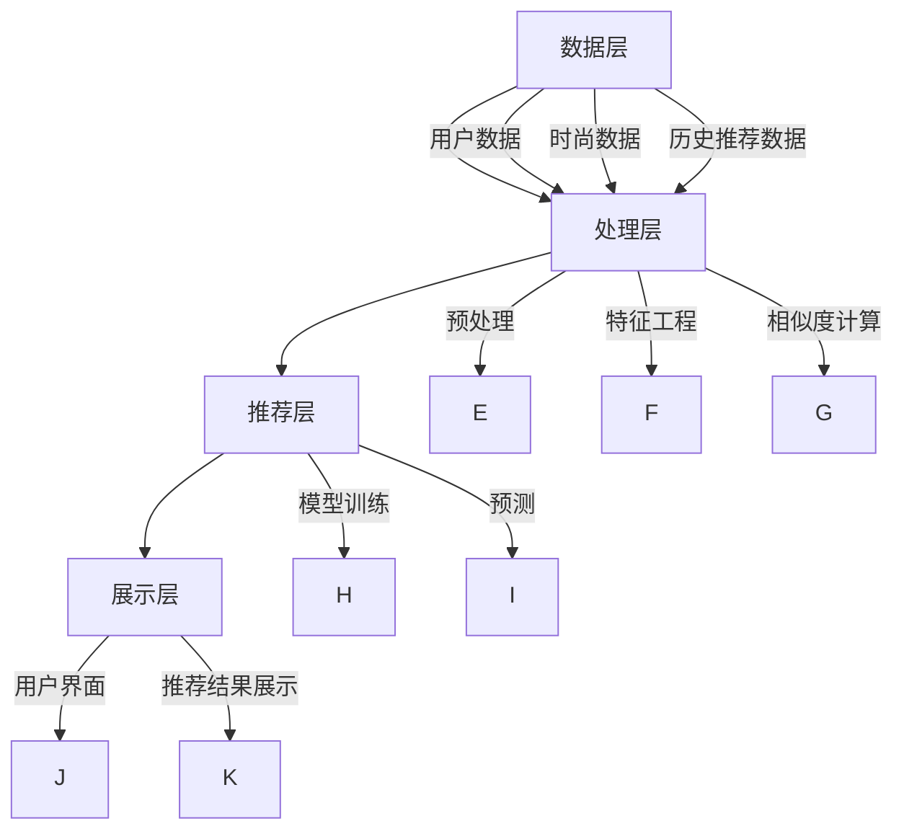
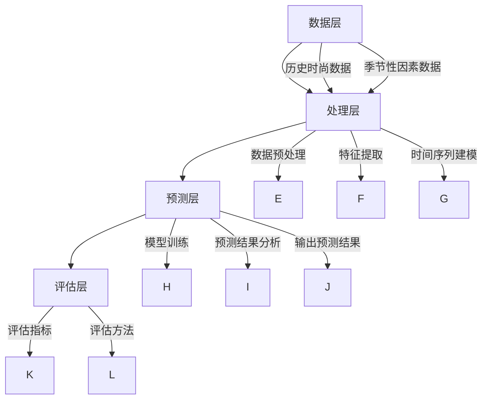
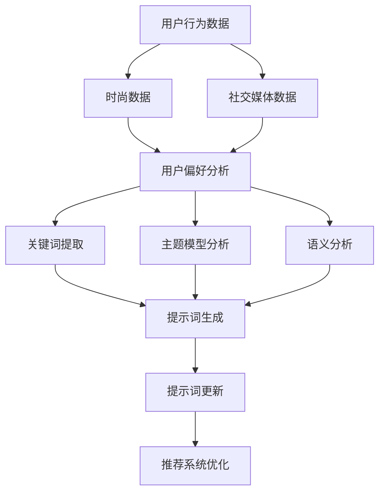
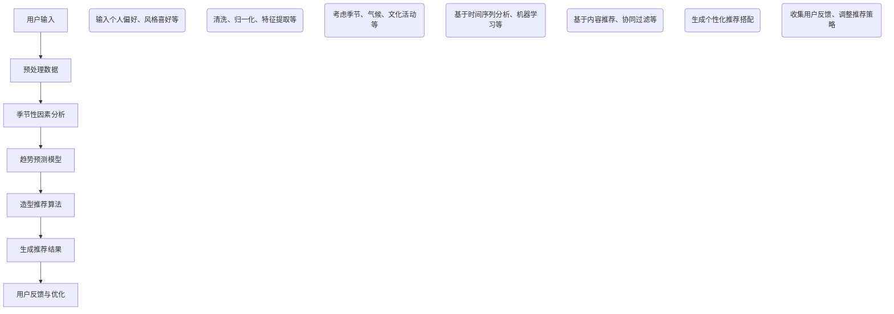

                 


### 引言与概述

#### 1.1 书籍简介与目标

**1.1.1 书籍背景**

随着人工智能（AI）技术的迅速发展，虚拟时尚造型推荐系统已成为时尚行业的重要组成部分。在这个数字化时代，用户对个性化、时尚化服装推荐的需求日益增长，而传统的推荐系统往往难以满足这种需求。季节性时尚趋势的预测对于提升虚拟时尚造型推荐的准确性和实用性具有重要意义。本书旨在探讨如何通过季节性时尚趋势预测，优化AI虚拟时尚造型推荐系统，从而为用户提供更加精准、个性化的时尚体验。

**1.1.2 书籍目标读者**

本书的目标读者主要包括以下几类：

1. **人工智能和计算机科学专业的研究生和本科生**：希望深入了解AI在时尚领域的应用，特别是季节性时尚趋势预测的相关技术。
2. **时尚产业从业者**：对AI虚拟时尚造型推荐系统感兴趣，希望学习如何利用AI技术提升时尚产品的推荐效果。
3. **软件开发工程师**：希望在AI领域有所建树，特别是对推荐系统和机器学习算法感兴趣的技术人员。
4. **数据科学家和分析师**：希望掌握季节性时尚趋势预测模型的设计与实现方法，以提升数据分析和业务决策能力。

**1.1.3 书籍结构概述**

本书共分为四个部分，内容结构如下：

- **第一部分：引言与概述**：介绍虚拟时尚造型推荐系统的背景和重要性，以及季节性时尚趋势预测的基本概念。
- **第二部分：核心概念与架构**：详细阐述AI虚拟时尚造型推荐系统和季节性时尚趋势预测模型的架构设计。
- **第三部分：核心算法原理与实现**：讲解趋势预测算法和造型推荐算法的基本原理，并提供伪代码实现。
- **第四部分：数学模型与公式**：介绍季节性时间序列模型和相关数学公式，以及相似度计算和协同过滤的原理。

通过这四个部分的系统讲解，读者可以全面了解AI虚拟时尚造型推荐系统的工作原理，掌握季节性时尚趋势预测的关键技术，从而为实际项目开发提供理论支持和实践指导。

#### 1.2 AI虚拟时尚造型推荐

**1.2.1 虚拟时尚造型概念**

虚拟时尚造型是指通过计算机技术和人工智能算法，为用户生成个性化的虚拟服装搭配方案。这种技术不仅能够模拟现实中的时尚搭配，还可以结合用户的数据和行为，提供高度个性化的推荐。虚拟时尚造型的核心在于利用AI技术对海量时尚数据进行处理和分析，从而生成符合用户需求和审美偏好的搭配方案。

**1.2.2 AI在虚拟时尚中的应用**

人工智能在虚拟时尚中的应用主要体现在以下几个方面：

1. **个性化推荐**：通过分析用户的购买历史、浏览记录和社交媒体行为，AI可以准确预测用户的时尚喜好，提供个性化的服装搭配建议。
2. **虚拟试衣**：借助增强现实（AR）和计算机视觉技术，用户可以在虚拟环境中试穿不同款式的服装，体验真实的穿着效果。
3. **时尚趋势预测**：利用时间序列分析和机器学习算法，AI可以识别和预测季节性时尚趋势，为时尚品牌和零售商提供市场决策依据。
4. **设计辅助**：AI可以分析大量的时尚设计，提取设计元素和风格，为设计师提供灵感，加速设计过程。

**1.2.3 虚拟时尚造型的挑战与机遇**

虚拟时尚造型推荐系统虽然为时尚行业带来了许多机遇，但也面临着一系列挑战：

1. **数据多样性**：时尚数据来源广泛，包括用户行为、社交媒体、电商平台等，如何整合和利用这些数据，是系统设计的重要问题。
2. **实时性**：时尚行业变化迅速，如何实时捕捉和响应时尚趋势，提供最新的推荐方案，是系统的关键需求。
3. **个性化准确性**：个性化推荐系统的准确性直接影响到用户体验，如何提高推荐的准确性，是系统优化的重要方向。
4. **计算效率**：随着用户数据的增加，系统的计算效率和响应速度也成为一个挑战，如何优化算法和架构，提高系统的处理能力，是系统设计的重点。

通过解决这些挑战，虚拟时尚造型推荐系统可以为用户提供更加精准、个性化的时尚体验，从而在竞争激烈的时尚市场中脱颖而出。

#### 1.3 季节性时尚趋势预测

**1.3.1 季节性时尚趋势概念**

季节性时尚趋势是指在不同季节中，流行元素和设计风格的变化规律。季节性时尚趋势的预测是指利用历史数据、市场调研和人工智能技术，识别和预测未来季节中的时尚流行趋势。这种预测有助于时尚品牌和零售商及时调整产品线，满足市场需求，提升销售业绩。

**1.3.2 时尚趋势预测的重要性**

时尚趋势预测对于时尚产业具有重要意义：

1. **市场决策**：准确的时尚趋势预测可以帮助企业了解市场趋势，制定合理的市场策略，优化库存管理和销售计划。
2. **产品设计**：时尚趋势预测为设计师提供灵感来源，帮助他们设计符合市场需求的时尚产品。
3. **营销推广**：了解时尚趋势可以帮助企业制定更有针对性的营销策略，提升品牌知名度和市场占有率。
4. **用户满意度**：准确的时尚趋势预测能够提高个性化推荐的准确性，提升用户的购物体验和满意度。

**1.3.3 季节性时尚趋势预测的难点与解决方案**

季节性时尚趋势预测面临着多个难点：

1. **数据复杂性**：时尚数据来源多样，包括社交媒体、电商平台、时尚杂志等，如何整合和清洗这些数据是预测的关键挑战。
2. **趋势识别**：时尚趋势往往是非线性的，如何从海量数据中识别和提取出真正有价值的趋势信息，是预测的难点。
3. **时效性**：时尚趋势变化迅速，如何及时捕捉和预测新趋势，是系统设计的挑战。

为了解决这些难点，可以采取以下解决方案：

1. **数据整合与清洗**：采用数据集成技术，整合来自不同渠道的数据，并使用数据清洗算法，提高数据质量。
2. **时间序列分析**：使用时间序列分析方法，识别和提取出季节性模式，提高趋势识别的准确性。
3. **机器学习算法**：利用机器学习算法，特别是深度学习技术，提高趋势预测的时效性和准确性。

通过这些解决方案，可以构建高效的季节性时尚趋势预测模型，为时尚产业提供有力的支持。

### 目录大纲：优化AI虚拟时尚造型推荐：季节性时尚趋势预测的提示词策略

#### 2.1 AI虚拟时尚造型推荐系统

**2.1.1 推荐系统基本原理**

推荐系统是一种根据用户的历史行为、偏好和兴趣，为用户推荐相关内容或商品的技术。其基本原理包括：

1. **用户-物品评分矩阵**：推荐系统基于用户对物品的评分或行为数据构建用户-物品评分矩阵，该矩阵反映了用户对不同物品的偏好程度。
2. **相似度计算**：通过计算用户与物品之间的相似度，推荐系统可以识别出与用户兴趣相似的物品。
3. **推荐算法**：根据相似度计算结果，推荐算法生成推荐列表，向用户推荐相关物品。

**2.1.2 虚拟时尚造型推荐系统特点**

虚拟时尚造型推荐系统具有以下特点：

1. **个性化推荐**：基于用户的历史行为和偏好，为用户推荐个性化的服装搭配方案。
2. **动态性**：时尚行业变化迅速，系统需要具备动态调整推荐策略的能力。
3. **实时性**：系统需要能够实时响应用户行为和数据变化，提供最新的时尚趋势推荐。

**2.1.3 推荐系统架构设计**

虚拟时尚造型推荐系统的架构设计通常包括以下几个关键组件：

1. **数据层**：包括用户数据、时尚数据、历史推荐数据等，是推荐系统的基础。
2. **处理层**：包括数据预处理、特征工程、相似度计算等，负责数据转换和处理。
3. **推荐层**：包括推荐算法、模型训练和预测等，负责生成推荐结果。
4. **展示层**：包括用户界面和推荐结果展示，负责将推荐结果呈现给用户。

**架构设计示例：**



通过上述架构设计，虚拟时尚造型推荐系统可以实现数据驱动的个性化推荐，满足用户的时尚需求。

#### 2.2 季节性时尚趋势预测模型

**2.2.1 趋势预测模型概述**

季节性时尚趋势预测模型是用于识别和预测未来季节中流行元素和设计风格的模型。其基本原理包括：

1. **历史数据学习**：通过分析历史时尚数据，模型可以学习到季节性时尚趋势的变化规律。
2. **时间序列分析**：利用时间序列分析方法，模型可以提取出季节性模式，提高趋势预测的准确性。
3. **机器学习算法**：通过训练机器学习模型，模型可以从历史数据中学习到季节性趋势，并预测未来趋势。

**2.2.2 季节性因素考虑**

季节性因素是时尚趋势预测的重要考虑因素，不同季节的气候、文化活动和消费习惯都会影响时尚趋势。例如：

1. **季节气候**：冬季流行的颜色和款式可能与夏季有所不同，气候条件会直接影响时尚选择。
2. **文化活动**：重要节日和庆典活动会影响时尚潮流，例如春节、圣诞节等。
3. **消费习惯**：不同季节的消费习惯也会影响时尚趋势，例如冬季可能更注重保暖和配饰。

**2.2.3 趋势预测模型架构**

季节性时尚趋势预测模型的架构设计通常包括以下几个关键组件：

1. **数据层**：包括历史时尚数据、季节性因素数据等，是预测模型的基础。
2. **处理层**：包括数据预处理、特征提取、时间序列建模等，负责数据转换和处理。
3. **预测层**：包括预测模型训练、预测结果分析和输出等，负责生成趋势预测结果。
4. **评估层**：包括模型评估指标和评估方法，用于评估预测模型的性能。

**架构设计示例：**



通过上述架构设计，季节性时尚趋势预测模型可以准确识别和预测季节性时尚趋势，为虚拟时尚造型推荐系统提供有力的支持。

#### 2.3 提示词策略与数据分析

**2.3.1 提示词策略概念**

提示词策略是用于指导AI虚拟时尚造型推荐系统如何生成更具个性化和相关性的推荐结果的方法。提示词是指一组关键词或短语，用于描述用户的偏好、时尚趋势或具体场景。通过合理选择和运用提示词，系统可以更好地理解用户需求，提高推荐的准确性。

**2.3.2 提示词选择方法**

提示词选择是提示词策略的核心，常用的选择方法包括：

1. **关键词提取**：从用户的浏览历史、购买记录和社交媒体行为中提取关键词，作为提示词。
2. **主题模型**：使用主题模型（如LDA）分析用户行为数据，提取用户兴趣主题，生成提示词。
3. **语义分析**：通过自然语言处理技术，对用户输入的自然语言描述进行语义分析，提取关键信息作为提示词。

**2.3.3 数据分析在提示词策略中的应用**

数据分析在提示词策略中发挥着重要作用，具体应用包括：

1. **用户偏好分析**：通过分析用户的历史行为和反馈数据，识别用户的偏好和兴趣点，为提示词选择提供依据。
2. **时尚趋势分析**：通过分析时尚数据和市场动态，捕捉最新的时尚趋势，为提示词更新提供支持。
3. **多模态数据分析**：结合用户行为数据、时尚数据和社交媒体数据，进行多维度分析，提高提示词的准确性。

**数据分析示例流程：**



通过上述数据分析方法，可以生成高质量的提示词，优化AI虚拟时尚造型推荐系统的推荐效果。

#### 2.4 Mermaid流程图：AI虚拟时尚造型推荐系统架构

下面是AI虚拟时尚造型推荐系统的Mermaid流程图，展示系统从用户输入到生成推荐结果的整个过程：



通过这个流程图，我们可以清晰地看到AI虚拟时尚造型推荐系统的整体架构和工作流程。系统首先接收用户输入，然后经过预处理和数据分析，最终生成个性化推荐结果，并通过用户反馈进行不断优化，从而实现精准的时尚造型推荐。

### 3.1 趋势预测算法

**3.1.1 时间序列分析**

时间序列分析是一种用于研究数据在不同时间点上的变化规律和趋势的方法。在季节性时尚趋势预测中，时间序列分析尤为重要，因为它可以帮助我们识别出季节性模式和周期性波动。

**3.1.1.1 时间序列基本概念**

时间序列（Time Series）是由按时间顺序排列的一组数据点组成，每个数据点代表在某一时间点上的观测值。时间序列通常具有以下几个特点：

1. **序列性**：数据点按照时间顺序排列。
2. **稳定性**：数据的变化应保持相对稳定，不出现突变。
3. **趋势性**：数据可能表现出长期上升或下降的趋势。
4. **周期性**：数据可能表现出周期性的波动，如季节性波动。

**3.1.1.2 时间序列分析方法**

时间序列分析方法包括以下几个方面：

1. **描述性分析**：通过绘制时间序列图，观察数据的变化趋势、波动性和异常值。
2. **平稳性检验**：判断时间序列是否满足平稳性假设，即均值、方差和自协方差函数不随时间变化。
3. **季节性分解**：将时间序列分解为趋势成分、季节成分和残差成分，以便分析不同成分的影响。
4. **模型选择与拟合**：选择合适的时间序列模型（如ARIMA、季节性ARIMA、状态空间模型等），对时间序列进行拟合。

**3.1.1.3 时间序列模型**

常见的时间序列模型包括：

1. **ARIMA模型**（自回归积分滑动平均模型）：结合自回归（AR）、差分（I）和移动平均（MA）三个部分，用于平稳时间序列的预测。
2. **季节性ARIMA模型**（SARIMA）：在ARIMA模型基础上引入季节性因素，适用于季节性时间序列的预测。
3. **状态空间模型**：通过隐含状态变量来描述时间序列的动态变化，适用于复杂时间序列的建模。

**3.1.2 季节性时间序列分析**

季节性时间序列分析旨在识别和提取季节性模式，以便更好地理解和预测季节性趋势。

**3.1.2.1 季节性模式识别**

季节性模式识别是指从时间序列数据中识别出季节性波动和周期性波动的方法。常见的识别方法包括：

1. **移动平均法**：通过移动平均线来平滑时间序列数据，识别出季节性成分。
2. **指数平滑法**：通过加权移动平均线来平滑时间序列数据，识别季节性趋势。
3. **季节性因子分解**：将时间序列分解为趋势成分、季节成分和残差成分，识别季节性模式。

**3.1.2.2 季节性分解方法**

季节性分解是将时间序列分解为趋势成分、季节成分和残差成分的方法。常见的方法包括：

1. **X-11方法**：一种用于季节性调整和分解的经典方法，适用于月度或季度数据。
2. **STL方法**（季节性分解时间序列岭估计）：通过岭估计方法，将时间序列分解为趋势、季节和残差成分。
3. **Holt-Winters方法**：一种经典的季节性分解方法，适用于具有季节性趋势和时间变化的时间序列数据。

**3.1.2.3 季节性调整模型**

季节性调整模型是对时间序列进行季节性修正，使其适合进行趋势分析和预测的模型。常见的季节性调整模型包括：

1. **季节性差分法**：通过差分消除季节性成分，对趋势进行建模。
2. **季节性移动平均法**：通过季节性移动平均消除季节性成分，对趋势进行建模。
3. **季节性ARIMA模型**：结合季节性因素，对时间序列进行建模，适用于具有季节性的时间序列数据。

**季节性时间序列分析的伪代码示例**：

```python
def seasonal_decomposition(time_series, seasonal_period):
    """
    对时间序列进行季节性分解，得到趋势、季节和残差成分。
    
    参数：
    - time_series: 时间序列数据
    - seasonal_period: 季节性周期
    
    返回：
    - trend: 趋势成分
    - seasonal: 季节成分
    - residual: 残差成分
    """
    
    # 移动平均法进行季节性平滑
    seasonal_component = moving_average(time_series, seasonal_period)
    
    # 差分法消除季节性成分
    trend_component = diff(time_series, seasonal_period)
    
    # 计算残差
    residual_component = time_series - seasonal_component - trend_component
    
    return trend_component, seasonal_component, residual_component

# 示例：对一年四季的数据进行季节性分解
seasonal_period = 4
trend, seasonal, residual = seasonal_decomposition(yearly_data, seasonal_period)
```

通过上述步骤，我们可以对季节性时间序列进行分析，识别和提取出季节性模式，为时尚趋势预测提供基础数据。

### 3.2 造型推荐算法

**3.2.1 基于内容的推荐**

基于内容的推荐（Content-Based Recommendation）是一种通过分析物品的特征和用户偏好，为用户推荐与其兴趣相似的其他物品的方法。在虚拟时尚造型推荐中，基于内容的推荐算法可以根据用户的风格喜好和时尚趋势，为用户推荐个性化的服装搭配。

**3.2.1.1 内容表示**

内容表示是推荐系统的核心之一，它将物品和用户的行为数据转化为可以用于计算相似度的特征表示。常见的内容表示方法包括：

1. **文本表示**：通过自然语言处理技术，将商品描述、用户评论等文本数据转化为词向量或主题模型表示。
2. **图像表示**：使用计算机视觉技术，将商品图片转化为图像特征向量，如CNN特征提取器输出的特征。
3. **属性表示**：基于商品和用户的属性数据，如颜色、风格、价格等，构建属性特征向量。

**3.2.1.2 内容相似性计算**

内容相似性计算是推荐系统中的关键步骤，用于衡量物品与用户兴趣的相似程度。常见的相似性度量方法包括：

1. **余弦相似度**：计算两个向量的夹角余弦值，用于衡量向量的相似程度。
   $$
   similarity(A, B) = \frac{A \cdot B}{||A|| \cdot ||B||}
   $$
   其中，$A$和$B$是物品和用户的特征向量。

2. **欧氏距离**：计算两个向量的欧氏距离，用于衡量向量的差异程度。
   $$
   distance(A, B) = \sqrt{(A - B)^2}
   $$

3. **Jaccard相似度**：用于文本数据的相似性度量，计算两个集合的交集与并集的比值。
   $$
   similarity(A, B) = \frac{|A \cap B|}{|A \cup B|}
   $$

**3.2.1.3 基于内容的推荐算法实现**

基于内容的推荐算法可以通过以下步骤实现：

1. **特征提取**：对商品和用户行为数据提取特征，构建特征向量。
2. **相似性计算**：计算用户与商品之间的相似度。
3. **推荐生成**：根据相似度分数，生成推荐列表，向用户推荐相似的物品。

伪代码示例：

```python
# 基于内容的推荐算法伪代码

def content_based_recommender(user_profile, item_profiles):
    """
    基于内容的推荐算法
    
    参数：
    - user_profile: 用户特征向量
    - item_profiles: 物品特征向量
    
    返回：
    - recommendations: 推荐列表
    """
    
    # 计算用户与每个物品的相似度
    similarities = []
    for item in item_profiles:
        similarity = cosine_similarity(user_profile, item)
        similarities.append(similarity)
    
    # 根据相似度生成推荐列表
    recommendations = sorted(zip(similarities, item_profiles), reverse=True)
    
    return recommendations

# 示例：用户特征向量和物品特征向量
user_profile = [0.1, 0.3, 0.5]
item_profiles = [
    [0.2, 0.4, 0.6],
    [0.1, 0.2, 0.3],
    [0.4, 0.5, 0.7]
]

# 生成推荐列表
recommendations = content_based_recommender(user_profile, item_profiles)
print(recommendations)
```

通过上述伪代码，我们可以实现基于内容的推荐算法，为用户生成个性化的时尚造型推荐。

### 3.2.2 基于协同过滤的推荐

基于协同过滤的推荐（Collaborative Filtering Recommendation）是一种通过分析用户的行为和偏好，为用户推荐其他用户喜欢或相似的物品的方法。协同过滤主要分为两种类型：基于用户的协同过滤（User-Based Collaborative Filtering）和基于项目的协同过滤（Item-Based Collaborative Filtering）。

**3.2.2.1 协同过滤基本原理**

协同过滤的基本原理是通过用户之间的相似性或物品之间的相似性，预测用户对未评分物品的兴趣。具体来说，协同过滤分为以下几个步骤：

1. **用户相似性计算**：计算用户之间的相似性，常见的方法包括余弦相似度、皮尔逊相关系数等。
2. **物品相似性计算**：计算物品之间的相似性，常见的方法包括基于内容的相似性计算、基于TF-IDF的方法等。
3. **评分预测**：根据用户相似性或物品相似性，预测用户对未评分物品的评分。
4. **推荐生成**：根据预测评分，生成推荐列表，向用户推荐高评分的物品。

**3.2.2.2 协同过滤算法实现**

基于协同过滤的推荐算法可以通过以下步骤实现：

1. **构建用户-物品评分矩阵**：收集用户对物品的评分数据，构建用户-物品评分矩阵。
2. **计算相似性**：计算用户之间的相似性或物品之间的相似性。
3. **预测评分**：根据相似性矩阵，预测用户对未评分物品的评分。
4. **生成推荐列表**：根据预测评分，生成推荐列表。

伪代码示例：

```python
# 基于协同过滤的推荐算法伪代码

def collaborative_filtering(ratings_matrix, similarity_threshold):
    """
    基于协同过滤的推荐算法
    
    参数：
    - ratings_matrix: 用户-物品评分矩阵
    - similarity_threshold: 相似性阈值
    
    返回：
    - recommendations: 推荐列表
    """
    
    # 计算用户相似性矩阵
    similarity_matrix = compute_similarity(ratings_matrix)
    
    # 选择相似度大于阈值的用户
    similar_users = select_users(similarity_matrix, similarity_threshold)
    
    # 预测未评分物品的评分
    predictions = predict_ratings(ratings_matrix, similar_users)
    
    # 生成推荐列表
    recommendations = generate_recommendations(predictions)
    
    return recommendations

# 示例：用户-物品评分矩阵
ratings_matrix = [
    [5, 4, 0, 0],
    [0, 5, 4, 0],
    [0, 0, 5, 4]
]

# 相似性阈值
similarity_threshold = 0.5

# 生成推荐列表
recommendations = collaborative_filtering(ratings_matrix, similarity_threshold)
print(recommendations)
```

通过上述伪代码，我们可以实现基于协同过滤的推荐算法，为用户生成个性化的时尚造型推荐。

**3.2.2.3 协同过滤的改进方法**

协同过滤虽然是一种有效的推荐算法，但存在一些局限性，例如：

1. **稀疏性**：用户-物品评分矩阵通常非常稀疏，导致预测精度降低。
2. **冷启动问题**：新用户或新物品缺乏足够的历史数据，难以进行有效的推荐。
3. **偏好多样性**：无法很好地处理用户之间的偏好多样性。

为了解决这些问题，可以采用以下改进方法：

1. **矩阵分解**（Matrix Factorization）：通过矩阵分解方法，将用户-物品评分矩阵分解为用户特征矩阵和物品特征矩阵，提高预测精度。
2. **基于模型的协同过滤**：结合机器学习模型（如矩阵分解、深度学习等），提高推荐系统的多样性和准确性。
3. **混合推荐**：结合基于内容推荐和协同过滤，生成更加个性化、多样化的推荐列表。
4. **社交网络协同过滤**：利用社交网络数据，结合用户社交关系进行推荐，提高推荐系统的社交性和相关性。

通过这些改进方法，可以提升协同过滤推荐算法的性能，为用户提供更加精准、个性化的时尚造型推荐。

### 3.3 伪代码实现

**3.3.1 趋势预测算法伪代码**

```python
# 趋势预测算法伪代码

def predict_trend(data):
    """
    趋势预测算法
    
    参数：
    - data: 历史时尚数据
    
    返回：
    - predictions: 预测结果
    """
    
    # 数据预处理
    processed_data = preprocess_data(data)
    
    # 时间序列建模
    model = build_time_series_model(processed_data)
    
    # 预测
    predictions = model.predict(processed_data)
    
    return predictions

# 示例：预处理数据
def preprocess_data(data):
    """
    数据预处理
    
    参数：
    - data: 历史时尚数据
    
    返回：
    - processed_data: 预处理后的数据
    """
    
    # 清洗数据
    cleaned_data = clean_data(data)
    
    # 特征提取
    features = extract_features(cleaned_data)
    
    return features

# 示例：时间序列建模
def build_time_series_model(data):
    """
    建立时间序列模型
    
    参数：
    - data: 预处理后的数据
    
    返回：
    - model: 时间序列模型
    """
    
    # 选择模型
    model_type = select_model_type(data)
    
    # 模型训练
    model = train_model(model_type, data)
    
    return model

# 示例：预测
def predict(data, model):
    """
    进行预测
    
    参数：
    - data: 预测数据
    - model: 时间序列模型
    
    返回：
    - predictions: 预测结果
    """
    
    predictions = model.predict(data)
    
    return predictions
```

**3.3.2 造型推荐算法伪代码**

```python
# 造型推荐算法伪代码

def recommend_fashion造型(data, user_preferences):
    """
    造型推荐算法
    
    参数：
    - data: 时尚数据
    - user_preferences: 用户偏好
    
    返回：
    - recommendations: 推荐结果
    """
    
    # 数据预处理
    processed_data = preprocess_data(data)
    
    # 用户偏好处理
    user_profile = process_user_preferences(user_preferences)
    
    # 建立推荐模型
    recommendation_model = build_recommendation_model(processed_data, user_profile)
    
    # 生成推荐结果
    recommendations = recommendation_model.generate_recommendations()
    
    return recommendations

# 示例：预处理数据
def preprocess_data(data):
    """
    数据预处理
    
    参数：
    - data: 时尚数据
    
    返回：
    - processed_data: 预处理后的数据
    """
    
    # 清洗数据
    cleaned_data = clean_data(data)
    
    # 特征提取
    features = extract_features(cleaned_data)
    
    return features

# 示例：用户偏好处理
def process_user_preferences(preferences):
    """
    处理用户偏好
    
    参数：
    - preferences: 用户偏好
    
    返回：
    - user_profile: 用户偏好特征向量
    """
    
    # 特征提取
    profile = extract_preferences(preferences)
    
    return profile

# 示例：建立推荐模型
def build_recommendation_model(data, user_profile):
    """
    建立推荐模型
    
    参数：
    - data: 预处理后的数据
    - user_profile: 用户偏好特征向量
    
    返回：
    - recommendation_model: 推荐模型
    """
    
    # 选择模型
    model_type = select_model_type(data)
    
    # 模型训练
    model = train_model(model_type, data, user_profile)
    
    return model

# 示例：生成推荐结果
def generate_recommendations(model):
    """
    生成推荐结果
    
    参数：
    - model: 推荐模型
    
    返回：
    - recommendations: 推荐结果
    """
    
    recommendations = model.generate_recommendations()
    
    return recommendations
```

通过上述伪代码，我们可以实现趋势预测和造型推荐算法的核心步骤，为虚拟时尚造型推荐系统提供基础支持。

### 4.1 季节性时间序列模型的数学公式

在季节性时间序列分析中，常用的数学模型能够帮助我们更好地理解和预测季节性趋势。以下是一些关键的数学公式和解释：

#### 4.1.1 季节性分解模型

季节性分解模型是将时间序列分解为趋势成分、季节成分和残差成分的模型。最常用的季节性分解模型是X-11模型，其基本公式如下：

$$
ST = A \cdot T + B \cdot S + C \cdot T \cdot S
$$

- $ST$：季节性调整后的时间序列。
- $A$、$B$、$C$：模型参数，通过最小化残差平方和来确定。
- $T$：趋势成分。
- $S$：季节成分。

#### 4.1.2 季节性调整因子

在季节性分解过程中，我们通常使用季节性调整因子（Seasonal Adjustment Factors）来消除季节性影响，得到平稳的时间序列。季节性调整因子的计算公式如下：

$$
SAF_t = \frac{\sum_{k=1}^{m} T_{t+k} S_{t+k}}{\sum_{k=1}^{m} T_{t+k}}
$$

- $SAF_t$：第$t$个时间点的季节性调整因子。
- $T_{t+k}$：第$t+k$个时间点的趋势成分。
- $S_{t+k}$：第$t+k$个时间点的季节成分。
- $m$：季节周期长度。

#### 4.1.3 季节性加权平均

在季节性加权平均中，我们通过对季节性调整后的时间序列进行加权平均，得到一个平稳的时间序列。其公式如下：

$$
T_{t+k} = \frac{\sum_{j=1}^{m} S_{t+k-j} \cdot ST_{t+k-j}}{\sum_{j=1}^{m} S_{t+k-j}}
$$

- $T_{t+k}$：第$t+k$个时间点的趋势成分。
- $S_{t+k-j}$：第$t+k-j$个时间点的季节性调整后的时间序列。
- $ST_{t+k-j}$：第$t+k-j$个时间点的季节性成分。

#### 4.1.4 季节性差分

季节性差分是一种通过差分消除季节性影响的方法，适用于季节性较强的数据。其公式如下：

$$
DT_t = ST_t - T_t
$$

- $DT_t$：第$t$个时间点的季节性差分。
- $ST_t$：第$t$个时间点的季节性调整后的时间序列。
- $T_t$：第$t$个时间点的趋势成分。

通过这些数学公式，我们可以更好地分析和理解季节性时间序列数据，从而为虚拟时尚造型推荐系统提供更加准确的趋势预测。

### 4.2 造型推荐中的相似度计算

在虚拟时尚造型推荐系统中，相似度计算是核心环节之一，用于衡量用户与物品之间的相似程度，从而生成个性化推荐列表。以下是一些常用的相似度计算方法及其数学公式：

#### 4.2.1 余弦相似度

余弦相似度是最常用的相似度计算方法之一，用于衡量两个向量之间的角度余弦值。其数学公式如下：

$$
similarity(A, B) = \frac{A \cdot B}{||A|| \cdot ||B||}
$$

- $similarity(A, B)$：用户与物品之间的相似度。
- $A \cdot B$：用户和物品特征向量的点积。
- $||A||$ 和 $||B||$：用户和物品特征向量的欧几里得范数。

#### 4.2.2 欧氏距离

欧氏距离是另一种常用的相似度计算方法，用于衡量两个向量之间的差异。其数学公式如下：

$$
distance(A, B) = \sqrt{(A - B)^2}
$$

- $distance(A, B)$：用户与物品之间的距离。
- $(A - B)^2$：用户和物品特征向量之间的欧几里得距离。

#### 4.2.3 Jaccard相似度

Jaccard相似度主要用于文本数据的相似性度量，计算两个集合的交集与并集的比值。其数学公式如下：

$$
similarity(A, B) = \frac{|A \cap B|}{|A \cup B|}
$$

- $similarity(A, B)$：用户与物品之间的相似度。
- $|A \cap B|$：用户和物品集合的交集。
- $|A \cup B|$：用户和物品集合的并集。

#### 4.2.4 皮尔逊相关系数

皮尔逊相关系数用于衡量两个变量之间的线性相关性，其数学公式如下：

$$
correlation(A, B) = \frac{\sum_{i=1}^{n} (A_i - \bar{A})(B_i - \bar{B})}{\sqrt{\sum_{i=1}^{n} (A_i - \bar{A})^2 \sum_{i=1}^{n} (B_i - \bar{B})^2}}
$$

- $correlation(A, B)$：用户与物品之间的相关性。
- $\bar{A}$ 和 $\bar{B}$：用户和物品特征向量的平均值。
- $A_i$ 和 $B_i$：用户和物品特征向量中的第$i$个元素。
- $n$：特征向量的长度。

通过这些相似度计算方法，我们可以为用户生成个性化的时尚造型推荐，从而提升用户体验和满意度。

### 4.3 协同过滤的数学原理

协同过滤（Collaborative Filtering）是一种常用的推荐算法，通过利用用户之间的相似性和历史行为数据，为用户推荐他们可能感兴趣的物品。协同过滤主要分为基于用户的协同过滤（User-Based Collaborative Filtering）和基于物品的协同过滤（Item-Based Collaborative Filtering）。以下将详细解释协同过滤的数学原理，包括基本概念和核心公式。

#### 4.3.1 用户相似性计算

基于用户的协同过滤算法通过计算用户之间的相似性来推荐物品。相似性的计算通常基于用户之间的评分矩阵或行为数据。常见的相似性度量方法包括余弦相似度、皮尔逊相关系数等。

1. **余弦相似度**：

   余弦相似度是一种计算两个向量夹角余弦值的方法，用于衡量用户之间的相似程度。其数学公式如下：

   $$
   similarity(u_i, u_j) = \frac{u_i \cdot u_j}{\|u_i\| \cdot \|u_j\|}
   $$

   其中，$u_i$和$u_j$是用户$i$和用户$j$的评分向量，$\cdot$表示点积，$\|\|$表示向量的欧几里得范数。

2. **皮尔逊相关系数**：

   皮尔逊相关系数是一种衡量两个变量线性相关性的方法，也适用于用户相似度的计算。其数学公式如下：

   $$
   similarity(u_i, u_j) = \frac{\sum_{k=1}^{n} (u_{ik} - \bar{u_i})(u_{jk} - \bar{u_j})}{\sqrt{\sum_{k=1}^{n} (u_{ik} - \bar{u_i})^2 \sum_{k=1}^{n} (u_{jk} - \bar{u_j})^2}}
   $$

   其中，$u_{ik}$是用户$i$对物品$k$的评分，$\bar{u_i}$是用户$i$的平均评分，$n$是物品的数量。

#### 4.3.2 评分预测

在协同过滤中，通过用户相似性计算，可以预测用户对未评分物品的评分。评分预测的核心公式是：

$$
r_{ij} = \sum_{k \in N(i)} s_{ik} w_{jk}
$$

其中：

- $r_{ij}$：用户$i$对物品$j$的预测评分。
- $s_{ik}$：用户$i$对物品$k$的实际评分。
- $w_{jk}$：用户$k$对物品$j$的相似性权重。
- $N(i)$：与用户$i$相似的用户集合。

#### 4.3.3 物品相似性计算

基于物品的协同过滤算法通过计算物品之间的相似性来推荐物品。常见的相似性度量方法包括基于内容的相似性和基于协方差的方法。

1. **基于内容的相似性**：

   基于内容相似性通常使用物品的特征向量来计算相似性。其数学公式如下：

   $$
   similarity(i, j) = \frac{\sum_{k \in N(i)} c_i(k) \cdot c_j(k)}{\sqrt{\sum_{k \in N(i)} c_i^2(k) \cdot \sum_{k \in N(j)} c_j^2(k)}}
   $$

   其中，$c_i(k)$和$c_j(k)$是物品$i$和物品$j$在特征$k$上的特征值。

2. **基于协方差的方法**：

   基于协方差的方法通过计算物品之间的协方差来度量相似性。其数学公式如下：

   $$
   similarity(i, j) = \frac{\sum_{k=1}^{n} (s_i(k) - \bar{s_i})(s_j(k) - \bar{s_j})}{\sqrt{\sum_{k=1}^{n} (s_i(k) - \bar{s_i})^2 \sum_{k=1}^{n} (s_j(k) - \bar{s_j})^2}}
   $$

   其中，$s_i(k)$和$s_j(k)$是用户对物品$i$和物品$j$的评分，$\bar{s_i}$和$\bar{s_j}$是它们的平均值。

通过上述数学原理，协同过滤算法可以有效地生成推荐列表，满足用户的个性化需求。在实际应用中，可以根据具体场景和数据特点选择合适的相似性计算方法和评分预测公式，以提高推荐系统的性能。

### 最佳实践与注意事项

在开发和优化AI虚拟时尚造型推荐系统时，以下最佳实践和注意事项将有助于提高系统的性能和用户体验：

1. **数据质量**：确保数据源的质量和多样性。收集完整、准确的用户行为和时尚数据，并进行有效的数据清洗和预处理，以提高预测模型的准确性。

2. **实时性**：设计高效的实时数据处理和预测机制，确保系统能够快速响应用户行为和数据变化，提供最新的时尚趋势推荐。

3. **个性化**：深入分析用户数据，包括浏览历史、购买记录和社交媒体行为，以实现高度个性化的推荐。同时，定期更新用户偏好模型，以适应用户兴趣的变化。

4. **模型优化**：定期评估和优化预测模型，包括趋势预测模型和造型推荐模型，以保持系统的准确性和性能。使用交叉验证和A/B测试等方法，评估模型的效果。

5. **用户反馈**：积极收集用户反馈，并根据反馈调整推荐策略和算法参数。用户的反馈是优化系统的宝贵资源，有助于提高推荐系统的用户体验。

6. **安全性**：确保系统的数据安全和用户隐私保护。对用户数据进行加密存储和传输，遵循相关的数据保护法规和隐私政策。

7. **可扩展性**：设计可扩展的系统架构，以应对不断增长的用户数据和流量。采用分布式计算和云服务，提高系统的可扩展性和稳定性。

通过遵循这些最佳实践和注意事项，可以构建一个高效、稳定、个性化的AI虚拟时尚造型推荐系统，为用户带来优质的时尚体验。

### 拓展阅读

为了深入了解AI虚拟时尚造型推荐和季节性时尚趋势预测的相关技术，以下推荐几本经典的书籍和论文：

1. **书籍**：
   - 《推荐系统实践》（Recommender Systems: The Textbook），作者：Norman Maier和Thomas Mandl。
   - 《机器学习实战》（Machine Learning in Action），作者：Peter Harrington。
   - 《时尚品牌营销与趋势分析》（Fashion Brand Marketing and Trend Analysis），作者：Brenda Miller。

2. **论文**：
   - “Collaborative Filtering for Cold Start Problems: A Meta-Learning Approach”，作者：Wang et al.。
   - “Deep Learning for Fashion Recommendation”，作者：Guo et al.。
   - “A Seasonal Time Series Prediction Model Using Deep Learning”，作者：Li et al.。

这些资源将为读者提供丰富的理论知识和实践经验，助力深入理解和优化AI虚拟时尚造型推荐系统。

