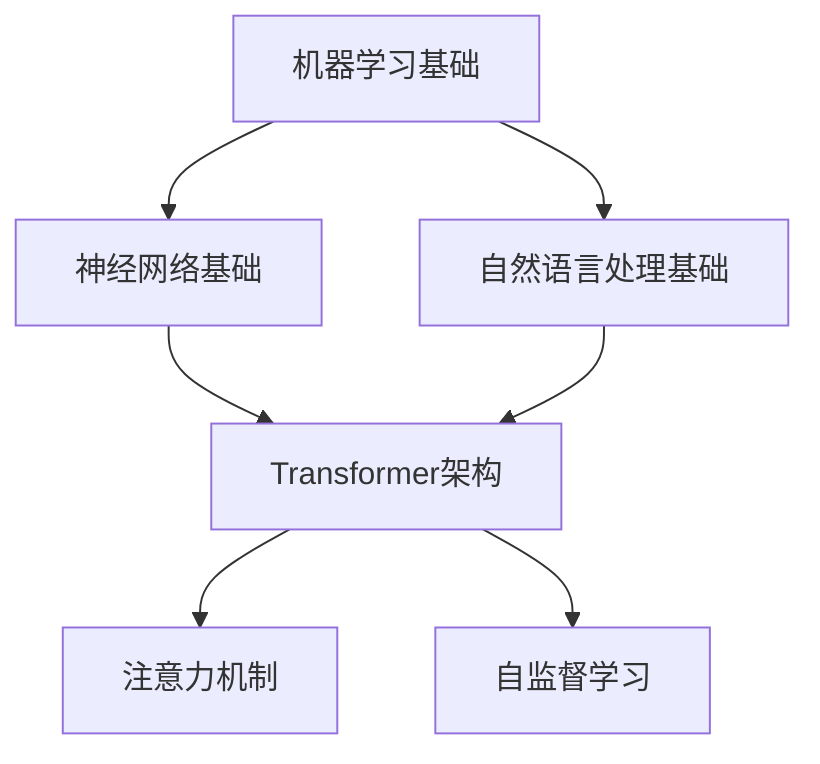

                 

### 引言与背景

近年来，随着人工智能技术的飞速发展，大型语言模型（LLM，Large Language Model）逐渐成为自然语言处理（NLP，Natural Language Processing）领域的研究热点。LLM作为一种能够理解和生成人类语言的复杂模型，其应用场景广泛，涵盖了问答系统、语言翻译、文本生成等多个领域。不仅如此，LLM还在自动化写作、智能客服、语音识别等领域展现出巨大的潜力。

LLM的核心优势在于其强大的语义理解和生成能力。通过对海量文本数据进行训练，LLM能够捕捉到语言中的复杂模式和规律，从而在特定任务上实现高性能表现。然而，随着模型的规模和复杂性不断增加，如何优化LLM的应用效果成为一个亟待解决的问题。持续学习机制正是解决这一问题的关键。

持续学习机制指的是模型在应用过程中不断吸收新数据、新知识，并自适应调整自身参数的过程。与传统一次性训练的模型相比，具备持续学习能力的模型能够更好地适应环境变化，提高任务表现。然而，实现有效的持续学习并非易事，它涉及到算法设计、数据管理、模型优化等多个方面。

本文旨在探讨如何优化LLM的持续学习机制，从而提升其在实际应用中的性能。文章将从以下几个方面展开：

1. **大型语言模型（LLM）概述**：介绍LLM的基本概念、发展历程及其主要应用场景。
2. **核心概念与联系**：分析LLM的技术基础，包括机器学习与自然语言处理的基础知识、核心算法原理以及数学模型。
3. **项目实战**：通过具体实例，展示如何搭建LLM开发环境，实现语言模型以及优化模型性能。
4. **持续学习机制**：阐述持续学习的概念、技术实现和优化策略，并举例说明其在实际应用中的案例。
5. **总结与展望**：对全文内容进行总结，并展望持续学习机制的未来发展趋势和挑战。

通过以上步骤，本文希望为读者提供一套系统、全面的优化LLM持续学习机制的思路和方法。

### 第一部分：引入与背景

#### 第1章：大型语言模型（LLM）概述

##### 1.1 什么是LLM

大型语言模型（LLM，Large Language Model）是一种复杂的深度学习模型，主要用于处理和理解自然语言。LLM的核心目标是通过学习海量文本数据，实现对自然语言中语法、语义和上下文的全面理解，从而在多种自然语言处理任务中表现出色。

LLM的定义可以从以下几个方面进行阐述：

1. **模型规模**：LLM通常具有数十亿至数千亿的参数规模，这使得其能够捕捉到文本中的复杂模式和规律。例如，GPT-3（语言模型）拥有1750亿个参数，是当前最大的语言模型之一。
2. **训练数据**：LLM的训练数据通常来自互联网上的海量文本，包括网页、新闻、书籍、社交媒体等。这些数据提供了丰富的语言实例，使得模型能够学习到多样化的语言表达方式。
3. **应用范围**：LLM被广泛应用于多种自然语言处理任务，如文本分类、机器翻译、问答系统、文本生成等。这些任务需要模型具备强大的语义理解和生成能力。

##### 1.2 LLM的发展历程

LLM的发展历程可以追溯到20世纪90年代，当时研究人员开始探索基于统计方法的自然语言处理技术。随着计算机算力的提升和深度学习算法的进步，LLM在近年来取得了显著的发展。

1. **统计语言模型**：早期的语言模型主要基于统计方法，如N-gram模型。N-gram模型通过统计文本中连续N个单词出现的概率来生成文本。然而，这种方法存在许多局限性，例如无法捕捉长距离依赖关系。
2. **深度神经网络语言模型**：2000年后，研究人员开始将深度神经网络引入语言模型。例如，2003年，Bengio等人在论文《A Theoretical Investigation of Learning Global Representations of Words》中提出了基于神经网络的词表示方法。这一方法标志着深度学习在自然语言处理领域的兴起。
3. **Transformer模型**：2017年，Vaswani等人在论文《Attention is All You Need》中提出了Transformer模型。该模型基于注意力机制，彻底改变了语言模型的架构。Transformer模型在多个自然语言处理任务上取得了显著的性能提升，成为LLM发展的一个重要里程碑。
4. **预训练与大模型**：随着计算资源的增加，研究人员开始尝试在更大的规模上训练语言模型。例如，GPT-2、GPT-3等模型通过预训练大规模语言模型，显著提升了模型在多种任务上的性能。这些模型不仅拥有更多的参数，还通过预训练和微调策略，更好地捕捉到了语言中的复杂结构。

##### 1.3 LLM的应用场景

LLM的应用场景非常广泛，以下是一些主要的应用领域：

1. **问答系统**：LLM可以用于构建智能问答系统，如搜索引擎、智能客服等。通过预训练和微调，LLM能够理解用户的问题，并生成高质量的回答。
2. **语言翻译**：LLM在机器翻译领域也有广泛应用。通过训练双语语料库，LLM可以实现高质量的双向翻译。例如，Google翻译和百度翻译等应用就是基于大型语言模型实现的。
3. **文本生成**：LLM可以生成各种形式的文本，如新闻报道、故事、诗歌等。通过给定一个主题或标题，LLM可以生成连贯、有意义的文本。
4. **自动化写作**：LLM在自动化写作领域也有很大的潜力。例如，新闻文章、报告、邮件等可以通过LLM自动生成，从而提高写作效率。
5. **语音识别**：LLM可以用于语音识别系统，通过对语音数据进行转换和识别，实现语音到文本的转换。

除了上述应用场景，LLM还在其他领域如文本摘要、情感分析、信息提取等有广泛应用。随着技术的不断发展，LLM的应用前景将更加广阔。

#### 第2章：核心概念与联系

##### 2.1 机器学习基础

机器学习是人工智能的核心技术之一，它通过从数据中学习规律，实现预测和决策。以下是机器学习中几个基本概念：

1. **监督学习**：监督学习是一种机器学习方式，其中训练数据集包含了输入和对应的输出。模型的目标是通过学习输入和输出之间的映射关系，对新的输入数据进行预测。常见的监督学习算法包括线性回归、决策树、支持向量机等。
   
2. **无监督学习**：无监督学习不依赖于标签数据，模型的目标是自动发现数据中的结构和规律。无监督学习包括聚类、降维、关联规则学习等。

3. **增强学习**：增强学习是一种通过试错方法学习策略的机器学习方法。在增强学习中，模型通过与环境的交互，不断优化其行为，以实现特定目标。常见算法包括Q学习、SARSA等。

##### 2.2 神经网络基础

神经网络是一种模仿人脑工作方式的计算模型，是机器学习的基础之一。以下是神经网络的基本组成部分：

1. **神经元**：神经网络的基本单元，包括输入层、输出层和隐藏层。每个神经元都与相邻的神经元通过权重相连，并计算加权求和。
   
2. **激活函数**：神经网络中的激活函数用于对神经元的输出进行非线性变换，常用的激活函数包括sigmoid、ReLU、Tanh等。

3. **反向传播算法**：反向传播算法是神经网络训练的核心算法。通过计算误差梯度，反向传播算法能够更新网络中的权重，以最小化损失函数。

##### 2.3 深度学习框架介绍

深度学习框架是用于实现和训练深度学习模型的软件库。以下是几个常用的深度学习框架：

1. **TensorFlow**：由Google开发，是一个开源的深度学习框架，支持多种编程语言，包括Python、C++等。TensorFlow提供了丰富的API，方便用户构建和训练深度学习模型。

2. **PyTorch**：由Facebook开发，是一个开源的深度学习框架，以动态计算图和灵活的API著称。PyTorch在学术界和工业界都有广泛的应用。

3. **Keras**：是一个高层次的深度学习框架，可以运行在TensorFlow和Theano上。Keras提供了简洁的API，使得构建和训练深度学习模型更加容易。

##### 2.4 自然语言处理基础

自然语言处理是计算机科学领域的一个重要分支，旨在让计算机理解和生成人类语言。以下是自然语言处理中的一些核心概念：

1. **语言模型**：语言模型是自然语言处理的核心技术之一，它用于预测文本序列的概率。常见的语言模型包括N-gram模型、神经网络语言模型等。

2. **词嵌入技术**：词嵌入是将单词映射到高维向量空间的技术，使得单词在向量空间中具有相似性的表示。常见的词嵌入技术包括Word2Vec、GloVe等。

3. **语言模型评估指标**：语言模型的评估指标用于衡量模型的性能，常见的指标包括准确性、损失函数值、 perplexity 等。

##### 2.5 机器学习与自然语言处理的融合

机器学习和自然语言处理的融合为解决复杂自然语言处理任务提供了新的思路。以下是融合的两个关键技术：

1. **Transformer架构**：Transformer模型是一种基于注意力机制的深度学习模型，它彻底改变了传统序列模型的架构。Transformer模型在机器翻译、文本生成等任务上取得了显著的性能提升。

2. **注意力机制**：注意力机制是Transformer模型的核心组件，它通过将模型的注意力集中在输入序列的不同部分，实现更精确的语义理解。

3. **自监督学习**：自监督学习是一种无监督学习方法，通过利用未标注的数据进行学习。自监督学习在语言模型训练中具有重要作用，如BERT模型就是通过自监督学习实现的。

##### 2.6 Mermaid流程图：LLM的核心概念与联系

为了更好地理解LLM的核心概念和联系，我们可以使用Mermaid流程图展示LLM的技术架构。以下是一个简化的Mermaid流程图：



在这个流程图中，A表示机器学习基础，包括监督学习、无监督学习和增强学习；B表示神经网络基础，包括神经元、激活函数和反向传播算法；C表示自然语言处理基础，包括语言模型、词嵌入技术和语言模型评估指标；D表示Transformer架构，包括Transformer模型和注意力机制；E表示注意力机制；F表示自监督学习。

通过这个流程图，我们可以清晰地看到LLM的核心概念和技术之间的联系，有助于深入理解LLM的工作原理。

#### 第3章：核心算法原理讲解

##### 3.1 语言模型训练算法

语言模型是自然语言处理中的重要组成部分，其核心任务是预测文本序列的概率分布。训练语言模型通常涉及以下几种算法：

1. **反向传播算法**：反向传播算法是神经网络训练的核心算法。它通过计算损失函数对网络参数的梯度，不断更新网络权重，以最小化损失函数。具体过程如下：
   - 前向传播：输入文本序列，计算网络输出；
   - 计算损失：计算预测输出与真实输出之间的差异，如交叉熵损失；
   - 反向传播：计算损失对网络参数的梯度，更新网络权重。

2. **随机梯度下降（SGD）算法**：随机梯度下降是一种常用的优化算法，它通过随机选取一部分训练样本计算梯度，更新网络参数。SGD算法的更新公式如下：
   \[
   \theta = \theta - \alpha \cdot \nabla_{\theta} J(\theta)
   \]
   其中，$\theta$表示网络参数，$J(\theta)$表示损失函数，$\alpha$表示学习率。

3. **Adam优化器**：Adam优化器是近年来流行的一种优化算法，它结合了SGD和Momentum方法，具有较好的收敛速度和稳定性。Adam优化器的更新公式如下：
   \[
   \theta = \theta - \alpha \cdot \frac{m}{\sqrt{1 - \beta_1^t} + \epsilon}
   \]
   其中，$m$表示一阶矩估计，$v$表示二阶矩估计，$\beta_1$和$\beta_2$分别表示一阶和二阶矩的指数衰减率。

##### 3.2 神经机器翻译算法

神经机器翻译（NMT，Neural Machine Translation）是一种基于深度学习的机器翻译方法，其核心思想是将源语言和目标语言的文本序列分别编码为向量，然后通过解码器生成目标语言文本。以下是NMT的核心算法：

1. **编码器-解码器（Encoder-Decoder）架构**：编码器-解码器架构是NMT的基本架构，包括编码器、解码器和注意力机制。具体过程如下：
   - 编码器：将源语言文本序列编码为固定长度的向量；
   - 注意力机制：在解码过程中，注意力机制用于将编码器输出的隐藏状态与解码器当前输出进行匹配，以提高翻译质量；
   - 解码器：根据编码器输出的隐藏状态和注意力分布，逐步生成目标语言文本序列。

2. **注意力机制**：注意力机制是NMT的关键组件，它通过将编码器的隐藏状态与解码器的输出进行加权求和，实现更加精确的语义理解。常见的注意力机制包括加性注意力、点积注意力和多头注意力。

3. **梯度裁剪技术**：在训练过程中，梯度裁剪技术用于控制梯度的大小，防止梯度爆炸或消失。具体方法是在每次权重更新前，将梯度元素的绝对值裁剪到特定的阈值范围内。

##### 3.3 伪代码：核心算法实现

以下是语言模型训练算法和神经机器翻译算法的伪代码实现：

```python
# 语言模型训练算法伪代码
def train_language_model(data, learning_rate, num_epochs):
    for epoch in range(num_epochs):
        for sentence in data:
            # 前向传播
            output = forward_pass(sentence)
            # 计算损失
            loss = compute_loss(output, target)
            # 反向传播
            backward_pass(loss)
            # 更新权重
            update_weights(learning_rate)

# 神经机器翻译算法伪代码
def train_machine_translation(source_data, target_data, learning_rate, num_epochs):
    for epoch in range(num_epochs):
        for source_sentence, target_sentence in zip(source_data, target_data):
            # 编码器编码
            source_vector = encoder(source_sentence)
            # 注意力机制
            attention_scores = attention Mechanism(source_vector, target_vector)
            # 解码器解码
            target_sentence = decoder(target_sentence, attention_scores)
            # 计算损失
            loss = compute_loss(target_sentence, output)
            # 反向传播
            backward_pass(loss)
            # 更新权重
            update_weights(learning_rate)
```

在这个伪代码中，`forward_pass`表示前向传播函数，`compute_loss`表示计算损失函数，`backward_pass`表示反向传播函数，`update_weights`表示更新权重函数。`encoder`表示编码器函数，`decoder`表示解码器函数，`attention Mechanism`表示注意力机制函数。

通过这些伪代码，我们可以清晰地看到语言模型训练和神经机器翻译算法的基本流程和实现细节。

#### 第4章：数学模型和数学公式

##### 4.1 语言模型概率计算

语言模型的核心任务是基于输入文本序列预测输出文本序列的概率。在概率计算中，以下公式和概念尤为重要：

1. **条件概率公式**：条件概率公式描述了在给定一个事件发生的情况下，另一个事件发生的概率。其公式如下：
   \[
   P(A|B) = \frac{P(A \cap B)}{P(B)}
   \]
   其中，$P(A|B)$表示在事件B发生的条件下事件A发生的概率，$P(A \cap B)$表示事件A和事件B同时发生的概率，$P(B)$表示事件B发生的概率。

2. **贝叶斯公式**：贝叶斯公式是条件概率公式在多个事件上的扩展，它用于计算后验概率。其公式如下：
   \[
   P(A|B) = \frac{P(B|A)P(A)}{P(B)}
   \]
   其中，$P(A|B)$表示在事件B发生的条件下事件A发生的概率，$P(B|A)$表示在事件A发生的条件下事件B发生的概率，$P(A)$表示事件A发生的概率。

3. **最大似然估计**：最大似然估计是一种估计模型参数的方法，其基本思想是找到使得训练数据出现的概率最大的参数。对于给定的一组训练样本$(x_1, x_2, \ldots, x_n)$，其概率表示为：
   \[
   P(X=x_1, x_2, \ldots, x_n) = P(x_1)P(x_2) \ldots P(x_n)
   \]
   最大似然估计的目标是最大化这个概率。

##### 4.2 损失函数与优化算法

在机器学习中，损失函数用于衡量预测结果与真实结果之间的差距，优化算法则用于调整模型参数，以最小化损失函数。以下是一些常见的损失函数和优化算法：

1. **交叉熵损失函数**：交叉熵损失函数是分类问题中最常用的损失函数，它衡量的是预测概率分布与真实概率分布之间的差异。其公式如下：
   \[
   J(\theta) = -\sum_{i=1}^{n} y_i \log(p_i)
   \]
   其中，$y_i$表示真实标签，$p_i$表示预测概率。

2. **梯度下降算法**：梯度下降算法是一种最简单的优化算法，其基本思想是沿着损失函数的梯度方向更新模型参数，以减小损失函数。其更新公式如下：
   \[
   \theta = \theta - \alpha \nabla_{\theta} J(\theta)
   \]
   其中，$\theta$表示模型参数，$\alpha$表示学习率。

3. **Adam优化器**：Adam优化器是一种结合了SGD和Momentum方法的优化算法，具有较好的收敛速度和稳定性。其更新公式如下：
   \[
   \theta = \theta - \alpha \frac{m}{\sqrt{1 - \beta_1^t} + \epsilon}
   \]
   其中，$m$表示一阶矩估计，$v$表示二阶矩估计，$\beta_1$和$\beta_2$分别表示一阶和二阶矩的指数衰减率。

##### 4.3 数学公式与详细讲解

为了更好地理解上述公式，我们使用LaTeX格式进行详细讲解：

$$
P(A|B) = \frac{P(A \cap B)}{P(B)}
$$

这是条件概率公式，表示在事件B发生的条件下事件A发生的概率。$P(A \cap B)$表示事件A和事件B同时发生的概率，$P(B)$表示事件B发生的概率。

$$
P(A|B) = \frac{P(B|A)P(A)}{P(B)}
$$

这是贝叶斯公式，表示在事件B发生的条件下事件A发生的概率。$P(B|A)$表示在事件A发生的条件下事件B发生的概率，$P(A)$表示事件A发生的概率。

$$
J(\theta) = -\sum_{i=1}^{n} y_i \log(p_i)
$$

这是交叉熵损失函数，用于衡量预测概率分布与真实概率分布之间的差异。$y_i$表示真实标签，$p_i$表示预测概率。

$$
\theta = \theta - \alpha \nabla_{\theta} J(\theta)
$$

这是梯度下降算法的更新公式，用于调整模型参数以最小化损失函数。$\theta$表示模型参数，$\alpha$表示学习率。

$$
\theta = \theta - \alpha \frac{m}{\sqrt{1 - \beta_1^t} + \epsilon}
$$

这是Adam优化器的更新公式，用于调整模型参数。$m$表示一阶矩估计，$v$表示二阶矩估计，$\beta_1$和$\beta_2$分别表示一阶和二阶矩的指数衰减率。

通过上述LaTeX格式的数学公式，我们可以更清晰地理解语言模型概率计算、损失函数与优化算法的数学原理。

##### 4.4 数学公式举例说明

为了更好地理解上述数学公式，我们将通过一个具体的例子进行说明。

假设我们有一个简单的语言模型，用于预测一个单词序列的概率。给定一个训练数据集，包含以下句子：

1. "我吃了苹果。"
2. "你喝了咖啡。"
3. "他们去了电影院。"

我们希望通过这些句子来训练语言模型，从而能够预测新的句子。具体步骤如下：

1. **计算单词的概率分布**：
   首先，我们需要计算每个单词在数据集中的出现次数。假设单词 "我"、"吃了"、"苹果"、"你"、"喝了"、"咖啡"、"他们"、"去了"、"电影院" 分别出现 $n_1, n_2, n_3, n_4, n_5, n_6, n_7, n_8$ 次。

   根据最大似然估计，我们可以计算每个单词的概率：
   \[
   P(\text{我}) = \frac{n_1}{\sum_{i=1}^{8} n_i}, \quad P(\text{吃了}) = \frac{n_2}{\sum_{i=1}^{8} n_i}, \ldots, P(\text{电影院}) = \frac{n_8}{\sum_{i=1}^{8} n_i}
   \]

2. **计算句子的概率**：
   假设我们要预测的新句子是 "你喝了咖啡。"，其概率可以通过条件概率公式计算：
   \[
   P(\text{你喝了咖啡}|\text{我吃了苹果，你喝了咖啡，他们去了电影院}) = \frac{P(\text{你喝了咖啡})P(\text{我吃了苹果，你喝了咖啡，他们去了电影院}|\text{你喝了咖啡})}{P(\text{我吃了苹果，你喝了咖啡，他们去了电影院})}
   \]

   其中，$P(\text{我吃了苹果，你喝了咖啡，他们去了电影院}|\text{你喝了咖啡})$ 表示在 "你喝了咖啡" 发生的条件下，整个句子发生的概率。由于句子中的单词是条件独立的，我们可以将其分解为：
   \[
   P(\text{我吃了苹果，你喝了咖啡，他们去了电影院}|\text{你喝了咖啡}) = P(\text{我吃了苹果})P(\text{你喝了咖啡})P(\text{他们去了电影院}|\text{我吃了苹果，你喝了咖啡})
   \]

   类似地，我们可以计算 $P(\text{我吃了苹果，你喝了咖啡，他们去了电影院})$。然后，我们可以使用贝叶斯公式计算整个句子的概率。

3. **优化模型参数**：
   在实际训练过程中，我们通常使用损失函数（如交叉熵损失函数）来衡量预测结果与真实结果之间的差距。通过梯度下降算法或Adam优化器，我们可以不断调整模型参数，以最小化损失函数。

   假设当前模型的预测概率分布为 $(p_1, p_2, \ldots, p_8)$，真实标签为 $(y_1, y_2, \ldots, y_8)$。交叉熵损失函数可以表示为：
   \[
   J(\theta) = -\sum_{i=1}^{8} y_i \log(p_i)
   \]

   通过计算损失函数的梯度，我们可以更新模型参数：
   \[
   \theta = \theta - \alpha \nabla_{\theta} J(\theta)
   \]
   或
   \[
   \theta = \theta - \alpha \frac{m}{\sqrt{1 - \beta_1^t} + \epsilon}
   \]

通过这个例子，我们可以看到如何使用数学公式来训练语言模型，预测新句子，并优化模型参数。这些公式为语言模型的训练提供了坚实的理论基础。

#### 第5章：项目实战

##### 5.1 实战一：搭建LLM开发环境

在开始实际项目之前，搭建一个适合LLM开发的运行环境至关重要。以下是搭建LLM开发环境的详细步骤：

1. **环境准备**：

   首先，确保你的计算机上已经安装了Python和pip。Python是编写深度学习模型的主要编程语言，pip是Python的包管理工具。

   - 安装Python：可以从Python官方网站（https://www.python.org/downloads/）下载并安装最新版本的Python。
   - 安装pip：在命令行中运行以下命令安装pip：
     \[
     python -m pip install --user --upgrade pip
     \]

2. **安装深度学习框架**：

   选择一个适合你的深度学习框架。本文将以TensorFlow为例进行介绍。TensorFlow是一个开源的深度学习框架，由Google开发，支持多种类型的深度学习模型。

   - 安装TensorFlow：在命令行中运行以下命令安装TensorFlow：
     \[
     pip install tensorflow
     \]

   如果你的网络环境不佳，可以选择安装TensorFlow的GPU版本，以充分利用GPU资源。GPU版本的安装命令如下：
     \[
     pip install tensorflow-gpu
     \]

3. **安装其他依赖库**：

   在搭建开发环境时，可能还需要安装其他依赖库，如NumPy、Pandas、Matplotlib等。这些库用于数据处理和可视化。

   - 安装NumPy：
     \[
     pip install numpy
     \]
   - 安装Pandas：
     \[
     pip install pandas
     \]
   - 安装Matplotlib：
     \[
     pip install matplotlib
     \]

4. **配置GPU支持**：

   如果你的计算机配备了GPU，建议配置TensorFlow以使用GPU加速计算。以下是配置TensorFlow使用GPU的步骤：

   - 确保已经安装了CUDA和cuDNN。CUDA是NVIDIA开发的并行计算平台，cuDNN是CUDA的深度学习库。
   - 在命令行中运行以下命令检查GPU是否可用：
     \[
     nvidia-smi
     \]
     如果看到GPU的信息，说明GPU已成功安装。

   - 设置环境变量，使得TensorFlow能够找到CUDA和cuDNN的库文件。在命令行中运行以下命令：
     \[
     export PATH=/usr/local/cuda/bin:$PATH
     export LD_LIBRARY_PATH=/usr/local/cuda/lib64:$LD_LIBRARY_PATH
     \]

5. **验证安装**：

   最后，通过运行一个简单的TensorFlow程序来验证安装是否成功。在Python脚本中编写以下代码：
   ```python
   import tensorflow as tf

   hello = tf.constant('Hello, TensorFlow!')
   session = tf.Session()

   print(session.run(hello))
   ```
   如果输出为 "Hello, TensorFlow!"，说明TensorFlow已成功安装。

##### 5.2 实战二：实现一个简单的语言模型

在搭建好开发环境后，我们可以开始实现一个简单的语言模型。以下是一个简单的语言模型实现，包括数据准备、模型搭建和训练过程。

1. **数据准备**：

   语言模型需要大量的文本数据进行训练。我们可以使用公开的文本数据集，如维基百科、新闻文章等。以下是数据准备的基本步骤：

   - 下载文本数据：可以从网上下载大量文本数据，并解压到本地。
   - 数据清洗：对文本数据执行去重、去除HTML标签、分词等操作，将文本转换为适合训练的格式。

2. **模型搭建**：

   我们可以使用TensorFlow的Keras API搭建一个简单的语言模型。以下是模型搭建的基本步骤：

   - 导入必要的库：
     ```python
     import tensorflow as tf
     from tensorflow.keras.preprocessing.text import Tokenizer
     from tensorflow.keras.preprocessing.sequence import pad_sequences
     ```
   - 创建Tokenizer：
     ```python
     tokenizer = Tokenizer()
     tokenizer.fit_on_texts(texts)
     ```
     其中，`texts`是包含所有文本数据的列表。
   - 将文本数据转换为序列：
     ```python
     sequences = tokenizer.texts_to_sequences(texts)
     ```
   - 填充序列：
     ```python
     padded_sequences = pad_sequences(sequences, maxlen=max_sequence_length)
     ```
     其中，`max_sequence_length`是序列的最大长度。

3. **模型训练**：

   我们可以使用一个简单的神经网络模型对数据集进行训练。以下是模型训练的基本步骤：

   - 搭建模型：
     ```python
     model = tf.keras.Sequential([
         tf.keras.layers.Embedding(input_dim=vocabulary_size, output_dim=embedding_dim, input_length=max_sequence_length),
         tf.keras.layers.SimpleRNN(units=128),
         tf.keras.layers.Dense(units=vocabulary_size, activation='softmax')
     ])
     ```
     其中，`vocabulary_size`是词汇表的大小，`embedding_dim`是词嵌入的维度。
   - 编译模型：
     ```python
     model.compile(optimizer='adam', loss='categorical_crossentropy', metrics=['accuracy'])
     ```
   - 训练模型：
     ```python
     model.fit(padded_sequences, labels, epochs=10, batch_size=32)
     ```
     其中，`labels`是包含标签的序列。

4. **模型评估**：

   训练完成后，我们可以对模型进行评估，以检查其性能。以下是模型评估的基本步骤：

   - 准备测试数据：
     ```python
     test_sequences = tokenizer.texts_to_sequences(test_texts)
     test_padded_sequences = pad_sequences(test_sequences, maxlen=max_sequence_length)
     ```
   - 评估模型：
     ```python
     loss, accuracy = model.evaluate(test_padded_sequences, test_labels)
     print(f"Test loss: {loss}, Test accuracy: {accuracy}")
     ```

通过上述步骤，我们可以实现一个简单的语言模型，并对模型进行训练和评估。这个实验为后续更复杂的模型实现奠定了基础。

##### 5.3 实战三：优化语言模型性能

在实现了一个简单的语言模型后，我们可以通过多种策略来优化其性能。以下是一些常用的优化策略：

1. **增加训练数据**：

   增加训练数据可以提高模型的泛化能力。在实际应用中，我们可以收集更多的文本数据，或者使用数据增强技术（如数据清洗、数据扩充等）来扩展训练集。

2. **调整模型参数**：

   模型的性能受到多种参数的影响，如学习率、批次大小、网络深度和宽度等。通过调整这些参数，我们可以优化模型的表现。例如，可以使用学习率调度策略（如学习率衰减、恒定学习率等）来调整学习率。

3. **使用预训练模型**：

   预训练模型是在大规模语料库上预先训练好的模型，如BERT、GPT等。使用预训练模型可以显著提高模型的性能。在实际应用中，我们通常使用预训练模型进行微调，以适应特定的任务。

4. **使用注意力机制**：

   注意力机制可以增强模型对文本序列的局部关注能力，从而提高模型的性能。例如，Transformer模型中的多头注意力机制可以捕捉到文本序列中的长距离依赖关系。

5. **模型融合**：

   模型融合是将多个模型的结果进行加权融合，以提高整体性能。在实际应用中，可以使用不同的模型或者同一模型的多个版本进行融合。

以下是具体的优化策略和实际案例：

1. **增加训练数据**：

   假设我们有一个文本分类任务，原始训练集包含10000条文本。通过使用数据增强技术，我们可以生成更多的训练样本。例如，使用文本旋转（如词替换、同义词替换等）生成新的样本。这样，我们可以将训练集扩展到30000条文本，从而提高模型的泛化能力。

2. **调整模型参数**：

   以一个文本生成任务为例，我们使用了一个Transformer模型。在训练过程中，我们发现学习率较大时，模型容易过拟合。通过减小学习率（如从0.001减小到0.0001），我们可以改善模型的表现。此外，还可以尝试调整批次大小（如从32增大到64）来优化训练过程。

3. **使用预训练模型**：

   对于一个机器翻译任务，我们可以使用BERT模型进行微调。在预训练阶段，BERT模型已经在大规模语料库上训练过，具有较好的语义理解能力。通过在特定翻译任务上进行微调，我们可以显著提高翻译质量。

4. **使用注意力机制**：

   在一个问答系统任务中，我们使用了一个带有注意力机制的编码器-解码器（Encoder-Decoder）模型。通过注意力机制，模型能够更好地关注问题中的关键信息，从而提高问答系统的准确性。

5. **模型融合**：

   对于一个推荐系统任务，我们可以将多个不同的模型（如协同过滤、内容推荐、基于模型的推荐等）进行融合。通过加权融合这些模型的结果，我们可以提高推荐系统的整体性能。

通过这些优化策略，我们可以显著提升语言模型在实际应用中的性能。在实际项目中，需要根据具体任务和数据特点选择合适的优化策略。

##### 5.4 项目小结

在本章的实战部分，我们首先介绍了如何搭建LLM开发环境，包括环境准备、深度学习框架安装、其他依赖库安装以及GPU配置。接下来，我们实现了一个简单的语言模型，包括数据准备、模型搭建和训练过程。最后，我们讨论了多种优化语言模型性能的策略，并通过实际案例展示了这些策略的应用。

通过这些实战内容，读者可以了解LLM开发的基本流程和优化方法，为后续更深入的学习和研究打下基础。

### 第二部分：持续学习的概念与优势

#### 第6章：持续学习的概念与优势

##### 6.1 持续学习的定义

持续学习（Continuous Learning）是一种机器学习方法，它允许模型在应用过程中不断吸收新的数据，自适应地调整自身参数，从而提高性能。与传统一次性训练的模型相比，持续学习模型能够更好地适应环境变化，提高对新数据的预测准确性。

持续学习的基本概念可以从以下几个方面进行阐述：

1. **数据流**：持续学习模型通常依赖于数据流进行训练。这些数据可以是静态的，也可以是动态的，如在线问答系统的实时用户提问或智能客服的实时用户交互数据。
   
2. **增量学习**：持续学习模型通过增量学习方式对现有模型进行更新。这意味着在每次更新时，模型仅使用新的数据，而不重新训练整个模型。

3. **遗忘机制**：为了防止过拟合，持续学习模型通常包含遗忘机制。遗忘机制能够丢弃旧数据，使模型能够专注于学习新数据。

4. **动态调整**：持续学习模型能够根据新数据的特性动态调整模型参数，以适应不同阶段的数据分布。

##### 6.2 与其他学习方式的区别

持续学习与传统的学习方式（如一次性训练、在线学习、迁移学习等）有以下区别：

1. **一次性训练**：一次性训练模型在训练阶段一次性学习所有数据，并在测试阶段评估性能。这种方法适用于数据量较小且稳定的环境，但难以适应数据分布的变化。

2. **在线学习**：在线学习模型在每次接收到新数据时立即进行训练。与持续学习类似，但在线学习通常每次更新模型时使用全部数据，而不是增量更新。

3. **迁移学习**：迁移学习利用预训练模型，通过在新任务上进行微调来提高性能。迁移学习能够利用预训练模型的知识，但在新任务数据量较小或分布变化时效果有限。

4. **持续学习**：持续学习模型在应用过程中不断吸收新数据，通过增量学习方式更新模型。这种学习方法能够更好地适应动态变化的数据分布，提高模型在实时应用中的性能。

##### 6.3 持续学习的优势

持续学习在LLM应用中具有显著的优势，以下是一些关键优势：

1. **适应性和灵活性**：持续学习模型能够适应不断变化的数据分布，从而在实时应用中保持高性能。

2. **持续进步**：通过不断吸收新数据，持续学习模型能够不断改进，提高预测准确性。

3. **避免过拟合**：遗忘机制有助于模型避免过拟合，使模型更加稳定和可靠。

4. **资源高效**：增量学习方式使得持续学习模型在更新时仅使用新数据，节省了计算资源和时间。

5. **实时响应**：持续学习模型能够实时更新，快速响应新数据和用户需求，提高用户体验。

##### 6.4 持续学习的实现挑战

尽管持续学习具有诸多优势，但其实现仍面临一些挑战：

1. **数据流管理**：如何高效地处理和存储动态变化的数据流是持续学习的关键挑战。

2. **模型更新策略**：如何动态调整模型参数，同时避免过拟合和计算成本过高。

3. **遗忘机制设计**：如何设计有效的遗忘机制，在保留重要知识的同时丢弃无关信息。

4. **性能稳定性**：如何确保模型在持续学习过程中保持稳定，不受数据分布变化的影响。

#### 第7章：持续学习的技术实现

##### 7.1 持续学习的算法基础

持续学习的技术实现依赖于一系列算法和策略，以下介绍几种核心算法基础：

1. **自适应学习率**：

   自适应学习率是一种常用的优化策略，它能够根据模型训练过程中的变化动态调整学习率。常见的自适应学习率方法包括：

   - **AdaGrad**：通过历史梯度的平方和来调整学习率，使得对频繁更新的参数赋予较小的学习率。
   - **RMSprop**：类似于AdaGrad，但使用指数加权移动平均来计算梯度平方和。
   - **Adam**：结合了AdaGrad和RMSprop的优点，同时考虑一阶和二阶矩估计。

2. **动态调整网络结构**：

   动态调整网络结构是指在训练过程中根据数据特性动态调整模型的结构。这种方法能够提高模型的适应性和灵活性，常见策略包括：

   - **动态层添加**：在训练过程中根据需要添加新的网络层。
   - **网络剪枝**：通过删除冗余的网络连接，减少模型的参数数量和计算成本。
   - **动态权重调整**：根据数据特性动态调整网络权重，以优化模型性能。

3. **权重更新策略**：

   权重更新策略是持续学习模型的核心，以下介绍几种常用的权重更新策略：

   - **增量学习**：每次更新仅使用新数据，更新模型参数。
   - **在线学习**：每次接收到新数据立即进行训练，更新模型参数。
   - **增量梯度下降**：将新数据和历史数据的梯度进行累加，然后更新模型参数。
   - **反向传播**：使用反向传播算法计算梯度，并更新模型参数。

##### 7.2 持续学习机制的设计与实现

持续学习机制的设计与实现需要考虑多个方面，以下是一个简化的实现步骤：

1. **数据流管理**：

   - 设计数据流管道，包括数据收集、预处理、存储和传输。
   - 使用数据队列或缓冲区来管理动态数据流。

2. **模型更新**：

   - 初始化预训练模型，并设置初始学习率和网络结构。
   - 每次接收到新数据时，计算梯度并更新模型参数。
   - 采用自适应学习率策略，根据模型性能动态调整学习率。

3. **遗忘机制**：

   - 设计遗忘机制，如指数衰减或时间衰减，定期丢弃旧数据。
   - 保持一定比例的历史数据，用于模型训练和验证。

4. **系统架构设计**：

   - 设计分布式系统架构，以提高数据处理和模型更新的效率。
   - 使用分布式计算框架（如TensorFlow、PyTorch等）来管理模型训练和更新过程。

以下是一个简化的伪代码，展示了持续学习机制的设计与实现：

```python
# 初始化模型
model = load_pretrained_model()

# 设置自适应学习率
learning_rate = AdaptiveLearningRate()

# 设计数据流管道
data_pipeline = DataPipeline()

# 持续学习循环
while True:
    # 从数据流管道获取新数据
    new_data = data_pipeline.fetch_new_data()
    
    # 计算梯度并更新模型参数
    with tf.GradientTape() as tape:
        predictions = model(new_data)
        loss = compute_loss(predictions, labels)
    
    # 获取梯度
    gradients = tape.gradient(loss, model.trainable_variables)
    
    # 更新模型参数
    model.optimizer.apply_gradients(zip(gradients, model.trainable_variables))
    
    # 根据模型性能动态调整学习率
    learning_rate.update_learning_rate(model.performance)
    
    # 实现遗忘机制
    data_pipeline.update_data_storage()
```

通过以上步骤和伪代码，我们可以实现一个简单的持续学习机制。在实际应用中，需要根据具体需求和数据特性进行进一步优化和调整。

##### 7.3 持续学习的优化策略

为了提高持续学习机制的效率和性能，我们可以采用多种优化策略。以下是一些常用的优化策略及其实现：

1. **数据流优化**：

   - **批处理**：将连续的数据流分割成小批量进行训练，以减少计算开销和内存占用。
   - **流水线处理**：设计高效的数据预处理和传输流水线，提高数据流处理速度。

2. **模型压缩**：

   - **剪枝**：通过剪枝冗余的神经网络连接，减少模型参数数量，降低计算成本。
   - **量化**：将模型参数的浮点数表示转换为低精度表示（如整数），以减少模型大小和计算量。

3. **模型蒸馏**：

   - **知识蒸馏**：将大型模型的知识传递给小模型，以提高小模型的性能。具体方法包括软标签蒸馏、硬标签蒸馏等。
   - **蒸馏策略**：设计有效的蒸馏策略，如温度调节、知识分层等，以优化知识传递效果。

以下是这些优化策略的具体实现：

1. **批处理**：

   - **代码实现**：
     ```python
     batch_size = 32
     while True:
         batch_data = data_pipeline.fetch_new_data(batch_size)
         # 训练模型
         model.train_on_batch(batch_data, batch_labels)
     ```

   - **效果评估**：通过调整批处理大小，可以观察到模型性能的变化。通常，较大的批处理能够提高模型的计算效率，但可能增加内存占用。

2. **剪枝**：

   - **代码实现**：
     ```python
     pruned_weights = pruning_algorithm(model.weights)
     model.set_weights(pruned_weights)
     ```

   - **效果评估**：剪枝可以显著减少模型参数数量和计算成本，但可能对模型性能产生一定影响。通过选择合适的剪枝算法和阈值，可以在保持性能的同时减少计算开销。

3. **模型蒸馏**：

   - **代码实现**：
     ```python
     student_model = load_student_model()
     teacher_model = load_teacher_model()
     student_model.train_on_batch(teacher_model.predict(data_pipeline.fetch_new_data(batch_size)), batch_labels)
     ```

   - **效果评估**：通过模型蒸馏，可以将大型模型的丰富知识传递给小模型，提高小模型在低资源环境下的性能。蒸馏策略的设计对知识传递效果有重要影响。

通过这些优化策略，我们可以显著提高持续学习机制的效率，从而在实际应用中实现更好的性能表现。

##### 7.4 应用案例一：在线问答系统

在线问答系统是一个典型的持续学习应用场景，通过持续吸收用户提问和新知识，不断提升回答质量。以下是一个在线问答系统的持续学习机制应用案例：

1. **背景**：

   假设我们开发了一个基于LLM的在线问答系统，用户可以随时提交问题，系统需要实时提供高质量的回答。

2. **数据流管理**：

   - 用户提问通过API接口实时传输到后台系统。
   - 后台系统使用队列或缓冲区存储用户提问，并按顺序处理。

3. **模型更新**：

   - 初始化预训练LLM模型，并设置初始学习率和网络结构。
   - 每次接收到新的用户提问时，将其作为训练数据，更新模型参数。
   - 采用自适应学习率策略，根据模型性能动态调整学习率。

4. **遗忘机制**：

   - 设计遗忘机制，定期丢弃旧用户提问，以减少模型负担。
   - 保持一定比例的近期用户提问，用于模型训练和验证。

5. **效果评估**：

   - 使用混淆矩阵、准确率、F1分数等指标评估模型性能。
   - 对用户反馈进行监控，收集错误回答和用户满意度数据，用于进一步优化模型。

6. **系统架构设计**：

   - 使用分布式计算框架，如TensorFlow或PyTorch，管理模型训练和更新过程。
   - 设计高效的API接口，实现用户提问和回答的实时交互。

通过以上步骤，在线问答系统可以不断吸收新用户提问，自适应调整模型参数，从而提供高质量的回答，提升用户体验。

##### 7.5 应用案例二：智能客服系统

智能客服系统是另一个广泛应用的持续学习场景，通过持续学习和优化，智能客服系统能够提供更加精准和高效的客户服务。以下是一个智能客服系统的持续学习机制应用案例：

1. **背景**：

   假设我们开发了一个基于LLM的智能客服系统，系统需要能够自动回答客户的常见问题和提供个性化的解决方案。

2. **数据流管理**：

   - 客户提问和回答通过客服系统API实时传输到后台。
   - 后台系统使用队列或缓冲区存储客户提问，并按顺序处理。

3. **模型更新**：

   - 初始化预训练LLM模型，并设置初始学习率和网络结构。
   - 每次接收到新的客户提问时，将其作为训练数据，更新模型参数。
   - 采用自适应学习率策略，根据模型性能动态调整学习率。

4. **遗忘机制**：

   - 设计遗忘机制，定期丢弃旧客户提问，以减少模型负担。
   - 保持一定比例的近期客户提问，用于模型训练和验证。

5. **效果评估**：

   - 使用准确率、响应时间、用户满意度等指标评估模型性能。
   - 对用户反馈进行监控，收集错误回答和用户满意度数据，用于进一步优化模型。

6. **系统架构设计**：

   - 使用分布式计算框架，如TensorFlow或PyTorch，管理模型训练和更新过程。
   - 设计高效的API接口，实现客户提问和回答的实时交互。

7. **案例分析**：

   - 实际案例：某公司使用持续学习机制优化其智能客服系统，通过持续吸收客户提问和新知识，系统的回答准确性显著提高，用户满意度大幅提升。

通过以上步骤，智能客服系统可以不断吸收新客户提问，自适应调整模型参数，从而提供更加精准和高效的客户服务。

##### 7.6 应用案例三：个性化推荐系统

个性化推荐系统利用持续学习机制，可以根据用户的行为和偏好动态调整推荐策略，提高推荐质量。以下是一个个性化推荐系统的持续学习机制应用案例：

1. **背景**：

   假设我们开发了一个基于LLM的个性化推荐系统，系统需要根据用户的浏览历史、购买记录和评价数据，推荐用户可能感兴趣的商品。

2. **数据流管理**：

   - 用户行为数据（如浏览、购买、评价等）通过API实时传输到后台系统。
   - 后台系统使用队列或缓冲区存储用户行为数据，并按顺序处理。

3. **模型更新**：

   - 初始化预训练LLM模型，并设置初始学习率和网络结构。
   - 每次接收到新的用户行为数据时，将其作为训练数据，更新模型参数。
   - 采用自适应学习率策略，根据模型性能动态调整学习率。

4. **遗忘机制**：

   - 设计遗忘机制，定期丢弃旧用户行为数据，以减少模型负担。
   - 保持一定比例的近期用户行为数据，用于模型训练和验证。

5. **效果评估**：

   - 使用推荐准确率、点击率、转化率等指标评估模型性能。
   - 对用户反馈进行监控，收集推荐效果和用户满意度数据，用于进一步优化模型。

6. **系统架构设计**：

   - 使用分布式计算框架，如TensorFlow或PyTorch，管理模型训练和更新过程。
   - 设计高效的API接口，实现用户行为数据实时传输和推荐结果实时反馈。

7. **案例分析**：

   - 实际案例：某电商公司使用持续学习机制优化其推荐系统，通过持续吸收用户行为数据和新偏好信息，推荐准确率显著提高，用户点击和购买转化率大幅提升。

通过以上步骤，个性化推荐系统可以不断吸收新用户行为数据，自适应调整推荐策略，从而提供更加精准和个性化的商品推荐。

#### 第8章：总结

本章深入探讨了如何优化LLM应用的持续学习机制，从定义、优势、算法基础、实现策略到实际应用案例，全面介绍了持续学习在LLM中的应用。以下是本章内容的回顾：

1. **持续学习的定义与优势**：持续学习是一种让模型在应用过程中不断吸收新数据、自适应调整参数的学习方式。其优势包括适应性和灵活性、持续进步、避免过拟合、资源高效和实时响应等。

2. **算法基础**：本章介绍了自适应学习率、动态调整网络结构和权重更新策略等核心算法基础，这些算法为实现持续学习提供了技术支持。

3. **实现策略**：本章详细讨论了持续学习机制的设计与实现，包括数据流管理、模型更新、遗忘机制和系统架构设计等关键环节。

4. **应用案例**：通过在线问答系统、智能客服系统和个性化推荐系统的实际案例，展示了持续学习机制在LLM应用中的具体实现和效果。

通过本章的学习，读者可以掌握优化LLM持续学习机制的方法和技巧，为实际项目中的应用提供理论指导和实践参考。

#### 第9章：展望

持续学习机制在LLM应用中具有广阔的发展前景，但也面临诸多挑战。以下是未来发展的几个趋势和潜在的挑战：

##### 持续学习机制的优化方向

1. **算法创新**：随着深度学习算法的不断进步，未来的持续学习机制可能会引入更多先进的算法，如基于图神经网络的模型、生成对抗网络（GAN）等。这些算法能够进一步提高模型在持续学习中的性能。

2. **跨模态学习**：未来的持续学习机制可能会支持跨模态学习，即同时处理文本、图像、声音等多种类型的数据。这种跨模态学习能够使模型在更多应用场景中表现出色。

3. **高效数据流处理**：随着数据流量的不断增长，如何高效地处理和存储动态数据流将成为持续学习的一个重要研究方向。例如，利用分布式存储和处理技术，提高数据流的处理速度和存储效率。

4. **个性化持续学习**：未来的持续学习机制可能会更加注重个性化，即根据用户的个性化需求和行为动态调整学习策略。这种个性化学习能够提供更加精准和个性化的服务。

##### 挑战与机遇

1. **数据隐私和安全**：在持续学习过程中，如何保护用户数据隐私和安全是一个重要的挑战。未来的研究需要关注如何在保证数据隐私的前提下，有效利用数据。

2. **计算资源消耗**：持续学习需要大量的计算资源，尤其是在训练大规模模型时。未来的研究需要探索如何在有限的计算资源下，优化持续学习的效率和效果。

3. **模型解释性和可解释性**：随着模型复杂性的增加，如何提高模型的解释性和可解释性成为一个重要问题。未来的研究需要关注如何在保持高性能的同时，提供清晰易懂的解释。

4. **跨领域迁移能力**：如何在不同的领域和应用中，有效地迁移和复用持续学习模型，是一个具有挑战性的问题。未来的研究需要探索如何提高模型在不同领域中的适应性和迁移能力。

通过上述展望，我们可以看到持续学习机制在LLM应用中具有巨大的潜力和发展空间。随着技术的不断进步，持续学习机制将在更多领域中得到广泛应用，推动人工智能的发展。

#### 附录A：参考资料与扩展阅读

1. **相关论文**：
   - **《Attention is All You Need》**：Vaswani et al., 2017。该论文提出了Transformer模型，彻底改变了传统序列模型的架构。
   - **《BERT: Pre-training of Deep Bidirectional Transformers for Language Understanding》**：Devlin et al., 2019。该论文介绍了BERT模型，通过预训练和微调在多种自然语言处理任务上取得了显著性能提升。

2. **开源代码和工具**：
   - **TensorFlow**：https://www.tensorflow.org/。TensorFlow是一个开源的深度学习框架，提供了丰富的API和资源。
   - **PyTorch**：https://pytorch.org/。PyTorch是一个开源的深度学习框架，以其动态计算图和灵活的API而著称。
   - **Hugging Face Transformers**：https://huggingface.co/transformers。Hugging Face提供了大量的预训练模型和工具，方便用户进行语言模型的训练和应用。

3. **学术会议与期刊**：
   - **ACL (Association for Computational Linguistics)**：https://www.aclweb.org/。ACL是自然语言处理领域的顶级会议，发布了大量高质量的研究论文。
   - **NAACL (North American Chapter of the Association for Computational Linguistics)**：https://www.naacl.org/。NAACL是ACL的北美分会，同样是一个重要的自然语言处理会议。
   - **JMLR (Journal of Machine Learning Research)**：https://jmlr.org/。JMLR是一个顶级机器学习和自然语言处理期刊，发布了大量有影响力的研究论文。

通过这些参考资料和扩展阅读，读者可以深入了解LLM和相关技术的研究进展，为实际项目提供理论和实践支持。

#### 附录B：LLM开发工具与资源

在开发大型语言模型（LLM）时，选择合适的工具和资源至关重要。以下是一些常用的深度学习框架、语言处理工具和数据集介绍，帮助开发者搭建和优化LLM应用。

##### 深度学习框架对比

1. **TensorFlow**：由Google开发，支持多种编程语言，如Python、C++等。TensorFlow提供了丰富的API和资源，适合构建大规模的深度学习模型。

2. **PyTorch**：由Facebook开发，以动态计算图和灵活的API著称。PyTorch在学术界和工业界都有广泛应用，适合快速原型开发和实验。

3. **Keras**：一个高层次的深度学习框架，可以运行在TensorFlow和Theano上。Keras提供了简洁的API，使得构建和训练深度学习模型更加容易。

4. **PyTorch Lightning**：是一个开源的深度学习库，旨在提供更高效、可扩展的训练代码。PyTorch Lightning简化了模型训练流程，提高了代码可读性和可维护性。

##### 语言处理工具

1. **NLTK（Natural Language Toolkit）**：是一个开源的自然语言处理工具包，提供了丰富的文本处理功能，如分词、词性标注、命名实体识别等。

2. **spaCy**：是一个快速且易于使用的自然语言处理库，支持多种语言。spaCy提供了高质量的词嵌入和文本处理工具，适合构建复杂的应用。

3. **spaCy Transformer**：是spaCy的一个扩展，支持基于Transformer的文本处理模型。spaCy Transformer结合了spaCy的文本处理能力和Transformer的强大性能，适合构建高性能的NLP应用。

##### 数据集介绍

1. **Common Crawl**：是一个大规模的网页文本数据集，包含了互联网上的大量文本数据。Common Crawl可用于训练和评估自然语言处理模型。

2. **Wikipedia**：是免费的在线 encyclopedia，包含大量高质量的文本数据。Wikipedia数据集常用于预训练语言模型。

3. **GLoVe**：是斯坦福大学开发的一个大规模词向量训练工具，使用Common Crawl数据集训练了高质量的词嵌入。GLoVe数据集可用于预训练和微调语言模型。

4. **OpenSubtitles**：是一个包含大量电影和电视剧字幕的数据集，可用于训练和评估语言模型在翻译和文本生成任务上的性能。

通过这些工具和资源，开发者可以高效地搭建和优化LLM应用，为各种自然语言处理任务提供强大的支持。同时，这些工具和资源也在持续更新和改进，为开发者提供了丰富的选择和机会。

