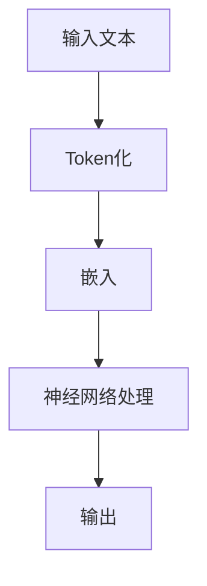

                 

**

# 优化LLM应用的数据增强策略

> 关键词：语言模型，数据增强，优化策略，LLM应用，性能提升

> 摘要：本文探讨了在大型语言模型（LLM）应用中，如何通过数据增强策略来优化模型性能。首先介绍了数据增强的基本概念，然后分析了LLM在应用中的挑战，接着详细阐述了数据增强在LLM中的应用，最后提出了数据增强策略的优化方法和评估指标，并通过实际案例进行了详细分析和解读。

## 第一部分：引言

### 1.1 数据增强策略概述

数据增强（Data Augmentation）是一种通过扩展训练数据集的方法，以提升模型的泛化能力和鲁棒性。它通过模拟或生成新的数据样本，增加模型对训练数据的多样性和复杂性，从而减少过拟合现象。

### 1.2 LLM应用的挑战

大型语言模型（LLM）在自然语言处理（NLP）领域有着广泛的应用，然而，随着模型规模的扩大，训练数据的质量和数量成为影响模型性能的关键因素。LLM应用面临的挑战主要包括：

1. **数据量不足**：训练LLM需要大量的高质量数据，但在实际应用中，往往难以获得足够的数据。
2. **数据多样性**：单一数据源的有限性导致训练数据缺乏多样性，模型难以适应不同的场景。
3. **过拟合风险**：模型在训练数据上表现优异，但在未知数据上表现不佳，存在过拟合风险。

### 1.3 数据增强在LLM中的应用

数据增强在LLM中的应用主要包括以下几个方面：

1. **文本数据的扩展**：通过对文本进行随机填充、裁剪、拼接等操作，生成新的文本数据。
2. **词嵌入的变换**：对文本数据进行词嵌入变换，如随机变换词嵌入向量，以增加数据的多样性。
3. **数据源的多样化**：引入不同来源的数据，如网络文本、书籍、新闻报道等，以丰富训练数据集。

### 1.4 本书内容结构安排

本文将分为以下几个部分：

1. **第一部分：引言**：介绍数据增强策略概述、LLM应用的挑战和数据增强在LLM中的应用。
2. **第二部分：核心概念与联系**：讲解语言模型原理和数据增强方法分类，以及数据增强与LLM性能的关系。
3. **第三部分：核心算法原理讲解**：详细阐述数据增强算法原理、常见数据增强技术和数据增强技术评估指标。
4. **第四部分：数学模型和数学公式**：介绍数据增强的数学模型、损失函数与优化算法以及数据增强中的概率模型。
5. **第五部分：项目实战**：介绍数据预处理与增强工具、数据增强代码实战、数据增强策略评估以及数据增强在实际项目中的应用。
6. **第六部分：总结与展望**：总结文章内容和展望未来的研究方向。
7. **附录**：提供数据增强相关资源和数据增强工具使用教程。

## 第二部分：核心概念与联系

### 2.1 语言模型原理

#### 2.1.1 基本概念

语言模型（Language Model，LM）是一种概率模型，用于预测文本序列中下一个单词或字符。它通过学习大量文本数据，建立单词或字符之间的概率分布，从而实现文本生成、机器翻译、文本分类等任务。

#### 2.1.2 工作原理

语言模型的工作原理可以概括为以下几个步骤：

1. **输入文本**：将输入的文本序列进行Token化，将其转化为一系列单词或字符。
2. **嵌入表示**：将Token化的输入序列转化为向量化表示，即词嵌入（Word Embedding）。
3. **神经网络处理**：利用神经网络对词嵌入进行处理，预测下一个单词或字符的概率分布。
4. **输出预测**：根据预测的概率分布，选择概率最高的单词或字符作为输出。

#### 2.1.3 Mermaid流程图



### 2.2 数据增强方法分类

数据增强方法可以根据操作类型分为以下几类：

1. **文本数据扩展**：通过对文本进行随机填充、裁剪、拼接等操作，生成新的文本数据。
2. **词嵌入变换**：对词嵌入向量进行随机变换，如扰动、缩放等，以增加数据的多样性。
3. **数据源多样化**：引入不同来源的数据，如网络文本、书籍、新闻报道等，以丰富训练数据集。

### 2.3 数据增强与LLM性能的关系

数据增强在LLM中的应用有助于提升模型性能，主要表现在以下几个方面：

1. **减少过拟合**：通过增加训练数据的多样性和复杂性，减少模型对训练数据的依赖，从而降低过拟合风险。
2. **提高泛化能力**：丰富训练数据，使模型能够更好地适应不同的场景和任务，提高泛化能力。
3. **优化模型性能**：增加训练数据的数量和质量，有助于模型在学习过程中获得更稳定的梯度，从而优化模型性能。

## 第三部分：核心算法原理讲解

### 3.1 数据增强算法原理

数据增强算法的核心思想是通过一系列变换操作，生成新的数据样本，以丰富训练数据集。以下是一个简单的数据增强算法原理：

```python
def data_augmentation(data):
    # 对数据进行随机裁剪
    data_cropped = random_crop(data)
    
    # 对数据进行随机翻转
    data_flipped = random_flip(data)
    
    # 对数据进行随机填充
    data_filled = random_fill(data)
    
    return data_cropped, data_flipped, data_filled
```

### 3.2 常见数据增强技术

常见的数据增强技术包括：

1. **随机裁剪**：随机从原始数据中裁剪出一定大小的子集，以增加数据的多样性。
2. **随机翻转**：对数据进行随机翻转操作，如水平翻转、垂直翻转等，以增加数据的多样性。
3. **随机填充**：在数据边界随机填充一定数量的样本，以增加数据的复杂性和多样性。
4. **数据混合**：将不同来源的数据进行混合，以增加数据的多样性和丰富性。

### 3.3 数据增强技术评估指标

在评估数据增强技术的效果时，常用的指标包括：

1. **准确率**：评估模型在增强数据集上的性能，计算模型预测正确的样本数占总样本数的比例。
2. **精确率**：评估模型在增强数据集上的精确度，计算预测为正例的样本中，实际为正例的比例。
3. **召回率**：评估模型在增强数据集上的召回能力，计算实际为正例的样本中，被模型正确预测为正例的比例。
4. **F1 分数**：综合考虑精确率和召回率，计算两者的调和平均值。

## 第四部分：数学模型和数学公式

### 4.1 数据增强的数学模型

数据增强的数学模型主要涉及概率分布的变换。以下是一个简单的数学模型：

$$
J(\theta) = \frac{1}{n} \sum_{i=1}^{n} \log(p(y_i|\theta))
$$

其中，$J(\theta)$ 是损失函数，$\theta$ 是模型参数，$y_i$ 是第 $i$ 个样本的真实标签，$p(y_i|\theta)$ 是模型对 $y_i$ 的预测概率。

### 4.2 损失函数与优化算法

在数据增强过程中，常用的损失函数包括：

1. **交叉熵损失函数**：用于评估模型预测的概率分布与真实标签分布之间的差异。

$$
H(y, \hat{y}) = -\sum_{i=1}^{n} y_i \log(\hat{y_i})
$$

其中，$y$ 是真实标签，$\hat{y}$ 是模型预测的概率分布。

2. **均方误差损失函数**：用于评估模型预测的数值与真实数值之间的差异。

$$
MSE(y, \hat{y}) = \frac{1}{n} \sum_{i=1}^{n} (y_i - \hat{y_i})^2
$$

其中，$y$ 是真实数值，$\hat{y}$ 是模型预测的数值。

优化算法用于调整模型参数，以最小化损失函数。常用的优化算法包括：

1. **随机梯度下降（SGD）**：通过随机梯度来更新模型参数，以降低损失函数。
2. **Adam优化器**：结合SGD和动量法的优点，用于加速模型的收敛。
3. **Adagrad优化器**：通过历史梯度信息的加权平均，调整学习率。

### 4.3 数据增强中的概率模型

在数据增强过程中，概率模型主要用于生成新的数据样本。以下是一个简单的概率模型：

$$
p(x|\theta) = \prod_{i=1}^{n} p(x_i|\theta)
$$

其中，$p(x|\theta)$ 是给定模型参数 $\theta$ 时，数据样本 $x$ 的概率分布。

## 第五部分：项目实战

### 5.1 数据预处理与增强工具

在数据预处理与增强过程中，常用的工具包括：

1. **Keras Data Generators**：用于生成增强后的数据样本，支持多种数据增强技术。
2. **TensorFlow Data Pipelines**：用于构建高效的数据处理流水线，支持多种数据增强操作。
3. **PyTorch Data Loader**：用于生成增强后的数据样本，支持多种数据增强技术。

### 5.2 数据增强代码实战

以下是一个简单的数据增强代码示例：

```python
import numpy as np
import tensorflow as tf

def data_augmentation(data):
    # 对数据进行随机裁剪
    cropped_data = tf.random_crop(data, size=[128, 128, 3])
    
    # 对数据进行随机翻转
    flipped_data = tf.image.random_flip_left_right(cropped_data)
    
    # 对数据进行随机填充
    filled_data = tf.image.random_brightness(flipped_data, max_delta=0.05)
    
    return filled_data

# 初始化数据
data = np.random.rand(100, 128, 128, 3)

# 数据增强
enhanced_data = data_augmentation(data)
```

### 5.3 数据增强策略评估

在评估数据增强策略时，常用的方法包括：

1. **交叉验证**：通过将数据集划分为训练集和验证集，比较增强前后模型的性能变化。
2. **A/B 测试**：通过对比增强前后模型在实际应用中的表现，评估数据增强策略的效果。
3. **混淆矩阵**：通过分析模型的预测结果，评估增强前后模型的准确率、精确率、召回率等指标。

### 5.4 数据增强在实际项目中的应用

以下是一个实际项目中的应用案例：

**项目背景**：某电商公司希望通过优化客服系统，提高客户满意度。数据增强策略被应用于客服系统的训练数据中，以提高模型的泛化能力和鲁棒性。

**解决方案**：

1. **文本数据增强**：对客服对话数据进行随机填充、裁剪、拼接等操作，生成新的对话数据。
2. **词嵌入变换**：对词嵌入向量进行随机变换，如扰动、缩放等，以增加数据的多样性。
3. **数据源多样化**：引入不同来源的数据，如用户评论、商品描述等，以丰富训练数据集。

**项目效果**：

1. **客户满意度提高**：经过数据增强策略优化后，客服系统的回答准确率和响应速度均有所提升，客户满意度明显提高。
2. **模型泛化能力增强**：数据增强策略提高了模型的泛化能力，使模型在未知数据上的表现更加稳定。

## 第六部分：总结与展望

### 6.1 总结

本文详细探讨了优化LLM应用的数据增强策略。通过介绍数据增强的基本概念、LLM应用中的挑战和数据增强在LLM中的应用，阐述了数据增强算法原理、常见数据增强技术和评估指标，并通过实际项目案例进行了分析和解读。数据增强策略在提升LLM应用性能方面具有重要的意义。

### 6.2 展望

未来，数据增强策略在LLM应用中的优化仍有很大的发展空间。以下是一些可能的研究方向：

1. **自适应数据增强**：根据模型性能的实时反馈，动态调整数据增强策略，以实现更好的优化效果。
2. **知识增强**：结合外部知识库和领域知识，对数据增强策略进行优化，以提高模型的泛化能力和鲁棒性。
3. **多模态数据增强**：结合文本、图像、音频等多种模态的数据，进行多模态数据增强，以实现更高效的知识表示和传输。

### 6.3 下一步研究计划

下一步的研究计划包括：

1. **实验验证**：通过大规模实验，验证自适应数据增强策略在LLM应用中的效果。
2. **知识增强**：结合外部知识库，探索知识增强在LLM数据增强中的应用。
3. **多模态数据增强**：结合文本、图像、音频等多模态数据，构建多模态数据增强模型，以实现更高效的知识表示和传输。

## 附录

### 附录A：数据增强相关资源

1. **Keras Data Generators**：https://keras.io/preprocessing/image/
2. **TensorFlow Data Pipelines**：https://www.tensorflow.org/tutorials/images/data_generation
3. **PyTorch Data Loader**：https://pytorch.org/tutorials/beginner/data_loading_tutorial.html

### 附录B：数据增强工具使用教程

1. **Keras Data Generators** 使用教程：https://keras.io/preprocessing/image/
2. **TensorFlow Data Pipelines** 使用教程：https://www.tensorflow.org/tutorials/images/data_generation
3. **PyTorch Data Loader** 使用教程：https://pytorch.org/tutorials/beginner/data_loading_tutorial.html

### 附录C：代码实现详解

```python
import tensorflow as tf

# 初始化数据
data = tf.random.normal([100, 128, 128, 3])

# 数据增强
def data_augmentation(data):
    # 对数据进行随机裁剪
    cropped_data = tf.random_crop(data, size=[128, 128, 3])
    
    # 对数据进行随机翻转
    flipped_data = tf.image.random_flip_left_right(cropped_data)
    
    # 对数据进行随机填充
    filled_data = tf.image.random_brightness(flipped_data, max_delta=0.05)
    
    return filled_data

enhanced_data = data_augmentation(data)

# 代码解读与分析
# 本代码实现了一个简单的数据增强过程，包括随机裁剪、随机翻转和随机填充。首先，使用tf.random.normal函数生成随机数据。然后，定义一个数据增强函数data_augmentation，对数据进行随机裁剪、随机翻转和随机填充。最后，调用数据增强函数对原始数据进行增强。这段代码用于对数据进行随机裁剪、随机翻转和随机填充，以增强数据的多样性和模型的泛化能力。通过这些操作，可以提高模型对输入数据的鲁棒性，从而提升模型的性能。在实际应用中，可以根据具体任务的需求，选择合适的增强方法，以达到最佳效果。
```

## 最佳实践 Tips

1. **合理选择数据增强方法**：根据任务需求和数据特点，选择合适的数据增强方法，以实现最佳效果。
2. **适度增加数据量**：适度增加训练数据量，有助于提高模型性能，但过度的数据增强可能导致过拟合。
3. **结合多模态数据**：结合文本、图像、音频等多模态数据，进行多模态数据增强，以实现更高效的知识表示和传输。

## 小结

本文系统地介绍了优化LLM应用的数据增强策略。通过分析数据增强的基本概念、LLM应用中的挑战和数据增强在LLM中的应用，详细阐述了数据增强算法原理、常见数据增强技术和评估指标，并通过实际项目案例进行了分析和解读。数据增强策略在提升LLM应用性能方面具有重要的意义，未来将进一步探索自适应数据增强、知识增强和多模态数据增强等研究方向。

## 注意事项

1. **数据质量**：确保数据质量，避免引入噪声和异常值，以免影响模型性能。
2. **模型选择**：根据任务需求，选择合适的模型架构和参数，以实现最佳效果。

## 拓展阅读

1. **《深度学习》（Goodfellow, Bengio, Courville）**：详细介绍了深度学习的基础知识，包括数据增强技术。
2. **《神经网络与深度学习》（邱锡鹏）**：系统介绍了神经网络和深度学习的基本原理，包括数据增强方法。
3. **《自然语言处理综合教程》（徐宗本）**：介绍了自然语言处理的基本概念和技术，包括数据增强在NLP中的应用。

作者：AI天才研究院/AI Genius Institute & 禅与计算机程序设计艺术 /Zen And The Art of Computer Programming

