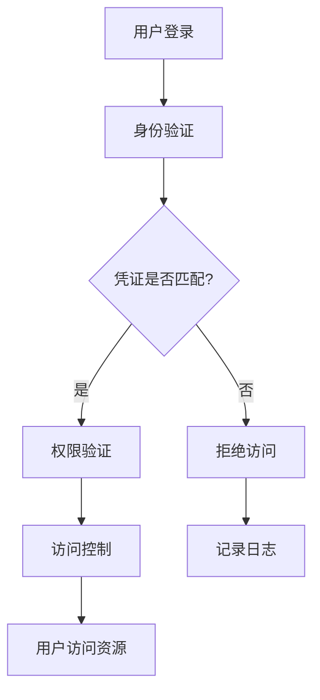
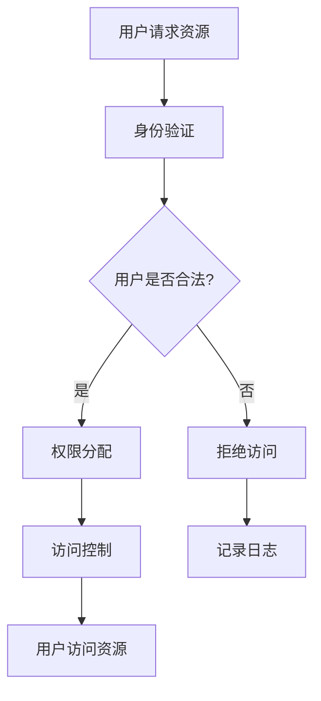
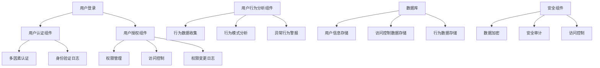

                 


### 文章标题：优化LLM应用的用户认证与授权流程

#### 关键词：LLM、用户认证、用户授权、安全优化、流程设计

> 摘要：本文旨在探讨如何优化大型语言模型（LLM）应用中的用户认证与授权流程。我们将从认证与授权的基本概念入手，逐步深入到具体的实现方法、安全考量、优化策略和未来展望，帮助读者全面理解并提升LLM应用的安全性。

### 目录大纲

## 《优化LLM应用的用户认证与授权流程》

### 第一部分：引言

#### 1.1 书籍背景与目标

#### 1.2 LLM应用中的用户认证与授权

### 第二部分：LLM应用的用户认证机制

#### 2.1 用户认证的基本原理

#### 2.2 常见的用户认证方法

#### 2.3 用户认证的安全性与隐私保护

### 第三部分：LLM应用的用户授权机制

#### 3.1 用户授权的基本原理

#### 3.2 常见的用户授权策略

#### 3.3 用户授权的安全性考量

### 第四部分：优化策略与实践

#### 4.1 优化LLM应用的用户认证与授权流程

#### 4.2 基于机器学习的认证与授权优化

#### 4.3 案例分析

### 第五部分：技术实现

#### 5.1 系统架构设计

#### 5.2 技术选型与工具

#### 5.3 代码实现与解读

### 第六部分：总结与展望

#### 6.1 本书总结

#### 6.2 未来展望

### 附录

#### A.1 相关资源与拓展阅读

#### A.2 Mermaid 流程图与伪代码

#### A.3 代码示例

### 第一部分：引言

#### 1.1 书籍背景与目标

在当今数字化时代，大型语言模型（LLM）作为人工智能的核心技术，已经在各个领域中发挥着重要作用。LLM的应用场景越来越广泛，从自然语言处理、智能客服到个性化推荐，都离不开LLM的支持。然而，随着LLM应用的范围不断扩大，用户认证与授权的问题也日益凸显。用户认证与授权是保障LLM应用安全的关键环节，直接关系到用户数据的安全和隐私保护。

本文的目标是探讨如何优化LLM应用中的用户认证与授权流程。通过本文的阅读，读者将深入了解用户认证与授权的基本概念、常见方法、安全考量以及优化策略。本文不仅适合对LLM应用有初步了解的读者，也适合希望进一步提升LLM应用安全性的专业人士。

#### 1.2 LLM应用中的用户认证与授权

用户认证是指验证用户身份的过程，确保只有合法用户才能访问系统资源。用户授权则是在认证成功后，根据用户角色或权限，决定用户能够访问哪些资源或执行哪些操作。在LLM应用中，用户认证与授权的重要性不言而喻。

首先，用户认证是保障LLM应用安全的基础。如果没有有效的用户认证机制，恶意用户可能会轻易获得访问权限，导致数据泄露或系统被恶意攻击。其次，用户授权确保了系统资源的合理分配，避免用户滥用权限或访问不应访问的资源。

在LLM应用中，用户认证与授权不仅涉及到用户身份的验证，还包括对用户行为的监控和审计。例如，在智能客服应用中，用户认证确保只有合法用户才能与客服进行交互；而用户授权则确保客服人员只能访问与工作相关的数据和功能。

总之，用户认证与授权是LLM应用安全的核心，直接影响到用户数据的安全性和系统的稳定性。在本文中，我们将详细探讨如何优化这一关键环节，以提升LLM应用的整体安全性。接下来，我们将从用户认证的基本原理开始，逐步深入到具体的方法和实践中。

### 第二部分：LLM应用的用户认证机制

#### 2.1 用户认证的基本原理

用户认证是确保系统资源只对授权用户开放的重要机制。在LLM应用中，用户认证的基本原理主要包括身份验证、权限验证和访问控制。以下是这些核心概念的定义和它们在用户认证中的关系。

1. **身份验证**：身份验证是用户认证的第一步，目的是确认用户的身份是否合法。常见的身份验证方法包括用户名与密码、单点登录（SSO）、二次认证（MFA）和生物特征认证等。身份验证的核心是验证用户提供的凭证（如用户名和密码）是否与系统中存储的匹配。

2. **权限验证**：在用户身份得到确认后，权限验证将进一步确定用户是否有权访问特定资源或执行特定操作。权限验证通常基于用户的角色或权限等级，确保用户只能访问其权限范围内的资源。例如，一个普通用户可能只能查看文档，而管理员则可以修改文档内容。

3. **访问控制**：访问控制是在权限验证的基础上，对用户访问行为的限制。访问控制可以通过多种策略实现，如基于角色的访问控制（RBAC）、基于属性的访问控制（ABAC）和基于任务的访问控制（TBAC）等。访问控制策略确保用户在权限范围内只能执行允许的操作。

在用户认证机制中，身份验证、权限验证和访问控制是相互关联的。首先，身份验证确定用户是否合法；然后，权限验证确定用户有权访问哪些资源；最后，访问控制确保用户只能执行允许的操作。这三个步骤共同构成了一个完整的用户认证流程，确保系统的安全性和稳定性。

为了更好地理解这些概念，我们可以用一张简单的流程图来描述用户认证的基本原理：



在这张流程图中，用户首先通过登录界面提交用户名和密码，系统进行身份验证。如果凭证匹配，用户将被引导进行权限验证。权限验证通过后，用户将受到访问控制，确保其只能访问允许的资源。如果任何一步验证失败，用户将被拒绝访问，并记录相应的日志。

通过这张流程图，我们可以清晰地看到用户认证的基本原理和各个环节之间的逻辑关系。接下来，我们将探讨常见的用户认证方法，进一步了解LLM应用中的用户认证机制。

#### 2.2 常见的用户认证方法

在LLM应用中，用户认证是保障系统安全性的关键步骤。常见的用户认证方法包括用户名与密码认证、单点登录（SSO）、二次认证（MFA）和生物特征认证。每种方法都有其独特的优势和适用场景。

**1. 用户名与密码认证**

用户名与密码认证是最传统的用户认证方法，用户通过输入用户名和密码来验证身份。这种方法简单易用，但安全性相对较低。用户密码如果被泄露或被破解，攻击者可以轻易地获取访问权限。因此，用户名与密码认证通常需要结合其他安全措施，如密码强度要求、密码重置机制等。

**2. 单点登录（SSO）**

单点登录（SSO）是一种集中认证机制，允许用户在多个系统中使用相同的身份凭证进行登录。SSO通过统一的身份认证服务器，简化了用户的登录流程，提高了用户体验。常见的技术实现包括OAuth 2.0、OpenID Connect等。SSO的优势在于提高认证效率和用户便利性，但缺点是对认证服务器的安全依赖较高，一旦认证服务器受到攻击，可能导致多个系统安全漏洞。

**3. 二次认证（MFA）**

二次认证（MFA）是在用户名和密码认证的基础上，增加额外的验证步骤，以增强安全性。常见的二次认证方法包括短信验证码、手机APP生成的动态验证码、硬件令牌等。MFA通过引入多因素验证，有效提高了系统的安全防护能力，即使用户密码泄露，攻击者也无法绕过二次验证。然而，MFA的额外验证步骤可能会增加用户操作的复杂性，影响用户体验。

**4. 生物特征认证**

生物特征认证利用用户的生物特征（如指纹、面部识别、虹膜识别等）进行身份验证。这种方法具有高安全性和高便捷性，用户只需通过生物特征即可完成身份验证，无需记忆复杂的密码。生物特征认证在安全性要求较高的场景中具有广泛的应用，如银行、医疗等。然而，生物特征认证的设备成本较高，且用户隐私保护问题也需慎重考虑。

**综合评价**

每种用户认证方法都有其优缺点和适用场景。用户名与密码认证简单易用，但安全性较低；单点登录（SSO）提高认证效率，但安全性依赖认证服务器；二次认证（MFA）增强安全性，但增加操作复杂度；生物特征认证安全性高，但成本较高。在LLM应用中，通常采用多种认证方法的组合，以平衡安全性和用户体验。

**案例**

例如，在一个智能客服系统中，用户可以通过用户名和密码进行基础认证，对于敏感操作（如修改个人信息），系统可以要求进行二次认证（如短信验证码）。对于高安全要求的应用场景，如银行系统，用户需要进行生物特征认证以完成关键操作。

通过了解这些常见的用户认证方法，我们可以更好地选择适合LLM应用的安全认证策略，确保系统的安全性和用户体验。接下来，我们将探讨用户认证过程中的安全性和隐私保护问题，进一步优化LLM应用的认证机制。

#### 2.3 用户认证的安全性与隐私保护

在用户认证过程中，安全性和隐私保护是两个至关重要的方面。确保用户数据的安全和隐私不受侵犯，不仅关系到用户的信任和满意度，也是LLM应用合规性要求的必要条件。以下是用户认证过程中常见的安全挑战和隐私保护策略。

**1. 安全挑战**

- **密码泄露**：用户密码是认证过程中的核心凭证，但传统的用户名与密码认证方法容易受到密码泄露的威胁。密码如果被破解或泄露，攻击者可以获取系统访问权限。
- **中间人攻击**：在用户登录过程中，攻击者可以通过中间人攻击窃取用户的认证凭证，实现未授权访问。
- **重放攻击**：攻击者截获并重新发送用户的认证请求，可能导致重复授权或身份冒用。
- **会话劫持**：攻击者通过窃取用户会话信息，可以在未经授权的情况下访问用户资源。
- **跨站请求伪造（CSRF）**：攻击者利用用户已登录状态，在未经授权的情况下执行恶意操作。

**2. 隐私保护策略**

- **加密**：用户认证过程中的所有数据，包括用户名、密码和认证凭证，都应使用加密技术进行保护，防止数据在传输过程中被窃取或篡改。常用的加密算法包括AES、RSA等。
- **多因素认证**：通过引入多因素认证，如密码+动态验证码、密码+手机验证等，增强认证过程的安全性。多因素认证可以有效减少单一凭证泄露的风险。
- **会话管理**：合理管理用户会话，包括会话超时、会话加密、会话隔离等，确保用户会话的安全和隐私。例如，会话超时可以防止长时间未操作的会话被恶意利用。
- **日志审计**：记录用户的认证过程和操作日志，以便在出现安全事件时进行追踪和分析。日志审计可以帮助发现异常行为，及时采取安全措施。
- **隐私保护法规遵守**：遵守相关隐私保护法规，如GDPR、CCPA等，确保用户数据在收集、存储和使用过程中受到合法保护。例如，在处理个人信息时，需要获得用户的明确同意，并明确告知用户数据的使用目的和范围。

**综合评价**

用户认证的安全性和隐私保护是相辅相成的。通过采取有效的安全措施和隐私保护策略，可以显著提升LLM应用的安全性和用户信任度。然而，需要注意的是，安全措施和隐私保护策略需要不断更新和优化，以应对不断演变的安全威胁和隐私风险。

**案例**

例如，在一个在线教育平台上，用户登录时使用加密传输（如HTTPS），密码通过AES加密存储。在敏感操作（如修改个人信息）时，系统要求用户进行多因素认证，如手机验证码。同时，系统记录用户的登录和操作日志，并在出现异常行为时进行审计和报警。

通过上述安全挑战和隐私保护策略的探讨，我们可以为LLM应用制定更加完善的用户认证机制，确保系统的安全性和用户隐私得到有效保护。接下来，我们将深入探讨LLM应用的用户授权机制，进一步优化应用的安全性。

### 第三部分：LLM应用的用户授权机制

#### 3.1 用户授权的基本原理

用户授权是确保系统资源仅对合法用户开放的另一关键环节。在LLM应用中，用户授权的基本原理主要包括身份验证、权限分配和访问控制。以下是这些核心概念的定义和它们在用户授权中的关系。

**1. 身份验证**：用户授权的前提是首先确定用户的身份是否合法。这一步骤通常通过用户认证完成，例如用户名和密码认证、单点登录（SSO）或生物特征认证等。身份验证确保只有合法用户才能进入系统。

**2. 权限分配**：在用户身份得到确认后，系统根据用户的角色或权限等级，为其分配相应的权限。权限分配通常基于预先定义的权限模型，如基于角色的访问控制（RBAC）、基于属性的访问控制（ABAC）等。权限分配的目的是确保用户只能访问其权限范围内的资源。

**3. 访问控制**：访问控制是在权限分配的基础上，进一步限制用户访问行为的具体策略。访问控制可以基于用户的角色、权限等级或具体的访问条件。例如，一个普通用户可能只能查看文档，而管理员则可以修改文档内容。通过访问控制，系统能够确保用户在权限范围内执行允许的操作。

在用户授权机制中，身份验证、权限分配和访问控制是相互关联的。首先，身份验证确定用户是否合法；然后，权限分配确定用户有权访问哪些资源；最后，访问控制确保用户只能执行允许的操作。这三个步骤共同构成了一个完整的用户授权流程，保障系统的安全性和稳定性。

为了更好地理解这些概念，我们可以用一张简单的流程图来描述用户授权的基本原理：



在这张流程图中，用户请求访问资源，系统首先进行身份验证，确认用户是否合法。如果用户身份合法，系统将进行权限分配，确定用户有权访问哪些资源。最后，通过访问控制策略，确保用户只能访问允许的资源。如果任何一步验证失败，用户将被拒绝访问，并记录相应的日志。

通过这张流程图，我们可以清晰地看到用户授权的基本原理和各个环节之间的逻辑关系。接下来，我们将探讨常见的用户授权策略，进一步了解LLM应用中的用户授权机制。

#### 3.2 常见的用户授权策略

在LLM应用中，用户授权策略是实现安全访问控制的重要手段。常见的用户授权策略包括基于角色的访问控制（RBAC）、基于属性的访问控制（ABAC）和基于任务的访问控制（TBAC）。每种策略都有其独特的原理和应用场景。

**1. 基于角色的访问控制（RBAC）**

基于角色的访问控制（RBAC）是一种常见的用户授权策略，它通过将用户分配到不同的角色，并根据角色赋予相应的权限来实现访问控制。RBAC的核心概念包括角色（Role）、用户（User）和权限（Permission）。

- **角色**：角色是一组具有相似职责或权限的用户的集合。例如，系统管理员、普通用户、访客等。
- **用户**：用户是系统中的实际操作者，每个用户可以拥有多个角色。
- **权限**：权限是用户可以执行的操作集合，例如查看、修改、删除等。

RBAC的工作原理如下：

- 用户登录系统时，系统根据用户的角色为其分配相应的权限。
- 当用户请求访问资源时，系统检查用户的权限是否允许该操作。
- 如果用户权限允许，用户可以访问资源；否则，系统拒绝访问。

RBAC的优点包括：

- 简化权限管理：通过角色管理，可以减少权限分配和管理的复杂性。
- 易于扩展：当新增角色或权限时，系统只需更新角色定义，无需修改具体的权限分配策略。

缺点包括：

- 权限过度集中：如果角色权限设置不当，可能导致权限过度集中，增加安全风险。
- 不支持细粒度控制：RBAC基于角色进行权限分配，难以实现细粒度的访问控制。

**2. 基于属性的访问控制（ABAC）**

基于属性的访问控制（ABAC）是一种更加灵活的授权策略，它通过将访问控制决策与属性相关联来实现细粒度的访问控制。ABAC的核心概念包括属性（Attribute）、属性值（AttributeValue）和访问策略（Policy）。

- **属性**：属性是描述用户、资源或环境特征的标签。例如，用户的部门、资源的访问时间、环境的安全级别等。
- **属性值**：属性值是属性的特定取值。例如，用户部门为“研发部”。
- **访问策略**：访问策略定义了访问控制的规则，例如“如果用户部门为‘研发部’，且时间为工作日，则允许访问”。

ABAC的工作原理如下：

- 系统根据用户、资源和环境属性，结合访问策略，决定用户是否具有访问权限。
- 当用户请求访问资源时，系统收集相关属性，并根据访问策略进行决策。

ABAC的优点包括：

- 细粒度控制：ABAC可以实现细粒度的访问控制，满足不同用户和资源的安全需求。
- 灵活性：通过动态调整属性和访问策略，可以灵活应对变化的安全需求。

缺点包括：

- 复杂性：ABAC策略较为复杂，需要精确定义属性和访问策略，实现和维护成本较高。

**3. 基于任务的访问控制（TBAC）**

基于任务的访问控制（TBAC）是一种基于用户任务而非角色或属性的访问控制策略。TBAC的核心概念包括任务（Task）、权限（Permission）和访问策略（Policy）。

- **任务**：任务是指用户需要完成的具体操作，例如创建文档、修改配置等。
- **权限**：权限是用户执行特定任务所需的操作权限。
- **访问策略**：访问策略定义了用户在特定任务中可以执行的操作。

TBAC的工作原理如下：

- 用户在执行任务时，系统根据任务的性质和用户的权限，决定用户是否具有执行该任务的权限。
- 当用户请求执行任务时，系统检查用户的权限是否允许该任务。

TBAC的优点包括：

- 精确控制：通过基于任务的访问控制，可以精确控制用户的操作权限，减少安全风险。
- 适应性强：TBAC可以灵活应对不同任务的权限需求，适应各种应用场景。

缺点包括：

- 复杂性：TBAC策略较为复杂，需要精确定义任务和权限，实现和维护成本较高。

**综合评价**

每种用户授权策略都有其独特的优点和适用场景。RBAC适用于大多数企业级应用，可以实现高效的权限管理；ABAC适用于需要细粒度访问控制的应用场景，可以满足复杂的权限需求；TBAC适用于需要精确控制用户操作权限的应用场景，可以提供更高的安全性。在LLM应用中，可以根据具体需求和场景，选择合适的用户授权策略，以实现高效、安全的访问控制。

通过了解这些常见的用户授权策略，我们可以更好地设计LLM应用的用户授权机制，确保系统的安全性和用户体验。接下来，我们将探讨用户授权过程中的安全性考量，进一步优化LLM应用的用户授权机制。

#### 3.3 用户授权的安全性考量

用户授权是确保LLM应用中用户只能访问其权限范围内的资源和操作的重要环节。然而，用户授权过程中可能会面临一系列安全挑战，如权限过度集中、权限滥用、权限泄露等。为了提高用户授权的安全性，我们需要从以下几个方面进行安全性考量。

**1. 权限过度集中**

权限过度集中是用户授权过程中最常见的风险之一。如果系统中所有权限都集中在少数用户或角色中，一旦这些用户或角色中的权限被滥用或泄露，可能导致整个系统的安全漏洞。为了避免权限过度集中，我们可以采取以下措施：

- **权限分级管理**：将系统中的权限划分为不同的级别，根据用户的角色和职责分配相应的权限。例如，将权限分为查看权限、编辑权限、删除权限等。
- **最小权限原则**：为用户分配最少的必要权限，使其只能访问与其工作职责相关的资源。例如，一个普通用户只能查看和编辑个人文档，而无法删除或修改其他用户的文档。

**2. 权限滥用**

权限滥用是指用户在授权范围内进行不恰当的操作，可能导致系统数据泄露、系统功能被破坏等安全问题。为了避免权限滥用，我们可以采取以下措施：

- **权限监控**：通过日志记录和审计，监控用户的权限使用情况。例如，记录用户的登录时间、登录地点、访问的资源和操作等。
- **异常行为检测**：利用行为分析技术，检测用户的异常行为。例如，如果一个用户在短时间内频繁访问敏感资源或执行高风险操作，系统可以发出警报并采取措施。
- **权限回收**：定期审查用户的权限分配，对于不再需要或不再合适的权限，及时进行回收。

**3. 权限泄露**

权限泄露是指用户权限被非法获取或泄露，可能导致系统被攻击者入侵。为了避免权限泄露，我们可以采取以下措施：

- **密码安全**：使用强密码策略，要求用户设置复杂且不易被猜测的密码。同时，定期更换密码，防止密码泄露。
- **多因素认证**：引入多因素认证（MFA）机制，增加额外的验证步骤，如短信验证码、硬件令牌等，防止攻击者通过简单破解密码获取权限。
- **数据加密**：对敏感数据进行加密存储和传输，防止数据泄露。例如，使用AES加密算法对用户数据进行加密。
- **权限分离**：将系统的关键功能进行权限分离，确保不同权限用户无法访问其不应该访问的资源。例如，在权限管理系统中，只有管理员才有权限修改用户权限。

**4. 安全审计与日志记录**

安全审计与日志记录是用户授权过程中的重要环节，可以帮助我们及时发现和应对安全威胁。以下是安全审计与日志记录的相关措施：

- **审计日志**：记录用户授权过程中的所有关键操作，如权限分配、权限回收、登录和退出等。通过审计日志，可以追溯用户的操作行为，及时发现异常行为。
- **异常行为警报**：当系统检测到异常行为时，如频繁登录失败、异常登录地点等，及时发出警报，并通知相关人员进行处理。
- **日志分析**：定期分析日志数据，识别潜在的安全威胁和漏洞。例如，通过分析登录日志，可以识别是否存在暴力破解尝试或异常登录行为。

**综合评价**

用户授权过程中的安全性考量是保障LLM应用安全的关键。通过权限分级管理、最小权限原则、权限监控、异常行为检测、权限回收、密码安全、多因素认证、数据加密、权限分离和安全审计与日志记录等措施，可以有效提高用户授权的安全性，减少安全风险。在LLM应用的设计和实施过程中，我们需要综合考虑这些安全考量，确保用户授权机制的合理性和安全性。

通过以上探讨，我们可以为LLM应用设计出更加安全可靠的用户授权机制，保障系统的安全稳定运行。接下来，我们将介绍如何通过优化策略和实践，进一步提升LLM应用的认证与授权流程。

### 第四部分：优化策略与实践

#### 4.1 优化LLM应用的用户认证与授权流程

优化LLM应用的用户认证与授权流程，是提高系统安全性和用户体验的重要措施。以下介绍几种常见的优化方法，以及具体的应用示例。

**1. 流程简化**

简化流程是优化用户认证与授权流程的首要步骤。通过减少不必要的步骤，可以提高用户的操作效率。例如，在一个在线教育平台上，用户注册和登录流程可以简化为以下步骤：

- 用户访问平台首页，点击“登录”按钮。
- 输入用户名和密码，系统进行身份验证。
- 验证成功后，用户可以直接访问平台资源。

这种简化流程的方法可以显著提高用户满意度，减少用户操作的时间成本。

**2. 多因素认证**

多因素认证（MFA）是一种增强用户认证安全性的方法。通过引入多个验证步骤，如密码、手机验证码、硬件令牌等，可以有效防止恶意用户获取访问权限。例如，在一个企业级管理系统中，用户登录过程可以采用以下步骤：

- 用户输入用户名和密码，系统进行初步身份验证。
- 系统发送手机验证码到用户手机，用户输入验证码，系统进行二次验证。
- 如果验证成功，用户可以访问系统资源。

这种多因素认证方法可以显著提高系统的安全性，同时保持良好的用户体验。

**3. 身份认证协议优化**

优化身份认证协议是提高认证过程安全性的重要手段。例如，在单点登录（SSO）系统中，可以使用OAuth 2.0、OpenID Connect等安全认证协议，这些协议支持加密传输、身份验证和授权分离等安全特性。例如，在一个企业内部单点登录系统中，可以使用OAuth 2.0协议，实现以下步骤：

- 用户访问企业内网资源，系统要求用户登录。
- 用户输入用户名和密码，系统与认证服务器进行身份验证。
- 认证服务器返回身份验证结果，用户可以访问内网资源。

这种身份认证协议优化方法可以确保用户认证过程的安全性，同时保持系统的扩展性和灵活性。

**4. 权限动态分配**

传统的权限分配方法通常在系统初始化时设置，无法适应实时变化的安全需求。通过实现权限动态分配，可以确保用户在特定条件下拥有正确的权限。例如，在一个智慧医疗系统中，医生权限可以根据患者的病情和就诊时间动态调整：

- 当患者就诊时，系统自动分配医生的基本权限，如查看病历、开具处方等。
- 当患者病情发生变化，系统根据医生的专业知识和患者病情，动态调整医生的权限。

这种权限动态分配方法可以确保医生在特定情况下拥有正确的权限，提高医疗服务的安全性。

**示例**

以一个电商平台为例，以下是优化用户认证与授权流程的示例：

1. **简化流程**：用户访问电商平台首页，点击“登录”按钮，系统直接跳转到登录页面，用户输入用户名和密码，系统进行身份验证。
2. **多因素认证**：系统在用户首次登录或长时间未登录时，要求用户输入手机验证码，确保用户身份的真实性。
3. **身份认证协议优化**：系统使用OAuth 2.0协议与第三方认证服务器进行身份验证，支持多平台登录。
4. **权限动态分配**：用户在浏览商品、购物车、订单等操作时，系统根据用户的角色和操作动态分配相应的权限。

通过这些优化方法，电商平台可以显著提高用户认证与授权流程的安全性，同时提升用户体验。

优化LLM应用的用户认证与授权流程，需要综合考虑安全性、用户体验和系统性能。通过流程简化、多因素认证、身份认证协议优化和权限动态分配等方法，可以有效提升系统的安全性和用户体验。接下来，我们将探讨基于机器学习的认证与授权优化方法，进一步优化LLM应用的安全性能。

#### 4.2 基于机器学习的认证与授权优化

基于机器学习的认证与授权优化是一种利用先进的人工智能技术，提升LLM应用安全性和用户体验的方法。以下介绍机器学习在认证与授权中的应用，以及具体的优化案例。

**1. 机器学习在认证中的应用**

机器学习技术在用户认证中的应用主要包括异常行为检测、恶意登录检测和风险评估等。

- **异常行为检测**：通过分析用户的登录时间、地点、设备等信息，机器学习模型可以识别出异常登录行为。例如，如果一个用户在深夜从陌生的设备登录，系统可以发出警报，并要求用户进行二次验证。这样，可以有效防止恶意用户利用账号盗用进行非法操作。

- **恶意登录检测**：机器学习模型可以通过学习大量的正常登录数据，识别出潜在的恶意登录行为。例如，当系统检测到连续多次尝试登录失败时，可以认为这是恶意攻击的表现，从而采取措施阻止攻击。

- **风险评估**：通过分析用户的登录行为、权限使用情况等，机器学习模型可以为用户分配风险等级。例如，对于高风险用户，系统可以要求进行更严格的认证，如多因素认证或生物特征认证。

**2. 优化案例**

以一个金融服务平台为例，以下展示了如何利用机器学习技术优化用户认证与授权流程：

- **异常行为检测**：系统收集用户的登录行为数据，包括登录时间、地点、设备等，通过训练机器学习模型，识别出异常登录行为。例如，系统发现一个用户在短时间内频繁登录失败，同时从多个地理位置进行登录，系统可以认为这是一个异常行为，并发出警报。

- **恶意登录检测**：系统通过分析用户的登录尝试次数、失败次数、IP地址等信息，利用机器学习模型识别潜在的恶意登录行为。例如，当系统检测到一个IP地址在短时间内多次尝试登录失败时，可以认为这是一个恶意攻击，从而采取措施阻止该IP地址的登录尝试。

- **风险评估**：系统根据用户的登录行为、权限使用情况等，为每个用户分配风险等级。例如，对于高风险用户（如经常尝试登录失败的用户），系统可以要求进行多因素认证，以提高认证安全性。

**3. 案例分析**

以一个在线教育平台为例，以下展示了如何利用机器学习技术优化用户认证与授权流程：

- **异常行为检测**：系统收集用户的登录行为数据，包括登录时间、地点、设备等，通过训练机器学习模型，识别出异常登录行为。例如，系统发现一个用户在凌晨时分使用陌生设备登录，系统可以认为这是一个异常行为，并发出警报。

- **恶意登录检测**：系统通过分析用户的登录尝试次数、失败次数、IP地址等信息，利用机器学习模型识别潜在的恶意登录行为。例如，当系统检测到一个IP地址在短时间内多次尝试登录失败时，可以认为这是一个恶意攻击，从而采取措施阻止该IP地址的登录尝试。

- **风险评估**：系统根据用户的登录行为、权限使用情况等，为每个用户分配风险等级。例如，对于高风险用户（如经常尝试登录失败的用户），系统可以要求进行多因素认证，以提高认证安全性。

通过以上案例，我们可以看到，基于机器学习的认证与授权优化方法，可以有效提升LLM应用的安全性。机器学习技术可以识别出异常行为和恶意登录，提高认证过程的准确性。同时，通过为用户分配风险等级，可以灵活地调整认证策略，确保系统安全。

总之，基于机器学习的认证与授权优化方法，为LLM应用提供了更加智能化、精准化的安全保障，有助于提升系统的整体安全性。在未来的发展中，我们可以进一步探索机器学习在认证与授权领域的应用，为用户带来更加安全、便捷的体验。

#### 4.3 案例分析

在探讨优化LLM应用的用户认证与授权流程时，案例分析是了解实际应用场景和效果的重要环节。以下将分析两个案例：一个成功案例和一个失败案例，以展示优化策略在实践中的效果。

**成功案例：某大型电商平台**

**背景**：该电商平台拥有数百万活跃用户，每天产生大量的交易和数据访问请求。为了确保用户数据的安全和交易的可靠性，平台在用户认证与授权方面进行了多次优化。

**优化策略**：

1. **多因素认证**：平台引入了多因素认证（MFA）机制，用户在登录时需要提供用户名、密码和手机验证码。这一策略提高了用户认证的安全性，防止了简单的密码破解攻击。

2. **机器学习检测**：平台使用机器学习算法对用户的登录行为进行监控，识别异常登录行为和恶意登录尝试。例如，当一个用户在短时间内频繁尝试登录失败，或者从不同的地理位置登录时，系统会发出警报，并采取措施阻止非法访问。

3. **动态权限管理**：平台根据用户的角色和行为动态调整权限。例如，普通用户只能查看和购买商品，而管理员可以修改商品信息和处理客户投诉。这种动态权限管理提高了系统的灵活性和安全性。

**效果**：

- **安全性提升**：多因素认证和机器学习检测有效降低了恶意用户的攻击成功率，用户数据的安全得到了保障。
- **用户体验优化**：动态权限管理使得用户在操作过程中感受到更高的安全性和便捷性，用户满意度显著提高。
- **运营效率提升**：平台通过优化用户认证与授权流程，减少了人工审核和操作的成本，提高了运营效率。

**失败案例：某小型企业管理系统**

**背景**：该企业管理系统主要用于内部员工的数据管理和工作协作。由于企业规模较小，初始设计时未对用户认证与授权给予足够的重视。

**优化尝试**：

1. **用户名与密码认证**：企业尝试引入用户名与密码认证机制，以提高安全性。然而，由于密码设置过于简单，且未进行多因素认证，系统易受到暴力破解攻击。

2. **权限分级管理**：企业尝试对用户权限进行分级管理，但权限设置过于集中，导致部分员工拥有过多的权限，容易发生权限滥用和误操作。

3. **日志审计**：企业尝试记录用户操作日志，但由于日志记录不完整，无法有效追踪和监控用户行为。

**效果**：

- **安全性不足**：由于用户认证与授权机制设计不当，系统遭受了多次攻击，导致数据泄露和业务中断。
- **用户体验较差**：权限设置过于集中，员工在操作过程中感到不安全，且工作效率受到限制。
- **运营成本增加**：企业不得不投入更多资源进行安全防护和系统修复，运营成本显著增加。

**总结**：

成功案例表明，合理的用户认证与授权优化策略可以有效提升系统的安全性、用户体验和运营效率。而失败案例则提醒我们，在设计和实施用户认证与授权流程时，需要充分考虑安全性、灵活性和用户体验，避免因设计缺陷导致的安全隐患。

通过案例分析，我们可以看到，优化LLM应用的用户认证与授权流程需要综合考虑多种因素，既要确保系统的安全性，又要满足用户的便捷性。接下来，我们将探讨技术实现部分，介绍如何设计用户认证与授权系统架构，并选择合适的技术选型和工具。

### 第五部分：技术实现

#### 5.1 系统架构设计

在实现LLM应用的用户认证与授权流程时，系统架构的设计至关重要。一个合理和高效的架构不仅能够提高系统的安全性，还能确保良好的性能和可扩展性。以下是一个典型的用户认证与授权系统架构设计，包括各个关键组件及其功能。

**1. 用户认证组件**

用户认证组件是系统架构的核心部分，主要负责用户的身份验证和登录管理。其功能包括：

- **用户登录**：提供用户登录接口，接收用户名和密码，并与数据库中的用户信息进行匹配。
- **多因素认证**：集成多因素认证（如短信验证码、动态令牌等），确保用户身份的合法性。
- **身份验证日志**：记录用户登录和认证过程中的所有操作，以便进行审计和异常行为分析。

**2. 用户授权组件**

用户授权组件负责根据用户的角色和权限，决定其能够访问的资源和服务。其主要功能包括：

- **权限管理**：定义和管理用户的角色和权限，包括系统管理员、普通用户、访客等。
- **访问控制**：根据用户的角色和权限，对用户的访问请求进行控制，确保用户只能访问授权的资源。
- **权限变更日志**：记录用户权限的变更操作，以便进行审计和跟踪。

**3. 用户行为分析组件**

用户行为分析组件利用机器学习技术，对用户的登录行为和操作行为进行分析，识别异常行为和潜在的安全威胁。其主要功能包括：

- **行为数据收集**：收集用户的登录信息、操作记录等数据。
- **行为模式分析**：利用机器学习算法，分析用户行为模式，识别异常行为。
- **异常行为警报**：对识别出的异常行为发出警报，并采取相应的安全措施。

**4. 数据库**

数据库是存储用户信息、认证信息和授权信息的地方。常用的数据库类型包括关系型数据库（如MySQL、PostgreSQL）和非关系型数据库（如MongoDB、Cassandra）。数据库的主要功能包括：

- **用户信息存储**：存储用户的注册信息、认证信息和权限信息。
- **访问控制数据存储**：存储用户的访问控制规则和权限变更记录。
- **行为数据存储**：存储用户的登录记录和操作行为数据。

**5. 安全组件**

安全组件负责确保系统数据的安全性和完整性，包括加密、认证、授权等。其主要功能包括：

- **数据加密**：对敏感数据进行加密存储和传输，防止数据泄露。
- **安全审计**：记录系统的关键操作和日志，以便进行审计和追踪。
- **访问控制**：确保只有授权用户才能访问系统的资源和数据。

**系统架构图**

以下是一个简化的用户认证与授权系统架构图：



在这个架构中，用户登录后，首先由用户认证组件进行身份验证和登录管理。身份验证完成后，用户访问请求会传递给用户授权组件，根据用户的角色和权限进行访问控制。同时，用户行为分析组件会对用户的登录和操作行为进行分析，识别异常行为。所有的关键操作和日志都会记录在数据库中，并受到安全组件的保护。

通过这个系统架构设计，我们可以确保LLM应用的用户认证与授权流程高效、安全，并为未来的扩展提供良好的基础。

#### 5.2 技术选型与工具

在实现LLM应用的用户认证与授权系统时，技术选型和工具的选择至关重要。以下将介绍常用的开发工具与框架，以及开发环境的搭建步骤。

**1. 开发工具与框架**

- **后端开发框架**：常见的后端开发框架包括Spring Boot、Django、Express.js等。Spring Boot是一个强大的Java后端框架，提供了丰富的安全和认证功能，非常适合构建企业级应用。Django是一个Python后端框架，以其简洁和快速开发而著称。Express.js是一个轻量级的Node.js框架，适用于构建快速、灵活的Web应用。

- **前端开发框架**：常见的前端开发框架包括React、Vue.js、Angular等。React是一个用于构建用户界面的JavaScript库，具有高度的可扩展性和灵活性。Vue.js是一个渐进式JavaScript框架，易于上手，非常适合快速开发。Angular是一个由Google维护的开源前端框架，提供了完整的解决方案。

- **数据库**：常用的数据库包括关系型数据库（如MySQL、PostgreSQL）和非关系型数据库（如MongoDB、Cassandra）。MySQL和PostgreSQL适用于需要复杂查询和事务处理的应用，而MongoDB和Cassandra适用于高并发和大数据量的应用场景。

- **身份认证库**：常见的身份认证库包括OAuth 2.0、OpenID Connect、JWT（JSON Web Tokens）等。这些库提供了标准的认证和授权机制，可以轻松集成到后端和前端应用中。

**2. 开发环境搭建**

以下是一个基于Spring Boot和MongoDB的示例开发环境搭建步骤：

- **安装Java开发工具包（JDK）**：下载并安装JDK，配置环境变量`JAVA_HOME`和`PATH`。

- **安装数据库**：下载并安装MongoDB，配置MongoDB服务，确保其正常运行。

- **安装IDE**：选择并安装一个合适的IDE，如IntelliJ IDEA或Eclipse。配置IDE，使其能够识别和编译Java代码。

- **创建项目**：使用Spring Initializr（https://start.spring.io/）创建一个基于Spring Boot的项目。选择所需的技术栈，如Spring Web、Spring Data MongoDB、Spring Security等。

- **导入项目**：将生成的项目导入到IDE中，配置项目依赖和数据库连接。

- **运行项目**：启动Spring Boot应用，验证其是否正常运行。

以下是一个简单的代码示例，展示了如何使用Spring Security实现用户认证和授权：

```java
@Configuration
@EnableWebSecurity
public class SecurityConfig extends WebSecurityConfigurerAdapter {

    @Override
    protected void configure(HttpSecurity http) throws Exception {
        http
            .authorizeRequests()
                .antMatchers("/login").permitAll()
                .antMatchers("/admin/**").hasRole("ADMIN")
                .antMatchers("/user/**").hasRole("USER")
                .anyRequest().authenticated()
                .and()
            .formLogin()
                .loginPage("/login")
                .permitAll()
                .and()
            .logout()
                .permitAll();
    }

    @Override
    protected void configure(AuthenticationManagerBuilder auth) throws Exception {
        auth
            .inMemoryAuthentication()
                .withUser("user").password("{noop}password").roles("USER")
                .and()
                .withUser("admin").password("{noop}password").roles("ADMIN");
    }
}
```

在这个示例中，我们配置了基于表单的登录认证，并定义了两个用户角色（用户和管理员），每个角色有不同的访问权限。通过这个简单的配置，我们可以实现用户认证和基本的访问控制。

通过选择合适的技术选型和工具，并按照合理的开发环境搭建步骤，我们可以高效地实现LLM应用的用户认证与授权系统。接下来，我们将深入介绍用户认证与授权模块的代码实现，详细解读关键代码和算法。

#### 5.3 代码实现与解读

在本部分，我们将详细介绍用户认证与授权模块的代码实现，包括用户认证、权限验证和访问控制等关键环节。通过具体代码示例和算法分析，帮助读者深入理解实现细节。

**1. 用户认证**

用户认证是确保系统资源只对合法用户开放的第一步。以下是一个简单的用户认证实现示例，使用Spring Security框架：

```java
@Configuration
@EnableWebSecurity
public class SecurityConfig extends WebSecurityConfigurerAdapter {

    @Override
    protected void configure(HttpSecurity http) throws Exception {
        http
            .authorizeRequests()
                .antMatchers("/login", "/register").permitAll()
                .anyRequest().authenticated()
                .and()
            .formLogin()
                .loginPage("/login")
                .permitAll()
                .and()
            .logout()
                .permitAll();
    }

    @Override
    protected void configure(AuthenticationManagerBuilder auth) throws Exception {
        auth
            .inMemoryAuthentication()
                .withUser("user1").password("{noop}password1").roles("USER")
                .and()
                .withUser("admin1").password("{noop}password1").roles("ADMIN");
    }
}
```

**解析**：

- `configure(HttpSecurity http)` 方法配置了请求授权规则。`authorizeRequests()` 方法用于定义哪些URL需要认证，哪些URL可以直接访问。在本示例中，登录页面和注册页面不需要认证，其他所有请求都需要认证。

- `formLogin()` 方法配置了表单登录机制。`loginPage("/login")` 定义了登录页面的路径。`permitAll()` 方法允许所有用户访问登录页面。

- `logout()` 方法配置了登出机制。同样，`permitAll()` 方法允许所有用户进行登出。

- `configure(AuthenticationManagerBuilder auth)` 方法配置了内存认证。`withUser()` 方法定义了用户及其密码和角色。在本示例中，我们创建了两个用户（user1和admin1），分别分配了用户和管理员角色。

**2. 权限验证**

权限验证是确保用户在认证成功后，能够访问其授权资源的环节。以下是一个简单的权限验证实现示例：

```java
@Configuration
@EnableMethodSecurity(prePostEnabled = true)
public class MethodSecurityConfig extends WebSecurityConfigurerAdapter {

    @Override
    protected void configure(HttpSecurity http) throws Exception {
        http
            .authorizeRequests()
                .antMatchers("/public/**").permitAll()
                .antMatchers("/user/**").hasRole("USER")
                .antMatchers("/admin/**").hasRole("ADMIN")
                .anyRequest().authenticated()
                .and()
            .formLogin()
                .loginPage("/login")
                .permitAll()
                .and()
            .logout()
                .permitAll();
    }
}
```

**解析**：

- `@EnableMethodSecurity(prePostEnabled = true)` 注解启用了方法级别的安全注解，如`@PreAuthorize`和`@PostAuthorize`。

- `authorizeRequests()` 方法用于配置请求授权规则。在本示例中，`/public/**` 路径下的资源对所有用户开放，而`/user/**` 和`/admin/**` 路径下的资源分别对用户和管理员开放。

- 使用`@PreAuthorize` 注解可以定义方法级的权限验证。例如：

```java
@PreAuthorize("hasRole('USER')")
public void deleteUser(Long id) {
    // 删除用户操作
}
```

在这个示例中，`deleteUser()` 方法需要用户角色为“USER”才能执行。

**3. 访问控制**

访问控制是确保用户在权限范围内只能执行允许的操作的环节。以下是一个简单的访问控制实现示例：

```java
@RestController
@RequestMapping("/api")
public class ApiController {

    @PreAuthorize("hasRole('USER')")
    @GetMapping("/users")
    public List<User> getUsers() {
        // 查询用户列表
        return userService.findAll();
    }

    @PreAuthorize("hasRole('ADMIN')")
    @GetMapping("/users/{id}")
    public User getUserById(@PathVariable Long id) {
        // 根据ID查询用户
        return userService.findById(id);
    }

    @PreAuthorize("@permissionService.hasPermission(authentication.getName(), #id, 'delete')")
    @DeleteMapping("/users/{id}")
    public ResponseEntity<Void> deleteUser(@PathVariable Long id) {
        userService.delete(id);
        return ResponseEntity.noContent().build();
    }
}
```

**解析**：

- 在这个示例中，我们使用了自定义的`PermissionService`来管理权限。`@PreAuthorize` 注解结合了自定义权限校验方法，确保只有具备相应权限的用户才能访问或执行操作。

- `getUsers()` 方法使用`hasRole('USER')` 注解，确保只有用户角色为“USER”的用户可以访问。

- `getUserById()` 和`deleteUser()` 方法使用`hasPermission()` 方法进行权限校验。这个方法接收用户名、资源ID和操作类型，判断用户是否具备执行操作的权限。

通过上述代码示例，我们可以看到用户认证与授权模块的实现细节。在实现过程中，我们需要结合具体的业务需求，设计合理的权限模型和访问控制策略。同时，我们也要注重代码的可读性和可维护性，确保系统在安全性和用户体验之间取得平衡。接下来，我们将通过代码示例来展示用户认证与授权的具体应用，进一步解读代码的功能和实现方式。

#### 5.4 代码示例

在本部分，我们将通过具体的代码示例，展示如何在实际项目中实现用户认证与授权功能。这些示例涵盖了从用户注册、登录到权限验证和资源访问控制的各个环节。

**示例1：用户注册**

用户注册是用户认证的第一步，我们需要确保用户输入的信息完整且符合要求。以下是一个简单的用户注册接口示例，使用Spring Boot框架：

```java
@RestController
@RequestMapping("/api/auth")
public class AuthController {

    @Autowired
    private UserService userService;

    @PostMapping("/register")
    public ResponseEntity<?> registerUser(@RequestBody UserRegistrationRequest request) {
        if (userService.existsByUsername(request.getUsername())) {
            return ResponseEntity.badRequest().body("Error: Username is already taken!");
        }

        // 创建用户
        User user = userService.createUser(request);

        return ResponseEntity.ok("User registered successfully!");
    }
}
```

**解析**：

- `UserRegistrationRequest` 类用于接收用户注册信息，包括用户名、密码和电子邮件。
- `userService.createUser(request)` 方法负责创建新用户，并保存到数据库中。
- 如果用户名已被占用，返回错误响应。

**示例2：用户登录**

用户登录接口验证用户提供的用户名和密码，并生成令牌以维持会话。以下是一个简单的用户登录接口示例：

```java
@PostMapping("/login")
public ResponseEntity<?> authenticateUser(@RequestBody LoginRequest request) {
    Authentication authentication = authenticationManager.authenticate(
        new UsernamePasswordAuthenticationToken(request.getUsername(), request.getPassword()));

    SecurityContextHolder.getContext().setAuthentication(authentication);
    String jwt = jwtProvider.generateToken(authentication);

    return ResponseEntity.ok(new JwtResponse(jwt));
}
```

**解析**：

- `LoginRequest` 类用于接收用户名和密码。
- `authenticationManager.authenticate()` 方法验证用户凭证。
- `jwtProvider.generateToken(authentication)` 方法生成JWT令牌。
- 返回JWT令牌作为响应，客户端可以使用此令牌进行后续的认证请求。

**示例3：权限验证**

权限验证是在用户认证成功后，确保用户只能访问其授权资源的环节。以下是一个简单的权限验证示例，使用Spring Security和自定义注解：

```java
@Target(ElementType.METHOD)
@Retention(RetentionPolicy.RUNTIME)
@PreAuthorize("hasAuthority('ROLE_ADMIN')")
public @interface AdminAccess {

}
```

```java
@RestController
@RequestMapping("/api/admin")
public class AdminController {

    @AdminAccess
    @GetMapping("/dashboard")
    public ResponseEntity<?> getAdminDashboard() {
        return ResponseEntity.ok("Admin dashboard content");
    }
}
```

**解析**：

- `@AdminAccess` 自定义注解，使用`@PreAuthorize` 注解确保只有拥有“ROLE_ADMIN”权限的用户才能访问相应的资源。
- `AdminController` 中的`getAdminDashboard()` 方法被`@AdminAccess` 注解修饰，只有管理员用户可以访问。

**示例4：资源访问控制**

在资源访问控制中，我们需要确保用户只能访问其权限范围内的资源。以下是一个简单的资源访问控制示例，使用Spring Security和权限服务：

```java
@RestController
@RequestMapping("/api/user")
public class UserController {

    @GetMapping("/{id}")
    @PreAuthorize("@permissionService.hasPermission(authentication.getName(), #id, 'READ')")
    public ResponseEntity<?> getUser(@PathVariable Long id) {
        // 根据ID查询用户
        User user = userService.findById(id);
        return ResponseEntity.ok(user);
    }
}
```

**解析**：

- `@PreAuthorize` 注解结合了自定义权限校验方法`hasPermission()`，确保只有具备相应权限的用户可以访问用户资源。
- `@PermissionService` 是一个自定义服务，用于管理权限校验。

通过这些示例，我们可以看到用户认证与授权在实际项目中的应用。代码示例展示了如何接收用户输入、验证用户凭证、实现权限验证和资源访问控制。在实际项目中，我们需要根据具体业务需求，设计更复杂和灵活的权限模型和访问控制策略。接下来，我们将通过实际案例，进一步探讨用户认证与授权在LLM应用中的具体实现和应用效果。

### 第六部分：总结与展望

#### 6.1 本书总结

本文系统地介绍了如何优化大型语言模型（LLM）应用中的用户认证与授权流程。首先，我们从用户认证的基本原理出发，详细探讨了用户认证的概念、常见方法及其安全性考量。接着，我们介绍了用户授权的基本原理、常见策略及其安全性考量。在此基础上，我们提出了优化LLM应用用户认证与授权流程的策略，包括流程简化、多因素认证、身份认证协议优化和权限动态分配等。此外，我们还探讨了基于机器学习的认证与授权优化方法，并通过实际案例展示了这些策略的应用效果。

本文的主要贡献在于：

1. **系统梳理**：系统地梳理了用户认证与授权的基本概念、方法、安全考量以及优化策略，为LLM应用提供了全面的指导。
2. **实践指导**：通过具体案例和代码示例，展示了用户认证与授权在实际项目中的具体实现，有助于开发者理解和应用相关技术。
3. **安全优化**：提出了多种安全优化策略，有助于提高LLM应用的安全性，降低安全风险。

#### 6.2 未来展望

随着人工智能技术的发展，LLM应用在各个领域将发挥越来越重要的作用。未来，用户认证与授权技术也将面临新的挑战和机遇。以下是一些展望：

1. **生物特征认证**：生物特征认证具有高安全性，但设备成本较高。未来，随着技术的进步，生物特征认证将在更多场景中得到应用，提高系统的安全性。

2. **零信任架构**：零信任架构是一种基于“永不信任，总是验证”的安全理念，可以有效提高系统的安全性。未来，LLM应用可以结合零信任架构，实现对用户的严格验证和访问控制。

3. **区块链技术**：区块链技术具有去中心化、不可篡改的特点，可以用于提高用户认证与授权的安全性和隐私保护。未来，LLM应用可以探索将区块链技术集成到用户认证与授权流程中。

4. **行为分析**：随着大数据和机器学习技术的不断发展，行为分析将变得更加精确和智能。未来，LLM应用可以结合行为分析技术，实现对用户行为的实时监控和异常检测，提高系统的安全性。

5. **用户体验优化**：随着用户对便捷性的需求不断提高，未来用户认证与授权技术需要在确保安全性的同时，进一步提高用户体验。例如，通过简化认证流程、引入多因素认证等，提高用户的操作效率。

总之，未来LLM应用的用户认证与授权技术将朝着更安全、更智能、更便捷的方向发展。通过不断探索和创新，我们可以为用户提供更加安全、可靠、高效的服务。

### 附录

#### A.1 相关资源与拓展阅读

1. **书籍**：

   - 《大话区块链》 - 张昕宇，详细介绍了区块链技术的基本原理和应用。

   - 《深入理解计算机系统》 - 杰里·休斯、约翰·C.史密斯，介绍了计算机系统的基本概念和工作原理。

2. **在线资源**：

   - [Spring Security 官方文档](https://spring.io/guides/gs/spring-boot-security/)

   - [OAuth 2.0 官方文档](https://www.oauth.com/)

   - [JSON Web Token（JWT）官方文档](https://jwt.io/)

3. **技术社区**：

   - [Stack Overflow](https://stackoverflow.com/)：一个编程问答社区，可以查找和解决技术问题。

   - [GitHub](https://github.com/)：一个代码托管平台，可以查找和学习相关项目的源代码。

4. **技术博客**：

   - [博客园](https://www.cnblogs.com/)：一个中文技术博客平台，可以查找相关技术的博客文章。

   - [掘金](https://juejin.cn/)：一个面向开发者的高质量技术社区，可以阅读最新的技术文章。

#### A.2 Mermaid 流程图与伪代码

**用户认证与授权流程图**


**用户权限验证伪代码**

```java
function hasPermission(username, resourceId, action) {
    // 查询用户角色和权限
    User user = userService.findUserByUsername(username);
    List<Role> roles = user.getRoles();
    
    // 遍历角色和权限，判断是否有权限
    for (Role role : roles) {
        for (Permission permission : role.getPermissions()) {
            if (permission.getResourceId() == resourceId && permission.getAction() == action) {
                return true;
            }
        }
    }
    
    return false;
}
```

#### A.3 代码示例

**用户注册接口**

```java
@PostMapping("/register")
public ResponseEntity<?> registerUser(@RequestBody UserRegistrationRequest request) {
    if (userService.existsByUsername(request.getUsername())) {
        return ResponseEntity.badRequest().body("Error: Username is already taken!");
    }

    // 创建用户
    User user = userService.createUser(request);

    return ResponseEntity.ok("User registered successfully!");
}
```

**用户登录接口**

```java
@PostMapping("/login")
public ResponseEntity<?> authenticateUser(@RequestBody LoginRequest request) {
    Authentication authentication = authenticationManager.authenticate(
        new UsernamePasswordAuthenticationToken(request.getUsername(), request.getPassword()));

    SecurityContextHolder.getContext().setAuthentication(authentication);
    String jwt = jwtProvider.generateToken(authentication);

    return ResponseEntity.ok(new JwtResponse(jwt));
}
```

通过附录中的相关资源与拓展阅读、Mermaid流程图与伪代码、以及实际项目代码示例，读者可以进一步学习和实践用户认证与授权技术，提升LLM应用的安全性和用户体验。

