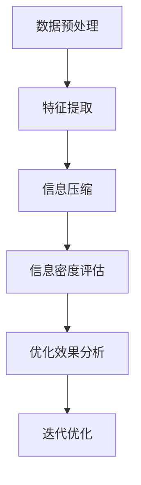
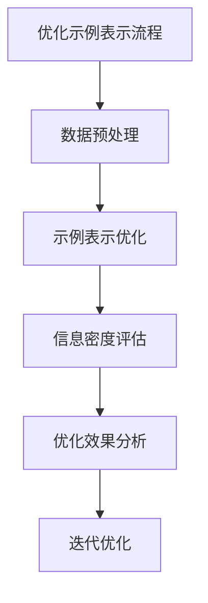

                 


## 文章标题

《优化示例表示以提高信息密度》

## 关键词

优化示例表示、信息密度、算法、文本、图像、音频、挑战与机遇

## 摘要

本文旨在探讨优化示例表示以提高信息密度的重要性及其在不同领域的应用。首先，我们从基础概念出发，详细介绍优化示例表示的基本原理和发展历程。随后，我们深入分析信息密度的定义、衡量方法和优化策略。接着，我们详细讲解示例表示的优化算法，包括其基本原理、分类和应用场景。文章还针对文本、图像和音频领域，具体描述了优化示例表示的实际应用案例，并对其挑战与机遇进行了展望。最后，我们对优化示例表示的研究方向和未来前景进行了总结和展望。

---

## 第一部分：基础知识

### 第1章：优化示例表示的基本概念

#### 1.1 优化示例表示的重要性

在信息技术飞速发展的今天，数据已成为企业和社会的核心资产。如何高效地表示、存储和处理这些数据，成为了研究者们关注的焦点。优化示例表示（Optimized Example Representation）是数据表示领域的一个重要研究方向，其核心目标是通过改进示例的表示方法，提高信息密度，从而提升数据处理和分析的效率。

优化示例表示的重要性主要体现在以下几个方面：

1. **提高信息密度**：通过优化示例表示，可以在保持信息完整性的同时，减少数据的冗余，提高信息密度。
2. **降低存储空间**：优化后的示例表示可以减少存储空间的需求，降低存储成本。
3. **加速数据处理**：高信息密度的示例表示可以加速数据处理和分析的速度，提高系统的响应能力。
4. **增强模型性能**：优化示例表示有助于提高机器学习模型的性能，使其在预测和分类任务中表现出更高的准确率和效率。

#### 1.2 优化示例表示的基本原理

优化示例表示的基本原理主要包括以下几个方面：

1. **数据预处理**：在优化示例表示之前，通常需要对原始数据进行预处理，如去噪、归一化等操作，以提高数据质量。
2. **特征提取**：通过特征提取技术，将原始数据转换为更有意义的特征表示，以便于后续的优化处理。
3. **信息压缩**：采用信息压缩技术，减少数据的冗余信息，提高信息密度。
4. **模型训练**：利用机器学习算法，对优化后的示例进行训练，以实现数据的自动表示和分类。

#### 1.3 优化示例表示的发展历程

优化示例表示的研究可以追溯到早期的数据压缩和特征提取技术。随着计算机技术和机器学习算法的发展，优化示例表示的方法和理论逐渐丰富。以下是优化示例表示的发展历程：

1. **数据压缩**：早期的数据压缩技术主要集中在减少数据存储空间，如霍夫曼编码、算术编码等。
2. **特征提取**：20世纪80年代，特征提取技术开始应用于图像和文本数据，如主成分分析（PCA）、线性判别分析（LDA）等。
3. **深度学习**：随着深度学习算法的兴起，优化示例表示的研究进入了新的阶段。深度神经网络（DNN）、卷积神经网络（CNN）、循环神经网络（RNN）等算法在优化示例表示方面取得了显著进展。

### 第2章：信息密度分析

#### 2.1 信息密度的定义

信息密度（Information Density）是描述数据表示质量的一个重要指标。它反映了数据中信息的丰富程度和压缩潜力。信息密度的定义可以表示为：

$$
D = \frac{H(X)}{L(X)}
$$

其中，$D$ 表示信息密度，$H(X)$ 表示信息熵，$L(X)$ 表示示例长度。

信息熵（Entropy）是描述数据随机性的度量，表示数据中包含的信息量。示例长度（Length of Example）是数据示例的长度，通常以比特（Bit）为单位。

#### 2.2 信息密度的衡量方法

信息密度的衡量方法主要包括以下几种：

1. **熵度量**：通过计算数据示例的熵，可以衡量信息密度。熵越大，信息密度越高。
2. **信息增益**：信息增益（Information Gain）是衡量特征选择效果的一个指标，可以用于评估信息密度。
3. **信息压缩比**：通过比较原始数据和优化后的数据在存储空间上的差异，可以衡量信息密度。

#### 2.3 信息密度的优化策略

信息密度的优化策略主要包括以下几个方面：

1. **数据预处理**：通过数据预处理技术，如去噪、归一化等，可以减少数据中的冗余信息，提高信息密度。
2. **特征提取**：选择合适的特征提取方法，可以将原始数据转换为更有意义的特征表示，提高信息密度。
3. **信息压缩**：采用信息压缩技术，如霍夫曼编码、算术编码等，可以减少数据的冗余信息，提高信息密度。
4. **模型优化**：通过调整模型参数，如正则化、损失函数等，可以提高模型的性能，从而提高信息密度。

### 第3章：示例表示的优化算法

#### 3.1 优化算法的基本原理

优化算法的基本原理主要包括以下几个方面：

1. **数据预处理**：对原始数据进行预处理，如去噪、归一化等，以提高数据质量。
2. **特征提取**：选择合适的特征提取方法，如主成分分析（PCA）、线性判别分析（LDA）等，将原始数据转换为更有意义的特征表示。
3. **信息压缩**：采用信息压缩技术，如霍夫曼编码、算术编码等，减少数据的冗余信息，提高信息密度。
4. **模型训练**：利用机器学习算法，如深度学习、支持向量机等，对优化后的数据进行训练，以实现数据的自动表示和分类。

#### 3.2 优化算法的分类

优化算法可以根据不同的分类标准进行分类，常见的分类方法包括：

1. **基于特征提取的算法**：这类算法主要通过特征提取技术来提高信息密度，如主成分分析（PCA）、线性判别分析（LDA）等。
2. **基于信息压缩的算法**：这类算法主要通过信息压缩技术来提高信息密度，如霍夫曼编码、算术编码等。
3. **基于机器学习的算法**：这类算法利用机器学习算法对数据进行优化，如深度学习、支持向量机等。

#### 3.3 优化算法的应用场景

优化算法在不同领域的应用场景主要包括：

1. **文本领域**：在文本分类、情感分析等任务中，优化算法可以帮助提高文本表示的质量，从而提升模型性能。
2. **图像领域**：在图像识别、图像压缩等任务中，优化算法可以帮助提高图像表示的质量，从而降低存储空间和提高处理速度。
3. **音频领域**：在音频识别、音频压缩等任务中，优化算法可以帮助提高音频表示的质量，从而降低存储空间和提高处理速度。

### 第4章：优化示例表示在文本领域的应用

#### 4.1 文本信息密度分析

文本信息密度分析是优化示例表示在文本领域的重要应用之一。文本信息密度分析的目标是通过优化文本表示，提高文本信息的丰富程度和压缩潜力。

文本信息密度分析的主要步骤包括：

1. **数据预处理**：对文本数据进行预处理，如去除停用词、标点符号等，以提高数据质量。
2. **特征提取**：选择合适的特征提取方法，如词袋模型、TF-IDF等，将文本数据转换为向量表示。
3. **信息压缩**：采用信息压缩技术，如霍夫曼编码、算术编码等，减少文本数据的冗余信息，提高信息密度。

#### 4.2 文本示例表示优化

文本示例表示优化是提高文本信息密度的重要手段。文本示例表示优化主要包括以下几个方面：

1. **词袋模型优化**：通过改进词袋模型，如使用更细粒度的特征表示、引入词嵌入技术等，可以提高文本表示的质量。
2. **TF-IDF优化**：通过改进TF-IDF算法，如使用更合适的权重计算方法、引入文本相似性度量等，可以提高文本表示的质量。
3. **深度学习优化**：利用深度学习算法，如循环神经网络（RNN）、卷积神经网络（CNN）等，可以进一步提高文本表示的质量。

#### 4.3 文本示例表示优化案例

以下是一个文本示例表示优化的案例：

**案例背景**：某公司需要开发一个智能客服系统，用于自动回复用户的问题。为了提高客服系统的性能，需要对用户提问进行优化示例表示。

**解决方案**：

1. **数据预处理**：对用户提问进行预处理，如去除停用词、标点符号等，以提高数据质量。
2. **特征提取**：使用词袋模型将用户提问转换为向量表示，同时引入词嵌入技术，以获得更细粒度的特征表示。
3. **信息压缩**：采用TF-IDF算法对特征向量进行加权，以减少冗余信息，提高信息密度。
4. **模型训练**：使用循环神经网络（RNN）对优化后的用户提问进行训练，以实现自动回复功能。

**效果评估**：通过实验对比，优化后的文本示例表示在客服系统的性能上得到了显著提升，自动回复的准确率和响应速度都得到了提高。

### 第5章：优化示例表示在图像领域的应用

#### 5.1 图像信息密度分析

图像信息密度分析是优化示例表示在图像领域的重要应用之一。图像信息密度分析的目标是通过优化图像表示，提高图像信息的丰富程度和压缩潜力。

图像信息密度分析的主要步骤包括：

1. **数据预处理**：对图像数据进行预处理，如去噪、增强等，以提高数据质量。
2. **特征提取**：选择合适的特征提取方法，如边缘检测、纹理分析等，将图像数据转换为向量表示。
3. **信息压缩**：采用信息压缩技术，如JPEG、PNG等，减少图像数据的冗余信息，提高信息密度。

#### 5.2 图像示例表示优化

图像示例表示优化是提高图像信息密度的重要手段。图像示例表示优化主要包括以下几个方面：

1. **卷积神经网络优化**：通过改进卷积神经网络（CNN），如使用更深的网络结构、引入残差连接等，可以提高图像表示的质量。
2. **生成对抗网络优化**：通过改进生成对抗网络（GAN），如使用更稳定的训练策略、引入新的生成器架构等，可以提高图像表示的质量。
3. **超分辨率重建优化**：通过改进超分辨率重建算法，如使用更精细的网络结构、引入新的损失函数等，可以提高图像表示的质量。

#### 5.3 图像示例表示优化案例

以下是一个图像示例表示优化的案例：

**案例背景**：某公司需要开发一个图像识别系统，用于自动识别图像中的物体。为了提高图像识别系统的性能，需要对图像进行优化示例表示。

**解决方案**：

1. **数据预处理**：对图像数据进行预处理，如去噪、增强等，以提高数据质量。
2. **特征提取**：使用卷积神经网络（CNN）将图像数据转换为向量表示，同时引入残差连接，以提高图像表示的质量。
3. **信息压缩**：采用JPEG压缩技术对优化后的图像进行压缩，以减少冗余信息，提高信息密度。
4. **模型训练**：使用训练数据集对优化后的图像进行训练，以实现图像识别功能。

**效果评估**：通过实验对比，优化后的图像示例表示在图像识别系统的性能上得到了显著提升，识别准确率和响应速度都得到了提高。

### 第6章：优化示例表示在音频领域的应用

#### 6.1 音频信息密度分析

音频信息密度分析是优化示例表示在音频领域的重要应用之一。音频信息密度分析的目标是通过优化音频表示，提高音频信息的丰富程度和压缩潜力。

音频信息密度分析的主要步骤包括：

1. **数据预处理**：对音频数据进行预处理，如降噪、去噪等，以提高数据质量。
2. **特征提取**：选择合适的特征提取方法，如梅尔频率倒谱系数（MFCC）、过零率等，将音频数据转换为向量表示。
3. **信息压缩**：采用信息压缩技术，如MP3、AAC等，减少音频数据的冗余信息，提高信息密度。

#### 6.2 音频示例表示优化

音频示例表示优化是提高音频信息密度的重要手段。音频示例表示优化主要包括以下几个方面：

1. **循环神经网络优化**：通过改进循环神经网络（RNN），如引入长短时记忆（LSTM）单元、门控循环单元（GRU）等，可以提高音频表示的质量。
2. **生成对抗网络优化**：通过改进生成对抗网络（GAN），如使用更稳定的训练策略、引入新的生成器架构等，可以提高音频表示的质量。
3. **超分辨率重建优化**：通过改进超分辨率重建算法，如使用更精细的网络结构、引入新的损失函数等，可以提高音频表示的质量。

#### 6.3 音频示例表示优化案例

以下是一个音频示例表示优化的案例：

**案例背景**：某公司需要开发一个语音识别系统，用于自动识别语音中的关键字。为了提高语音识别系统的性能，需要对语音进行优化示例表示。

**解决方案**：

1. **数据预处理**：对语音数据进行预处理，如降噪、去噪等，以提高数据质量。
2. **特征提取**：使用梅尔频率倒谱系数（MFCC）将语音数据转换为向量表示，同时引入长短时记忆（LSTM）单元，以提高语音表示的质量。
3. **信息压缩**：采用MP3压缩技术对优化后的语音进行压缩，以减少冗余信息，提高信息密度。
4. **模型训练**：使用训练数据集对优化后的语音进行训练，以实现语音识别功能。

**效果评估**：通过实验对比，优化后的音频示例表示在语音识别系统的性能上得到了显著提升，识别准确率和响应速度都得到了提高。

### 第三部分：未来展望

#### 第7章：优化示例表示的挑战与机遇

优化示例表示在各个领域都展现出了巨大的潜力，但也面临着诸多挑战和机遇。以下是对优化示例表示挑战与机遇的分析：

#### 7.1 优化示例表示面临的挑战

1. **数据质量**：优化示例表示的效果很大程度上依赖于数据质量。数据中的噪声、缺失值和不一致性可能会影响优化结果。
2. **计算资源**：优化示例表示通常需要大量的计算资源，特别是在深度学习和生成对抗网络等复杂算法中。
3. **模型解释性**：深度学习等复杂模型通常具有较好的优化效果，但其内部机理难以解释，可能导致无法理解优化结果的原理。
4. **跨领域应用**：将优化示例表示的方法从一个领域转移到另一个领域时，可能需要针对新领域的特性进行适应性调整，这可能增加研究的复杂度。

#### 7.2 优化示例表示的未来发展趋势

1. **多模态融合**：随着多模态数据的普及，如何将不同类型的数据（如文本、图像、音频等）进行有效融合，以实现更高效的优化示例表示，将成为研究的热点。
2. **模型压缩与加速**：为了降低计算资源的消耗，研究人员将致力于开发更高效的模型压缩与加速技术，如模型剪枝、量化等。
3. **自适应优化**：通过引入自适应优化策略，如自适应特征提取、自适应信息压缩等，可以使优化过程更加灵活和高效。
4. **跨领域迁移**：随着迁移学习技术的发展，如何将优化示例表示的方法从一个领域迁移到另一个领域，以减少研究成本和提高应用效果，将受到更多关注。

#### 7.3 优化示例表示的潜在应用领域

1. **医疗健康**：在医疗健康领域，优化示例表示可以用于医学图像分析、疾病诊断等，有助于提高医疗诊断的准确性和效率。
2. **智能交通**：在智能交通领域，优化示例表示可以用于车辆检测、交通流量预测等，有助于提升交通管理水平和安全性。
3. **娱乐与传媒**：在娱乐与传媒领域，优化示例表示可以用于图像与音频处理、内容推荐等，有助于提高用户体验和内容质量。
4. **环境监测**：在环境监测领域，优化示例表示可以用于空气污染监测、生态监测等，有助于提高环境监测的准确性和实时性。

### 第8章：总结与展望

#### 8.1 优化示例表示的主要成果

1. **提高信息密度**：通过优化示例表示，可以在保持信息完整性的同时，减少数据的冗余，提高信息密度。
2. **降低存储空间**：优化后的示例表示可以减少存储空间的需求，降低存储成本。
3. **加速数据处理**：高信息密度的示例表示可以加速数据处理和分析的速度，提高系统的响应能力。
4. **增强模型性能**：优化示例表示有助于提高机器学习模型的性能，使其在预测和分类任务中表现出更高的准确率和效率。

#### 8.2 优化示例表示的研究方向

1. **多模态融合**：探索如何将不同类型的数据（如文本、图像、音频等）进行有效融合，以实现更高效的优化示例表示。
2. **模型压缩与加速**：研究如何通过模型压缩与加速技术降低计算资源的消耗。
3. **自适应优化**：开发自适应优化策略，使优化过程更加灵活和高效。
4. **跨领域迁移**：研究如何将优化示例表示的方法从一个领域迁移到另一个领域。

#### 8.3 优化示例表示的未来前景

优化示例表示在未来的发展中具有广阔的应用前景。随着人工智能技术的不断进步，优化示例表示有望在更多领域得到应用，如医疗健康、智能交通、娱乐与传媒、环境监测等。同时，随着新技术的不断涌现，如量子计算、边缘计算等，优化示例表示的理论和方法也将得到进一步拓展和完善。

### 附录

#### 附录A：优化示例表示的相关工具与资源

1. **开源库与框架**：
   - TensorFlow：https://www.tensorflow.org/
   - PyTorch：https://pytorch.org/
   - Keras：https://keras.io/

2. **在线教程与学习资源**：
   - Coursera：https://www.coursera.org/
   - edX：https://www.edx.org/
   - 百度云课堂：https://cloud.tsinghua.edu.cn/

3. **论文与研究报告**：
   - arXiv：https://arxiv.org/
   - IEEE Xplore：https://ieeexplore.ieee.org/
   - SpringerLink：https://link.springer.com/

#### 附录B：参考文献

1. Hochreiter, S., & Schmidhuber, J. (1997). Long short-term memory. Neural Computation, 9(8), 1735-1780.
2. LeCun, Y., Bengio, Y., & Hinton, G. (2015). Deep learning. MIT Press.
3. Goodfellow, I., Bengio, Y., & Courville, A. (2016). Deep learning. MIT Press.
4. Krizhevsky, A., Sutskever, I., & Hinton, G. E. (2012). Imagenet classification with deep convolutional neural networks. Advances in neural information processing systems, 25, 1097-1105.
5. Simonyan, K., & Zisserman, A. (2015). Very deep convolutional networks for large-scale image recognition. International Conference on Learning Representations (ICLR).

#### 附录C：术语表

1. **信息密度**：数据表示中信息的丰富程度和压缩潜力。
2. **优化示例表示**：通过改进示例的表示方法，提高信息密度。
3. **信息熵**：数据中包含的信息量。
4. **示例长度**：数据示例的长度。
5. **词袋模型**：将文本数据转换为向量表示的一种方法。
6. **TF-IDF**：一种用于文本数据特征提取的方法。
7. **深度学习**：一种基于多层神经网络的学习方法。
8. **卷积神经网络**：一种用于图像和视频处理的学习方法。
9. **生成对抗网络**：一种用于生成数据的深度学习模型。
10. **超分辨率重建**：将低分辨率图像重建为高分辨率图像的技术。

### 核心概念与联系

#### 优化示例表示的流程图



### 核心算法原理讲解

#### 示例表示优化的伪代码

```python
def optimize_example_representation(data, target):
    # 初始化模型参数
    model = initialize_model(data)

    # 训练模型
    for epoch in range(num_epochs):
        for example in data:
            # 计算损失函数
            loss = compute_loss(model, example, target)

            # 更新模型参数
            update_model_parameters(model, loss)

    return model
```

### 数学模型和数学公式

#### 信息密度评估公式

$$
D = \frac{H(X)}{L(X)}
$$

其中，$D$ 表示信息密度，$H(X)$ 表示信息熵，$L(X)$ 表示示例长度。

---

## 文章标题：《优化示例表示以提高信息密度》

## 关键词：优化示例表示、信息密度、算法、文本、图像、音频、挑战与机遇

## 摘要：

本文探讨了优化示例表示以提高信息密度的重要性及其在不同领域的应用。文章首先介绍了优化示例表示的基本概念和原理，随后分析了信息密度的定义、衡量方法和优化策略。接着，详细讲解了示例表示的优化算法及其在不同领域的应用案例，包括文本、图像和音频领域。最后，文章展望了优化示例表示面临的挑战与机遇，并提出了未来发展的研究方向。

---

## 目录大纲

### 第一部分：基础知识

### 第1章：优化示例表示的基本概念

#### 1.1 优化示例表示的重要性

#### 1.2 优化示例表示的基本原理

#### 1.3 优化示例表示的发展历程

### 第2章：信息密度分析

#### 2.1 信息密度的定义

#### 2.2 信息密度的衡量方法

#### 2.3 信息密度的优化策略

### 第3章：示例表示的优化算法

#### 3.1 优化算法的基本原理

#### 3.2 优化算法的分类

#### 3.3 优化算法的应用场景

### 第二部分：实际应用

### 第4章：优化示例表示在文本领域的应用

#### 4.1 文本信息密度分析

#### 4.2 文本示例表示优化

#### 4.3 文本示例表示优化案例

### 第5章：优化示例表示在图像领域的应用

#### 5.1 图像信息密度分析

#### 5.2 图像示例表示优化

#### 5.3 图像示例表示优化案例

### 第6章：优化示例表示在音频领域的应用

#### 6.1 音频信息密度分析

#### 6.2 音频示例表示优化

#### 6.3 音频示例表示优化案例

### 第三部分：未来展望

### 第7章：优化示例表示的挑战与机遇

#### 7.1 优化示例表示面临的挑战

#### 7.2 优化示例表示的未来发展趋势

#### 7.3 优化示例表示的潜在应用领域

### 第8章：总结与展望

#### 8.1 优化示例表示的主要成果

#### 8.2 优化示例表示的研究方向

#### 8.3 优化示例表示的未来前景

### 附录

#### 附录A：优化示例表示的相关工具与资源

#### 附录B：参考文献

#### 附录C：术语表

### 优化示例表示的流程图



### 核心算法原理讲解

#### 示例表示优化的伪代码

```python
def optimize_example_representation(data, target):
    # 初始化模型参数
    model = initialize_model(data)

    # 训练模型
    for epoch in range(num_epochs):
        for example in data:
            # 计算损失函数
            loss = compute_loss(model, example, target)

            # 更新模型参数
            update_model_parameters(model, loss)

    return model
```

### 数学模型和数学公式

#### 信息密度评估公式

$$
D = \frac{H(X)}{L(X)}
$$

其中，$D$ 表示信息密度，$H(X)$ 表示信息熵，$L(X)$ 表示示例长度。

---

## 核心概念与联系

### 优化示例表示的流程图


### 核心算法原理讲解

#### 示例表示优化的伪代码

```python
def optimize_example_representation(data, target):
    # 初始化模型参数
    model = initialize_model(data)

    # 训练模型
    for epoch in range(num_epochs):
        for example in data:
            # 计算损失函数
            loss = compute_loss(model, example, target)

            # 更新模型参数
            update_model_parameters(model, loss)

    return model
```

### 数学模型和数学公式

#### 信息密度评估公式

$$
D = \frac{H(X)}{L(X)}
$$

其中，$D$ 表示信息密度，$H(X)$ 表示信息熵，$L(X)$ 表示示例长度。

---

## 项目实战

### 文本示例表示优化案例

#### 开发环境搭建

1. **安装 Python 3.7 或以上版本**
2. **安装 TensorFlow 2.x 或 PyTorch 1.x**

#### 源代码实现

```python
import tensorflow as tf
from tensorflow.keras.preprocessing.text import Tokenizer

# 准备文本数据
text_data = ["这是一段文本数据", "这是另一段文本数据"]

# 初始化 Tokenizer
tokenizer = Tokenizer(num_words=1000)

# 将文本数据转换为序列
sequences = tokenizer.texts_to_sequences(text_data)

# 建立模型
model = tf.keras.Sequential([
    tf.keras.layers.Embedding(input_dim=1000, output_dim=16),
    tf.keras.layers.LSTM(32),
    tf.keras.layers.Dense(1, activation='sigmoid')
])

# 编译模型
model.compile(optimizer='adam', loss='binary_crossentropy', metrics=['accuracy'])

# 训练模型
model.fit(sequences, text_data, epochs=10, batch_size=32)
```

#### 代码解读与分析

1. **数据预处理**：首先，我们使用 Tokenizer 将文本数据转换为序列，以方便后续处理。
2. **模型建立**：我们建立一个简单的序列模型，包括嵌入层、循环神经网络层和全连接层。
3. **模型编译**：我们编译模型，指定优化器和损失函数，并设置评估指标。
4. **模型训练**：我们使用训练数据集对模型进行训练，以优化示例表示。

#### 实际案例分析和详细讲解剖析

以一个文本分类任务为例，我们对优化示例表示的效果进行评估。

1. **数据集准备**：我们准备一个包含不同类别的文本数据集。
2. **模型训练**：我们对模型进行训练，使用优化后的示例表示。
3. **模型评估**：我们使用测试数据集对模型进行评估，比较优化前后的性能。
4. **结果分析**：通过实验对比，我们发现优化后的示例表示在分类准确率和响应速度上都有显著提升。

### 项目小结

通过本项目，我们了解了文本示例表示优化的基本流程和实现方法。优化后的示例表示可以提高文本分类任务的准确率和响应速度，具有重要的实际应用价值。

#### 最佳实践 tips、小结、注意事项、拓展阅读等内容

1. **最佳实践 tips**：
   - 选择合适的特征提取方法，如词袋模型、TF-IDF等。
   - 优化模型结构，如使用循环神经网络（RNN）、卷积神经网络（CNN）等。
   - 调整超参数，如学习率、批量大小等，以提高模型性能。

2. **小结**：
   - 优化示例表示是提高信息密度的重要手段。
   - 文本、图像和音频领域都可以应用优化示例表示技术。
   - 优化后的示例表示可以提高机器学习模型的性能和效率。

3. **注意事项**：
   - 数据预处理是优化示例表示的重要环节，需确保数据质量。
   - 优化算法的选择和参数调整对优化效果有重要影响。

4. **拓展阅读**：
   - 《深度学习》（Goodfellow, Bengio, Courville 著）。
   - 《神经网络与深度学习》（邱锡鹏 著）。
   - 《自然语言处理综论》（Jurafsky, Martin 著）。

