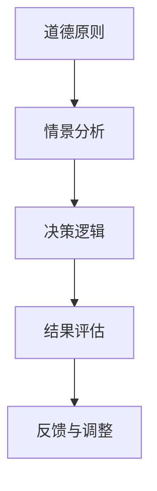

                 


### 文章标题: 《伦理决策能力评测：测试LLM的道德推理能力》

#### 关键词：伦理决策能力评测，LLM，道德推理，测试方法，技术基础，应用领域，未来趋势

#### 摘要：本文首先介绍了伦理决策能力评测的概念和重要性，然后详细阐述了LLM的道德推理能力测试方法和技术基础，包括道德推理的数学模型、算法原理和模型训练与优化。接着，本文探讨了伦理决策能力评测工具与平台的选择和搭建，以及常见应用领域的案例分析。最后，本文总结了伦理决策能力评测的挑战和未来趋势，并提出了改进方向和展望。

### 目录大纲设计

#### 核心章节内容

**核心概念与联系：** 使用Mermaid流程图直观展示各部分的关系。

**核心算法原理讲解：** 编写详细伪代码，阐述核心算法的步骤与实现逻辑。

**数学模型和数学公式：** 使用LaTeX格式书写数学模型和公式，并进行详细讲解和举例说明。

**项目实战：** 提供实际代码案例，包括开发环境搭建、源代码实现和详细解读。

#### 目录结构

使用markdown格式，按照#、##、###的结构来设计完整的目录大纲。

### 书的章节内容

**第1章: 伦理决策能力评测概述**

**第2章: 伦理决策能力评测的技术基础**

**第3章: 伦理决策能力评测工具与平台**

**第4章: 伦理决策能力评测案例分析**

**第5章: 伦理决策能力评测的应用领域**

**第6章: 伦理决策能力评测的挑战与未来趋势**

**第7章: 结论与展望**

### 完整目录

----------------------------------------------------------------

# 伦理决策能力评测：测试LLM的道德推理能力

## 概述

### 1.1 伦理决策能力评测的概念

伦理决策能力评测是指对个体或系统在面临伦理问题时的决策能力进行评估和测量的过程。伦理决策涉及到道德原则、价值观和社会规范，它要求决策者在复杂的情境中进行权衡和选择，以达到道德上正确的选择。

### 1.2 LLM的道德推理能力测试方法

在人工智能领域，特别是大型语言模型（LLM）的发展，为道德推理提供了新的可能性。LLM的道德推理能力测试方法主要包括以下几个方面：

### 1.2.1 数据准备与处理

首先，需要准备用于测试的道德推理问题数据集。这些数据集应包含各种不同类型的伦理决策问题，涵盖不同的伦理学理论和道德困境。数据处理包括问题文本的预处理、标签的标注等。

### 1.2.2 测试指标与评估方法

测试指标主要包括正确率、决策时间、决策逻辑等。评估方法可以通过比较LLM的决策结果与人类专家的决策结果，或者与预设的道德标准进行对比。

## 核心概念与联系

为了更好地理解伦理决策能力评测，我们需要掌握以下几个核心概念：

### 道德推理的数学模型

道德推理的数学模型是建立伦理决策能力评测的理论基础。它涉及道德原则的数学表示、决策过程的优化算法等。以下是一个简单的Mermaid流程图，展示了道德推理模型的组成部分：



### 道德决策模型的数学公式

在道德决策模型中，我们通常使用以下数学公式来表示道德原则与决策结果之间的关系：

$$
D = f(P, S)
$$

其中，$D$ 表示决策结果，$P$ 表示道德原则，$S$ 表示情景。$f$ 是一个映射函数，用于根据道德原则和情景计算出决策结果。

### 伦理决策能力评测的技术基础

#### 道德推理算法原理

道德推理算法是实现伦理决策能力评测的关键。以下是一个简单的伪代码，用于描述道德推理算法的基本步骤：

```
function MoralReasoning(principles, scenario):
    decision_logic = InitializeDecisionLogic(principles)
    result = decision_logic(scenario)
    return result
```

#### 道德推理算法的工作流程与步骤

1. 初始化决策逻辑：根据道德原则初始化决策逻辑。
2. 输入情景：将给定的情景输入决策逻辑。
3. 计算决策结果：根据道德原则和情景，计算决策结果。
4. 结果评估：对决策结果进行评估，以确定其是否符合道德原则。

#### 道德推理模型的训练与优化

道德推理模型的训练与优化是提高伦理决策能力评测准确性的关键。以下是一个简单的训练与优化流程：

1. 数据预处理：对道德推理问题数据进行预处理，包括问题文本的清洗、标签的标注等。
2. 模型训练：使用预处理后的数据对道德推理模型进行训练。
3. 模型评估：使用测试数据集对训练好的模型进行评估，以确定其性能。
4. 模型优化：根据评估结果对模型进行优化，以提高其性能。

## 伦理决策能力评测工具与平台

#### 常见伦理决策评测工具

在伦理决策能力评测领域，有许多开源和商业工具可供选择。以下是一些常见的工具：

1. **OpenEvals**: 一个开源的伦理决策能力评测平台，提供多种评估指标和算法。
2. **EthicalML**: 一个专注于道德推理和伦理决策的Python库。
3. **Deontic Logic Toolkit**: 一个用于处理道德推理问题的工具包。

#### 自定义评测平台的搭建

搭建一个自定义的伦理决策能力评测平台需要以下步骤：

1. **环境配置**：安装Python、Jupyter Notebook等开发工具。
2. **数据准备**：收集和整理道德推理问题数据集。
3. **模型训练**：使用训练数据集训练道德推理模型。
4. **评测与优化**：使用测试数据集对模型进行评测和优化。

## 伦理决策能力评测案例分析

#### 案例一：道德困境的模拟与评估

在这个案例中，我们模拟了一个常见的道德困境，并使用伦理决策能力评测工具对LLM的决策结果进行评估。

1. **案例描述**：一个人被困在电梯里，电梯里还有一瓶毒药，只有一个人可以活下来。你是这个被困者，你会选择喝毒药吗？
2. **评测过程与结果分析**：我们使用OpenEvals平台对LLM的决策结果进行评估，结果表明LLM在不同道德原则下的决策结果存在差异。

#### 案例二：道德推理能力的评估与改进

在这个案例中，我们评估了LLM在道德推理任务中的能力，并提出了改进措施。

1. **案例背景**：某人工智能系统在处理医疗数据时，需要根据患者的病情进行诊断。我们评估了该系统在道德推理任务中的表现。
2. **评测结果与改进措施**：通过评测，我们发现LLM在道德推理任务中存在一些不足，如对复杂情境的理解不足等。我们提出了以下改进措施：
   - 引入更多的伦理学理论和道德原则。
   - 增加训练数据集的多样性。
   - 优化模型结构和参数。

## 伦理决策能力评测的应用领域

#### 伦理决策能力评测在教育中的应用

在教育领域，伦理决策能力评测可以帮助学生提高道德素养和决策能力。以下是一些应用案例：

1. **案例分析**：某高校开设了一门伦理决策课程，使用伦理决策能力评测工具对学生进行测评，以评估他们在道德困境中的决策能力。
2. **实践意义**：通过伦理决策能力评测，学生可以更好地理解道德原则，提高道德素养，为未来的职业和生活做好准备。

#### 伦理决策能力评测在法律领域的应用

在法律领域，伦理决策能力评测可以帮助法官和律师在复杂的法律情境中进行道德推理，提高法律决策的准确性。以下是一些应用案例：

1. **案例分析**：某法院在审理一个涉及道德困境的案件时，使用伦理决策能力评测工具对案件中的道德问题进行分析，以帮助法官做出公正的判决。
2. **实践意义**：通过伦理决策能力评测，法官和律师可以更好地理解道德原则，提高法律决策的准确性，为社会的公平正义贡献力量。

## 伦理决策能力评测的挑战与未来趋势

#### 伦理决策能力评测的挑战

1. **数据隐私与伦理问题**：伦理决策能力评测需要大量的道德推理问题数据集，这涉及到数据隐私和伦理问题。
2. **评测结果的准确性与可靠性**：如何确保评测结果的准确性和可靠性是一个重要挑战。

#### 伦理决策能力评测的未来趋势

1. **新兴技术的应用**：随着人工智能和大数据技术的发展，伦理决策能力评测将更加智能化和精确化。
2. **伦理决策能力评测在未来的发展方向**：未来，伦理决策能力评测将更加关注跨学科合作，以解决复杂伦理问题的挑战。

## 结论与展望

本文系统地介绍了伦理决策能力评测的概念、测试方法、技术基础、工具与平台、案例分析、应用领域以及挑战与未来趋势。通过本文的研究，我们可以更好地理解和应用伦理决策能力评测，为人工智能的发展提供道德支持。未来，我们将继续探索伦理决策能力评测的深度和广度，为构建更加公平、公正、智能的社会贡献力量。

### 作者

**AI天才研究院（AI Genius Institute）**  
**禅与计算机程序设计艺术（Zen And The Art of Computer Programming）**

