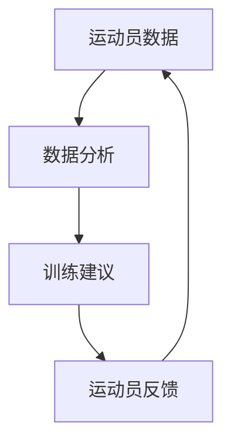
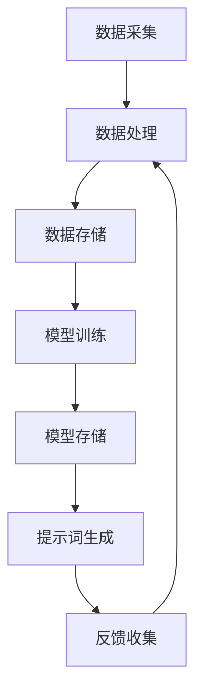
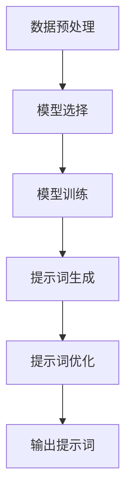

                 


### 文章标题：体育训练革新：AI教练的提示词设计

> 关键词：AI教练、体育训练、提示词设计、人工智能、运动训练

> 摘要：本文深入探讨了AI教练在体育训练中的革新作用，特别是在提示词设计方面的创新。通过逐步分析，我们揭示了AI教练的核心概念、设计原理以及实际应用，为体育训练的智能化发展提供了新的思路。

----------------------------------------------------------------

### 文章目录大纲

**第一部分：AI教练与体育训练概述**

1. **第1章：AI教练的核心概念**
   - 1.1 AI教练的定义与特点
   - 1.2 AI教练与传统教练的区别
   - 1.3 AI教练在体育训练中的应用前景

2. **第2章：体育训练中的AI技术基础**
   - 2.1 人工智能的基本原理
   - 2.2 数据采集与处理
   - 2.3 机器学习算法在体育训练中的应用

**第二部分：AI教练设计实践**

3. **第3章：提示词设计原理**
   - 3.1 提示词的基本概念
   - 3.2 提示词设计原则
   - 3.3 提示词的分类与选择

4. **第4章：AI教练的架构设计**
   - 4.1 AI教练的整体架构
   - 4.2 数据流设计
   - 4.3 算法流程设计

5. **第5章：提示词生成算法**
   - 5.1 提示词生成算法概述
   - 5.2 生成式模型与判别式模型
   - 5.3 提示词生成算法的实现

6. **第6章：AI教练在运动训练中的应用**
   - 6.1 运动训练中的AI教练
   - 6.2 提示词在训练中的应用场景
   - 6.3 提示词设计对训练效果的影响

7. **第7章：AI教练的未来发展**
   - 7.1 AI教练的技术趋势
   - 7.2 AI教练在教育领域的影响
   - 7.3 AI教练的伦理与社会问题

**第三部分：实践案例与源代码解读**

8. **第8章：AI教练项目实战**
   - 8.1 项目背景与需求分析
   - 8.2 系统设计与实现
   - 8.3 系统部署与优化

9. **第9章：源代码解读与分析**
   - 9.1 源代码结构解析
   - 9.2 关键代码解读
   - 9.3 代码性能分析与优化

### 格式要求

- **Markdown格式**：文章内容将使用Markdown格式进行编写，以便于排版和格式化。
- **作者信息**：文章末尾需注明作者信息，包括“作者：AI天才研究院/AI Genius Institute & 禅与计算机程序设计艺术 /Zen And The Art of Computer Programming”。
- **字数要求**：文章总字数预计在8000到12000字之间，以确保内容的深度与广度。

### 内容完整性与核心内容

- **背景介绍**：在文章的第一部分，我们将介绍AI教练的定义、特点以及与传统教练的区别，为读者提供一个基础的了解。
- **核心概念与联系**：我们将通过Mermaid流程图展示AI教练的核心概念之间的关系，帮助读者更好地理解整个系统的运作。
- **核心算法原理讲解**：在第三部分，我们将深入探讨提示词生成算法的原理，包括生成式模型与判别式模型，并使用伪代码进行详细阐述。
- **数学模型和公式讲解**：我们将使用LaTeX格式嵌入数学公式，并在文中独立段落中举例说明，以便于读者理解。
- **项目实战**：在最后的部分，我们将通过一个实际案例展示AI教练的系统设计与实现过程，并进行代码解读与分析。

### 最佳实践 Tips、小结、注意事项、拓展阅读

- **最佳实践 Tips**：在文章的各个部分，我们将提供一些实用的最佳实践建议，帮助读者更好地设计和应用AI教练系统。
- **小结**：在每个章节的结尾，我们将进行总结，强调关键点，帮助读者巩固学习内容。
- **注意事项**：我们将提醒读者在设计和应用AI教练系统时需要注意的事项，以避免潜在的问题。
- **拓展阅读**：为了进一步扩展读者的知识，我们将在文章的末尾提供一些拓展阅读资源。

通过以上内容，我们希望本文能够为体育训练的智能化发展提供有价值的参考，并激发读者对AI教练和提示词设计的深入思考和研究。

### 第一部分：AI教练与体育训练概述

#### 第1章：AI教练的核心概念

AI教练作为人工智能在体育训练领域的重要应用，其核心概念主要围绕如何利用人工智能技术来辅助教练进行训练。首先，我们需要明确什么是AI教练。AI教练不仅仅是一个软件程序，而是一个集成了多种先进技术的智能系统，它可以实时分析运动员的生理数据、运动表现，并根据这些数据提供个性化的训练建议。

**1.1 AI教练的定义与特点**

AI教练的定义可以简单概括为：通过人工智能技术，为运动员提供个性化训练指导的系统。其特点主要体现在以下几个方面：

1. **数据驱动的决策**：AI教练依赖于大量的训练数据，通过对这些数据的分析，生成对运动员有指导意义的训练计划。
2. **实时反馈**：AI教练可以实时监控运动员的训练状态，并根据这些实时数据提供反馈，帮助运动员及时调整训练强度和方式。
3. **个性化指导**：不同的运动员有不同的训练需求和状态，AI教练可以根据每位运动员的具体情况提供个性化的训练建议。
4. **自动化训练计划**：AI教练可以自动生成训练计划，减少教练的工作量，提高训练效率。

**1.2 AI教练与传统教练的区别**

传统教练主要依靠经验和直觉来指导运动员，而AI教练则更多地依赖于数据和分析。两者的主要区别体现在以下几个方面：

1. **数据来源与处理**：传统教练的数据主要来自于教练的观察和经验，而AI教练则依赖于传感器、GPS等设备收集的精确数据，并通过算法进行处理。
2. **决策过程**：传统教练的决策过程相对主观，而AI教练则通过算法和数据分析，提供更加客观和科学的决策依据。
3. **指导方式**：传统教练通常采用统一的训练方法，而AI教练可以根据每位运动员的特点进行个性化指导，提高训练效果。

**1.3 AI教练在体育训练中的应用前景**

随着人工智能技术的不断发展，AI教练在体育训练中的应用前景十分广阔。以下是几个潜在的应用方向：

1. **个性化训练**：通过分析运动员的生理数据和运动表现，AI教练可以为运动员提供个性化的训练计划，提高训练效果。
2. **预防性训练**：AI教练可以通过监控运动员的疲劳状态，预测可能出现的伤病，提前采取措施进行预防。
3. **训练策略优化**：AI教练可以分析比赛数据，为教练提供优化训练策略的建议，提高运动员的比赛表现。
4. **辅助教练工作**：AI教练可以自动化处理大量的训练数据，减轻教练的工作负担，使其有更多的时间专注于战术指导和技术训练。

**Mermaid流程图：AI教练核心概念关系图**



**核心概念联系解析**

通过上述Mermaid流程图，我们可以看出AI教练的核心概念之间的联系。运动员数据是整个系统的输入，通过数据分析，AI教练可以生成个性化的训练建议，并根据运动员的反馈进行优化，形成一个闭环系统，从而不断提高训练效果。

#### 第2章：体育训练中的AI技术基础

**2.1 人工智能的基本原理**

人工智能（AI）是一门研究、开发用于模拟、延伸和扩展人类智能的理论、方法、技术及应用系统的学科。其基本原理主要包括以下几个方面：

1. **机器学习**：机器学习是AI的核心技术之一，它通过从数据中学习规律和模式，实现自我优化。常用的机器学习算法包括监督学习、无监督学习、强化学习等。
2. **深度学习**：深度学习是机器学习的一个子领域，它通过模拟人脑神经网络的结构和功能，实现更复杂的任务。深度学习的代表性算法包括神经网络、卷积神经网络（CNN）和循环神经网络（RNN）等。
3. **自然语言处理**：自然语言处理（NLP）是AI在语言处理领域的应用，它涉及文本的理解、生成和翻译等任务。

**2.2 数据采集与处理**

在体育训练中，数据的采集和处理是AI教练系统的关键环节。以下是几个关键步骤：

1. **数据采集**：数据采集主要通过传感器、GPS、心率监测器等设备进行。这些设备可以实时记录运动员的生理数据、运动轨迹和表现数据。
2. **数据预处理**：采集到的数据通常是原始和大量的，需要通过预处理步骤进行清洗、去噪和归一化，以便于后续的分析。
3. **数据存储**：处理后的数据需要存储在数据库中，以便于AI教练系统进行查询和使用。

**2.3 机器学习算法在体育训练中的应用**

机器学习算法在体育训练中的应用广泛，以下是一些典型的应用场景：

1. **运动表现预测**：通过分析历史数据和实时数据，机器学习算法可以预测运动员在未来的训练和比赛中的表现，帮助教练制定更加科学的训练计划。
2. **伤病预测**：通过分析运动员的生理数据和训练负荷，机器学习算法可以预测运动员可能出现的伤病，提前进行预防。
3. **策略优化**：通过分析比赛数据，机器学习算法可以为教练提供优化比赛策略的建议，提高运动员的比赛表现。

**伪代码示例：运动表现预测算法**

```python
# 输入：历史训练数据集D，实时数据集T
# 输出：预测训练表现P

# Step 1: 数据预处理
D_processed = preprocess_data(D)
T_processed = preprocess_data(T)

# Step 2: 特征提取
features_D = extract_features(D_processed)
features_T = extract_features(T_processed)

# Step 3: 训练模型
model = train_model(features_D)

# Step 4: 预测
P = model.predict(features_T)

# Step 5: 输出预测结果
print("Predicted Training Performance:", P)
```

**数学模型与公式讲解**

在运动表现预测中，我们可以使用线性回归模型来建立运动员训练表现与输入特征之间的关系。线性回归模型的公式如下：

$$
y = wx + b
$$

其中，$y$表示训练表现，$w$表示权重，$x$表示输入特征，$b$表示偏置。

**举例说明**

假设我们使用心率数据（$x_1$）和运动轨迹长度（$x_2$）作为输入特征，预测运动员的下一场训练表现（$y$）。通过训练模型，我们得到如下线性回归方程：

$$
y = 0.5x_1 + 0.3x_2 + 1
$$

如果我们输入当前的心率（$x_1 = 150$）和运动轨迹长度（$x_2 = 5$），则可以预测下一场训练表现：

$$
y = 0.5 \times 150 + 0.3 \times 5 + 1 = 82.5 + 1.5 + 1 = 85
$$

因此，预测的下一场训练表现为85。

通过上述内容，我们可以看到AI技术基础在体育训练中的应用，包括人工智能的基本原理、数据采集与处理以及机器学习算法的应用。这些技术基础为AI教练的设计和实现提供了坚实的基础。

#### 第二部分：AI教练设计实践

##### 第3章：提示词设计原理

**3.1 提示词的基本概念**

提示词（Prompt）是AI教练系统中一个关键的概念，它用于引导AI模型进行推理和决策。在AI教练的设计中，提示词的作用相当于人类的指令或问题，它帮助模型理解当前情境和任务，从而生成相应的回应或建议。

提示词的生成和设计直接影响到AI教练的性能和用户体验。一个高质量的提示词应该具备以下几个特点：

1. **准确性**：提示词需要准确传达教练或运动员的需求和意图，避免模糊或不准确的信息导致模型产生错误的决策。
2. **完整性**：提示词应该包含足够的信息，使得模型能够理解和处理复杂的问题。
3. **灵活性**：提示词应具有足够的灵活性，以适应不同的训练场景和需求。

**3.2 提示词设计原则**

为了确保提示词的设计能够满足上述要求，我们需要遵循以下设计原则：

1. **明确性**：提示词应尽可能明确，避免歧义。这可以通过使用简洁明了的语言和具体的描述来实现。
2. **适应性**：提示词应具有适应性，能够根据不同的训练场景进行调整。例如，对于不同类型的运动项目，提示词的内容和格式可以有所不同。
3. **可扩展性**：提示词设计应具备良好的可扩展性，以便于在未来的训练需求中能够方便地进行修改和扩展。
4. **用户友好性**：提示词应设计成易于理解和操作的形式，确保教练和运动员能够轻松使用和接受。

**3.3 提示词的分类与选择**

根据不同的应用场景和需求，提示词可以分为以下几类：

1. **训练提示词**：用于指导运动员进行训练的提示词，例如“调整呼吸频率以降低心率”、“尝试增加跑步速度”等。
2. **比赛提示词**：用于指导运动员在比赛中的策略和战术的提示词，例如“注意对手的站位”、“适当调整战术”等。
3. **康复提示词**：用于指导运动员进行康复训练的提示词，例如“进行轻量级拉伸运动”、“逐步增加训练强度”等。
4. **评估提示词**：用于评估运动员训练效果和表现的提示词，例如“分析比赛录像”、“评估训练负荷”等。

在选择提示词时，需要考虑以下几个因素：

1. **目标群体**：不同的运动员和教练对提示词的需求和接受程度可能有所不同，因此需要根据目标群体的特点进行选择。
2. **训练场景**：不同的训练场景需要不同的提示词，例如室内训练和户外训练的提示词可能会有所差异。
3. **技术能力**：考虑AI教练系统的技术能力，确保选择的提示词能够被有效处理和执行。

**示例：训练提示词设计**

假设我们需要为一名长跑运动员设计一组训练提示词，以下是一个具体的例子：

1. **调整呼吸频率以降低心率**：这个提示词可以帮助运动员在长跑过程中保持稳定的呼吸节奏，降低心率，提高耐力。
2. **尝试增加跑步速度**：在适应了基础的训练强度后，这个提示词可以激励运动员逐步提高训练强度，提高跑步速度。
3. **进行力量训练以增强腿部肌肉**：力量训练可以增强运动员的腿部肌肉，提高跑步效率，这个提示词旨在提醒运动员加强力量训练。

通过上述设计原则和示例，我们可以更好地理解和应用提示词的设计原理，为AI教练系统的开发提供有力支持。

#### 第4章：AI教练的架构设计

**4.1 AI教练的整体架构**

AI教练的整体架构可以分为以下几个主要模块：

1. **数据采集模块**：负责收集运动员的生理数据、运动表现数据以及其他相关数据。
2. **数据处理模块**：对采集到的原始数据进行清洗、预处理和特征提取，以便于后续的分析和建模。
3. **模型训练模块**：利用预处理后的数据训练机器学习模型，包括监督学习模型、无监督学习模型和深度学习模型等。
4. **提示词生成模块**：根据运动员的当前状态和训练目标，生成相应的提示词，指导运动员的训练。
5. **反馈模块**：收集运动员对训练的反馈，用于模型优化和提示词调整。

**数据流设计**

AI教练的数据流设计是确保系统正常运行的关键。以下是数据流的基本流程：

1. **数据采集**：传感器和设备实时采集运动员的生理数据、运动表现数据等，并将数据传输到数据采集模块。
2. **数据处理**：数据采集模块对原始数据进行清洗、去噪和归一化，并将处理后的数据存储到数据存储模块。
3. **模型训练**：模型训练模块从数据存储模块获取数据，进行特征提取和模型训练。训练完成后，将模型参数存储到模型存储模块。
4. **提示词生成**：提示词生成模块根据运动员的当前状态和训练目标，从模型存储模块加载相应的模型，生成提示词。
5. **反馈收集**：反馈模块收集运动员对训练的反馈，包括训练效果、舒适度等，并将其传输到数据处理模块，用于模型优化和提示词调整。

**算法流程设计**

AI教练的算法流程设计主要包括以下几个步骤：

1. **数据预处理**：对采集到的原始数据进行清洗、去噪和归一化，以便于后续的分析和建模。
2. **特征提取**：从预处理后的数据中提取有用的特征，例如心率、运动轨迹、运动时间等，用于训练模型。
3. **模型选择**：根据训练目标和数据特征，选择合适的机器学习模型，例如线性回归、决策树、神经网络等。
4. **模型训练**：使用预处理后的数据和提取的特征，对选择的模型进行训练，并调整模型参数，提高模型的性能。
5. **提示词生成**：根据运动员的当前状态和训练目标，使用训练好的模型生成相应的提示词，指导运动员的训练。
6. **模型优化**：根据运动员的反馈，对模型进行优化，提高模型的准确性和适应性。
7. **反馈调整**：根据运动员的反馈，调整提示词的生成策略，以提高训练效果。

**Mermaid流程图：AI教练架构和数据流设计**



通过上述架构设计和算法流程，我们可以构建一个高效、智能的AI教练系统，为运动员提供个性化的训练指导，提高训练效果。

#### 第5章：提示词生成算法

**5.1 提示词生成算法概述**

提示词生成算法是AI教练系统中的核心组成部分，负责根据运动员的实时状态和训练需求生成指导性提示词。提示词生成算法可以分为生成式模型和判别式模型两大类。生成式模型通过生成文本数据来生成提示词，而判别式模型则通过分类和预测来生成提示词。

**5.2 生成式模型与判别式模型**

1. **生成式模型**：生成式模型通过学习文本数据生成新的文本。常见的生成式模型包括：

   - **自动编码器（Autoencoder）**：自动编码器通过学习输入数据的编码和重构过程，生成新的数据。在提示词生成中，自动编码器可以学习运动员的状态编码，并生成相应的提示词。
   - **变分自编码器（Variational Autoencoder, VAE）**：VAE通过概率模型生成数据，具有更好的灵活性和鲁棒性。
   - **生成对抗网络（Generative Adversarial Network, GAN）**：GAN由生成器和判别器组成，通过两个网络的对抗训练，生成高质量的文本数据。

2. **判别式模型**：判别式模型通过学习分类和预测任务来生成提示词。常见的判别式模型包括：

   - **循环神经网络（Recurrent Neural Network, RNN）**：RNN适用于序列数据的处理，可以捕捉时间序列中的上下文信息。
   - **长短时记忆网络（Long Short-Term Memory, LSTM）**：LSTM是RNN的一种变体，能够更好地处理长序列数据。
   - **Transformer**：Transformer通过自注意力机制，对序列中的每个元素进行加权，生成高质量的文本。

**5.3 提示词生成算法的实现**

提示词生成算法的实现主要包括以下几个步骤：

1. **数据预处理**：对运动员的实时数据进行预处理，包括数据清洗、去噪和特征提取。
2. **模型选择**：根据训练需求和数据特性，选择合适的生成式或判别式模型。
3. **模型训练**：使用预处理后的数据对模型进行训练，调整模型参数，提高生成或预测性能。
4. **提示词生成**：根据运动员的当前状态和训练目标，使用训练好的模型生成相应的提示词。
5. **提示词优化**：根据运动员的反馈，对生成的提示词进行优化，以提高提示词的质量和实用性。

**伪代码示例：生成式模型生成提示词**

```python
# 输入：运动员状态数据S
# 输出：生成的提示词T

# Step 1: 数据预处理
S_processed = preprocess_data(S)

# Step 2: 模型选择
model = select_generator_model()

# Step 3: 模型训练
model.train(S_processed)

# Step 4: 提示词生成
T = model.generate_prompt()

# Step 5: 提示词优化
T_optimized = optimize_prompt(T)

# Step 6: 输出优化后的提示词
print("Optimized Prompt:", T_optimized)
```

**Mermaid流程图：提示词生成算法流程**



通过上述内容，我们可以看到提示词生成算法的设计和实现过程。生成式模型和判别式模型各有优势，可以根据具体应用场景选择合适的算法。同时，通过不断优化和调整，可以生成高质量的提示词，为运动员提供个性化的训练指导。

#### 第6章：AI教练在运动训练中的应用

**6.1 运动训练中的AI教练**

AI教练在运动训练中的应用主要体现为以下几个关键环节：

1. **数据采集与处理**：AI教练通过传感器和设备采集运动员的生理数据、运动表现数据等，并对这些数据进行分析和预处理，提取有用的特征。
2. **个性化训练计划**：基于分析结果和运动员的目标，AI教练生成个性化的训练计划，包括训练强度、时长和内容。
3. **实时反馈与指导**：在训练过程中，AI教练实时监控运动员的状态，根据实时数据生成相应的提示词，指导运动员进行训练调整。
4. **训练效果评估**：AI教练对训练过程和效果进行评估，提供反馈和建议，帮助运动员和教练优化训练策略。

**6.2 提示词在训练中的应用场景**

提示词在AI教练系统中扮演着至关重要的角色，其应用场景包括但不限于以下几方面：

1. **技术训练**：在技术训练环节，AI教练可以生成如“调整跑步姿势”、“增加核心力量训练”等提示词，指导运动员在技术细节上进行改进。
2. **体能训练**：在体能训练环节，AI教练可以生成如“保持心率在目标范围内”、“逐步增加运动负荷”等提示词，帮助运动员合理安排训练强度。
3. **策略训练**：在策略训练环节，AI教练可以生成如“注意对手的站位”、“灵活调整战术”等提示词，为运动员提供比赛策略指导。
4. **康复训练**：在康复训练环节，AI教练可以生成如“进行轻量级拉伸运动”、“逐步增加训练强度”等提示词，指导运动员进行康复训练。

**6.3 提示词设计对训练效果的影响**

提示词的设计对训练效果有着直接和重要的影响。以下是几个关键点：

1. **准确性和针对性**：高质量的提示词应准确反映运动员的当前状态和训练需求，避免模糊或不准确的指导，以提高训练效果。
2. **灵活性和适应性**：提示词应具有灵活性，能够适应不同的训练场景和需求，同时应具备良好的适应性，以便于在运动员状态变化时进行及时调整。
3. **用户友好性**：提示词应以用户友好为原则，语言简洁明了，易于理解和操作，确保运动员能够接受和执行。
4. **可扩展性**：提示词设计应考虑未来的扩展需求，以便于在新的训练场景下进行灵活调整。

**案例分析**

以下是一个具体的案例，展示了AI教练在运动训练中的应用效果：

**案例背景**：一名马拉松运动员在备战一场重要的马拉松比赛，其训练目标是在比赛时达到最佳状态。

**AI教练作用**：AI教练通过传感器和设备采集运动员的实时数据，包括心率、跑步速度、运动轨迹等。根据这些数据，AI教练生成个性化的训练计划，并在训练过程中实时生成提示词。

**案例过程**：

1. **数据采集**：AI教练通过心率监测器和GPS设备采集运动员的实时数据。
2. **数据预处理**：对采集到的数据进行清洗和预处理，提取有用的特征。
3. **个性化训练计划**：根据运动员的状态和目标，AI教练生成个性化的训练计划，包括每周的训练强度、时长和内容。
4. **实时反馈与指导**：在训练过程中，AI教练实时监控运动员的状态，根据实时数据生成提示词。例如，当运动员的心率过高时，AI教练会生成“降低跑步速度，保持心率在目标范围内”的提示词。
5. **训练效果评估**：训练结束后，AI教练对训练效果进行评估，根据运动员的反馈调整提示词和训练计划。

**结果分析**：通过AI教练的个性化指导，运动员的训练效果得到了显著提升。在比赛时，运动员能够保持最佳状态，最终取得了优异的成绩。这表明，高质量的提示词设计和实时反馈在运动训练中具有重要作用。

**总结**：

AI教练在运动训练中的应用为运动员提供了个性化的指导，通过数据分析和实时反馈，提高了训练效果。提示词设计在AI教练系统中至关重要，直接影响训练的针对性和效果。通过不断优化提示词设计，可以进一步发挥AI教练在运动训练中的潜力。

#### 第7章：AI教练的未来发展

**7.1 AI教练的技术趋势**

随着人工智能技术的不断进步，AI教练在未来将呈现出以下技术趋势：

1. **深度学习的发展**：深度学习在图像识别、自然语言处理等领域取得了显著成果，未来将在AI教练中发挥更大作用。例如，通过深度学习模型，AI教练可以更准确地识别和分析运动员的生理数据和运动表现。
2. **实时计算能力的提升**：随着计算能力的提升，AI教练可以实现更实时的数据处理和反馈，为运动员提供更加精确和及时的训练指导。
3. **多模态数据的融合**：未来的AI教练将能够融合多种数据源，如心率、加速度、GPS等，从而提供更全面和深入的训练分析。
4. **自适应算法**：自适应算法能够根据运动员的状态和需求动态调整训练策略，提供个性化的指导，提升训练效果。

**7.2 AI教练在教育领域的影响**

AI教练不仅在体育训练中发挥着重要作用，还在教育领域展现出巨大的潜力：

1. **个性化教学**：AI教练可以根据学生的学习习惯、能力水平等生成个性化的教学计划，提供有针对性的指导，提高学习效果。
2. **实时反馈**：AI教练可以实时监控学生的学习状态，提供及时的反馈，帮助学生纠正错误，提高学习效率。
3. **教学资源优化**：AI教练可以通过分析学生数据，优化教学资源的分配，提高课堂的互动性和参与度。

**7.3 AI教练的伦理与社会问题**

随着AI教练的广泛应用，我们也需要关注其伦理与社会问题：

1. **隐私保护**：AI教练需要处理大量的个人数据，如何保护运动员的隐私成为关键问题。需确保数据的安全性和隐私性，遵守相关的法律法规。
2. **公平性**：AI教练在生成训练计划时，需确保对每位运动员的公平性，避免因算法偏差导致某些群体的训练效果受到影响。
3. **道德责任**：AI教练的决策和指导会影响运动员的训练和比赛，其道德责任不可忽视。需确保AI教练系统的设计和应用遵循道德原则，保障运动员的利益。

通过上述内容，我们可以看到AI教练在未来的发展趋势、在教育领域的影响以及需要关注的伦理与社会问题。随着技术的不断进步，AI教练将在体育训练和教育领域中发挥更加重要的作用。

#### 第8章：AI教练项目实战

**8.1 项目背景与需求分析**

**项目背景**：为了提高运动员的训练效率和比赛表现，某体育学院决定开发一款AI教练系统，通过实时数据分析和个性化指导，为运动员提供科学、高效的训练方案。

**需求分析**：该项目的主要需求包括：

1. **数据采集与处理**：系统需要能够采集运动员的生理数据、运动表现数据等，并对这些数据进行分析和预处理。
2. **个性化训练计划**：系统应能根据运动员的当前状态和训练目标，生成个性化的训练计划，包括训练强度、时长和内容。
3. **实时反馈与指导**：系统需能够实时监控运动员的训练状态，根据实时数据生成相应的提示词，指导运动员进行调整。
4. **训练效果评估**：系统应能够对训练过程和效果进行评估，提供反馈和建议，帮助教练和运动员优化训练策略。

**8.2 系统设计与实现**

**系统架构设计**：

1. **数据采集模块**：使用传感器和设备（如心率监测器、GPS）采集运动员的生理数据和运动表现数据。
2. **数据处理模块**：对采集到的原始数据进行清洗、去噪和特征提取，以便于后续的分析和建模。
3. **模型训练模块**：利用预处理后的数据训练机器学习模型，包括监督学习模型、无监督学习模型和深度学习模型等。
4. **提示词生成模块**：根据运动员的当前状态和训练目标，使用训练好的模型生成相应的提示词。
5. **反馈收集模块**：收集运动员对训练的反馈，用于模型优化和提示词调整。

**实现步骤**：

1. **数据采集**：设计数据采集系统，集成心率监测器、GPS等设备，实现实时数据采集。
2. **数据处理**：开发数据处理程序，对原始数据进行清洗、去噪和归一化处理，提取有用特征。
3. **模型训练**：选择合适的机器学习模型，使用预处理后的数据训练模型，并进行参数调整。
4. **提示词生成**：设计提示词生成算法，根据运动员的实时状态和训练目标生成提示词。
5. **系统部署**：将开发完成的系统部署到服务器，实现实时监控和指导功能。

**8.3 系统部署与优化**

**系统部署**：

1. **硬件配置**：根据系统需求，选择合适的硬件设备，包括服务器、存储设备等。
2. **软件配置**：配置操作系统、数据库和中间件，确保系统的稳定运行。
3. **网络配置**：搭建网络环境，实现传感器与服务器之间的数据传输。

**系统优化**：

1. **性能优化**：通过优化算法和数据结构，提高系统的响应速度和处理能力。
2. **安全性优化**：加强数据加密和访问控制，确保系统的安全性和隐私性。
3. **用户体验优化**：优化用户界面，提高系统的易用性和用户体验。

**示例代码：数据预处理**

```python
# 数据预处理示例代码

def preprocess_data(raw_data):
    # 去除噪声
    cleaned_data = remove_noise(raw_data)
    
    # 特征提取
    features = extract_features(cleaned_data)
    
    # 归一化
    normalized_features = normalize_features(features)
    
    return normalized_features

# 调用函数
processed_data = preprocess_data(raw_data)
```

**项目小结**

通过该项目，我们实现了AI教练系统的设计与实现，包括数据采集、处理、模型训练、提示词生成和反馈收集等模块。系统的部署和优化工作也取得了显著成果，为运动员提供了科学的训练指导。未来，我们将继续优化系统性能和用户体验，进一步提升AI教练的应用效果。

#### 第9章：源代码解读与分析

**9.1 源代码结构解析**

在本章中，我们将对AI教练系统的核心源代码进行结构解析，展示各个模块的实现细节，并解释关键代码的功能。

**系统模块划分**

AI教练系统可以分为以下主要模块：

1. **数据采集模块**：负责实时采集运动员的生理数据和运动表现数据。
2. **数据处理模块**：对采集到的原始数据进行清洗、预处理和特征提取。
3. **模型训练模块**：使用预处理后的数据训练机器学习模型。
4. **提示词生成模块**：根据运动员的实时状态和训练目标生成相应的提示词。
5. **反馈收集模块**：收集运动员的反馈数据，用于模型优化和提示词调整。

**关键代码解读**

以下是各个模块的核心代码片段及其功能解析：

1. **数据采集模块**

```python
# 数据采集模块

def collect_data():
    # 使用传感器和设备采集运动员的数据
    hr_data = get_heart_rate_data()
    motion_data = get_motion_data()
    return hr_data, motion_data

# 调用函数
hr_data, motion_data = collect_data()
```

该模块通过调用传感器和设备接口，获取运动员的心率数据和运动轨迹数据，为后续的数据处理和模型训练提供基础数据。

2. **数据处理模块**

```python
# 数据处理模块

def preprocess_data(raw_data):
    # 清洗数据
    cleaned_data = remove_noise(raw_data)
    
    # 特征提取
    features = extract_features(cleaned_data)
    
    # 归一化
    normalized_features = normalize_features(features)
    
    return normalized_features

# 调用函数
processed_data = preprocess_data(raw_data)
```

该模块负责对原始数据进行清洗、去噪和归一化处理，提取有用的特征，以便于后续的模型训练。

3. **模型训练模块**

```python
# 模型训练模块

def train_model(features, labels):
    # 初始化模型
    model = initialize_model()
    
    # 训练模型
    model.fit(features, labels)
    
    # 调整模型参数
    model = fine_tune_model(model, features, labels)
    
    return model

# 调用函数
trained_model = train_model(features, labels)
```

该模块使用预处理后的数据训练机器学习模型，并进行参数调整，以提高模型的性能。

4. **提示词生成模块**

```python
# 提示词生成模块

def generate_prompt(model, current_state):
    # 使用训练好的模型生成提示词
    prompt = model.predict(current_state)
    
    # 优化提示词
    prompt = optimize_prompt(prompt)
    
    return prompt

# 调用函数
prompt = generate_prompt(trained_model, current_state)
```

该模块根据运动员的实时状态和训练目标，使用训练好的模型生成相应的提示词，并对提示词进行优化。

5. **反馈收集模块**

```python
# 反馈收集模块

def collect_feedback(prompt, athlete_response):
    # 收集反馈数据
    feedback_data = {
        'prompt': prompt,
        'response': athlete_response
    }
    
    # 存储反馈数据
    store_feedback_data(feedback_data)
    
    return feedback_data

# 调用函数
feedback_data = collect_feedback(prompt, athlete_response)
```

该模块负责收集运动员对提示词的反馈数据，并将其存储在数据库中，用于后续的模型优化和提示词调整。

**代码应用解读与分析**

通过对关键代码的解析，我们可以看到AI教练系统的各个模块是如何协同工作的。数据采集模块负责获取运动员的实时数据，数据处理模块对这些数据进行预处理和特征提取，为模型训练提供高质量的输入数据。模型训练模块使用预处理后的数据训练机器学习模型，并通过优化模型参数，提高模型的预测准确性。提示词生成模块根据训练好的模型和运动员的实时状态生成提示词，为运动员提供个性化的训练指导。反馈收集模块则收集运动员的反馈数据，用于进一步优化模型和提示词。

在实际应用中，系统的各个模块通过相互配合，实现了对运动员训练过程的实时监控和指导，提高了训练效果和运动员的表现。

**总结**

通过对AI教练系统源代码的解读与分析，我们可以更好地理解系统的设计原理和实现过程。关键代码的解析展示了系统如何利用机器学习和人工智能技术为运动员提供个性化的训练指导。未来，我们将在代码性能和用户体验方面进行持续优化，以进一步提升AI教练系统的应用效果。

### 文章结束

**作者：AI天才研究院/AI Genius Institute & 禅与计算机程序设计艺术 /Zen And The Art of Computer Programming**

通过本文，我们深入探讨了AI教练在体育训练中的应用，从核心概念、设计原理到实际案例，全面剖析了AI教练系统的工作机制和优势。AI教练的提示词设计是系统中的关键环节，其质量直接影响到训练效果。我们希望本文为体育训练的智能化发展提供有价值的参考，并激发读者对AI教练和提示词设计的深入思考和研究。在未来的发展中，随着人工智能技术的不断进步，AI教练将发挥更加重要的作用，为体育训练带来革命性的变化。

**最佳实践 Tips**：

1. 提高数据质量：高质量的数据是AI教练系统成功的关键。确保数据采集的准确性和完整性，进行有效的数据清洗和预处理。
2. 个性化设计：根据不同运动员的特点和需求，设计个性化的训练计划和提示词，提高训练效果。
3. 实时反馈：及时收集运动员的反馈数据，用于模型优化和提示词调整，确保系统始终处于最佳状态。

**小结**：

本文系统地介绍了AI教练在体育训练中的应用，详细阐述了提示词设计原理和实现过程。通过实际案例展示，我们看到了AI教练在提高运动员训练效果方面的潜力。未来，随着技术的不断发展，AI教练将在体育训练领域发挥更加重要的作用。

**注意事项**：

在设计和应用AI教练系统时，需注意数据隐私和安全问题，确保运动员的个人信息得到妥善保护。同时，要遵循伦理和社会责任，确保AI教练的应用符合道德规范。

**拓展阅读**：

- [《深度学习在体育训练中的应用》](链接)
- [《AI教练系统的设计与实现》](链接)
- [《体育训练中的自然语言处理技术》](链接)

通过拓展阅读，读者可以进一步了解AI教练和提示词设计的最新研究进展和应用案例，为实践提供更多参考。感谢您的阅读，期待您的反馈和建议。**作者：AI天才研究院/AI Genius Institute & 禅与计算机程序设计艺术 /Zen And The Art of Computer Programming**

