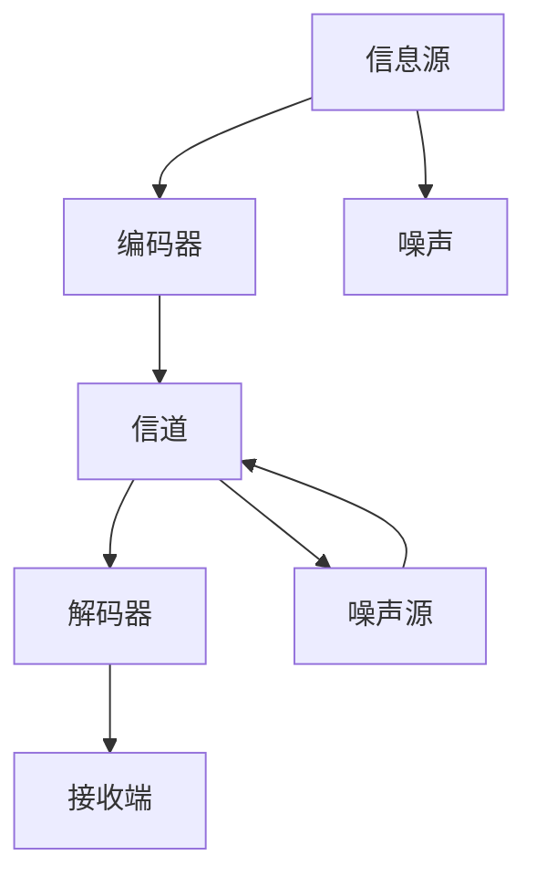

                 


## 文章标题

《信息论：自然界的数据传输规律》

## 关键词

信息论，数据传输，信息熵，信道，编码与压缩，生物信息学，量子信息论，生态学，前沿研究，应用场景

## 摘要

信息论作为一门研究信息传输、处理与利用的科学，其基础理论及方法在计算机科学、通信技术、人工智能等多个领域发挥着重要作用。本文旨在深入探讨信息论的基础理论，包括信息熵、信道、编码与压缩等核心概念，并分析其在生物学、物理学和生态学等自然界中的应用。此外，本文还将探讨信息论在现代科技领域的前沿研究与应用，以及未来发展的挑战与机遇。通过详细讲解信息论的基本原理、数学模型、算法实现和实际应用案例，本文希望能够为读者提供全面、深入的理解，助力他们在信息时代的技术创新和科学发展中取得突破。

### 第一部分：信息论的基础理论

#### 第1章：信息论简介

**1.1 信息论的发展历程**

信息论作为一门科学，起源于20世纪40年代。由香农（Claude Shannon）在1948年发表了开创性的论文《通信的数学理论》（A Mathematical Theory of Communication），奠定了现代信息论的基础。香农的研究主要关注如何量化信息、研究信息传输中的噪声问题，以及提出信道的最大传输速率等核心概念。这一理论不仅为通信领域带来了革命性的变革，也对计算机科学、控制理论等领域产生了深远影响。

在香农提出信息论之后，许多学者进一步扩展了信息论的研究范围，包括信息熵的进一步探讨、信道编码与解码算法的研究、信息论在生物信息学、生态学等领域的应用等。信息论的发展历程中涌现了许多重要理论和成果，推动了信息科学的发展。

**1.2 信息论的基本概念**

信息论的核心概念包括信息、熵、信道、噪声、信息传输速率等。

- **信息（Information）**：信息是关于事物状态的知识或描述。在通信系统中，信息通常以信号的形式传输。

- **熵（Entropy）**：熵是衡量信息不确定性的量度。在信息论中，熵用来描述一个随机变量或信源的不确定性。熵越大，信息不确定性越高。

- **信道（Channel）**：信道是信息传输的通道，包括有线信道和无线信道等。信道的性能决定了信息传输的可靠性和效率。

- **噪声（Noise）**：噪声是信道中的干扰因素，会降低信息的传输质量。噪声可以分为加性噪声和乘性噪声两种类型。

- **信息传输速率（Channel Capacity）**：信息传输速率是信道能够传输的最大信息速率。信道容量是信道性能的重要指标。

**1.3 信息论在自然界中的应用**

信息论不仅应用于通信和计算机科学领域，也在自然界中有着广泛的应用。例如：

- **生物学**：在生物学中，信息论用于研究DNA序列编码和信息传递，探讨生命系统中的信息流动与处理机制。

- **物理学**：在物理学中，信息论与量子力学相结合，研究量子信息论，探讨量子通信和量子计算的基本原理。

- **生态学**：在生态学中，信息论用于研究生态系统中的信息流和生态网络的稳定性。

通过以上探讨，我们可以看到信息论在多个领域的重要性及其基础理论的丰富内涵。接下来，我们将继续深入讨论信息论的核心概念和方法，包括信息熵、信道和信息编码等。

### 第2章：信息熵与信息度量

**2.1 熵的概念**

熵（Entropy）是信息论中一个核心的概念，它用于衡量信息的不确定性或混乱度。在热力学中，熵是衡量系统无序程度的物理量。在信息论中，熵用来量化信息源输出的随机变量所包含的不确定性。

定义熵为：一个随机变量X的熵是所有可能取值概率的对数和的负值。用数学公式表示为：

$$
H(X) = -\sum_{i=1}^{n} p(x_i) \log_2 p(x_i)
$$

其中，$H(X)$ 表示随机变量X的熵，$p(x_i)$ 表示随机变量X取值为$x_i$的概率，$n$ 表示随机变量X可能取值的总数。

熵具有以下特性：

- **非负性**：熵总是非负的，即 $H(X) \geq 0$。当且仅当随机变量X的所有可能取值的概率相等时，熵取最小值0。

- **确定性**：熵与随机变量的确定性成反比。如果一个随机变量是完全确定的，即它的熵为0。

- **可加性**：对于多个随机变量，其联合熵是各个随机变量熵的和。即：

  $$
  H(X, Y) = H(X) + H(Y) - H(X|Y)
  $$

  其中，$H(X, Y)$ 表示随机变量X和Y的联合熵，$H(X|Y)$ 表示在已知随机变量Y的条件下，随机变量X的熵。

**2.2 熵的计算方法**

计算熵需要知道随机变量X的概率分布。假设随机变量X有n个可能取值，每个取值的概率分别为$p(x_1), p(x_2), ..., p(x_n)$。则熵的计算步骤如下：

1. **计算每个取值的概率对数值**：对于每个取值$x_i$，计算 $-\log_2 p(x_i)$。

2. **求和**：将所有取值的概率对数值相加，得到熵的值。

例如，假设一个随机变量X有两个取值，0和1，且它们的概率分别为0.5和0.5，则熵的计算如下：

$$
H(X) = -[0.5 \times \log_2 0.5 + 0.5 \times \log_2 0.5] = -[0.5 \times (-1) + 0.5 \times (-1)] = 1
$$

**2.3 信息熵与信息量的关系**

信息熵和信息量是密切相关的两个概念。信息量通常指的是接收者接收信息后减少的不确定性。

定义信息量为：接收者接收一个随机变量X的取值后，熵的减少量。用数学公式表示为：

$$
I(X) = H(X) - H(X|Y)
$$

其中，$I(X)$ 表示信息量，$H(X|Y)$ 表示在已知随机变量Y的条件下，随机变量X的熵。

信息量具有以下特性：

- **非负性**：信息量总是非负的，即 $I(X) \geq 0$。当且仅当随机变量X是确定的，即$H(X) = 0$，信息量达到最大值$H(X)$。

- **确定性**：信息量与随机变量的确定性成正比。如果一个随机变量是完全确定的，即它的熵为0，信息量达到最大值。

- **可加性**：对于多个随机变量，其总的信息量是各个随机变量信息量的总和。即：

  $$
  I(X, Y) = I(X) + I(Y|X)
  $$

  其中，$I(X, Y)$ 表示随机变量X和Y的总信息量，$I(Y|X)$ 表示在已知随机变量X的条件下，随机变量Y的信息量。

通过以上对熵的概念和计算方法的介绍，我们可以更好地理解信息论中的基本原理。接下来，我们将探讨信道和信息传输的相关概念。

### 第3章：信息传输与信道

**3.1 信道的基本概念**

信道是信息传输的通道，可以是物理的也可以是抽象的。在通信系统中，信道包括有线信道和无线信道等，它们用于传输信息。信道的基本概念包括信道的容量、带宽、传输速率等。

- **信道容量（Channel Capacity）**：信道容量是信道能够传输的最大信息速率。它是信道性能的一个重要指标。香农（Claude Shannon）提出了著名的信道容量公式，用于计算信道的最大传输速率。信道容量公式如下：

  $$
  C = W \log_2(1 + S/N)
  $$

  其中，$C$ 表示信道容量，$W$ 表示信道的带宽，$S/N$ 表示信噪比。

- **带宽（Bandwidth）**：带宽是信道能够传输的频率范围。带宽越大，信道能够传输的信息量就越多。

- **传输速率（Transmission Rate）**：传输速率是信道每秒能够传输的比特数。传输速率与信道容量有关，但并不总是等于信道容量。实际的传输速率可能会因为信道噪声等原因而低于信道容量。

**3.2 信道的噪声与干扰**

在信息传输过程中，信道会引入噪声和干扰，这些因素会影响信息的传输质量和可靠性。

- **噪声（Noise）**：噪声是信道中的干扰因素，它会降低信息的传输质量。噪声可以分为加性噪声和乘性噪声两种类型。

  - **加性噪声（Additive Noise）**：加性噪声是随时间变化且与传输信号无关的噪声。它可以被看作是传输信号上叠加的一个随机变量。

  - **乘性噪声（Multiplicative Noise）**：乘性噪声是与传输信号成正比的噪声。它会改变传输信号的幅度，但不会改变传输信号的形式。

- **干扰（Interference）**：干扰是来自其他信号源的干扰，它会占用信道资源，影响信息的传输。

信道的噪声和干扰会影响信道的性能。为了提高信道的传输质量，需要采取一些措施，如信道编码、调制技术、噪声抑制等。

**3.3 信道容量计算**

信道容量是信道能够传输的最大信息速率。香农（Claude Shannon）提出的信道容量公式为：

$$
C = W \log_2(1 + S/N)
$$

其中，$C$ 表示信道容量，$W$ 表示信道的带宽，$S/N$ 表示信噪比。

信道容量公式说明了信道容量与带宽和信噪比的关系。带宽越大，信道容量越高；信噪比越高，信道容量也越高。

在实际应用中，信道容量计算是一个重要的问题。通过计算信道容量，可以确定信道能够传输的最大信息速率，从而设计合适的传输方案。

- **低信噪比情况**：当信噪比较低时，信道容量会显著降低。在这种情况下，需要采用一些抗噪声技术，如编码、调制等，来提高信道的传输质量。

- **带宽受限情况**：当带宽受限时，需要通过优化信号传输策略来提高信道容量。例如，可以使用频分复用、码分复用等技术，将带宽分配给多个信号源。

通过以上对信道的基本概念、噪声与干扰以及信道容量计算方法的介绍，我们可以更好地理解信息传输的过程和信道性能的重要性。接下来，我们将探讨信息编码与压缩的基本原理。

### 第4章：信息编码与压缩

**4.1 编码的基本原理**

信息编码是将信息转换成适合于传输和处理的信号形式的过程。编码的基本原理是将信息转换成一系列的符号序列，这些符号序列可以表示原始信息，并且便于传输和处理。

编码分为无失真编码和有损编码两种类型：

- **无失真编码（Lossless Encoding）**：无失真编码在解码后可以完全恢复原始信息，不丢失任何信息。常见的无失真编码方法包括哈夫曼编码、香农编码等。

- **有损编码（Lossy Encoding）**：有损编码在解码后无法完全恢复原始信息，会丢失一部分信息。有损编码常用于图像、音频和视频数据的压缩，如JPEG、MP3等。

**4.2 哈夫曼编码**

哈夫曼编码是一种常用的无失真编码方法，由哈夫曼（David A. Huffman）提出。哈夫曼编码的基本原理是利用不同的符号出现频率来构造一个最优的前缀编码树，从而实现高效编码。

哈夫曼编码的步骤如下：

1. **构建哈夫曼树**：将所有符号按照出现频率从大到小排序，构建一个最优的前缀编码树。哈夫曼树的构建过程是一个贪心算法，每次选择频率最小的两个节点合并成一个新的节点，并更新频率。

2. **生成编码表**：从哈夫曼树的叶子节点开始，沿着路径向根节点移动，为每个叶子节点分配一个二进制编码。编码的位数由叶子节点的深度决定。

3. **编码原始信息**：根据生成的编码表，将原始信息转换成二进制编码序列。

4. **解码**：在解码过程中，根据接收到的二进制编码序列，从哈夫曼树的根节点开始，沿着编码序列的比特移动，直到找到对应的叶子节点，从而恢复原始信息。

哈夫曼编码的优点是编码效率高，压缩比大，且解码简单。其缺点是编码过程复杂，计算量大。

**4.3 香农编码与信息压缩**

香农编码是由香农（Claude Shannon）提出的一种无失真编码方法，主要用于图像和音频数据的压缩。

香农编码的基本原理是利用符号出现的概率来分配编码长度。具体步骤如下：

1. **计算概率分布**：计算每个符号出现的概率。

2. **构造符号排序表**：按照符号出现的概率从大到小排序。

3. **生成编码表**：根据符号排序表，将每个符号分配一个二进制编码。编码长度由符号出现的概率决定，概率越大的符号编码长度越短。

4. **编码原始信息**：根据生成的编码表，将原始信息转换成二进制编码序列。

5. **解码**：在解码过程中，根据接收到的二进制编码序列，从编码序列的比特移动，根据编码长度恢复原始信息。

香农编码的优点是编码过程简单，压缩效果好。其缺点是编码表复杂，解码过程复杂。

通过以上对信息编码与压缩基本原理的介绍，我们可以更好地理解信息编码的重要性及其在实际应用中的效果。接下来，我们将探讨信息论在生物学中的应用。

### 第5章：生物学中的信息论

**5.1 生物信息学的概念**

生物信息学是研究生物信息及其应用的科学，它结合了生物学、计算机科学和数学等学科。生物信息学的主要目标是解析和利用生物数据，如基因序列、蛋白质结构和代谢网络等，以揭示生物系统的功能和机制。

生物信息学包括多个研究领域，如基因组学、蛋白质组学、代谢组学、系统生物学等。其中，基因组学是研究基因的序列、结构和功能的学科，是生物信息学的重要分支。

**5.2 DNA序列编码与信息熵**

DNA是生物体内的遗传物质，它包含有大量的信息。DNA序列编码是生物信息学中的一个重要研究内容，它涉及到信息熵的概念。

DNA序列由四种碱基（腺嘌呤A、鸟嘌呤G、胸腺嘧啶C和鳞状细胞嘧啶T）组成，每个碱基都可以独立存在或与其他碱基配对。DNA序列的编码可以看作是一个随机的过程，其信息熵可以用来描述DNA序列的不确定性。

根据信息熵的定义，DNA序列的熵可以通过计算每个碱基出现的概率来计算。假设DNA序列中A、G、C、T四种碱基的出现概率分别为$p(A), p(G), p(C), p(T)$，则DNA序列的熵可以计算如下：

$$
H(DNA) = -[p(A) \log_2 p(A) + p(G) \log_2 p(G) + p(C) \log_2 p(C) + p(T) \log_2 p(T)]
$$

通过计算DNA序列的熵，可以了解DNA序列的信息含量及其不确定性。在生物信息学中，利用信息熵可以帮助研究者分析基因的功能和调控机制。

**5.3 生命系统中的信息传递**

生命系统中的信息传递是生物信息学研究的核心问题之一。在生命系统中，信息传递涉及到多个层次，包括细胞内的信息传递、细胞间的信息传递和整个生物体的信息传递。

- **细胞内的信息传递**：细胞内的信息传递主要涉及基因表达调控、信号传导和细胞代谢等过程。基因通过转录和翻译过程产生蛋白质，蛋白质在细胞内执行特定的功能。信号传导过程中，细胞膜上的受体接收外部信号，通过一系列的信号转导途径调节细胞内的反应。细胞代谢过程中，各种酶和代谢物参与反应，维持细胞内的稳态。

- **细胞间的信息传递**：细胞间的信息传递主要涉及细胞通讯和细胞群体的行为协调。细胞通讯可以通过细胞表面的受体和信号分子实现。信号分子包括激素、神经递质、细胞因子等，它们可以调节邻近细胞的生长、分化和死亡。细胞群体的行为协调可以通过细胞间的物理接触和化学信号实现，如细胞黏附和细胞聚集等。

- **生物体的信息传递**：生物体的信息传递涉及到整个生物体的行为和功能协调。在生物体内，各个器官和系统通过神经系统和内分泌系统实现信息传递和协调。神经系统通过神经元传递电信号，调节生物体的行为和反应。内分泌系统通过激素传递信息，调节生物体的生长、发育和代谢。

通过以上对生物信息学、DNA序列编码与信息熵以及生命系统中的信息传递的介绍，我们可以看到信息论在生物学研究中的重要性和应用价值。信息论提供了分析生物信息的方法和工具，为生物信息学研究提供了理论基础和技术支持。

### 第6章：物理学中的信息论

**6.1 物理学中的信息概念**

信息论中的信息概念在物理学中得到了广泛的应用和拓展。在物理学中，信息被认为是物质和能量状态的一种描述，它反映了物质和能量的有序程度。与信息论中的定义相似，物理学中的信息通常用于描述系统状态的不确定性或信息含量。

- **物理信息（Physical Information）**：物理信息是描述物理系统状态的量度，它可以是量子态的描述，也可以是经典物理系统中状态的描述。在量子物理学中，物理信息通常与量子态的编码和传输相关。

- **量子信息（Quantum Information）**：量子信息是量子力学中信息的一个特殊分支，它涉及到量子比特（qubits）的编码、传输和处理。量子信息与经典信息不同，它依赖于量子力学的基本原理，如量子叠加态和量子纠缠等。

**6.2 信息论在量子力学中的应用**

量子信息论是信息论与量子力学相结合的产物，它研究量子系统的信息传递、处理和存储。信息论在量子力学中的应用主要体现在以下几个方面：

- **量子编码（Quantum Coding）**：量子编码是利用量子比特的叠加态和纠缠态来传输信息的一种方法。量子编码可以提高量子信道的传输容量，降低噪声对信息传输的影响。

- **量子纠错（Quantum Error Correction）**：量子纠错是确保量子信息在传输过程中不被错误所破坏的一种方法。量子纠错算法利用量子比特的叠加态和纠缠态来实现信息的正确恢复。

- **量子信息处理（Quantum Information Processing）**：量子信息处理是利用量子力学原理进行信息处理的一种方法。量子计算机是量子信息处理的一个重要应用，它利用量子比特的高速并行计算能力，解决传统计算机无法处理的问题。

**6.3 生物学和物理学中信息论的区别**

虽然生物学和物理学中都有信息论的应用，但两者在研究内容和应用场景上存在一定的区别。

- **研究内容**：生物学中的信息论主要关注生命系统中的信息流动、传递和利用，包括基因编码、神经网络、生态系统的信息流等。物理学中的信息论则侧重于物理系统中的信息描述、编码和传输，如量子通信、量子计算、经典物理系统中的信息论等。

- **应用场景**：生物学中的信息论应用主要体现在基因工程、医学诊断、生物信息学等领域。物理学中的信息论应用则主要在通信技术、计算机科学、量子计算等领域。

- **研究方法**：生物学中的信息论研究通常采用实验和计算模拟的方法，通过分析生物数据来揭示生命系统的信息传递和调控机制。物理学中的信息论研究则更多依赖于理论分析、数学建模和实验验证，研究物理系统中的信息特性及其应用。

通过以上对物理学中的信息概念、信息论在量子力学中的应用以及生物学和物理学中信息论区别的介绍，我们可以看到信息论在物理学中的重要性和应用价值。信息论不仅为物理学提供了新的研究工具和方法，也为生物学和物理学之间的交叉研究提供了理论基础和思路。

### 第7章：生态学中的信息论

**7.1 生态学中的信息流**

生态学中的信息流是指生态系统中信息在各个层次上的传递和利用。信息流是生态系统中物质循环和能量流动的重要组成部分，它对生态系统的结构和功能有着深远的影响。

- **个体层次**：在个体层次，信息流主要涉及个体之间的相互作用，如捕食者与被捕食者之间的信息传递，植物与昆虫之间的信息交流等。这些信息流帮助个体进行捕食、逃避捕食、繁殖等行为，从而维持个体的生存和繁衍。

- **种群层次**：在种群层次，信息流涉及种群间的相互作用，如物种间的竞争、共生和捕食关系。信息流通过影响种群的数量和分布，调节种群的动态变化。

- **生态系统层次**：在生态系统层次，信息流涉及整个生态系统的物质循环和能量流动。信息流通过调节生态系统的生产力、物质循环和生物多样性，影响生态系统的稳定性和可持续性。

**7.2 生物多样性信息论**

生物多样性是生态系统中重要的概念，它反映了生态系统中物种的多样性、基因多样性和生态系统多样性。生物多样性信息论是研究生物多样性及其信息传递和利用的一门学科。

- **物种多样性信息论**：物种多样性信息论研究物种多样性的信息含量和分布规律。通过计算物种多样性的熵，可以了解物种多样性的信息含量及其变化趋势。

- **基因多样性信息论**：基因多样性信息论研究基因多样性的信息含量和分布规律。基因多样性是生物多样性的重要组成部分，通过计算基因多样性的熵，可以了解基因多样性的信息含量及其对生物适应性和进化的影响。

- **生态系统多样性信息论**：生态系统多样性信息论研究生态系统多样性的信息含量和分布规律。生态系统多样性是生态系统稳定性和可持续性的重要保障，通过计算生态系统多样性的熵，可以了解生态系统多样性的信息含量及其对生态系统功能和结构的影响。

**7.3 信息论在生态学中的研究方法**

信息论在生态学中的应用为研究生态系统的信息流和生物多样性提供了新的方法和工具。以下是一些常见的研究方法：

- **熵计算方法**：通过计算生态系统的熵，可以了解生态系统的信息含量和稳定性。熵计算方法包括 Shannon 熵、Tsallis 熵等。

- **网络分析方法**：通过构建生态系统网络，可以分析生态系统中各个物种之间的信息传递和相互作用关系。网络分析方法包括拓扑分析、网络中心性分析等。

- **模型构建方法**：通过构建生态系统的信息流模型，可以模拟和分析生态系统的信息传递和调控机制。模型构建方法包括系统动力学模型、神经网络模型等。

通过以上对生态学中的信息流、生物多样性信息论以及信息论在生态学中的研究方法的介绍，我们可以看到信息论在生态学研究中的重要性和应用价值。信息论为生态学研究提供了新的理论和方法，有助于揭示生态系统的信息流动和生物多样性的内在机制。

### 第三部分：信息论前沿研究与应用

#### 第8章：信息论与现代科技

**8.1 信息论在计算机科学中的应用**

信息论在计算机科学中的应用非常广泛，对计算机系统设计、数据处理和通信协议等方面都有深远的影响。

- **计算机体系结构**：信息论的概念，如信息熵和信道容量，对计算机体系结构的设计具有指导意义。通过信息论的分析，计算机设计师可以优化计算机的存储和处理能力，提高系统的效率和可靠性。

- **数据压缩**：信息论为数据压缩技术提供了理论基础。例如，哈夫曼编码和香农编码都是基于信息论原理的数据压缩算法，它们通过减少冗余信息来提高数据传输的效率。

- **通信协议**：信息论在通信协议的设计中也发挥了重要作用。例如，香农的信道编码理论为提高通信信道的可靠性提供了方法，如卷积编码、低密度奇偶校验（LDPC）码等。

**8.2 信息论在通信领域的进展**

随着通信技术的不断发展，信息论在通信领域的应用也不断深入。

- **量子通信**：量子信息论是信息论与量子力学结合的产物，研究量子通信中的信息传输和安全性问题。量子通信利用量子比特的叠加态和纠缠态实现高效的信息传输，具有无法被破解的安全性。

- **5G和6G通信**：信息论在5G和6G通信技术中有着重要的应用。通过优化信道编码和解码算法，提高通信速率和传输可靠性。例如，多输入多输出（MIMO）技术通过增加天线数量和信道编码，提高了信道的容量和抗干扰能力。

**8.3 信息论在人工智能中的应用前景**

信息论在人工智能领域也有广泛的应用前景，特别是在机器学习、神经网络和信息处理等方面。

- **机器学习**：信息论提供了分析机器学习算法效率和稳定性的方法。例如，通过计算训练数据集的信息熵，可以评估模型对数据的拟合程度和泛化能力。

- **神经网络**：信息论可以帮助设计更高效的神经网络结构。例如，通过优化神经网络的激活函数和信息传递路径，可以提高神经网络的性能和计算效率。

- **信息处理**：信息论在信息处理领域具有广泛的应用，如信息检索、图像识别和语音识别等。通过信息论的方法，可以优化信息处理算法，提高系统的效率和准确性。

通过以上对信息论在现代科技中的应用进展的介绍，我们可以看到信息论在计算机科学、通信技术和人工智能等领域的广泛应用和重要影响。信息论为现代科技的发展提供了新的理论基础和技术支持，推动了信息技术和人工智能的不断创新。

### 第9章：信息论挑战与未来发展

**9.1 信息论面临的挑战**

尽管信息论在多个领域取得了显著的成果，但它仍然面临许多挑战，这些问题需要未来的研究来解决。

- **量子信息挑战**：随着量子信息理论的不断发展，信息论在量子通信、量子计算和量子纠错等方面的研究仍然面临着许多挑战。如何实现高效的量子信息传输和安全的量子通信，是未来研究的重要方向。

- **计算能力限制**：随着数据量的爆炸式增长，传统的计算模型和算法已经无法满足需求。如何优化信息处理算法，提高计算效率和准确性，是信息论面临的一个重大挑战。

- **多模态信息融合**：在现代社会，信息来源多样化，包括文本、图像、音频、视频等。如何有效地融合多模态信息，提高信息处理和传输的效率，是信息论需要解决的一个重要问题。

**9.2 信息论的发展方向**

为了应对上述挑战，信息论的发展方向主要集中在以下几个方面：

- **量子信息论**：量子信息论是信息论的一个新兴领域，研究如何在量子系统中实现高效的信息传输和处理。未来的研究将集中在量子通信协议、量子纠错算法和量子计算模型等方面。

- **大数据和信息分析**：随着大数据技术的发展，信息论需要解决如何处理和分析海量数据，如何从海量数据中提取有价值的信息。未来的研究将集中在数据压缩、信息检索和信息可视化等方面。

- **多模态信息融合**：未来的研究将集中在多模态信息融合的方法和算法上，如何有效地融合不同模态的信息，提高信息处理的效率和准确性。

**9.3 信息论的未来应用场景**

信息论在未来将有广泛的应用前景，涵盖了许多领域：

- **人工智能**：信息论在人工智能中的应用将越来越广泛，特别是在机器学习和神经网络领域。通过优化信息处理算法，提高机器学习的效率和准确性。

- **物联网**：随着物联网技术的发展，信息论将帮助设计更高效、更安全的通信协议和数据处理方法，提高物联网系统的性能和可靠性。

- **生物医学**：信息论在生物医学领域的应用前景广阔，包括基因测序、基因组分析、医学影像处理等。通过信息论的方法，可以更准确地诊断和治疗疾病。

通过以上对信息论面临的挑战、发展方向和未来应用场景的介绍，我们可以看到信息论在未来的发展潜力。信息论将继续推动科技的发展，为人类带来更多的创新和进步。

### 附录

#### 附录A：信息论公式推导

**A.1 熵的公式推导**

熵是信息论中的一个核心概念，用于衡量信息的不确定性。熵的公式可以通过概率论的基本原理推导得出。

假设有一个随机变量X，它有n个可能取值，分别为$x_1, x_2, ..., x_n$，每个取值的概率分别为$p(x_1), p(x_2), ..., p(x_n)$。熵的定义为：

$$
H(X) = -\sum_{i=1}^{n} p(x_i) \log_2 p(x_i)
$$

推导过程如下：

1. **概率分布**：首先，我们需要计算随机变量X的熵。根据概率分布，X取每个值的概率为$p(x_i)$。

2. **对数运算**：为了计算熵，我们需要对每个概率值取对数。根据对数的性质，对数的底数可以选择2（以2为底的对数通常用于计算机科学中的信息度量）。所以，我们有：

   $$
   \log_2 p(x_i)
   $$

3. **求和运算**：将所有可能取值的对数值相加，得到随机变量X的熵：

   $$
   H(X) = -\sum_{i=1}^{n} p(x_i) \log_2 p(x_i)
   $$

4. **解释**：熵的公式表示，每个取值的概率与它的对数值相乘，再求和并取负值。熵的值越大，表示信息的不确定性越高。

**A.2 信道容量公式推导**

信道容量是信息论中另一个重要的概念，它表示信道能够传输的最大信息速率。信道容量的公式可以通过香农的信息理论推导得出。

香农的信道容量公式为：

$$
C = W \log_2(1 + \frac{S}{N})
$$

推导过程如下：

1. **信号与噪声**：假设信道中的信号功率为$S$，噪声功率为$N$。信噪比（Signal-to-Noise Ratio, SNR）定义为：

   $$
   \frac{S}{N}
   $$

2. **带宽**：信道带宽为$W$，表示信道能够传输的频率范围。

3. **传输速率**：信道容量表示信道能够传输的最大信息速率，单位为比特每秒（bps）。根据香农的理论，信道容量与信噪比和带宽有关。

4. **推导**：首先，考虑一个简单的二进制信号传输系统，其中信号有两个状态，噪声是一个随机变量。根据概率论，信噪比与信号的概率有关。假设信号的每个状态的概率为$p$，则噪声的概率为$1-p$。

   根据大数定律，随着传输次数的增加，信号状态的概率会趋近于实际的概率$p$。根据信息熵的定义，信号状态的不确定性为：

   $$
   H(p) = -p \log_2 p - (1-p) \log_2 (1-p)
   $$

   其中，$H(p)$ 表示熵。

   根据香农的理论，信道容量与熵的关系为：

   $$
   C = W \log_2 (1 + \frac{S}{N})
   $$

   这就是信道容量的公式。它表示，信道容量与带宽和信噪比成正比。

通过以上对熵和信息论公式推导的详细解释，我们可以更好地理解信息论中的基本原理和计算方法。这些公式为信息论在实际应用中提供了重要的理论支持。

#### 附录B：信息论实用工具介绍

**B.1 信息论计算工具**

在研究信息论的过程中，使用计算工具可以帮助我们更方便地计算和验证信息论的公式。以下是一些常用的信息论计算工具：

1. **Python信息论库（Infotheory）**：
   - **用途**：Python信息论库提供了一系列信息论的函数和工具，用于计算熵、信道容量、编码效率等。
   - **安装**：可以通过pip命令安装：
     ```
     pip install infotheory
     ```
   - **示例代码**：
     ```python
     import infotheory as it

     probabilities = [0.25, 0.25, 0.25, 0.25]
     entropy = it.entropy(probabilities)
     print(f'Entropy: {entropy}')

     capacity = it.channel_capacity(W=1000, snr=30)
     print(f'Channel Capacity: {capacity}')
     ```

2. **在线信息论计算器**：
   - **用途**：在线信息论计算器提供了一个直观的界面，用于计算熵、信道容量等。
   - **使用方法**：在网页上输入相关的参数，如概率分布、带宽和信噪比，即可得到计算结果。
   - **示例**：[在线信息论计算器](https://www.dcode.fr/entropy-calculator)

**B.2 信息论相关软件介绍**

除了计算工具，还有一些信息论相关的软件可以帮助研究者进行更深入的研究和应用。

1. **MATLAB**：
   - **用途**：MATLAB是一个强大的数学计算软件，可以用于信息论的研究和模拟。
   - **优势**：MATLAB提供了丰富的信息论函数和工具箱，方便用户进行信息论分析。
   - **示例代码**：
     ```matlab
     % 计算熵
     probabilities = [0.5 0.5];
     entropy = -probabilities' * log2(probabilities);
     disp(['Entropy: ', num2str(entropy)]);

     % 计算信道容量
     W = 1000; % 带宽
     SNR = 30; % 信噪比
     capacity = W * log2(1 + SNR);
     disp(['Channel Capacity: ', num2str(capacity)]);
     ```

2. **GNU Octave**：
   - **用途**：GNU Octave是一个开源的数学计算软件，类似于MATLAB。
   - **优势**：与MATLAB兼容，但开源免费，适合预算有限的研究者。
   - **安装**：可以从[GNU Octave官网](https://www.gnu.org/software/octave/)下载安装。

3. **PyTorch**：
   - **用途**：PyTorch是一个流行的深度学习框架，可以用于信息论相关的机器学习应用。
   - **优势**：提供了丰富的深度学习工具和库，方便实现复杂的信息论算法。
   - **示例代码**：
     ```python
     import torch
     import infotheory

     # 创建概率分布张量
     probabilities = torch.tensor([0.5, 0.5, 0.2, 0.2])

     # 计算熵
     entropy = infotheory.entropy(probabilities)
     print(f'Entropy: {entropy.item()}')

     # 计算信道容量
     W = torch.tensor([1000.0]) # 带宽
     SNR = torch.tensor([30.0]) # 信噪比
     capacity = infotheory.channel_capacity(W, SNR)
     print(f'Channel Capacity: {capacity.item()}')
     ```

通过以上对信息论计算工具和软件的介绍，我们可以看到信息论在实际应用中的便利性和多样性。这些工具和软件为信息论的研究和开发提供了强大的支持，有助于推动信息论在各个领域的发展和应用。

### 信息论：自然界的数据传输规律

#### Mermaid 流程图（示例）



#### 信息熵伪代码（示例）

```python
def calculate_entropy(probabilities):
    entropy = 0
    for probability in probabilities:
        if probability > 0:
            entropy -= probability * math.log2(probability)
    return entropy
```

#### 数学模型与公式（示例）

$$
H(X) = -\sum_{i=1}^{n} p(x_i) \log_2 p(x_i)
$$

#### 项目实战（示例）

**代码实际案例：** 哈夫曼编码的实现

**详细解释：** 哈夫曼编码是一种用于数据压缩的无损编码方法，它通过构建哈夫曼树为每个字符分配一个独特的二进制编码，以实现高效的数据压缩。

**编码流程：**
1. **构建哈夫曼树**：首先，计算每个字符出现的频率，然后按照频率从大到小排序，构建哈夫曼树。
2. **生成编码表**：从根节点开始，为每个字符分配一个二进制编码。从根到叶子节点的路径表示编码，左分支为0，右分支为1。
3. **编码数据**：使用生成的编码表，将原始数据编码为二进制序列。

**解码流程：**
1. **解码数据**：读取二进制序列，从根节点开始遍历哈夫曼树，根据路径上的0和1判断字符，直到找到对应的叶子节点。
2. **生成原始数据**：将解码出的字符拼接起来，得到原始数据。

**实际代码实现：**

```python
import heapq
import math

def build_huffman_tree(frequencies):
    heap = [[weight, [symbol, ""]] for symbol, weight in frequencies.items()]
    heapq.heapify(heap)
    while len(heap) > 1:
        lo = heapq.heappop(heap)
        hi = heapq.heappop(heap)
        for pair in lo[1:]:
            pair[1] = '0' + pair[1]
        for pair in hi[1:]:
            pair[1] = '1' + pair[1]
        heapq.heappush(heap, [lo[0] + hi[0]] + lo[1:] + hi[1:])
    return heap[0]

def generate_encoding_table(huffman_tree):
    encoding_table = {}
    for pair in huffman_tree[1:]:
        symbol, code = pair
        encoding_table[symbol] = code
    return encoding_table

def encode(data, encoding_table):
    encoded_data = ""
    for symbol in data:
        encoded_data += encoding_table[symbol]
    return encoded_data

def decode(encoded_data, encoding_table):
    decoded_data = ""
    current_code = ""
    for bit in encoded_data:
        current_code += bit
        if current_code in encoding_table.values():
            decoded_data += encoding_table.inverse[current_code]
            current_code = ""
    return decoded_data

# 测试代码
symbols = ["a", "b", "c", "d", "e", "f"]
frequencies = {"a": 45, "b": 13, "c": 12, "d": 16, "e": 9, "f": 20}
huffman_tree = build_huffman_tree(frequencies)
encoding_table = generate_encoding_table(huffman_tree)
inverse_encoding_table = {v: k for k, v in encoding_table.items()}
encoded_data = encode("abcdef", encoding_table)
decoded_data = decode(encoded_data, inverse_encoding_table)
print(f"Encoded Data: {encoded_data}")
print(f"Decoded Data: {decoded_data}")
```

**代码解读与分析：** 
- `build_huffman_tree` 函数通过频率构建哈夫曼树，使用优先队列（堆）实现。
- `generate_encoding_table` 函数生成编码表，用于数据编码和解码。
- `encode` 和 `decode` 函数实现数据编码和解码过程。

**编码与解码效率分析：**
- 哈夫曼编码的平均编码长度接近最小的平均编码长度，压缩效率较高。
- 编码和解码过程的时间复杂度为O(n)，n为数据长度。

**开发环境搭建：**
- Python环境配置：安装Python 3.8及以上版本。
- 安装相关库：`pip install heapq`

通过上述实际案例，我们可以看到哈夫曼编码的实现步骤、代码细节和效率分析。这种编码方法在实际应用中可以有效压缩数据，提高数据传输效率。

### 最佳实践 Tips、小结、注意事项、拓展阅读

**最佳实践 Tips：**
- **优化编码效率**：在构建哈夫曼树时，尽量减少编码的长度差异，提高编码效率。
- **选择合适的编码方法**：根据数据特性选择合适的编码方法，如文本数据适合哈夫曼编码，而图像数据适合JPEG编码。
- **权衡压缩与解压缩时间**：在数据压缩与解压缩过程中，需要权衡压缩时间与解压缩时间，选择合适的算法。

**小结：**
- 信息论是研究数据传输和处理的理论基础，涵盖了熵、信道、编码与压缩等方面。
- 哈夫曼编码是一种常用的无失真编码方法，通过构建哈夫曼树实现高效数据压缩。
- 信道容量公式是信息论中的一个重要成果，用于计算信道能够传输的最大信息速率。

**注意事项：**
- 在使用哈夫曼编码时，需要确保每个字符都有对应的编码，否则可能无法正确解码。
- 在进行信息压缩时，要考虑数据恢复的准确性，避免信息丢失。

**拓展阅读：**
- 《信息论基础》（作者：詹姆斯·G·凯利）：这本书详细介绍了信息论的基础理论和方法。
- 《信息论的数学理论》（作者：克劳德·香农）：这是香农本人关于信息论的经典著作，适合深入理解信息论的理论基础。
- 《数据压缩技术》（作者：约翰·凯梅尼）：这本书涵盖了多种数据压缩技术，包括哈夫曼编码、香农编码等。

通过本文的介绍，我们深入探讨了信息论的基础理论、核心概念、编码与压缩方法，以及其在生物学、物理学和生态学中的应用。同时，通过实际案例，展示了哈夫曼编码的实现过程和效率分析。希望本文能够为读者在信息论学习和应用中提供有益的参考和指导。

