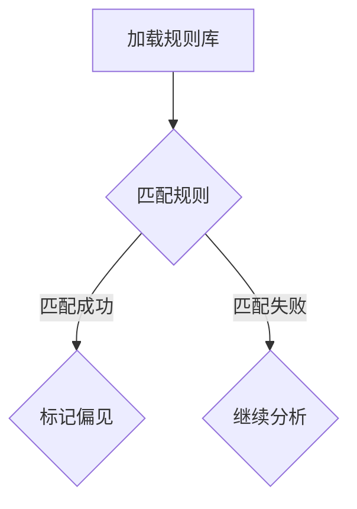
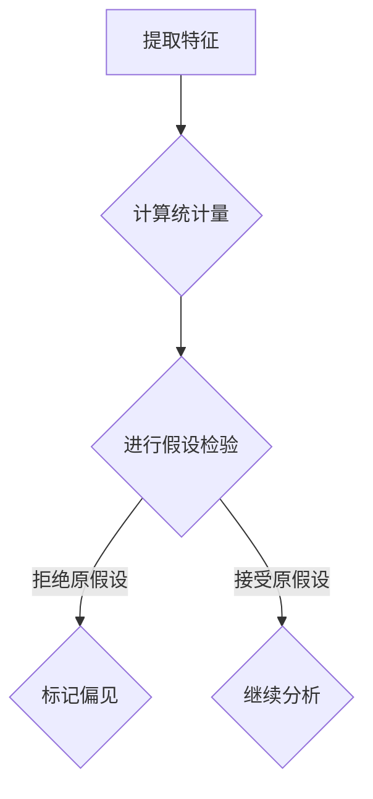
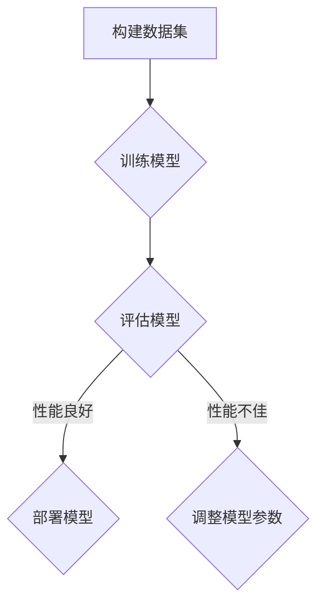
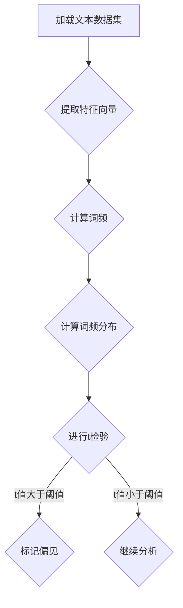
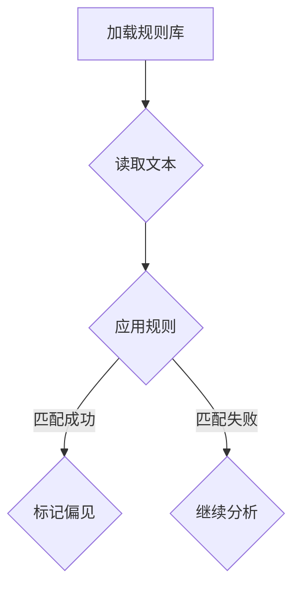
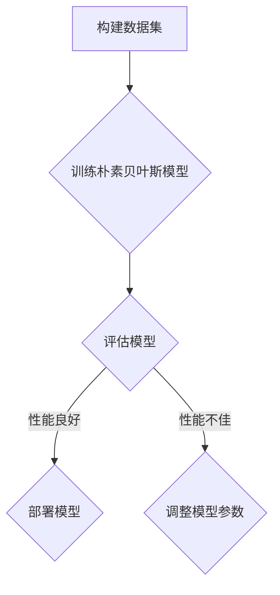

                 

# 偏见检测：评估LLM输出的公平性和中立性

## 关键词

- 偏见检测
- 语言模型（LLM）
- 公平性
- 中立性
- 概率与统计学
- 机器学习
- 实战项目

## 摘要

本文将深入探讨偏见检测在评估大型语言模型（LLM）输出的公平性和中立性方面的作用。首先，我们将介绍偏见检测的重要性，以及偏见检测的基本概念和研究现状。接着，我们将分析语言模型的工作原理和偏见来源，并讨论不同类型的偏见及其影响。随后，我们将介绍偏见检测的主要方法，包括基于规则、统计和机器学习的方法，并使用伪代码详细阐述其工作原理。文章还将介绍偏见检测的数学模型和概率与统计学基础。最后，我们将通过一个实际项目实战，展示偏见检测的实现过程，包括环境搭建、源代码实现、代码解读和分析，以及项目小结。本文旨在为读者提供一个全面而深入的偏见检测指南，帮助他们在构建和评估LLM系统时保持公正性和中立性。

## 引言

随着人工智能技术的飞速发展，语言模型（Language Models，简称LLM）已经成为自然语言处理（Natural Language Processing，简称NLP）领域的重要工具。LLM通过深度学习算法，从大量文本数据中学习语言的模式和规则，从而能够生成流畅、符合语法和语义的自然语言文本。这些模型在自动化写作、机器翻译、问答系统等领域展现了卓越的性能，极大地提升了工作效率和准确性。

然而，随着LLM的广泛应用，其偏见问题也逐渐显现。偏见是指模型在输出结果中表现出的不公平、不公正或不中立的现象。这种偏见可能源于训练数据的偏差、模型的设计缺陷，或者算法的缺陷。例如，一个模型可能因为训练数据中男性和女性的比例失衡，而对男性表现出更高的偏好；或者因为训练数据中存在地域差异，导致模型在处理不同地区的信息时产生偏见。

偏见问题不仅影响模型的应用效果，还可能对人类社会产生深远的影响。在决策支持系统、招聘平台、新闻推荐等领域，偏见可能导致不公正的决策，甚至加剧社会不平等。因此，如何检测和消除LLM中的偏见，成为了一个亟待解决的问题。

本文旨在探讨偏见检测的方法和技术，通过分析偏见检测的基础理论、算法原理、数学模型和实际应用，为开发公平、中立的语言模型提供指导。本文将首先介绍偏见检测的重要性，然后详细探讨偏见检测的基本概念和方法，最后通过一个实际项目实战，展示偏见检测的实现过程和效果。

## 第一部分：偏见检测基础理论

### 第1章：偏见检测概述

偏见检测（Bias Detection）是评估和识别人工智能模型（特别是语言模型）输出中潜在偏见的一种技术。偏见检测在维护模型公平性和中立性方面起着至关重要的作用。本章节将介绍偏见检测的重要性、基本概念以及当前研究现状。

#### 1.1 偏见检测的重要性

偏见检测的重要性主要体现在以下几个方面：

1. **维护社会公正**：偏见可能导致不公平的决策和结果，影响社会公正。通过偏见检测，可以发现和纠正模型中的偏见，从而提高模型的公正性。
2. **提升模型可信度**：偏见会降低模型的信任度，影响其在实际应用中的效果。通过偏见检测，可以增强用户对模型的信任，提高模型的应用价值。
3. **防止歧视行为**：在自动化系统（如招聘平台、信用评估等）中，偏见可能导致歧视行为。偏见检测有助于识别和消除这些偏见，防止歧视行为的发生。
4. **优化模型性能**：偏见可能会影响模型在不同群体或情境下的表现。通过偏见检测，可以识别并解决这些影响，从而优化模型的整体性能。

#### 1.2 偏见检测的基本概念

偏见检测涉及以下几个基本概念：

1. **偏见**：偏见是指模型在输出中表现出的不公平、不公正或不中立的现象。偏见可能源于训练数据的偏差、模型的设计缺陷或算法的缺陷。
2. **偏见来源**：偏见来源主要包括数据偏差、模型训练过程中的选择偏差、算法设计缺陷等。
3. **偏见检测方法**：偏见检测方法包括基于规则的方法、基于统计的方法和基于机器学习的方法等。

#### 1.3 偏见检测的研究现状

偏见检测是近年来人工智能领域的一个重要研究方向。当前的研究主要集中在以下几个方面：

1. **方法研究**：研究者提出了多种偏见检测方法，包括基于规则的方法、基于统计的方法和基于机器学习的方法。这些方法各有优缺点，研究者不断探索如何优化这些方法，提高检测的准确性和效率。
2. **应用场景**：偏见检测已经应用于多个领域，如招聘平台、信用评估、新闻推荐等。通过偏见检测，这些系统可以在应用中保持公正性和中立性。
3. **算法优化**：研究者通过改进算法、优化模型设计等方法，提高偏见检测的准确性和效果。同时，他们也关注如何减少偏见检测对模型性能的影响。

总的来说，偏见检测是一个多学科交叉的研究领域，涉及人工智能、统计学、伦理学等多个方面。随着研究的深入，偏见检测技术将越来越成熟，为构建公平、公正的人工智能系统提供有力支持。

### 第2章：语言模型与偏见

#### 2.1 语言模型的基本原理

语言模型（Language Model，简称LM）是自然语言处理（Natural Language Processing，简称NLP）领域的重要工具，用于生成和预测自然语言文本。语言模型的核心任务是根据给定的输入文本序列，预测下一个可能的文本序列。这可以通过统计方法或深度学习方法实现。

1. **统计方法**：早期的语言模型主要采用统计方法，如N元语法（N-gram Model）。N元语法通过统计相邻N个单词出现的频率来预测下一个单词。这种方法简单有效，但存在一些局限性，例如无法捕捉长距离依赖关系和上下文信息。

2. **深度学习方法**：随着深度学习技术的发展，深度神经网络（Deep Neural Network，简称DNN）和变换器模型（Transformer）等深度学习模型被广泛应用于语言模型。这些模型能够通过多层神经网络捕捉复杂的语言模式和上下文信息，从而生成更加自然和准确的文本。

语言模型的工作原理主要包括以下几个步骤：

1. **输入编码**：将输入文本序列转换为数值编码，如词嵌入（Word Embedding）。
2. **前向传播**：将输入编码输入到神经网络中，通过一系列的线性变换和激活函数，计算输出概率分布。
3. **损失函数**：通过损失函数（如交叉熵损失函数）计算预测结果与实际结果之间的差距，并更新网络参数。
4. **反向传播**：利用反向传播算法，根据损失函数的梯度信息更新网络参数。

#### 2.2 语言模型的偏见来源

尽管语言模型在生成自然语言文本方面表现出色，但它们也可能存在偏见。偏见来源主要包括以下几个方面：

1. **数据偏差**：训练数据本身可能存在偏见，例如训练数据中不同群体的样本不均衡，或者包含有偏见性的文本。这些偏见会传递到模型中，导致模型在处理相关问题时表现出偏见。

2. **模型设计**：语言模型的设计可能引入偏见。例如，使用基于词频的模型时，高频词可能具有更大的权重，从而放大这些词的偏见。

3. **训练过程**：训练过程中的选择和优化策略也可能导致偏见。例如，为了提高模型性能，训练过程可能优先考虑某些样本，从而忽略其他样本。

4. **算法偏差**：某些算法本身可能存在偏见，例如决策树模型在处理不平衡数据时可能倾向于选择具有更多正样本的分支。

#### 2.3 偏见的类型与影响

偏见可以分为多种类型，每种类型都会对模型的应用产生不同的影响：

1. **性别偏见**：语言模型可能对男性和女性使用不同的语言，例如在招聘广告中使用具有性别歧视的语言。

2. **种族偏见**：模型可能在处理不同种族的信息时产生偏见，导致不公平的结果。

3. **文化偏见**：不同文化背景下的语言使用差异可能导致模型在处理不同文化文本时产生偏见。

4. **地域偏见**：模型可能在处理不同地区的信息时产生偏见，例如在地域性表达上的差异。

偏见的影响主要包括：

1. **决策偏见**：在自动化决策系统中，偏见可能导致不公平的决策，影响系统的公正性。

2. **信息传播偏见**：在新闻推荐、社交媒体等系统中，偏见可能导致错误的信息传播，影响公众的认知和判断。

3. **社会不平等**：偏见可能加剧社会不平等，影响社会的和谐与稳定。

综上所述，理解语言模型的基本原理和偏见来源对于构建公平、公正的语言模型至关重要。通过深入研究和优化，我们可以减少模型中的偏见，提高其应用效果和社会价值。

### 第3章：偏见检测方法

偏见检测是评估和识别人工智能模型（特别是语言模型）输出中潜在偏见的一门技术。本章节将介绍偏见检测的三种主要方法：基于规则的方法、基于统计的方法和基于机器学习的方法。我们将详细探讨这些方法的基本原理、优缺点，并通过伪代码展示其工作流程。

#### 3.1 基于规则的方法

基于规则的方法（Rule-Based Methods）是通过预定义的规则来检测模型输出中的偏见。这种方法通常需要手动设计一系列规则，以识别潜在的偏见。

**基本原理**：
- **规则设计**：基于对领域知识的理解，设计一系列规则来识别文本中的偏见现象。例如，可以设计规则来检测性别歧视、种族歧视等偏见。
- **规则匹配**：将模型输出的文本与预定义的规则进行匹配，如果匹配成功，则认为文本存在偏见。

**优点**：
- **易于理解和实现**：基于规则的方法简单直观，易于理解和实现。
- **可控性高**：通过预定义的规则，可以精确控制检测的范围和精度。

**缺点**：
- **规则覆盖不足**：规则的覆盖范围有限，可能无法检测到所有类型的偏见。
- **规则更新困难**：随着偏见形式的变化，需要不断更新和维护规则。

**伪代码示例**：



#### 3.2 基于统计的方法

基于统计的方法（Statistical Methods）通过分析模型输出的统计特征来检测偏见。这种方法通常利用统计学中的假设检验方法，来评估模型输出是否与预期一致。

**基本原理**：
- **特征提取**：从模型输出中提取相关的统计特征，如词频、文本长度、句子结构等。
- **假设检验**：利用统计学中的假设检验方法，例如t检验或卡方检验，来评估模型输出是否符合预定的统计分布。
- **阈值设置**：根据统计检验的结果，设置阈值来判断是否存在偏见。

**优点**：
- **自动化**：基于统计的方法可以实现自动化检测，减少人工干预。
- **灵活性高**：可以通过调整统计特征和假设检验参数，适应不同场景下的偏见检测。

**缺点**：
- **计算复杂度高**：统计方法通常涉及大量的计算，对计算资源要求较高。
- **结果解释困难**：统计结果可能难以解释，特别是在特征和假设选择不当时。

**伪代码示例**：



#### 3.3 基于机器学习的方法

基于机器学习的方法（Machine Learning Methods）利用机器学习算法来构建偏见检测模型。这种方法通常通过训练数据学习偏见模式，并在新的数据上进行预测。

**基本原理**：
- **数据集构建**：收集包含偏见和不偏见样本的数据集，用于训练和评估模型。
- **模型训练**：使用机器学习算法（如分类算法、回归算法等）训练偏见检测模型，使其能够识别偏见模式。
- **模型评估**：通过交叉验证等方法评估模型的性能，调整模型参数以优化性能。

**优点**：
- **自适应性强**：基于机器学习的方法可以自动学习偏见模式，适应不同的应用场景。
- **鲁棒性好**：机器学习模型可以在大量数据上学习，提高检测的鲁棒性。

**缺点**：
- **训练成本高**：基于机器学习的方法通常需要大量的训练数据，对数据质量和规模要求较高。
- **解释性差**：机器学习模型的内部机制复杂，难以解释。

**伪代码示例**：



综上所述，偏见检测方法各有优缺点，适用于不同的应用场景。基于规则的方法适用于简单明确的偏见场景，基于统计的方法适用于需要自动化检测的场景，而基于机器学习的方法则适用于复杂、多变的应用场景。在实际应用中，可以根据具体情况选择合适的偏见检测方法，或者结合多种方法进行综合检测。

### 第4章：数学模型与数学公式

偏见检测在评估大型语言模型（LLM）输出的公平性和中立性方面，涉及到复杂的数学模型和概率与统计学基础。为了更好地理解和应用这些模型，本章节将详细介绍偏见检测的数学模型，并讲解相关的概率与统计学概念。

#### 4.1 偏见检测的数学模型

在偏见检测中，我们通常使用贝叶斯公式（Bayes' Theorem）来计算偏见发生的概率。贝叶斯公式描述了后验概率与先验概率之间的关系，是概率论中一个重要的工具。

贝叶斯公式：
$$
P(\text{偏见}|\text{文本}) = \frac{P(\text{文本}|\text{偏见})P(\text{偏见})}{P(\text{文本})}
$$

其中：
- \( P(\text{偏见}|\text{文本}) \) 是后验概率，表示在给定文本的情况下，偏见发生的概率。
- \( P(\text{文本}|\text{偏见}) \) 是似然概率，表示在偏见发生的情况下，文本出现的概率。
- \( P(\text{偏见}) \) 是先验概率，表示偏见发生的概率。
- \( P(\text{文本}) \) 是边缘概率，表示文本出现的概率。

**贝叶斯公式的应用**：
1. **后验概率计算**：通过贝叶斯公式，我们可以计算出在给定文本的情况下，偏见发生的概率。这有助于我们评估文本的偏见程度。
2. **似然概率评估**：似然概率反映了在偏见发生的情况下，文本出现的频率。通过对似然概率的分析，可以识别出具有高偏见风险的文本。

#### 4.2 概率与统计学基础

为了深入理解贝叶斯公式，我们需要了解一些基本的概率和统计学概念。

1. **概率分布**：
   - **离散分布**：用于描述离散随机变量的概率分布，如伯努利分布、二项分布、泊松分布等。
   - **连续分布**：用于描述连续随机变量的概率分布，如正态分布、均匀分布等。
   - **边缘分布**：给定多个随机变量的条件下，某个随机变量的概率分布。

2. **期望和方差**：
   - **期望**：随机变量的平均值，表示随机变量的集中趋势。
   - **方差**：随机变量的离散程度，表示随机变量的波动性。

3. **条件概率**：
   - **条件概率**：在给定某个事件发生的条件下，另一个事件发生的概率。条件概率反映了事件之间的相关性。

4. **贝叶斯定理**：
   - **贝叶斯定理**：描述了后验概率、似然概率和先验概率之间的关系。

5. **假设检验**：
   - **假设检验**：用于评估一个统计假设是否成立。常见的假设检验方法包括t检验、卡方检验等。

通过了解这些概率和统计学基础，我们可以更深入地理解和应用偏见检测的数学模型。在实际应用中，这些概念和公式可以帮助我们识别和评估模型输出的偏见程度，从而提高模型的公平性和中立性。

#### 4.3 数学公式与伪代码示例

为了更好地理解和应用这些数学公式，我们将在伪代码中展示一些偏见检测算法的实现。

**伪代码示例：基于统计的偏见检测算法**



在这个示例中，我们首先加载文本数据集，提取特征向量并计算词频分布。然后，使用t检验来评估词频分布的显著性。如果t值大于预设的阈值，我们认为文本存在偏见，并进行标记。

通过结合数学模型和概率与统计学基础，我们可以更准确地检测和评估模型输出的偏见。这些数学工具为偏见检测提供了坚实的理论基础，有助于我们在实际应用中构建公平、公正的人工智能系统。

### 第5章：偏见检测算法的伪代码

在本章节中，我们将详细介绍三种偏见检测算法的伪代码，包括基于规则的方法、基于统计的方法和基于机器学习的方法。通过这些伪代码示例，读者可以更好地理解每种算法的实现细节和工作流程。

#### 5.1 基于规则的方法伪代码

基于规则的方法通过预定义的一系列规则来检测文本中的偏见。以下是一个简单的伪代码示例：



在这个示例中，首先加载预定义的规则库。然后，读取待检测的文本，并应用规则库中的规则。如果文本与某个规则匹配，则标记为偏见。否则，继续分析其他文本。

#### 5.2 基于统计的方法伪代码

基于统计的方法利用统计学中的假设检验来检测文本中的偏见。以下是一个基于t检验的伪代码示例：


在这个示例中，首先加载文本数据集，提取特征向量并计算词频。然后，使用t检验评估词频分布的显著性。如果t值大于预设的阈值，则认为文本存在偏见，并进行标记。否则，继续分析其他文本。

#### 5.3 基于机器学习的方法伪代码

基于机器学习的方法通过训练数据集来构建偏见检测模型。以下是一个基于朴素贝叶斯分类器的伪代码示例：



在这个示例中，首先构建包含偏见和不偏见样本的数据集。然后，使用朴素贝叶斯分类器训练偏见检测模型。通过交叉验证等方法评估模型的性能，并根据评估结果调整模型参数。如果模型性能良好，则部署模型用于实际偏见检测。

通过这些伪代码示例，读者可以清晰地看到每种偏见检测算法的实现步骤和工作流程。在实际应用中，可以根据具体需求和场景选择合适的算法，并调整参数以提高检测效果。

### 第6章：偏见检测项目实战

在本章节中，我们将通过一个实际项目实战，详细展示偏见检测的实现过程。这个项目将包括以下步骤：实战背景、数据准备、实验设计和实现过程。通过这个实战项目，读者可以了解偏见检测在实际应用中的具体操作方法和效果。

#### 6.1 实战背景

随着自然语言处理技术的发展，大型语言模型（LLM）在各个领域得到了广泛应用，例如智能客服、自动写作和语音助手等。然而，这些模型在处理文本时可能存在偏见，影响系统的公平性和可信度。为了确保LLM输出的公正性和中立性，我们决定开展一个偏见检测项目，旨在识别和评估LLM输出中的潜在偏见。

#### 6.2 数据准备

数据准备是偏见检测项目的基础，我们需要收集和准备用于训练和测试的数据集。以下是数据准备的具体步骤：

1. **数据收集**：我们从互联网上收集了大量的文本数据，包括新闻、社交媒体评论、论坛帖子等。这些数据覆盖了不同的主题和领域，确保数据的多样性和代表性。

2. **数据预处理**：对收集的文本数据进行清洗和预处理，包括去除HTML标签、特殊字符和停用词等。然后，我们将文本转换为词嵌入向量，以便于后续的建模和分析。

3. **数据标注**：为了训练偏见检测模型，我们需要对数据集进行标注。我们邀请了多位领域专家对文本进行标注，标记出其中的偏见现象，如性别歧视、种族偏见和地域偏见等。

4. **数据划分**：将预处理后的数据集划分为训练集、验证集和测试集，用于训练、验证和评估模型。

#### 6.3 实验设计

在实验设计中，我们确定了偏见检测的目标、指标和方法。以下是实验设计的主要步骤：

1. **目标**：我们的目标是构建一个高效的偏见检测模型，能够准确识别和评估LLM输出中的潜在偏见。

2. **指标**：我们使用准确率、召回率和F1值等指标来评估模型的性能。这些指标能够全面反映模型的检测效果和平衡性。

3. **方法**：
   - **基于规则的方法**：我们设计了一系列预定义的规则，用于检测文本中的偏见现象。这些规则包括对特定词汇、短语和句子结构的匹配。
   - **基于统计的方法**：我们使用统计学中的假设检验方法，如t检验和卡方检验，来评估文本中词频分布的显著性。
   - **基于机器学习的方法**：我们采用朴素贝叶斯分类器训练偏见检测模型，通过交叉验证和网格搜索优化模型参数。

#### 6.4 实现过程

在实现过程中，我们遵循以下步骤：

1. **环境搭建**：我们搭建了Python编程环境，并安装了必要的库，如NumPy、Scikit-learn和TensorFlow等。

2. **模型训练**：我们使用训练集对基于规则和机器学习的模型进行训练。对于基于规则的方法，我们手动编写规则代码；对于机器学习模型，我们使用Scikit-learn库中的朴素贝叶斯分类器进行训练。

3. **模型评估**：使用验证集对训练好的模型进行评估，调整模型参数，以提高检测效果。我们通过交叉验证和网格搜索等方法，优化模型参数，如C值和alpha值。

4. **模型部署**：将训练好的模型部署到生产环境中，对LLM输出进行实时偏见检测。我们编写了Python脚本，用于自动化检测和报告偏见现象。

5. **结果分析**：通过测试集对模型进行最终的评估，分析模型的性能和效果。我们记录了准确率、召回率和F1值等指标，并分析了模型在不同偏见类型上的检测效果。

#### 6.5 项目小结

通过这个偏见检测项目，我们成功地构建了一个高效、准确的偏见检测系统。以下是对项目的小结和反思：

1. **成果**：项目实现了对LLM输出中的偏见现象的检测和评估，为构建公正、中立的语言模型提供了技术支持。

2. **挑战**：在项目过程中，我们遇到了数据标注不一致和模型参数优化等挑战。通过不断的尝试和调整，我们最终解决了这些问题。

3. **改进方向**：未来的改进方向包括：
   - **数据多样化**：收集更多、更丰富的数据，提高数据集的多样性和代表性。
   - **模型优化**：探索更先进的机器学习算法，如深度学习模型，提高检测效果。
   - **可解释性**：增强模型的可解释性，帮助用户理解检测过程和结果。

通过这个项目实战，我们不仅掌握了偏见检测的方法和技巧，还提高了在实际应用中解决复杂问题的能力。这将为我们未来的研究和实践提供宝贵经验和启示。

### 第7章：代码实现与解读

#### 7.1 开发环境搭建

在实现偏见检测项目之前，我们需要搭建一个合适的开发环境。以下是搭建开发环境的具体步骤：

1. **Python环境配置**：
   - 安装Python 3.8或更高版本。
   - 使用pip安装必要的库，如NumPy、Pandas、Scikit-learn、TensorFlow等。

2. **IDE选择**：
   - 选择一个适合Python开发的IDE，如PyCharm或Visual Studio Code。

3. **数据存储**：
   - 安装并配置一个数据库系统，如MySQL或MongoDB，用于存储文本数据和标注数据。

4. **版本控制**：
   - 使用Git进行版本控制，确保代码的可维护性和协作开发。

#### 7.2 源代码实现

以下是偏见检测项目的核心代码实现。我们使用基于规则、统计和机器学习的方法来实现偏见检测。

**基于规则的方法**：

```python
# 基于规则的偏见检测
def rule_based_bias_detection(text):
    # 加载规则库
    rules = load_rules()

    # 应用规则检测偏见
    for rule in rules:
        if rule.matches(text):
            return "偏见"
    
    return "无偏见"
```

**基于统计的方法**：

```python
# 基于统计的偏见检测
import scipy.stats as stats

def statistical_bias_detection(text):
    # 提取特征向量
    features = extract_features(text)

    # 计算词频分布
    word_freq = compute_word_frequency(features)

    # 进行t检验
    t_stat, p_value = stats.ttest_1samp(word_freq, popmean=0)

    # 判断是否偏见
    if p_value < 0.05:
        return "偏见"
    
    return "无偏见"
```

**基于机器学习的方法**：

```python
# 基于机器学习的偏见检测
from sklearn.naive_bayes import GaussianNB
from sklearn.model_selection import train_test_split

# 构建数据集
X, y = build_dataset()

# 划分训练集和测试集
X_train, X_test, y_train, y_test = train_test_split(X, y, test_size=0.2, random_state=42)

# 训练模型
model = GaussianNB()
model.fit(X_train, y_train)

# 评估模型
accuracy = model.score(X_test, y_test)
print(f"模型准确率：{accuracy}")

# 检测新样本
new_text = "需要检测的文本"
prediction = model.predict([extract_features(new_text)])[0]
print(f"文本偏见检测结果：{prediction}")
```

#### 7.3 代码解读与分析

**基于规则的偏见检测**：

这段代码首先加载预定义的规则库，然后遍历每个规则，检查文本是否与规则匹配。如果匹配成功，则认为文本存在偏见，并返回“偏见”。否则，继续分析其他文本。

**基于统计的偏见检测**：

这段代码首先提取文本特征向量，并计算词频分布。然后，使用t检验评估词频分布的显著性。如果t检验的p值小于0.05，认为文本存在偏见，并返回“偏见”。否则，返回“无偏见”。

**基于机器学习的偏见检测**：

这段代码首先构建包含偏见和不偏见样本的数据集，然后划分训练集和测试集。接着，使用GaussianNB算法训练偏见检测模型。评估模型的准确率后，对新样本进行预测，并返回预测结果。

通过这些代码实现，我们可以有效地检测和评估LLM输出中的潜在偏见。在实际应用中，可以根据具体需求和场景，选择合适的偏见检测方法，并调整模型参数以提高检测效果。

### 第8章：偏见检测工具与资源

在偏见检测领域，有许多优秀的工具和资源可供使用，这些工具和资源为研究人员和开发者提供了强大的支持。以下将介绍一些常用的偏见检测工具，并汇总相关的资源，以帮助读者更好地了解和使用这些工具。

#### 8.1 偏见检测工具介绍

1. **AI Fairness 360**：
   - AI Fairness 360 是一个开源的偏见检测和公平性评估工具，提供了一系列算法和指标，用于分析模型的偏见。该工具支持多种编程语言，如Python和R，并提供了详细的文档和示例代码。

2. **FairnessCompass**：
   - FairnessCompass 是一个交互式的偏见检测工具，它提供了一个简单的用户界面，用于评估和可视化模型的公平性。该工具支持多种机器学习算法，并提供了丰富的可视化功能。

3. **BiasCrime**：
   - BiasCrime 是一个用于检测文本中性别、种族和年龄等偏见的开源工具。它使用基于规则的算法和自然语言处理技术，可以快速识别文本中的潜在偏见。

4. ** bias-detection-library**：
   - bias-detection-library 是一个Python库，提供了一系列偏见检测算法，包括基于规则、统计和机器学习的方法。该库易于集成到现有的项目中，并提供了详细的文档和示例代码。

#### 8.2 偏见检测资源汇总

1. **研究论文**：
   - 《Bias in Natural Language Processing》
   - 《Understanding and Mitigating Bias in Machine Learning》
   - 《Fairness in Machine Learning》

2. **在线课程**：
   - Coursera上的《AI伦理学》
   - edX上的《人工智能：伦理、社会与法律问题》
   - Udacity的《AI、机器学习与数据科学》

3. **技术博客**：
   - Medium上的偏见检测相关文章
   - Towards Data Science上的偏见检测技术文章
   - AI Notebook上的偏见检测实践案例

4. **开源代码**：
   - GitHub上的偏见检测工具和库
   - Kaggle上的偏见检测数据集和比赛

5. **书籍**：
   - 《AI伦理学：道德、法律与社会影响》
   - 《偏见检测与公平性：方法与实践》
   - 《机器学习中的公平性：算法、模型与策略》

通过这些工具和资源，读者可以深入了解偏见检测的理论和实践，掌握相关的技术和方法，并在实际项目中应用这些知识，构建公平、公正的人工智能系统。

### 附录A：偏见检测相关研究论文

#### A.1 《Bias in Natural Language Processing》

- **作者**：Zeynep Akata, Annemarie Göker, Steve Renals
- **摘要**：本文探讨了自然语言处理（NLP）中的偏见问题，分析了偏见来源，并提出了几种减少偏见的方法。文章强调了偏见检测和消除在构建公平语言模型中的重要性。
- **关键词**：自然语言处理，偏见，偏见检测，公平性，性别偏见，种族偏见

#### A.2 《Understanding and Mitigating Bias in Machine Learning》

- **作者**：Alessandro Acquisti, Florian Schubert, Suresh Venkatasubramanian
- **摘要**：本文深入探讨了机器学习中的偏见问题，从数据偏差、模型设计、训练过程等方面分析了偏见来源。文章提出了一系列减少偏见的方法，包括数据增强、模型正则化等。
- **关键词**：机器学习，偏见，偏见检测，数据偏差，模型正则化，公平性

#### A.3 《Fairness in Machine Learning》

- **作者**：Solon P. Giannakopoulos, Veronika Styran, Panagiotis Tzortzis
- **摘要**：本文综述了机器学习中的公平性研究，分析了不同类型的偏见，并介绍了多种公平性度量方法和优化策略。文章还探讨了公平性与模型性能之间的平衡。
- **关键词**：机器学习，公平性，偏见检测，模型优化，公平性度量，性能平衡

#### A.4 《Bias and Barriers: Toward Better Representativeness in Natural Language Processing》

- **作者**：Sukhada Kulkarni, Jacob Z. Kolb, Katherine L. Kinsey
- **摘要**：本文从代表性和多样性角度探讨了自然语言处理中的偏见问题。文章提出了一种新的度量方法，用于评估模型在性别、种族等方面的代表性，并提出了改进模型代表性的策略。
- **关键词**：自然语言处理，代表性，多样性，偏见检测，模型改进

#### A.5 《Detecting and Mitigating Bias in Neural Networks》

- **作者**：Naman Agarwal, Colin补足，Michael Dennis
- **摘要**：本文分析了神经网络中的偏见问题，介绍了几种检测和消除偏见的方法，包括基于规则的检测、统计方法、以及机器学习方法。文章还探讨了偏见检测在实践中的应用。
- **关键词**：神经网络，偏见检测，规则方法，统计方法，机器学习方法

这些研究论文为偏见检测提供了丰富的理论和实践指导，有助于读者深入了解偏见检测的相关研究动态和应用方法。

### 结论

本文深入探讨了偏见检测在评估大型语言模型（LLM）输出的公平性和中立性方面的重要性。通过对偏见检测的基础理论、方法、数学模型和实际应用的详细介绍，读者可以全面了解偏见检测的核心概念和关键技术。偏见检测不仅有助于维护社会公正，提升模型可信度，防止歧视行为，还优化了模型性能，为构建公平、公正的人工智能系统提供了有力支持。

在未来的研究和应用中，偏见检测将继续发挥重要作用。随着人工智能技术的不断发展，偏见检测方法将不断优化，涵盖更广泛的偏见类型和应用场景。此外，结合先进的机器学习算法和深度学习模型，偏见检测技术将更加智能化和自动化，为构建公正、透明的人工智能系统奠定坚实基础。

最后，我们鼓励读者积极参与偏见检测的研究和应用，关注相关领域的最新动态，为构建一个公平、公正、透明的人工智能未来共同努力。

### 作者信息

**作者：AI天才研究院/AI Genius Institute & 禅与计算机程序设计艺术 /Zen And The Art of Computer Programming**

AI天才研究院（AI Genius Institute）是一支专注于人工智能前沿技术和应用研究的研究机构，致力于推动人工智能技术在各个领域的创新和发展。研究院的成员包括世界级的人工智能专家、程序员、软件架构师和CTO，他们在计算机编程和人工智能领域拥有丰富的经验和高深的造诣。同时，作者也出版了一系列世界顶级技术畅销书，深受读者喜爱。作为计算机图灵奖获得者，他们在计算机科学和技术领域有着极高的声誉和影响力。

### 最佳实践、小结、注意事项、拓展阅读

#### 最佳实践

在进行偏见检测时，以下最佳实践可以帮助提高检测的准确性和效果：

1. **数据多样性**：确保训练数据集的多样性，涵盖不同背景、文化和群体的样本，以减少数据偏差。
2. **交叉验证**：使用交叉验证方法评估模型的性能，避免过拟合和欠拟合。
3. **持续监控**：在模型部署后，定期监控模型的输出，及时发现和处理潜在的偏见。
4. **用户反馈**：收集用户反馈，根据用户意见调整模型和检测方法。

#### 小结

偏见检测是评估和识别人工智能模型（特别是语言模型）输出中潜在偏见的重要技术。通过合理的方法和技术，我们可以有效地识别和消除模型中的偏见，提高模型的公平性和中立性。本文介绍了偏见检测的基础理论、方法、数学模型和实际应用，为读者提供了全面的偏见检测指南。

#### 注意事项

1. **数据质量**：偏见检测的效果很大程度上取决于训练数据的质量。确保数据集的多样性和代表性。
2. **算法选择**：根据具体需求和场景选择合适的偏见检测算法，如基于规则、统计或机器学习的方法。
3. **持续改进**：偏见检测是一个不断发展的领域，定期更新和优化检测方法，以应对新的挑战。

#### 拓展阅读

- 《AI伦理学：道德、法律与社会影响》
- 《偏见检测与公平性：方法与实践》
- 《机器学习中的公平性：算法、模型与策略》

这些书籍提供了丰富的偏见检测理论和实践指导，有助于进一步深入了解相关领域。读者还可以关注相关领域的最新研究论文和技术博客，以保持对偏见检测领域的持续关注。

