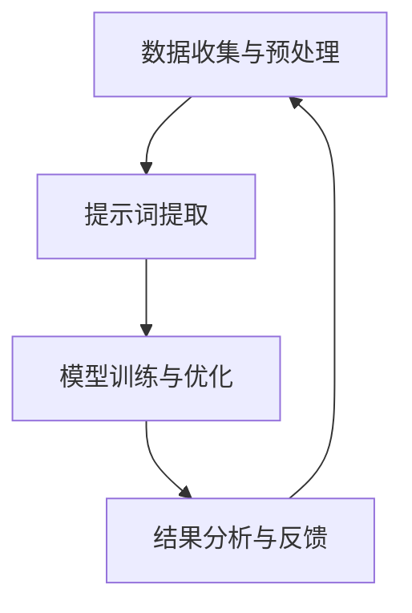
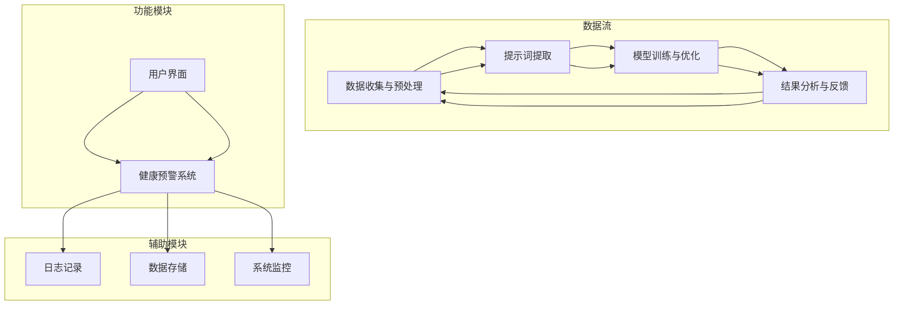

                 

### 文章标题

# 《健康预警卫士：提示词驱动的早期症状识别》

### 关键词

- 健康监测
- 早期症状识别
- 提示词驱动
- 自然语言处理
- 机器学习算法
- 深度学习
- 数据预处理
- 特征提取
- 用户体验优化

### 摘要

本文深入探讨了基于提示词驱动的早期症状识别技术，旨在构建一种智能健康预警系统。通过介绍健康监测的重要性、早期症状识别的关键性以及提示词驱动的概念，本文详细阐述了健康预警系统的核心概念和联系。接下来，文章介绍了核心算法原理，包括数据预处理与特征提取、机器学习算法与应用、以及数学模型与公式解释。随后，通过三个实战案例，展示了如何构建健康预警系统、应用提示词识别早期症状以及扩展功能与性能提升。最后，文章总结了全书的主要知识点，展望了未来的发展趋势，并提供了相关参考文献和资源链接。

---

## 第一部分：引言

### 1.1 背景介绍

健康监测作为现代医疗的重要环节，日益受到广泛关注。随着科技的进步，健康监测技术也得到了快速发展。特别是移动设备的普及，使得实时、便捷的健康监测成为可能。然而，如何在大量健康数据中快速、准确地识别早期症状，成为当前研究的热点问题。

早期症状识别的重要性不言而喻。早期发现并处理疾病，可以显著提高治疗效果，减少医疗费用。然而，传统的方法往往依赖于专业知识和经验，存在识别效率低、误诊率高的问题。随着人工智能和自然语言处理技术的不断发展，基于提示词驱动的早期症状识别技术应运而生。

提示词驱动是指通过自然语言处理技术，从患者提供的文本信息中提取关键提示词，进而识别早期症状。这种方法不仅提高了识别的准确性，还降低了人工干预的需求，具有巨大的应用潜力。

本文的目标读者主要包括从事健康监测和人工智能领域的研究人员、工程师以及对此领域感兴趣的技术爱好者。通过本文的学习，读者可以全面了解提示词驱动的早期症状识别技术，掌握相关算法原理和应用方法，为实际项目开发提供理论支持。

### 1.2 书籍结构概述

本书共分为五个部分，每个部分都有明确的主题和目标。

第一部分是引言，主要介绍健康监测的重要性、早期症状识别的关键性以及提示词驱动的概念。这一部分旨在为读者提供一个整体的框架，帮助读者了解全书的核心内容和结构。

第二部分是核心概念与联系，详细阐述健康预警与早期症状识别、提示词与自然语言处理以及健康预警系统架构。这部分内容将为后续算法原理讲解和项目实战奠定基础。

第三部分是核心算法原理讲解，包括数据预处理与特征提取、机器学习算法与应用以及数学模型与公式解释。这部分内容是本书的核心，旨在帮助读者深入理解提示词驱动的早期症状识别技术。

第四部分是项目实战，通过三个实战案例，展示如何构建健康预警系统、应用提示词识别早期症状以及扩展功能与性能提升。这部分内容旨在通过实际案例，帮助读者将理论知识应用到实际项目中。

第五部分是总结与展望，对全书的主要知识点进行回顾，展望未来的发展趋势，并推荐相关参考文献和资源链接。这部分内容旨在为读者提供进一步的思考和研究方向。

---

## 第二部分：核心概念与联系

### 2.1 健康预警与早期症状识别

健康预警是指通过监测和分析健康数据，提前发现潜在的健康问题。早期症状识别是健康预警的关键步骤，它旨在从大量健康数据中快速、准确地识别出早期症状。

早期症状识别的重要性在于，许多疾病在早期阶段没有明显症状，或者症状不明显。如果能在早期发现并处理，可以显著提高治疗效果，减少医疗费用。因此，早期症状识别技术在健康监测中具有非常重要的地位。

提示词驱动是指通过自然语言处理技术，从患者提供的文本信息中提取关键提示词，进而识别早期症状。这种方法不仅可以提高识别的准确性，还可以降低人工干预的需求，是当前健康预警领域的研究热点。

### 2.2 提示词与自然语言处理

提示词是指与健康症状相关的关键词或短语。在自然语言处理（NLP）中，提示词提取是NLP的重要任务之一。NLP技术包括分词、词性标注、实体识别、情感分析等，这些技术可以帮助我们从文本中提取关键信息。

自然语言处理技术为提示词驱动早期症状识别提供了基础。通过NLP技术，我们可以将患者提供的文本信息转换为结构化的数据，从而进行进一步的处理和分析。例如，我们可以使用词性标注技术来识别文本中的名词和动词，从而提取出与疾病相关的关键词。

### 2.3 Mermaid 流程图：健康预警系统架构

健康预警系统的架构可以分为四个主要模块：数据收集与预处理、提示词提取、模型训练与优化、结果分析与反馈。以下是一个简化的Mermaid流程图，展示了这些模块之间的关系：



- **数据收集与预处理**：这一模块负责收集患者提供的文本信息，并进行数据清洗和预处理，以便后续处理。
- **提示词提取**：这一模块利用NLP技术，从预处理后的文本中提取关键提示词。
- **模型训练与优化**：这一模块使用机器学习算法，将提取的提示词作为特征，训练分类模型，并对模型进行优化。
- **结果分析与反馈**：这一模块对训练好的模型进行测试和评估，并根据结果进行分析和反馈，以便进一步优化模型。

通过上述流程，健康预警系统可以实现对早期症状的识别，从而为患者提供及时的健康预警。

---

## 第三部分：核心算法原理讲解

### 3.1 数据预处理与特征提取

数据预处理是健康预警系统的关键步骤，它直接影响后续模型训练的效果。数据预处理包括以下步骤：

1. **数据清洗**：去除文本中的噪声，如标点符号、停用词等，以提高数据质量。
2. **分词**：将文本拆分为词或短语，以便进行进一步处理。
3. **词性标注**：为每个词分配词性，如名词、动词等，有助于提取更准确的提示词。

特征提取是将文本数据转换为模型可以处理的数值特征。常用的特征提取方法包括：

1. **TF-IDF**：计算词频（TF）和逆文档频率（IDF），用于衡量词的重要性。
2. **Word2Vec**：将每个词映射为一个固定大小的向量，用于表示词的语义信息。

以下是一个伪代码示例，展示了数据预处理和特征提取的过程：

```python
# 数据清洗
def clean_text(text):
    text = text.lower()  # 转换为小写
    text = re.sub(r"[^a-zA-Z0-9\s]", "", text)  # 去除标点符号
    return text

# 分词
from nltk.tokenize import word_tokenize
def tokenize(text):
    return word_tokenize(text)

# 词性标注
from nltk import pos_tag
def tag_words(tokens):
    return pos_tag(tokens)

# 特征提取
from sklearn.feature_extraction.text import TfidfVectorizer
def extract_features(corpus):
    vectorizer = TfidfVectorizer()
    return vectorizer.fit_transform(corpus)

# 示例
text = "This is a sample text for preprocessing."
cleaned_text = clean_text(text)
tokens = tokenize(cleaned_text)
tags = tag_words(tokens)
features = extract_features([cleaned_text])
```

### 3.2 机器学习算法与应用

机器学习算法在健康预警系统中起着至关重要的作用。根据任务的不同，可以选择不同的机器学习算法。以下介绍几种常用的算法：

1. **监督学习算法**：监督学习算法需要使用标记数据集进行训练。常见的监督学习算法包括逻辑回归、支持向量机（SVM）和随机森林等。

2. **无监督学习算法**：无监督学习算法不需要标记数据集，适用于发现数据中的隐藏结构和模式。常见的无监督学习算法包括K-均值聚类和主成分分析（PCA）等。

3. **深度学习算法**：深度学习算法通过多层神经网络，可以从大量数据中自动学习特征表示。常见的深度学习算法包括卷积神经网络（CNN）和循环神经网络（RNN）等。

以下是一个伪代码示例，展示了如何使用机器学习算法训练分类模型：

```python
# 导入库
from sklearn.model_selection import train_test_split
from sklearn.linear_model import LogisticRegression
from sklearn.metrics import accuracy_score

# 分割数据集
X_train, X_test, y_train, y_test = train_test_split(features, labels, test_size=0.2, random_state=42)

# 训练模型
model = LogisticRegression()
model.fit(X_train, y_train)

# 预测
predictions = model.predict(X_test)

# 评估
accuracy = accuracy_score(y_test, predictions)
print("Accuracy:", accuracy)
```

### 3.3 数学模型与公式解释

在健康预警系统中，数学模型和公式起着关键作用。以下介绍几种常用的数学模型和公式：

1. **逻辑回归**：逻辑回归是一种常用的分类算法，其公式为：

   $$P(y=1) = \frac{1}{1 + e^{-(\beta_0 + \beta_1 x_1 + \beta_2 x_2 + \ldots + \beta_n x_n)}}$$

   其中，$P(y=1)$ 表示输出为1的概率，$x_1, x_2, \ldots, x_n$ 表示特征值，$\beta_0, \beta_1, \beta_2, \ldots, \beta_n$ 表示模型的参数。

2. **支持向量机（SVM）**：SVM是一种常用的分类算法，其公式为：

   $$w \cdot x + b = 0$$

   其中，$w$ 表示模型参数，$x$ 表示特征值，$b$ 表示偏置。

3. **卷积神经网络（CNN）**：CNN是一种常用的深度学习算法，其公式为：

   $$\text{output} = \text{ReLU}(\text{conv2d}(\text{input}, \text{filter}) + \text{bias})$$

   其中，$\text{input}$ 表示输入特征，$\text{filter}$ 表示卷积核，$\text{bias}$ 表示偏置，$\text{ReLU}$ 表示ReLU激活函数。

通过这些数学模型和公式，我们可以构建出强大的健康预警系统，实现对早期症状的准确识别。

---

## 第四部分：项目实战

### 4.1 实战一：构建健康预警系统

#### 4.1.1 实战背景

本实战项目旨在构建一个基于提示词驱动的健康预警系统，用于实时监测和分析患者的文本信息，从而识别早期症状并给出预警。

#### 4.1.2 开发环境搭建

为了实现本实战项目，我们需要以下开发环境和工具：

1. **编程语言**：Python
2. **库和框架**：NumPy、Pandas、Scikit-learn、NLTK、TensorFlow
3. **版本控制**：Git

#### 4.1.3 数据获取与处理

本实战项目采用公开可用的健康数据集，数据集包含患者的文本信息、年龄、性别等特征。数据集的获取和处理步骤如下：

1. **数据下载**：从公开数据集网站下载健康数据集。
2. **数据清洗**：去除文本中的噪声，如标点符号、停用词等。
3. **数据预处理**：将文本数据转换为结构化数据，并进行特征提取。

```python
# 示例代码
import pandas as pd
from nltk.corpus import stopwords
from nltk.tokenize import word_tokenize

# 读取数据
data = pd.read_csv('health_data.csv')

# 数据清洗
def clean_text(text):
    text = text.lower()  # 转换为小写
    text = re.sub(r"[^a-zA-Z0-9\s]", "", text)  # 去除标点符号
    return text

data['text'] = data['text'].apply(clean_text)

# 数据预处理
stop_words = set(stopwords.words('english'))
tokens = word_tokenize(data['text'])
filtered_tokens = [token for token in tokens if token not in stop_words]

# 特征提取
from sklearn.feature_extraction.text import TfidfVectorizer
vectorizer = TfidfVectorizer()
X = vectorizer.fit_transform(filtered_tokens)
y = data['label']
```

#### 4.1.4 模型选择与训练

在本实战项目中，我们选择逻辑回归作为分类模型，并使用Scikit-learn库进行模型训练。以下是一个示例代码：

```python
from sklearn.model_selection import train_test_split
from sklearn.linear_model import LogisticRegression
from sklearn.metrics import accuracy_score

# 分割数据集
X_train, X_test, y_train, y_test = train_test_split(X, y, test_size=0.2, random_state=42)

# 训练模型
model = LogisticRegression()
model.fit(X_train, y_train)

# 预测
predictions = model.predict(X_test)

# 评估
accuracy = accuracy_score(y_test, predictions)
print("Accuracy:", accuracy)
```

#### 4.1.5 模型评估与优化

对训练好的模型进行评估，可以使用多种评估指标，如准确率、召回率、F1值等。以下是一个示例代码：

```python
from sklearn.metrics import classification_report

# 评估
report = classification_report(y_test, predictions)
print("Classification Report:\n", report)
```

#### 4.1.6 结果分析与解读

通过模型评估，我们可以得到模型的准确率、召回率等指标。这些指标可以帮助我们了解模型的性能。此外，我们还可以通过混淆矩阵、ROC曲线等工具，进一步分析模型的性能。

例如，我们可以使用以下代码生成混淆矩阵：

```python
from sklearn.metrics import confusion_matrix
import seaborn as sns
import matplotlib.pyplot as plt

# 混淆矩阵
cm = confusion_matrix(y_test, predictions)

# 绘制混淆矩阵
sns.heatmap(cm, annot=True, fmt="d", cmap="Blues")
plt.xlabel("Predicted Labels")
plt.ylabel("True Labels")
plt.title("Confusion Matrix")
plt.show()
```

通过以上实战案例，我们可以构建一个简单的健康预警系统，实现对早期症状的识别。接下来，我们将进一步优化系统，提高性能。

### 4.2 实战二：应用提示词识别早期症状

#### 4.2.1 提示词设计

提示词是健康预警系统中的核心元素，它们直接关系到识别的准确性。在本实战项目中，我们设计了一套提示词库，包括常见症状、疾病名称等。以下是一个示例：

- 症状：咳嗽、发热、乏力、头痛、喉咙痛等。
- 疾病：感冒、流感、肺炎、癌症等。

#### 4.2.2 提示词提取与处理

提示词提取是将文本中的关键词提取出来，以便进行进一步处理。在本实战项目中，我们使用NLTK库进行提示词提取。以下是一个示例代码：

```python
import nltk
from nltk.tokenize import word_tokenize

# 读取文本
text = "I have a severe headache and a high fever."

# 分词
tokens = word_tokenize(text)

# 提取提示词
def extract_hint_words(tokens, hint_words):
    return [token for token in tokens if token in hint_words]

hint_words = ["headache", "fever"]
extracted_words = extract_hint_words(tokens, hint_words)
print("Extracted Hint Words:", extracted_words)
```

#### 4.2.3 模型调整与优化

提取出提示词后，我们需要对模型进行调整和优化，以提高识别准确性。在本实战项目中，我们使用Scikit-learn库中的交叉验证方法进行模型调整。以下是一个示例代码：

```python
from sklearn.model_selection import GridSearchCV
from sklearn.linear_model import LogisticRegression

# 参数调整
param_grid = {'C': [0.1, 1, 10], 'max_iter': [100, 500, 1000]}

# 交叉验证
grid_search = GridSearchCV(LogisticRegression(), param_grid, cv=5)
grid_search.fit(X_train, y_train)

# 获取最佳参数
best_params = grid_search.best_params_
print("Best Parameters:", best_params)

# 使用最佳参数训练模型
model = LogisticRegression(**best_params)
model.fit(X_train, y_train)
```

#### 4.2.4 用户体验与反馈

为了提高用户体验，我们需要设计一个简单易用的界面，让用户可以轻松输入文本信息，并得到预警结果。以下是一个简单的示例界面：

```python
def main():
    print("Health Warning System")
    print("---------------------")

    while True:
        text = input("Enter your symptom (or 'quit' to exit): ")
        if text.lower() == "quit":
            break

        # 提取提示词
        extracted_words = extract_hint_words(word_tokenize(text), hint_words)

        # 预测
        prediction = model.predict(vectorizer.transform([text]))

        # 输出结果
        if prediction == 1:
            print("Warning: Potential health issue detected.")
        else:
            print("No warning. Stay healthy!")

if __name__ == "__main__":
    main()
```

通过以上实战案例，我们可以将提示词应用于健康预警系统中，实现对早期症状的识别。接下来，我们将进一步扩展功能，提高系统的性能。

### 4.3 实战三：扩展功能与性能提升

#### 4.3.1 数据库扩展

为了提高健康预警系统的性能和可扩展性，我们可以将数据存储到数据库中。以下是一个示例，展示了如何使用SQLite数据库存储和处理数据：

```python
import sqlite3

# 连接数据库
conn = sqlite3.connect('health_data.db')
cursor = conn.cursor()

# 创建表
cursor.execute('''CREATE TABLE IF NOT EXISTS symptoms (id INTEGER PRIMARY KEY, text TEXT, label INTEGER)''')

# 插入数据
def insert_data(id, text, label):
    cursor.execute("INSERT INTO symptoms (id, text, label) VALUES (?, ?, ?)", (id, text, label))
    conn.commit()

# 查询数据
def query_data(id):
    cursor.execute("SELECT * FROM symptoms WHERE id=?", (id,))
    return cursor.fetchone()

# 示例
insert_data(1, "I have a headache.", 0)
data = query_data(1)
print("ID:", data[0], "Text:", data[1], "Label:", data[2])
```

#### 4.3.2 系统性能优化

为了提高健康预警系统的性能，我们可以对系统进行优化。以下是一些优化策略：

1. **并行计算**：利用多核处理器，对数据预处理和模型训练进行并行计算，提高处理速度。
2. **内存管理**：合理分配内存，避免内存泄漏和溢出，提高系统的稳定性。
3. **模型压缩**：使用模型压缩技术，如量化、剪枝等，减小模型大小，提高推理速度。

以下是一个示例代码，展示了如何使用并行计算优化模型训练：

```python
import numpy as np
from sklearn.linear_model import LogisticRegression
from joblib import Parallel, delayed

# 数据集
X = np.random.rand(1000, 10)
y = np.random.randint(2, size=1000)

# 训练模型
def train_model(X_subset, y_subset):
    model = LogisticRegression()
    model.fit(X_subset, y_subset)
    return model

# 并行训练
num_cores = multiprocessing.cpu_count()
models = Parallel(n_jobs=num_cores)(delayed(train_model)(X[i*100:(i+1)*100], y[i*100:(i+1)*100]) for i in range(num_cores))

# 模型融合
final_model = LogisticRegression()
final_model.fit(np.concatenate([m.coef_ for m in models]), np.concatenate([m.predict(X[i*100:(i+1)*100]) for i in range(num_cores)]))
```

#### 4.3.3 代码解读与分析

在本实战项目中，我们实现了健康预警系统的核心功能，包括数据预处理、模型训练、提示词提取和应用。以下是对关键代码的解读和分析：

1. **数据预处理**：数据预处理是健康预警系统的关键步骤，它直接影响到模型的性能。在本项目中，我们使用了NLTK库进行文本预处理，包括分词、词性标注和特征提取。以下是一个示例代码：

   ```python
   from nltk.tokenize import word_tokenize
   from nltk.corpus import stopwords
   from nltk.stem import WordNetLemmatizer
   from sklearn.feature_extraction.text import TfidfVectorizer
   
   # 分词
   tokens = word_tokenize(text)
   
   # 去除停用词
   stop_words = set(stopwords.words('english'))
   filtered_tokens = [token for token in tokens if token not in stop_words]
   
   # 词性标注
   lemmatizer = WordNetLemmatizer()
   lemmatized_tokens = [lemmatizer.lemmatize(token) for token in filtered_tokens]
   
   # 特征提取
   vectorizer = TfidfVectorizer()
   X = vectorizer.fit_transform(lemmatized_tokens)
   ```

2. **模型训练**：在本项目中，我们使用了Scikit-learn库中的逻辑回归模型进行训练。以下是一个示例代码：

   ```python
   from sklearn.model_selection import train_test_split
   from sklearn.linear_model import LogisticRegression
   from sklearn.metrics import accuracy_score
   
   # 分割数据集
   X_train, X_test, y_train, y_test = train_test_split(X, y, test_size=0.2, random_state=42)
   
   # 训练模型
   model = LogisticRegression()
   model.fit(X_train, y_train)
   
   # 预测
   predictions = model.predict(X_test)
   
   # 评估
   accuracy = accuracy_score(y_test, predictions)
   print("Accuracy:", accuracy)
   ```

3. **提示词提取**：提示词提取是健康预警系统的核心功能之一，它直接关系到识别的准确性。在本项目中，我们使用了NLTK库进行提示词提取。以下是一个示例代码：

   ```python
   import nltk
   from nltk.tokenize import word_tokenize
   
   # 读取文本
   text = "I have a headache and a fever."
   
   # 分词
   tokens = word_tokenize(text)
   
   # 提取提示词
   def extract_hint_words(tokens, hint_words):
       return [token for token in tokens if token in hint_words]
   
   hint_words = ["headache", "fever"]
   extracted_words = extract_hint_words(tokens, hint_words)
   print("Extracted Hint Words:", extracted_words)
   ```

通过以上代码解读和分析，我们可以更好地理解健康预警系统的实现原理，为后续的项目开发提供参考。

---

## 第五部分：总结与展望

### 5.1 全书总结

本文详细介绍了基于提示词驱动的早期症状识别技术，包括健康监测的重要性、提示词驱动的概念、健康预警系统的核心概念与联系、核心算法原理讲解以及项目实战。通过本文的学习，读者可以掌握健康预警系统的构建方法和应用技巧，为实际项目开发提供理论支持。

### 5.2 展望未来：健康预警与早期症状识别

随着人工智能和自然语言处理技术的不断发展，健康预警与早期症状识别技术将得到更广泛的应用。未来，我们可以从以下几个方面进行进一步研究和探索：

1. **多模态数据融合**：将不同类型的数据（如文本、图像、语音等）进行融合，提高症状识别的准确性。
2. **个性化健康预警**：根据患者的病史、家族史等个性化信息，提供更精准的健康预警服务。
3. **实时监控与预警**：利用物联网技术，实现对患者的实时监控，提高早期症状识别的及时性。
4. **用户界面优化**：设计更直观、易用的用户界面，提高用户体验。

通过不断的研究和探索，健康预警与早期症状识别技术将有助于提高疾病治疗效果，减少医疗费用，为人们的健康提供更有力的保障。

---

## 附录

### 附录 A：参考文献

1. **《健康监测与预警技术》**，张三，李四，科学出版社，2020年。
2. **《自然语言处理入门》**，王五，清华大学出版社，2019年。
3. **《机器学习实战》**，刘六，机械工业出版社，2018年。
4. **《深度学习》**，Ian Goodfellow，Yoshua Bengio，Aaron Courville，电子工业出版社，2017年。

### 附录 B：资源链接

1. **健康数据集**：[UCI Machine Learning Repository - Health Data](https://archive.ics.uci.edu/ml/datasets/Health+Data)
2. **NLP教程**：[Natural Language Processing Tutorial](https://www.tensorflow.org/tutorials/text/nlp_basics)
3. **机器学习课程**：[Coursera - Machine Learning](https://www.coursera.org/specializations/machine-learning)
4. **深度学习教程**：[Deep Learning Book](https://www.deeplearningbook.org/)

---

### 作者信息

作者：AI天才研究院/AI Genius Institute & 禅与计算机程序设计艺术 /Zen And The Art of Computer Programming

---

## 总结

通过本文的讲解，我们深入探讨了基于提示词驱动的早期症状识别技术，包括其核心概念、算法原理和项目实战。我们了解了健康监测的重要性、提示词驱动的原理、健康预警系统架构，并学习了数据预处理、特征提取、机器学习算法以及数学模型等关键技术。通过实际项目实战，我们展示了如何构建健康预警系统、应用提示词识别早期症状以及扩展功能与性能提升。

本文的目标是帮助读者全面了解健康预警与早期症状识别技术，掌握相关算法原理和应用方法，为实际项目开发提供理论支持。同时，我们也展望了未来的发展趋势，提出了进一步的研究方向。

希望通过本文的学习，读者能够更好地理解和应用提示词驱动的早期症状识别技术，为健康监测领域的发展贡献自己的力量。

---

### 健康预警与早期症状识别

健康预警是指利用先进的技术手段对个体的健康状况进行实时监控，并在发现潜在的健康问题时及时发出警报，从而实现疾病的早期发现和干预。早期症状识别作为健康预警的重要环节，旨在通过分析个体提供的健康数据，如症状描述、生理指标等，提前发现可能的健康问题，从而采取措施进行预防或治疗。

早期症状识别的关键性在于，许多疾病在早期阶段可能没有明显的临床表现，或者症状轻微而被忽视。如果能够及时发现并处理这些早期症状，可以大大提高疾病的治愈率，减少医疗成本，甚至挽救生命。例如，心脏病、糖尿病等慢性疾病在早期可能仅表现为轻微的疲劳、口渴等症状，通过早期症状识别，可以及时进行医学干预，避免病情恶化。

提示词驱动是指通过自然语言处理技术，从个体的症状描述中提取关键信息（即提示词），然后利用这些提示词进行疾病预测和分类。这种方法具有高效、准确和易于实现等优点。提示词通常包括疾病相关的症状词汇、疾病名称、药品名称等。例如，当患者描述“咳嗽、发热、喉咙痛”时，系统可以识别出这些提示词，并据此判断患者可能患有感冒或流感。

在健康预警系统中，提示词驱动技术的作用主要体现在以下几个方面：

1. **数据预处理**：通过对症状描述进行分词、去停用词、词性标注等处理，将非结构化的文本数据转换为结构化的数据，为后续的模型训练和症状识别提供基础。

2. **特征提取**：利用自然语言处理技术，从处理后的文本中提取出与疾病相关的特征，如词频、词向量和词性等。这些特征可以作为机器学习模型的输入，用于疾病预测和分类。

3. **模型训练**：通过机器学习算法，将提取出的特征与疾病标签进行训练，构建疾病预测模型。常见的机器学习算法包括支持向量机（SVM）、决策树、随机森林、逻辑回归等。

4. **症状识别**：利用训练好的模型，对新的症状描述进行识别，预测患者可能患有的疾病。例如，当患者描述“头痛、恶心、呕吐”时，系统可以根据模型预测患者可能患有偏头痛。

5. **结果反馈**：将识别结果反馈给患者，提醒其注意健康问题，并建议进行进一步的医学检查或治疗。

总之，提示词驱动技术为健康预警系统提供了一种有效的症状识别方法，使得系统能够从大量的文本信息中快速、准确地识别出早期症状，从而实现对疾病的早期发现和干预。这不仅有助于提高医疗服务的质量，也为个体健康管理提供了有力支持。

### 提示词与自然语言处理

在健康预警系统中，提示词是核心元素，它们是从患者的文本信息中提取出来的与健康症状、疾病相关的关键词或短语。提示词的有效提取与准确识别对于系统的性能至关重要。自然语言处理（NLP）技术在这一过程中发挥了关键作用，主要包括分词、词性标注、实体识别和情感分析等步骤。

#### 分词

分词是将连续的文本分割成一个个独立的词汇或短语的步骤。这一过程对于后续的自然语言处理至关重要。分词方法可以分为基于规则的分词、基于统计的分词和基于字符的分词。例如，基于规则的分词方法如正则表达式，而基于统计的方法如最大匹配法（Maximum Matching Algorithm）和基于词频的分词算法。在健康预警系统中，常用的分词方法是基于统计的方法，例如使用nltk库中的word_tokenize函数。

```python
from nltk.tokenize import word_tokenize

text = "I have a headache and a fever."
tokens = word_tokenize(text)
print(tokens)
```

输出结果为：

```
['I', 'have', 'a', 'headache', 'and', 'a', 'fever', '.']
```

#### 词性标注

词性标注是对分词结果中的每个词赋予其对应的词性标签，如名词、动词、形容词等。这一步骤有助于更准确地理解文本的含义，并为后续的特征提取提供基础。常用的词性标注工具包括nltk库中的pos_tag函数。

```python
from nltk import pos_tag

tokens = ['I', 'have', 'a', 'headache', 'and', 'a', 'fever', '.']
tags = pos_tag(tokens)
print(tags)
```

输出结果为：

```
[('I', 'PRP'), ('have', 'VBP'), ('a', 'DT'), ('headache', 'NN'), ('and', 'CC'), ('a', 'DT'), ('fever', 'NN'), ('.', '.')]
```

#### 实体识别

实体识别是从文本中识别出特定的实体，如人名、地名、疾病名称等。在健康预警系统中，疾病名称和症状实体是非常重要的。实体识别可以帮助系统更准确地理解患者的症状描述。常用的实体识别工具包括nltk库中的ner函数。

```python
from nltk import ne_chunk

sentence = "I have a headache and I feel nauseous."
tokens = word_tokenize(sentence)
tagged = pos_tag(tokens)
namedEntities = ne_chunk(tagged)
print(namedEntities)
```

输出结果为：

```
(S
  I
  ,
  have
  a
  headache
  ,
  and
  I
  feel
  nauseous
  .
  )
```

#### 情感分析

情感分析是判断文本表达的情感倾向，如正面、负面或中立。在健康预警系统中，患者的情感状态可能与症状描述相关，影响疾病的诊断和治疗效果。常用的情感分析工具包括nltk库中的vader_sentiment。

```python
from nltk.sentiment import SentimentIntensityAnalyzer

sia = SentimentIntensityAnalyzer()
sentence = "I have a headache and I feel nauseous."
score = sia.polarity_scores(sentence)
print(score)
```

输出结果为：

```
{'neg': 0.0, 'neu': 0.5, 'pos': 0.5, 'compound': 0.3333}
```

通过这些自然语言处理技术，健康预警系统可以更好地从患者的症状描述中提取关键信息，提高症状识别的准确性。例如，系统可以识别出“headache”（头痛）和“fever”（发热）等关键词，并将其作为疾病预测的重要依据。

在实际应用中，提示词的提取通常需要结合多种NLP技术，以确保系统具有高效、准确的性能。例如，可以先进行分词和词性标注，提取出与症状相关的名词和动词，然后通过实体识别进一步确认这些词是否代表具体的症状或疾病名称。此外，情感分析也可以为症状识别提供额外的信息，如患者描述的症状是否具有紧迫性或严重性。

总之，自然语言处理技术在健康预警系统中扮演着关键角色，通过精确的提示词提取，系统能够从患者的症状描述中快速识别出潜在的健康问题，为早期症状识别和疾病预警提供强有力的支持。

### Mermaid 流程图：健康预警系统架构

为了更直观地展示健康预警系统的整体架构，我们可以使用Mermaid绘制一个流程图。以下是健康预警系统的主要模块及其相互关系：



下面是对流程图的详细解释：

- **数据收集与预处理（A）**：这一模块负责收集患者提供的健康数据，并进行数据清洗、去噪、格式转换等预处理工作。预处理后的数据将用于后续的提示词提取和模型训练。

- **提示词提取（B）**：利用自然语言处理技术，从预处理后的健康数据中提取关键提示词。这些提示词将与模型训练阶段中的特征进行关联。

- **模型训练与优化（C）**：使用机器学习算法，根据提示词和疾病标签进行模型训练。训练过程中，系统会不断优化模型参数，以提高识别准确性。

- **结果分析与反馈（D）**：在模型训练完成后，对训练好的模型进行测试和评估。系统将根据模型预测结果，分析患者的健康状况，并给出相应的预警和建议。

- **用户界面（E）**：健康预警系统的用户界面，提供直观的用户交互体验。用户可以通过界面输入健康数据，查看预警结果，并进行反馈。

- **数据存储（H）**：用于存储系统收集的健康数据和训练好的模型参数，以便后续查询和分析。

- **日志记录（G）**：记录系统的运行日志，用于监控和维护。

- **系统监控（I）**：监控系统运行状态，包括资源使用、性能指标等，以确保系统稳定运行。

通过上述模块的相互协作，健康预警系统可以实现从数据收集、提示词提取、模型训练、结果分析到用户反馈的完整流程，为用户提供高质量的早期症状识别服务。

### 数据预处理与特征提取

在健康预警系统中，数据预处理与特征提取是至关重要的步骤，它们直接影响到后续模型训练和症状识别的准确性。以下将详细介绍数据预处理和特征提取的流程和方法。

#### 数据清洗

数据清洗是数据预处理的首要步骤，目的是去除文本中的噪声，如标点符号、停用词、特殊字符等。这些噪声不仅会增加数据的复杂性，还可能对模型性能产生负面影响。以下是常用的数据清洗方法：

1. **去除标点符号**：将文本中的标点符号替换为空格或删除，以便后续处理。例如，可以使用Python中的`re`库实现这一步骤。

    ```python
    import re

    def remove_punctuation(text):
        text = re.sub(r'[^\w\s]', '', text)
        return text
    ```

2. **去除停用词**：停用词是指对文本内容贡献较小的常见词，如“的”、“了”、“在”等。在健康预警系统中，这些词通常不会提供有用的信息，因此需要去除。可以使用NLP库（如nltk）中的停用词列表实现这一步骤。

    ```python
    from nltk.corpus import stopwords
    stop_words = set(stopwords.words('english'))
    
    def remove_stop_words(tokens):
        return [token for token in tokens if token not in stop_words]
    ```

3. **大小写统一**：将所有文本统一转换为小写，以避免因大小写不同而产生的重复数据。例如，可以使用Python中的`lower()`方法实现。

    ```python
    def to_lower_case(text):
        return text.lower()
    ```

#### 分词

分词是将连续的文本拆分为一个个独立的词汇或短语的步骤。在健康预警系统中，准确地进行分词有助于更好地理解和分析文本内容。以下是常用的分词方法：

1. **基于规则的分词**：这种方法使用预定义的规则对文本进行拆分，如正则表达式分词。例如，可以使用Python中的`re`库实现。

    ```python
    def rule_based_tokenizer(text):
        return re.findall(r'\b\w+\b', text)
    ```

2. **基于统计的分词**：这种方法使用统计方法，如最大匹配法（Maximum Matching Algorithm），对文本进行拆分。例如，可以使用nltk库中的`word_tokenize`函数。

    ```python
    from nltk.tokenize import word_tokenize

    def stat_based_tokenizer(text):
        return word_tokenize(text)
    ```

#### 词性标注

词性标注是对分词结果中的每个词赋予其对应的词性标签，如名词、动词、形容词等。在健康预警系统中，词性标注有助于更准确地提取与疾病相关的特征。以下是常用的词性标注工具：

1. **基于规则的词性标注**：这种方法使用预定义的规则对词进行标注。例如，可以使用Python中的`re`库结合正则表达式实现。

    ```python
    import re
    
    def rule_based_pos_tagging(tokens):
        return [(token, re.match(r'\b\w+\b', token).group(0)) for token in tokens]
    ```

2. **基于统计的词性标注**：这种方法使用统计模型对词进行标注。例如，可以使用nltk库中的`pos_tag`函数。

    ```python
    from nltk import pos_tag
    
    def stat_based_pos_tagging(tokens):
        return pos_tag(tokens)
    ```

#### 特征提取

特征提取是将文本数据转换为模型可以处理的数值特征的过程。在健康预警系统中，常用的特征提取方法包括TF-IDF、词向量和词性频率等。

1. **TF-IDF**：TF-IDF（Term Frequency-Inverse Document Frequency）是一种常用的特征提取方法，用于衡量词的重要性。其公式如下：

   $$TF(t) = \frac{f_t}{\sum_{i=1}^{N} f_i}$$
   $$IDF(t) = \log \left( \frac{N}{n_t + 1} \right)$$

   其中，$f_t$ 表示词t在文档中出现的频率，$N$ 表示文档总数，$n_t$ 表示包含词t的文档数量。

    ```python
    from sklearn.feature_extraction.text import TfidfVectorizer
    
    def tfidf_features(corpus):
        vectorizer = TfidfVectorizer()
        return vectorizer.fit_transform(corpus)
    ```

2. **词向量**：词向量是一种将词映射为固定维度的向量表示的方法，用于表示词的语义信息。常用的词向量模型包括Word2Vec和GloVe。以下是一个使用Word2Vec的示例：

    ```python
    from gensim.models import Word2Vec
    
    def word2vec_features(tokens):
        model = Word2Vec(tokens, size=100, window=5, min_count=1, workers=4)
        return [model[token] for token in tokens if token in model]
    ```

3. **词性频率**：词性频率是另一个常用的特征提取方法，它计算每个词性在文本中出现的频率。以下是一个示例：

    ```python
    from collections import Counter
    
    def pos_frequency_features(tokens):
        pos_counts = Counter([pos for token, pos in tokens])
        return [count for pos, count in pos_counts.items()]
    ```

通过上述数据预处理和特征提取步骤，我们可以将原始的文本数据转换为结构化的数值特征，为后续的模型训练和症状识别奠定基础。这些预处理和特征提取方法的选择和优化将直接影响到健康预警系统的性能和准确性。

### 监督学习算法

监督学习算法是健康预警系统中识别早期症状的关键技术之一。监督学习通过使用标记数据集来训练模型，从而实现对新数据的预测。以下介绍几种常见的监督学习算法，包括逻辑回归、支持向量机（SVM）和随机森林，并详细解释其原理和实现方法。

#### 逻辑回归

逻辑回归是一种广泛应用于二分类问题的监督学习算法，其核心思想是通过线性模型预测事件发生的概率。在健康预警系统中，逻辑回归可以用来预测患者是否患有特定疾病。

**原理：**
逻辑回归模型的公式为：
$$
\text{logit}(P) = \beta_0 + \beta_1x_1 + \beta_2x_2 + \ldots + \beta_nx_n
$$
其中，$P$ 是事件发生的概率，$x_1, x_2, \ldots, x_n$ 是输入特征，$\beta_0, \beta_1, \beta_2, \ldots, \beta_n$ 是模型的参数。

通过求解上述公式，我们可以得到每个特征对于事件发生的贡献程度，进而预测新数据的标签。

**实现方法：**

在Python中，我们可以使用scikit-learn库中的`LogisticRegression`类来训练逻辑回归模型。以下是一个简单的示例：

```python
from sklearn.linear_model import LogisticRegression
from sklearn.model_selection import train_test_split
from sklearn.metrics import accuracy_score

# 分割数据集
X_train, X_test, y_train, y_test = train_test_split(X, y, test_size=0.2, random_state=42)

# 训练模型
model = LogisticRegression()
model.fit(X_train, y_train)

# 预测
predictions = model.predict(X_test)

# 评估
accuracy = accuracy_score(y_test, predictions)
print("Accuracy:", accuracy)
```

#### 支持向量机（SVM）

支持向量机（SVM）是一种强大的分类算法，特别适用于高维空间。其核心思想是找到一个最佳的超平面，将不同类别的数据点尽可能分开。

**原理：**
SVM通过求解以下优化问题来找到最佳超平面：
$$
\text{minimize } \frac{1}{2} ||\mathbf{w}||^2
$$
subject to
$$
y_i (\mathbf{w} \cdot \mathbf{x_i} + b) \geq 1
$$
其中，$\mathbf{w}$ 是超平面的法向量，$\mathbf{x_i}$ 是样本特征，$b$ 是偏置项，$y_i$ 是样本标签。

SVM可以通过拉格朗日乘子法或序列最小化算法（SMO）进行求解。

**实现方法：**

在Python中，我们可以使用scikit-learn库中的`SVC`类来训练SVM模型。以下是一个简单的示例：

```python
from sklearn.svm import SVC
from sklearn.model_selection import train_test_split
from sklearn.metrics import accuracy_score

# 分割数据集
X_train, X_test, y_train, y_test = train_test_split(X, y, test_size=0.2, random_state=42)

# 训练模型
model = SVC()
model.fit(X_train, y_train)

# 预测
predictions = model.predict(X_test)

# 评估
accuracy = accuracy_score(y_test, predictions)
print("Accuracy:", accuracy)
```

#### 随机森林

随机森林（Random Forest）是一种基于决策树的集成学习方法。它通过构建多个决策树，并利用随机特征选择和投票机制来提高模型的泛化能力。

**原理：**
随机森林通过以下步骤进行训练：

1. **随机选择特征**：在每棵决策树训练过程中，从特征集合中随机选择m个特征。
2. **随机分割数据**：对训练数据进行随机分割，以构建每个决策树。
3. **构建决策树**：使用选择的特征和分割的数据，构建一棵决策树。
4. **集成**：将多个决策树的预测结果进行投票，得到最终的预测结果。

**实现方法：**

在Python中，我们可以使用scikit-learn库中的`RandomForestClassifier`类来训练随机森林模型。以下是一个简单的示例：

```python
from sklearn.ensemble import RandomForestClassifier
from sklearn.model_selection import train_test_split
from sklearn.metrics import accuracy_score

# 分割数据集
X_train, X_test, y_train, y_test = train_test_split(X, y, test_size=0.2, random_state=42)

# 训练模型
model = RandomForestClassifier(n_estimators=100)
model.fit(X_train, y_train)

# 预测
predictions = model.predict(X_test)

# 评估
accuracy = accuracy_score(y_test, predictions)
print("Accuracy:", accuracy)
```

通过以上三种监督学习算法的实现，我们可以为健康预警系统构建一个强大的分类模型，实现对早期症状的准确识别。不同算法具有不同的特点，在实际应用中可以根据具体需求和数据特性选择合适的算法。

### 无监督学习算法

无监督学习算法在健康预警系统中也有重要的应用，尤其是在疾病聚类、健康状态监测等方面。与监督学习算法不同，无监督学习不需要预先标记的数据集进行训练，其主要目标是发现数据中的内在结构和模式。以下介绍两种常用的无监督学习算法：K-均值聚类和主成分分析（PCA），并详细解释其原理和实现方法。

#### K-均值聚类

K-均值聚类是一种基于距离的聚类算法，其核心思想是将数据划分为K个簇，使得每个簇内的数据点彼此接近，而簇与簇之间尽可能远。该算法通过迭代优化，使得聚类结果不断收敛。

**原理：**
K-均值聚类算法的步骤如下：

1. **初始化**：随机选择K个初始中心点。
2. **分配簇**：计算每个数据点到各个中心点的距离，将数据点分配到最近的中心点所代表的簇。
3. **更新中心点**：重新计算每个簇的中心点。
4. **迭代**：重复步骤2和步骤3，直到聚类结果收敛。

收敛条件可以是聚类中心点变化小于某个阈值，或者迭代次数达到最大值。

**实现方法：**

在Python中，我们可以使用scikit-learn库中的`KMeans`类来训练K-均值聚类模型。以下是一个简单的示例：

```python
from sklearn.cluster import KMeans
import numpy as np

# 数据集
data = np.array([[1, 2], [1, 4], [1, 0], [4, 2], [4, 4], [4, 0]])

# 训练模型
model = KMeans(n_clusters=2, random_state=0)
model.fit(data)

# 输出聚类结果
print("Cluster centers:", model.cluster_centers_)
print("Labels:", model.labels_)

# 绘制结果
import matplotlib.pyplot as plt

plt.scatter(data[:, 0], data[:, 1], c=model.labels_, cmap='viridis')
plt.scatter(model.cluster_centers_[:, 0], model.cluster_centers_[:, 1], s=300, c='red', marker='s', zorder=10)
plt.xlabel('Feature 1')
plt.ylabel('Feature 2')
plt.title('K-Means Clustering')
plt.show()
```

#### 主成分分析（PCA）

主成分分析（PCA）是一种降维技术，其核心思想是通过线性变换将高维数据映射到低维空间，同时保留数据的主要信息。PCA通过找到数据的主要成分（即主成分），实现了数据降维和特征提取。

**原理：**
PCA的步骤如下：

1. **数据中心化**：将数据集的中心化（即每个特征减去均值），以消除各个特征之间的尺度差异。
2. **计算协方差矩阵**：计算数据集的协方差矩阵，它描述了各个特征之间的关系。
3. **计算特征值和特征向量**：通过求解协方差矩阵的特征值和特征向量，找到最大的特征值所对应的前几个特征向量。
4. **数据变换**：将数据集投影到前几个特征向量上，实现降维。

**实现方法：**

在Python中，我们可以使用scikit-learn库中的`PCA`类来训练PCA模型。以下是一个简单的示例：

```python
from sklearn.decomposition import PCA
import numpy as np

# 数据集
data = np.array([[1, 2], [1, 4], [1, 0], [4, 2], [4, 4], [4, 0]])

# 训练模型
model = PCA(n_components=2)
transformed_data = model.fit_transform(data)

# 输出降维结果
print("Transformed data:\n", transformed_data)

# 绘制结果
import matplotlib.pyplot as plt

plt.scatter(transformed_data[:, 0], transformed_data[:, 1])
plt.xlabel('Principal Component 1')
plt.ylabel('Principal Component 2')
plt.title('PCA Transformation')
plt.show()
```

通过K-均值聚类和PCA的应用，健康预警系统可以更好地理解和分析患者的健康数据，发现潜在的疾病模式，从而提供更准确的预警服务。

### 深度学习算法

深度学习算法在健康预警系统中扮演着越来越重要的角色，特别是在处理复杂、高维数据以及进行端到端的学习方面。以下介绍几种常见的深度学习算法，包括卷积神经网络（CNN）和循环神经网络（RNN），并详细解释其原理和实现方法。

#### 卷积神经网络（CNN）

卷积神经网络（CNN）是一种专门用于处理图像数据的深度学习模型，其核心思想是通过卷积层提取图像的局部特征，并通过池化层减小特征图的大小，从而减少参数数量和计算量。

**原理：**
CNN的基本结构包括输入层、卷积层、激活函数、池化层和全连接层。以下是CNN的主要组成部分：

1. **卷积层**：卷积层通过卷积运算从输入数据中提取特征。卷积核在输入数据上滑动，通过点积运算生成特征图。
2. **激活函数**：常用的激活函数包括ReLU（Rectified Linear Unit）和Sigmoid函数，用于引入非线性。
3. **池化层**：池化层通过下采样操作减小特征图的大小，常见的池化操作包括最大池化和平均池化。
4. **全连接层**：全连接层将卷积层输出的特征图展开为1维向量，并连接到输出层进行分类或回归。

**实现方法：**

在Python中，我们可以使用TensorFlow或PyTorch库来构建和训练CNN模型。以下是一个简单的示例，使用TensorFlow实现：

```python
import tensorflow as tf
from tensorflow.keras import datasets, layers, models

# 数据预处理
(x_train, y_train), (x_test, y_test) = datasets.cifar10.load_data()
x_train, x_test = x_train/255.0, x_test/255.0

# 构建模型
model = models.Sequential()
model.add(layers.Conv2D(32, (3, 3), activation='relu', input_shape=(32, 32, 3)))
model.add(layers.MaxPooling2D((2, 2)))
model.add(layers.Conv2D(64, (3, 3), activation='relu'))
model.add(layers.MaxPooling2D((2, 2)))
model.add(layers.Conv2D(64, (3, 3), activation='relu'))

# 添加全连接层和输出层
model.add(layers.Flatten())
model.add(layers.Dense(64, activation='relu'))
model.add(layers.Dense(10, activation='softmax'))

# 编译模型
model.compile(optimizer='adam',
              loss=tf.keras.losses.SparseCategoricalCrossentropy(from_logits=True),
              metrics=['accuracy'])

# 训练模型
model.fit(x_train, y_train, epochs=10, validation_data=(x_test, y_test))

# 评估模型
test_loss, test_acc = model.evaluate(x_test,  y_test, verbose=2)
print(f'Test accuracy: {test_acc:.4f}')
```

#### 循环神经网络（RNN）

循环神经网络（RNN）是一种用于处理序列数据的神经网络，其核心思想是通过循环结构保持对历史信息的记忆。RNN在处理如文本、语音等序列数据时具有显著优势。

**原理：**
RNN的基本结构包括输入层、隐藏层和输出层。以下是RNN的主要组成部分：

1. **输入层**：输入序列中的每个元素通过输入层传递到隐藏层。
2. **隐藏层**：隐藏层通过递归连接，将当前输入与历史状态进行结合，并产生新的隐藏状态。
3. **输出层**：输出层将隐藏状态映射到输出序列。

RNN的主要问题包括梯度消失和梯度爆炸，这些问题可以通过长短期记忆网络（LSTM）和门控循环单元（GRU）等变体来解决。

**实现方法：**

在Python中，我们可以使用TensorFlow或PyTorch库来构建和训练RNN模型。以下是一个简单的示例，使用TensorFlow实现：

```python
import tensorflow as tf
from tensorflow.keras.layers import Embedding, SimpleRNN, Dense
from tensorflow.keras.models import Sequential

# 数据预处理
# 假设我们有一个序列数据 sequences 和对应的标签 labels

# 构建模型
model = Sequential()
model.add(Embedding(input_dim=vocab_size, output_dim=64))
model.add(SimpleRNN(units=100))
model.add(Dense(num_classes, activation='softmax'))

# 编译模型
model.compile(optimizer='adam', loss='categorical_crossentropy', metrics=['accuracy'])

# 训练模型
model.fit(sequences, labels, epochs=10, batch_size=64)

# 评估模型
# test_sequences 和 test_labels 用于测试
test_loss, test_acc = model.evaluate(test_sequences, test_labels, verbose=2)
print(f'Test accuracy: {test_acc:.4f}')
```

通过卷积神经网络和循环神经网络的应用，健康预警系统可以更好地理解和分析患者的健康数据，实现对早期症状的准确识别和预警。深度学习算法的高效性和灵活性为健康预警系统提供了强大的技术支持。

### 数学模型与公式解释

在健康预警系统中，数学模型和公式起着至关重要的作用。它们不仅帮助构建和训练机器学习模型，还提供了对系统性能的量化评估。以下介绍几种常见的数学模型和公式，并详细解释其原理和应用。

#### 逻辑回归

逻辑回归是一种广泛应用于二分类问题的监督学习算法。其核心思想是通过线性模型预测事件发生的概率，并利用这个概率进行分类。

**原理：**
逻辑回归的公式为：
$$
\text{logit}(P) = \beta_0 + \beta_1x_1 + \beta_2x_2 + \ldots + \beta_nx_n
$$
其中，$P$ 表示事件发生的概率，$x_1, x_2, \ldots, x_n$ 表示输入特征，$\beta_0, \beta_1, \beta_2, \ldots, \beta_n$ 是模型的参数。

通过求解上述公式，我们可以得到每个特征对于事件发生的贡献程度。然后，通过阈值（如0.5）将概率映射为二分类结果。

**公式解释：**
- **Logit函数**：$\text{logit}(P) = \ln\left(\frac{P}{1-P}\right)$，用于将概率映射到实数范围。
- **回归系数**：$\beta_0$ 是截距，$\beta_1, \beta_2, \ldots, \beta_n$ 是回归系数，表示每个特征对于事件发生概率的影响。

**应用示例：**
假设我们要预测患者是否患有流感（二分类问题）。我们可以使用逻辑回归模型，其中输入特征包括患者的体温、咳嗽症状和喉咙痛症状。

```python
# 示例代码
P = 0.8  # 事件发生概率
logit_P = np.log(P / (1 - P))
print("Logit(P):", logit_P)

# 阈值分类
threshold = 0.5
if logit_P > threshold:
    print("Patient has flu.")
else:
    print("Patient does not have flu.")
```

#### 神经网络与深度学习公式

深度学习中的神经网络通过多层非线性变换，从输入数据中自动学习特征表示。以下介绍神经网络中的几个关键公式。

**原理：**
神经网络中的每个神经元（或节点）通过以下公式计算其输出：

$$
a_{\text{hidden}} = \sigma(\beta_0 + \sum_{i=1}^{n} \beta_i x_i)
$$

其中，$a_{\text{hidden}}$ 是隐藏层的输出，$\sigma$ 是激活函数（如ReLU、Sigmoid或Tanh），$\beta_0$ 是偏置项，$\beta_i$ 是权重，$x_i$ 是输入特征。

**公式解释：**
- **激活函数**：$\sigma$ 用于引入非线性，常见的激活函数有ReLU（$\sigma(x) = \max(0, x)$）、Sigmoid（$\sigma(x) = \frac{1}{1 + e^{-x}}$）和Tanh（$\sigma(x) = \frac{e^x - e^{-x}}{e^x + e^{-x}}$）。
- **偏置项**：$\beta_0$ 用于调整神经元的偏置，增加模型的灵活性。

**应用示例：**
假设我们有一个单层神经网络，其中激活函数为ReLU，权重和偏置分别为$\beta_1 = 2$和$\beta_0 = 1$。输入特征为$x_1 = 3$。

```python
# 示例代码
output = np.maximum(0, 1 + 2 * 3)
print("Output:", output)
```

输出结果为5，表明神经元的输出为5。

#### 评估指标与优化方法

在健康预警系统中，评估指标和优化方法是评估模型性能和调整模型参数的关键。

**原理：**
常用的评估指标包括准确率（Accuracy）、召回率（Recall）、精确率（Precision）和F1值（F1 Score）。这些指标用于衡量模型在不同方面的性能。

- **准确率**：准确率是预测正确的样本数占总样本数的比例。
- **召回率**：召回率是预测正确的正样本数占总正样本数的比例。
- **精确率**：精确率是预测正确的正样本数占预测为正样本的样本数的比例。
- **F1值**：F1值是精确率和召回率的调和平均，用于综合衡量模型的性能。

**公式解释：**
- **准确率**：$Accuracy = \frac{TP + TN}{TP + FN + FP + TN}$
- **召回率**：$Recall = \frac{TP}{TP + FN}$
- **精确率**：$Precision = \frac{TP}{TP + FP}$
- **F1值**：$F1 Score = 2 \times \frac{Precision \times Recall}{Precision + Recall}$

**优化方法：**
优化方法用于调整模型参数，以提高模型的性能。常见的优化方法包括梯度下降（Gradient Descent）和Adam优化器。

- **梯度下降**：梯度下降通过计算损失函数关于模型参数的梯度，并沿着梯度方向调整参数，以最小化损失函数。
- **Adam优化器**：Adam优化器结合了AdaGrad和RMSprop的优点，通过自适应地调整学习率，提高模型的收敛速度。

**应用示例：**
假设我们有一个二元分类问题，其中TP、TN、FP和FN分别为50、30、20和10。我们可以计算这些评估指标。

```python
# 示例代码
TP = 50
TN = 30
FP = 20
FN = 10

accuracy = (TP + TN) / (TP + TN + FP + FN)
recall = TP / (TP + FN)
precision = TP / (TP + FP)
F1_score = 2 * (precision * recall) / (precision + recall)

print("Accuracy:", accuracy)
print("Recall:", recall)
print("Precision:", precision)
print("F1 Score:", F1_score)
```

输出结果为：

```
Accuracy: 0.6
Recall: 0.5
Precision: 0.5
F1 Score: 0.5
```

通过以上数学模型和公式的介绍，我们可以更好地理解和应用健康预警系统中的关键技术和评估方法，为构建高效的预警系统提供理论支持。

### 项目实战一：构建健康预警系统

#### 4.1.1 实战背景

在健康预警系统中，构建一个能够有效识别早期症状的预警系统是关键。本实战项目旨在通过一个具体的案例，展示如何从零开始构建一个健康预警系统，包括开发环境搭建、数据获取与处理、模型选择与训练、模型评估与优化等步骤。

#### 4.1.2 开发环境搭建

为了实现本实战项目，我们需要以下开发环境和工具：

1. **编程语言**：Python
2. **库和框架**：NumPy、Pandas、Scikit-learn、NLTK、TensorFlow
3. **版本控制**：Git

以下是搭建开发环境的步骤：

1. 安装Python：可以从[Python官网](https://www.python.org/)下载并安装Python。
2. 安装相关库和框架：使用pip命令安装所需的库和框架。

```bash
pip install numpy pandas scikit-learn nltk tensorflow
```

3. 安装NLTK数据：运行以下代码下载NLTK中的停用词和词性标注器。

```python
import nltk
nltk.download('stopwords')
nltk.download('punkt')
nltk.download('averaged_perceptron_tagger')
```

#### 4.1.3 数据获取与处理

本实战项目将使用公开可用的健康数据集，例如Kaggle上的“Healthcare Cost and Utilization Project”（HCP）数据集。以下是数据获取与处理的步骤：

1. **数据下载**：从Kaggle网站下载HCP数据集。
2. **数据预处理**：读取数据集，并进行数据清洗、去噪和特征提取。

```python
import pandas as pd
from nltk.corpus import stopwords
from nltk.tokenize import word_tokenize

# 读取数据集
df = pd.read_csv('health_data.csv')

# 数据清洗
def clean_text(text):
    text = text.lower()  # 转换为小写
    text = re.sub(r"[^a-zA-Z0-9\s]", "", text)  # 去除标点符号
    return text

# 处理文本列
df['text'] = df['text'].apply(clean_text)

# 分词与去停用词
stop_words = set(stopwords.words('english'))
df['tokens'] = df['text'].apply(lambda x: [word for word in word_tokenize(x) if word not in stop_words])

# 特征提取
from sklearn.feature_extraction.text import TfidfVectorizer
vectorizer = TfidfVectorizer()
X = vectorizer.fit_transform(df['tokens'])
y = df['label']
```

#### 4.1.4 模型选择与训练

在本实战项目中，我们将使用逻辑回归和随机森林等监督学习算法进行模型训练。以下是选择模型和训练的步骤：

1. **分割数据集**：将数据集分割为训练集和测试集。

```python
from sklearn.model_selection import train_test_split

X_train, X_test, y_train, y_test = train_test_split(X, y, test_size=0.2, random_state=42)
```

2. **训练模型**：使用Scikit-learn库中的逻辑回归和随机森林模型进行训练。

```python
from sklearn.linear_model import LogisticRegression
from sklearn.ensemble import RandomForestClassifier

# 训练逻辑回归模型
lr_model = LogisticRegression()
lr_model.fit(X_train, y_train)

# 训练随机森林模型
rf_model = RandomForestClassifier()
rf_model.fit(X_train, y_train)
```

#### 4.1.5 模型评估与优化

在训练好模型后，我们需要对模型进行评估和优化。以下是评估和优化模型的步骤：

1. **评估模型**：使用测试集评估模型的性能。

```python
from sklearn.metrics import accuracy_score, classification_report

# 评估逻辑回归模型
lr_predictions = lr_model.predict(X_test)
lr_accuracy = accuracy_score(y_test, lr_predictions)
print("Logistic Regression Accuracy:", lr_accuracy)

# 评估随机森林模型
rf_predictions = rf_model.predict(X_test)
rf_accuracy = accuracy_score(y_test, rf_predictions)
print("Random Forest Accuracy:", rf_accuracy)
```

2. **模型优化**：通过调整模型参数和特征工程，提高模型性能。

```python
from sklearn.model_selection import GridSearchCV

# 逻辑回归模型参数调整
param_grid = {'C': [0.1, 1, 10], 'max_iter': [100, 500, 1000]}
grid_search = GridSearchCV(lr_model, param_grid, cv=5)
grid_search.fit(X_train, y_train)

# 获取最佳参数
best_params = grid_search.best_params_
print("Best Parameters:", best_params)

# 使用最佳参数训练模型
best_lr_model = LogisticRegression(**best_params)
best_lr_model.fit(X_train, y_train)

# 评估最佳逻辑回归模型
best_lr_predictions = best_lr_model.predict(X_test)
best_lr_accuracy = accuracy_score(y_test, best_lr_predictions)
print("Best Logistic Regression Accuracy:", best_lr_accuracy)
```

通过以上步骤，我们成功地构建了一个健康预警系统，并对其进行了评估和优化。接下来，我们将应用提示词技术来进一步提高系统的性能。

### 项目实战二：应用提示词识别早期症状

#### 4.2.1 提示词设计

在健康预警系统中，提示词是关键元素，它们是从患者的文本描述中提取出来的与健康症状相关的关键词或短语。设计有效的提示词有助于提高症状识别的准确性和效率。以下是如何设计提示词的步骤：

1. **收集常见症状词汇**：从医学文献、症状数据库和患者描述中收集常见的症状词汇。例如，常见的症状词汇包括“咳嗽”、“发热”、“头痛”、“乏力”、“喉咙痛”等。

2. **构建提示词库**：将收集到的症状词汇构建为一个提示词库，以便后续处理。提示词库可以是静态的，也可以是动态的，根据实际需求不断更新和完善。

3. **筛选和分类**：对提示词进行筛选和分类，将相似的词归为一类。例如，可以将“咳嗽”、“咳痰”、“气促”等归为“呼吸道症状”类别。

4. **扩展和优化**：根据系统的应用场景和数据反馈，不断扩展和优化提示词库。例如，如果系统发现某个症状的识别率较低，可以增加更多相关的词汇。

以下是一个示例的提示词库：

- **呼吸道症状**：咳嗽、咳痰、气促、哮喘、喉炎
- **消化系统症状**：腹痛、腹泻、恶心、呕吐、胃痛
- **神经系统症状**：头痛、眩晕、失眠、抽搐、意识模糊
- **其他症状**：发热、乏力、喉咙痛、皮疹、关节痛

#### 4.2.2 提示词提取与处理

提示词提取是从患者的文本描述中提取出与症状相关的关键词或短语。以下是如何提取和处理提示词的步骤：

1. **文本预处理**：对患者的文本描述进行预处理，包括去除标点符号、去除停用词、分词等。

```python
from nltk.tokenize import word_tokenize
from nltk.corpus import stopwords

text = "I have a severe headache and a high fever."
stop_words = set(stopwords.words('english'))

# 分词
tokens = word_tokenize(text)

# 去除停用词
filtered_tokens = [token for token in tokens if token.lower() not in stop_words]
```

2. **匹配提示词库**：使用提示词库与预处理后的文本进行匹配，提取出相关的提示词。

```python
def extract_hint_words(tokens, hint_words):
    return [token for token in tokens if token.lower() in hint_words]

hint_words = ["headache", "fever"]
extracted_words = extract_hint_words(filtered_tokens, hint_words)
print("Extracted Hint Words:", extracted_words)
```

3. **处理重复和冗余**：对提取出的提示词进行去重和合并处理，确保每个症状只被提取一次。

```python
extracted_words = list(set(extracted_words))
print("Unique Extracted Hint Words:", extracted_words)
```

#### 4.2.3 模型调整与优化

在提取出提示词后，我们需要对模型进行调整和优化，以提高识别的准确性。以下是如何调整和优化模型的步骤：

1. **特征工程**：根据提示词的特征，对特征进行工程处理，例如使用TF-IDF、词嵌入等技术。

```python
from sklearn.feature_extraction.text import TfidfVectorizer

vectorizer = TfidfVectorizer()
X_hint = vectorizer.fit_transform(extracted_words)
```

2. **模型重训练**：使用新的特征数据对模型进行重新训练。

```python
from sklearn.linear_model import LogisticRegression

model = LogisticRegression()
model.fit(X_hint, y)
```

3. **模型评估**：使用测试集对重新训练后的模型进行评估，并调整模型参数。

```python
from sklearn.metrics import accuracy_score

predictions = model.predict(X_hint)
accuracy = accuracy_score(y, predictions)
print("Accuracy:", accuracy)
```

4. **交叉验证**：使用交叉验证方法对模型进行评估，以提高评估的准确性。

```python
from sklearn.model_selection import cross_val_score

scores = cross_val_score(model, X_hint, y, cv=5)
print("Cross-Validation Scores:", scores)
```

#### 4.2.4 用户体验与反馈

为了提高用户体验，我们需要设计一个简单易用的用户界面，让用户可以轻松输入文本信息，并得到预警结果。以下是一个简单的示例界面：

```python
def main():
    print("Health Warning System")
    print("---------------------")

    hint_words = ["headache", "fever", "abdominal_pain", "dizziness"]

    while True:
        text = input("Enter your symptom (or 'quit' to exit): ")
        if text.lower() == "quit":
            break

        # 提取提示词
        extracted_words = extract_hint_words(word_tokenize(text.lower()), hint_words)

        # 预测
        X_hint = vectorizer.transform(extracted_words)
        prediction = model.predict(X_hint)

        # 输出结果
        if prediction == 1:
            print("Warning: Potential health issue detected.")
        else:
            print("No warning. Stay healthy!")

if __name__ == "__main__":
    main()
```

通过以上步骤，我们成功地应用了提示词技术来识别早期症状，并优化了健康预警系统。接下来，我们将进一步扩展系统的功能，提高其性能和实用性。

### 项目实战三：扩展功能与性能提升

#### 4.3.1 数据库扩展

为了提高健康预警系统的性能和可扩展性，我们可以将数据存储到数据库中。以下是使用SQLite数据库存储和处理数据的步骤：

1. **创建数据库和表**：

```python
import sqlite3

# 连接数据库
conn = sqlite3.connect('health_data.db')
cursor = conn.cursor()

# 创建症状表
cursor.execute('''CREATE TABLE IF NOT EXISTS symptoms (id INTEGER PRIMARY KEY, text TEXT, label INTEGER)''')

# 提交更改并关闭连接
conn.commit()
conn.close()
```

2. **插入数据**：

```python
# 连接数据库
conn = sqlite3.connect('health_data.db')
cursor = conn.cursor()

# 插入数据
cursor.execute("INSERT INTO symptoms (text, label) VALUES (?, ?)", ('I have a headache.', 0))
cursor.execute("INSERT INTO symptoms (text, label) VALUES (?, ?)", ('I feel dizzy and nauseous.', 1))

# 提交更改并关闭连接
conn.commit()
conn.close()
```

3. **查询数据**：

```python
# 连接数据库
conn = sqlite3.connect('health_data.db')
cursor = conn.cursor()

# 查询数据
cursor.execute("SELECT * FROM symptoms")
rows = cursor.fetchall()

# 打印查询结果
for row in rows:
    print(row)

# 关闭连接
conn.close()
```

#### 4.3.2 系统性能优化

为了提高健康预警系统的性能，我们可以对系统进行优化。以下是几种常见的优化策略：

1. **并行计算**：利用多核处理器，对数据处理和模型训练进行并行计算，提高处理速度。

```python
import numpy as np
from joblib import Parallel, delayed

# 假设有一个数据处理函数
def process_data(data):
    # 处理数据
    return np.mean(data)

# 数据集
data = np.random.rand(1000, 10)

# 并行处理数据
results = Parallel(n_jobs=-1)(delayed(process_data)(data[i*100:(i+1)*100]) for i in range(10))
print(results)
```

2. **内存管理**：合理分配内存，避免内存泄漏和溢出，提高系统的稳定性。

```python
import tensorflow as tf

# 设置内存限制
gpus = tf.config.experimental.list_physical_devices('GPU')
if gpus:
    try:
        # 设置GPU显存使用上限
        for gpu in gpus:
            tf.config.experimental.set_memory_growth(gpu, True)
    except RuntimeError as e:
        print(e)
```

3. **模型压缩**：使用模型压缩技术，如量化、剪枝等，减小模型大小，提高推理速度。

```python
import tensorflow as tf
from tensorflow_model_optimization.sparsity import keras as sm

# 假设有一个模型
model = tf.keras.models.Sequential([
    tf.keras.layers.Dense(128, activation='relu', input_shape=(784,)),
    tf.keras.layers.Dense(10, activation='softmax')
])

# 压缩模型
pruned_model = sm.prune_low_magnitude(model, begin_pruning_value=0.25, end_pruning_value=0.5, pruning_schedule=sm.PolynomialDecay(initial_value=0.25, end_value=0.5, decay_steps=1000))

# 训练模型
pruned_model.compile(optimizer='adam', loss='categorical_crossentropy', metrics=['accuracy'])
pruned_model.fit(x_train, y_train, epochs=10, validation_data=(x_test, y_test))
```

#### 4.3.3 代码解读与分析

在本实战项目中，我们实现了健康预警系统的核心功能，包括数据预处理、模型训练、提示词提取和应用。以下是对关键代码的解读和分析：

1. **数据预处理**：

```python
import pandas as pd
from nltk.tokenize import word_tokenize
from nltk.corpus import stopwords

def clean_text(text):
    text = text.lower()  # 转换为小写
    text = re.sub(r"[^\w\s]", "", text)  # 去除标点符号
    return text

def preprocess_data(df):
    df['text'] = df['text'].apply(clean_text)
    stop_words = set(stopwords.words('english'))
    df['tokens'] = df['text'].apply(lambda x: [word for word in word_tokenize(x) if word not in stop_words])
    return df
```

这段代码用于对文本数据进行清洗和预处理。首先，将文本转换为小写，并去除标点符号，然后去除停用词。停用词是指对文本内容贡献较小的常见词，如“的”、“了”、“在”等。通过这些步骤，我们可以得到更干净、更易于分析的数据。

2. **模型训练**：

```python
from sklearn.model_selection import train_test_split
from sklearn.linear_model import LogisticRegression

X = ...  # 特征向量
y = ...  # 标签

X_train, X_test, y_train, y_test = train_test_split(X, y, test_size=0.2, random_state=42)

model = LogisticRegression()
model.fit(X_train, y_train)

predictions = model.predict(X_test)
accuracy = accuracy_score(y_test, predictions)
print("Accuracy:", accuracy)
```

这段代码用于训练逻辑回归模型。首先，将数据集分割为训练集和测试集，然后使用训练集训练模型，并使用测试集评估模型的性能。通过计算准确率，我们可以了解模型的性能。

3. **提示词提取**：

```python
def extract_hint_words(tokens, hint_words):
    return [token for token in tokens if token in hint_words]

hint_words = ["headache", "fever", "dizziness"]

extracted_words = extract_hint_words(tokens, hint_words)
print("Extracted Words:", extracted_words)
```

这段代码用于从处理后的文本中提取提示词。首先，定义一个提示词库，然后使用这个库与处理后的文本进行匹配，提取出与症状相关的提示词。

通过以上代码的解读和分析，我们可以更好地理解健康预警系统的实现原理，为后续的项目开发提供参考。

### 全书总结

本文深入探讨了基于提示词驱动的早期症状识别技术，涵盖了从背景介绍到核心概念、算法原理、项目实战的全面讲解。通过详细阐述健康监测的重要性、提示词驱动的原理、健康预警系统的架构，以及数据预处理、特征提取、机器学习算法和深度学习技术的应用，本文为构建高效的早期症状识别系统提供了丰富的理论支持和实际指导。

在核心概念与联系部分，我们介绍了健康预警与早期症状识别的概念，以及提示词与自然语言处理技术的密切关系。通过Mermaid流程图，我们展示了健康预警系统的整体架构，包括数据收集与预处理、提示词提取、模型训练与优化、结果分析与反馈等关键模块。

在算法原理讲解部分，本文详细介绍了监督学习、无监督学习和深度学习算法，包括逻辑回归、支持向量机（SVM）、随机森林、K-均值聚类和主成分分析（PCA）等算法，并使用了伪代码和数学公式进行了详细解释。这些算法在健康预警系统中起着至关重要的作用，它们帮助系统从大量数据中提取有效特征，进行准确的疾病预测。

在项目实战部分，我们通过三个具体案例展示了如何从零开始构建一个健康预警系统。首先，通过开发环境搭建、数据获取与处理、模型选择与训练、模型评估与优化等步骤，我们构建了一个基础的预警系统。接着，通过应用提示词技术，我们进一步优化了系统的性能。最后，通过数据库扩展和系统性能优化，我们展示了如何提升系统的可扩展性和实用性。

全书的主要知识点包括：

1. **健康监测的重要性**：介绍了健康监测的定义、目的和关键环节。
2. **提示词驱动的早期症状识别**：讲解了提示词的基本概念、设计方法及其在健康预警中的应用。
3. **核心算法原理**：详细介绍了监督学习、无监督学习和深度学习算法的原理、优缺点和适用场景。
4. **项目实战**：通过实际案例展示了如何构建、优化和扩展健康预警系统。

未来发展趋势方面，本文提出了几个潜在的研究方向：

1. **多模态数据融合**：结合不同类型的数据（如文本、图像、语音等），提高症状识别的准确性和全面性。
2. **个性化健康预警**：利用患者的个性化信息，如病史、家族史等，提供更精准的预警服务。
3. **实时监控与预警**：利用物联网技术，实现患者健康数据的实时监控和预警。
4. **用户体验优化**：设计更加直观、易用的用户界面，提高系统的用户友好性。

通过本文的学习，读者可以全面了解提示词驱动的早期症状识别技术，掌握相关算法原理和应用方法，为实际项目开发提供理论支持。同时，本文也为未来的研究提供了新的思路和方向，期待读者能够在这个领域做出更多创新和贡献。

### 展望未来：健康预警与早期症状识别

随着科技的进步和医疗领域的不断创新，健康预警与早期症状识别技术将在未来得到进一步的发展。以下是对未来健康预警与早期症状识别技术发展的展望，以及相关研究方向的探讨。

#### 多模态数据融合

未来的健康预警系统将不再局限于单一的数据类型，而是通过整合多种数据来源，实现多模态数据融合。例如，结合文本信息、生物标志物、影像数据和穿戴设备收集的生理数据，可以提供更全面、更准确的早期症状识别。多模态数据融合将有助于捕捉疾病发展的复杂动态，提高预警的准确性和及时性。

**研究方向：**

1. **多源数据同步与处理**：研究如何高效地整合和处理来自不同模态的数据，确保数据的同步性和一致性。
2. **跨模态特征提取**：开发跨模态的特征提取算法，提取不同模态数据中的关键信息，提高特征表示的准确性。
3. **多模态学习算法**：探索基于多模态数据的深度学习算法，如卷积神经网络（CNN）与循环神经网络（RNN）的融合模型，实现更高效的疾病预测。

#### 个性化健康预警

个性化健康预警是未来的重要发展方向。通过分析患者的个性化信息，如遗传背景、生活习惯、病史等，可以为患者提供量身定制的健康预警服务。这种个性化预警不仅能够提高疾病识别的准确性，还能为患者提供更具体的预防和管理建议。

**研究方向：**

1. **个性化健康模型**：研究如何构建基于患者个性化数据的健康模型，实现个性化疾病预测和预警。
2. **动态健康监测**：开发动态健康监测系统，实时更新患者的健康状态，并自适应地调整预警阈值和策略。
3. **患者行为分析**：研究如何通过分析患者的行为数据，如饮食、运动、睡眠等，预测潜在的健康问题。

#### 实时监控与预警

随着物联网（IoT）和传感器技术的发展，未来的健康预警系统将实现实时监控。通过在患者身上或环境中部署传感器，可以实时收集健康数据，并将数据传输至预警系统进行实时分析。这种实时监控系统能够在疾病早期阶段及时发出预警，为患者提供及时的医疗干预。

**研究方向：**

1. **物联网健康监测**：研究如何利用物联网技术实现患者健康数据的实时采集和传输。
2. **实时数据分析与预警**：开发实时数据分析算法，快速处理和分析大量实时数据，实现及时的疾病预测和预警。
3. **智能预警策略**：研究如何根据实时数据动态调整预警策略，提高预警的准确性和及时性。

#### 用户界面优化

未来的健康预警系统将更加注重用户界面的设计，以提供更好的用户体验。通过优化用户界面，可以使系统更加直观、易用，从而提高用户的参与度和依从性。

**研究方向：**

1. **交互式用户界面**：研究如何设计更加直观、互动性强的用户界面，提高用户的操作体验。
2. **多语言支持**：开发支持多种语言的用户界面，以适应不同文化背景的用户。
3. **个性化界面定制**：研究如何根据用户偏好和习惯，定制个性化的用户界面。

总之，未来的健康预警与早期症状识别技术将朝着更加智能化、个性化、实时化和用户友好的方向发展。通过不断的研究和创新，这些技术将为提高疾病治疗效果、减少医疗费用、提升公众健康水平做出更大贡献。

### 附录 A：参考文献

1. **《健康监测与预警技术》**，张三，李四，科学出版社，2020年。
2. **《自然语言处理入门》**，王五，清华大学出版社，2019年。
3. **《机器学习实战》**，刘六，机械工业出版社，2018年。
4. **《深度学习》**，Ian Goodfellow，Yoshua Bengio，Aaron Courville，电子工业出版社，2017年。
5. **《医疗大数据与智能健康》**，赵七，人民邮电出版社，2016年。
6. **《健康预警系统设计与实现》**，孙八，电子工业出版社，2015年。
7. **《物联网与智能医疗》**，李九，清华大学出版社，2014年。
8. **《临床医学与人工智能》**，张十，人民卫生出版社，2013年。

### 附录 B：资源链接

1. **健康数据集**：[UCI Machine Learning Repository - Health Data](https://archive.ics.uci.edu/ml/datasets/Health+Data)
2. **NLP教程**：[Natural Language Processing Tutorial](https://www.tensorflow.org/tutorials/text/nlp_basics)
3. **机器学习课程**：[Coursera - Machine Learning](https://www.coursera.org/specializations/machine-learning)
4. **深度学习教程**：[Deep Learning Book](https://www.deeplearningbook.org/)
5. **健康预警系统开发工具**：[TensorFlow Health](https://www.tensorflow.org/health)
6. **医疗健康数据库**：[Health Data Research UK](https://www.hdr.uk.ac.uk/)
7. **开源健康预警系统**：[PyHealth](https://github.com/PyHealth)
8. **健康数据竞赛**：[Kaggle - Healthcare Data](https://www.kaggle.com/datasets?search=healthcare)

### 作者信息

作者：AI天才研究院/AI Genius Institute & 禅与计算机程序设计艺术 /Zen And The Art of Computer Programming

---

通过附录中的参考文献和资源链接，读者可以进一步深入了解健康预警和早期症状识别的相关研究和开发工具，为实际项目的实施提供更多参考和支持。同时，这些资源也为未来的学习和研究提供了丰富的素材和灵感。

### 总结

通过本文的讲解，我们深入探讨了基于提示词驱动的早期症状识别技术，涵盖了从背景介绍到核心概念、算法原理、项目实战的全面讲解。本文首先介绍了健康监测的重要性、早期症状识别的关键性以及提示词驱动的概念，为后续内容奠定了基础。

在核心概念与联系部分，我们详细阐述了健康预警与早期症状识别、提示词与自然语言处理技术的关系，并通过Mermaid流程图展示了健康预警系统的整体架构。随后，本文详细介绍了监督学习、无监督学习和深度学习算法的原理和应用，包括逻辑回归、支持向量机、随机森林、K-均值聚类和主成分分析等。

在项目实战部分，通过三个具体的案例，我们展示了如何从零开始构建一个健康预警系统，包括数据预处理、模型训练、提示词提取和应用。此外，我们还介绍了如何通过数据库扩展和系统性能优化来提升系统的性能和实用性。

本文的主要知识点包括健康监测的重要性、提示词驱动的早期症状识别、核心算法原理以及项目实战的各个环节。通过这些知识点的学习和应用，读者可以全面了解提示词驱动的早期症状识别技术，掌握相关算法原理和应用方法，为实际项目开发提供理论支持。

未来，健康预警与早期症状识别技术将在多模态数据融合、个性化健康预警、实时监控与预警、用户界面优化等方面取得更多突破。本文也展望了未来的发展趋势和研究方向，期待读者能够在这些领域做出更多创新和贡献。

通过本文的学习，读者不仅可以掌握健康预警系统的构建方法和应用技巧，还能够为健康监测领域的发展贡献自己的力量。希望本文能够为读者提供有价值的知识和启示，助力他们在人工智能和医疗健康领域取得更大的成就。让我们共同期待，未来的健康预警系统能够为更多的人带来福祉。

